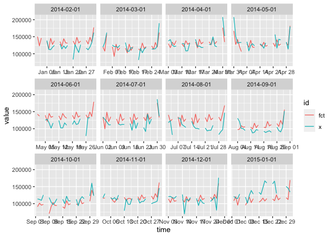
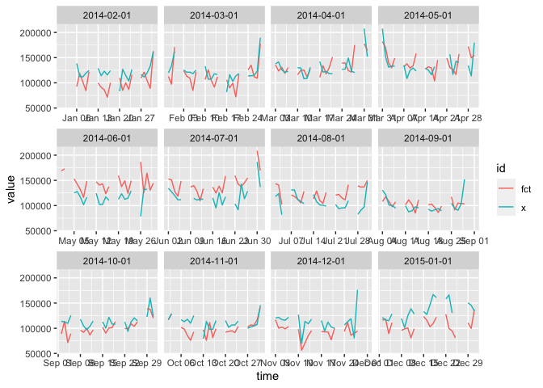
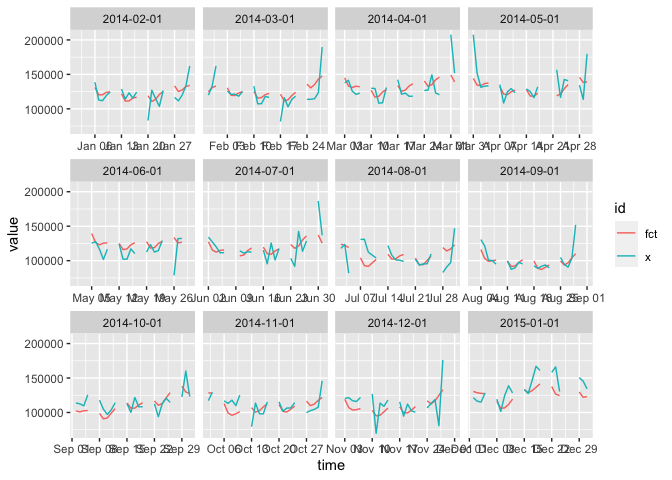
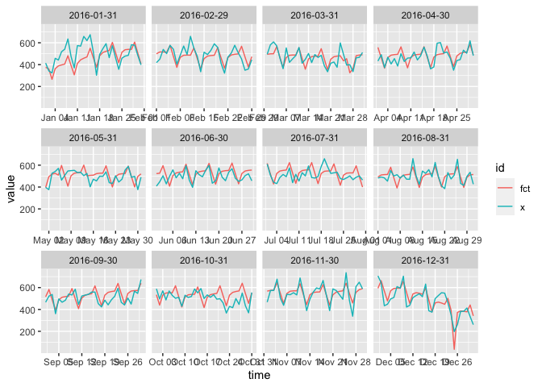
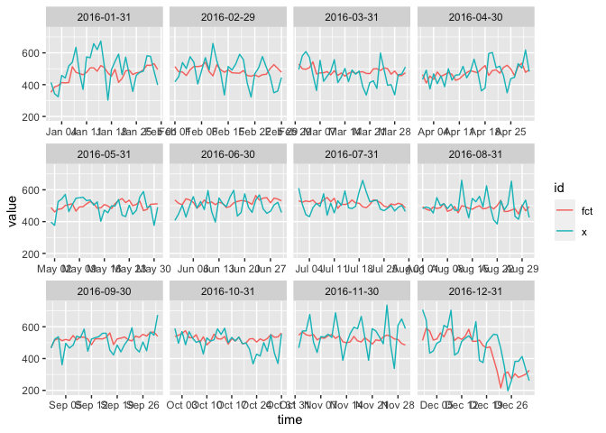
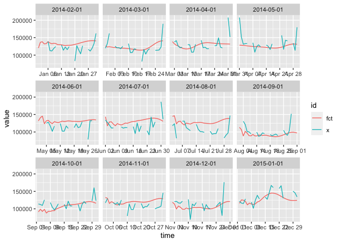
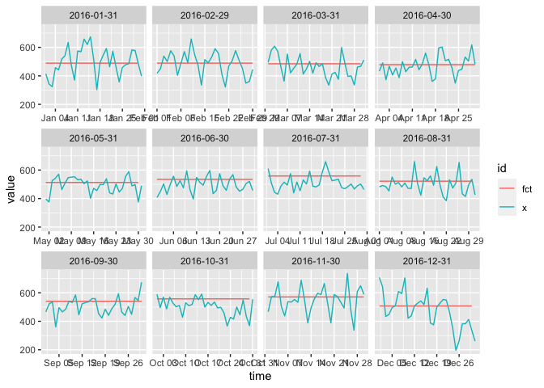

oos\_evals.R
================
christoph
2020-05-17

# 12 Month OOS

``` r
opts_chunk$set(cache=TRUE)

library(forecast)
pkgload::load_all(".")
```

    ## Loading dailyadj

``` r
x <- transact
```

## seas\_dummy

``` r
z <- oos_evals(x, seas_dummy)
summary_oos_evals(z)
```

    ## # A tibble: 13 x 4
    ##    end          mrse    mae   mpce
    ##    <chr>       <dbl>  <dbl>  <dbl>
    ##  1 2014-02-01 21009. 16446. 0.147 
    ##  2 2014-03-01 15647. 11903. 0.102 
    ##  3 2014-04-01 14737. 11958. 0.0918
    ##  4 2014-05-01 17696. 14225. 0.102 
    ##  5 2014-06-01 24951. 20237. 0.191 
    ##  6 2014-07-01 19380. 16462. 0.147 
    ##  7 2014-08-01 29840. 26331. 0.265 
    ##  8 2014-09-01 19888. 16615. 0.173 
    ##  9 2014-10-01 17907. 14880. 0.128 
    ## 10 2014-11-01 14950. 11977. 0.116 
    ## 11 2014-12-01 14809. 11911. 0.118 
    ## 12 2015-01-01 30994. 26057. 0.181 
    ## 13 Mean       20151. 16584. 0.147

``` r
plot_oos_evals(z)
```

<!-- -->

## seas\_loess

``` r
z <-  oos_evals(x, seas_loess5)
summary_oos_evals(z)
```

    ## # A tibble: 13 x 4
    ##    end          mrse    mae   mpce
    ##    <chr>       <dbl>  <dbl>  <dbl>
    ##  1 2014-02-01 20752. 17824. 0.148 
    ##  2 2014-03-01 15296. 11074. 0.0955
    ##  3 2014-04-01 18965. 13803. 0.103 
    ##  4 2014-05-01 18125. 14977. 0.108 
    ##  5 2014-06-01 22941. 18935. 0.176 
    ##  6 2014-07-01 18679. 14585. 0.131 
    ##  7 2014-08-01 23652. 17655. 0.181 
    ##  8 2014-09-01 16881. 11180. 0.105 
    ##  9 2014-10-01 16472. 14749. 0.126 
    ## 10 2014-11-01 11167.  9004. 0.0848
    ## 11 2014-12-01 24248. 19661. 0.167 
    ## 12 2015-01-01 31743. 24606. 0.168 
    ## 13 Mean       19910. 15671. 0.133

``` r
plot_oos_evals(z)
```

    ## Warning: Removed 4 row(s) containing missing values (geom_path).

<!-- -->

## seas\_dsa

``` r
z <-  oos_evals(x, seas_dsa)
```

    ##   |                                                                              |                                                                      |   0%  |                                                                              |===                                                                   |   5%  |                                                                              |=======                                                               |  10%  |                                                                              |====================                                                  |  29%  |                                                                              |===========================                                           |  38%  |                                                                              |===============================================                       |  67%  |                                                                              |==================================================                    |  71%  |                                                                              |=====================================================                 |  76%  |                                                                              |===============================================================       |  90%  |                                                                              |======================================================================| 100%
    ##   |                                                                              |                                                                      |   0%  |                                                                              |===                                                                   |   5%  |                                                                              |=======                                                               |  10%  |                                                                              |====================                                                  |  29%  |                                                                              |===========================                                           |  38%  |                                                                              |===============================================                       |  67%  |                                                                              |==================================================                    |  71%  |                                                                              |=====================================================                 |  76%  |                                                                              |===============================================================       |  90%  |                                                                              |======================================================================| 100%
    ##   |                                                                              |                                                                      |   0%  |                                                                              |===                                                                   |   5%  |                                                                              |=======                                                               |  10%  |                                                                              |====================                                                  |  29%  |                                                                              |===========================                                           |  38%  |                                                                              |===============================================                       |  67%  |                                                                              |==================================================                    |  71%  |                                                                              |=====================================================                 |  76%  |                                                                              |===============================================================       |  90%  |                                                                              |======================================================================| 100%
    ##   |                                                                              |                                                                      |   0%  |                                                                              |===                                                                   |   5%  |                                                                              |=======                                                               |  10%  |                                                                              |====================                                                  |  29%  |                                                                              |===========================                                           |  38%  |                                                                              |===============================================                       |  67%  |                                                                              |==================================================                    |  71%  |                                                                              |=====================================================                 |  76%  |                                                                              |===============================================================       |  90%  |                                                                              |======================================================================| 100%
    ##   |                                                                              |                                                                      |   0%  |                                                                              |===                                                                   |   5%  |                                                                              |=======                                                               |  10%  |                                                                              |====================                                                  |  29%  |                                                                              |===========================                                           |  38%  |                                                                              |===============================================                       |  67%  |                                                                              |==================================================                    |  71%  |                                                                              |=====================================================                 |  76%  |                                                                              |===============================================================       |  90%  |                                                                              |======================================================================| 100%
    ##   |                                                                              |                                                                      |   0%  |                                                                              |===                                                                   |   5%  |                                                                              |=======                                                               |  10%  |                                                                              |====================                                                  |  29%  |                                                                              |===========================                                           |  38%  |                                                                              |===============================================                       |  67%  |                                                                              |==================================================                    |  71%  |                                                                              |=====================================================                 |  76%  |                                                                              |===============================================================       |  90%  |                                                                              |======================================================================| 100%
    ##   |                                                                              |                                                                      |   0%  |                                                                              |===                                                                   |   5%  |                                                                              |=======                                                               |  10%  |                                                                              |====================                                                  |  29%  |                                                                              |===========================                                           |  38%  |                                                                              |===============================================                       |  67%  |                                                                              |==================================================                    |  71%  |                                                                              |=====================================================                 |  76%  |                                                                              |===============================================================       |  90%  |                                                                              |======================================================================| 100%
    ##   |                                                                              |                                                                      |   0%  |                                                                              |===                                                                   |   5%  |                                                                              |=======                                                               |  10%  |                                                                              |====================                                                  |  29%  |                                                                              |===========================                                           |  38%  |                                                                              |===============================================                       |  67%  |                                                                              |==================================================                    |  71%  |                                                                              |=====================================================                 |  76%  |                                                                              |===============================================================       |  90%  |                                                                              |======================================================================| 100%
    ##   |                                                                              |                                                                      |   0%  |                                                                              |===                                                                   |   5%  |                                                                              |=======                                                               |  10%  |                                                                              |====================                                                  |  29%  |                                                                              |===========================                                           |  38%  |                                                                              |===============================================                       |  67%  |                                                                              |==================================================                    |  71%  |                                                                              |=====================================================                 |  76%  |                                                                              |===============================================================       |  90%  |                                                                              |======================================================================| 100%
    ##   |                                                                              |                                                                      |   0%  |                                                                              |===                                                                   |   5%  |                                                                              |=======                                                               |  10%  |                                                                              |====================                                                  |  29%  |                                                                              |===========================                                           |  38%  |                                                                              |===============================================                       |  67%  |                                                                              |==================================================                    |  71%

    ## Warning in grep(stats::start(x_ts), a):grep(stats::end(x_ts), a): numerical
    ## expression has 2 elements: only the first used

    ##   |                                                                              |=====================================================                 |  76%  |                                                                              |===============================================================       |  90%  |                                                                              |======================================================================| 100%
    ##   |                                                                              |                                                                      |   0%  |                                                                              |===                                                                   |   5%  |                                                                              |=======                                                               |  10%  |                                                                              |====================                                                  |  29%  |                                                                              |===========================                                           |  38%  |                                                                              |===============================================                       |  67%  |                                                                              |==================================================                    |  71%  |                                                                              |=====================================================                 |  76%  |                                                                              |===============================================================       |  90%  |                                                                              |======================================================================| 100%
    ##   |                                                                              |                                                                      |   0%  |                                                                              |===                                                                   |   5%  |                                                                              |=======                                                               |  10%  |                                                                              |====================                                                  |  29%  |                                                                              |===========================                                           |  38%  |                                                                              |===============================================                       |  67%  |                                                                              |==================================================                    |  71%  |                                                                              |=====================================================                 |  76%  |                                                                              |===============================================================       |  90%  |                                                                              |======================================================================| 100%

``` r
summary_oos_evals(z)
```

    ## # A tibble: 13 x 4
    ##    end          mrse    mae   mpce
    ##    <chr>       <dbl>  <dbl>  <dbl>
    ##  1 2014-02-01 14697. 10758. 0.0910
    ##  2 2014-03-01 16487. 11706. 0.0980
    ##  3 2014-04-01 17319. 12986. 0.0952
    ##  4 2014-05-01 20440. 13169. 0.0871
    ##  5 2014-06-01 19665. 13774. 0.124 
    ##  6 2014-07-01 16107. 12000. 0.0982
    ##  7 2014-08-01 18250. 13381. 0.129 
    ##  8 2014-09-01 12740.  7469. 0.0695
    ##  9 2014-10-01 12667. 10092. 0.0861
    ## 10 2014-11-01 13043. 10417. 0.0959
    ## 11 2014-12-01 18228. 13954. 0.129 
    ## 12 2015-01-01 17639. 14222. 0.0995
    ## 13 Mean       16440. 11994. 0.100

``` r
plot_oos_evals(z)
```

    ## Warning: Removed 4 row(s) containing missing values (geom_path).

<!-- -->

## seas\_prophet

``` r
z <- oos_evals(x, seas_prophet)
```

    ## Loading required package: Rcpp

    ## Loading required package: rlang

    ## 
    ## Attaching package: 'rlang'

    ## The following objects are masked from 'package:purrr':
    ## 
    ##     %@%, as_function, flatten, flatten_chr, flatten_dbl, flatten_int,
    ##     flatten_lgl, flatten_raw, invoke, list_along, modify, prepend,
    ##     splice

``` r
summary_oos_evals(z)
```

    ## # A tibble: 13 x 4
    ##    end          mrse    mae   mpce
    ##    <chr>       <dbl>  <dbl>  <dbl>
    ##  1 2014-02-01 17340. 12632. 0.105 
    ##  2 2014-03-01 21261. 14732. 0.123 
    ##  3 2014-04-01 21189. 15451. 0.117 
    ##  4 2014-05-01 22074. 15703. 0.111 
    ##  5 2014-06-01 23838. 18158. 0.161 
    ##  6 2014-07-01 19220. 14427. 0.120 
    ##  7 2014-08-01 17457. 13617. 0.131 
    ##  8 2014-09-01 17677. 13889. 0.132 
    ##  9 2014-10-01 15356. 10557. 0.0894
    ## 10 2014-11-01 13334.  9659. 0.0897
    ## 11 2014-12-01 18636. 11929. 0.105 
    ## 12 2015-01-01 21599. 16452. 0.113 
    ## 13 Mean       19082. 13934. 0.117

``` r
plot_oos_evals(z)
```

<!-- -->

## seas\_stlf

``` r
z <- oos_evals(x, seas_stlf)
summary_oos_evals(z)
```

    ## # A tibble: 13 x 4
    ##    end          mrse    mae   mpce
    ##    <chr>       <dbl>  <dbl>  <dbl>
    ##  1 2014-02-01 21839. 18096. 0.155 
    ##  2 2014-03-01 24409. 18226. 0.146 
    ##  3 2014-04-01 20474. 14198. 0.101 
    ##  4 2014-05-01 24628. 18216. 0.127 
    ##  5 2014-06-01 18741. 12379. 0.107 
    ##  6 2014-07-01 19870. 12885. 0.106 
    ##  7 2014-08-01 20321. 16367. 0.159 
    ##  8 2014-09-01 13004.  9023. 0.0831
    ##  9 2014-10-01 16021. 11930. 0.101 
    ## 10 2014-11-01 20076. 16355. 0.142 
    ## 11 2014-12-01 18881. 14581. 0.137 
    ## 12 2015-01-01 20744. 15450. 0.105 
    ## 13 Mean       19917. 14809. 0.122

``` r
plot_oos_evals(z)
```

<!-- -->

## seas\_harmon

``` r
z <- oos_evals(x, seas_harmon)
```

    ## ............

``` r
summary_oos_evals(z)
```

    ## # A tibble: 13 x 4
    ##    end          mrse    mae   mpce
    ##    <chr>       <dbl>  <dbl>  <dbl>
    ##  1 2014-02-01 19876. 16292. 0.144 
    ##  2 2014-03-01 18071. 12745. 0.104 
    ##  3 2014-04-01 19795. 13399. 0.0950
    ##  4 2014-05-01 23784. 15164. 0.0990
    ##  5 2014-06-01 21848. 16629. 0.151 
    ##  6 2014-07-01 22723. 18188. 0.159 
    ##  7 2014-08-01 27684. 24665. 0.250 
    ##  8 2014-09-01 16775. 10712. 0.0952
    ##  9 2014-10-01 15364. 11435. 0.0971
    ## 10 2014-11-01 17316. 13985. 0.136 
    ## 11 2014-12-01 19859. 14348. 0.129 
    ## 12 2015-01-01 14916. 12595. 0.0896
    ## 13 Mean       19834. 15013. 0.129

``` r
plot_oos_evals(z)
```

<!-- -->

## seas\_naive

``` r
z <- oos_evals(x, seas_naive)
summary_oos_evals(z)
```

    ## # A tibble: 13 x 4
    ##    end          mrse    mae  mpce
    ##    <chr>       <dbl>  <dbl> <dbl>
    ##  1 2014-02-01 22523. 19629. 0.172
    ##  2 2014-03-01 22405. 14092. 0.107
    ##  3 2014-04-01 61855. 60153. 0.480
    ##  4 2014-05-01 27347. 18502. 0.120
    ##  5 2014-06-01 63163. 60423. 0.542
    ##  6 2014-07-01 66458. 63832. 0.567
    ##  7 2014-08-01 33800. 30730. 0.312
    ##  8 2014-09-01 49422. 47291. 0.500
    ##  9 2014-10-01 34686. 32173. 0.274
    ## 10 2014-11-01 17790. 15097. 0.146
    ## 11 2014-12-01 38139. 35571. 0.345
    ## 12 2015-01-01 22746. 17617. 0.121
    ## 13 Mean       38361. 34592. 0.307

``` r
plot_oos_evals(z)
```

<!-- -->
