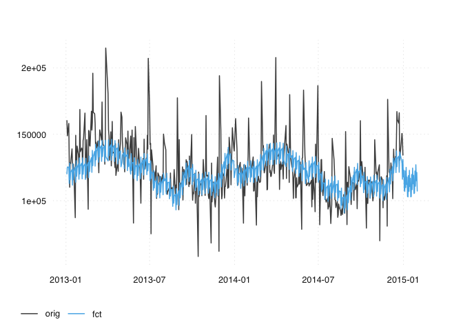
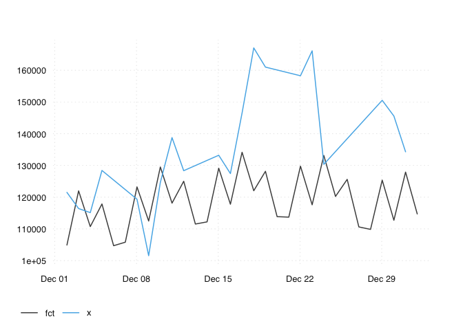
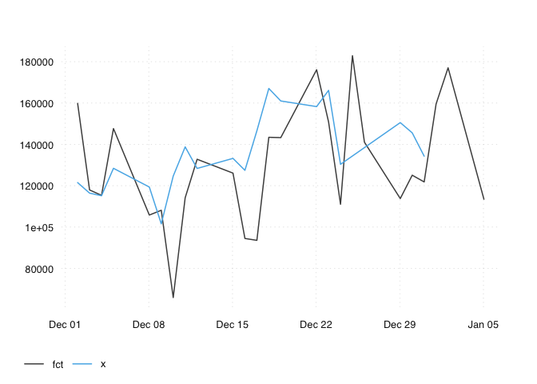
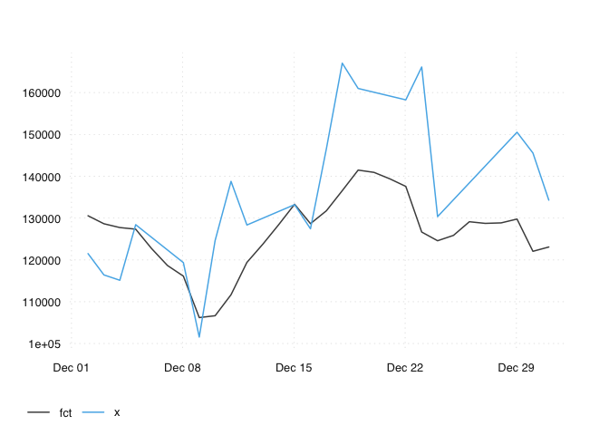

prophet.R
================
christoph
2020-04-19

``` r
pkgload::load_all(".")
```

    ## Loading dailyadj

## Basics or prophet

``` r
# basic example
out_pr <- seas_prophet(transact)

# we don't get the end of month effects
out_pr %>%
  ts_pick("orig", "fct") %>%
  ts_span(2013) %>%
  ts_plot()
```

<!-- -->

## Basic OSS

``` r
x <- transact

z <- seas_prophet(transact)

seas_fun <- seas_prophet
ans <- oos_eval(x, seas_fun)

ts_plot(ans)
oos_summary(ans)
```

    ## # A tibble: 1 x 3
    ##      mae   mrse  mpce
    ##    <dbl>  <dbl> <dbl>
    ## 1 16452. 21599. 0.113

``` r
ans_prophet <- oos_eval(x, seas_prophet)
ts_plot(ans_prophet)
```

<!-- -->

``` r
oos_summary(ans_prophet)
```

    ## # A tibble: 1 x 3
    ##      mae   mrse  mpce
    ##    <dbl>  <dbl> <dbl>
    ## 1 16452. 21599. 0.113

fixed seasonality’ does not work well. Applys some pattern that is not
really there but misses that pattern that is present.

``` r
ans_loess <- oos_eval(x, seas_loess)
ts_plot(ans_loess)
```

<!-- -->

``` r
oos_summary(ans_loess)
```

    ## # A tibble: 1 x 3
    ##      mae   mrse  mpce
    ##    <dbl>  <dbl> <dbl>
    ## 1 21192. 26283. 0.155

Too much noise, probably because of the way ‘yearly effects’ are
calculated for each days. But it seems we get the december
    pattern.

``` r
ans_dsa <- oos_eval(x, seas_dsa)
```

    ##   |                                                                              |                                                                      |   0%  |                                                                              |===                                                                   |   5%  |                                                                              |=======                                                               |  10%  |                                                                              |====================                                                  |  29%  |                                                                              |===========================                                           |  38%  |                                                                              |===============================================                       |  67%  |                                                                              |==================================================                    |  71%  |                                                                              |=====================================================                 |  76%  |                                                                              |===============================================================       |  90%  |                                                                              |======================================================================| 100%

``` r
ts_plot(ans_dsa)
```

<!-- -->

``` r
oos_summary(ans_dsa)
```

    ## # A tibble: 1 x 3
    ##      mae   mrse   mpce
    ##    <dbl>  <dbl>  <dbl>
    ## 1 14222. 17639. 0.0995

Best: gets the december pattern, and does not introduce additional
noise.
