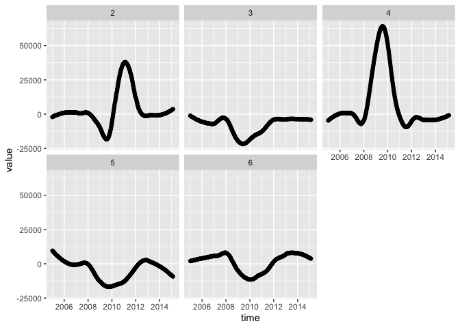
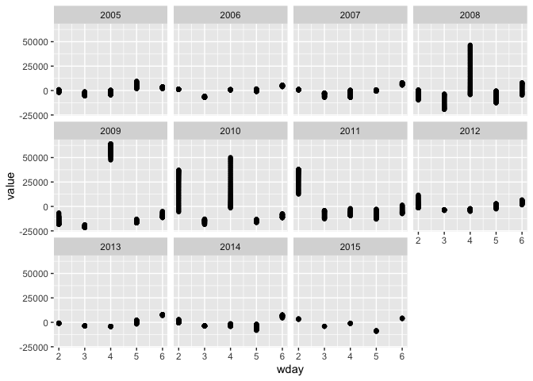
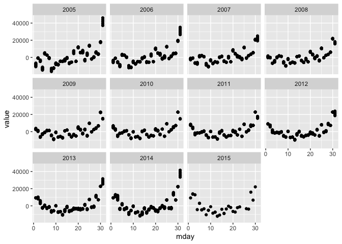
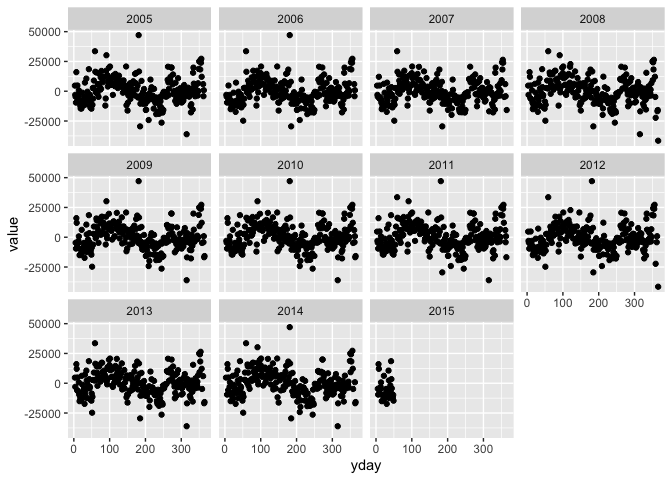
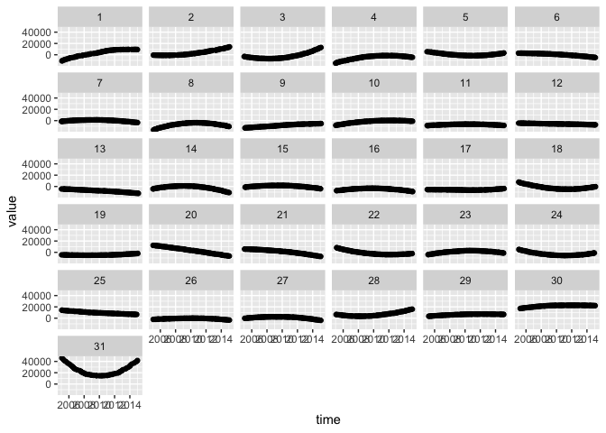

seas\_comp.R
================
christoph
2020-04-29

# Components of seasonal adjustment

``` r
opts_chunk$set(cache=TRUE)

library(forecast)
```

    ## Registered S3 method overwritten by 'quantmod':
    ##   method            from
    ##   as.zoo.data.frame zoo

    ## This is forecast 8.12 
    ##   Crossvalidated is a great place to get help on forecasting issues:
    ##   http://stats.stackexchange.com/tags/forecasting.

``` r
pkgload::load_all(".")
```

    ## Loading dailyadj

    ## Loading required package: tsbox

``` r
x <- transact

z_loess <- seas_loess(x)
comp_plot_draft(z_loess)
```

    ## $w_time

<!-- -->

    ## 
    ## $w_pattern

<!-- -->

    ## 
    ## $m_time

<!-- -->

    ## 
    ## $m_pattern

<!-- -->

    ## 
    ## $y_pattern

    ## Warning: Removed 2 rows containing missing values (geom_point).

<!-- -->

``` r
z_dsa <- seas_dsa(x)
```

    ##   |                                                                              |                                                                      |   0%  |                                                                              |===                                                                   |   5%  |                                                                              |=======                                                               |  10%  |                                                                              |====================                                                  |  29%  |                                                                              |===========================                                           |  38%  |                                                                              |===============================================                       |  67%  |                                                                              |==================================================                    |  71%  |                                                                              |=====================================================                 |  76%  |                                                                              |===============================================================       |  90%  |                                                                              |======================================================================| 100%

``` r
comp_plot_draft(z_loess)
```

    ## $w_time

<!-- -->

    ## 
    ## $w_pattern

<!-- -->

    ## 
    ## $m_time

<!-- -->

    ## 
    ## $m_pattern

<!-- -->

    ## 
    ## $y_pattern

    ## Warning: Removed 2 rows containing missing values (geom_point).

<!-- -->
