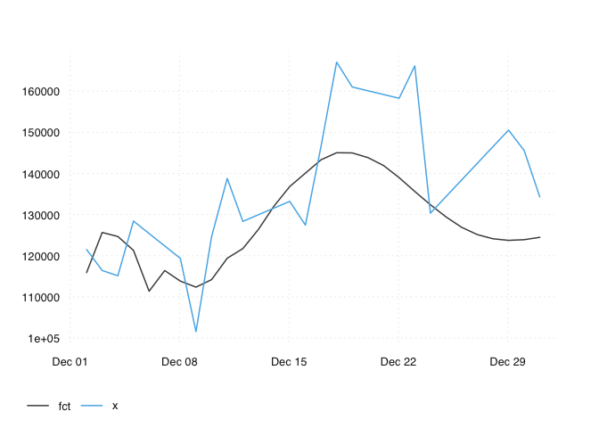
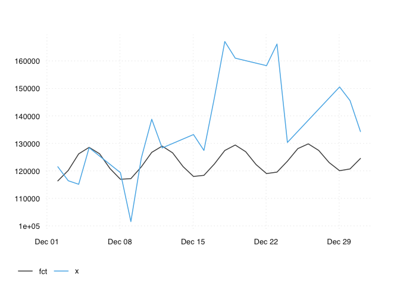
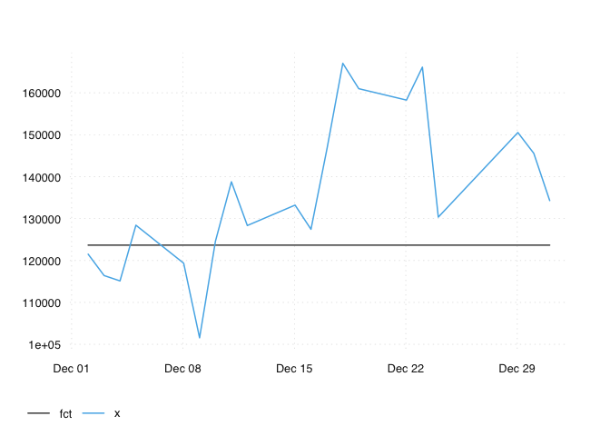
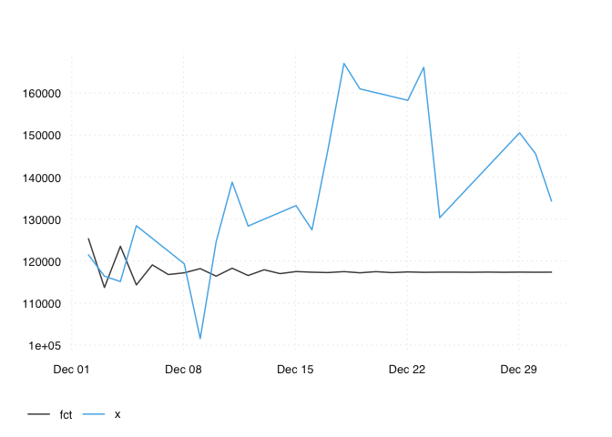

tbats.R
================
christoph
2020-04-19

``` r
# tbats ------------------------------------------------------------------------


library(forecast)
```

    ## Registered S3 method overwritten by 'quantmod':
    ##   method            from
    ##   as.zoo.data.frame zoo

``` r
pkgload::load_all(".")
```

    ## Loading dailyadj

    ## Loading required package: tidyverse

    ## ── Attaching packages ─────────────────────────────────────── tidyverse 1.3.0 ──

    ## ✔ ggplot2 3.3.0          ✔ purrr   0.3.3     
    ## ✔ tibble  3.0.0          ✔ dplyr   0.8.5     
    ## ✔ tidyr   1.0.2          ✔ stringr 1.4.0     
    ## ✔ readr   1.3.1.9000     ✔ forcats 0.5.0

    ## ── Conflicts ────────────────────────────────────────── tidyverse_conflicts() ──
    ## ✖ dplyr::filter() masks stats::filter()
    ## ✖ dplyr::lag()    masks stats::lag()

    ## Loading required package: tsbox

``` r
x <- transact

# stlf -------------------------------------------------------------------------

# not bad
ans_stlf <- oos_eval(x, seas_stlf)
ts_plot(ans_stlf)
```

<!-- -->

``` r
oos_summary(ans_stlf)
```

    ## # A tibble: 1 x 3
    ##      mae   mrse  mpce
    ##    <dbl>  <dbl> <dbl>
    ## 1 15450. 20744. 0.105

``` r
# harmon ------------------------------------------------------------------------

# https://otexts.com/fpp2/weekly.html
ans_harmon <- oos_eval(x, seas_harmon)
```

    ## .

``` r
ts_plot(ans_harmon)
```

<!-- -->

``` r
oos_summary(ans_harmon)
```

    ## # A tibble: 1 x 3
    ##      mae   mrse   mpce
    ##    <dbl>  <dbl>  <dbl>
    ## 1 12595. 14916. 0.0896

``` r
# tbats ------------------------------------------------------------------------

# https://otexts.com/fpp2/weekly.html
ans_tbats <- oos_eval(x, seas_tbats)
ts_plot(ans_tbats)
```

<!-- -->

``` r
oos_summary(ans_tbats)
```

    ## # A tibble: 1 x 3
    ##      mae   mrse  mpce
    ##    <dbl>  <dbl> <dbl>
    ## 1 16568. 21712. 0.114

``` r
# ets ------------------------------------------------------------------------

# https://otexts.com/fpp2/weekly.html
ans_ets <- oos_eval(x, seas_ets)
```

    ## Warning in ets(ts_na_interpolation(x_ts)): I can't handle data with frequency
    ## greater than 24. Seasonality will be ignored. Try stlf() if you need seasonal
    ## forecasts.

``` r
ts_plot(ans_ets)
```

<!-- -->

``` r
oos_summary(ans_ets)
```

    ## # A tibble: 1 x 3
    ##      mae   mrse  mpce
    ##    <dbl>  <dbl> <dbl>
    ## 1 16498. 21419. 0.114

``` r
# auto.arima ------------------------------------------------------------------------

# https://otexts.com/fpp2/weekly.html
ans_auto.arima <- oos_eval(x, seas_auto.arima)
ts_plot(ans_auto.arima)
```

<!-- -->

``` r
oos_summary(ans_auto.arima)
```

    ## # A tibble: 1 x 3
    ##      mae   mrse  mpce
    ##    <dbl>  <dbl> <dbl>
    ## 1 20878. 25667. 0.144
