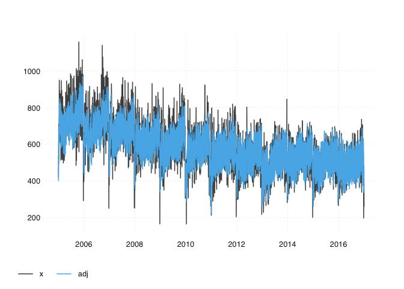
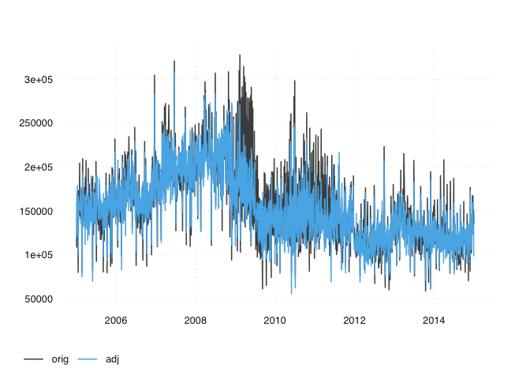
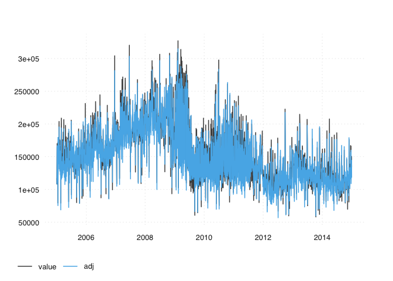
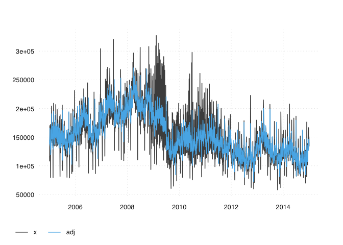
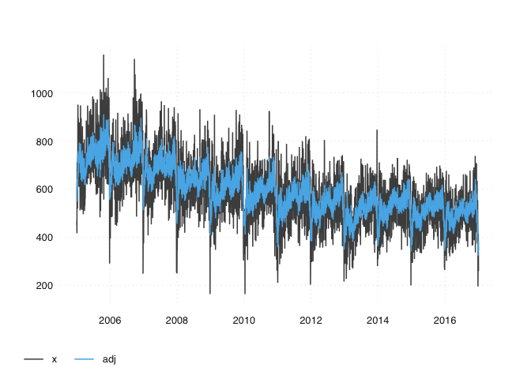

# Seasonal adjustment of daily time series in R: An overview

Automated data processing and the Internet have brought an enormous
increase in data that is processed on a high frequency, e.g., at a
daily, hourly or even higher frequency. While some higher frequency
series have been used in the past (e.g., Fisher 1923, cited by Ladiray
2018) these series are much more abundant now. X-13ARIMA-SEATS offers a
well tested and time proven way of adjusting monthly, quarterly (or
bi-annual) series, but it cannot deal with data at a higher frequency.

This \[article/chaper/post\] discusses how to perform seasonal
adjustment on a higher frequency. We focus on daily data, as this is the
most common use case, but will briefly discuss some challenges involving
weekly or intra-day adjustments.

Despite the large interest, there is not much consensus on the
appropriate adjustment method for daily series. Adjusting daily series
often involves a substantial amount of trial and error, subjective
judgment and exploration. This \[article/chapter/post\] gives an
overview of the tools that are currently (2020) available in R.

## Problems

Daily seasonal adjustment comes with a few challenges that are not
present in lower frequency data. Let’s focus on daily ice-cream sales.

First, daily data comes at multiple periodicities: There is an annual
periodicity, such as the effect of the temperature in the summer. Then
there is a weekly periodicity. Ice-cream sales may be higher during the
weekends. For some series, there may be also a monthly periodicity. If
people are get their salaries by the end of the month, they may be more
likely to perform certain investments.

Second, many daily data series are available for a few years only.
Whily, e.g., the SEATS adjustment requires a minimal series length of XX
years, many daily series are shorter.

Third, higher frequency series are generally more volatile and prone to
outliers.

Fourth, the effect of individual holiday is challenging to estimate.
Often, economic effects of holidays may occur before or after a holiday,
thus lagging or leading them is crucial.

## Parametric versus Non-parametric Models

Various attempts to seasonly adjust data can be broadly distinguished
into parametric and non-parametric approaches. Non-parametric approaches
seem to be the more obvious candidates to use with the irregular
structure of daily data. Parametric models require the time units to be
regularly spaced. Non-parametric estimation is also what is used in the
X-11 method of X-13.

## R Packages

As mentioned before, there is no accepted consensus on how to perform
daily seasonal adjustment. In the following, we discuss various
possibilities to adjust series in R. We focus on a single time series,
and describe the concrete steps that are required to perform an
adjustment.

``` r
library(dailyadj)
library(tsbox)

x <- transact
```

### ARIMA + Month, Weekday / Holiday Dummies

Let’s start with a simple model.

Perhaps because of their simplicity, these kind of adjustments are
frequently found in the literature. E.g., timmermans 18, lengwiler,
(forthcoming, ask Ronald)

\[The following code is not correct, needs a bit of work\]

``` r
dums <-
  x %>%
  mutate(wday = lubridate::wday(time)) %>%
  mutate(month = lubridate::month(time)) %>%
  select(time, wday, month) %>%
  fastDummies::dummy_cols("wday", remove_first_dummy = TRUE, remove_selected_columns = TRUE) %>%
  fastDummies::dummy_cols("month", remove_first_dummy = TRUE, remove_selected_columns = TRUE)

dums
```

    ## # A tibble: 2,524 x 16
    ##    time       wday_3 wday_4 wday_5 wday_6 month_10 month_11 month_12 month_2
    ##    <date>      <int>  <int>  <int>  <int>    <int>    <int>    <int>   <int>
    ##  1 2005-01-03      0      0      0      0        0        0        0       0
    ##  2 2005-01-04      1      0      0      0        0        0        0       0
    ##  3 2005-01-05      0      1      0      0        0        0        0       0
    ##  4 2005-01-06      0      0      1      0        0        0        0       0
    ##  5 2005-01-07      0      0      0      1        0        0        0       0
    ##  6 2005-01-10      0      0      0      0        0        0        0       0
    ##  7 2005-01-11      1      0      0      0        0        0        0       0
    ##  8 2005-01-12      0      1      0      0        0        0        0       0
    ##  9 2005-01-13      0      0      1      0        0        0        0       0
    ## 10 2005-01-14      0      0      0      1        0        0        0       0
    ## # … with 2,514 more rows, and 7 more variables: month_3 <int>, month_4 <int>,
    ## #   month_5 <int>, month_6 <int>, month_7 <int>, month_8 <int>, month_9 <int>

``` r
# ARMA
fit <- auto.arima(x$value, stationary = TRUE, seasonal = FALSE, xreg = as.matrix(dums[, -1]))

z <- x
z$seas <- forecast(fit, xreg = as.matrix(dums[, -1]))$mean

z %>%
  mutate(adj = value - seas) %>%
  select(time, adj, value) %>%
  ts_long() %>%
  ts_plot()
```

<!-- -->

### STL

This package contains a simple implementation of STL

``` r
seas_daily(x) %>%
  ts_pick("orig", "adj") %>%
  ts_plot()
```

<!-- -->

### dsa

``` r
library(dsa)

z <- dsa::dsa(ts_xts(x))
```

    ##   |                                                                              |                                                                      |   0%  |                                                                              |===                                                                   |   5%  |                                                                              |=======                                                               |  10%  |                                                                              |====================                                                  |  29%  |                                                                              |===========================                                           |  38%  |                                                                              |===============================================                       |  67%  |                                                                              |==================================================                    |  71%  |                                                                              |=====================================================                 |  76%  |                                                                              |===============================================================       |  90%  |                                                                              |======================================================================| 100%

``` r
z
```

    ## $output
    ##             seas_adj  original        sc_fac    trend
    ## 2005-01-03 101367.89 116867.59  15498.555509 137913.4
    ## 2005-01-04 116614.20 108184.31  -8431.036001 138856.5
    ## 2005-01-05 142587.58 138179.75  -4408.978016 139768.9
    ## 2005-01-06 149821.15 162258.39  12436.084716 140650.3
    ## 2005-01-07 153058.59 170081.63  17021.889863 141500.2
    ## 2005-01-08 160428.10 170081.63   9652.379654 142318.5
    ## 2005-01-09 172003.34 170081.63  -1922.856699 143104.6
    ## 2005-01-10 163175.09 169967.09   6790.843255 143858.3
    ## 2005-01-11 137819.21 119403.83 -18416.531069 144579.2
    ## 2005-01-12 154211.18 140993.37 -13218.958699 145267.0
    ## 2005-01-13 149912.45 148277.18  -1636.416155 145921.4
    ## 2005-01-14 146347.34 149550.34   3201.854533 146541.9
    ## 2005-01-15 141913.79 149550.34   7635.405500 147128.2
    ## 2005-01-16 148597.40 149550.34    951.788479 147680.1
    ## 2005-01-17  69800.03  79453.26   9652.080840 148197.0
    ## 2005-01-18 185075.92 172276.51 -12800.563090 148678.8
    ## 2005-01-19 139473.31 122789.64 -16684.824594 149122.6
    ## 2005-01-20 146606.13 146194.25   -413.033029 149527.1
    ## 2005-01-21 150436.07 148874.14  -1563.073719 149894.5
    ## 2005-01-22 143140.90 148874.14   5732.094702 150227.0
    ## 2005-01-23 153825.10 148874.14  -4952.106408 150526.7
    ## 2005-01-24 154800.04 162914.15   8112.960518 150795.8
    ## 2005-01-25 166950.95 164587.27  -2364.829337 151036.3
    ## 2005-01-26 161562.15 150731.58 -10831.718769 151250.6
    ## 2005-01-27 155886.99 165939.09  10050.949958 151440.6
    ## 2005-01-28 161603.42 160428.84  -1175.725986 151608.6
    ## 2005-01-29 158153.63 160428.84   2274.063249 151756.6
    ## 2005-01-30 140882.51 160428.84  19545.183819 151887.0
    ## 2005-01-31 151137.72 203982.30  52843.428241 152001.7
    ## 2005-02-01 155046.52 147273.69  -7773.980486 152102.9
    ## 2005-02-02 162416.80 144033.82 -18384.121224 152192.9
    ## 2005-02-03 155067.98 152045.43  -3023.701614 152273.6
    ## 2005-02-04 149713.74 146017.15  -3697.733166 152308.0
    ## 2005-02-05 143764.95 146017.15   2251.057166 152263.3
    ## 2005-02-06 148288.91 146017.15  -2272.907703 152148.7
    ## 2005-02-07 167707.82 175834.95   8125.987802 151973.3
    ## 2005-02-08 157359.72 144516.94 -12843.936797 151746.2
    ## 2005-02-09 152821.47 140298.39 -12524.234753 151476.6
    ## 2005-02-10 158325.74 157770.60   -556.288459 151173.6
    ## 2005-02-11 168784.58 161742.81  -7042.921663 150846.3
    ## 2005-02-12 162550.00 161742.81   -808.341703 150503.8
    ## 2005-02-13 161958.53 161742.81   -216.868527 150155.2
    ## 2005-02-14 153609.70 165225.03  11614.181340 149809.8
    ## 2005-02-15 145784.71 143777.59  -2008.268144 149476.5
    ## 2005-02-16 141651.42 134875.74  -6776.834768 149164.5
    ## 2005-02-17 141953.23 148188.07   6233.688029 148883.0
    ## 2005-02-18 166590.28 165935.85   -655.576815 148641.0
    ## 2005-02-19 167388.39 165935.85  -1453.694351 148447.7
    ## 2005-02-20 159191.74 165935.85   6742.956060 148270.8
    ## 2005-02-21  62281.22  79259.76  16977.390485 148074.7
    ## 2005-02-22 172153.61 174330.50   2175.739888 147864.0
    ## 2005-02-23 146725.67 138096.66  -8630.155550 147643.5
    ## 2005-02-24 167536.25 173271.33   5733.926883 147417.5
    ## 2005-02-25 161523.97 174737.44  13212.318084 147190.8
    ## 2005-02-26 171187.14 174737.44   3549.148478 146968.0
    ## 2005-02-27 168037.16 174737.44   6699.130689 146753.5
    ## 2005-02-28 141460.24 209027.70  67566.305244 146552.0
    ## 2005-03-01 112529.24 136579.15  24048.764246 146368.1
    ## 2005-03-02 138581.93 136285.38  -2297.702216 146206.4
    ## 2005-03-03 138387.18 151983.18  13594.848722 146071.4
    ## 2005-03-04 118702.93 136601.71  17897.623486 145967.7
    ## 2005-03-05 120254.22 136601.71  16346.334717 145900.0
    ## 2005-03-06 124889.86 136601.71  11710.695842 145872.8
    ## 2005-03-07 132577.28 149465.04  16886.603994 145914.4
    ## 2005-03-08 140285.90 134528.47  -5758.580552 146041.5
    ## 2005-03-09 148105.82 142686.90  -5420.072635 146241.7
    ## 2005-03-10 147395.76 154701.84   7304.931058 146502.3
    ## 2005-03-11 138573.94 143884.83   5309.733549 146810.8
    ## 2005-03-12 142262.40 143884.83   1621.278631 147154.6
    ## 2005-03-13 140972.56 143884.83   2911.116337 147521.2
    ## 2005-03-14 135979.32 143547.93   7567.462343 147898.0
    ## 2005-03-15 150108.88 153905.82   3795.792044 148272.5
    ## 2005-03-16 175341.07 176006.90    664.680697 148632.0
    ## 2005-03-17 145878.41 155745.34   9865.776532 148964.1
    ## 2005-03-18 152447.74 157715.58   5266.685561 149256.2
    ## 2005-03-19 156095.21 157715.58   1619.218666 149495.6
    ## 2005-03-20 146770.37 157715.58  10944.054825 149670.0
    ## 2005-03-21 129189.98 150014.22  20823.091957 149766.6
    ## 2005-03-22 128571.50 135208.36   6635.720763 149773.0
    ## 2005-03-23 168251.70 181251.08  12998.225225 149713.8
    ## 2005-03-24 168228.33 187686.06  19456.583144 149624.1
    ## 2005-03-25 168533.27 187686.06  19151.638059 149506.6
    ## 2005-03-26 179984.50 187686.06   7700.408523 149363.9
    ## 2005-03-27 181028.70 187686.06   6656.209746 149198.8
    ## 2005-03-28 186564.87 187686.06   1120.045414 149014.1
    ## 2005-03-29 194378.23 176544.27 -17835.106457 148812.4
    ## 2005-03-30 144801.93 155812.35  11009.276034 148596.5
    ## 2005-03-31 141607.31 206798.70  65190.241064 148369.1
    ## 2005-04-01 131474.33 156076.41  24600.926762 148132.8
    ## 2005-04-02 145796.97 156076.41  10278.294091 147890.5
    ## 2005-04-03 148081.37 156076.41   7993.889756 147644.9
    ## 2005-04-04 149429.13 166539.28  17109.002854 147398.6
    ## 2005-04-05 151109.14 153690.76   2580.474919 147154.4
    ## 2005-04-06 144282.58 145304.67   1020.936356 146915.0
    ## 2005-04-07 137760.20 151247.26  13485.917520 146683.1
    ## 2005-04-08 128724.77 140126.22  11400.298926 146405.3
    ## 2005-04-09 132408.56 140126.22   7716.512633 146035.9
    ## 2005-04-10 132652.94 140126.22   7472.130280 145589.0
    ## 2005-04-11 137146.80 161003.93  23855.982385 145078.8
    ## 2005-04-12 144983.00 145648.55    664.403777 144519.5
    ## 2005-04-13 136165.10 134279.52  -1886.730140 143925.4
    ## 2005-04-14 123978.38 144823.37  20843.840832 143310.5
    ## 2005-04-15 121878.87 133459.79  11579.764594 142689.2
    ## 2005-04-16 122598.48 133459.79  10860.155530 142075.5
    ## 2005-04-17 132116.26 133459.79   1342.377196 141483.8
    ## 2005-04-18 138451.64 153196.39  14743.592943 140928.2
    ## 2005-04-19 140935.08 135476.16  -5460.069726 140422.8
    ## 2005-04-20 187999.79 198026.44  10025.507126 139981.9
    ## 2005-04-21 154102.93 175922.48  21818.399770 139619.7
    ## 2005-04-22 135209.32 150178.15  14967.686848 139350.4
    ## 2005-04-23 140277.16 150178.15   9899.841576 139188.1
    ## 2005-04-24 137679.54 150178.15  12497.465873 139146.1
    ## 2005-04-25 148711.13 180009.86  31297.579194 139217.3
    ## 2005-04-26 126729.16 138765.07  12034.761665 139385.7
    ## 2005-04-27 128757.24 135615.10   6856.708994 139635.4
    ## 2005-04-28 139857.02 146735.24   6877.066845 139950.5
    ## 2005-04-29 163424.42 180210.61  16785.038630 140314.8
    ## 2005-04-30 120563.93 180210.61  59645.532458 140712.4
    ## 2005-05-01 135112.26 180210.61  45097.199332 141127.4
    ## 2005-05-02  94994.63 137576.01  42580.231685 141543.7
    ## 2005-05-03 148646.40 141073.04  -7574.509628 141945.5
    ## 2005-05-04 149756.37 149541.44   -216.075104 142316.6
    ## 2005-05-05 136873.85 149541.44  12666.446278 142641.1
    ## 2005-05-06 136927.69 156768.82  19839.982423 142903.0
    ## 2005-05-07 144573.29 156768.82  12194.385799 143086.3
    ## 2005-05-08 153404.83 156768.82   3362.844611 143175.2
    ## 2005-05-09 147166.27 163679.39  16511.978459 143188.6
    ## 2005-05-10 148172.40 151787.62   3614.076449 143160.7
    ## 2005-05-11 158412.98 153722.23  -4691.899183 143098.0
    ## 2005-05-12 148361.48 150983.79   2621.166997 143006.6
    ## 2005-05-13 144140.43 140999.53  -3142.052437 142893.1
    ## 2005-05-14 137074.41 140999.53   3923.973499 142763.7
    ## 2005-05-15 142695.13 140999.53  -1696.754840 142624.8
    ## 2005-05-16 133289.44 140999.53   7708.943911 142482.8
    ## 2005-05-17 192160.45 178784.43 -13377.173012 142344.1
    ## 2005-05-18 168350.09 167335.26  -1015.984979 142214.9
    ## 2005-05-19 155559.47 153496.09  -2064.526821 142101.7
    ## 2005-05-20 152554.33 157821.99   5266.513884 142010.9
    ## 2005-05-21 149210.69 157821.99   8610.152315 141948.7
    ## 2005-05-22 153847.85 157821.99   3972.989014 141921.5
    ## 2005-05-23 131274.17 146244.44  14969.114992 141935.8
    ## 2005-05-24 151488.06 143893.47  -7595.741652 141997.9
    ## 2005-05-25 166883.40 186024.52  19139.965229 142071.9
    ## 2005-05-26 132158.91 152003.90  19843.838862 142121.0
    ## 2005-05-27 116916.46 137935.66  21018.049804 142150.0
    ## 2005-05-28 130007.20 137935.66   7927.306006 142163.6
    ## 2005-05-29 119846.46 137935.66  18088.047400 142166.4
    ## 2005-05-30  41458.02  81375.77  39916.599673 142163.4
    ## 2005-05-31 153640.96 188925.28  35283.173373 142159.1
    ## 2005-06-01 147167.55 139220.33  -7948.366867 142158.3
    ## 2005-06-02 141682.60 141498.61   -185.143048 142165.8
    ## 2005-06-03 146538.44 144629.95  -1909.631718 142186.3
    ## 2005-06-04 144850.77 144629.95   -221.966339 142224.4
    ## 2005-06-05 144206.01 144629.95    422.797486 142285.1
    ## 2005-06-06 128765.37 144384.67  15618.157631 142372.9
    ## 2005-06-07 147304.77 140550.27  -6755.649238 142492.7
    ## 2005-06-08 137575.92 122479.21 -15097.855877 142649.2
    ## 2005-06-09 146850.93 141497.84  -5354.236770 142847.0
    ## 2005-06-10 143932.52 142977.50   -956.166830 143119.2
    ## 2005-06-11 143526.24 142977.50   -549.893670 143487.3
    ## 2005-06-12 147519.73 142977.50  -4543.378880 143938.9
    ## 2005-06-13 143224.60 147827.99   4602.238362 144461.5
    ## 2005-06-14 143573.56 135223.83  -8350.881702 145042.7
    ## 2005-06-15 178295.65 173915.84  -4380.956349 145670.0
    ## 2005-06-16 155768.86 157915.96   2145.947745 146331.0
    ## 2005-06-17 142595.90 142449.96   -147.090435 147013.2
    ## 2005-06-18 134117.18 142449.96   8331.636887 147704.2
    ## 2005-06-19 145609.12 142449.96  -3160.309427 148391.6
    ## 2005-06-20 146243.62 157744.07  11499.300650 149062.8
    ## 2005-06-21 148747.30 138936.24  -9812.200400 149705.5
    ## 2005-06-22 187879.89 180934.09  -6946.939280 150307.2
    ## 2005-06-23 175744.40 175670.02    -75.522003 150855.5
    ## 2005-06-24 154104.49 152247.47  -1858.165709 151337.8
    ## 2005-06-25 142037.63 152247.47  10208.694186 151741.9
    ## 2005-06-26 144707.29 152247.47   7539.037822 152099.3
    ## 2005-06-27 154389.09 167192.05  12801.808931 152449.1
    ## 2005-06-28 153092.42 140523.19 -12570.373247 152790.0
    ## 2005-06-29 160522.86 145211.52 -15312.490327 153120.3
    ## 2005-06-30 140017.84 205839.36  65820.376655 153438.7
    ## 2005-07-01 101089.03 140232.41  39142.231409 153743.8
    ## 2005-07-02 147286.00 140232.41  -7054.745124 154034.0
    ## 2005-07-03 146699.96 140232.41  -6468.700036 154307.9
    ## 2005-07-04 138128.73  91913.72 -46216.160238 154564.0
    ## 2005-07-05 172163.35 181129.55   8965.044604 154800.9
    ## 2005-07-06 164412.94 147832.06 -16582.030018 155017.2
    ## 2005-07-07 166073.26 161326.55  -4747.860675 155211.4
    ## 2005-07-08 153654.05 140537.24 -13117.959828 155382.0
    ## 2005-07-09 155929.12 140537.24 -15393.021596 155527.5
    ## 2005-07-10 153016.72 140537.24 -12480.621113 155646.6
    ## 2005-07-11 182092.79 172157.59  -9936.350709 155739.7
    ## 2005-07-12 165182.25 144423.91 -20759.486720 155809.4
    ## 2005-07-13 164897.75 138666.76 -26232.139774 155857.6
    ## 2005-07-14 160504.45 154000.26  -6505.336896 155886.1
    ## 2005-07-15 155141.14 152351.61  -2790.678431 155896.7
    ## 2005-07-16 161531.74 152351.61  -9181.278883 155891.2
    ## 2005-07-17 161120.19 152351.61  -8769.736923 155871.5
    ## 2005-07-18 154314.69 150028.35  -4287.483206 155839.3
    ## 2005-07-19 155478.21 134118.30 -21361.066812 155796.4
    ## 2005-07-20 162332.61 140665.97 -21667.784541 155744.7
    ## 2005-07-21 149702.70 140779.55  -8924.297893 155686.0
    ## 2005-07-22 147447.22 139474.43  -7973.934775 155622.1
    ## 2005-07-23 146069.09 139474.43  -6595.810271 155554.8
    ## 2005-07-24 147482.25 139474.43  -8008.969090 155485.9
    ## 2005-07-25 154330.51 160796.96   6465.300480 155417.3
    ## 2005-07-26 145139.37 126986.37 -18154.153409 155350.7
    ## 2005-07-27 146590.66 127958.22 -18633.586227 155270.0
    ## 2005-07-28 151507.53 137367.66 -14141.014326 155160.0
    ## 2005-07-29 176339.63 177981.06   1640.282758 155023.6
    ## 2005-07-30 159602.83 177981.06  18377.078166 154863.6
    ## 2005-07-31 147677.86 177981.06  30302.048346 154683.0
    ## 2005-08-01 147390.67 177981.06  30589.242364 154484.8
    ## 2005-08-02 153320.77 156991.25   3669.327080 154271.8
    ## 2005-08-03 164981.38 143801.41 -21181.118907 154047.0
    ## 2005-08-04 154323.67 146394.23  -7930.589114 153813.3
    ## 2005-08-05 148646.60 141569.98  -7077.765772 153573.7
    ## 2005-08-06 149010.31 141569.98  -7441.472360 153331.0
    ## 2005-08-07 153348.57 141569.98 -11779.737238 153088.2
    ## 2005-08-08 154127.29 139979.65 -14148.787755 152848.3
    ## 2005-08-09 152024.51 122565.44 -29460.209457 152614.1
    ## 2005-08-10 150757.96 116895.90 -33863.211178 152388.6
    ## 2005-08-11 141293.64 120535.00 -20759.782768 152149.6
    ## 2005-08-12 158574.79 140502.29 -18073.649582 151877.0
    ## 2005-08-13 156545.97 140502.29 -16044.830051 151576.2
    ## 2005-08-14 154548.87 140502.29 -14047.731713 151252.8
    ## 2005-08-15 155394.48 146474.34  -8921.283829 150912.5
    ## 2005-08-16 151828.89 126874.33 -24955.703632 150560.9
    ## 2005-08-17 147198.43 117156.22 -30043.352934 150203.6
    ## 2005-08-18 158664.60 140413.58 -18252.172687 149846.2
    ## 2005-08-19 151273.18 133164.73 -18109.602593 149494.2
    ## 2005-08-20 147821.71 133164.73 -14658.135227 149153.3
    ## 2005-08-21 148621.33 133164.73 -15457.750421 148829.1
    ## 2005-08-22 152207.48 146819.02  -5389.609230 148527.2
    ## 2005-08-23 146367.22 124754.73 -21613.636343 148253.2
    ## 2005-08-24 145950.78 123126.51 -22825.418852 148012.7
    ## 2005-08-25 155496.99 145274.21 -10223.933433 147811.3
    ## 2005-08-26 152547.67 139162.41 -13386.407075 147654.6
    ## 2005-08-27 153162.36 139162.41 -14001.093288 147517.5
    ## 2005-08-28 154835.91 139162.41 -15674.648146 147373.5
    ## 2005-08-29 147834.68 135051.83 -12783.993711 147225.5
    ## 2005-08-30 153758.26 135644.43 -18114.972912 147076.5
    ## 2005-08-31 134716.81 149746.33  15028.376142 146929.6
    ## 2005-09-01 147817.31 140027.88  -7790.577767 146787.8
    ## 2005-09-02 146349.33 140337.61  -6012.871529 146654.2
    ## 2005-09-03 154362.34 140337.61 -14025.885778 146531.7
    ## 2005-09-04 148299.86 140337.61  -7963.404593 146423.5
    ## 2005-09-05  78854.44  79926.64   1071.052974 146332.5
    ## 2005-09-06 174733.75 154771.54 -19963.349851 146261.8
    ## 2005-09-07 137820.93 118023.95 -19798.127531 146214.5
    ## 2005-09-08 133003.38 123467.34  -9537.188199 146193.5
    ## 2005-09-09 145037.93 130906.38 -14132.697813 146201.9
    ## 2005-09-10 146267.67 130906.38 -15362.431295 146242.8
    ## 2005-09-11 148037.44 130906.38 -17132.207769 146321.0
    ## 2005-09-12 150727.02 143956.89  -6771.269617 146437.3
    ## 2005-09-13 140221.58 115286.10 -24936.621322 146588.2
    ## 2005-09-14 139273.73 116791.88 -22482.996503 146770.5
    ## 2005-09-15 161769.93 157611.78  -4159.297660 146980.6
    ## 2005-09-16 139024.07 130880.50  -8144.722425 147215.3
    ## 2005-09-17 145502.61 130880.50 -14623.262977 147471.2
    ## 2005-09-18 142751.85 130880.50 -11872.500068 147744.9
    ## 2005-09-19 150441.41 145239.14  -5203.420005 148032.9
    ## 2005-09-20 145706.50 132285.97 -13421.684025 148332.1
    ## 2005-09-21 172533.90 163675.04  -8860.008780 148638.9
    ## 2005-09-22 149648.03 151420.60   1771.413581 148950.0
    ## 2005-09-23 149886.74 142648.80  -7239.085034 149262.0
    ## 2005-09-24 149231.84 142648.80  -6584.182391 149571.5
    ## 2005-09-25 144200.07 142648.80  -1552.418219 149875.3
    ## 2005-09-26 145464.66 153974.88   8509.075353 150169.8
    ## 2005-09-27 143693.95 134448.82  -9246.273668 150501.8
    ## 2005-09-28 153427.61 132437.89 -20990.865770 150911.9
    ## 2005-09-29 158085.70 150111.55  -7975.297444 151387.9
    ## 2005-09-30 133591.77 192476.97  58884.046279 151917.5
    ## 2005-10-01 172019.28 192476.97  20456.534684 152488.3
    ## 2005-10-02 198868.97 192476.97  -6393.155271 153088.1
    ## 2005-10-03 159029.72 160916.52   1885.645736 153704.6
    ## 2005-10-04 153194.61 138488.53 -14707.229242 154325.6
    ## 2005-10-05 157626.11 141091.91 -16535.350252 154938.6
    ## 2005-10-06 148686.52 144779.36  -3908.308595 155531.5
    ## 2005-10-07 148708.07 143098.73  -5610.490086 156091.9
    ## 2005-10-08 151846.29 143098.73  -8748.706639 156607.5
    ## 2005-10-09 145621.93 143098.73  -2524.343266 157066.0
    ## 2005-10-10  81861.46  78899.15  -2963.461492 157455.3
    ## 2005-10-11 172560.39 151467.21 -21094.326455 157762.9
    ## 2005-10-12 153164.58 133896.97 -19268.762882 157976.5
    ## 2005-10-13 162428.15 148405.02 -14024.270878 158111.1
    ## 2005-10-14 166414.80 157364.75  -9051.200515 158193.2
    ## 2005-10-15 169345.28 157364.75 -11981.679504 158228.2
    ## 2005-10-16 169362.28 157364.75 -11998.679361 158221.4
    ## 2005-10-17 150417.74 144966.90  -5451.991445 158178.1
    ## 2005-10-18 153243.93 133591.66 -19653.421658 158103.6
    ## 2005-10-19 159788.58 136470.52 -23319.202835 158003.4
    ## 2005-10-20 161389.09 154691.44  -6698.795505 157882.6
    ## 2005-10-21 160452.50 151895.25  -8558.399031 157746.7
    ## 2005-10-22 162901.06 151895.25 -11006.958543 157600.9
    ## 2005-10-23 162710.38 151895.25 -10816.282978 157450.7
    ## 2005-10-24 154874.93 155182.40    306.321453 157301.3
    ## 2005-10-25 170385.89 161769.57  -8617.468871 157158.1
    ## 2005-10-26 173519.34 156879.53 -16640.957869 157026.3
    ## 2005-10-27 162594.48 156961.80  -5633.822610 156911.4
    ## 2005-10-28 168166.61 154099.04 -14068.718946 156818.6
    ## 2005-10-29 169674.98 154099.04 -15577.091328 156701.6
    ## 2005-10-30 145877.09 154099.04   8220.796224 156517.3
    ## 2005-10-31 150446.61 190954.78  40507.025746 156276.5
    ## 2005-11-01 151394.81 130936.77 -20459.197491 155989.6
    ## 2005-11-02 170396.94 142922.65 -27475.435730 155667.4
    ## 2005-11-03 149949.68 135976.25 -13974.582141 155320.4
    ## 2005-11-04 165319.91 157883.29  -7437.767431 154959.3
    ## 2005-11-05 168099.32 157883.29 -10217.178403 154594.7
    ## 2005-11-06 160157.41 157883.29  -2275.267482 154237.1
    ## 2005-11-07 160005.54 159669.07   -337.617086 153897.3
    ## 2005-11-08 164713.60 141831.05 -22883.700502 153585.7
    ## 2005-11-09 158470.92 136326.47 -22145.590135 153313.1
    ## 2005-11-10 151096.21 141608.33  -9489.029071 153090.1
    ## 2005-11-11 129984.15  86394.54 -43590.758629 152927.2
    ## 2005-11-12 102019.64  86394.54 -15626.250750 152835.1
    ## 2005-11-13 103806.90  86394.54 -17413.505727 152796.9
    ## 2005-11-14 170314.21 168556.32  -1759.035102 152787.2
    ## 2005-11-15 153372.94 131593.32 -21780.776939 152803.4
    ## 2005-11-16 152375.62 136624.15 -15752.624245 152843.2
    ## 2005-11-17 154980.34 145126.62  -9854.867260 152903.9
    ## 2005-11-18 143683.75 135842.84  -7842.057463 152983.2
    ## 2005-11-19 146691.13 135842.84 -10849.444039 153078.5
    ## 2005-11-20 143718.41 135842.84  -7876.724918 153187.4
    ## 2005-11-21 154133.70 160094.06   5959.216263 153307.5
    ## 2005-11-22 157586.78 150065.63  -7522.296721 153436.3
    ## 2005-11-23 152358.94 140602.52 -11757.564723 153571.2
    ## 2005-11-24  90235.18  89878.56   -357.767326 153709.8
    ## 2005-11-25 188469.85 198798.85  10327.852355 153849.7
    ## 2005-11-26 182976.94 198798.85  15820.766305 153988.4
    ## 2005-11-27 202524.81 198798.85  -3727.110641 154123.3
    ## 2005-11-28 153400.88 161509.53   8107.506701 154252.1
    ## 2005-11-29 151403.59 142976.34  -8428.396332 154403.5
    ## 2005-11-30 151011.06 197137.37  46125.158729 154603.3
    ## 2005-12-01 138642.21 153877.14  15233.781049 154844.4
    ## 2005-12-02 149756.12 162779.35  13022.076903 155119.9
    ## 2005-12-03 160983.21 162779.35   1794.991389 155422.8
    ## 2005-12-04 167027.96 162779.35  -4249.756673 155746.2
    ## 2005-12-05 154346.13 166821.66  12474.382282 156083.1
    ## 2005-12-06 151571.72 144978.90  -6593.968476 156426.6
    ## 2005-12-07 156534.01 145465.07 -11070.082599 156769.5
    ## 2005-12-08 152025.54 141906.63 -10120.056436 157105.1
    ## 2005-12-09 153605.00 143212.17 -10393.975370 157426.3
    ## 2005-12-10 151724.91 143212.17  -8513.888745 157726.1
    ## 2005-12-11 155419.92 143212.17 -12208.897819 157997.6
    ## 2005-12-12 160417.81 161432.71   1013.753265 158233.7
    ## 2005-12-13 154474.65 143241.88 -11233.916782 158427.7
    ## 2005-12-14 159562.25 149135.05 -10428.349772 158572.3
    ## 2005-12-15 170696.94 186922.43  16224.341693 158665.3
    ## 2005-12-16 163650.38 175369.40  11717.865227 158712.9
    ## 2005-12-17 162295.80 175369.40  13072.447824 158721.1
    ## 2005-12-18 161952.22 175369.40  13416.034898 158696.2
    ## 2005-12-19 167331.49 190261.50  22928.865659 158644.2
    ## 2005-12-20 164478.34 165796.00   1316.513458 158571.3
    ## 2005-12-21 230973.01 231398.18    424.028108 158483.7
    ## 2005-12-22 165756.40 184855.77  19098.213761 158387.3
    ## 2005-12-23 148986.67 155716.33   6728.507033 158288.5
    ## 2005-12-24 152807.16 155716.33   2908.019590 158193.2
    ## 2005-12-25 155784.83 155716.33    -69.647046 158107.7
    ## 2005-12-26 147627.29 155716.33   8087.885695 158038.0
    ## 2005-12-27 151849.39 155806.59   3956.049558 157990.4
    ## 2005-12-28 156673.77 143046.24 -13628.679808 157970.8
    ## 2005-12-29 148207.97 150333.72   2124.603335 157985.5
    ## 2005-12-30 113097.55 150333.72  37235.023625 158040.5
    ## 2005-12-31 135980.93 150333.72  14351.643379 158127.4
    ## 2006-01-01 145215.24 150333.72   5117.335805 158231.8
    ## 2006-01-02 147528.91 150333.72   2803.659947 158350.7
    ## 2006-01-03 151572.89 150333.72  -1240.313825 158481.3
    ## 2006-01-04 159463.47 149584.65  -9879.967155 158621.0
    ## 2006-01-05 156032.02 162668.38   6635.212008 158766.7
    ## 2006-01-06 161571.38 173994.25  12421.730525 158915.7
    ## 2006-01-07 156867.24 173994.25  17125.868660 159065.2
    ## 2006-01-08 164417.13 173994.25   9575.972931 159212.3
    ## 2006-01-09 162035.34 167366.92   5330.436470 159354.3
    ## 2006-01-10 151821.42 141925.88  -9896.690821 159488.2
    ## 2006-01-11 172307.97 152454.05 -19855.069334 159611.3
    ## 2006-01-12 162543.39 159652.42  -2892.127789 159720.8
    ## 2006-01-13 179423.17 177470.66  -1953.658009 159813.8
    ## 2006-01-14 174251.03 177470.66   3218.479636 159887.5
    ## 2006-01-15 170092.94 177470.66   7376.575135 159961.9
    ## 2006-01-16 100120.45 108221.06   8099.458030 160056.9
    ## 2006-01-17 198475.87 191572.84  -6904.175875 160169.1
    ## 2006-01-18 159567.23 144959.47 -14608.911245 160295.4
    ## 2006-01-19 176913.66 170621.04  -6293.768718 160432.5
    ## 2006-01-20 167797.87 166983.86   -815.157109 160577.2
    ## 2006-01-21 168499.90 166983.86  -1517.185889 160726.1
    ## 2006-01-22 161608.04 166983.86   5374.675886 160876.2
    ## 2006-01-23 155950.31 158486.05   2534.595453 161024.0
    ## 2006-01-24 152107.16 143208.68  -8899.633254 161166.4
    ## 2006-01-25 151912.44 147463.87  -4449.719117 161300.2
    ## 2006-01-26 149144.87 149157.23     11.211170 161422.1
    ## 2006-01-27 179865.97 189433.76   9566.646685 161528.8
    ## 2006-01-28 190990.64 189433.76  -1558.023428 161617.1
    ## 2006-01-29 187158.12 189433.76   2274.489245 161683.8
    ## 2006-01-30 137547.17 165370.20  27821.879759 161725.6
    ## 2006-01-31 161492.58 197565.85  36072.114330 161719.5
    ## 2006-02-01 160079.83 152466.04  -7614.940153 161650.6
    ## 2006-02-02 156748.23 149249.92  -7499.451564 161527.5
    ## 2006-02-03 158068.62 154740.37  -3329.403615 161358.8
    ## 2006-02-04 158161.07 154740.37  -3421.852918 161153.2
    ## 2006-02-05 151777.33 154740.37   2961.884403 160919.3
    ## 2006-02-06 162158.24 167590.14   5430.753516 160665.8
    ## 2006-02-07 155160.22 146799.50  -8361.870293 160401.4
    ## 2006-02-08 150568.21 136274.69 -14294.664038 160134.7
    ## 2006-02-09 167722.05 165646.78  -2076.426172 159874.4
    ## 2006-02-10 153420.14 152951.28   -470.012548 159629.1
    ## 2006-02-11 159977.15 152951.28  -7027.021793 159407.5
    ## 2006-02-12 154187.87 152951.28  -1237.738197 159218.2
    ## 2006-02-13 165116.90 171957.20   6839.145614 159069.9
    ## 2006-02-14 176261.27 170922.91  -5339.505844 158971.3
    ## 2006-02-15 163914.18 159928.57  -3986.760789 158931.0
    ## 2006-02-16 155421.93 159421.07   3997.989939 158926.6
    ## 2006-02-17 158002.27 164247.42   6243.996248 158930.8
    ## 2006-02-18 165267.57 164247.42  -1021.304345 158944.5
    ## 2006-02-19 166208.40 164247.42  -1962.133171 158968.8
    ## 2006-02-20  84267.53  97784.89  13516.214950 159004.6
    ## 2006-02-21 184397.07 184603.56    205.345909 159053.1
    ## 2006-02-22 145331.22 145673.94    341.570388 159115.2
    ## 2006-02-23 156579.78 159078.45   2497.524170 159192.0
    ## 2006-02-24 162062.43 167528.76   5465.180458 159284.4
    ## 2006-02-25 154443.88 167528.76  13083.732343 159393.6
    ## 2006-02-26 163615.53 167528.76   3912.085376 159520.5
    ## 2006-02-27 160926.15 175032.82  14105.524019 159666.1
    ## 2006-02-28 162392.43 212859.97  50466.389213 159831.6
    ## 2006-03-01 164796.10 189098.73  24301.484091 160017.8
    ## 2006-03-02 182595.36 190937.63   8341.126771 160225.8
    ## 2006-03-03 182008.17 195238.47  13229.159286 160456.7
    ## 2006-03-04 177276.38 195238.47  17960.951544 160707.7
    ## 2006-03-05 178329.74 195238.47  16907.589546 160975.2
    ## 2006-03-06 179189.95 198538.74  19347.639877 161258.7
    ## 2006-03-07 146127.13 146671.68    543.401102 161558.1
    ## 2006-03-08 143069.94 136057.69  -7013.397514 161872.9
    ## 2006-03-09 137844.66 142841.81   4996.004960 162202.8
    ## 2006-03-10 148266.98 155530.01   7261.885171 162547.4
    ## 2006-03-11 149869.82 155530.01   5659.043441 162906.5
    ## 2006-03-12 154200.27 155530.01   1328.586720 163279.7
    ## 2006-03-13 165986.37 175979.53   9992.006402 163666.6
    ## 2006-03-14 166207.07 157208.11  -9000.102781 164066.9
    ## 2006-03-15 185994.82 187884.55   1888.574878 164480.3
    ## 2006-03-16 159189.50 170582.61  11391.967344 164906.4
    ## 2006-03-17 143197.27 153263.95  10065.529563 165344.9
    ## 2006-03-18 147914.11 153263.95   5348.687869 165795.4
    ## 2006-03-19 151752.37 153263.95   1510.427651 166287.8
    ## 2006-03-20 160715.45 178355.75  17639.150999 166846.3
    ## 2006-03-21 154966.13 159106.67   4139.390194 167461.9
    ## 2006-03-22 212521.10 217081.13   4558.883082 168125.8
    ## 2006-03-23 166905.99 190419.68  23512.540996 168829.1
    ## 2006-03-24 194512.85 213150.99  18636.988852 169563.1
    ## 2006-03-25 194838.30 213150.99  18311.535605 170318.8
    ## 2006-03-26 205498.72 213150.99   7651.120871 171087.3
    ## 2006-03-27 164358.06 177927.61  13568.395526 171859.9
    ## 2006-03-28 163579.61 147405.54 -16175.214917 172627.7
    ## 2006-03-29 157545.86 138182.51 -19364.499655 173381.8
    ## 2006-03-30 191197.02 213155.23  21957.065702 174113.4
    ## 2006-03-31 141138.43 206423.60  65284.016202 174813.5
    ## 2006-04-01 179302.44 206423.60  27120.011364 175473.5
    ## 2006-04-02 195693.28 206423.60  10729.167578 176084.3
    ## 2006-04-03 155049.67 170376.08  15325.266900 176637.1
    ## 2006-04-04 154356.78 154566.95    209.027177 177192.5
    ## 2006-04-05 168384.27 169729.84   1344.419125 177807.9
    ## 2006-04-06 165903.59 177769.65  11864.908874 178469.8
    ## 2006-04-07 173760.46 187249.18  13487.572026 179164.9
    ## 2006-04-08 175617.35 187249.18  11630.688786 179879.6
    ## 2006-04-09 179779.59 187249.18   7468.446458 180600.6
    ## 2006-04-10 176812.62 191588.61  14774.843678 181314.4
    ## 2006-04-11 152929.15 160117.34   7187.048378 182007.6
    ## 2006-04-12 200610.27 198830.10  -1781.313121 182666.8
    ## 2006-04-13 194395.42 202627.66   8231.097833 183278.4
    ## 2006-04-14 182180.66 202627.66  20445.855379 183829.2
    ## 2006-04-15 191204.86 202627.66  11421.654086 184305.6
    ## 2006-04-16 191863.91 202627.66  10762.606244 184694.2
    ## 2006-04-17 193980.60 202627.66   8645.916901 184981.6
    ## 2006-04-18 218810.72 216532.26  -2279.601821 185154.3
    ## 2006-04-19 193702.35 185975.10  -7728.395059 185222.2
    ## 2006-04-20 188423.99 208075.20  19650.064259 185209.7
    ## 2006-04-21 181827.55 202965.19  21136.492710 185125.5
    ## 2006-04-22 188263.64 202965.19  14700.402470 184978.0
    ## 2006-04-23 192783.34 202965.19  10180.709872 184776.0
    ## 2006-04-24 189002.05 208570.98  19567.783273 184528.0
    ## 2006-04-25 153333.51 166958.62  13623.967362 184242.7
    ## 2006-04-26 180047.06 190017.54   9969.332363 183928.6
    ## 2006-04-27 188114.32 205247.41  17131.943118 183594.3
    ## 2006-04-28 227593.16 234277.10   6682.787172 183248.5
    ## 2006-04-29 217451.02 234277.10  16824.929975 182899.7
    ## 2006-04-30 174010.80 234277.10  60265.152526 182556.6
    ## 2006-05-01 179982.62 234277.10  54293.329990 182227.8
    ## 2006-05-02 164975.76 190404.62  25427.708676 181921.8
    ## 2006-05-03 192987.20 183275.05  -9713.298502 181647.3
    ## 2006-05-04 193677.67 203722.18  10043.359387 181412.8
    ## 2006-05-05 184100.16 197159.94  13058.639083 181140.9
    ## 2006-05-06 177029.55 197159.94  20129.245412 180759.1
    ## 2006-05-07 184713.04 197159.94  12445.751841 180284.0
    ## 2006-05-08 168785.08 179489.78  10703.544534 179732.1
    ## 2006-05-09 165159.67 164294.67   -866.147397 179119.8
    ## 2006-05-10 182397.40 184073.13   1674.575590 178463.6
    ## 2006-05-11 155412.98 161266.27   5852.138914 177780.0
    ## 2006-05-12 160193.80 162309.77   2114.825005 177085.6
    ## 2006-05-13 165545.22 162309.77  -3236.599222 176396.7
    ## 2006-05-14 158372.10 162309.77   3936.522416 175729.9
    ## 2006-05-15 159471.30 164886.55   5414.100059 175101.7
    ## 2006-05-16 158271.71 149366.91  -8905.951543 174528.5
    ## 2006-05-17 180990.29 165896.74 -15094.704916 174026.9
    ## 2006-05-18 173306.18 182103.62   8796.299791 173613.3
    ## 2006-05-19 163130.50 160584.23  -2547.419680 173304.2
    ## 2006-05-20 155509.88 160584.23   5073.198549 173090.8
    ## 2006-05-21 151899.27 160584.23   8683.814878 172947.6
    ## 2006-05-22 180437.67 191077.78  10638.959745 172866.4
    ## 2006-05-23 171595.72 170171.11  -1425.750822 172838.9
    ## 2006-05-24 226894.33 217429.85  -9465.632268 172856.9
    ## 2006-05-25 188654.13 217429.85  28774.563617 172912.0
    ## 2006-05-26 199221.37 219205.55  19983.024589 172996.0
    ## 2006-05-27 198072.13 219205.55  21132.267351 173100.7
    ## 2006-05-28 211068.69 219205.55   8135.713942 173217.7
    ## 2006-05-29 104040.23 129292.84  25251.463969 173338.8
    ## 2006-05-30 182586.57 205743.13  23155.417260 173455.8
    ## 2006-05-31 172407.20 205928.06  33519.712189 173560.3
    ## 2006-06-01 160839.40 166087.04   5246.500076 173644.1
    ## 2006-06-02 171282.41 171646.60    363.036833 173699.0
    ## 2006-06-03 173706.61 171646.60  -2061.162434 173716.6
    ## 2006-06-04 171707.00 171646.60    -61.548071 173688.7
    ## 2006-06-05 163379.20 171646.60   8266.247870 173647.8
    ## 2006-06-06 200038.16 198931.18  -1108.123851 173629.0
    ## 2006-06-07 176128.54 167941.18  -8188.503313 173627.6
    ## 2006-06-08 162230.79 157984.57  -4247.362467 173639.2
    ## 2006-06-09 167130.46 161529.29  -5602.319851 173659.3
    ## 2006-06-10 162282.16 161529.29   -754.016838 173683.2
    ## 2006-06-11 161691.91 161529.29   -163.767441 173706.4
    ## 2006-06-12 166268.46 168346.51   2076.905618 173724.4
    ## 2006-06-13 167723.50 155100.88 -12623.771339 173732.6
    ## 2006-06-14 186024.67 176033.46  -9992.360865 173726.5
    ## 2006-06-15 166827.88 172819.65   5990.619570 173701.6
    ## 2006-06-16 171597.51 173723.88   2125.219942 173653.2
    ## 2006-06-17 173649.21 173723.88     73.521189 173577.0
    ## 2006-06-18 165650.00 173723.88   8072.732853 173468.2
    ## 2006-06-19 157192.26 161044.41   3851.000018 173322.4
    ## 2006-06-20 180897.17 174940.39  -5957.923666 173135.1
    ## 2006-06-21 256256.97 244616.14 -11641.980418 172915.2
    ## 2006-06-22 185907.03 189020.72   3112.533797 172675.9
    ## 2006-06-23 176533.62 176374.69   -160.079929 172418.6
    ## 2006-06-24 178405.84 176374.69  -2032.306122 172144.9
    ## 2006-06-25 166552.34 176374.69   9821.196540 171856.1
    ## 2006-06-26 161435.01 176053.73  14617.566780 171553.8
    ## 2006-06-27 144469.61 139986.26  -4484.495713 171239.4
    ## 2006-06-28 162491.60 147966.05 -14526.704735 170914.3
    ## 2006-06-29 151355.33 146869.23  -4487.245703 170580.1
    ## 2006-06-30 150516.59 218023.77  67506.025798 170238.2
    ## 2006-07-01 176231.35 218023.77  41791.270389 169890.1
    ## 2006-07-02 223947.91 218023.77  -5925.290178 169537.3
    ## 2006-07-03 173291.63 173906.67    613.894152 169181.1
    ## 2006-07-04 150101.88  87228.52 -62874.508828 168823.1
    ## 2006-07-05 173903.63 181555.33   7650.551630 168464.8
    ## 2006-07-06 166334.60 160985.76  -5349.990260 168107.6
    ## 2006-07-07 160786.61 156638.55  -4149.211346 167710.7
    ## 2006-07-08 169117.33 156638.55 -12479.935298 167240.0
    ## 2006-07-09 172058.92 156638.55 -15421.523510 166707.5
    ## 2006-07-10 158676.87 153360.58  -5317.442870 166124.9
    ## 2006-07-11 157212.88 130290.03 -26923.999604 165503.9
    ## 2006-07-12 168987.36 145934.52 -23053.990174 164856.5
    ## 2006-07-13 152336.92 136527.41 -15810.660058 164194.2
    ## 2006-07-14 164799.38 158420.28  -6380.247331 163529.1
    ## 2006-07-15 160991.22 158420.28  -2572.094444 162872.8
    ## 2006-07-16 167328.35 158420.28  -8909.217488 162237.1
    ## 2006-07-17 173852.67 172180.39  -1673.429125 161633.9
    ## 2006-07-18 152028.38 130265.86 -21763.664300 161074.9
    ## 2006-07-19 165237.48 141787.23 -23451.398207 160572.0
    ## 2006-07-20 155937.30 144536.40 -11402.052082 160136.8
    ## 2006-07-21 166635.39 157795.33  -8841.206797 159781.2
    ## 2006-07-22 165681.46 157795.33  -7887.279418 159485.5
    ## 2006-07-23 163906.92 157795.33  -6112.733754 159220.3
    ## 2006-07-24 164134.58 162874.11  -1261.617075 158982.7
    ## 2006-07-25 154441.69 143087.30 -11355.539585 158770.0
    ## 2006-07-26 178476.56 158558.11 -19919.596593 158579.4
    ## 2006-07-27 161072.36 152975.95  -8097.563682 158408.2
    ## 2006-07-28 150792.24 136307.20 -14486.184483 158253.5
    ## 2006-07-29 134597.92 136307.20   1708.134135 158112.5
    ## 2006-07-30 116913.58 136307.20  19392.475861 157982.6
    ## 2006-07-31 152815.22 190424.00  37607.624475 157860.9
    ## 2006-08-01 174323.43 190424.00  16099.413726 157744.6
    ## 2006-08-02 161245.51 163797.30   2550.639866 157631.0
    ## 2006-08-03 164126.84 153645.78 -10482.207956 157517.3
    ## 2006-08-04 152840.57 145488.84  -7352.873814 157400.8
    ## 2006-08-05 150954.32 145488.84  -5466.629019 157278.5
    ## 2006-08-06 152143.43 145488.84  -6655.741674 157147.8
    ## 2006-08-07 160349.43 155768.57  -4582.002168 157007.5
    ## 2006-08-08 164725.18 133657.04 -31069.288621 156860.5
    ## 2006-08-09 155146.38 123732.40 -31415.125642 156710.3
    ## 2006-08-10 157393.49 134245.54 -23149.096838 156560.2
    ## 2006-08-11 155193.47 134782.48 -20412.142148 156413.6
    ## 2006-08-12 153369.59 134782.48 -18588.263294 156273.9
    ## 2006-08-13 150958.90 134782.48 -16177.571555 156144.6
    ## 2006-08-14 158240.76 151258.89  -6983.018498 156029.0
    ## 2006-08-15 162540.46 136426.00 -26115.604965 155930.5
    ## 2006-08-16 155449.69 129141.50 -26309.342497 155852.5
    ## 2006-08-17 164698.35 145745.63 -18953.868387 155798.5
    ## 2006-08-18 158307.30 139878.95 -18429.494235 155771.8
    ## 2006-08-19 158042.63 139878.95 -18164.825676 155775.8
    ## 2006-08-20 154876.85 139878.95 -14999.046191 155813.9
    ## 2006-08-21 164991.46 156346.38  -8646.225828 155889.6
    ## 2006-08-22 161202.87 138260.45 -22943.572732 156006.2
    ## 2006-08-23 162203.07 139348.58 -22855.640521 156178.0
    ## 2006-08-24 166036.46 153635.33 -12402.272695 156411.8
    ## 2006-08-25 163488.89 152520.64 -10969.400348 156699.6
    ## 2006-08-26 165696.31 152520.64 -13176.818607 157033.2
    ## 2006-08-27 166556.48 152520.64 -14036.989561 157404.6
    ## 2006-08-28 156627.77 147344.84  -9284.072941 157805.8
    ## 2006-08-29 149637.28 120414.52 -29223.912587 158228.6
    ## 2006-08-30 146798.23 128369.30 -18430.073823 158665.2
    ## 2006-08-31 152002.24 178215.60  26212.211194 159107.4
    ## 2006-09-01 150441.53 146134.56  -4308.118319 159547.1
    ## 2006-09-02 151202.36 146134.56  -5068.951344 159976.3
    ## 2006-09-03 160136.39 146134.56 -14002.976332 160387.1
    ## 2006-09-04  94226.34  93281.54   -945.948968 160771.2
    ## 2006-09-05 178281.49 163185.34 -15097.303135 161120.7
    ## 2006-09-06 158897.79 137810.88 -21088.058138 161427.5
    ## 2006-09-07 154802.92 146396.17  -8407.900944 161683.6
    ## 2006-09-08 154524.18 145588.14  -8937.181458 161937.0
    ## 2006-09-09 159722.74 145588.14 -14135.745120 162235.6
    ## 2006-09-10 160667.25 145588.14 -15080.252923 162571.2
    ## 2006-09-11 161499.68 151286.30 -10214.530011 162935.3
    ## 2006-09-12 164322.39 140013.09 -24310.444923 163319.7
    ## 2006-09-13 162564.36 135891.92 -26673.582644 163716.0
    ## 2006-09-14 159577.41 148306.74 -11271.817039 164116.0
    ## 2006-09-15 171602.71 167262.25  -4341.614280 164511.2
    ## 2006-09-16 174967.95 167262.25  -7706.849439 164893.4
    ## 2006-09-17 181279.67 167262.25 -14018.569540 165254.3
    ## 2006-09-18 175970.33 170715.98  -5255.491332 165585.5
    ## 2006-09-19 173198.62 150569.10 -22630.665653 165878.7
    ## 2006-09-20 244156.47 228607.21 -15550.411546 166125.5
    ## 2006-09-21 164743.16 166365.38   1621.070796 166317.8
    ## 2006-09-22 140037.05 141536.13   1497.928198 166447.1
    ## 2006-09-23 147907.18 141536.13  -6372.204765 166512.2
    ## 2006-09-24 148243.20 141536.13  -6708.218858 166521.4
    ## 2006-09-25 170424.53 175072.18   4646.501210 166480.9
    ## 2006-09-26 161756.83 153215.96  -8542.014902 166396.7
    ## 2006-09-27 162048.41 150929.01 -11120.544830 166275.0
    ## 2006-09-28 174206.90 163457.96 -10750.093012 166121.8
    ## 2006-09-29 216939.28 208998.34  -7942.091721 165943.3
    ## 2006-09-30 148590.99 208998.34  60406.200610 165745.5
    ## 2006-10-01 185237.53 208998.34  23759.657062 165534.4
    ## 2006-10-02 166282.74 167267.50    983.613336 165316.3
    ## 2006-10-03 160962.51 145710.34 -15253.311349 165097.3
    ## 2006-10-04 177020.11 160444.41 -16576.851331 164883.3
    ## 2006-10-05 146388.18 142034.91  -4354.415326 164680.5
    ## 2006-10-06 161406.68 158471.24  -2936.592348 164495.0
    ## 2006-10-07 163194.17 158471.24  -4724.087246 164332.8
    ## 2006-10-08 166689.32 158471.24  -8219.234006 164200.2
    ## 2006-10-09  82552.69  86321.40   3767.556759 164050.8
    ## 2006-10-10 186094.24 166109.72 -19985.677042 163841.1
    ## 2006-10-11 171911.32 148974.36 -22938.104870 163581.4
    ## 2006-10-12 166367.58 157227.14  -9141.586727 163281.6
    ## 2006-10-13 168642.49 154333.61 -14310.029426 162952.2
    ## 2006-10-14 162972.03 154333.61  -8639.574147 162603.0
    ## 2006-10-15 166282.93 154333.61 -11950.476315 162244.5
    ## 2006-10-16 176778.39 171658.61  -5120.929284 161886.6
    ## 2006-10-17 154572.23 132744.57 -21828.808145 161539.6
    ## 2006-10-18 171708.21 149909.98 -21799.386078 161213.6
    ## 2006-10-19 155275.48 142325.79 -12950.829162 160918.8
    ## 2006-10-20 158425.11 151200.09  -7226.170988 160665.3
    ## 2006-10-21 159803.43 151200.09  -8604.486651 160463.4
    ## 2006-10-22 162602.19 151200.09 -11403.246840 160323.1
    ## 2006-10-23 166068.01 162495.79  -3573.372310 160254.6
    ## 2006-10-24 152767.03 135692.46 -17075.716991 160268.1
    ## 2006-10-25 166591.37 154887.11 -11705.410166 160356.7
    ## 2006-10-26 148023.39 142451.89  -5572.648431 160502.2
    ## 2006-10-27 149357.76 143677.54  -5681.372654 160698.2
    ## 2006-10-28 158200.91 143677.54 -14524.523186 160937.9
    ## 2006-10-29 159375.74 143677.54 -15699.351738 161214.9
    ## 2006-10-30 135909.00 152566.31  16656.163177 161522.7
    ## 2006-10-31 147430.30 171305.97  23874.526856 161854.6
    ## 2006-11-01 164241.54 146733.67 -17509.025415 162204.1
    ## 2006-11-02 159085.40 143569.71 -15516.835038 162564.7
    ## 2006-11-03 168723.07 154733.71 -13990.506931 162929.7
    ## 2006-11-04 161823.55 154733.71  -7090.986356 163292.7
    ## 2006-11-05 163582.67 154733.71  -8850.110150 163647.0
    ## 2006-11-06 170561.72 175616.09   5053.220818 163986.1
    ## 2006-11-07 168774.93 151998.40 -16777.677090 164303.5
    ## 2006-11-08 164858.28 140677.32 -24182.106524 164592.5
    ## 2006-11-09 169160.21 157437.80 -11723.557149 164846.7
    ## 2006-11-10 161927.52 152616.81  -9311.862816 165070.5
    ## 2006-11-11 196038.41 152616.81 -43422.748527 165276.1
    ## 2006-11-12 168873.89 152616.81 -16258.231980 165468.8
    ## 2006-11-13 169639.25 158505.43 -11134.968395 165653.9
    ## 2006-11-14 165425.39 146985.88 -18440.651625 165836.5
    ## 2006-11-15 162901.10 139307.91 -23594.337119 166021.8
    ## 2006-11-16 167314.77 162854.35  -4461.566392 166215.2
    ## 2006-11-17 176554.70 167210.24  -9345.610255 166421.9
    ## 2006-11-18 175314.36 167210.24  -8105.269211 166647.0
    ## 2006-11-19 178810.47 167210.24 -11601.380020 166895.8
    ## 2006-11-20 175565.71 173465.77  -2101.093285 167173.6
    ## 2006-11-21 183425.61 171920.55 -11506.199272 167485.5
    ## 2006-11-22 172528.64 162221.74 -10308.049595 167836.8
    ## 2006-11-23  99929.34  99463.08   -467.407104 168232.8
    ## 2006-11-24 194898.29 193599.06  -1300.380206 168678.6
    ## 2006-11-25 184791.85 193599.06   8806.062937 169192.9
    ## 2006-11-26 178461.01 193599.06  15136.894378 169783.4
    ## 2006-11-27 171813.33 174443.88   2629.405248 170439.1
    ## 2006-11-28 174769.97 165513.71  -9257.412618 171148.9
    ## 2006-11-29 165042.73 154853.22 -10190.661395 171901.7
    ## 2006-11-30 152005.68 210870.20  58863.374300 172686.5
    ## 2006-12-01 151317.94 171675.36  20356.277877 173492.2
    ## 2006-12-02 157281.18 171675.36  14393.033890 174307.7
    ## 2006-12-03 170148.41 171675.36   1525.803213 175122.0
    ## 2006-12-04 173227.52 175648.85   2420.185654 175924.0
    ## 2006-12-05 166742.42 164212.98  -2530.588894 176702.7
    ## 2006-12-06 171531.46 164069.69  -7462.925172 177446.9
    ## 2006-12-07 173569.32 173976.93    406.464270 178145.6
    ## 2006-12-08 167958.45 158674.64  -9284.966635 178787.8
    ## 2006-12-09 169180.37 158674.64 -10506.878159 179362.4
    ## 2006-12-10 166962.46 158674.64  -8288.973689 179858.3
    ## 2006-12-11 176900.68 171509.70  -5392.125443 180359.1
    ## 2006-12-12 169861.47 153218.87 -16643.747840 180944.1
    ## 2006-12-13 185267.85 171741.45 -13527.547385 181596.1
    ## 2006-12-14 171383.64 172142.61    757.824106 182297.9
    ## 2006-12-15 181381.55 197283.76  15901.056822 183032.2
    ## 2006-12-16 185058.80 197283.76  12223.811081 183781.6
    ## 2006-12-17 183745.69 197283.76  13536.917437 184529.1
    ## 2006-12-18 205240.13 224868.71  19627.435523 185257.2
    ## 2006-12-19 174300.35 179725.16   5423.665127 185948.9
    ## 2006-12-20 305110.37 304270.85   -840.669008 186586.7
    ## 2006-12-21 177427.41 188894.71  11466.154732 187153.4
    ## 2006-12-22 172707.02 191588.10  18879.929069 187631.9
    ## 2006-12-23 183798.39 191588.10   7788.563121 188004.7
    ## 2006-12-24 189408.93 191588.10   2178.024371 188254.8
    ## 2006-12-25 186472.20 191588.10   5114.750218 188364.7
    ## 2006-12-26 200177.97 191588.10  -8591.022031 188320.0
    ## 2006-12-27 181705.65 183623.06   1916.258640 188129.0
    ## 2006-12-28 168388.27 165025.53  -3363.888921 187808.7
    ## 2006-12-29 215299.25 217634.28   2333.888754 187376.5
    ## 2006-12-30 178615.33 217634.28  39017.800063 186849.3
    ## 2006-12-31 202850.96 217634.28  14782.171921 186244.3
    ## 2007-01-01 200587.79 217634.28  17045.341243 185578.5
    ## 2007-01-02 230061.74 217634.28 -12428.611131 184869.3
    ## 2007-01-03 191046.70 187741.15  -3306.695150 184133.6
    ## 2007-01-04 166753.19 168188.04   1433.700225 183388.5
    ## 2007-01-05 192643.42 200939.51   8294.940810 182651.3
    ## 2007-01-06 187448.24 200939.51  13490.120449 181939.0
    ## 2007-01-07 183477.36 200939.51  17460.999188 181268.8
    ## 2007-01-08 187421.18 203642.25  16219.912410 180657.7
    ## 2007-01-09 169241.85 157475.17 -11767.830038 180122.9
    ## 2007-01-10 185897.14 173984.06 -11914.231779 179681.6
    ## 2007-01-11 170244.76 161301.39  -8944.517700 179227.3
    ## 2007-01-12 164793.94 160783.38  -4011.707950 178655.8
    ## 2007-01-13 163098.93 160783.38  -2316.701775 177987.1
    ## 2007-01-14 157445.62 160783.38   3336.611059 177241.3
    ## 2007-01-15  95112.90 108572.94  13458.886474 176438.5
    ## 2007-01-16 198336.22 190034.58  -8302.791276 175598.6
    ## 2007-01-17 170003.00 161867.08  -8137.066481 174741.8
    ## 2007-01-18 181061.42 176818.65  -4243.918711 173888.2
    ## 2007-01-19 170563.02 163405.23  -7158.937808 173057.8
    ## 2007-01-20 165140.43 163405.23  -1736.357169 172270.6
    ## 2007-01-21 165343.50 163405.23  -1939.422978 171546.8
    ## 2007-01-22 195460.30 206283.28  10821.825352 170906.4
    ## 2007-01-23 179483.00 166146.63 -13337.523339 170369.5
    ## 2007-01-24 180384.48 168721.14 -11664.497241 169956.2
    ## 2007-01-25 172266.17 177109.34   4842.018249 169686.4
    ## 2007-01-26 160157.97 160359.91    200.787992 169525.5
    ## 2007-01-27 151283.43 160359.91   9075.335745 169423.7
    ## 2007-01-28 163227.15 160359.91  -2868.386700 169378.4
    ## 2007-01-29 172924.56 181137.78   8212.073572 169387.0
    ## 2007-01-30 164308.24 177816.79  13507.404304 169447.1
    ## 2007-01-31 168508.20 202716.88  34207.532246 169556.0
    ## 2007-02-01 161812.35 170993.56   9180.058360 169711.2
    ## 2007-02-02 176687.51 170596.01  -6092.648396 169910.2
    ## 2007-02-03 174003.64 170596.01  -3408.769623 170150.4
    ## 2007-02-04 173920.82 170596.01  -3325.953786 170429.3
    ## 2007-02-05 179568.34 190626.14  11056.655916 170744.2
    ## 2007-02-06 166881.69 156973.09  -9909.744673 171092.8
    ## 2007-02-07 170108.22 160788.79  -9320.579686 171472.4
    ## 2007-02-08 191553.34 188886.94  -2667.553656 171880.4
    ## 2007-02-09 178604.60 176048.99  -2556.762287 172314.4
    ## 2007-02-10 176128.38 176048.99    -80.543713 172771.7
    ## 2007-02-11 183408.35 176048.99  -7360.513335 173295.4
    ## 2007-02-12 175691.57 179472.12   3779.398868 173921.3
    ## 2007-02-13 175210.89 164913.39 -10298.655504 174636.4
    ## 2007-02-14 176751.19 169460.39  -7291.948285 175427.6
    ## 2007-02-15 183445.29 189874.49   6428.052740 176281.9
    ## 2007-02-16 176877.40 181334.97   4456.426287 177186.2
    ## 2007-02-17 174333.36 181334.97   7000.469013 178127.4
    ## 2007-02-18 183281.39 181334.97  -1947.564750 179092.4
    ## 2007-02-19 113876.56 116797.39   2919.685029 180068.3
    ## 2007-02-20 195815.05 191419.79  -4396.400698 181041.9
    ## 2007-02-21 176585.04 174344.86  -2241.333768 182000.1
    ## 2007-02-22 186126.17 196423.80  10296.475893 182930.0
    ## 2007-02-23 177809.94 181280.73   3469.649674 183818.4
    ## 2007-02-24 176477.48 181280.73   4802.101903 184652.2
    ## 2007-02-25 169630.07 181280.73  11649.517458 185418.5
    ## 2007-02-26 163669.62 174126.04  10455.270009 186104.1
    ## 2007-02-27 168208.37 165842.28  -2367.236820 186769.7
    ## 2007-02-28 203520.55 251216.36  47694.659032 187479.8
    ## 2007-03-01 184785.81 226040.70  41253.744685 188226.4
    ## 2007-03-02 201316.88 210851.89   9533.860330 189002.0
    ## 2007-03-03 197720.43 210851.89  13130.310712 189798.7
    ## 2007-03-04 193137.48 210851.89  17713.266205 190608.8
    ## 2007-03-05 189715.84 214454.35  24737.366173 191424.6
    ## 2007-03-06 214078.08 218118.89   4039.660823 192238.4
    ## 2007-03-07 191570.74 191630.07     58.183077 193042.4
    ## 2007-03-08 196168.00 201092.68   4923.536337 193828.9
    ## 2007-03-09 211284.66 215829.92   4544.112834 194590.1
    ## 2007-03-10 208152.91 215829.92   7675.866602 195318.4
    ## 2007-03-11 210050.18 215829.92   5778.592567 196005.9
    ## 2007-03-12 240642.71 247157.13   6513.274535 196644.9
    ## 2007-03-13 221797.05 214685.63  -7112.572354 197227.8
    ## 2007-03-14 182612.29 171961.43 -10652.000157 197746.7
    ## 2007-03-15 194675.62 206823.02  12146.256216 198200.1
    ## 2007-03-16 174288.37 186006.91  11717.400931 198595.6
    ## 2007-03-17 175019.12 186006.91  10986.646588 198940.1
    ## 2007-03-18 181046.53 186006.91   4959.235934 199240.0
    ## 2007-03-19 188760.20 195357.97   6596.615502 199501.9
    ## 2007-03-20 222780.63 222349.00   -432.775382 199732.5
    ## 2007-03-21 266658.95 268232.66   1572.567307 199938.2
    ## 2007-03-22 195336.41 209275.44  13937.883222 200125.8
    ## 2007-03-23 177334.51 201135.43  23799.767430 200301.7
    ## 2007-03-24 183768.93 201135.43  17365.348205 200472.7
    ## 2007-03-25 184822.57 201135.43  16311.708163 200645.1
    ## 2007-03-26 178496.65 192292.45  13794.655857 200825.8
    ## 2007-03-27 203101.54 199846.93  -3255.758607 201021.1
    ## 2007-03-28 186127.92 167223.78 -18905.288847 201237.8
    ## 2007-03-29 193564.55 185282.07  -8283.627799 201482.4
    ## 2007-03-30 248578.00 271873.59  23294.443687 201735.7
    ## 2007-03-31 206568.77 271873.59  65303.671515 201974.7
    ## 2007-04-01 238186.41 271873.59  33686.030694 202200.3
    ## 2007-04-02 170981.57 189322.57  18339.848730 202413.3
    ## 2007-04-03 176517.02 175824.56   -693.608697 202614.7
    ## 2007-04-04 201809.78 199974.44  -1836.488149 202805.3
    ## 2007-04-05 195122.34 208704.25  13580.762864 202986.2
    ## 2007-04-06 195879.32 208704.25  12823.778361 203158.1
    ## 2007-04-07 193827.37 208704.25  14875.733213 203322.0
    ## 2007-04-08 196208.51 208704.25  12494.586436 203478.8
    ## 2007-04-09 195765.19 208704.25  12937.908074 203629.3
    ## 2007-04-10 230704.43 229768.24   -937.330402 203774.6
    ## 2007-04-11 205652.72 211368.09   5714.220165 203915.4
    ## 2007-04-12 224143.22 231762.40   7618.028323 204052.7
    ## 2007-04-13 198416.80 205535.71   7117.758147 204187.4
    ## 2007-04-14 185505.81 205535.71  20028.750929 204320.3
    ## 2007-04-15 194959.69 205535.71  10574.870813 204468.4
    ## 2007-04-16 224788.59 241446.12  16656.380292 204644.3
    ## 2007-04-17 202701.19 195755.87  -6946.468393 204842.2
    ## 2007-04-18 191779.18 187412.00  -4368.323816 205056.7
    ## 2007-04-19 204735.38 206094.50   1357.963989 205282.0
    ## 2007-04-20 206112.15 223471.50  17358.203084 205512.7
    ## 2007-04-21 204005.18 223471.50  19465.169946 205743.0
    ## 2007-04-22 210492.62 223471.50  12977.727753 205967.3
    ## 2007-04-23 214300.86 230897.07  16595.060436 206180.1
    ## 2007-04-24 171634.47 174204.84   2569.222252 206375.8
    ## 2007-04-25 208518.42 218783.68  10264.107046 206548.6
    ## 2007-04-26 221631.71 242115.52  20482.670868 206693.1
    ## 2007-04-27 226887.01 243620.00  16731.844689 206803.6
    ## 2007-04-28 237273.12 243620.00   6345.728903 206874.5
    ## 2007-04-29 226513.66 243620.00  17105.193858 206900.3
    ## 2007-04-30 202549.43 270088.25  67537.679051 206875.1
    ## 2007-05-01 225529.07 270088.25  44558.038657 206779.2
    ## 2007-05-02 208774.47 233297.94  24522.316678 206603.2
    ## 2007-05-03 195080.32 195795.08    713.618368 206357.2
    ## 2007-05-04 211029.19 220570.91   9540.571924 206051.8
    ## 2007-05-05 205926.11 220570.91  14643.647793 205697.1
    ## 2007-05-06 199857.98 220570.91  20711.785605 205303.5
    ## 2007-05-07 169650.28 189714.90  20063.474682 204881.2
    ## 2007-05-08 185635.48 181448.81  -4187.818059 204440.7
    ## 2007-05-09 188061.08 184696.77  -3365.461244 203992.3
    ## 2007-05-10 194776.53 207466.96  12689.274476 203546.1
    ## 2007-05-11 198869.06 205056.81   6186.595204 203112.6
    ## 2007-05-12 203740.47 205056.81   1315.189963 202702.1
    ## 2007-05-13 209518.44 205056.81  -4462.785361 202324.8
    ## 2007-05-14 219019.76 228494.47   9473.564764 201991.1
    ## 2007-05-15 202235.31 190928.95 -11307.510842 201711.4
    ## 2007-05-16 192646.75 182180.94 -10466.958252 201495.8
    ## 2007-05-17 186156.68 182180.94  -3976.886770 201322.9
    ## 2007-05-18 215952.01 224021.04   8067.873894 201163.6
    ## 2007-05-19 228064.46 224021.04  -4044.566540 201017.0
    ## 2007-05-20 221033.93 224021.04   2985.956780 200881.8
    ## 2007-05-21 228233.65 241402.04  13167.238250 200757.1
    ## 2007-05-22 193444.68 186111.03  -7334.802888 200641.9
    ## 2007-05-23 232649.54 230087.12  -2563.570338 200535.1
    ## 2007-05-24 192771.37 193007.41    234.892171 200435.6
    ## 2007-05-25 184923.28 212190.14  27265.707360 200342.4
    ## 2007-05-26 191653.40 212190.14  20535.593831 200254.5
    ## 2007-05-27 191358.49 212190.14  20830.495582 200170.8
    ## 2007-05-28 198163.56 212190.14  14025.433691 200090.3
    ## 2007-05-29 222157.81 232187.42  10028.452781 200011.8
    ## 2007-05-30 161810.30 183977.10  22165.656084 199934.5
    ## 2007-05-31 175252.03 218687.85  43434.666231 199857.2
    ## 2007-06-01 179219.67 191655.49  12434.672325 199800.7
    ## 2007-06-02 189530.34 191655.49   2123.997134 199782.0
    ## 2007-06-03 193838.80 191655.49  -2184.466262 199794.6
    ## 2007-06-04 183349.56 188873.71   5522.996142 199831.6
    ## 2007-06-05 203457.52 197495.58  -5963.083424 199886.6
    ## 2007-06-06 201275.47 199188.42  -2088.204221 199952.8
    ## 2007-06-07 167372.69 171767.78   4393.945373 200023.6
    ## 2007-06-08 214110.06 211434.08  -2677.135395 200092.4
    ## 2007-06-09 217461.27 211434.08  -6028.345972 200152.5
    ## 2007-06-10 211459.49 211434.08    -26.562192 200197.2
    ## 2007-06-11 206286.54 212697.32   6409.626705 200220.0
    ## 2007-06-12 194958.04 180301.06 -14658.132442 200214.2
    ## 2007-06-13 192452.74 176878.28 -15575.606207 200173.0
    ## 2007-06-14 202825.23 202962.49    136.112714 200090.0
    ## 2007-06-15 192606.97 197725.87   5117.749547 199958.4
    ## 2007-06-16 195818.14 197725.87   1906.575550 199771.6
    ## 2007-06-17 197206.49 197725.87    518.233401 199527.0
    ## 2007-06-18 203692.21 217293.41  13600.054976 199231.8
    ## 2007-06-19 194237.64 180856.81 -13381.974207 198893.8
    ## 2007-06-20 330330.15 320383.27  -9948.031028 198520.9
    ## 2007-06-21 206757.65 203831.41  -2927.379678 198120.9
    ## 2007-06-22 193105.80 194102.31    995.362239 197701.8
    ## 2007-06-23 194374.43 194102.31   -273.264822 197271.4
    ## 2007-06-24 197383.30 194102.31  -3282.134359 196837.7
    ## 2007-06-25 193607.39 208245.01  14636.471990 196408.4
    ## 2007-06-26 200974.14 200092.17   -883.124366 195991.4
    ## 2007-06-27 196824.83 190289.03  -6536.946358 195594.7
    ## 2007-06-28 174296.38 170084.37  -4213.156188 195226.0
    ## 2007-06-29 240971.32 237861.36  -3111.106790 194893.4
    ## 2007-06-30 168279.45 237861.36  69580.758931 194604.6
    ## 2007-07-01 189100.37 237861.36  48759.836830 194367.5
    ## 2007-07-02 181846.16 183905.21   2057.909706 194190.0
    ## 2007-07-03 193222.33 178288.85 -14934.633171 194018.7
    ## 2007-07-04 191448.82 126836.17 -64613.794006 193800.8
    ## 2007-07-05 191912.42 211534.60  19621.025663 193545.1
    ## 2007-07-06 172955.02 168778.79  -4177.379691 193260.5
    ## 2007-07-07 170359.57 168778.79  -1581.931243 192955.9
    ## 2007-07-08 179500.42 168778.79 -10722.778826 192640.0
    ## 2007-07-09 178498.79 168519.89  -9980.048651 192321.8
    ## 2007-07-10 196650.86 176481.99 -20170.018738 192010.1
    ## 2007-07-11 187874.86 159959.88 -27916.137322 191713.7
    ## 2007-07-12 179969.03 166717.82 -13252.361028 191441.6
    ## 2007-07-13 193755.56 176734.14 -17022.570542 191202.6
    ## 2007-07-14 183690.43 176734.14  -6957.432889 191005.4
    ## 2007-07-15 180250.27 176734.14  -3517.280110 190859.1
    ## 2007-07-16 188289.12 184936.13  -3354.134788 190772.4
    ## 2007-07-17 182996.64 165929.82 -17067.974877 190754.1
    ## 2007-07-18 196387.36 172774.68 -23613.832106 190813.2
    ## 2007-07-19 193585.16 178972.61 -14613.697406 190988.3
    ## 2007-07-20 187124.32 173447.95 -13677.519226 191299.7
    ## 2007-07-21 184266.34 173447.95 -10819.543082 191728.6
    ## 2007-07-22 183423.71 173447.95  -9976.914805 192256.5
    ## 2007-07-23 196876.51 196694.11   -183.548147 192864.7
    ## 2007-07-24 197749.77 179434.26 -18316.658842 193534.6
    ## 2007-07-25 216689.64 202597.05 -14093.743146 194247.5
    ## 2007-07-26 195396.03 186503.02  -8894.163133 194984.8
    ## 2007-07-27 215600.13 207437.55  -8163.732449 195727.7
    ## 2007-07-28 222144.09 207437.55 -14707.689829 196457.8
    ## 2007-07-29 204574.39 207437.55   2862.005960 197156.2
    ## 2007-07-30 187423.40 213632.27  26207.724758 197804.4
    ## 2007-07-31 201305.50 222295.74  20989.091908 198383.7
    ## 2007-08-01 200566.52 222295.74  21728.071794 198875.4
    ## 2007-08-02 196073.13 210929.88  14855.607876 199261.0
    ## 2007-08-03 194986.32 185192.76  -9794.703431 199575.6
    ## 2007-08-04 192514.83 185192.76  -7323.220322 199868.2
    ## 2007-08-05 188484.16 185192.76  -3292.546154 200140.7
    ## 2007-08-06 200302.68 200244.49    -59.338323 200394.9
    ## 2007-08-07 208255.44 189980.20 -18276.387964 200632.7
    ## 2007-08-08 204923.50 173793.85 -31130.798700 200856.0
    ## 2007-08-09 200834.07 179720.22 -21115.000337 201066.6
    ## 2007-08-10 204522.13 182704.60 -21818.684179 201266.5
    ## 2007-08-11 201901.66 182704.60 -19198.213697 201457.5
    ## 2007-08-12 201676.06 182704.60 -18972.612207 201641.4
    ## 2007-08-13 208090.76 196257.90 -11834.003466 201820.2
    ## 2007-08-14 207664.74 184116.79 -23549.097467 201995.8
    ## 2007-08-15 201160.31 172317.63 -28843.832729 202169.9
    ## 2007-08-16 197754.28 181781.32 -15974.111680 202344.6
    ## 2007-08-17 194519.34 176396.80 -18123.688432 202521.5
    ## 2007-08-18 194865.57 176396.80 -18469.918386 202702.7
    ## 2007-08-19 195977.45 176396.80 -19581.805385 202886.7
    ## 2007-08-20 216167.76 204392.06 -11776.843111 203070.6
    ## 2007-08-21 216634.23 189675.73 -26959.645254 203254.0
    ## 2007-08-22 207652.17 180500.41 -27152.911643 203436.6
    ## 2007-08-23 209819.89 197549.27 -12271.770181 203618.1
    ## 2007-08-24 202781.03 189337.05 -13445.128955 203798.1
    ## 2007-08-25 201030.86 189337.05 -11694.963020 203976.4
    ## 2007-08-26 201852.19 189337.05 -12516.287067 204152.4
    ## 2007-08-27 203350.76 194765.85  -8586.064665 204326.0
    ## 2007-08-28 204228.52 179051.28 -25178.390144 204496.8
    ## 2007-08-29 193551.52 164940.30 -28612.369730 204664.4
    ## 2007-08-30 194973.78 188257.40  -6717.526651 204828.5
    ## 2007-08-31 205111.00 230499.48  25387.323061 204988.8
    ## 2007-09-01 227479.25 230499.48   3019.081642 205144.9
    ## 2007-09-02 233474.87 230499.48  -2976.539535 205296.5
    ## 2007-09-03 134389.67 126619.09  -7771.726972 205457.6
    ## 2007-09-04 229415.42 212092.42 -17324.148900 205639.1
    ## 2007-09-05 192227.29 176767.43 -15461.006155 205835.9
    ## 2007-09-06 188983.26 179043.66  -9940.747867 206043.1
    ## 2007-09-07 197889.70 192316.84  -5574.006833 206255.5
    ## 2007-09-08 199036.54 192316.84  -6720.846054 206468.2
    ## 2007-09-09 206304.50 192316.84 -13988.802160 206676.1
    ## 2007-09-10 203803.73 195895.04  -7909.845887 206874.2
    ## 2007-09-11 217331.37 192445.02 -24887.504803 207057.5
    ## 2007-09-12 198999.93 173182.50 -25818.577805 207221.0
    ## 2007-09-13 231458.07 214247.55 -17211.663132 207359.5
    ## 2007-09-14 209023.96 197514.51 -11510.606847 207468.2
    ## 2007-09-15 202846.25 197514.51  -5332.897190 207541.9
    ## 2007-09-16 205584.09 197514.51  -8070.733021 207575.7
    ## 2007-09-17 194309.24 186543.62  -7766.764778 207564.4
    ## 2007-09-18 203469.14 182200.44 -21269.839347 207503.1
    ## 2007-09-19 254938.46 228996.60 -25943.014259 207393.1
    ## 2007-09-20 207353.43 199975.56  -7379.011362 207242.0
    ## 2007-09-21 200317.42 199253.96  -1064.609771 207054.6
    ## 2007-09-22 199987.88 199253.96   -735.070792 206835.8
    ## 2007-09-23 205448.24 199253.96  -6195.424789 206590.3
    ## 2007-09-24 207843.37 205607.48  -2237.035067 206322.8
    ## 2007-09-25 200217.67 188712.32 -11506.490653 206038.1
    ## 2007-09-26 216562.31 206760.76  -9802.700450 205741.0
    ## 2007-09-27 214815.77 214028.37   -788.549208 205436.2
    ## 2007-09-28 278092.97 267844.44 -10249.681207 205128.6
    ## 2007-09-29 273461.96 267844.44  -5618.664786 204822.8
    ## 2007-09-30 206542.57 267844.44  61300.722980 204523.6
    ## 2007-10-01 150709.11 186163.84  35453.584772 204235.9
    ## 2007-10-02 196242.44 183267.00 -12976.587929 203964.3
    ## 2007-10-03 188422.33 171989.83 -16433.642598 203713.6
    ## 2007-10-04 192398.66 185514.38  -6885.431439 203435.4
    ## 2007-10-05 203134.52 200579.96  -2555.709256 203084.9
    ## 2007-10-06 202588.87 200579.96  -2010.056591 202673.0
    ## 2007-10-07 202274.93 200579.96  -1696.114796 202210.5
    ## 2007-10-08 111322.50 110757.56   -566.086942 201708.0
    ## 2007-10-09 210526.66 198397.96 -12129.842282 201176.5
    ## 2007-10-10 199023.61 178676.26 -20348.492728 200626.6
    ## 2007-10-11 192015.41 180941.94 -11074.619766 200069.1
    ## 2007-10-12 193813.93 185377.26  -8437.819461 199514.9
    ## 2007-10-13 200825.06 185377.26 -15448.951432 198974.6
    ## 2007-10-14 194421.17 185377.26  -9045.062222 198459.0
    ## 2007-10-15 190042.54 182725.79  -7317.900757 197979.0
    ## 2007-10-16 190465.01 168649.77 -21816.385564 197545.2
    ## 2007-10-17 213299.23 190140.50 -23159.872442 197168.5
    ## 2007-10-18 205974.21 194338.81 -11636.549376 196859.6
    ## 2007-10-19 208234.58 193959.71 -14276.013785 196629.2
    ## 2007-10-20 203447.41 193959.71  -9488.847723 196472.1
    ## 2007-10-21 205275.92 193959.71 -11317.350029 196371.6
    ## 2007-10-22 194793.41 186352.61  -8441.943135 196321.9
    ## 2007-10-23 199137.83 179273.26 -19865.721190 196317.1
    ## 2007-10-24 217935.54 197622.49 -20314.201424 196351.2
    ## 2007-10-25 198930.12 197077.11  -1854.162878 196418.4
    ## 2007-10-26 186317.90 181730.22  -4588.827525 196512.9
    ## 2007-10-27 187302.01 181730.22  -5572.935357 196628.7
    ## 2007-10-28 195273.51 181730.22 -13544.436822 196759.9
    ## 2007-10-29 214281.80 206547.21  -7735.734547 196900.6
    ## 2007-10-30 185504.08 186936.15   1430.919122 197045.0
    ## 2007-10-31 202691.84 222783.54  20090.554549 197187.2
    ## 2007-11-01 173973.20 173647.34   -327.007168 197321.2
    ## 2007-11-02 195151.74 182230.23 -12922.656559 197441.2
    ## 2007-11-03 195099.86 182230.23 -12870.779521 197541.3
    ## 2007-11-04 189572.64 182230.23  -7343.552815 197615.6
    ## 2007-11-05 201944.82 199989.73  -1956.241404 197685.6
    ## 2007-11-06 205572.79 194986.97 -10586.974937 197774.6
    ## 2007-11-07 198905.70 182925.17 -15981.670465 197879.5
    ## 2007-11-08 189388.44 177869.92 -11519.660988 197997.3
    ## 2007-11-09 200819.49 189395.47 -11425.166254 198124.8
    ## 2007-11-10 196606.74 189395.47  -7212.421540 198258.9
    ## 2007-11-11 230703.01 189395.47 -41308.685385 198396.6
    ## 2007-11-12 118685.51 109008.25  -9678.407624 198534.9
    ## 2007-11-13 253340.27 224948.44 -28392.979070 198670.5
    ## 2007-11-14 202148.42 181138.14 -21011.433690 198800.4
    ## 2007-11-15 218693.81 204668.83 -14026.126836 198921.5
    ## 2007-11-16 197847.62 192760.99  -5087.777741 199030.7
    ## 2007-11-17 201642.69 192760.99  -8882.847577 199125.0
    ## 2007-11-18 200889.64 192760.99  -8129.799538 199201.3
    ## 2007-11-19 202422.24 194649.11  -7774.279221 199256.4
    ## 2007-11-20 195859.02 175113.29 -20746.887509 199287.3
    ## 2007-11-21 201635.91 184694.61 -16942.449157 199290.6
    ## 2007-11-22 124989.83 121981.55  -3009.420781 199268.1
    ## 2007-11-23 221360.64 220253.59  -1108.198307 199224.4
    ## 2007-11-24 223277.30 220253.59  -3024.862906 199164.0
    ## 2007-11-25 211699.57 220253.59   8552.863722 199091.6
    ## 2007-11-26 193421.26 213988.25  20565.840558 199011.6
    ## 2007-11-27 184252.28 170674.85 -13578.574564 198928.8
    ## 2007-11-28 193813.08 183900.78  -9913.440876 198847.7
    ## 2007-11-29 207179.49 210558.53   3377.884702 198772.9
    ## 2007-11-30 184823.18 244203.85  59379.521207 198708.9
    ## 2007-12-01 217425.75 244203.85  26776.947277 198660.3
    ## 2007-12-02 226744.40 244203.85  17458.299450 198631.7
    ## 2007-12-03 193218.65 201001.37   7781.574721 198627.8
    ## 2007-12-04 202012.08 187711.36 -14301.866899 198653.0
    ## 2007-12-05 189871.86 187119.97  -2753.045797 198712.0
    ## 2007-12-06 204701.61 208109.73   3406.981120 198794.0
    ## 2007-12-07 201457.83 204807.85   3348.876905 198884.8
    ## 2007-12-08 211236.77 204807.85  -6430.065339 198983.9
    ## 2007-12-09 214306.49 204807.85  -9499.789078 199090.8
    ## 2007-12-10 199853.53 199116.83   -737.839517 199204.9
    ## 2007-12-11 190033.46 170961.70 -19072.908263 199325.6
    ## 2007-12-12 189517.17 172376.78 -17141.540170 199452.5
    ## 2007-12-13 188767.26 184370.23  -4398.177942 199585.0
    ## 2007-12-14 203742.55 203958.23    214.535061 199722.5
    ## 2007-12-15 189019.17 203958.23  14937.916621 199864.6
    ## 2007-12-16 192292.43 203958.23  11664.658495 200010.5
    ## 2007-12-17 193307.61 212272.11  18963.346584 200159.9
    ## 2007-12-18 192811.98 196103.17   3290.047474 200312.2
    ## 2007-12-19 234772.25 236839.30   2065.908258 200466.8
    ## 2007-12-20 183467.06 191013.29   7545.077497 200623.2
    ## 2007-12-21 198596.10 207156.12   8558.877834 200780.9
    ## 2007-12-22 190509.15 207156.12  16645.823281 200960.7
    ## 2007-12-23 199419.59 207156.12   7735.388760 201180.1
    ## 2007-12-24 161077.54 166878.97   5800.279162 201433.0
    ## 2007-12-25 177733.39 166878.97 -10855.574165 201713.5
    ## 2007-12-26 176558.80 166878.97  -9680.984368 202015.7
    ## 2007-12-27 197962.20 210212.90  12249.549733 202333.7
    ## 2007-12-28 249132.78 247436.02  -1697.905463 202661.5
    ## 2007-12-29 241167.83 247436.02   6267.046710 202993.1
    ## 2007-12-30 208187.14 247436.02  39247.734064 203322.7
    ## 2007-12-31 195193.45 212700.27  17505.678803 203644.3
    ## 2008-01-01 206103.45 212700.27   6595.675099 203952.0
    ## 2008-01-02 223991.95 212700.27 -11292.826662 204239.8
    ## 2008-01-03 211504.50 219897.78   8392.128495 204501.8
    ## 2008-01-04 210099.60 211583.29   1482.540817 204732.1
    ## 2008-01-05 201665.25 211583.29   9916.894797 204924.6
    ## 2008-01-06 197507.14 211583.29  14075.000506 205073.6
    ## 2008-01-07 209800.76 235003.58  25201.672535 205203.9
    ## 2008-01-08 213002.28 214896.30   1892.871201 205342.5
    ## 2008-01-09 197072.67 183875.21 -13198.607001 205486.1
    ## 2008-01-10 202432.41 202762.44    328.878874 205631.5
    ## 2008-01-11 211022.96 204829.50  -6194.607956 205775.4
    ## 2008-01-12 207070.41 204829.50  -2242.060595 205914.6
    ## 2008-01-13 208066.34 204829.50  -3237.988882 206045.9
    ## 2008-01-14 212300.64 219933.55   7631.759408 206166.1
    ## 2008-01-15 212207.15 208305.35  -3902.948571 206271.9
    ## 2008-01-16 200895.62 189316.33 -11580.437095 206360.1
    ## 2008-01-17 205865.05 208179.55   2313.354869 206427.4
    ## 2008-01-18 200785.98 196199.82  -4587.311054 206470.8
    ## 2008-01-19 204570.28 196199.82  -8371.614531 206486.8
    ## 2008-01-20 200298.93 196199.82  -4100.258027 206472.4
    ## 2008-01-21 141188.76 140564.81   -625.093523 206424.2
    ## 2008-01-22 233137.22 224619.84  -8518.526897 206339.0
    ## 2008-01-23 209177.01 192992.70 -16185.465611 206174.3
    ## 2008-01-24 231669.96 228453.95  -3217.152652 205900.8
    ## 2008-01-25 217412.18 222521.03   5107.707986 205535.3
    ## 2008-01-26 221084.08 222521.03   1435.802022 205094.5
    ## 2008-01-27 213767.02 222521.03   8752.860840 204595.2
    ## 2008-01-28 205786.23 209053.57   3266.194315 204054.2
    ## 2008-01-29 200887.24 196085.68  -4802.709948 203488.2
    ## 2008-01-30 190172.78 202118.99  11945.059408 202914.0
    ## 2008-01-31 208244.83 249297.80  41051.817055 202348.4
    ## 2008-02-01 181425.58 195961.42  14534.693713 201808.1
    ## 2008-02-02 198855.15 195961.42  -2894.878441 201309.9
    ## 2008-02-03 197858.44 195961.42  -1898.167153 200870.6
    ## 2008-02-04 209586.10 210959.88   1372.631182 200507.0
    ## 2008-02-05 207959.67 203951.44  -4009.379167 200235.7
    ## 2008-02-06 206105.98 194746.68 -11360.447844 200073.6
    ## 2008-02-07 206243.83 209991.37   3746.392943 199944.7
    ## 2008-02-08 193813.36 193839.54     25.035421 199769.1
    ## 2008-02-09 195387.92 193839.54  -1549.525322 199558.3
    ## 2008-02-10 191125.52 193839.54   2712.866954 199323.5
    ## 2008-02-11 211911.76 211496.64   -416.272585 199076.0
    ## 2008-02-12 209854.77 198663.81 -11192.107985 198827.3
    ## 2008-02-13 192840.95 179332.90 -13509.197889 198588.5
    ## 2008-02-14 193813.85 195940.19   2125.189344 198370.9
    ## 2008-02-15 209577.22 215160.61   5582.244022 198186.0
    ## 2008-02-16 211327.98 215160.61   3831.481222 198045.0
    ## 2008-02-17 207474.89 215160.61   7684.578046 197959.2
    ## 2008-02-18 125350.88 127185.51   1833.479328 197940.0
    ## 2008-02-19 250139.06 234651.55 -15488.651885 197998.6
    ## 2008-02-20 202608.45 193429.54  -9180.056740 198146.3
    ## 2008-02-21 193647.35 198177.62   4529.127566 198394.6
    ## 2008-02-22 196590.73 204204.25   7612.376521 198754.6
    ## 2008-02-23 201002.43 204204.25   3200.668875 199254.9
    ## 2008-02-24 200679.87 204204.25   3523.236760 199904.4
    ## 2008-02-25 201378.82 218486.27  17106.306579 200685.1
    ## 2008-02-26 197381.16 192221.07  -5161.239005 201579.0
    ## 2008-02-27 192773.47 188384.14  -4390.476020 202568.1
    ## 2008-02-28 138974.05 198947.51  59972.310362 203634.4
    ## 2008-02-29 170064.35 247062.31  76997.956343 204759.9
    ## 2008-03-01 201066.33 247061.16  45993.684766 205926.5
    ## 2008-03-02 233858.06 247061.16  13201.951718 207116.3
    ## 2008-03-03 198308.84 217679.89  19369.904222 208311.3
    ## 2008-03-04 217785.67 224975.36   7188.534520 209493.4
    ## 2008-03-05 217464.40 225861.64   8396.097765 210644.7
    ## 2008-03-06 196215.84 208766.46  12549.475813 211747.1
    ## 2008-03-07 238280.67 253148.24  14866.422525 212782.6
    ## 2008-03-08 245048.79 253148.24   8098.304313 213733.3
    ## 2008-03-09 247049.83 253148.24   6097.264760 214581.1
    ## 2008-03-10 207670.08 222684.19  15012.957745 215446.2
    ## 2008-03-11 217502.25 215763.04  -1740.353197 216445.4
    ## 2008-03-12 220347.28 211750.70  -8597.730955 217555.1
    ## 2008-03-13 205881.35 205953.91     71.415966 218751.9
    ## 2008-03-14 201609.26 202770.20   1159.789549 220012.2
    ## 2008-03-15 191258.82 202770.20  11510.235613 221312.5
    ## 2008-03-16 191843.05 202770.20  10925.997965 222629.5
    ## 2008-03-17 217375.02 233814.91  16438.746187 223939.5
    ## 2008-03-18 226577.35 220738.86  -5839.638244 225219.1
    ## 2008-03-19 292323.09 280778.17 -11546.065102 226444.9
    ## 2008-03-20 232270.14 237254.41   4983.124211 227593.3
    ## 2008-03-21 226913.07 237254.41  10340.193996 228640.8
    ## 2008-03-22 225743.58 237254.41  11509.682339 229564.0
    ## 2008-03-23 214672.57 237254.41  22580.693016 230339.3
    ## 2008-03-24 217393.78 237254.41  19859.487382 230943.3
    ## 2008-03-25 267916.84 273490.05   5572.057396 231352.5
    ## 2008-03-26 247449.00 244503.91  -2946.237694 231565.7
    ## 2008-03-27 292639.68 296751.21   4110.382396 231610.7
    ## 2008-03-28 247538.16 242081.91  -5457.398325 231507.8
    ## 2008-03-29 246436.30 242081.91  -4355.542669 231277.2
    ## 2008-03-30 219271.64 242081.91  22809.126284 230939.2
    ## 2008-03-31 220534.51 287467.84  66932.172373 230514.1
    ## 2008-04-01 193321.07 221015.71  27693.491481 230021.9
    ## 2008-04-02 211139.98 216323.09   5181.959845 229483.1
    ## 2008-04-03 230603.57 239694.06   9089.349659 228917.9
    ## 2008-04-04 255442.25 264804.16   9360.759062 228346.4
    ## 2008-04-05 250953.74 264804.16  13849.272235 227788.9
    ## 2008-04-06 251515.35 264804.16  13287.663835 227265.7
    ## 2008-04-07 239326.16 261377.17  22049.860971 226797.0
    ## 2008-04-08 216592.58 221380.32   4786.594429 226403.1
    ## 2008-04-09 212240.13 209621.67  -2619.599906 226104.2
    ## 2008-04-10 212223.03 221853.92   9629.736472 225827.8
    ## 2008-04-11 216032.84 236117.06  20083.071308 225492.3
    ## 2008-04-12 226759.02 236117.06   9356.893939 225104.1
    ## 2008-04-13 229603.75 236117.06   6512.164794 224669.7
    ## 2008-04-14 217291.93 241587.24  24294.160473 224195.5
    ## 2008-04-15 221043.96 220744.61   -300.498683 223687.9
    ## 2008-04-16 220587.02 219210.06  -1378.107158 223153.3
    ## 2008-04-17 210073.88 211356.55   1281.521924 222598.3
    ## 2008-04-18 219782.70 226552.30   6768.453900 222029.1
    ## 2008-04-19 226437.15 226552.30    113.998737 221452.3
    ## 2008-04-20 211920.15 226552.30  14630.998188 220874.2
    ## 2008-04-21 198936.10 218827.56  19890.312638 220301.4
    ## 2008-04-22 194650.16 194634.58    -16.736336 219740.2
    ## 2008-04-23 194209.49 193031.86  -1178.777194 219197.0
    ## 2008-04-24 200486.53 209646.26   9158.583594 218678.4
    ## 2008-04-25 217485.08 239828.64  22342.409374 218190.7
    ## 2008-04-26 219154.63 239828.64  20672.859160 217723.7
    ## 2008-04-27 223135.66 239828.64  16691.834139 217263.3
    ## 2008-04-28 212592.24 226324.39  13731.006719 216809.6
    ## 2008-04-29 197708.92 207339.20   9629.123923 216362.7
    ## 2008-04-30 220186.94 270402.81  50214.717616 215922.7
    ## 2008-05-01 215048.69 270402.81  55352.964335 215489.9
    ## 2008-05-02 223593.82 263172.34  39577.363305 215064.4
    ## 2008-05-03 261093.82 263172.34   2077.367371 214646.3
    ## 2008-05-04 254187.16 263172.34   8984.025300 214235.8
    ## 2008-05-05 207062.28 226503.27  19439.838228 213833.0
    ## 2008-05-06 217452.14 227263.32   9810.032042 213438.2
    ## 2008-05-07 221175.82 226632.39   5455.419101 213051.4
    ## 2008-05-08 192294.77 198523.73   6227.805932 212672.9
    ## 2008-05-09 211366.94 220971.48   9603.387550 212302.7
    ## 2008-05-10 206082.55 220971.48  14887.781718 211941.1
    ## 2008-05-11 212416.89 220971.48   8553.436992 211563.0
    ## 2008-05-12 212683.96 220971.48   8286.364406 211147.4
    ## 2008-05-13 282615.43 266864.89 -15751.691412 210700.5
    ## 2008-05-14 225900.59 218770.70  -7131.037250 210228.5
    ## 2008-05-15 211805.97 208403.37  -3403.751429 209737.7
    ## 2008-05-16 214004.50 214744.35    738.706678 209234.2
    ## 2008-05-17 218553.28 214744.35  -3810.074068 208724.3
    ## 2008-05-18 208318.54 214744.35   6424.656999 208214.1
    ## 2008-05-19 204713.78 204203.86   -511.065803 207709.8
    ## 2008-05-20 202729.79 192925.62  -9805.324788 207217.7
    ## 2008-05-21 203077.17 196527.44  -6550.875934 206744.0
    ## 2008-05-22 190263.15 188194.87  -2069.429724 206294.8
    ## 2008-05-23 190480.57 199180.67   8698.958974 205876.3
    ## 2008-05-24 199959.60 199180.67   -780.074958 205494.9
    ## 2008-05-25 171829.49 199180.67  27350.037113 205156.5
    ## 2008-05-26  84231.24 110173.66  25941.274356 204867.6
    ## 2008-05-27 213309.14 223118.80   9808.514243 204597.1
    ## 2008-05-28 192894.46 193614.96    719.357012 204314.0
    ## 2008-05-29 200233.65 221695.25  21460.448427 204023.9
    ## 2008-05-30 228886.15 261306.68  32419.381984 203732.5
    ## 2008-05-31 222108.63 261306.68  39196.905701 203445.5
    ## 2008-06-01 245871.65 261306.68  15433.876095 203168.8
    ## 2008-06-02 195552.83 207134.23  11580.255528 202907.8
    ## 2008-06-03 232449.00 220802.44 -11647.713892 202668.5
    ## 2008-06-04 209065.69 197905.36 -11161.484706 202456.5
    ## 2008-06-05 199352.78 201099.21   1745.278817 202277.5
    ## 2008-06-06 207072.99 216762.05   9687.911174 202137.2
    ## 2008-06-07 210191.02 216762.05   6569.879952 202041.3
    ## 2008-06-08 216026.80 216762.05    734.096946 201995.6
    ## 2008-06-09 197707.52 198263.12    554.445601 202005.8
    ## 2008-06-10 205491.05 197088.59  -8403.608992 202077.5
    ## 2008-06-11 193787.10 186477.73  -7310.514439 202252.1
    ## 2008-06-12 201248.00 196528.40  -4720.752104 202555.6
    ## 2008-06-13 200751.04 196563.58  -4188.608537 202970.3
    ## 2008-06-14 196043.23 196563.58    519.203077 203478.8
    ## 2008-06-15 191529.21 196563.58   5033.224151 204063.5
    ## 2008-06-16 206335.72 211526.00   5189.136221 204706.9
    ## 2008-06-17 222547.87 212140.15 -10408.868969 205391.5
    ## 2008-06-18 210535.08 206710.09  -3826.135036 206099.8
    ## 2008-06-19 197116.24 190987.76  -6129.629905 206814.2
    ## 2008-06-20 184174.15 184106.54    -68.752088 207517.4
    ## 2008-06-21 190092.37 184106.54  -5986.977171 208191.6
    ## 2008-06-22 185293.43 184106.54  -1188.031744 208819.5
    ## 2008-06-23 198157.71 200692.32   2533.459148 209383.5
    ## 2008-06-24 186747.30 170796.47 -15951.975093 209866.0
    ## 2008-06-25 256294.67 255871.43   -424.380025 210249.7
    ## 2008-06-26 202855.22 209890.84   7034.474855 210516.9
    ## 2008-06-27 217851.52 222588.32   4735.652596 210712.3
    ## 2008-06-28 223836.52 222588.32  -1249.349713 210892.9
    ## 2008-06-29 221662.51 222588.32    924.658883 211059.1
    ## 2008-06-30 231700.66 306552.82  74851.010576 211211.8
    ## 2008-07-01 189113.33 228014.95  38900.468095 211351.4
    ## 2008-07-02 255632.50 247238.89  -8394.761293 211478.7
    ## 2008-07-03 240408.99 235330.33  -5079.813597 211594.3
    ## 2008-07-04 207793.06 155360.97 -52433.233894 211698.8
    ## 2008-07-05 136757.95 155360.97  18601.872794 211792.9
    ## 2008-07-06 159459.74 155360.97  -4099.912864 211877.2
    ## 2008-07-07 257269.15 262268.70   4998.410133 211952.4
    ## 2008-07-08 212236.53 193527.32 -18710.364591 212019.0
    ## 2008-07-09 232623.03 208783.62 -23840.562054 212077.8
    ## 2008-07-10 217965.79 208359.02  -9607.921597 212129.3
    ## 2008-07-11 218624.90 204611.72 -14014.335116 212174.3
    ## 2008-07-12 215461.39 204611.72 -10850.821976 212213.3
    ## 2008-07-13 221774.03 204611.72 -17163.460931 212226.3
    ## 2008-07-14 219541.92 217319.97  -2223.094910 212195.8
    ## 2008-07-15 211874.23 197346.17 -14529.210514 212126.2
    ## 2008-07-16 252264.23 231664.96 -20600.417479 212022.1
    ## 2008-07-17 204654.33 195255.91  -9399.567667 211887.7
    ## 2008-07-18 208175.56 194743.60 -13433.111806 211727.6
    ## 2008-07-19 209867.20 194743.60 -15124.745133 211546.1
    ## 2008-07-20 209926.47 194743.60 -15184.019474 211347.8
    ## 2008-07-21 212816.17 203491.05  -9326.269995 211137.0
    ## 2008-07-22 200556.26 177708.92 -22848.487859 210918.3
    ## 2008-07-23 217892.87 200809.68 -17084.345923 210695.9
    ## 2008-07-24 199361.56 187659.75 -11702.964727 210474.4
    ## 2008-07-25 193554.14 191911.30  -1643.987853 210258.3
    ## 2008-07-26 200530.89 191911.30  -8620.733860 210051.9
    ## 2008-07-27 200299.88 191911.30  -8389.722504 209859.6
    ## 2008-07-28 209662.29 202275.31  -7388.128124 209686.0
    ## 2008-07-29 190050.31 184486.90  -5564.559226 209485.2
    ## 2008-07-30 171630.83 180807.45   9175.469962 209216.2
    ## 2008-07-31 206455.19 231076.68  24620.345070 208891.1
    ## 2008-08-01 196985.44 231076.68  34090.094022 208521.6
    ## 2008-08-02 210562.01 231076.68  20513.522749 208119.6
    ## 2008-08-03 238429.57 231076.68  -7354.035683 207697.0
    ## 2008-08-04 228653.98 226272.88  -2382.251505 207265.7
    ## 2008-08-05 219282.70 204745.12 -14538.729352 206837.4
    ## 2008-08-06 220033.98 204399.24 -15635.891933 206424.2
    ## 2008-08-07 215765.93 206805.46  -8961.613301 206037.8
    ## 2008-08-08 203708.10 187054.70 -16654.545368 205690.1
    ## 2008-08-09 205394.81 187054.70 -18341.261392 205392.9
    ## 2008-08-10 205930.50 187054.70 -18876.952902 205158.3
    ## 2008-08-11 216938.02 204857.08 -12082.094428 204997.9
    ## 2008-08-12 210434.17 182151.61 -28283.712922 204923.7
    ## 2008-08-13 208468.63 180908.61 -27561.165572 204903.5
    ## 2008-08-14 203877.15 188474.15 -15404.144153 204898.7
    ## 2008-08-15 202279.20 185440.47 -16839.885383 204911.7
    ## 2008-08-16 201564.53 185440.47 -16125.208002 204944.6
    ## 2008-08-17 202788.58 185440.47 -17349.262677 204999.7
    ## 2008-08-18 231702.69 216359.49 -15344.346673 205079.3
    ## 2008-08-19 197909.83 166400.94 -31510.035814 205185.6
    ## 2008-08-20 200572.92 171825.37 -28748.695127 205320.9
    ## 2008-08-21 190617.87 168485.47 -22133.547373 205487.5
    ## 2008-08-22 205233.05 187998.22 -17235.985154 205687.5
    ## 2008-08-23 200650.72 187998.22 -12653.652826 205923.3
    ## 2008-08-24 202240.40 187998.22 -14243.335154 206197.2
    ## 2008-08-25 186893.49 180539.21  -6355.437434 206511.3
    ## 2008-08-26 186362.62 161894.30 -24469.467913 206867.9
    ## 2008-08-27 197995.82 173333.00 -24663.970977 207269.3
    ## 2008-08-28 211742.54 197212.19 -14531.496568 207717.8
    ## 2008-08-29 254072.59 241222.63 -12851.107799 208245.9
    ## 2008-08-30 247795.68 241222.63  -6574.200859 208875.7
    ## 2008-08-31 219407.67 241222.63  21813.811724 209593.9
    ## 2008-09-01 118953.17 126977.59   8023.273965 210387.1
    ## 2008-09-02 204787.76 195632.79  -9156.123893 211241.9
    ## 2008-09-03 208111.72 187396.19 -20716.678037 212145.0
    ## 2008-09-04 189014.60 179353.86  -9661.886001 213083.0
    ## 2008-09-05 215855.84 210630.09  -5226.896373 214042.6
    ## 2008-09-06 220494.79 210630.09  -9865.848533 215010.4
    ## 2008-09-07 214161.43 210630.09  -3532.486538 215973.0
    ## 2008-09-08 217852.93 219170.80   1316.720773 216917.0
    ## 2008-09-09 191846.82 168887.37 -22960.595963 217829.1
    ## 2008-09-10 207059.11 187014.64 -20045.613398 218696.0
    ## 2008-09-11 212791.91 197986.77 -14806.292673 219504.2
    ## 2008-09-12 197946.37 186326.80 -11620.723154 220240.4
    ## 2008-09-13 202263.24 186326.80 -15937.589369 220891.3
    ## 2008-09-14 196846.93 186326.80 -10521.285400 221529.9
    ## 2008-09-15 245247.81 244779.33   -469.630903 222230.9
    ## 2008-09-16 238599.91 218389.26 -20211.802636 222983.0
    ## 2008-09-17 291509.39 269456.94 -22053.600982 223775.3
    ## 2008-09-18 255389.47 240870.40 -14520.213414 224596.4
    ## 2008-09-19 262243.85 247442.08 -14802.926639 225435.2
    ## 2008-09-20 255355.60 247442.08  -7914.673162 226280.5
    ## 2008-09-21 251805.08 247442.08  -4364.150067 227121.3
    ## 2008-09-22 227331.15 230014.54   2682.238411 227946.2
    ## 2008-09-23 227106.69 208583.63 -18524.206968 228744.1
    ## 2008-09-24 254125.89 236176.93 -17950.111122 229503.9
    ## 2008-09-25 248839.89 246717.95  -2123.088065 230214.4
    ## 2008-09-26 221580.28 222649.71   1068.286000 230864.4
    ## 2008-09-27 223396.41 222649.71   -747.842082 231442.7
    ## 2008-09-28 230005.47 222649.71  -7356.907855 231938.2
    ## 2008-09-29 232006.43 233772.10   1764.525059 232339.8
    ## 2008-09-30 196567.21 245461.62  48893.259571 232654.3
    ## 2008-10-01 189064.34 207570.83  18505.342358 232899.9
    ## 2008-10-02 219739.88 219695.43    -45.589956 233081.7
    ## 2008-10-03 225790.07 223160.53  -2630.694370 233205.3
    ## 2008-10-04 230233.94 223160.53  -7074.561202 233275.7
    ## 2008-10-05 226747.70 223160.53  -3588.323962 233298.5
    ## 2008-10-06 222000.19 224464.33   2462.991120 233278.9
    ## 2008-10-07 233223.69 221398.77 -11826.072548 233222.3
    ## 2008-10-08 217057.86 204827.29 -12231.718924 233133.9
    ## 2008-10-09 208088.68 206609.14  -1480.683952 233019.1
    ## 2008-10-10 250816.57 244538.13  -6279.581496 232883.3
    ## 2008-10-11 253590.45 244538.13  -9053.463937 232731.7
    ## 2008-10-12 250463.92 244538.13  -5926.933176 232569.7
    ## 2008-10-13 167945.12 156903.70 -11042.571563 232402.6
    ## 2008-10-14 263573.50 242969.93 -20604.720659 232235.7
    ## 2008-10-15 256759.28 235399.30 -21361.127609 232095.5
    ## 2008-10-16 236410.10 221944.43 -14466.827525 231997.5
    ## 2008-10-17 230693.71 219850.38 -10844.477126 231931.3
    ## 2008-10-18 232531.65 219850.38 -12682.423674 231886.0
    ## 2008-10-19 234251.42 219850.38 -14402.188553 231851.1
    ## 2008-10-20 239966.82 233554.38  -6413.587952 231815.9
    ## 2008-10-21 223153.97 197175.15 -25979.973634 231769.6
    ## 2008-10-22 283056.73 258832.47 -24225.403263 231701.7
    ## 2008-10-23 228082.61 215369.98 -12713.781782 231601.5
    ## 2008-10-24 230530.15 220686.91  -9844.387122 231458.3
    ## 2008-10-25 221717.77 220686.91  -1032.004740 231261.4
    ## 2008-10-26 226061.56 220686.91  -5375.795938 231000.2
    ## 2008-10-27 206937.30 204921.44  -2017.007085 230664.0
    ## 2008-10-28 191133.57 168577.15 -22557.560412 230242.2
    ## 2008-10-29 328066.45 308063.65 -20003.950839 229724.1
    ## 2008-10-30 173040.64 182162.81   9121.025198 229098.9
    ## 2008-10-31 206358.65 233568.58  27208.780048 228332.7
    ## 2008-11-01 234281.19 233568.58   -713.759845 227410.2
    ## 2008-11-02 241188.77 233568.58  -7621.341847 226349.9
    ## 2008-11-03 210888.95 205345.54  -5544.557243 225169.9
    ## 2008-11-04 204110.87 184589.00 -19523.019534 223888.3
    ## 2008-11-05 294569.76 276319.44 -18251.468159 222523.4
    ## 2008-11-06 197626.83 194630.58  -2997.397170 221093.3
    ## 2008-11-07 213785.21 209754.36  -4032.002869 219616.3
    ## 2008-11-08 217604.42 209754.36  -7851.210264 218110.6
    ## 2008-11-09 218537.95 209754.36  -8784.735920 216594.2
    ## 2008-11-10 203197.97 203509.07    309.946439 215085.6
    ## 2008-11-11 171011.70 119765.39 -51247.456476 213602.7
    ## 2008-11-12 282911.15 261582.04 -21330.259262 212163.9
    ## 2008-11-13 188554.89 168776.52 -19779.510738 210787.3
    ## 2008-11-14 229380.05 219510.73  -9870.474130 209491.2
    ## 2008-11-15 231636.81 219510.73 -12127.232408 208293.6
    ## 2008-11-16 224630.20 219510.73  -5120.618820 207105.5
    ## 2008-11-17 216055.22 212387.81  -3668.560697 205834.9
    ## 2008-11-18 197424.43 175820.49 -21605.083651 204495.5
    ## 2008-11-19 224844.35 202505.32 -22340.180007 203101.2
    ## 2008-11-20 192556.84 178752.57 -13805.421651 201665.8
    ## 2008-11-21 197963.58 188639.17  -9325.557771 200203.3
    ## 2008-11-22 192577.78 188639.17  -3939.750471 198727.3
    ## 2008-11-23 190991.63 188639.17  -2353.601072 197251.9
    ## 2008-11-24 173361.87 173278.41    -84.606136 195790.7
    ## 2008-11-25 168166.75 164697.00  -3470.895602 194357.7
    ## 2008-11-26 201389.42 205266.70   3876.128020 192966.7
    ## 2008-11-27  99870.57  93452.05  -6419.670565 191631.6
    ## 2008-11-28 265018.73 269267.56   4247.681280 190366.1
    ## 2008-11-29 262568.31 269267.56   6698.095973 189184.1
    ## 2008-11-30 210567.36 269267.56  58699.047772 188099.5
    ## 2008-12-01 113500.57 142633.20  29131.481026 187126.2
    ## 2008-12-02 118591.97 129870.53  11277.417750 186235.6
    ## 2008-12-03 194417.36 190755.22  -3663.288762 185388.7
    ## 2008-12-04 155588.11 149004.99  -6584.261316 184582.7
    ## 2008-12-05 186608.96 193175.00   6564.897685 183815.1
    ## 2008-12-06 189494.62 193175.00   3679.237525 183083.2
    ## 2008-12-07 189206.75 193175.00   3967.101242 182384.5
    ## 2008-12-08 154458.60 155970.33   1510.582656 181716.3
    ## 2008-12-09 163475.74 145425.41 -18051.480892 181076.1
    ## 2008-12-10 236284.92 224815.42 -11470.647549 180461.3
    ## 2008-12-11 166426.09 157749.84  -8677.394094 179869.2
    ## 2008-12-12 185028.02 181210.17  -3818.992493 179297.2
    ## 2008-12-13 184672.61 181210.17  -3463.584538 178742.9
    ## 2008-12-14 180821.64 181210.17    387.390411 178203.4
    ## 2008-12-15 236705.21 256510.40  19804.041565 177676.3
    ## 2008-12-16 139666.97 139517.03   -151.085781 177159.0
    ## 2008-12-17 242917.55 248689.45   5770.744912 176655.1
    ## 2008-12-18 151541.03 161589.11  10046.932521 176171.2
    ## 2008-12-19 146990.50 159716.27  12724.618916 175708.7
    ## 2008-12-20 152187.54 159716.27   7527.579387 175269.0
    ## 2008-12-21 153415.90 159716.27   6299.223763 174853.4
    ## 2008-12-22 161851.20 182576.22  20723.865950 174463.6
    ## 2008-12-23 172827.16 168360.83  -4467.477927 174100.7
    ## 2008-12-24 204956.92 196157.93  -8800.136683 173766.4
    ## 2008-12-25 197728.14 196157.93  -1571.363036 173462.0
    ## 2008-12-26 196424.10 196157.93   -267.323053 173188.9
    ## 2008-12-27 184382.61 196157.93  11774.170950 172948.6
    ## 2008-12-28 194696.96 196157.93   1459.820976 172742.4
    ## 2008-12-29 165320.58 178471.60  13149.873939 172571.8
    ## 2008-12-30 160938.31 187124.46  26185.001737 172438.3
    ## 2008-12-31 176831.82 176885.17     52.201331 172343.2
    ## 2009-01-01 164682.28 176885.17  12201.740289 172288.0
    ## 2009-01-02 171548.27 176885.17   5335.752052 172282.2
    ## 2009-01-03 164580.08 176885.17  12303.936486 172331.1
    ## 2009-01-04 175570.21 176885.17   1313.810938 172429.8
    ## 2009-01-05 191840.44 203820.21  11978.622848 172573.5
    ## 2009-01-06 133061.25 134625.24   1562.848397 172757.1
    ## 2009-01-07 248814.07 260409.06  11593.842192 172975.9
    ## 2009-01-08 151120.93 164240.70  13118.630354 173224.8
    ## 2009-01-09 144071.81 144457.08    384.119563 173499.1
    ## 2009-01-10 140848.17 144457.08   3607.756055 173793.7
    ## 2009-01-11 149414.46 144457.08  -4958.533546 174103.8
    ## 2009-01-12 164423.18 168555.80   4131.476983 174424.5
    ## 2009-01-13 151437.16 136809.25 -14629.057772 174750.8
    ## 2009-01-14 230744.55 224908.03  -5837.668077 175077.9
    ## 2009-01-15 163170.18 169142.61   5971.282078 175400.8
    ## 2009-01-16 156860.33 155977.73   -883.746928 175714.7
    ## 2009-01-17 151988.76 155977.73   3987.820572 176096.9
    ## 2009-01-18 162967.71 155977.73  -6991.128552 176614.3
    ## 2009-01-19 107989.27 103850.94  -4139.471499 177246.3
    ## 2009-01-20 206896.66 189575.56 -17322.246854 177972.4
    ## 2009-01-21 291227.78 274435.79 -16793.137909 178771.9
    ## 2009-01-22 161285.34 160877.63   -408.860362 179624.3
    ## 2009-01-23 173399.40 166823.09  -6577.453257 180508.9
    ## 2009-01-24 170318.93 166823.09  -3496.990020 181405.1
    ## 2009-01-25 161769.31 166823.09   5052.630627 182292.4
    ## 2009-01-26 154578.84 158599.28   4019.299273 183150.2
    ## 2009-01-27 152173.21 147143.87  -5030.497275 183957.9
    ## 2009-01-28 257633.81 249903.26  -7731.701663 184694.8
    ## 2009-01-29 161236.30 166323.28   5085.832505 185340.4
    ## 2009-01-30 192645.26 214382.79  21736.380274 185874.1
    ## 2009-01-31 177291.18 214382.79  37090.463857 186275.2
    ## 2009-02-01 204658.14 214382.79   9723.502883 186523.3
    ## 2009-02-02 170741.87 177142.77   6399.748739 186651.6
    ## 2009-02-03 176745.17 166194.58 -10551.734545 186711.7
    ## 2009-02-04 321582.86 309290.47 -12293.535914 186710.7
    ## 2009-02-05 183827.72 186387.67   2558.803325 186655.7
    ## 2009-02-06 170748.31 169260.72  -1488.740266 186553.7
    ## 2009-02-07 164816.09 169260.72   4443.486900 186411.6
    ## 2009-02-08 166611.19 169260.72   2648.386387 186236.5
    ## 2009-02-09 169933.69 175438.25   5503.420403 186035.5
    ## 2009-02-10 179258.91 173460.91  -5799.147345 185815.5
    ## 2009-02-11 339987.83 327142.19 -12846.783480 185583.6
    ## 2009-02-12 197361.09 196830.23   -532.012333 185346.8
    ## 2009-02-13 173811.32 171011.94  -2800.528333 185112.1
    ## 2009-02-14 168588.17 171011.94   2422.619673 184886.6
    ## 2009-02-15 164613.73 171011.94   6397.059711 184677.3
    ## 2009-02-16  93577.95 102456.25   8877.155012 184491.1
    ## 2009-02-17 183407.03 180626.18  -2781.997344 184275.7
    ## 2009-02-18 288889.02 275042.92 -13847.244242 183980.4
    ## 2009-02-19 160727.29 153587.61  -7140.834509 183614.9
    ## 2009-02-20 159812.31 159288.76   -524.698238 183189.2
    ## 2009-02-21 156648.54 159288.76   2639.073925 182713.0
    ## 2009-02-22 152555.00 159288.76   6732.616167 182196.1
    ## 2009-02-23 150747.51 157636.23   6887.568017 181648.4
    ## 2009-02-24 151067.36 142352.86  -8715.652226 181079.7
    ## 2009-02-25 273770.21 278442.77   4671.410354 180499.9
    ## 2009-02-26 145288.49 147308.36   2018.716213 179918.6
    ## 2009-02-27 211272.94 215720.10   4446.016515 179345.8
    ## 2009-02-28 152269.44 215720.10  63449.516536 178791.3
    ## 2009-03-01 174926.25 215720.10  40792.704535 178264.8
    ## 2009-03-02 130955.56 152670.22  21713.511230 177776.3
    ## 2009-03-03 131141.08 137677.03   6534.805202 177335.5
    ## 2009-03-04 282020.26 290960.95   8939.539088 176952.3
    ## 2009-03-05 153404.25 168898.87  15493.480383 176616.4
    ## 2009-03-06 154381.40 166534.43  12151.888911 176309.2
    ## 2009-03-07 151989.01 166534.43  14544.280073 176027.6
    ## 2009-03-08 155681.09 166534.43  10852.192193 175768.8
    ## 2009-03-09 161947.46 174919.40  12970.787317 175529.9
    ## 2009-03-10 153092.05 155267.33   2174.129848 175307.7
    ## 2009-03-11 276722.61 278935.76   2212.008378 175099.5
    ## 2009-03-12 169065.91 172349.36   3282.301517 174902.3
    ## 2009-03-13 153831.45 154923.73   1091.134836 174713.0
    ## 2009-03-14 154002.48 154923.73    920.097831 174528.9
    ## 2009-03-15 142633.57 154923.73  12289.011384 174346.8
    ## 2009-03-16 191726.65 207442.99  15715.191835 174163.9
    ## 2009-03-17 167138.47 168982.33   1842.710531 173977.3
    ## 2009-03-18 318869.65 313997.23  -4873.568657 173783.9
    ## 2009-03-19 162987.58 161422.53  -1566.201367 173580.8
    ## 2009-03-20 166466.43 170308.62   3841.041682 173365.1
    ## 2009-03-21 162450.86 170308.62   7856.609963 173128.2
    ## 2009-03-22 159676.91 170308.62  10630.556147 172866.0
    ## 2009-03-23 165793.61 190798.58  25003.818318 172582.4
    ## 2009-03-24 133129.78 135776.87   2645.943953 172281.3
    ## 2009-03-25 294545.58 302466.81   7920.077863 171966.7
    ## 2009-03-26 165170.97 169508.76   4336.638018 171642.5
    ## 2009-03-27 149985.85 152528.59   2541.583712 171312.5
    ## 2009-03-28 156254.16 152528.59  -3726.721802 170980.7
    ## 2009-03-29 156540.94 152528.59  -4013.506191 170651.0
    ## 2009-03-30 133190.10 157685.81  24494.564207 170327.3
    ## 2009-03-31 132837.28 180679.08  47840.658111 170013.5
    ## 2009-04-01 269901.85 296097.25  26194.258025 169713.6
    ## 2009-04-02 111853.80 130939.85  19084.895258 169431.4
    ## 2009-04-03 139678.71 152700.33  13020.469109 169170.9
    ## 2009-04-04 145323.88 152700.33   7375.301186 168935.9
    ## 2009-04-05 142796.59 152700.33   9902.594018 168730.4
    ## 2009-04-06 159024.01 174842.71  15817.550388 168542.1
    ## 2009-04-07 145964.48 151785.48   5819.849136 168356.9
    ## 2009-04-08 274014.00 284830.99  10815.841458 168175.7
    ## 2009-04-09 158359.36 168180.60   9820.094158 167999.5
    ## 2009-04-10 154984.78 168180.60  13194.679133 167829.3
    ## 2009-04-11 147849.08 168180.60  20330.378777 167666.2
    ## 2009-04-12 157974.86 168180.60  10204.592465 167511.1
    ## 2009-04-13 157452.14 168180.60  10727.319253 167365.0
    ## 2009-04-14 185175.60 193357.62   8180.875004 167228.9
    ## 2009-04-15 253106.38 257909.89   4802.359558 167103.9
    ## 2009-04-16 159445.03 168857.24   9411.063694 166991.0
    ## 2009-04-17 138345.68 140865.66   2518.834923 166891.1
    ## 2009-04-18 136746.69 140865.66   4117.820867 166805.2
    ## 2009-04-19 141530.80 140865.66   -666.289046 166734.4
    ## 2009-04-20 147772.63 164056.07  16282.291925 166679.6
    ## 2009-04-21 142452.93 143649.49   1195.414066 166658.6
    ## 2009-04-22 274790.92 278182.44   3390.364644 166684.2
    ## 2009-04-23 145868.54 153507.66   7637.966483 166750.2
    ## 2009-04-24 168188.87 177345.00   9154.976894 166850.6
    ## 2009-04-25 155979.88 177345.00  21363.967107 166979.0
    ## 2009-04-26 160044.61 177345.00  17299.238626 167129.3
    ## 2009-04-27 156316.60 175035.29  18717.542485 167295.3
    ## 2009-04-28 145338.48 146657.46   1317.827063 167470.9
    ## 2009-04-29 237808.51 251323.50  13513.843241 167649.9
    ## 2009-04-30 140931.91 198646.37  57713.316449 167826.1
    ## 2009-05-01 148805.64 198646.37  49839.584374 167993.3
    ## 2009-05-02 156955.89 198646.37  41689.334696 168145.4
    ## 2009-05-03 194495.77 198646.37   4149.456209 168276.1
    ## 2009-05-04 152770.75 163551.19  10779.293446 168379.3
    ## 2009-05-05 150386.56 151007.74    620.027290 168448.8
    ## 2009-05-06 265651.85 277912.40  12259.399065 168478.4
    ## 2009-05-07 143601.99 157480.22  13877.078280 168481.7
    ## 2009-05-08 156808.23 165640.40   8831.018298 168476.5
    ## 2009-05-09 154478.88 165640.40  11160.364389 168463.5
    ## 2009-05-10 149066.32 165640.40  16572.932625 168442.9
    ## 2009-05-11 162194.27 174644.50  12449.078084 168415.3
    ## 2009-05-12 137890.43 132696.43  -5195.146971 168381.2
    ## 2009-05-13 283459.89 272884.58 -10576.460159 168340.9
    ## 2009-05-14 150140.25 152103.66   1962.260669 168295.1
    ## 2009-05-15 128389.51 127251.64  -1139.013777 168244.1
    ## 2009-05-16 125190.61 127251.64   2059.881279 168188.4
    ## 2009-05-17 131534.71 127251.64  -4284.216520 168128.6
    ## 2009-05-18 146786.62 153722.75   6934.986418 168064.9
    ## 2009-05-19 148018.10 132234.94 -15784.305004 167998.0
    ## 2009-05-20 287057.30 280782.36  -6276.089035 167928.2
    ## 2009-05-21 279937.62 280782.36    843.597062 167856.1
    ## 2009-05-22 141032.77 138833.47  -2200.452803 167782.0
    ## 2009-05-23 131142.81 138833.47   7689.508476 167728.5
    ## 2009-05-24 140827.64 138833.47  -1995.325675 167712.7
    ## 2009-05-25  79806.94 109796.06  29987.969664 167727.2
    ## 2009-05-26 151601.61 160265.82   8663.055091 167764.6
    ## 2009-05-27 277198.93 290403.45  13203.370407 167817.6
    ## 2009-05-28 122300.54 135629.70  13328.009749 167878.9
    ## 2009-05-29 154574.57 176507.21  21931.485878 167941.0
    ## 2009-05-30 147951.14 176507.21  28554.919095 167996.6
    ## 2009-05-31 141864.23 176507.21  34641.823411 168038.4
    ## 2009-06-01 163345.32 176507.21  13160.737414 168058.9
    ## 2009-06-02 168346.53 168245.33   -102.351663 168050.9
    ## 2009-06-03 278453.93 274873.11  -3581.968072 168006.9
    ## 2009-06-04 171822.67 168251.31  -3572.503772 167919.6
    ## 2009-06-05 159376.29 158047.82  -1329.616096 167781.6
    ## 2009-06-06 150905.40 158047.82   7141.268884 167585.6
    ## 2009-06-07 153612.09 158047.82   4434.581899 167324.1
    ## 2009-06-08 148558.79 155356.02   6796.081436 167008.0
    ## 2009-06-09 144080.13 132235.02 -11846.260664 166654.7
    ## 2009-06-10 266867.44 266715.63   -152.961320 166266.8
    ## 2009-06-11 140911.86 143338.25   2425.242673 165847.1
    ## 2009-06-12 140908.04 138153.68  -2755.504876 165398.2
    ## 2009-06-13 142395.76 138153.68  -4243.229032 164922.8
    ## 2009-06-14 138954.62 138153.68   -802.088533 164423.7
    ## 2009-06-15 150726.15 160607.75   9880.453730 163903.5
    ## 2009-06-16 136885.38 128632.31  -8254.215577 163364.9
    ## 2009-06-17 218549.64 213967.61  -4583.178890 162810.7
    ## 2009-06-18 158967.89 161977.57   3008.532306 162243.5
    ## 2009-06-19 149280.69 144177.97  -5103.866242 161666.0
    ## 2009-06-20 146243.23 144177.97  -2066.414880 161081.0
    ## 2009-06-21 153061.97 144177.97  -8885.153520 160491.1
    ## 2009-06-22 153799.33 155595.85   1795.363955 159899.0
    ## 2009-06-23 149791.33 135890.31 -13902.163234 159264.4
    ## 2009-06-24 251271.79 240273.70 -10999.232784 158552.3
    ## 2009-06-25 156248.60 164977.37   8727.616509 157772.8
    ## 2009-06-26 188737.28 193512.84   4774.418778 156936.6
    ## 2009-06-27 191430.81 193512.84   2080.880542 156053.9
    ## 2009-06-28 193040.62 193512.84    471.070648 155135.1
    ## 2009-06-29 132196.37 136529.24   4331.726426 154190.6
    ## 2009-06-30 103405.75 162316.97  58910.065343 153230.8
    ## 2009-07-01 169203.47 207057.28  37852.659105 152266.1
    ## 2009-07-02 141509.26 145610.18   4099.770045 151306.8
    ## 2009-07-03 127645.73 126395.31  -1251.566213 150363.4
    ## 2009-07-04 180852.01 126395.31 -54457.846387 149446.3
    ## 2009-07-05 113374.52 126395.31  13019.644542 148565.7
    ## 2009-07-06 135956.03 133397.52  -2559.666295 147732.2
    ## 2009-07-07 116900.77 105569.61 -11332.305433 146956.0
    ## 2009-07-08 204780.41 194552.73 -10228.825597 146247.6
    ## 2009-07-09 123713.43 111448.49 -12266.082411 145556.6
    ## 2009-07-10 118868.97 112596.44  -6273.674546 144830.7
    ## 2009-07-11 127456.87 112596.44 -14861.574931 144077.6
    ## 2009-07-12 123092.26 112596.44 -10496.967611 143304.9
    ## 2009-07-13 126106.89 113213.23 -12894.803554 142520.3
    ## 2009-07-14 128295.13 110447.01 -17849.269192 141731.4
    ## 2009-07-15 217688.28 211317.01  -6372.414410 140945.8
    ## 2009-07-16 122922.75 113212.49  -9711.409068 140171.2
    ## 2009-07-17 123026.56 113830.17  -9197.535558 139415.3
    ## 2009-07-18 130573.05 113830.17 -16744.026768 138685.7
    ## 2009-07-19 129607.09 113830.17 -15778.067041 137990.0
    ## 2009-07-20 137694.56 124988.93 -12706.773233 137335.9
    ## 2009-07-21 122739.59  96872.10 -25868.631282 136731.0
    ## 2009-07-22 228574.34 212564.89 -16010.604487 136183.0
    ## 2009-07-23 128050.54 119270.74  -8780.939514 135699.5
    ## 2009-07-24 133309.01 121438.73 -11871.430083 135288.2
    ## 2009-07-25 124346.38 121438.73  -2908.804136 134976.1
    ## 2009-07-26 133834.17 121438.73 -12396.592422 134775.7
    ## 2009-07-27 127523.36 120948.55  -6575.961818 134672.2
    ## 2009-07-28 131304.52 111593.65 -19712.019317 134651.2
    ## 2009-07-29 185531.03 185504.97    -27.211264 134698.1
    ## 2009-07-30  96106.06 111092.03  14984.816457 134798.3
    ## 2009-07-31 116432.93 138783.04  22348.960692 134937.2
    ## 2009-08-01 112850.78 138783.04  25931.111395 135100.2
    ## 2009-08-02 116851.02 138783.04  21930.870984 135272.8
    ## 2009-08-03 118180.25 117562.88   -618.519870 135440.4
    ## 2009-08-04 121138.81 102759.08 -18380.878543 135588.3
    ## 2009-08-05 174870.53 164390.98 -10480.699790 135702.1
    ## 2009-08-06 139493.46 130594.51  -8900.092604 135767.2
    ## 2009-08-07 128560.74 117800.90 -10760.987330 135768.9
    ## 2009-08-08 133770.97 117800.90 -15971.219938 135692.7
    ## 2009-08-09 134625.80 117800.90 -16826.044669 135524.1
    ## 2009-08-10 134502.96 121780.35 -12723.755314 135283.1
    ## 2009-08-11 127616.63 101327.84 -26289.942715 135003.8
    ## 2009-08-12 183182.45 163335.90 -19847.696283 134692.6
    ## 2009-08-13 124568.79 106420.92 -18149.012754 134355.6
    ## 2009-08-14 130238.87 114274.25 -15965.774367 133999.2
    ## 2009-08-15 130528.12 114274.25 -16255.018835 133629.6
    ## 2009-08-16 128935.53 114274.25 -14662.434799 133253.1
    ## 2009-08-17 134442.21 120803.96 -13639.396468 132876.0
    ## 2009-08-18 126735.79  94591.83 -32145.113455 132504.6
    ## 2009-08-19 185159.10 161633.44 -23526.807677 132145.1
    ## 2009-08-20 128868.07 108031.88 -20837.340048 131803.9
    ## 2009-08-21 128173.46 104694.92 -23479.688538 131487.2
    ## 2009-08-22 122987.41 104694.92 -18293.636884 131201.3
    ## 2009-08-23 118442.44 104694.92 -13748.669868 130952.4
    ## 2009-08-24 129844.68 118930.29 -10915.540225 130746.9
    ## 2009-08-25 149903.99 128665.48 -21239.658370 130557.4
    ## 2009-08-26 177892.58 158129.87 -19763.852685 130354.2
    ## 2009-08-27 115073.42  97296.54 -17778.026833 130140.4
    ## 2009-08-28 132788.81 120739.25 -12050.710701 129918.8
    ## 2009-08-29 134353.72 120739.25 -13615.626600 129692.4
    ## 2009-08-30 130449.30 120739.25  -9711.205028 129464.0
    ## 2009-08-31  99849.16 123381.57  23531.256596 129236.5
    ## 2009-09-01 132519.33 119628.11 -12892.362270 129012.9
    ## 2009-09-02 145962.12 146665.62    702.359153 128796.1
    ## 2009-09-03 120254.17 110901.57  -9353.744723 128589.0
    ## 2009-09-04 110140.54  98669.86 -11471.825235 128394.5
    ## 2009-09-05 109103.97  98669.86 -10435.259553 128215.5
    ## 2009-09-06 112153.69  98669.86 -13484.976678 128055.0
    ## 2009-09-07  62244.89  60497.31  -1748.727109 127915.7
    ## 2009-09-08 148279.29 137035.78 -11244.658849 127800.8
    ## 2009-09-09 155406.95 142703.33 -12704.761385 127713.0
    ## 2009-09-10 126482.13 117467.71  -9015.568479 127653.9
    ## 2009-09-11 117252.21 102697.96 -14555.406686 127621.7
    ## 2009-09-12 113732.99 102697.96 -11036.180236 127614.2
    ## 2009-09-13 118073.58 102697.96 -15376.775386 127629.1
    ## 2009-09-14 123732.67 116376.29  -7357.534514 127664.2
    ## 2009-09-15 125517.39 111690.96 -13827.577163 127717.3
    ## 2009-09-16 174248.86 164222.93 -10027.078742 127786.3
    ## 2009-09-17 127645.63 113908.33 -13738.451638 127868.8
    ## 2009-09-18 124779.60 108600.83 -16179.916858 127962.7
    ## 2009-09-19 123824.13 108600.83 -15224.445100 128065.7
    ## 2009-09-20 117527.37 108600.83  -8927.685528 128175.7
    ## 2009-09-21 122660.77 120089.39  -2572.527257 128290.4
    ## 2009-09-22 135189.13 123715.51 -11474.767030 128407.7
    ## 2009-09-23 203462.72 193237.88 -10225.986977 128525.2
    ## 2009-09-24 127527.28 117910.46  -9617.969096 128640.8
    ## 2009-09-25 116516.85 114879.46  -1638.537093 128772.4
    ## 2009-09-26 117469.66 114879.46  -2591.350805 128936.5
    ## 2009-09-27 117633.81 114879.46  -2755.501498 129129.4
    ## 2009-09-28 123415.79 121838.17  -1578.776512 129346.9
    ## 2009-09-29 131378.71 117895.41 -13484.451660 129585.3
    ## 2009-09-30 137160.74 191526.03  54364.142157 129840.5
    ## 2009-10-01 124918.56 143716.69  18796.981663 130108.6
    ## 2009-10-02 139072.04 140412.96   1339.768464 130385.7
    ## 2009-10-03 141367.42 140412.96   -955.606848 130667.8
    ## 2009-10-04 150865.85 140412.96 -10454.043598 130951.0
    ## 2009-10-05 113447.26 109533.62  -3914.790269 131231.4
    ## 2009-10-06 123262.33 109062.60 -14200.877375 131504.9
    ## 2009-10-07 174001.02 168376.44  -5625.728162 131767.8
    ## 2009-10-08 121744.77 118697.86  -3048.053594 132015.9
    ## 2009-10-09 117337.21 117898.20    559.837883 132245.5
    ## 2009-10-10 123087.64 117898.20  -5190.584841 132452.5
    ## 2009-10-11 128332.24 117898.20 -10435.189100 132649.3
    ## 2009-10-12  65710.74  64477.16  -1234.726671 132850.4
    ## 2009-10-13 142017.71 117330.99 -24687.871167 133054.6
    ## 2009-10-14 193612.53 180278.06 -13335.615652 133260.9
    ## 2009-10-15 118419.19 105905.95 -12514.389154 133468.2
    ## 2009-10-16 115779.80 103045.99 -12734.956477 133675.5
    ## 2009-10-17 114925.30 103045.99 -11880.455713 133881.6
    ## 2009-10-18 118617.17 103045.99 -15572.326200 134085.6
    ## 2009-10-19 121925.07 111653.45 -10272.768263 134286.3
    ## 2009-10-20 121753.38 100975.84 -20778.697618 134482.6
    ## 2009-10-21 194416.97 175891.33 -18526.788814 134673.6
    ## 2009-10-22 131613.80 115028.86 -16586.087677 134858.1
    ## 2009-10-23 135695.35 123137.66 -12558.838280 135035.1
    ## 2009-10-24 133675.82 123137.66 -10539.309386 135203.4
    ## 2009-10-25 125750.11 123137.66  -2613.600366 135362.2
    ## 2009-10-26 109202.99 104750.98  -4453.157202 135525.6
    ## 2009-10-27 130461.19 113223.28 -17239.054287 135706.6
    ## 2009-10-28 190563.50 178680.28 -11884.376002 135901.9
    ## 2009-10-29 118550.75 104821.37 -13730.530212 136108.0
    ## 2009-10-30 150493.55 157069.82   6575.124343 136321.7
    ## 2009-10-31 132191.79 157069.82  24876.886309 136539.6
    ## 2009-11-01 164167.94 157069.82  -7099.268952 136758.3
    ## 2009-11-02 129161.82 126464.18  -2698.781973 136974.5
    ## 2009-11-03 123402.49 106453.64 -16949.999051 137184.9
    ## 2009-11-04 186018.24 173004.21 -13015.180359 137386.1
    ## 2009-11-05 128678.72 113514.69 -15165.176919 137574.8
    ## 2009-11-06 128905.71 122807.49  -6099.360698 137747.6
    ## 2009-11-07 130593.64 122807.49  -7787.295359 137901.1
    ## 2009-11-08 130612.31 122807.49  -7805.968199 138032.1
    ## 2009-11-09 128309.39 124769.26  -3541.280527 138137.2
    ## 2009-11-10 137037.07 125386.94 -11651.280590 138212.9
    ## 2009-11-11 173778.93 131281.17 -42498.906971 138258.0
    ## 2009-11-12 125799.72 113046.63 -12754.243770 138274.9
    ## 2009-11-13 126819.93 107948.90 -18872.177211 138266.2
    ## 2009-11-14 119963.38 107948.90 -12015.629561 138234.4
    ## 2009-11-15 119603.23 107948.90 -11655.485012 138182.0
    ## 2009-11-16 134288.39 134895.60    606.064798 138111.7
    ## 2009-11-17 123060.79 104663.42 -18398.518520 138025.9
    ## 2009-11-18 194177.44 179546.39 -14632.197350 137927.2
    ## 2009-11-19 136237.36 121416.11 -14822.403729 137818.2
    ## 2009-11-20 141978.68 128225.76 -13754.067191 137701.4
    ## 2009-11-21 139671.36 128225.76 -11446.742952 137579.4
    ## 2009-11-22 133616.30 128225.76  -5391.684842 137454.6
    ## 2009-11-23 119649.39 121018.03   1367.486818 137329.7
    ## 2009-11-24 133092.27 118647.84 -14445.584059 137207.2
    ## 2009-11-25 183070.91 187455.48   4383.423296 137089.6
    ## 2009-11-26  66648.29  73552.70   6903.259029 136979.5
    ## 2009-11-27 152700.43 145274.30  -7427.276663 136857.0
    ## 2009-11-28 139365.56 145274.30   5907.592984 136703.4
    ## 2009-11-29 139994.23 145274.30   5278.925717 136523.6
    ## 2009-11-30 134400.29 193924.05  59522.611425 136322.4
    ## 2009-12-01 133059.13 142863.86   9803.587818 136104.3
    ## 2009-12-02 160237.80 181847.94  21608.989342 135874.3
    ## 2009-12-03 123422.30 128786.87   5363.422197 135637.0
    ## 2009-12-04 131043.57 122048.06  -8996.649432 135397.2
    ## 2009-12-05 120166.16 122048.06   1880.758733 135159.6
    ## 2009-12-06 122163.08 122048.06   -116.166719 134929.1
    ## 2009-12-07 123270.17 127909.05   4637.737509 134710.2
    ## 2009-12-08 144486.68 133238.94 -11248.890608 134507.8
    ## 2009-12-09 201030.89 193818.03  -7214.009195 134326.6
    ## 2009-12-10 140007.53 137369.92  -2638.758137 134171.3
    ## 2009-12-11 131762.94 123321.54  -8442.549033 134046.8
    ## 2009-12-12 127043.82 123321.54  -3723.422757 133957.7
    ## 2009-12-13 126814.15 123321.54  -3493.754518 133885.2
    ## 2009-12-14 119142.52 122131.80   2988.131029 133808.7
    ## 2009-12-15 126207.75 132375.67   6166.773437 133730.1
    ## 2009-12-16 180957.91 191529.06  10570.003272 133651.3
    ## 2009-12-17 130000.15 141360.94  11359.643912 133574.3
    ## 2009-12-18 122263.68 130628.32   8363.485916 133501.2
    ## 2009-12-19 118280.81 130628.32  12346.356329 133433.8
    ## 2009-12-20 122846.63 130628.32   7780.545212 133374.2
    ## 2009-12-21 124568.19 134881.12  10311.784174 133324.2
    ## 2009-12-22 118549.23 125973.11   7422.727429 133285.9
    ## 2009-12-23 203504.39 208991.46   5485.913844 133261.3
    ## 2009-12-24 122029.09 120277.69  -1752.542566 133252.2
    ## 2009-12-25 121826.66 120277.69  -1550.108727 133260.7
    ## 2009-12-26 123802.00 120277.69  -3525.454297 133288.7
    ## 2009-12-27 109708.06 120277.69  10568.488704 133338.2
    ## 2009-12-28 117673.74 125502.87   7827.983621 133428.9
    ## 2009-12-29 135254.65 134200.46  -1055.342881 133574.2
    ## 2009-12-30 137073.38 168493.09  31418.557829 133766.3
    ## 2009-12-31 128953.18 135149.97   6195.643067 133997.5
    ## 2010-01-01 128095.99 135149.97   7052.831558 134260.0
    ## 2010-01-02 129203.20 135149.97   5945.617777 134546.0
    ## 2010-01-03 120986.19 135149.97  14162.630319 134848.0
    ## 2010-01-04 142049.52 146302.48   4251.810296 135158.0
    ## 2010-01-05 117205.21 111744.23  -5462.121947 135468.4
    ## 2010-01-06 165956.63 172943.58   6985.800376 135771.5
    ## 2010-01-07 128613.00 142334.46  13720.316455 136059.4
    ## 2010-01-08 128486.75 140959.59  12471.691434 136324.6
    ## 2010-01-09 139883.29 140959.59   1075.159853 136559.1
    ## 2010-01-10 136799.59 140959.59   4158.851381 136755.3
    ## 2010-01-11 132576.18 131805.60   -771.731143 136905.5
    ## 2010-01-12 133429.02 124616.12  -8814.040325 137001.9
    ## 2010-01-13 173837.12 168718.26  -5120.008731 137060.9
    ## 2010-01-14 131751.65 130661.72  -1091.082644 137104.9
    ## 2010-01-15 139741.88 146134.57   6391.538770 137135.6
    ## 2010-01-16 146168.27 146134.57    -34.854501 137154.4
    ## 2010-01-17 144153.30 146134.57   1980.119265 137163.0
    ## 2010-01-18  91778.71  86985.78  -4794.082025 137162.7
    ## 2010-01-19 167203.58 150074.55 -17130.185900 137155.1
    ## 2010-01-20 207257.41 198638.93  -8619.624943 137141.8
    ## 2010-01-21 135522.49 125088.05 -10435.589912 137124.3
    ## 2010-01-22 115986.01 115540.80   -446.353409 137104.0
    ## 2010-01-23 121743.23 115540.80  -6203.577332 137082.6
    ## 2010-01-24 118951.56 115540.80  -3411.909178 137061.6
    ## 2010-01-25 123397.51 132099.69   8701.021982 137042.4
    ## 2010-01-26 130005.04 118655.41 -11350.772687 137026.6
    ## 2010-01-27 155135.93 157011.30   1874.225560 137015.7
    ## 2010-01-28 134143.76 133735.87   -409.038576 137011.3
    ## 2010-01-29 165604.41 169017.51   3411.951072 136999.4
    ## 2010-01-30 149492.30 169017.51  19524.061516 136966.8
    ## 2010-01-31 133614.45 169017.51  35401.904763 136915.8
    ## 2010-02-01 128719.47 137822.61   9101.986320 136848.8
    ## 2010-02-02 127875.80 121483.67  -6393.278032 136768.4
    ## 2010-02-03 157778.92 157629.98   -150.082119 136676.8
    ## 2010-02-04 127504.99 119672.96  -7833.172315 136576.6
    ## 2010-02-05 127687.96 126758.00   -931.106618 136470.1
    ## 2010-02-06 131427.13 126758.00  -4670.273126 136359.7
    ## 2010-02-07 125557.13 126758.00   1199.723063 136247.9
    ## 2010-02-08 133341.64 140597.54   7254.756342 136137.0
    ## 2010-02-09 136738.28 130111.09  -6628.331456 136029.5
    ## 2010-02-10 162746.19 166852.40   4105.054027 135927.8
    ## 2010-02-11 121259.34 113368.19  -7892.296951 135834.3
    ## 2010-02-12 128409.82 128180.41   -230.559175 135751.4
    ## 2010-02-13 130911.27 128180.41  -2732.011361 135681.6
    ## 2010-02-14 128195.52 128180.41    -16.258891 135626.6
    ## 2010-02-15  69555.94  79764.57  10207.478971 135585.0
    ## 2010-02-16 157064.66 154350.80  -2715.013234 135554.7
    ## 2010-02-17 145193.11 149508.50   4314.243789 135533.5
    ## 2010-02-18 121822.39 111089.40 -10734.142107 135519.1
    ## 2010-02-19 125779.12 118290.57  -7489.698924 135509.4
    ## 2010-02-20 119383.25 118290.57  -1093.831679 135502.0
    ## 2010-02-21 116076.87 118290.57   2212.547228 135494.8
    ## 2010-02-22 123117.00 133750.98  10632.832414 135485.5
    ## 2010-02-23 134972.34 130353.19  -4620.290252 135472.0
    ## 2010-02-24 205564.40 205707.30    141.751907 135452.0
    ## 2010-02-25 154395.10 164693.17  10296.919385 135423.3
    ## 2010-02-26 188468.71 189004.05    534.185709 135383.7
    ## 2010-02-27 184472.84 189004.05   4530.061309 135331.0
    ## 2010-02-28 124160.63 189004.05  64842.270981 135262.9
    ## 2010-03-01 106107.13 146121.12  40012.846783 135181.7
    ## 2010-03-02 112249.96 120779.89   8528.774470 135091.9
    ## 2010-03-03 146547.60 162880.11  16331.357439 134994.9
    ## 2010-03-04 116957.13 129657.21  12698.935349 134892.0
    ## 2010-03-05 137030.54 148636.86  11605.170324 134784.5
    ## 2010-03-06 139892.94 148636.86   8742.770665 134673.8
    ## 2010-03-07 136629.31 148636.86  12006.405734 134561.1
    ## 2010-03-08 129083.89 144687.88  15602.848084 134447.9
    ## 2010-03-09 134044.79 134809.29    763.353483 134335.3
    ## 2010-03-10 152729.15 163427.03  10696.722209 134224.8
    ## 2010-03-11 133161.12 140819.67   7657.400316 134117.7
    ## 2010-03-12 129979.29 133999.95   4019.513071 134015.3
    ## 2010-03-13 132699.94 133999.95   1298.870587 133918.9
    ## 2010-03-14 133558.54 133999.95    440.270111 133829.9
    ## 2010-03-15 122794.22 138787.26  15991.896676 133749.5
    ## 2010-03-16 127003.60 130939.63   3934.873589 133679.1
    ## 2010-03-17 159930.29 169364.51   9433.070601 133604.8
    ## 2010-03-18 123737.98 123368.00   -371.123677 133513.2
    ## 2010-03-19 117253.70 117179.46    -75.384468 133406.9
    ## 2010-03-20 113152.71 117179.46   4025.606044 133288.3
    ## 2010-03-21 108186.61 117179.46   8991.703013 133160.0
    ## 2010-03-22 126365.20 140901.11  14534.763322 133024.5
    ## 2010-03-23 120359.56 132318.15  11957.443383 132884.3
    ## 2010-03-24 189611.28 199735.56  10123.133918 132741.8
    ## 2010-03-25 129403.68 141282.58  11877.754328 132599.5
    ## 2010-03-26 114838.11 117627.72   2788.457104 132460.0
    ## 2010-03-27 115543.15 117627.72   2083.424557 132325.7
    ## 2010-03-28 119515.59 117627.72  -1889.015957 132199.1
    ## 2010-03-29 123524.84 123088.06   -437.933952 132082.8
    ## 2010-03-30 121963.47 129263.34   7298.718783 131979.1
    ## 2010-03-31 151713.84 207873.07  56158.076896 131890.7
    ## 2010-04-01 120432.38 147602.77  27169.235270 131820.0
    ## 2010-04-02 128113.83 147602.77  19487.789181 131740.6
    ## 2010-04-03 131859.53 147602.77  15742.082566 131629.5
    ## 2010-04-04 141591.89 147602.77   6009.725959 131494.3
    ## 2010-04-05 137884.58 147602.77   9717.039224 131342.8
    ## 2010-04-06 183859.34 183515.66   -344.833623 131182.7
    ## 2010-04-07 182196.16 192552.41  10355.104204 131021.6
    ## 2010-04-08 132595.44 147613.25  15016.658579 130867.2
    ## 2010-04-09 128815.15 139507.72  10691.423804 130727.2
    ## 2010-04-10 125779.37 139507.72  13727.194996 130609.4
    ## 2010-04-11 119535.39 139507.72  19971.175756 130521.3
    ## 2010-04-12 120480.48 134342.90  13861.271727 130470.7
    ## 2010-04-13 124743.14 122583.08  -2161.206365 130465.2
    ## 2010-04-14 163550.52 176749.19  13197.520761 130512.6
    ## 2010-04-15 118771.57 127572.80   8800.081714 130620.6
    ## 2010-04-16 114313.68 124378.69  10063.860793 130796.7
    ## 2010-04-17 122719.81 124378.69   1657.735543 131048.7
    ## 2010-04-18 120916.55 124378.69   3460.993630 131406.6
    ## 2010-04-19 123794.09 127419.13   3623.894081 131882.9
    ## 2010-04-20 120069.84 122622.03   2551.036374 132459.7
    ## 2010-04-21 197908.09 205490.57   7581.336573 133118.8
    ## 2010-04-22 121533.93 128908.94   7373.862189 133842.2
    ## 2010-04-23 126540.87 135736.55   9194.532743 134611.8
    ## 2010-04-24 124735.03 135736.55  11000.366194 135409.5
    ## 2010-04-25 114632.13 135736.55  21103.270823 136217.2
    ## 2010-04-26 115673.25 134397.99  18723.599350 137016.9
    ## 2010-04-27 119299.68 125063.17   5762.338824 137790.5
    ## 2010-04-28 183092.23 194067.91  10974.528139 138519.9
    ## 2010-04-29 109283.32 125029.62  15745.158338 139187.0
    ## 2010-04-30 110882.21 164720.17  53836.810249 139773.8
    ## 2010-05-01 119588.63 164720.17  45130.389528 140262.1
    ## 2010-05-02 125012.84 164720.17  39706.176651 140633.9
    ## 2010-05-03 103188.54 113468.66  10278.965764 140965.8
    ## 2010-05-04 118532.09 114854.44  -3678.789335 141340.7
    ## 2010-05-05 183776.81 187320.43   3542.465779 141749.7
    ## 2010-05-06 129220.06 141345.47  12124.255691 142183.8
    ## 2010-05-07 137643.39 149046.64  11402.102233 142634.2
    ## 2010-05-08 140761.65 149046.64   8283.839780 143092.0
    ## 2010-05-09 138283.44 149046.64  10762.050862 143548.4
    ## 2010-05-10 143853.57 163323.96  19469.249613 143994.4
    ## 2010-05-11 120003.37 118981.00  -1023.519597 144421.2
    ## 2010-05-12 228587.55 230571.56   1982.859728 144819.8
    ## 2010-05-13 236851.40 230571.56  -6280.981125 145181.5
    ## 2010-05-14 142224.02 143175.48    950.308095 145497.2
    ## 2010-05-15 144163.48 143175.48   -989.145112 145758.2
    ## 2010-05-16 139926.29 143175.48   3248.037977 145955.5
    ## 2010-05-17 127251.29 125759.02  -1493.419327 146080.3
    ## 2010-05-18 117900.62 109664.78  -8236.988873 146123.7
    ## 2010-05-19 260089.93 251628.73  -8462.348639 146060.0
    ## 2010-05-20 136673.18 135195.97  -1478.359120 145879.7
    ## 2010-05-21 146332.38 149502.78   3169.257548 145597.8
    ## 2010-05-22 151966.27 149502.78  -2464.633759 145229.8
    ## 2010-05-23 139443.23 149502.78  10058.406108 144790.8
    ## 2010-05-24 145072.31 149502.78   4429.322209 144296.1
    ## 2010-05-25 150305.31 166027.69  15721.226315 143760.8
    ## 2010-05-26 246379.86 260266.21  13885.202135 143200.3
    ## 2010-05-27 102672.53 119195.69  16522.007881 142629.8
    ## 2010-05-28 146389.47 162978.46  16587.845845 142064.4
    ## 2010-05-29 142366.55 162978.46  20610.762031 141519.5
    ## 2010-05-30 139320.37 162978.46  23656.943727 141010.2
    ## 2010-05-31  39159.44  78300.74  39140.157809 140551.9
    ## 2010-06-01 124643.82 122334.83  -2310.134678 140159.6
    ## 2010-06-02 177805.73 184720.14   6913.266590 139848.8
    ## 2010-06-03  98686.06 100075.57   1388.355665 139533.7
    ## 2010-06-04 109038.44 105531.08  -3508.504651 139129.0
    ## 2010-06-05 110211.31 105531.08  -4681.373875 138649.5
    ## 2010-06-06 102063.68 105531.08   3466.254907 138110.5
    ## 2010-06-07 116029.22 122072.08   6041.712432 137526.9
    ## 2010-06-08 115073.57 109010.97  -6063.755782 136913.9
    ## 2010-06-09 193667.86 188696.77  -4972.238928 136286.5
    ## 2010-06-10 123688.13 125876.87   2187.590234 135659.8
    ## 2010-06-11 132472.11 135658.61   3185.350612 135048.9
    ## 2010-06-12 138221.84 135658.61  -2564.378574 134468.8
    ## 2010-06-13 139264.77 135658.61  -3607.308261 133934.6
    ## 2010-06-14 117948.12 119700.95   1751.680977 133461.4
    ## 2010-06-15 128718.43 124231.83  -4487.746420 133064.3
    ## 2010-06-16 198944.59 196636.87  -2308.866802 132758.4
    ## 2010-06-17 106825.05 103285.90  -3540.297053 132558.6
    ## 2010-06-18 121628.76 124672.26   3042.351444 132480.2
    ## 2010-06-19 128151.41 124672.26  -3480.294322 132559.2
    ## 2010-06-20 125599.44 124672.26   -928.330770 132806.2
    ## 2010-06-21 123438.66 120664.44  -2775.369673 133197.5
    ## 2010-06-22 116958.25 105348.60 -11610.795002 133709.4
    ## 2010-06-23 286351.03 279657.72  -6694.453455 134318.3
    ## 2010-06-24 126095.55 119062.78  -7033.918663 135000.5
    ## 2010-06-25 122466.68 133363.18  10895.359172 135732.4
    ## 2010-06-26 129528.55 133363.18   3833.489508 136490.3
    ## 2010-06-27 129972.14 133363.18   3389.892593 137250.6
    ## 2010-06-28 132604.43 139906.89   7301.307538 137989.6
    ## 2010-06-29 125721.09 117423.70  -8298.530722 138683.7
    ## 2010-06-30 234515.71 297802.78  63285.928848 139309.2
    ## 2010-07-01  84371.08 119809.76  35437.531386 139842.5
    ## 2010-07-02 109236.05 115180.36   5943.160369 140259.8
    ## 2010-07-03 113313.32 115180.36   1865.894743 140537.7
    ## 2010-07-04 167927.30 115180.36 -52748.080566 140715.7
    ## 2010-07-05  63803.52  75402.32  11597.659234 140852.2
    ## 2010-07-06 150043.79 131523.00 -18521.936423 140951.4
    ## 2010-07-07 144584.82 137851.60  -6734.362497 141017.6
    ## 2010-07-08 114224.73 106256.80  -7969.077893 141055.0
    ## 2010-07-09 127055.64 116066.92 -10989.862806 141067.9
    ## 2010-07-10 122481.37 116066.92  -6415.594213 141060.5
    ## 2010-07-11 130375.83 116066.92 -14310.056292 141037.2
    ## 2010-07-12 217581.72 210737.32  -6845.549396 141002.0
    ## 2010-07-13 140263.18 115221.56 -25042.763650 140959.4
    ## 2010-07-14 148927.83 135793.12 -13135.854704 140913.5
    ## 2010-07-15 145871.14 140212.63  -5659.662463 140868.6
    ## 2010-07-16 141479.74 132149.44  -9331.449481 140829.0
    ## 2010-07-17 142524.75 132149.44 -10376.455359 140798.9
    ## 2010-07-18 148865.65 132149.44 -16717.357242 140782.5
    ## 2010-07-19 169204.81 158261.78 -10944.181443 140784.1
    ## 2010-07-20 138125.67 114206.71 -23920.112284 140785.0
    ## 2010-07-21 139335.66 121726.00 -17610.800053 140765.9
    ## 2010-07-22 143445.94 129013.10 -14433.990215 140730.2
    ## 2010-07-23 138403.25 132438.96  -5965.438520 140681.2
    ## 2010-07-24 141900.48 132438.96  -9462.670927 140622.3
    ## 2010-07-25 134702.01 132438.96  -2264.206605 140556.9
    ## 2010-07-26 189754.73 180125.15  -9630.734241 140488.2
    ## 2010-07-27 139626.76 121192.67 -18435.235789 140419.7
    ## 2010-07-28 134672.10 122647.27 -12025.975351 140354.7
    ## 2010-07-29 144351.21 143682.64   -669.713951 140296.6
    ## 2010-07-30 150615.23 161980.22  11363.841076 140248.7
    ## 2010-07-31 136520.73 161980.22  25458.335794 140214.5
    ## 2010-08-01 139226.35 161980.22  22752.722968 140197.2
    ## 2010-08-02 132430.28 158180.05  25748.615842 140200.2
    ## 2010-08-03 107349.87  97368.30  -9982.717224 140226.9
    ## 2010-08-04 117115.77 105910.90 -11206.018609 140280.7
    ## 2010-08-05 111111.59 100844.01 -10268.729489 140344.0
    ## 2010-08-06 122275.59 111816.08 -10460.650849 140398.5
    ## 2010-08-07 124102.69 111816.08 -12287.755543 140446.0
    ## 2010-08-08 128152.73 111816.08 -16337.792613 140488.4
    ## 2010-08-09 210377.09 197948.23 -12430.004330 140527.7
    ## 2010-08-10 139385.70 113173.80 -26213.051497 140565.8
    ## 2010-08-11 143626.67 123802.75 -19825.070485 140604.6
    ## 2010-08-12 131228.69 112127.59 -19102.241166 140645.9
    ## 2010-08-13 128002.62 111189.31 -16814.456613 140691.7
    ## 2010-08-14 127872.15 111189.31 -16683.987836 140743.9
    ## 2010-08-15 128348.77 111189.31 -17160.606291 140804.5
    ## 2010-08-16 200310.15 189691.01 -10620.292798 140875.2
    ## 2010-08-17 129692.23 102819.92 -26873.458127 140958.1
    ## 2010-08-18 131090.74 104738.35 -26353.537131 141054.9
    ## 2010-08-19 137192.93 115828.85 -21365.236725 141167.8
    ## 2010-08-20 126640.39 108333.37 -18308.175839 141298.4
    ## 2010-08-21 128924.00 108333.37 -20591.786047 141476.2
    ## 2010-08-22 126899.33 108333.37 -18567.109594 141721.9
    ## 2010-08-23 201670.58 194330.62  -7341.109942 142025.0
    ## 2010-08-24 124045.49 102543.03 -21503.606017 142375.1
    ## 2010-08-25 135376.25 120619.77 -14757.627348 142761.5
    ## 2010-08-26 139218.56 119103.32 -20116.387280 143173.7
    ## 2010-08-27 135558.00 119798.69 -15760.458072 143601.2
    ## 2010-08-28 129598.88 119798.69  -9801.334871 144033.5
    ## 2010-08-29 131727.67 119798.69 -11930.124753 144460.0
    ## 2010-08-30 217527.23 209912.83  -7615.553710 144870.1
    ## 2010-08-31 154602.35 168898.88  14295.377347 145253.3
    ## 2010-09-01 160129.85 150809.22  -9321.778533 145599.2
    ## 2010-09-02 134609.51 135737.76   1127.106157 145897.1
    ## 2010-09-03 138022.42 132551.60  -5471.975866 146136.5
    ## 2010-09-04 143472.08 132551.60 -10921.634359 146306.9
    ## 2010-09-05 145142.78 132551.60 -12592.329750 146409.1
    ## 2010-09-06 164814.63 153135.78 -11679.999260 146455.7
    ## 2010-09-07 159946.83 144620.90 -15327.080021 146454.3
    ## 2010-09-08 131164.37 124870.65  -6294.865525 146412.2
    ## 2010-09-09 133538.44 121409.04 -12130.550781 146337.0
    ## 2010-09-10 126666.70 117944.30  -8723.554394 146236.0
    ## 2010-09-11 131468.20 117944.30 -13525.054634 146116.7
    ## 2010-09-12 127862.88 117944.30  -9919.731329 145986.6
    ## 2010-09-13 196118.80 186790.20  -9329.747988 145853.0
    ## 2010-09-14 132599.23 112479.31 -20121.062429 145723.5
    ## 2010-09-15 142773.61 132431.38 -10343.385502 145605.4
    ## 2010-09-16 136934.17 126595.86 -10339.464365 145506.2
    ## 2010-09-17 133338.47 121292.72 -12046.896613 145433.3
    ## 2010-09-18 135790.91 121292.72 -14499.332194 145394.2
    ## 2010-09-19 134408.05 121292.72 -13116.472570 145396.3
    ## 2010-09-20 239900.69 237219.67  -2682.167512 145447.1
    ## 2010-09-21 132458.17 119199.16 -13260.155905 145535.7
    ## 2010-09-22 136225.29 129976.58  -6249.866428 145644.6
    ## 2010-09-23 127985.81 120811.09  -7175.867519 145771.0
    ## 2010-09-24 136069.12 130788.35  -5281.918199 145912.5
    ## 2010-09-25 129687.36 130788.35   1099.844173 146066.3
    ## 2010-09-26 133524.73 130788.35  -2737.528704 146229.9
    ## 2010-09-27 226249.29 229336.63   3086.185435 146400.5
    ## 2010-09-28 132649.76 120437.60 -12213.310319 146575.7
    ## 2010-09-29 127882.99 119547.87  -8336.277836 146752.6
    ## 2010-09-30 130701.59 180610.57  49907.835566 146928.8
    ## 2010-10-01 122959.77 138865.34  15904.418085 147101.5
    ## 2010-10-02 137340.22 138865.34   1523.975188 147268.2
    ## 2010-10-03 136669.12 138865.34   2195.069327 147426.2
    ## 2010-10-04 211129.57 205702.63  -5428.085294 147572.9
    ## 2010-10-05 141520.16 123872.66 -17648.647343 147705.6
    ## 2010-10-06 138423.08 127299.10 -11125.128890 147821.8
    ## 2010-10-07 125980.33 119471.74  -6509.737151 147945.0
    ## 2010-10-08 134339.54 131598.49  -2742.199113 148097.3
    ## 2010-10-09 131523.73 131598.49     73.620787 148273.4
    ## 2010-10-10 138240.13 131598.49  -6642.784457 148468.1
    ## 2010-10-11 136489.94 130715.55  -5775.540373 148676.3
    ## 2010-10-12 155085.40 141520.62 -13565.929313 148892.7
    ## 2010-10-13 137992.39 118646.16 -19347.374083 149112.1
    ## 2010-10-14 151865.20 137785.83 -14080.522591 149329.3
    ## 2010-10-15 156607.62 144086.42 -12522.349514 149539.2
    ## 2010-10-16 157722.32 144086.42 -13637.053160 149736.4
    ## 2010-10-17 155377.56 144086.42 -11292.289472 149915.9
    ## 2010-10-18 271469.55 261300.62 -10170.075519 150072.4
    ## 2010-10-19 127773.69 106854.50 -20920.333932 150200.6
    ## 2010-10-20 141472.48 127617.21 -13856.426145 150295.4
    ## 2010-10-21 128772.44 112945.16 -15828.431147 150351.7
    ## 2010-10-22 134366.21 119210.00 -15157.355602 150364.1
    ## 2010-10-23 128607.06 119210.00  -9398.212170 150336.3
    ## 2010-10-24 126929.18 119210.00  -7720.327081 150277.6
    ## 2010-10-25 200513.27 202844.83   2330.411705 150190.9
    ## 2010-10-26 137907.51 120808.23 -17100.428443 150079.3
    ## 2010-10-27 146710.21 135939.37 -10771.982123 149945.9
    ## 2010-10-28 135867.41 125294.63 -10573.920937 149793.7
    ## 2010-10-29 182410.34 169443.00 -12968.488388 149625.9
    ## 2010-10-30 165600.72 169443.00   3841.131728 149445.3
    ## 2010-10-31 141150.66 169443.00  28291.191195 149255.2
    ## 2010-11-01 196356.01 194069.42  -2287.741237 149058.5
    ## 2010-11-02 130584.72 115840.03 -14745.839811 148858.3
    ## 2010-11-03 139322.15 130275.35  -9047.945523 148657.7
    ## 2010-11-04 131817.02 119548.03 -12270.142437 148459.7
    ## 2010-11-05 131196.61 116685.57 -14512.192359 148267.4
    ## 2010-11-06 124943.18 116685.57  -8258.757548 148083.8
    ## 2010-11-07 125321.68 116685.57  -8637.255655 147886.4
    ## 2010-11-08 202884.26 198381.85  -4503.558477 147654.0
    ## 2010-11-09 129692.88 112612.80 -17081.233396 147391.6
    ## 2010-11-10 136999.37 128502.14  -8498.375184 147104.6
    ## 2010-11-11 122938.58  80665.02 -42274.703842 146798.0
    ## 2010-11-12 137321.05 127344.23  -9977.969287 146477.1
    ## 2010-11-13 144751.35 127344.23 -17408.264177 146147.0
    ## 2010-11-14 139818.15 127344.23 -12475.064941 145812.8
    ## 2010-11-15 252376.70 243929.67  -8448.177469 145479.8
    ## 2010-11-16 143773.38 130324.53 -13449.999264 145153.1
    ## 2010-11-17 126552.00 112612.52 -13940.619832 144837.9
    ## 2010-11-18 129899.50 115120.03 -14780.621455 144539.3
    ## 2010-11-19 131948.10 120532.81 -11416.430266 144262.5
    ## 2010-11-20 132221.09 120532.81 -11689.422557 144012.7
    ## 2010-11-21 129784.33 120532.81  -9252.665087 143795.1
    ## 2010-11-22 203220.63 200316.27  -2905.504075 143614.7
    ## 2010-11-23 121543.21 111632.90  -9911.460787 143474.3
    ## 2010-11-24 132924.76 124277.63  -8648.279328 143369.0
    ## 2010-11-25  97945.72 101070.80   3123.928507 143292.6
    ## 2010-11-26 135841.28 142243.12   6400.683247 143239.2
    ## 2010-11-27 147289.28 142243.12  -5047.308804 143202.5
    ## 2010-11-28 133160.49 142243.12   9081.481157 143176.7
    ## 2010-11-29 204912.98 215551.33  10637.200985 143155.5
    ## 2010-11-30 108662.30 151448.39  42784.942214 143132.9
    ## 2010-12-01 129572.76 143090.29  13516.382665 143102.8
    ## 2010-12-02 115267.32 135665.04  20396.573702 143059.1
    ## 2010-12-03 141628.19 150805.21   9175.873118 142995.8
    ## 2010-12-04 158103.86 150805.21  -7299.802901 142906.8
    ## 2010-12-05 148599.43 150805.21   2204.626904 142785.9
    ## 2010-12-06 190902.03 193570.99   2667.811329 142627.3
    ## 2010-12-07 125150.16 115954.69  -9196.620858 142424.6
    ## 2010-12-08 127029.33 119446.89  -7583.591404 142171.9
    ## 2010-12-09 134517.51 125664.46  -8854.205943 141863.0
    ## 2010-12-10 133102.69 130288.88  -2814.951998 141501.2
    ## 2010-12-11 136413.38 130288.88  -6125.642118 141094.5
    ## 2010-12-12 132820.52 130288.88  -2532.786497 140651.1
    ## 2010-12-13 216240.43 217996.15   1754.570663 140179.1
    ## 2010-12-14 130445.50 120204.45 -10242.189378 139686.5
    ## 2010-12-15 156026.21 163626.86   7599.497953 139181.5
    ## 2010-12-16 132869.31 140687.20   7816.745360 138672.2
    ## 2010-12-17 129808.49 142660.99  12851.359669 138166.7
    ## 2010-12-18 131880.43 142660.99  10779.413825 137673.0
    ## 2010-12-19 127662.05 142660.99  14997.794211 137199.3
    ## 2010-12-20 211215.32 227202.67  15986.199997 136753.7
    ## 2010-12-21 132974.46 135315.63   2340.020484 136344.3
    ## 2010-12-22 166801.05 179187.28  12385.074344 135979.2
    ## 2010-12-23 131455.34 139597.26   8140.772422 135666.5
    ## 2010-12-24 125939.21 128213.88   2273.527761 135414.2
    ## 2010-12-25 127313.06 128213.88    899.678925 135183.2
    ## 2010-12-26 130672.88 128213.88  -2460.144358 134932.0
    ## 2010-12-27 165023.60 181642.13  16617.377208 134665.1
    ## 2010-12-28  98176.57  95344.98  -2832.738839 134387.4
    ## 2010-12-29 112625.51 116478.95   3852.294128 134103.4
    ## 2010-12-30  97955.10 123426.51  25470.255273 133818.0
    ## 2010-12-31 104646.60 116512.34  11864.590712 133535.7
    ## 2011-01-01 109415.97 116512.34   7095.219531 133261.3
    ## 2011-01-02 109391.78 116512.34   7119.409922 132999.4
    ## 2011-01-03 135866.09 157886.27  22019.034617 132754.9
    ## 2011-01-04 123141.53 117650.68  -5492.001307 132532.2
    ## 2011-01-05 113122.92 112922.42   -201.648486 132336.2
    ## 2011-01-06 116986.97 121424.37   4436.258352 132171.5
    ## 2011-01-07 129558.79 143188.69  13628.757067 132042.9
    ## 2011-01-08 133373.07 143188.69   9814.472171 131954.9
    ## 2011-01-09 142795.65 143188.69    391.894673 131929.5
    ## 2011-01-10 229965.30 235825.41   5858.969629 131979.2
    ## 2011-01-11 129622.12 117396.29 -12226.985602 132095.0
    ## 2011-01-12 132852.26 129027.00  -3826.407958 132268.1
    ## 2011-01-13 136473.86 131259.32  -5215.692703 132489.4
    ## 2011-01-14 127560.79 127454.11   -107.835660 132750.0
    ## 2011-01-15 123261.43 127454.11   4191.526109 133040.8
    ## 2011-01-16 129507.87 127454.11  -2054.911928 133353.0
    ## 2011-01-17 129137.22 135734.02   6595.651320 133677.6
    ## 2011-01-18 151946.59 135794.90 -16152.840095 134005.6
    ## 2011-01-19 123824.57 113705.27 -10120.444733 134328.0
    ## 2011-01-20 140071.83 132127.39  -7945.585586 134635.8
    ## 2011-01-21 124423.89 119425.95  -4999.095704 134920.1
    ## 2011-01-22 120541.67 119425.95  -1116.874387 135171.9
    ## 2011-01-23 122645.15 119425.95  -3220.346691 135382.3
    ## 2011-01-24 186366.47 189911.78   3544.154119 135542.2
    ## 2011-01-25 139497.85 136655.50  -2843.496252 135671.7
    ## 2011-01-26 125550.24 120163.61  -5387.777969 135796.3
    ## 2011-01-27 133032.25 134809.09   1775.689346 135915.5
    ## 2011-01-28 132497.09 134755.19   2256.946558 136028.8
    ## 2011-01-29 131951.60 134755.19   2802.445421 136135.6
    ## 2011-01-30 118319.64 134755.19  16434.400269 136235.6
    ## 2011-01-31 191643.69 234249.18  42604.338862 136328.0
    ## 2011-02-01 155320.54 151177.09  -4144.599729 136412.5
    ## 2011-02-02 129263.97 127558.73  -1706.382342 136488.6
    ## 2011-02-03 122793.78 124549.49   1754.566097 136555.6
    ## 2011-02-04 124800.70 121161.33  -3640.522366 136613.1
    ## 2011-02-05 120520.66 121161.33    639.520052 136660.6
    ## 2011-02-06 126484.27 121161.33  -5324.088061 136697.5
    ## 2011-02-07 200352.12 205818.09   5464.822810 136723.4
    ## 2011-02-08 122332.65 114668.41  -7665.393460 136737.7
    ## 2011-02-09 109370.30 105910.89  -3460.562169 136738.1
    ## 2011-02-10 119923.24 121004.05   1079.662713 136724.0
    ## 2011-02-11 126946.84 121008.85  -5939.138203 136697.2
    ## 2011-02-12 120907.67 121008.85    100.024709 136659.8
    ## 2011-02-13 123047.92 121008.85  -2040.221530 136613.6
    ## 2011-02-14 179119.37 182834.47   3713.952911 136560.7
    ## 2011-02-15 128596.18 122889.73  -5707.599038 136503.0
    ## 2011-02-16 131379.13 131225.25   -155.033438 136442.5
    ## 2011-02-17 120733.27 124848.95   4114.533245 136381.0
    ## 2011-02-18 133608.38 125392.35  -8217.179971 136320.7
    ## 2011-02-19 130909.34 125392.35  -5518.135637 136263.3
    ## 2011-02-20 125093.35 125392.35    297.848453 136211.0
    ## 2011-02-21 161039.93 171245.72  10204.643441 136165.5
    ## 2011-02-22 164540.61 161066.01  -3475.747767 136128.9
    ## 2011-02-23 145457.11 148241.16   2782.899764 136103.2
    ## 2011-02-24 138975.42 140675.28   1698.710912 136090.3
    ## 2011-02-25 128842.72 142825.22  13981.353321 136093.4
    ## 2011-02-26 140027.47 142825.22   2796.600982 136112.8
    ## 2011-02-27 135487.04 142825.22   7337.030619 136145.6
    ## 2011-02-28 171556.06 242705.11  71147.901455 136189.3
    ## 2011-03-01 150763.12 177265.36  26501.093075 136241.0
    ## 2011-03-02 114532.54 127154.93  12621.238828 136298.1
    ## 2011-03-03 119753.01 137814.76  18060.606648 136357.8
    ## 2011-03-04 109680.89 126231.25  16549.211426 136417.5
    ## 2011-03-05 113280.33 126231.25  12949.775681 136474.3
    ## 2011-03-06 118469.98 126231.25   7760.121945 136525.7
    ## 2011-03-07 174903.34 191437.96  16533.480667 136568.9
    ## 2011-03-08 146185.60 146708.23    521.480366 136601.2
    ## 2011-03-09 127593.38 130991.66   3397.133321 136619.8
    ## 2011-03-10 126074.98 133089.72   7013.585301 136622.1
    ## 2011-03-11 118222.26 128710.47  10487.066311 136605.3
    ## 2011-03-12 124086.48 128710.47   4622.849560 136557.6
    ## 2011-03-13 126759.15 128710.47   1950.172256 136472.9
    ## 2011-03-14 204713.30 210751.29   6036.848740 136357.1
    ## 2011-03-15 139949.94 140095.18    144.089682 136216.3
    ## 2011-03-16 136431.22 142693.81   6261.439849 136056.2
    ## 2011-03-17 121627.30 132117.83  10489.379440 135883.0
    ## 2011-03-18 129603.52 133644.50   4039.830927 135702.5
    ## 2011-03-19 129919.37 133644.50   3723.976157 135520.7
    ## 2011-03-20 127698.87 133644.50   5944.482972 135343.5
    ## 2011-03-21 172508.81 190512.41  18002.452715 135176.9
    ## 2011-03-22 133406.01 133806.31    399.152640 135026.8
    ## 2011-03-23 136741.25 153860.15  17117.752750 134899.3
    ## 2011-03-24 119187.33 129869.83  10681.351849 134800.1
    ## 2011-03-25 117895.45 132379.89  14483.288311 134735.3
    ## 2011-03-26 127391.38 132379.89   4987.353407 134710.9
    ## 2011-03-27 128337.17 132379.89   4041.563660 134732.7
    ## 2011-03-28 170481.49 175229.15   4746.506647 134812.6
    ## 2011-03-29 134647.59 121426.39 -13222.345891 134952.5
    ## 2011-03-30 122264.13 127425.09   5159.811844 135143.3
    ## 2011-03-31 118515.29 177615.21  59098.768166 135375.9
    ## 2011-04-01 133067.58 162668.62  29599.888281 135641.3
    ## 2011-04-02 142740.84 162668.62  19926.629666 135930.4
    ## 2011-04-03 143717.01 162668.62  18950.461513 136234.1
    ## 2011-04-04 201746.29 214758.32  13010.881502 136543.4
    ## 2011-04-05 133213.05 130989.37  -2224.833738 136849.2
    ## 2011-04-06 121948.57 124294.45   2344.731935 137142.5
    ## 2011-04-07 133889.32 142826.02   8935.550744 137414.1
    ## 2011-04-08 112997.89 126493.49  13494.453766 137655.0
    ## 2011-04-09 117539.70 126493.49   8952.643252 137856.1
    ## 2011-04-10 115869.81 126493.49  10622.536614 138008.4
    ## 2011-04-11 165401.53 190500.98  25098.304798 138102.9
    ## 2011-04-12 111550.85 111671.48    119.475519 138130.4
    ## 2011-04-13 117490.90 119245.76   1753.715876 138115.7
    ## 2011-04-14 120409.66 132275.58  11864.779063 138089.6
    ## 2011-04-15 129990.10 137947.48   7956.230438 138051.7
    ## 2011-04-16 130115.68 137947.48   7830.650396 138001.7
    ## 2011-04-17 135356.82 137947.48   2589.511203 137939.4
    ## 2011-04-18 159867.87 170602.12  10733.110005 137864.5
    ## 2011-04-19 126039.60 119210.01  -6830.732782 137776.7
    ## 2011-04-20 141909.15 148790.44   6880.139025 137675.6
    ## 2011-04-21 158086.10 167296.94   9209.692918 137561.1
    ## 2011-04-22 159354.88 167296.94   7940.915931 137432.7
    ## 2011-04-23 155944.05 167296.94  11351.748725 137290.3
    ## 2011-04-24 153701.18 167296.94  13594.617520 137133.4
    ## 2011-04-25 139899.98 167296.94  27395.816799 136962.0
    ## 2011-04-26 204949.40 211865.62   6915.073020 136775.5
    ## 2011-04-27 116652.61 128140.69  11486.938490 136573.8
    ## 2011-04-28 138896.64 152335.81  13438.028851 136356.6
    ## 2011-04-29 149788.56 166199.44  16409.738627 136066.8
    ## 2011-04-30 118641.50 166199.44  47556.796922 135660.8
    ## 2011-05-01 121211.09 166199.44  44987.204582 135158.3
    ## 2011-05-02 132762.69 175457.53  42693.690083 134578.9
    ## 2011-05-03 129526.54 128747.80   -779.878864 133942.2
    ## 2011-05-04 125455.96 127226.39   1769.283042 133268.1
    ## 2011-05-05 125275.92 130575.11   5298.045261 132576.1
    ## 2011-05-06 132537.50 144320.08  11781.438163 131885.9
    ## 2011-05-07 134585.09 144320.08   9733.844267 131217.2
    ## 2011-05-08 139647.01 144320.08   4671.924905 130589.7
    ## 2011-05-09 166191.42 178615.09  12422.526331 130023.0
    ## 2011-05-10 120062.34 121470.07   1406.579507 129536.8
    ## 2011-05-11 125869.80 128447.54   2576.594552 129150.8
    ## 2011-05-12 128365.94 130540.74   2173.655060 128884.7
    ## 2011-05-13 115524.47 111464.04  -4061.574264 128758.1
    ## 2011-05-14 110991.63 111464.04    471.266760 128727.3
    ## 2011-05-15 114258.92 111464.04  -2796.026451 128734.0
    ## 2011-05-16 181411.92 188034.71   6621.639638 128775.7
    ## 2011-05-17 112487.63  98354.27 -14134.504092 128850.2
    ## 2011-05-18 109327.89 105574.41  -3754.627156 128955.1
    ## 2011-05-19 114330.75 109166.35  -5165.542462 129088.0
    ## 2011-05-20 110314.28 113027.72   2712.291305 129246.6
    ## 2011-05-21 106086.78 113027.72   6939.795550 129428.5
    ## 2011-05-22 116744.64 113027.72  -3718.065412 129631.3
    ## 2011-05-23 147035.84 164470.40  17433.410230 129852.8
    ## 2011-05-24 117891.04 111954.51  -5937.679418 130090.5
    ## 2011-05-25 116995.24 136841.61  19845.222226 130342.1
    ## 2011-05-26 107517.01 124291.56  16773.397640 130605.2
    ## 2011-05-27 128473.99 148514.32  20039.180203 130877.6
    ## 2011-05-28 129481.99 148514.32  19031.175870 131156.8
    ## 2011-05-29 128662.99 148514.32  19850.184294 131440.4
    ## 2011-05-30 108565.69 129522.94  20956.093913 131791.3
    ## 2011-05-31 148212.53 175797.72  27584.040017 132262.7
    ## 2011-06-01 134120.44 137399.38   3277.789188 132838.0
    ## 2011-06-02 129185.38 137399.38   8212.846319 133500.9
    ## 2011-06-03 136208.75 140903.49   4693.595321 134234.8
    ## 2011-06-04 142213.00 140903.49  -1310.662648 135023.2
    ## 2011-06-05 143295.95 140903.49  -2393.611350 135849.6
    ## 2011-06-06 206559.19 212721.14   6160.796988 136697.6
    ## 2011-06-07 149258.58 140739.56  -8520.175936 137550.6
    ## 2011-06-08 130843.91 125134.99  -5710.064697 138392.2
    ## 2011-06-09 126882.25 120138.20  -6745.196963 139205.8
    ## 2011-06-10 149631.24 149178.21   -454.175790 139975.0
    ## 2011-06-11 145925.62 149178.21   3251.442395 140683.3
    ## 2011-06-12 152296.71 149178.21  -3119.645531 141314.1
    ## 2011-06-13 147984.65 149178.21   1192.416027 141851.0
    ## 2011-06-14 210293.87 198641.28 -11653.739788 142277.6
    ## 2011-06-15 135940.96 131872.23  -4069.872764 142611.2
    ## 2011-06-16 120349.79 116117.09  -4233.851145 142884.6
    ## 2011-06-17 132035.68 130282.19  -1754.641872 143103.6
    ## 2011-06-18 125218.67 130282.19   5062.373124 143274.1
    ## 2011-06-19 130000.08 130282.19    280.959541 143402.2
    ## 2011-06-20 156107.58 161628.16   5519.426918 143493.7
    ## 2011-06-21 129312.29 117302.80 -12010.635168 143554.6
    ## 2011-06-22 138994.69 129494.93  -9500.915425 143590.8
    ## 2011-06-23 119477.84 114532.63  -4946.364352 143608.3
    ## 2011-06-24 144617.10 140715.69  -3902.559301 143613.0
    ## 2011-06-25 126863.19 140715.69  13851.352256 143610.9
    ## 2011-06-26 134207.29 140715.69   6507.249480 143607.8
    ## 2011-06-27 191698.66 202161.73  10461.915076 143609.8
    ## 2011-06-28 130403.11 127481.66  -2922.596204 143622.8
    ## 2011-06-29 130249.53 126366.72  -3883.954041 143652.7
    ## 2011-06-30 128843.92 188661.11  59816.044371 143705.4
    ## 2011-07-01 125269.72 162298.91  37028.040188 143723.5
    ## 2011-07-02 154974.21 162298.91   7323.551606 143656.5
    ## 2011-07-03 158420.81 162298.91   3876.951935 143520.8
    ## 2011-07-04 184158.42 139775.34 -44384.226840 143333.1
    ## 2011-07-05 162361.72 161834.82   -528.048692 143109.8
    ## 2011-07-06 142368.95 126178.89 -16191.209645 142867.4
    ## 2011-07-07 142367.82 135424.42  -6944.549085 142622.5
    ## 2011-07-08 140398.65 130875.99  -9523.803034 142391.5
    ## 2011-07-09 144489.34 130875.99 -13614.499893 142191.0
    ## 2011-07-10 141864.78 130875.99 -10989.936568 142037.4
    ## 2011-07-11 176544.07 166651.63  -9893.584938 141947.3
    ## 2011-07-12 137803.63 117303.87 -20500.904543 141937.2
    ## 2011-07-13 126718.88 105545.23 -21174.789396 142023.5
    ## 2011-07-14 128628.40 116155.05 -12474.496918 142222.9
    ## 2011-07-15 132009.61 125529.22  -6481.538006 142551.7
    ## 2011-07-16 137436.88 125529.22 -11908.807080 143052.1
    ## 2011-07-17 136048.39 125529.22 -10520.319710 143736.0
    ## 2011-07-18 182702.54 172698.34 -10005.350957 144574.9
    ## 2011-07-19 119994.25  99678.91 -20316.486068 145540.2
    ## 2011-07-20 129115.21 111179.06 -17937.293455 146603.4
    ## 2011-07-21 147303.02 134175.81 -13128.352246 147736.0
    ## 2011-07-22 137382.66 123758.63 -13625.168754 148909.5
    ## 2011-07-23 128355.21 123758.63  -4597.722516 150095.4
    ## 2011-07-24 132020.23 123758.63  -8262.743583 151265.1
    ## 2011-07-25 164024.75 168008.00   3982.101571 152390.1
    ## 2011-07-26 123372.02 103866.43 -19506.739791 153441.8
    ## 2011-07-27 137480.13 124844.85 -12636.426797 154391.9
    ## 2011-07-28 132922.65 123614.43  -9309.369171 155211.6
    ## 2011-07-29 161849.81 161555.02   -295.942433 155872.6
    ## 2011-07-30 157712.50 161555.02   3841.367559 156346.2
    ## 2011-07-31 134180.96 161555.02  27372.911529 156604.0
    ## 2011-08-01 133667.86 161555.02  27886.005907 156736.5
    ## 2011-08-02 147832.43 161303.86  13470.274799 156851.3
    ## 2011-08-03 133893.96 130028.08  -3867.036186 156945.7
    ## 2011-08-04 146321.31 139995.47  -6326.981031 157016.7
    ## 2011-08-05 185060.99 181326.35  -3735.793251 157061.6
    ## 2011-08-06 192882.19 181326.35 -11556.992379 157077.5
    ## 2011-08-07 195808.88 181326.35 -14483.682559 157061.7
    ## 2011-08-08 191138.88 174961.05 -16178.978551 157011.2
    ## 2011-08-09 139994.91 112548.01 -27448.045182 156923.4
    ## 2011-08-10 191844.53 164956.59 -26889.085428 156795.3
    ## 2011-08-11 152925.85 134683.53 -18243.469111 156624.1
    ## 2011-08-12 218280.49 199941.87 -18339.770572 156407.1
    ## 2011-08-13 217262.89 199941.87 -17322.167231 156141.4
    ## 2011-08-14 217428.47 199941.87 -17487.752853 155824.1
    ## 2011-08-15 178675.66 163038.89 -15637.911092 155452.5
    ## 2011-08-16 138638.40 113731.44 -24908.103644 155023.8
    ## 2011-08-17 155008.06 132613.30 -22395.906769 154413.7
    ## 2011-08-18 142124.41 119475.42 -22650.138526 153526.2
    ## 2011-08-19 145187.36 129239.15 -15949.357127 152400.6
    ## 2011-08-20 145545.66 129239.15 -16307.655537 151076.0
    ## 2011-08-21 147031.23 129239.15 -17793.225248 149591.7
    ## 2011-08-22 138664.25 122727.53 -15937.871557 147986.8
    ## 2011-08-23 142951.80 124717.56 -18235.386629 146300.7
    ## 2011-08-24 140428.62 123925.95 -16503.822977 144572.4
    ## 2011-08-25 121377.43 110359.78 -11018.795983 142841.2
    ## 2011-08-26 128383.24 112806.57 -15577.816446 141146.3
    ## 2011-08-27 126778.16 112806.57 -13972.734424 139527.0
    ## 2011-08-28 121488.36 112806.57  -8682.935864 138022.4
    ## 2011-08-29 127802.08 121862.42  -5940.804926 136671.7
    ## 2011-08-30 130463.61 105557.73 -24907.032065 135514.2
    ## 2011-08-31 114262.64 134720.74  20456.944155 134589.2
    ## 2011-09-01 107214.93 101709.99  -5506.095122 133935.7
    ## 2011-09-02 117791.94 121611.29   3818.195983 133482.3
    ## 2011-09-03 125699.36 121611.29  -4089.221720 133125.7
    ## 2011-09-04 130727.48 121611.29  -9117.341680 132857.3
    ## 2011-09-05  89025.57  83192.79  -5833.928296 132668.7
    ## 2011-09-06 188636.63 163647.06 -24990.716472 132551.2
    ## 2011-09-07 129545.06 116723.75 -12822.458387 132496.4
    ## 2011-09-08 142085.08 133745.08  -8341.152835 132495.7
    ## 2011-09-09 126324.47 113729.48 -12596.131768 132540.6
    ## 2011-09-10 126791.94 113729.48 -13063.605907 132622.5
    ## 2011-09-11 127715.53 113729.48 -13987.196775 132733.0
    ## 2011-09-12 143127.26 136806.45  -6321.961406 132863.5
    ## 2011-09-13 111359.43  90696.84 -20663.735001 133005.5
    ## 2011-09-14 136794.76 120702.41 -16093.500857 133150.4
    ## 2011-09-15 121071.95 109197.68 -11875.420105 133289.7
    ## 2011-09-16 117665.36 107267.42 -10399.087475 133414.9
    ## 2011-09-17 118075.69 107267.42 -10809.410294 133628.2
    ## 2011-09-18 119148.05 107267.42 -11881.778398 134020.3
    ## 2011-09-19 137459.39 131965.38  -5495.155355 134565.6
    ## 2011-09-20 131902.05 119674.46 -12228.730985 135238.2
    ## 2011-09-21 154439.16 147199.23  -7241.077758 136012.5
    ## 2011-09-22 133452.83 128016.02  -5437.956272 136862.7
    ## 2011-09-23 146553.45 143281.35  -3273.249244 137763.1
    ## 2011-09-24 146829.11 143281.35  -3548.906737 138688.1
    ## 2011-09-25 139066.92 143281.35   4213.279300 139611.9
    ## 2011-09-26 144443.70 148448.73   4003.887115 140508.8
    ## 2011-09-27 140571.16 133991.44  -6580.873234 141353.0
    ## 2011-09-28 132151.09 125326.03  -6826.207497 142118.9
    ## 2011-09-29 176639.70 170481.82  -6159.023030 142780.6
    ## 2011-09-30 142346.00 186988.89  44641.742505 143312.6
    ## 2011-10-01 171501.86 186988.89  15485.881341 143689.1
    ## 2011-10-02 184978.29 186988.89   2009.454368 143884.4
    ## 2011-10-03 163070.78 170803.90   7731.972391 143927.6
    ## 2011-10-04 175595.29 160498.14 -15098.305769 143872.9
    ## 2011-10-05 150900.24 140784.48 -10116.903520 143732.4
    ## 2011-10-06 157739.16 147589.75 -10150.556584 143518.1
    ## 2011-10-07 133703.73 127786.65  -5918.226340 143241.8
    ## 2011-10-08 134815.19 127786.65  -7029.695488 142915.6
    ## 2011-10-09 131513.35 127786.65  -3727.847881 142551.5
    ## 2011-10-10  93160.80  85944.86  -7217.087035 142161.4
    ## 2011-10-11 179256.28 160737.20 -18520.227093 141757.3
    ## 2011-10-12 149504.68 138619.35 -10886.482814 141351.1
    ## 2011-10-13 142700.33 124390.77 -18310.704139 140954.9
    ## 2011-10-14 124478.72 112039.34 -12440.533025 140580.6
    ## 2011-10-15 127465.86 112039.34 -15427.676390 140240.2
    ## 2011-10-16 128701.67 112039.34 -16663.485008 139945.7
    ## 2011-10-17 141730.99 135470.49  -6261.640245 139709.0
    ## 2011-10-18 143240.29 123324.55 -19916.890844 139450.4
    ## 2011-10-19 151132.57 137642.02 -13491.697351 139093.0
    ## 2011-10-20 132884.94 123525.56  -9360.524477 138652.7
    ## 2011-10-21 120785.45 109969.82 -10816.786409 138145.4
    ## 2011-10-22 126208.31 109969.82 -16239.638328 137587.1
    ## 2011-10-23 118455.32 109969.82  -8486.655208 136993.8
    ## 2011-10-24 129853.62 127329.67  -2525.097335 136381.3
    ## 2011-10-25 129867.91 121716.98  -8152.084540 135765.6
    ## 2011-10-26 142870.39 132549.85 -10321.682901 135162.8
    ## 2011-10-27 122602.69 116152.79  -6451.056530 134588.7
    ## 2011-10-28 132329.74 125144.90  -7185.994377 134059.2
    ## 2011-10-29 138724.23 125144.90 -13580.482865 133590.4
    ## 2011-10-30 127821.14 125144.90  -2677.389433 133198.2
    ## 2011-10-31 111253.79 144556.60  33301.667567 132898.5
    ## 2011-11-01 137491.60 127657.11  -9835.639239 132707.3
    ## 2011-11-02 149518.24 140756.71  -8762.676242 132640.5
    ## 2011-11-03 143728.39 138296.61  -5432.933588 132706.3
    ## 2011-11-04 132597.57 125463.57  -7135.152817 132891.8
    ## 2011-11-05 136963.29 125463.57 -11500.872362 133181.3
    ## 2011-11-06 135762.47 125463.57 -10300.046751 133559.1
    ## 2011-11-07 157024.26 149966.81  -7058.600379 134009.8
    ## 2011-11-08 148167.86 127938.46 -20230.548848 134517.5
    ## 2011-11-09 160863.76 144564.23 -16300.681210 135066.6
    ## 2011-11-10 131850.75 121433.93 -10417.970436 135641.6
    ## 2011-11-11 120254.88  80002.16 -40253.874324 136226.8
    ## 2011-11-12  91001.94  80002.16 -11000.934049 136806.5
    ## 2011-11-13  98169.70  80002.16 -18168.691377 137365.1
    ## 2011-11-14 158823.85 149124.26  -9700.746254 137887.0
    ## 2011-11-15 138465.30 115818.20 -22648.241425 138356.4
    ## 2011-11-16 124867.81 112975.41 -11893.541722 138757.9
    ## 2011-11-17 131621.63 120116.83 -11505.950788 139075.6
    ## 2011-11-18 138843.47 127869.99 -10974.628349 139406.8
    ## 2011-11-19 136660.58 127869.99  -8791.743301 139846.0
    ## 2011-11-20 137753.65 127869.99  -9884.808475 140373.9
    ## 2011-11-21 171715.26 167527.88  -4188.532273 140971.2
    ## 2011-11-22 134867.65 117421.83 -17446.971018 141618.6
    ## 2011-11-23 135816.99 129593.85  -6224.291715 142296.7
    ## 2011-11-24 104409.19  97650.62  -6759.720899 142986.2
    ## 2011-11-25 173028.28 178931.84   5902.405250 143667.8
    ## 2011-11-26 172569.83 178931.84   6360.862132 144322.2
    ## 2011-11-27 181782.75 178931.84  -2852.060714 144930.0
    ## 2011-11-28 159384.07 174419.15  15033.932004 145472.0
    ## 2011-11-29 127962.99 127974.10      9.957064 145928.8
    ## 2011-11-30 142826.52 182635.33  39807.667419 146281.0
    ## 2011-12-01 128402.50 147097.01  18693.366926 146509.4
    ## 2011-12-02 128625.94 152887.06  24259.964905 146594.7
    ## 2011-12-03 143481.23 152887.06   9404.677266 146517.4
    ## 2011-12-04 157997.82 152887.06  -5111.916297 146295.4
    ## 2011-12-05 142817.02 152668.03   9849.862429 145966.1
    ## 2011-12-06 138089.31 127848.12 -10242.340797 145539.7
    ## 2011-12-07 149876.96 142192.63  -7685.479509 145026.4
    ## 2011-12-08 133550.32 124911.37  -8640.098495 144436.6
    ## 2011-12-09 147555.84 138256.22  -9300.760777 143780.4
    ## 2011-12-10 145099.17 138256.22  -6844.095552 143068.2
    ## 2011-12-11 144260.39 138256.22  -6005.314339 142310.1
    ## 2011-12-12 139037.80 139025.85    -13.098613 141516.4
    ## 2011-12-13 152722.26 141651.89 -11071.517703 140697.3
    ## 2011-12-14 155326.16 148114.56  -7212.742400 139863.2
    ## 2011-12-15 155791.19 161747.45   5955.113576 139024.2
    ## 2011-12-16 145842.37 153424.53   7581.009378 138190.6
    ## 2011-12-17 140603.58 153424.53  12819.803660 137372.7
    ## 2011-12-18 140571.61 153424.53  12851.776340 136580.6
    ## 2011-12-19 146887.32 168906.10  22017.630247 135824.7
    ## 2011-12-20 156337.74 164609.92   8271.036959 135013.3
    ## 2011-12-21 179133.96 189320.77  10185.663254 134061.4
    ## 2011-12-22 130050.88 144792.00  14739.975401 132989.8
    ## 2011-12-23 120719.99 132796.94  12075.802548 131818.7
    ## 2011-12-24 129928.54 132796.94   2867.246371 130568.8
    ## 2011-12-25 129552.64 132796.94   3243.152214 129260.5
    ## 2011-12-26 128615.02 132796.94   4180.769136 127914.4
    ## 2011-12-27 113016.49 119735.72   6718.085468 126550.9
    ## 2011-12-28 120433.35 123024.44   2589.935133 125190.5
    ## 2011-12-29 106167.08 113364.20   7195.977813 123853.8
    ## 2011-12-30 110249.25 130106.60  19856.206233 122561.2
    ## 2011-12-31 117275.23 130106.60  12830.227392 121333.3
    ## 2012-01-01 119792.92 130106.60  10312.529717 120190.5
    ## 2012-01-02 116262.59 130106.60  13842.863124 119153.4
    ## 2012-01-03 104320.05 115567.27  11246.064167 118242.3
    ## 2012-01-04 102420.61 104273.56   1851.803375 117478.0
    ## 2012-01-05 104627.33 110768.55   6140.067664 116806.4
    ## 2012-01-06  98314.49 104230.39   5914.747392 116160.3
    ## 2012-01-07  93799.11 104230.39  10430.126464 115540.0
    ## 2012-01-08  98905.52 104230.39   5323.723843 114945.9
    ## 2012-01-09 121267.79 122906.11   1637.163164 114378.3
    ## 2012-01-10 110046.24 100020.16 -10027.227824 113837.6
    ## 2012-01-11 118898.27 110212.96  -8686.457997 113324.1
    ## 2012-01-12 116411.09 113295.18  -3117.050037 112838.1
    ## 2012-01-13 111727.82 108084.75  -3644.216335 112380.1
    ## 2012-01-14 109725.12 108084.75  -1641.513066 111950.3
    ## 2012-01-15 107153.26 108084.75    930.344074 111549.2
    ## 2012-01-16  97097.01  96380.67   -717.496443 111177.0
    ## 2012-01-17 133896.10 128980.63  -4916.616147 110834.0
    ## 2012-01-18 114293.26 103784.29 -10510.121758 110520.8
    ## 2012-01-19 118428.94 114043.38  -4386.713365 110237.5
    ## 2012-01-20 119220.79 116032.96  -3188.984790 110030.1
    ## 2012-01-21 118846.46 116032.96  -2814.652012 109934.6
    ## 2012-01-22 118662.86 116032.96  -2631.051866 109936.6
    ## 2012-01-23 119768.27 120802.99   1033.563235 110022.0
    ## 2012-01-24 106016.26  98453.19  -7564.225154 110176.3
    ## 2012-01-25 115961.41 119171.56   3209.000243 110385.2
    ## 2012-01-26 126282.24 126538.80    255.418976 110634.5
    ## 2012-01-27 102206.10 108403.37   6196.120049 110909.8
    ## 2012-01-28 105457.50 108403.37   2944.727326 111196.7
    ## 2012-01-29 105516.42 108403.37   2885.802344 111481.1
    ## 2012-01-30 122301.12 134869.48  12567.204421 111748.4
    ## 2012-01-31 102729.16 133058.68  30328.377854 111984.6
    ## 2012-02-01 105215.92 108332.51   3115.436765 112175.1
    ## 2012-02-02 114418.38 118122.06   3702.530951 112305.7
    ## 2012-02-03 113692.36 119034.81   5341.300294 112362.1
    ## 2012-02-04 119701.69 119034.81   -668.034879 112330.0
    ## 2012-02-05 115057.59 119034.81   3976.072576 112224.2
    ## 2012-02-06 115581.60 113452.59  -2130.162462 112073.6
    ## 2012-02-07 114168.68 105823.07  -8346.754121 111884.5
    ## 2012-02-08 109162.54 101977.19  -7186.502729 111663.5
    ## 2012-02-09 108746.36 105408.27  -3339.245731 111417.0
    ## 2012-02-10 100737.42 100957.66    219.088985 111151.4
    ## 2012-02-11 107902.47 100957.66  -6945.957121 110873.3
    ## 2012-02-12 103295.55 100957.66  -2339.039458 110589.0
    ## 2012-02-13 122595.35 123373.36    776.865897 110305.0
    ## 2012-02-14 114911.79 105512.88  -9400.053852 110027.9
    ## 2012-02-15 110918.33 106196.68  -4722.803184 109763.9
    ## 2012-02-16  98647.72  98688.82     39.961148 109519.7
    ## 2012-02-17 104053.61 110856.55   6801.792675 109301.7
    ## 2012-02-18 118021.98 110856.55  -7166.578215 109116.2
    ## 2012-02-19 113891.78 110856.55  -3036.381342 108969.8
    ## 2012-02-20  69265.85  75261.99   5994.995521 108869.0
    ## 2012-02-21 136787.21 137117.48    329.120428 108800.4
    ## 2012-02-22 139166.35 138627.91   -539.586053 108745.8
    ## 2012-02-23 119683.68 125567.65   5882.818383 108704.4
    ## 2012-02-24 121698.06 126766.31   5067.094835 108675.1
    ## 2012-02-25 110882.43 126766.31  15882.731310 108657.3
    ## 2012-02-26 121113.01 126766.31   5652.146357 108649.9
    ## 2012-02-27 114616.32 128460.58  13843.112174 108652.1
    ## 2012-02-28  52945.48 112908.66  59962.031286 108663.0
    ## 2012-02-29  94101.56 157631.23  63529.671494 108681.6
    ## 2012-03-01 110163.03 146879.83  36715.647778 108707.2
    ## 2012-03-02 112569.48 131483.01  18912.375047 108738.7
    ## 2012-03-03 110008.52 131483.01  21473.336549 108775.4
    ## 2012-03-04 112388.70 131483.01  19093.160118 108816.3
    ## 2012-03-05 105841.67 125704.02  19861.194084 108860.6
    ## 2012-03-06 115622.11 115114.23   -509.030528 108907.2
    ## 2012-03-07 117816.57 122775.50   4957.780781 108955.5
    ## 2012-03-08 108653.71 113610.79   4955.926644 109030.1
    ## 2012-03-09 109712.12 114393.77   4680.497199 109151.4
    ## 2012-03-10 108294.18 114393.77   6098.434799 109311.9
    ## 2012-03-11 105016.78 114393.77   9375.836697 109504.2
    ## 2012-03-12 107872.60 113977.88   6104.129625 109720.6
    ## 2012-03-13 126346.20 119797.86  -6549.487226 109953.7
    ## 2012-03-14 113980.40 109909.57  -4071.978395 110196.0
    ## 2012-03-15 110831.86 116441.89   5608.887069 110439.9
    ## 2012-03-16 102287.24 110307.99   8019.597077 110678.0
    ## 2012-03-17  96772.78 110307.99  13534.058901 110902.6
    ## 2012-03-18 104966.25 110307.99   5340.587548 111106.4
    ## 2012-03-19 107644.23 118242.68  10597.303513 111281.8
    ## 2012-03-20 108664.19 109016.69    351.356369 111421.2
    ## 2012-03-21 129704.81 139982.25  10276.296647 111517.2
    ## 2012-03-22 102096.79 109138.77   7040.831298 111562.3
    ## 2012-03-23 113576.33 133833.30  20255.820973 111577.6
    ## 2012-03-24 120506.54 133833.30  13325.608725 111588.8
    ## 2012-03-25 117897.65 133833.30  15934.504805 111595.2
    ## 2012-03-26 108167.01 119442.17  11274.013414 111595.9
    ## 2012-03-27 110001.32 108794.30  -1208.165985 111590.0
    ## 2012-03-28 111188.60 107357.98  -3831.761814 111576.8
    ## 2012-03-29 109288.96 104513.54  -4776.568292 111555.5
    ## 2012-03-30 161339.36 162275.40    934.889270 111525.2
    ## 2012-03-31 101128.91 162275.40  61145.340754 111485.2
    ## 2012-04-01 130145.29 162275.40  32128.956029 111434.5
    ## 2012-04-02  96306.37 122692.71  26385.194361 111372.5
    ## 2012-04-03  78088.69  91157.09  13067.248688 111298.2
    ## 2012-04-04  98021.83 104515.30   6492.322844 111210.9
    ## 2012-04-05 109598.65 118183.96   8584.158543 111109.8
    ## 2012-04-06 112695.25 118183.96   5487.560758 110994.0
    ## 2012-04-07 108932.91 118183.96   9249.907101 110862.8
    ## 2012-04-08 108313.13 118183.96   9869.686545 110681.6
    ## 2012-04-09 107870.66 118183.96  10312.152779 110424.3
    ## 2012-04-10 175146.26 175737.77    590.367518 110102.5
    ## 2012-04-11 118484.23 132826.12  14340.742495 109727.8
    ## 2012-04-12 115242.15 120437.46   5194.159023 109311.8
    ## 2012-04-13 103920.60 108254.11   4332.358739 108866.3
    ## 2012-04-14  95755.86 108254.11  12497.102529 108402.7
    ## 2012-04-15 102590.95 108254.11   5662.009996 107932.7
    ## 2012-04-16  90440.63  99408.33   8966.550715 107468.0
    ## 2012-04-17 104144.79 100054.89  -4091.053574 107020.2
    ## 2012-04-18 104689.67 106934.13   2243.309362 106600.8
    ## 2012-04-19 112087.22 115309.38   3221.012151 106221.5
    ## 2012-04-20  96530.51 108405.59  11873.931990 105894.0
    ## 2012-04-21  95772.69 108405.59  12631.749924 105629.8
    ## 2012-04-22 101324.67 108405.59   7079.774490 105440.6
    ## 2012-04-23  90340.21 104858.21  14516.850357 105337.9
    ## 2012-04-24 103593.29 110692.97   7098.533083 105306.2
    ## 2012-04-25 105808.72 124802.50  18992.632582 105318.6
    ## 2012-04-26 103778.65 119832.39  16052.595463 105370.4
    ## 2012-04-27 122537.49 139501.34  16962.697402 105456.9
    ## 2012-04-28 123007.50 139501.34  16492.686252 105573.1
    ## 2012-04-29 122834.16 139501.34  16666.026781 105714.4
    ## 2012-04-30 116779.03 159753.62  42973.442044 105875.9
    ## 2012-05-01 119961.58 159753.62  39790.892360 106052.8
    ## 2012-05-02  84119.23 118704.20  34583.824403 106240.4
    ## 2012-05-03  90751.84  98891.59   8138.604671 106433.9
    ## 2012-05-04 101567.34 110175.19   8606.701539 106628.4
    ## 2012-05-05  99832.40 110175.19  10341.638927 106819.2
    ## 2012-05-06  99746.15 110175.19  10427.888840 107001.5
    ## 2012-05-07  84966.12  96420.60  11453.331175 107170.5
    ## 2012-05-08 107374.99 102130.87  -5245.274348 107321.4
    ## 2012-05-09 101980.39 102152.27    170.728391 107449.4
    ## 2012-05-10  96590.20 102702.78   6111.440516 107580.8
    ## 2012-05-11  97860.04 103247.22   5386.026740 107742.1
    ## 2012-05-12 101164.48 103247.22   2081.589223 107929.6
    ## 2012-05-13 108449.84 103247.22  -5203.767896 108139.2
    ## 2012-05-14 100434.91 103272.88   2836.821331 108367.1
    ## 2012-05-15 109576.24  98384.95 -11192.438857 108609.2
    ## 2012-05-16 123845.45 118590.56  -5256.034239 108861.7
    ## 2012-05-17 124664.85 118590.56  -6075.435445 109120.6
    ## 2012-05-18 120011.40 120609.42    596.875276 109382.0
    ## 2012-05-19 121154.34 120609.42   -546.071505 109641.9
    ## 2012-05-20 116474.61 120609.42   4133.665424 109896.3
    ## 2012-05-21 112251.83 124343.86  12090.883553 110141.5
    ## 2012-05-22 105739.81  94650.59 -11090.371011 110373.3
    ## 2012-05-23 116354.06 123305.15   6949.943285 110587.9
    ## 2012-05-24 101734.77 104161.65   2425.733424 110781.3
    ## 2012-05-25 130467.68 155140.01  24671.177007 110968.4
    ## 2012-05-26 134708.48 155140.01  20430.376725 111165.2
    ## 2012-05-27 134050.95 155140.01  21087.909274 111369.7
    ## 2012-05-28 131967.02 155140.01  23171.835330 111580.0
    ## 2012-05-29 122782.03 135670.30  12887.124983 111794.2
    ## 2012-05-30 107802.33 110765.25   2961.770092 112010.3
    ## 2012-05-31  95006.50 129681.46  34673.814142 112226.3
    ## 2012-06-01  90371.70 100298.76   9925.910211 112440.4
    ## 2012-06-02  86928.35 100298.76  13369.257389 112650.5
    ## 2012-06-03  94742.97 100298.76   5554.641686 112854.7
    ## 2012-06-04 102034.04 107285.01   5249.822298 113051.0
    ## 2012-06-05 114659.32 107995.84  -6664.628244 113237.6
    ## 2012-06-06 124571.44 119634.44  -4938.146702 113412.4
    ## 2012-06-07 103483.61 100844.28  -2640.478101 113573.5
    ## 2012-06-08 104160.33  99843.26  -4318.217634 113718.9
    ## 2012-06-09 106133.41  99843.26  -6291.293810 113846.8
    ## 2012-06-10 102482.11  99843.26  -2639.997740 113947.2
    ## 2012-06-11 124712.76 130672.53   5958.626845 114015.1
    ## 2012-06-12 106531.08  94060.14 -12472.081427 114055.1
    ## 2012-06-13  99830.03  90105.21  -9725.974249 114072.1
    ## 2012-06-14 130751.01 125763.23  -4988.935673 114070.9
    ## 2012-06-15 117667.68 116169.05  -1499.776938 114056.4
    ## 2012-06-16 120481.56 116169.05  -4313.660055 114033.2
    ## 2012-06-17 118013.03 116169.05  -1845.122733 114006.4
    ## 2012-06-18 117058.02 126075.58   9016.414847 113980.5
    ## 2012-06-19 127525.78 123177.85  -4349.081622 113960.6
    ## 2012-06-20 120374.97 117084.01  -3292.104941 113951.3
    ## 2012-06-21 117257.14 114314.45  -2943.837629 113957.6
    ## 2012-06-22 106304.67 100565.69  -5740.136282 113984.1
    ## 2012-06-23 104621.76 100565.69  -4057.217202 114035.8
    ## 2012-06-24 104187.81 100565.69  -3623.271864 114117.4
    ## 2012-06-25 117001.83 135888.80  18885.815491 114227.7
    ## 2012-06-26  96407.12  97454.55   1046.280905 114359.8
    ## 2012-06-27  99735.06 101732.56   1996.346227 114510.7
    ## 2012-06-28 110173.12 115465.28   5291.009100 114676.9
    ## 2012-06-29 177247.92 178560.25   1311.181681 114855.4
    ## 2012-06-30 123735.04 178560.25  54824.055466 115042.8
    ## 2012-07-01 140181.70 178560.25  38377.402613 115235.8
    ## 2012-07-02 129468.54 143746.12  14276.431160 115431.3
    ## 2012-07-03 113654.54 111993.90  -1661.781481 115625.9
    ## 2012-07-04 117705.60  66789.90 -50916.850744 115816.5
    ## 2012-07-05 115497.59 124453.48   8954.741539 115999.7
    ## 2012-07-06 103863.31  91330.33 -12534.131158 116172.3
    ## 2012-07-07  97319.33  91330.33  -5990.147616 116331.1
    ## 2012-07-08 102785.46  91330.33 -11456.281785 116472.8
    ## 2012-07-09 106708.18  95287.16 -11422.168241 116594.2
    ## 2012-07-10 114081.01  94725.70 -19356.465068 116692.0
    ## 2012-07-11 113937.44  93211.88 -20726.710187 116760.7
    ## 2012-07-12 116262.59 100839.06 -15424.687113 116799.9
    ## 2012-07-13 109260.39  91479.78 -17781.753083 116814.2
    ## 2012-07-14 102684.98  91479.78 -11206.345923 116808.3
    ## 2012-07-15  98911.67  91479.78  -7433.037885 116786.5
    ## 2012-07-16 118563.61 108151.26 -10413.491478 116753.6
    ## 2012-07-17 115618.39  98462.46 -17157.071462 116713.9
    ## 2012-07-18 121451.13 101852.59 -19599.680707 116672.2
    ## 2012-07-19 126266.93 115435.28 -10832.804353 116633.0
    ## 2012-07-20 114735.50 102043.62 -12693.033966 116600.7
    ## 2012-07-21 111943.31 102043.62  -9900.845966 116580.0
    ## 2012-07-22 115779.09 102043.62 -13736.617789 116575.4
    ## 2012-07-23 124884.73 122066.13  -2819.749941 116591.5
    ## 2012-07-24 121609.74 106460.82 -15150.069320 116632.9
    ## 2012-07-25 137132.43 131799.78  -5333.800139 116704.0
    ## 2012-07-26 143891.80 133043.30 -10849.650791 116806.6
    ## 2012-07-27 117699.12 110457.44  -7242.829305 116936.8
    ## 2012-07-28 117798.88 110457.44  -7342.594044 117090.9
    ## 2012-07-29 110493.73 110457.44    -37.443525 117265.0
    ## 2012-07-30 103524.33 103506.17    -19.303522 117455.3
    ## 2012-07-31 117904.19 138273.80  20368.461000 117658.0
    ## 2012-08-01 118965.09 138273.80  19307.561944 117869.3
    ## 2012-08-02 126430.50 150339.43  23907.780245 118085.4
    ## 2012-08-03 116826.53 118851.71   2024.037341 118302.5
    ## 2012-08-04 119734.42 118851.71   -883.854074 118516.9
    ## 2012-08-05 119560.50 118851.71   -709.934225 118724.6
    ## 2012-08-06 127978.64 119395.22  -8584.568031 118921.9
    ## 2012-08-07 113706.23  90941.17 -22766.211628 119105.0
    ## 2012-08-08 112856.33  84435.83 -28421.651191 119270.1
    ## 2012-08-09 115802.64  94705.42 -21098.369103 119413.4
    ## 2012-08-10 108366.37  84660.12 -23707.400818 119531.1
    ## 2012-08-11 101771.33  84660.12 -17112.362977 119602.7
    ## 2012-08-12 105412.31  84660.12 -20753.343046 119616.2
    ## 2012-08-13 127131.46 112358.26 -14774.349067 119580.4
    ## 2012-08-14 120955.35  95885.70 -25070.798137 119504.2
    ## 2012-08-15 115919.96  89456.57 -26464.536871 119396.4
    ## 2012-08-16 131478.76 112320.12 -19159.785366 119265.7
    ## 2012-08-17 119158.45 101397.73 -17761.869830 119121.2
    ## 2012-08-18 121465.15 101397.73 -20068.571100 118971.4
    ## 2012-08-19 115477.86 101397.73 -14081.284607 118825.4
    ## 2012-08-20 122604.37 110358.20 -12247.316961 118692.0
    ## 2012-08-21 115067.34  91383.90 -23684.583658 118579.9
    ## 2012-08-22 118285.79  91826.41 -26460.522673 118498.0
    ## 2012-08-23 118596.30 106009.38 -12588.074366 118455.1
    ## 2012-08-24 123716.45 111357.81 -12359.787578 118460.1
    ## 2012-08-25 119608.39 111357.81  -8251.726227 118521.7
    ## 2012-08-26 125804.58 111357.81 -14447.914622 118648.9
    ## 2012-08-27 131392.97 121894.59  -9499.536439 118855.4
    ## 2012-08-28 129987.97 114349.37 -15639.739844 119141.7
    ## 2012-08-29 125999.83 111077.51 -14923.473740 119496.7
    ## 2012-08-30 145360.23 122088.11 -23273.263201 119909.2
    ## 2012-08-31 109335.70 133985.96  24649.113082 120368.0
    ## 2012-09-01 135694.66 133985.96  -1709.847710 120862.0
    ## 2012-09-02 127415.92 133985.96   6568.894250 121380.0
    ## 2012-09-03  77541.76  77683.21    140.304746 121911.0
    ## 2012-09-04 132566.97 119296.64 -13271.472342 122443.7
    ## 2012-09-05 113216.94  99145.42 -14072.673915 122967.0
    ## 2012-09-06 107353.60  89747.66 -17607.089565 123469.8
    ## 2012-09-07 109255.40  99488.08  -9768.474454 123940.9
    ## 2012-09-08 108028.56  99488.08  -8541.637542 124369.2
    ## 2012-09-09 112843.68  99488.08 -13356.754400 124743.4
    ## 2012-09-10 158655.81 148056.34 -10600.618387 125052.6
    ## 2012-09-11 120317.38  98627.95 -21690.575580 125285.4
    ## 2012-09-12 124400.75 105735.67 -18666.222819 125483.4
    ## 2012-09-13 135118.14 121633.89 -13485.392030 125692.5
    ## 2012-09-14 114988.16 103074.17 -11915.133395 125908.7
    ## 2012-09-15 113383.40 103074.17 -10310.379334 126127.8
    ## 2012-09-16 114854.74 103074.17 -11781.718147 126345.7
    ## 2012-09-17 117067.45 110189.41  -6879.183514 126558.3
    ## 2012-09-18 117274.35  99484.38 -17791.122120 126761.4
    ## 2012-09-19 121411.32 107246.87 -14165.603336 126951.0
    ## 2012-09-20 130769.06 126645.17  -4125.036821 127122.8
    ## 2012-09-21 113310.59 111200.22  -2111.521569 127272.9
    ## 2012-09-22 114697.56 111200.22  -3498.492110 127397.0
    ## 2012-09-23 115876.10 111200.22  -4677.032486 127491.0
    ## 2012-09-24 115146.36 114924.81   -222.699592 127550.9
    ## 2012-09-25 121034.95 119703.04  -1333.052738 127572.4
    ## 2012-09-26 118535.36 112999.69  -5536.818400 127551.5
    ## 2012-09-27 125059.95 127026.69   1965.597596 127488.6
    ## 2012-09-28 224890.06 222787.31  -2103.906570 127388.9
    ## 2012-09-29 226026.61 222787.31  -3240.451362 127255.4
    ## 2012-09-30 185154.17 222787.31  37631.990568 127091.1
    ## 2012-10-01 149207.13 169066.02  19857.737968 126899.1
    ## 2012-10-02 115734.32 113760.60  -1974.871082 126682.4
    ## 2012-10-03 116580.67 114962.69  -1619.128321 126444.1
    ## 2012-10-04 109095.03 103926.38  -5169.796356 126187.0
    ## 2012-10-05 117128.30 114035.87  -3093.586688 125914.4
    ## 2012-10-06 122338.13 114035.87  -8303.414585 125629.2
    ## 2012-10-07 120713.14 114035.87  -6678.421502 125334.4
    ## 2012-10-08  67959.71  62166.30  -5794.553756 125033.1
    ## 2012-10-09 127322.90 115833.31 -11490.730834 124728.3
    ## 2012-10-10 123228.14 105184.04 -18045.251416 124423.0
    ## 2012-10-11 119505.36 107284.40 -12222.115040 124120.3
    ## 2012-10-12 102116.11  93808.13  -8309.133779 123823.2
    ## 2012-10-13 110571.11  93808.13 -16764.132528 123470.2
    ## 2012-10-14 106025.02  93808.13 -12218.038230 123008.7
    ## 2012-10-15 114457.69 102407.47 -12051.365077 122455.1
    ## 2012-10-16 115352.49  90801.01 -24552.632669 121825.8
    ## 2012-10-17 111987.35  95699.32 -16289.178676 121136.9
    ## 2012-10-18 114034.36 101956.43 -12079.079998 120405.0
    ## 2012-10-19 124885.48 117667.47  -7219.157806 119646.3
    ## 2012-10-20 124433.58 117667.47  -6767.258337 118877.1
    ## 2012-10-21 127541.08 117667.47  -9874.763968 118113.8
    ## 2012-10-22 123465.75 110694.37 -12772.530818 117372.8
    ## 2012-10-23 121191.59 104078.47 -17114.263040 116670.3
    ## 2012-10-24 122860.35 109526.87 -13334.624992 116022.7
    ## 2012-10-25 117816.83 117061.88   -756.103412 115446.4
    ## 2012-10-26 123492.82 119010.81  -4483.161723 114957.6
    ## 2012-10-27 122410.55 119010.81  -3400.888734 114572.7
    ## 2012-10-28 125893.98 119010.81  -6884.314716 114308.1
    ## 2012-10-29 117457.58 107546.23  -9912.497883 114149.9
    ## 2012-10-30 112291.48  96699.26 -15593.370692 114068.2
    ## 2012-10-31 120126.26 142744.14  22616.737540 114055.1
    ## 2012-11-01 104254.45 103916.60   -339.004684 114102.8
    ## 2012-11-02 111616.05 110884.86   -732.342858 114203.4
    ## 2012-11-03 113461.03 110884.86  -2577.315338 114349.0
    ## 2012-11-04 114874.15 110884.86  -3990.437413 114531.7
    ## 2012-11-05 114920.40 108401.47  -6520.076924 114743.7
    ## 2012-11-06 112092.52  94917.46 -17176.210572 114977.0
    ## 2012-11-07 108473.31  89703.32 -18771.133662 115223.9
    ## 2012-11-08 104411.36  89718.11 -14694.392802 115476.3
    ## 2012-11-09 114779.73 103028.12 -11752.756738 115726.6
    ## 2012-11-10 111609.79 103028.12  -8582.818989 115966.6
    ## 2012-11-11 143524.72 103028.12 -40497.747600 116188.7
    ## 2012-11-12  69562.28  59674.13  -9889.301819 116384.9
    ## 2012-11-13 124331.10  99425.03 -24907.216548 116547.3
    ## 2012-11-14 114482.77  94011.67 -20472.248828 116684.9
    ## 2012-11-15 115166.09 100045.71 -15121.533408 116814.3
    ## 2012-11-16 123932.83 115873.15  -8060.831796 116939.2
    ## 2012-11-17 125329.70 115873.15  -9457.696966 117063.3
    ## 2012-11-18 126155.84 115873.15 -10283.840456 117190.2
    ## 2012-11-19 112590.92 107475.84  -5116.223631 117323.5
    ## 2012-11-20 116847.61 100378.00 -16470.758132 117467.1
    ## 2012-11-21 113819.06  98560.12 -15260.091166 117624.5
    ## 2012-11-22  81673.06  70792.55 -10881.659636 117799.4
    ## 2012-11-23 136992.91 133150.60  -3843.456567 117995.5
    ## 2012-11-24 138852.31 133150.60  -5702.856697 118216.5
    ## 2012-11-25 126781.72 133150.60   6367.728068 118466.0
    ## 2012-11-26 119142.60 128092.04   8948.293713 118747.8
    ## 2012-11-27 109751.37 101536.57  -8215.946813 119065.4
    ## 2012-11-28 106136.49 110582.75   4445.110344 119422.6
    ## 2012-11-29 109766.33 117620.68   7853.195903 119845.5
    ## 2012-11-30 127770.40 166290.54  38518.992369 120350.2
    ## 2012-12-01 144294.65 166290.54  21994.744879 120925.4
    ## 2012-12-02 139393.94 166290.54  26895.454517 121559.5
    ## 2012-12-03 124128.01 136882.54  12753.378934 122241.1
    ## 2012-12-04 123285.72 113991.63  -9295.243626 122958.7
    ## 2012-12-05 141837.83 142787.91    948.927216 123701.0
    ## 2012-12-06 118619.83 115466.61  -3154.364265 124456.4
    ## 2012-12-07 117961.13 114457.53  -3504.741745 125213.5
    ## 2012-12-08 122484.17 114457.53  -8027.783253 125960.9
    ## 2012-12-09 123104.22 114457.53  -8647.830076 126687.1
    ## 2012-12-10 115269.84 111613.50  -3657.482180 127380.7
    ## 2012-12-11 115659.15 102368.34 -13291.957289 128030.2
    ## 2012-12-12 121783.79 109424.64 -12360.299848 128624.2
    ## 2012-12-13 118443.34 114326.70  -4117.789047 129151.3
    ## 2012-12-14 128548.29 126720.82  -1828.620420 129599.9
    ## 2012-12-15 118386.23 126720.82   8333.440298 130011.5
    ## 2012-12-16 119117.76 126720.82   7601.903960 130432.4
    ## 2012-12-17 117946.37 133778.37  15830.848451 130859.1
    ## 2012-12-18 109602.77 116681.12   7077.200110 131287.8
    ## 2012-12-19 128213.50 140577.34  12362.698975 131714.8
    ## 2012-12-20 128558.53 144831.68  16272.002674 132136.4
    ## 2012-12-21 163187.26 179603.21  16414.801221 132548.9
    ## 2012-12-22 161902.30 179603.21  17699.760719 132948.5
    ## 2012-12-23 168814.25 179603.21  10787.812804 133331.6
    ## 2012-12-24 113528.73 118598.98   5069.103329 133694.5
    ## 2012-12-25 121682.73 118598.98  -3084.893877 134033.4
    ## 2012-12-26 124574.82 118598.98  -5976.989325 134344.6
    ## 2012-12-27 146254.99 160558.77  14302.630492 134624.5
    ## 2012-12-28 149419.14 157053.64   7633.342501 134869.3
    ## 2012-12-29 147245.25 157053.64   9807.232901 135075.3
    ## 2012-12-30 142779.49 157053.64  14272.995341 135238.8
    ## 2012-12-31 133377.48 149453.02  16074.385065 135339.1
    ## 2013-01-01 144232.72 149453.02   5219.145471 135364.7
    ## 2013-01-02 143868.34 149453.02   5583.526038 135325.3
    ## 2013-01-03 141470.06 160247.19  18775.982820 135230.7
    ## 2013-01-04 138649.24 148819.45  10169.054680 135090.7
    ## 2013-01-05 138992.17 148819.45   9826.124315 134915.1
    ## 2013-01-06 141555.41 148819.45   7262.890637 134713.7
    ## 2013-01-07 146456.83 158126.02  11668.040522 134496.3
    ## 2013-01-08 133738.85 130627.70  -3112.298824 134272.7
    ## 2013-01-09 118647.65 110147.41  -8501.383855 134052.6
    ## 2013-01-10 131032.58 128537.00  -2496.732178 133845.9
    ## 2013-01-11 131745.27 127891.16  -3855.254474 133662.4
    ## 2013-01-12 130577.92 127891.16  -2687.902354 133511.8
    ## 2013-01-13 130202.14 127891.16  -2312.124571 133404.0
    ## 2013-01-14 138049.30 138974.08    923.624891 133348.7
    ## 2013-01-15 132719.14 127727.96  -4992.331560 133355.7
    ## 2013-01-16 128686.52 116546.33 -12141.341431 133384.2
    ## 2013-01-17 125627.74 127443.58   1814.690700 133389.8
    ## 2013-01-18 126835.84 122517.41  -4319.580308 133377.2
    ## 2013-01-19 124322.17 122517.41  -1805.906514 133351.0
    ## 2013-01-20 124845.73 122517.41  -2329.473568 133315.8
    ## 2013-01-21  87449.86  87236.95   -214.051787 133276.2
    ## 2013-01-22 158182.21 149162.67  -9020.684818 133237.0
    ## 2013-01-23 137304.76 125018.09 -12287.822541 133202.8
    ## 2013-01-24 129902.77 128260.56  -1643.359617 133178.1
    ## 2013-01-25 132246.02 141132.90   8885.732305 133167.7
    ## 2013-01-26 138088.43 141132.90   3043.319501 133176.1
    ## 2013-01-27 133208.11 141132.90   7923.644781 133208.0
    ## 2013-01-28 129603.74 134588.95   4984.068480 133268.1
    ## 2013-01-29 128495.50 125172.87  -3323.781306 133360.9
    ## 2013-01-30 127231.99 123771.39  -3461.749829 133491.2
    ## 2013-01-31 131864.83 168608.03  36742.052162 133681.9
    ## 2013-02-01 126145.70 136875.99  10729.141426 133946.2
    ## 2013-02-02 128734.25 136875.99   8140.599310 134274.0
    ## 2013-02-03 129821.31 136875.99   7053.537828 134654.9
    ## 2013-02-04 135203.06 139619.41   4415.204428 135078.7
    ## 2013-02-05 139132.12 137905.00  -1228.268213 135535.3
    ## 2013-02-06 132320.62 120383.64 -11938.134016 136014.3
    ## 2013-02-07 147519.16 145233.74  -2286.575583 136505.6
    ## 2013-02-08 149330.49 147087.83  -2243.813596 136999.0
    ## 2013-02-09 147860.99 147087.83   -774.313383 137484.2
    ## 2013-02-10 144597.97 147087.83   2488.709953 137950.9
    ## 2013-02-11 171403.47 165900.03  -5504.587405 138389.1
    ## 2013-02-12 140727.37 130030.69 -10697.822739 138788.4
    ## 2013-02-13 126770.63 117160.14  -9611.633272 139138.6
    ## 2013-02-14 135612.31 132625.90  -2987.566552 139429.5
    ## 2013-02-15 143945.75 145929.19   1982.291099 139650.9
    ## 2013-02-16 144319.77 145929.19   1608.267411 139802.5
    ## 2013-02-17 138159.19 145929.19   7768.854885 139897.0
    ## 2013-02-18  98039.36  93582.36  -4458.147096 139943.2
    ## 2013-02-19 162619.02 152870.92  -9749.254745 139950.3
    ## 2013-02-20 157072.88 152043.33  -5030.705590 139927.1
    ## 2013-02-21 135671.34 141750.39   6077.900045 139882.9
    ## 2013-02-22 135071.75 141073.06   6000.165658 139826.4
    ## 2013-02-23 135609.77 141073.06   5462.139884 139766.8
    ## 2013-02-24 135516.68 141073.06   5555.235583 139713.0
    ## 2013-02-25 149063.28 167260.71  18196.282862 139674.0
    ## 2013-02-26 153249.28 153135.90   -114.527087 139658.9
    ## 2013-02-27 154029.46 158869.50   4838.891965 139676.6
    ## 2013-02-28 130293.72 195887.35  65592.480768 139736.2
    ## 2013-03-01 126676.44 166565.46  39887.875487 139846.6
    ## 2013-03-02 144904.62 166565.46  21659.691367 140016.9
    ## 2013-03-03 143410.25 166565.46  23154.061415 140265.4
    ## 2013-03-04 141717.04 165370.84  23652.648090 140595.4
    ## 2013-03-05 148050.56 158321.20  10269.488834 140993.2
    ## 2013-03-06 139938.11 140669.24    729.985948 141445.0
    ## 2013-03-07 135624.45 144051.86   8426.260409 141937.3
    ## 2013-03-08 133265.93 139502.13   6235.053986 142456.2
    ## 2013-03-09 133441.65 139502.13   6059.329933 142988.2
    ## 2013-03-10 131214.31 139502.13   8286.667845 143519.5
    ## 2013-03-11 134191.36 144913.61  10721.098357 144036.4
    ## 2013-03-12 137723.62 131693.95  -6030.825469 144525.3
    ## 2013-03-13 126943.68 121015.80  -5929.027958 144972.4
    ## 2013-03-14 140690.76 141329.39    637.473923 145364.0
    ## 2013-03-15 144279.72 153279.84   8998.967588 145686.5
    ## 2013-03-16 144108.87 153279.84   9169.822447 145926.2
    ## 2013-03-17 138178.93 153279.84  15099.761022 146069.3
    ## 2013-03-18 139229.17 147579.11   8348.792906 146102.2
    ## 2013-03-19 145036.32 145239.73    202.264760 146063.2
    ## 2013-03-20 173822.02 174239.38    416.216099 145999.8
    ## 2013-03-21 132691.67 146070.09  13377.277533 145911.9
    ## 2013-03-22 132864.15 142308.33   9443.031435 145799.5
    ## 2013-03-23 124432.74 142308.33  17874.439892 145662.4
    ## 2013-03-24 128974.93 142308.33  13332.252229 145500.7
    ## 2013-03-25 123146.54 140763.23  17615.549501 145314.3
    ## 2013-03-26 126319.51 127486.25   1165.592281 145103.1
    ## 2013-03-27 138755.04 139092.60    336.410253 144867.1
    ## 2013-03-28 214772.55 214833.86     60.159235 144606.3
    ## 2013-03-29 216418.64 214833.86  -1585.930403 144320.5
    ## 2013-03-30 218566.62 214833.86  -3733.913285 144009.7
    ## 2013-03-31 152467.36 214833.86  62365.352962 143674.0
    ## 2013-04-01 179067.65 214833.86  35765.057482 143313.1
    ## 2013-04-02 163121.68 180524.00  17401.177404 142927.1
    ## 2013-04-03 138927.01 153284.77  14356.608177 142446.6
    ## 2013-04-04 136235.64 148973.48  12736.691131 141816.3
    ## 2013-04-05 118570.38 130524.24  11952.714700 141057.9
    ## 2013-04-06 123024.30 130524.24   7498.795151 140192.5
    ## 2013-04-07 120417.68 130524.24  10105.415394 139241.8
    ## 2013-04-08 140792.11 151834.87  11041.618708 138227.0
    ## 2013-04-09 126126.59 126199.85     72.110774 137169.7
    ## 2013-04-10 134336.53 136582.95   2245.275839 136091.1
    ## 2013-04-11 142624.31 159603.13  16977.669781 135012.8
    ## 2013-04-12 129828.32 135751.73   5922.260646 133956.1
    ## 2013-04-13 130349.14 135751.73   5401.447641 132942.5
    ## 2013-04-14 122259.85 135751.73  13490.730015 131993.4
    ## 2013-04-15 127468.68 136563.74   9093.909436 131130.2
    ## 2013-04-16 131371.92 129517.21  -1855.856705 130374.3
    ## 2013-04-17 128458.01 124907.22  -3551.939415 129747.1
    ## 2013-04-18 136373.83 142900.40   6525.422702 129270.0
    ## 2013-04-19 114206.42 119043.08   4835.512163 128893.7
    ## 2013-04-20 106899.23 119043.08  12142.702706 128553.4
    ## 2013-04-21 106783.15 119043.08  12258.778533 128246.9
    ## 2013-04-22 117233.87 127005.48   9770.461660 127972.5
    ## 2013-04-23 127797.46 128578.76    780.146374 127728.1
    ## 2013-04-24 115585.52 122121.26   6534.589511 127511.7
    ## 2013-04-25 124110.99 145840.30  21728.163099 127321.5
    ## 2013-04-26 113797.29 131649.26  17850.822554 127155.4
    ## 2013-04-27 112692.09 131649.26  18956.020335 127011.5
    ## 2013-04-28 113919.23 131649.26  17728.885748 126887.9
    ## 2013-04-29 124334.53 143963.15  19627.472614 126782.5
    ## 2013-04-30 140213.98 166630.44  26415.305073 126693.5
    ## 2013-05-01 126140.96 166630.44  40488.333431 126618.9
    ## 2013-05-02 124202.51 162903.69  38700.039488 126556.7
    ## 2013-05-03 134036.96 145124.41  11086.305351 126505.0
    ## 2013-05-04 133207.37 145124.41  11915.892078 126461.8
    ## 2013-05-05 132614.12 145124.41  12509.146605 126472.6
    ## 2013-05-06 114220.26 127372.98  13151.577015 126576.0
    ## 2013-05-07 130004.64 130663.08    657.283248 126759.9
    ## 2013-05-08 127450.89 121708.74  -5743.300461 127012.0
    ## 2013-05-09 117531.92 121708.74   4175.673452 127320.2
    ## 2013-05-10 138083.67 147319.46   9234.645386 127672.3
    ## 2013-05-11 141926.36 147319.46   5391.951600 128056.1
    ## 2013-05-12 144853.43 147319.46   2464.884180 128459.4
    ## 2013-05-13 144920.14 142144.12  -2777.164156 128870.0
    ## 2013-05-14 136747.28 129276.14  -7472.285758 129275.8
    ## 2013-05-15 161738.94 152381.17  -9358.927953 129664.5
    ## 2013-05-16 135800.51 134893.70   -907.965164 130024.0
    ## 2013-05-17 134009.39 130254.80  -3755.737281 130342.0
    ## 2013-05-18 128702.86 130254.80   1550.787148 130606.4
    ## 2013-05-19 130183.51 130254.80     70.141637 130805.1
    ## 2013-05-20 124238.66 130254.80   6014.990105 130925.7
    ## 2013-05-21 148381.17 148633.71    251.397684 130962.5
    ## 2013-05-22 136918.23 126524.56 -10394.823951 130925.5
    ## 2013-05-23 130959.42 138654.44   7693.867425 130826.9
    ## 2013-05-24 149345.25 153136.45   3790.055911 130678.6
    ## 2013-05-25 128920.84 153136.45  24214.465435 130492.5
    ## 2013-05-26 131664.73 153136.45  21470.572657 130280.6
    ## 2013-05-27  59375.32  83180.41  23803.940962 130055.0
    ## 2013-05-28 134764.93 147426.26  12660.177895 129827.5
    ## 2013-05-29 112831.32 126166.78  13334.307581 129610.2
    ## 2013-05-30 123395.93 124345.58    948.497052 129415.0
    ## 2013-05-31 119210.31 155783.74  36572.280393 129253.9
    ## 2013-06-01 143315.37 155783.74  12467.220265 129139.0
    ## 2013-06-02 139907.60 155783.74  15874.989140 129082.1
    ## 2013-06-03 124688.51 132842.74   8153.081952 129095.2
    ## 2013-06-04 128785.74 125749.23  -3037.656632 129190.4
    ## 2013-06-05 125609.46 119906.07  -5704.536534 129376.7
    ## 2013-06-06 130175.17 129600.68   -575.637917 129647.2
    ## 2013-06-07 139945.15 139392.94   -553.360145 129989.9
    ## 2013-06-08 143005.58 139392.94  -3613.794952 130392.7
    ## 2013-06-09 143663.58 139392.94  -4271.786502 130843.8
    ## 2013-06-10 121878.02 122945.98   1066.819337 131331.1
    ## 2013-06-11 117593.36 112314.76  -5279.750795 131842.7
    ## 2013-06-12 111176.05  98092.54 -13084.653979 132366.4
    ## 2013-06-13 127762.75 122043.40  -5720.504381 132890.4
    ## 2013-06-14 128855.45 126570.28  -2286.317873 133402.7
    ## 2013-06-15 125433.71 126570.28   1135.414470 133891.2
    ## 2013-06-16 129098.43 126570.28  -2529.305060 134344.0
    ## 2013-06-17 131791.28 131798.52      6.095155 134749.0
    ## 2013-06-18 117569.04 116121.24  -1448.943181 135094.3
    ## 2013-06-19 151471.50 146274.93  -5197.713793 135367.9
    ## 2013-06-20 124585.14 124495.81    -90.476346 135557.8
    ## 2013-06-21 126240.96 123863.50  -2378.611667 135706.0
    ## 2013-06-22 127901.36 123863.50  -4039.013253 135860.3
    ## 2013-06-23 130217.07 123863.50  -6354.723216 136017.4
    ## 2013-06-24 134710.75 131985.07  -2726.824754 136174.0
    ## 2013-06-25 122435.99 129915.22   7478.077738 136327.0
    ## 2013-06-26 148249.99 149218.43    967.292811 136473.0
    ## 2013-06-27 132002.02 138840.47   6837.304340 136608.9
    ## 2013-06-28 199465.59 207088.04   7621.297812 136731.3
    ## 2013-06-29 203089.06 207088.04   3997.824580 136837.0
    ## 2013-06-30 155863.08 207088.04  51223.804729 136922.7
    ## 2013-07-01 128849.32 169320.28  40469.810121 136985.3
    ## 2013-07-02 136828.22 142198.04   5368.675439 137021.4
    ## 2013-07-03 143996.01 143160.89   -836.262920 137027.8
    ## 2013-07-04 119599.49  75105.22 -44495.411526 137001.2
    ## 2013-07-05 127123.55 138255.91  11131.206143 136938.4
    ## 2013-07-06 148259.17 138255.91 -10004.408825 136836.1
    ## 2013-07-07 142284.14 138255.91  -4029.383464 136656.3
    ## 2013-07-08 136252.38 126841.28  -9412.251631 136372.4
    ## 2013-07-09 133482.77 112854.36 -20629.566274 135998.1
    ## 2013-07-10 138899.09 121514.66 -17385.579624 135547.6
    ## 2013-07-11 139288.21 121652.25 -17637.106436 135034.6
    ## 2013-07-12 128945.65 115082.05 -13864.745924 134473.2
    ## 2013-07-13 131283.11 115082.05 -16202.203792 133877.1
    ## 2013-07-14 124122.63 115082.05  -9041.723860 133260.3
    ## 2013-07-15 130084.04 126290.68  -3794.512382 132636.8
    ## 2013-07-16 121353.91 101722.37 -19632.693141 132020.4
    ## 2013-07-17 124787.64 107636.65 -17152.132074 131425.0
    ## 2013-07-18 120683.43 104943.63 -15740.948404 130864.6
    ## 2013-07-19 131055.48 120871.31 -10185.323525 130353.1
    ## 2013-07-20 132933.14 120871.31 -12062.977219 129904.3
    ## 2013-07-21 131353.16 120871.31 -10482.996964 129532.2
    ## 2013-07-22 129371.99 117997.63 -11375.502470 129250.8
    ## 2013-07-23 126391.15 109578.25 -16814.044059 129021.4
    ## 2013-07-24 132468.78 115738.66 -16731.270297 128797.8
    ## 2013-07-25 121512.16 118027.34  -3485.959225 128581.9
    ## 2013-07-26 122424.24 113315.65  -9109.738158 128375.9
    ## 2013-07-27 118505.51 113315.65  -5191.015656 128181.8
    ## 2013-07-28 119540.10 113315.65  -6225.598320 128001.7
    ## 2013-07-29 117180.76 119610.13   2428.220511 127837.6
    ## 2013-07-30 128457.03 113258.61 -15199.572455 127691.6
    ## 2013-07-31 129602.08 150098.28  20495.054641 127565.7
    ## 2013-08-01 126729.61 150098.28  23367.518004 127462.1
    ## 2013-08-02 116893.57 143320.29  26425.572529 127382.8
    ## 2013-08-03 138866.28 143320.29   4452.861891 127329.8
    ## 2013-08-04 140234.52 143320.29   3084.622472 127305.2
    ## 2013-08-05 135826.20 138328.13   2500.782143 127311.2
    ## 2013-08-06 123892.39 106515.02 -17378.523643 127349.6
    ## 2013-08-07 132093.90 109692.58 -22402.470834 127453.4
    ## 2013-08-08 129415.06 104757.22 -24658.982902 127645.8
    ## 2013-08-09 124816.52 106629.17 -18188.501787 127914.3
    ## 2013-08-10 127098.73 106629.17 -20470.709781 128246.6
    ## 2013-08-11 123016.73 106629.17 -16388.710362 128630.5
    ## 2013-08-12 128625.84 109360.52 -19266.465706 129053.4
    ## 2013-08-13 128940.35 104280.48 -24661.022619 129503.3
    ## 2013-08-14 129502.35 105148.09 -24355.405872 129967.5
    ## 2013-08-15 141964.66 120817.33 -21148.483105 130433.9
    ## 2013-08-16 124941.88 108739.61 -16203.414001 130890.1
    ## 2013-08-17 125126.38 108739.61 -16387.920886 131323.7
    ## 2013-08-18 127383.35 108739.61 -18644.884919 131722.4
    ## 2013-08-19 123606.57 109886.33 -13721.389167 132073.9
    ## 2013-08-20 122993.14  99856.76 -23137.535437 132365.7
    ## 2013-08-21 130632.96 104892.33 -25741.779042 132585.6
    ## 2013-08-22 135152.29 112601.92 -22551.512565 132721.3
    ## 2013-08-23 137670.47 123426.21 -14245.409585 132819.5
    ## 2013-08-24 136030.25 123426.21 -12605.189565 132932.1
    ## 2013-08-25 132255.24 123426.21  -8830.180867 133053.8
    ## 2013-08-26 116229.33 103286.44 -12944.039148 133179.6
    ## 2013-08-27 130483.95 111805.57 -18679.527567 133304.4
    ## 2013-08-28 125103.39 109325.39 -15779.150294 133423.0
    ## 2013-08-29 133731.30 124485.95  -9246.504358 133530.4
    ## 2013-08-30 202052.19 177379.24 -24674.105424 133621.4
    ## 2013-08-31 152160.77 177379.24  25217.314941 133690.9
    ## 2013-09-01 177609.24 177379.24   -231.153344 133733.8
    ## 2013-09-02  84751.18  93230.78   8478.445691 133744.9
    ## 2013-09-03 155136.31 145956.91  -9180.547516 133719.2
    ## 2013-09-04 120605.58 109190.68 -11416.052693 133651.5
    ## 2013-09-05 122326.92 112596.27  -9731.797135 133536.8
    ## 2013-09-06 126475.98 112399.89 -14077.243676 133369.9
    ## 2013-09-07 120283.45 112399.89  -7884.707457 133145.7
    ## 2013-09-08 119540.62 112399.89  -7141.878000 132828.9
    ## 2013-09-09 125199.81 114367.75 -10833.204409 132398.0
    ## 2013-09-10 143951.63 125427.81 -18524.971882 131868.4
    ## 2013-09-11 122754.06 100522.45 -22232.758007 131255.6
    ## 2013-09-12 127491.96 112838.16 -14654.952589 130575.0
    ## 2013-09-13 134528.24 123610.29 -10919.100972 129842.0
    ## 2013-09-14 133138.65 123610.29  -9529.506756 129072.2
    ## 2013-09-15 131227.60 123610.29  -7618.457938 128280.9
    ## 2013-09-16 126442.65 117156.21  -9287.585123 127483.7
    ## 2013-09-17 136353.42 120218.75 -16135.815155 126695.9
    ## 2013-09-18 148367.14 130812.17 -17556.115388 125932.9
    ## 2013-09-19 124064.95 112224.45 -11841.653322 125210.4
    ## 2013-09-20 132637.83 129666.62  -2972.357715 124543.6
    ## 2013-09-21 132699.65 129666.62  -3034.179653 123948.1
    ## 2013-09-22 131537.35 129666.62  -1871.877168 123439.2
    ## 2013-09-23 123413.78 117224.90  -6190.033469 123032.5
    ## 2013-09-24 121476.59 110606.42 -10871.313852 122676.1
    ## 2013-09-25 136396.56 133591.59  -2806.123646 122310.7
    ## 2013-09-26 114551.64 112451.76  -2101.030793 121940.1
    ## 2013-09-27 117281.26 122058.77   4776.362629 121568.4
    ## 2013-09-28 122521.40 122058.77   -463.779277 121199.3
    ## 2013-09-29 122105.77 122058.77    -48.154324 120837.0
    ## 2013-09-30 115189.88 149773.35  34582.322478 120485.3
    ## 2013-10-01 102034.17 111338.53   9303.216398 120148.1
    ## 2013-10-02 102021.71 100388.38  -1634.474336 119829.5
    ## 2013-10-03 103303.61 106157.45   2852.695546 119533.3
    ## 2013-10-04 106149.65 105137.21  -1013.593516 119263.5
    ## 2013-10-05 106010.82 105137.21   -874.755376 119024.0
    ## 2013-10-06 110810.23 105137.21  -5674.174365 118818.8
    ## 2013-10-07 124694.28 120646.60  -4048.834083 118651.7
    ## 2013-10-08 113020.41  98092.53 -14929.020272 118526.8
    ## 2013-10-09 121382.19 110371.50 -11011.841641 118464.1
    ## 2013-10-10 126683.87 114286.38 -12398.635714 118474.8
    ## 2013-10-11 119956.29 109534.52 -10422.919538 118549.8
    ## 2013-10-12 116423.25 109534.52  -6889.875379 118680.0
    ## 2013-10-13 124896.24 109534.52 -15362.867068 118856.3
    ## 2013-10-14  67450.88  58039.04  -9412.991642 119069.5
    ## 2013-10-15 141506.02 121547.98 -19959.181138 119310.6
    ## 2013-10-16 126537.13 103066.33 -23471.947514 119570.5
    ## 2013-10-17 118046.26 105740.46 -12306.942806 119839.9
    ## 2013-10-18 123790.91 113784.10 -10007.962830 120109.9
    ## 2013-10-19 121398.53 113784.10  -7615.579618 120371.3
    ## 2013-10-20 120348.39 113784.10  -6565.440194 120614.9
    ## 2013-10-21 121627.48 111310.80 -10317.833054 120831.7
    ## 2013-10-22 125341.18 103752.80 -21589.528067 121012.6
    ## 2013-10-23 132263.20 112223.76 -20040.586374 121148.4
    ## 2013-10-24 125163.84 114403.25 -10761.732721 121230.0
    ## 2013-10-25 132029.94 130965.49  -1065.595702 121291.7
    ## 2013-10-26 134392.94 130965.49  -3428.593321 121371.8
    ## 2013-10-27 132657.42 130965.49  -1693.077316 121466.7
    ## 2013-10-28 114965.97 110043.36  -4923.760605 121572.9
    ## 2013-10-29 121370.93 103957.16 -17414.917657 121687.1
    ## 2013-10-30 134565.07 115817.48 -18748.745167 121805.7
    ## 2013-10-31 140020.51 164072.20  24050.543061 121925.4
    ## 2013-11-01 117018.88 118652.38   1632.351644 122042.6
    ## 2013-11-02 117700.64 118652.38    950.589012 122153.9
    ## 2013-11-03 119463.05 118652.38   -811.819836 122255.9
    ## 2013-11-04 119554.29 119211.63   -343.817527 122345.1
    ## 2013-11-05 119081.63 104082.41 -15000.363497 122418.1
    ## 2013-11-06 117234.26 101543.99 -15691.419840 122471.3
    ## 2013-11-07 119377.99 105448.84 -13930.296723 122501.4
    ## 2013-11-08 121335.78 109736.13 -11600.799245 122504.8
    ## 2013-11-09 119774.72 109736.13 -10039.744653 122462.2
    ## 2013-11-10 115452.53 109736.13  -5717.554392 122361.7
    ## 2013-11-11 107182.41  68181.30 -39002.255213 122211.1
    ## 2013-11-12 146742.72 128320.90 -18422.960516 122018.7
    ## 2013-11-13 123366.70  99140.03 -24227.817233 121792.3
    ## 2013-11-14 120489.15 104893.18 -15597.120891 121539.9
    ## 2013-11-15 125680.65 114133.86 -11547.940168 121269.5
    ## 2013-11-16 120566.51 114133.86  -6433.800881 120989.2
    ## 2013-11-17 122656.29 114133.86  -8523.583720 120706.8
    ## 2013-11-18 111964.16 102442.10  -9523.210534 120430.5
    ## 2013-11-19 114493.10  98052.73 -16441.516825 120168.2
    ## 2013-11-20 112903.17  95270.53 -17633.789459 119927.8
    ## 2013-11-21 114733.04 100461.69 -14272.489199 119717.5
    ## 2013-11-22 115134.62 106152.84  -8982.930608 119545.1
    ## 2013-11-23 112604.83 106152.84  -6453.135326 119418.7
    ## 2013-11-24 112392.30 106152.84  -6240.611902 119346.3
    ## 2013-11-25 127834.00 132780.60   4945.449343 119312.4
    ## 2013-11-26 104992.47 103621.40  -1372.223518 119295.8
    ## 2013-11-27 117411.63 110297.09  -7115.690168 119296.0
    ## 2013-11-28  52820.73  61943.80   9121.919242 119312.5
    ## 2013-11-29 181496.84 194015.83  12517.842875 119344.6
    ## 2013-11-30 157958.72 194015.83  36055.963691 119391.8
    ## 2013-12-01 172673.35 194015.83  21341.332004 119453.6
    ## 2013-12-02 125805.80 153591.16  27784.211070 119529.4
    ## 2013-12-03 107355.67 111302.65   3945.835418 119618.6
    ## 2013-12-04 108186.79 101388.79  -6799.154200 119720.6
    ## 2013-12-05  98835.03 104414.28   5578.101518 119835.0
    ## 2013-12-06 120566.06 121133.46    566.253150 119961.2
    ## 2013-12-07 122451.18 121133.46  -1318.871106 120098.5
    ## 2013-12-08 126947.39 121133.46  -5815.077653 120246.4
    ## 2013-12-09 124782.95 118290.55  -6493.551206 120404.4
    ## 2013-12-10 112839.69 101987.27 -10853.565783 120593.5
    ## 2013-12-11 122869.08 110386.17 -12484.061487 120830.1
    ## 2013-12-12 118207.10 110790.97  -7417.274255 121107.1
    ## 2013-12-13 115879.16 114348.58  -1531.722611 121417.2
    ## 2013-12-14 114019.82 114348.58    327.610250 121753.2
    ## 2013-12-15 104188.98 114348.58  10158.455346 122108.0
    ## 2013-12-16 116961.88 126764.09   9801.058897 122474.2
    ## 2013-12-17 102514.06 109334.89   6819.679674 122844.6
    ## 2013-12-18 131027.42 138567.05   7538.481753 123212.1
    ## 2013-12-19  95340.99 109913.97  14571.828722 123569.4
    ## 2013-12-20 129560.30 147680.52  18119.069493 123909.2
    ## 2013-12-21 131697.85 147680.52  15981.518771 124224.5
    ## 2013-12-22 128047.40 147680.52  19631.973350 124507.9
    ## 2013-12-23 123941.08 133465.81   9523.585616 124752.2
    ## 2013-12-24 116821.24 111922.03  -4900.354148 124950.3
    ## 2013-12-25 116860.42 111922.03  -4939.542762 125094.8
    ## 2013-12-26 114115.22 111922.03  -2194.338347 125215.4
    ## 2013-12-27 138165.63 154893.21  16726.437874 125345.1
    ## 2013-12-28 145733.46 154893.21   9158.600189 125481.7
    ## 2013-12-29 141683.50 154893.21  13208.569401 125623.0
    ## 2013-12-30 127493.55 139930.38  12435.680890 125766.9
    ## 2013-12-31 133575.12 137374.02   3797.750046 125911.1
    ## 2014-01-01 133510.74 137374.02   3862.123771 126053.6
    ## 2014-01-02 127862.17 137374.02   9510.693780 126192.1
    ## 2014-01-03 139918.10 161745.76  21826.504008 126324.5
    ## 2014-01-04 148446.60 161745.76  13298.009356 126448.5
    ## 2014-01-05 150194.91 161745.76  11549.699242 126562.1
    ## 2014-01-06 128397.02 138627.41  10229.236968 126663.1
    ## 2014-01-07 108844.16 112788.96   3943.648412 126749.2
    ## 2014-01-08 113352.95 111880.99  -1473.108309 126818.4
    ## 2014-01-09 122693.01 119150.03  -3544.124695 126868.4
    ## 2014-01-10 122789.00 124582.90   1792.755600 126897.0
    ## 2014-01-11 127349.44 124582.90  -2767.686430 126887.6
    ## 2014-01-12 125145.28 124582.90   -563.528194 126828.1
    ## 2014-01-13 129415.69 128816.51   -600.320646 126723.8
    ## 2014-01-14 120996.70 114085.08  -6912.777405 126579.8
    ## 2014-01-15 126771.15 123225.83  -3546.468446 126401.1
    ## 2014-01-16 123172.21 115676.63  -7496.731177 126193.0
    ## 2014-01-17 120079.11 124316.75   4236.492105 125960.6
    ## 2014-01-18 128331.85 124316.75  -4016.250387 125709.0
    ## 2014-01-19 127321.24 124316.75  -3005.639251 125443.3
    ## 2014-01-20  85796.65  83107.76  -2690.032893 125168.7
    ## 2014-01-21 138246.97 127003.29 -11244.827390 124890.3
    ## 2014-01-22 122929.55 114801.68  -8129.014103 124613.3
    ## 2014-01-23 114733.09 103649.04 -11085.193348 124342.8
    ## 2014-01-24 126680.40 126576.68   -104.863140 124084.0
    ## 2014-01-25 119602.93 126576.68   6972.608871 123841.9
    ## 2014-01-26 122614.82 126576.68   3960.714692 123621.7
    ## 2014-01-27 107254.92 116583.64   9327.577457 123407.1
    ## 2014-01-28 114737.61 111635.74  -3103.022697 123180.1
    ## 2014-01-29 119937.27 119861.18    -77.235279 122943.7
    ## 2014-01-30 134964.94 133229.61  -1736.486379 122700.5
    ## 2014-01-31 127539.11 162200.64  34660.384655 122453.3
    ## 2014-02-01 153092.40 162200.64   9107.093762 122204.9
    ## 2014-02-02 153438.48 162200.64   8761.007377 121958.0
    ## 2014-02-03 116863.07 125650.85   8786.639270 121715.5
    ## 2014-02-04 123417.38 121007.98  -2410.547109 121480.0
    ## 2014-02-05 121279.62 121294.69     13.921913 121254.5
    ## 2014-02-06 124451.98 118328.03  -6125.093846 121041.6
    ## 2014-02-07 123331.37 125190.27   1857.753614 120844.0
    ## 2014-02-08 125264.87 125190.27    -75.748511 120664.7
    ## 2014-02-09 124372.70 125190.27    816.423564 120506.4
    ## 2014-02-10 127509.43 132886.00   5375.420618 120371.7
    ## 2014-02-11 121621.18 107235.29 -14387.044759 120243.0
    ## 2014-02-12 116528.17 107485.95  -9043.371005 120101.9
    ## 2014-02-13 123064.57 118004.72  -5060.997578 119950.8
    ## 2014-02-14 115845.70 116554.19    707.335358 119792.0
    ## 2014-02-15 113096.33 116554.19   3456.705836 119627.7
    ## 2014-02-16 113536.76 116554.19   3016.277558 119460.3
    ## 2014-02-17  72875.24  81646.90   8770.520176 119292.0
    ## 2014-02-18 130060.09 116164.85 -13896.387571 119125.1
    ## 2014-02-19 114088.33 102992.16 -11097.320181 118962.0
    ## 2014-02-20 116139.42 113670.82  -2469.743859 118804.9
    ## 2014-02-21 111655.08 118456.61   6800.381976 118656.1
    ## 2014-02-22 111184.72 118456.61   7270.747296 118517.9
    ## 2014-02-23 114577.17 118456.61   3878.290847 118392.6
    ## 2014-02-24 107641.46 113687.66   6045.051985 118282.5
    ## 2014-02-25 107114.23 113952.19   6836.815153 118189.9
    ## 2014-02-26 113821.66 114738.68    915.875083 118117.0
    ## 2014-02-27 113706.59 123440.51   9732.767945 118073.0
    ## 2014-02-28 120407.47 189687.31  69278.697587 118062.8
    ## 2014-03-01 152090.89 189687.31  37595.275253 118082.7
    ## 2014-03-02 167842.12 189687.31  21844.043454 118128.9
    ## 2014-03-03 112985.88 137637.30  24650.262757 118197.6
    ## 2014-03-04 124914.96 141454.82  16538.714622 118285.0
    ## 2014-03-05 114531.56 125806.27  11273.563291 118387.3
    ## 2014-03-06 114601.64 120953.08   6350.292585 118500.8
    ## 2014-03-07 110495.45 122860.77  12364.166874 118621.6
    ## 2014-03-08 114790.09 122860.77   8069.531237 118746.0
    ## 2014-03-09 115628.29 122860.77   7231.323766 118870.2
    ## 2014-03-10 119391.16 129861.88  10469.575523 118990.3
    ## 2014-03-11 127714.53 129590.92   1875.234752 119102.7
    ## 2014-03-12 112559.54 108235.58  -4325.107610 119203.6
    ## 2014-03-13 110114.37 108769.51  -1346.005075 119289.1
    ## 2014-03-14 126155.44 131001.09   4844.498106 119355.4
    ## 2014-03-15 120540.05 131001.09  10459.886273 119409.3
    ## 2014-03-16 120339.60 131001.09  10660.335386 119460.0
    ## 2014-03-17 126143.25 142415.37  16270.972730 119508.0
    ## 2014-03-18 121928.31 121246.31   -683.149960 119553.7
    ## 2014-03-19 123458.82 122858.59   -601.372400 119597.5
    ## 2014-03-20 115277.22 118242.92   2964.554405 119639.6
    ## 2014-03-21 103989.14 118364.89  14374.600905 119680.6
    ## 2014-03-22 108082.07 118364.89  10281.675172 119720.8
    ## 2014-03-23 102401.83 118364.89  15961.913246 119760.6
    ## 2014-03-24 113203.07 126755.05  13550.835423 119800.4
    ## 2014-03-25 121008.25 127220.57   6211.169329 119840.5
    ## 2014-03-26 147254.78 149358.92   2102.992505 119881.3
    ## 2014-03-27 117987.08 123003.00   5014.767773 119923.3
    ## 2014-03-28 116224.54 120502.16   4276.469044 119966.8
    ## 2014-03-29 118451.87 120502.16   2049.142881 120012.1
    ## 2014-03-30 125202.84 120502.16  -4701.829327 120059.8
    ## 2014-03-31 150027.21 207695.57  57667.209007 120129.8
    ## 2014-04-01 127748.79 151926.16  24176.223690 120237.6
    ## 2014-04-02 113755.18 131266.02  17509.695720 120376.2
    ## 2014-04-03 113772.37 132917.59  19144.068348 120539.0
    ## 2014-04-04 116210.77 133389.47  17177.557798 120719.0
    ## 2014-04-05 120694.83 133389.47  12693.495192 120909.4
    ## 2014-04-06 123960.91 133389.47   9427.414956 121103.5
    ## 2014-04-07 123343.41 135244.85  11900.294533 121294.5
    ## 2014-04-08 105238.57 108481.52   3241.810210 121475.4
    ## 2014-04-09 123679.44 124757.55   1076.967275 121639.6
    ## 2014-04-10 122033.12 129408.80   7374.526395 121780.2
    ## 2014-04-11 103744.41 123432.63  19687.072440 121890.3
    ## 2014-04-12 116133.30 123432.63   7298.185761 121963.2
    ## 2014-04-13 117127.10 123432.63   6304.380119 121992.0
    ## 2014-04-14 113923.68 128911.03  14986.207137 121970.0
    ## 2014-04-15 124187.45 125183.63    995.035197 121888.1
    ## 2014-04-16 116953.26 116272.73   -681.679926 121747.1
    ## 2014-04-17 131230.21 132082.46    851.102983 121555.1
    ## 2014-04-18 122897.53 132082.46   9183.782510 121320.1
    ## 2014-04-19 128485.53 132082.46   3595.785180 121050.3
    ## 2014-04-20 121189.16 132082.46  10892.157133 120753.6
    ## 2014-04-21 121007.11 132082.46  11074.205499 120438.2
    ## 2014-04-22 154990.61 156563.14   1571.384494 120112.0
    ## 2014-04-23 117172.68 116709.01   -464.823017 119783.2
    ## 2014-04-24 132226.24 142611.16  10383.772633 119459.8
    ## 2014-04-25 118833.61 140786.87  21952.110374 119149.8
    ## 2014-04-26 122646.70 140786.87  18139.022147 118861.3
    ## 2014-04-27 121001.99 140786.87  19783.725887 118602.5
    ## 2014-04-28 114250.71 134313.23  20061.370894 118381.2
    ## 2014-04-29  99625.31 113747.53  14121.063561 118205.7
    ## 2014-04-30 153809.51 179792.93  25982.269700 118083.8
    ## 2014-05-01 138669.43 179792.93  41122.355319 117994.2
    ## 2014-05-02  91717.39 132053.88  40335.337742 117909.7
    ## 2014-05-03 120174.82 132053.88  11877.909702 117830.2
    ## 2014-05-04 118354.74 132053.88  13697.993176 117755.6
    ## 2014-05-05 111955.22 125238.32  13281.953303 117685.8
    ## 2014-05-06 122254.41 127756.08   5500.518285 117620.8
    ## 2014-05-07 114487.27 116592.46   2104.040888 117560.3
    ## 2014-05-08 102376.00 101690.55   -686.597752 117504.2
    ## 2014-05-09 109478.13 116682.77   7203.498443 117452.6
    ## 2014-05-10 106783.78 116682.77   9897.847991 117405.2
    ## 2014-05-11 111163.48 116682.77   5518.143828 117361.9
    ## 2014-05-12 119961.20 124319.49   4357.136641 117322.7
    ## 2014-05-13 112897.52 102162.96 -10735.710870 117287.4
    ## 2014-05-14 108054.86 102164.08  -5891.927949 117255.9
    ## 2014-05-15 121711.40 117191.10  -4521.440607 117228.1
    ## 2014-05-16 107291.69 110294.45   3001.610164 117203.9
    ## 2014-05-17 113430.19 110294.45  -3136.887281 117201.1
    ## 2014-05-18 108876.10 110294.45   1417.200170 117234.5
    ## 2014-05-19 113093.58 112566.80   -527.920135 117299.2
    ## 2014-05-20 127222.76 123345.34  -3878.562837 117390.3
    ## 2014-05-21 112950.69 112518.14   -433.695539 117503.2
    ## 2014-05-22 120250.80 114591.18  -5660.775024 117633.0
    ## 2014-05-23 119705.99 129112.83   9405.687592 117774.8
    ## 2014-05-24 124989.95 129112.83   4121.732548 117923.9
    ## 2014-05-25 107208.11 129112.83  21903.566798 118075.5
    ## 2014-05-26  55946.00  78478.41  22531.256324 118224.7
    ## 2014-05-27 116339.12 131944.45  15604.181920 118366.8
    ## 2014-05-28 117072.00 132293.61  15220.457076 118496.9
    ## 2014-05-29 111847.62 132293.61  20444.843236 118610.3
    ## 2014-05-30 179783.57 183176.97   3392.252612 118702.0
    ## 2014-05-31 153211.66 183176.97  29964.156234 118767.4
    ## 2014-06-01 173642.49 183176.97   9533.323291 118801.6
    ## 2014-06-02 118454.57 134227.36  15771.646959 118815.4
    ## 2014-06-03 127462.46 127197.11   -266.499127 118823.2
    ## 2014-06-04 121106.47 119953.10  -1154.512811 118825.1
    ## 2014-06-05 113018.68 111386.48  -1633.349170 118821.5
    ## 2014-06-06 107991.40 111645.17   3652.622405 118812.6
    ## 2014-06-07 111251.10 111645.17    392.925061 118798.6
    ## 2014-06-08 114055.09 111645.17  -2411.071731 118779.8
    ## 2014-06-09 115057.07 111645.17  -3413.047670 118756.5
    ## 2014-06-10 121636.64 114295.90  -7341.880472 118728.9
    ## 2014-06-11 115804.75 111036.21  -4769.683453 118697.3
    ## 2014-06-12 120748.91 112830.65  -7919.408631 118661.9
    ## 2014-06-13 114177.81 112484.61  -1694.356969 118623.0
    ## 2014-06-14 113340.40 112484.61   -856.941741 118580.9
    ## 2014-06-15 110632.01 112484.61   1851.443901 118535.7
    ## 2014-06-16 116495.34 115218.98  -1277.508261 118487.9
    ## 2014-06-17 103870.41  95369.31  -8502.248711 118418.2
    ## 2014-06-18 126711.87 125549.29  -1163.725592 118311.1
    ## 2014-06-19 103137.18 101031.16  -2107.169653 118171.5
    ## 2014-06-20 115485.32 117492.57   2006.100848 118004.6
    ## 2014-06-21 120738.97 117492.57  -3247.548752 117815.6
    ## 2014-06-22 120611.93 117492.57  -3120.508165 117609.4
    ## 2014-06-23 110631.89 103448.51  -7184.522184 117391.2
    ## 2014-06-24 103073.07  91733.02 -11341.205287 117166.2
    ## 2014-06-25 136663.80 142518.92   5853.976336 116939.4
    ## 2014-06-26 108121.73 113674.83   5551.948788 116715.8
    ## 2014-06-27 117752.51 128555.30  10801.642343 116500.8
    ## 2014-06-28 118638.57 128555.30   9915.586123 116299.2
    ## 2014-06-29 120554.71 128555.30   7999.442399 116116.3
    ## 2014-06-30 134247.44 186575.81  52327.226102 115957.2
    ## 2014-07-01 108992.81 136813.45  27819.491146 115826.9
    ## 2014-07-02 112391.58 117849.28   5456.546694 115730.6
    ## 2014-07-03 119943.29 123616.61   3672.168599 115673.3
    ## 2014-07-04 121667.67  81883.91 -39784.910416 115653.5
    ## 2014-07-05  70898.45  81883.91  10984.305668 115666.0
    ## 2014-07-06  90374.80  81883.91  -8492.041287 115705.5
    ## 2014-07-07 133530.87 130874.08  -2657.932805 115767.1
    ## 2014-07-08 147965.91 130970.30 -16996.756500 115845.5
    ## 2014-07-09 132026.89 112302.53 -19725.510586 115935.6
    ## 2014-07-10 121347.09 108092.75 -13255.487380 116032.2
    ## 2014-07-11 118104.67 103819.75 -14286.075326 116130.3
    ## 2014-07-12 116305.06 103819.75 -12486.455435 116224.6
    ## 2014-07-13 118844.69 103819.75 -15026.094167 116310.0
    ## 2014-07-14 129305.93 121937.15  -7369.927469 116381.5
    ## 2014-07-15 119818.57 107741.16 -12078.556096 116433.8
    ## 2014-07-16 119348.55 101112.24 -18237.450904 116461.8
    ## 2014-07-17 113508.84 100672.63 -12837.354585 116460.3
    ## 2014-07-18 111309.85  98907.42 -12403.575782 116422.6
    ## 2014-07-19 109838.39  98907.42 -10932.117347 116349.0
    ## 2014-07-20 111896.62  98907.42 -12990.343906 116245.2
    ## 2014-07-21 112946.34 102048.76 -10898.730680 116116.6
    ## 2014-07-22 113043.60  93726.21 -19318.535244 115968.8
    ## 2014-07-23 112563.47  95335.59 -17229.037139 115807.5
    ## 2014-07-24 108121.29  95481.77 -12640.668309 115638.3
    ## 2014-07-25 112104.94 109728.74  -2377.352169 115466.6
    ## 2014-07-26 117975.44 109728.74  -8247.849750 115298.2
    ## 2014-07-27 114143.04 109728.74  -4415.451422 115138.6
    ## 2014-07-28  86563.73  82845.91  -3718.974108 114993.3
    ## 2014-07-29  93810.18  90934.25  -2877.078762 114868.0
    ## 2014-07-30 111084.08  97205.23 -13879.998709 114768.2
    ## 2014-07-31 130105.41 146867.89  16761.338683 114699.6
    ## 2014-08-01 124007.46 146867.89  22859.287290 114667.7
    ## 2014-08-02 121346.17 146867.89  25520.571467 114678.0
    ## 2014-08-03 141586.74 146867.89   5280.008534 114727.7
    ## 2014-08-04 125717.02 130644.75   4926.588948 114807.7
    ## 2014-08-05 127382.52 121478.58  -5905.083439 114914.6
    ## 2014-08-06 116505.59 100799.53 -15707.210891 115045.2
    ## 2014-08-07 118312.58 100235.56 -18078.163812 115196.1
    ## 2014-08-08 115218.28  94832.36 -20387.062581 115363.9
    ## 2014-08-09 112846.82  94832.36 -18015.609757 115545.4
    ## 2014-08-10 115272.95  94832.36 -20441.738137 115737.2
    ## 2014-08-11 115631.01  99431.71 -16200.447030 115936.0
    ## 2014-08-12 114448.42  87488.88 -26960.690787 116138.4
    ## 2014-08-13 112715.15  89527.33 -23188.962737 116341.1
    ## 2014-08-14 116858.88  97481.84 -19378.184133 116540.8
    ## 2014-08-15 112457.39  95332.02 -17126.520513 116734.1
    ## 2014-08-16 110610.24  95332.02 -15279.370659 116917.7
    ## 2014-08-17 111143.79  95332.02 -15812.918732 117088.3
    ## 2014-08-18 110621.45  92510.17 -18112.431910 117261.8
    ## 2014-08-19 111992.56  88909.89 -23083.815846 117454.3
    ## 2014-08-20 115372.89  91804.77 -23569.273237 117662.5
    ## 2014-08-21 116448.21  93813.15 -22636.206940 117883.3
    ## 2014-08-22 107937.81  89607.88 -18331.076859 118113.3
    ## 2014-08-23 104512.14  89607.88 -14905.411848 118349.5
    ## 2014-08-24 101900.66  89607.88 -12293.931764 118588.4
    ## 2014-08-25 115190.89 104647.46 -10544.579753 118827.0
    ## 2014-08-26 115529.47  94637.10 -20893.515509 119061.9
    ## 2014-08-27 108016.50  90610.93 -17406.718838 119289.9
    ## 2014-08-28 113535.22 103585.39  -9950.981905 119507.9
    ## 2014-08-29 153736.88 151992.79  -1745.237559 119712.5
    ## 2014-08-30 174962.71 151992.79 -22971.073675 119900.6
    ## 2014-08-31 133925.96 151992.79  18065.683831 120068.9
    ## 2014-09-01  85341.55  81999.73  -3342.966971 120214.2
    ## 2014-09-02 115092.80 113859.26  -1234.688832 120333.3
    ## 2014-09-03 120803.10 112481.04  -8323.215590 120440.6
    ## 2014-09-04 116479.55 109695.18  -6785.515960 120552.1
    ## 2014-09-05 131893.34 125609.51  -6284.979344 120666.8
    ## 2014-09-06 138522.12 125609.51 -12913.753572 120783.7
    ## 2014-09-07 133163.63 125609.51  -7555.269584 120901.6
    ## 2014-09-08 124197.79 117887.24  -6311.694858 121019.6
    ## 2014-09-09 124267.54 104772.41 -19496.275253 121136.6
    ## 2014-09-10 115218.55  97139.92 -18079.777758 121251.6
    ## 2014-09-11 122558.71 103816.89 -18742.976037 121363.6
    ## 2014-09-12 124065.92 114259.48  -9807.584901 121471.5
    ## 2014-09-13 123957.17 114259.48  -9698.833720 121574.3
    ## 2014-09-14 122483.83 114259.48  -8225.497607 121670.9
    ## 2014-09-15 119783.69 112879.90  -6904.937287 121760.3
    ## 2014-09-16 117467.38 100230.73 -17237.795267 121841.5
    ## 2014-09-17 136615.87 121783.04 -14833.980101 121913.4
    ## 2014-09-18 121827.88 108344.93 -13484.104404 121975.0
    ## 2014-09-19 116909.05 108343.24  -8566.960564 122003.9
    ## 2014-09-20 111901.03 108343.24  -3558.942544 121982.9
    ## 2014-09-21 111894.65 108343.24  -3552.560532 121919.2
    ## 2014-09-22 113462.81 112632.86   -831.103560 121819.6
    ## 2014-09-23 109278.31  93966.62 -15312.834712 121691.3
    ## 2014-09-24 122822.17 112899.81  -9923.513784 121541.2
    ## 2014-09-25 121405.27 120685.51   -720.902427 121376.4
    ## 2014-09-26 112362.20 114645.59   2282.245150 121203.8
    ## 2014-09-27 109102.68 114645.59   5541.764396 121030.5
    ## 2014-09-28 112910.19 114645.59   1734.260504 120863.4
    ## 2014-09-29 118835.82 122499.09   3662.121206 120709.7
    ## 2014-09-30 133577.79 160179.41  26600.481227 120576.2
    ## 2014-10-01 116792.11 123179.41   6386.152203 120470.0
    ## 2014-10-02 116113.35 117152.24   1037.738385 120398.1
    ## 2014-10-03 122613.48 129416.12   6801.493301 120367.6
    ## 2014-10-04 129683.55 129416.12   -268.578789 120385.4
    ## 2014-10-05 130238.40 129416.12   -823.431677 120459.0
    ## 2014-10-06 121412.28 116935.04  -4478.392492 120586.5
    ## 2014-10-07 125645.25 113195.12 -12451.280150 120760.1
    ## 2014-10-08 131856.14 117825.94 -14031.351812 120972.3
    ## 2014-10-09 117702.43 110045.31  -7658.267525 121215.7
    ## 2014-10-10 134024.45 125149.83  -8875.770482 121482.5
    ## 2014-10-11 135679.60 125149.83 -10530.916600 121765.4
    ## 2014-10-12 131140.43 125149.83  -5991.747056 122056.6
    ## 2014-10-13  93555.12  79373.48 -14182.782470 122348.7
    ## 2014-10-14 130619.37 113641.53 -16978.989081 122634.2
    ## 2014-10-15 117105.09  98144.37 -18961.865566 122905.3
    ## 2014-10-16 117057.09  97960.79 -19097.446397 123154.7
    ## 2014-10-17 123308.65 115367.22  -7942.580462 123374.7
    ## 2014-10-18 124917.56 115367.22  -9551.484921 123557.9
    ## 2014-10-19 123118.96 115367.22  -7752.890353 123696.5
    ## 2014-10-20 122180.17 115432.52  -6748.795736 123805.3
    ## 2014-10-21 121297.37 101959.91 -19338.609140 123904.3
    ## 2014-10-22 126703.07 106430.91 -20273.306096 123993.7
    ## 2014-10-23 123381.14 106612.07 -16770.210376 124073.8
    ## 2014-10-24 120932.62 114321.30  -6612.469714 124145.0
    ## 2014-10-25 117075.66 114321.30  -2755.509114 124207.7
    ## 2014-10-26 116734.88 114321.30  -2414.736235 124262.1
    ## 2014-10-27 100524.06  99857.22   -667.984136 124308.5
    ## 2014-10-28 114262.61 102670.91 -11592.850929 124347.4
    ## 2014-10-29 118512.01 104559.54 -13953.619771 124379.0
    ## 2014-10-30 121801.98 107653.66 -14149.465927 124403.6
    ## 2014-10-31 124382.98 145845.96  21461.832416 124421.6
    ## 2014-11-01 146646.19 145845.96   -801.381034 124433.3
    ## 2014-11-02 145267.31 145845.96    577.496447 124439.1
    ## 2014-11-03 120789.90 120511.29   -279.755123 124439.2
    ## 2014-11-04 129778.38 121543.64  -8235.895998 124434.0
    ## 2014-11-05 131699.47 117065.39 -14635.231961 124403.2
    ## 2014-11-06 127693.49 116021.60 -11673.039589 124331.1
    ## 2014-11-07 132004.65 121900.00 -10105.801338 124224.7
    ## 2014-11-08 133088.16 121900.00 -11189.309387 124091.1
    ## 2014-11-09 132027.80 121900.00 -10128.955032 123937.2
    ## 2014-11-10 132904.53 127002.93  -5902.748560 123770.2
    ## 2014-11-11 117670.41  69862.84 -47808.716068 123597.0
    ## 2014-11-12 130583.97 113611.14 -16973.976318 123424.7
    ## 2014-11-13 128914.18 109010.00 -19905.327723 123260.4
    ## 2014-11-14 128810.89 118041.65 -10770.388461 123111.1
    ## 2014-11-15 129131.54 118041.65 -11091.039551 122983.8
    ## 2014-11-16 123709.81 118041.65  -5669.310657 122885.5
    ## 2014-11-17 123076.15 115398.23  -7679.074928 122823.4
    ## 2014-11-18 112614.01  94677.50 -17937.660124 122804.4
    ## 2014-11-19 128457.55 112140.68 -16318.012004 122835.6
    ## 2014-11-20 117351.48 102443.30 -14909.333510 122924.0
    ## 2014-11-21 111467.54 100371.52 -11097.169531 123058.5
    ## 2014-11-22 109056.69 100371.52  -8686.313915 123221.2
    ## 2014-11-23 107151.51 100371.52  -6781.133746 123408.9
    ## 2014-11-24 112437.74 106618.44  -5820.450530 123618.3
    ## 2014-11-25 118294.87 113013.88  -5282.134544 123846.2
    ## 2014-11-26 119476.68 118772.74   -705.080553 124089.4
    ## 2014-11-27  83980.90  80862.57  -3119.472610 124344.7
    ## 2014-11-28 161130.63 176226.76  15094.982248 124608.8
    ## 2014-11-29 160783.32 176226.76  15442.296733 124878.6
    ## 2014-11-30 139018.62 176226.76  37207.001092 125150.8
    ## 2014-12-01 102266.99 121437.14  19169.001286 125422.2
    ## 2014-12-02 103069.52 121499.23  18428.569842 125689.6
    ## 2014-12-03 112034.78 116405.38   4369.452008 125949.8
    ## 2014-12-04 118051.60 115128.81  -2923.937240 126199.5
    ## 2014-12-05 119053.45 128413.33   9358.740033 126435.6
    ## 2014-12-06 127190.57 128413.33   1221.611275 126654.7
    ## 2014-12-07 129829.58 128413.33  -1417.398587 126903.2
    ## 2014-12-08 124595.55 119349.55  -5247.145018 127221.7
    ## 2014-12-09 116741.24 101549.64 -15192.754785 127598.9
    ## 2014-12-10 135610.77 124645.42 -10966.498272 128023.2
    ## 2014-12-11 147970.16 138773.03  -9198.286301 128483.3
    ## 2014-12-12 131021.27 128340.74  -2681.672900 128967.6
    ## 2014-12-13 128965.06 128340.74   -625.464152 129464.8
    ## 2014-12-14 127043.38 128340.74   1296.210662 129963.3
    ## 2014-12-15 122692.57 133209.43  10515.706467 130451.8
    ## 2014-12-16 125368.34 127436.18   2066.687466 130918.8
    ## 2014-12-17 138689.28 146545.55   7855.115263 131352.8
    ## 2014-12-18 155390.02 167042.20  11651.031292 131742.4
    ## 2014-12-19 142288.77 160994.80  18704.873259 132076.2
    ## 2014-12-20 142482.47 160994.80  18511.181224 132342.7
    ## 2014-12-21 144472.28 160994.80  16521.363736 132530.4
    ## 2014-12-22 137224.23 158268.19  21042.809592 132644.6
    ## 2014-12-23 164843.22 166123.79   1279.426371 132702.3
    ## 2014-12-24 134384.99 130342.16  -4043.979318 132709.9
    ## 2014-12-25 133168.76 130342.16  -2827.747155 132673.7
    ## 2014-12-26 127771.58 130342.16   2569.434852 132600.2
    ## 2014-12-27 112907.08 130342.16  17433.935481 132495.6
    ## 2014-12-28 119213.58 130342.16  11127.430590 132366.4
    ## 2014-12-29 134320.57 150524.20  16202.479441 132219.0
    ## 2014-12-30 140649.56 145564.97   4914.259913 132059.6
    ## 2014-12-31 135230.41 134290.46   -941.104772 131894.7
    ## 2015-01-01 130966.67 136259.17   5291.352067 131730.6
    ## 2015-01-02 127676.74 140857.66  13179.771510 131573.8
    ## 2015-01-03 118809.88 140921.20  22110.167527 131430.5
    ## 2015-01-04 126522.17 140575.77  14052.448815 131307.1
    ## 2015-01-05 128438.08 140135.06  11695.823779 131210.1
    ## 2015-01-06 128391.90 130636.59   2243.541809 131145.7
    ## 2015-01-07 125836.83 129675.46   3837.479749 131087.0
    ## 2015-01-08 129635.82 131160.89   1523.919097 131005.3
    ## 2015-01-09 133786.38 134212.07    424.537649 130903.8
    ## 2015-01-10 131666.53 132870.64   1202.966338 130786.0
    ## 2015-01-11 134428.77 131555.98  -2873.936014 130655.2
    ## 2015-01-12 130214.85 130601.40    385.395855 130514.9
    ## 2015-01-13 129169.23 120981.88  -8188.503919 130368.4
    ## 2015-01-14 125967.18 120198.03  -5770.292057 130219.2
    ## 2015-01-15 122327.58 122070.92   -257.803635 130070.6
    ## 2015-01-16 128479.07 125706.08  -2774.136710 129926.1
    ## 2015-01-17 120218.65 125140.07   4920.278118 129789.0
    ## 2015-01-18 128137.56 124855.09  -3283.617816 129662.7
    ## 2015-01-19 127824.21 125269.58  -2555.777770 129550.6
    ## 2015-01-20 128881.75 117440.70 -11442.199651 129456.2
    ## 2015-01-21 129577.54 118905.23 -10673.460383 129382.8
    ## 2015-01-22 127833.05 123443.50  -4390.698050 129333.8
    ## 2015-01-23 136838.58 130067.08  -6772.652373 129310.2
    ## 2015-01-24 132206.05 132587.61    380.414930 129309.1
    ## 2015-01-25 129245.61 135212.88   5966.127794 129327.4
    ## 2015-01-26 132770.25 138047.90   5276.499899 129362.4
    ## 2015-01-27 130562.28 131849.84   1286.412533 129411.0
    ## 2015-01-28 134957.33 133911.02  -1047.456583 129470.4
    ## 2015-01-29 132600.88 137866.47   5264.447730 129537.7
    ## 2015-01-30 139057.92 142753.78   3694.710503 129610.0
    ## 2015-01-31 113033.00 142516.07  29481.924081 129684.4
    ## 2015-02-01 133966.91 141646.52   7678.470067 129758.1
    ## 2015-02-02 131858.23 140629.08   8769.700358 129828.0
    ## 2015-02-03 130284.24 130645.45    360.061910 129891.4
    ## 2015-02-04 130797.52 129387.69  -1410.976238 129945.3
    ## 2015-02-05 127815.62 130803.66   2986.887207 129986.8
    ## 2015-02-06 135538.52 134150.10  -1389.568548 130013.1
    ## 2015-02-07 131490.28 133393.17   1901.742315 130021.2
    ## 2015-02-08 132787.39 132912.81    124.263777 130001.0
    ## 2015-02-09 131910.73 132945.27   1033.391532 129947.8
    ## 2015-02-10 127930.51 124344.03  -3587.633420 129867.6
    ## 2015-02-11 138788.00 124447.66 -14341.486674 129765.9
    ## 2015-02-12 132396.64 126890.62  -5507.170165 129648.7
    ## 2015-02-13 130928.91 130757.00   -173.064337 129521.7
    ## 2015-02-14 128539.57 129947.52   1406.800526 129390.5
    ## 2015-02-15 125431.46 128957.81   3525.208352 129261.0
    ## 2015-02-16 124334.78 128281.81   3945.874365 129138.9
    ## 2015-02-17 118462.72 119133.40    669.533229 129030.0
    ## 2015-02-18 132271.68 119240.81 -13032.020011 128939.9
    ## 2015-02-19 130525.82 122578.41  -7948.565597 128874.6
    ## 2015-02-20 127040.29 128487.88   1446.440651 128839.7
    ## 2015-02-21 123924.16 130913.47   6988.161035 128840.9
    ## 2015-02-22 126175.50 134207.40   8030.750587 128884.1
    ## 2015-02-23 133922.25 138512.24   4588.841545 128966.3
    ## 2015-02-24 136424.82 134524.03  -1901.938199 129078.3
    ## 2015-02-25 132958.11 139345.96   6386.703381 129216.7
    ## 2015-02-26 141163.53 146305.31   5140.628680 129378.2
    ## 2015-02-27 139377.40 154211.31  14832.760001 129559.3
    ## 2015-02-28  85802.60 156605.98  70802.231388 129756.6
    ## 2015-03-01 121689.91 157693.98  36002.922876 129966.8
    ## 2015-03-02 136074.59 157736.62  21660.881257 130186.3
    ## 2015-03-03 131612.75 147814.68  16200.784958 130411.9
    ## 2015-03-04 128335.12 145630.32  17294.052805 130640.0
    ## 2015-03-05 131193.61 145243.73  14048.972646 130867.4
    ## 2015-03-06 135289.25 146273.33  10982.934009 131090.5
    ## 2015-03-07 130699.00 142969.29  12269.141961 131306.1
    ## 2015-03-08 131946.94 140104.02   8155.928358 131510.5
    ## 2015-03-09 130975.14 138272.00   7295.711578 131700.6
    ## 2015-03-10 127267.52 128619.49   1350.820673 131872.8
    ## 2015-03-11 126678.45 128641.13   1961.529275 132054.4
    ## 2015-03-12 132854.27 131954.09   -901.332518 132270.8
    ## 2015-03-13 134166.38 137612.25   3444.721481 132516.1
    ## 2015-03-14 133334.21 139201.57   5866.209077 132784.3
    ## 2015-03-15 130151.36 140884.39  10731.877738 133069.4
    ## 2015-03-16 131036.51 142765.55  11727.897601 133365.4
    ## 2015-03-17 127292.32 135690.24   8396.770729 133666.4
    ## 2015-03-18 136688.97 137063.89    373.769194 133966.3
    ## 2015-03-19 137856.34 140616.06   2758.572098 134259.2
    ## 2015-03-20 138852.41 145715.07   6861.510835 134539.1
    ## 2015-03-21 131844.20 146326.27  14480.919251 134800.1
    ## 2015-03-22 136392.58 147030.73  10636.994274 135036.1
    ## 2015-03-23 132188.68 148290.31  16100.489797 135241.2
    ## 2015-03-24 135911.36 141184.06   5271.550779 135409.4
    ## 2015-03-25 137512.24 143180.35   5666.957853 135534.6
    ## 2015-03-26 141976.96 147887.90   5909.797253 135624.4
    ## 2015-03-27 144629.94 154435.27   9804.178476 135691.3
    ## 2015-03-28 150602.25 156411.58   5808.180552 135737.3
    ## 2015-03-29 154029.62 158009.66   3978.892112 135764.7
    ## 2015-03-30 162922.35 159346.92  -3576.577745 135775.4
    ## 2015-03-31 106194.72 151274.07  45078.193738 135771.5
    ## 2015-04-01 127781.33 151188.61  23406.134704 135755.0
    ## 2015-04-02 132668.61 152800.86  20131.100215 135728.1
    ## 2015-04-03 131918.91 155541.96  23621.904171 135692.8
    ## 2015-04-04 135777.57 153393.75  17615.036173 135651.1
    ## 2015-04-05 138524.54 151020.78  12495.095057 135605.1
    ## 2015-04-06 138884.43 148996.02  10110.433444 135556.9
    ## 2015-04-07 135368.26 138540.79   3171.388029 135508.5
    ## 2015-04-08 133799.13 137273.54   3473.264839 135462.0
    ## 2015-04-09 135107.56 138938.06   3829.355341 135419.5
    ## 2015-04-10 131722.77 142850.28  11126.366053 135383.0
    ## 2015-04-11 123288.32 142689.21  19399.738456 135336.9
    ## 2015-04-12 135197.53 142736.36   7537.683906 135266.5
    ## 2015-04-13 136193.35 143153.47   6958.970593 135175.2
    ## 2015-04-14 128180.37 134801.36   6619.840184 135066.2
    ## 2015-04-15 133612.82 135047.14   1433.169321 134942.9
    ## 2015-04-16 134861.55 137530.64   2667.949751 134808.6
    ## 2015-04-17 136068.32 141665.84   5596.368484 134666.6
    ## 2015-04-18 131577.98 141345.94   9766.814069 134520.3
    ## 2015-04-19 137631.56 141186.81   3554.103670 134373.0
    ## 2015-04-20 131039.89 141717.23  10676.198214 134228.1
    ## 2015-04-21 131898.83 134124.60   2224.625814 134088.8
    ## 2015-04-22 133593.87 135983.62   2388.601535 133958.5
    ## 2015-04-23 138359.58 140963.69   2602.967726 133840.5
    ## 2015-04-24 133354.69 148346.12  14990.278360 133738.1
    ## 2015-04-25 130662.13 151671.88  21008.608385 133654.7
    ## 2015-04-26 136723.64 155079.16  18354.367775 133587.8
    ## 2015-04-27 138191.82 158546.33  20353.359253 133531.5
    ## 2015-04-28 139899.38 152729.39  12828.863293 133484.3
    ## 2015-04-29 138670.69 154774.47  16102.631376 133444.8
    ## 2015-04-30 128521.21 158096.61  29574.248701 133411.5
    ## 2015-05-01 118075.71 161988.47  43911.605921 133382.8
    ## 2015-05-02 120887.23 160217.65  39329.278421 133357.3
    ## 2015-05-03 145394.04 157390.87  11995.675726 133333.4
    ## 2015-05-04 139908.04 154119.76  14210.565676 133309.6
    ## 2015-05-05 137273.54 141776.17   4501.478102 133284.5
    ## 2015-05-06 132186.69 138198.96   6011.121775 133256.5
    ## 2015-05-07 132510.17 137369.38   4858.065351 133224.1
    ## 2015-05-08 135491.20 138980.52   3488.177305 133185.8
    ## 2015-05-09 130102.56 136919.83   6816.129699 133140.1
    ## 2015-05-10 126499.89 135671.05   9170.015186 133085.6
    ## 2015-05-11 130094.41 135490.79   5395.232185 133020.6
    ## 2015-05-12 130942.80 127230.63  -3713.319988 132940.0
    ## 2015-05-13 137912.98 128125.12  -9789.006357 132841.5
    ## 2015-05-14 134198.83 131557.38  -2642.600916 132727.9
    ## 2015-05-15 136781.46 136759.00    -23.606584 132602.3
    ## 2015-05-16 133610.31 137296.42   3684.958155 132467.5
    ## 2015-05-17 140217.80 137557.54  -2661.408094 132326.5
    ## 2015-05-18 136114.57 137910.00   1794.282021 132182.2
    ## 2015-05-19 138416.78 129489.46  -8928.471092 132037.6
    ## 2015-05-20 133405.72 129915.29  -3491.578762 131895.5
    ## 2015-05-21 130423.82 132966.39   2541.421923 131758.9
    ## 2015-05-22 139185.91 138236.74   -950.323327 131630.8
    ## 2015-05-23 129790.80 139486.41   9694.467198 131514.0
    ## 2015-05-24 136522.20 141131.35   4608.007826 131411.6
    ## 2015-05-25 122133.78 143375.14  21240.210248 131326.3
    ## 2015-05-26 122504.13 137028.05  14522.779074 131261.2
    ## 2015-05-27 122981.87 139276.68  16293.655042 131219.2
    ## 2015-05-28 124088.09 143434.24  19345.003260 131198.1
    ## 2015-05-29 122969.38 148725.30  25754.772014 131192.4
    ## 2015-05-30 144858.38 148653.37   3793.838171 131200.1
    ## 2015-05-31 120928.90 147594.59  26664.544219 131219.0
    ## 2015-06-01 136977.41 145936.05   8957.498408 131247.3
    ## 2015-06-02 127906.31 134882.49   6975.029359 131282.8
    ## 2015-06-03 132050.45 132167.29    115.695850 131323.4
    ## 2015-06-04 129700.13 131713.83   2012.552715 131367.2
    ## 2015-06-05 130904.93 133362.95   2456.868137 131412.0
    ## 2015-06-06 127235.95 131081.21   3844.115096 131455.9
    ## 2015-06-07 129232.20 129522.02    288.667131 131496.7
    ## 2015-06-08 131277.54 129100.92  -2177.771506 131532.4
    ## 2015-06-09 132730.86 120799.39 -11932.615347 131561.0
    ## 2015-06-10 129256.23 121906.57  -7350.802592 131580.4
    ## 2015-06-11 127766.24 125746.42  -2020.960501 131588.6
    ## 2015-06-12 134896.70 131543.82  -3354.032447 131583.5
    ## 2015-06-13 133899.10 132677.34  -1222.906983 131580.5
    ## 2015-06-14 133735.55 133383.24   -353.463810 131594.4
    ## 2015-06-15 131748.89 133886.03   2135.989091 131622.4
    ## 2015-06-16 134593.44 125237.37  -9357.226255 131661.6
    ## 2015-06-17 132909.52 125039.03  -7871.636056 131709.2
    ## 2015-06-18 125226.71 127104.95   1877.088408 131762.5
    ## 2015-06-19 128904.06 131274.99   2369.781311 131818.5
    ## 2015-06-20 129487.87 131493.81   2004.795943 131874.5
    ## 2015-06-21 135642.81 132447.01  -3196.948451 131927.7
    ## 2015-06-22 137090.22 134583.19  -2508.181298 131975.2
    ## 2015-06-23 144670.76 128899.35 -15772.560230 132014.2
    ## 2015-06-24 143298.49 132649.69 -10649.949860 132041.8
    ## 2015-06-25 130779.43 139041.82   8261.245849 132055.4
    ## 2015-06-26 136931.48 147178.66  10246.030408 132051.9
    ## 2015-06-27 139036.84 150196.47  11158.481627 132028.7
    ## 2015-06-28 141190.17 152079.40  10888.085376 131978.2
    ## 2015-06-29 143146.90 152792.70   9644.647228 131897.3
    ## 2015-06-30  98337.80 143167.89  44828.941348 131790.3
    ## 2015-07-01 113588.39 140656.76  27067.227425 131661.2
    ## 2015-07-02 130672.48 139013.05   8339.423638 131514.2
    ## 2015-07-03 129981.73 138210.33   8227.456382 131353.4
    ## 2015-07-04 171677.17 132405.89 -39272.429101 131182.9
    ## 2015-07-05 116044.91 126652.61  10606.551555 131006.8
    ## 2015-07-06 129652.10 121861.06  -7792.190042 130829.4
    ## 2015-07-07 120393.13 109545.78 -10848.493470 130654.6
    ## 2015-07-08 123789.86 107469.33 -16321.677580 130486.7
    ## 2015-07-09 125984.42 109265.08 -16720.490146 130329.7
    ## 2015-07-10 123530.27 114407.69  -9123.722626 130187.8
    ## 2015-07-11 130447.71 116191.50 -14257.359493 130065.1
    ## 2015-07-12 130778.80 118611.41 -12168.543920 129965.7
    ## 2015-07-13 135804.32 121469.26 -14336.209240 129893.8
    ## 2015-07-14 130674.21 115289.77 -15385.586570 129842.7
    ## 2015-07-15 128698.12 117108.51 -11590.755807 129802.3
    ## 2015-07-16 135122.80 120193.59 -14930.354757 129771.4
    ## 2015-07-17 132356.80 124105.07  -8252.878149 129748.8
    ## 2015-07-18 134722.74 122596.42 -12127.468488 129733.4
    ## 2015-07-19 131384.00 120456.80 -10928.347390 129723.9
    ## 2015-07-20 131231.03 118472.05 -12760.130361 129719.2
    ## 2015-07-21 127497.96 108182.40 -19316.703018 129718.2
    ## 2015-07-22 126077.72 107500.64 -18578.232373 129719.6
    ## 2015-07-23 124765.25 110281.98 -14484.420552 129722.4
    ## 2015-07-24 124534.09 116325.28  -8209.955292 129725.2
    ## 2015-07-25 122107.17 119177.52  -2930.796541 129726.9
    ## 2015-07-26 130971.65 123046.37  -7926.425503 129726.5
    ## 2015-07-27 131844.28 127838.28  -4007.153963 129722.6
    ## 2015-07-28 135674.34 124057.31 -11618.180161 129714.1
    ## 2015-07-29 130429.32 128582.67  -1847.803516 129708.1
    ## 2015-07-30 144957.85 134392.96 -10566.038788 129711.6
    ## 2015-07-31 121654.11 140744.12  19088.863262 129722.9
    ## 2015-08-01 118955.70 141003.66  22046.816147 129740.5
    ## 2015-08-02 114499.42 139631.22  25130.651526 129762.8
    ## 2015-08-03 131175.23 137164.46   5988.087014 129788.2
    ## 2015-08-04 127916.61 125023.47  -2894.291602 129815.3
    ## 2015-08-05 126362.36 121143.70  -5219.809455 129842.4
    ## 2015-08-06 132045.48 119531.13 -12515.498300 129867.9
    ## 2015-08-07 134128.61 120325.52 -13804.238135 129890.4
    ## 2015-08-08 137774.03 117451.83 -20323.346328 129908.2
    ## 2015-08-09 133622.56 115565.95 -18057.756315 129919.8
    ## 2015-08-10 135468.61 115012.98 -20456.782510 129923.7
    ## 2015-08-11 131472.24 106681.59 -24791.798694 129918.2
    ## 2015-08-12 134093.86 107733.04 -26361.965767 129901.8
    ## 2015-08-13 131280.10 111282.91 -19998.337055 129873.0
    ## 2015-08-14 131318.86 116652.62 -14667.387810 129822.6
    ## 2015-08-15 134064.75 117099.48 -16966.414682 129745.6
    ## 2015-08-16 131762.72 116904.14 -14859.720239 129646.9
    ## 2015-08-17 131598.59 116367.66 -15232.076694 129531.3
    ## 2015-08-18 132893.14 106661.89 -26232.406901 129403.4
    ## 2015-08-19 128128.68 105491.92 -22637.905440 129268.1
    ## 2015-08-20 127484.70 106661.51 -20824.336836 129130.1
    ## 2015-08-21 128535.45 110231.90 -18304.705938 128994.2
    ## 2015-08-22 128165.62 110059.27 -18107.502532 128865.2
    ## 2015-08-23 125773.84 110807.00 -14967.993770 128747.9
    ## 2015-08-24 124765.08 112855.99 -11910.242310 128647.1
    ## 2015-08-25 126638.49 107136.74 -19502.896142 128567.4
    ## 2015-08-26 131009.36 110823.66 -20186.842715 128513.7
    ## 2015-08-27 131316.75 116977.65 -14340.245838 128490.7
    ## 2015-08-28 129935.91 124867.75  -5069.306558 128503.3
    ## 2015-08-29 127995.54 127590.16   -406.523625 128545.0
    ## 2015-08-30 150955.48 129249.73 -21706.896531 128604.7
    ## 2015-08-31 113565.84 129958.75  16391.761544 128680.3
    ## 2015-09-01 133166.00 120725.20 -12441.948398 128769.6
    ## 2015-09-02 120442.42 119140.42  -1303.145220 128870.3
    ## 2015-09-03 124359.16 118953.04  -5407.264122 128980.4
    ## 2015-09-04 122595.21 120324.43  -2271.931018 129097.6
    ## 2015-09-05 123658.00 117255.71  -6403.442011 129219.7
    ## 2015-09-06 127151.26 114664.55 -12487.856688 129344.6
    ## 2015-09-07 120600.94 113245.25  -7356.836425 129470.2
    ## 2015-09-08 119099.31 104269.93 -14830.521511 129594.2
    ## 2015-09-09 124356.46 105234.69 -19122.918610 129714.4
    ## 2015-09-10 124832.69 109443.81 -15390.029078 129828.6
    ## 2015-09-11 130895.40 116379.71 -14516.835432 129934.8
    ## 2015-09-12 128482.15 119190.40  -9292.899152 130030.7
    ## 2015-09-13 131064.08 121943.07  -9122.155643 130114.1
    ## 2015-09-14 132019.68 124610.96  -7409.867869 130204.8
    ## 2015-09-15 133288.82 117992.06 -15297.904176 130321.5
    ## 2015-09-16 135968.02 119424.25 -16544.917924 130460.3
    ## 2015-09-17 133821.02 122377.60 -11444.572012 130617.4
    ## 2015-09-18 135523.08 126825.10  -8699.124773 130789.0
    ## 2015-09-19 134995.62 126584.94  -8411.830258 130971.2
    ## 2015-09-20 129984.16 126486.62  -3498.692872 131160.2
    ## 2015-09-21 130523.60 127207.70  -3317.041312 131352.1
    ## 2015-09-22 129086.73 120065.98  -9021.900857 131543.0
    ## 2015-09-23 137477.44 122633.63 -14844.960405 131729.3
    ## 2015-09-24 135087.02 128270.55  -6817.616687 131906.9
    ## 2015-09-25 133066.35 136543.04   3475.545134 132072.1
    ## 2015-09-26 138051.03 140575.53   2523.350981 132221.0
    ## 2015-09-27 138634.81 144364.25   5728.300271 132349.8
    ## 2015-09-28 145055.57 147741.96   2685.237821 132454.7
    ## 2015-09-29 145103.38 141316.98  -3787.548138 132531.7
    ## 2015-09-30 114917.16 142210.28  27291.968218 132583.1
    ## 2015-10-01 135392.37 143665.13   8271.610287 132614.7
    ## 2015-10-02 140591.82 145537.91   4944.941812 132628.4
    ## 2015-10-03 134741.34 141567.22   6824.732926 132626.1
    ## 2015-10-04 136822.63 136639.33   -184.441424 132609.5
    ## 2015-10-05 132081.32 131614.24   -468.233865 132580.6
    ## 2015-10-06 130713.76 118115.95 -12598.963337 132541.1
    ## 2015-10-07 126035.35 114115.78 -11920.717040 132492.9
    ## 2015-10-08 124615.14 113405.68 -11210.607879 132437.8
    ## 2015-10-09 119544.37 116047.22  -3498.297624 132377.7
    ## 2015-10-10 124556.83 115561.94  -8996.045207 132314.4
    ## 2015-10-11 126807.61 116269.00 -10539.760140 132249.7
    ## 2015-10-12 123664.26 118191.66  -5473.749573 132185.6
    ## 2015-10-13 134305.90 111980.80 -22326.252120 132123.7
    ## 2015-10-14 130726.51 114644.69 -16082.967132 132066.1
    ## 2015-10-15 135099.62 119156.24 -15944.526708 132014.4
    ## 2015-10-16 139424.56 125058.16 -14367.545608 131962.4
    ## 2015-10-17 133280.66 125669.66  -7612.146712 131903.0
    ## 2015-10-18 134715.52 125473.32  -9243.343362 131837.4
    ## 2015-10-19 132270.33 124967.58  -7303.905722 131766.5
    ## 2015-10-20 130625.68 115499.61 -15127.217751 131691.5
    ## 2015-10-21 133739.96 114866.15 -18874.951736 131613.3
    ## 2015-10-22 133863.07 116772.29 -17091.932969 131533.1
    ## 2015-10-23 133652.00 121349.69 -12303.455275 131451.7
    ## 2015-10-24 128662.83 122214.87  -6449.099734 131370.3
    ## 2015-10-25 127120.97 123843.13  -3278.987309 131290.0
    ## 2015-10-26 128067.99 126417.23  -1651.908286 131211.7
    ## 2015-10-27 129620.71 120721.34  -8900.517477 131136.4
    ## 2015-10-28 134415.10 123839.45 -10576.792381 131065.4
    ## 2015-10-29 139085.11 128728.42 -10357.833629 130999.4
    ## 2015-10-30 144007.63 134904.19  -9104.589011 130939.8
    ## 2015-10-31 115908.36 135556.53  19647.023973 130880.3
    ## 2015-11-01 136158.47 135030.79  -1128.833871 130815.1
    ## 2015-11-02 132846.86 133691.26    843.250332 130744.9
    ## 2015-11-03 131460.31 122789.81  -8671.646748 130670.6
    ## 2015-11-04 127614.73 120086.79  -7529.093063 130593.1
    ## 2015-11-05 131089.83 119304.21 -11786.774262 130513.0
    ## 2015-11-06 127856.52 120727.01  -7130.660479 130431.4
    ## 2015-11-07 128267.35 118145.53 -10122.966915 130349.1
    ## 2015-11-08 127338.82 116276.96 -11063.008389 130266.8
    ## 2015-11-09 125472.77 115565.48  -9908.441488 130185.5
    ## 2015-11-10 121618.13 107048.66 -14570.618634 130105.9
    ## 2015-11-11 155333.20 108020.62 -47313.726539 130028.9
    ## 2015-11-12 125234.15 111560.52 -13674.783748 129955.4
    ## 2015-11-13 132425.44 117285.77 -15140.818793 129886.2
    ## 2015-11-14 128747.17 118361.06 -10387.255476 129822.1
    ## 2015-11-15 130019.94 119058.59 -10962.500158 129764.0
    ## 2015-11-16 124804.83 119622.04  -5183.936447 129711.6
    ## 2015-11-17 127042.28 111164.01 -15879.426421 129663.7
    ## 2015-11-18 128791.42 111306.13 -17486.434620 129620.1
    ## 2015-11-19 127286.07 113630.19 -13657.032348 129580.3
    ## 2015-11-20 129119.05 118370.37 -10749.836217 129544.0
    ## 2015-11-21 130831.45 119252.36 -11580.233984 129510.7
    ## 2015-11-22 129868.76 120972.53  -8897.380041 129480.2
    ## 2015-11-23 130694.57 123961.65  -6734.066440 129452.0
    ## 2015-11-24 133589.25 119233.24 -14357.157510 129425.8
    ## 2015-11-25 129395.36 124019.58  -5376.922850 129401.2
    ## 2015-11-26 129444.72 131261.03   1815.160220 129377.8
    ## 2015-11-27 138991.50 140431.72   1439.076935 129355.2
    ## 2015-11-28 128653.92 144450.11  15795.048052 129333.1
    ## 2015-11-29 130991.45 147324.36  16331.770314 129311.2
    ## 2015-11-30 110958.32 149028.65  38069.181381 129288.9
    ## 2015-12-01 130314.25 140443.27  10127.874637 129267.0
    ## 2015-12-02 120527.46 139030.63  18502.031378 129246.4
    ## 2015-12-03 131335.27 138300.46   6964.033466 129227.2
    ## 2015-12-04 136918.47 138607.58   1687.959927 129209.2
    ## 2015-12-05 124467.12 133898.19   9429.925220 129192.5
    ## 2015-12-06 127735.29 129245.90   1509.463834 129177.1
    ## 2015-12-07 126676.42 125569.75  -1107.821414 129163.1
    ## 2015-12-08 127888.07 114441.62 -13447.595920 129150.5
    ## 2015-12-09 128320.72 113660.21 -14661.665414 129139.2
    ## 2015-12-10 125006.33 116655.10  -8352.384385 129129.2
    ## 2015-12-11 127828.10 123332.12  -4497.130648 129120.7
    ## 2015-12-12 129080.02 126832.15  -2249.019751 129113.5
    ## 2015-12-13 131519.42 131209.47   -311.105353 129107.8
    ## 2015-12-14 134284.93 136280.92   1994.842249 129103.5
    ## 2015-12-15 130657.47 132583.94   1925.314784 129100.5
    ## 2015-12-16 134216.15 137084.14   2866.847711 129099.1
    ## 2015-12-17 131830.43 142671.68  10840.108927 129098.7
    ## 2015-12-18 132514.13 149103.84  16588.558453 129098.9
    ## 2015-12-19 130784.89 149717.82  18931.778995 129099.9
    ## 2015-12-20 129991.59 149094.08  19101.335874 129101.5
    ## 2015-12-21 130412.42 147807.67  17394.106671 129103.9
    ## 2015-12-22 123963.68 137271.15  13306.321049 129107.1
    ## 2015-12-23 133244.30 135313.58   2068.131306 129111.0
    ## 2015-12-24 136701.31 135548.55  -1153.912825 129115.7
    ## 2015-12-25 136902.56 138265.84   1362.133935 129121.3
    ## 2015-12-26 134155.68 137040.94   2884.112937 129127.6
    ## 2015-12-27 118830.35 136420.17  17588.670809 129134.9
    ## 2015-12-28 124640.80 136695.49  12053.547721 129143.0
    ## 2015-12-29 120084.96 128814.68   8728.572110 129152.0
    ## 2015-12-30 124164.49 130044.45   5878.806329 129161.9
    ## 2015-12-31 132894.75 133418.99    523.094867 129172.8
    ## 
    ## $fourier_terms
    ## [1] 24
    ## 
    ## $reg
    ## Series: s1_ol 
    ## Regression with ARIMA(2,1,1) errors 
    ## 
    ## Coefficients:
    ##          ar1     ar2      ma1  drift  S1-365  C1-365  S2-365  C2-365  S3-365
    ##       0.1010  0.0122  -0.9491      0  0.0011   2e-04  -3e-04  -3e-04  -1e-04
    ## s.e.  0.0176  0.0175   0.0059      0  0.0002   2e-04   1e-04   1e-04   1e-04
    ##       C3-365  S4-365  C4-365  S5-365  C5-365  S6-365  C6-365  S7-365  C7-365
    ##        1e-04  -2e-04   4e-04  -3e-04   0e+00  -1e-04  -1e-04   1e-04   0e+00
    ## s.e.   1e-04   1e-04   1e-04   1e-04   1e-04   1e-04   1e-04   1e-04   1e-04
    ##       S8-365  C8-365  S9-365  C9-365  S10-365  C10-365  S11-365  C11-365
    ##       -3e-04   0e+00   1e-04  -1e-04    0e+00    0e+00    1e-04    0e+00
    ## s.e.   1e-04   1e-04   1e-04   1e-04    1e-04    1e-04    1e-04    1e-04
    ##       S12-365  C12-365  S13-365  C13-365  S14-365  C14-365  S15-365  C15-365
    ##        -6e-04    6e-04    1e-04    0e+00    1e-04   -2e-04    1e-04   -1e-04
    ## s.e.    1e-04    1e-04    1e-04    1e-04    1e-04    1e-04    1e-04    1e-04
    ##       S16-365  C16-365  S17-365  C17-365  S18-365  C18-365  S19-365  C19-365
    ##         1e-04   -2e-04    1e-04   -1e-04    0e+00    0e+00    2e-04    1e-04
    ## s.e.    1e-04    1e-04    1e-04    1e-04    1e-04    1e-04    1e-04    1e-04
    ##       S20-365  C20-365  S21-365  C21-365  S22-365  C22-365  S23-365  C23-365
    ##         1e-04    0e+00    2e-04    0e+00    0e+00    0e+00    2e-04    1e-04
    ## s.e.    1e-04    1e-04    1e-04    1e-04    1e-04    1e-04    1e-04    1e-04
    ##       S24-365  C24-365
    ##        -4e-04    2e-04
    ## s.e.    1e-04    1e-04
    ## 
    ## sigma^2 estimated as 5.941e-06:  log likelihood=16793.64
    ## AIC=-33481.29   AICc=-33479.69   BIC=-33152.6
    ## 
    ## $info
    ## [1] "Level" "0"     "365"  
    ## 
    ## $stl
    ## $stl[[1]]
    ##  Call:
    ##  stats::stl(x = Euro400_7, s.window = s.window1, t.window = t.window1, 
    ##     robust = robust1)
    ## 
    ## Components
    ## Time Series:
    ## Start = c(2005, 3) 
    ## End = c(2526, 5) 
    ## Frequency = 7 
    ##              seasonal     trend     remainder
    ## 2005.286  9256.198028 163022.53 -55411.141507
    ## 2005.429 -7051.155059 163219.55 -47984.085085
    ## 2005.571 -8866.132282 163416.58 -16370.690043
    ## 2005.714  1737.617623 163577.18  -3056.411716
    ## 2005.857  1530.646862 163737.78   4813.199201
    ## 2006.000  1652.288423 163587.74   4841.597224
    ## 2006.143  1743.367691 163437.70   4900.557540
    ## 2006.286  9254.732720 160036.74    675.616055
    ## 2006.429 -7055.710695 156635.77 -30176.233112
    ## 2006.571 -8864.916650 153207.95  -3349.665518
    ## 2006.714  1738.152451 149780.13  -3241.101443
    ## 2006.857  1532.557199 148675.27   -657.484543
    ## 2007.000  1653.827179 147570.41    326.104971
    ## 2007.143  1744.157248 146200.07   1606.111011
    ## 2007.286  9253.281981 144829.74 -74629.755952
    ## 2007.429 -7060.258591 144286.20  35050.570777
    ## 2007.571 -8863.698857 143742.65 -12089.318901
    ## 2007.714  1738.689505 144798.11   -342.551029
    ## 2007.857  1534.469864 145853.57   1486.105187
    ## 2008.000  1655.367607 148639.59  -1420.817227
    ## 2008.143  1744.947637 151425.62  -4296.421928
    ## 2008.286  9251.831504 154248.82   -586.502192
    ## 2008.429 -7064.806443 157072.01  14580.059247
    ## 2008.571 -8862.481063 158684.98    909.080771
    ## 2008.714  1739.226559 160297.95   3901.911786
    ## 2008.857  1536.382529 159811.98   -919.519162
    ## 2009.000  1656.908034 159326.01   -554.072894
    ## 2009.143  1745.738027 157561.58   1121.521578
    ## 2009.286  9250.381028 155797.16  38934.759395
    ## 2009.429 -7069.354296 153417.00    926.043683
    ## 2009.571 -8861.263269 151036.85   1858.239158
    ## 2009.714  1739.763612 149921.87    383.796226
    ## 2009.857  1538.295194 148806.90  -4328.035839
    ## 2010.000  1658.448462 148881.95  -4523.243988
    ## 2010.143  1746.528416 148957.01  -4686.378823
    ## 2010.286  9248.930552 150609.10  15976.922456
    ## 2010.429 -7073.902149 152261.20   -670.358232
    ## 2010.571 -8860.045475 154158.01  -4999.576437
    ## 2010.714  1740.300666 156054.82    -24.524861
    ## 2010.857  1540.207858 156440.26   3762.338334
    ## 2011.000  1659.988890 156825.70   3257.117333
    ## 2011.143  1747.318805 155844.43   4151.059440
    ## 2011.286  9247.480075 154863.16   1114.391345
    ## 2011.429 -7078.450001 154656.58  -3800.532733
    ## 2011.571 -8858.827681 154450.00 -10715.431648
    ## 2011.714  1740.837720 155974.77  -9527.542763
    ## 2011.857  1542.120523 157499.55   6894.179890
    ## 2012.000  1661.529317 161165.82   3108.496858
    ## 2012.143  1748.109194 164832.10   -644.357258
    ## 2012.286  9246.029599 167744.44 -97730.703431
    ## 2012.429 -7082.997854 170656.78  10756.716916
    ## 2012.571 -8857.609888 172032.89 -25078.619878
    ## 2012.714  1741.374773 173409.00  -1879.046328
    ## 2012.857  1544.033188 171336.83   1856.570854
    ## 2013.000  1663.069745 169264.66   3809.704054
    ## 2013.143  1748.899584 164216.73   8771.808307
    ## 2013.286  9244.579123 159168.79  40614.324471
    ## 2013.429 -7087.545707 152588.65  -8921.955553
    ## 2013.571 -8856.392094 146008.51   -866.738381
    ## 2013.714  1741.911827 143148.64   7092.624292
    ## 2013.857  1545.945852 140288.78  -5233.016963
    ## 2014.000  1664.610172 140075.82  -5138.726801
    ## 2014.143  1749.689973 139862.87  -5010.852120
    ## 2014.286  9243.128647 141313.81  -1091.900319
    ## 2014.429 -7092.093559 142764.75  -1144.181528
    ## 2014.571 -8855.174300 143783.46   7758.614256
    ## 2014.714  1742.448881 144802.17   8157.223718
    ## 2014.857  1547.858517 144754.81  -2417.846285
    ## 2015.000  1666.150600 144707.46  -2488.784113
    ## 2015.143  1750.480362 145170.38  -3036.032196
    ## 2015.286  9241.678170 145633.30 -11327.039666
    ## 2015.429 -7096.641412 148508.57  12493.893951
    ## 2015.571 -8853.956506 151383.84  33477.013361
    ## 2015.714  1742.985934 153443.15    559.205062
    ## 2015.857  1549.771182 155502.46    663.348121
    ## 2016.000  1667.691027 157805.93  -1758.044627
    ## 2016.143  1751.270751 160109.40  -4145.097253
    ## 2016.286  9240.227694 167635.37 -26861.373791
    ## 2016.429 -7101.189265 175161.33 -32851.773839
    ## 2016.571 -8852.738712 180435.14   9668.670977
    ## 2016.714  1743.522988 185708.96    233.576381
    ## 2016.857  1551.683846 185136.68    997.696109
    ## 2017.000  1669.231455 184564.40   1452.429087
    ## 2017.143  1752.061141 182402.27   3531.725230
    ## 2017.286  9238.777218 180240.15  -1792.865019
    ## 2017.429 -7105.737117 175272.10   8377.903911
    ## 2017.571 -8851.520919 170304.06  -5640.191323
    ## 2017.714  1744.060041 165029.45  40025.188643
    ## 2017.857  1553.596511 159754.85  -5232.033966
    ## 2018.000  1670.771882 157848.20  -3442.565329
    ## 2018.143  1752.851530 155941.56  -1618.000969
    ## 2018.286  9237.326742 154814.50   2487.450742
    ## 2018.429 -7110.284970 153687.44   7113.604455
    ## 2018.571 -8850.303125 151142.06   3012.912143
    ## 2018.714  1744.597095 148596.67    905.989449
    ## 2018.857  1555.509176 146810.91  -8240.196606
    ## 2019.000  1672.312310 145025.14  -6571.232535
    ## 2019.143  1753.641919 144551.24  -6178.660219
    ## 2019.286  9235.876265 144077.34   7690.716054
    ## 2019.429 -7114.832823 143269.94   9493.445146
    ## 2019.571 -8849.085331 142462.54    666.068025
    ## 2019.714  1745.134149 140564.48   2513.749787
    ## 2019.857  1557.421841 138666.43  -6764.061768
    ## 2020.000  1673.852738 137961.01  -6175.080275
    ## 2020.143  1754.432308 137255.60  -5550.247457
    ## 2020.286  9234.425789 138705.95   5256.013194
    ## 2020.429 -7119.380675 140156.29   2439.251416
    ## 2020.571 -8847.867537 143196.44  63677.871386
    ## 2020.714  1745.671202 146236.59  27940.224044
    ## 2020.857  1559.334505 147298.62   1320.198602
    ## 2021.000  1675.393484 148360.65    142.105449
    ## 2021.143  1755.224464 147858.74    564.185440
    ## 2021.286  9232.980206 147356.83  23420.045719
    ## 2021.429 -7123.919751 146798.06   -909.070010
    ## 2021.571 -8846.639024 146239.29  -1777.547510
    ## 2021.714  1746.216499 145415.19   -426.167618
    ## 2021.857  1561.248287 144591.09  34058.275595
    ## 2022.000  1676.925370 146007.52  32526.167881
    ## 2022.143  1755.996122 147423.95  31030.666498
    ## 2022.286  9231.032424 149081.04 -20736.067580
    ## 2022.429 -7128.494387 150738.14  -2536.604748
    ## 2022.571 -8844.956742 151716.69   6669.708039
    ## 2022.714  1747.458213 152695.24  -4901.258710
    ## 2022.857  1562.945814 153612.02   1593.849441
    ## 2023.000  1678.231035 154528.81    561.781947
    ## 2023.143  1756.535719 154988.71     23.577894
    ## 2023.286  9229.081132 155448.61   -998.292226
    ## 2023.429 -7133.062579 153553.99   5366.697040
    ## 2023.571 -8843.261319 151659.37  10906.120199
    ## 2023.714  1748.715052 148497.82    737.261197
    ## 2023.857  1564.655799 145336.26  -5901.390433
    ## 2024.000  1679.544279 142630.33  -3310.344987
    ## 2024.143  1757.078613 139924.39   -681.945396
    ## 2024.286  9227.130792 141629.52  -9857.124713
    ## 2024.429 -7137.630623 143334.65  42587.409717
    ## 2024.571 -8841.565896 147534.89  28641.934097
    ## 2024.714  1749.971890 151735.13     10.986669
    ## 2024.857  1566.365785 152357.24   3898.381860
    ## 2025.000  1680.857523 152979.35   3161.779498
    ## 2025.143  1757.621506 152206.23   3858.135332
    ## 2025.286  9225.180452 151433.11 -14413.854777
    ## 2025.429 -7142.198667 148376.56   2659.111749
    ## 2025.571 -8839.870473 145320.00  49544.385062
    ## 2025.714  1751.228729 143123.25   7129.422124
    ## 2025.857  1568.075770 140926.49  -4558.908240
    ## 2026.000  1682.170767 140156.55  -3903.063769
    ## 2026.143  1758.164400 139386.61  -3209.117934
    ## 2026.286  9223.230113 140180.03 -68027.488438
    ## 2026.429 -7146.766712 140973.45  55098.598427
    ## 2026.571 -8838.175050 141945.40   6113.108977
    ## 2026.714  1752.485567 142917.35  -3171.229399
    ## 2026.857  1569.785756 142439.96    620.207892
    ## 2027.000  1683.484010 141962.57    983.899888
    ## 2027.143  1758.707293 141234.59   1636.655292
    ## 2027.286  9221.279773 140506.61  -5343.219540
    ## 2027.429 -7151.334756 140157.36   7544.245471
    ## 2027.571 -8836.479627 139808.10  -8492.406651
    ## 2027.714  1753.742406 139885.66   -141.561371
    ## 2027.857  1571.495741 139963.23   1442.775742
    ## 2028.000  1684.797254 140409.69    883.012730
    ## 2028.143  1759.250186 140856.15    362.098299
    ## 2028.286  9219.329433 141728.15  -3119.493307
    ## 2028.429 -7155.902801 142600.15   -220.418293
    ## 2028.571 -8834.784204 142934.13  39816.494356
    ## 2028.714  1754.999245 143268.11  12892.852473
    ## 2028.857  1573.205726 143776.75  -2899.997027
    ## 2029.000  1686.110498 144285.40  -3521.546438
    ## 2029.143  1759.793080 144343.91  -3653.744002
    ## 2029.286  9217.379094 144402.43   4124.259382
    ## 2029.429 -7160.470845 146147.93    -51.213792
    ## 2029.571 -8833.088781 147893.43  41873.755547
    ## 2029.714  1756.256083 149467.71  24446.056151
    ## 2029.857  1574.915712 151041.99   -369.435825
    ## 2030.000  1687.423742 151446.50   -886.447521
    ## 2030.143  1760.335973 151851.00  -1363.863418
    ## 2030.286  9215.428754 151193.34   6783.274171
    ## 2030.429 -7165.038890 150535.68  -2847.451391
    ## 2030.571 -8831.393358 148033.19   6009.725591
    ## 2030.714  1757.512922 145530.69  58551.160458
    ## 2030.857  1576.625697 143407.82  -4752.038423
    ## 2031.000  1688.736986 141284.95  -2741.278432
    ## 2031.143  1760.878867 142724.32  -4252.795860
    ## 2031.286  9213.478414 144163.70 -61463.456539
    ## 2031.429 -7169.606934 145711.23  42587.922847
    ## 2031.571 -8829.697936 147258.76   9402.992355
    ## 2031.714  1758.769760 147022.21  12545.573917
    ## 2031.857  1578.335682 146785.65  -7826.742237
    ## 2032.000  1690.050230 146652.43  -7805.236357
    ## 2032.143  1761.421760 146519.21  -7743.387462
    ## 2032.286  9211.528074 147693.42  15252.633787
    ## 2032.429 -7174.174979 148867.64   2730.447854
    ## 2032.571 -8828.002513 149772.36  -2277.600477
    ## 2032.714  1760.026599 150677.09   1563.145230
    ## 2032.857  1580.045668 149595.18   1176.381370
    ## 2033.000  1691.363473 148513.27   2146.971068
    ## 2033.143  1761.964654 147262.93   3326.708734
    ## 2033.286  9209.577735 146012.59  -5193.819158
    ## 2033.429 -7178.743023 144123.56  -2826.520529
    ## 2033.571 -8826.307090 142234.53   7257.749064
    ## 2033.714  1761.283437 141450.14  -2431.877665
    ## 2033.857  1581.755653 140665.76  -2773.083523
    ## 2034.000  1692.676717 139950.89  -2169.135012
    ## 2034.143  1762.507547 139236.02  -1524.096266
    ## 2034.286  9207.627395 139549.41  12039.914925
    ## 2034.429 -7183.311067 139862.81  -5693.126597
    ## 2034.571 -8824.611667 143785.14  -7002.302099
    ## 2034.714  1762.540276 147707.47 -12102.346976
    ## 2034.857  1583.465639 154209.20  22188.392571
    ## 2035.000  1693.989961 160710.93  15576.139089
    ## 2035.143  1763.050440 161725.47  14492.538237
    ## 2035.286  9205.677055 162740.01   6035.371250
    ## 2035.429 -7187.879112 158187.50   5991.629189
    ## 2035.571 -8822.916244 153634.99  -1010.665854
    ## 2035.714  1763.797114 148829.57  -4199.135046
    ## 2035.857  1585.175624 144024.15  -4039.338768
    ## 2036.000  1695.303205 140079.54   -204.860524
    ## 2036.143  1763.593334 136134.93   3671.455171
    ## 2036.286  9203.726716 133987.13  -3211.205064
    ## 2036.429 -7192.447156 131839.32  -2081.423756
    ## 2036.571 -8821.220821 131939.30  -6222.181724
    ## 2036.714  1765.053953 132039.28 -13269.333205
    ## 2036.857  1586.885609 133372.58   5542.816392
    ## 2037.000  1696.616944 134705.88   4099.784272
    ## 2037.143  1764.140764 135164.64   3573.503606
    ## 2037.286  9201.793515 135623.40   1649.150176
    ## 2037.429 -7196.973939 134755.94   -684.639195
    ## 2037.571 -8819.450795 133888.49  -7912.815163
    ## 2037.714  1766.419550 133360.63   5286.524575
    ## 2037.857  1588.731348 132832.77  -1256.776254
    ## 2038.000  1698.081322 133068.46  -1601.816728
    ## 2038.143  1764.836791 133304.15  -1904.262697
    ## 2038.286  9199.254981 134084.41   3535.358203
    ## 2038.429 -7204.042090 134864.67  -2905.897718
    ## 2038.571 -8816.267866 135644.73  -3701.958485
    ## 2038.714  1768.381122 136424.80   7081.032459
    ## 2038.857  1590.999391 136758.43    812.984915
    ## 2039.000  1699.999652 137092.06    370.352791
    ## 2039.143  1765.678154 137598.27   -201.537623
    ## 2039.286  9196.542647 138104.48 -12249.192036
    ## 2039.429 -7211.257769 138503.27   4352.417811
    ## 2039.571 -8813.194541 138902.07  19657.458466
    ## 2039.714  1770.272273 139317.88  -1060.271902
    ## 2039.857  1593.229036 139733.69   -989.311711
    ## 2040.000  1701.900490 138286.19    349.511424
    ## 2040.143  1766.513094 136838.70   1732.393408
    ## 2040.286  9193.828650 133744.03 -63011.221708
    ## 2040.429 -7218.473671 130649.36  31340.655706
    ## 2040.571 -8810.121216 129074.61  -2240.534263
    ## 2040.714  1772.163425 127499.85  -5804.677733
    ## 2040.857  1595.458681 127799.78   1511.145141
    ## 2041.000  1703.801327 128099.71   1102.874676
    ## 2041.143  1767.348034 128191.31    947.722539
    ## 2041.286  9191.114654 128282.92   6482.861537
    ## 2041.429 -7225.689573 128164.00  -5652.211798
    ## 2041.571 -8807.047891 128045.09  -2446.158917
    ## 2041.714  1774.054576 128544.97  27292.756247
    ## 2041.857  1597.688326 129044.86    237.952108
    ## 2042.000  1705.702164 130871.19  -1696.389939
    ## 2042.143  1768.182973 132697.51  -3585.198956
    ## 2042.286  9188.400657 135042.57   1008.170707
    ## 2042.429 -7232.905475 137387.62   2131.256048
    ## 2042.571 -8803.974566 139490.37  32988.646379
    ## 2042.714  1775.945727 141593.12   8051.530359
    ## 2042.857  1599.917971 142181.47  -1132.580299
    ## 2043.000  1707.603002 142769.81  -1828.611864
    ## 2043.143  1769.017913 142664.28  -1784.495533
    ## 2043.286  9185.686661 142558.75   2230.444060
    ## 2043.429 -7240.121377 143035.52  -1346.581843
    ## 2043.571 -8800.901241 143512.30  -2273.508746
    ## 2043.714  1777.836879 144543.25   3790.462048
    ## 2043.857  1602.147616 145574.20  45300.616301
    ## 2044.000  1709.503839 147014.07  43753.390128
    ## 2044.143  1769.852853 148453.94  42253.171165
    ## 2044.286  9182.972664 147653.88   4079.659300
    ## 2044.429 -7247.337279 146853.83  -1117.957682
    ## 2044.571 -8797.827916 145771.52   4118.211188
    ## 2044.714  1779.728030 144689.22  -1689.586563
    ## 2044.857  1604.377261 144291.24  -2796.883782
    ## 2045.000  1711.404677 143893.25  -2505.925938
    ## 2045.143  1770.687792 144616.86  -3288.821475
    ## 2045.286  9180.258668 145340.48 -75621.584157
    ## 2045.429 -7254.553181 147543.09  11178.674928
    ## 2045.571 -8794.754592 149745.71  -7053.988141
    ## 2045.714  1781.619182 150246.24  -3622.836672
    ## 2045.857  1606.606906 150746.77   5011.365998
    ## 2046.000  1713.305514 149844.46   5806.975180
    ## 2046.143  1771.522732 148942.16   6651.065752
    ## 2046.286  9177.544671 148299.28 -12509.925599
    ## 2046.429 -7261.769082 147656.41  -6802.980110
    ## 2046.571 -8791.681267 147695.16  -2432.959517
    ## 2046.714  1783.510333 147733.92   5174.015625
    ## 2046.857  1608.836552 149180.22   1106.186700
    ## 2047.000  1715.206351 150626.53   -446.486686
    ## 2047.143  1772.357672 152347.71  -2224.817770
    ## 2047.286  9174.830674 154068.89  -8061.317887
    ## 2047.429 -7268.984984 154860.37  14178.182503
    ## 2047.571 -8788.607942 155651.85  10016.288734
    ## 2047.714  1785.401484 155433.89   -257.483279
    ## 2047.857  1611.066197 155215.92  -2727.947723
    ## 2048.000  1717.107189 152955.71   -573.778097
    ## 2048.143  1773.192611 150695.50   1630.347098
    ## 2048.286  9172.116678 149545.36  32237.302592
    ## 2048.429 -7276.200886 148395.23 -10182.264105
    ## 2048.571 -8785.534617 149262.21   2445.981940
    ## 2048.714  1787.292636 150129.18 -15940.231805
    ## 2048.857  1613.295842 151071.97   5198.026878
    ## 2049.000  1719.008026 152014.75   4149.530042
    ## 2049.143  1774.027551 151351.38   4757.887343
    ## 2049.286  9169.402681 150688.00   -188.332870
    ## 2049.429 -7283.416788 149077.56     36.904476
    ## 2049.571 -8782.461292 147467.13  -2358.190099
    ## 2049.714  1789.183787 146445.89  -6626.744296
    ## 2049.857  1615.525487 145424.65 -60645.629544
    ## 2050.000  1720.908864 145282.15 -60608.513443
    ## 2050.143  1774.862491 145139.65 -60519.967592
    ## 2050.286  9166.688685 144372.34  15017.296248
    ## 2050.429 -7290.632690 143605.03  -4721.076750
    ## 2050.571 -8779.387967 141982.55   3420.982405
    ## 2050.714  1791.074939 140360.08   2975.470715
    ## 2050.857  1617.755132 140686.02  -6460.936543
    ## 2051.000  1722.809701 141011.96  -6891.932466
    ## 2051.143  1775.697431 142574.54  -8507.400867
    ## 2051.286  9163.974688 144137.12   6792.966639
    ## 2051.429 -7297.848592 146614.29  10749.188404
    ## 2051.571 -8776.314642 149091.46    287.372483
    ## 2051.714  1792.966090 150438.20 -62352.600152
    ## 2051.857  1619.984777 151784.93  45393.934191
    ## 2052.000  1724.710538 151559.67  45514.469867
    ## 2052.143  1776.532370 151334.41  45687.909471
    ## 2052.286  9161.260692 152268.00     80.269027
    ## 2052.429 -7305.064494 153201.60  -2920.197036
    ## 2052.571 -8773.241317 154741.17  51169.445604
    ## 2052.714  1794.857241 156280.73  -4198.454734
    ## 2052.857  1622.214422 157119.63   4037.506223
    ## 2053.000  1726.613091 157958.52   3094.213449
    ## 2053.143  1777.383891 156899.92   4102.049919
    ## 2053.286  9158.613117 155841.31   1821.741095
    ## 2053.429 -7312.109009 152834.43   -543.421457
    ## 2053.571 -8769.834032 149827.55   4407.355997
    ## 2053.714  1797.274942 147677.77  -7568.417237
    ## 2053.857  1625.153644 145528.00  -3940.975723
    ## 2054.000  1729.362154 146037.54  -4554.731738
    ## 2054.143  1779.141365 146547.09  -5114.058453
    ## 2054.286  9154.300831 150173.79   2104.616629
    ## 2054.429 -7328.824341 153800.49  -3229.779962
    ## 2054.571 -8764.393468 159235.68  -1336.236566
    ## 2054.714  1799.429618 164670.86  20452.134481
    ## 2054.857  1632.191201 168878.60   4858.604851
    ## 2055.000  1735.377499 173086.34    547.679220
    ## 2055.143  1782.439102 174000.54   -413.577628
    ## 2055.286  9149.195282 174914.73   6197.574527
    ## 2055.429 -7346.264283 171801.56   1340.708606
    ## 2055.571 -8759.534804 168688.39  71469.331174
    ## 2055.714  1801.178252 163429.36  19625.226576
    ## 2055.857  1638.989012 158170.33  -4092.996747
    ## 2056.000  1741.276733 156177.50  -2202.450849
    ## 2056.143  1785.693173 154184.67   -254.033671
    ## 2056.286  9144.078376 153190.48  -6618.232371
    ## 2056.429 -7363.705791 152196.29  10974.000429
    ## 2056.571 -8754.676140 151390.41    410.505159
    ## 2056.714  1802.926887 150584.52  -2053.726168
    ## 2056.857  1645.786824 149941.52  -1253.581838
    ## 2057.000  1747.175967 149298.51   -711.966715
    ## 2057.143  1788.947244 150753.42  -2208.645472
    ## 2057.286  9138.961469 152208.33 -11013.567178
    ## 2057.429 -7381.147300 155559.78   2155.088391
    ## 2057.571 -8749.817476 158911.24   -576.769938
    ## 2057.714  1804.675521 161816.72   -953.014186
    ## 2057.857  1652.584636 164722.21   7619.462457
    ## 2058.000  1753.075202 164722.96   7518.215249
    ## 2058.143  1792.201315 164723.72   7478.332493
    ## 2058.286  9133.844563 163881.35  -5648.269290
    ## 2058.429 -7398.588808 163038.97 -13714.508690
    ## 2058.571 -8744.958812 164232.24  -3033.235053
    ## 2058.714  1806.424156 165425.51  -7579.522896
    ## 2058.857  1659.382448 167673.23   8138.051471
    ## 2059.000  1758.974436 169920.94   5790.745889
    ## 2059.143  1795.455385 170019.90   5655.303080
    ## 2059.286  9128.727656 170118.86 -71026.532194
    ## 2059.429 -7416.030317 167858.18  31130.696889
    ## 2059.571 -8740.100148 165597.49 -11897.915910
    ## 2059.714  1808.172790 164223.09   4589.778898
    ## 2059.857  1666.180260 162848.68   2468.998470
    ## 2060.000  1764.873670 161260.38   3958.606475
    ## 2060.143  1798.709456 159672.08   5513.072105
    ## 2060.286  9123.610750 157338.41  -7975.972289
    ## 2060.429 -7433.471826 155004.75  -4362.596669
    ## 2060.571 -8735.241484 153407.44   2791.675731
    ## 2060.714  1809.921424 151810.13  -4462.822872
    ## 2060.857  1672.978071 152480.55  35280.234723
    ## 2061.000  1770.772904 153150.97  34512.023136
    ## 2061.143  1801.963527 154368.50  33263.293378
    ## 2061.286  9118.493843 155586.04    665.664577
    ## 2061.429 -7450.913334 154925.69  50091.071002
    ## 2061.571 -8730.382820 154265.33   6931.087025
    ## 2061.714  1811.670059 154031.67  -6593.413309
    ## 2061.857  1679.775883 153798.00   -737.412116
    ## 2062.000  1776.672138 153602.56   -638.869261
    ## 2062.143  1805.217598 153407.12   -471.975611
    ## 2062.286  9113.376937 153716.87   4759.900358
    ## 2062.429 -7468.354843 154026.61    241.239398
    ## 2062.571 -8725.524156 153747.19  -8746.977964
    ## 2062.714  1813.418693 153467.78  10365.581091
    ## 2062.857  1686.573695 154514.99  -3250.284613
    ## 2063.000  1782.571373 155562.20  -4393.492619
    ## 2063.143  1808.471668 157463.75  -6320.942811
    ## 2063.286  9108.260030 159365.30   3483.639109
    ## 2063.429 -7485.796351 161057.19  17351.519225
    ## 2063.571 -8720.665492 162749.08   5900.151878
    ## 2063.714  1815.167327 162951.09  -5345.191112
    ## 2063.857  1693.371507 163153.11   -599.061131
    ## 2064.000  1788.470607 162091.59    367.354408
    ## 2064.143  1811.725739 161030.08   1405.613914
    ## 2064.286  9103.143123 160483.17 -71801.421474
    ## 2064.429 -7503.237860 159936.26  32170.536650
    ## 2064.571 -8715.806828 160694.40  -6304.651901
    ## 2064.714  1816.915962 161452.53  -4191.001480
    ## 2064.857  1700.169319 162668.36   3160.229247
    ## 2065.000  1794.369841 163884.19   1850.201057
    ## 2065.143  1814.979810 168226.54  -2512.757772
    ## 2065.286  9098.026217 172568.89  -6634.089302
    ## 2065.429 -7520.679369 178582.08  41798.566276
    ## 2065.571 -8710.948164 184595.28  13214.402136
    ## 2065.714  1818.664596 188204.73    914.240772
    ## 2065.857  1706.967130 191814.18   1717.329931
    ## 2066.000  1800.269075 190134.91   3303.295103
    ## 2066.143  1818.233881 188455.64   4964.597415
    ## 2066.286  9092.909310 181432.94   8012.896080
    ## 2066.429 -7538.120877 174410.23 -20200.429091
    ## 2066.571 -8706.089500 165631.61 -20867.837277
    ## 2066.714  1820.413231 156853.00 -15831.601843
    ## 2066.857  1713.764942 156201.71  -2385.462240
    ## 2067.000  1806.168309 155550.41  -1826.573726
    ## 2067.143  1821.487951 157539.42  -3830.897492
    ## 2067.286  9087.792404 159528.42   7363.312256
    ## 2067.429 -7555.562386 160016.39   4747.284638
    ## 2067.571 -8701.230836 160504.36  36081.414956
    ## 2067.714  1822.161865 159616.64   9143.807555
    ## 2067.857  1720.562754 158728.92  -7185.535786
    ## 2068.000  1812.067544 159416.33  -7964.452736
    ## 2068.143  1824.742022 160103.75  -8664.539376
    ## 2068.286  9082.675497 165660.54   3612.538202
    ## 2068.429 -7573.003894 171217.33  -4537.652488
    ## 2068.571 -8696.372172 181175.18  44602.322263
    ## 2068.714  1823.910499 191133.04  -2537.273402
    ## 2068.857  1727.360566 197718.09  13705.536820
    ## 2069.000  1817.971760 204303.14   7029.877550
    ## 2069.143  1828.025130 207180.64   4142.319874
    ## 2069.286  9077.656020 210058.15 -41208.195297
    ## 2069.429 -7590.207754 209073.88 -54078.132066
    ## 2069.571 -8691.061322 208089.61 -61216.047160
    ## 2069.714  1826.371623 207198.33   4130.526279
    ## 2069.857  1735.123311 206307.05  -1618.575292
    ## 2070.000  1825.035176 203984.66    613.908109
    ## 2070.143  1832.565939 201662.26   2928.772612
    ## 2070.286  9066.542862 195466.87 -34157.330858
    ## 2070.429 -7608.318756 189271.48 -27096.210516
    ## 2070.571 -8696.200479 185847.78  -7421.741512
    ## 2070.714  1834.244297 182424.07  -6488.671313
    ## 2070.857  1749.388716 182853.01   2646.784957
    ## 2071.000  1834.995856 183281.94   2132.242449
    ## 2071.143  1837.569435 186347.24   -935.627210
    ## 2071.286  9054.687605 189412.54  -6878.614797
    ## 2071.429 -7627.125563 192981.60 -25237.132524
    ## 2071.571 -8701.904667 196550.66  10981.344064
    ## 2071.714  1841.730033 198508.64   2277.288185
    ## 2071.857  1763.437420 200466.62    397.601181
    ## 2072.000  1844.861860 199899.58    883.221019
    ## 2072.143  1842.542660 199332.54   1452.584497
    ## 2072.286  9042.825709 199351.71  -5766.877155
    ## 2072.429 -7645.933149 199370.89  24807.304670
    ## 2072.571 -8707.608856 199855.12  -5172.408524
    ## 2072.714  1849.215770 200339.34   5886.642266
    ## 2072.857  1777.486125 200669.96    517.751442
    ## 2073.000  1854.727863 201000.57    109.894153
    ## 2073.143  1847.515884 200835.13    282.550454
    ## 2073.286  9030.963814 200669.68  -1129.670026
    ## 2073.429 -7664.740734 200696.15 -26072.782294
    ## 2073.571 -8713.313045 200722.61  -1991.756409
    ## 2073.714  1856.701507 201313.14   2077.564497
    ## 2073.857  1791.534830 201903.68  30581.886704
    ## 2074.000  1864.593867 201020.42  31392.084597
    ## 2074.143  1852.489109 200137.16  32287.446286
    ## 2074.286  9019.101919 199027.50  26230.496093
    ## 2074.429 -7683.548320 197917.84    170.327612
    ## 2074.571 -8719.017234 197154.35  -5160.280586
    ## 2074.714  1864.187244 196390.87   5467.126534
    ## 2074.857  1805.583535 193780.20   1574.163820
    ## 2075.000  1874.459871 191169.53   4115.955869
    ## 2075.143  1857.462333 186611.41   8691.074524
    ## 2075.286  9007.240024 182053.29 -11570.750932
    ## 2075.429 -7702.355906 175283.32  -3286.291577
    ## 2075.571 -8724.721423 168513.35  24284.497314
    ## 2075.714  1871.672981 164958.72  -5564.124534
    ## 2075.857  1819.632240 161404.09   -913.951907
    ## 2076.000  1884.325875 160782.60   -357.156406
    ## 2076.143  1862.435557 160161.11    286.223047
    ## 2076.286  8995.378128 161073.90  -5182.720766
    ## 2076.429 -7721.163492 161986.68  -4898.607526
    ## 2076.571 -8730.425612 162516.06  12111.098424
    ## 2076.714  1879.158718 163045.45  17179.016569
    ## 2076.857  1833.680945 165207.18  -6456.625755
    ## 2077.000  1894.191878 167368.90  -8678.863171
    ## 2077.143  1867.408782 171008.72 -12291.900422
    ## 2077.286  8983.516233 174648.54   7445.720415
    ## 2077.429 -7739.971078 185505.23  -7594.142969
    ## 2077.571 -8736.129801 196361.92  29804.060779
    ## 2077.714  1886.644455 204127.73  11415.473241
    ## 2077.857  1847.729650 211893.54   5464.276382
    ## 2078.000  1904.057882 213634.43   3667.058344
    ## 2078.143  1872.382006 215375.32   1957.844414
    ## 2078.286  8971.654338 205592.12 -85270.936404
    ## 2078.429 -7758.778663 195808.92  17692.988566
    ## 2078.571 -8741.833990 184639.69  30030.209955
    ## 2078.714  1894.130192 173470.45  -9277.534537
    ## 2078.857  1861.778354 170854.01  -1069.195098
    ## 2079.000  1913.923886 168237.58   1495.094157
    ## 2079.143  1877.355231 167726.88   2042.363306
    ## 2079.286  8959.792443 167216.18  -4529.373412
    ## 2079.429 -7777.586249 165220.67  41488.094519
    ## 2079.571 -8747.538179 163225.17  13463.554351
    ## 2079.714  1901.615928 162020.69  -5937.734406
    ## 2079.857  1875.827059 160816.22  -1162.755257
    ## 2080.000  1923.789890 160978.08  -1372.580016
    ## 2080.143  1882.328455 161139.94  -1492.980510
    ## 2080.286  8947.930547 163216.79  -3818.214547
    ## 2080.429 -7796.393835 165293.65  -2396.379450
    ## 2080.571 -8753.242368 167505.08  17281.626768
    ## 2080.714  1909.101665 169716.50   1194.043728
    ## 2080.857  1889.875764 171178.21    655.796834
    ## 2081.000  1933.655894 172639.91   -849.688757
    ## 2081.143  1887.301680 173973.00  -2136.423086
    ## 2081.286  8936.068652 175306.09 -23197.751256
    ## 2081.429 -7815.201421 176671.98   6083.618162
    ## 2081.571 -8758.946557 178037.86  75337.224300
    ## 2081.714  1916.587402 177079.34  10024.790002
    ## 2081.857  1903.924469 176120.82  -1650.058937
    ## 2082.000  1943.521897 172692.87   1738.290081
    ## 2082.143  1892.274904 169264.93   5217.483520
    ## 2082.286  8924.206757 165368.03   1761.494343
    ## 2082.429 -7834.009006 161471.13 -13650.856832
    ## 2082.571 -8764.650746 158146.53  -1415.830020
    ## 2082.714  1924.073139 154821.93  -9876.770250
    ## 2082.857  1917.973174 155396.54  60709.257544
    ## 2083.000  1953.387901 155971.15  60099.231210
    ## 2083.143  1897.248128 158721.78  57404.740437
    ## 2083.286  8912.344862 161472.41   3521.920044
    ## 2083.429 -7852.816592 160038.79 -64957.450422
    ## 2083.571 -8770.354935 158605.17  31720.515170
    ## 2083.714  1931.558876 156585.24   2468.962722
    ## 2083.857  1932.021879 154565.31    141.218207
    ## 2084.000  1963.253905 152907.37   1767.919562
    ## 2084.143  1902.221353 151249.44   3486.885495
    ## 2084.286  8900.482966 150139.52  -5679.426873
    ## 2084.429 -7871.624178 149029.60 -10867.947666
    ## 2084.571 -8776.059123 149912.64   4797.940905
    ## 2084.714  1939.044613 150795.67 -16207.302427
    ## 2084.857  1946.070584 152400.60   4073.605600
    ## 2085.000  1973.125138 154005.53   2441.618796
    ## 2085.143  1907.196503 153590.64   2922.438620
    ## 2085.286  8888.560719 153175.75  10116.080363
    ## 2085.429 -7890.679913 152453.36 -14296.815490
    ## 2085.571 -8782.375521 151730.97  -1161.366488
    ## 2085.714  1945.415168 151877.64  -9286.660187
    ## 2085.857  1958.451217 152024.32   3812.561227
    ## 2086.000  1980.822266 152967.37   2847.142166
    ## 2086.143  1909.617659 153910.41   1975.298761
    ## 2086.286  8866.240846 153083.48    924.387968
    ## 2086.429 -7872.393721 152256.54  -1296.849741
    ## 2086.571 -8796.820372 148752.80  18602.134301
    ## 2086.714  1961.445219 145249.05   5765.452488
    ## 2086.857  1960.339652 142439.46  -8092.594055
    ## 2087.000  1978.844776 139629.87  -5301.508471
    ## 2087.143  1905.941125 138855.98  -4454.716659
    ## 2087.286  8845.307775 138082.09  43496.599388
    ## 2087.429 -7852.656643 141130.95  57145.699738
    ## 2087.571 -8809.975123 144179.82  28427.455233
    ## 2087.714  1978.455911 144845.51   6821.813639
    ## 2087.857  1962.849353 145511.20  -1985.210432
    ## 2088.000  1977.186493 144397.68   -886.023468
    ## 2088.143  1902.390815 143284.15    302.296313
    ## 2088.286  8824.408766 141237.60   5706.569527
    ## 2088.429 -7832.914685 139191.04   2298.915954
    ## 2088.571 -8823.129873 137326.47  -4770.937478
    ## 2088.714  1995.466604 135461.89  -3211.818329
    ## 2088.857  1965.359055 135365.90  -2548.784700
    ## 2089.000  1975.528209 135269.92  -2462.966779
    ## 2089.143  1898.840505 136676.62  -3792.981661
    ## 2089.286  8803.509758 138083.32   4372.055087
    ## 2089.429 -7813.172728 139068.33   5170.843552
    ## 2089.571 -8836.284624 140053.34  -2075.556585
    ## 2089.714  2012.477297 140267.88   3465.277821
    ## 2089.857  1967.868756 140482.42  -2571.333348
    ## 2090.000  1973.869926 141421.60  -3516.513212
    ## 2090.143  1895.290195 142360.77  -4377.112176
    ## 2090.286  8782.610750 144172.36   3391.406639
    ## 2090.429 -7793.430770 145983.95     69.926670
    ## 2090.571 -8849.439375 147471.86    726.156900
    ## 2090.714  2029.487989 148959.77   2646.076551
    ## 2090.857  1970.378458 148088.77   2461.483400
    ## 2091.000  1972.211642 147217.78   3330.643714
    ## 2091.143  1891.739885 145116.19   5512.702069
    ## 2091.286  8761.711742 143014.61  -4431.475564
    ## 2091.429 -7773.688812 141624.89 -13436.681650
    ## 2091.571 -8862.594125 140235.17  -3003.274437
    ## 2091.714  2046.498682 140857.18  35311.922203
    ## 2091.857  1972.888160 141479.19   2682.478163
    ## 2092.000  1970.553359 142963.87   1200.134164
    ## 2092.143  1888.189576 144448.55   -202.180852
    ## 2092.286  8740.812734 144686.15 -60145.423868
    ## 2092.429 -7753.946855 144923.75  26015.539441
    ## 2092.571 -8875.748876 144734.25   1952.381057
    ## 2092.714  2063.509375 144544.75   -212.091153
    ## 2092.857  1975.397861 144388.15   -775.406006
    ## 2093.000  1968.895075 144231.55   -612.302030
    ## 2093.143  1884.639266 144566.36   -862.855253
    ## 2093.286  8719.913726 144901.17  -2334.781211
    ## 2093.429 -7734.204897 147322.72    424.576361
    ## 2093.571 -8888.903626 149744.27  -4963.447051
    ## 2093.714  2080.520067 153234.33  -7008.113981
    ## 2093.857  1977.907563 156724.39   8559.943779
    ## 2094.000  1967.236792 159055.73   6239.280225
    ## 2094.143  1881.088956 161387.06   3994.093736
    ## 2094.286  8699.014717 160896.47   1120.500600
    ## 2094.429 -7714.462939 160405.88  -2122.312444
    ## 2094.571 -8902.058377 156555.86  80953.408681
    ## 2094.714  2097.530760 152705.84  11562.006127
    ## 2094.857  1980.417264 151978.89 -12423.184613
    ## 2095.000  1965.578509 151251.94 -11681.395994
    ## 2095.143  1877.538646 152974.92 -13316.329971
    ## 2095.286  8678.115709 154697.89  11696.172981
    ## 2095.429 -7694.720981 157100.50   3810.179319
    ## 2095.571 -8915.213128 159503.12    341.108480
    ## 2095.714  2114.541453 159870.37   1473.045544
    ## 2095.857  1982.926966 160237.62  46777.784117
    ## 2096.000  1963.920225 159345.08  47689.331801
    ## 2096.143  1873.988336 158452.54  48671.804633
    ## 2096.286  8657.216701 157598.09   1012.190474
    ## 2096.429 -7674.979024 156743.64  -3358.322816
    ## 2096.571 -8928.367878 156522.60  12850.176716
    ## 2096.714  2131.552145 156301.56 -16398.203484
    ## 2096.857  1985.436668 156579.03    -93.230139
    ## 2097.000  1962.261942 156856.50   -347.523731
    ## 2097.143  1870.438026 157483.74   -882.942838
    ## 2097.286  8636.317693 158110.98 -80425.905441
    ## 2097.429 -7655.237066 157507.35  16257.607130
    ## 2097.571 -8941.522629 156903.71   1012.176119
    ## 2097.714  2148.562838 156031.15   -952.571230
    ## 2097.857  1987.946369 155158.60  -2812.938291
    ## 2098.000  1960.603658 154135.91  -1762.903565
    ## 2098.143  1866.887717 153113.21   -646.495610
    ## 2098.286  8615.418685 152150.87  10892.320197
    ## 2098.429 -7635.495108 151188.53 -10808.467414
    ## 2098.571 -8954.677379 150302.20   8562.455567
    ## 2098.714  2165.573531 149415.86  -9255.642897
    ## 2098.857  1990.456071 149200.51      9.123262
    ## 2099.000  1958.945375 148985.16    255.986998
    ## 2099.143  1863.337407 148863.67    473.083305
    ## 2099.286  8594.519677 148742.18   5159.090294
    ## 2099.429 -7615.753150 147441.63  -4133.420901
    ## 2099.571 -8967.832130 146141.08  17713.861444
    ## 2099.714  2182.584224 144771.31  -4502.006255
    ## 2099.857  1992.965772 143401.54  -1716.965083
    ## 2100.000  1957.287091 143439.51  -1719.261456
    ## 2100.143  1859.787097 143477.49  -1659.736516
    ## 2100.286  8573.620669 144879.46   -886.773636
    ## 2100.429 -7596.011193 146281.43  32620.548439
    ## 2100.571 -8980.986880 148324.45   7390.205614
    ## 2100.714  2199.594916 150367.46  -8997.343931
    ## 2100.857  1995.475474 152011.80    726.439303
    ## 2101.000  1955.627782 153656.13   -878.046169
    ## 2101.143  1856.224096 154495.70  -1618.217826
    ## 2101.286  8552.669923 155335.28  11728.143770
    ## 2101.429 -7576.389318 155061.01   4513.781567
    ## 2101.571 -8994.334029 154786.74  -5115.083781
    ## 2101.714  2216.379659 153539.62   1681.802672
    ## 2101.857  1997.783759 152292.49  -1673.471621
    ## 2102.000  1953.827375 151904.06  -1241.083876
    ## 2102.143  1852.592090 151515.63   -751.417232
    ## 2102.286  8533.246691 152690.77  -2718.587427
    ## 2102.429 -7546.373188 153865.91    666.346857
    ## 2102.571 -9013.461143 156306.71  -7985.337774
    ## 2102.714  2219.879035 158747.51   1886.953671
    ## 2102.857  2001.372102 161516.23   3692.643198
    ## 2103.000  1955.074986 164284.94    970.229618
    ## 2103.143  1854.557535 166608.67  -1252.983402
    ## 2103.286  8513.583150 168932.40  -3980.211579
    ## 2103.429 -7516.663184 172575.95   6861.263165
    ## 2103.571 -9032.932232 176219.51  -4964.841925
    ## 2103.714  2223.043158 179489.84 -82249.801948
    ## 2103.857  2004.692001 182760.16   8834.199881
    ## 2104.000  1956.154693 181610.19  10032.716065
    ## 2104.143  1856.446113 180460.21  11282.403521
    ## 2104.286  8493.895833 177352.56 -11402.572384
    ## 2104.429 -7486.957084 174244.91  -1244.246620
    ## 2104.571 -9052.403321 171768.54  -7862.913928
    ## 2104.714  2226.207281 169292.17  39351.828239
    ## 2104.857  2008.011899 169225.85    441.503526
    ## 2105.000  1957.234400 169159.53    558.600249
    ## 2105.143  1858.334691 169583.57    233.452054
    ## 2105.286  8474.208515 170007.62  -2832.980558
    ## 2105.429 -7457.250984 168792.48   2877.754269
    ## 2105.571 -9071.874410 167577.33   5564.232363
    ## 2105.714  2229.371404 165660.14   6087.414017
    ## 2105.857  2011.331798 163742.96  -7079.656747
    ## 2106.000  1958.314107 162946.66  -6230.340216
    ## 2106.143  1860.223269 162150.36  -5335.950537
    ## 2106.286  8454.521198 164904.93  -1849.747262
    ## 2106.429 -7427.544884 167659.49  -7013.071222
    ## 2106.571 -9091.345500 173492.91   7339.877795
    ## 2106.714  2232.535527 179326.34  -9416.263705
    ## 2106.857  2014.651696 183831.67  11437.439624
    ## 2107.000  1959.393815 188336.99   6987.371626
    ## 2107.143  1862.111847 189948.03   5473.620882
    ## 2107.286  8434.833880 191559.06  24874.819342
    ## 2107.429 -7397.838784 190471.03  -3348.031537
    ## 2107.571 -9110.816589 189383.00 123998.662386
    ## 2107.714  2235.699650 188939.24  -2280.228358
    ## 2107.857  2017.971595 188495.47   1074.652713
    ## 2108.000  1960.473522 189257.75    369.873686
    ## 2108.143  1864.000424 190020.03   -295.930318
    ## 2108.286  8415.146563 192042.91  -8869.956198
    ## 2108.429 -7368.132684 194065.79   4890.443308
    ## 2108.571 -9130.287678 199208.68  -6455.333298
    ## 2108.714  2238.863774 204351.57 -41564.903195
    ## 2108.857  2021.291493 208122.24   7490.746635
    ## 2109.000  1961.553229 211892.92   3779.813537
    ## 2109.143  1865.889002 211870.79   3897.599024
    ## 2109.286  8395.459245 211848.67  -2609.849958
    ## 2109.429 -7338.426585 208833.63  16139.082608
    ## 2109.571 -9149.758767 205818.58  -8927.668489
    ## 2109.714  2242.027897 202670.69 -36724.680423
    ## 2109.857  2024.611392 199522.81   -607.912619
    ## 2110.000  1962.632936 196478.18   2498.692763
    ## 2110.143  1867.777580 193433.56   5638.175045
    ## 2110.286  8375.771928 187687.31   7579.160192
    ## 2110.429 -7308.720485 181941.07 -17157.182050
    ## 2110.571 -9169.229856 174830.18   8323.109898
    ## 2110.714  2245.192020 167719.29  -8663.095358
    ## 2110.857  2027.931290 164699.80  -5944.351499
    ## 2111.000  1963.712643 161680.31  -2860.641700
    ## 2111.143  1869.666158 162512.35  -3598.634600
    ## 2111.286  8356.084610 163344.39 -63127.532938
    ## 2111.429 -7279.014385 164869.17  32444.424120
    ## 2111.571 -9188.700945 166393.95   4661.838864
    ## 2111.714  2248.356143 166160.54   8409.752968
    ## 2111.857  2031.251188 165927.14  -4553.160912
    ## 2112.000  1964.792350 166331.04  -4890.604999
    ## 2112.143  1871.554736 166734.94  -5201.270309
    ## 2112.286  8336.397293 167875.22  30071.661086
    ## 2112.429 -7249.308285 169015.50   4380.436548
    ## 2112.571 -9208.172034 168445.47   9483.837879
    ## 2112.714  2251.520266 167875.44   6982.374810
    ## 2112.857  2034.571087 167126.28  -8800.938003
    ## 2113.000  1965.872058 166377.11  -7983.075279
    ## 2113.143  1873.443313 166405.19  -7918.723952
    ## 2113.286  8316.709975 166433.27   6387.805622
    ## 2113.429 -7219.602185 168091.88  16944.516561
    ## 2113.571 -9227.643123 169750.49  42194.027774
    ## 2113.714  2254.684389 170094.78  -1355.905045
    ## 2113.857  2037.890985 170439.06  -1880.940191
    ## 2114.000  1966.951765 170377.93  -1748.870194
    ## 2114.143  1875.331891 170316.80  -1596.119545
    ## 2114.286  8297.022658 171466.98  10862.136102
    ## 2114.429 -7189.896085 172617.17  -8454.178910
    ## 2114.571 -9247.114212 173278.88  -3242.977098
    ## 2114.714  2257.848512 173940.60  12688.488135
    ## 2114.857  2041.210884 174106.30    -98.520482
    ## 2115.000  1968.031472 174271.99   -191.038508
    ## 2115.143  1877.220469 174716.39   -544.621471
    ## 2115.286  8277.335340 175160.78  -3965.998801
    ## 2115.429 -7160.189985 176308.52  -4234.947012
    ## 2115.571 -9266.585301 177456.26   1270.710503
    ## 2115.714  2261.012636 178718.83   8894.645259
    ## 2115.857  2044.530782 179981.40   -690.957316
    ## 2116.000  1969.111179 181540.10  -2174.240516
    ## 2116.143  1879.109047 183098.81  -3642.941187
    ## 2116.286  8257.648023 184245.65 -75705.901811
    ## 2116.429 -7130.483885 185392.49  13157.790639
    ## 2116.571 -9286.056390 184926.33  -1295.409769
    ## 2116.714  2264.176759 184460.16   9699.458976
    ## 2116.857  2047.850681 182127.31  -2894.427131
    ## 2117.000  1970.192722 179794.46   -483.916721
    ## 2117.143  1881.018319 178283.17   1116.550568
    ## 2117.286  8238.044063 176771.87 -10883.873572
    ## 2117.429 -7100.554326 182138.77  -9195.931088
    ## 2117.571 -9305.056202 187505.66  73015.752613
    ## 2117.714  2268.161147 195757.15  28015.389858
    ## 2117.857  2052.401733 204008.63   4790.855809
    ## 2118.000  1972.896652 206230.12   2648.870879
    ## 2118.143  1884.831090 208451.61    515.446430
    ## 2118.286  8217.742912 207946.35  -1709.738702
    ## 2118.429 -7084.150445 207441.08  17761.956772
    ## 2118.571 -9314.711840 208142.34  -7197.557513
    ## 2118.714  2251.934681 208843.59 -10002.848554
    ## 2118.857  2064.117767 209374.74   4391.068843
    ## 2119.000  1983.456787 209905.88   3940.588972
    ## 2119.143  1898.207590 208537.15   5394.561965
    ## 2119.286  8196.194376 207168.43  31792.506111
    ## 2119.429 -7069.043666 200715.00  21039.669534
    ## 2119.571 -9325.544123 194261.57 -12974.594289
    ## 2119.714  2234.767551 190904.61  13683.640614
    ## 2119.857  2075.191016 187547.65  -3615.926504
    ## 2120.000  1993.656032 187094.08  -3080.820446
    ## 2120.143  1911.429021 186640.51  -2545.022361
    ## 2120.286  8174.600261 189139.35  -1955.978605
    ## 2120.429 -7053.944063 191638.18  37764.760399
    ## 2120.571 -9336.376405 195070.83  82498.206839
    ## 2120.714  2217.600421 198503.48   8554.362696
    ## 2120.857  2086.264265 198265.28    783.885818
    ## 2121.000  2003.855277 198027.08   1104.493917
    ## 2121.143  1924.650451 195429.97   3780.813398
    ## 2121.286  8153.006145 192832.85  -8693.406413
    ## 2121.429 -7038.844459 190234.73  16651.049498
    ## 2121.571 -9347.208687 187636.60 -11065.615810
    ## 2121.714  2200.433291 185482.92  -2401.282194
    ## 2121.857  2097.337514 183329.24  86447.010140
    ## 2122.000  2014.054522 186043.47  83816.070742
    ## 2122.143  1937.871882 188757.69  81178.030991
    ## 2122.286  8131.412030 194059.04 -12867.877524
    ## 2122.429 -7023.744856 199360.38 -16512.079863
    ## 2122.571 -9358.040969 201484.79   7847.691997
    ## 2122.714  2183.266160 203609.19   2911.785903
    ## 2122.857  2108.410763 204773.68   1822.159294
    ## 2123.000  2024.253767 205938.16    741.834285
    ## 2123.143  1951.093312 206637.98    115.173558
    ## 2123.286  8109.817914 207337.80  -6743.372225
    ## 2123.429 -7008.645252 207364.08  29412.807925
    ## 2123.571 -9368.873252 207390.36  13346.604442
    ## 2123.714  2166.099030 207024.78  22571.522252
    ## 2123.857  2119.484012 206659.20  -3242.978695
    ## 2124.000  2034.453012 205070.51  -1569.255204
    ## 2124.143  1964.314743 203481.82     89.575557
    ## 2124.286  8088.223799 203988.18  29369.707640
    ## 2124.429 -6993.545649 204494.55  -1745.137941
    ## 2124.571 -9379.705534 207692.01 -10900.303180
    ## 2124.714  2148.931900 210889.47  -6943.907116
    ## 2124.857  2130.557261 213954.37   7386.572899
    ## 2125.000  2044.652257 217019.27   4407.579328
    ## 2125.143  1977.536173 220923.47    570.494714
    ## 2125.286  8066.629683 224827.67  -1997.228079
    ## 2125.429 -6978.446045 228788.00 -47604.717643
    ## 2125.571 -9390.537816 232748.33  -4574.115623
    ## 2125.714  2131.764769 235818.99   4164.772865
    ## 2125.857  2141.630510 238889.64   2588.725544
    ## 2126.000  2054.851502 240402.55   1162.602738
    ## 2126.143  1990.757604 241915.45   -286.205177
    ## 2126.286  8045.035568 240104.73  21938.490652
    ## 2126.429 -6963.346442 238294.01  38757.593140
    ## 2126.571 -9401.370098 232139.54  10559.772493
    ## 2126.714  2114.597639 225985.07 -32304.579504
    ## 2126.857  2152.703759 222328.01  -3909.800731
    ## 2127.000  2065.050748 218670.95   -165.089657
    ## 2127.143  2003.979034 213918.41   4648.519219
    ## 2127.286  8023.441452 209165.87 -27474.412170
    ## 2127.429 -6948.246838 205862.41 -17465.353612
    ## 2127.571 -9412.202381 202558.94  -8449.968332
    ## 2127.714  2097.430509 202480.05   2889.473137
    ## 2127.857  2163.777008 202401.17    491.861808
    ## 2128.000  2075.249993 203057.14    -75.588705
    ## 2128.143  2017.200465 203713.12   -673.516706
    ## 2128.286  8001.847337 204969.27  15523.356314
    ## 2128.429 -6933.147235 206225.41  -8363.321374
    ## 2128.571 -9423.034663 210399.76 -18795.787924
    ## 2128.714  2080.263378 214574.11 -34473.433164
    ## 2128.857  2174.850257 218451.14   3395.043632
    ## 2129.000  2085.449238 222328.18   -392.589736
    ## 2129.143  2030.421895 223750.31  -1759.692750
    ## 2129.286  7980.253221 225172.44   8249.345037
    ## 2129.429 -6918.047631 222561.39 -29532.310834
    ## 2129.571 -9433.866945 219950.34  19570.644712
    ## 2129.714  2063.096248 215672.78 -24728.461945
    ## 2129.857  2185.923506 211395.22  -1391.003044
    ## 2130.000  2095.648483 209226.35    868.142283
    ## 2130.143  2043.643326 207057.48   3089.017744
    ## 2130.286  7958.659106 204453.73   -222.249404
    ## 2130.429 -6902.948028 201849.98  37240.384198
    ## 2130.571 -9444.699227 197632.68  -4210.881349
    ## 2130.714  2045.929118 193415.38  23226.538113
    ## 2130.857  2196.996755 192456.11  -2997.620652
    ## 2131.000  2105.847728 191496.84  -1947.199992
    ## 2131.143  2056.864756 193293.24  -3694.613877
    ## 2131.286  7937.064990 195089.63 -14152.990088
    ## 2131.429 -6887.848424 198702.54   5680.887516
    ## 2131.571 -9455.531510 202315.45   6328.498332
    ## 2131.714  2028.761987 204879.72 -35140.703169
    ## 2131.857  2208.070004 207443.99   1782.013785
    ## 2132.000  2116.046973 205728.42   3589.611635
    ## 2132.143  2070.086187 204012.84   5351.147241
    ## 2132.286  7915.470875 201736.62   3045.226546
    ## 2132.429 -6872.748821 199460.40 -12286.586807
    ## 2132.571 -9466.363792 197611.94 -11267.294927
    ## 2132.714  2011.594857 195763.48   5187.412729
    ## 2132.857  2219.143253 196119.24   -612.511471
    ## 2133.000  2126.246207 196474.99   -875.368557
    ## 2133.143  2083.328147 196657.18  -1014.645370
    ## 2133.286  7893.978516 196839.38  12560.055192
    ## 2133.429 -6857.375210 196387.40  -8673.212538
    ## 2133.571 -9476.654224 195935.42 133924.504522
    ## 2133.714  1995.287563 195435.58   6400.544470
    ## 2133.857  2231.399156 194935.75  -3064.835639
    ## 2134.000  2137.916145 195968.53  -4004.138518
    ## 2134.143  2098.240676 197001.32  -4997.248937
    ## 2134.286  7874.207904 197914.76   2456.045176
    ## 2134.429 -6870.735342 198828.20   8134.701776
    ## 2134.571 -9467.288591 199657.93     98.388092
    ## 2134.714  1974.386669 200487.67 -32377.681727
    ## 2134.857  2244.652481 193359.40  42257.305141
    ## 2135.000  2152.722897 186231.13  49477.502919
    ## 2135.143  2118.193406 182795.22  52947.945171
    ## 2135.286  7853.656330 179359.31  -3307.748637
    ## 2135.429 -6884.887078 176709.81   8463.929810
    ## 2135.571 -9458.597532 174060.30 -37765.537264
    ## 2135.714  1952.986069 171252.32  38329.296931
    ## 2135.857  2257.585799 168444.33  -1923.121630
    ## 2136.000  2167.354552 167873.84  -1262.406062
    ## 2136.143  2138.068867 167303.36   -662.636056
    ## 2136.286  7833.081021 167914.02  -7227.211797
    ## 2136.429 -6899.042661 168524.68  14856.352406
    ## 2136.571 -9449.906473 169953.80   -544.016418
    ## 2136.714  1931.585469 171382.92  -6596.684014
    ## 2136.857  2270.519117 172335.18   2128.437435
    ## 2137.000  2181.986206 173287.45   1264.701163
    ## 2137.143  2157.944328 174479.59     96.604063
    ## 2137.286  7812.505712 175671.73   1451.896456
    ## 2137.429 -6913.198245 175592.40  -2749.381810
    ## 2137.571 -9441.215415 175513.06   6702.834127
    ## 2137.714  1910.184869 175647.29   1415.138760
    ## 2137.857  2283.452435 175781.51  -4617.013133
    ## 2138.000  2196.617861 177229.52  -5978.185523
    ## 2138.143  2177.819789 178677.52  -7407.394415
    ## 2138.286  7791.930403 182333.71   6568.471072
    ## 2138.429 -6927.353828 185989.89    371.721037
    ## 2138.571 -9432.524356 191407.04  20622.535888
    ## 2138.714  1888.784269 196824.18 -12209.949009
    ## 2138.857  2296.385753 199650.64   5490.523568
    ## 2139.000  2211.249516 202477.09   2749.203666
    ## 2139.143  2197.695250 203483.30   1756.550332
    ## 2139.286  7771.355094 204489.51   1371.409271
    ## 2139.429 -6941.509411 200450.10  28787.150765
    ## 2139.571 -9423.833297 196410.70  35308.878637
    ## 2139.714  1867.383669 192182.12  16880.378784
    ## 2139.857  2309.319071 187953.55  -5070.102338
    ## 2140.000  2225.881170 187615.97  -4649.092819
    ## 2140.143  2217.570711 187278.40  -4303.210742
    ## 2140.286  7750.779785 186360.52   6133.185943
    ## 2140.429 -6955.664995 185442.64  11493.223235
    ## 2140.571 -9415.142238 184441.80  -1232.811629
    ## 2140.714  1845.983069 183440.97  -5566.728314
    ## 2140.857  2322.252389 182964.77  -2582.424073
    ## 2141.000  2240.512825 182488.57  -2024.487779
    ## 2141.143  2237.446171 182920.54  -2453.383876
    ## 2141.286  7730.204476 183352.50   5175.197554
    ## 2141.429 -6969.820578 182602.17   8484.436559
    ## 2141.571 -9406.451179 181851.84   -127.766785
    ## 2141.714  1824.582469 180931.29   -974.548585
    ## 2141.857  2335.185707 180010.73  -5949.115788
    ## 2142.000  2255.144479 181625.32  -7483.669660
    ## 2142.143  2257.321632 183239.92  -9100.441914
    ## 2142.286  7709.629167 186057.85  10624.583064
    ## 2142.429 -6983.976162 188875.78   7783.929881
    ## 2142.571 -9397.760121 189786.27    111.899873
    ## 2142.714  1803.181869 190696.75   5049.332833
    ## 2142.857  2348.119026 189525.06  -2536.132689
    ## 2143.000  2269.776134 188353.37  -1286.098800
    ## 2143.143  2277.197093 186945.38    114.466337
    ## 2143.286  7689.053858 185537.40   1539.394946
    ## 2143.429 -6998.131745 184930.40   1119.015953
    ## 2143.571 -9389.069062 184323.40  -9994.026089
    ## 2143.714  1781.781269 183624.81   2850.804898
    ## 2143.857  2361.052344 182926.23  45212.191263
    ## 2144.000  2284.407789 183782.31  44432.756914
    ## 2144.143  2297.072554 184638.39  43564.013245
    ## 2144.286  7668.478549 184595.09 -65644.477332
    ## 2144.429 -7012.287328 184551.79  34552.923058
    ## 2144.571 -9380.378003 185571.57    576.236860
    ## 2144.714  1760.380669 186591.35  -9308.077502
    ## 2144.857  2373.985662 187522.82   2420.038299
    ## 2145.000  2299.039443 188454.28   1563.520469
    ## 2145.143  2316.948015 189658.77    341.124201
    ## 2145.286  7647.903240 190863.26  -2616.122911
    ## 2145.429 -7026.442912 192013.78   7457.678490
    ## 2145.571 -9371.686944 193164.31 -10610.116583
    ## 2145.714  1738.980069 193405.64  19102.930118
    ## 2145.857  2386.918980 193646.98   1480.607642
    ## 2146.000  2313.671098 193019.13   2181.707532
    ## 2146.143  2336.823476 192391.27   2786.407162
    ## 2146.286  7627.327931 192430.09 -13513.799663
    ## 2146.429 -7040.598495 192468.91  -3227.865090
    ## 2146.571 -9362.995885 193581.03  44778.563220
    ## 2146.714  1717.579469 194693.15   3564.834795
    ## 2146.857  2399.852298 195991.24    862.864715
    ## 2147.000  2328.302753 197289.34   -363.681883
    ## 2147.143  2356.698937 198666.25  -1768.990784
    ## 2147.286  7606.752622 200043.17  -2042.439751
    ## 2147.429 -7054.754079 201728.79  -5961.715900
    ## 2147.571 -9354.304827 203414.42  12700.641102
    ## 2147.714  1696.178868 203082.65   9249.542248
    ## 2147.857  2412.785616 202750.88  62680.778606
    ## 2148.000  2342.934407 195854.23  69647.280627
    ## 2148.143  2376.574398 188957.58  76510.291449
    ## 2148.286  7586.177313 187379.92  -8802.257156
    ## 2148.429 -7068.909662 185802.26   4533.645453
    ## 2148.571 -9345.613768 187914.88  -6579.433740
    ## 2148.714  1674.778268 190027.50  -6187.902157
    ## 2148.857  2425.718934 192084.05   6070.190125
    ## 2149.000  2357.564637 194140.61   4081.791467
    ## 2149.143  2396.459294 194267.86   3915.643284
    ## 2149.286  7565.660350 194395.11 -91203.209583
    ## 2149.429 -7082.910199 191260.38  14220.491326
    ## 2149.571 -9336.633096 188125.65   -112.756587
    ## 2149.714  1653.804487 185845.80  -6557.671922
    ## 2149.857  2439.212709 183565.96   -627.913149
    ## 2150.000  2372.903146 182728.09    276.264341
    ## 2150.143  2417.209500 181890.22   1069.825916
    ## 2150.286  7548.219539 183561.52  -8383.951166
    ## 2150.429 -7121.390189 185232.82  -9461.656630
    ## 2150.571 -9305.163563 187152.75  12292.910430
    ## 2150.714  1634.334092 189072.69   3631.780593
    ## 2150.857  2448.293968 189565.06   1946.357677
    ## 2151.000  2385.642598 190057.43   1516.638886
    ## 2151.143  2437.085541 189653.11   1869.521453
    ## 2151.286  7531.426843 189248.78 -10427.594595
    ## 2151.429 -7159.352903 187992.84  -1560.226676
    ## 2151.571 -9273.282540 186736.89  20158.883095
    ## 2151.714  1615.169775 186198.83   9263.105378
    ## 2151.857  2457.572328 185660.78  -6388.125215
    ## 2152.000  2398.481508 185614.46  -6282.722233
    ## 2152.143  2456.997175 185568.15  -6294.925738
    ## 2152.286  7514.642817 184757.13  14275.439710
    ## 2152.429 -7197.314485 183946.11  10187.357367
    ## 2152.571 -9241.401518 183014.08  49010.855403
    ## 2152.714  1596.005459 182082.06 -10030.728639
    ## 2152.857  2466.850688 182275.44  -2512.056703
    ## 2153.000  2411.320417 182468.82  -2649.902632
    ## 2153.143  2476.908808 184275.46  -4522.138302
    ## 2153.286  7497.858790 186082.11   6409.756477
    ## 2153.429 -7235.276068 187030.47  15191.770831
    ## 2153.571 -9209.520496 187978.83   4155.863047
    ## 2153.714  1576.841143 187562.11 -11269.032487
    ## 2153.857  2476.129048 187145.40   -226.054268
    ## 2154.000  2424.159327 187028.91    -57.601396
    ## 2154.143  2496.820442 186912.43    -13.779361
    ## 2154.286  7481.074764 189006.66 -87479.483902
    ## 2154.429 -7273.237650 191100.89  41120.787566
    ## 2154.571 -9177.639473 191718.80  -1403.020841
    ## 2154.714  1557.676826 192336.71  10774.437403
    ## 2154.857  2485.407408 191574.48  -1298.900037
    ## 2155.000  2436.998237 190812.25   -488.257746
    ## 2155.143  2516.732075 190318.45    -74.198364
    ## 2155.286  7464.290738 189824.66  -2639.844216
    ## 2155.429 -7311.199233 193231.38 -10806.891684
    ## 2155.571 -9145.758451 196638.09  -2797.724269
    ## 2155.714  1538.512510 202273.41 -81830.369710
    ## 2155.857  2494.685768 207908.73   9850.168809
    ## 2156.000  2449.837146 210059.69   7744.060394
    ## 2156.143  2536.643708 212210.65   5506.296795
    ## 2156.286  7447.506711 210526.25  -3985.514290
    ## 2156.429 -7349.160815 208841.86 -30817.850840
    ## 2156.571 -9113.877429 206372.22 -13357.557902
    ## 2156.714  1519.348193 203902.58   5136.601134
    ## 2156.857  2503.964128 201348.42  40351.465179
    ## 2157.000  2462.676056 198794.26  42946.913693
    ## 2157.143  2556.555342 197926.23  43721.057211
    ## 2157.286  7430.722685 197058.21  -3487.565050
    ## 2157.429 -7387.122398 198057.43  -2958.951554
    ## 2157.571 -9081.996406 199056.65  -2854.689097
    ## 2157.714  1500.183877 199541.41   7068.142939
    ## 2157.857  2513.242488 200026.17   2268.443526
    ## 2158.000  2475.514965 198150.61   4181.721458
    ## 2158.143  2576.466975 196275.06   5956.319858
    ## 2158.286  7413.938659 193741.03  -2038.136593
    ## 2158.429 -7425.083981 191207.00 -12820.211794
    ## 2158.571 -9050.115384 191668.56 -10241.661495
    ## 2158.714  1481.019561 192130.11  -9240.906933
    ## 2158.857  2522.520847 195109.13   6326.579979
    ## 2159.000  2488.353875 198088.15   3381.730564
    ## 2159.143  2596.378609 199790.00   1571.853531
    ## 2159.286  7397.154632 201491.85   3383.100157
    ## 2159.429 -7463.045563 201653.25   1912.964228
    ## 2159.571 -9018.234362 201814.66  44042.881562
    ## 2159.714  1461.855244 201952.83 -12401.397177
    ## 2159.857  2531.799207 202091.01   2533.318442
    ## 2160.000  2501.192785 202683.61   1971.318716
    ## 2160.143  2616.290242 203276.22   1263.615109
    ## 2160.286  7380.370606 204700.35 -45201.749734
    ## 2160.429 -7501.007146 206124.47 -31744.497834
    ## 2160.571 -8986.353339 207120.48 -31255.160126
    ## 2160.714  1442.690928 208116.49    653.722165
    ## 2160.857  2541.077567 209569.52  35325.423102
    ## 2161.000  2514.031694 211022.56  33899.435364
    ## 2161.143  2636.201876 213466.51  31333.310748
    ## 2161.286  7363.586580 215910.46 -10573.777173
    ## 2161.429 -7538.968728 215474.69   4764.550051
    ## 2161.571 -8954.472317 215038.92   6615.825557
    ## 2161.714  1423.526611 214652.53   3821.718479
    ## 2161.857  2550.355927 214266.15  -5233.212430
    ## 2162.000  2526.870604 212983.01  -3926.590343
    ## 2162.143  2656.113509 211699.88  -2772.696485
    ## 2162.286  7346.802553 209541.14  18115.640338
    ## 2162.429 -7576.930311 207382.41  15090.825759
    ## 2162.571 -8922.591294 205664.44 -12866.639035
    ## 2162.714  1404.362295 203946.48  -2588.398116
    ## 2162.857  2559.634287 203964.04  -1694.176252
    ## 2163.000  2539.709513 203981.61  -1691.816185
    ## 2163.143  2676.025142 204645.49  -2492.016184
    ## 2163.286  7330.018527 205309.37   7294.155095
    ## 2163.429 -7614.891893 204289.54  11630.700100
    ## 2163.571 -8890.710272 203269.71  -5062.669825
    ## 2163.714  1385.197978 201036.43   5757.922359
    ## 2163.857  2568.912647 198803.14  -5172.238218
    ## 2164.000  2552.548423 197966.54  -4319.271159
    ## 2164.143  2695.936776 197129.94  -3626.056677
    ## 2164.286  7313.234500 201776.73 -68525.158463
    ## 2164.429 -7652.853476 206423.53  25849.163019
    ## 2164.571 -8858.829250 211536.28  -9684.756758
    ## 2164.714  1366.033662 216649.03  10438.884827
    ## 2164.857  2578.191007 216057.25   3885.595577
    ## 2165.000  2565.379836 215465.46   4490.193145
    ## 2165.143  2715.811008 213723.21   6082.016011
    ## 2165.286  7296.344992 211980.95 -10223.728713
    ## 2165.429 -7691.044150 207914.15  -4137.430658
    ## 2165.571 -8827.357567 203847.35   7098.999698
    ## 2165.714  1346.241456 201411.62  46539.934030
    ## 2165.857  2586.637547 198975.89  -5601.104703
    ## 2166.000  2577.273415 199212.22  -5828.073765
    ## 2166.143  2734.812692 199448.56  -6221.946235
    ## 2166.286  7289.864200 200555.37   3114.644113
    ## 2166.429 -7735.702624 201662.18  10024.958289
    ## 2166.571 -8787.674255 201023.91   2510.440558
    ## 2166.714  1334.144822 200385.65   8271.580701
    ## 2166.857  2586.570954 199288.95  -8035.981587
    ## 2167.000  2581.792875 198192.25  -6934.508026
    ## 2167.143  2744.934287 197643.62  -6549.010315
    ## 2167.286  7285.813356 197094.98   7115.849929
    ## 2167.429 -7778.223466 199502.50   6939.536508
    ## 2167.571 -8746.270644 201910.02 -13830.849038
    ## 2167.714  1323.297350 203915.34  -9298.447086
    ## 2167.857  2587.297009 205920.65   6652.662279
    ## 2168.000  2586.731389 207127.06   5446.826610
    ## 2168.143  2755.227827 208333.46   4071.928884
    ## 2168.286  7281.812201 206504.89 -86601.186415
    ## 2168.429 -7820.736558 204676.32  37795.971644
    ## 2168.571 -8704.867034 202913.80   -779.392952
    ## 2168.714  1312.449878 201151.29  -4286.113983
    ## 2168.857  2588.023063 201498.41    117.818730
    ## 2169.000  2591.669903 201845.53   -232.951198
    ## 2169.143  2765.521367 201719.69   -280.955680
    ## 2169.286  7277.811047 201593.84   9614.624475
    ## 2169.429 -7863.249650 201268.15  -1183.833037
    ## 2169.571 -8663.463424 200942.47  -3894.868952
    ## 2169.714  1301.602406 201900.50  -4254.590995
    ## 2169.857  2588.749118 202858.52  41613.886392
    ## 2170.000  2596.608418 212368.72  32095.828928
    ## 2170.143  2775.814907 221878.92  22406.424275
    ## 2170.286  7273.809892 227295.73 -16889.651050
    ## 2170.429 -7905.762742 232712.54    168.583346
    ## 2170.571 -8622.059814 234914.63   -430.926264
    ## 2170.714  1290.754934 237116.73 -29641.017643
    ## 2170.857  2589.475172 235696.99  14861.773118
    ## 2171.000  2601.546932 234277.26  16269.434180
    ## 2171.143  2786.108447 229317.27  21044.865888
    ## 2171.286  7269.808737 224357.27  -8942.894660
    ## 2171.429 -7948.275835 218960.72   4750.598443
    ## 2171.571 -8580.656204 213564.17   6767.187624
    ## 2171.714  1279.907463 211585.60  -6911.601957
    ## 2171.857  2590.201226 209607.04  -9427.040898
    ## 2172.000  2606.485446 210925.06 -10761.346133
    ## 2172.143  2796.401987 212243.08 -12269.283689
    ## 2172.286  7265.807582 217982.53   8566.571996
    ## 2172.429 -7990.788927 223721.99   5007.663989
    ## 2172.571 -8539.252593 228128.93  61188.490742
    ## 2172.714  1269.059991 232535.88   3449.475002
    ## 2172.857  2590.927281 233371.07   1292.412225
    ## 2173.000  2611.423960 234206.27    436.720059
    ## 2173.143  2806.695527 235035.16   -587.437885
    ## 2173.286  7261.806427 235864.04  -5871.435164
    ## 2173.429 -8033.302019 237291.56  44231.786914
    ## 2173.571 -8497.848983 238719.08  14282.677733
    ## 2173.714  1258.212519 239687.45  55805.541647
    ## 2173.857  2591.653335 240655.83  -1165.570504
    ## 2174.000  2616.362474 238847.03    618.515795
    ## 2174.143  2816.989067 237038.24   2226.684641
    ## 2174.286  7257.805272 237309.96  42900.067790
    ## 2174.429 -8075.815111 237581.69  -8490.163998
    ## 2174.571 -8456.445373 241415.77 -16636.239735
    ## 2174.714  1247.365047 245249.86  -6803.155554
    ## 2174.857  2592.379390 248032.57  14179.207298
    ## 2175.000  2621.300989 250815.29  11367.567329
    ## 2175.143  2827.282607 248882.06  13094.817621
    ## 2175.286  7253.804118 246948.83   7174.541075
    ## 2175.429 -8118.328204 241562.71 -12064.057410
    ## 2175.571 -8415.041763 236176.58 -18139.866527
    ## 2175.714  1236.517575 233620.61 -13003.209892
    ## 2175.857  2593.105444 231064.64   2459.315217
    ## 2176.000  2626.239503 231179.99   2310.828740
    ## 2176.143  2837.576147 231295.35   1984.139676
    ## 2176.286  7249.802963 229994.54   4342.900096
    ## 2176.429 -8160.841296 228693.73    211.714154
    ## 2176.571 -8373.638153 226759.97    823.730663
    ## 2176.714  1225.670104 224826.21 -14695.331718
    ## 2176.857  2593.831499 222330.18   1628.281638
    ## 2177.000  2631.178017 219834.16   4086.960503
    ## 2177.143  2847.869687 217905.83   5798.592858
    ## 2177.286  7245.801808 215977.51  -4395.750670
    ## 2177.429 -8203.354388 216966.90 -14128.973899
    ## 2177.571 -8332.234542 217956.30 -16592.201907
    ## 2177.714  1214.822632 222112.73 -13681.290823
    ## 2177.857  2594.557553 226269.17  10964.910563
    ## 2178.000  2636.116531 231301.85   5890.673356
    ## 2178.143  2858.163227 236334.53    635.948431
    ## 2178.286  7241.800653 244612.94 -25530.346212
    ## 2178.429 -8245.867480 252891.35 -37306.283597
    ## 2178.571 -8290.830932 257920.64  20772.993332
    ## 2178.714  1203.975160 262949.94   6248.889657
    ## 2178.857  2595.283608 261045.92   -468.866624
    ## 2179.000  2641.055045 259141.90   1389.384736
    ## 2179.143  2868.456767 254070.02   6233.861940
    ## 2179.286  7237.799498 248998.14 -29732.671450
    ## 2179.429 -8288.380573 240878.08  -5326.379194
    ## 2179.571 -8249.427322 232758.03   2123.792934
    ## 2179.714  1193.127688 227651.96 -30321.356456
    ## 2179.857  2596.009662 222545.89  -4170.422103
    ## 2180.000  2645.993560 220306.07  -1980.586715
    ## 2180.143  2878.750307 218066.25     26.475824
    ## 2180.286  7233.798343 216929.14  -3191.462398
    ## 2180.429 -8330.893665 215792.03  59403.751318
    ## 2180.571 -8208.023712 214500.25  12478.476410
    ## 2180.714  1182.280216 213208.47  -5987.388162
    ## 2180.857  2596.735717 211140.36   1007.256750
    ## 2181.000  2650.931121 209072.24   3021.177312
    ## 2181.143  2889.035114 206819.03   5036.286361
    ## 2181.286  7229.757942 204565.82  -7591.715401
    ## 2181.429 -8373.531306 201926.73   -627.578516
    ## 2181.571 -8166.916635 199287.64   5406.715127
    ## 2181.714  1170.882598 198090.26 -11066.269508
    ## 2181.857  2596.636925 196892.88   -308.838931
    ## 2182.000  2654.849149 196918.15   -392.325025
    ## 2182.143  2898.265732 196943.42   -661.015479
    ## 2182.286  7226.226052 199699.48 -96752.051704
    ## 2182.429 -8411.648332 202455.54  29074.910047
    ## 2182.571 -8119.308567 205127.36  -3393.089519
    ## 2182.714  1174.265692 207799.18  12721.808016
    ## 2182.857  2585.113510 207278.53  51443.040876
    ## 2183.000  2648.859519 206757.87  51899.945476
    ## 2183.143  2896.143343 205381.08  53029.460658
    ## 2183.286  7225.331952 204004.28  -4095.378540
    ## 2183.429 -8447.362066 205249.40  24000.393590
    ## 2183.571 -8069.702725 206494.53   -519.470623
    ## 2183.714  1179.140396 207326.52  -7406.451813
    ## 2183.857  2574.554456 208158.52   6028.980557
    ## 2184.000  2643.385105 207173.15   6945.510503
    ## 2184.143  2894.233403 206187.79   7680.022799
    ## 2184.286  7224.499038 203512.88 -12474.264279
    ## 2184.429 -8483.066291 200837.97   4733.690792
    ## 2184.571 -8020.096883 198568.60  -4070.771710
    ## 2184.714  1184.015101 196299.23   -954.842515
    ## 2184.857  2563.995401 196088.71  -2089.128651
    ## 2185.000  2637.910691 195878.20  -1952.528400
    ## 2185.143  2892.323464 195760.07  -2088.812597
    ## 2185.286  7223.666125 195641.94   8660.396316
    ## 2185.429 -8518.770516 193121.89  27537.034478
    ## 2185.571 -7970.491040 190601.84  24078.747775
    ## 2185.714  1188.889805 188098.06   1700.807333
    ## 2185.857  2553.436347 185594.29  -4041.184913
    ## 2186.000  2632.436277 185431.12  -3957.007270
    ## 2186.143  2890.413525 185267.94  -4051.806945
    ## 2186.286  7222.833211 189763.40   3706.088907
    ## 2186.429 -8554.474742 194258.86 -14907.911507
    ## 2186.571 -7920.885198 201682.89  62109.424790
    ## 2186.714  1193.764509 209106.93   -409.856671
    ## 2186.857  2542.877292 214048.41   5997.029893
    ## 2187.000  2626.961863 218989.89    971.465530
    ## 2187.143  2888.503585 222711.07  -3011.248380
    ## 2187.286  7222.000298 226432.24  72898.577610
    ## 2187.429 -8590.178967 229766.32   6838.801232
    ## 2187.571 -7871.279356 233100.41  22009.753392
    ## 2187.714  1198.639214 233766.20    365.491736
    ## 2187.857  2532.318238 234431.98 -81603.331062
    ## 2188.000  2621.487449 224641.25 -71901.768136
    ## 2188.143  2886.593646 214850.52 -62376.142197
    ## 2188.286  7221.167384 210885.70  44161.836506
    ## 2188.429 -8625.883192 206920.88  -4767.681642
    ## 2188.571 -7821.673514 206198.38  10406.914042
    ## 2188.714  1203.513918 205475.87   1679.630335
    ## 2188.857  2521.759183 205331.93  -3241.977614
    ## 2189.000  2616.013035 205188.00  -3192.294562
    ## 2189.143  2884.683707 204268.18  -2541.150923
    ## 2189.286  7220.334471 203348.37   6751.267674
    ## 2189.429 -8661.587417 201375.48   4632.278702
    ## 2189.571 -7772.067671 199402.58  40034.442102
    ## 2189.714  1208.388622 196917.50  -2869.982385
    ## 2189.857  2511.200129 194432.42  -2200.023293
    ## 2190.000  2610.538621 193550.30  -1417.243661
    ## 2190.143  2882.773767 192668.19   -807.360684
    ## 2190.286  7219.501557 192278.06   3993.479708
    ## 2190.429 -8697.291642 191887.94  -5481.727464
    ## 2190.571 -7722.461829 191271.54  17260.599825
    ## 2190.714  1213.263326 190655.13  -4208.650623
    ## 2190.857  2500.641074 190677.96  -1267.293391
    ## 2191.000  2605.064207 190700.78  -1394.538651
    ## 2191.143  2880.863828 192197.75  -3167.313432
    ## 2191.286  7218.668643 193694.73   1361.911580
    ## 2191.429 -8732.995867 200145.35  -6925.457470
    ## 2191.571 -7672.855987 206595.97 -18115.660870
    ## 2191.714  1218.138031 213432.27  16426.274983
    ## 2191.857  2490.082020 220268.57   8318.030348
    ## 2192.000  2599.589793 221114.13   7362.967373
    ## 2192.143  2878.953889 221959.68   6238.048076
    ## 2192.286  7217.835730 218251.41    803.631279
    ## 2192.429 -8768.700093 214543.14  -1029.323006
    ## 2192.571 -7623.250145 208691.87   3330.621230
    ## 2192.714  1223.012735 202840.60   2741.853591
    ## 2192.857  2479.522965 198335.27 -13760.091669
    ## 2193.000  2594.115379 193829.94  -9369.356563
    ## 2193.143  2877.043949 191479.12  -7301.468172
    ## 2193.286  7217.002816 189128.31   8511.766231
    ## 2193.429 -8804.404318 188564.89   2391.117407
    ## 2193.571 -7573.644302 188001.48    480.779337
    ## 2193.714  1227.887439 186681.12    565.142605
    ## 2193.857  2468.963910 185360.77  -2389.266294
    ## 2194.000  2588.640965 183434.84   -583.017984
    ## 2194.143  2875.134010 181508.92   1056.414335
    ## 2194.286  7216.169903 180159.36  28983.959139
    ## 2194.429 -8840.108543 178809.80  -3568.753169
    ## 2194.571 -7524.038460 179211.17    138.239979
    ## 2194.714  1232.762144 179612.53 -12359.825782
    ## 2194.857  2458.404856 179674.20   5865.616389
    ## 2195.000  2583.166551 179735.86   5679.191598
    ## 2195.143  2873.224071 180101.71   5023.283868
    ## 2195.286  7215.336989 180467.56  -7143.691450
    ## 2195.429 -8875.812768 180326.92  -9556.801172
    ## 2195.571 -7474.432618 180186.28    621.158735
    ## 2195.714  1237.636848 182163.55  13811.002416
    ## 2195.857  2447.845801 184140.83  54633.951965
    ## 2196.000  2577.692137 191520.07  47124.866622
    ## 2196.143  2871.314131 198899.31  39452.005620
    ## 2196.286  7214.504076 200471.61 -80708.523825
    ## 2196.429 -8911.516993 202043.91   2500.393365
    ## 2196.571 -7424.826776 203347.78  -8526.769747
    ## 2196.714  1242.511552 204651.66 -26540.305295
    ## 2196.857  2437.286747 205480.43   2712.371367
    ## 2197.000  2572.221050 206309.20   1748.666461
    ## 2197.143  2869.393921 204917.82   2842.876280
    ## 2197.286  7213.547094 203526.43   8430.821935
    ## 2197.429 -8947.687704 199711.65 -21876.592596
    ## 2197.571 -7376.361383 195896.87  -1505.873480
    ## 2197.714  1245.268678 193128.78   3612.724904
    ## 2197.857  2423.489629 190360.68  -6457.368182
    ## 2198.000  2562.442423 193513.56  -9749.208559
    ## 2198.143  2862.312327 196666.45 -13201.966044
    ## 2198.286  7202.077301 208513.53  29063.718928
    ## 2198.429 -8947.087887 220360.61   6975.736070
    ## 2198.571 -7304.528703 229651.62  47109.845796
    ## 2198.714  1247.954612 238942.62    679.823798
    ## 2198.857  2397.231907 239458.57   5586.270469
    ## 2199.000  2538.476512 239974.52   4929.077330
    ## 2199.143  2837.832899 238992.13   5612.115432
    ## 2199.286  7192.785207 238009.73 -15187.982850
    ## 2199.429 -8944.017809 234038.06 -16510.407457
    ## 2199.571 -7230.375469 230066.38  13340.922997
    ## 2199.714  1252.482630 227813.25  17652.215102
    ## 2199.857  2372.194444 225560.12  -5282.595580
    ## 2200.000  2515.166694 223886.13  -3751.581110
    ## 2200.143  2813.627182 222212.14  -2376.054878
    ## 2200.286  7183.574074 221139.14   5449.391122
    ## 2200.429 -8940.934931 220066.14  34336.414021
    ## 2200.571 -7156.222234 219804.52  -5077.465073
    ## 2200.714  1257.010649 219542.91  -1104.481596
    ## 2200.857  2347.156980 219798.72   1014.646114
    ## 2201.000  2491.856876 220054.54    614.127613
    ## 2201.143  2789.421465 220832.00   -460.889782
    ## 2201.286  7174.362941 221609.45  -4319.480154
    ## 2201.429 -8937.852052 225015.34   5321.280194
    ## 2201.571 -7082.068999 228421.23 -16511.868295
    ## 2201.714  1261.538667 232791.94 -27444.331990
    ## 2201.857  2322.119516 237162.65   5053.366998
    ## 2202.000  2468.547058 239531.94   2537.647269
    ## 2202.143  2765.215749 241901.23   -128.313610
    ## 2202.286  7165.151808 238529.55 -88791.011064
    ## 2202.429 -8934.769174 235157.88  16746.820275
    ## 2202.571 -7007.915764 230296.43  12110.786530
    ## 2202.714  1266.066685 225434.98  -4756.619084
    ## 2202.857  2297.082052 222803.78  -5250.488179
    ## 2203.000  2445.237240 220172.59  -2767.447977
    ## 2203.143  2741.010032 218504.75  -1395.378896
    ## 2203.286  7155.940675 216836.90   9561.540983
    ## 2203.429 -8931.686296 216599.65 -10492.814698
    ## 2203.571 -6933.762529 216362.39  49403.844274
    ## 2203.714  1270.594704 216119.26  -2019.871733
    ## 2203.857  2272.044589 215876.12   2538.745721
    ## 2204.000  2421.927422 216029.37   2235.616575
    ## 2204.143  2716.804316 216182.61   1787.493368
    ## 2204.286  7146.729542 217731.28 -19956.572192
    ## 2204.429 -8928.603418 219279.95 -41774.189340
    ## 2204.571 -6859.609294 223961.38  90961.882652
    ## 2204.714  1275.122722 228642.81 -47755.123040
    ## 2204.857  2247.007125 228511.41   2810.168323
    ## 2205.000  2398.617604 228380.00   2789.963037
    ## 2205.143  2692.598599 224846.10   6029.884849
    ## 2205.286  7137.518409 221312.19 -23104.169423
    ## 2205.429 -8925.520540 214167.52 -20652.995702
    ## 2205.571 -6785.456060 207022.85  76082.047673
    ## 2205.714  1279.650740 205181.21 -11830.281649
    ## 2205.857  2221.969661 203339.58   4192.805830
    ## 2206.000  2375.307786 203571.70   3807.347451
    ## 2206.143  2668.392883 203803.82   3282.142100
    ## 2206.286  7128.307276 204964.93  -8584.176314
    ## 2206.429 -8922.437662 206126.04 -77438.214318
    ## 2206.571 -6711.302825 209691.81  58601.528085
    ## 2206.714  1284.178759 213257.58 -45765.237759
    ## 2206.857  2196.932197 212955.04   4358.754731
    ## 2207.000  2351.997968 212652.50   4506.231953
    ## 2207.143  2644.187166 209811.82   7054.721860
    ## 2207.286  7119.096143 206971.14  -1702.428796
    ## 2207.429 -8919.354783 201177.24 -16437.386646
    ## 2207.571 -6637.149590 195383.33  13759.137872
    ## 2207.714  1288.706777 190903.57 -13439.705333
    ## 2207.857  2171.894733 186423.81     43.473660
    ## 2208.000  2328.688150 183799.57   2510.919720
    ## 2208.143  2619.981449 181175.33   4843.865897
    ## 2208.286  7109.885010 179590.09 -13421.560859
    ## 2208.429 -8916.271905 178004.85  -4391.573385
    ## 2208.571 -6562.996355 175472.93  36356.763661
    ## 2208.714  1293.234796 172941.01 -80782.194835
    ## 2208.857  2146.857270 179184.84  87935.862136
    ## 2209.000  2305.378332 185428.67  81533.510858
    ## 2209.143  2595.775733 190942.23  75729.551653
    ## 2209.286  7100.673877 196455.79 -60923.269709
    ## 2209.429 -8913.189027 194984.80 -56201.082516
    ## 2209.571 -6488.843120 193513.81   3730.247924
    ## 2209.714  1297.762814 192895.55 -45188.319757
    ## 2209.857  2121.819806 192277.29  -1224.104767
    ## 2210.000  2282.068514 191552.86   -659.923515
    ## 2210.143  2571.570016 190828.43   -224.995058
    ## 2210.286  7091.462744 187979.82 -39100.956932
    ## 2210.429 -8910.106149 185131.22 -30795.707321
    ## 2210.571 -6414.689885 181485.64  49744.468311
    ## 2210.714  1302.290832 177840.06 -21392.513690
    ## 2210.857  2096.782342 177012.04   2101.346709
    ## 2211.000  2258.758696 176184.03   2767.388658
    ## 2211.143  2547.364300 173968.69   4694.123536
    ## 2211.286  7082.251611 171753.35  77674.803446
    ## 2211.429 -8907.023271 166435.00 -18010.951888
    ## 2211.571 -6340.536651 161116.66  93913.322813
    ## 2211.714  1306.818851 160705.23   -422.930354
    ## 2211.857  2071.744878 160293.79  -2649.261449
    ## 2212.000  2235.448878 163500.29  -6019.470782
    ## 2212.143  2523.158583 166706.80  -9513.685820
    ## 2212.286  7073.040478 172626.73   2876.442942
    ## 2212.429 -8903.940393 178546.66  -1281.892218
    ## 2212.571 -6266.383416 183902.18  18522.135748
    ## 2212.714  1311.346869 189257.69   5588.892859
    ## 2212.857  2046.707415 190718.57   3392.656351
    ## 2213.000  2212.148398 192179.44   1766.339405
    ## 2213.143  2498.975562 190189.31   3469.645532
    ## 2213.286  7063.793718 188199.18 -16791.364417
    ## 2213.429 -8901.159928 184862.66  11162.958426
    ## 2213.571 -6193.139667 181526.15   1552.156082
    ## 2213.714  1314.003793 179479.47  -3908.307240
    ## 2213.857  2018.599392 177432.79  -2566.222701
    ## 2214.000  2184.478244 175064.27   -363.581287
    ## 2214.143  2469.142823 172695.75   1720.274399
    ## 2214.286  7034.092016 167579.65  29206.462299
    ## 2214.429 -8862.772766 162463.56 -18975.542914
    ## 2214.571 -6086.721995 154866.80 111628.990706
    ## 2214.714  1305.510314 147270.03  15665.161174
    ## 2214.857  1986.046739 147078.10  -4607.066566
    ## 2215.000  2149.639318 146886.16  -4578.720993
    ## 2215.143  2430.259621 147536.85  -5510.030031
    ## 2215.286  7003.135627 148187.53  13365.131844
    ## 2215.429 -8824.719039 150748.65  -5114.688282
    ## 2215.571 -5980.093306 153309.77  77578.348177
    ## 2215.714  1297.408791 154200.27  13644.935628
    ## 2215.857  1953.829126 155090.77  -1066.864111
    ## 2216.000  2114.997541 155178.44  -1315.711050
    ## 2216.143  2391.462788 155266.12  -1679.854822
    ## 2216.286  6972.206470 156497.97 -59619.234009
    ## 2216.429 -8786.660825 157729.82  40632.397714
    ## 2216.571 -5873.464618 160126.92 120182.339232
    ## 2216.714  1289.307267 162524.02  -2935.697937
    ## 2216.857  1921.611513 161851.66   3049.822852
    ## 2217.000  2080.355764 161179.30   3563.438561
    ## 2217.143  2352.665956 160802.77   3667.658187
    ## 2217.286  6941.277314 160426.24  -8768.232581
    ## 2217.429 -8748.602611 159887.90  -3995.435509
    ## 2217.571 -5766.835930 159349.57  96320.523186
    ## 2217.714  1281.205744 161743.49   3298.581953
    ## 2217.857  1889.393899 164137.41  48355.981114
    ## 2218.000  2045.713987 167705.16  44631.913063
    ## 2218.143  2313.869123 171272.91  40796.009965
    ## 2218.286  6910.348157 172451.07  -2218.645606
    ## 2218.429 -8710.544397 173629.22   1275.905957
    ## 2218.571 -5660.207242 172637.82 142312.859466
    ## 2218.714  1273.104221 171646.42  13468.147537
    ## 2218.857  1857.176286 171150.41  -3746.866226
    ## 2219.000  2011.072211 170654.40  -3404.753789
    ## 2219.143  2275.072290 170643.40  -3657.746787
    ## 2219.286  6879.419000 170632.39  -2073.552604
    ## 2219.429 -8672.486183 171158.36  10975.041417
    ## 2219.571 -5553.578553 171684.33 161011.441699
    ## 2219.714  1265.002698 171287.43  24277.800101
    ## 2219.857  1824.958673 170890.53  -1703.542641
    ## 2220.000  1976.430434 169774.08   -738.571274
    ## 2220.143  2236.275457 168657.64    118.026831
    ## 2220.286  6848.489844 165240.94 -69633.176613
    ## 2220.429 -8634.427969 161824.23  27436.372166
    ## 2220.571 -5446.949865 158987.63 121502.239556
    ## 2220.714  1256.901175 156151.03  -3820.327998
    ## 2220.857  1792.741060 155641.86   1854.160162
    ## 2221.000  1941.788657 155132.69   2214.283282
    ## 2221.143  2197.478625 155744.39   1346.894543
    ## 2221.286  6817.560687 156356.09  -5537.419169
    ## 2221.429 -8596.369754 167428.13 -16478.900381
    ## 2221.571 -5340.321177 178500.17 105282.920715
    ## 2221.714  1248.799652 192699.33 -46639.771928
    ## 2221.857  1760.523447 206898.49   7061.090904
    ## 2222.000  1907.146881 209356.16   4456.790597
    ## 2222.143  2158.681792 211813.84   1747.578813
    ## 2222.286  6786.631530 200763.97 -54880.380611
    ## 2222.429 -8558.311540 189714.10 -43478.755837
    ## 2222.571 -5233.692489 178482.68 117711.963368
    ## 2222.714  1240.698129 167251.25    406.922458
    ## 2222.857  1728.305834 166427.39  -1621.258653
    ## 2223.000  1872.505104 165603.52   -941.592136
    ## 2223.143  2119.884959 165529.08  -1114.527376
    ## 2223.286  6755.702374 165454.63   2709.061475
    ## 2223.429 -8520.253326 164062.38   -274.803466
    ## 2223.571 -5127.063800 162670.13 121392.695169
    ## 2223.714  1232.596605 160512.26  10604.504471
    ## 2223.857  1696.088221 158354.39  -5126.752909
    ## 2224.000  1837.863327 158006.87  -4921.003885
    ## 2224.143  2081.088127 157659.35  -4816.704553
    ## 2224.286  6724.773217 159396.40  41321.823383
    ## 2224.429 -8482.195112 161133.44  16331.084344
    ## 2224.571 -5020.435112 164134.28 154883.386472
    ## 2224.714  1224.495082 167135.11  -6937.072085
    ## 2224.857  1663.870607 167465.13   1179.620087
    ## 2225.000  1803.221550 167795.15    710.248031
    ## 2225.143  2042.291294 167838.19    428.135948
    ## 2225.286  6693.844060 167881.23  16223.498778
    ## 2225.429 -8444.136898 164372.41 -20151.401024
    ## 2225.571 -4913.806424 160863.59 146517.028167
    ## 2225.714  1216.393559 157431.41  10860.952083
    ## 2225.857  1631.652994 153999.24  -3102.301649
    ## 2226.000  1768.579774 153062.59  -2302.585448
    ## 2226.143  2003.494461 152125.95  -1600.857155
    ## 2226.286  6662.914904 150807.46    215.431804
    ## 2226.429 -8406.078684 149488.98  39596.184114
    ## 2226.571 -4807.177736 149624.16 151280.272483
    ## 2226.714  1208.292036 149759.34 -20027.787080
    ## 2226.857  1599.435381 151613.67   -512.780909
    ## 2227.000  1733.937997 153468.01  -2501.616214
    ## 2227.143  1964.697628 155557.89  -4822.263024
    ## 2227.286  6631.985747 157647.78  10562.939623
    ## 2227.429 -8368.020469 160574.02   -420.518081
    ## 2227.571 -4700.549047 163500.25 126031.290452
    ## 2227.714  1200.190513 164487.58   2492.830302
    ## 2227.857  1567.217768 165474.92   1138.468638
    ## 2228.000  1699.296220 165434.77   1046.533422
    ## 2228.143  1925.900796 165394.63    860.072082
    ## 2228.286  6601.056590 162759.94  -1180.394383
    ## 2228.429 -8329.962255 160125.25  41562.330107
    ## 2228.571 -4593.920359 153179.77 109324.045378
    ## 2228.714  1192.088990 146234.28  21430.870497
    ## 2228.857  1535.000155 145478.35  -6147.688455
    ## 2229.000  1664.651567 144722.42  -5521.410601
    ## 2229.143  1887.084817 146073.66  -7095.078571
    ## 2229.286  6570.015519 147424.89  10061.158610
    ## 2229.429 -8292.305451 152977.74  -1035.940549
    ## 2229.571 -4488.287354 158530.58 124140.143102
    ## 2229.714  1182.045816 163294.84 -10969.223645
    ## 2229.857  1499.610465 168059.09   7786.297979
    ## 2230.000  1625.405797 170383.24   5336.352427
    ## 2230.143  1842.130886 172707.39   2795.477119
    ## 2230.286  6535.579545 177601.82  -9102.111446
    ## 2230.429 -8258.810101 182496.25 -27579.984795
    ## 2230.571 -4323.252405 187980.04  67666.711070
    ## 2230.714  1143.369087 193463.83   4039.169993
    ## 2230.857  1466.229939 194371.08   2809.058071
    ## 2231.000  1588.210380 195278.33   1779.826560
    ## 2231.143  1799.538398 190749.20   6097.632965
    ## 2231.286  6496.531376 186220.06 -29165.403624
    ## 2231.429 -8228.512665 176763.17 -17526.918873
    ## 2231.571 -4160.251967 167306.28 114766.371254
    ## 2231.714  1103.481062 164825.04  -8448.306891
    ## 2231.857  1432.176871 162343.80   1864.416469
    ## 2232.000  1550.676809 161825.31   2264.413380
    ## 2232.143  1756.807562 161306.81   2576.779477
    ## 2232.286  6457.444754 157942.85  10244.199772
    ## 2232.429 -8198.220981 154578.89 -13684.246587
    ## 2232.571 -3997.251528 146593.03 130288.799403
    ## 2232.714  1063.593036 138607.16  12432.907193
    ## 2232.857  1398.123803 136223.64 -10370.124523
    ## 2233.000  1513.143239 133840.12  -8101.626156
    ## 2233.143  1714.076726 133952.61  -8415.046421
    ## 2233.286  6418.358131 134065.10  13239.297309
    ## 2233.429 -8167.929297 136010.87   4392.001122
    ## 2233.571 -3834.251089 137956.64 146659.972496
    ## 2233.714  1023.705011 138208.11 141550.545015
    ## 2233.857  1364.070736 138459.58   -990.189262
    ## 2234.000  1475.609668 139725.68  -2367.821717
    ## 2234.143  1671.345890 140991.77  -3829.651462
    ## 2234.286  6379.271508 146645.08 -43228.293201
    ## 2234.429 -8137.637612 152298.38  16105.069106
    ## 2234.571 -3671.250650 162417.28 131657.417422
    ## 2234.714   983.816985 172536.17 -37890.289749
    ## 2234.857  1330.017668 173352.80   1824.391893
    ## 2235.000  1438.076097 174169.42    899.712327
    ## 2235.143  1628.615054 173612.04   1266.551779
    ## 2235.286  6340.184886 173054.66  -2887.639644
    ## 2235.429 -8107.345928 170180.05   6172.621892
    ## 2235.571 -3508.250212 167305.44 111075.916873
    ## 2235.714   943.928960 163505.32   3802.062525
    ## 2235.857  1295.964600 159705.20  -2953.349506
    ## 2236.000  1400.542526 156574.38     72.894584
    ## 2236.143  1585.884218 153443.56   3018.374909
    ## 2236.286  6301.098263 150194.11  -1139.188449
    ## 2236.429 -8077.054244 146944.65  -6632.581825
    ## 2236.571 -3345.249773 143768.18 126292.695780
    ## 2236.714   904.040934 140591.72   1842.491627
    ## 2236.857  1261.911532 140099.18  -3207.414908
    ## 2237.000  1363.008955 139606.65  -2815.978975
    ## 2237.143  1543.153382 140177.82  -3567.290305
    ## 2237.286  6262.011640 140748.98  13596.757241
    ## 2237.429 -8046.762560 142322.23  -5643.151479
    ## 2237.571 -3182.249334 143895.47  73254.393100
    ## 2237.714   864.152909 144399.19  16714.233104
    ## 2237.857  1227.858464 144902.91  -1952.797487
    ## 2238.000  1325.475384 145259.57  -2407.079764
    ## 2238.143  1500.422546 145616.24  -2938.692283
    ## 2238.286  6222.925018 148013.65   1359.267316
    ## 2238.429 -8016.470876 150411.07  -6504.283723
    ## 2238.571 -3019.248895 156996.86  86296.091626
    ## 2238.714   824.264883 163582.65    570.447732
    ## 2238.857  1193.805396 170370.14  21948.897100
    ## 2239.000  1287.941813 177157.63  15067.275111
    ## 2239.143  1457.691710 174445.43  17609.716991
    ## 2239.286  6183.838395 171733.24 -41387.840354
    ## 2239.429 -7986.179191 159016.61  11286.534783
    ## 2239.571 -2856.248457 146299.98  63613.549786
    ## 2239.714   784.376858 139471.07   5354.729019
    ## 2239.857  1159.752328 132642.17  -7406.610289
    ## 2240.000  1250.408242 128911.05  -3766.151465
    ## 2240.143  1414.960874 125179.94   -199.589359
    ## 2240.286  6144.751772 122047.97   5204.791094
    ## 2240.429 -7955.887507 118916.01  -5390.510155
    ## 2240.571 -2693.248018 116130.84  81115.142173
    ## 2240.714   744.488832 113345.67  -2641.666803
    ## 2240.857  1125.699260 112301.83   -831.087349
    ## 2241.000  1212.874671 111257.99    125.576248
    ## 2241.143  1372.230038 111597.55   -373.337569
    ## 2241.286  6105.665150 111937.11  -4829.541360
    ## 2241.429 -7925.595823 112279.41   6093.199709
    ## 2241.571 -2530.247579 112621.70 101225.557934
    ## 2241.714   704.600807 113031.33   -523.440460
    ## 2241.857  1091.646192 113440.95   -702.426844
    ## 2242.000  1175.341100 113173.66   -518.835720
    ## 2242.143  1329.499202 112906.38   -405.707791
    ## 2242.286  6066.578527 113768.80   5153.552185
    ## 2242.429 -7895.304139 114631.23  -9863.818558
    ## 2242.571 -2367.247141 115970.35  98961.781522
    ## 2242.714   664.712781 117309.48   1296.555126
    ## 2242.857  1057.593125 118070.52   2310.616734
    ## 2243.000  1137.807529 118831.56   1469.359549
    ## 2243.143  1286.768366 118801.20   1350.763268
    ## 2243.286  6027.491904 118770.83  -3849.775314
    ## 2243.429 -7865.012454 120724.87  -1266.206140
    ## 2243.571 -2204.246702 122678.91  65030.307018
    ## 2243.714   624.824756 125519.84 -15052.637662
    ## 2243.857  1023.540057 128360.77   9398.725550
    ## 2244.000  1100.273958 128093.91   9588.861301
    ## 2244.143  1244.037530 127827.04   9711.967382
    ## 2244.286  5988.405282 125803.04 -14228.565568
    ## 2244.429 -7834.720770 123779.04 -13185.243297
    ## 2244.571 -2041.246263 121078.26  45353.969189
    ## 2244.714   584.936731 118377.47  11632.106170
    ## 2244.857   989.486989 117838.82  -1027.408187
    ## 2245.000  1062.733909 117300.17   -562.003003
    ## 2245.143  1201.279755 115751.21    848.408268
    ## 2245.286  5949.315113 114202.25   1628.782184
    ## 2245.429 -7804.202974 113046.17  -3914.126218
    ## 2245.571 -1877.388141 111890.08  53323.211194
    ## 2245.714   547.029849 111669.02  -5795.130301
    ## 2245.857   958.904838 111447.97   1867.369531
    ## 2246.000  1030.294386 111301.82   1942.129933
    ## 2246.143  1165.209260 111155.67   1953.365009
    ## 2246.286  5927.799662 110196.21   4679.943950
    ## 2246.429 -7778.118808 109236.76  -6866.810540
    ## 2246.571 -1782.613386 107538.17  55877.883782
    ## 2246.714   501.968799 105839.59   1690.320419
    ## 2246.857   945.726873 105843.28  -2094.092798
    ## 2247.000  1013.451077 105846.98  -2165.514020
    ## 2247.143  1143.307343 106122.41  -2570.797174
    ## 2247.286  5907.292418 106397.83   6625.160858
    ## 2247.429 -7752.171522 109482.01  26935.636324
    ## 2247.571 -1688.646947 112566.19  47252.329646
    ## 2247.714   455.935729 114979.45 -18138.848969
    ## 2247.857   931.779496 117392.72   2414.745359
    ## 2248.000   996.167845 118269.63   1473.444747
    ## 2248.143  1121.224171 119146.54    471.476157
    ## 2248.286  5886.733463 117607.29   -112.457316
    ## 2248.429 -7726.232156 116068.03  11286.312459
    ## 2248.571 -1594.680507 111741.07  36519.230014
    ## 2248.714   409.902660 107414.11   3077.556521
    ## 2248.857   917.832120 104268.02  -6515.996014
    ## 2249.000   978.884612 101121.93  -3430.958871
    ## 2249.143  1099.140999 100906.70  -3335.978907
    ## 2249.286  5866.174508 100691.46 -46060.328613
    ## 2249.429 -7700.292791 102725.66  42010.416324
    ## 2249.571 -1500.714067 104759.85  39444.191896
    ## 2249.714   363.869590 105313.87  11789.970866
    ## 2249.857   903.884744 105867.89  -4073.817609
    ## 2250.000   961.601380 106590.27  -4853.911614
    ## 2250.143  1077.057826 107312.64  -5691.745429
    ## 2250.286  5845.615553 108469.98   2060.695312
    ## 2250.429 -7674.353425 109627.31   9738.005661
    ## 2250.571 -1406.747627 110273.00  55356.683418
    ## 2250.714   317.836521 110918.68   2671.813319
    ## 2250.857   889.937368 110936.32  -3225.427986
    ## 2251.000   944.318148 110953.96  -3297.452246
    ## 2251.143  1054.974654 111850.20  -4304.343086
    ## 2251.286  5825.056598 112746.43   1517.904877
    ## 2251.429 -7648.414060 114183.78  17180.145526
    ## 2251.571 -1312.781187 115621.12  78929.542449
    ## 2251.714   271.803451 115785.12   1853.534765
    ## 2251.857   875.989991 115949.12  -1945.647538
    ## 2252.000   927.034916 116518.13  -2565.705038
    ## 2252.143  1032.891482 117087.14  -3240.574181
    ## 2252.286  5804.497643 120777.68  -4744.011101
    ## 2252.429 -7622.474694 124468.22   1049.664413
    ## 2252.571 -1218.814747 129510.46  63234.383049
    ## 2252.714   225.770382 134552.71   8938.210047
    ## 2252.857   862.042615 136047.52   3503.392884
    ## 2253.000   909.751683 137542.34   1960.868702
    ## 2253.143  1010.808309 134395.28   5006.874391
    ## 2253.286  5783.938688 131248.21 -27498.533072
    ## 2253.429 -7596.535329 125987.28  -9328.137202
    ## 2253.571 -1124.848307 120726.34  48774.947721
    ## 2253.714   179.737312 119095.61   -577.478866
    ## 2253.857   848.095239 117464.87   -414.767305
    ## 2254.000   892.468451 117725.82   -720.085351
    ## 2254.143   988.725137 117986.76  -1077.286870
    ## 2254.286  5763.379733 115734.50 -57020.717531
    ## 2254.429 -7570.595963 113482.23  11419.357329
    ## 2254.571 -1030.881868 110150.88  71158.064229
    ## 2254.714   133.704243 106819.53  -1047.282145
    ## 2254.857   834.147862 105562.24  -3350.397283
    ## 2255.000   875.185219 104304.96  -2134.148390
    ## 2255.143   966.641965 105136.44  -3057.085072
    ## 2255.286  5742.820778 105967.92    -57.284557
    ## 2255.429 -7544.656598 109269.05   -748.553228
    ## 2255.571  -936.915428 112570.18  64258.072409
    ## 2255.714    87.671173 115263.17   -321.984442
    ## 2255.857   820.200486 117956.17   4361.286626
    ## 2256.000   857.901987 118507.47   3772.284778
    ## 2256.143   944.558792 119058.77   3134.327624
    ## 2256.286  5722.261823 117463.55 -18434.830473
    ## 2256.429 -7518.717233 115868.32   4873.678008
    ## 2256.571  -842.948988 114068.83  65454.397057
    ## 2256.714    41.638104 112269.33  -7489.600847
    ## 2256.857   806.253110 113003.63  43259.945728
    ## 2257.000   840.618754 113737.92  42491.288040
    ## 2257.143   922.475620 115068.98  41078.370906
    ## 2257.286  5701.702868 116400.04   4362.442138
    ## 2257.429 -7492.777867 117178.53  -3232.112499
    ## 2257.571  -748.982548 117957.02  55796.172706
    ## 2257.714    -4.394966 118709.54  -5190.458331
    ## 2257.857   792.305734 119462.07   2553.115168
    ## 2258.000   823.335522 120873.14   1111.016081
    ## 2258.143   900.392448 122284.21   -377.110144
    ## 2258.286  5681.143914 121727.16  -2639.049726
    ## 2258.429 -7466.838502 121170.11  11683.665452
    ## 2258.571  -655.016108 118710.62  13225.565488
    ## 2258.714   -50.428035 116251.14  -3154.080161
    ## 2258.857   778.358357 114331.88  -7161.344389
    ## 2259.000   806.052290 112412.63  -5269.785767
    ## 2259.143   878.309275 112685.65  -5615.058729
    ## 2259.286  5660.584959 112958.66  16276.353232
    ## 2259.429 -7440.899136 116551.53  -4447.211560
    ## 2259.571  -561.049668 120144.39  59963.053300
    ## 2259.714   -96.461105 121954.30   -441.734589
    ## 2259.857   764.410981 123764.21   3697.139298
    ## 2260.000   788.769058 124262.62   3174.371553
    ## 2260.143   856.226103 124761.03   2608.504840
    ## 2260.286  5640.026004 126072.02 -10694.023351
    ## 2260.429 -7414.959771 127383.01  -1320.214826
    ## 2260.571  -467.083229 132060.75  55861.814277
    ## 2260.714  -142.494174 136738.48 -63043.286809
    ## 2260.857   750.463605 140556.20   3967.639035
    ## 2261.000   771.486184 144373.92    128.897159
    ## 2261.143   834.151577 143487.87    952.282727
    ## 2261.286  5619.623426 142601.82  45702.604386
    ## 2261.429 -7388.271688 137450.98  12801.155526
    ## 2261.571  -371.014797 132300.14  49918.812669
    ## 2261.714  -184.180670 128789.67    181.385473
    ## 2261.857   743.755309 125279.19  -3974.882824
    ## 2262.000   764.604640 124905.36  -3621.900696
    ## 2262.143   825.593730 124531.53  -3309.058326
    ## 2262.286  5614.930462 125698.77  -3404.643410
    ## 2262.429 -7353.352919 126866.00  13726.285475
    ## 2262.571  -423.412421 127018.68  67222.761926
    ## 2262.714  -201.626660 127171.35  10400.198767
    ## 2262.857   759.308026 126225.45  -3663.211779
    ## 2263.000   776.548974 125279.54  -2734.547493
    ## 2263.143   833.778813 125814.79  -3327.024683
    ## 2263.286  5614.263065 126350.03  -9832.501234
    ## 2263.429 -7316.799231 128429.11  11263.362673
    ## 2263.571  -475.746040 130508.18  61496.622893
    ## 2263.714  -219.674988 131374.15  10206.465184
    ## 2263.857   774.239989 132240.12  -2386.038963
    ## 2264.000   788.124596 131559.90  -1719.703940
    ## 2264.143   841.816184 130879.68  -1093.175897
    ## 2264.286  5613.553002 129182.17     85.395999
    ## 2264.429 -7280.252177 127484.66   5768.694656
    ## 2264.571  -528.079660 125332.65  84186.883207
    ## 2264.714  -237.723316 123180.64  -2665.223795
    ## 2264.857   789.171951 122227.04  -2738.517244
    ## 2265.000   799.700218 121273.44  -1795.443693
    ## 2265.143   849.853555 122868.94  -3441.099614
    ## 2265.286  5612.842940 124464.44  -4574.414096
    ## 2265.429 -7243.705122 127674.18  13769.984896
    ## 2265.571  -580.413280 130883.91  38189.588099
    ## 2265.714  -255.771644 133002.75   2402.995637
    ## 2265.857   804.103913 135121.58   -775.715331
    ## 2266.000   811.275840 135025.48   -686.780032
    ## 2266.143   857.890926 134929.37   -637.287892
    ## 2266.286  5612.132878 135892.65   4797.690738
    ## 2266.429 -7207.158067 136855.94 -17904.549624
    ## 2266.571  -632.746900 137825.24  35751.085711
    ## 2266.714  -273.819972 138794.54   3813.744621
    ## 2266.857   819.035876 138226.28   1914.280763
    ## 2267.000   822.851462 137658.02   2478.726883
    ## 2267.143   865.928297 136502.37   3591.291976
    ## 2267.286  5611.422816 135346.73  -9152.554805
    ## 2267.429 -7170.611012 135702.63  -3915.893523
    ## 2267.571  -685.080519 136058.53  33344.813901
    ## 2267.714  -291.868299 138237.26  -7283.674364
    ## 2267.857   833.967838 140416.00   4884.602617
    ## 2268.000   834.427083 141798.52   3501.624629
    ## 2268.143   873.965668 143181.03   2079.567302
    ## 2268.286  5610.712754 138772.68 -57397.616081
    ## 2268.429 -7134.063957 134364.34  22844.274576
    ## 2268.571  -737.414139 127333.34  72043.003199
    ## 2268.714  -309.916627 120302.35   5095.616821
    ## 2268.857   848.899800 119922.58  -5230.682329
    ## 2269.000   846.002705 119542.82  -4848.020461
    ## 2269.143   882.003039 120570.24  -5911.442033
    ## 2269.286  5610.002691 121597.66   4892.020936
    ## 2269.429 -7097.516903 123990.81   1762.119694
    ## 2269.571  -789.747759 126383.96  31417.093741
    ## 2269.714  -327.964955 128707.44   5356.393393
    ## 2269.857   863.831762 131030.93  37122.748205
    ## 2270.000   857.578327 130877.11  37282.818779
    ## 2270.143   890.040410 130723.29  37404.173834
    ## 2270.286  5609.292629 128953.56   3259.752928
    ## 2270.429 -7060.969848 127183.83   1360.810143
    ## 2270.571  -842.081379 126615.21  31856.850013
    ## 2270.714  -346.013283 126046.60  -6027.620735
    ## 2270.857   878.763725 126692.08   -812.841376
    ## 2271.000   869.153949 127337.57  -1448.716134
    ## 2271.143   898.077781 128118.33  -2258.408843
    ## 2271.286  5608.582567 128899.10   6089.859011
    ## 2271.429 -7024.422793 128723.52   8411.994810
    ## 2271.571  -894.414998 128547.94  39198.870933
    ## 2271.714  -364.061611 127538.81 -13806.562707
    ## 2271.857   893.695687 126529.68    757.028386
    ## 2272.000   880.729571 126038.83   1260.846410
    ## 2272.143   906.115152 125547.98   1726.312735
    ## 2272.286  5607.872505 123159.31 -49002.613821
    ## 2272.429 -6987.875738 120770.64  40568.036982
    ## 2272.571  -946.748618 118603.12  31852.126571
    ## 2272.714  -382.109939 116435.61  -4964.103875
    ## 2272.857   908.627649 117993.14   -611.200704
    ## 2273.000   892.305192 119550.67  -2152.406341
    ## 2273.143   914.152523 121360.90  -3984.485598
    ## 2273.286  5607.162443 123171.13   4972.686440
    ## 2273.429 -6951.328683 125644.88  11659.641790
    ## 2273.571  -999.082238 128118.63  78587.748705
    ## 2273.714  -400.158267 132546.66  32546.663740
    ## 2273.857   923.559612 136974.69  51105.793338
    ## 2274.000   903.880814 136467.90  51632.261175
    ## 2274.143   922.189894 135961.12  52120.741134
    ## 2274.286  5606.452380 136624.82   3889.853370
    ## 2274.429 -6914.781629 137288.52  -9593.850946
    ## 2274.571 -1051.415858 139187.15  24744.376798
    ## 2274.714  -418.206595 141085.78 -11010.356182
    ## 2274.857   938.491574 142250.58   5447.791288
    ## 2275.000   915.456436 143415.39   4306.021009
    ## 2275.143   930.227265 143578.56   4128.072205
    ## 2275.286  5605.742318 143741.74  -4659.601463
    ## 2275.429 -6878.234574 141734.79    -47.268744
    ## 2275.571 -1103.749478 139727.84  24802.935217
    ## 2275.714  -436.254923 137916.91   3339.016663
    ## 2275.857   953.423536 136105.97  -3059.440467
    ## 2276.000   927.032058 135230.88  -2157.954369
    ## 2276.143   938.264636 134355.78  -1294.092328
    ## 2276.286  5605.032256 132371.83    810.403132
    ## 2276.429 -6841.687519 130387.87   7393.440625
    ## 2276.571 -1156.083097 127234.02  43286.572405
    ## 2276.714  -454.303251 124080.16   -257.856162
    ## 2276.857   968.355498 123176.37  -6965.263992
    ## 2277.000   938.615651 122272.58  -6031.734330
    ## 2277.143   946.362117 123692.03  -7458.934570
    ## 2277.286  5604.538143 125111.49  10185.084306
    ## 2277.429 -6804.618873 125815.82  13306.947674
    ## 2277.571 -1207.452976 126520.16  74422.862091
    ## 2277.714  -470.902098 124148.26  17605.217600
    ## 2277.857   985.141488 121776.37  -5133.797175
    ## 2278.000   952.257348 121806.46  -5130.994864
    ## 2278.143   956.418426 121836.54  -5165.237769
    ## 2278.286  5593.803891 126022.25  -8528.000380
    ## 2278.429 -6790.147913 130207.97   5845.515596
    ## 2278.571 -1253.951485 135981.53  73145.494468
    ## 2278.714  -486.544858 141755.09   6334.224685
    ## 2278.857  1012.934669 143780.71   2809.120993
    ## 2279.000   975.526720 145806.33    820.904776
    ## 2279.143   977.988123 145616.58   1008.198252
    ## 2279.286  5579.035578 145426.82  -3403.094325
    ## 2279.429 -6779.176270 144130.15  46164.679985
    ## 2279.571 -1303.183468 142833.49  51022.109311
    ## 2279.714  -504.090274 141028.43   7088.907838
    ## 2279.857  1039.574821 139223.38   -755.235902
    ## 2280.000   998.208162 137516.79    992.721188
    ## 2280.143   999.319972 135810.20   2698.199810
    ## 2280.286  5564.198583 133396.41  -4617.699635
    ## 2280.429 -6768.215320 130982.61  -1631.313916
    ## 2280.571 -1352.415451 128598.39  49503.222837
    ## 2280.714  -521.635689 126214.16   1880.276858
    ## 2280.857  1066.214973 125387.23  -2074.751893
    ## 2281.000  1020.889605 124560.30  -1202.496687
    ## 2281.143  1020.651821 124885.03  -1526.986665
    ## 2281.286  5549.361588 125209.76  -3339.987174
    ## 2281.429 -6757.254371 127070.95   2308.329407
    ## 2281.571 -1401.647434 128932.15  77960.068915
    ## 2281.714  -539.181104 130578.91  -1130.785104
    ## 2281.857  1092.855125 132225.66   2418.029714
    ## 2282.000  1043.571047 132435.74   2257.239209
    ## 2282.143  1041.983670 132645.81   2048.752005
    ## 2282.286  5534.524593 134623.73  -5760.265999
    ## 2282.429 -6746.293421 136601.66  -4792.197145
    ## 2282.571 -1450.879416 143728.00  51790.783764
    ## 2282.714  -556.726519 150854.35 -25268.000990
    ## 2282.857  1119.495278 156440.28   7160.394415
    ## 2283.000  1066.252490 162026.21   1627.709232
    ## 2283.143  1063.315519 160758.09   2898.759921
    ## 2283.286  5519.687597 159489.98 -51541.008555
    ## 2283.429 -6735.332472 154396.96 -32807.178943
    ## 2283.571 -1500.111399 149303.93  39516.605593
    ## 2283.714  -574.271934 148395.42  -6475.684889
    ## 2283.857  1146.135430 147486.91    413.590812
    ## 2284.000  1088.933932 148046.09    -88.385762
    ## 2284.143  1084.647367 148605.27   -643.277269
    ## 2284.286  5504.850602 148498.94   9320.177219
    ## 2284.429 -6724.371522 148392.60 -22687.235268
    ## 2284.571 -1549.343382 145913.57  86207.340061
    ## 2284.714  -591.817349 143434.53  87728.850514
    ## 2284.857  1172.775582 141400.61    602.093270
    ## 2285.000  1111.615375 139366.69   2697.172104
    ## 2285.143  1105.979216 138605.77   3463.729047
    ## 2285.286  5490.013607 137844.85 -17575.844220
    ## 2285.429 -6713.410573 138858.71 -22480.517126
    ## 2285.571 -1598.575365 139872.57 113354.732227
    ## 2285.714  -609.362764 142215.60  -6410.271104
    ## 2285.857  1199.415734 144558.63   3744.735607
    ## 2286.000  1134.296817 145724.22   2644.269189
    ## 2286.143  1127.311065 146889.80   1485.669606
    ## 2286.286  5475.176612 148875.19  -4847.580395
    ## 2286.429 -6702.449623 150860.57  21869.564230
    ## 2286.571 -1647.807348 154842.26 107071.755145
    ## 2286.714  -626.908179 158823.95 -39001.351803
    ## 2286.857  1226.055886 157806.66   3945.741989
    ## 2287.000  1156.978260 156789.38   5032.104166
    ## 2287.143  1148.642914 150687.71  11142.109869
    ## 2287.286  5460.339617 144586.04 -71745.632898
    ## 2287.429 -6691.488674 131419.17  -2392.851650
    ## 2287.571 -1697.039331 118252.30  68164.878634
    ## 2287.714  -644.453594 113176.75 -12456.732526
    ## 2287.857  1252.696039 108101.20  -3822.816945
    ## 2288.000  1179.659702 108510.88  -4159.456674
    ## 2288.143  1169.974763 108920.56  -4559.447800
    ## 2288.286  5445.502622 112818.76   3807.822982
    ## 2288.429 -6680.527724 116716.96  -1025.464202
    ## 2288.571 -1746.271314 121647.27  68795.766315
    ## 2288.714  -661.999009 126577.59    -38.723917
    ## 2288.857  1279.336191 128454.36   5924.910236
    ## 2289.000  1202.341144 130331.13   4125.134775
    ## 2289.143  1191.306612 129827.27   4640.026150
    ## 2289.286  5430.665627 129323.42 -15053.133650
    ## 2289.429 -6669.566774 126878.14   4023.256292
    ## 2289.571 -1795.503297 124432.87  73999.508260
    ## 2289.714  -679.544424 122995.19 -19029.748239
    ## 2289.857  1305.976343 121557.52   1808.767694
    ## 2290.000  1225.022587 120458.98   2988.257582
    ## 2290.143  1212.638461 119360.44   4099.177839
    ## 2290.286  5415.828631 119702.17  -4453.552430
    ## 2290.429 -6658.605825 120043.89  -8036.683579
    ## 2290.571 -1844.735280 122295.59 159206.865902
    ## 2290.714  -697.089839 124547.29  -4787.422279
    ## 2290.857  1332.616495 126958.47   5072.101597
    ## 2291.000  1247.704029 129369.64   2745.837571
    ## 2291.143  1233.970309 129224.99   2904.220934
    ## 2291.286  5400.991636 129080.34   5425.555977
    ## 2291.429 -6647.644875 126040.24  -1968.888704
    ## 2291.571 -1893.967263 123000.13 176696.619768
    ## 2291.714  -714.635254 120030.85    493.541945
    ## 2291.857  1359.256648 117061.57  -3240.460293
    ## 2292.000  1270.385472 116069.90  -2159.925140
    ## 2292.143  1255.302158 115078.24  -1153.177848
    ## 2292.286  5386.154641 114069.60 -44053.425976
    ## 2292.429 -6636.683926 113060.95  25098.729721
    ## 2292.571 -1943.199246 113130.15  26664.646362
    ## 2292.714  -732.180669 113199.36  -6210.373013
    ## 2292.857  1385.896800 114021.88    659.145130
    ## 2293.000  1293.045163 114844.41    -70.528170
    ## 2293.143  1276.527753 118567.54  -3777.142013
    ## 2293.286  5371.013639 122290.67  83075.633522
    ## 2293.429 -6626.400755 126107.05  -4259.088208
    ## 2293.571 -1993.687600 129923.44   7863.371755
    ## 2293.714  -751.779255 131206.94   9757.470818
    ## 2293.857  1409.515139 132490.44  -1750.515907
    ## 2294.000  1311.649338 131143.20   -305.411436
    ## 2294.143  1292.741927 129795.96   1060.734645
    ## 2294.286  5382.076248 128745.32  24134.378825
    ## 2294.429 -6643.916364 127694.68  -6844.051900
    ## 2294.571 -2012.354065 127914.18  -4175.824009
    ## 2294.714  -769.935016 128133.68   1649.347188
    ## 2294.857  1427.074967 128874.52   2137.356914
    ## 2295.000  1327.029169 129615.36   1496.563273
    ## 2295.143  1307.376931 130954.10    177.477405
    ## 2295.286  5391.161646 132292.84  42441.145512
    ## 2295.429 -6662.643589 137342.22  -9486.901414
    ## 2295.571 -2031.663991 142391.59 -17712.659244
    ## 2295.714  -788.382482 146893.35  -2422.326749
    ## 2295.857  1444.522999 151395.11   9140.585248
    ## 2296.000  1342.368553 152684.54   7953.310582
    ## 2296.143  1321.995132 153973.97   6684.254891
    ## 2296.286  5400.241548 146041.22   6738.585722
    ## 2296.429 -6681.371717 138108.47 -34058.797774
    ## 2296.571 -2050.973916 126765.02 -18803.146191
    ## 2296.714  -806.829949 115421.57 -13770.730638
    ## 2296.857  1461.971032 113074.03  -2719.917320
    ## 2297.000  1357.707937 110726.49   -268.117503
    ## 2297.143  1336.613332 112682.43  -2202.959363
    ## 2297.286  5409.321450 114638.37  77900.541780
    ## 2297.429 -6700.099844 114889.72   4984.176964
    ## 2297.571 -2070.283842 115141.08  10731.956028
    ## 2297.714  -825.277415 114243.35  -1290.481955
    ## 2297.857  1479.419065 113345.63  -3635.732708
    ## 2298.000  1373.047322 111780.44  -1964.171138
    ## 2298.143  1351.231533 110215.25   -377.165524
    ## 2298.286  5418.401351 110009.71  74262.899148
    ## 2298.429 -6718.827972 109804.16   -265.416542
    ## 2298.571 -2089.593767 109435.68  -2607.737925
    ## 2298.714  -843.724882 109067.21   7605.364409
    ## 2298.857  1496.867098 109029.72  -2193.217712
    ## 2299.000  1388.386706 108992.23  -2047.247919
    ## 2299.143  1365.849734 110401.45  -3433.930491
    ## 2299.286  5427.481253 111810.67  77092.475229
    ## 2299.429 -6737.556100 114089.87  -4809.287597
    ## 2299.571 -2108.903693 116369.08   6359.589990
    ## 2299.714  -862.172348 117432.73   2532.756476
    ## 2299.857  1514.315131 118496.39   -212.007135
    ## 2300.000  1403.726090 119272.75   -877.781243
    ## 2300.143  1380.467934 120049.11  -1630.886235
    ## 2300.286  5436.561155 123865.96  80610.302561
    ## 2300.429 -6756.284227 127682.81  47972.350374
    ## 2300.571 -2128.213618 130542.46  22394.970720
    ## 2300.714  -880.619815 133402.12   3216.264808
    ## 2300.857  1531.763164 133691.91  -2672.080338
    ## 2301.000  1419.065474 133981.71  -2849.180134
    ## 2301.143  1395.086135 132597.38  -1440.875095
    ## 2301.286  5445.641057 131213.06  16477.082310
    ## 2301.429 -6775.012355 128308.80  23087.115845
    ## 2301.571 -2147.523544 125404.53   1613.639333
    ## 2301.714  -899.067281 122833.39   -525.290988
    ## 2301.857  1549.211197 120262.25  -3867.170766
    ## 2302.000  1434.404859 119859.37  -3349.474465
    ## 2302.143  1409.704336 119456.48  -2921.883978
    ## 2302.286  5454.720959 120879.20  60456.285483
    ## 2302.429 -6793.740482 122301.92  -3028.866315
    ## 2302.571 -2166.833469 122797.46  11800.744325
    ## 2302.714  -917.514748 123293.01   4220.359781
    ## 2302.857  1566.659230 123179.48  -3453.418921
    ## 2303.000  1449.744243 123065.95  -3222.974812
    ## 2303.143  1424.322536 123419.63  -3551.235403
    ## 2303.286  5463.800861 123773.32 107982.553080
    ## 2303.429 -6812.468610 125193.10    818.531676
    ## 2303.571 -2186.143395 126612.88   5549.844321
    ## 2303.714  -935.962214 127313.32  -5566.267001
    ## 2303.857  1584.107262 128013.76   1190.477336
    ## 2304.000  1465.083627 127808.45   1514.811181
    ## 2304.143  1438.940737 127603.14   1746.264280
    ## 2304.286  5472.880763 127995.91  95867.837157
    ## 2304.429 -6831.196738 128388.68  -1119.876220
    ## 2304.571 -2205.453320 130112.74  -8359.418168
    ## 2304.714  -954.409681 131836.80  49728.183429
    ## 2304.857  1601.555295 133150.77   4113.014532
    ## 2305.000  1480.423011 134464.74   2920.175621
    ## 2305.143  1453.558938 133641.40   3770.375586
    ## 2305.286  5481.960665 132818.07  67402.603155
    ## 2305.429 -6849.924865 131073.41   -350.822194
    ## 2305.571 -2224.763246 129328.75    195.112070
    ## 2305.714  -972.857147 128866.37  -8421.774262
    ## 2305.857  1619.003328 128403.99   1575.495931
    ## 2306.000  1495.762395 129060.32   1042.413548
    ## 2306.143  1468.177138 129716.64    413.675490
    ## 2306.286  5491.040567 131465.50  -6240.997131
    ## 2306.429 -6868.652993 133214.36  15174.905724
    ## 2306.571 -2244.073171 135582.78 -14692.547148
    ## 2306.714  -991.304614 137951.20    825.931803
    ## 2306.857  1636.451361 138160.19   4289.780669
    ## 2307.000  1511.101780 138369.17   4206.148591
    ## 2307.143  1482.795339 135317.50   7286.117335
    ## 2307.286  5500.120469 132265.84 123534.661162
    ## 2307.429 -6887.381121 127076.70 -13334.823425
    ## 2307.571 -2263.383097 121887.57   7993.023366
    ## 2307.714 -1009.752080 120329.86  -6374.948783
    ## 2307.857  1653.899394 118772.15  -1216.045414
    ## 2308.000  1526.441164 119992.49  -2308.934329
    ## 2308.143  1497.413540 121212.84  -3500.253850
    ## 2308.286  5509.200371 123539.91  73795.718706
    ## 2308.429 -6906.109248 125866.98   1847.350462
    ## 2308.571 -2282.693023 127794.60  10427.471159
    ## 2308.714 -1028.199547 129722.21  -3399.377189
    ## 2308.857  1671.347427 128922.87  38848.783378
    ## 2309.000  1541.763701 128123.53  39777.705369
    ## 2309.143  1511.936226 126394.27  41536.791703
    ## 2309.286  5517.978781 124665.02  63886.425989
    ## 2309.429 -6925.548825 123032.26   -266.677412
    ## 2309.571 -2303.365535 121399.50  11179.221750
    ## 2309.714 -1048.879691 120297.85    299.058253
    ## 2309.857  1685.566334 119196.20  -4196.202221
    ## 2310.000  1552.889629 118743.68  -3610.998257
    ## 2310.143  1521.495711 118291.15  -3127.077080
    ## 2310.286  5546.131211 119863.88  72971.842542
    ## 2310.429 -6947.658095 121436.60  -1876.146962
    ## 2310.571 -2310.402071 123354.41   7458.137512
    ## 2310.714 -1054.070687 125272.21 -43553.119101
    ## 2310.857  1684.400565 125916.34   -256.508111
    ## 2311.000  1554.395128 126560.47   -770.630962
    ## 2311.143  1523.010729 125224.62    596.602660
    ## 2311.286  5574.797399 123888.77 114466.106114
    ## 2311.429 -6968.870584 122197.53  15095.872609
    ## 2311.571 -2316.449437 120506.29  -5577.314645
    ## 2311.714 -1058.409757 119601.45  -3423.015833
    ## 2311.857  1683.823124 118696.62    152.370726
    ## 2312.000  1556.220625 119005.32    -28.730557
    ## 2312.143  1524.654666 119314.03   -305.868382
    ## 2312.286  5603.498991 121646.74  73066.031215
    ## 2312.429 -6990.077735 123979.45  -5356.478600
    ## 2312.571 -2322.496803 128270.54  -1670.415908
    ## 2312.714 -1062.748826 132561.63 -30428.086658
    ## 2312.857  1683.245683 136168.60   4391.268229
    ## 2313.000  1558.046122 139775.57    909.497459
    ## 2313.143  1526.298604 141879.60  -1162.781054
    ## 2313.286  5632.200584 143983.62  65935.505063
    ## 2313.429 -7011.284885 145068.48  13391.194437
    ## 2313.571 -2328.544170 146153.33   -734.493827
    ## 2313.714 -1067.087896 146292.65  -9560.526068
    ## 2313.857  1682.668242 146431.97   2690.567797
    ## 2314.000  1559.871619 143460.90   5784.435011
    ## 2314.143  1527.942542 140489.83   8787.434680
    ## 2314.286  5660.902177 136111.92  51798.171688
    ## 2314.429 -7032.492035 131734.00  -8746.822668
    ## 2314.571 -2334.591536 129223.06  -7441.575473
    ## 2314.714 -1071.426965 126712.11     23.770304
    ## 2314.857  1682.090801 127105.82   1500.970097
    ## 2315.000  1561.697116 127499.53   1227.654196
    ## 2315.143  1529.586479 128878.38   -119.087470
    ## 2315.286  5689.603769 130257.24  82049.311099
    ## 2315.429 -7053.699186 133182.52  -5924.362215
    ## 2315.571 -2340.638903 136107.80  29859.700982
    ## 2315.714 -1075.766035 137971.20   3791.768267
    ## 2315.857  1681.513360 139834.61   1144.875658
    ## 2316.000  1563.522614 140614.56    482.915887
    ## 2316.143  1531.230417 141394.51   -264.742433
    ## 2316.286  5718.305362 140238.82  81245.540080
    ## 2316.429 -7074.906336 139083.13   3307.404283
    ## 2316.571 -2346.686269 136145.57  45388.394316
    ## 2316.714 -1080.105104 133208.00   7469.365666
    ## 2316.857  1680.935919 130766.47  -4233.523245
    ## 2317.000  1565.348111 128324.94  -1676.403963
    ## 2317.143  1532.874355 125577.70   1103.310281
    ## 2317.286  5747.006955 122830.46  53064.659522
    ## 2317.429 -7096.113486 120658.38 -18217.286068
    ## 2317.571 -2352.733635 118486.29    345.389367
    ## 2317.714 -1084.444174 117820.67   6690.283917
    ## 2317.857  1680.358477 117155.04  -2323.061747
    ## 2318.000  1567.173608 117501.03  -2555.864538
    ## 2318.143  1534.518292 117847.02  -2869.196882
    ## 2318.286  5775.708547 119634.92  32475.643890
    ## 2318.429 -7117.320637 121422.83   3345.172878
    ## 2318.571 -2358.781002 125524.27 -10243.068851
    ## 2318.714 -1088.783243 129625.71  -7112.553507
    ## 2318.857  1679.781036 131597.81   9911.104487
    ## 2319.000  1568.999105 133569.91   8049.787558
    ## 2319.143  1536.162230 133957.16   7695.376374
    ## 2319.286  5804.410140 134344.40  95676.599963
    ## 2319.429 -7138.527787 132077.53  -7542.710790
    ## 2319.571 -2364.828368 129810.65   1581.184761
    ## 2319.714 -1093.122313 129015.77   3336.677123
    ## 2319.857  1679.203595 128220.88  -2445.981751
    ## 2320.000  1570.824602 128086.14  -2202.861968
    ## 2320.143  1537.806167 127951.40  -2035.102744
    ## 2320.286  5833.111733 127333.13   2567.777360
    ## 2320.429 -7159.734938 126714.86  16239.773283
    ## 2320.571 -2370.875735 125104.19  -9028.041636
    ## 2320.714 -1097.461382 123493.52   9731.337541
    ## 2320.857  1678.626154 122631.73  -4884.408125
    ## 2321.000  1572.650099 121769.94  -3916.644449
    ## 2321.143  1539.450105 123102.51  -5216.015628
    ## 2321.286  5861.813326 124435.08  59614.879839
    ## 2321.429 -7180.942088 127565.93  16270.513185
    ## 2321.571 -2376.923101 130696.78  -8156.244912
    ## 2321.714 -1101.800452 131666.14   4244.754261
    ## 2321.857  1678.048713 132635.49    441.646928
    ## 2322.000  1574.475596 132628.32    552.396116
    ## 2322.143  1541.094043 132621.14    592.953742
    ## 2322.286  5890.514918 130618.62  97740.038254
    ## 2322.429 -7202.149238 128616.11  29763.132158
    ## 2322.571 -2382.970467 126112.58   3829.118709
    ## 2322.714 -1106.139521 123609.06   2046.574089
    ## 2322.857  1677.471272 122628.97  -3145.118093
    ## 2323.000  1576.301093 121648.89  -2063.861838
    ## 2323.143  1542.737980 120309.39   -690.802504
    ## 2323.286  5919.216511 118969.89  80928.975368
    ## 2323.429 -7223.356389 118848.58   3043.183843
    ## 2323.571 -2389.017834 118727.27 -10427.357688
    ## 2323.714 -1110.478591 118885.78   3228.750322
    ## 2323.857  1676.893831 119044.30    287.654582
    ## 2324.000  1578.126591 120899.39  -1468.672549
    ## 2324.143  1544.381918 122754.49  -3290.022248
    ## 2324.286  5947.918104 124377.45  52509.101340
    ## 2324.429 -7244.563539 126000.42   4133.866753
    ## 2324.571 -2395.065200 126409.46   7210.852029
    ## 2324.714 -1114.817660 126818.50   -854.732952
    ## 2324.857  1676.316389 126357.00  -2640.968200
    ## 2325.000  1579.973757 125895.50  -2083.127931
    ## 2325.143  1546.123608 128789.30  -4943.071521
    ## 2325.286  5976.854232 131683.09  33585.774847
    ## 2325.429 -7265.381700 136177.03  32154.362906
    ## 2325.571 -2400.651673 140670.96   9970.848382
    ## 2325.714 -1118.752691 141689.60    104.436800
    ## 2325.857  1675.985266 142708.23  -1558.996609
    ## 2326.000  1581.876916 141380.03   -136.684502
    ## 2326.143  1547.722547 140051.83   1225.673624
    ## 2326.286  5973.612677 137534.29  99197.206732
    ## 2326.429 -7253.219422 135016.75  49501.827451
    ## 2326.571 -2410.319356 131993.89  -2428.635080
    ## 2326.714 -1096.559384 128971.02   9940.299246
    ## 2326.857  1664.449206 128405.75  -3838.946041
    ## 2327.000  1573.623737 127840.47  -3182.845438
    ## 2327.143  1539.072049 128217.23  -3525.056808
    ## 2327.286  5971.851976 128594.00  56872.115866
    ## 2327.429 -7239.538701 129503.83  24443.941297
    ## 2327.571 -2418.584592 130413.66   2996.586380
    ## 2327.714 -1073.224094 130322.85   3840.092995
    ## 2327.857  1653.693799 130232.04  -3175.259721
    ## 2328.000  1565.800614 131354.08  -4209.409577
    ## 2328.143  1530.601422 132476.13  -5296.253425
    ## 2328.286  5970.142502 134064.18  70716.967996
    ## 2328.429 -7225.850125 135652.24  11668.783712
    ## 2328.571 -2426.849827 135938.83   9181.832391
    ## 2328.714 -1049.888804 136225.42  -3057.695814
    ## 2328.857  1642.938392 135396.57  -3395.010559
    ## 2329.000  1557.977492 134567.73  -2481.204576
    ## 2329.143  1522.130795 134666.57  -2544.205802
    ## 2329.286  5968.433029 134765.42  49778.553221
    ## 2329.429 -7212.161550 134545.75   6472.723152
    ## 2329.571 -2435.115063 134326.07  21969.190115
    ## 2329.714 -1026.553514 133448.78  -2552.398990
    ## 2329.857  1632.182985 132571.49  -1823.787651
    ## 2330.000  1550.154370 131523.41   -693.678982
    ## 2330.143  1513.660167 130475.33    390.895275
    ## 2330.286  5966.723555 131947.63  37314.798658
    ## 2330.429 -7198.472974 133419.92  -4795.056719
    ## 2330.571 -2443.380298 139110.73  -9242.262298
    ## 2330.714 -1003.218223 144801.55  33816.875870
    ## 2330.857  1621.427578 148164.28  12882.907666
    ## 2331.000  1542.331248 151527.02   9599.268665
    ## 2331.143  1505.189540 148772.75  12390.676570
    ## 2331.286  5965.014081 146018.49  62774.815990
    ## 2331.429 -7184.784398 140350.57  -2176.415764
    ## 2331.571 -2451.645534 134682.64  -7936.545587
    ## 2331.714  -979.882933 131884.64  11921.263414
    ## 2331.857  1610.672171 129086.64  -4203.818900
    ## 2332.000  1534.508125 127186.03  -2227.049310
    ## 2332.143  1496.718912 125285.43   -288.654552
    ## 2332.286  5963.304607 125694.51  58843.173598
    ## 2332.429 -7171.095822 126103.58  -7261.007509
    ## 2332.571 -2459.910770 128332.74  -6627.069418
    ## 2332.714  -956.547643 130561.90   2670.228246
    ## 2332.857  1599.916764 133148.60   3198.970464
    ## 2333.000  1526.685003 135735.29    685.509724
    ## 2333.143  1488.248285 140460.78  -4001.549205
    ## 2333.286  5961.595134 145186.28  19454.249358
    ## 2333.429 -7157.407247 151772.88 -25405.463729
    ## 2333.571 -2468.176005 158359.48  -7100.867250
    ## 2333.714  -933.212353 160911.41   7318.746640
    ## 2333.857  1589.161357 163463.33   2244.447913
    ## 2334.000  1518.861881 163935.53   1842.555901
    ## 2334.143  1479.777657 164407.72   1409.448635
    ## 2334.286  5959.885660 163242.04  -1904.985003
    ## 2334.429 -7143.718671 162076.37  56932.973119
    ## 2334.571 -2476.441241 161891.72 -31274.589162
    ## 2334.714  -909.877062 161707.08  -8461.384526
    ## 2334.857  1578.405950 161041.90   3579.133170
    ## 2335.000  1511.038758 160376.73   4311.673843
    ## 2335.143  1471.307030 156587.74   8140.391461
    ## 2335.286  5958.176186 152798.76  16700.593851
    ## 2335.429 -7130.030095 147736.94 -11859.107766
    ## 2335.571 -2484.706476 142675.13 -12964.031746
    ## 2335.714  -886.541772 140716.55  -9254.895206
    ## 2335.857  1567.650543 138757.97   3994.459910
    ## 2336.000  1503.215636 138181.66   4635.209457
    ## 2336.143  1462.836403 137605.34   5251.903331
    ## 2336.286  5956.466712 134632.07  38026.555815
    ## 2336.429 -7116.341519 131658.80  -3072.391040
    ## 2336.571 -2492.971712 126661.91   4278.597999
    ## 2336.714  -863.206482 121665.03   9738.915233
    ## 2336.857  1556.895136 118379.20  -8472.050727
    ## 2337.000  1495.392514 115093.36  -5124.712537
    ## 2337.143  1454.365775 112131.02  -2121.345626
    ## 2337.286  5954.757239 109168.68  72911.272832
    ## 2337.429 -7102.652943 109170.21  -3713.285205
    ## 2337.571 -2501.236947 109171.74  -1096.100292
    ## 2337.714  -839.871192 109734.21    272.014774
    ## 2337.857  1546.139729 110296.68   1184.902643
    ## 2338.000  1487.569392 112722.26  -1182.110378
    ## 2338.143  1445.895148 115147.85  -3566.019492
    ## 2338.286  5953.047765 119856.72  38660.631903
    ## 2338.429 -7088.964368 124565.60  -5522.127464
    ## 2338.571 -2509.502183 130320.14   9030.971338
    ## 2338.714  -816.535901 136074.69 -10966.597404
    ## 2338.857  1535.384322 138274.93   8704.005642
    ## 2339.000  1479.746269 140475.17   6559.404381
    ## 2339.143  1437.424520 141015.43   6061.463156
    ## 2339.286  5951.338291 141555.69 -17984.096087
    ## 2339.429 -7075.275792 140341.10  42531.893851
    ## 2339.571 -2517.767419 139126.51    790.635432
    ## 2339.714  -793.200611 139211.99  -1019.417314
    ## 2339.857  1524.628915 139297.48     81.382247
    ## 2340.000  1471.923147 139617.26   -185.695520
    ## 2340.143  1428.953893 139937.05   -462.509801
    ## 2340.286  5949.628817 140294.63  66476.881585
    ## 2340.429 -7061.587216 140652.21   7148.937637
    ## 2340.571 -2526.032654 142205.09 -14544.065213
    ## 2340.714  -769.865321 143757.97 -22849.911523
    ## 2340.857  1513.873508 144209.78   3454.559148
    ## 2341.000  1464.112676 144661.59   3052.512370
    ## 2341.143  1420.540872 143223.39   4534.277976
    ## 2341.286  5948.069761 141785.20   1444.942890
    ## 2341.429 -7047.600645 137798.82  67890.066405
    ## 2341.571 -2533.821066 133812.43    593.621687
    ## 2341.714  -745.860729 131242.45 -14379.493360
    ## 2341.857  1503.970438 128672.46    105.762489
    ## 2342.000  1457.303608 128190.56    634.323716
    ## 2342.143  1413.211572 127708.67   1160.310148
    ## 2342.286  5928.997877 128332.25  27366.907430
    ## 2342.429 -7013.892476 128955.83  -4639.136250
    ## 2342.571 -2558.388676 130826.97   1226.344912
    ## 2342.714  -711.157841 132698.11 -17454.323895
    ## 2342.857  1495.247733 134160.28   5060.160000
    ## 2343.000  1449.137705 135622.45   3644.098137
    ## 2343.143  1404.950352 136352.32   2958.420650
    ## 2343.286  5910.021544 137082.18  59169.521355
    ## 2343.429 -6980.121558 140245.66  -5783.874552
    ## 2343.571 -2582.902639 143409.13 -14459.499541
    ## 2343.714  -676.398255 146741.71  42595.794250
    ## 2343.857  1486.575333 150074.30  10738.039482
    ## 2344.000  1441.007050 149806.42  11051.485348
    ## 2344.143  1396.707181 149538.54  11363.662801
    ## 2344.286  5891.050483 144481.45 -10597.159979
    ## 2344.429 -6946.349893 139424.35  29356.818175
    ## 2344.571 -2607.416602 135525.51  -6739.200974
    ## 2344.714  -641.638670 131626.67   4439.390807
    ## 2344.857  1477.902933 130625.23  -1227.136521
    ## 2345.000  1432.876395 129623.78   -180.666859
    ## 2345.143  1388.464010 127097.35   2390.178356
    ## 2345.286  5872.079421 124570.92  36208.636675
    ## 2345.429 -6912.578227 122839.53   1376.921173
    ## 2345.571 -2631.930566 121108.14 -12930.972214
    ## 2345.714  -606.879084 120889.42  -4127.483437
    ## 2345.857  1469.230534 120670.70   3389.290741
    ## 2346.000  1424.745739 120385.98   3718.488854
    ## 2346.143  1380.220839 120101.27   4047.727073
    ## 2346.286  5853.108360 120080.55  46764.679847
    ## 2346.429 -6878.806561 120059.84 -13502.119806
    ## 2346.571 -2656.444529 120250.97  -6415.459108
    ## 2346.714  -572.119499 120442.10  14305.837220
    ## 2346.857  1460.558134 121374.95    923.123382
    ## 2347.000  1416.615084 122307.81     34.209610
    ## 2347.143  1371.977668 123039.05   -652.396719
    ## 2347.286  5834.137298 123770.30  38403.561527
    ## 2347.429 -6845.034896 130833.02 -20121.560900
    ## 2347.571 -2680.958492 137895.75 -10369.939347
    ## 2347.714  -537.359913 144589.51 -20437.712260
    ## 2347.857  1451.885734 151283.26   8819.866004
    ## 2348.000  1408.484429 155177.32   4969.213789
    ## 2348.143  1363.734497 159071.37   1119.910199
    ## 2348.286  5815.166236 161589.85  -5850.005092
    ## 2348.429 -6811.263230 164108.34   4006.782785
    ## 2348.571 -2705.472456 168799.81 -36066.261564
    ## 2348.714  -502.600328 173491.28 -32993.209291
    ## 2348.857  1443.213334 175294.63   4588.499230
    ## 2349.000  1400.353773 177097.98   2828.008934
    ## 2349.143  1355.491326 176008.75   3962.100868
    ## 2349.286  5796.195175 174919.52  -5754.666105
    ## 2349.429 -6777.491565 173086.36 -53760.851669
    ## 2349.571 -2729.986419 171253.19  -3566.613092
    ## 2349.714  -467.840742 166999.95 -31848.578664
    ## 2349.857  1434.540934 162746.70  35760.625719
    ## 2350.000  1392.223118 145604.57  52945.078611
    ## 2350.143  1347.248155 128462.43  70132.188649
    ## 2350.286  5777.224113 127002.36  30259.308846
    ## 2350.429 -6743.719899 125542.29  -5067.126544
    ## 2350.571 -2754.500383 125846.34   9521.460647
    ## 2350.714  -433.081157 126150.40  -6241.894939
    ## 2350.857  1425.868535 126037.86   1775.424974
    ## 2351.000  1384.092463 125925.32   1929.738048
    ## 2351.143  1339.004984 125224.23   2675.914638
    ## 2351.286  5758.253052 124523.15  -7553.869201
    ## 2351.429 -6709.948233 121999.43   9428.078499
    ## 2351.571 -2779.014346 119475.71   7229.248620
    ## 2351.714  -398.321571 117385.54  -6627.432413
    ## 2351.857  1417.196135 115295.36  -3905.985058
    ## 2352.000  1375.961807 114087.96  -2657.353575
    ## 2352.143  1330.761813 112880.57  -1404.756425
    ## 2352.286  5739.281990 113215.86   2907.274699
    ## 2352.429 -6676.176568 113551.16  -1317.257834
    ## 2352.571 -2803.528309 114892.11  22632.153076
    ## 2352.714  -363.561986 116233.06 -14159.513437
    ## 2352.857  1408.523735 117119.49   3083.271027
    ## 2353.000  1367.831152 118005.92   2237.535386
    ## 2353.143  1322.518642 119163.47   1125.299627
    ## 2353.286  5720.310928 120321.02 -42848.539596
    ## 2353.429 -6642.404902 119445.04  50844.424567
    ## 2353.571 -2828.042273 118569.07    982.726689
    ## 2353.714  -328.802400 117555.00  16518.883233
    ## 2353.857  1399.851335 116540.93  -4211.296093
    ## 2354.000  1359.700497 115540.93  -3171.146451
    ## 2354.143  1314.275471 114540.93  -2125.722621
    ## 2354.286  5701.339867 113536.19  17568.917625
    ## 2354.429 -6608.633236 112531.45 -15225.976050
    ## 2354.571 -2852.556236 111342.30  12212.665405
    ## 2354.714  -294.042815 110153.15   -661.426290
    ## 2354.857  1391.178936 111463.31  -5587.069675
    ## 2355.000  1351.569841 112773.48  -6857.623721
    ## 2355.143  1306.032300 116019.20 -10057.813848
    ## 2355.286  5682.368805 119264.93   7018.078427
    ## 2355.429 -6574.861571 124956.20   1293.128958
    ## 2355.571 -2877.070200 130647.46  19428.844585
    ## 2355.714  -259.283229 134389.97  -6114.662064
    ## 2355.857  1382.506536 138132.48   3766.365924
    ## 2356.000  1343.439186 139767.23   2170.688393
    ## 2356.143  1297.789128 141401.97    581.593569
    ## 2356.286  5663.397744 145877.56  -3092.225766
    ## 2356.429 -6541.089905 150353.16  -9820.628751
    ## 2356.571 -2901.584163 158053.06 -29825.438817
    ## 2356.714  -224.523643 165752.96   4953.388757
    ## 2356.857  1373.834136 169894.80  15720.255146
    ## 2357.000  1335.306826 174036.65  11616.937134
    ## 2357.143  1289.541661 169716.75  15982.599306
    ## 2357.286  5644.432648 165396.85   -237.385545
    ## 2357.429 -6507.255579 158094.23   8911.159736
    ## 2357.571 -2925.891854 150791.61  -7081.235948
    ## 2357.714  -189.318171 144566.19   3212.879822
    ## 2357.857  1365.904715 138340.76 -11920.015205
    ## 2358.000  1328.202815 134522.72  -8064.278291
    ## 2358.143  1282.540896 130704.69  -4200.581357
    ## 2358.286  5629.332416 127466.00 -47150.471047
    ## 2358.429 -6479.712434 124227.31  42989.602410
    ## 2358.571 -2956.949784 120976.83  20599.464946
    ## 2358.714  -164.698211 117726.36   6829.112777
    ## 2358.857  1365.838501 118182.89  -7509.391713
    ## 2359.000  1327.445596 118639.42  -7927.529360
    ## 2359.143  1281.884906 119848.22  -9090.771968
    ## 2359.286  5613.281573 121057.03   8800.186277
    ## 2359.429 -6453.171289 121311.11   8466.610792
    ## 2359.571 -2988.930640 121565.19  19065.759804
    ## 2359.714  -140.816448 119623.45   4042.930356
    ## 2359.857  1365.276297 117681.70  -9077.160411
    ## 2360.000  1326.419463 117686.06  -9042.662705
    ## 2360.143  1281.118288 117690.42  -9001.720658
    ## 2360.286  5597.199304 119378.96   2353.507233
    ## 2360.429 -6426.634970 121067.51   7076.105263
    ## 2360.571 -3020.911496 122756.68  12814.083403
    ## 2360.714  -116.934685 124445.86  -8176.135954
    ## 2360.857  1364.714093 125693.17  -1912.988375
    ## 2361.000  1325.393330 126940.49  -3120.984667
    ## 2361.143  1280.351669 129286.61  -5422.058603
    ## 2361.286  5581.117034 131632.72   7342.763722
    ## 2361.429 -6400.098652 132559.00   1498.208909
    ## 2361.571 -3052.892353 133485.28  10324.323465
    ## 2361.714   -93.052922 132783.20   5606.461256
    ## 2361.857  1364.151889 132081.12  -7981.705533
    ## 2362.000  1324.367197 131976.28  -7837.083364
    ## 2362.143  1279.585051 131871.45  -7687.463741
    ## 2362.286  5565.034765 132680.83  11720.941892
    ## 2362.429 -6373.562334 133490.21    821.811622
    ## 2362.571 -3084.873209 134622.09  13027.005280
    ## 2362.714   -69.171159 135753.98 -14250.876073
    ## 2362.857  1363.589684 132363.72 -53725.156321
    ## 2363.000  1323.341064 128973.47 -50294.654521
    ## 2363.143  1278.818432 125214.71 -46491.369255
    ## 2363.286  5548.952495 121455.95  22119.359120
    ## 2363.429 -6347.026016 121962.19    203.042357
    ## 2363.571 -3116.854065 122468.43  -6376.162480
    ## 2363.714   -45.289396 122932.92  -2770.805585
    ## 2363.857  1363.027480 123397.42   3109.545929
    ## 2364.000  1322.314931 124550.88   1996.797651
    ## 2364.143  1278.051814 125704.34    887.599942
    ## 2364.286  5532.870226 128797.34  33197.670006
    ## 2364.429 -6320.489697 131890.33  -8148.013746
    ## 2364.571 -3148.834922 142424.83  -9682.150027
    ## 2364.714   -21.407633 152959.34 -55287.313693
    ## 2364.857  1362.465276 160919.42  16649.948184
    ## 2365.000  1321.288798 168879.51   8731.036945
    ## 2365.143  1277.285195 169443.28   8211.268050
    ## 2365.286  5516.787957 170007.06  -1104.691024
    ## 2365.429 -6293.953379 164057.72 -29789.670327
    ## 2365.571 -3180.815778 158108.38  27707.765419
    ## 2365.714     2.474130 154189.07  -7094.529057
    ## 2365.857  1361.903072 150269.75   1255.401810
    ## 2366.000  1320.262665 148782.12   2784.669423
    ## 2366.143  1276.518577 147294.50   4316.040718
    ## 2366.286  5500.705687 144918.79   2248.528444
    ## 2366.429 -6267.417061 142543.09  -8427.552293
    ## 2366.571 -3212.796634 140163.98   5241.443035
    ## 2366.714    26.355893 137784.87 -12899.864728
    ## 2366.857  1361.340868 137541.78   -646.898200
    ## 2367.000  1319.236532 137298.69   -361.698935
    ## 2367.143  1275.751958 139809.64  -2829.169736
    ## 2367.286  5484.623418 142320.60  -8779.370780
    ## 2367.429 -6240.880743 145398.56   2494.209147
    ## 2367.571 -3244.777491 148476.53   2882.810064
    ## 2367.714    50.237655 150976.05  10721.160444
    ## 2367.857  1360.778664 153475.57  -1411.820895
    ## 2368.000  1318.210399 154518.81  -2412.489442
    ## 2368.143  1274.985340 155562.05  -3412.501194
    ## 2368.286  5468.541149 153249.66  10187.902255
    ## 2368.429 -6214.344424 150937.27  19887.003419
    ## 2368.571 -3276.758347 145522.68  47074.852240
    ## 2368.714    74.119418 140108.09   4609.789235
    ## 2368.857  1360.216460 136263.20  -4826.479444
    ## 2369.000  1317.184266 132418.31   -938.556870
    ## 2369.143  1274.218721 130315.05   1207.670940
    ## 2369.286  5452.458879 128211.79   -867.306954
    ## 2369.429 -6187.808106 127152.80  -1229.273461
    ## 2369.571 -3308.739203 126093.82    239.354321
    ## 2369.714    98.001181 125937.75 -12671.545618
    ## 2369.857  1359.654256 125781.67   2965.275699
    ## 2370.000  1316.158133 124898.99   3891.449973
    ## 2370.143  1273.452103 124016.32   4816.834155
    ## 2370.286  5436.376610 121111.81   3558.420500
    ## 2370.429 -6161.271788 118207.29   3521.243537
    ## 2370.571 -3340.720060 114322.35  -6708.065462
    ## 2370.714   121.882944 110437.40    209.267893
    ## 2370.857  1359.092052 108796.54  -5925.245997
    ## 2371.000  1315.132000 107155.69  -4240.431721
    ## 2371.143  1272.685484 107756.12  -4798.418713
    ## 2371.286  5420.294341 108356.55   9129.255959
    ## 2371.429 -6134.735470 109094.69  -2939.790652
    ## 2371.571 -3372.700916 109832.82   3752.848748
    ## 2371.714   145.764707 109107.82   4041.599632
    ## 2371.857  1358.529848 108382.82  -1656.600941
    ## 2372.000  1314.105867 107311.71   -541.066339
    ## 2372.143  1271.918866 106240.60    572.231284
    ## 2372.286  5404.212071 106956.66 -15980.204931
    ## 2372.429 -6108.199151 107672.72  27416.112532
    ## 2372.571 -3404.681772 109678.58  -2489.611075
    ## 2372.714   169.646470 111684.45   2189.282917
    ## 2372.857  1357.967644 112594.84   2080.148615
    ## 2373.000  1313.080998 113505.24   1214.640435
    ## 2373.143  1271.159967 114216.33    545.471127
    ## 2373.286  5388.156066 114927.42    487.413305
    ## 2373.429 -6081.595157 114496.31  -9961.527401
    ## 2373.571 -3436.521671 114065.20   8542.881876
    ## 2373.714   193.772254 113615.86  12729.172484
    ## 2373.857  1357.761553 113166.52  -6120.907281
    ## 2374.000  1312.496170 112948.79  -5857.917202
    ## 2374.143  1270.862319 112731.07  -5598.558655
    ## 2374.286  5370.644744 113741.93  15756.906807
    ## 2374.429 -6055.752469 114752.78  24361.650595
    ## 2374.571 -3470.536778 115834.33  -4031.281755
    ## 2374.714   213.256905 116915.87    992.936440
    ## 2374.857  1359.980758 116037.09   1637.730650
    ## 2375.000  1315.543441 115158.32   2560.942798
    ## 2375.143  1275.759990 113535.77   4223.276528
    ## 2375.286  5352.134865 111913.22  -3812.767159
    ## 2375.429 -6030.825937 109327.38   2526.511545
    ## 2375.571 -3505.317757 106741.55  -1259.044882
    ## 2375.714   232.164154 105419.73   -243.629026
    ## 2375.857  1361.820060 104097.92  -4502.075176
    ## 2376.000  1318.382671 104697.33  -5058.052196
    ## 2376.143  1280.569148 105296.74  -5619.653083
    ## 2376.286  5333.598574 106222.67  11817.094823
    ## 2376.429 -6005.903607 107148.60   4370.188158
    ## 2376.571 -3540.098737 107863.41   1873.370609
    ## 2376.714   251.071404 108578.22 -10140.461596
    ## 2376.857  1363.659363 108789.32    703.569968
    ## 2377.000  1321.221901 109000.42    534.905522
    ## 2377.143  1285.378306 112967.55  -3396.385193
    ## 2377.286  5315.062284 116934.69 -46987.758935
    ## 2377.429 -5980.981277 121288.19  21810.269657
    ## 2377.571 -3574.879716 125641.69  16561.101961
    ## 2377.714   269.978653 126114.19   -816.523913
    ## 2377.857  1365.498665 126586.70  -1185.890219
    ## 2378.000  1324.061131 125479.34    -37.090938
    ## 2378.143  1290.187464 124371.98   1104.144475
    ## 2378.286  5296.525993 124967.44  -1803.383725
    ## 2378.429 -5956.058947 125562.90  -6698.176946
    ## 2378.571 -3609.660695 126891.18  34348.571467
    ## 2378.714   288.885902 128219.46  18371.484682
    ## 2378.857  1367.337968 128210.46   1905.212902
    ## 2379.000  1326.900361 128201.46   1954.649066
    ## 2379.143  1294.996622 126455.31   3732.701383
    ## 2379.286  5277.989703 124709.16  -4283.133856
    ## 2379.429 -5931.136617 122077.86  -1032.500498
    ## 2379.571 -3644.441674 119446.57   6973.376675
    ## 2379.714   307.793151 117480.56  -4177.566952
    ## 2379.857  1369.177270 115514.55  -2489.963418
    ## 2380.000  1329.739591 114776.44  -1712.412757
    ## 2380.143  1299.805780 114038.33   -944.365965
    ## 2380.286  5259.453412 114047.94  -5329.518798
    ## 2380.429 -5906.214287 114057.56  11646.511139
    ## 2380.571 -3679.222653 113519.61     69.183952
    ## 2380.714   326.700400 112981.65   3133.541514
    ## 2380.857  1371.016572 112374.35  -3437.383006
    ## 2381.000  1332.578821 111767.06  -2791.648473
    ## 2381.143  1304.614939 111771.66  -2768.284753
    ## 2381.286  5240.917122 111776.26   1225.503744
    ## 2381.429 -5881.291957 114639.52    258.468518
    ## 2381.571 -3714.003633 117502.78  26193.477741
    ## 2381.714   345.607649 120369.86 -11576.697047
    ## 2381.857  1372.855875 123236.95   9223.493297
    ## 2382.000  1335.418051 122378.30  10119.580038
    ## 2382.143  1309.424097 121519.65  11004.222909
    ## 2382.286  5222.380832 118881.49  -4661.698282
    ## 2382.429 -5856.369627 116243.33  -1592.656935
    ## 2382.571 -3748.784612 113775.92  -2669.150224
    ## 2382.714   364.514898 111308.51  -7159.486743
    ## 2382.857  1374.695177 110433.79  50466.913906
    ## 2383.000  1338.257281 109559.07  51378.070409
    ## 2383.143  1314.233255 110246.31  50714.852084
    ## 2383.286  5203.844541 110933.55   6555.309900
    ## 2383.429 -5831.447297 112045.66 -15057.124686
    ## 2383.571 -3783.565591 113157.77  -4858.900019
    ## 2383.714   383.422147 113835.04   3965.503890
    ## 2383.857  1376.534479 114512.30   2295.124684
    ## 2384.000  1341.096511 115355.43   1487.434729
    ## 2384.143  1319.042413 116198.56    666.360903
    ## 2384.286  5185.308251 115801.90  -2803.248577
    ## 2384.429 -5806.524967 115405.25  66139.052819
    ## 2384.571 -3818.346570 113346.27  23298.196729
    ## 2384.714   402.329397 111287.30   8747.828077
    ## 2384.857  1378.373782 109456.97  -2581.240082
    ## 2385.000  1343.935741 107626.65   -716.475592
    ## 2385.143  1323.851571 107120.69   -190.432273
    ## 2385.286  5166.771960 106614.73 -12373.171944
    ## 2385.429 -5781.602637 107043.37  -1206.878005
    ## 2385.571 -3853.127550 107472.01   3315.243292
    ## 2385.714   421.236646 107936.09   6952.057906
    ## 2385.857  1380.213084 108400.16  -1374.788827
    ## 2386.000  1346.774971 109440.39  -2381.577781
    ## 2386.143  1328.660729 110480.62  -3403.690607
    ## 2386.286  5148.235670 113600.63 -13890.658712
    ## 2386.429 -5756.680307 116720.64   -270.992380
    ## 2386.571 -3887.908529 121765.63   6924.780775
    ## 2386.714   440.143895 126810.61  -7418.367445
    ## 2386.857  1382.052386 129918.31   8200.974805
    ## 2387.000  1349.614201 133026.01   5125.713183
    ## 2387.143  1333.469888 131590.94   6576.928606
    ## 2387.286  5129.699379 130155.87  24468.053562
    ## 2387.429 -5731.757977 123051.69  42433.689447
    ## 2387.571 -3922.689508 115947.51   6679.379877
    ## 2387.714   459.051144 112346.72 -13914.176458
    ## 2387.857  1383.891689 108745.92     45.374713
    ## 2388.000  1352.453431 107406.22   1416.512043
    ## 2388.143  1338.279046 106066.53   2770.385500
    ## 2388.286  5111.163089 105290.41 -13980.977028
    ## 2388.429 -5706.835647 104514.30   3323.402116
    ## 2388.571 -3957.470487 103803.60   2306.142782
    ## 2388.714   477.958393 103092.89   -868.065725
    ## 2388.857  1385.730991 102770.46   -908.977586
    ## 2389.000  1355.302793 102448.03   -556.120552
    ## 2389.143  1343.151438 104147.23  -2243.167770
    ## 2389.286  5092.836683 105846.43  -7666.392509
    ## 2389.429 -5681.415227 109014.63  -4948.258434
    ## 2389.571 -3991.317198 112182.82  10399.059795
    ## 2389.714   498.335342 114960.44   3131.790015
    ## 2389.857  1389.584465 117738.05   1481.781443
    ## 2390.000  1360.607884 118770.00    478.809664
    ## 2390.143  1350.704772 119801.95   -543.235584
    ## 2390.286  5062.218187 122620.65  -3339.001770
    ## 2390.429 -5663.953889 125439.34 -25124.798214
    ## 2390.571 -4029.511023 133170.34  -5835.679867
    ## 2390.714   515.426581 140901.33 -37255.105487
    ## 2390.857  1401.650838 144675.87   9062.482501
    ## 2391.000  1374.271209 148450.41   5315.321685
    ## 2391.143  1367.908275 146346.84   7425.256596
    ## 2391.286  5029.423894 144243.27   5867.312955
    ## 2391.429 -5648.548263 137055.37   4263.479331
    ## 2391.571 -4069.422667 129867.47 -15032.796124
    ## 2391.714   531.252997 121029.64   8120.560746
    ## 2391.857  1412.914422 112191.82 -13305.978553
    ## 2392.000  1387.511132 108751.03  -9839.787120
    ## 2392.143  1384.937357 105310.24  -6396.425202
    ## 2392.286  4996.578834 104368.57  -2080.138032
    ## 2392.429 -5633.150561 103426.90  10202.096043
    ## 2392.571 -4109.334311 102919.89  20823.887583
    ## 2392.714   547.079412 102412.88  -2115.685402
    ## 2392.857  1424.178006 101165.35  -2746.263821
    ## 2393.000  1400.751054  99917.81  -1475.300472
    ## 2393.143  1401.966438 100233.47  -1792.174812
    ## 2393.286  4963.733773 100549.13  25159.667355
    ## 2393.429 -5617.752860 103877.33  -4199.437465
    ## 2393.571 -4149.245955 107205.54 -12951.085838
    ## 2393.714   562.905827 110143.11  15057.210996
    ## 2393.857  1435.441590 113080.68   1652.928417
    ## 2394.000  1413.990976 115648.74   -893.676254
    ## 2394.143  1418.995519 118216.79  -3466.736083
    ## 2394.286  4930.888713 117726.52   3418.168921
    ## 2394.429 -5602.355159 117236.25  11543.948931
    ## 2394.571 -4189.157599 114450.90   6822.264461
    ## 2394.714   578.732243 111665.55   2070.167008
    ## 2394.857  1446.705174 108311.43  -9192.446701
    ## 2395.000  1427.230898 104957.30  -5818.846772
    ## 2395.143  1436.024601 104067.58  -4937.913992
    ## 2395.286  4898.043653 103177.85  27812.904897
    ## 2395.429 -5586.957458 104713.19  -1671.688273
    ## 2395.571 -4229.069244 106248.54   -286.907453
    ## 2395.714   594.558658 107682.27   7188.449673
    ## 2395.857  1457.968758 109116.01  67986.271223
    ## 2396.000  1440.470821 112124.80  64994.973056
    ## 2396.143  1453.053682 115133.60  61973.594089
    ## 2396.286  4865.198593 109460.14  29420.775078
    ## 2396.429 -5571.559756 103786.68  13778.780550
    ## 2396.571 -4268.980888  99204.06 -28145.184623
    ## 2396.714   610.385073  94621.44  29221.651552
    ## 2396.857  1469.232342  93147.81  -3286.709057
    ## 2397.000  1453.710743  91674.17  -1797.550646
    ## 2397.143  1470.082763  92659.16  -2798.916107
    ## 2397.286  4832.353533  93644.16  -3189.351510
    ## 2397.429 -5556.162055  94206.39   6075.473619
    ## 2397.571 -4308.892532  94768.61   2752.157909
    ## 2397.714   626.211489  94960.04   5252.800042
    ## 2397.857  1480.495926  95151.47  -5152.188317
    ## 2398.000  1466.950665  96203.32  -6190.486948
    ## 2398.143  1487.111845  97255.16  -7262.492019
    ## 2398.286  4799.508473  99550.96   3800.795478
    ## 2398.429 -5540.764354 101846.76   2156.468486
    ## 2398.571 -4348.804176 103152.42   3048.980016
    ## 2398.714   642.037904 104458.08  10335.160976
    ## 2398.857  1491.759510 105307.93  -4756.072958
    ## 2399.000  1480.190587 106157.78  -5594.358162
    ## 2399.143  1504.140926 107011.43  -6471.952161
    ## 2399.286  4766.663413 107865.07   9434.392571
    ## 2399.429 -5525.366653 109589.07   2397.116140
    ## 2399.571 -4388.715820 111313.07  24875.422129
    ## 2399.714   657.864320 110520.61  21864.826326
    ## 2399.857  1503.023095 109728.14   -773.731047
    ## 2400.000  1493.430510 108504.90    459.109675
    ## 2400.143  1521.170007 107281.65   1654.618315
    ## 2400.286  4733.818353 107534.93  -8762.575781
    ## 2400.429 -5509.968951 107788.21  35995.563415
    ## 2400.571 -4428.627464 111022.36  31680.069365
    ## 2400.714   673.690735 114256.51  35409.225612
    ## 2400.857  1514.286679 114025.88   3311.545864
    ## 2401.000  1506.670432 113795.25   3549.794644
    ## 2401.143  1538.199088 110094.64   7218.869609
    ## 2401.286  4700.973292 106394.04   8300.210349
    ## 2401.429 -5494.571250 101237.33  -4801.592976
    ## 2401.571 -4468.539108  96080.62  -7176.253308
    ## 2401.714   689.517150  92880.20   1135.708150
    ## 2401.857  1525.550263  89679.78  -6545.208559
    ## 2402.000  1519.910354  90709.46  -7569.252919
    ## 2402.143  1555.228170  91739.14  -8634.255003
    ## 2402.286  4668.128232  94554.78  13135.348427
    ## 2402.429 -5479.173549  97370.42   3994.445714
    ## 2402.571 -4508.450753  99174.29  -5209.266126
    ## 2402.714   705.343566 100978.15  10636.621723
    ## 2402.857  1536.813847 101098.80  -1237.887687
    ## 2403.000  1533.150276 101219.45  -1354.870035
    ## 2403.143  1572.257251 100985.47  -1160.000390
    ## 2403.286  4635.283172 100751.49   4971.427903
    ## 2403.429 -5463.775848 101916.23  -5068.550265
    ## 2403.571 -4548.362397 103080.97  -6706.192042
    ## 2403.714   721.169981 105035.89    252.315226
    ## 2403.857  1548.077431 106990.82   2818.914467
    ## 2404.000  1546.390199 109778.08     33.341576
    ## 2404.143  1589.286332 112565.34  -2796.814681
    ## 2404.286  4602.438112 115090.02   2202.127535
    ## 2404.429 -5448.378147 117614.70   2183.050870
    ## 2404.571 -4588.274041 120672.94  -5007.164372
    ## 2404.714   736.996396 123731.19  -2380.073856
    ## 2404.857  1559.341015 125381.60   7045.019995
    ## 2405.000  1559.636513 127032.01   5394.310988
    ## 2405.143  1606.364183 124132.49   8247.106303
    ## 2405.286  4569.772564 121232.97 -48119.531404
    ## 2405.429 -5432.512951 114178.57  10550.580500
    ## 2405.571 -4627.221988 107124.18  -3351.542747
    ## 2405.714   754.467779 103643.89 -14650.695992
    ## 2405.857  1573.019532 100163.60  -2248.541300
    ## 2406.000  1575.994828 100197.09  -2285.010064
    ## 2406.143  1627.021163 100230.58  -2369.529866
    ## 2406.286  4531.411574 102458.92  41066.011311
    ## 2406.429 -5432.672564 104687.26   -626.631431
    ## 2406.571 -4663.833374 105246.09   5153.413960
    ## 2406.714   743.282973 105804.93  15085.680310
    ## 2406.857  1605.514445 105422.40  -3953.737616
    ## 2407.000  1606.952417 105039.86  -3572.641766
    ## 2407.143  1660.363711 105455.13  -4041.324010
    ## 2407.286  4490.696733 105870.40   -171.688023
    ## 2407.429 -5435.218215 107487.29  -2567.700552
    ## 2407.571 -4702.562515 109104.19   2845.242061
    ## 2407.714   730.453663 110181.26  15733.458355
    ## 2407.857  1636.926803 111258.34  -1695.047513
    ## 2408.000  1637.329287 112413.25  -2850.360240
    ## 2408.143  1693.469404 113568.16  -4061.410601
    ## 2408.286  4449.915865 115093.01  -4618.116801
    ## 2408.429 -5437.773817 116617.86   8522.956264
    ## 2408.571 -4741.291656 118555.40   -814.419858
    ## 2408.714   717.624354 120492.94   5816.124539
    ## 2408.857  1668.339161 121233.59  99885.376807
    ## 2409.000  1667.706156 121974.24  99145.364049
    ## 2409.143  1726.575097 119391.63 101669.104734
    ## 2409.286  4409.134997 116809.02  47847.868445
    ## 2409.429 -5440.329419 115385.21   3815.720028
    ## 2409.571 -4780.020797 113961.40   5781.312831
    ## 2409.714   704.795045 113429.70 -10208.120276
    ## 2409.857  1699.751519 112898.01   -561.894053
    ## 2410.000  1698.083025 112707.71   -369.927805
    ## 2410.143  1759.680790 112517.41   -241.227816
    ## 2410.286  4368.354129 111172.82 -53374.874975
    ## 2410.429 -5442.885021 109828.23  11447.970242
    ## 2410.571 -4818.749939 106290.56   3712.231011
    ## 2410.714   691.965736 102752.88   3839.548461
    ## 2410.857  1731.163877 100190.28  -8113.310610
    ## 2411.000  1728.459894  97627.67  -5548.000718
    ## 2411.143  1792.786483  97123.69  -5108.350643
    ## 2411.286  4327.573261  96619.72   1460.183814
    ## 2411.429 -5445.440623  99400.59  -3154.145733
    ## 2411.571 -4857.479080 102181.47  -1624.678850
    ## 2411.714   679.136427 105121.79  -3844.497676
    ## 2411.857  1762.576236 108062.11   7842.778450
    ## 2412.000  1758.836763 109875.64   6032.988727
    ## 2412.143  1825.892176 111689.17   4152.404117
    ## 2412.286  4286.792393 112450.37  -6042.793706
    ## 2412.429 -5447.996225 113211.58  -3685.105941
    ## 2412.571 -4896.208221 113786.86    636.219605
    ## 2412.714   666.307118 114362.14   2033.429916
    ## 2412.857  1793.988594 113966.96   3249.866078
    ## 2413.000  1789.213632 113571.77   3649.827403
    ## 2413.143  1858.997869 111802.30   5349.516212
    ## 2413.286  4246.011526 110032.82  -6732.607589
    ## 2413.429 -5450.551827 108294.36  -6144.544171
    ## 2413.571 -4934.937362 106555.89  41123.185775
    ## 2413.714   653.477808 106505.03  -3241.909506
    ## 2413.857  1825.400952 106454.16   2605.296506
    ## 2414.000  1819.590502 105678.31   3386.955894
    ## 2414.143  1892.103563 104902.46   4090.291772
    ## 2414.286  4205.230658 102960.88   1235.364725
    ## 2414.429 -5453.107429 101019.29   -648.726903
    ## 2414.571 -4973.666503  99810.09  -5133.101717
    ## 2414.714   640.648499  98600.89  -9523.423280
    ## 2414.857  1856.813310  98898.67   2272.631452
    ## 2415.000  1849.967371  99196.46   1981.691100
    ## 2415.143  1925.209256 100334.42    768.490229
    ## 2415.286  4164.449790 101472.38 -45962.699417
    ## 2415.429 -5455.663031 103100.41   1780.282746
    ## 2415.571 -5012.395644 104728.45  -5704.385604
    ## 2415.714   627.819190 106096.31  -6678.423495
    ## 2415.857  1888.225668 107464.18   6520.745618
    ## 2416.000  1880.344240 108042.89   5949.916534
    ## 2416.143  1958.314949 108621.60   5293.235314
    ## 2416.286  4123.668922 109381.31  -6029.139524
    ## 2416.429 -5458.218633 110141.03  -4304.807833
    ## 2416.571 -5051.124786 113927.64 -10316.399045
    ## 2416.714   614.989881 117714.25 -47536.692634
    ## 2416.857  1919.638026 121192.69  10038.269693
    ## 2417.000  1910.721109 124671.13   6568.751013
    ## 2417.143  1991.420642 123740.33   7418.842976
    ## 2417.286  4082.888054 122809.54   1199.608106
    ## 2417.429 -5460.774235 120697.71 -13700.363820
    ## 2417.571 -5089.853927 118585.87  -2913.266878
    ## 2417.714   602.160572 118267.65  -1249.135305
    ## 2417.857  1951.050384 117949.43  46390.060258
    ## 2418.000  1941.097978 120263.23  44086.209690
    ## 2418.143  2024.526335 122577.04  41688.978360
    ## 2418.286  4042.107186 121194.17  11646.255103
    ## 2418.429 -5463.329837 119811.31   -356.355234
    ## 2418.571 -5128.583068 117721.53  30194.961538
    ## 2418.714   589.331263 115631.75   -754.465416
    ## 2418.857  1982.462742 113771.29  -1296.216225
    ## 2419.000  1971.474847 111910.83    575.230247
    ## 2419.143  2057.632028 111750.88    649.021941
    ## 2419.286  4001.326318 111590.93  -3978.755785
    ## 2419.429 -5465.885439 113102.19  -5267.965622
    ## 2419.571 -5167.312209 114613.46    -21.503480
    ## 2419.714   576.501953 117354.64  -3604.447777
    ## 2419.857  2013.875100 120095.83   4611.111979
    ## 2420.000  2001.851716 122924.47   1794.496047
    ## 2420.143  2090.737721 125753.11  -1123.029274
    ## 2420.286  3960.545450 128553.30   1264.525125
    ## 2420.429 -5468.441041 131353.49  -9203.927013
    ## 2420.571 -5206.041350 133671.40  12111.980790
    ## 2420.714   563.672644 135989.32   8278.686186
    ## 2420.857  2045.287458 139455.62  38102.297526
    ## 2421.000  2032.216206 142921.92  34649.066573
    ## 2421.143  2123.774665 149942.41  27537.026210
    ## 2421.286  3919.549267 156962.89 -42283.457882
    ## 2421.429 -5471.478647 156977.66 -32907.203064
    ## 2421.571 -5245.605378 156992.43 -33147.849429
    ## 2421.714   549.643019 156083.50   3925.625474
    ## 2421.857  2075.209427 155174.56   -196.134092
    ## 2422.000  2060.933281 154601.56    391.145720
    ## 2422.143  2155.191888 154028.55    869.890779
    ## 2422.286  3895.391513 153620.52  -8062.897237
    ## 2422.429 -5475.489721 153212.49   1716.015354
    ## 2422.571 -5269.139583 152379.68   2342.479452
    ## 2422.714   511.024464 151546.86   8189.300247
    ## 2422.857  2103.734912 150199.41  -3483.698978
    ## 2423.000  2089.218416 148851.96  -2121.732493
    ## 2423.143  2183.063655 145213.07   1423.315770
    ## 2423.286  3872.952845 141574.17  12678.890120
    ## 2423.429 -5478.037485 137386.67  -1280.937643
    ## 2423.571 -5291.581184 133199.18 -17760.179581
    ## 2423.714   473.107989 130543.95  -2480.062949
    ## 2423.857  2132.647311 127888.73  -2130.211492
    ## 2424.000  2117.683588 127967.54  -2194.064796
    ## 2424.143  2211.005321 128046.36  -2366.203557
    ## 2424.286  3850.535814 127715.28   7408.262964
    ## 2424.429 -5480.581615 127384.20   5824.341836
    ## 2424.571 -5314.022786 126112.92  -4252.565107
    ## 2424.714   435.191514 124841.64   2166.750786
    ## 2424.857  2161.559711 123589.62  -3233.771622
    ## 2425.000  2146.148760 122337.60  -1966.340998
    ## 2425.143  2238.946986 123303.85  -3025.384663
    ## 2425.286  3828.118783 124270.09 -40861.257998
    ## 2425.429 -5483.125744 127782.20  26863.596970
    ## 2425.571 -5336.464387 131294.31   -939.756319
    ## 2425.714   397.275039 132916.64  -5053.358878
    ## 2425.857  2190.472110 134538.98   4403.449291
    ## 2426.000  2174.613932 134438.97   4519.320350
    ## 2426.143  2266.888652 134338.95   4527.058510
    ## 2426.286  3805.701753 133760.35  -2977.093367
    ## 2426.429 -5485.669874 133181.74  -2523.198413
    ## 2426.571 -5358.905989 132894.06  -3763.768769
    ## 2426.714   359.358565 132606.38  35642.284229
    ## 2426.857  2219.384509 133760.73    895.879636
    ## 2427.000  2203.079104 134915.08   -242.161134
    ## 2427.143  2294.830317 135840.66  -1259.495449
    ## 2427.286  3783.284722 136766.24   -930.112373
    ## 2427.429 -5488.214004 138382.12   5011.097238
    ## 2427.571 -5381.347590 139997.99 -14233.003267
    ## 2427.714   321.442090 141401.64   3510.655221
    ## 2427.857  2248.296909 142805.29   2034.241620
    ## 2428.000  2231.544275 142496.55   2359.731902
    ## 2428.143  2322.771983 142187.81   2577.241844
    ## 2428.286  3760.867691 140455.55  21683.620375
    ## 2428.429 -5490.758133 138723.28  -3201.830747
    ## 2428.571 -5403.789192 138494.36 -15930.426129
    ## 2428.714   283.525615 138265.44  -5923.066039
    ## 2428.857  2277.209308 140047.90   3604.081534
    ## 2429.000  2260.009447 141830.36   1838.817342
    ## 2429.143  2350.713649 144588.69  -1010.212535
    ## 2429.286  3738.450660 147347.02 -57503.103035
    ## 2429.429 -5493.302263 146951.45  11412.774068
    ## 2429.571 -5426.230793 146555.88  10913.680171
    ## 2429.714   245.609140 145996.25  -4491.466460
    ## 2429.857  2306.121707 145436.62  -6669.681773
    ## 2430.000  2288.474619 147056.75  -8272.163177
    ## 2430.143  2378.655314 148676.88  -9982.472363
    ## 2430.286  3716.033629 152432.36  11112.313527
    ## 2430.429 -5495.846393 156187.84   2443.908465
    ## 2430.571 -5448.672395 159408.31   4909.855648
    ## 2430.714   207.692665 162628.79  33050.867577
    ## 2430.857  2335.034106 162920.65   1309.780134
    ## 2431.000  2316.939791 163212.50   1036.017875
    ## 2431.143  2406.596980 160957.19   3201.675144
    ## 2431.286  3693.616599 158701.87   2975.346313
    ## 2431.429 -5498.390522 154477.58   9342.003920
    ## 2431.571 -5471.113996 150253.29  -4112.937038
    ## 2431.714   169.776191 146265.09  -2383.008376
    ## 2431.857  2363.946506 142276.89  -5138.706869
    ## 2432.000  2345.404963 140240.40  -3083.677079
    ## 2432.143  2434.538645 138203.91  -1136.322514
    ## 2432.286  3671.199568 138545.69   2696.715333
    ## 2432.429 -5500.934652 138887.48  -1692.594928
    ## 2432.571 -5493.555598 140964.78 -14455.426756
    ## 2432.714   131.859716 143042.09  -1844.568719
    ## 2432.857  2392.858905 144922.04   5964.941832
    ## 2433.000  2373.870135 146801.99   4103.984667
    ## 2433.143  2462.480311 147639.31   3178.047070
    ## 2433.286  3648.782537 148476.64  -4546.308481
    ## 2433.429 -5503.478782 146919.21   3823.992608
    ## 2433.571 -5515.997199 145361.79  34393.589232
    ## 2433.714    93.943241 143567.64   2408.516183
    ## 2433.857  2421.771304 141773.48  -1886.926589
    ## 2434.000  2402.335307 140561.16   -655.169560
    ## 2434.143  2490.421977 139348.84    469.064802
    ## 2434.286  3626.365506 139046.46  -1909.589688
    ## 2434.429 -5506.022911 138744.08  -5751.807933
    ## 2434.571 -5538.438801 138809.27   5821.763933
    ## 2434.714    56.026766 138874.47  75903.358879
    ## 2434.857  2450.683704 140881.72  71501.450403
    ## 2435.000  2430.800479 142888.97  69514.082089
    ## 2435.143  2518.363642 145028.72  67286.769396
    ## 2435.286  3603.948475 147168.47  64061.435033
    ## 2435.429 -5508.567041 141826.20  44206.369596
    ## 2435.571 -5560.880402 136483.93  22361.723503
    ## 2435.714    18.110291 135342.92  13612.446987
    ## 2435.857  2479.596103 134201.92  -6157.273251
    ## 2436.000  2459.265651 134108.04  -6043.061218
    ## 2436.143  2546.305308 134014.15  -6036.219293
    ## 2436.286  3581.531444 134825.04  13428.307810
    ## 2436.429 -5511.111171 135635.92  -3924.956609
    ## 2436.571 -5583.322004 135857.22   6309.056688
    ## 2436.714   -19.806184 136078.52  23544.418863
    ## 2436.857  2508.508502 135266.25  -2023.027705
    ## 2437.000  2487.719680 134453.98  -1189.970416
    ## 2437.143  2574.178344 133853.50   -675.949338
    ## 2437.286  3558.876799 133253.02   -248.159726
    ## 2437.429 -5514.245147 131561.92   3469.535896
    ## 2437.571 -5606.901600 129870.82    643.293783
    ## 2437.714   -59.534305 127246.33  15713.606747
    ## 2437.857  2534.951495 124621.84  -8113.707937
    ## 2438.000  2513.209261 123980.68  -7450.806665
    ## 2438.143  2598.873284 123339.52  -6895.311649
    ## 2438.286  3549.582051 125109.37  -1653.479442
    ## 2438.429 -5509.993191 126879.23   7209.523172
    ## 2438.571 -5608.110985 128752.47  -1023.103107
    ## 2438.714  -108.230136 130625.72  15322.808242
    ## 2438.857  2546.468584 131485.25  -2382.457409
    ## 2439.000  2529.842895 132344.78  -3225.360229
    ## 2439.143  2614.521500 132946.35  -3911.609779
    ## 2439.286  3543.230867 133547.92   6871.997700
    ## 2439.429 -5503.025173 136916.34  35217.120778
    ## 2439.571 -5607.100328 140284.76  31952.773161
    ## 2439.714  -155.343590 140816.08  22242.957351
    ## 2439.857  2558.946282 141347.39   1218.069752
    ## 2440.000  2546.955799 139450.92   3126.532948
    ## 2440.143  2630.356354 137554.45   4939.605107
    ## 2440.286  3536.932122 135945.66 -12109.608922
    ## 2440.429 -5496.049087 134336.87   1822.259287
    ## 2440.571 -5606.089672 135173.51  -7858.679165
    ## 2440.714  -202.457043 136010.15 -14098.951798
    ## 2440.857  2571.423979 137536.14   7211.900729
    ## 2441.000  2564.068703 139062.13   5693.265827
    ## 2441.143  2646.191208 139569.92   5103.353618
    ## 2441.286  3530.633377 140077.71  -1464.215841
    ## 2441.429 -5489.073000 137631.48  -2866.268374
    ## 2441.571 -5605.079016 135185.26  22800.983848
    ## 2441.714  -249.570496 132983.21   2160.062028
    ## 2441.857  2583.901676 130781.15  -3110.257038
    ## 2442.000  2581.181607 130429.20  -2755.589484
    ## 2442.143  2662.026062 130077.26  -2484.486454
    ## 2442.286  3524.334633 132146.22  -5415.761901
    ## 2442.429 -5482.096914 134215.19  19900.619321
    ## 2442.571 -5604.068360 138175.07  -6046.443330
    ## 2442.714  -296.683949 142134.94  -3183.820368
    ## 2442.857  2596.379373 144479.00   6061.070898
    ## 2443.000  2598.294511 146823.06   3715.099043
    ## 2443.143  2677.860916 147875.58   2583.009846
    ## 2443.286  3518.035888 148928.10 -69265.732254
    ## 2443.429 -5475.120827 149082.05   3819.331569
    ## 2443.571 -5603.057703 149235.99 -17466.157111
    ## 2443.714  -343.797402 148270.61 -23581.229855
    ## 2443.857  2608.857070 147305.22   5869.661493
    ## 2444.000  2615.407415 144296.37   8871.958419
    ## 2444.143  2693.695770 141287.53  11802.517335
    ## 2444.286  3511.737143 138152.42  -8821.417273
    ## 2444.429 -5468.144741 135017.31  -3799.937253
    ## 2444.571 -5602.047047 133610.82  -8102.703732
    ## 2444.714  -390.910856 132204.32  -2212.735588
    ## 2444.857  2621.334767 131270.98   5500.617689
    ## 2445.000  2632.520319 130337.65   6422.770477
    ## 2445.143  2709.530624 128198.51   8484.901453
    ## 2445.286  3505.438398 126059.36  -6618.818902
    ## 2445.429 -5461.168654 123874.92  -6098.986943
    ## 2445.571 -5601.036391 121690.47 -17996.888930
    ## 2445.714  -438.024309 121962.13    519.294961
    ## 2445.857  2633.812464 122233.79   1702.674446
    ## 2446.000  2649.633223 123147.90    772.747487
    ## 2446.143  2725.365478 124062.00   -217.090968
    ## 2446.286  3499.139653 124095.84   4203.537296
    ## 2446.429 -5454.192568 124129.69  -2554.251363
    ## 2446.571 -5600.025735 123564.13  28310.833062
    ## 2446.714  -485.137762 122998.57   1982.383331
    ## 2446.857  2646.290162 123704.48  -2487.275559
    ## 2447.000  2666.746128 124410.40  -3213.649297
    ## 2447.143  2741.200332 126384.52  -5262.223677
    ## 2447.286  3492.840908 128358.64    133.586269
    ## 2447.429 -5447.216481 130995.42   4367.015951
    ## 2447.571 -5599.015078 133632.19  21185.255668
    ## 2447.714  -532.251215 137839.50   1533.226197
    ## 2447.857  2658.767859 142046.81  62382.464121
    ## 2448.000  2683.859032 145720.59  58683.587428
    ## 2448.143  2757.035187 149394.38  54936.625753
    ## 2448.286  3486.542163 148689.97  17143.765561
    ## 2448.429 -5440.240394 147985.57   -347.281907
    ## 2448.571 -5598.004422 144891.01   3867.884368
    ## 2448.714  -579.364668 141796.46 -66111.867025
    ## 2448.857  2671.245556 137582.03  -1997.369604
    ## 2449.000  2700.971936 133367.61   2187.328940
    ## 2449.143  2772.870041 130550.11   4932.927674
    ## 2449.286  3480.243418 127732.61  -4371.580170
    ## 2449.429 -5433.264308 124633.63  -6346.006315
    ## 2449.571 -5596.993766 121534.64   5577.010096
    ## 2449.714  -626.478122 119509.94   2768.788835
    ## 2449.857  2683.723253 117485.24  -5086.912835
    ## 2450.000  2718.084840 115869.58  -3505.607396
    ## 2450.143  2788.704895 114253.91  -1960.560426
    ## 2450.286  3473.944673 113579.72   9237.012944
    ## 2450.429 -5426.288221 112905.53  -5756.877546
    ## 2450.571 -5595.983110 113410.60   -177.965110
    ## 2450.714  -673.591575 113915.67  -8298.450665
    ## 2450.857  2696.200950 114567.58   3607.526232
    ## 2451.000  2735.197744 115219.49   2916.620198
    ## 2451.143  2804.539749 116145.71   1921.062165
    ## 2451.286  3467.645928 117071.92  -2541.935250
    ## 2451.429 -5419.312135 116465.63  -1468.065238
    ## 2451.571 -5594.972453 115859.34   5474.293621
    ## 2451.714  -720.705028 115188.69   3559.361759
    ## 2451.857  2708.678647 114518.04  -3911.068698
    ## 2452.000  2752.310648 114371.05  -3807.712733
    ## 2452.143  2820.374603 114224.06  -3728.788722
    ## 2452.286  3461.347184 117410.23  -1261.441434
    ## 2452.429 -5412.336048 120596.39  -1925.445379
    ## 2452.571 -5593.961797 126809.06  28883.178208
    ## 2452.714  -767.818481 133021.74  17844.362835
    ## 2452.857  2721.156345 134754.99   5844.148011
    ## 2453.000  2769.422034 136488.24   4062.629280
    ## 2453.143  2836.198672 131933.84   8550.250936
    ## 2453.286  3454.992777 127379.45   7493.690075
    ## 2453.429 -5405.561951 121293.41  -9372.836046
    ## 2453.571 -5593.474154 115207.38     78.671496
    ## 2453.714  -815.971582 111225.39  -5652.193569
    ## 2453.857  2731.961453 107243.39  -3346.184960
    ## 2454.000  2784.256391 106739.12  -2894.203318
    ## 2454.143  2849.291140 106234.84  -2454.961486
    ## 2454.286  3447.908628 107351.29  -1438.677295
    ## 2454.429 -5398.230350 108467.74   1210.966069
    ## 2454.571 -5569.682635 108850.22   1867.552601
    ## 2454.714  -848.203595 109232.71  12432.822733
    ## 2454.857  2729.472423 108667.03  -2656.890951
    ## 2455.000  2784.799890 108101.35  -2146.540754
    ## 2455.143  2850.745325 107899.08  -2010.209504
    ## 2455.286  3442.621908 107696.80  -1253.094896
    ## 2455.429 -5388.981065 109584.17  -4338.431572
    ## 2455.571 -5544.111239 111471.54  -1035.096536
    ## 2455.714  -879.006859 113403.53     77.403149
    ## 2455.857  2727.944706 115335.52   5362.744936
    ## 2456.000  2785.862733 116253.24   4387.107205
    ## 2456.143  2852.411253 117170.96   3402.838982
    ## 2456.286  3437.394582 117384.20 -17535.157261
    ## 2456.429 -5379.722925 117597.45   -412.156104
    ## 2456.571 -5518.539843 117681.08  -2837.150307
    ## 2456.714  -909.810123 117764.71   7631.044172
    ## 2456.857  2726.416989 118155.71  56497.112011
    ## 2457.000  2786.925576 118546.70  56045.608602
    ## 2457.143  2854.077180 115778.59  58746.574279
    ## 2457.286  3432.167256 113010.47 -23211.858667
    ## 2457.429 -5370.464784 112341.38  38985.997252
    ## 2457.571 -5492.968447 111672.28   3011.363404
    ## 2457.714  -940.613387 111541.45   1995.437579
    ## 2457.857  2724.889272 111410.61  -1735.617154
    ## 2458.000  2787.988418 111376.54  -1764.636980
    ## 2458.143  2855.743108 111342.46  -1798.312350
    ## 2458.286  3426.939929 112074.22  -1133.409661
    ## 2458.429 -5361.206644 112805.98  17983.033265
    ## 2458.571 -5467.397051 114548.97  -8559.116982
    ## 2458.714  -971.416651 116291.95  -2482.371885
    ## 2458.857  2723.361555 117371.13   3515.792981
    ## 2459.000  2789.051261 118450.32   2370.919586
    ## 2459.143  2857.409036 119966.82    786.056074
    ## 2459.286  3421.712603 121483.33  -7748.829084
    ## 2459.429 -5351.948503 122350.87   3219.830112
    ## 2459.571 -5441.825655 123218.41  13035.585151
    ## 2459.714 -1002.219915 123673.97 -10447.302171
    ## 2459.857  2721.833838 124129.53   2815.258717
    ## 2460.000  2790.114103 123096.21   3780.294463
    ## 2460.143  2859.074964 122062.90   4744.649614
    ## 2460.286  3416.485277 120955.58  -7147.168899
    ## 2460.429 -5342.690363 119848.26  -3899.147529
    ## 2460.571 -5416.254258 119067.21  19940.629696
    ## 2460.714 -1033.023179 118286.17  -4801.382583
    ## 2460.857  2720.306121 118203.06   1135.405575
    ## 2461.000  2791.176946 118119.95   1147.645025
    ## 2461.143  2860.740892 116389.45   2808.573852
    ## 2461.286  3411.257951 114658.96  31703.132148
    ## 2461.429 -5333.432222 111737.02   4934.947306
    ## 2461.571 -5390.682862 108815.08  -3036.016184
    ## 2461.714 -1063.826443 107413.08   -191.801157
    ## 2461.857  2718.778405 106011.08  -3592.648012
    ## 2462.000  2792.239788 106265.65  -3920.679298
    ## 2462.143  2862.406820 106520.22  -4245.416232
    ## 2462.286  3406.030625 107924.89   9315.680746
    ## 2462.429 -5324.174082 109329.56  -5912.849329
    ## 2462.571 -5365.111466 109650.83   6085.778630
    ## 2462.714 -1094.629707 109972.10   5408.911673
    ## 2462.857  2717.250688 109945.86  -3128.584341
    ## 2463.000  2793.302631 109919.61  -3178.393433
    ## 2463.143  2864.072748 109638.60  -2968.148352
    ## 2463.286  3400.803299 109357.58 -54719.346696
    ## 2463.429 -5314.915942 109869.67  16993.232090
    ## 2463.571 -5339.540070 110381.75  -1975.881308
    ## 2463.714 -1125.432971 110261.32  -3395.426205
    ## 2463.857  2715.722971 110140.89    927.485788
    ## 2464.000  2794.365473 110304.50    685.233311
    ## 2464.143  2865.738675 110468.11    450.250134
    ## 2464.286  3395.575972 111970.87  -4055.651285
    ## 2464.429 -5305.657801 113473.64  -4415.178708
    ## 2464.571 -5313.968674 116069.92   1467.807764
    ## 2464.714 -1156.236234 118666.21  -3106.716408
    ## 2464.857  2714.195254 119704.84   8546.453894
    ## 2465.000  2795.428316 120743.48   7426.586836
    ## 2465.143  2867.404603 120241.64   7856.450160
    ## 2465.286  3390.348646 119739.80 -13086.785820
    ## 2465.429 -5296.399661 117955.67  -8702.108796
    ## 2465.571 -5288.397278 116171.53   4934.339826
    ## 2465.714 -1187.039498 116017.81  49241.428271
    ## 2465.857  2712.667537 115864.08     75.631976
    ## 2466.000  2796.491158 114898.89    956.995328
    ## 2466.143  2869.070531 113933.71   1849.602929
    ## 2466.286  3385.121320 112450.98   3375.526724
    ## 2466.429 -5287.141520 110968.25  -1598.696219
    ## 2466.571 -5262.825882 109558.72  -2751.909617
    ## 2466.714 -1217.842762 108149.20  -1482.519079
    ## 2466.857  2711.139820 107533.80   -508.810588
    ## 2467.000  2797.554001 106918.40     20.177305
    ## 2467.143  2870.736459 106718.50    146.894133
    ## 2467.286  3379.893994 106518.60 -41717.187447
    ## 2467.429 -5277.883380 107131.96  26466.822095
    ## 2467.571 -5237.254485 107745.33  -3368.046671
    ## 2467.714 -1248.646026 107873.59  -1731.762028
    ## 2467.857  2709.612103 108001.85   3422.398905
    ## 2468.000  2798.616843 107244.76   4090.480899
    ## 2468.143  2872.402387 106487.67   4773.782090
    ## 2468.286  3374.666668 105175.20  -6107.770530
    ## 2468.429 -5268.625239 103862.73   -541.376543
    ## 2468.571 -5211.683089 103178.13  -2695.925904
    ## 2468.714 -1279.449290 102493.54   -752.391349
    ## 2468.857  2708.084386 103417.12     27.637963
    ## 2469.000  2799.679150 104340.70   -987.540250
    ## 2469.143  2874.070118 106069.93  -2791.154080
    ## 2469.286  3369.465394 107799.15  21611.986197
    ## 2469.429 -5259.271968 109448.22   -567.554468
    ## 2469.571 -5185.900585 111097.30   4385.692190
    ## 2469.714 -1309.906565 112289.63 -49035.926953
    ## 2469.857  2707.011621 113481.97  77826.851640
    ## 2470.000  2801.263296 113052.45  78162.117731
    ## 2470.143  2876.288111 112622.94  78516.610682
    ## 2470.286  3365.578541 112102.63  38122.954627
    ## 2470.429 -5256.533697 111582.32   4976.860111
    ## 2470.571 -5172.109627 112572.88  -6011.978179
    ## 2470.714 -1323.828325 113563.43  -7825.323228
    ## 2470.857  2707.508778 113921.29   4504.660065
    ## 2471.000  2801.949201 114279.16   4052.354025
    ## 2471.143  2877.319287 114472.92   3783.224597
    ## 2471.286  3361.357123 114666.68    262.515005
    ## 2471.429 -5254.086508 113767.90  -6526.540400
    ## 2471.571 -5158.524274 112869.12   2675.572374
    ## 2471.714 -1337.852458 112930.25   -801.430557
    ## 2471.857  2707.980872 112991.39  -1350.787347
    ## 2472.000  2802.644208 114392.05  -2846.113548
    ## 2472.143  2878.361016 115792.71  -4322.493222
    ## 2472.286  3357.139309 119314.86   4092.091975
    ## 2472.429 -5251.638744 122837.00  -8250.477433
    ## 2472.571 -5144.938920 129054.97  14657.019141
    ## 2472.714 -1351.876591 135272.93 -24007.085051
    ## 2472.857  2708.452966 138148.31   6823.752977
    ## 2473.000  2803.339215 141023.70   3853.481210
    ## 2473.143  2879.402745 141133.54   3667.574361
    ## 2473.286  3352.921494 141243.39 -11130.495086
    ## 2473.429 -5249.190979 143124.55 -25953.332772
    ## 2473.571 -5131.353567 145005.72 -27952.337523
    ## 2473.714 -1365.900725 147101.48 -33813.546886
    ## 2473.857  2708.925060 149197.23   2987.053864
    ## 2474.000  2804.034222 147969.29   4119.887384
    ## 2474.143  2880.444474 146741.35   5271.419816
    ## 2474.286  3348.703680 145551.81  -8970.135247
    ## 2474.429 -5246.743215 144362.27  -1741.507372
    ## 2474.571 -5117.768213 144274.94  -1783.151969
    ## 2474.714 -1379.924858 144187.61  -5433.664918
    ## 2474.857  2709.397153 142341.43  16694.929240
    ## 2475.000  2804.729230 140495.25  18445.773771
    ## 2475.143  2881.486203 134884.48  23979.791644
    ## 2475.286  3344.485865 129273.70   6009.216436
    ## 2475.429 -5244.295450 125987.34  -7954.090045
    ## 2475.571 -5104.182859 122700.98  -5715.810729
    ## 2475.714 -1393.948992 121936.90  -1392.920145
    ## 2475.857  2709.869247 121172.82    700.207092
    ## 2476.000  2805.424237 121720.80     56.676287
    ## 2476.143  2882.527932 122268.77   -568.403223
    ## 2476.286  3340.268051 122300.22   3176.022095
    ## 2476.429 -5241.847686 122331.67  -3004.749229
    ## 2476.571 -5090.597506 122105.74   6210.685235
    ## 2476.714 -1407.973125 121879.80  -4795.201018
    ## 2476.857  2710.341341 122017.38   -410.968954
    ## 2477.000  2806.119244 122154.95   -644.318861
    ## 2477.143  2883.569661 122182.47   -749.294750
    ## 2477.286  3336.050236 122210.00 -42438.287723
    ## 2477.429 -5239.399921 122173.11  10069.578790
    ## 2477.571 -5077.012152 122136.22  -2257.530743
    ## 2477.714 -1421.997259 121619.98 -16548.943041
    ## 2477.857  2710.813435 121103.74   2762.129087
    ## 2478.000  2806.814251 120820.84   2949.029545
    ## 2478.143  2884.611389 120537.94   3154.133681
    ## 2478.286  3331.832421 121336.91  -8085.098879
    ## 2478.429 -5236.952157 122135.88  -5263.184017
    ## 2478.571 -5063.426799 122814.79   2109.819068
    ## 2478.714 -1436.021392 123493.70  11171.922972
    ## 2478.857  2711.285529 124888.56  34600.795840
    ## 2479.000  2807.509258 126283.41  33109.718575
    ## 2479.143  2885.653118 125304.05  34010.939037
    ## 2479.286  3327.614607 124324.68  -2001.443375
    ## 2479.429 -5234.504392 123856.37   2386.113108
    ## 2479.571 -5049.841445 123388.05   2956.481080
    ## 2479.714 -1450.045526 123260.45  -3482.370131
    ## 2479.857  2711.757623 123132.84   -654.327784
    ## 2480.000  2808.204266 122065.80    316.267413
    ## 2480.143  2886.694847 120998.76   1304.818671
    ## 2480.286  3323.396792 119824.02   9738.574999
    ## 2480.429 -5232.056628 118649.29  -6181.946236
    ## 2480.571 -5036.256092 117162.10  -4639.896452
    ## 2480.714 -1464.069659 115674.91   3793.884262
    ## 2480.857  2712.229717 115389.22  -1547.262483
    ## 2481.000  2808.899273 115103.54  -1358.247195
    ## 2481.143  2887.736576 114865.19  -1198.742460
    ## 2481.286  3319.178978 114626.85 -36299.125719
    ## 2481.429 -5229.608863 114786.49   6607.964713
    ## 2481.571 -5022.670738 114946.13  -6931.297005
    ## 2481.714 -1478.093793 114803.08    345.833300
    ## 2481.857  2712.701811 114660.04   1083.871768
    ## 2482.000  2809.594280 115170.59    476.429975
    ## 2482.143  2888.778305 115681.14   -113.303374
    ## 2482.286  3314.961163 116654.95  -6282.257738
    ## 2482.429 -5227.161099 117628.77   1550.581054
    ## 2482.571 -5009.085385 118915.26    832.506724
    ## 2482.714 -1492.117926 120201.75   4730.880068
    ## 2482.857  2713.173905 124494.47  62479.667323
    ## 2483.000  2810.289287 128787.20  58089.825668
    ## 2483.143  2889.820034 130561.58  56235.910483
    ## 2483.286  3310.743349 132335.97   1990.582975
    ## 2483.429 -5224.713334 130134.15  16545.380335
    ## 2483.571 -4995.500031 127932.34   2869.435097
    ## 2483.714 -1506.142060 126079.45  -3620.232927
    ## 2483.857  2713.645999 124226.57  -4079.446683
    ## 2484.000  2810.984294 123395.79  -3346.010513
    ## 2484.143  2890.861763 122565.02  -2595.113515
    ## 2484.286  3306.525534 122430.62   4124.739236
    ## 2484.429 -5222.265570 122296.22  12516.965954
    ## 2484.571 -4981.914678 123286.26 -10068.770147
    ## 2484.714 -1520.166193 124276.31 -13986.630077
    ## 2484.857  2714.118093 125452.19   2834.774873
    ## 2485.000  2811.677855 126628.08   1561.325990
    ## 2485.143  2891.895858 127341.41    767.777382
    ## 2485.286  3302.291050 128054.75  11058.337065
    ## 2485.429 -5219.838472 126224.40    241.744129
    ## 2485.571 -4968.341277 124394.06   3432.872474
    ## 2485.714 -1534.179662 122350.66  -2573.563071
    ## 2485.857  2714.628023 120307.26  -4656.999589
    ## 2486.000  2812.438459 120199.24  -4646.785896
    ## 2486.143  2893.034263 120091.21  -4619.357569
    ## 2486.286  3300.331845 121050.65   2404.070031
    ## 2486.429 -5217.824031 122010.09  10428.303158
    ## 2486.571 -4961.888038 121930.10  32390.708754
    ## 2486.714 -1542.388368 121850.11   2695.278457
    ## 2486.857  2714.982940 120910.88  -3123.701294
    ## 2487.000  2812.989868 119971.65  -2282.479218
    ## 2487.143  2893.473778 122144.36  -4535.674085
    ## 2487.286  3298.485869 124317.07  80080.012524
    ## 2487.429 -5215.730407 127658.76  29483.137059
    ## 2487.571 -4955.381540 131000.45   5220.956046
    ## 2487.714 -1550.556981 131541.42   2926.731054
    ## 2487.857  2715.369338 132082.39  -1408.282750
    ## 2488.000  2813.563289 130914.47   -338.560145
    ## 2488.143  2893.924414 129746.55    748.995286
    ## 2488.286  3296.643333 128764.81   3183.391374
    ## 2488.429 -5213.636211 127783.07 -14087.912213
    ## 2488.571 -4948.875042 126298.98   3407.450654
    ## 2488.714 -1558.725594 124814.88   6152.642649
    ## 2488.857  2715.755736 124547.01  -3830.133450
    ## 2489.000  2814.136710 124279.14  -3660.643908
    ## 2489.143  2894.375050 124473.93  -3935.669562
    ## 2489.286  3294.800797 124668.71    947.517216
    ## 2489.429 -5211.542014 126047.48   4347.696921
    ## 2489.571 -4942.368545 127426.24  -6211.140312
    ## 2489.714 -1566.894207 128153.30   5496.054325
    ## 2489.857  2716.142134 128880.37    485.952516
    ## 2490.000  2814.710131 129022.87    244.882915
    ## 2490.143  2894.825686 129165.37     22.265755
    ## 2490.286  3292.958260 130307.28  -1517.771658
    ## 2490.429 -5209.447817 131449.18  30323.403567
    ## 2490.571 -4935.862047 133340.58 -11695.717073
    ## 2490.714 -1575.062820 135231.99   8954.241964
    ## 2490.857  2716.528531 135306.33   2764.013799
    ## 2491.000  2815.283551 135380.67   2590.918168
    ## 2491.143  2895.276323 134266.67   3624.925892
    ## 2491.286  3291.115724 133152.67  -2130.553212
    ## 2491.429 -5207.353621 131181.49 -12226.610310
    ## 2491.571 -4929.355549 129210.31  55511.969766
    ## 2491.714 -1583.231434 128408.98  52967.176504
    ## 2491.857  2716.914929 127607.65   1729.312326
    ## 2492.000  2815.856972 127405.66   1832.361554
    ## 2492.143  2895.726959 127203.67   1954.482839
    ## 2492.286  3289.273188 125074.71  -3125.663511
    ## 2492.429 -5205.259424 122945.75  10015.584907
    ## 2492.571 -4922.849051 120366.44   1148.870862
    ## 2492.714 -1591.400047 117787.13 -14505.175637
    ## 2492.857  2717.301327 116012.68  -2047.212872
    ## 2493.000  2816.430393 114238.24   -371.899810
    ## 2493.143  2896.177595 113624.14    162.454912
    ## 2493.286  3287.430651 113010.04   8022.016707
    ## 2493.429 -5203.165228 112298.51  -4932.383686
    ## 2493.571 -4916.342554 111586.98  -4506.555246
    ## 2493.714 -1599.568660 110703.72   8086.951587
    ## 2493.857  2717.687725 109820.46  -2243.700989
    ## 2494.000  2817.003814 110805.41  -3327.958885
    ## 2494.143  2896.628231 111790.35  -4392.525111
    ## 2494.286  3285.588115 113652.66  -4371.447883
    ## 2494.429 -5201.071031 115514.98  13031.433245
    ## 2494.571 -4909.836056 118343.66   -915.683586
    ## 2494.714 -1607.737273 121172.34  -4973.423925
    ## 2494.857  2718.074123 123146.26   3248.492678
    ## 2495.000  2817.577235 125120.18   1175.066976
    ## 2495.143  2897.078867 128041.25  -1825.503441
    ## 2495.286  3283.745579 130962.32 -55767.659420
    ## 2495.429 -5198.976835 132675.29   4468.135369
    ## 2495.571 -4903.329558 134388.26   2808.675274
    ## 2495.714 -1615.905886 134617.26   -707.745495
    ## 2495.857  2718.460521 134846.26  45612.248965
    ## 2496.000  2818.150656 132590.21  47768.601846
    ## 2496.143  2897.529504 130334.17  49945.266015
    ## 2496.286  3281.903043 126792.28   4153.175342
    ## 2496.429 -5196.882638 123250.40   9143.594782
    ## 2496.571 -4896.823060 120257.02   4592.908506
    ## 2496.714 -1624.074499 117263.64  -4253.084533
    ## 2496.857  2718.846919 114664.23  -5737.907380
    ## 2497.000  2818.724077 112064.82  -3238.373470
    ## 2497.143  2897.980140 112041.28  -3294.092742
    ## 2497.286  3280.060506 112017.75  -3652.636317
    ## 2497.429 -5194.788442 112426.59   7064.100615
    ## 2497.571 -4890.316563 112835.44   3091.093576
    ## 2497.714 -1632.243112 112479.44   1983.454992
    ## 2497.857  2719.233317 112123.45  -2358.073280
    ## 2498.000  2819.297498 110928.75  -1263.438288
    ## 2498.143  2898.430776 109734.05   -147.872394
    ## 2498.286  3278.217970 109350.10   2590.653532
    ## 2498.429 -5192.694245 108966.16  -8404.162529
    ## 2498.571 -4883.810065 109648.21  20784.896215
    ## 2498.714 -1640.411725 110330.26  -7658.683906
    ## 2498.857  2719.619715 110108.94   4664.014853
    ## 2499.000  2819.870919 109887.62   4785.082573
    ## 2499.143  2898.881412 109860.33   4733.361211
    ## 2499.286  3276.375434 109833.04  -9660.900191
    ## 2499.429 -5190.600049 111953.70 -15030.080315
    ## 2499.571 -4877.303567 114074.36  33321.867325
    ## 2499.714 -1648.580338 117647.11  -2323.697796
    ## 2499.857  2720.006113 121219.86   4615.432259
    ## 2500.000  2820.444340 123549.20   2185.657671
    ## 2500.143  2899.332048 125878.54   -222.566399
    ## 2500.286  3274.532897 126528.82  56772.460117
    ## 2500.429 -5188.505852 127179.10  14822.860778
    ## 2500.571 -4870.797069 127220.72  -4500.640300
    ## 2500.714 -1656.748951 127262.34  -1988.980473
    ## 2500.857  2720.392511 126770.85 -47607.339588
    ## 2501.000  2821.016998 126279.37 -47216.481692
    ## 2501.143  2899.778278 123782.69 -44798.560697
    ## 2501.286  3272.678294 121286.01   6315.395544
    ## 2501.429 -5186.434558 117619.53  18537.204450
    ## 2501.571 -4864.325168 113953.05   3213.804756
    ## 2501.714 -1664.962246 111161.42  -1403.706351
    ## 2501.857  2720.726227 108369.79  -7270.765796
    ## 2502.000  2821.533997 107488.53  -6490.319906
    ## 2502.143  2900.176043 106607.28  -5687.708294
    ## 2502.286  3271.915652 106202.65  12462.587898
    ## 2502.429 -5184.116846 105798.02   7127.254713
    ## 2502.571 -4859.990751 104247.29   1724.943966
    ## 2502.714 -1671.225171 102696.56   -352.700512
    ## 2502.857  2720.533483 100766.14  -4579.254867
    ## 2503.000  2821.714436  98835.73  -2750.019965
    ## 2503.143  2900.161017  98443.59  -2436.326019
    ## 2503.286  3271.266554  98051.44    726.047257
    ## 2503.429 -5181.703310  99253.67   -345.749664
    ## 2503.571 -4855.582287 100455.89   -264.718078
    ## 2503.714 -1677.434942 101565.28  -4406.076228
    ## 2503.857  2720.375083 102674.67   4333.692005
    ## 2504.000  2821.913909 102763.49   4143.331686
    ## 2504.143  2900.154124 102852.31   3976.269978
    ## 2504.286  3270.619781 102417.90 -22842.615526
    ## 2504.429 -5179.289411 101983.49  -5869.954592
    ## 2504.571 -4851.173823 103775.16  -1718.763934
    ## 2504.714 -1683.644713 105566.84  42984.701597
    ## 2504.857  2720.216684 113553.67  30594.004902
    ## 2505.000  2822.113382 121540.51  22505.272906
    ## 2505.143  2900.147231 119999.75  23967.992263
    ## 2505.286  3269.973008 118459.00   8915.780981
    ## 2505.429 -5176.875512 113219.33  13436.131125
    ## 2505.571 -4846.765359 107979.65  -2333.356807
    ## 2505.714 -1689.854484 103421.04  -1495.628775
    ## 2505.857  2720.058285  98862.44  -6750.131518
    ## 2506.000  2822.312855  96574.91  -4564.860232
    ## 2506.143  2900.140338  94287.38  -2355.161859
    ## 2506.286  3269.326235  94275.58   1886.801704
    ## 2506.429 -5174.461613  94263.78  -1600.438889
    ## 2506.571 -4842.356895  94225.50    144.194389
    ## 2506.714 -1696.064255  94187.21   4990.693302
    ## 2506.857  2719.899886  93760.80  -1148.679930
    ## 2507.000  2822.512329  93334.39   -824.880726
    ## 2507.143  2900.133445  93194.19   -762.299082
    ## 2507.286  3268.679462  93053.99  -3812.497192
    ## 2507.429 -5172.047714  92621.21   1460.733148
    ## 2507.571 -4837.948431  92188.43   4454.285311
    ## 2507.714 -1702.274025  92020.91   3494.512895
    ## 2507.857  2719.741486  91853.39  -4965.248846
    ## 2508.000  2822.711802  92511.31  -5726.146948
    ## 2508.143  2900.126552  93169.24  -6461.489484
    ## 2508.286  3268.032689  94898.84   6480.584173
    ## 2508.429 -5169.633815  96628.44   3178.293392
    ## 2508.571 -4833.539967  98253.43  -2808.961098
    ## 2508.714 -1708.483796  99878.41   5415.463077
    ## 2508.857  2719.583087 103280.26  45992.943383
    ## 2509.000  2822.911275 106682.11  42487.762152
    ## 2509.143  2900.119659 111687.06  37405.605763
    ## 2509.286  3267.385916 116692.01 -37959.663929
    ## 2509.429 -5167.219916 117486.04   1540.443934
    ## 2509.571 -4829.131503 118280.07   -969.897576
    ## 2509.714 -1714.693567 118540.75  -7130.877091
    ## 2509.857  2719.424688 118801.43   4088.658357
    ## 2510.000  2823.110748 117673.57   5112.834681
    ## 2510.143  2900.112766 116545.71   6163.695048
    ## 2510.286  3266.739143 114380.13    240.370714
    ## 2510.429 -5164.806017 112214.55  -2277.334381
    ## 2510.571 -4824.723039 110750.44  -8785.793977
    ## 2510.714 -1720.903338 109286.33  -3748.535946
    ## 2510.857  2719.266289 109268.86   2271.354770
    ## 2511.000  2823.310221 109251.40   2184.773206
    ## 2511.143  2900.105873 109904.95   1454.423946
    ## 2511.286  3266.092369 110558.51   -944.696622
    ## 2511.429 -5162.392118 109944.68  -4551.553920
    ## 2511.571 -4820.314574 109330.85  17272.504737
    ## 2511.714 -1727.113109 108672.18   1399.861612
    ## 2511.857  2719.107889 108013.51  -2389.380240
    ## 2512.000  2823.509694 107695.73  -2176.006209
    ## 2512.143  2900.098980 107377.96  -1934.819659
    ## 2512.286  3265.445596 108798.81    568.599875
    ## 2512.429 -5159.978219 110219.67 -11093.067169
    ## 2512.571 -4815.906110 111504.82   6210.890131
    ## 2512.714 -1733.322880 112789.98   9628.856803
    ## 2512.857  2718.949490 113930.63  -2003.985129
    ## 2513.000  2823.709168 115071.28  -3249.394285
    ## 2513.143  2900.092087 116200.34  -4454.837918
    ## 2513.286  3264.798823 117329.40   1904.886259
    ## 2513.429 -5157.564320 119764.39  45572.585068
    ## 2513.571 -4811.497646 122199.39   5791.518824
    ## 2513.714 -1739.532651 123077.89  -4186.118406
    ## 2513.857  2718.791091 123956.39   2740.938183
    ## 2514.000  2823.908641 123059.77   3532.444984
    ## 2514.143  2900.085195 122163.14   4352.892782
    ## 2514.286  3264.152050 121092.13  -7421.247546
    ## 2514.429 -5155.150421 120021.12  -1670.852731
    ## 2514.571 -4807.089182 119776.04   2856.991850
    ## 2514.714 -1745.742422 119530.95  -7739.900883
    ## 2514.857  2718.632692 119746.12   2685.078339
    ## 2515.000  2824.108114 119961.29   2364.436027
    ## 2515.143  2900.078302 118107.06   4142.694830
    ## 2515.286  3263.505277 116252.83 -40142.851453
    ## 2515.429 -5152.736522 113751.77   5042.498348
    ## 2515.571 -4802.680718 111250.72  -8303.664786
    ## 2515.714 -1751.952193 110587.48 -10874.737162
    ## 2515.857  2718.474292 109924.24   2724.507374
    ## 2516.000  2824.307587 110227.06   2315.856652
    ## 2516.143  2900.071409 110529.87   1937.275402
    ## 2516.286  3262.858504 110581.96   1587.710396
    ## 2516.429 -5150.322623 110634.04  -3523.805501
    ## 2516.571 -4798.272254 110402.21    826.980785
    ## 2516.714 -1758.161964 110170.37  -1800.138547
    ## 2516.857  2718.315893 109597.27   2005.715654
    ## 2517.000  2824.506881 109024.16   2472.634156
    ## 2517.143  2900.063612 108666.79   2754.440564
    ## 2517.286  3262.209539 108309.43 -11714.416168
    ## 2517.429 -5147.912653 107998.34   -179.515846
    ## 2517.571 -4793.869951 107687.25   1666.161614
    ## 2517.714 -1764.380807 109709.85   -291.807849
    ## 2517.857  2718.144785 111732.46  31395.352453
    ## 2518.000  2824.690528 115788.18  27233.081945
    ## 2518.143  2900.039784 119843.91  23102.007924
    ## 2518.286  3261.810202 120533.44  -3283.958147
    ## 2518.429 -5145.645415 121222.98   5466.304788
    ## 2518.571 -4789.852517 120800.36   1054.878428
    ## 2518.714 -1769.801169 120377.74  -2586.342993
    ## 2518.857  2717.749993 120174.15   -991.903368
    ## 2519.000  2824.657695 119970.56   -895.216349
    ## 2519.143  2899.874736 119468.99   -468.872988
    ## 2519.286  3261.442339 118967.43   4774.050885
    ## 2519.429 -5143.349449 117948.65 -42942.454625
    ## 2519.571 -4785.810759 116929.86   1467.087342
    ## 2519.714 -1775.202526 115745.42  -4960.221910
    ## 2519.857  2717.368162 114560.98    763.301687
    ## 2520.000  2824.632119 113471.35   1745.667224
    ## 2520.143  2899.712707 112381.72   2760.216131
    ## 2520.286  3261.075293 110673.57   1463.584469
    ## 2520.429 -5141.053366 108965.41  -9146.856640
    ## 2520.571 -4781.769002 106327.38  10595.071226
    ## 2520.714 -1780.603884 103689.35    534.550342
    ## 2520.857  2716.986331 103187.34  -5532.810132
    ## 2521.000  2824.606543 102685.33  -5138.421355
    ## 2521.143  2899.550677 104109.60  -6637.628031
    ## 2521.286  3260.708246 105533.86  -2176.128041
    ## 2521.429 -5138.757283 108258.62   9894.014202
    ## 2521.571 -4777.727245 110983.39  12567.082340
    ## 2521.714 -1786.005241 115221.87 -32573.289241
    ## 2521.857  2716.604500 119460.35  54049.810841
    ## 2522.000  2824.580968 120544.52  52857.665974
    ## 2522.143  2899.388647 121628.69  51698.689895
    ## 2522.286  3260.341199 121603.53  -3426.731961
    ## 2522.429 -5136.461200 121578.38   5057.314868
    ## 2522.571 -4773.685488 122133.15   -954.087051
    ## 2522.714 -1791.406598 122687.92  -5767.711494
    ## 2522.857  2716.222669 122400.53   3296.585079
    ## 2523.000  2824.555392 122113.13   3475.651250
    ## 2523.143  2899.226618 122910.01   2604.096889
    ## 2523.286  3259.974153 123706.89  -7617.313490
    ## 2523.429 -5134.165117 124456.68 -17772.879275
    ## 2523.571 -4769.643731 125206.47   4208.592017
    ## 2523.714 -1796.807956 126367.38  14202.451793
    ## 2523.857  2715.840839 127528.29  -1903.388287
    ## 2524.000  2824.529816 129053.23  -3537.021429
    ## 2524.143  2899.064588 130578.18  -5136.500365
    ## 2524.286  3259.607106 134435.17  -4485.353326
    ## 2524.429 -5131.869034 138292.16  -5724.119621
    ## 2524.571 -4765.601973 144193.54   7117.612459
    ## 2524.714 -1802.209313 150094.91  18749.498294
    ## 2524.857  2715.459008 153260.35   5018.986847
    ## 2525.000  2824.504241 156425.79   1744.500026
    ## 2525.143  2898.902558 153288.59   4807.301358
    ## 2525.286  3259.240059 150151.39   4857.554862
    ## 2525.429 -5129.573146 144362.32  26891.046708
    ## 2525.571 -4761.561264 138573.24  -3469.517042
    ## 2525.714 -1807.613638 135245.57  -3095.792018
    ## 2525.857  2715.071213 131917.90  -4290.804218
    ## 2526.000  2824.469225 133188.72  -5671.021396
    ## 2526.143  2898.727819 134459.54  -7016.099155
    ## 2526.286  3258.860225 134767.69  12497.654742
    ## 2526.429 -5127.280115 135075.84  15616.417363
    ## 2526.571 -4757.509496 135354.21   3693.761407
    ## 
    ## $stl[[2]]
    ##  Call:
    ##  stats::stl(x = k1x, s.window = s.window2, t.window = t.window2, 
    ##     robust = robust2)
    ## 
    ## Components
    ## Time Series:
    ## Start = c(1, 1) 
    ## End = c(132, 29) 
    ## Frequency = 31 
    ##                 seasonal    trend     remainder
    ##   1.000000  -3619.815724 158870.3  -47640.26795
    ##   1.032258  -2146.632556 158670.0  -41289.06472
    ##   1.064516   -496.044275 158469.7  -10928.92798
    ##   1.096774    102.075116 158269.4    2148.14266
    ##   1.129032   -811.696470 158069.1   11292.43686
    ##   1.161290  -8156.447218 157868.8   18715.85442
    ##   1.193548  -8396.241177 157709.5   19023.82228
    ##   1.225806  -7214.410667 157550.3   10375.33705
    ##   1.258065  -8914.741479 157391.0  -22017.89455
    ##   1.290323  -7801.106017 157231.8     426.46933
    ##   1.322581  -7796.888668 157072.5   -2737.75220
    ##   1.354839  -4113.191021 156937.6   -4807.79966
    ##   1.387097  -1289.778650 156802.7   -7617.58922
    ##   1.419355  -3413.972640 156667.8   -5448.83251
    ##   1.451613  -5964.195712 156532.9  -80369.91973
    ##   1.483871  -3547.988402 156398.1   26485.55055
    ##   1.516129  -7174.113260 156259.4  -17433.05336
    ##   1.548387  -1789.775292 156120.6   -9876.46260
    ##   1.580645   -948.954691 155981.9   -7694.46612
    ##   1.612903    198.169338 155843.2   -8823.78506
    ##   1.645161  -2418.591443 155704.5   -6157.90148
    ##   1.677419  -2048.411114 155601.2     108.37931
    ##   1.709677   4798.743946 155497.9   11354.32707
    ##   1.741935   1077.981171 155394.5    3120.42186
    ##   1.774194    346.070830 155291.2    8561.47371
    ##   1.806452  -6468.621046 155187.8   10172.10613
    ##   1.838710  -3951.820045 155432.8    7289.75649
    ##   1.870968  38329.073173 155677.9  -35324.98986
    ##   1.903226  38640.987048 155922.9     166.88648
    ##   1.935484  16807.404111 156167.9  -18633.42379
    ##   1.967742  -1778.504540 156412.9   -1740.49717
    ##   2.000000  -3633.705312 156755.0   -2816.73915
    ##   2.032258  -2153.125451 157097.0  -10466.15089
    ##   2.064516   -465.257183 157439.0  -12616.19583
    ##   2.096774    116.319106 157781.0  -13627.87547
    ##   2.129032   -801.640286 158123.1    9263.45717
    ##   2.161290  -8140.787215 158441.8    1288.68397
    ##   2.193548  -8406.181229 158760.5   -1197.06271
    ##   2.225806  -7204.809806 159079.3    4154.69495
    ##   2.258065  -8910.550707 159398.0    9714.00421
    ##   2.290323  -7830.853684 159716.7    8195.79134
    ##   2.322581  -7812.498022 159735.0    8071.86303
    ##   2.354839  -4122.937151 159753.2     346.11931
    ##   2.387097  -1308.749026 159771.5   -7607.81558
    ##   2.419355  -3414.563816 159789.7  -12641.72240
    ##   2.451613  -5961.213717 159807.9   -7400.65093
    ##   2.483871  -3558.171454 159459.3    8491.40087
    ##   2.516129  -7194.090345 159110.8   12356.50697
    ##   2.548387  -1810.897454 158762.2    7235.33019
    ##   2.580645   -958.915522 158413.6  -87442.06168
    ##   2.612903    173.913140 158065.0   23173.46624
    ##   2.645161  -2404.358040 157707.2   -8349.73649
    ##   2.677419  -2059.351895 157349.5   16238.69380
    ##   2.709677   4772.356412 156991.7   11428.18307
    ##   2.741935   1079.642374 156634.0   15359.61070
    ##   2.774194    340.560218 156276.2   16370.61317
    ##   2.806452  -6491.799801 155997.6   50276.21023
    ##   2.838710  -3946.469512 155718.9   53597.33202
    ##   2.870968  38349.204844 155440.2   -6559.26388
    ##   2.903226  38644.308749 155161.6  -32468.50521
    ##   2.935484  16921.730775 154882.9  -28139.12282
    ##   2.967742  -1764.209830 154594.8   -7689.93910
    ##   3.000000  -3647.762098 154306.6    -418.72177
    ##   3.032258  -2159.796652 154018.4  -16804.02608
    ##   3.064516   -434.652139 153730.3  -18359.66664
    ##   3.096774    130.377305 153442.1  -18721.60761
    ##   3.129032   -791.773637 153376.1  -12363.58706
    ##   3.161290  -8125.319797 153310.1   -3565.40430
    ##   3.193548  -8416.312802 153244.2    6713.07391
    ##   3.225806  -7195.399403 153178.2    6975.45939
    ##   3.258065  -8906.549330 153112.2   -1869.83623
    ##   3.290323  -7860.788993 153508.2   -3429.91805
    ##   3.322581  -7828.292180 153904.3   -3942.77402
    ##   3.354839  -4132.865247 154300.3  -15862.31951
    ##   3.387097  -1327.898530 154696.3    7632.88912
    ##   3.419355  -3415.329918 155092.4   33182.68165
    ##   3.451613  -5958.402385 155380.2    4579.37368
    ##   3.483871  -3568.520904 155668.1    4065.06312
    ##   3.516129  -7214.229563 155956.0    7304.97015
    ##   3.548387  -1832.172027 156243.9    1551.45110
    ##   3.580645   -969.019044 156531.8  -14789.89829
    ##   3.612903    149.523973 156613.7  -14454.76938
    ##   3.645161  -2390.247885 156695.5   35797.37358
    ##   3.677419  -2070.404551 156777.4   31234.36192
    ##   3.709677   4745.868377 156859.3   24528.03820
    ##   3.741935   1081.214451 156941.2   27993.25458
    ##   3.774194    334.971853 156825.7   28772.18914
    ##   3.806452  -6515.046422 156710.2   28251.01299
    ##   3.838710  -3941.176959 156594.6   30995.39144
    ##   3.870968  38369.288422 156479.1  -30185.69019
    ##   3.903226  38647.592243 156363.6   10042.29954
    ##   3.935484  17036.025547 156080.7  -18595.02627
    ##   3.967742  -1749.940698 155797.7     356.70277
    ##   4.000000  -3661.838147 155514.8    2469.45874
    ##   4.032258  -2166.480802 155231.8    4235.43280
    ##   4.064516   -404.057413 154948.9    6255.04281
    ##   4.096774    144.427817 154524.4    -515.05507
    ##   4.129032   -781.912044 154100.0   -3816.55824
    ##   4.161290  -8109.854804 153675.5   -6996.10607
    ##   4.193548  -8426.446227 153251.1   -6371.85512
    ##   4.225806  -7185.990278 152826.6   -7269.17801
    ##   4.258065  -8902.548655 152474.2    8195.21085
    ##   4.290323  -7890.724430 152121.9    8531.07231
    ##   4.322581  -7844.086433 151769.5    -797.98621
    ##   4.354839  -4142.793406 151417.2   -4197.29651
    ##   4.387097  -1347.048065 151064.8  -17816.55243
    ##   4.419355  -3416.096020 150968.2  -15767.30372
    ##   4.451613  -5955.591053 150871.6  -13211.75660
    ##   4.483871  -3578.870353 150774.9   -3235.24007
    ##   4.516129  -7234.368781 150678.3    -849.52684
    ##   4.548387  -1853.446600 150581.7   58144.94963
    ##   4.580645   -979.122565 150704.7   24450.06034
    ##   4.612903    125.134806 150827.8   -2335.25323
    ##   4.645161  -2376.137730 150950.9     -73.10462
    ##   4.677419  -2081.457207 151073.9    -570.68106
    ##   4.709677   4719.380343 151197.0   14859.36576
    ##   4.741935   1082.786527 151402.5   -6597.41564
    ##   4.774194    329.383488 151608.0   -7476.74959
    ##   4.806452  -6538.293043 151813.4    -287.28009
    ##   4.838710  -3935.884405 152018.9   30565.16755
    ##   4.870968  38389.372000 152224.4  -12081.25303
    ##   4.903226  38650.875738 152419.8   -1452.59342
    ##   4.935484  17150.320319 152615.1    8688.03804
    ##   4.967742  -1735.671566 152810.5  -22730.95450
    ##   5.000000  -3675.914196 153005.8   -1129.49938
    ##   5.032258  -2173.164952 153201.1    7357.27103
    ##   5.064516   -373.462688 153224.8   -5058.50653
    ##   5.096774    158.478328 153248.5    1797.78253
    ##   5.129032   -772.050451 153272.1    2589.36575
    ##   5.161290  -8094.389812 153295.8    9809.74009
    ##   5.193548  -8436.579651 153319.4    9566.29883
    ##   5.225806  -7176.581152 153160.1   12936.02833
    ##   5.258065  -8898.547981 153000.7   18462.15706
    ##   5.290323  -7920.659867 152841.4    4313.21397
    ##   5.322581  -7859.880687 152682.0   -5388.41281
    ##   5.354839  -4152.721565 152522.7   -9051.10320
    ##   5.387097  -1366.197601 152195.5  -11588.02529
    ##   5.419355  -3416.862123 151868.4  -16680.27673
    ##   5.451613  -5952.779720 151541.3   40332.43864
    ##   5.483871  -3589.219802 151214.1   28550.78024
    ##   5.516129  -7254.507998 150887.0    8112.49814
    ##   5.548387  -1874.721173 150507.4    7621.79310
    ##   5.580645   -989.226086 150127.8    7001.38225
    ##   5.612903    100.745639 149748.3    6214.22251
    ##   5.645161  -2362.027574 149368.7   -9988.53823
    ##   5.677419  -2092.509862 148989.1    4137.93207
    ##   5.709677   4692.892308 148674.6   41495.73820
    ##   5.741935   1084.358604 148360.1     807.04227
    ##   5.774194    323.795122 148045.6  -12002.99131
    ##   5.806452  -6561.539665 147731.1   -4917.26205
    ##   5.838710  -3930.591851 147416.7   -7309.71402
    ##   5.870968  38409.455578 147279.0 -113537.01969
    ##   5.903226  38654.159233 147141.3   10275.47579
    ##   5.935484  17264.615091 147003.6  -16210.82531
    ##   5.967742  -1721.402434 146865.9   -5399.50196
    ##   6.000000  -3689.990246 146728.2      20.82669
    ##   6.032258  -2179.849102 146739.5   -1614.33032
    ##   6.064516   -342.867963 146750.8   -3537.85237
    ##   6.096774    172.528839 146762.1  -11772.42031
    ##   6.129032   -762.188858 146773.5    1689.18955
    ##   6.161290  -8078.924819 146784.8   -7391.29946
    ##   6.193548  -8446.713075 147008.5    1181.13275
    ##   6.225806  -7167.172026 147232.3    1339.72749
    ##   6.258065  -8894.547306 147456.1    2730.03737
    ##   6.290323  -7950.595304 147679.8    1487.86855
    ##   6.322581  -7875.674941 147903.6   -1420.40677
    ##   6.354839  -4162.649725 148186.4   -1645.13335
    ##   6.387097  -1385.347136 148469.1   35665.67884
    ##   6.419355  -3417.628225 148751.9   10825.52017
    ##   6.451613  -5949.968388 149034.7   -2209.12144
    ##   6.483871  -3599.569251 149317.5   -4955.20226
    ##   6.516129  -7274.647216 149535.7   -1571.98490
    ##   6.548387  -1895.995747 149753.8     667.70397
    ##   6.580645   -999.329614 149972.0   -2877.11318
    ##   6.612903     76.356460 150190.2   39499.49224
    ##   6.645161  -2347.917438 150408.4   25852.17183
    ##   6.677419  -2103.562544 150608.0    2166.95004
    ##   6.709677   4666.403704 150807.7   -4915.18228
    ##   6.741935   1085.929568 151007.3   -1607.27841
    ##   6.774194    318.205100 151207.0    6450.26722
    ##   6.806452  -6584.788486 151406.7    2865.21883
    ##   6.838710  -3925.304421 151509.1    6457.94272
    ##   6.870968  38429.531109 151611.6   14039.57303
    ##   6.903226  38657.431758 151714.1   -5782.25957
    ##   6.935484  17378.895969 151816.5  -30540.80523
    ##   6.967742  -1707.154168 151919.0  -11669.33800
    ##   7.000000  -3704.094132 151808.4   -9633.90025
    ##   7.032258  -2186.568061 151697.7  -66812.07179
    ##   7.064516   -312.315018 151587.1   37023.22554
    ##   7.096774    186.526585 151476.5    4997.62443
    ##   7.129032   -752.391015 151365.8    8953.20727
    ##   7.161290  -8063.534561 151070.1   -4048.77544
    ##   7.193548  -8456.932219 150774.3   -3471.34644
    ##   7.225806  -7157.860724 150478.6   -4546.04359
    ##   7.258065  -8890.656561 150182.8   21652.73574
    ##   7.290323  -7980.652775 149887.1    9690.50826
    ##   7.322581  -7891.603334 149595.1    5790.07166
    ##   7.354839  -4172.719170 149303.2    7108.59437
    ##   7.387097  -1404.645106 149011.3    3163.78784
    ##   7.419355  -3418.549908 148719.3    5358.31372
    ##   7.451613  -5947.319783 148427.4    8108.42131
    ##   7.483871  -3610.077544 148121.9   -3694.24198
    ##   7.516129  -7294.941393 147816.5     774.33337
    ##   7.548387  -1917.421395 147511.1    3897.49584
    ##   7.580645  -1009.580320 147205.6   -7178.91028
    ##   7.612903     51.834399 146900.2   -9060.46917
    ##   7.645161  -2333.925885 146476.3   -6361.79277
    ##   7.677419  -2114.719511 146052.5   -6226.99279
    ##   7.709677   4639.826186 145628.7    1319.70327
    ##   7.741935   1087.430666 145204.8  -12123.71217
    ##   7.774194    312.564262 144781.0   -8311.85248
    ##   7.806452  -6608.069075 144350.8   -2138.75300
    ##   7.838710  -3920.024950 143920.6   36395.85099
    ##   7.870968  38449.619065 143490.4   -5654.13793
    ##   7.903226  38660.737093 143060.3   -5504.13703
    ##   7.935484  17493.230042 142630.1    8650.92282
    ##   7.967742  -1692.824224 142311.8   23558.97211
    ##   8.000000  -3720.194967 141993.6   14349.78489
    ##   8.032258  -2190.008492 141675.3    5143.95409
    ##   8.064516   -272.100108 141357.1   -1101.33314
    ##   8.096774    205.987022 141038.8   -1371.30120
    ##   8.129032   -738.006781 140815.2    -271.99041
    ##   8.161290  -8047.509867 140591.6   -1769.35000
    ##   8.193548  -8470.707897 140368.0   -2140.57310
    ##   8.225806  -7150.840666 140144.4   -7277.60775
    ##   8.258065  -8877.100008 139920.8  -12274.90933
    ##   8.290323  -8012.466930 139612.1    7314.58254
    ##   8.322581  -7910.491606 139303.5    7411.55045
    ##   8.354839  -4180.973724 138994.8    3923.18332
    ##   8.387097  -1425.732550 138686.1      11.02013
    ##   8.419355  -3421.481098 138377.4    -885.79961
    ##   8.451613  -5946.872029 138079.3   -6157.85568
    ##   8.483871  -3628.667999 137781.1    4493.60286
    ##   8.516129  -7319.373699 137482.9    1411.33056
    ##   8.548387  -1946.401357 137184.7   -3772.80929
    ##   8.580645  -1025.034435 136886.5   -4462.74922
    ##   8.612903     18.207235 136743.5     856.87374
    ##   8.645161  -2319.328619 136600.6   -2323.60260
    ##   8.677419  -2134.136870 136457.6   -2381.80511
    ##   8.709677   4604.101317 136314.6    2585.99766
    ##   8.741935   1084.991480 136171.6     313.67785
    ##   8.774194    303.814943 136134.0    1023.46497
    ##   8.806452  -6632.075152 136096.4    7931.28740
    ##   8.838710  -3905.110547 136058.8   -6299.50886
    ##   8.870968  38477.453814 136021.2  -31644.06142
    ##   8.903226  38661.876032 135983.5  -16087.04103
    ##   8.935484  17642.132242 136066.7  -15452.34564
    ##   8.967742  -1672.148237 136149.8    4265.57701
    ##   9.000000  -3736.616251 136232.9    6138.24384
    ##   9.032258  -2193.798597 136316.1    4447.68385
    ##   9.064516   -232.264099 136399.2  -65435.26413
    ##   9.096774    225.035318 136645.0   25118.80212
    ##   9.129032   -724.048317 136890.9   -9333.90249
    ##   9.161290  -8031.924571 137136.7   -7410.76799
    ##   9.193548  -8484.936603 137382.6     412.15163
    ##   9.225806  -7144.288384 137628.4   -1282.68233
    ##   9.258065  -8864.014932 138057.2     -55.33123
    ##   9.290323  -8044.756262 138486.1    4323.32578
    ##   9.322581  -7929.858756 138914.9   -8474.38901
    ##   9.354839  -4189.705897 139343.7   -9556.23293
    ##   9.387097  -1447.294263 139772.5   17511.32619
    ##   9.419355  -3424.883206 140311.6   -7605.03345
    ##   9.451613  -5946.891840 140850.6   -5730.06744
    ##   9.483871  -3647.711636 141389.6   -8630.75724
    ##   9.516129  -7344.244763 141928.7    1465.16915
    ##   9.548387  -1975.805654 142467.7    -974.16101
    ##   9.580645  -1040.898462 142988.8   30529.99177
    ##   9.612903    -15.805017 143509.9    6149.45195
    ##   9.645161  -2305.091616 144030.9    -678.10670
    ##   9.677419  -2153.889669 144552.0   -1458.07479
    ##   9.709677   4568.065831 145073.1   -8762.52632
    ##   9.741935   1082.270179 145596.0   -1890.23667
    ##   9.774194    294.812009 146118.9   -4725.94437
    ##   9.806452  -6656.306343 146641.8    1252.10710
    ##   9.838710  -3890.392756 147164.8    5058.20190
    ##   9.870968  38505.117027 147687.7    4680.88396
    ##   9.903226  38662.868512 148114.5   11631.45698
    ##   9.935484  17790.913060 148541.3   24434.06273
    ##   9.967742  -1651.568553 148968.2   43389.36084
    ##  10.000000  -3753.117442 149395.0    6090.50530
    ##  10.032258  -2197.652214 149821.8   -1889.46947
    ##  10.064516   -192.475204 150147.4     -66.32150
    ##  10.096774    244.052898 150472.9   -7718.49124
    ##  10.129032   -710.113978 150798.5   -8595.14878
    ##  10.161290  -8016.356809 151124.0   -1721.47530
    ##  10.193548  -8499.176250 151449.6   -1623.48091
    ##  10.225806  -7137.740452 151659.8  -74804.31799
    ##  10.258065  -8850.933138 151870.1   15701.49888
    ##  10.290323  -8077.047809 152080.3   -1312.68442
    ##  10.322581  -7949.227053 152290.6    2280.92670
    ##  10.354839  -4198.438151 152500.8    7454.62086
    ##  10.387097  -1468.856036 152566.3    4552.80978
    ##  10.419355  -3428.285353 152631.9    6388.49152
    ##  10.451613  -5946.911672 152697.4  -10962.27825
    ##  10.483871  -3666.755272 152762.9   -8243.89390
    ##  10.516129  -7369.115827 152828.5    -198.28778
    ##  10.548387  -2005.209951 152856.1    2055.86263
    ##  10.580645  -1056.762488 152883.8   -1541.78436
    ##  10.612903    -49.817268 152911.5   -2682.77358
    ##  10.645161  -2290.854613 152939.2    -526.56175
    ##  10.677419  -2173.642469 152966.8   -4786.76844
    ##  10.709677   4532.030346 152930.2   11575.17425
    ##  10.741935   1079.548878 152893.6   11693.87706
    ##  10.774194    285.809075 152856.9    2032.50911
    ##  10.806452  -6680.537535 152820.3    6347.05553
    ##  10.838710  -3875.674965 152783.7    3472.78297
    ##  10.870968  38532.780240 152611.7  -38819.80932
    ##  10.903226  38663.860993 152439.8   -9322.12051
    ##  10.935484  17939.693879 152267.8  -31995.70602
    ##  10.967742  -1630.988870 152095.9    1242.14825
    ##  11.000000  -3769.618633 151923.9  -13966.51025
    ##  11.032258  -2201.505830 151749.8    6720.52211
    ##  11.064516   -152.686309 151575.7    4740.09223
    ##  11.096774    263.070477 151401.6    4443.41775
    ##  11.129032   -696.179638 151227.5     -32.82735
    ##  11.161290  -8000.789046 151053.4    6060.68389
    ##  11.193548  -8513.415897 150995.9    2625.30675
    ##  11.225806  -7131.192520 150938.4   -3989.18237
    ##  11.258065  -8837.851344 150880.8  -57265.12035
    ##  11.290323  -8109.339357 150823.3  -58041.48780
    ##  11.322581  -7968.595351 150765.8  -58178.65752
    ##  11.354839  -4207.170406 150910.8   12684.90302
    ##  11.387097  -1490.417809 151055.7  -10682.50093
    ##  11.419355  -3431.687501 151200.7   -2366.61278
    ##  11.451613  -5946.931503 151345.7   -2064.32116
    ##  11.483871  -3685.798909 151490.6  -13580.88679
    ##  11.516129  -7393.986891 151621.4  -10108.55521
    ##  11.548387  -2034.614247 151752.2  -15651.61741
    ##  11.580645  -1072.626515 151883.0     118.54120
    ##  11.612903    -83.829520 152013.8    5432.33537
    ##  11.645161  -2276.617610 152144.6    -490.32307
    ##  11.677419  -2193.395268 152320.8  -62042.95785
    ##  11.709677   4495.994860 152497.0   40184.74655
    ##  11.741935   1076.827577 152673.1   43323.01490
    ##  11.774194    276.806141 152849.3   43895.04133
    ##  11.806452  -6704.768726 153025.5    6026.39864
    ##  11.838710  -3860.957174 153541.1     600.06815
    ##  11.870968  38560.443453 154056.8   13292.22844
    ##  11.903226  38664.853473 154572.4   -3498.65278
    ##  11.935484  18088.474697 155088.1  -21095.43380
    ##  11.967742  -1610.409186 155603.7    7162.65620
    ##  12.000000  -3786.119825 156210.9    8626.84098
    ##  12.032258  -2205.359446 156818.0    6388.18262
    ##  12.064516   -112.897414 157425.1     349.67731
    ##  12.096774    282.088057 158032.2   -6024.47681
    ##  12.129032   -682.245299 158639.4   -3723.37209
    ##  12.161290  -7985.221284 158943.4  -10850.00040
    ##  12.193548  -8527.655544 159247.5   -9133.95569
    ##  12.225806  -7124.644588 159551.5  -10945.22873
    ##  12.258065  -8824.769551 159855.6   -9598.93655
    ##  12.290323  -8141.630904 160159.6     259.24470
    ##  12.322581  -7987.963648 160218.5   -1660.95658
    ##  12.354839  -4215.902660 160277.3    1836.87767
    ##  12.387097  -1511.979582 160336.2   26297.67748
    ##  12.419355  -3435.089648 160395.0   16776.16143
    ##  12.451613  -5946.951334 160453.8   19126.00099
    ##  12.483871  -3704.842546 160652.1   16638.54631
    ##  12.516129  -7418.857957 160850.4   27679.62482
    ##  12.548387  -2064.018547 161048.7   14156.46317
    ##  12.580645  -1088.490546 161247.0   79998.10142
    ##  12.612903   -117.841779 161445.2   21726.03678
    ##  12.645161  -2262.381431 161789.9   -5451.35708
    ##  12.677419  -2213.149709 162134.6   -5947.55972
    ##  12.709677   4459.956915 162479.3  -13009.76599
    ##  12.741935   1074.102998 162824.0  -17326.98048
    ##  12.774194    267.792472 163168.7    -267.30686
    ##  12.806452  -6729.018111 163356.5   -4827.70094
    ##  12.838710  -3846.265035 163544.3  -11168.39473
    ##  12.870968  38588.073555 163732.1  -53633.41692
    ##  12.903226  38665.793413 163920.0  -54000.34958
    ##  12.935484  18237.183544 164107.8  -33801.33465
    ##  12.967742  -1589.920904 164116.4  -21332.88478
    ##  13.000000  -3802.731848 164125.1   -2608.60543
    ##  13.032258  -2209.353376 164133.7   -3591.02940
    ##  13.064516    -73.278314 164142.3   -3206.50305
    ##  13.096774    300.906360 164151.0    7888.63457
    ##  13.129032   -668.539717 164284.2    8624.39898
    ##  13.161290  -7969.919560 164417.4   15753.46160
    ##  13.193548  -8542.198510 164550.6    2223.57413
    ##  13.225806  -7118.437256 164683.7   -8241.99117
    ##  13.258065  -8812.065638 164816.9    5192.99004
    ##  13.290323  -8174.336976 164871.3    1147.85962
    ##  13.322581  -8007.783115 164925.7   18892.20951
    ##  13.354839  -4225.122728 164980.1   14955.57292
    ##  13.387097  -1534.065814 165034.5   12173.65085
    ##  13.419355  -3439.032307 165088.9  -62558.64029
    ##  13.451613  -5947.527729 164840.3   40094.98441
    ##  13.483871  -3724.458798 164591.7   -7168.79712
    ##  13.516129  -7444.317688 164343.1   11912.94283
    ##  13.548387  -2093.994150 164094.5    3316.02512
    ##  13.580645  -1104.908517 163845.9    2476.83483
    ##  13.612903   -152.390614 163548.2    1788.17484
    ##  13.645161  -2248.662834 163250.5  -11640.57062
    ##  13.677419  -2233.383004 162952.8  -10078.44811
    ##  13.709677   4423.478846 162655.1  -10880.65091
    ##  13.741935   1070.977024 162357.4  -16082.26104
    ##  13.774194    258.429417 162134.8   25366.43785
    ##  13.806452  -6753.564556 161912.1   32503.31393
    ##  13.838710  -3831.817632 161689.4   29773.05332
    ##  13.870968  38615.511246 161466.7  -43831.68829
    ##  13.903226  38666.617210 161244.1    5104.93382
    ##  13.935484  18385.836360 161232.3  -18422.90369
    ##  13.967742  -1569.428542 161220.6  -12214.08372
    ##  14.000000  -3822.176523 161208.9   -4327.27914
    ##  14.032258  -2199.420191 161197.2   -6035.21081
    ##  14.064516     11.829308 161185.5   -8263.28485
    ##  14.096774    350.306854 161363.2   -3237.90684
    ##  14.129032   -651.912671 161541.0   -6622.36868
    ##  14.161290  -7955.509711 161718.7   -8764.17087
    ##  14.193548  -8578.450881 161896.5   10514.14749
    ##  14.225806  -7132.790023 162074.3   -3677.93287
    ##  14.258065  -8807.438474 162513.8   -2538.75757
    ##  14.290323  -8236.225056 162953.2   -3575.34675
    ##  14.322581  -8032.614877 163392.7    7487.69941
    ##  14.354839  -4209.841034 163832.2   18785.22420
    ##  14.387097  -1540.936812 164271.7    5917.37115
    ##  14.419355  -3425.659925 164946.2   -3915.75776
    ##  14.451613  -5932.684388 165620.7    2864.88765
    ##  14.483871  -3772.813065 166295.2     -64.60220
    ##  14.516129  -7489.648572 166969.7    2954.45875
    ##  14.548387  -2145.887887 167644.3  -76817.76273
    ##  14.580645  -1123.981423 167981.3   25248.37806
    ##  14.612903   -197.516339 168318.3  -13732.14570
    ##  14.645161  -2219.575323 168655.3   -9175.30642
    ##  14.677419  -2285.113978 168992.3    -879.71425
    ##  14.709677   4328.220736 169329.3   -7924.25436
    ##  14.741935   1047.831320 169374.0   -4709.23300
    ##  14.774194    230.335898 169418.8   -3715.47833
    ##  14.806452  -6804.790380 169463.5   57720.74012
    ##  14.838710  -3838.113712 169508.3   84632.08345
    ##  14.870968  38694.040254 169553.1   36444.82272
    ##  14.903226  38666.460867 169543.4   13072.77806
    ##  14.935484  18665.370679 169533.7    9609.45684
    ##  14.967742  -1509.374217 169524.0   21103.17316
    ##  15.000000  -3842.913647 169514.3   27858.93454
    ##  15.032258  -2190.904534 169504.7   26123.30519
    ##  15.064516     95.455456 169563.1   23760.50506
    ##  15.096774    398.161930 169621.6   19424.91601
    ##  15.129032   -636.894988 169680.1  -14834.53349
    ##  15.161290  -7942.780969 169738.6  -17033.14784
    ##  15.193548  -8616.395194 169797.0  -20160.39033
    ##  15.225806  -7148.845567 169756.5   -8792.58716
    ##  15.258065  -8804.524924 169716.0   -7188.80609
    ##  15.290323  -8299.836951 169675.5   -7668.30864
    ##  15.322581  -8059.156079 169635.0    5314.72944
    ##  15.354839  -4196.254406 169594.5    -635.72475
    ##  15.387097  -1549.488502 169589.4   28544.70185
    ##  15.419355  -3413.933268 169584.3    2588.91078
    ##  15.451613  -5919.449731 169579.2  -12117.54454
    ##  15.483871  -3822.738972 169574.1  -14300.66793
    ##  15.516129  -7536.514054 169569.0  -10594.47517
    ##  15.548387  -2199.245768 169980.7    1490.47199
    ##  15.580645  -1144.448015 170392.4   -2569.37858
    ##  15.612903   -243.965294 170804.0   55216.31923
    ##  15.645161  -2191.740584 171215.7   19570.70463
    ##  15.677419  -2338.007533 171627.3   42133.17761
    ##  15.709677   4231.890236 172519.9   34580.08742
    ##  15.741935   1023.703418 173412.5   36885.63964
    ##  15.774194    201.350373 174305.1   -5657.59940
    ##  15.806452  -6856.817706 175197.6  -13346.21583
    ##  15.838710  -3845.120788 176090.2  -25372.67557
    ##  15.870968  38771.948772 177145.7   -4589.95732
    ##  15.903226  38665.774540 178201.2  -12179.67028
    ##  15.935484  18944.449361 179256.7    6396.23914
    ##  15.967742  -1449.701180 180312.2   25727.35502
    ##  16.000000  -3863.957710 181367.7  -16195.38485
    ##  16.032258  -2182.621470 182522.6  -18165.83842
    ##  16.064516    178.892793 183677.4   -5431.43646
    ##  16.096774    445.871975 184832.3   -9343.89822
    ##  16.129032   -621.978554 185987.1     133.49532
    ##  16.161290  -7930.109696 187142.0    6201.17069
    ##  16.193548  -8654.383651 188232.7    5832.10935
    ##  16.225806  -7164.931929 189323.5     374.20440
    ##  16.258065  -8801.628865 190414.3  -13869.31413
    ##  16.290323  -8363.453009 191505.0   24389.28887
    ##  16.322581  -8085.700406 192595.8   16274.69829
    ##  16.354839  -4182.669863 193388.5   11657.27214
    ##  16.387097  -1558.041237 194181.2    8158.53087
    ##  16.419355  -3402.206618 194973.9    9212.32723
    ##  16.451613  -5906.215078 195766.5    3723.36443
    ##  16.483871  -3872.664882 196559.2   31490.48645
    ##  16.516129  -7583.379538 196869.7    5395.21645
    ##  16.548387  -2252.603649 197180.2   11297.21990
    ##  16.580645  -1164.914607 197490.7    4860.75997
    ##  16.612903   -290.414250 197801.2    3598.52227
    ##  16.645161  -2163.905846 198111.7    5168.73023
    ##  16.677419  -2390.901088 197765.6    4164.11839
    ##  16.709677   4135.559736 197419.6  -26932.93444
    ##  16.741935    999.575515 197073.5     656.59592
    ##  16.774194    172.364847 196727.5    6489.71956
    ##  16.806452  -6908.845032 196381.4   43011.84371
    ##  16.838710  -3852.127864 195450.4   40813.07335
    ##  16.870968  38849.857289 194519.4    -945.80121
    ##  16.903226  38665.088213 193588.4    3203.91603
    ##  16.935484  19223.528043 192657.4   13375.92691
    ##  16.967742  -1390.028143 191726.4    7750.65784
    ##  17.000000  -3885.001773 190617.7    5260.18721
    ##  17.032258  -2174.338405 189509.1   14522.09489
    ##  17.064516    262.330131 188400.4    6690.44511
    ##  17.096774    493.582021 187291.8    7498.96673
    ##  17.129032   -607.062121 186183.1    9725.25826
    ##  17.161290  -7917.438423 185067.3   -6668.52104
    ##  17.193548  -8692.372107 183951.6   -3263.30422
    ##  17.225806  -7181.018290 182835.8   17141.95464
    ##  17.258065  -8798.732805 181720.0  -13527.79222
    ##  17.290323  -8427.069067 180604.2  -11688.12286
    ##  17.322581  -8112.244732 179756.6  -11220.05379
    ##  17.354839  -4169.085320 178909.0  -14293.73585
    ##  17.387097  -1566.593972 178061.4  -20604.80168
    ##  17.419355  -3390.479967 177213.8  -16736.43311
    ##  17.451613  -5892.980425 176366.2    4152.74579
    ##  17.483871  -3922.590792 175756.5    8389.37833
    ##  17.516129  -7630.245022 175146.8   -8767.16470
    ##  17.548387  -2305.961530 174537.1  -13542.24056
    ##  17.580645  -1185.381200 173927.4  -14026.31922
    ##  17.612903   -336.863205 173317.7    9112.32255
    ##  17.645161  -2136.071107 172945.8    7100.22832
    ##  17.677419  -2443.794644 172573.9   56034.71686
    ##  17.709677   4039.229236 172202.0   39300.79358
    ##  17.741935    975.447613 171830.2   44551.06648
    ##  17.774194    143.379321 171458.3   45698.68138
    ##  17.806452  -6960.872358 171444.7   52848.15631
    ##  17.838710  -3859.134939 171431.2  -47252.01393
    ##  17.870968  38927.765806 171417.6    3155.35829
    ##  17.903226  38664.401886 171404.1    4600.25407
    ##  17.935484  19502.606725 171390.5  -26701.38480
    ##  17.967742  -1330.355106 171479.6    -365.57439
    ##  18.000000  -3906.045837 171568.7    2068.91474
    ##  18.032258  -2166.055340 171657.7     276.43682
    ##  18.064516    345.767468 171746.8   -9406.87928
    ##  18.096774    541.292066 171835.8   34330.50138
    ##  18.129032   -592.145688 171852.2    5427.51688
    ##  18.161290  -7904.767151 171868.6   -7882.00076
    ##  18.193548  -8730.360563 171885.0   -3502.27856
    ##  18.225806  -7197.104652 171901.3   -5099.87279
    ##  18.258065  -8795.836746 171917.7   -3476.05475
    ##  18.290323  -8490.685125 171903.1   -4015.03057
    ##  18.322581  -8138.789058 171888.6    -853.68171
    ##  18.354839  -4155.500776 171874.0   17067.01863
    ##  18.387097  -1575.146707 171859.5     625.06392
    ##  18.419355  -3378.753316 171844.9    3366.68424
    ##  18.451613  -5879.745771 171723.2    5945.64406
    ##  18.483871  -3972.516701 171601.4    4206.51669
    ##  18.516129  -7677.110503 171479.7  -11695.38164
    ##  18.548387  -2359.319409 171357.9   13755.82812
    ##  18.580645  -1205.847654 171236.2   83343.59394
    ##  18.612903   -383.311886 170853.7   16632.63310
    ##  18.645161  -2108.235959 170471.1    6106.71747
    ##  18.677419  -2496.687654 170088.6    6838.10034
    ##  18.709677   3942.896779 169706.1     832.29152
    ##  18.741935    951.315252 169323.5   -3146.48800
    ##  18.774194    114.386835 168791.9  -21087.17059
    ##  18.806452  -7012.909145 168260.3   -4517.80765
    ##  18.838710  -3866.171820 167728.6  -18918.44506
    ##  18.870968  39005.624176 167197.0    9902.03899
    ##  18.903226  38663.645068 166665.3   27617.63630
    ##  18.935484  19781.594573 166037.0   30250.63903
    ##  18.967742  -1270.818777 165408.7   51987.53667
    ##  19.000000  -3927.272482 164780.3    4140.14503
    ##  19.032258  -2158.000731 164152.0  -66913.77092
    ##  19.064516    428.930476 163523.6   26371.98972
    ##  19.096774    588.671125 162893.7   -4429.34040
    ##  19.129032   -577.616898 162263.8   -6980.83392
    ##  19.161290  -7892.540179 161633.9     932.75432
    ##  19.193548  -8768.849978 161004.0    2499.99365
    ##  19.225806  -7213.734753 160374.1   -8701.45429
    ##  19.258065  -8793.527208 159778.5  -12824.50886
    ##  19.290323  -8554.930486 159183.0    4081.40615
    ##  19.322581  -8166.005469 158587.4  -15834.13903
    ##  19.354839  -4142.577751 157991.8    2623.86463
    ##  19.387097  -1584.350393 157396.2     634.17382
    ##  19.419355  -3367.667050 156851.3    3028.32057
    ##  19.451613  -5867.140937 156306.4   12851.44646
    ##  19.483871  -4022.967892 155761.5  -13583.11127
    ##  19.516129  -7724.396731 155216.6    3076.27775
    ##  19.548387  -2412.993496 154671.7   -9668.84326
    ##  19.580645  -1226.526050 154186.1    2876.13992
    ##  19.612903   -429.790220 153700.6    2542.58779
    ##  19.645161  -2080.248173 153215.0    4749.80509
    ##  19.677419  -2549.245737 152729.5    3826.51160
    ##  19.709677   3847.086815 152243.9   -5132.43891
    ##  19.741935    927.900750 151806.9   14619.01621
    ##  19.774194     86.307574 151369.8    -442.78742
    ##  19.806452  -7063.837341 150932.8   -9523.24630
    ##  19.838710  -3871.869060 150495.8  -12296.68626
    ##  19.870968  39085.004356 150058.7  -54743.62257
    ##  19.903226  38664.592231 149670.7   -6757.77571
    ##  19.935484  20062.468572 149282.7   28930.31923
    ##  19.967742  -1209.163066 148894.7   24920.57728
    ##  20.000000  -3965.816148 148506.7    7125.28725
    ##  20.032258  -2160.963334 148118.7   -2432.89116
    ##  20.064516    597.600933 147850.4   -4937.44855
    ##  20.096774    692.785432 147582.0   -4689.49336
    ##  20.129032   -508.046989 147313.7     137.39973
    ##  20.161290  -7823.773242 147045.3    2267.25986
    ##  20.193548  -8837.283549 146777.0   -5385.31323
    ##  20.225806  -7212.702470 146583.5   -7121.82777
    ##  20.258065  -8829.945655 146389.9   -4744.01665
    ##  20.290323  -8715.175493 146196.4   -4675.43459
    ##  20.322581  -8241.629726 146002.9   -4878.77127
    ##  20.354839  -4134.178215 145809.4     779.03793
    ##  20.387097  -1625.096411 145730.3     132.84178
    ##  20.419355  -3338.826833 145651.2   -4335.73075
    ##  20.451613  -5802.180086 145572.1    3962.08595
    ##  20.483871  -4080.791558 145493.0   -3502.28471
    ##  20.516129  -7853.124235 145413.9     343.13631
    ##  20.548387  -2554.846779 145519.7   -4982.30336
    ##  20.580645  -1285.748765 145625.4    3222.96295
    ##  20.612903   -536.593709 145731.1     858.17343
    ##  20.645161  -2011.063591 145836.9    4371.04091
    ##  20.677419  -2634.674026 145942.6    8296.73837
    ##  20.709677   3670.178606 146287.7     591.25873
    ##  20.741935    919.068582 146632.7    2995.49522
    ##  20.774194     41.875431 146977.8    3608.11977
    ##  20.806452  -7190.086941 147322.8   -1550.72245
    ##  20.838710  -3915.288670 147667.8  -15565.48566
    ##  20.870968  39242.883201 148147.3  -50159.40166
    ##  20.903226  38667.784994 148626.7  -11126.52913
    ##  20.935484  20712.410428 149106.1  -25658.02091
    ##  20.967742  -1071.779809 149585.6   -4350.92872
    ##  21.000000  -4008.836477 150065.0   -1810.94111
    ##  21.032258  -2168.665066 150503.3  -63795.00934
    ##  21.064516    761.269795 150941.5   19235.36531
    ##  21.096774    791.624893 151379.8   -5485.89856
    ##  21.129032   -443.841715 151818.0   -7042.65455
    ##  21.161290  -7760.460732 152256.3    -884.20411
    ##  21.193548  -8911.261335 152756.9    -227.50133
    ##  21.225806  -7217.290317 153257.5   -2337.81714
    ##  21.258065  -8871.947761 153758.1   -2320.87723
    ##  21.290323  -8880.967688 154258.7    2368.45277
    ##  21.322581  -8322.764701 154759.3   -1656.82113
    ##  21.354839  -4131.199578 155340.5   -4984.24280
    ##  21.387097  -1671.150285 155921.8   11032.57605
    ##  21.419355  -3315.181427 156503.0   12106.02793
    ##  21.451613  -5742.301002 157084.3   14038.04531
    ##  21.483871  -4143.489975 157665.5    8493.79774
    ##  21.516129  -7986.519017 158103.3    8165.65814
    ##  21.548387  -2701.159867 158541.0   81668.24156
    ##  21.580645  -1349.223812 158978.8    6637.12441
    ##  21.612903   -647.364033 159416.6  -19214.63820
    ##  21.645161  -1945.560348 159854.3  -18339.36536
    ##  21.677419  -2723.498157 160088.9  -17707.95397
    ##  21.709677   3490.160052 160323.5    2579.29832
    ##  21.741935    907.419367 160558.0    -555.90814
    ##  21.774194     -5.080461 160792.6    -944.43263
    ##  21.806452  -7318.566991 161027.2    7633.67830
    ##  21.838710  -3960.645432 161026.2   49948.73626
    ##  21.870968  39399.069313 161025.2    6609.01559
    ##  21.903226  38669.529445 161024.2   15538.11337
    ##  21.935484  21361.148389 161023.2   24738.84306
    ##  21.967742   -935.356027 161022.2   -1477.72832
    ##  22.000000  -4052.656516 160829.0   -3392.15628
    ##  22.032258  -2177.006744 160635.8   10912.88557
    ##  22.064516    924.458474 160442.5  -21464.76774
    ##  22.096774    890.143936 160249.3   -4654.77774
    ##  22.129032   -379.888826 160056.1   -3168.33644
    ##  22.161290  -7697.332571 159711.9    4585.11428
    ##  22.193548  -8985.355438 159367.7  -72698.39939
    ##  22.225806  -7221.926446 159023.5   21962.22938
    ##  22.258065  -8913.986308 158679.3    8149.40341
    ##  22.290323  -9046.784482 158335.1    5789.08247
    ##  22.322581  -8403.912433 157792.0    2956.39875
    ##  22.354839  -4128.221857 157248.9    -748.83890
    ##  22.387097  -1717.204846 156705.8   -2523.02975
    ##  22.419355  -3291.536479 156162.7   10170.88730
    ##  22.451613  -5682.422146 155619.6   -9558.24503
    ##  22.483871  -4206.188393 155241.8    7827.88384
    ##  22.516129  -8119.913799 154864.0   -6585.04958
    ##  22.548387  -2847.472954 154486.3   -2430.30296
    ##  22.580645  -1412.698859 154108.5   -3455.79202
    ##  22.612903   -758.134357 153730.7   -3636.97421
    ##  22.645161  -1880.057104 153622.7    2157.47912
    ##  22.677419  -2812.322288 153514.7   -7395.30395
    ##  22.709677   3310.141498 153406.7    7136.97754
    ##  22.741935    895.770152 153298.7  -13926.27976
    ##  22.774194    -52.036353 153190.7  -11455.19303
    ##  22.806452  -7447.047042 153324.2   -4158.06648
    ##  22.838710  -4006.002194 153457.8   -7635.17415
    ##  22.870968  39555.255425 153591.3  -49155.05888
    ##  22.903226  38671.273895 153724.9  -13495.34527
    ##  22.935484  22009.886350 153858.5  -20154.84860
    ##  22.967742   -798.932245 154356.3  -12188.38976
    ##  23.000000  -4096.476555 154854.1    1979.44597
    ##  23.032258  -2185.348423 155351.9    -389.65944
    ##  23.064516   1087.647153 155849.8   -4061.07631
    ##  23.096774    988.662979 156347.6    9726.01982
    ##  23.129032   -315.935936 157189.9    2699.67076
    ##  23.161290  -7634.204410 158032.2    -727.51190
    ##  23.193548  -9059.449541 158874.5    5405.17985
    ##  23.225806  -7226.562575 159716.9   -1872.42124
    ##  23.258065  -8956.024855 160559.2    -941.31905
    ##  23.290323  -9212.601276 161382.4   -1406.74417
    ##  23.322581  -8485.060166 162205.6   -3749.55251
    ##  23.354839  -4125.244136 163028.9   -4372.53130
    ##  23.387097  -1763.259406 163852.1  -13768.63555
    ##  23.419355  -3267.891531 164675.4    -774.14687
    ##  23.451613  -5622.543291 165233.2    5597.09636
    ##  23.483871  -4268.886810 165791.0    3731.92824
    ##  23.516129  -8253.308581 166348.8    7259.05870
    ##  23.548387  -2993.786042 166906.6    1038.22970
    ##  23.580645  -1476.173905 167464.4   13447.84083
    ##  23.612903   -868.904681 167869.0    4253.44566
    ##  23.645161  -1814.553861 168273.6  -69220.11684
    ##  23.677419  -2901.146420 168678.1   25816.22589
    ##  23.709677   3130.122944 169082.7   19428.91571
    ##  23.741935    884.120938 169487.3   21370.04816
    ##  23.774194    -98.992244 169986.9   -3939.11264
    ##  23.806452  -7575.527092 170486.6   10088.44988
    ##  23.838710  -4051.358956 170986.2   -3030.40721
    ##  23.870968  39711.441537 171485.9   -2554.48719
    ##  23.903226  38673.018345 171985.5   -9581.85691
    ##  23.935484  22658.624311 172538.8  -25531.21213
    ##  23.967742   -662.508463 173092.0   -2712.55060
    ##  24.000000  -4140.296594 173645.3     310.88849
    ##  24.032258  -2193.690101 174198.5   -4831.35145
    ##  24.064516   1250.835832 174751.8   -4333.53877
    ##  24.096774   1087.182022 175328.7   -3275.49212
    ##  24.129032   -251.983047 175905.7   -3907.26659
    ##  24.161290  -7571.076250 176482.6  -12249.36535
    ##  24.193548  -9133.543643 177059.5  -11210.81806
    ##  24.225806  -7231.198704 177636.5  -13592.00995
    ##  24.258065  -8998.063402 178224.9   -6172.82449
    ##  24.290323  -9378.418070 178813.4   -8789.67629
    ##  24.322581  -8566.207898 179401.8    9996.04304
    ##  24.354839  -4122.266416 179990.3   -5959.05945
    ##  24.387097  -1809.313967 180578.7   16498.57194
    ##  24.419355  -3244.246583 181211.9   17355.52013
    ##  24.451613  -5562.664436 181845.2   19137.97765
    ##  24.483871  -4331.585228 182478.4   38285.88731
    ##  24.516129  -8386.703478 183111.7   12396.88470
    ##  24.548387  -3140.099358 183744.9  132775.70452
    ##  24.580645  -1539.649295 184197.8    3999.71347
    ##  24.612903   -979.675462 184650.7    5897.97046
    ##  24.645161  -1749.052860 185103.6    6271.95948
    ##  24.677419  -2989.974579 185556.5    7156.46785
    ##  24.709677   2950.098577 186009.3   -5787.63790
    ##  24.741935    872.464125 186032.9   12049.69789
    ##  24.774194   -145.966792 186056.5    6841.66631
    ##  24.806452  -7704.036855 186080.1  -15590.51941
    ##  24.838710  -4096.756488 186103.7   33604.94350
    ##  24.870968  39867.575822 186127.2  -10323.22845
    ##  24.903226  38674.648310 185657.0   -8564.41042
    ##  24.935484  23307.185129 185186.8     743.70881
    ##  24.967742   -526.324482 184716.6   40781.33055
    ##  25.000000  -4184.419092 184246.3   16827.85362
    ##  25.032258  -2202.505526 183776.1  -15628.73009
    ##  25.064516   1413.379475 183177.2   14323.18845
    ##  25.096774   1184.884741 182578.3   15212.58186
    ##  25.129032   -189.017771 181979.3   17280.25996
    ##  25.161290  -7509.212728 181380.4   21394.11667
    ##  25.193548  -9209.179412 180781.5   -6789.58229
    ##  25.225806  -7237.653525 180193.0   10196.79392
    ##  25.258065  -9042.197667 179604.5  -11507.25706
    ##  25.290323  -9546.640660 179016.0  -10715.06187
    ##  25.322581  -8650.071505 178427.5  -10958.91289
    ##  25.354839  -4122.314647 177839.0  -14804.12378
    ##  25.387097  -1858.704557 177265.5  -75191.07790
    ##  25.419355  -3224.190864 176692.0   23844.65949
    ##  25.451613  -5506.628008 176118.5     442.80540
    ##  25.483871  -4398.379271 175544.9    3422.58086
    ##  25.516129  -8524.446969 174971.4   -5074.15523
    ##  25.548387  -3290.903676 174613.2   -9883.00429
    ##  25.580645  -1607.758094 174255.0  -11114.67686
    ##  25.612903  -1095.222060 173896.7   25144.23202
    ##  25.645161  -1688.466741 173538.5    1544.76568
    ##  25.677419  -3083.722454 173180.3    7831.62956
    ##  25.709677   2765.149659 173224.0   -1132.44192
    ##  25.741935    855.877926 173267.7  -15799.35444
    ##  25.774194   -197.857016 173311.4  -14720.62821
    ##  25.806452  -7837.349026 173355.1   -7032.41520
    ##  25.838710  -4146.843158 173398.8    3567.97818
    ##  25.870968  40019.134239 173774.8  -28758.70238
    ##  25.903226  38671.918878 174150.8    -879.38990
    ##  25.935484  23951.635089 174526.9  -29740.77923
    ##  25.967742   -394.002819 174902.9   -5951.91676
    ##  26.000000  -4133.971752 175278.9   -2517.03459
    ##  26.032258  -2288.475473 175786.2   -4778.14359
    ##  26.064516   1525.327313 176293.4    4509.25927
    ##  26.096774   1207.759681 176800.6  -13846.53811
    ##  26.129032     85.940350 177307.9   -7359.03338
    ##  26.161290  -7329.886750 177815.1   16142.74253
    ##  26.193548  -9235.690959 178490.5    4751.79255
    ##  26.225806  -7095.260394 179166.0    2009.09839
    ##  26.258065  -8908.502189 179841.4    3237.70817
    ##  26.290323  -9517.943339 180516.9     194.72295
    ##  26.322581  -8819.655953 181192.3    -300.21467
    ##  26.354839  -4250.488474 182172.3     803.97569
    ##  26.387097  -2006.213977 183152.4    6466.16347
    ##  26.419355  -3311.015885 184132.4   -1532.10968
    ##  26.451613  -5483.700558 185112.5    -264.04607
    ##  26.483871  -4394.781178 186092.5   -2243.00398
    ##  26.516129  -8693.182024 187242.0  -70010.19795
    ##  26.548387  -3580.602809 188391.5   13738.28110
    ##  26.580645  -1932.646749 189540.9   -3978.51206
    ##  26.612903  -1395.183273 190690.4    4863.25653
    ##  26.645161  -1749.280095 191839.9  -10858.86002
    ##  26.677419  -3218.965955 192835.9  -10307.52658
    ##  26.709677   2739.610678 193831.9  -17172.93919
    ##  26.741935    922.575897 194827.9  -29863.63181
    ##  26.774194   -213.877837 195823.9  -22668.35224
    ##  26.806452  -7773.023694 196819.9   71473.36067
    ##  26.838710  -3882.852248 197468.0  113119.81198
    ##  26.870968  39993.542076 198116.1   59189.03825
    ##  26.903226  38495.391276 198764.3   23056.36057
    ##  26.935484  24503.488133 199412.4    -144.46073
    ##  26.967742   -261.870414 200060.5    8999.74222
    ##  27.000000  -4074.658992 200558.2   12394.28697
    ##  27.032258  -2365.829549 201056.0   10275.77418
    ##  27.064516   1645.630077 201553.7    3036.11329
    ##  27.096774   1238.728605 202051.5   21911.69410
    ##  27.129032    368.731509 202549.2   -1974.31466
    ##  27.161290  -7143.094414 202851.0    3131.65975
    ##  27.193548  -9255.151780 203152.8   19866.95756
    ##  27.225806  -6946.232168 203454.7   17336.88112
    ##  27.258065  -8768.587249 203756.5   18942.66759
    ##  27.290323  -9483.475238 204058.3   44384.95813
    ##  27.322581  -8983.946175 203917.6   26819.87282
    ##  27.354839  -4373.844628 203776.9  -18117.21222
    ##  27.387097  -2149.382277 203636.2    3100.30658
    ##  27.419355  -3393.919460 203495.5  -16170.97712
    ##  27.451613  -5457.273045 203354.8  -13885.38072
    ##  27.483871  -4388.104407 203181.2  -14698.75582
    ##  27.516129  -8859.259784 203007.6   -6966.15185
    ##  27.548387  -3867.955472 202834.1   30435.68769
    ##  27.580645  -2255.499755 202660.5   77162.89215
    ##  27.612903  -1693.419660 202486.9    6263.18165
    ##  27.645161  -1808.679446 202579.1   -1722.42159
    ##  27.677419  -3352.972047 202671.3    -187.90705
    ##  27.709677   2715.132514 202763.5   -6268.99383
    ##  27.741935    990.158093 202855.7  -19707.54092
    ##  27.774194   -229.191024 202947.9    4165.95318
    ##  27.806452  -7708.067762 203369.6  -19091.64982
    ##  27.838710  -3618.307769 203791.2  -17092.44725
    ##  27.870968  39968.426449 204212.9   25593.73982
    ##  27.903226  38319.263178 204634.6   26904.49554
    ##  27.935484  25055.695717 205056.3   39822.55510
    ##  27.967742   -129.428430 205731.1  -24411.68141
    ##  28.000000  -4015.081615 206405.9  -19543.68271
    ##  28.032258  -2442.963972 207080.7    4693.57581
    ##  28.064516   1766.113228 207755.5   -3001.80319
    ##  28.096774   1269.838649 208430.3   -3105.47392
    ##  28.129032    651.624524 209273.2   -3246.00111
    ##  28.161290  -6956.239489 210116.1    3592.12504
    ##  28.193548  -9274.564803 210959.0   -1091.17257
    ##  28.225806  -6797.170935 211801.9   31770.99472
    ##  28.258065  -8628.654092 212644.8   16719.65540
    ##  28.290323  -9449.003711 213615.1   25429.09205
    ##  28.322581  -9148.233827 214585.3   -2022.00956
    ##  28.354839  -4497.199068 215555.6   -7558.26436
    ##  28.387097  -2292.549719 216525.8  -10663.02648
    ##  28.419355  -3476.823033 217496.1   19337.49707
    ##  28.451613  -5430.845532 218063.8   -9884.72222
    ##  28.483871  -4381.427636 218631.6  -17459.61191
    ##  28.516129  -9025.337545 219199.4   -6229.61248
    ##  28.548387  -4155.308134 219767.1    5727.97131
    ##  28.580645  -2578.352762 220334.9    3669.15555
    ##  28.612903  -1991.656048 220360.2    3124.22946
    ##  28.645161  -1868.078798 220385.6    4311.78466
    ##  28.677419  -3486.978139 220410.9  -35741.82135
    ##  28.709677   2690.654351 220436.3    5046.13240
    ##  28.741935   1057.740289 220461.6   18463.24728
    ##  28.774194   -244.504212 220255.8   21465.95537
    ##  28.806452  -7643.111830 220049.9   29157.19512
    ##  28.838710  -3353.763291 219844.1   25137.79360
    ##  28.870968  39943.310822 219638.2    2460.54796
    ##  28.903226  38143.135081 219432.4   21747.11016
    ##  28.935484  25607.903302 219179.9   32262.61915
    ##  28.967742      3.013553 218927.5   23767.64568
    ##  29.000000  -3955.504239 218675.1  -21040.23110
    ##  29.032258  -2520.098395 218422.6    2514.51229
    ##  29.064516   1886.596380 218170.2   -1552.10094
    ##  29.096774   1300.948694 217655.9    -391.07774
    ##  29.129032    934.517539 217141.6  -36385.81133
    ##  29.161290  -6769.384564 216627.3  -21462.01348
    ##  29.193548  -9293.977826 216113.0  -12711.19776
    ##  29.225806  -6648.109702 215598.7   -3582.20801
    ##  29.258065  -8488.720935 214854.1   -3473.46961
    ##  29.290323  -9414.532185 214109.4   -1714.50544
    ##  29.322581  -9312.521480 213364.8   -1013.84071
    ##  29.354839  -4620.553508 212620.2   12491.83665
    ##  29.387097  -2435.717160 211875.6  -11578.90507
    ##  29.419355  -3559.726606 211240.1  -16077.57010
    ##  29.451613  -5404.418019 210604.7  -25100.73186
    ##  29.483871  -4374.750864 209969.2   16250.55704
    ##  29.516129  -9191.415305 209333.8   21792.06738
    ##  29.548387  -4442.660796 208698.3   17733.78508
    ##  29.580645  -2901.205768 208406.2   27915.67449
    ##  29.612903  -2289.892436 208114.0  -12796.16797
    ##  29.645161  -1927.478149 207821.8   33625.50003
    ##  29.677419  -3620.984230 207529.6  -12965.48528
    ##  29.709677   2666.176188 207237.5      99.42846
    ##  29.741935   1125.322485 207031.9    1936.09032
    ##  29.774194   -259.817400 206826.4    3578.76850
    ##  29.806452  -7578.155898 206620.9    5187.62436
    ##  29.838710  -3089.218813 206415.3   35763.10537
    ##  29.870968  39918.195195 206209.8  -52707.33978
    ##  29.903226  37967.006984 205901.6  -27227.84214
    ##  29.935484  26160.110887 205593.4  -42296.18773
    ##  29.967742    135.455537 205285.2  -15872.19465
    ##  30.000000  -3895.926863 204977.0  -11483.64057
    ##  30.032258  -2597.232818 204668.9  -21136.12526
    ##  30.064516   2007.079531 204303.0   -1927.77492
    ##  30.096774   1332.058738 203937.1    3373.64177
    ##  30.129032   1217.410554 203571.2  -35050.76587
    ##  30.161290  -6582.529638 203205.4   12602.03696
    ##  30.193548  -9313.390849 202839.5   15790.79663
    ##  30.225806  -6499.048468 202585.4   13276.46708
    ##  30.258065  -8348.787778 202331.4   10798.11421
    ##  30.290323  -9380.060658 202077.3   -5524.59775
    ##  30.322581  -9476.809132 201823.3   -6002.96225
    ##  30.354839  -4743.907948 201569.2    4124.43937
    ##  30.387097  -2578.884602 201243.5   -3159.02715
    ##  30.419355  -3642.630179 200917.8   -1676.65763
    ##  30.451613  -5377.990506 200592.0     427.34766
    ##  30.483871  -4368.074094 200266.3   13500.05358
    ##  30.516129  -9357.493069 199940.6   -2870.04942
    ##  30.548387  -4730.013462 199255.7  135333.06415
    ##  30.580645  -3224.058994 198570.9    6488.17127
    ##  30.612903  -2588.129259 197886.0   -3428.11694
    ##  30.645161  -1986.878154 197201.2   -3251.02778
    ##  30.677419  -3754.991191 196516.3    -758.38201
    ##  30.709677   2641.698508 195655.7    2072.23267
    ##  30.741935   1192.906517 194795.2   10973.69152
    ##  30.774194   -275.127400 193934.6    6095.71423
    ##  30.806452  -7513.195426 193074.0  -17451.98508
    ##  30.838710  -2824.658754 192213.4   46226.76584
    ##  30.870968  39893.106188 191484.5    4329.92646
    ##  30.903226  37790.916546 190755.5   18781.06349
    ##  30.935484  26712.367171 190026.5   19003.18691
    ##  30.967742    267.949731 189297.5  -13515.00624
    ##  31.000000  -3836.293763 188568.5     440.41111
    ##  31.032258  -2674.308005 187996.1  -49028.13198
    ##  31.064516   2127.625430 187423.6   20029.18948
    ##  31.096774   1363.183227 186851.2  -21694.36617
    ##  31.129032   1500.269708 186278.8  -21168.81110
    ##  31.161290  -6395.756877 185706.4  -12671.08852
    ##  31.193548  -9332.934340 185389.8  -15371.20876
    ##  31.225806  -6350.239444 185073.2    4656.93859
    ##  31.258065  -8209.228571 184756.6   -7138.70805
    ##  31.290323  -9346.084822 184440.0  -10308.78632
    ##  31.322581  -9641.714216 184123.3     -19.15036
    ##  31.354839  -4868.080672 184194.3   -4775.24204
    ##  31.387097  -2723.071180 184265.3   -6967.20071
    ##  31.419355  -3726.753740 184336.3   -3487.07783
    ##  31.451613  -5352.983833 184407.3   -6212.45240
    ##  31.483871  -4363.092003 184478.3    2099.54532
    ##  31.516129  -9525.539349 184805.9    1780.89453
    ##  31.548387  -5019.608484 185133.5   -8950.59100
    ##  31.580645  -3549.427985 185461.2  -10661.56379
    ##  31.612903  -2889.168138 185788.8  -11630.65242
    ##  31.645161  -2049.366502 186116.4    4833.97040
    ##  31.677419  -3892.372786 186488.0    3764.84215
    ##  31.709677   2613.556765 186859.6   22555.29973
    ##  31.741935   1256.595145 187231.1   -3874.65126
    ##  31.774194   -294.564145 187602.7   17831.86640
    ##  31.806452  -7452.593040 187974.3   24703.46119
    ##  31.838710  -2564.707498 188258.8   19544.56462
    ##  31.870968  39863.232917 188543.4  -22546.87455
    ##  31.903226  37609.866382 188828.0    2798.26420
    ##  31.935484  27259.488268 189112.5   15346.40091
    ##  31.967742    395.148333 189397.1   19269.09855
    ##  32.000000  -3755.886625 189585.9   -2947.72532
    ##  32.032258  -2747.513112 189774.7   -4061.46150
    ##  32.064516   2178.319502 189963.5   -9167.78423
    ##  32.096774   1345.398227 190152.3     994.85323
    ##  32.129032   1667.122526 190341.1    4926.48571
    ##  32.161290  -6199.019970 190318.8    -911.95646
    ##  32.193548  -9252.175346 190296.5   -3171.26758
    ##  32.225806  -6171.927977 190274.2   -3721.11988
    ##  32.258065  -7994.917485 190252.0   -1794.10325
    ##  32.290323  -9164.461649 190229.7    -599.20488
    ##  32.322581  -9729.167380 190155.7    8099.99536
    ##  32.354839  -4909.048364 190081.8    5912.73812
    ##  32.387097  -2783.631585 190007.8   -5501.25923
    ##  32.419355  -3871.061646 189933.9   -6107.21904
    ##  32.451613  -5411.158123 189859.9  -10388.29783
    ##  32.483871  -4485.433395 189920.2  -11294.24677
    ##  32.516129  -9650.537274 189980.5   -6191.58549
    ##  32.548387  -5220.904594 190040.7   11861.47251
    ##  32.580645  -3890.646170 190101.0   10448.22660
    ##  32.612903  -3138.729981 190161.2    2874.50100
    ##  32.645161  -2178.549680 190388.3    7535.22830
    ##  32.677419  -4077.691738 190615.3     450.20243
    ##  32.709677   2655.160991 190842.3   -6431.31881
    ##  32.741935   1276.720900 191069.3   -5287.31109
    ##  32.774194   -342.407157 191296.3   -3878.25193
    ##  32.806452  -7280.700419 191577.2    1751.80419
    ##  32.838710  -2232.438475 191858.0  -15297.35795
    ##  32.870968  39736.670865 192138.9  -45401.07616
    ##  32.903226  37206.536429 192419.7   -1488.99521
    ##  32.935484  27514.955630 192700.6    7998.37241
    ##  32.967742    724.319767 193016.5   34460.46050
    ##  33.000000  -3670.278130 193332.4  -70712.61631
    ##  33.032258  -2815.344692 193648.2   28270.66651
    ##  33.064516   2234.559269 193964.1  -10052.02416
    ##  33.096774   1333.279275 194280.0  -18331.15903
    ##  33.129032   1839.641861 194624.9   -6522.84067
    ##  33.161290  -5996.616077 194969.8    1043.46458
    ##  33.193548  -9165.748897 195314.7    3849.78993
    ##  33.225806  -5988.022022 195659.6   -1425.59526
    ##  33.258065  -7775.139063 196004.5   11240.94848
    ##  33.290323  -8977.498292 196306.0   -4775.49183
    ##  33.322581  -9811.407512 196607.6   25711.27209
    ##  33.354839  -4945.009286 196909.1    3162.35939
    ##  33.387097  -2839.394796 197210.6     828.46410
    ##  33.419355  -4010.781934 197512.1    1675.17019
    ##  33.451613  -5464.954372 197538.2  -13158.13563
    ##  33.483871  -4603.679309 197564.3   -3720.74755
    ##  33.516129  -9771.721927 197590.4   50539.75484
    ##  33.548387  -5418.669637 197616.5    6059.00558
    ##  33.580645  -4228.615495 197642.6    3438.98911
    ##  33.612903  -3385.338051 197533.4    2776.44235
    ##  33.645161  -2305.074173 197424.2    1776.96342
    ##  33.677419  -4260.647093 197315.0    4945.18122
    ##  33.709677   2698.833726 197205.9   -4138.76750
    ##  33.741935   1298.678162 197096.7   17718.55332
    ##  33.774194   -388.655664 196905.0   15814.74557
    ##  33.806452  -7107.450296 196713.2   75824.73384
    ##  33.838710  -1899.048950 196521.5   70877.91221
    ##  33.870968  39611.067566 196329.8   29525.88420
    ##  33.903226  36804.003482 196138.0  -13401.85002
    ##  33.935484  27771.058252 195925.2  -45119.79272
    ##  33.967742   1053.964713 195712.5   -6431.66271
    ##  34.000000  -3584.284632 195499.7  -10581.08525
    ##  34.032258  -2882.879782 195286.9   -8565.55121
    ##  34.064516   2291.007017 195074.1     787.99701
    ##  34.096774   1321.279792 194778.6    2121.40624
    ##  34.129032   2012.252096 194483.0    1687.06698
    ##  34.161290  -5794.149853 194187.5  -85202.60270
    ##  34.193548  -9079.288686 193892.0   20667.03527
    ##  34.225806  -5804.110875 193596.5     219.40776
    ##  34.258065  -7555.356925 193323.1   -6480.75139
    ##  34.290323  -8790.532696 193049.7   -1322.30672
    ##  34.322581  -9893.646882 192776.4     120.47578
    ##  34.354839  -4980.970924 192503.0   -4563.14778
    ##  34.387097  -2895.158543 192229.7  -14158.08008
    ##  34.419355  -4150.502580 192052.6  -12132.06614
    ##  34.451613  -5518.750799 191875.5   13087.76380
    ##  34.483871  -4721.925222 191698.4    5726.82304
    ##  34.516129  -9892.906579 191521.3    9881.82860
    ##  34.548387  -5616.434680 191344.3    5845.08504
    ##  34.580645  -4566.584820 191239.0    4849.04683
    ##  34.612903  -3631.946121 191133.8   -8681.77882
    ##  34.645161  -2431.598666 191028.5   -2165.45006
    ##  34.677419  -4443.602448 190923.3   20414.97180
    ##  34.709677   2742.506460 190818.0    1900.28373
    ##  34.741935   1320.635423 190842.3  -12891.39278
    ##  34.774194   -434.904172 190866.5  -11101.02328
    ##  34.806452  -6934.200172 190890.8   -4684.50386
    ##  34.838710  -1565.659425 190915.0    9682.03610
    ##  34.870968  39485.464268 190939.3  -36292.45468
    ##  34.903226  36401.470535 191091.0    4531.32019
    ##  34.935484  28027.160874 191242.7  -47219.67110
    ##  34.967742   1383.609660 191394.4  -13015.76781
    ##  35.000000  -3498.291135 191546.1   -8230.03280
    ##  35.032258  -2950.414871 191697.8   -8995.19351
    ##  35.064516   2347.454764 192010.0   -1866.69511
    ##  35.096774   1309.280310 192322.1    8589.68070
    ##  35.129032   2184.862330 192634.3   -2685.62210
    ##  35.161290  -5591.683629 192946.5  -11062.86428
    ##  35.193548  -8992.828475 193258.7    2652.36619
    ##  35.225806  -5620.199727 193784.2   -1193.81836
    ##  35.258065  -7335.574788 194309.7     -76.62993
    ##  35.290323  -8603.567101 194835.2  -84705.63938
    ##  35.322581  -9975.886252 195360.8   46835.65400
    ##  35.354839  -5016.932562 195886.3    -554.71954
    ##  35.387097  -2950.922291 196426.8    9634.12838
    ##  35.419355  -4290.223226 196967.3   -2402.65537
    ##  35.451613  -5572.547226 197507.8   -1612.43632
    ##  35.483871  -4840.171136 198048.3   -2965.06037
    ##  35.516129 -10014.091231 198588.9   -1391.09346
    ##  35.548387  -5814.199722 198982.8  -10745.22654
    ##  35.580645  -4904.554144 199376.7    -632.89881
    ##  35.612903  -3878.554192 199770.6  -75450.13337
    ##  35.645161  -2558.123160 200164.5   20151.38496
    ##  35.677419  -4626.557803 200558.4   21870.75871
    ##  35.709677   2786.179194 200790.8   14138.80199
    ##  35.741935   1342.592685 201023.2    4173.77164
    ##  35.774194   -481.152679 201255.6  -22751.62533
    ##  35.806452  -6760.950048 201488.1   -1713.59035
    ##  35.838710  -1232.269901 201720.5    8549.83322
    ##  35.870968  39359.860969 201873.3     465.55973
    ##  35.903226  35998.937588 202026.2    7872.61325
    ##  35.935484  28283.263496 202179.0   11277.75284
    ##  35.967742   1713.254606 202331.9   37601.03622
    ##  36.000000  -3412.297637 202484.7   -5502.90282
    ##  36.032258  -3017.949960 202562.2   -4446.93192
    ##  36.064516   2403.902511 202639.7   -8842.81685
    ##  36.096774   1297.280827 202717.2    2593.87922
    ##  36.129032   2357.472565 202794.8   -2858.76957
    ##  36.161290  -5389.217405 202872.3    4848.13292
    ##  36.193548  -8906.368264 202891.1    8245.47425
    ##  36.225806  -5436.288580 202910.0   -5771.95149
    ##  36.258065  -7115.792651 202928.8  -17427.41223
    ##  36.290323  -8416.601505 202947.7  -13105.35341
    ##  36.322581 -10058.125623 202966.6  -10020.37507
    ##  36.354839  -5052.894200 203171.6    3315.90475
    ##  36.387097  -3006.686039 203376.5    1098.87150
    ##  36.419355  -4429.943872 203581.5    2209.11255
    ##  36.451613  -5626.343653 203786.5    6713.61920
    ##  36.483871  -4958.417050 203991.5    4531.96709
    ##  36.516129 -10135.275989 204345.4   51646.30857
    ##  36.548387  -6011.964976 204699.2   -9136.94353
    ##  36.580645  -5242.523785 205053.0    4812.66856
    ##  36.612903  -4125.162683 205406.9    3372.07659
    ##  36.645161  -2684.649022 205760.7    1462.62818
    ##  36.677419  -4809.515475 206125.2  -41818.27462
    ##  36.709677   2829.848664 206489.8  -34940.79126
    ##  36.741935   1364.545734 206854.3  -32354.67239
    ##  36.774194   -527.396513 207218.8    2077.63037
    ##  36.806452  -6587.686365 207583.4   43898.12451
    ##  36.838710   -898.857931 207860.7   37959.01759
    ##  36.870968  39234.289001 208138.0   -2573.62388
    ##  36.903226  35596.475120 208415.3  -38676.26785
    ##  36.935484  28539.475746 208692.7  -16994.03753
    ##  36.967742   2043.048328 208970.0   10640.56912
    ##  37.000000  -3326.116215 209159.4   12639.77245
    ##  37.032258  -3085.224971 209348.9    2768.09616
    ##  37.064516   2460.682491 209538.4   -2943.79437
    ##  37.096774   1285.685731 209727.9   -2087.50890
    ##  37.129032   2530.559341 209917.3   15207.75185
    ##  37.161290  -5186.194067 210097.0   17561.29245
    ##  37.193548  -8819.270366 210276.7   -8660.72583
    ##  37.225806  -5251.659172 210456.3   -3847.72590
    ##  37.258065  -6895.211680 210636.0   -1472.05098
    ##  37.290323  -8228.793819 210815.6    -298.20823
    ##  37.322581 -10139.479645 210795.3    1496.54914
    ##  37.354839  -5087.927234 210774.9    6915.43955
    ##  37.387097  -3061.477925 210754.5    8226.09220
    ##  37.419355  -4568.737539 210734.1   -7959.46115
    ##  37.451613  -5679.257986 210713.7    1758.75353
    ##  37.483871  -5075.825752 210458.2  -11752.57253
    ##  37.516129 -10255.668208 210202.6   -6300.81398
    ##  37.548387  -6209.073746 209947.1  -10235.24492
    ##  37.580645  -5579.972997 209691.5  -70861.09914
    ##  37.612903  -4371.386801 209435.9   27206.98446
    ##  37.645161  -2810.924880 209168.6   -4507.28861
    ##  37.677419  -4992.386989 208901.2   23177.92371
    ##  37.709677   2873.440447 208633.9    8434.37761
    ##  37.741935   1386.257251 208366.5   10201.72897
    ##  37.774194   -574.065392 208099.2   12278.97742
    ##  37.806452  -6414.991576 207963.2     207.85288
    ##  37.838710   -566.158704 207827.3   -3485.53541
    ##  37.870968  39107.860442 207691.3  -35853.97768
    ##  37.903226  35192.951688 207555.4    5202.08407
    ##  37.935484  28794.508362 207419.4  -42840.29269
    ##  37.967742   2371.543749 207310.3  -16298.81491
    ##  38.000000  -3169.451062 207201.1  -10806.21033
    ##  38.032258  -3119.089270 207092.0    -304.01962
    ##  38.064516   2296.265295 206982.8    2406.90214
    ##  38.096774   1231.035277 206873.7   -4571.50556
    ##  38.129032   2584.288840 206692.6    -620.80959
    ##  38.161290  -4948.451426 206511.5  -10311.24869
    ##  38.193548  -8616.312717 206330.4   -6457.53091
    ##  38.225806  -5054.443360 206149.4  -10001.46327
    ##  38.258065  -6778.949244 205968.3    5020.34215
    ##  38.290323  -8073.941879 205939.0    8575.82051
    ##  38.322581 -10157.470593 205909.7   -7674.23717
    ##  38.354839  -5067.343047 205880.5   -6197.37144
    ##  38.387097  -3029.322682 205851.2    9750.30888
    ##  38.419355  -4682.536899 205821.9   11433.36450
    ##  38.451613  -5648.304927 206202.4   11850.14626
    ##  38.483871  -5259.092308 206582.9  -81421.24153
    ##  38.516129 -10317.396154 206963.4   45825.16052
    ##  38.548387  -6344.983818 207343.9    1134.37856
    ##  38.580645  -5851.738216 207724.4   -5008.59310
    ##  38.612903  -4493.682806 208313.2   -2204.45121
    ##  38.645161  -2928.116739 208902.1   -4362.52262
    ##  38.677419  -5084.109762 209490.9   -2969.23956
    ##  38.709677   2910.270569 210079.8   -1782.74522
    ##  38.741935   1281.825691 210668.6  -11867.30015
    ##  38.774194   -665.524587 211241.0  -13528.98192
    ##  38.806452  -6190.758624 211813.3   -7977.75563
    ##  38.838710   -342.605070 212385.6   -8076.01974
    ##  38.870968  38972.315552 212957.9  -36337.11383
    ##  38.903226  34773.212447 213530.2  -18353.69334
    ##  38.935484  28614.012336 214307.3    1542.06260
    ##  38.967742   2865.982766 215084.4   26333.76718
    ##  39.000000  -3008.106618 215861.6   -2448.52910
    ##  39.032258  -3147.993208 216638.7   19389.28154
    ##  39.064516   2136.899151 217415.8   14929.85514
    ##  39.096774   1181.526567 218506.6  -12213.60480
    ##  39.129032   2643.250776 219597.5   28316.89372
    ##  39.161290  -4705.377239 220688.3   34562.61477
    ##  39.193548  -8408.041003 221779.1   36989.88181
    ##  39.225806  -4851.930962 222870.0   -2604.81720
    ##  39.258065  -6657.407704 223984.9    6382.69307
    ##  39.290323  -7913.865631 225099.8    3144.28061
    ##  39.322581 -10170.321686 226214.7  -11371.52414
    ##  39.354839  -5041.703458 227329.6  -22109.05253
    ##  39.387097  -2992.196490 228444.5  -25289.75101
    ##  39.419355  -4791.537904 229328.9  -24564.72760
    ##  39.451613  -5612.726580 230213.3    1947.36718
    ##  39.483871  -5437.906641 231097.7    3068.68965
    ##  39.516129 -10374.844945 231982.1   67708.99947
    ##  39.548387  -6476.879183 232866.5    9594.56274
    ##  39.580645  -6119.753166 233451.2    7330.91654
    ##  39.612903  -4612.492981 234035.8    5218.50678
    ##  39.645161  -3042.087205 234620.5    2868.17655
    ##  39.677419  -5172.905057 235205.1     -40.76939
    ##  39.709677   2949.734256 235789.8   42782.67848
    ##  39.741935   1179.733783 236187.6   15633.25590
    ##  39.774194   -754.938045 236585.5   59661.33400
    ##  39.806452  -5964.734185 236983.3    8470.56034
    ##  39.838710   -117.514198 237381.1    2200.79933
    ##  39.870968  38838.053650 237778.9  -37353.22699
    ##  39.903226  34354.501945 237872.8    7981.61226
    ##  39.935484  28434.376505 237966.6  -37310.58969
    ##  39.967742   3361.113433 238060.4  -16643.14100
    ##  40.000000  -2846.239067 238154.2    3137.55704
    ##  40.032258  -3176.542584 238248.1   27139.11993
    ##  40.064516   1977.814213 237914.3   22289.58433
    ##  40.096774   1132.225709 237580.6   23262.93401
    ##  40.129032   2702.347208 237246.8   14173.04685
    ##  40.161290  -4462.241910 236913.1   -2953.34216
    ##  40.193548  -8199.723207 236579.3  -10344.04963
    ##  40.225806  -4649.387542 236090.4  -10824.72582
    ##  40.258065  -6535.850201 235601.4    4457.26479
    ##  40.290323  -7753.788480 235112.4    6131.04323
    ##  40.322581 -10183.172106 234623.4    8838.06444
    ##  40.354839  -5016.063427 234134.5    5217.88430
    ##  40.387097  -2955.070089 233697.2   -1837.81923
    ##  40.419355  -4900.538930 233259.9    -776.81375
    ##  40.451613  -5577.148248 232822.6  -17115.74669
    ##  40.483871  -5616.720986 232385.3   -2811.30413
    ##  40.516129 -10432.293741 231948.1    2404.20395
    ##  40.548387  -6608.774549 231556.7   -1244.63811
    ##  40.580645  -6387.768117 231165.3  -13196.94329
    ##  40.612903  -4731.303156 230774.0  -23205.87005
    ##  40.645161  -3156.057672 230382.6  -25863.58211
    ##  40.677419  -5261.700352 229991.2  -16299.22267
    ##  40.709677   2989.197943 229573.7    4670.01628
    ##  40.741935   1077.641875 229156.2    6957.51236
    ##  40.774194   -844.351502 228738.7    9074.95803
    ##  40.806452  -5738.709746 228321.2   -3501.06914
    ##  40.838710    107.576675 227903.7  -12427.38372
    ##  40.870968  38703.791747 227432.2   12556.50720
    ##  40.903226  33935.791443 226960.7   30389.14636
    ##  40.935484  28254.740673 226489.1   14453.81516
    ##  40.967742   3856.244100 226017.6   30702.06414
    ##  41.000000  -2684.371517 225546.1   37668.43981
    ##  41.032258  -3205.091960 225012.5   38495.28121
    ##  41.064516   1818.729276 224479.0   -7033.42965
    ##  41.096774   1082.924851 223945.5   10522.13341
    ##  41.129032   2761.443640 223412.0    8707.25313
    ##  41.161290  -4219.106581 222878.5  -21329.89177
    ##  41.193548  -7991.405411 222248.0    4117.71300
    ##  41.225806  -4446.844121 221617.6    1153.60782
    ##  41.258065  -6414.292697 220987.1    3518.73966
    ##  41.290323  -7593.711328 220356.7     973.55027
    ##  41.322581 -10196.022526 219726.3   65664.40538
    ##  41.354839  -4990.423397 219090.6   12877.43906
    ##  41.387097  -2917.943687 218454.9   -8316.99750
    ##  41.419355  -5009.539956 217819.2    -663.18599
    ##  41.451613  -5541.569917 217183.5     450.33487
    ##  41.483871  -5795.535330 216547.8    1101.88258
    ##  41.516129 -10489.742537 216034.4   -8571.74815
    ##  41.548387  -6740.669914 215521.1   -7482.39495
    ##  41.580645  -6655.783067 215007.7   -3658.69922
    ##  41.612903  -4850.113332 214494.3  -22621.35812
    ##  41.645161  -3270.028139 213980.9  -14128.01727
    ##  41.677419  -5350.495647 213497.8  -11622.63931
    ##  41.709677   3028.661630 213014.7  -19762.09049
    ##  41.741935    975.549966 212531.6 -110560.83350
    ##  41.774194   -933.764960 212048.4   20414.62473
    ##  41.806452  -5512.685307 211565.3   -4319.51522
    ##  41.838710    332.667547 211196.0    8991.15724
    ##  41.870968  38569.529845 210826.7    9324.18838
    ##  41.903226  33517.080940 210457.4   14682.20247
    ##  41.935484  28075.104842 210088.1   20246.20594
    ##  41.967742   4351.374767 209718.8  -14162.39100
    ##  42.000000  -2522.503966 209432.9   22338.21105
    ##  42.032258  -3233.641336 209147.1      60.43540
    ##  42.064516   1659.644339 208861.3  -10602.01539
    ##  42.096774   1033.623993 208575.5    4577.25341
    ##  42.129032   2820.540073 208289.6    3007.33064
    ##  42.161290  -3975.971253 208030.4    9812.28196
    ##  42.193548  -7783.087614 207771.1   -8950.51272
    ##  42.225806  -4244.300700 207511.8    2303.03147
    ##  42.258065  -6292.735194 207252.5   -6463.07935
    ##  42.290323  -7433.634177 206993.2   -4216.33399
    ##  42.322581 -10208.872946 206832.9   -2625.58201
    ##  42.354839  -4964.783366 206672.6   -7783.27199
    ##  42.387097  -2880.817285 206512.3   -9961.33595
    ##  42.419355  -5118.540982 206351.9    3067.78297
    ##  42.451613  -5505.991591 206191.6   19972.13560
    ##  42.483871  -5974.349685 206366.2   14287.60133
    ##  42.516129 -10547.191348 206540.7   -6195.82417
    ##  42.548387  -6872.565301 206715.3  -18290.76919
    ##  42.580645  -6923.799347 206889.8  -18493.08970
    ##  42.612903  -4968.926144 207064.4  -20880.49477
    ##  42.645161  -3384.002550 207264.9  -10412.54948
    ##  42.677419  -5439.296194 207465.4  -22676.28322
    ##  42.709677   3068.113618 207665.9   53057.19657
    ##  42.741935    873.439915 207866.3     -43.85789
    ##  42.774194  -1023.203005 208066.8   13000.66540
    ##  42.806452  -5286.691901 208145.8   17101.07549
    ##  42.838710    557.719385 208224.8   10916.12825
    ##  42.870968  38435.220908 208303.8   52590.63067
    ##  42.903226  33098.315402 208382.8   41476.47639
    ##  42.935484  27895.405974 208461.8     246.76733
    ##  42.967742   4846.431125 208497.8   41764.74423
    ##  43.000000  -2360.721999 208533.9   27957.38543
    ##  43.032258  -3262.287569 208569.9  -52480.12207
    ##  43.064516   1500.451271 208606.0  -57368.06680
    ##  43.096774    984.169397 208642.0  -57152.92781
    ##  43.129032   2879.437160 208570.4   43596.58307
    ##  43.161290  -3733.080877 208498.7   -2613.61710
    ##  43.193548  -7575.060379 208427.1   15752.07245
    ##  43.225806  -4042.184904 208355.5    2841.02762
    ##  43.258065  -6171.742377 208283.9     -23.34054
    ##  43.290323  -7274.258776 207739.5    1529.26834
    ##  43.322581 -10222.562179 207195.2    4753.24740
    ##  43.354839  -4940.263641 206650.9    8387.89949
    ##  43.387097  -2845.092679 206106.5    2745.19300
    ##  43.419355  -5229.225296 205562.2   39102.94246
    ##  43.451613  -5472.378033 205021.1   -5502.37353
    ##  43.483871  -6155.562626 204480.1   -6093.27408
    ##  43.516129 -10607.472564 203939.1   -1199.66621
    ##  43.548387  -7007.726909 203398.0   -4530.61059
    ##  43.580645  -7195.513061 202857.0     608.93079
    ##  43.612903  -5091.944572 202494.1  -10997.06394
    ##  43.645161  -3502.690759 202131.2    9902.50773
    ##  43.677419  -5533.318721 201768.3   -9789.61657
    ##  43.709677   3101.845721 201405.4  -15097.69914
    ##  43.741935    765.162934 201042.5  -12502.53697
    ##  43.774194  -1119.255023 200629.0  -10480.42877
    ##  43.806452  -5067.759510 200215.5     -92.23425
    ##  43.838710    775.266277 199802.0   -7358.51904
    ##  43.870968  38293.113790 199388.5  -49202.45990
    ##  43.903226  32671.458450 198975.0   -1789.07820
    ##  43.935484  27707.322458 198602.8    2275.34445
    ##  43.967742   5332.816145 198230.6   24912.57365
    ##  44.000000  -2048.641363 197858.3   32386.89771
    ##  44.032258  -3359.035664 197486.1   24926.83512
    ##  44.064516   1232.865314 197113.9   15165.93975
    ##  44.096774    895.653126 196803.3   14322.38929
    ##  44.129032   2860.437546 196492.7    6228.13034
    ##  44.161290  -3476.626590 196182.2   -8131.51392
    ##  44.193548  -7310.433372 195871.6   -4101.73518
    ##  44.225806  -3776.846092 195561.0   -7607.68665
    ##  44.258065  -6120.788098 195266.2    8493.46943
    ##  44.290323  -7112.833462 194971.4    3096.24745
    ##  44.322581 -10174.109279 194676.7    3978.56668
    ##  44.354839  -4965.618793 194381.9   -2171.11779
    ##  44.387097  -2696.682404 194087.1   -8420.02032
    ##  44.419355  -5097.135379 193923.8   -5976.01768
    ##  44.451613  -5364.245123 193760.6   -5832.17427
    ##  44.483871  -6355.152139 193597.4   21899.94582
    ##  44.516129 -10585.463615 193434.2   -7608.78675
    ##  44.548387  -7140.434175 193270.9   -6782.23071
    ##  44.580645  -7402.253548 193348.9  -18695.12796
    ##  44.612903  -5102.574632 193427.0   -2785.71807
    ##  44.645161  -3567.438686 193505.0   -4523.63218
    ##  44.677419  -5575.921531 193583.0   -2883.22331
    ##  44.709677   3117.500891 193661.0  -23455.78731
    ##  44.741935    538.568456 193965.0  -23734.63614
    ##  44.774194  -1300.761058 194269.1  -12162.01826
    ##  44.806452  -4831.034679 194573.1    6231.34853
    ##  44.838710    801.483649 194877.1   43095.02923
    ##  44.870968  38114.731441 195181.2    5347.90564
    ##  44.903226  32356.579376 195883.2   10110.41587
    ##  44.935484  27102.458218 196585.2 -103925.71304
    ##  44.967742   5684.771744 197287.2    1571.17000
    ##  45.000000  -1725.384492 197989.2   -1443.98256
    ##  45.032258  -3444.257478 198691.3  -17136.79081
    ##  45.064516    977.155684 199825.0    7389.48682
    ##  45.096774    819.328895 200958.8    6278.62284
    ##  45.129032   2853.647481 202092.5    2813.37491
    ##  45.161290  -3207.945249 203226.3   11937.77413
    ##  45.193548  -7033.561802 204360.0  -19492.55995
    ##  45.225806  -3499.336665 205346.9   -7457.66116
    ##  45.258065  -6057.881629 206333.7   -3535.43281
    ##  45.290323  -6939.674382 207320.5  -16478.64815
    ##  45.322581 -10114.141038 208307.3  -14429.94984
    ##  45.354839  -4979.821457 209294.1  -20850.95488
    ##  45.387097  -2537.511184 209986.8   30126.78046
    ##  45.419355  -4954.676061 210679.6   21610.32312
    ##  45.451613  -5246.134356 211372.3   70634.17877
    ##  45.483871  -6545.307676 212065.0   34101.61772
    ##  45.516129 -10554.565238 212757.7   42840.55118
    ##  45.548387  -7264.796562 213481.7   38685.50565
    ##  45.580645  -7601.193707 214205.8   37998.51416
    ##  45.612903  -5106.025882 214929.8   12996.82132
    ##  45.645161  -3625.629321 215653.8    5498.29257
    ##  45.677419  -5612.588568 216377.9   32640.87468
    ##  45.709677   3138.470316 217213.3   25112.58296
    ##  45.741935    316.717577 218048.7    1911.00008
    ##  45.774194  -1478.094146 218884.0    2727.44823
    ##  45.806452  -4590.707556 219719.4    4706.20984
    ##  45.838710    830.732659 220554.8    5201.82162
    ##  45.870968  37938.960773 221037.8   -4575.38558
    ##  45.903226  32043.892025 221520.8  -13384.97469
    ##  45.935484  26499.365746 222003.8  -33777.28339
    ##  45.967742   6038.079154 222486.8  -10087.62777
    ##  46.000000  -1401.011829 222969.8    -756.58976
    ##  46.032258  -3528.599522 222982.1    1213.99297
    ##  46.064516    722.089804 222994.4   -3346.56600
    ##  46.096774    743.412394 223006.7   -6461.33122
    ##  46.129032   2847.178227 223019.0    4469.24662
    ##  46.161290  -2939.030014 223031.3   -8184.11030
    ##  46.193548  -6756.543256 222834.4  -10731.42212
    ##  46.225806  -3221.767181 222637.5   22799.13943
    ##  46.258065  -5994.929783 222440.6   25622.80312
    ##  46.290323  -6766.484606 222243.6   26294.61788
    ##  46.322581 -10054.156779 222046.7  -62255.15420
    ##  46.354839  -4994.022783 221656.5   35241.06324
    ##  46.387097  -2378.338961 221266.3   23518.09060
    ##  46.419355  -4812.216075 220876.1    4613.30703
    ##  46.451613  -5128.023254 220485.9    2194.24525
    ##  46.483871  -6735.463212 220095.7    4043.72554
    ##  46.516129 -10523.666861 219528.4    8103.51722
    ##  46.548387  -7389.158950 218961.0   14825.44815
    ##  46.580645  -7800.133866 218393.6   -4487.82690
    ##  46.612903  -5109.477132 217826.3   53048.28105
    ##  46.645161  -3683.819956 217258.9     523.13239
    ##  46.677419  -5649.255605 216471.1    7591.84791
    ##  46.709677   3159.439740 215683.3    -578.93154
    ##  46.741935     94.866698 214895.5    2978.56333
    ##  46.774194  -1655.427235 214107.7  -14678.74270
    ##  46.806452  -4350.380433 213319.9  -31464.94105
    ##  46.838710    859.981669 212509.0  101553.09030
    ##  46.870968  37763.190104 211698.2  -68574.80236
    ##  46.903226  31731.204675 210887.3  -11298.04108
    ##  46.935484  25896.273274 210076.4   -4803.83049
    ##  46.967742   6391.386564 209265.5   15217.96490
    ##  47.000000  -1076.639166 208450.5   -9166.94995
    ##  47.032258  -3612.941565 207635.4  -10509.13204
    ##  47.064516    467.023925 206820.4   75816.28765
    ##  47.096774    667.495893 206005.4  -13323.12748
    ##  47.129032   2840.708973 205190.4    -499.86691
    ##  47.161290  -2670.114778 204441.7    5606.27202
    ##  47.193548  -6479.524711 203693.1    9871.25016
    ##  47.225806  -2944.197697 202944.4   -3620.63208
    ##  47.258065  -5931.977936 202195.8  -67577.12667
    ##  47.290323  -6593.294829 201447.1   73438.35526
    ##  47.322581  -9994.172520 200779.7  -23294.28680
    ##  47.354839  -5008.224109 200112.2   22208.69104
    ##  47.387097  -2219.166738 199444.7   19932.04465
    ##  47.419355  -4669.756088 198777.2   22757.92156
    ##  47.451613  -5009.912152 198109.7   12167.72462
    ##  47.483871  -6925.618748 197405.2   -5740.85731
    ##  47.516129 -10492.768484 196700.6   22933.48627
    ##  47.548387  -7513.521337 195996.0  -11019.79467
    ##  47.580645  -7999.074024 195291.5    -826.25358
    ##  47.612903  -5112.928381 194586.9   -3164.62007
    ##  47.645161  -3742.010591 193763.1   -4003.05629
    ##  47.677419  -5685.922642 192939.3  -21086.03499
    ##  47.709677   3180.409165 192115.6  -21683.84332
    ##  47.741935   -126.984180 191291.8   20663.74134
    ##  47.774194  -1832.760324 190468.0  -96477.58673
    ##  47.806452  -4110.053311 189520.0   81709.59792
    ##  47.838710    889.230679 188572.0   77499.79734
    ##  47.870968  37587.419436 187624.0   41459.21566
    ##  47.903226  31418.517325 186676.0   -9217.43768
    ##  47.935484  25293.180802 185728.0  -75489.79631
    ##  47.967742   6744.693975 184899.2  -52861.29792
    ##  48.000000   -752.266504 184070.4   13924.81737
    ##  48.032258  -3697.283609 183241.5  -31838.18254
    ##  48.064516    211.958045 182412.7    8427.34147
    ##  48.096774    591.579392 181583.9    8716.28523
    ##  48.129032   2834.239718 181081.8    6686.19888
    ##  48.161290  -2401.199543 180579.8  -29300.85096
    ##  48.193548  -6202.506166 180077.7  -19540.82195
    ##  48.225806  -2666.628213 179575.6   54319.97177
    ##  48.258065  -5869.026090 179073.5  -16758.11631
    ##  48.290323  -6420.105052 178618.3    6913.99869
    ##  48.322581  -9934.188261 178163.2   10721.29950
    ##  48.354839  -5022.425435 177708.0    5976.12501
    ##  48.387097  -2059.994514 177252.8   74234.22747
    ##  48.419355  -4527.296101 176797.6  -23847.37406
    ##  48.451613  -4891.801051 176260.7   83659.90589
    ##  48.483871  -7115.774284 175723.9   -8326.96887
    ##  48.516129 -10461.870025 175187.0   -7081.79906
    ##  48.548387  -7637.883562 174650.2   -9532.64749
    ##  48.580645  -8198.013939 174113.4   -8723.38478
    ##  48.612903  -5116.379306 173487.5    7130.85805
    ##  48.645161  -3800.196612 172861.7    8202.08889
    ##  48.677419  -5722.580774 172235.9   35909.82933
    ##  48.709677   3201.391784 171610.1   20033.94218
    ##  48.741935   -348.817575 170984.3   23474.60669
    ##  48.774194  -2010.038816 170426.5   25528.15022
    ##  48.806452  -3869.634479 169868.8   27658.68199
    ##  48.838710    918.608510 169311.0    1177.05904
    ##  48.870968  37411.814701 168753.2  -10140.57400
    ##  48.903226  31106.122672 168195.5  -16224.43401
    ##  48.935484  24690.507791 167700.1  -16820.58480
    ##  48.967742   7098.547610 167204.7     562.15757
    ##  49.000000   -427.220852 166709.3    8417.42497
    ##  49.032258  -3780.704215 166214.0   11981.62154
    ##  49.064516    -41.937950 165718.6   31108.32602
    ##  49.096774    517.081224 165314.6  -22344.85660
    ##  49.129032   2829.437245 164910.7   98754.49500
    ##  49.161290  -2130.267804 164506.8     557.54452
    ##  49.193548  -5923.121392 164102.8  -15709.83108
    ##  49.225806  -2386.342776 163698.9  -19006.26557
    ##  49.258065  -5803.008566 163528.6  -15699.90958
    ##  49.290323  -6243.473974 163358.3    4436.71695
    ##  49.322581  -9870.387077 163188.0   -7684.76038
    ##  49.354839  -5032.434211 163017.7   72901.75291
    ##  49.387097  -1896.254117 162847.3    6892.96720
    ##  49.419355  -4379.983415 163051.5   -4648.75341
    ##  49.451613  -4768.552724 163255.6   -4625.49911
    ##  49.483871  -7300.508070 163459.8   -2574.15560
    ##  49.516129 -10425.265454 163663.9  -56361.07562
    ##  49.548387  -7756.442614 163868.1   42249.43505
    ##  49.580645  -8391.053620 164311.1  124388.10692
    ##  49.612903  -5113.832937 164754.0     -53.03159
    ##  49.645161  -3852.296694 165197.0    3555.61325
    ##  49.677419  -5753.269464 165640.0    4854.86203
    ##  49.709677   3228.227352 166083.0   -4841.92472
    ##  49.741935   -564.914515 166657.7  -14435.89372
    ##  49.774194  -2181.762993 167232.4   -9159.27358
    ##  49.806452  -3624.000104 167807.0   91485.89683
    ##  49.838710    952.863113 168381.7   -4293.67465
    ##  49.870968  37240.747966 168956.4    6295.07263
    ##  49.903226  30797.747944 169292.9   12245.26275
    ##  49.935484  24091.253435 169629.4   18347.11231
    ##  49.967742   7455.218630 169965.9   -7189.84256
    ##  50.000000   -140.931821 170302.4    4742.52535
    ##  50.032258  -3934.913983 170638.9  148245.56982
    ##  50.064516   -325.186881 170628.3   14810.33472
    ##  50.096774    349.004301 170617.7   -3564.27328
    ##  50.129032   2631.988692 170607.1   -5990.54828
    ##  50.161290  -1981.147722 170596.5   -1630.80664
    ##  50.193548  -5693.397468 170585.8    3665.23552
    ##  50.225806  -2109.868628 170355.7   13886.39952
    ##  50.258065  -5761.316770 170125.6  168330.34677
    ##  50.290323  -6082.289508 169895.5   31750.90460
    ##  50.322581  -9718.562897 169665.3    9239.06195
    ##  50.354839  -5052.347983 169435.2    4651.50343
    ##  50.387097  -1699.706688 169090.9    1383.35045
    ##  50.419355  -4088.215540 168746.5  -69051.71367
    ##  50.451613  -4773.052914 168402.2   25630.30295
    ##  50.483871  -7438.950505 168057.9  119869.80014
    ##  50.516129 -10326.735951 167713.5   -5057.24975
    ##  50.548387  -7727.615565 167487.7   -2265.18552
    ##  50.580645  -8447.467603 167261.8   -1468.51390
    ##  50.612903  -5058.759407 167035.9   -4887.04489
    ##  50.645161  -3818.468227 166810.1  -12174.08384
    ##  50.677419  -5737.397265 166584.2   -9898.72644
    ##  50.709677   3218.808009 166319.6  114243.51526
    ##  50.741935   -761.187789 166055.0  -19235.44101
    ##  50.774194  -2229.742500 165790.5   50397.71712
    ##  50.806452  -3393.253942 165525.9   51679.18862
    ##  50.838710    896.472400 165261.3   43331.26117
    ##  50.870968  37003.423074 165169.1   24685.34108
    ##  50.903226  30694.463527 165076.8   41869.43635
    ##  50.935484  23564.538322 164984.6   25011.11610
    ##  50.967742   7564.426830 164892.4  -26574.37821
    ##  51.000000    131.292118 164800.2  -18697.26510
    ##  51.032258  -4102.602467 164973.9  135322.20831
    ##  51.064516   -621.281173 165147.6    3130.70573
    ##  51.096774    168.715373 165321.3    -685.05425
    ##  51.129032   2422.961490 165495.0   -3257.21617
    ##  51.161290  -1842.871659 165668.8     587.52058
    ##  51.193548  -5473.790553 165816.9    7819.40878
    ##  51.225806  -1842.784482 165965.1    -335.88751
    ##  51.258065  -5728.287966 166113.3  123676.68933
    ##  51.290323  -5929.015127 166261.5   10783.18201
    ##  51.322581  -9573.911939 166409.6   -3609.22235
    ##  51.354839  -5078.698114 166187.4   -8023.98242
    ##  51.387097  -1508.858756 165965.2  -11614.81772
    ##  51.419355  -3801.501400 165742.9   38775.63088
    ##  51.451613  -4781.964741 165520.7   16724.63321
    ##  51.483871  -7581.162478 165298.5  161299.19292
    ##  51.516129 -10231.333890 165078.2    5350.06629
    ##  51.548387  -7701.461163 164857.8   11487.23638
    ##  51.580645  -8506.099454 164637.5   12372.85325
    ##  51.612903  -5005.448965 164417.2    8853.46255
    ##  51.645161  -3785.948068 164196.8   23692.69635
    ##  51.677419  -5722.583733 164129.1  -14186.67458
    ##  51.709677   3208.579640 164061.4  140109.48444
    ##  51.741935   -958.020447 163993.7    5255.55031
    ##  51.774194  -2278.031749 163926.0  -10752.15026
    ##  51.806452  -3162.724512 163858.3   -9936.66731
    ##  51.838710    839.957963 163686.2  -14002.21657
    ##  51.870968  36766.067466 163514.2  -49258.47464
    ##  51.903226  30591.241404 163342.1   -4849.33380
    ##  51.935484  23037.895318 163170.1  114695.33016
    ##  51.967742   7673.716953 162998.0  -40941.32152
    ##  52.000000    403.607795 162804.3  -12108.15254
    ##  52.032258  -4270.189400 162610.6   -7375.13699
    ##  52.064516   -917.287590 162416.8  -10765.07746
    ##  52.096774    -11.499355 162223.1    5997.94510
    ##  52.129032   2213.994812 162029.4   -4091.05192
    ##  52.161290  -1704.548746 162083.6  129151.29735
    ##  52.193548  -5254.146653 162137.9   10095.53282
    ##  52.225806  -1575.673213 162192.1    5995.79543
    ##  52.258065  -5695.241904 162246.4    9929.04897
    ##  52.290323  -5775.733352 162300.6    9728.69914
    ##  52.322581  -9429.255428 162576.0    8431.61264
    ##  52.354839  -5105.044533 162851.5   43939.98412
    ##  52.387097  -1318.008953 163126.9  100693.72523
    ##  52.419355  -3514.787228 163402.4    7776.39004
    ##  52.451613  -4790.876544 163677.9  -19557.46164
    ##  52.483871  -7723.374436 163803.5  -16880.23920
    ##  52.516129 -10135.931822 163929.1  -14815.73910
    ##  52.548387  -7675.306761 164054.7    1105.48371
    ##  52.580645  -8564.731304 164180.3   -3674.97112
    ##  52.612903  -4952.138523 164306.0  123315.73954
    ##  52.645161  -3753.427909 164207.2   -8129.28281
    ##  52.677419  -5707.770202 164108.4   17443.63612
    ##  52.709677   3198.351271 164009.6    8510.51890
    ##  52.741935  -1154.853105 163910.8   12745.79777
    ##  52.774194  -2326.320998 163812.0    7012.90629
    ##  52.806452  -2932.195083 163489.9   -5642.55288
    ##  52.838710    783.443526 163167.8   91694.40533
    ##  52.870968  36528.711859 162845.6   -1872.50314
    ##  52.903226  30488.019281 162523.5  -16283.19468
    ##  52.935484  22511.252313 162201.4   12466.31650
    ##  52.967742   7783.007076 161692.4   27581.62400
    ##  53.000000    675.923471 161183.3   34986.42230
    ##  53.032258  -4437.776333 160674.3     816.99380
    ##  53.064516  -1213.294006 160165.3     283.14591
    ##  53.096774   -191.714083 159656.2  122607.00579
    ##  53.129032   2005.028135 159008.9   -4638.32681
    ##  53.161290  -1566.225834 158361.6    7411.73829
    ##  53.193548  -5034.502753 157714.2   11408.84030
    ##  53.225806  -1308.561945 157066.9    8124.09377
    ##  53.258065  -5662.195843 156419.6   17428.51515
    ##  53.290323  -5622.451577 155877.3   -9361.35897
    ##  53.322581  -9284.598917 155335.0  130830.24147
    ##  53.354839  -5131.390952 154792.8    1377.54841
    ##  53.387097  -1127.159150 154250.5  -27270.95856
    ##  53.419355  -3228.073057 153708.2  -24742.78974
    ##  53.451613  -4799.788348 153386.7  -23050.51286
    ##  53.483871  -7865.586395 153065.2    2103.61076
    ##  53.516129 -10040.529754 152743.7   -2301.47555
    ##  53.548387  -7649.152359 152422.2  139842.38494
    ##  53.580645  -8623.363155 152100.7  136280.13471
    ##  53.612903  -4898.828082 151803.1   -9435.98505
    ##  53.645161  -3720.907751 151505.4  -10427.76610
    ##  53.677419  -5692.956670 151207.7   -8353.77519
    ##  53.709677   3188.122903 150910.0  -50682.51139
    ##  53.741935  -1351.685763 150612.3   19141.64470
    ##  53.774194  -2374.610248 150455.2  145992.95477
    ##  53.806452  -2701.665653 150298.1  -12951.65973
    ##  53.838710    726.929089 150140.9   24308.19049
    ##  53.870968  36291.356252 149983.8  -11207.15293
    ##  53.903226  30384.797159 149826.6   -5333.99062
    ##  53.935484  21984.609309 149939.4   -1758.11342
    ##  53.967742   7892.297200 150052.1   18407.11002
    ##  54.000000    948.239147 150164.9  127267.11285
    ##  54.032258  -4605.363265 150277.6   21634.00173
    ##  54.064516  -1509.300423 150390.3    7869.66768
    ##  54.096774   -371.928811 150466.2    6551.87697
    ##  54.129032   1796.061457 150542.0    4122.70383
    ##  54.161290  -1427.902921 150617.9    -136.19092
    ##  54.193548  -4814.858853 150693.7   -5567.92413
    ##  54.225806  -1041.450677 150769.5  120331.63649
    ##  54.258065  -5629.149781 150469.8   -2407.56775
    ##  54.290323  -5469.169802 150170.0   -7810.21917
    ##  54.322581  -9139.942405 149870.2   -3940.77553
    ##  54.354839  -5157.737370 149570.5   -7803.35655
    ##  54.387097   -936.309347 149270.7    6010.19833
    ##  54.419355  -2941.358886 148460.9   -8841.63136
    ##  54.451613  -4808.700149 147651.1   74306.28396
    ##  54.483871  -8007.798347 146841.3   22278.73013
    ##  54.516129  -9945.127677 146031.6    6862.53683
    ##  54.548387  -7622.997946 145221.8    5252.57801
    ##  54.580645  -8681.994291 144176.3    7182.09981
    ##  54.612903  -4845.516223 143130.8   11086.46984
    ##  54.645161  -3688.385471 142085.3    5508.67655
    ##  54.677419  -5678.140315 141039.9  107930.07186
    ##  54.709677   3177.905626 139994.4   20979.64715
    ##  54.741935  -1548.499061 138990.5   54875.87133
    ##  54.774194  -2422.871868 137986.6   56659.99227
    ##  54.806452  -2471.100326 136982.7   57542.35539
    ##  54.838710    670.496933 135978.9   -6305.10644
    ##  54.870968  36054.129311 134975.0    -727.11104
    ##  54.903226  30281.750086 133925.2   54568.10518
    ##  54.935484  21458.187740 132875.5   55578.68612
    ##  54.967742   8001.961483 131825.8    4996.92175
    ##  55.000000   1221.081709 130776.0   -6762.70764
    ##  55.032258  -4772.270587 129726.3     189.72499
    ##  55.064516  -1804.474502 128664.7   -1881.05799
    ##  55.096774   -550.966729 127603.2     199.41655
    ##  55.129032   1588.616062 126541.6  -14605.86563
    ##  55.161290  -1287.714253 125480.0   73052.51309
    ##  55.193548  -4593.004724 124418.5   -9122.60934
    ##  55.225806   -771.551262 123761.3  -11520.19646
    ##  55.258065  -5592.737655 123104.2   -6129.05959
    ##  55.290323  -5311.944043 122447.1   -5912.08268
    ##  55.322581  -8990.763993 121790.0   -5692.78219
    ##  55.354839  -5178.812646 121132.8    2417.43129
    ##  55.387097   -739.439159 120833.7   93751.87691
    ##  55.419355  -2647.875088 120534.5   -5379.90025
    ##  55.451613  -4810.093087 120235.3   -2687.88334
    ##  55.483871  -8141.709698 119936.2     859.20139
    ##  55.516129  -9840.643260 119637.0    2703.13986
    ##  55.548387  -7586.979454 119509.9    6998.26463
    ##  55.580645  -8729.981011 119382.8   -5886.57597
    ##  55.612903  -4780.899114 119255.7  100456.17051
    ##  55.645161  -3643.897109 119128.6    3120.17041
    ##  55.677419  -5650.697044 119001.5    7029.17827
    ##  55.709677   3180.960969 118959.1   -1840.30575
    ##  55.741935  -1731.623275 118916.7    2965.70606
    ##  55.774194  -2457.027940 118874.3   -1497.40402
    ##  55.806452  -2226.012986 118832.0    2851.57520
    ##  55.838710    628.927024 118789.6   68289.57334
    ##  55.870968  35831.866680 118664.3  -44030.14878
    ##  55.903226  30193.769388 118539.1  -10974.52606
    ##  55.935484  20946.934608 118413.9   -1679.19745
    ##  55.967742   8126.683586 118288.7   11122.51774
    ##  56.000000   1422.591713 118163.4   -8012.69355
    ##  56.032258  -4856.738247 117956.4   -2506.99145
    ##  56.064516  -2113.247539 117749.3   50794.99429
    ##  56.096774   -815.154189 117542.3   13281.30188
    ##  56.129032   1360.557444 117335.2   -1885.52840
    ##  56.161290  -1227.008316 117128.2     835.83826
    ##  56.193548  -4477.598707 116893.6    4182.49207
    ##  56.225806   -679.182077 116659.0    -149.89848
    ##  56.258065  -5564.386621 116424.4   -1729.08151
    ##  56.290323  -5274.462278 116189.7   54296.85239
    ##  56.322581  -8895.818434 115955.1   -1186.57646
    ##  56.354839  -5253.692938 115646.6    2921.28862
    ##  56.387097   -706.391771 115338.1   -1388.85856
    ##  56.419355  -2513.563308 115029.5     591.94163
    ##  56.451613  -4886.374499 114721.0    5040.41819
    ##  56.483871  -8187.712280 114412.4   -3855.91209
    ##  56.516129  -9755.725314 114057.8   59112.80434
    ##  56.548387  -7428.351697 113703.2    1253.87644
    ##  56.580645  -8574.298103 113348.6   -1026.29928
    ##  56.612903  -4731.902012 112994.0   -4581.82549
    ##  56.645161  -3441.693021 112639.5   -5647.29667
    ##  56.677419  -5449.232138 112431.4    6039.65822
    ##  56.709677   3277.001177 112223.4   20916.10805
    ##  56.741935  -1873.169874 112015.4   49675.18011
    ##  56.774194  -2381.369417 111807.3  -12586.50218
    ##  56.806452  -1998.144611 111599.3   10205.16411
    ##  56.838710    605.878447 111606.8    7529.28684
    ##  56.870968  35472.455971 111614.2  -27469.81288
    ##  56.903226  30299.990564 111621.7  -24428.00280
    ##  56.935484  20648.488840 111629.2   -4924.45316
    ##  56.967742   8165.343660 111636.6   28457.18410
    ##  57.000000   1606.785344 111777.2   -2893.44749
    ##  57.032258  -4958.519496 111917.7   -9208.34162
    ##  57.064516  -2439.331379 112058.3  -11929.13903
    ##  57.096774  -1096.457921 112198.9  -13532.82568
    ##  57.129032   1115.738528 112339.4  -58825.16499
    ##  57.161290  -1182.706703 112595.0   33322.60040
    ##  57.193548  -4378.241038 112850.7   35730.48553
    ##  57.225806   -602.271821 113106.3    4598.69112
    ##  57.258065  -5550.844150 113361.9   -6018.12918
    ##  57.290323  -5251.138709 113617.5   -6631.17239
    ##  57.322581  -8814.380707 114095.1   -3660.96544
    ##  57.354839  -5341.259373 114572.7    1298.10996
    ##  57.387097   -685.200483 115050.3    4999.11741
    ##  57.419355  -2390.277586 115527.8   52490.97639
    ##  57.451613  -4972.851925 116005.4    2556.78474
    ##  57.483871  -8243.048330 116539.4    -586.58898
    ##  57.516129  -9679.278329 117073.4     261.28795
    ##  57.548387  -7277.332393 117607.3   -2785.28679
    ##  57.580645  -8425.361141 118141.3    4547.25196
    ##  57.612903  -4688.907853 118675.3   17376.41108
    ##  57.645161  -3244.748873 119019.4   78774.88082
    ##  57.677419  -5252.284169 119363.5    3526.29511
    ##  57.709677   3369.267451 119707.6   -9074.55214
    ##  57.741935  -2017.976641 120051.7   -4082.46522
    ##  57.774194  -2308.457298 120395.8   -4241.95338
    ##  57.806452  -1772.508875 120416.6   -2611.52937
    ##  57.838710    581.110997 120437.3    4498.33562
    ##  57.870968  35111.601984 120458.0   37174.08311
    ##  57.903226  30405.044059 120478.7   33981.44755
    ##  57.935484  20349.150986 120499.5    2641.15471
    ##  57.967742   8203.387244 120397.7   10948.70843
    ##  58.000000   1790.477838 120295.9   17415.70079
    ##  58.032258  -5060.686529 120194.1   24267.60056
    ##  58.064516  -2765.685652 120092.3  -13578.07806
    ##  58.096774  -1377.916733 119990.5   -1954.59583
    ##  58.129032    870.799163 119867.2   48762.14702
    ##  58.161290  -1138.490907 119743.9     -88.41230
    ##  58.193548  -4278.934556 119620.6    1707.32011
    ##  58.225806   -525.378121 119497.3   -1967.29898
    ##  58.258065  -5537.314078 119374.0    3071.69085
    ##  58.290323  -5227.823381 119232.1  -55291.61362
    ##  58.322581  -8732.947063 119090.2   14543.20181
    ##  58.354839  -5428.825733 118948.3   67788.31934
    ##  58.387097   -664.009138 118806.4  -12371.31168
    ##  58.419355  -2266.991825 118664.5  -14186.84723
    ##  58.451613  -5059.329331 118527.4  -11298.45312
    ##  58.483871  -8298.384379 118390.3   -8013.76085
    ##  58.516129  -9602.831344 118253.3   -2740.93947
    ##  58.548387  -7126.313088 118116.2   -2470.50218
    ##  58.580645  -8276.424179 117979.1   67124.45876
    ##  58.612903  -4645.913694 118050.6    1535.30513
    ##  58.645161  -3047.804725 118122.2    7241.88093
    ##  58.677419  -5055.336200 118193.8    9140.12850
    ##  58.709677   3461.533726 118265.4     465.01937
    ##  58.741935  -2162.783409 118337.0  -17146.62726
    ##  58.774194  -2235.545179 118554.9    4421.50585
    ##  58.806452  -1546.873140 118772.8   62296.14458
    ##  58.838710    556.343547 118990.7  -14768.47830
    ##  58.870968  34750.747998 119208.6    2303.04199
    ##  58.903226  30510.097553 119426.5    6291.41292
    ##  58.935484  20049.813132 119777.2   16319.22362
    ##  58.967742   8241.430827 120127.8   -7607.87944
    ##  59.000000   1974.170332 120478.4   -8507.30101
    ##  59.032258  -5162.853562 120829.0   58085.88067
    ##  59.064516  -3092.039925 121179.6   -4569.65306
    ##  59.096774  -1659.375545 121616.0    2057.37178
    ##  59.129032    625.859798 122052.5    -695.30544
    ##  59.161290  -1094.275112 122488.9     511.36045
    ##  59.193548  -4179.628074 122925.3     341.31342
    ##  59.225806   -448.484421 123361.7    9939.42454
    ##  59.258065  -5523.784005 123955.1   13503.75422
    ##  59.290323  -5204.508054 124548.5   -6248.03731
    ##  59.322581  -8651.513418 125141.8   -9320.92910
    ##  59.354839  -5516.392092 125735.2  -13077.12472
    ##  59.387097   -642.817793 126328.6  -18616.33638
    ##  59.419355  -2143.706065 126784.9    4592.67398
    ##  59.451613  -5145.806738 127241.2   -9992.23242
    ##  59.483871  -8353.720429 127697.5   60762.50385
    ##  59.516129  -9526.384359 128153.8    2883.98665
    ##  59.548387  -6975.293784 128610.1    5825.37673
    ##  59.580645  -8127.487216 128903.8    6659.51428
    ##  59.612903  -4602.919535 129197.5    2773.79176
    ##  59.645161  -2850.860577 129491.2  -11263.50448
    ##  59.677419  -4858.388231 129784.9    1135.12261
    ##  59.709677   3553.800000 130078.6   54289.00062
    ##  59.741935  -2307.590176 130356.3  -54354.63768
    ##  59.774194  -2162.633060 130633.9   16051.38802
    ##  59.806452  -1321.237404 130911.6   14911.30747
    ##  59.838710    531.576096 131189.3   12718.16625
    ##  59.870968  34389.894011 131466.9   22446.45671
    ##  59.903226  30615.151048 131767.5    5951.20862
    ##  59.935484  19750.475278 132068.0   -1567.51033
    ##  59.967742   8279.474411 132368.6   41569.76065
    ##  60.000000   2157.862826 132669.1   -5857.08058
    ##  60.032258  -5265.020595 132969.7   -6401.49108
    ##  60.064516  -3418.394198 132979.3   -8278.56725
    ##  60.096774  -1940.834357 132988.9   -9826.71662
    ##  60.129032    380.920434 132998.5  -11086.41906
    ##  60.161290  -1050.059316 133008.1    8633.12700
    ##  60.193548  -4080.321593 133017.7   65302.93816
    ##  60.225806   -371.590721 132794.8    5147.14237
    ##  60.258065  -5510.253933 132572.0   -4500.68483
    ##  60.290323  -5181.192726 132349.2   -4624.16162
    ##  60.322581  -8570.079774 132126.4   -1069.67904
    ##  60.354839  -5603.958451 131903.5   -9783.20420
    ##  60.387097   -621.626448 131740.1    8572.88104
    ##  60.419355  -2020.420304 131576.6   62447.48845
    ##  60.451613  -5232.284145 131413.1   15398.64342
    ##  60.483871  -8409.056478 131249.6    7012.36044
    ##  60.516129  -9449.937528 131086.1    8202.83721
    ##  60.548387  -6824.274789 131201.2    5408.40716
    ##  60.580645  -7978.550717 131316.3    5928.67189
    ##  60.612903  -4559.925993 131431.4    6380.76272
    ##  60.645161  -2653.926529 131546.4   80625.86508
    ##  60.677419  -4661.459845 131661.5   -6485.79533
    ##  60.709677   3646.037210 131854.3  -16012.98673
    ##  60.741935  -2452.435491 132047.1  -10117.84137
    ##  60.774194  -2089.822460 132239.9  -10723.40681
    ##  60.806452  -1095.766159 132432.7  -11448.07408
    ##  60.838710    506.581183 132625.5    8310.91260
    ##  60.870968  34028.749590 132835.2    2208.37309
    ##  60.903226  30719.764190 133044.9  -28360.10699
    ##  60.935484  19450.547153 133254.6  -18360.47393
    ##  60.967742   8316.777806 133464.4   -7443.58493
    ##  61.000000   2340.665213 133674.1   -1723.79585
    ##  61.032258  -5368.282803 133755.7   12301.81998
    ##  61.064516  -3746.048713 133837.3  -11140.96528
    ##  61.096774  -2223.798479 133918.9   41880.12313
    ##  61.129032    134.270691 134000.4    8472.41618
    ##  61.161290  -1007.743763 134082.0    7065.10867
    ##  61.193548  -3983.105218 134153.4    9965.26805
    ##  61.225806   -296.976993 134224.8    6164.67650
    ##  61.258065  -5499.193697 134296.2   -2603.98200
    ##  61.290323  -5160.455223 134367.6    2578.45168
    ##  61.322581  -8491.331944 134439.0   43454.54669
    ##  61.354839  -5694.318615 134436.4    2210.33111
    ##  61.387097   -603.336897 134433.9   11468.91240
    ##  61.419355  -1900.004627 134431.3   12767.67179
    ##  61.451613  -5321.599924 134428.8   16152.27941
    ##  61.483871  -8467.199190 134426.2  -44585.10313
    ##  61.516129  -9376.265340 134286.0   32297.69226
    ##  61.548387  -6675.856524 134145.8   71905.20668
    ##  61.580645  -7832.041038 134005.7    -776.80057
    ##  61.612903  -4519.185360 133865.5  -14655.53225
    ##  61.645161  -2459.052820 133725.3  -16572.57977
    ##  61.677419  -4466.322157 133453.2  -14329.18210
    ##  61.709677   3736.753362 133181.0  -10429.24475
    ##  61.741935  -2598.532222 132908.9   -4558.58390
    ##  61.774194  -2017.886657 132636.8   27181.02108
    ##  61.806452   -870.776062 132364.6    2568.82298
    ##  61.838710    481.498771 132158.9   35512.08791
    ##  61.870968  33667.911319 131953.2    2537.62956
    ##  61.903226  30825.251023 131747.5    5553.52854
    ##  61.935484  19152.057341 131541.8  -18481.72718
    ##  61.967742   8356.084135 131336.1  -11148.72525
    ##  62.000000   2583.778068 131347.9   24539.27333
    ##  62.032258  -5252.021310 131359.6   -6089.74539
    ##  62.064516  -3898.798205 131371.3   -1594.43360
    ##  62.096774  -2429.814541 131383.1   -3065.53647
    ##  62.129032     54.558914 131394.8   -5590.56275
    ##  62.161290  -1072.569629 131587.0    4473.33895
    ##  62.193548  -4010.435217 131779.3    9365.49523
    ##  62.225806   -442.009410 131971.6   36216.10044
    ##  62.258065  -5432.159321 132163.8  -13000.57455
    ##  62.290323  -5146.662861 132356.1      76.12882
    ##  62.322581  -8473.752318 132586.5    3185.78235
    ##  62.354839  -5788.742639 132816.9     244.98503
    ##  62.387097   -800.725664 133047.3  -58091.03273
    ##  62.419355  -2057.437087 133277.7   30117.25526
    ##  62.451613  -5367.895465 133508.1   22313.88851
    ##  62.483871  -8426.037141 133897.6  -14001.21824
    ##  62.516129  -9263.122040 134287.1   -7643.20739
    ##  62.548387  -6554.024260 134676.6  -10725.48803
    ##  62.580645  -7580.127788 135066.1  -10110.73716
    ##  62.612903  -4585.103002 135455.6   -2727.86330
    ##  62.645161  -2266.815676 135832.1    3738.07321
    ##  62.677419  -4275.716717 136208.6   74772.34964
    ##  62.709677   3814.838873 136585.1   24692.25768
    ##  62.741935  -2650.954193 136961.6   53768.72893
    ##  62.774194  -1909.250766 137338.0   52670.22212
    ##  62.806452   -741.556793 137599.4   51222.90980
    ##  62.838710    435.493005 137860.7   48934.38047
    ##  62.870968  33217.738391 138122.0    8513.08667
    ##  62.903226  31093.173819 138383.3   -4779.23905
    ##  62.935484  18951.146337 138644.6  -17082.21672
    ##  62.967742   8351.173446 138781.7  -19439.38700
    ##  63.000000   2832.792350 138918.9   22178.70996
    ##  63.032258  -5130.351759 139056.0   -3851.39079
    ##  63.064516  -4046.615284 139193.2   12550.68532
    ##  63.096774  -2631.373832 139330.3   11021.33870
    ##  63.129032    -21.171736 139191.5    8535.20236
    ##  63.161290  -1133.874808 139052.6    1162.24633
    ##  63.193548  -4034.684322 138913.8    6807.27389
    ##  63.225806   -584.400725 138774.9   26339.07958
    ##  63.258065  -5362.923635 138636.1    7981.58634
    ##  63.290323  -5131.027107 138158.0      18.44795
    ##  63.322581  -8454.678641 137679.8    3846.64042
    ##  63.354839  -5882.021951 137201.7    1740.90060
    ##  63.387097   -997.319060 136723.5   -2545.11218
    ##  63.419355  -2214.283817 136245.4    3749.08472
    ##  63.451613  -5413.814828 135974.7   39958.59343
    ##  63.483871  -8384.708467 135704.0   -3498.09558
    ##  63.516129  -9150.021666 135433.3  -10073.27814
    ##  63.548387  -6432.302583 135162.6  -12490.55550
    ##  63.580645  -7328.392789 134891.9  -11331.50988
    ##  63.612903  -4651.266558 134827.9    5118.79835
    ##  63.645161  -2074.892108 134763.9    6432.58255
    ##  63.677419  -4085.415442 134700.0   70327.31557
    ##  63.709677   3892.629628 134636.0    3223.69737
    ##  63.741935  -2703.661509 134572.0  -15226.95491
    ##  63.774194  -1800.890810 134500.7  -16025.49146
    ##  63.806452   -612.587021 134429.3  -17146.60631
    ##  63.838710    389.264181 134358.0  -17254.15514
    ##  63.870968  32767.368845 134286.6  -31001.67885
    ##  63.903226  31360.926435 134215.3   43549.65100
    ##  63.935484  18750.088673 134224.4   -4886.31728
    ##  63.967742   8346.139614 134233.5    4009.05743
    ##  64.000000   3081.707009 134242.6    9301.80316
    ##  64.032258  -5008.758314 134251.7   17380.71226
    ##  64.064516  -4194.493813 134260.8   11956.30549
    ##  64.096774  -2832.979920 134404.1   58722.55317
    ##  64.129032    -96.934527 134547.5   59403.92437
    ##  64.161290  -1195.197473 134690.8   14620.58899
    ##  64.193548  -4058.946583 134834.1    7691.79751
    ##  64.225806   -726.800865 134977.5    4257.67481
    ##  64.258065  -5293.692444 135130.0    8670.94448
    ##  64.290323  -5115.391515 135282.5   -1389.55850
    ##  64.322581  -8435.605084 135435.0    2350.73818
    ##  64.354839  -5975.301342 135587.5   48488.23424
    ##  64.387097  -1193.912492 135740.0   -6452.83755
    ##  64.419355  -2371.130540 135772.1  -10089.67931
    ##  64.451613  -5459.734185 135804.2   -6987.85152
    ##  64.483871  -8343.379789 135836.3   -4136.06936
    ##  64.516129  -9036.921291 135868.4   -4962.90183
    ##  64.548387  -6310.580906 135900.5    -211.82966
    ##  64.580645  -7076.657789 136028.8   77938.94155
    ##  64.612903  -4717.430113 136157.0   -1992.62601
    ##  64.645161  -1882.968540 136285.3     240.24137
    ##  64.677419  -3895.114168 136413.5    2173.42870
    ##  64.709677   3970.420383 136541.8   -5818.76084
    ##  64.741935  -2756.368826 136847.1   -5228.45288
    ##  64.774194  -1692.530855 137152.5   -3651.68525
    ##  64.806452   -483.617250 137457.9   58543.34311
    ##  64.838710    343.035357 137763.3  -12521.13320
    ##  64.870968  32316.999299 138068.7   -6786.15921
    ##  64.903226  31628.679051 138415.5    5111.11711
    ##  64.935484  18549.031008 138762.3    6341.39572
    ##  64.967742   8341.105782 139109.2   16205.42984
    ##  65.000000   3330.621668 139456.0  -34838.79631
    ##  65.032258  -4887.164868 139802.8  -13327.03065
    ##  65.064516  -4342.372342 140163.5   52998.28686
    ##  65.096774  -3034.586008 140524.1    4429.04883
    ##  65.129032   -172.697318 140884.8    7187.27462
    ##  65.161290  -1256.520138 141245.4    7967.64685
    ##  65.193548  -4083.208843 141606.1   10437.97003
    ##  65.225806   -869.201004 141795.4   16891.80710
    ##  65.258065  -5224.461252 141984.6  -11055.95471
    ##  65.290323  -5099.755924 142173.9   95045.60360
    ##  65.322581  -8416.531527 142363.2   97215.57797
    ##  65.354839  -6068.580733 142552.5    5517.67610
    ##  65.387097  -1390.505924 142121.8    1331.40702
    ##  65.419355  -2527.977263 141691.2    2905.16003
    ##  65.451613  -5505.653543 141260.5  -15487.01223
    ##  65.483871  -8302.051111 140829.9  -16150.78135
    ##  65.516129  -8923.820915 140399.2  121750.74402
    ##  65.548387  -6188.859228 139575.6    2417.39393
    ##  65.580645  -6824.922790 138752.1   16375.07914
    ##  65.612903  -4783.593668 137928.5   15222.45311
    ##  65.645161  -1691.044972 137104.9   12960.47434
    ##  65.677419  -3704.812894 136281.3   11449.96089
    ##  65.709677   4048.211137 135692.5   32988.29316
    ##  65.741935  -2809.076143 135103.7  129618.28539
    ##  65.774194  -1584.170900 134514.8  -13109.21276
    ##  65.806452   -354.647478 133926.0   28179.90028
    ##  65.838710    296.806533 133337.2   28186.35111
    ##  65.870968  31866.629753 132850.9   -2888.82346
    ##  65.903226  31896.431667 132364.5  -91421.72520
    ##  65.935484  18347.973343 131878.2  -21201.03907
    ##  65.967742   8336.071950 131391.9   46688.03917
    ##  66.000000   3579.536327 130905.6  -33766.27301
    ##  66.032258  -4765.571423 130308.8  -21266.03169
    ##  66.064516  -4490.250871 129712.1  -20871.54797
    ##  66.096774  -3236.192095 129115.3  -21519.15386
    ##  66.129032   -248.460109 128518.5  -11644.64577
    ##  66.161290  -1317.842803 127921.8  -10913.58096
    ##  66.193548  -4107.471103 127462.2   67087.11989
    ##  66.225806  -1011.601144 127002.7     546.60174
    ##  66.258065  -5155.230061 126543.2   12990.16171
    ##  66.290323  -5084.120333 126083.7   13455.57342
    ##  66.322581  -8397.457970 125624.1   17239.47199
    ##  66.354839  -6161.860123 125634.7   -5203.67490
    ##  66.387097  -1587.099356 125645.2    6842.14659
    ##  66.419355  -2684.823986 125655.7   75460.31551
    ##  66.451613  -5551.572899 125666.3  -16150.39994
    ##  66.483871  -8260.722428 125676.8    5949.05766
    ##  66.516129  -8810.720532 125678.7    6578.13238
    ##  66.548387  -6067.137541 125680.6    3845.05637
    ##  66.580645  -6573.187439 125682.4   -3861.77735
    ##  66.612903  -4849.756532 125684.3   -8828.49275
    ##  66.645161  -1499.120371 125686.2  157314.24253
    ##  66.677419  -3514.510246 125652.2   -2378.99814
    ##  66.709677   4125.998510 125618.3    2285.15201
    ##  66.741935  -2861.791598 125584.3    9391.81311
    ##  66.774194  -1475.823839 125550.4    8053.53760
    ##  66.806452   -225.695357 125516.4    9214.05305
    ##  66.838710    250.547804 125651.4   -1831.73238
    ##  66.870968  31416.218048 125786.4  142493.00825
    ##  66.903226  32164.129871 125921.4   97294.79684
    ##  66.935484  18146.849012 126056.4  -23679.96508
    ##  66.967742   8330.994557 126191.3  -20702.38602
    ##  67.000000   3828.430529 126421.0  -16340.56768
    ##  67.032258  -4643.975330 126650.6   -8082.69537
    ##  67.064516  -4638.103647 126880.2  -52227.07535
    ##  67.096774  -3437.674211 127109.8   14486.39074
    ##  67.129032   -324.000709 127339.4   12778.21870
    ##  67.161290  -1378.845059 127545.7  -19178.98453
    ##  67.193548  -4131.314736 127751.9   -8940.70167
    ##  67.225806  -1153.416876 127958.1  -12031.97778
    ##  67.258065  -5085.248683 128164.4   -8289.85845
    ##  67.290323  -5067.568775 128370.6   82062.13854
    ##  67.322581  -8377.302668 128596.5    1627.61056
    ##  67.354839  -6253.844752 128822.4   15217.07246
    ##  67.387097  -1782.185008 129048.4   13697.08799
    ##  67.419355  -2839.949912 129274.3    4304.44237
    ##  67.451613  -5595.558445 129500.2    6931.99169
    ##  67.483871  -8217.242280 129520.6    9552.16868
    ##  67.516129  -8695.251028 129541.0   32032.76512
    ##  67.548387  -5942.829076 129561.5   -2769.14405
    ##  67.580645  -6318.648332 129581.9     473.99210
    ##  67.612903  -4912.954824 129602.3    5092.55879
    ##  67.645161  -1304.070384 129256.1    3058.73538
    ##  67.677419  -3320.921397 128909.9    5521.84405
    ##  67.709677   4207.243092 128563.6   -1640.45634
    ##  67.741935  -2910.944581 128217.4   49426.34942
    ##  67.774194  -1363.809045 127871.2    1346.75559
    ##  67.806452    -92.970241 127323.3   -2552.56564
    ##  67.838710    208.182327 126775.4   17486.27149
    ##  67.870968  30969.781793 126227.5    3337.24121
    ##  67.903226  32435.885720 125679.6    2521.19037
    ##  67.935484  17949.864524 125131.7   17575.48364
    ##  67.967742   8330.068485 124511.1   19937.51023
    ##  68.000000   4002.563168 123890.4  -23844.46822
    ##  68.032258  -4495.610181 123269.8  -10813.44894
    ##  68.064516  -4502.927913 122649.1  -16496.52131
    ##  68.096774  -3571.377114 122028.5   -8104.14815
    ##  68.129032   -421.453003 121528.4  -10649.68240
    ##  68.161290  -1669.277231 121028.2   -8880.63680
    ##  68.193548  -4323.398163 120528.1   76333.04852
    ##  68.225806  -1506.422077 120028.0    1351.18974
    ##  68.258065  -5053.996047 119527.9   11398.02491
    ##  68.290323  -5075.654682 119349.3   -1321.90181
    ##  68.322581  -8341.494690 119170.7   -1120.45992
    ##  68.354839  -6277.638459 118992.1   -2899.36730
    ##  68.387097  -2006.204473 118813.5   -6970.40839
    ##  68.419355  -3051.334793 118635.0   68687.82069
    ##  68.451613  -5571.178939 118916.9   -3808.15721
    ##  68.483871  -8047.518151 119198.9   -4324.58111
    ##  68.516129  -8445.439035 119480.9    5636.00039
    ##  68.548387  -5821.675315 119762.8   -7105.79820
    ##  68.580645  -6035.817140 120044.8   -7065.13932
    ##  68.612903  -5048.339603 120523.4   -8508.66659
    ##  68.645161  -1125.059708 121002.0   69025.09207
    ##  68.677419  -3182.759172 121480.5   -9018.35064
    ##  68.709677   4355.096227 121959.1   -3586.70780
    ##  68.741935  -2770.008599 122437.7     296.62897
    ##  68.774194  -1235.472081 122842.9   -3324.15882
    ##  68.806452     30.979465 123248.0   -4885.16116
    ##  68.838710    163.170894 123653.1   -5399.23426
    ##  68.870968  30390.440361 124058.3   50026.39496
    ##  68.903226  32626.345182 124463.4   18564.24784
    ##  68.935484  17905.804169 124890.2   10140.29551
    ##  68.967742   8288.090729 125317.0    3012.18936
    ##  69.000000   4173.900080 125743.7    1101.06648
    ##  69.032258  -4350.060150 126170.5    9310.95854
    ##  69.064516  -4370.586685 126597.2    8928.69855
    ##  69.096774  -3707.858800 126973.2   24423.64328
    ##  69.129032   -521.627178 127349.2   24567.22269
    ##  69.161290  -1962.374384 127725.1    1254.27089
    ##  69.193548  -4518.089671 128101.1   -1276.04191
    ##  69.225806  -1861.910896 128477.0  -10221.19823
    ##  69.258065  -5025.105281 128662.5   -7128.62396
    ##  69.290323  -5085.980712 128847.9   -7228.47445
    ##  69.322581  -8307.805089 129033.3   60608.81487
    ##  69.354839  -6303.381558 129218.8   -3643.46498
    ##  69.387097  -2232.003326 129404.2    7424.88698
    ##  69.419355  -3264.329058 129423.9    1352.70023
    ##  69.451613  -5548.238814 129443.5   -4170.37178
    ##  69.483871  -7879.058757 129463.2   -1742.31079
    ##  69.516129  -8196.717145 129482.9   -1418.90464
    ##  69.548387  -5701.437028 129502.5  107953.61208
    ##  69.580645  -5753.726791 129572.4    2191.85075
    ##  69.612903  -5184.346758 129642.2    7703.75367
    ##  69.645161   -946.552941 129712.0   -7019.51574
    ##  69.677419  -3044.982392 129781.8    2466.29377
    ##  69.709677   4502.682384 129851.6   -5032.15601
    ##  69.741935  -2629.286876 130118.1    1859.47886
    ##  69.774194  -1107.296658 130384.5   94585.35048
    ##  69.806452    154.820348 130651.0   -3538.19094
    ##  69.838710    118.103357 130917.5   -9283.43218
    ##  69.870968  29811.057484 131184.0   20568.79901
    ##  69.903226  32816.777857 131399.5    6652.34884
    ##  69.935484  17861.731684 131615.0  -12214.12564
    ##  69.967742   8246.115502 131830.6   -2692.90355
    ##  70.000000   4345.239253 132046.1    1019.31039
    ##  70.032258  -4204.508125 132261.6   72162.42307
    ##  70.064516  -4238.243732 132287.5    2672.20658
    ##  70.096774  -3844.339029 132313.3    1053.70940
    ##  70.129032   -621.800753 132339.2  -11273.96129
    ##  70.161290  -2255.471793 132365.1    -131.26613
    ##  70.193548  -4712.782291 132390.9    2423.41729
    ##  70.225806  -2217.401684 132340.6       5.93389
    ##  70.258065  -4996.215984 132290.3   -2070.75125
    ##  70.290323  -5096.307710 132240.0   21244.41651
    ##  70.322581  -8274.115955 132189.7   -3026.49651
    ##  70.354839  -6329.124624 132139.4   12965.72271
    ##  70.387097  -2457.802153 131970.5   12936.10680
    ##  70.419355  -3477.323307 131801.6   14249.85357
    ##  70.451613  -5525.298681 131632.8   16495.01142
    ##  70.483871  -7710.599363 131463.9  132046.06966
    ##  70.516129  -7947.995255 131295.0   -9606.28077
    ##  70.548387  -5581.198740 131006.1    4454.58003
    ##  70.580645  -5471.636442 130717.1  -11291.71580
    ##  70.612903  -5320.353913 130428.2   -7552.85635
    ##  70.645161   -768.046175 130139.2  -11688.75755
    ##  70.677419  -2907.205612 129850.3   -9231.62218
    ##  70.709677   4650.268540 129565.0   63119.24149
    ##  70.741935  -2488.565154 129279.7     922.07220
    ##  70.774194   -979.121235 128994.4   10205.65583
    ##  70.806452    278.661231 128709.1   -2666.06813
    ##  70.838710     73.035820 128423.8   39273.67365
    ##  70.870968  29231.674606 128207.2   10461.24566
    ##  70.903226  33007.210531 127990.5    6932.16429
    ##  70.935484  17817.659200 127773.9   42958.71812
    ##  70.967742   8204.140275 127557.3  -12996.99918
    ##  71.000000   4516.578426 127340.7     720.32900
    ##  71.032258  -4058.956101 127292.4   -2637.71379
    ##  71.064516  -4105.900779 127244.2   -8139.44342
    ##  71.096774  -3980.819258 127196.0   -8083.61660
    ##  71.129032   -721.974328 127147.7  -11262.83598
    ##  71.161290  -2548.569202 127099.5   68283.63555
    ##  71.193548  -4907.474911 127185.2   -2718.38123
    ##  71.225806  -2572.892472 127270.8    6113.46781
    ##  71.258065  -4967.326687 127356.5  -40671.20759
    ##  71.290323  -5106.634707 127442.1    3323.18131
    ##  71.322581  -8240.426821 127527.8    6501.32046
    ##  71.354839  -6354.867689 127754.7    4420.20356
    ##  71.387097  -2683.600981 127981.7  113055.64892
    ##  71.419355  -3690.317556 128208.6   12773.94911
    ##  71.451613  -5502.358548 128435.6   -8005.38002
    ##  71.483871  -7542.139968 128662.5   -4943.07625
    ##  71.516129  -7699.273365 128980.5   -2433.42169
    ##  71.548387  -5460.960452 129298.6   -4862.16322
    ##  71.580645  -5189.546092 129616.6   -5420.04273
    ##  71.612903  -5456.361069 129934.6   70233.35390
    ##  71.645161   -589.539409 130252.7  -11041.29551
    ##  71.677419  -2769.428832 130515.1   -1146.71798
    ##  71.709677   4797.854696 130777.6  -33443.04684
    ##  71.741935  -2347.843431 131040.1   11866.51322
    ##  71.774194   -850.945813 131302.5   10232.35189
    ##  71.806452    402.502115 131565.0    8748.18820
    ##  71.838710     27.968283 131932.0   77957.96696
    ##  71.870968  28652.291729 132299.1   -2492.88000
    ##  71.903226  33197.643206 132666.2  -28204.13722
    ##  71.935484  17773.586716 133033.2   -5389.14336
    ##  71.967742   8162.165048 133400.3   -4831.50128
    ##  72.000000   4687.917599 133826.6   10606.85418
    ##  72.032258  -3913.404076 134252.9   18904.66675
    ##  72.064516  -3973.557827 134679.2   18570.44385
    ##  72.096774  -4117.299488 135105.5   56920.70209
    ##  72.129032   -822.147904 135531.8  -11723.66428
    ##  72.161290  -2841.666611 135676.1  -11054.14700
    ##  72.193548  -5102.167531 135820.5   -3983.54892
    ##  72.225806  -2928.383260 135964.8   -4430.72820
    ##  72.258065  -4938.437389 136109.1   -2444.58477
    ##  72.290323  -5116.961705 136253.4   -2378.25420
    ##  72.322581  -8206.737687 136063.4   84448.69131
    ##  72.354839  -6380.610754 135873.5   -2235.91098
    ##  72.387097  -2909.399808 135683.6   33192.13922
    ##  72.419355  -3903.311804 135493.7   10171.44221
    ##  72.451613  -5479.418415 135303.8   11153.97992
    ##  72.483871  -7373.680574 135167.2   13302.84250
    ##  72.516129  -7450.551366 135030.6   13548.61517
    ##  72.548387  -5340.721947 134893.9   91929.99190
    ##  72.580645  -4907.455417 134757.3   12539.51320
    ##  72.612903  -5592.367789 134620.7   52504.45994
    ##  72.645161   -411.031902 134611.6    6475.61389
    ##  72.677419  -2631.651006 134602.6   -5439.10355
    ##  72.709677   4945.442204 134593.5  -12891.52511
    ##  72.741935  -2207.120051 134584.4   -5697.40526
    ##  72.774194   -722.772636 134575.3   42041.43992
    ##  72.806452    526.336849 134433.3  -32519.66739
    ##  72.838710    -17.109307 134291.2  -15443.59803
    ##  72.870968  28072.894895 134149.2  -37712.30158
    ##  72.903226  33388.072540 134007.2  -52564.41878
    ##  72.935484  17729.521507 133865.1  -36650.65167
    ##  72.967742   8120.207713 133543.9  -26687.47574
    ##  73.000000   4859.285279 133222.7   14027.39818
    ##  73.032258  -3767.743312 132901.5   -4366.93353
    ##  73.064516  -3841.025902 132580.3  -13459.24354
    ##  73.096774  -4253.510513 132259.1   -5493.59446
    ##  73.129032   -921.972043 132174.2   10255.54577
    ##  73.161290  -3134.224285 132089.3   12663.50180
    ##  73.193548  -5296.130116 132004.3   14943.16635
    ##  73.225806  -3282.953714 131919.4  101383.38345
    ##  73.258065  -4908.437459 131834.5   -2392.40080
    ##  73.290323  -5125.874653 131844.4    4672.13608
    ##  73.322581  -8171.331087 131854.3    8668.28716
    ##  73.354839  -6404.332937 131864.3     313.83242
    ##  73.387097  -3132.874337 131874.2   -2859.16396
    ##  73.419355  -4113.587412 131884.1   -1855.34923
    ##  73.451613  -5453.365299 131640.6    3712.56518
    ##  73.483871  -7201.713854 131397.0   18758.16607
    ##  73.516129  -7197.927917 131153.5   -7880.58027
    ##  73.548387  -5216.161674 130910.0    7529.88717
    ##  73.580645  -4620.622655 130666.5   -8299.65820
    ##  73.612903  -5723.212106 130299.2   -6723.80093
    ##  73.645161   -226.942067 129931.9  -11819.57920
    ##  73.677419  -2487.925140 129564.6   56972.16228
    ##  73.709677   5099.343463 129197.3    9538.66577
    ##  73.741935  -2059.717208 128830.0   -4230.89291
    ##  73.774194   -587.545866 128589.3    7908.01966
    ##  73.806452    657.505192 128348.5    4069.94601
    ##  73.838710    -54.573271 128107.8    5126.32431
    ##  73.870968  27501.391704 127867.1  -22155.53240
    ##  73.903226  33586.646494 127626.4   67144.50628
    ##  73.935484  17693.760897 127623.8   13060.54154
    ##  73.967742   8086.714954 127621.2   -5767.37580
    ##  74.000000   4943.236436 127618.6   -6907.39174
    ##  74.032258  -3546.830065 127616.1   -4586.52998
    ##  74.064516  -3504.376672 127613.5   -4525.23968
    ##  74.096774  -4343.076427 127876.7   -3916.18787
    ##  74.129032  -1148.623750 128139.9   72906.43004
    ##  74.161290  -3525.474078 128403.1   -2987.03672
    ##  74.193548  -5567.539302 128666.3  -14800.03859
    ##  74.225806  -3709.877539 128929.5   -3106.28740
    ##  74.258065  -4955.966300 129360.6   -5073.83216
    ##  74.290323  -5237.770261 129791.7   -5124.31475
    ##  74.322581  -8213.605898 130222.7   -2545.78823
    ##  74.354839  -6468.149441 130653.8   52699.79299
    ##  74.387097  -3403.121806 131084.8    2451.44487
    ##  74.419355  -4303.528409 131443.5    6479.21170
    ##  74.451613  -5402.711706 131802.1    -436.81504
    ##  74.483871  -7002.549296 132160.8   -1443.37300
    ##  74.516129  -6898.327886 132519.5   -1809.91444
    ##  74.548387  -4973.430202 132878.1   -4059.62465
    ##  74.580645  -4383.988151 133182.3   36469.41679
    ##  74.612903  -5837.429021 133486.4   40681.22554
    ##  74.645161   -123.023885 133790.6   16973.08570
    ##  74.677419  -2396.794703 134094.8   10094.92320
    ##  74.709677   5334.613935 134398.9    1414.55942
    ##  74.741935  -1776.460957 134742.8    8275.84112
    ##  74.774194   -365.376384 135086.7    6555.00936
    ##  74.806452    787.650402 135430.6  100512.07710
    ##  74.838710    -44.327104 135774.5  161474.97799
    ##  74.870968  26765.884108 136118.4  133069.55321
    ##  74.903226  33623.187151 136370.5   82043.83473
    ##  74.935484  17914.385867 136622.7   29980.38646
    ##  74.967742   8210.402566 136874.8  -15521.07561
    ##  75.000000   5020.257320 137126.9   -3236.97888
    ##  75.032258  -3333.090848 137379.0   -9480.26902
    ##  75.064516  -3175.000662 137436.7   -9605.18236
    ##  75.096774  -4440.014751 137494.3   -8363.26522
    ##  75.129032  -1382.747055 137552.0   49295.75418
    ##  75.161290  -3924.184592 137609.6   20261.19914
    ##  75.193548  -5846.305340 137667.3    1588.14696
    ##  75.225806  -4144.054350 137679.6     626.28003
    ##  75.258065  -5010.644259 137691.9   -5625.60534
    ##  75.290323  -5356.598000 137704.2   -5204.07170
    ##  75.322581  -8262.553188 137716.5   -2275.23060
    ##  75.354839  -6538.378768 137728.8   73589.56140
    ##  75.387097  -3679.522445 137923.2   13076.23764
    ##  75.419355  -4499.271996 138117.5   11501.28166
    ##  75.451613  -5357.504802 138311.8     212.23206
    ##  75.483871  -6808.475526 138506.2     302.70151
    ##  75.516129  -6603.462742 138700.5     -11.69181
    ##  75.548387  -4735.051522 138806.3   -1950.05468
    ##  75.580645  -4151.324335 138912.1   49782.02674
    ##  75.612903  -5955.234519 139017.9    7954.63297
    ##  75.645161    -22.312181 139123.7   17192.70371
    ##  75.677419  -2308.542850 139229.5   -6025.74375
    ##  75.709677   5567.333714 139146.3  -13967.06947
    ##  75.741935  -1495.427504 139063.1   -6739.04944
    ##  75.774194   -145.101809 138979.8   -7969.65073
    ##  75.806452    916.134484 138896.6   29448.54225
    ##  75.838710    -35.508284 138813.4  -10154.14447
    ##  75.870968  26029.182943 138803.9  -34965.80147
    ##  75.903226  33658.768018 138794.5    6163.99143
    ##  75.935484  18134.193827 138785.1    4126.75921
    ##  75.967742   8333.415948 138775.7   14016.05987
    ##  76.000000   5096.746754 138766.2   17299.29722
    ##  76.032258  -3119.740302 139029.6   72882.24870
    ##  76.064516  -2845.942827 139293.1    1725.89005
    ##  76.096774  -4537.200753 139556.5   -8274.31126
    ##  76.129032  -1617.047545 139819.9    5601.93340
    ##  76.161290  -4323.001793 140083.3  -10878.60580
    ##  76.193548  -6125.154065 140451.5   -9368.51617
    ##  76.225806  -4578.289847 140819.7  -11245.81787
    ##  76.258065  -5065.356903 141188.0   48413.92653
    ##  76.290323  -5475.436425 141556.2  -17239.32586
    ##  76.322581  -8311.508497 141924.4  -11908.38121
    ##  76.354839  -6608.613449 142080.5   -2240.93161
    ##  76.387097  -3955.925772 142236.6   -1934.29877
    ##  76.419355  -4695.015605 142392.8   -1278.09138
    ##  76.451613  -5312.297915 142548.9    -778.48655
    ##  76.483871  -6614.401767 142705.0   28548.79731
    ##  76.516129  -6308.597603 142769.1  -10094.28236
    ##  76.548387  -4496.672843 142833.3   12920.82695
    ##  76.580645  -3918.660519 142897.5   29250.18874
    ##  76.612903  -6073.040016 142961.6   28818.02973
    ##  76.645161     78.399524 143025.8   22672.72487
    ##  76.677419  -2220.290997 143006.0   25030.29714
    ##  76.709677   5800.053494 142986.2   12549.64216
    ##  76.741935  -1214.394052 142966.4   77256.17098
    ##  76.774194     75.172766 142946.6  -12405.80664
    ##  76.806452   1044.618567 142926.8    9273.10367
    ##  76.838710    -26.689465 142438.5   22208.11236
    ##  76.870968  25292.481779 141950.1   -2555.33525
    ##  76.903226  33694.348885 141461.8  -13575.32346
    ##  76.935484  18354.001788 140973.4    5399.58936
    ##  76.967742   8456.429330 140485.0   20556.73476
    ##  77.000000   5173.236188 139550.8   -8847.32567
    ##  77.032258  -2906.389756 138616.5   -6000.17566
    ##  77.064516  -2516.884991 137682.3   -3704.85885
    ##  77.096774  -4634.386756 136748.0   10637.68307
    ##  77.129032  -1851.348034 135813.7    8853.34228
    ##  77.161290  -4721.818995 135067.6   12510.33457
    ##  77.193548  -6404.002791 134321.4   44740.04075
    ##  77.225806  -5012.525344 133575.3      22.48634
    ##  77.258065  -5120.069548 132829.2    3230.27840
    ##  77.290323  -5594.274850 132083.0    4914.05975
    ##  77.322581  -8360.463806 131790.1  -13523.65337
    ##  77.354839  -6678.848130 131497.2  -14850.86698
    ##  77.387097  -4232.329099 131204.3  -16963.45982
    ##  77.419355  -4890.759214 130911.4   56058.14803
    ##  77.451613  -5267.091027 130618.5  -19895.64666
    ##  77.483871  -6420.328007 130567.6  -16072.77048
    ##  77.516129  -6013.732464 130516.7  -14497.86165
    ##  77.548387  -4258.294163 130465.7  -14727.02278
    ##  77.580645  -3685.996702 130414.8  -15189.82770
    ##  77.612903  -6190.845514 130363.9  -12592.38243
    ##  77.645161    179.111228 130637.4   27699.68359
    ##  77.677419  -2132.039145 130910.9   -9736.55403
    ##  77.709677   6032.773273 131184.4    2132.77107
    ##  77.741935   -933.360599 131457.9   -5417.62508
    ##  77.774194    295.447341 131731.4   14950.90355
    ##  77.806452   1173.102649 132325.1   13535.18619
    ##  77.838710    -17.870645 132918.8   14174.78113
    ##  77.870968  24555.780614 133512.5  -34497.86651
    ##  77.903226  33729.929752 134106.2   15035.68123
    ##  77.935484  18573.809748 134699.9  -13357.75024
    ##  77.967742   8579.442712 135229.3   -5617.32777
    ##  78.000000   5249.725622 135758.7   -1630.70293
    ##  78.032258  -2693.039209 136288.1    5835.38992
    ##  78.064516  -2187.827156 136817.4    4843.76936
    ##  78.096774  -4731.572758 137346.8   74155.10901
    ##  78.129032  -2085.648523 137566.5   12319.11785
    ##  78.161290  -5120.636197 137786.2   -5005.71754
    ##  78.193548  -6682.851517 138005.9  -10416.16874
    ##  78.225806  -5446.760841 138225.6   14884.31548
    ##  78.258065  -5174.782192 138445.3   14442.39426
    ##  78.290323  -5713.113275 138547.3   14922.32452
    ##  78.322581  -8409.419115 138649.3   12989.12884
    ##  78.354839  -6749.082811 138751.3   73685.55997
    ##  78.387097  -4508.732426 138853.2      60.40879
    ##  78.419355  -5086.502823 138955.2  -17006.89639
    ##  78.451613  -5221.884140 139035.4   -5036.46028
    ##  78.483871  -6226.254250 139115.6   -4065.63650
    ##  78.516129  -5718.867328 139195.8   -4609.14455
    ##  78.548387  -4019.915488 139276.1   20441.86875
    ##  78.580645  -3453.333624 139356.3  -11587.38893
    ##  78.612903  -6308.652484 139243.9    -883.04371
    ##  78.645161    279.820727 139131.5  -24168.64053
    ##  78.677419  -2043.790232 139019.1    2244.03220
    ##  78.709677   6265.480139 138906.6   -5906.72215
    ##  78.741935   -652.350034 138794.2    1167.70136
    ##  78.774194    515.689056 138489.3   57245.60582
    ##  78.806452   1301.543898 138184.3   -5025.19514
    ##  78.838710     -9.146580 137879.3   -8921.67986
    ##  78.870968  23818.932774 137574.3   27943.09842
    ##  78.903226  33765.312024 137269.3   18586.50003
    ##  78.935484  18793.367192 136941.1    5076.74763
    ##  78.967742   8702.062425 136612.8   15541.89524
    ##  79.000000   5325.678235 136284.5   19290.85386
    ##  79.032258  -2480.368636 135956.3     407.25636
    ##  79.064516  -1859.592445 135628.0   35011.63673
    ##  79.096774  -4829.836422 135264.6   -1649.64796
    ##  79.129032  -2321.281209 134901.3    3484.87910
    ##  79.161290  -5521.040132 134538.0     379.99881
    ##  79.193548  -6963.541512 134174.7    2230.85797
    ##  79.225806  -5883.179844 133811.3    1558.23993
    ##  79.258065  -5232.020579 133421.0   32589.43125
    ##  79.290323  -5834.819678 133030.7   -2980.55054
    ##  79.322581  -8461.584639 132640.3  -16002.74435
    ##  79.354839  -6822.888683 132250.0   -8666.34697
    ##  79.387097  -4789.067919 131859.7   -3011.78899
    ##  79.419355  -5286.539574 131538.4   -2148.58202
    ##  79.451613  -5181.331370 131217.2   -1888.01480
    ##  79.483871  -6037.111644 130895.9   41985.25228
    ##  79.516129  -5429.210379 130574.7  -18588.91461
    ##  79.548387  -3787.022033 130253.4  -12632.06164
    ##  79.580645  -3226.431336 130218.1    7755.09231
    ##  79.612903  -6432.345413 130182.8   -1453.53241
    ##  79.645161    374.519098 130147.5   -8181.13564
    ##  79.677419  -1961.677614 130112.2   -5764.98329
    ##  79.709677   6491.944021 130076.9   25603.91530
    ##  79.741935   -377.553948 130274.0  -19186.15472
    ##  79.774194    729.744795 130471.2   -3676.27747
    ##  79.806452   1423.827676 130668.4   -7941.54572
    ##  79.838710     -6.467588 130865.5   29242.91536
    ##  79.870968  23076.236158 131062.7    6006.44239
    ##  79.903226  33795.041814 131146.5   -4751.45904
    ##  79.935484  19007.468451 131230.4    5500.83688
    ##  79.967742   8819.604712 131314.2   27980.12635
    ##  80.000000   5431.341046 131398.1   -4097.02752
    ##  80.032258  -2180.251060 131481.9   11195.24367
    ##  80.064516  -1572.513316 131364.1   50090.35562
    ##  80.096774  -4909.899907 131246.3   53588.39309
    ##  80.129032  -2487.282562 131128.6   51328.42951
    ##  80.161290  -5756.889425 131010.8   43909.83124
    ##  80.193548  -7173.381428 130893.0   -4395.23624
    ##  80.225806  -6124.815260 130555.6   43254.64912
    ##  80.258065  -5280.217075 130218.2   10212.21743
    ##  80.290323  -6052.285740 129880.8   74677.62255
    ##  80.322581  -8594.528778 129543.5   77599.56158
    ##  80.354839  -6931.799841 129206.1   76319.18579
    ##  80.387097  -4967.325643 128655.0   33572.82713
    ##  80.419355  -5488.211200 128104.0   -2141.72737
    ##  80.451613  -5139.720730 127552.9   12953.49042
    ##  80.483871  -5947.814183 127001.8   -1146.65065
    ##  80.516129  -5195.803619 126450.8    6557.18819
    ##  80.548387  -3620.154232 125797.9    5676.15087
    ##  80.580645  -3078.750368 125145.1    5832.67049
    ##  80.612903  -6486.114887 124492.2   -1038.00195
    ##  80.645161    327.366881 123839.4    7259.58392
    ##  80.677419  -1915.730880 123186.6    5432.97173
    ##  80.709677   6638.844365 122758.1  -18639.96325
    ##  80.741935   -212.398469 122329.6  -10728.95177
    ##  80.774194    893.620451 121901.1  -11365.23841
    ##  80.806452   1490.415445 121472.6  -11488.33547
    ##  80.838710     66.215483 121044.1   -4988.30885
    ##  80.870968  22365.888185 120848.9  -30982.06320
    ##  80.903226  33770.960923 120653.8  -16901.62069
    ##  80.935484  19258.245023 120458.6  -37644.46696
    ##  80.967742   9118.826981 120263.5   -9180.68293
    ##  81.000000   5544.585626 120068.3   -5370.59570
    ##  81.032258  -1872.862019 120260.4    1900.05685
    ##  81.064516  -1278.473026 120452.5  -41702.73070
    ##  81.096774  -4983.423921 120644.6   54627.10308
    ##  81.129032  -2647.127125 120836.7    1361.02713
    ##  81.161290  -5986.964613 121028.9   19030.84308
    ##  81.193548  -7377.829920 121705.2   -1998.87305
    ##  81.225806  -6361.529635 122381.5   -3651.35414
    ##  81.258065  -5323.915650 123057.8   -5319.87474
    ##  81.290323  -6265.676999 123734.2   13635.45729
    ##  81.322581  -8723.821234 124410.5  -18382.36170
    ##  81.354839  -7037.501176 125483.5    5107.84688
    ##  81.387097  -5142.801728 126556.4  -11923.05708
    ##  81.419355  -5687.529373 127629.4  -16066.77095
    ##  81.451613  -5096.184822 128702.4  -17691.46768
    ##  81.483871  -5856.935699 129775.3  -17958.14053
    ##  81.516129  -4961.159578 130703.1     539.93230
    ##  81.548387  -3452.392892 131630.9   -1930.29155
    ##  81.580645  -2930.519601 132558.6   20447.04310
    ##  81.612903  -6539.527903 133486.4    1327.28427
    ##  81.645161    280.377781 134414.2    7203.14608
    ##  81.677419  -1869.814370 134914.5    8892.09514
    ##  81.709677   6785.521146 135414.8    -217.90076
    ##  81.741935    -47.524701 135915.1    6916.60815
    ##  81.774194   1057.156251 136415.4    3058.80661
    ##  81.806452   1556.605211 136915.7  -10245.86197
    ##  81.838710    138.442403 137042.5   33524.29175
    ##  81.870968  21655.109813 137169.2   26789.59850
    ##  81.903226  33746.475382 137295.9   13732.22963
    ##  81.935484  19508.642694 137422.7   28721.11782
    ##  81.967742   9417.696100 137549.4   38731.09203
    ##  82.000000   5657.527282 137343.6   22157.23323
    ##  82.032258  -1565.725679 137137.7   31432.26507
    ##  82.064516   -984.635213 136931.9    7762.01253
    ##  82.096774  -5057.100188 136726.0   16109.02007
    ##  82.129032  -2807.093220 136520.1   -7293.45514
    ##  82.161290  -6217.130611 135962.8   -3288.41577
    ##  82.193548  -7582.338502 135405.5   -1320.24589
    ##  82.225806  -6598.273378 134848.2  -47935.58986
    ##  82.258065  -5367.636503 134290.9   38292.45756
    ##  82.290323  -6479.083447 133733.6   14320.59199
    ##  82.322581  -8853.121789 132927.2     480.28316
    ##  82.354839  -7143.203521 132120.7  -14305.12893
    ##  82.387097  -5318.278571 131314.2  -15285.18086
    ##  82.419355  -5886.848051 130507.7  -13864.57057
    ##  82.451613  -5052.649166 129701.2    5207.47220
    ##  82.483871  -5766.057216 129074.1    6468.50241
    ##  82.516129  -4726.515538 128447.0   16909.30738
    ##  82.548387  -3284.631551 127819.9    -870.03525
    ##  82.580645  -2782.288834 127192.8  -15807.09793
    ##  82.612903  -6592.940919 126565.7  -11330.47308
    ##  82.645161    233.388680 126430.9  -17976.75510
    ##  82.677419  -1823.897859 126296.2   -2740.94984
    ##  82.709677   6932.197927 126161.4   -4951.15676
    ##  82.741935    117.349068 126026.7    9425.59116
    ##  82.774194   1220.692051 125891.9  -10844.05027
    ##  82.806452   1622.794977 126077.9   -3921.66838
    ##  82.838710    210.669324 126263.9   -2656.20178
    ##  82.870968  20944.331441 126449.9  -23530.80206
    ##  82.903226  33721.989841 126635.8  -21383.50236
    ##  82.935484  19759.040366 126821.8  -12524.80734
    ##  82.967742   9716.565219 127129.8    6962.13322
    ##  83.000000   5770.468937 127437.7    5180.35727
    ##  83.032258  -1258.589338 127745.6   -2388.76126
    ##  83.064516   -690.797399 128053.5   -3224.69783
    ##  83.096774  -5130.776454 128361.5     952.13405
    ##  83.129032  -2967.059315 128909.5   18458.18607
    ##  83.161290  -6447.296608 129457.5   11300.65662
    ##  83.193548  -7786.847083 130005.5   25429.26310
    ##  83.225806  -6835.017121 130553.6   -2216.58587
    ##  83.258065  -5411.357356 131101.6  -47052.79897
    ##  83.290323  -6692.489895 131765.2  -46395.06553
    ##  83.322581  -8982.422345 132428.9  -44724.25817
    ##  83.354839  -7248.905866 133092.5   17730.54337
    ##  83.387097  -5493.755413 133756.2   -6098.32847
    ##  83.419355  -6086.166729 134419.8  -12242.52663
    ##  83.451613  -5009.113510 134963.9   -9793.76761
    ##  83.483871  -5675.178733 135507.9   -3326.89554
    ##  83.516129  -4491.871497 136051.9   -5013.52739
    ##  83.548387  -3116.870211 136596.0   -6888.30273
    ##  83.580645  -2634.058067 137140.0   27487.91500
    ##  83.612903  -6646.353935 137514.4   -7126.91125
    ##  83.645161    186.399580 137888.9   -5333.73403
    ##  83.677419  -1777.981348 138263.3  -38814.44975
    ##  83.709677   7078.874708 138637.7   31851.60845
    ##  83.741935    282.222837 139012.2   38315.00148
    ##  83.774194   1384.227851 139553.3   36715.85889
    ##  83.806452   1688.984742 140094.5   27117.77425
    ##  83.838710    282.896245 140635.6   -6651.59480
    ##  83.870968  20233.553068 141176.7   24404.70588
    ##  83.903226  33697.504300 141717.9    4729.37735
    ##  83.935484  20009.438038 142317.0  -15233.07540
    ##  83.967742  10015.434338 142916.2   -1407.60150
    ##  84.000000   5883.410592 143515.3    2166.91812
    ##  84.032258   -951.452998 144114.5    8446.38126
    ##  84.064516   -396.959586 144713.6    2849.52750
    ##  84.096774  -5204.452720 144678.3   -5359.46303
    ##  84.129032  -3127.025409 144643.0    3888.29847
    ##  84.161290  -6677.462606 144607.7  -13046.37862
    ##  84.193548  -7991.355664 144572.4     312.68666
    ##  84.225806  -7071.760864 144537.1    -529.50319
    ##  84.258065  -5455.078208 143712.3   -1277.92215
    ##  84.290323  -6905.896343 142887.5   -2441.57057
    ##  84.322581  -9111.722900 142062.8   14940.58299
    ##  84.354839  -7354.608211 141238.0   17474.81629
    ##  84.387097  -5669.232256 140413.2   26952.09017
    ##  84.419355  -6285.485406 139328.1   19020.02139
    ##  84.451613  -4965.577854 138242.9   18827.82119
    ##  84.483871  -5584.300249 137157.8   20574.90773
    ##  84.516129  -4257.227418 136072.6   31620.98717
    ##  84.548387  -2949.108793 134987.5   38784.71853
    ##  84.580645  -2485.827184 133939.3   61142.94767
    ##  84.612903  -6699.766795 132891.0   18525.48620
    ##  84.645161    139.413284 131842.8    -546.60420
    ##  84.677419  -1732.059385 130794.5    2416.14941
    ##  84.709677   7225.559589 129746.3   -5450.25528
    ##  84.741935    447.107353 128573.6   -1677.40726
    ##  84.774194   1547.781799 127401.0   -3026.39544
    ##  84.806452   1755.200056 126228.4   -1651.53315
    ##  84.838710    355.156114 125055.7  -12145.82691
    ##  84.870968  19522.815044 123883.1  -14660.10228
    ##  84.903226  33673.029129 122762.3  -27645.98736
    ##  84.935484  20259.816101 121641.4  -13069.23542
    ##  84.967742  10314.253870 120520.6   -6165.76482
    ##  85.000000   5996.272682 119399.8   -3668.63856
    ##  85.032258   -644.552040 118278.9  -10021.23915
    ##  85.064516   -103.512971 117698.6   -6949.53918
    ##  85.096774  -5278.676002 117118.2   -8969.38940
    ##  85.129032  -3287.694336 116537.9  -10336.05615
    ##  85.161290  -6908.685358 115957.5   -6092.26375
    ##  85.193548  -8197.274922 115377.1   10304.78887
    ##  85.225806  -7310.269206 115086.8   -1622.82169
    ##  85.258065  -5500.917583 114796.5    4288.90787
    ##  85.290323  -7121.976284 114506.2    5764.03329
    ##  85.322581  -9244.251919 114215.9    1753.42418
    ##  85.354839  -7464.093989 113925.6     308.00164
    ##  85.387097  -5849.047503 113813.4   -1152.70740
    ##  85.419355  -6489.830494 113701.3  -16236.15394
    ##  85.451613  -4927.756614 113589.1   26426.29633
    ##  85.483871  -5499.824187 113477.0    -789.34388
    ##  85.516129  -4029.673843 113364.8    4537.41559
    ##  85.548387  -2789.132864 113300.7    4162.24865
    ##  85.580645  -2346.076774 113236.6    3828.19273
    ##  85.612903  -6762.355115 113172.5    8350.50562
    ##  85.645161     82.551326 113108.4    2222.74522
    ##  85.677419  -1696.602420 113044.3   -6814.03578
    ##  85.709677   7361.190137 112965.2    2280.58809
    ##  85.741935    600.348202 112886.0   12857.49269
    ##  85.774194   1699.093239 112806.9   -7461.56005
    ##  85.806452   1808.729120 112727.8   -7446.81583
    ##  85.838710    414.285989 112648.7   -5931.62414
    ##  85.870968  18798.503284 112616.5   -1917.28938
    ##  85.903226  33634.611236 112584.2   -7105.56696
    ##  85.935484  20496.005297 112552.0  -21246.12232
    ##  85.967742  10598.638390 112519.8   -5210.76616
    ##  86.000000   6086.266123 112487.6    -900.14631
    ##  86.032258   -429.563048 112677.0    5470.63393
    ##  86.064516     71.443344 112866.5    4819.92474
    ##  86.096774  -5288.037054 113056.0     331.32492
    ##  86.129032  -3373.834685 113245.5    1981.07955
    ##  86.161290  -7027.258268 113435.0    -926.37500
    ##  86.193548  -8223.813260 113812.7    -413.97877
    ##  86.225806  -7306.210874 114190.5   -7289.60192
    ##  86.258065  -5581.273846 114568.3   -9348.85963
    ##  86.290323  -7308.531907 114946.0   -7961.54612
    ##  86.322581  -9250.608138 115323.8   11965.44676
    ##  86.354839  -7498.990304 115764.7    3251.94534
    ##  86.387097  -5827.752232 116205.6    -642.20538
    ##  86.419355  -6633.667010 116646.5  -11576.21791
    ##  86.451613  -4908.920489 117087.4   -2686.73470
    ##  86.483871  -5489.142335 117528.3   -2504.97913
    ##  86.516129  -3911.922085 117921.9   -4439.95974
    ##  86.548387  -2766.745559 118315.5  -45602.97966
    ##  86.580645  -2288.253580 118709.1   26676.45260
    ##  86.612903  -6724.544195 119102.7   29823.47116
    ##  86.645161    -84.159472 119496.3    5884.36270
    ##  86.677419  -1705.720884 119822.0    7283.36960
    ##  86.709677   7417.739968 120147.7   -2124.34803
    ##  86.741935    644.010535 120473.4    4357.56075
    ##  86.774194   1767.653924 120799.1     596.15467
    ##  86.806452   1765.041011 121124.8   -4026.26012
    ##  86.838710    470.390373 121303.7    4147.27199
    ##  86.870968  18230.036597 121482.7      17.85437
    ##  86.903226  33627.878529 121661.6   -5251.69699
    ##  86.935484  20569.096176 121840.5    4180.15276
    ##  86.967742  10855.913856 122019.5   -2760.87369
    ##  87.000000   6184.570184 122021.1    1949.32443
    ##  87.032258   -206.004980 122022.6    8370.22018
    ##  87.064516    255.089922 122024.2   -1854.44169
    ##  87.096774  -5288.586658 122025.8    4306.98747
    ##  87.129032  -3451.042398 122027.4    7842.43961
    ##  87.161290  -7136.975460 121927.3   -1488.44269
    ##  87.193548  -8241.630052 121827.1    -562.05629
    ##  87.225806  -7293.565170 121727.0   -1370.54934
    ##  87.258065  -5653.176911 121626.9   -2880.86962
    ##  87.290323  -7486.969554 121526.7   -5322.47959
    ##  87.322581  -9249.201311 121396.2   13555.95219
    ##  87.354839  -7526.478504 121265.6    -151.49838
    ##  87.387097  -5799.403778 121135.1     778.38388
    ##  87.419355  -6770.938310 121004.5   -5297.74886
    ##  87.451613  -4884.009218 120874.0   -7015.68617
    ##  87.483871  -5472.875406 120716.1   -6240.99926
    ##  87.516129  -3789.075318 120558.2   -3768.55385
    ##  87.548387  -2739.760217 120400.4   -2763.78731
    ##  87.580645  -2226.329321 120242.5   25678.90788
    ##  87.612903  -6683.129185 120084.7   -4609.52409
    ##  87.645161   -247.763151 120002.7   12704.37188
    ##  87.677419  -1712.118337 119920.7   14288.15042
    ##  87.709677   7476.624707 119838.7    5207.38687
    ##  87.741935    689.621670 119756.7   -6227.70788
    ##  87.774194   1837.777304 119674.7   -6862.99877
    ##  87.806452   1722.684590 119552.0  -10169.07831
    ##  87.838710    527.595434 119429.3  -15809.00464
    ##  87.870968  17662.439580 119306.5   23930.56466
    ##  87.903226  33621.784482 119183.8    8130.38905
    ##  87.935484  20642.717547 119061.1   21256.21141
    ##  87.967742  11113.611646 118852.2  -12478.05287
    ##  88.000000   6283.188400 118643.2  -27939.02766
    ##  88.032258     17.759073 118434.3  -10154.33711
    ##  88.064516    438.902951 118225.4    -864.88056
    ##  88.096774  -5289.009345 118016.4    4078.84906
    ##  88.129032  -3528.162729 117889.6    2480.25474
    ##  88.161290  -7246.644806 117762.8    6347.60525
    ##  88.193548  -8259.409906 117636.0    3620.91884
    ##  88.225806  -7280.893435 117509.2   71314.86174
    ##  88.258065  -5725.064852 117382.4   24986.01858
    ##  88.290323  -7665.402985 117452.0   10247.43113
    ##  88.322581  -9247.791322 117521.5   -1399.15925
    ##  88.354839  -7553.964595 117591.1   -3128.13205
    ##  88.387097  -5771.054266 117660.7   -4960.54232
    ##  88.419355  -6908.209606 117730.3  -16581.66990
    ##  88.451613  -4859.097943 117680.3   -6985.84210
    ##  88.483871  -5456.608475 117630.3   -1387.56473
    ##  88.516129  -3666.228551 117580.3     972.94999
    ##  88.548387  -2712.774875 117530.3   -7793.27038
    ##  88.580645  -2164.405062 117480.3   -8258.19827
    ##  88.612903  -6641.714174 117235.7   -3518.23437
    ##  88.645161   -411.366831 116991.2  -16870.99651
    ##  88.677419  -1718.515789 116746.6    1420.37210
    ##  88.709677   7535.509445 116502.1    4651.64475
    ##  88.741935    735.232805 116257.6    2398.29789
    ##  88.774194   1907.900684 116115.1   20095.17782
    ##  88.806452   1680.328168 115972.6   20497.69427
    ##  88.838710    584.800496 115830.0   21751.87201
    ##  88.870968  17094.842563 115687.5   21840.38954
    ##  88.903226  33615.690435 115545.0   23594.62658
    ##  88.935484  20716.338917 115617.7   29150.23879
    ##  88.967742  11371.309436 115690.3   -4435.83734
    ##  89.000000   6381.806616 115762.9  -23713.30294
    ##  89.032258    241.523127 115835.5   -7286.88037
    ##  89.064516    622.715980 115908.1   -7709.25247
    ##  89.096774  -5289.432032 115880.4   -1755.22969
    ##  89.129032  -3605.283061 115852.7  -20939.15355
    ##  89.161290  -7356.314151 115825.0    -632.15567
    ##  89.193548  -8277.189760 115797.3   -1411.54309
    ##  89.225806  -7268.221700 115769.6   -6277.72335
    ##  89.258065  -5796.952794 115524.2   -7866.90332
    ##  89.290323  -7843.836416 115278.8   -5544.16186
    ##  89.322581  -9246.381333 115033.3   -3884.03596
    ##  89.354839  -7581.450685 114787.9   -9027.56314
    ##  89.387097  -5742.704755 114542.5   -4734.55087
    ##  89.419355  -7045.480901 114238.8   15387.46142
    ##  89.451613  -4834.186669 113935.0    8990.23807
    ##  89.483871  -5440.341543 113631.3   11027.72503
    ##  89.516129  -3543.381783 113327.6    9463.46526
    ##  89.548387  -2685.789533 113023.9    8919.49954
    ##  89.580645  -2102.480803 112886.9    8496.10342
    ##  89.612903  -6600.299164 112749.9   -5836.19588
    ##  89.645161   -574.970510 112612.9   15295.57081
    ##  89.677419  -1724.913241 112475.9   -7105.93508
    ##  89.709677   7594.394183 112338.9   33803.86862
    ##  89.741935    780.843939 112365.8   40617.96124
    ##  89.774194   1978.024064 112392.6   39400.30680
    ##  89.806452   1637.971747 112419.5   36052.00625
    ##  89.838710    642.005558 112446.3   28229.40046
    ##  89.870968  16527.245546 112473.1  -14166.85333
    ##  89.903226  33609.596389 112433.2  -16893.76290
    ##  89.935484  20789.960288 112393.3  -34298.58168
    ##  89.967742  11629.007226 112353.4  -25072.31772
    ##  90.000000   6480.424832 112313.5  -19881.25394
    ##  90.032258    465.287180 112273.6  -10451.59596
    ##  90.064516    806.529009 112122.8     698.46705
    ##  90.096774  -5289.854719 111972.1   17060.38220
    ##  90.129032  -3682.403392 111821.4   -7842.90223
    ##  90.161290  -7465.983497 111670.6   -5786.69172
    ##  90.193548  -8294.969614 111519.9   -4783.53344
    ##  90.225806  -7255.549965 111659.1   -5963.43884
    ##  90.258065  -5868.840735 111798.4   19778.08267
    ##  90.290323  -8022.269847 111937.7   -4238.65976
    ##  90.322581  -9244.971344 112076.9   -8578.67336
    ##  90.354839  -7608.936776 112216.2   20591.89090
    ##  90.387097  -5714.355244 112365.7    8081.10500
    ##  90.419355  -7182.752197 112515.2    9421.45842
    ##  90.451613  -4809.275392 112664.7    6893.48292
    ##  90.483871  -5424.074608 112814.2   13753.42391
    ##  90.516129  -3420.535010 112963.7   19235.90109
    ##  90.548387  -2658.804183 112769.3   11161.49498
    ##  90.580645  -2040.555641 112575.0    3200.15818
    ##  90.612903  -6558.882353 112380.6   -6703.89497
    ##  90.645161   -738.571493 112186.3  -12310.37205
    ##  90.677419  -1731.307100 111991.9  -11132.07065
    ##  90.709677   7653.292311 111605.1   11731.17915
    ##  90.741935    826.478260 111218.4   -9004.49992
    ##  90.774194   2048.180427 110831.6   -6919.32122
    ##  90.806452   1595.658105 110444.9    2829.05127
    ##  90.838710    699.276846 110058.1   66343.74712
    ##  90.870968  15959.738202 109656.3   51502.54482
    ##  90.903226  33603.615462 109254.6   39366.05173
    ##  90.935484  20863.718225 108852.8   47389.50419
    ##  90.967742  11886.852994 108451.1   18541.85323
    ##  91.000000   6579.202439 108049.3    2935.81208
    ##  91.032258    689.222037 107814.6  -37446.04467
    ##  91.064516    990.524253 107579.8   15271.61731
    ##  91.096774  -5290.151879 107345.1  -12194.95538
    ##  91.129032  -3759.454885 107110.3  -13475.38218
    ##  91.161290  -7575.640692 106875.6   -9440.81979
    ##  91.193548  -8312.794005 106879.0   -8112.50854
    ##  91.225806  -7243.089105 106882.4     641.44101
    ##  91.258065  -5941.105892 106885.8   -3425.02860
    ##  91.290323  -8201.246832 106889.2    1523.78363
    ##  91.322581  -9244.271247 106892.6   -7650.15116
    ##  91.354839  -7637.391669 107076.7   -9427.67185
    ##  91.387097  -5687.233445 107260.9  -11582.17763
    ##  91.419355  -7321.510115 107445.1    3226.99967
    ##  91.451613  -4786.109652 107629.3    1158.88534
    ##  91.483871  -5409.851739 107813.5    3796.61058
    ##  91.516129  -3300.030833 108014.3   10077.79453
    ##  91.548387  -2634.459959 108215.2   -5029.99025
    ##  91.580645  -1981.571922 108416.0   -5872.14346
    ##  91.612903  -6520.694378 108616.8   -1557.80544
    ##  91.645161   -905.688703 108817.7    9386.34318
    ##  91.677419  -1741.504579 108874.9    4851.62201
    ##  91.709677   7708.081627 108932.2   19547.08118
    ##  91.741935    867.756320 108989.4   22527.08645
    ##  91.774194   2113.733080 109046.7   -2207.17193
    ##  91.806452   1548.493304 109104.0   -1689.59988
    ##  91.838710    751.422226 109040.4    -856.72717
    ##  91.870968  15386.890600 108976.9  -25592.56809
    ##  91.903226  33592.079928 108913.3    1277.20333
    ##  91.935484  20931.707207 108849.8   12919.77569
    ##  91.967742  12138.739526 108786.3   28739.59332
    ##  92.000000   6615.826887 108633.5    2086.98581
    ##  92.032258    866.973267 108480.7    7996.24781
    ##  92.064516   1069.201598 108327.9    7915.28295
    ##  92.096774  -5215.060279 108175.1   11733.07408
    ##  92.129032  -3827.701516 108022.3   -7760.00490
    ##  92.161290  -7680.319152 107861.1  -11277.60252
    ##  92.193548  -8246.667478 107700.0   -5438.56242
    ##  92.225806  -7118.782064 107538.8  -17286.63423
    ##  92.258065  -6046.113725 107377.7  -18192.50856
    ##  92.290323  -8315.697264 107216.5  -15797.08873
    ##  92.322581  -9201.083015 107141.4    9748.65419
    ##  92.354839  -7590.041625 107066.3    1887.46383
    ##  92.387097  -5539.158807 106991.2   -7488.15216
    ##  92.419355  -7279.139550 106916.1   11976.69510
    ##  92.451613  -4766.224034 106841.0   -2214.97045
    ##  92.483871  -5355.468077 106869.7   -1650.80268
    ##  92.516129  -3328.576109 106898.4   -3745.54146
    ##  92.548387  -2646.142003 106927.2    1440.73627
    ##  92.580645  -2077.075891 106955.9   -8032.31144
    ##  92.612903  -6474.193856 106984.7   -4136.83869
    ##  92.645161  -1192.466018 107158.0    -678.50589
    ##  92.677419  -1836.890285 107331.4    4314.07098
    ##  92.709677   7648.420777 107504.8   -5342.92508
    ##  92.741935    886.634006 107678.1    1202.59333
    ##  92.774194   2233.102049 107851.5    7206.37722
    ##  92.806452   1530.391793 108091.4   10174.82964
    ##  92.838710    797.967828 108331.2    6535.41845
    ##  92.870968  14902.520743 108571.1   -2123.66387
    ##  92.903226  33659.847898 108811.0  -10045.34678
    ##  92.935484  21056.666817 109050.8    2317.67569
    ##  92.967742  12237.946082 109294.8   10845.73498
    ##  93.000000   6653.727536 109538.7  -43080.14094
    ##  93.032258   1046.163637 109782.6   13899.20683
    ##  93.064516   1149.481022 110026.6   -7404.56183
    ##  93.096774  -5138.271760 110270.5  -16140.18782
    ##  93.129032  -3894.145291 110520.1   -8712.00582
    ##  93.161290  -7783.088819 110769.6   -5075.59207
    ##  93.193548  -8178.526220 111019.2   -4980.73548
    ##  93.225806  -6992.464006 111268.7   39247.52590
    ##  93.258065  -6149.119388 111518.3   -1309.67904
    ##  93.290323  -8428.154372 111731.7    7094.82158
    ##  93.322581  -9155.910305 111945.1   18100.26412
    ##  93.354839  -7540.808521 112158.5   -3150.20495
    ##  93.387097  -5389.309467 112371.9   -5516.55752
    ##  93.419355  -7235.102641 112585.4   -3937.59118
    ##  93.451613  -4744.780430 112757.2   -2314.85587
    ##  93.483871  -5299.674404 112929.1   -2710.93268
    ##  93.516129  -3355.859744 113100.9    2203.23703
    ##  93.548387  -2656.710774 113272.8   15297.53068
    ##  93.580645  -2171.614957 113444.6   -1710.84468
    ##  93.612903  -6426.863873 113512.0    2476.64866
    ##  93.645161  -1478.549314 113579.3   -2595.15911
    ##  93.677419  -1931.717417 113646.7   -1241.19814
    ##  93.709677   7589.183060 113714.0    3836.47351
    ##  93.741935    905.857125 113781.4    3052.61140
    ##  93.774194   2352.738752 113650.1   10305.06744
    ##  93.806452   1512.480317 113518.9  106086.47601
    ##  93.838710    844.625766 113387.6  106886.21567
    ##  93.870968  14418.245922 113256.4   93384.97868
    ##  93.903226  33727.693606 113125.1   59168.33419
    ##  93.935484  21181.686867 112997.6   30476.43960
    ##  93.967742  12337.195777 112870.1   -6007.53151
    ##  94.000000   6691.670639 112742.6     307.27265
    ##  94.032258   1225.395777 112615.1  -10620.08489
    ##  94.064516   1229.801531 112487.6   -1382.46371
    ##  94.096774  -5061.442842 112354.5    5043.58185
    ##  94.129032  -3960.554902 112221.4    4014.22885
    ##  94.161290  -7885.830555 112088.2  -46405.60140
    ##  94.193548  -8110.363267 111955.1   17430.31778
    ##  94.225806  -6866.130487 111822.0    5045.80443
    ##  94.258065  -6252.113257 111635.3    1208.09983
    ##  94.290323  -8540.603354 111448.6  -10832.20584
    ##  94.322581  -9110.733137 111262.0  -10072.70287
    ##  94.354839  -7491.574626 111075.3  -11569.51875
    ##  94.387097  -5239.459535 110888.6   -7570.40684
    ##  94.419355  -7191.065338 110618.7   -7182.36205
    ##  94.451613  -4723.336630 110348.8   -5069.85534
    ##  94.483871  -5243.880731 110078.9   -3558.92126
    ##  94.516129  -3383.143379 109809.1    9477.82632
    ##  94.548387  -2667.279545 109539.2    9035.59191
    ##  94.580645  -2266.154023 109281.2    8825.37802
    ##  94.612903  -6379.533891 109023.2    3762.73022
    ##  94.645161  -1764.632610 108765.3    2524.68687
    ##  94.677419  -2026.544548 108507.3    7941.17432
    ##  94.709677   7529.945342 108249.3     615.14471
    ##  94.741935    925.080244 108167.2    8123.41473
    ##  94.774194   2472.375456 108085.0    6663.04961
    ##  94.806452   1494.568842 108002.9    7653.22711
    ##  94.838710    891.283703 107920.7   -5512.92947
    ##  94.870968  13933.971102 107838.6  -19623.86278
    ##  94.903226  33795.539314 107898.0    5984.37379
    ##  94.935484  21306.706916 107957.5  -26002.21526
    ##  94.967742  12436.445472 108016.9  -11395.07396
    ##  95.000000   6729.613743 108076.4   -5741.89249
    ##  95.032258   1404.627917 108135.9    -548.88043
    ##  95.064516   1310.122039 108297.3   -5412.37384
    ##  95.096774  -4984.613924 108458.8   -3104.80174
    ##  95.129032  -4026.964512 108620.3   -9917.51126
    ##  95.161290  -7988.572291 108781.8  -11716.91034
    ##  95.193548  -8042.200313 108943.3     269.07422
    ##  95.225806  -6739.796967 109401.9   -1485.05467
    ##  95.258065  -6355.107127 109860.4   -2403.55788
    ##  95.290323  -8653.052336 110319.0  -46157.41482
    ##  95.322581  -9065.555969 110777.6    3167.53445
    ##  95.354839  -7442.340732 111236.1   -4770.88565
    ##  95.387097  -5089.609602 111999.7   -7493.33877
    ##  95.419355  -7147.028034 112763.2    8367.56469
    ##  95.451613  -4701.892829 113526.8    5166.76344
    ##  95.483871  -5188.087058 114290.3    4811.43949
    ##  95.516129  -3410.427014 115053.9   -8292.42778
    ##  95.548387  -2677.848317 115715.3   -7202.37121
    ##  95.580645  -2360.693089 116376.7  -10405.91514
    ##  95.612903  -6332.203908 117038.1  -40529.49541
    ##  95.645161  -2050.715907 117699.5   15581.00300
    ##  95.677419  -2121.371679 118360.9   14999.16419
    ##  95.709677   7470.707625 118880.2    4807.08721
    ##  95.741935    944.303363 119399.5    3664.16697
    ##  95.774194   2592.012159 119918.8  -15514.64596
    ##  95.806452   1476.657366 120438.1   -6243.32644
    ##  95.838710    937.941641 120957.4   -4877.99850
    ##  95.870968  13449.696282 121485.2   29403.47368
    ##  95.903226  33863.385021 122012.9   18602.69578
    ##  95.935484  21431.726966 122540.7   20375.90037
    ##  95.967742  12535.695167 123068.4   28660.75630
    ##  96.000000   6767.556846 123596.2    2475.56044
    ##  96.032258   1583.860056 124081.2   -6211.21121
    ##  96.064516   1390.442547 124566.2   21958.74590
    ##  96.096774  -4907.785006 125051.1   -5267.23068
    ##  96.129032  -4093.374123 125536.1   -8968.84564
    ##  96.161290  -8091.314027 126021.1   -5444.91253
    ##  96.193548  -7974.037359 126476.7   -6103.95077
    ##  96.225806  -6613.463447 126932.3  -12707.85568
    ##  96.258065  -6458.100996 127388.0  -13096.76952
    ##  96.290323  -8765.501318 127843.6   -4487.24861
    ##  96.322581  -9020.378800 128299.2   -5529.73341
    ##  96.354839  -7393.106838 128859.5    3239.43851
    ##  96.387097  -4939.759670 129419.8     237.81244
    ##  96.419355  -7102.990730 129980.1    1751.85520
    ##  96.451613  -4680.449028 130540.4    3956.75546
    ##  96.483871  -5132.293385 131100.7   -3819.96477
    ##  96.516129  -3437.710696 131724.7   17495.25217
    ##  96.548387  -2688.417184 132348.7   14606.55588
    ##  96.580645  -2455.232300 132972.7   47039.26025
    ##  96.612903  -6284.874117 133596.8   50257.94903
    ##  96.645161  -2336.801549 134220.8   45594.29371
    ##  96.677419  -2216.203310 134733.2  -17838.71126
    ##  96.709677   7411.463254 135245.6  -18587.75445
    ##  96.741935    963.517675 135758.0  -12878.08669
    ##  96.774194   2711.616543 136270.4   21025.94756
    ##  96.806452   1458.690058 136782.8   16735.77269
    ##  96.838710    984.520233 137036.4   16970.62685
    ##  96.870968  12965.318603 137290.0    4641.97807
    ##  96.903226  33931.025489 137543.6  -25918.13999
    ##  96.935484  21556.439393 137797.2   -4426.26446
    ##  96.967742  12634.534857 138050.8    4035.69813
    ##  97.000000   6804.987563 138002.6   14927.38940
    ##  97.032258   1762.331702 137954.5    6997.73346
    ##  97.064516   1469.754454 137906.4    7352.96462
    ##  97.096774  -4832.212796 137858.2   13609.22405
    ##  97.129032  -4161.288549 137810.1   20603.11806
    ##  97.161290  -8195.975616 137552.7    6747.83686
    ##  97.193548  -7908.209296 137295.4  -13949.31190
    ##  97.225806  -6489.879856 137038.0   -2485.38957
    ##  97.258065  -6564.259831 136780.6   -4459.02299
    ##  97.290323  -8881.648139 136523.3   -1869.31166
    ##  97.322581  -8979.432343 136130.3   -1471.81312
    ##  97.354839  -7348.636527 135737.2    6733.81200
    ##  97.387097  -4795.206194 135344.2    2658.41496
    ##  97.419355  -7064.797455 134951.1   -6027.14289
    ##  97.451613  -4665.396828 134558.1   -2885.46980
    ##  97.483871  -5083.438885 134319.9   -8881.75887
    ##  97.516129  -3472.481028 134081.7  -10239.09481
    ##  97.548387  -2706.918095 133843.5  -10859.24501
    ##  97.580645  -2558.148950 133605.3  -47639.43110
    ##  97.612903  -6246.367162 133367.1   27523.96141
    ##  97.645161  -2632.151211 133497.5    -511.94358
    ##  97.677419  -2320.557704 133627.9   -3445.24873
    ##  97.709677   7342.437378 133758.4   -2159.54474
    ##  97.741935    972.691739 133888.8    4095.61496
    ##  97.774194   2820.964653 134019.3    2024.62321
    ##  97.806452   1430.441186 134471.2   -5119.50617
    ##  97.838710   1020.791972 134923.1   -5286.46297
    ##  97.870968  12470.608780 135375.0  -18716.42197
    ##  97.903226  33988.466261 135826.9   -1567.79830
    ##  97.935484  21671.224929 136278.7  -23294.50910
    ##  97.967742  12723.720461 136884.0  -14935.96193
    ##  98.000000   6863.665581 137489.3   -9772.92096
    ##  98.032258   1946.379707 138094.5   -4205.93161
    ##  98.064516   1547.393286 138699.8    3144.87577
    ##  98.096774  -4714.427828 139305.1   -8826.79228
    ##  98.129032  -4052.015639 140021.7    8941.41764
    ##  98.161290  -8123.219736 140738.4   12223.17175
    ##  98.193548  -7837.053721 141455.1   11237.07323
    ##  98.225806  -6283.371694 142171.8    8875.47836
    ##  98.258065  -6581.742482 142888.5   25831.27652
    ##  98.290323  -8847.581005 143596.6     771.28844
    ##  98.322581  -8988.917198 144304.7  -12753.00213
    ##  98.354839  -7268.899157 145012.8   -5402.69146
    ##  98.387097  -4667.225064 145720.9    2597.13661
    ##  98.419355  -6975.579441 146429.0    4214.58138
    ##  98.451613  -4666.174292 146949.7    1293.83530
    ##  98.483871  -5112.486270 147470.3  -52515.05426
    ##  98.516129  -3658.302346 147990.9   14030.43265
    ##  98.548387  -2794.907297 148511.6   11751.73745
    ##  98.580645  -2774.858730 149032.2   -4753.72162
    ##  98.612903  -6220.771713 149212.4   -4225.80046
    ##  98.645161  -2935.947189 149392.5   -7673.12726
    ##  98.677419  -2445.971380 149572.7   -8433.43313
    ##  98.709677   7146.980614 149752.8    6643.73174
    ##  98.741935    914.458822 149933.0    7783.17944
    ##  98.774194   2862.249038 149979.6   11475.13694
    ##  98.806452   1443.206301 150026.3   44208.99214
    ##  98.838710   1155.186125 150073.0   55577.00032
    ##  98.870968  12030.965986 150119.7   34021.52420
    ##  98.903226  33942.973881 150166.3   -6679.30837
    ##  98.935484  21655.328403 150174.0   -7600.00149
    ##  98.967742  12763.566068 150181.6    1302.23899
    ##  99.000000   6938.559987 150189.2    7029.97172
    ##  99.032258   2146.479984 150196.8    9332.79226
    ##  99.064516   1640.748949 150204.4   11973.27316
    ##  99.096774  -4581.261471 150040.9     679.56240
    ##  99.129032  -3927.696783 149877.4   -2068.76315
    ##  99.161290  -8035.920281 149713.9   -4540.92766
    ##  99.193548  -7751.951727 149550.4   -4642.84331
    ##  99.225806  -6063.514269 149386.9   -6256.90309
    ##  99.258065  -6586.473026 149085.9   -1258.17737
    ##  99.290323  -8801.476755 148785.0   -2789.75478
    ##  99.322581  -8987.114853 148484.0  -12988.69100
    ##  99.354839  -7178.624504 148183.1     191.93420
    ##  99.387097  -4529.456569 147882.1    7533.17079
    ##  99.419355  -6877.338678 147584.4   10197.77626
    ##  99.451613  -4658.696646 147286.7    8188.25863
    ##  99.483871  -5134.046184 146988.9    2074.31463
    ##  99.516129  -3837.403830 146691.2    7888.28154
    ##  99.548387  -2876.842222 146393.4   36237.62473
    ##  99.580645  -2986.179798 146182.8    2778.34229
    ##  99.612903  -6190.453112 145972.2     103.62586
    ##  99.645161  -3235.685577 145761.6   -2621.10003
    ##  99.677419  -2567.810587 145551.0   -3166.45604
    ##  99.709677   6954.615197 145340.4  -15159.31248
    ##  99.741935    858.834131 145120.3  -12988.04015
    ##  99.774194   2905.658529 144900.2   -3176.00412
    ##  99.806452   1457.804135 144680.1   68638.73378
    ##  99.838710   1291.120610 144460.1   66630.85168
    ##  99.870968  11592.571138 144240.0   56569.37569
    ##  99.903226  33898.437062 143847.2   34568.71575
    ##  99.935484  21640.235406 143454.4   46134.10172
    ##  99.967742  12804.063174 143061.7   30165.70441
    ## 100.000000   7013.953862 142668.9    9161.66351
    ## 100.032258   2346.927699 142276.1    4331.17714
    ## 100.064516   1734.385680 141880.2  -15571.13932
    ## 100.096774  -4447.880413 141484.4   -8972.67586
    ## 100.129032  -3803.229593 141088.5   -9308.49943
    ## 100.161290  -7948.538860 140692.6   15508.08568
    ## 100.193548  -7666.786743 140296.8    -920.18212
    ## 100.225806  -5843.612830 140030.3    7978.42232
    ## 100.258065  -6591.178533 139763.9   26449.11525
    ## 100.290323  -8755.366444 139497.4    2500.05235
    ## 100.322581  -8985.307960 139230.9    3017.24691
    ## 100.354839  -7088.346817 138964.5    1300.29133
    ## 100.387097  -4391.686552 138769.8   -1374.39585
    ## 100.419355  -6779.097907 138575.1    3234.27535
    ## 100.451613  -4651.218993 138380.5   -3216.28146
    ## 100.483871  -5155.606093 138185.8    9928.58709
    ## 100.516129  -4016.505312 137991.1  -17467.65990
    ## 100.548387  -2958.777148 137925.9  -18438.36075
    ## 100.580645  -3197.500865 137860.6  -18220.01597
    ## 100.612903  -6160.134511 137795.3   -8180.40877
    ## 100.645161  -3535.423966 137730.0    -106.97536
    ## 100.677419  -2689.649795 137664.7   -7246.84578
    ## 100.709677   6762.249780 137732.6    1452.54692
    ## 100.741935    803.209440 137800.4   -9502.01391
    ## 100.774194   2949.068019 137868.3  -11699.11082
    ## 100.806452   1472.401968 137936.2  -10374.98740
    ## 100.838710   1427.055096 138004.0     987.67387
    ## 100.870968  11154.176289 138188.2   22789.95015
    ## 100.903226  33853.900242 138372.3    7913.43193
    ## 100.935484  21625.142410 138556.5   12054.76243
    ## 100.967742  12844.560280 138740.6   11472.69571
    ## 101.000000   7089.347736 138924.8   -3449.81238
    ## 101.032258   2547.375413 139226.6     802.30937
    ## 101.064516   1828.022412 139528.5    1136.42077
    ## 101.096774  -4314.499354 139830.3  -11680.90431
    ## 101.129032  -3678.762403 140132.1    -295.40587
    ## 101.161290  -7861.157439 140434.0   -5259.15033
    ## 101.193548  -7581.621760 140576.3  -11084.60825
    ## 101.225806  -5623.711392 140718.6    9652.03447
    ## 101.258065  -6595.884040 140860.9   10489.27278
    ## 101.290323  -8709.256133 141003.1   12378.23275
    ## 101.322581  -8983.501067 141145.4    6450.40831
    ## 101.354839  -6998.069130 140949.0     813.17048
    ## 101.387097  -4253.916535 140752.5   21486.51674
    ## 101.419355  -6680.857135 140556.0    1266.95064
    ## 101.451613  -4643.741340 140359.6   -8046.06911
    ## 101.483871  -5177.166003 140163.1   -7313.45511
    ## 101.516129  -4195.606795 139835.6   -8048.35188
    ## 101.548387  -3040.712073 139508.1   -9738.04827
    ## 101.580645  -3408.821932 139180.6   18342.91658
    ## 101.612903  -6129.815909 138853.1    -595.76849
    ## 101.645161  -3835.162355 138525.6    4259.58453
    ## 101.677419  -2811.489003 138143.8   15206.65197
    ## 101.709677   6569.884363 137762.0    6205.15628
    ## 101.741935    747.584749 137380.2   12329.68230
    ## 101.774194   2992.477509 136998.4  -60329.63695
    ## 101.806452   1486.999802 136616.6   14796.64182
    ## 101.838710   1562.989581 136192.2   -5986.46100
    ## 101.870968  10715.781441 135767.7  -21795.27966
    ## 101.903226  33809.363422 135343.3  -15978.92434
    ## 101.935484  21610.049413 134918.9   -3361.72946
    ## 101.967742  12885.057385 134494.4    5709.40542
    ## 102.000000   7164.741611 134126.1  -11960.95629
    ## 102.032258   2747.823128 133757.7   -5289.30067
    ## 102.064516   1921.659144 133389.3   -9804.03548
    ## 102.096774  -4181.118296 133021.0    1150.57779
    ## 102.129032  -3554.295213 132652.6    7672.13295
    ## 102.161290  -7773.776018 132404.2   12128.82977
    ## 102.193548  -7496.456776 132155.8   12022.90180
    ## 102.225806  -5403.809954 131907.4   -7064.20509
    ## 102.258065  -6600.589547 131659.0   -7283.64095
    ## 102.290323  -8663.145821 131410.6  -19055.03407
    ## 102.322581  -8981.694175 131516.1     -54.15647
    ## 102.354839  -6907.791443 131621.6    -778.53436
    ## 102.387097  -4116.146518 131727.2   -3691.51626
    ## 102.419355  -6582.616364 131832.7   -1406.29489
    ## 102.451613  -4636.263687 131938.2     996.30716
    ## 102.483871  -5198.725910 132138.1   -5365.07881
    ## 102.516129  -4374.708275 132338.0   23910.52548
    ## 102.548387  -3122.646995 132537.9   -4435.44802
    ## 102.580645  -3620.142532 132737.8   -7901.59582
    ## 102.612903  -6099.496377 132937.7   -5642.60017
    ## 102.645161  -4134.899347 132888.8   -7632.72144
    ## 102.677419  -2933.326350 132839.8   -1415.43435
    ## 102.709677   6377.526123 132790.9   -3807.15396
    ## 102.741935    691.972552 132742.0   21382.34250
    ## 102.774194   3035.904811 132693.1    3642.61896
    ## 102.806452   1501.620763 132481.2   70445.28704
    ## 102.838710   1698.961762 132269.4   70434.69275
    ## 102.870968  10277.438857 132057.5   61994.87738
    ## 102.903226  33764.893434 131845.7   26823.77521
    ## 102.935484  21595.037815 131633.9   12603.68880
    ## 102.967742  12925.653684 131334.8    3376.72209
    ## 103.000000   7240.252472 131035.7   10481.83631
    ## 103.032258   2948.405624 130736.6  -58001.52151
    ## 103.064516   2015.448451 130437.5    3130.60998
    ## 103.096774  -4047.574194 130138.4    9463.00807
    ## 103.129032  -3429.654511 129640.9    9270.63195
    ## 103.161290  -7686.210616 129143.5    1902.62505
    ## 103.193548  -7411.097344 128646.0   -2948.45860
    ## 103.225806  -5183.713611 128148.6    4145.62984
    ## 103.258065  -6605.099695 127651.1    1231.53801
    ## 103.290323  -8616.839696 126910.9   -5896.92440
    ## 103.322581  -8979.691012 126170.7   -4828.23707
    ## 103.354839  -6817.348074 125430.6   -6321.00247
    ## 103.387097  -3978.241408 124690.4    2103.47283
    ## 103.419355  -6484.271087 123950.2  -10318.37939
    ## 103.451613  -4628.712118 123398.2   -5538.01194
    ## 103.483871  -5220.320097 122846.3  -12009.87554
    ## 103.516129  -4553.952228 122294.3     433.58710
    ## 103.548387  -3204.832586 121742.4    -402.58497
    ## 103.580645  -3831.822921 121190.4     707.00773
    ## 103.612903  -6069.731553 120835.1    -236.50551
    ## 103.645161  -4435.385967 120479.7   -1047.91226
    ## 103.677419  -3056.108243 120124.4    4264.23770
    ## 103.709677   6184.018714 119769.0   -7206.11390
    ## 103.741935    634.979582 119413.6   -9442.79801
    ## 103.774194   3077.719737 119167.9  -11683.41616
    ## 103.806452   1514.397747 118922.1   -9942.40413
    ## 103.838710   1832.839860 118676.4   -4361.57853
    ## 103.870968   9836.774816 118430.6   -9597.59701
    ## 103.903226  33717.874616 118184.9    3788.35283
    ## 103.935484  21577.250015 118037.7   11249.96161
    ## 103.967742  12963.239955 117890.6    9744.13737
    ## 104.000000   7290.361658 117743.5   15515.87747
    ## 104.032258   3107.047537 117596.4   19779.54245
    ## 104.064516   2061.807462 117449.2   15360.95086
    ## 104.096774  -3891.520600 117369.6   -1558.63647
    ## 104.129032  -3285.006908 117289.9    1279.96812
    ## 104.161290  -7527.628265 117210.3   -4110.62733
    ## 104.193548  -7347.038262 117130.7   -5887.56047
    ## 104.225806  -5072.674145 117051.0   -8134.57664
    ## 104.258065  -6572.777719 117004.4   -6652.86745
    ## 104.290323  -8462.258036 116957.7   -2584.01177
    ## 104.322581  -8911.392815 116911.1    1677.85754
    ## 104.354839  -6697.207726 116864.5     549.38314
    ## 104.387097  -3925.605402 116817.8    8772.17510
    ## 104.419355  -6448.372861 116768.2   -4310.81308
    ## 104.451613  -4620.699813 116718.5   -6144.17789
    ## 104.483871  -5283.499506 116668.9   -5497.68793
    ## 104.516129  -4704.554303 116619.3   -5472.15950
    ## 104.548387  -3358.204571 116569.6   -7966.84142
    ## 104.580645  -3974.576531 116634.6   -2224.77574
    ## 104.612903  -6017.395297 116699.7    2797.52250
    ## 104.645161  -4603.335629 116764.7    8535.78441
    ## 104.677419  -3068.833329 116829.7    6878.35399
    ## 104.709677   5940.590771 116894.7   -2262.62873
    ## 104.741935    673.129333 117155.3  -17980.51528
    ## 104.774194   3117.619118 117415.9   -3349.35566
    ## 104.806452   1668.450644 117676.5   -4502.14906
    ## 104.838710   2173.085647 117937.1    5284.44274
    ## 104.870968   9818.121802 118197.7   46635.87018
    ## 104.903226  33049.959779 118554.7   22986.50749
    ## 104.935484  21156.280598 118911.7   34456.01895
    ## 104.967742  12878.022923 119268.7  -42349.28972
    ## 105.000000   7344.816662 119625.7   24355.66399
    ## 105.032258   3270.390681 119982.8   -8570.65235
    ## 105.064516   2113.223118 120293.8   -8871.24929
    ## 105.096774  -3730.062273 120604.8   -7200.85730
    ## 105.129032  -3134.820327 120915.8   -8170.20238
    ## 105.161290  -7363.372689 121226.8   -4320.40869
    ## 105.193548  -7277.171709 121537.8   -3320.94686
    ## 105.225806  -4955.702977 121647.5   14096.09008
    ## 105.258065  -6534.563185 121757.2   -9233.91912
    ## 105.290323  -8301.822964 121866.9     243.36659
    ## 105.322581  -8837.280350 121976.6    7746.47119
    ## 105.354839  -6571.323299 122086.3    5305.12309
    ## 105.387097  -3867.332234 121863.6    2755.48529
    ## 105.419355  -6406.944386 121640.9   -1500.57094
    ## 105.451613  -4607.264175 121418.2    8758.66001
    ## 105.483871  -5341.440101 121195.4   20398.84294
    ## 105.516129  -4850.102736 120972.7   -2897.11056
    ## 105.548387  -3506.708085 120607.4    9842.95293
    ## 105.580645  -4112.646842 120242.1   10745.94853
    ## 105.612903  -5960.646711 119876.7   12890.32465
    ## 105.645161  -4767.143929 119511.4    -936.97780
    ## 105.677419  -3077.688023 119146.0    -120.39348
    ## 105.709677   5700.762252 118824.5   14481.39302
    ## 105.741935    714.580560 118503.0   -5733.97801
    ## 105.774194   3160.522028 118181.5   -2004.73468
    ## 105.806452   1825.209123 117860.0    -418.78568
    ## 105.838710   2515.739067 117538.5    -857.37265
    ## 105.870968   9801.601205 117209.9   19349.41933
    ## 105.903226  32383.902142 116881.3   -8265.92282
    ## 105.935484  20736.893164 116552.7  -20618.82074
    ## 105.967742  12794.112659 116224.2  -23240.35559
    ## 106.000000   7400.371134 115895.6  -16075.81110
    ## 106.032258   3434.625995 115659.9  -16677.22108
    ## 106.064516   2165.323644 115424.2  -15245.68772
    ## 106.096774  -3568.126375 115188.5   -9346.71235
    ## 106.129032  -2984.256552 114952.8    5270.87656
    ## 106.161290  -7198.840297 114717.1   -4102.70803
    ## 106.193548  -7207.128719 114665.6    8276.94802
    ## 106.225806  -4838.655749 114614.2    5604.34777
    ## 106.258065  -6496.291280 114562.7   -1250.28738
    ## 106.290323  -8141.349210 114511.2     370.18679
    ## 106.322581  -8763.147893 114459.8     972.68354
    ## 106.354839  -6445.437569 114523.9  -53441.34376
    ## 106.387097  -3809.058087 114588.0   16082.83587
    ## 106.419355  -6365.515260 114652.1     118.15996
    ## 106.451613  -4593.828211 114716.2   -3257.60651
    ## 106.483871  -5399.380697 114780.3    1686.32344
    ## 106.516129  -4995.651169 114784.5    1199.75521
    ## 106.548387  -3655.211600 114788.7    -216.25375
    ## 106.580645  -4250.717153 114792.9   -2628.08092
    ## 106.612903  -5903.898126 114797.1     164.14133
    ## 106.645161  -4930.952229 114801.3    7666.27007
    ## 106.677419  -3086.542716 114688.1    3956.80000
    ## 106.709677   5460.933733 114574.9    8214.30711
    ## 106.741935    756.031787 114461.7   12951.15525
    ## 106.774194   3203.424938 114348.5   10544.96506
    ## 106.806452   1981.967602 114235.4   -9565.47394
    ## 106.838710   2858.392487 114078.1   -7684.05433
    ## 106.870968   9785.080607 113920.8   -2601.12635
    ## 106.903226  31717.844505 113763.5   19776.77025
    ## 106.935484  20317.505731 113606.2  -17985.11522
    ## 106.967742  12710.202394 113448.9  -10304.33707
    ## 107.000000   7455.925606 113239.0   -4912.71944
    ## 107.032258   3598.861309 113029.0    -802.54086
    ## 107.064516   2217.424171 112819.1   -5668.13618
    ## 107.096774  -3406.190476 112609.2   -2397.33877
    ## 107.129032  -2833.692777 112399.3   -2900.04977
    ## 107.161290  -7034.307905 112212.9    1845.19784
    ## 107.193548  -7137.085729 112026.6    2047.88754
    ## 107.225806  -4721.608520 111840.3    -254.44606
    ## 107.258065  -6458.019376 111654.0  -40395.69001
    ## 107.290323  -7980.875456 111467.6   30110.86902
    ## 107.322581  -8689.015436 111459.5    1605.64914
    ## 107.354839  -6319.551838 111451.4    1008.86950
    ## 107.387097  -3750.783941 111443.2    3730.66185
    ## 107.419355  -6324.086133 111435.1    6223.10086
    ## 107.451613  -4580.392248 111426.9    4413.76300
    ## 107.483871  -5457.321292 111598.0   -7074.36617
    ## 107.516129  -5141.199602 111769.0   -3307.59946
    ## 107.548387  -3803.715115 111940.0   -7655.26745
    ## 107.580645  -4388.787465 112111.1   -5982.29468
    ## 107.612903  -5847.149541 112282.1   -2991.35503
    ## 107.645161  -5094.760530 112509.5   -4062.67884
    ## 107.677419  -3095.397410 112736.8   -6363.77296
    ## 107.709677   5221.105214 112964.1   11224.74753
    ## 107.741935    797.483014 113191.5   -5109.43644
    ## 107.774194   3246.327848 113418.8   -1183.30011
    ## 107.806452   2138.726080 113745.1  -52631.28398
    ## 107.838710   3201.045907 114071.4   74035.20829
    ## 107.870968   9768.560010 114397.7   67047.13896
    ## 107.903226  31051.786869 114724.0   43949.84849
    ## 107.935484  19898.118298 115050.3   56189.94877
    ## 107.967742  12626.292130 115583.3   22014.85963
    ## 108.000000   7511.480079 116116.2   -7069.68208
    ## 108.032258   3763.096623 116649.2  -13852.53905
    ## 108.064516   2269.524698 117182.1  -13714.71430
    ## 108.096774  -3244.254578 117715.1    3953.96038
    ## 108.129032  -2683.129003 118360.0    2653.53650
    ## 108.161290  -6869.775513 119004.8    6119.95505
    ## 108.193548  -7067.042739 119649.7    2345.41414
    ## 108.225806  -4604.561292 120294.5   -8449.75803
    ## 108.258065  -6419.747471 120939.4    1023.90560
    ## 108.290323  -7820.401703 121580.3   -1632.25003
    ## 108.322581  -8614.882979 122221.3   -1966.93247
    ## 108.354839  -6193.666108 122862.2   -5123.75278
    ## 108.387097  -3692.509795 123503.1   -8341.56600
    ## 108.419355  -6282.657007 124144.1    5544.37015
    ## 108.451613  -4566.956284 124720.6   -5568.25212
    ## 108.483871  -5515.261888 125297.1   23929.01771
    ## 108.516129  -5286.747930 125873.6   -9322.13279
    ## 108.548387  -3952.218420 126450.1   22473.06525
    ## 108.580645  -4526.857461 127026.6   22376.32204
    ## 108.612903  -5790.400535 127418.7   23171.64851
    ## 108.645161  -5258.562088 127810.9    7559.43086
    ## 108.677419  -3104.239040 128203.0   -7928.71561
    ## 108.709677   4981.296081 128595.2  -16524.24121
    ## 108.741935    838.959949 128987.3  -16539.51100
    ## 108.774194   3289.311171 129207.4   19686.40833
    ## 108.806452   2295.619679 129427.5   20364.90394
    ## 108.838710   3543.889154 129647.6   18820.13749
    ## 108.870968   9752.283946 129867.7   -3039.43996
    ## 108.903226  30386.173788 130087.8  -17854.32952
    ## 108.935484  19479.375441 130092.8   -7081.56832
    ## 108.967742  12543.226465 130097.9   -3888.32485
    ## 109.000000   7568.079172 130103.0   21364.17785
    ## 109.032258   3928.820651 130108.0   24903.04214
    ## 109.064516   2323.558032 130113.1   26426.48564
    ## 109.096774  -3079.941778 129869.5    8492.22163
    ## 109.129032  -2529.744234 129625.9   -9064.05696
    ## 109.161290  -6701.708882 129382.3   -5696.58756
    ## 109.193548  -6992.752263 129138.7   -1603.14666
    ## 109.225806  -4482.553332 128895.1   -2540.71141
    ## 109.258065  -6375.801589 128606.6    -454.45119
    ## 109.290323  -7653.352432 128318.0    1034.56291
    ## 109.322581  -8533.273466 128029.4    5978.92512
    ## 109.354839  -6059.401783 127740.9   -2355.70202
    ## 109.387097  -3624.955515 127452.3    4487.91835
    ## 109.419355  -6231.020395 127192.9   -3878.39503
    ## 109.451613  -4542.385482 126933.4    -785.78310
    ## 109.483871  -5561.140294 126674.0     396.63658
    ## 109.516129  -5419.306927 126414.5     436.79556
    ## 109.548387  -4086.955536 126155.1  -42297.58056
    ## 109.580645  -4650.384411 125986.8   10905.12903
    ## 109.612903  -5718.331626 125818.5    -222.61908
    ## 109.645161  -5406.279319 125650.2  -15174.02368
    ## 109.677419  -3096.495976 125481.9    1479.32512
    ## 109.709677   4758.572007 125313.6   -6303.44244
    ## 109.741935    898.022309 125170.5   -2377.60568
    ## 109.774194   3350.283518 125027.4  -15127.04698
    ## 109.806452   2470.637984 124884.3  -10483.43411
    ## 109.838710   3904.992789 124741.3   -3722.78736
    ## 109.870968   9754.403954 124598.2     311.90385
    ## 109.903226  29738.801829 124431.4    5317.96331
    ## 109.935484  19078.525479 124264.7   16048.74687
    ## 109.967742  12477.705465 124098.0   22738.15396
    ## 110.000000   7596.141515 123931.2   -9205.29789
    ## 110.032258   3990.298247 123764.5   -1513.48116
    ## 110.064516   2303.109684 123611.0     429.27630
    ## 110.096774  -3015.098509 123457.5    -665.45830
    ## 110.129032  -2558.058626 123304.0    1731.45259
    ## 110.161290  -6690.365320 123150.5    5920.82752
    ## 110.193548  -7012.726329 122996.9    6318.21284
    ## 110.225806  -4558.402139 122832.5   11287.39836
    ## 110.258065  -6411.783377 122668.0   -3789.98826
    ## 110.290323  -7589.486275 122503.5   -2392.94115
    ## 110.322581  -8431.562483 122339.0    5560.21019
    ## 110.354839  -5970.934820 122174.5   -2362.76195
    ## 110.387097  -3598.423888 122115.1   -4772.55352
    ## 110.419355  -6138.219371 122055.7   -2252.20642
    ## 110.451613  -4472.220473 121996.3  -39197.54170
    ## 110.483871  -5497.472617 121937.0    4953.82899
    ## 110.516129  -5402.478460 121877.6   -8461.39878
    ## 110.548387  -4110.536137 122035.7   -2777.36509
    ## 110.580645  -4652.357040 122193.8   -1798.66000
    ## 110.612903  -5650.299231 122351.9   -1055.71830
    ## 110.645161  -5381.089034 122510.0   -1562.22053
    ## 110.677419  -3044.801783 122668.1   -9251.75304
    ## 110.709677   4627.080066 122881.8   -8330.70701
    ## 110.741935    984.099762 123095.6   -4333.04040
    ## 110.774194   3431.419243 123309.3   -1809.22592
    ## 110.806452   2681.725344 123523.0   60768.25349
    ## 110.838710   4179.491484 123736.7   90435.36790
    ## 110.870968   9863.139920 124036.8   78156.96876
    ## 110.903226  29112.687091 124336.8   39746.43949
    ## 110.935484  18843.244515 124636.9   43395.74925
    ## 110.967742  12415.778433 124936.9   49443.63736
    ## 111.000000   7602.165579 125237.0    1486.25992
    ## 111.032258   4029.936680 125565.9   17082.51232
    ## 111.064516   2261.252046 125894.9    2644.47784
    ## 111.096774  -2971.234656 126223.9    -794.54783
    ## 111.129032  -2606.922560 126552.8   -3799.91803
    ## 111.161290  -6698.872275 126881.8    -134.26502
    ## 111.193548  -7051.734051 127094.6     -74.09936
    ## 111.225806  -4652.467742 127307.4    3899.26794
    ## 111.258065  -6465.165101 127520.2   13756.97288
    ## 111.290323  -7542.014901 127733.0   -6974.68724
    ## 111.322581  -8345.205804 127945.9   -9312.13009
    ## 111.354839  -5896.781683 127851.5    6331.09342
    ## 111.387097  -3585.165607 127757.2    4016.27114
    ## 111.419355  -6057.625403 127662.8    6502.86650
    ## 111.451613  -4413.193820 127568.4   15956.67877
    ## 111.483871  -5443.874598 127474.1    4434.77789
    ## 111.516129  -5394.650952 127426.6    5793.81241
    ## 111.548387  -4142.199282 127379.2   -3461.00255
    ## 111.580645  -4661.493797 127331.7   -7021.07230
    ## 111.612903  -5588.512547 127284.2   -6144.39188
    ## 111.645161  -5361.226044 127236.7   -6404.80208
    ## 111.677419  -2997.780526 127275.8    -824.45409
    ## 111.709677   4491.569547 127314.9     630.79487
    ## 111.741935   1066.812996 127353.9   25898.89630
    ## 111.774194   3509.845109 127393.0   -6358.62683
    ## 111.806452   2890.489289 127432.1  -12536.55076
    ## 111.838710   4452.053208 127512.3  -14276.31530
    ## 111.870968   9970.325361 127592.5  -19955.26506
    ## 111.903226  28485.408272 127672.7   48237.85590
    ## 111.935484  18606.992632 127752.9   10780.88948
    ## 111.967742  12353.073646 127833.1   -3965.87913
    ## 112.000000   7607.605051 128039.7   -1180.26744
    ## 112.032258   4069.183684 128246.3   -1642.49178
    ## 112.064516   2219.080764 128452.9     -97.18614
    ## 112.096774  -2927.606662 128659.5    4762.53683
    ## 112.129032  -2655.944570 128866.1    5736.92605
    ## 112.161290  -6707.459520 129181.2   -8779.70216
    ## 112.193548  -7090.803197 129496.3    7299.81051
    ## 112.225806  -4746.575902 129811.4    5901.58135
    ## 112.258065  -6518.570514 130126.5   -2892.16877
    ## 112.290323  -7494.548349 130441.6   -2329.67002
    ## 112.322581  -8258.852742 130564.7   -1768.77067
    ## 112.354839  -5822.630958 130687.9     749.81494
    ## 112.387097  -3571.908534 130811.1    3154.86815
    ## 112.419355  -5977.031438 130934.2   -3743.25025
    ## 112.451613  -4354.167170 131057.4    6944.97889
    ## 112.483871  -5390.276581 130857.4    3898.08259
    ## 112.516129  -5386.823445 130657.3    3996.09208
    ## 112.548387  -4173.862426 130457.3    2903.04613
    ## 112.580645  -4670.630553 130257.3    3201.71231
    ## 112.612903  -5526.725863 130057.2   37240.91831
    ## 112.645161  -5341.363054 129706.6   -2721.50587
    ## 112.677419  -2950.759269 129355.9   17779.90865
    ## 112.709677   4356.059028 129005.3    4707.86085
    ## 112.741935   1149.526230 128654.6    8166.29667
    ## 112.774194   3588.270974 128304.0    5998.21720
    ## 112.806452   3099.253234 127856.6      65.10430
    ## 112.838710   4724.614932 127409.3  -13180.14120
    ## 112.870968  10077.510801 126961.9   47681.71631
    ## 112.903226  27858.129453 126514.6   58277.80839
    ## 112.935484  18370.740750 126067.2   36937.06017
    ## 112.967742  12290.368860 125600.2   -8554.77368
    ## 113.000000   7613.044524 125133.2   -3509.40209
    ## 113.032258   4108.430688 124666.2     382.33105
    ## 113.064516   2176.909482 124199.3   -4428.26404
    ## 113.096774  -2883.978669 123732.3   12111.90257
    ## 113.129032  -2704.966580 123410.4     808.70140
    ## 113.161290  -6716.046766 123088.6  -13091.73995
    ## 113.193548  -7129.872343 122766.8   -1672.55607
    ## 113.225806  -4840.684062 122444.9   -3739.03575
    ## 113.258065  -6571.975927 122123.1   -1765.65342
    ## 113.290323  -7447.081796 122107.3    6370.71164
    ## 113.322581  -8172.499680 122091.5   -6554.00087
    ## 113.354839  -5748.480234 122075.7   -9247.92188
    ## 113.387097  -3558.651461 122059.9     288.29776
    ## 113.419355  -5896.437473 122044.1   -8572.02723
    ## 113.451613  -4295.140519 122036.6  -10265.19369
    ## 113.483871  -5336.678564 122029.2   -9295.83349
    ## 113.516129  -5378.995937 122021.7   -7362.67652
    ## 113.548387  -4205.525571 122014.3   10736.49661
    ## 113.580645  -4679.767309 122006.8      99.74689
    ## 113.612903  -5464.939179 121904.4    -241.65230
    ## 113.645161  -5321.500064 121801.9    9913.23825
    ## 113.677419  -2903.738012 121699.4    7498.46357
    ## 113.709677   4220.548510 121596.9     397.16589
    ## 113.741935   1232.239465 121494.4  -47533.12178
    ## 113.774194   3666.696840 121427.9   12047.65153
    ## 113.806452   3308.017178 121361.5   12526.30699
    ## 113.838710   4997.176656 121295.0    7616.18817
    ## 113.870968  10184.696242 121228.5   49044.12446
    ## 113.903226  27230.850634 121162.1   31964.74426
    ## 113.935484  18134.488867 121041.3   41102.47427
    ## 113.967742  12227.664073 120920.6   -2203.93188
    ## 114.000000   7618.483996 120799.8    3974.52737
    ## 114.032258   4147.677693 120679.1      22.01738
    ## 114.064516   2134.738200 120558.3   -9683.66617
    ## 114.096774  -2840.350675 120254.8   -8489.23898
    ## 114.129032  -2753.988590 119951.2   -8371.90599
    ## 114.161290  -6724.634011 119647.6   -4176.94441
    ## 114.193548  -7168.941489 119344.0   -3811.14506
    ## 114.225806  -4934.792222 119040.5    5383.86050
    ## 114.258065  -6625.381339 118761.7    3789.06558
    ## 114.290323  -7399.615244 118482.9    3378.44204
    ## 114.322581  -8086.146618 118204.1    -353.77372
    ## 114.354839  -5674.329509 117925.4   -2586.87768
    ## 114.387097  -3545.394389 117646.6   -4516.16874
    ## 114.419355  -5815.843508 117593.9     161.52443
    ## 114.451613  -4236.113869 117541.3  -12744.30315
    ## 114.483871  -5283.080546 117488.6   18226.42954
    ## 114.516129  -5371.168429 117435.9   -9394.35543
    ## 114.548387  -4237.188715 117383.3    1625.70536
    ## 114.580645  -4688.903994 117389.1    1971.38780
    ## 114.612903  -5403.152352 117394.8    2600.84403
    ## 114.645161  -5301.636860 117400.6  -11928.00363
    ## 114.677419  -2856.716471 117406.4  -17627.22716
    ## 114.709677   4085.038553 117412.2   25897.84244
    ## 114.741935   1314.953537 117280.8   -3273.46158
    ## 114.774194   3745.123820 117149.3    4939.67428
    ## 114.806452   3516.782516 117017.9    5199.00015
    ## 114.838710   5269.736262 116886.5    3498.58148
    ## 114.870968  10291.876055 116755.1   56253.17196
    ## 114.903226  26603.562678 116477.8   39385.04435
    ## 114.935484  17898.224339 116200.6    7902.01309
    ## 114.967742  12164.930529 115923.3   -5369.32048
    ## 115.000000   7623.878598 115646.1    2002.26497
    ## 115.032258   4186.863714 115368.8  -40393.30776
    ## 115.064516   2092.489823 114984.0  -38014.70576
    ## 115.096774  -2796.823943 114599.1  -32819.30068
    ## 115.129032  -2803.136027 114214.3   16189.13797
    ## 115.161290  -6733.370850 113829.4   29059.55696
    ## 115.193548  -7208.184393 113444.5   10929.34607
    ## 115.225806  -5029.089691 112939.2    1846.41201
    ## 115.258065  -6678.991614 112433.9   -4657.07377
    ## 115.290323  -7352.369105 111928.6   -3579.19952
    ## 115.322581  -8000.029522 111423.3   -2504.87662
    ## 115.354839  -5600.405105 110918.0   13346.47080
    ## 115.387097  -3532.353993 110456.4    6000.07559
    ## 115.419355  -5735.456576 109994.8    1711.75298
    ## 115.451613  -4177.284608 109533.2   -3013.17791
    ## 115.483871  -5229.614273 109071.6   -7656.20047
    ## 115.516129  -5363.407019 108609.9   -7161.97069
    ## 115.548387  -4268.852312 108321.9   -8046.93694
    ## 115.580645  -4697.975628 108033.9   -4559.54583
    ## 115.612903  -5341.164153 107745.8   -3497.89833
    ## 115.645161  -5281.435962 107457.8   -1986.33904
    ## 115.677419  -2809.220914 107169.8   -7202.48639
    ## 115.709677   3950.138520 106848.7   -3791.62306
    ## 115.741935   1398.444246 106527.6   -1020.40389
    ## 115.774194   3824.494147 106206.6   -3203.63029
    ## 115.806452   3726.657910 105885.5  -30038.02503
    ## 115.838710   5543.580210 105564.4  -14995.63186
    ## 115.870968  10400.506152 105262.6  -13607.80699
    ## 115.903226  25977.890948 104960.7   17611.83390
    ## 115.935484  17663.741978 104658.8   21824.00984
    ## 115.967742  12104.170299 104356.9   27583.57318
    ## 116.000000   7628.631553 104055.0   32282.96644
    ## 116.032258   4211.311794 103846.8   19315.47860
    ## 116.064516   2080.678023 103638.7   20934.94612
    ## 116.096774  -2770.927377 103430.5    4985.54719
    ## 116.129032  -2815.974838 103222.4    1517.87029
    ## 116.161290  -6736.711181 103014.2   -4166.34851
    ## 116.193548  -7218.060843 102805.1   -3578.14439
    ## 116.225806  -5061.353890 102596.0   -5603.56980
    ## 116.258065  -6697.734837 102386.9     472.08105
    ## 116.290323  -7327.146601 102177.8   -2188.44145
    ## 116.322581  -7964.059550 101968.7     363.93178
    ## 116.354839  -5561.242567 101858.9    2879.06537
    ## 116.387097  -3523.402322 101749.2   -5614.82607
    ## 116.419355  -5700.243835 101639.5   -3430.86331
    ## 116.451613  -4145.277987 101529.7   -4953.71659
    ## 116.483871  -5199.050129 101420.0   -6980.61163
    ## 116.516129  -5359.934408 101732.3   -2291.60216
    ## 116.548387  -4273.077715 102044.7   -1130.01184
    ## 116.580645  -4696.932530 102357.0   -2145.77961
    ## 116.612903  -5313.766667 102669.3  -10468.55739
    ## 116.645161  -5281.580605 102981.6  -10916.04169
    ## 116.677419  -2793.843747 103522.4  -14021.97398
    ## 116.709677   3894.208477 104063.2   -6579.13206
    ## 116.741935   1426.441396 104604.0   -6224.83528
    ## 116.774194   3846.518407 105144.8  -13547.96553
    ## 116.806452   3792.411631 105685.5   -4185.23332
    ## 116.838710   5633.184829 106270.5   37368.36350
    ## 116.870968  10420.833240 106855.5   31892.42357
    ## 116.903226  25754.105668 107440.4   15896.97943
    ## 116.935484  17583.157168 108025.4  -46877.35708
    ## 116.967742  12075.783621 108610.4   -1660.81120
    ## 117.000000   7632.734755 109210.4     465.92887
    ## 117.032258   4234.865922 109810.4   -2636.49454
    ## 117.064516   2067.728073 110410.3   10410.86602
    ## 117.096774  -2746.421212 111010.3   14521.33416
    ## 117.129032  -2830.355389 111610.3   13928.27123
    ## 117.161290  -6741.744593 112103.6    9257.46600
    ## 117.193548  -7229.781715 112596.9    4568.92792
    ## 117.225806  -5095.605236 113090.2   -6031.11709
    ## 117.258065  -6718.526956 113583.5   -1328.34628
    ## 117.290323  -7304.034742 114076.8    4766.29534
    ## 117.322581  -7930.261970 114248.5    5116.78145
    ## 117.354839  -5524.288974 114420.2    2462.31561
    ## 117.387097  -3516.679592 114591.9   -1462.55792
    ## 117.419355  -5667.280033 114763.6   -3704.34288
    ## 117.451613  -4115.540302 114935.3   15782.44794
    ## 117.483871  -5170.718915 115028.7     212.93569
    ## 117.516129  -5358.658507 115122.1   -4140.41431
    ## 117.548387  -4279.463609 115215.4   -5417.38949
    ## 117.580645  -4698.013704 115308.8   -5168.80716
    ## 117.612903  -5288.386416 115402.2    -747.53800
    ## 117.645161  -5283.635446 115574.4  -11165.29583
    ## 117.677419  -2780.269741 115746.6    4748.25757
    ## 117.709677   3836.582310 115918.8    2662.33400
    ## 117.741935   1452.880260 116091.0   -5618.35160
    ## 117.774194   3867.122219 116263.2   -8309.54843
    ## 117.806452   3856.882744 116401.4   -8513.88662
    ## 117.838710   5721.644679 116539.6   -3028.05840
    ## 117.870968  10440.145054 116677.7   38217.93796
    ## 117.903226  25529.434612 116815.9   17921.65162
    ## 117.935484  17501.816078 116954.1   -6466.19611
    ## 117.967742  12046.770159 117014.4  -10170.59012
    ## 118.000000   7636.310503 117074.7    1985.12343
    ## 118.032258   4257.991926 117135.1    5198.01898
    ## 118.064516   2054.449328 117195.4    7265.07954
    ## 118.096774  -2722.144513 117255.7    -863.78449
    ## 118.129032  -2844.916532 117211.0    3982.99884
    ## 118.161290  -6746.909722 117166.4   12212.38119
    ## 118.193548  -7241.585430 117121.8    1909.70873
    ## 118.225806  -5129.890552 117077.2   10482.78852
    ## 118.258065  -6739.344659 117032.5   12031.39576
    ## 118.290323  -7280.940082 116889.6   12639.90678
    ## 118.322581  -7896.473205 116746.8  -32741.44960
    ## 118.354839  -5487.335810 116603.9    7676.59351
    ## 118.387097  -3509.957184 116461.0  -10005.11755
    ## 118.419355  -5634.316445 116318.1  -10972.18366
    ## 118.451613  -4085.802724 116201.8     531.63390
    ## 118.483871  -5142.387702 116085.4    1598.71110
    ## 118.516129  -5357.382607 115969.1    1854.26769
    ## 118.548387  -4285.849503 115852.8     601.57670
    ## 118.580645  -4699.094879 115736.5   -3928.28670
    ## 118.612903  -5263.006165 115731.6     759.49484
    ## 118.645161  -5285.690287 115726.6   -2071.85641
    ## 118.677419  -2766.695735 115721.7   -1353.19086
    ## 118.709677   3778.956143 115716.8   -8000.11834
    ## 118.741935   1479.319125 115711.9   -5771.12266
    ## 118.774194   3887.726032 115801.9  -23095.78720
    ## 118.806452   3921.353857 115892.0  -11995.64347
    ## 118.838710   5810.104528 115982.0  -12439.84544
    ## 118.870968  10459.456868 116072.0  -17114.59930
    ## 118.903226  25304.763555 116162.1    1659.82225
    ## 118.935484  17420.474987 116216.2    9383.40429
    ## 118.967742  12017.756697 116270.4   14656.61255
    ## 119.000000   7639.886250 116324.6   -6716.11017
    ## 119.032258   4281.117929 116378.7    6028.29398
    ## 119.064516   2041.170582 116432.9    3380.03853
    ## 119.096774  -2697.867813 116444.1    4044.01545
    ## 119.129032  -2859.477676 116455.3    5585.24583
    ## 119.161290  -6752.074852 116466.6    9359.71091
    ## 119.193548  -7253.389144 116477.8    9774.58377
    ## 119.225806  -5164.175867 116489.0   12415.50958
    ## 119.258065  -6760.162363 116432.8  -34667.61227
    ## 119.290323  -7257.845422 116376.6    9277.00993
    ## 119.322581  -7862.684439 116320.5    2326.28176
    ## 119.354839  -5450.382645 116264.3    4509.24563
    ## 119.387097  -3503.234776 116208.1    2511.01643
    ## 119.419355  -5601.352858 116153.4    4588.75459
    ## 119.451613  -4056.065146 116098.7      93.38029
    ## 119.483871  -5114.056489 116044.0  -11112.52440
    ## 119.516129  -5356.106706 115989.3    6288.12467
    ## 119.548387  -4292.235398 115934.6   -7419.59652
    ## 119.580645  -4700.176053 116059.1  -13705.57713
    ## 119.612903  -5237.625914 116183.7  -13400.29928
    ## 119.645161  -5287.745128 116308.2  -13549.67600
    ## 119.677419  -2753.121729 116432.8  -10323.08867
    ## 119.709677   3721.329976 116557.3   -2127.18529
    ## 119.741935   1505.757989 116954.2    5089.39418
    ## 119.774194   3908.329844 117351.0  -38611.89440
    ## 119.806452   3985.824969 117747.8   51775.36542
    ## 119.838710   5898.564377 118144.6   49357.82423
    ## 119.870968  10478.768682 118541.5   44305.98694
    ## 119.903226  25080.092498 119323.0     814.14434
    ## 119.935484  17339.133897 120104.5  -19268.00625
    ## 119.967742  11988.743235 120886.1   -6240.24823
    ## 120.000000   7643.461998 121667.6   -8133.12340
    ## 120.032258   4304.243933 122449.1   -9834.28426
    ## 120.064516   2027.891837 123378.7     289.32878
    ## 120.096774  -2673.591114 124308.4    3952.84228
    ## 120.129032  -2874.038819 125238.0    3148.98204
    ## 120.161290  -6757.239982 126167.7   -3321.98077
    ## 120.193548  -7265.192859 127097.3  -13149.44106
    ## 120.225806  -5198.461183 127702.5    6909.83467
    ## 120.258065  -6780.980066 128307.8   19041.86932
    ## 120.290323  -7234.750762 128913.0    3945.45593
    ## 120.322581  -7828.895674 129518.3    3825.65863
    ## 120.354839  -5413.429481 130123.6     730.40443
    ## 120.387097  -3496.512369 130473.1    2972.04961
    ## 120.419355  -5568.389270 130822.7    7312.57547
    ## 120.451613  -4026.327568 131172.3   24164.04091
    ## 120.483871  -5085.725275 131521.9   42407.11951
    ## 120.516129  -5354.830797 131871.4   31761.57799
    ## 120.548387  -4298.621274 132210.1   30257.70411
    ## 120.580645  -4701.257200 132548.7   30247.32259
    ## 120.612903  -5212.245628 132887.3   27332.74574
    ## 120.645161  -5289.799754 133225.9   43316.09760
    ## 120.677419  -2739.547328 133564.5    4277.58732
    ## 120.709677   3663.704384 133662.8   -5177.88490
    ## 120.741935   1532.197609 133761.1   -7667.33586
    ## 120.774194   3928.933794 133859.4  -10271.74293
    ## 120.806452   4050.295601 133957.6  -10565.63621
    ## 120.838710   5987.023126 134055.9    7221.26745
    ## 120.870968  10498.078779 133843.3    6349.71720
    ## 120.903226  24855.412746 133630.7  -19439.31042
    ## 120.935484  17257.777134 133418.1  -12604.98922
    ## 120.967742  11959.707124 133205.5   -7023.40634
    ## 121.000000   7647.008118 132992.9   -2544.33529
    ## 121.032258   4327.321958 132758.9     589.79397
    ## 121.064516   2014.546762 132525.0    2335.92526
    ## 121.096774  -2649.399097 132291.0    6118.92135
    ## 121.129032  -2888.702996 132057.0    5259.50098
    ## 121.161290  -6762.533852 131823.0    7917.34133
    ## 121.193548  -7277.151021 131756.9    7016.90910
    ## 121.225806  -5232.926652 131690.7    3587.26603
    ## 121.258065  -6802.003629 131624.6    3833.80976
    ## 121.290323  -7211.886021 131558.5    2995.51628
    ## 121.322581  -7795.360885 131492.4    2406.55075
    ## 121.354839  -5376.754352 131416.5   -1093.43971
    ## 121.387097  -3490.092054 131340.6   -3957.63100
    ## 121.419355  -5535.740243 131264.7   -2737.89015
    ## 121.451613  -3996.917019 131188.7   -4877.27373
    ## 121.483871  -5057.733559 131112.8   -4099.38059
    ## 121.516129  -5353.906871 131012.5   -3647.88500
    ## 121.548387  -4305.350067 130912.2   -4046.53881
    ## 121.580645  -4702.672198 130811.8   -2459.74033
    ## 121.612903  -5187.190124 130711.5    -253.99071
    ## 121.645161  -5292.170437 130611.2    2033.38598
    ## 121.677419  -2726.263299 130592.1    1896.32384
    ## 121.709677   3605.814105 130572.9   -1865.07659
    ## 121.741935   1558.398226 130553.8    2677.21924
    ## 121.774194   3949.326022 130534.7    2483.36015
    ## 121.806452   4114.583493 130515.5    4021.06629
    ## 121.838710   6075.328119 130596.0    3026.75106
    ## 121.870968  10517.264100 130676.5   -1154.29422
    ## 121.903226  24630.649919 130757.0  -15697.07374
    ## 121.935484  17176.370481 130837.5   -9266.45757
    ## 121.967742  11930.654307 130918.0   -5477.72792
    ## 122.000000   7645.381471 131083.2   -2967.68452
    ## 122.032258   4343.916972 131248.4   -1468.54923
    ## 122.064516   2015.022601 131413.6    -788.66050
    ## 122.096774  -2625.346190 131578.8    2482.74247
    ## 122.129032  -2887.220887 131744.0    1710.96697
    ## 122.161290  -6755.791979 132062.6    4707.04292
    ## 122.193548  -7277.465398 132381.3    4583.73501
    ## 122.225806  -5245.083427 132699.9    2002.70537
    ## 122.258065  -6806.144701 133018.5    2967.31715
    ## 122.290323  -7189.907678 133337.2    2584.24238
    ## 122.322581  -7774.167856 133781.3    2036.38874
    ## 122.354839  -5352.274645 134225.4   -1750.97035
    ## 122.387097  -3493.121512 134669.5   -5117.29955
    ## 122.419355  -5520.553890 135113.5   -4568.53834
    ## 122.451613  -3981.094952 135557.6   -7331.56747
    ## 122.483871  -5048.909464 135996.5   -6978.82771
    ## 122.516129  -5355.903037 136435.5   -6655.79208
    ## 122.548387  -4313.400324 136874.4   -6786.20731
    ## 122.580645  -4709.515980 137313.3   -4515.66056
    ## 122.612903  -5175.351150 137752.2   -1268.06584
    ## 122.645161  -5299.085288 138088.8    2465.59391
    ## 122.677419  -2718.838678 138425.3    3927.22717
    ## 122.709677   3570.777360 138761.9    1737.22545
    ## 122.741935   1576.142335 139098.5    7480.39888
    ## 122.774194   3959.076365 139435.1    8104.43896
    ## 122.806452   4151.544415 139787.9    9841.15369
    ## 122.838710   6130.746744 140140.8    8642.40792
    ## 122.870968  10530.378531 140493.7    4176.37981
    ## 122.903226  24496.426862 140846.5  -10312.25462
    ## 122.935484  17119.133119 141199.4   -3523.07367
    ## 122.967742  11907.277148 141559.7    1013.01286
    ## 123.000000   7643.535573 141920.1    3358.93368
    ## 123.032258   4360.224473 142280.4    3709.60326
    ## 123.064516   2015.168976 142640.7    2441.82150
    ## 123.096774  -2601.664697 143001.0    3161.61676
    ## 123.129032  -2886.152142 143237.7    -207.53540
    ## 123.161290  -6749.512776 143474.3     480.87729
    ## 123.193548  -7278.266983 143710.9   -1416.85553
    ## 123.225806  -5257.751950 143947.5   -4964.23449
    ## 123.258065  -6810.822060 144184.2   -4016.36569
    ## 123.290323  -7168.488515 144280.5   -3299.82437
    ## 123.322581  -7753.547208 144376.9   -1723.06237
    ## 123.354839  -5328.380519 144473.3   -2768.62065
    ## 123.387097  -3496.749750 144569.6   -3086.74751
    ## 123.419355  -5505.967928 144666.0     349.67471
    ## 123.451613  -3965.874296 144750.4      10.04044
    ## 123.483871  -5040.687798 144834.8    1981.59546
    ## 123.516129  -5358.502653 144919.2    2917.59839
    ## 123.548387  -4322.033496 145003.5    2322.00169
    ## 123.580645  -4716.922146 145087.9    3130.01152
    ## 123.612903  -5164.054024 145190.7    4105.94467
    ## 123.645161  -5306.521454 145293.5    5047.85969
    ## 123.677419  -2711.897877 145396.3    3602.23519
    ## 123.709677   3535.294289 145499.1   -1146.34112
    ## 123.741935   1593.477610 145601.9    2558.63640
    ## 123.774194   3968.455370 145673.4    2082.18499
    ## 123.806452   4188.173192 145745.0    3653.20804
    ## 123.838710   6185.872420 145816.5    3109.33836
    ## 123.870968  10543.239206 145888.0    -339.35491
    ## 123.903226  24361.989244 145959.5  -13946.44744
    ## 123.935484  17061.711875 145925.1   -7094.52823
    ## 123.967742  11883.746786 145890.8   -3103.62002
    ## 124.000000   7641.567152 145856.4    -666.80031
    ## 124.032258   4376.440131 145822.0     370.05122
    ## 124.064516   2015.241033 145787.7     319.97717
    ## 124.096774  -2578.039998 145763.3    2556.05843
    ## 124.129032  -2885.122669 145738.9     786.31734
    ## 124.161290  -6743.255320 145714.5    3001.89606
    ## 124.193548  -7279.085175 145690.2    2400.78838
    ## 124.225806  -5270.431938 145665.8    -255.46935
    ## 124.258065  -6815.505744 145718.2     961.33137
    ## 124.290323  -7147.070535 145770.6    1215.07030
    ## 124.322581  -7732.927446 145823.0    1809.06886
    ## 124.354839  -5304.486985 145875.4    -671.83546
    ## 124.387097  -3500.378285 145927.8   -2684.73619
    ## 124.419355  -5491.381966 145966.2   -1066.63472
    ## 124.451613  -3950.653640 146004.5   -3097.98942
    ## 124.483871  -5032.466133 146042.8   -2489.53194
    ## 124.516129  -5361.102269 146081.1   -2430.80996
    ## 124.548387  -4330.666669 146119.4   -3325.41874
    ## 124.580645  -4724.328311 146032.4   -2087.27588
    ## 124.612903  -5152.756899 145945.4    -117.51037
    ## 124.645161  -5313.957620 145858.4    2300.31290
    ## 124.677419  -2704.957077 145771.4    2570.00081
    ## 124.709677   3499.811217 145684.5    -337.53080
    ## 124.741935   1610.812885 145514.0    5056.80718
    ## 124.774194   3977.834374 145343.5    5971.39151
    ## 124.806452   4224.801970 145173.1    8426.18244
    ## 124.838710   6240.998095 145002.6    8218.31295
    ## 124.870968  10556.099881 144832.2    4592.93403
    ## 124.903226  24227.551626 144632.0   -8854.05680
    ## 124.935484  17004.290632 144431.9   -2156.93589
    ## 124.967742  11860.216425 144231.7    1300.60703
    ## 125.000000   7639.598732 144031.6    2822.28613
    ## 125.032258   4392.655790 143831.4    2642.53375
    ## 125.064516   2015.313090 143585.2    1268.87077
    ## 125.096774  -2554.415300 143339.0    2097.79478
    ## 125.129032  -2884.093195 143092.8    -951.30439
    ## 125.161290  -6736.997865 142846.6     162.02991
    ## 125.193548  -7279.903367 142600.4   -1225.80258
    ## 125.225806  -5283.111926 142259.1   -4202.23321
    ## 125.258065  -6820.189428 141917.7   -2859.51164
    ## 125.290323  -7125.652554 141576.3   -2128.25678
    ## 125.322581  -7712.307685 141235.0    -718.14653
    ## 125.354839  -5280.593451 140893.6   -2164.21138
    ## 125.387097  -3504.006820 140470.7   -2916.15094
    ## 125.419355  -5476.796004 140047.8     -99.66407
    ## 125.451613  -3935.432984 139624.9   -1029.17280
    ## 125.483871  -5024.244468 139202.0     479.80522
    ## 125.516129  -5363.701885 138779.1    1164.41287
    ## 125.548387  -4339.299842 138384.7     545.23482
    ## 125.580645  -4731.734476 137990.2    1602.57562
    ## 125.612903  -5141.459773 137595.8    3074.35508
    ## 125.645161  -5321.393785 137201.3    4781.44880
    ## 125.677419  -2698.016277 136806.8    4125.39637
    ## 125.709677   3464.328146 136538.1     120.66181
    ## 125.741935   1628.148161 136269.4    4219.54191
    ## 125.774194   3987.213378 136000.7    3960.07902
    ## 125.806452   4261.430747 135731.9    5338.74841
    ## 125.838710   6296.123770 135463.2    4258.27445
    ## 125.870968  10568.960557 135277.5     -18.10695
    ## 125.903226  24093.114008 135091.8  -14487.31836
    ## 125.935484  16946.869388 134906.0   -9168.51593
    ## 125.967742  11836.686064 134720.3   -6586.83837
    ## 126.000000   7637.630311 134534.6   -5337.72692
    ## 126.032258   4408.871448 134426.2   -5220.20080
    ## 126.064516   2015.385147 134317.7   -5677.43916
    ## 126.096774  -2530.790602 134209.2   -3422.24321
    ## 126.129032  -2883.063722 134100.8   -4592.63515
    ## 126.161290  -6730.740409 133992.3   -1411.93067
    ## 126.193548  -7280.721559 134028.5    -861.95088
    ## 126.225806  -5295.791915 134064.6   -2199.05673
    ## 126.258065  -6824.873111 134100.7     374.60808
    ## 126.290323  -7104.234574 134136.9    1804.26527
    ## 126.322581  -7691.687924 134173.0    3371.03371
    ## 126.354839  -5256.699917 134220.0    1523.13053
    ## 126.387097  -3507.635355 134266.9    -124.14755
    ## 126.419355  -5462.210042 134313.9    1470.82759
    ## 126.451613  -3920.212328 134360.8    -742.46411
    ## 126.483871  -5016.022803 134407.8    -379.79882
    ## 126.516129  -5366.301502 134232.8    -298.07642
    ## 126.548387  -4347.933014 134057.9   -1041.10449
    ## 126.580645  -4739.140611 133882.9     406.47035
    ## 126.612903  -5130.162588 133708.0    2754.87577
    ## 126.645161  -5328.829861 133533.0    5779.06141
    ## 126.677419  -2691.075356 133148.5    6847.29659
    ## 126.709677   3428.845756 132764.1    4758.84262
    ## 126.741935   1645.484678 132379.6   10447.44563
    ## 126.774194   3996.594185 131995.1   11379.80736
    ## 126.806452   4298.061888 131610.6   13274.02235
    ## 126.838710   6351.254549 131169.9   12021.45280
    ## 126.870968  10581.829075 130729.1    6939.67646
    ## 126.903226  23958.686973 130288.3   -6984.58912
    ## 126.935484  16889.461468 129847.5   -1429.18313
    ## 126.967742  11813.176296 129406.7    -294.08021
    ## 127.000000   7635.689755 128871.5   -1002.57231
    ## 127.032258   4425.122241 128336.2   -3180.35609
    ## 127.064516   2015.499608 127800.9   -6060.41666
    ## 127.096774  -2507.109208 127265.7   -6147.25821
    ## 127.129032  -2881.963261 126730.4   -9221.16295
    ## 127.161290  -6724.397674 126154.9   -7314.16361
    ## 127.193548  -7281.440180 125579.3   -7117.24213
    ## 127.225806  -5308.349603 125003.7   -7993.06228
    ## 127.258065  -6829.411765 124428.2   -4232.17170
    ## 127.290323  -7082.648834 123852.6   -1055.07025
    ## 127.322581  -7670.877672 123490.1    2400.64361
    ## 127.354839  -5232.586113 123127.6    2475.09273
    ## 127.387097  -3511.013843 122765.1    2497.31623
    ## 127.419355  -5447.344256 122402.6    5156.54442
    ## 127.451613  -3904.682069 122040.1    3264.64057
    ## 127.483871  -5007.458840 121960.2    2818.76167
    ## 127.516129  -5368.526124 121880.3    1048.57289
    ## 127.548387  -4356.158498 121800.4   -2221.20195
    ## 127.580645  -4746.106423 121720.5   -3712.75916
    ## 127.612903  -5118.395151 121640.6   -4382.70441
    ## 127.645161  -5335.765757 121610.0   -4071.40279
    ## 127.677419  -2683.604328 121579.4   -5275.15257
    ## 127.709677   3393.922339 121548.9   -8590.14352
    ## 127.741935   1663.401015 121518.3   -3031.67278
    ## 127.774194   4006.575657 121487.7    -904.62483
    ## 127.806452   4335.314540 121370.8    3429.34899
    ## 127.838710   6407.023326 121253.9    5556.58357
    ## 127.870968  10595.342021 121136.9    4584.13222
    ## 127.903226  23824.910794 121020.0   -6805.02779
    ## 127.935484  16832.710832 120903.1     442.98734
    ## 127.967742  11790.321181 120720.9    4223.67575
    ## 128.000000   7633.849246 120538.8    5743.61162
    ## 128.032258   4436.959407 120356.6    5306.98990
    ## 128.064516   2016.134350 120174.4    3583.89058
    ## 128.096774  -2488.466955 119992.3    3953.31673
    ## 128.129032  -2883.893370 119781.7     723.93553
    ## 128.161290  -6719.239674 119571.1    1775.17345
    ## 128.193548  -7284.128876 119360.5     593.41103
    ## 128.225806  -5322.314575 119149.9   -2062.41686
    ## 128.258065  -6833.315303 118939.3    -348.30913
    ## 128.290323  -7065.591171 118632.1     793.23782
    ## 128.322581  -7652.561004 118324.9    2538.95646
    ## 128.354839  -5213.908195 118017.8    1145.30406
    ## 128.387097  -3516.177780 117710.6      80.19278
    ## 128.419355  -5433.368701 117403.5    2037.88364
    ## 128.451613  -3892.269532 117077.9     -65.40692
    ## 128.483871  -5001.608783 116752.2     -13.71149
    ## 128.516129  -5367.228182 116426.6    -944.79651
    ## 128.548387  -4363.513941 116101.0   -3145.10930
    ## 128.580645  -4752.972514 115775.3   -3493.51622
    ## 128.612903  -5109.420541 115614.4   -3270.48224
    ## 128.645161  -5337.072006 115453.4   -2205.38758
    ## 128.677419  -2675.173763 115292.4   -3008.34305
    ## 128.709677   3365.577804 115131.4   -6286.23406
    ## 128.741935   1681.853774 114970.5   -1210.04284
    ## 128.774194   4018.946705 115104.8    -212.91633
    ## 128.806452   4372.861723 115239.2    2553.08643
    ## 128.838710   6459.011503 115373.5    2932.86138
    ## 128.870968  10612.215439 115507.8     233.66621
    ## 128.903226  23706.711240 115642.2  -12636.86855
    ## 128.935484  16780.808800 116044.4   -7026.97275
    ## 128.967742  11770.376272 116446.7   -4462.06169
    ## 129.000000   7631.184626 116848.9   -3591.56766
    ## 129.032258   4447.967317 117251.1   -4076.93857
    ## 129.064516   2015.934692 117653.4   -5238.36853
    ## 129.096774  -2470.657224 118272.2   -4032.96071
    ## 129.129032  -2886.641889 118891.1   -6005.52808
    ## 129.161290  -6714.885970 119510.0   -3453.00520
    ## 129.193548  -7287.607757 120128.8   -2996.01364
    ## 129.225806  -5337.047181 120747.7   -4029.11024
    ## 129.258065  -6837.958351 121448.9    -933.11641
    ## 129.290323  -7049.244895 122150.1    1264.75966
    ## 129.322581  -7634.927598 122851.4    3830.76784
    ## 129.354839  -5195.878366 123552.6    3008.29748
    ## 129.387097  -3521.953717 124253.8    2331.40847
    ## 129.419355  -5419.969058 124844.2    4606.43965
    ## 129.451613  -3880.396816 125434.6    2763.25201
    ## 129.483871  -4996.259543 126025.1    3094.81630
    ## 129.516129  -5366.392035 126615.5    2511.12742
    ## 129.548387  -4371.292158 127205.9     756.21709
    ## 129.580645  -4760.222357 127497.4    1224.98674
    ## 129.612903  -5100.793370 127788.9    2448.22848
    ## 129.645161  -5338.689380 128080.3    4494.37687
    ## 129.677419  -2667.018008 128371.8    4507.76744
    ## 129.709677   3336.994773 128663.3    1841.62230
    ## 129.741935   1700.096330 128673.0    7377.67222
    ## 129.774194   4031.135842 128682.8    8754.61308
    ## 129.806452   4410.255291 128692.5   11394.03566
    ## 129.838710   6510.874356 128702.2   11173.34836
    ## 129.870968  10628.981768 128711.9    7467.73687
    ## 129.903226  23588.422833 128560.3   -5440.46813
    ## 129.935484  16728.836150 128408.6     471.75862
    ## 129.967742  11750.378979 128257.0    2829.81062
    ## 130.000000   7628.476992 128105.4    3008.66481
    ## 130.032258   4458.941583 127953.7    1330.96984
    ## 130.064516   2015.710761 127680.6   -1326.90350
    ## 130.096774  -2452.862398 127407.5   -1770.11730
    ## 130.129032  -2889.402060 127134.4   -5534.92112
    ## 130.161290  -6710.540666 126861.3   -4798.93346
    ## 130.193548  -7291.091784 126588.2   -5950.19863
    ## 130.225806  -5351.781681 126217.3   -8128.32030
    ## 130.258065  -6842.602827 125846.5   -5630.53825
    ## 130.290323  -7032.899580 125475.7   -3495.53897
    ## 130.322581  -7617.294687 125104.8    -438.98440
    ## 130.354839  -5177.848567 124734.0    -321.20505
    ## 130.387097  -3527.729677 124406.4     225.73300
    ## 130.419355  -5406.569429 124078.7    3686.06138
    ## 130.451613  -3868.524108 123751.1    2962.40032
    ## 130.483871  -4990.910302 123423.5    4145.18123
    ## 130.516129  -5365.555888 123095.8    3993.23850
    ## 130.548387  -4379.070374 122892.9    2052.68657
    ## 130.580645  -4767.472200 122690.0    1529.79700
    ## 130.612903  -5092.166199 122487.1    1327.39848
    ## 130.645161  -5340.306754 122284.2    1706.24023
    ## 130.677419  -2658.862253 122081.3     -32.22767
    ## 130.709677   3308.411742 121939.8   -4300.63868
    ## 130.741935   1718.338887 121798.4    -343.14865
    ## 130.774194   4043.324980 121656.9      87.25564
    ## 130.806452   4447.648858 121515.4    2458.49830
    ## 130.838710   6562.737210 121374.0    2743.65393
    ## 130.870968  10645.748098 121235.0     324.24723
    ## 130.903226  23470.134425 121096.1  -11834.32446
    ## 130.935484  16676.863500 120957.1   -5498.65799
    ## 130.967742  11730.381686 120818.1   -2100.56476
    ## 131.000000   7625.769357 120679.2    -449.77335
    ## 131.032258   4469.915849 120660.3    -465.32691
    ## 131.064516   2015.486829 120641.4   -1398.86843
    ## 131.096774  -2435.067571 120622.5    -159.18990
    ## 131.129032  -2892.162231 120603.6   -2390.54050
    ## 131.161290  -6706.195361 120584.7    -496.96228
    ## 131.193548  -7294.575811 120813.6   -1196.49715
    ## 131.225806  -5366.516181 121042.6   -3562.79574
    ## 131.258065  -6847.247303 121271.5   -1829.62911
    ## 131.290323  -7016.554265 121500.5    -967.81248
    ## 131.322581  -7599.661777 121729.4     457.60687
    ## 131.354839  -5159.818768 122112.9   -1416.67368
    ## 131.387097  -3533.505637 122496.4   -2799.69879
    ## 131.419355  -5393.169801 122879.9   -1107.23462
    ## 131.451613  -3856.651400 123263.4   -3178.85959
    ## 131.483871  -4985.561078 123646.9   -2785.20896
    ## 131.516129  -5364.719773 124019.5   -3067.21527
    ## 131.548387  -4386.848640 124392.1   -4332.86858
    ## 131.580645  -4774.722108 124764.7   -3562.20486
    ## 131.612903  -5083.539346 125137.3   -1976.52837
    ## 131.645161  -5341.924699 125509.9     551.54995
    ## 131.677419  -2650.707323 125890.7    1056.39247
    ## 131.709677   3279.827632 126271.6    -965.88631
    ## 131.741935   1736.579778 126652.4    4831.10458
    ## 131.774194   4055.511867 127033.3    6645.30810
    ## 131.806452   4485.039588 127414.1    9726.33119
    ## 131.838710   6614.596641 127981.1    9833.37705
    ## 131.870968  10662.511211 128548.1    6576.28612
    ## 131.903226  23351.843009 129115.0   -6309.48355
    ## 131.935484  16624.888048 129682.0    -801.17143
    ## 131.967742  11710.381799 130249.0    1633.15009
    ## 132.000000   7623.062058 130884.9    1753.26717
    ## 132.032258   4480.893379 131520.8     -91.33147
    ## 132.064516   2015.269089 132156.7   -3098.36242
    ## 132.096774  -2417.263624 132792.6   -4024.67433
    ## 132.129032  -2894.906307 133428.5   -8205.24401
    ## 132.161290  -6701.826990 133675.0   -7469.74837
    ## 132.193548  -7298.029798 133921.5   -8405.38696
    ## 132.225806  -5381.213668 134167.9  -10169.21462
    ## 132.258065  -6851.843799 134414.4   -6927.28326
    ## 132.290323  -7000.150004 134660.9   -3653.16215
    ## 132.322581  -7581.958954 134798.2    1098.04228
    ## 132.354839  -5141.708091 134935.5    3246.10829
    ## 132.387097  -3539.187618 135072.8    6111.42364
    ## 132.419355  -5379.663092 135210.1   11807.45923
    ## 132.451613  -3844.658511 135347.4   13132.90559
    ## 132.483871  -4980.078540 135511.5   15875.93535
    ## 132.516129  -5363.737508 135675.6   16581.36871
    ## 132.548387  -4394.467919 135839.7   14753.68774
    ## 132.580645  -4781.800195 136003.8   13345.03748
    ## 132.612903  -5074.727361 136167.9   11238.44561
    ## 132.645161  -5343.344219 136331.4    8875.20649
    ## 132.677419  -2642.340674 136495.0    3661.45986
    ## 132.709677   3251.468536 136658.5   -4340.24342
    ## 132.741935   1755.059643 136822.1   -4360.77381
    ## 132.774194   4067.951440 136985.7   -7528.54706
    ## 132.806452   4522.696718 137107.1   -8174.58039
    ## 132.838710   6666.736186 137228.6  -10020.81522
    ## 132.870968  10679.566566 137350.1  -13439.49915
    ## 132.903226  23233.855722 137471.5  -25319.29535
    ## 
    ## $stl[[3]]
    ##  Call:
    ##  stats::stl(x = s2x, s.window = s.window3, t.window = t.window3, 
    ##     robust = robust3, inner = innerval, outer = outerval)
    ## 
    ## Components
    ## Time Series:
    ## Start = c(2005, 3) 
    ## End = c(2015, 365) 
    ## Frequency = 365 
    ##               seasonal    trend     remainder
    ## 2005.005   9379.059737 145011.8 -4.317107e+04
    ## 2005.008    283.638146 145047.5 -2.796037e+04
    ## 2005.011   4470.085074 145083.1 -2.022607e+03
    ## 2005.014  10113.278509 145118.7  5.175345e+03
    ## 2005.016  15819.826004 145154.3  8.377167e+03
    ## 2005.019  15673.424981 145189.9  1.571106e+04
    ## 2005.022   4246.903319 145225.5  2.725068e+04
    ## 2005.025   4267.407734 145261.2  1.838682e+04
    ## 2005.027  -2929.192362 145296.8 -7.004680e+03
    ## 2005.030   2963.950501 145332.4  9.351671e+03
    ## 2005.033   3939.206594 145368.0  5.017324e+03
    ## 2005.036   5299.374887 145403.6  1.416598e+03
    ## 2005.038   6788.243503 145439.2 -3.052569e+03
    ## 2005.041   2138.490404 145474.9  3.595431e+03
    ## 2005.044   5879.881104 145510.5 -7.523756e+04
    ## 2005.047  -2675.429564 145546.1  4.000272e+04
    ## 2005.049  -1130.125945 145581.7 -5.635511e+03
    ## 2005.052   -845.060710 145617.3  1.461695e+03
    ## 2005.055  -2631.702359 145652.9  5.256014e+03
    ## 2005.058   3395.444290 145688.6 -2.074771e+03
    ## 2005.060  -4761.576070 145724.2  8.573813e+03
    ## 2005.063    426.426661 145759.8  9.513131e+03
    ## 2005.066   -581.880307 145795.4  2.162843e+04
    ## 2005.068  -3530.332344 145831.0  1.620401e+04
    ## 2005.071   7482.539101 145866.6  1.049323e+04
    ## 2005.074   3273.399064 145902.3  1.617405e+04
    ## 2005.077   4085.861792 145937.9  1.268864e+04
    ## 2005.079 -21012.740849 145973.5 -4.618096e+03
    ## 2005.082   4468.946698 146009.1  5.601499e+03
    ## 2005.085 -17995.143769 146044.7  9.474686e+03
    ## 2005.088  -8227.466882 146080.3  1.680934e+04
    ## 2005.090  -1612.873382 146116.0  9.424913e+03
    ## 2005.093  -3566.016376 146151.6  4.035052e+03
    ## 2005.096    574.752419 146187.2 -1.949355e+03
    ## 2005.099  -4618.868693 146222.8  2.538993e+03
    ## 2005.101   -804.415930 146258.4  2.192228e+04
    ## 2005.104   1887.639099 146294.0  1.153857e+04
    ## 2005.107   4258.878484 146329.7  6.964702e+03
    ## 2005.110   4425.107214 146365.3  1.243335e+04
    ## 2005.112   -155.692282 146400.9  2.285658e+04
    ## 2005.115   4879.409624 146436.5  1.658638e+04
    ## 2005.118   5365.197222 146472.1  1.595929e+04
    ## 2005.121   6006.524948 146507.7  7.574844e+03
    ## 2005.123   5895.817416 146543.4 -2.857567e+02
    ## 2005.126   5013.443262 146579.0 -4.454663e+03
    ## 2005.129   9970.950560 146614.6 -4.188473e+03
    ## 2005.132    877.360649 146650.2  2.041296e+04
    ## 2005.134   3595.753210 146685.8  2.117546e+04
    ## 2005.137   6322.630852 146721.4  1.294319e+04
    ## 2005.140   8207.162940 146757.1 -8.400295e+04
    ## 2005.142   8601.711135 146792.7  2.583382e+04
    ## 2005.145   2148.698910 146828.3  3.702637e+02
    ## 2005.148   5568.790538 146863.9  2.114524e+04
    ## 2005.151   6412.815017 146899.5  1.509733e+04
    ## 2005.153    323.322891 146935.1  2.472489e+04
    ## 2005.156   4126.557419 146970.8  2.153929e+04
    ## 2005.159  64330.412454 147006.4 -5.073242e+03
    ## 2005.162  13731.465710 147042.0 -3.403986e+04
    ## 2005.164   7839.786241 147077.6 -8.022786e+03
    ## 2005.167  15017.585526 147113.2 -8.253153e+03
    ## 2005.170  18028.360818 147148.8 -2.797302e+04
    ## 2005.173  14633.263216 147184.5 -2.645735e+04
    ## 2005.175   9347.515096 147222.1 -2.185935e+04
    ## 2005.178   7952.135517 147259.8 -1.420958e+04
    ## 2005.181   8975.719337 147297.4 -6.538605e+03
    ## 2005.184  11368.301000 147335.0  1.243666e+03
    ## 2005.186  12274.768113 147372.7  4.959586e+02
    ## 2005.189  12185.310895 147410.3 -8.363505e+03
    ## 2005.192   7332.803557 147448.0 -4.712697e+03
    ## 2005.195   8505.814687 147485.6 -6.040182e+03
    ## 2005.197   1975.535952 147523.3 -1.107107e+04
    ## 2005.200  11737.218518 147560.9  3.020843e+03
    ## 2005.203  12450.853654 147598.6  2.821538e+04
    ## 2005.205  13598.079516 147636.2 -1.284916e+03
    ## 2005.208   6802.321816 147673.9  5.246766e+03
    ## 2005.211   6682.643734 147711.5  8.856586e+03
    ## 2005.214  10541.842633 147749.2 -5.058974e+02
    ## 2005.216  12068.769839 147786.8 -1.812394e+04
    ## 2005.219  13104.272587 147824.5 -1.878007e+04
    ## 2005.222  23758.098355 147862.1  2.086249e+04
    ## 2005.225  19300.351240 147899.8  2.080147e+04
    ## 2005.227  12370.972368 147937.4  2.106877e+04
    ## 2005.230   4466.849150 147975.0  3.248235e+04
    ## 2005.233   4086.063285 148012.7  3.348890e+04
    ## 2005.236  -2086.798849 148050.3  3.898742e+04
    ## 2005.238  -7271.305849 148088.0  4.676314e+04
    ## 2005.241 -18991.604936 148125.6 -2.850815e+03
    ## 2005.244  24315.475312 148163.3 -6.083074e+03
    ## 2005.247   5528.191237 148200.9 -1.625370e+04
    ## 2005.249   9874.349439 148238.6 -1.968715e+03
    ## 2005.252   9419.762906 148276.2  2.780425e+02
    ## 2005.255   9555.043447 148313.9  1.588151e+03
    ## 2005.258   9611.703835 148351.5  3.230516e+03
    ## 2005.260   9243.698197 148389.2 -3.633686e+03
    ## 2005.263  12040.119001 148426.8 -1.019372e+04
    ## 2005.266  17471.531087 148464.5 -1.926679e+04
    ## 2005.268  13987.533082 148502.1 -1.562065e+04
    ## 2005.271  12421.365171 148539.7 -1.541391e+04
    ## 2005.274  23039.541307 148577.4 -1.095770e+04
    ## 2005.277  15186.847563 148615.0 -3.159152e+03
    ## 2005.279  14323.328157 148652.7 -1.201469e+04
    ## 2005.282  22758.386621 148690.3 -2.423907e+04
    ## 2005.285  10886.277352 148728.0 -2.637622e+04
    ## 2005.288  12119.285345 148765.6 -2.569425e+04
    ## 2005.290   5060.422472 148803.3 -1.621412e+04
    ## 2005.293   8604.924039 148840.9 -9.916386e+03
    ## 2005.296   8410.566262 148878.6 -7.470593e+03
    ## 2005.299  20243.707796 148916.2  3.955646e+04
    ## 2005.301  20568.737665 148953.9  5.621962e+03
    ## 2005.304  12800.104069 148991.5 -1.330930e+04
    ## 2005.307  10117.472354 149029.2 -8.279101e+03
    ## 2005.310  12340.585148 149066.8 -1.091437e+04
    ## 2005.312  16862.105178 149104.5  7.957223e+01
    ## 2005.315  17592.781422 149142.1 -2.194005e+04
    ## 2005.318  14890.851063 149179.7 -1.994961e+04
    ## 2005.321  11186.029921 149217.4 -8.887478e+03
    ## 2005.323  18676.561281 149255.0  1.464228e+04
    ## 2005.326  19096.121620 149292.7 -2.825586e+04
    ## 2005.329  25707.769425 149330.3 -1.374518e+04
    ## 2005.332  34601.757360 149368.0 -5.390046e+04
    ## 2005.334   2746.785488 149405.6 -2.863330e+02
    ## 2005.337  10318.933122 149443.3  7.859879e+02
    ## 2005.340  10809.337285 149480.9 -1.213418e+04
    ## 2005.342  17635.444813 149519.5 -1.211895e+04
    ## 2005.345  10805.091747 149558.1 -4.511959e+03
    ## 2005.348   9217.585236 149596.7  4.280974e+03
    ## 2005.351  15236.363511 149635.4 -1.996194e+03
    ## 2005.353  17440.606712 149674.0 -1.028673e+03
    ## 2005.356  12566.796650 149712.6  9.173300e+03
    ## 2005.359   8309.998345 149751.2 -9.168110e+02
    ## 2005.362   2670.058983 149789.8 -5.176464e+03
    ## 2005.364   5914.037318 149828.4 -1.228110e+04
    ## 2005.367  -2570.749319 149867.0 -6.698979e+03
    ## 2005.370   1415.561775 149905.6 -1.614329e+04
    ## 2005.373   -769.876137 149944.2  4.268912e+04
    ## 2005.375  10931.687252 149982.8  1.884016e+04
    ## 2005.378   2956.895820 150021.4  6.010920e+03
    ## 2005.381   5091.755806 150060.0  2.967171e+03
    ## 2005.384   7435.407411 150098.7 -4.150761e+02
    ## 2005.386   1631.508401 150137.3  4.183479e+03
    ## 2005.389   7622.848647 150175.9 -1.842881e+04
    ## 2005.392   1155.853410 150214.5  1.746474e+03
    ## 2005.395  22803.829927 150253.1  1.710321e+04
    ## 2005.397  16525.138062 150291.7 -1.765990e+04
    ## 2005.400  18643.065444 150330.3 -3.294096e+04
    ## 2005.403  12323.561437 150368.9 -1.988882e+04
    ## 2005.405  19777.361385 150407.5 -3.008817e+04
    ## 2005.408  -8199.199485 150446.1 -1.085152e+05
    ## 2005.411   3292.667384 150484.7  3.629109e+03
    ## 2005.414 -16857.920375 150523.3 -2.882907e+03
    ## 2005.416   -699.339649 150562.0 -8.406466e+03
    ## 2005.419   -272.540695 150600.6 -3.589239e+03
    ## 2005.422   -208.714715 150639.2 -5.315513e+03
    ## 2005.425  -1476.155312 150677.8 -5.998885e+03
    ## 2005.427   5741.235551 150716.4 -2.147813e+04
    ## 2005.430    674.760909 150755.0 -2.977341e+03
    ## 2005.433   1334.435102 150793.6 -1.274480e+04
    ## 2005.436    855.620432 150832.2 -3.508393e+03
    ## 2005.438   4156.395988 150870.8 -6.465419e+03
    ## 2005.441   6176.742914 150909.4 -6.910300e+03
    ## 2005.444   1164.852771 150948.0 -2.955424e+03
    ## 2005.447   2775.470402 150986.7 -7.289161e+03
    ## 2005.449   2484.557356 151025.3 -6.978807e+03
    ## 2005.452   5356.061524 151063.9  2.770467e+04
    ## 2005.455   3325.463257 151102.5  5.139278e+03
    ## 2005.458   3746.558759 151141.1 -8.072291e+03
    ## 2005.460   9761.982173 151179.7 -1.658963e+04
    ## 2005.463   1871.431241 151218.3 -5.136289e+03
    ## 2005.466   3694.803836 151256.9 -4.540403e+03
    ## 2005.468  -2135.513408 151295.5 -2.075334e+03
    ## 2005.471   1326.679574 151334.1  3.701865e+04
    ## 2005.474     33.025884 151372.7  2.484455e+04
    ## 2005.477  -1812.632345 151411.3  3.166037e+03
    ## 2005.479   3371.753273 151450.0 -8.939432e+03
    ## 2005.482   4209.658814 151488.6 -6.308384e+03
    ## 2005.485   2785.061610 151527.2  3.334809e+03
    ## 2005.488    696.340661 151565.8  1.999531e+03
    ## 2005.490  -3038.906015 151604.4  9.391364e+03
    ## 2005.493  25150.219157 151643.0 -1.115227e+04
    ## 2005.496  19703.596276 151681.6 -5.011969e+04
    ## 2005.499  -7519.441410 151720.2 -3.961320e+03
    ## 2005.501  -5008.598238 151758.8 -4.585974e+03
    ## 2005.504 -53726.184058 151797.4 -1.319581e+04
    ## 2005.507  15963.853089 151836.0  2.080020e+04
    ## 2005.510  -8421.972135 151875.8  1.301001e+04
    ## 2005.512  -6237.352887 151915.6  1.463056e+04
    ## 2005.515  -7115.874418 151955.4  2.171584e+03
    ## 2005.518  -9109.253074 151995.1  4.406871e+03
    ## 2005.521  -7567.295617 152034.9  1.454697e+03
    ## 2005.523 -10740.335690 152074.7  3.049100e+04
    ## 2005.526  -6087.772434 152114.5  1.354069e+04
    ## 2005.529  -9995.647395 152154.2  1.321641e+04
    ## 2005.532  -4575.757792 152194.0  8.783332e+03
    ## 2005.534  -3449.192461 152233.8  3.380247e+03
    ## 2005.537  -7937.205916 152273.6  9.731073e+03
    ## 2005.540  -5067.495261 152313.3  9.279757e+03
    ## 2005.542 -10370.096864 152353.1  2.434476e+03
    ## 2005.545  -7370.495863 152392.9  3.558231e+03
    ## 2005.548 -11407.169523 152432.7  1.037285e+04
    ## 2005.551 -10159.114478 152472.4 -2.296834e+03
    ## 2005.553 -10090.638295 152512.2 -4.592088e+03
    ## 2005.556  -6437.674570 152552.0 -6.009987e+03
    ## 2005.559  -8139.870593 152591.7 -4.636602e+03
    ## 2005.562  -7865.266569 152631.5  2.171879e+03
    ## 2005.564 -12541.386475 152671.3 -7.059028e+03
    ## 2005.567 -10604.652290 152711.1 -5.647514e+03
    ## 2005.570  -9778.598995 152750.8 -7.704209e+02
    ## 2005.573   3493.728602 152790.6  2.402190e+04
    ## 2005.575 -22249.644328 152830.4  7.245333e+03
    ## 2005.578 -10604.852655 152870.2 -4.719411e+03
    ## 2005.581   3407.221799 152909.9 -5.046379e+03
    ## 2005.584  12066.916949 152949.7  8.439541e+02
    ## 2005.586  -9121.121164 152989.5  1.246478e+04
    ## 2005.589  -7987.491205 153029.3  1.767303e+03
    ## 2005.592  -8873.954755 153069.0 -3.949541e+03
    ## 2005.595  -9825.876054 153108.8 -3.625609e+03
    ## 2005.597 -13288.437259 153148.6  6.728821e+02
    ## 2005.600 -15788.118072 153188.4  1.411822e+03
    ## 2005.603 -14280.167872 153228.1 -7.307322e+02
    ## 2005.605 -18374.263159 153267.9 -2.037053e+03
    ## 2005.608 -14130.850181 153307.7 -1.154115e+04
    ## 2005.611 -12131.181729 153347.5  5.700227e+03
    ## 2005.614 -10314.068857 153387.2  3.631633e+03
    ## 2005.616 -12114.012221 153427.0  1.594761e+03
    ## 2005.619 -17180.458261 153466.8  2.400595e+03
    ## 2005.622 -14820.362062 153506.5 -1.204769e+03
    ## 2005.625 -15760.143577 153546.3 -5.875000e+03
    ## 2005.627 -16873.037705 153586.1  5.551396e+03
    ## 2005.630 -12862.073710 153625.9 -1.879797e+03
    ## 2005.633 -14892.928660 153665.6 -5.371038e+03
    ## 2005.636 -16680.666244 153705.4 -4.611197e+03
    ## 2005.638 -15090.184913 153745.2 -1.064816e+03
    ## 2005.641 -12573.379102 153785.0 -6.944858e+03
    ## 2005.644 -12358.127584 153824.7 -7.401072e+03
    ## 2005.647 -17079.529339 153864.5  2.105373e+03
    ## 2005.649 -16545.511413 153904.3 -8.837250e+02
    ## 2005.652 -16488.021351 153944.1 -3.088128e+02
    ## 2005.655 -11291.364616 153983.8  1.324968e+03
    ## 2005.658 -18558.539279 154023.6 -5.716038e+03
    ## 2005.660 -49864.282424 154063.4  1.677674e+02
    ## 2005.663 -15303.418816 154103.2 -1.891346e+04
    ## 2005.666 -27686.095750 154142.9 -5.852733e+03
    ## 2005.668  -6417.065796 154182.7 -7.360484e+03
    ## 2005.671 -12474.283484 154222.5  6.127561e+02
    ## 2005.674  -8019.232557 154262.3 -5.489499e+03
    ## 2005.677  -8373.625045 154307.7 -7.498032e+04
    ## 2005.679 -13453.024966 154353.1  2.085359e+04
    ## 2005.682 -10747.071466 154398.5 -1.610463e+04
    ## 2005.685  -3760.540520 154443.8 -2.096758e+04
    ## 2005.688  -7726.333358 154489.2 -8.978422e+03
    ## 2005.690 -10405.057705 154534.6 -7.794088e+03
    ## 2005.693 -10518.654338 154580.0 -6.069710e+03
    ## 2005.696  -8400.741476 154625.4 -3.425536e+03
    ## 2005.699 -10264.186461 154670.8 -1.397638e+04
    ## 2005.701  -9969.356183 154716.2 -1.496962e+04
    ## 2005.704  -4969.171441 154761.6  7.481184e+03
    ## 2005.707  -6800.641012 154807.0 -1.531008e+04
    ## 2005.710 -10865.186769 154852.4 -8.876934e+03
    ## 2005.712 -10476.084873 154897.8 -1.167310e+04
    ## 2005.715  -7530.689367 154943.2 -4.028935e+03
    ## 2005.718  -4696.086364 154988.6 -8.809238e+03
    ## 2005.721    501.750780 155034.0  1.797276e+04
    ## 2005.723   -471.840597 155079.4 -4.958506e+03
    ## 2005.726  -7017.024857 155124.8 -4.765198e+03
    ## 2005.729  -6621.009191 155170.2 -5.465500e+03
    ## 2005.732  -8372.615431 155215.6 -1.054266e+04
    ## 2005.734  -2241.994954 155261.0 -9.323478e+03
    ## 2005.737  -2784.077768 155306.4 -1.113959e+04
    ## 2005.740  -6016.771652 155351.8 -1.451326e+03
    ## 2005.742  -6345.855035 155397.2  3.161368e+03
    ## 2005.745  18293.668169 155442.6 -2.137796e+04
    ## 2005.748    473.004317 155488.0  1.700415e+04
    ## 2005.751  -6994.553038 155533.4  4.380845e+04
    ## 2005.753  -4027.322954 155578.8  3.923796e+03
    ## 2005.756  -5745.353217 155624.2 -1.956713e+03
    ## 2005.759  -8028.160599 155669.6  2.429386e+03
    ## 2005.762  -6415.202990 155715.0 -6.555599e+03
    ## 2005.764  -6987.866837 155760.4 -6.579449e+03
    ## 2005.767  -2926.867974 155805.8 -3.486631e+03
    ## 2005.770   3721.031724 155851.2 -9.756394e+03
    ## 2005.773  -5489.093175 155896.6 -7.356225e+04
    ## 2005.775  -5471.953603 155942.0  1.709128e+04
    ## 2005.778  -2880.073949 155987.4 -2.349935e+03
    ## 2005.781  -8339.776474 156032.8  6.868231e+03
    ## 2005.784  -6942.482737 156078.2  1.080948e+04
    ## 2005.786 -12709.242450 156123.6  1.369456e+04
    ## 2005.789 -10825.030207 156169.0  1.366617e+04
    ## 2005.792  -9165.737912 156214.4 -5.323765e+03
    ## 2005.795  -9208.010771 156259.8 -2.542977e+03
    ## 2005.797  -7641.519208 156305.2  3.956270e+03
    ## 2005.800  -6960.209355 156350.6  5.511385e+03
    ## 2005.803  -9593.586561 156396.0  4.529391e+03
    ## 2005.805 -13155.461093 156441.4  6.932552e+03
    ## 2005.808 -10780.899504 156486.8  6.696477e+03
    ## 2005.811  -7177.980221 156532.2 -1.184373e+03
    ## 2005.814  -6363.627700 156577.6  1.428119e+04
    ## 2005.816  -9415.012273 156623.0  1.736924e+04
    ## 2005.819  -8188.146636 156668.4  6.398981e+03
    ## 2005.822  -9482.361076 156713.8  1.192571e+04
    ## 2005.825 -13901.637019 156759.2  1.338869e+04
    ## 2005.827 -32568.290094 156804.6 -1.045460e+04
    ## 2005.830  -7812.065392 156850.0 -5.930483e+03
    ## 2005.833 -31605.803950 156895.4 -5.027677e+03
    ## 2005.836 -17542.025711 156940.8  1.392905e+04
    ## 2005.838 -12475.369611 156986.2 -6.563610e+03
    ## 2005.841  -7332.670911 157031.6  8.761223e+03
    ## 2005.844 -12266.613587 157081.0  1.149120e+04
    ## 2005.847  -4795.478978 157130.4  3.499861e+03
    ## 2005.849  -9293.953596 157179.9  3.298558e+03
    ## 2005.852  -8082.608135 157229.3  7.957191e+03
    ## 2005.855  -5332.826413 157278.7  1.665073e+03
    ## 2005.858  -4630.133806 157328.2 -5.759068e+03
    ## 2005.860 -36851.546239 157377.6 -2.692055e+04
    ## 2005.863  -9720.933725 157427.0 -5.493449e+04
    ## 2005.866 -11702.886334 157476.5 -5.319667e+04
    ## 2005.868  -7201.666849 157525.9  1.326121e+04
    ## 2005.871 -13482.839907 157575.3 -3.729485e+03
    ## 2005.874  -4024.662245 157624.8 -4.776238e+03
    ## 2005.877  -6182.124163 157674.2 -2.220949e+03
    ## 2005.879  -6257.127153 157723.6 -1.356698e+04
    ## 2005.882  -5661.380316 157773.0 -1.060902e+04
    ## 2005.885  -8100.921569 157822.5 -1.363117e+04
    ## 2005.888  -2615.245377 157871.9 -3.265316e+03
    ## 2005.890   -623.732076 157921.3  1.383353e+02
    ## 2005.893  -1187.745939 157970.8 -5.138938e+03
    ## 2005.896   -440.451616 158020.2 -6.731213e+04
    ## 2005.899   3728.759250 158069.6  3.087311e+04
    ## 2005.901  12536.114722 158119.1  2.533077e+04
    ## 2005.904  -6263.562620 158168.5  4.482921e+04
    ## 2005.907   5167.901267 158217.9 -4.344153e+03
    ## 2005.910   2254.511869 158267.4 -6.390876e+03
    ## 2005.912  15854.843126 158316.8 -6.832829e+03
    ## 2005.915  -5132.664356 158366.2 -1.925112e+04
    ## 2005.918  12527.158199 158415.6 -8.186632e+03
    ## 2005.921   3371.384655 158465.1  2.991023e+03
    ## 2005.923  -4304.894585 158514.5  8.986340e+03
    ## 2005.926   2945.553112 158563.9 -3.744917e+03
    ## 2005.929    -47.060991 158613.4 -6.568761e+03
    ## 2005.932  -2101.116736 158662.8 -1.655904e+03
    ## 2005.934  -4415.223562 158712.2 -6.213803e+03
    ## 2005.937  -3974.586937 158761.7 -4.683772e+03
    ## 2005.940  -3601.719779 158811.1 -6.613290e+03
    ## 2005.942  -5646.383100 158860.5 -2.967712e+03
    ## 2005.945   -482.030130 158910.0  1.980739e+03
    ## 2005.948   3599.757739 158959.4 -4.011845e+03
    ## 2005.951   2068.832888 159008.8  1.026318e+03
    ## 2005.953  15453.778190 159058.3  1.211158e+04
    ## 2005.956  13037.650207 159107.7  5.015595e+03
    ## 2005.959  16800.908191 159157.1  3.611581e+03
    ## 2005.962  14855.324873 159206.5  3.218563e+03
    ## 2005.964  20715.414867 159256.0  8.548405e+03
    ## 2005.967  10243.682821 159305.4  5.645828e+03
    ## 2005.970   9788.939991 159354.8  7.209106e+04
    ## 2005.973  16931.763820 159404.3  6.825028e+03
    ## 2005.975   6868.785984 159453.7 -9.994136e+03
    ## 2005.978   2896.779099 159503.1 -6.223080e+03
    ## 2005.981  -6798.410602 159552.6 -3.294844e+03
    ## 2005.984  -2613.409146 159602.0 -1.150181e+04
    ## 2005.986  10568.849410 159651.4 -7.329141e+03
    ## 2005.989   1371.900975 159700.9 -2.554194e+03
    ## 2005.992   3684.828015 159750.3 -1.106942e+04
    ## 2005.995  -3481.950223 159799.7 -4.622927e+04
    ## 2005.997 -26544.439468 159849.1 -2.339532e+04
    ## 2006.000 -15391.908450 159898.6 -1.421045e+04
    ## 2006.003  -5228.494085 159948.0 -1.194620e+04
    ## 2006.005   9460.451855 159997.4 -7.951660e+03
    ## 2006.008    596.090229 160046.9 -1.105126e+02
    ## 2006.011   4420.701333 160081.7 -3.576827e+03
    ## 2006.014   9985.126062 160116.6  1.927656e+03
    ## 2006.016  15558.219709 160151.5 -2.811352e+03
    ## 2006.019  15270.577709 160186.4  4.703673e+03
    ## 2006.022   4255.676950 160221.2  2.287008e+03
    ## 2006.025   4137.221776 160256.1 -7.961782e+03
    ## 2006.027  -2781.158351 160291.0  1.248990e+04
    ## 2006.030   2992.671565 160325.8  2.690455e+03
    ## 2006.033   3911.629191 160360.7  1.953536e+04
    ## 2006.036   5201.514460 160395.6  1.432835e+04
    ## 2006.038   6632.072095 160430.4  1.013539e+04
    ## 2006.041   1926.649213 160465.3 -5.987197e+04
    ## 2006.044   5976.268704 160500.2  3.844858e+04
    ## 2006.047  -2627.465767 160535.1 -4.949263e+02
    ## 2006.049  -1140.737287 160569.9  1.681663e+04
    ## 2006.052   -870.456687 160604.8  7.665969e+03
    ## 2006.055  -2660.264509 160639.7  8.333128e+03
    ## 2006.058   3245.243576 160674.5  1.406396e+03
    ## 2006.060  -4823.465929 160709.4 -4.286204e+03
    ## 2006.063    284.108108 160744.3 -8.164219e+03
    ## 2006.066   -621.069946 160779.1 -8.393808e+03
    ## 2006.068  -3352.800746 160814.0 -1.119625e+04
    ## 2006.071   7152.125730 160848.9  1.948997e+04
    ## 2006.074   2941.654757 160883.8  3.057977e+04
    ## 2006.077   3821.229883 160918.6  2.671239e+04
    ## 2006.079 -20395.238798 160953.5 -2.293343e+04
    ## 2006.082   4373.296987 160988.4  9.771108e+02
    ## 2006.085 -17753.507161 161023.2 -4.705136e+02
    ## 2006.088  -8224.806548 161058.1 -3.836985e+03
    ## 2006.090  -1670.116443 161093.0 -2.551462e+03
    ## 2006.093  -3482.218333 161127.8 -2.493883e+03
    ## 2006.096    661.724030 161162.7 -8.912490e+03
    ## 2006.099  -4516.043742 161197.6  1.433550e+03
    ## 2006.101   -724.716247 161232.5 -5.599346e+03
    ## 2006.104   1903.256362 161267.3 -1.022623e+04
    ## 2006.107   4205.492548 161302.2  6.892750e+03
    ## 2006.110   4493.090312 161337.1 -7.444034e+03
    ## 2006.112   -485.268159 161371.9 -9.218952e+02
    ## 2006.115   4706.901723 161406.8 -6.746049e+03
    ## 2006.118   5280.386994 161441.7  4.148117e+03
    ## 2006.121   5873.018074 161476.5  1.525762e+04
    ## 2006.123   5791.728047 161511.4  2.875659e+03
    ## 2006.126   5125.369068 161546.3 -5.651462e+03
    ## 2006.129  10000.195662 161581.2 -3.105994e+03
    ## 2006.132    479.924645 161616.0  4.124437e+03
    ## 2006.134   3232.676194 161650.9  5.030395e+03
    ## 2006.137   6075.846246 161685.8 -7.694535e+04
    ## 2006.140   8349.451725 161720.6  2.314932e+04
    ## 2006.142   8771.780088 161755.5 -1.595139e+04
    ## 2006.145   2417.070064 161790.4 -4.737710e+03
    ## 2006.148   5567.011649 161825.2  7.100752e+02
    ## 2006.151   6478.028299 161860.1 -6.943347e+03
    ## 2006.153    566.160778 161895.0  2.193430e+03
    ## 2006.156   4294.048436 161929.9 -5.308150e+02
    ## 2006.159  64308.745495 161964.7  9.005944e+02
    ## 2006.162  13863.948109 161999.6  3.269391e+03
    ## 2006.164   7548.722924 162034.5  2.103378e+04
    ## 2006.167  14881.992335 162069.3  2.041172e+04
    ## 2006.170  17868.473535 162104.2  1.564506e+04
    ## 2006.173  14510.786741 162139.1  1.666355e+04
    ## 2006.175   9373.455169 162173.9  1.748890e+04
    ## 2006.178   8235.303499 162206.9 -1.560689e+04
    ## 2006.181   9152.359488 162239.9 -1.869705e+04
    ## 2006.184  11308.873456 162272.8 -2.395529e+04
    ## 2006.186  12213.852328 162305.8 -1.356594e+04
    ## 2006.189  12174.286588 162338.8 -1.199606e+04
    ## 2006.192   7323.822252 162371.7 -7.698566e+03
    ## 2006.195   8480.256610 162404.7  4.054569e+03
    ## 2006.197   2268.600544 162437.7  4.242302e+03
    ## 2006.200  11656.180748 162470.6  2.399709e+04
    ## 2006.203  12500.625280 162503.6 -2.841200e+03
    ## 2006.205  13781.303073 162536.6 -1.886639e+04
    ## 2006.208   6876.245830 162569.5 -1.418251e+04
    ## 2006.211   6739.086215 162602.5 -1.037721e+04
    ## 2006.214  10272.607802 162635.4 -1.447101e+03
    ## 2006.216  12373.728636 162668.4 -7.229384e+03
    ## 2006.219  13016.107081 162701.4  5.029262e+04
    ## 2006.222  23397.257614 162734.3  4.644547e+03
    ## 2006.225  18764.522352 162767.3  3.221844e+04
    ## 2006.227  11778.560141 162800.3  3.251093e+04
    ## 2006.230   4316.278856 162833.2  4.313838e+04
    ## 2006.233   3806.275666 162866.2  1.964765e+03
    ## 2006.236  -2211.302925 162899.2  1.153345e+03
    ## 2006.238  -7311.431012 162932.1 -4.913369e+03
    ## 2006.241 -19124.368160 162965.1  2.870483e+04
    ## 2006.244  24400.004883 162998.0 -2.138672e+04
    ## 2006.247   5867.413359 163031.0  1.674432e+04
    ## 2006.249   9863.189352 163064.0  3.310220e+04
    ## 2006.252   9639.568281 163096.9 -7.574378e+03
    ## 2006.255   9516.853934 163129.9 -8.300232e+03
    ## 2006.258   9378.613343 163162.9  5.694295e+03
    ## 2006.260   9101.679135 163195.8  3.180652e+03
    ## 2006.263  11877.048397 163228.8  1.100456e+04
    ## 2006.266  17242.689159 163261.8  1.282848e+04
    ## 2006.268  13802.147205 163294.7  1.695776e+04
    ## 2006.271  12401.974534 163327.7  1.395782e+04
    ## 2006.274  23132.689338 163360.6 -9.958611e+03
    ## 2006.277  14800.931088 163393.6  3.768955e+04
    ## 2006.279  13991.954738 163426.6  3.144173e+04
    ## 2006.282  22381.974354 163459.5  1.919401e+04
    ## 2006.285  10651.719995 163492.5  2.818525e+04
    ## 2006.288  11839.156734 163525.5  2.881133e+04
    ## 2006.290   5026.192803 163558.4  3.089506e+04
    ## 2006.293   8755.882743 163591.4  5.569221e+04
    ## 2006.296   8079.479868 163624.4  3.055088e+04
    ## 2006.299  19570.338670 163657.3  2.523955e+04
    ## 2006.301  20040.807724 163690.3  1.861016e+04
    ## 2006.304  12652.975389 163723.3  2.501328e+04
    ## 2006.307  10013.986366 163756.2  2.950001e+04
    ## 2006.310  12444.607080 163789.2  2.568576e+04
    ## 2006.312  16670.034893 163822.1 -1.001574e+04
    ## 2006.315  17199.956425 163855.1  1.666484e+04
    ## 2006.318  14619.763297 163888.1  2.469914e+04
    ## 2006.321  11316.983907 163921.0  6.414502e+04
    ## 2006.323  18329.350504 163954.0  5.396991e+04
    ## 2006.326  19079.692661 163987.0  1.049673e+04
    ## 2006.329  25567.586561 164019.9  1.643559e+04
    ## 2006.332  34018.171672 164052.9  1.395762e+03
    ## 2006.334   2407.607038 164085.9  2.937424e+04
    ## 2006.337   9870.397081 164118.8  3.003175e+04
    ## 2006.340  10507.611949 164151.8  2.042127e+04
    ## 2006.342  17278.090053 164184.7  1.331770e+04
    ## 2006.345  10712.238161 164224.5  2.096144e+04
    ## 2006.348   9130.629466 164264.2  4.993732e+03
    ## 2006.351  15045.467148 164304.0  1.328572e+03
    ## 2006.353  17097.201836 164343.7  1.852656e+04
    ## 2006.356  12296.085271 164383.5 -8.497613e+03
    ## 2006.359   8239.148364 164423.2 -3.756546e+03
    ## 2006.362   2508.206168 164463.0  1.555129e+03
    ## 2006.364   5760.058710 164502.7 -5.657741e+03
    ## 2006.367  -2497.797565 164542.5 -4.598286e+03
    ## 2006.370   1722.578448 164582.2 -5.837629e+03
    ## 2006.373   -954.412346 164622.0  1.684121e+04
    ## 2006.375  10356.618398 164661.7  9.117340e+03
    ## 2006.378   2766.030930 164701.5 -1.098083e+03
    ## 2006.381   5001.854733 164741.2 -8.758449e+03
    ## 2006.384   7518.673829 164781.0 -1.240881e+04
    ## 2006.386   1509.193249 164820.7  1.608984e+04
    ## 2006.389   7967.177895 164860.5  7.208139e+03
    ## 2006.392   1231.178710 164900.2  6.246700e+04
    ## 2006.395  22365.576459 164940.0  2.418706e+04
    ## 2006.397  16676.733859 164979.7  3.471455e+04
    ## 2006.400  18601.716681 165019.5  3.352556e+04
    ## 2006.403  12741.090826 165059.2  4.648236e+04
    ## 2006.405  19655.831103 165099.0 -6.058584e+04
    ## 2006.408  -8496.683350 165138.7  1.792075e+04
    ## 2006.411   3114.030825 165178.5  7.701635e+03
    ## 2006.414 -16633.350308 165218.2 -3.905919e+03
    ## 2006.416   -651.499883 165258.0  6.497349e+03
    ## 2006.419   -552.153950 165297.7  8.881799e+03
    ## 2006.422   -255.961429 165337.5  6.842436e+03
    ## 2006.425  -1522.425508 165377.2 -1.525108e+03
    ## 2006.427   5645.056865 165416.9  3.509410e+04
    ## 2006.430    668.067086 165456.7  1.114473e+04
    ## 2006.433   1272.675287 165496.4 -2.792769e+03
    ## 2006.436    769.100185 165536.2  2.067156e+03
    ## 2006.438   4036.184457 165575.9 -2.820896e+03
    ## 2006.441   6266.627383 165615.7 -3.450894e+03
    ## 2006.444   1136.546729 165655.4  1.085907e+03
    ## 2006.447   2828.298087 165695.2  2.501201e+03
    ## 2006.449   2433.268812 165734.9  2.076263e+04
    ## 2006.452   5173.551144 165774.7  1.526086e+03
    ## 2006.455   3130.984026 165814.4  6.255970e+03
    ## 2006.458   3536.497599 165854.2  8.267920e+03
    ## 2006.460   9674.834407 165893.9  2.289603e+02
    ## 2006.463   2108.928402 165933.7 -8.268528e+03
    ## 2006.466   3733.483696 165973.4  1.539663e+04
    ## 2006.468  -2160.299675 166013.2  9.071668e+04
    ## 2006.471   1096.144814 166052.9  2.032700e+04
    ## 2006.474   -438.881907 166092.7  1.091384e+04
    ## 2006.477  -1962.253833 166132.4  1.274631e+04
    ## 2006.479   3502.911390 166172.2  8.530617e+02
    ## 2006.482   4258.931304 166211.9 -4.304015e+03
    ## 2006.485   2752.012991 166251.7 -2.130917e+04
    ## 2006.488    767.741688 166291.4 -3.326923e+03
    ## 2006.490  -3028.260489 166331.2 -1.450295e+04
    ## 2006.493  26099.314981 166370.9 -1.538143e+04
    ## 2006.496  19573.174447 166410.7  1.029358e+04
    ## 2006.499  -7034.832997 166450.4  5.797039e+04
    ## 2006.501  -4854.291695 166490.2  7.274365e+03
    ## 2006.504 -53346.804972 166529.9 -1.595513e+04
    ## 2006.507  15508.862621 166569.7  7.806869e+03
    ## 2006.510  -8353.333728 166609.4  1.980900e+02
    ## 2006.512  -5986.729794 166660.3 -5.400755e+03
    ## 2006.515  -7033.762492 166711.1  2.879118e+03
    ## 2006.518  -9038.008353 166762.0  5.769856e+03
    ## 2006.521  -7487.304550 166812.8 -7.663043e+03
    ## 2006.523 -10741.961686 166863.7 -9.177883e+03
    ## 2006.526  -6206.114032 166914.5  2.545743e+03
    ## 2006.529 -10066.812670 166965.4 -1.415555e+04
    ## 2006.532  -4666.853631 167016.2 -1.743942e+03
    ## 2006.534  -3443.982656 167067.1 -5.602946e+03
    ## 2006.537  -7931.860408 167117.9  6.833268e+02
    ## 2006.540  -5177.962374 167168.8  7.156803e+03
    ## 2006.542 -10333.129962 167219.6 -1.471834e+04
    ## 2006.545  -7427.739423 167270.5 -1.560093e+03
    ## 2006.548 -11417.587221 167321.3 -1.091112e+04
    ## 2006.551 -10056.245432 167372.2 -2.638823e+02
    ## 2006.553  -9921.424932 167423.0 -1.268660e+03
    ## 2006.556  -6425.216708 167473.9 -3.094057e+03
    ## 2006.559  -8061.725652 167524.7 -2.917246e+03
    ## 2006.562  -7813.346145 167575.6 -1.266098e+04
    ## 2006.564 -12533.790438 167626.4  1.132303e+04
    ## 2006.567 -10628.429942 167677.3 -6.132015e+03
    ## 2006.570  -9865.800261 167728.1 -1.646299e+04
    ## 2006.573   3118.044951 167779.0 -3.270816e+04
    ## 2006.575 -22081.583087 167829.8 -5.044335e+04
    ## 2006.578 -10385.388998 167880.7 -1.459255e+04
    ## 2006.581   3406.488329 167931.5  6.864807e+03
    ## 2006.584  12086.664588 167982.4 -6.263969e+03
    ## 2006.586  -8977.961187 168033.2 -3.433490e+03
    ## 2006.589  -7637.873301 168084.1 -1.477061e+04
    ## 2006.592  -8524.529912 168134.9 -1.670771e+04
    ## 2006.595  -9734.031389 168185.8 -1.556945e+04
    ## 2006.597 -13381.477414 168236.6 -7.414303e+03
    ## 2006.600 -15895.714161 168287.5 -3.089401e+03
    ## 2006.603 -14237.825687 168338.3 -1.271906e+04
    ## 2006.605 -18414.974439 168389.2 -1.052279e+04
    ## 2006.608 -14030.669016 168440.0 -1.277366e+04
    ## 2006.611 -12331.729478 168490.9 -1.464839e+04
    ## 2006.614 -10317.895801 168541.7 -1.710993e+04
    ## 2006.616 -12135.463509 168592.6 -9.878928e+03
    ## 2006.619 -17160.449293 168643.4 -5.630078e+03
    ## 2006.622 -14617.344507 168694.3 -1.277170e+04
    ## 2006.625 -15647.279065 168745.1 -3.573885e+03
    ## 2006.627 -16799.684901 168796.0 -1.001579e+04
    ## 2006.630 -12768.684834 168846.8 -1.033131e+04
    ## 2006.633 -14822.603075 168897.7 -1.354794e+04
    ## 2006.636 -16626.201280 168948.5 -3.484183e+03
    ## 2006.638 -15096.661720 168999.4 -7.323621e+03
    ## 2006.641 -12478.251023 169050.2 -6.374272e+03
    ## 2006.644 -12280.200126 169101.1 -2.591734e+03
    ## 2006.647 -17093.070879 169151.9 -5.190154e+03
    ## 2006.649 -16551.212299 169202.8 -3.033586e+03
    ## 2006.652 -16453.718345 169253.6 -2.224266e+03
    ## 2006.655 -11338.811209 169304.5 -1.220383e+04
    ## 2006.658 -18018.048572 169355.3 -1.924516e+04
    ## 2006.660 -49293.476366 169406.2 -2.213507e+04
    ## 2006.663 -14985.185950 169457.0 -1.698190e+04
    ## 2006.666 -27476.530374 169507.9 -1.859347e+04
    ## 2006.668  -6450.838362 169558.7 -1.788349e+04
    ## 2006.671 -12365.442898 169609.6 -9.000311e+03
    ## 2006.674  -8001.210104 169660.4 -7.496121e+04
    ## 2006.677  -8587.739543 169711.3  9.043096e+03
    ## 2006.679 -13487.047623 169776.4 -1.040570e+04
    ## 2006.682 -10510.682071 169841.5 -1.456567e+04
    ## 2006.685  -3635.232055 169906.6 -1.490951e+04
    ## 2006.688  -7676.492328 169971.7 -9.776040e+03
    ## 2006.690 -10230.715339 170036.8 -8.896627e+03
    ## 2006.693 -10545.609442 170101.9 -8.129288e+03
    ## 2006.696  -8178.385806 170167.0 -5.371676e+03
    ## 2006.699  -9945.027784 170232.1 -7.194802e+03
    ## 2006.701  -9704.250996 170297.1 -1.024685e+04
    ## 2006.704  -5131.485025 170362.2  1.713362e+03
    ## 2006.707  -6842.018271 170427.3  5.013502e+03
    ## 2006.710 -10640.470962 170492.4  1.126013e+04
    ## 2006.712 -10294.129541 170557.5  5.885693e+03
    ## 2006.715  -7412.797165 170622.6  3.048888e+03
    ## 2006.718  -4430.306770 170687.7  7.394165e+04
    ## 2006.721    389.650380 170752.8 -5.536759e+03
    ## 2006.723   -318.238501 170817.9 -3.030797e+04
    ## 2006.726  -6875.336393 170883.0 -2.250293e+04
    ## 2006.729  -6345.372814 170948.1 -2.223201e+04
    ## 2006.732  -8004.888019 171013.2 -1.157698e+02
    ## 2006.734  -2237.826756 171078.3 -8.848566e+03
    ## 2006.737  -2683.364709 171143.4 -8.622082e+03
    ## 2006.740  -6029.180941 171208.5  3.471317e+03
    ## 2006.742  -6447.486723 171273.6  4.613860e+04
    ## 2006.745  18560.097604 171338.7 -2.227479e+04
    ## 2006.748     41.406870 171403.8  1.430666e+04
    ## 2006.751  -7221.360805 171468.9 -4.713227e+03
    ## 2006.753  -4008.789277 171534.0 -1.009856e+04
    ## 2006.756  -5954.590177 171599.0  5.893958e+03
    ## 2006.759  -7893.539412 171664.1 -2.480307e+04
    ## 2006.762  -6295.286420 171729.2 -9.849666e+03
    ## 2006.764  -6789.573829 171794.3 -8.127267e+03
    ## 2006.767  -2875.452929 171859.4 -4.697215e+03
    ## 2006.770   3633.481037 171924.5 -8.889894e+04
    ## 2006.773  -5591.626997 171989.6  1.457752e+04
    ## 2006.775  -5565.709401 172054.7  3.294963e+02
    ## 2006.778  -2726.478551 172119.8 -5.279334e+03
    ## 2006.781  -8377.176829 172184.9 -3.069524e+03
    ## 2006.784  -6955.069416 172250.0 -8.805075e+03
    ## 2006.786 -12583.272653 172315.1 -5.559268e+03
    ## 2006.789 -10927.924958 172380.2  4.871096e+03
    ## 2006.792  -8994.004357 172445.3 -1.740016e+04
    ## 2006.795  -9121.633773 172510.4 -3.292730e+02
    ## 2006.797  -7479.602361 172575.5 -1.682711e+04
    ## 2006.800  -6852.267572 172640.6 -1.374256e+04
    ## 2006.803  -9633.846634 172705.7 -1.242934e+04
    ## 2006.805 -12991.563357 172770.8 -9.695679e+03
    ## 2006.808 -10770.948349 172835.9 -6.294948e+03
    ## 2006.811  -7130.755019 172900.9 -1.966103e+04
    ## 2006.814  -6530.833002 172966.0 -5.901779e+03
    ## 2006.816  -9134.116275 173031.1 -2.453486e+04
    ## 2006.819  -8105.415542 173096.2 -2.326558e+04
    ## 2006.822  -9517.876704 173161.3 -1.448753e+04
    ## 2006.825 -14036.250109 173226.4 -1.337779e+04
    ## 2006.827 -31955.826385 173291.5 -3.690963e+04
    ## 2006.830  -7683.849314 173356.6 -2.545343e+04
    ## 2006.833 -31021.038351 173421.7 -8.707275e+03
    ## 2006.836 -17400.611176 173486.8 -1.392851e+04
    ## 2006.838 -12372.619317 173551.9 -4.355940e+03
    ## 2006.841  -7344.379183 173617.0 -1.132056e+04
    ## 2006.844 -12277.094866 173682.1 -9.626527e+03
    ## 2006.847  -4971.225552 173762.5 -2.727925e+03
    ## 2006.849  -9368.465302 173843.0 -4.595169e+03
    ## 2006.852  -8036.681552 173923.4 -8.592269e+03
    ## 2006.855  -5363.600735 174003.9 -4.370792e+03
    ## 2006.858  -4566.197468 174084.3 -1.168393e+04
    ## 2006.860 -36903.664514 174164.8  2.234650e+04
    ## 2006.863  -9381.336262 174245.2 -4.898462e+03
    ## 2006.866 -11666.268387 174325.7 -4.213552e+03
    ## 2006.868  -7252.147769 174406.1 -8.507865e+03
    ## 2006.871 -13300.730037 174486.6 -1.111260e+04
    ## 2006.874  -3896.667363 174567.0 -6.779389e+03
    ## 2006.877  -6207.552534 174647.5  2.380098e+03
    ## 2006.879  -6274.570854 174727.9  1.059307e+03
    ## 2006.882  -5685.742441 174808.4  4.474967e+03
    ## 2006.885  -8104.003861 174888.8  1.149758e+03
    ## 2006.888  -2996.475650 174969.3  8.929199e+03
    ## 2006.890   -889.326148 175049.7 -2.048218e+03
    ## 2006.893  -1359.009868 175130.2 -7.472797e+04
    ## 2006.896   -887.039254 175210.7  2.016053e+04
    ## 2006.899   3236.671833 175291.1  9.973637e+03
    ## 2006.901  11913.213859 175371.6  3.562355e+03
    ## 2006.904  -6248.611808 175452.0 -3.165781e+03
    ## 2006.907   5321.958091 175532.5 -2.895898e+02
    ## 2006.910   2429.987415 175612.9 -1.009728e+04
    ## 2006.912  16442.612014 175693.4 -2.321478e+04
    ## 2006.915  -4793.471801 175773.8 -2.398298e+04
    ## 2006.918  12615.194485 175854.3 -1.810018e+04
    ## 2006.921   3324.651649 175934.7 -5.313403e+03
    ## 2006.923  -4343.446227 176015.2 -2.314746e+03
    ## 2006.926   3192.712791 176095.6 -8.880294e+03
    ## 2006.929     38.653749 176176.1 -4.171701e+03
    ## 2006.932  -2054.037555 176256.5 -2.214297e+03
    ## 2006.934  -4208.335650 176337.0 -7.905611e+03
    ## 2006.937  -3814.762090 176417.4 -6.764150e+03
    ## 2006.940  -3401.111721 176497.9 -9.062505e+03
    ## 2006.942  -5331.696706 176578.3  7.952607e+02
    ## 2006.945   -320.898353 176658.8 -6.324395e+03
    ## 2006.948   3646.892545 176739.2  9.001529e+03
    ## 2006.951   2164.441527 176819.7 -4.963128e+03
    ## 2006.953  15212.605625 176900.1  4.954334e+03
    ## 2006.956  13025.550382 176980.6  8.551130e+03
    ## 2006.959  16754.356559 177061.0  7.157573e+03
    ## 2006.962  15041.073403 177141.5  2.857156e+04
    ## 2006.964  20725.093922 177221.9 -2.448674e+03
    ## 2006.967  10927.133471 177302.4  1.282809e+05
    ## 2006.970  10286.990909 177382.8  5.174856e+02
    ## 2006.973  17358.519469 177463.3 -4.283350e+03
    ## 2006.975   7094.028992 177543.7  6.727565e+03
    ## 2006.978   2820.885057 177624.2  1.225765e+04
    ## 2006.981  -6733.608389 177704.6  9.240477e+03
    ## 2006.984  -2578.466939 177785.1  2.286580e+04
    ## 2006.986  10709.399642 177865.5  4.313028e+03
    ## 2006.989   1618.170694 177946.0 -9.084801e+03
    ## 2006.992   3926.240282 178026.4  3.774572e+04
    ## 2006.995  -3294.442456 178106.9  9.813579e+02
    ## 2006.997 -26241.478859 178187.3  2.513654e+04
    ## 2007.000 -15140.416599 178267.8  2.279292e+04
    ## 2007.003  -5046.973532 178348.2  5.218642e+04
    ## 2007.005   9544.369241 178428.7  1.309092e+04
    ## 2007.008    911.064387 178509.1 -1.128303e+04
    ## 2007.011   4373.836475 178589.6  1.452674e+04
    ## 2007.014   9859.489304 178683.2  9.237979e+03
    ## 2007.016  15299.125911 178776.7  5.173518e+03
    ## 2007.019  14870.239743 178870.3  9.023758e+03
    ## 2007.022   4266.956390 178963.9 -9.249160e+03
    ## 2007.025   4009.538134 179057.5  7.312552e+03
    ## 2007.027  -2630.625521 179151.1 -8.433417e+03
    ## 2007.030   3023.887953 179244.6 -1.397782e+04
    ## 2007.033   3886.543619 179338.2 -1.576641e+04
    ## 2007.036   5106.146081 179431.8 -2.151330e+04
    ## 2007.038   6478.392953 179525.4 -8.393960e+04
    ## 2007.041   1717.300505 179619.0  1.919013e+04
    ## 2007.044   6075.149004 179712.6 -9.236667e+03
    ## 2007.047  -2577.009051 179806.1  1.728169e+03
    ## 2007.049  -1148.855494 179899.7 -8.863818e+03
    ## 2007.052   -893.359311 179993.3 -1.437998e+04
    ## 2007.055  -2686.333087 180086.9 -1.427050e+04
    ## 2007.058   3097.536652 180180.5  1.575272e+04
    ## 2007.060  -4882.861782 180274.1 -3.181622e+02
    ## 2007.063    144.283779 180367.6  4.897382e+02
    ## 2007.066   -657.765144 180461.2 -7.722159e+03
    ## 2007.068  -3172.774489 180554.8 -1.992394e+04
    ## 2007.071   6824.207235 180648.4 -2.889207e+04
    ## 2007.074   2612.405544 180742.0 -1.704193e+04
    ## 2007.077   3559.093287 180835.5 -7.438096e+03
    ## 2007.079 -19775.241218 180929.1 -1.614800e+04
    ## 2007.082   4280.143023 181022.7 -1.204163e+04
    ## 2007.085 -17509.374586 181116.3 -1.883106e+04
    ## 2007.088  -8219.650030 181209.9 -4.049474e+03
    ## 2007.090  -1724.863103 181303.5 -6.826935e+03
    ## 2007.093  -3395.923671 181397.0 -7.003333e+03
    ## 2007.096    751.192478 181490.6 -1.449397e+03
    ## 2007.099  -4410.721737 181584.2 -1.422963e+04
    ## 2007.101   -642.519291 181677.8 -1.109668e+04
    ## 2007.104   1921.371114 181771.4  1.025486e+04
    ## 2007.107   4154.604321 181865.0 -2.787464e+03
    ## 2007.110   4563.571741 181958.5 -5.357265e+03
    ## 2007.112   -812.345082 182052.1  1.829122e+03
    ## 2007.115   4536.893400 182145.7 -5.981241e+03
    ## 2007.118   5198.076966 182239.3 -6.555502e+03
    ## 2007.121   5742.012023 182332.9 -5.108788e+03
    ## 2007.123   5690.140614 182426.5  1.491729e+03
    ## 2007.126   5239.797923 182520.0 -5.169743e+03
    ## 2007.129  10031.944925 182613.6 -7.807368e+03
    ## 2007.132     84.993914 182707.2  1.047083e+03
    ## 2007.134   2872.105563 182800.8 -6.845133e+04
    ## 2007.137   5831.572528 182894.4  1.339357e+04
    ## 2007.140   8494.255903 182987.9 -5.930010e+03
    ## 2007.142   8944.368940 183081.5  3.517538e+03
    ## 2007.145   2687.965621 183175.1 -4.892283e+03
    ## 2007.148   5567.761668 183268.7 -6.318318e+03
    ## 2007.151   6545.774994 183362.3 -1.325932e+04
    ## 2007.153    811.536582 183455.9 -1.931334e+04
    ## 2007.156   4464.081875 183549.4 -1.486818e+04
    ## 2007.159  64289.625461 183643.0  2.035042e+04
    ## 2007.162  13998.981938 183736.6  1.522091e+03
    ## 2007.164   7260.215543 183830.2  1.795959e+04
    ## 2007.167  14748.959584 183923.8  1.426955e+04
    ## 2007.170  17711.151197 184017.4  9.593015e+03
    ## 2007.173  14390.879716 184110.9  6.077792e+03
    ## 2007.175   9401.969196 184204.5  3.034645e+04
    ## 2007.178   8521.049940 184298.1  7.745527e+03
    ## 2007.181   9331.582602 184391.8  1.224905e+04
    ## 2007.184  11252.033380 184485.6  2.727198e+04
    ## 2007.186  12155.528516 184579.3  2.404649e+04
    ## 2007.189  12165.858758 184673.0  2.585003e+04
    ## 2007.192   7317.441929 184766.8  5.634881e+04
    ## 2007.195   8457.304020 184860.5  3.740942e+04
    ## 2007.197   2564.275126 184954.3 -1.869079e+03
    ## 2007.200  11577.757474 185048.0  1.010051e+04
    ## 2007.203  12553.015907 185141.7 -1.038047e+04
    ## 2007.205  13967.150135 185235.5 -9.743455e+03
    ## 2007.208   6952.797853 185329.2 -3.809781e+03
    ## 2007.211   6798.161558 185422.9  3.810156e+03
    ## 2007.214  10006.010685 185516.7  3.773684e+04
    ## 2007.216  12681.329999 185610.4  8.152143e+04
    ## 2007.219  12930.588994 185704.1  1.010515e+04
    ## 2007.222  23039.069143 185797.9 -7.990480e+03
    ## 2007.225  18231.351507 185891.6 -1.649797e+03
    ## 2007.227  11188.811730 185985.4 -6.898938e+02
    ## 2007.230   4168.378151 186079.1 -7.109557e+03
    ## 2007.233   3529.163410 186172.8  1.740160e+04
    ## 2007.236  -2333.125865 186266.6  3.342428e+02
    ## 2007.238  -7348.866788 186360.3  7.677140e+03
    ## 2007.241 -19254.433743 186454.0  6.259685e+04
    ## 2007.244  24487.240347 186547.8  2.049388e+04
    ## 2007.247   6209.349627 186641.5  5.201779e+04
    ## 2007.249   9854.751663 186735.3 -1.528079e+04
    ## 2007.252   9862.104306 186829.0 -9.839076e+03
    ## 2007.255   9481.403325 186922.7  1.535995e+04
    ## 2007.258   9148.270008 187016.5  8.578766e+03
    ## 2007.260   8962.415481 187110.2  9.242014e+03
    ## 2007.263  11716.741454 187203.9  7.096323e+03
    ## 2007.266  17016.619145 187297.7  9.383733e+03
    ## 2007.268  13619.541495 187391.4  8.846675e+03
    ## 2007.271  12385.372318 187485.1  4.369217e+04
    ## 2007.274  23228.634041 187578.9  1.854673e+04
    ## 2007.277  14417.819537 187672.6  3.694350e+04
    ## 2007.279  13663.394495 187766.4  1.112334e+04
    ## 2007.282  22008.383517 187860.1 -1.881392e+03
    ## 2007.285  10419.992321 187953.8  7.478752e+03
    ## 2007.288  11561.866059 188047.6  3.721392e+04
    ## 2007.290   4994.809320 188141.3  1.503278e+04
    ## 2007.293   8909.695886 188235.0  4.017035e+03
    ## 2007.296   7751.256166 188328.8  1.687950e+04
    ## 2007.299  18899.840490 188422.5  1.816253e+04
    ## 2007.301  19515.756982 188516.2  1.596183e+04
    ## 2007.304  12508.734160 188610.0  2.235553e+04
    ## 2007.307   9913.396083 188703.7  2.607004e+04
    ## 2007.310  12551.532969 188797.5 -1.669010e+04
    ## 2007.312  16480.877044 188891.2  2.010012e+04
    ## 2007.315  16810.052343 188984.9  3.311967e+04
    ## 2007.318  14351.604924 189078.7  3.828123e+04
    ## 2007.321  11450.875763 189172.4  4.857361e+04
    ## 2007.323  17985.086077 189266.1  3.772041e+04
    ## 2007.326  19066.219193 189359.9  1.366244e+04
    ## 2007.329  25430.368329 189453.6  3.654835e+04
    ## 2007.332  33437.559756 189547.3  1.970002e+04
    ## 2007.334   2071.411501 189641.1  5.912124e+03
    ## 2007.337   9424.853093 189734.8  2.176726e+04
    ## 2007.340  10208.887198 189828.6  1.657045e+04
    ## 2007.342  16923.744410 189922.3  1.040857e+04
    ## 2007.345  10622.402223 190016.0 -1.989286e+04
    ## 2007.348   9046.699875 190097.1 -3.988744e+03
    ## 2007.351  14857.605495 190178.2 -1.644221e+03
    ## 2007.353  16756.840201 190259.3  4.990148e+03
    ## 2007.356  12028.425664 190340.4  9.001592e+03
    ## 2007.359   8171.358687 190421.4  1.379191e+04
    ## 2007.362   2349.422187 190502.5  1.948881e+04
    ## 2007.364   5609.157468 190583.6  2.890904e+04
    ## 2007.367  -2421.759915 190664.7  1.204351e+04
    ## 2007.370   2032.689549 190745.8  2.373866e+03
    ## 2007.373  -1135.845597 190826.9 -4.197288e+03
    ## 2007.375   9784.661034 190907.9  2.551697e+04
    ## 2007.378   2578.286061 190989.0  3.754832e+04
    ## 2007.381   4915.082213 191070.1  3.043672e+04
    ## 2007.384   7605.077329 191151.2  3.755535e+04
    ## 2007.386   1390.023712 191232.3  2.685306e+03
    ## 2007.389   8314.661289 191313.4  4.180908e+04
    ## 2007.392   1309.666686 191394.4  1.849828e+03
    ## 2007.395  21930.494199 191475.5 -6.079345e+03
    ## 2007.397  16831.509395 191556.6  5.696863e+02
    ## 2007.400  18563.556188 191637.7  1.937019e+02
    ## 2007.403  13161.817016 191718.8  6.917681e+03
    ## 2007.405  19537.506153 191799.8  3.083086e+04
    ## 2007.408  -8790.953352 191880.9 -2.959774e+04
    ## 2007.411   2938.616662 191962.0 -1.623709e+04
    ## 2007.414 -16405.548784 192043.1 -1.235054e+04
    ## 2007.416   -600.419598 192124.2 -2.120947e+03
    ## 2007.419   -828.517624 192205.3  2.106434e+03
    ## 2007.422   -299.949498 192286.3 -8.463890e+03
    ## 2007.425  -1565.427998 192367.4  1.156298e+04
    ## 2007.427   5552.155083 192448.5  9.299856e+03
    ## 2007.430    664.659364 192529.6 -2.468401e+04
    ## 2007.433   1214.210773 192610.7  2.197228e+04
    ## 2007.436    685.884436 192691.8  2.524241e+04
    ## 2007.438   3919.286622 192772.8  1.915954e+04
    ## 2007.441   6359.830141 192853.9  1.390551e+04
    ## 2007.444   1111.563570 192935.0  2.495930e+03
    ## 2007.447   2884.453249 193016.1 -9.045909e+01
    ## 2007.449   2385.312338 193097.2  1.020095e+04
    ## 2007.452   4994.377429 193178.3 -9.839240e+01
    ## 2007.455   2939.846054 193259.3  3.031699e+03
    ## 2007.458   3329.782292 193340.4  4.338958e+03
    ## 2007.460   9591.037087 193421.5  1.074360e+04
    ## 2007.463   2349.780603 193502.6  1.207944e+03
    ## 2007.466   3775.523190 193583.7  1.372194e+05
    ## 2007.468  -2181.721713 193664.7  1.356579e+04
    ## 2007.471    868.978876 193745.8 -1.671415e+02
    ## 2007.474   -907.416282 193826.9  1.020403e+03
    ## 2007.477  -2108.497311 193908.0  3.948190e+03
    ## 2007.479   3637.452111 193989.1  9.120348e+01
    ## 2007.482   4311.590991 194070.2  7.376872e+03
    ## 2007.485   2722.356165 194151.2  3.146478e+03
    ## 2007.488    842.539101 194232.3 -1.946306e+04
    ## 2007.490  -3014.213984 194313.4  4.713080e+04
    ## 2007.493  27051.816378 194394.5 -2.564215e+04
    ## 2007.496  19446.162785 194475.6 -4.902312e+03
    ## 2007.499  -6546.809823 194556.7 -1.223761e+04
    ## 2007.501  -4696.565797 194637.7 -9.425169e+02
    ## 2007.504 -52964.001936 194718.8 -2.797117e+03
    ## 2007.507  15057.300696 194799.9 -2.414591e+03
    ## 2007.510  -8281.262184 194881.0 -2.145308e+04
    ## 2007.512  -5732.668970 194962.1 -2.412961e+04
    ## 2007.515  -6948.204284 195028.5 -1.505515e+04
    ## 2007.518  -8963.308799 195094.8 -1.612317e+04
    ## 2007.521  -7403.850099 195161.2  1.962518e+03
    ## 2007.523 -10740.115745 195227.6 -6.879866e+03
    ## 2007.526  -6320.975143 195294.0 -1.485209e+04
    ## 2007.529 -10134.488910 195360.4 -1.131942e+03
    ## 2007.532  -4754.451890 195426.8 -1.126347e+04
    ## 2007.534  -3435.266725 195493.2 -1.477001e+04
    ## 2007.537  -7923.000227 195559.6 -6.797548e+03
    ## 2007.540  -5284.906267 195625.9 -1.215641e+04
    ## 2007.542 -10292.638156 195692.3  1.167921e+03
    ## 2007.545  -7481.456393 195758.7 -1.700673e+03
    ## 2007.548 -11424.476645 195825.1 -8.227899e+03
    ## 2007.551  -9949.846426 195891.5 -1.115226e+04
    ## 2007.553  -9748.679924 195957.9 -1.206128e+04
    ## 2007.556  -6409.225515 196024.3  1.325130e+03
    ## 2007.559  -7980.045696 196090.7  2.132005e+03
    ## 2007.562  -7757.889023 196157.0  2.100549e+04
    ## 2007.564 -12522.656015 196223.4 -3.545128e+02
    ## 2007.567 -10648.667524 196289.8  1.978320e+04
    ## 2007.570  -9949.459772 196356.2  2.626077e+04
    ## 2007.573   2745.904741 196422.6  8.624686e+03
    ## 2007.575 -21909.976721 196489.0 -8.592694e+03
    ## 2007.578 -10162.378531 196555.4  5.223024e+03
    ## 2007.581   3409.303355 196621.8  4.417657e+03
    ## 2007.584  12109.962407 196688.1 -1.421268e+02
    ## 2007.586  -8831.249344 196754.5 -1.295326e+03
    ## 2007.589  -7284.701848 196820.9 -3.833196e+03
    ## 2007.592  -8171.549834 196887.3 -7.930258e+03
    ## 2007.595  -9638.629802 196953.7  3.821872e+03
    ## 2007.597 -13470.958963 197020.1  1.170825e+04
    ## 2007.600 -15999.749959 197086.5  8.309921e+03
    ## 2007.603 -14191.921527 197152.9  4.154106e+03
    ## 2007.605 -18452.122058 197219.2  7.775779e+03
    ## 2007.608 -13926.922505 197285.6  5.088921e+03
    ## 2007.611 -12528.710196 197352.0  4.796932e+03
    ## 2007.614 -10318.154029 197418.4  1.114524e+04
    ## 2007.616 -12153.341993 197484.8  1.065283e+04
    ## 2007.619 -17136.863432 197551.2  4.082018e+03
    ## 2007.622 -14410.745970 197617.6  6.096028e+02
    ## 2007.625 -15530.829484 197684.0 -2.691730e+03
    ## 2007.627 -16722.742938 197750.3 -2.411888e+03
    ## 2007.630 -12671.703211 197816.7 -1.366388e+03
    ## 2007.633 -14748.681151 197883.1  1.875753e+04
    ## 2007.636 -16568.136389 197949.5  1.915761e+04
    ## 2007.638 -15099.535010 198015.9  1.010916e+04
    ## 2007.641 -12379.515837 198082.3  1.221050e+04
    ## 2007.644 -12198.669711 198148.7  5.105248e+03
    ## 2007.647 -17103.013613 198215.1  3.288694e+03
    ## 2007.649 -16553.318528 198281.4  4.043631e+03
    ## 2007.652 -16415.824833 198347.8  5.475820e+03
    ## 2007.655 -11382.671447 198414.2  6.287193e+03
    ## 2007.658 -17473.975661 198480.6 -4.456195e+03
    ## 2007.660 -48719.092253 198547.0 -3.100326e+03
    ## 2007.663 -14663.379179 198613.4  6.970512e+03
    ## 2007.666 -27263.395244 198679.8  2.927237e+04
    ## 2007.668  -6481.045324 198746.2  3.520160e+04
    ## 2007.671 -12253.040859 198812.5 -6.394999e+04
    ## 2007.674  -7979.630347 198878.9  3.100938e+04
    ## 2007.677  -8798.300889 198945.3 -6.245143e+03
    ## 2007.679 -13517.521278 199011.7 -9.555562e+03
    ## 2007.682 -10270.747824 199061.1 -6.985532e+02
    ## 2007.685  -3506.382888 199110.6  3.988509e+02
    ## 2007.688  -7623.114745 199160.0  7.617372e+03
    ## 2007.690 -10052.840572 199209.5  5.067176e+03
    ## 2007.693 -10569.036296 199258.9  1.854538e+04
    ## 2007.696  -7952.506036 199308.3  1.645025e+02
    ## 2007.699  -9622.349157 199357.8  3.257320e+04
    ## 2007.701  -9435.630009 199407.2  1.008966e+04
    ## 2007.704  -5290.286960 199456.6  3.862520e+03
    ## 2007.707  -6879.888030 199506.1  6.550921e+03
    ## 2007.710 -10412.251805 199555.5 -4.773368e+03
    ## 2007.712 -10108.675010 199604.9  4.337096e+03
    ## 2007.715  -7291.409914 199654.4  5.575699e+04
    ## 2007.718  -4161.034661 199703.8  8.122516e+03
    ## 2007.721    281.039959 199753.2  1.037078e+03
    ## 2007.723   -161.148961 199802.7  6.581038e+02
    ## 2007.726  -6730.163020 199852.1  6.069023e+03
    ## 2007.729  -6066.254063 199901.5  8.414715e+03
    ## 2007.732  -7633.683768 199951.0  7.395800e+02
    ## 2007.734  -2230.187252 200000.4  1.703479e+04
    ## 2007.737  -2579.185879 200049.8  1.523882e+04
    ## 2007.740  -6038.129995 200099.3  7.846658e+04
    ## 2007.742  -6545.663711 200148.7  7.378613e+04
    ## 2007.745  18829.967548 200198.2  6.817310e+03
    ## 2007.748   -386.764261 200247.6 -4.906559e+04
    ## 2007.751  -7444.756447 200297.0 -3.581692e+03
    ## 2007.753  -3986.857666 200346.5 -1.145124e+04
    ## 2007.756  -6160.443393 200395.9 -7.524343e+03
    ## 2007.759  -7755.548674 200445.3  3.162086e+03
    ## 2007.762  -6172.014489 200494.8  2.566998e+03
    ## 2007.764  -6587.939653 200544.2  2.203621e+03
    ## 2007.767  -2820.710906 200593.6 -8.879824e+04
    ## 2007.770   3549.243136 200643.1  1.035648e+04
    ## 2007.773  -5690.862225 200692.5 -1.196004e+03
    ## 2007.775  -5656.180795 200741.9 -8.253639e+03
    ## 2007.778  -2569.612941 200791.4 -6.504556e+03
    ## 2007.781  -8411.321164 200840.8  4.571409e+02
    ## 2007.784  -6964.414265 200890.2 -5.996183e+03
    ## 2007.786 -12454.075220 200939.7 -1.042425e+04
    ## 2007.789 -11027.606262 200989.1 -1.005122e+04
    ## 2007.792  -8819.071548 201038.6  1.273357e+04
    ## 2007.795  -9032.071713 201088.0  5.359115e+03
    ## 2007.797  -7314.514642 201137.4  7.570051e+03
    ## 2007.800  -6741.169109 201186.9  2.733450e+03
    ## 2007.803  -9670.964218 201236.3  4.512517e+03
    ## 2007.805 -12824.537324 201285.7 -6.019425e+03
    ## 2007.808 -10757.883088 201335.2 -1.724440e+03
    ## 2007.811  -7080.429903 201384.6  1.702384e+04
    ## 2007.814  -6694.952580 201434.0 -2.031017e+03
    ## 2007.816  -8850.148744 201483.5 -1.469267e+04
    ## 2007.819  -8019.626161 201532.9 -1.375800e+04
    ## 2007.822  -9550.347292 201582.3 -5.835932e+03
    ## 2007.825 -14167.831406 201631.8  1.312292e+04
    ## 2007.827 -31340.344128 201681.2 -1.570423e+04
    ## 2007.830  -7552.627936 201730.6  1.434085e+03
    ## 2007.833 -30433.286968 201780.1 -2.733399e+04
    ## 2007.836 -17256.230374 201829.5 -6.204879e+03
    ## 2007.838 -12266.922272 201878.9 -6.306191e+03
    ## 2007.841  -7353.160219 201928.4 -1.188285e+04
    ## 2007.844 -12284.668426 201977.8  4.398928e+02
    ## 2007.847  -5144.092646 202027.3  4.018432e+03
    ## 2007.849  -9440.125767 202059.4 -2.680792e+03
    ## 2007.852  -7987.931968 202091.5 -1.223018e+04
    ## 2007.855  -5391.580295 202123.6 -8.312567e+02
    ## 2007.858  -4499.494607 202155.8 -5.076129e+03
    ## 2007.860 -36953.044506 202187.9  2.898801e+04
    ## 2007.863  -9039.028755 202220.0 -8.306162e+04
    ## 2007.866 -11626.968634 202252.1  5.156101e+04
    ## 2007.868  -7299.975122 202284.3  3.370405e+02
    ## 2007.871 -13115.994838 202316.4  1.685029e+04
    ## 2007.874  -3766.075391 202348.5 -4.028023e+03
    ## 2007.877  -6230.412055 202380.7 -2.650806e+02
    ## 2007.879  -6289.473944 202412.8 -1.050257e+03
    ## 2007.882  -5707.592195 202444.9  4.502149e+02
    ## 2007.885  -8104.602021 202477.0 -6.145127e+03
    ## 2007.888  -3375.250029 202509.2 -4.003694e+02
    ## 2007.890  -1152.492566 202541.3 -7.707858e+04
    ## 2007.893  -1527.874383 202573.4  1.926010e+04
    ## 2007.896  -1331.255717 202605.6  2.114464e+04
    ## 2007.899   2746.927352 202637.7  9.534784e+03
    ## 2007.901  11292.627695 202669.8 -8.775661e+03
    ## 2007.904  -6231.374537 202701.9 -1.797677e+04
    ## 2007.907   5478.273134 202734.1 -8.448098e+03
    ## 2007.910   2607.692942 202766.2  4.886191e+03
    ## 2007.912  17032.582643 202798.3 -1.750225e+04
    ## 2007.915  -4452.105742 202830.5  1.506819e+04
    ## 2007.918  12705.376035 202862.6  2.435471e+04
    ## 2007.921   3280.036206 202894.7 -9.203169e+03
    ## 2007.923  -4379.908008 202926.8 -4.418666e+02
    ## 2007.926   3441.934631 202959.0 -1.261421e+04
    ## 2007.929    126.402948 202991.1  2.183408e+03
    ## 2007.932  -2004.951615 203023.2 -1.092499e+03
    ## 2007.934  -3999.476366 203055.3  8.654315e+03
    ## 2007.937  -3653.001257 203087.5  1.169191e+04
    ## 2007.940  -3198.603063 203119.6 -2.793183e+03
    ## 2007.942  -5015.145099 203151.7 -1.264537e+04
    ## 2007.945   -157.936749 203183.9 -1.319379e+04
    ## 2007.948   3695.814653 203216.0 -1.397584e+04
    ## 2007.951   2261.794946 203248.1  9.673279e+02
    ## 2007.953  14973.135317 203280.2 -1.378818e+04
    ## 2007.956  13015.110291 203312.4 -1.054705e+04
    ## 2007.959  16709.422138 203344.5 -9.563992e+03
    ## 2007.962  15228.396620 203376.6 -1.009175e+04
    ## 2007.964  20736.305141 203408.8  3.183639e+04
    ## 2007.967  11612.073762 203440.9 -1.950092e+04
    ## 2007.970  10786.488945 203473.0 -4.404017e+03
    ## 2007.973  17786.679712 203505.1 -1.252309e+04
    ## 2007.975   7320.634072 203537.3 -3.644784e+03
    ## 2007.978   2746.310564 203569.4 -4.201896e+04
    ## 2007.981  -6667.529151 203601.5 -2.539524e+04
    ## 2007.984  -2542.290230 203633.6 -2.660195e+04
    ## 2007.986  10851.141852 203665.8 -5.230680e+03
    ## 2007.989   1865.589868 203697.9  4.590777e+04
    ## 2007.992   4168.759480 203730.0  3.791069e+04
    ## 2007.995  -3105.870280 203762.2  4.897873e+03
    ## 2007.997 -25937.496365 203794.3 -8.127948e+03
    ## 2008.000 -14887.945386 203826.4  2.749927e+03
    ## 2008.003  -4864.516141 203858.5  2.060630e+04
    ## 2008.005   9811.604632 203890.7  8.086724e+03
    ## 2008.008   1534.296394 203922.8  6.649697e+03
    ## 2008.011   4446.228235 203954.9 -1.816785e+03
    ## 2008.014   9650.087799 203987.1 -6.007019e+03
    ## 2008.016  14841.197174 204008.1  6.265597e+03
    ## 2008.019  14172.882112 204029.1  9.446112e+03
    ## 2008.022   4060.141192 204050.1 -6.504505e+03
    ## 2008.025   3693.062284 204071.1 -1.165767e+03
    ## 2008.027  -2342.144030 204092.1  7.403774e+03
    ## 2008.030   2963.910242 204113.1  3.430223e+03
    ## 2008.033   3742.352154 204134.1  4.405147e+03
    ## 2008.036   4906.554647 204155.1  8.618443e+03
    ## 2008.038   6290.307780 204176.1  8.503951e+03
    ## 2008.041   1395.897248 204197.1 -2.828583e+03
    ## 2008.044   6124.301409 204218.1  2.119836e+03
    ## 2008.047  -2563.511416 204239.1 -2.980234e+03
    ## 2008.049  -1151.608214 204260.1  7.830655e+02
    ## 2008.052  -1070.234525 204281.1 -3.509295e+03
    ## 2008.055  -2841.468494 204302.1 -6.264047e+04
    ## 2008.058   3022.599912 204323.1  2.928699e+04
    ## 2008.060  -4998.824949 204344.1  5.305778e+03
    ## 2008.063    -73.912793 204365.1  2.777772e+04
    ## 2008.066   -827.036935 204386.1  1.349893e+04
    ## 2008.068  -2998.948532 204407.1  1.714983e+04
    ## 2008.071   6128.001756 204428.1  9.811772e+03
    ## 2008.074   1901.727431 204449.1  1.809969e+03
    ## 2008.077   2971.379439 204470.2 -3.110024e+03
    ## 2008.079 -18818.556934 204491.2 -1.384548e+04
    ## 2008.082   4029.510443 204512.2  4.205560e+03
    ## 2008.085 -17329.565663 204533.2 -2.263469e+04
    ## 2008.088  -8326.809072 204554.2 -5.226125e+03
    ## 2008.090  -1946.642250 204575.2 -6.243841e+03
    ## 2008.093  -3281.257216 204596.2  5.462811e+03
    ## 2008.096    946.944694 204617.2  3.815378e+03
    ## 2008.099  -4286.922333 204638.2  1.940684e+03
    ## 2008.101   -655.154187 204659.2  2.057529e+03
    ## 2008.104   1903.802426 204680.2 -1.039395e+04
    ## 2008.107   4001.881053 204701.2 -8.840393e+03
    ## 2008.110   4539.262560 204722.2 -1.312379e+04
    ## 2008.112  -1406.250165 204743.2  7.641446e+03
    ## 2008.115   4176.943892 204764.2  5.563450e+03
    ## 2008.118   4911.429881 204785.2 -1.147137e+04
    ## 2008.121   5386.121573 204806.2 -1.051948e+04
    ## 2008.123   5541.156228 204827.2  5.222886e+03
    ## 2008.126   5444.173264 204848.2  6.952644e+03
    ## 2008.129  10094.541679 204869.2  3.078543e+03
    ## 2008.132   -672.354033 204890.2 -7.906646e+04
    ## 2008.134   2166.367359 204911.2  4.570070e+04
    ## 2008.137   5386.680645 204932.2 -1.850907e+03
    ## 2008.140   8585.302437 204953.3 -1.083302e+04
    ## 2008.142   9034.922796 204974.3 -7.910640e+03
    ## 2008.145   3054.002243 204995.3 -3.519936e+03
    ## 2008.148   5358.711688 205016.3 -3.863509e+03
    ## 2008.151   6435.111497 205037.3 -3.185560e+03
    ## 2008.153    937.071487 205058.3 -7.204221e+03
    ## 2008.156   4455.398523 205079.3 -1.183292e+04
    ## 2008.159  64378.353113 205100.3 -6.565334e+04
    ## 2008.162  14299.950545 205121.3 -3.582070e+03
    ## 2008.164   7077.040578 205142.3  2.918866e+04
    ## 2008.167  14621.087481 205163.3 -6.381570e+03
    ## 2008.170  17759.177003 205184.3  1.307427e+04
    ## 2008.173  14398.144961 205205.3  1.273198e+04
    ## 2008.175   9594.080844 205226.3 -8.537580e+03
    ## 2008.178   9150.583110 205247.3  3.350625e+04
    ## 2008.181   9719.021153 205268.3  4.025336e+04
    ## 2008.184  11236.083850 205257.3  4.226540e+04
    ## 2008.186  12111.966503 205246.3  2.896645e+03
    ## 2008.189  12382.216874 205235.3  1.273981e+04
    ## 2008.192   7413.677413 205224.3  1.559584e+04
    ## 2008.195   8478.716722 205213.3  1.140896e+03
    ## 2008.197   3128.178312 205202.3 -3.120192e+03
    ## 2008.200  11412.833190 205191.4 -1.345964e+04
    ## 2008.203  12438.020415 205180.4 -1.286441e+04
    ## 2008.205  14302.551717 205169.4  1.267855e+04
    ## 2008.208   7105.943857 205158.4  2.189188e+04
    ## 2008.211   6884.918969 205147.4  8.764861e+04
    ## 2008.214   9707.829936 205136.4  2.760666e+04
    ## 2008.216  13385.906414 205125.4  2.226058e+04
    ## 2008.219  13027.637893 205114.4  2.110209e+04
    ## 2008.222  22332.971227 205103.4  1.004208e+04
    ## 2008.225  17287.472544 205092.4  1.277428e+04
    ## 2008.227  10172.511692 205081.4  6.330833e+04
    ## 2008.230   3888.764038 205070.4  4.285149e+04
    ## 2008.233   3123.994454 205059.4  8.805316e+04
    ## 2008.236  -2567.430943 205048.4  4.296264e+04
    ## 2008.238  -7337.504414 205037.4  4.187178e+04
    ## 2008.241 -19329.029899 205026.4  1.471811e+04
    ## 2008.244  24836.751689 205015.4  1.599198e+04
    ## 2008.247   6851.816620 205004.4 -1.121047e+04
    ## 2008.249   9794.178317 204993.4  6.619436e+03
    ## 2008.252  10205.110212 204982.4  2.609402e+04
    ## 2008.255   9461.808789 204971.4  5.094370e+04
    ## 2008.258   8767.043566 204960.4  4.646618e+04
    ## 2008.260   8845.042052 204949.5  4.703879e+04
    ## 2008.263  11610.596177 204938.5  3.486060e+04
    ## 2008.266  16884.051075 204927.5  1.213801e+04
    ## 2008.268  13512.051596 204916.5  7.796551e+03
    ## 2008.271  12559.492971 204905.5  7.790455e+03
    ## 2008.274  23542.702597 204894.5  1.161126e+04
    ## 2008.277  14001.329448 204883.5  2.234843e+04
    ## 2008.279  13374.647285 204872.5  2.520415e+04
    ## 2008.282  21577.307470 204861.5  1.290333e+04
    ## 2008.285  10332.299234 204850.5  1.666635e+04
    ## 2008.288  11412.956458 204839.5  1.622041e+04
    ## 2008.290   5149.886601 204828.5  5.718265e+03
    ## 2008.293   9308.229919 204817.5  1.543808e+04
    ## 2008.296   7432.000994 204806.5  2.210353e+04
    ## 2008.299  17908.789583 204795.5  7.597525e+03
    ## 2008.301  18549.165479 204784.5 -5.375530e+03
    ## 2008.304  12434.807741 204773.5 -9.650472e+03
    ## 2008.307   9826.401553 204762.5 -1.008015e+04
    ## 2008.310  12722.347847 204751.5 -3.792112e+03
    ## 2008.312  16275.540411 204740.5  1.321743e+04
    ## 2008.315  16475.987287 204729.5  1.489798e+04
    ## 2008.318  14194.908947 204718.6  1.889000e+04
    ## 2008.321  11744.802344 204707.6  8.357573e+03
    ## 2008.323  17284.301261 204696.6 -6.514745e+03
    ## 2008.326  19318.643333 204685.6  1.597427e+04
    ## 2008.329  25411.135034 204674.6  1.084702e+04
    ## 2008.332  32642.722129 204663.6  1.940314e+04
    ## 2008.334   1637.570375 204652.6  5.691413e+04
    ## 2008.337   8837.547025 204641.6  5.001847e+04
    ## 2008.340   9900.195986 204630.6  2.904584e+03
    ## 2008.342  16532.374296 204619.6  1.330544e+04
    ## 2008.345  10460.289315 204608.6  1.704012e+04
    ## 2008.348   8770.671357 204597.6 -1.182994e+04
    ## 2008.351  14515.669831 204527.8  7.312019e+03
    ## 2008.353  16205.518812 204458.0  2.097412e+03
    ## 2008.356  11605.865915 204388.2  8.501545e+03
    ## 2008.359   8163.163923 204318.5  8.838405e+03
    ## 2008.362   2292.111311 204248.7  7.883966e+04
    ## 2008.364   5584.296391 204178.9  2.219461e+04
    ## 2008.367  -2151.201426 204109.1  8.169773e+03
    ## 2008.370   2668.397451 204039.3  1.043809e+04
    ## 2008.373  -1402.548739 203969.5  1.505666e+04
    ## 2008.375   8848.043747 203899.7  4.891712e+03
    ## 2008.378   2265.805324 203829.9  1.356731e+03
    ## 2008.381   4825.762965 203760.1 -5.574628e+02
    ## 2008.384   7788.710301 203690.4 -1.403036e+02
    ## 2008.386   1126.687542 203620.6 -1.288453e+04
    ## 2008.389   8889.236720 203550.8 -1.259733e+04
    ## 2008.392   1432.458072 203481.0 -3.048505e+03
    ## 2008.395  20939.996284 203411.2 -3.110883e+04
    ## 2008.397  17256.384870 203341.4 -1.186373e+05
    ## 2008.400  18670.814067 203271.6  1.051040e+04
    ## 2008.403  13868.237418 203201.8 -9.834500e+03
    ## 2008.405  19470.401720 203132.1 -2.425515e+03
    ## 2008.408  -9218.374839 203062.3  2.629677e+04
    ## 2008.411   2547.851775 202992.5  1.958903e+04
    ## 2008.414 -16020.485557 202922.7  4.342185e+04
    ## 2008.416   -479.564659 202852.9 -6.827191e+03
    ## 2008.419  -1160.961327 202783.1  3.013877e+04
    ## 2008.422   -341.254113 202713.3  6.825252e+03
    ## 2008.425  -1576.619385 202643.5 -2.817869e+03
    ## 2008.427   5596.619258 202573.8  4.972125e+03
    ## 2008.430    622.841307 202504.0  8.159943e+03
    ## 2008.433   1332.721327 202434.2  1.406551e+04
    ## 2008.436    629.920709 202364.4 -4.183980e+03
    ## 2008.438   3840.644532 202294.6  3.669339e+03
    ## 2008.441   6519.204170 202224.8 -7.964832e+03
    ## 2008.444   1045.753504 202155.0 -4.341362e+02
    ## 2008.447   2973.155540 202085.2 -8.613134e+02
    ## 2008.449   2362.962285 202015.5 -5.499337e+03
    ## 2008.452   4538.604505 201945.7 -9.943571e+03
    ## 2008.455   2600.897611 201875.9  4.932728e+03
    ## 2008.458   3132.779670 201806.1  2.121467e+04
    ## 2008.460   9635.592221 201736.3  9.271667e+03
    ## 2008.463   2745.558171 201666.5 -4.077382e+03
    ## 2008.466   3767.263398 201596.7 -1.694969e+04
    ## 2008.468  -2178.727568 201526.9 -1.096168e+04
    ## 2008.471    407.367408 201457.2 -1.569084e+04
    ## 2008.474  -1788.484981 201387.4 -2.756764e+03
    ## 2008.477  -2441.317625 201317.6 -1.409739e+04
    ## 2008.479   3945.278087 201247.8  5.551977e+04
    ## 2008.482   4484.156963 201178.0  2.150107e+03
    ## 2008.485   2732.864842 201108.2  1.721620e+04
    ## 2008.488    927.266857 201038.4  2.327099e+04
    ## 2008.490  -3004.677555 200968.6  2.116677e+04
    ## 2008.493  28710.675903 200898.9  3.127470e+04
    ## 2008.496  19112.127620 200829.1 -1.124284e+04
    ## 2008.499  -5853.026529 200759.3  5.534611e+04
    ## 2008.501  -4400.844279 200689.5  4.019240e+04
    ## 2008.504 -52186.378031 200619.7  7.646247e+03
    ## 2008.507  13996.820606 200549.9 -6.331907e+04
    ## 2008.510  -8453.789374 200480.1 -4.054750e+04
    ## 2008.512  -5585.307878 200410.3  5.733170e+04
    ## 2008.515  -6834.513989 200340.6  1.236887e+04
    ## 2008.518  -8926.941630 200222.7  3.287326e+04
    ## 2008.521  -7252.364078 200104.8  1.833390e+04
    ## 2008.523 -10847.465389 199986.9  1.911090e+04
    ## 2008.526  -6675.689703 199869.0  1.606528e+04
    ## 2008.529 -10308.695925 199751.1  2.249580e+04
    ## 2008.532  -4986.279207 199633.2  2.038158e+04
    ## 2008.534  -3505.643885 199515.3  1.283177e+04
    ## 2008.537  -8082.237979 199397.5  5.333966e+04
    ## 2008.540  -5618.691724 199279.6  5.847645e+03
    ## 2008.542 -10271.862776 199161.7  9.486765e+03
    ## 2008.545  -7610.924657 199043.8  1.129628e+04
    ## 2008.548 -11542.179799 198925.9  1.147344e+04
    ## 2008.551  -9833.371958 198808.0  1.448103e+04
    ## 2008.553  -9542.365113 198690.1  2.339010e+03
    ## 2008.556  -6342.306802 198572.3  1.979351e+04
    ## 2008.559  -7866.022800 198454.4  1.380083e+03
    ## 2008.562  -7729.588115 198336.5 -4.309451e+03
    ## 2008.564 -12474.074469 198218.6  2.785181e+03
    ## 2008.567 -10634.444776 198100.7  2.672056e+03
    ## 2008.570 -10022.150725 197982.8  1.215235e+04
    ## 2008.573   1910.056898 197864.9 -7.341743e+03
    ## 2008.575 -21927.901308 197747.1 -2.564333e+04
    ## 2008.578  -9752.364879 197629.2  9.298912e+03
    ## 2008.581   3409.576077 197511.3 -5.295089e+01
    ## 2008.584  12098.003343 197393.4  1.364151e+04
    ## 2008.586  -8667.461677 197275.5  4.162695e+04
    ## 2008.589  -6724.165038 197157.6  3.196925e+04
    ## 2008.592  -7486.008041 197039.7  2.271585e+04
    ## 2008.595  -9391.408382 196921.9  2.358502e+04
    ## 2008.597 -13528.177050 196804.0  1.943485e+04
    ## 2008.600 -16140.555211 196686.1  7.494909e+03
    ## 2008.603 -14108.056867 196568.2  9.299512e+03
    ## 2008.605 -18460.264227 196450.3  9.953089e+03
    ## 2008.608 -13661.422614 196332.4  2.107849e+04
    ## 2008.611 -12849.588610 196214.5  1.469253e+04
    ## 2008.614 -10296.525458 196096.6  1.284487e+04
    ## 2008.616 -12149.526268 195978.8  8.371278e+03
    ## 2008.619 -17095.280357 195860.9  6.891219e+03
    ## 2008.622 -14099.827055 195743.0  6.294428e+03
    ## 2008.625 -15343.265031 195625.1  7.636369e+03
    ## 2008.627 -16688.477904 195507.2  3.666836e+04
    ## 2008.630 -12567.577124 195389.3  2.993388e+03
    ## 2008.633 -14567.335960 195271.4  5.774362e+03
    ## 2008.636 -16447.169436 195153.6 -4.062799e+03
    ## 2008.638 -15074.928846 195035.7  1.067027e+04
    ## 2008.641 -12152.494159 194917.8  6.205827e+03
    ## 2008.644 -12023.751161 194799.9  7.913395e+03
    ## 2008.647 -17171.388782 194682.0 -7.315629e+03
    ## 2008.649 -16615.337068 194564.1 -7.728614e+03
    ## 2008.652 -16371.890769 194446.2  4.022474e+03
    ## 2008.655 -11421.212205 194328.4  1.788708e+04
    ## 2008.658 -16583.550717 194210.5  6.033501e+04
    ## 2008.660 -47749.737904 194092.6  5.417599e+04
    ## 2008.663 -13897.195250 193974.7  2.590587e+04
    ## 2008.666 -26776.801796 193856.8 -7.443075e+04
    ## 2008.668  -6412.492112 193738.9  1.152173e+04
    ## 2008.671 -12049.580237 193621.0  1.496357e+04
    ## 2008.674  -7943.253542 193503.2 -4.015659e+03
    ## 2008.677  -9124.452271 193385.3  2.294346e+04
    ## 2008.679 -13740.511945 193267.4  2.770030e+04
    ## 2008.682  -9738.641407 193149.5  2.148482e+04
    ## 2008.685  -3171.994539 193000.9  2.532492e+04
    ## 2008.688  -7462.459925 192852.3 -5.325958e+02
    ## 2008.690  -9653.028818 192703.7  1.482828e+04
    ## 2008.693 -10476.793189 192555.1  2.070968e+04
    ## 2008.696  -7587.651868 192406.5  6.012733e+03
    ## 2008.699  -8869.004222 192257.9  1.047819e+04
    ## 2008.701  -8886.889737 192109.3  5.210480e+03
    ## 2008.704  -5617.310488 191960.8  5.375995e+04
    ## 2008.707  -6793.152155 191812.2  4.726064e+04
    ## 2008.710  -9986.051390 191663.6  1.003187e+05
    ## 2008.712  -9705.973818 191515.0  6.434738e+04
    ## 2008.715  -7128.706776 191366.4  7.135036e+04
    ## 2008.718  -3671.466579 191217.8  6.461070e+04
    ## 2008.721    -83.902726 191069.2  6.120877e+04
    ## 2008.723    112.365618 190920.6  3.688344e+04
    ## 2008.726  -6437.673306 190772.0  3.680757e+04
    ## 2008.729  -5590.260553 190623.4  6.397536e+04
    ## 2008.732  -6997.154479 190474.8  5.883795e+04
    ## 2008.734  -2103.739488 190326.2  3.172694e+04
    ## 2008.737  -2268.028097 190177.6  3.369166e+04
    ## 2008.740  -6062.940949 190029.0  4.044932e+04
    ## 2008.742  -6732.895143 189880.5  4.259887e+04
    ## 2008.745  19412.120262 189731.9  7.308235e+03
    ## 2008.748  -1320.914621 189583.3 -4.603621e+01
    ## 2008.751  -7823.793226 189434.7  3.077809e+04
    ## 2008.753  -4059.952989 189286.1  3.697688e+04
    ## 2008.756  -6520.932024 189137.5  4.156934e+04
    ## 2008.759  -7582.948699 188988.9  3.823169e+04
    ## 2008.762  -5937.897683 188840.3  3.363278e+04
    ## 2008.764  -6218.512189 188691.7  4.500487e+04
    ## 2008.767  -2693.733379 188543.1  2.898763e+04
    ## 2008.770   3531.207170 188394.5  2.016704e+04
    ## 2008.773  -5863.047299 188245.9  6.304352e+04
    ## 2008.775  -6010.194680 188097.3  6.596599e+04
    ## 2008.778  -2408.777787 187948.8  6.298806e+04
    ## 2008.781  -8636.680060 187800.2 -1.938215e+04
    ## 2008.784  -7159.042169 187651.6  7.639483e+04
    ## 2008.786 -12457.986352 187503.0  6.972920e+04
    ## 2008.789 -11403.791603 187354.4  4.952862e+04
    ## 2008.792  -8496.649392 187205.8  4.396081e+04
    ## 2008.795  -8875.311169 187057.2  4.594735e+04
    ## 2008.797  -7102.645192 186908.6  4.781570e+04
    ## 2008.800  -6663.483145 186760.0  5.367971e+04
    ## 2008.803  -9731.266940 186611.4  3.701545e+04
    ## 2008.805 -12665.277070 186462.8  9.706680e+04
    ## 2008.808 -10783.669997 186314.2  4.224127e+04
    ## 2008.811  -6950.289573 186165.6  4.483740e+04
    ## 2008.814  -7096.485370 186017.0  3.617361e+04
    ## 2008.816  -8670.580420 185868.5  4.066600e+04
    ## 2008.819  -7991.422860 185719.9  2.169033e+04
    ## 2008.822  -9761.690028 185571.3  6.035188e+03
    ## 2008.825 -14487.436681 185422.7  1.431167e+05
    ## 2008.827 -30400.401096 185274.1 -1.176056e+04
    ## 2008.830  -7252.545219 185125.5  2.170605e+04
    ## 2008.833 -29491.764191 184976.9  4.977719e+04
    ## 2008.836 -17188.440478 184828.3  5.683336e+04
    ## 2008.838 -12088.549953 184679.7  2.668213e+04
    ## 2008.841  -7467.670896 184531.1  2.005265e+04
    ## 2008.844 -12416.149492 184382.5  1.106601e+05
    ## 2008.847  -5427.657272 184233.9  1.386579e+04
    ## 2008.849  -9577.794970 184085.3  3.017276e+04
    ## 2008.852  -8039.516739 183911.7  3.416562e+04
    ## 2008.855  -5456.717559 183738.0  3.527280e+04
    ## 2008.858  -4357.276607 183564.4  2.010648e+04
    ## 2008.860 -36876.154345 183390.7 -1.190613e+04
    ## 2008.863  -8508.775076 183217.1  1.001670e+05
    ## 2008.866 -11552.630444 183043.4  5.984360e+03
    ## 2008.868  -7542.295686 182869.8  4.698318e+04
    ## 2008.871 -12743.177106 182696.1  4.941359e+04
    ## 2008.874  -3578.163366 182522.5  4.258063e+04
    ## 2008.877  -6260.858155 182348.8  3.417931e+04
    ## 2008.879  -6243.223587 182175.1  1.572217e+04
    ## 2008.882  -5693.375401 182001.5  4.331575e+04
    ## 2008.885  -8063.720558 181827.8  1.120190e+04
    ## 2008.888  -3981.491947 181654.2  1.678229e+04
    ## 2008.890  -1638.623707 181480.5  1.157014e+04
    ## 2008.893  -1714.685398 181306.9  1.015764e+04
    ## 2008.896  -1991.681971 181133.2 -7.298462e+03
    ## 2008.899   1781.853671 180959.6 -1.231993e+04
    ## 2008.901  10082.995087 180785.9  2.107640e+04
    ## 2008.904  -6363.258505 180612.3 -8.026880e+04
    ## 2008.907   5727.763853 180438.6  8.505301e+04
    ## 2008.910   3020.373495 180265.0  8.277625e+04
    ## 2008.912  18032.739135 180091.3  3.094895e+04
    ## 2008.915  -3745.487121 179917.6 -6.594419e+04
    ## 2008.918  12962.799335 179744.0 -6.067913e+04
    ## 2008.921   3094.707394 179570.3  1.531991e+04
    ## 2008.923  -4667.853989 179396.7 -2.333569e+04
    ## 2008.926   3748.006366 179223.0  7.858818e+03
    ## 2008.929    322.476151 179049.4  1.091813e+04
    ## 2008.932  -1921.821961 178875.7  1.080392e+04
    ## 2008.934  -3662.794012 178702.1 -2.377058e+04
    ## 2008.937  -3421.982045 178528.4 -1.457978e+04
    ## 2008.940  -2872.442918 178354.8  5.840305e+04
    ## 2008.942  -4593.772304 178181.1 -1.128213e+04
    ## 2008.945     21.216749 178007.5  7.493458e+03
    ## 2008.948   3728.731560 177833.8  7.311705e+03
    ## 2008.951   2379.338079 177660.1  3.634384e+03
    ## 2008.953  14298.671000 177486.5  5.969161e+04
    ## 2008.956  12800.120123 177312.8 -3.717298e+04
    ## 2008.959  16519.969146 177139.2  6.625127e+04
    ## 2008.962  15372.774488 176965.5 -2.495160e+04
    ## 2008.964  20631.630596 176791.9 -2.932848e+04
    ## 2008.967  12446.900604 176618.2 -2.395778e+04
    ## 2008.970  11490.965652 176444.6 -2.255577e+04
    ## 2008.973  18284.091310 176270.9 -1.394682e+04
    ## 2008.975   7753.545610 176097.3 -2.797203e+03
    ## 2008.978   2705.714040 175923.6  2.950621e+04
    ## 2008.981  -6567.215156 175749.9  2.245109e+04
    ## 2008.984  -2448.326361 175576.3  2.132070e+04
    ## 2008.986  11088.947900 175402.6  9.452862e+03
    ## 2008.989   2347.366426 175229.0  1.994087e+04
    ## 2008.992   4684.358244 175055.3 -9.261858e+03
    ## 2008.995  -2808.766503 174881.7 -1.347048e+04
    ## 2008.997 -25343.895141 174708.0  2.596684e+03
    ## 2009.000 -14285.884763 174534.4 -9.379201e+03
    ## 2009.003  -4264.508418 174360.7 -2.339559e+03
    ## 2009.005  10063.565627 174187.1 -9.134089e+03
    ## 2009.008   2142.258863 174013.4  2.029690e+03
    ## 2009.011   4503.355315 173839.8  1.847357e+04
    ## 2009.014   9425.426472 173666.1 -4.013196e+04
    ## 2009.016  14368.013474 173492.4  7.579452e+04
    ## 2009.019  13460.274377 173305.7 -2.171187e+04
    ## 2009.022   3838.080748 173118.9 -2.857423e+04
    ## 2009.025   3361.346046 172932.2 -3.161111e+04
    ## 2009.027  -2068.898068 172745.4 -2.285806e+04
    ## 2009.030   2888.701862 172558.7 -7.662586e+03
    ## 2009.033   3582.934877 172371.9 -2.046185e+04
    ## 2009.036   4691.745974 172185.1  5.903230e+04
    ## 2009.038   6087.013937 171998.4 -8.355305e+03
    ## 2009.041   1059.293894 171811.6 -1.447840e+04
    ## 2009.044   6158.262288 171624.9 -1.916321e+04
    ## 2009.047  -2565.196738 171438.1 -7.997503e+03
    ## 2009.049  -1169.525983 171251.3 -6.278919e+04
    ## 2009.052  -1262.256883 171064.6  3.630496e+04
    ## 2009.055  -3011.733138 170877.8  1.208228e+05
    ## 2009.058   2932.551840 170691.1 -8.932842e+03
    ## 2009.060  -5129.881542 170504.3  3.367975e+03
    ## 2009.063   -307.189788 170317.6  4.742695e+02
    ## 2009.066  -1011.376148 170130.8 -7.888593e+03
    ## 2009.068  -2840.176994 169944.0 -1.489231e+04
    ## 2009.071   5416.754861 169757.3 -1.711118e+04
    ## 2009.074   1176.020904 169570.5  8.853618e+04
    ## 2009.077   2368.650180 169383.8 -7.674575e+03
    ## 2009.079 -17876.875059 169197.0  2.392115e+04
    ## 2009.082   3763.888458 169010.2  8.753821e+03
    ## 2009.085 -17164.733143 168823.5  3.630754e+04
    ## 2009.088  -8448.931516 168636.7  2.578031e+03
    ## 2009.090  -2183.371795 168450.0  8.768087e+03
    ## 2009.093  -3181.528156 168263.2  1.537925e+05
    ## 2009.096   1127.772518 168076.5  1.622415e+04
    ## 2009.099  -4178.034320 167889.7  3.331505e+03
    ## 2009.101   -682.687470 167702.9 -2.413964e+03
    ## 2009.104   1871.348352 167516.2 -4.321050e+02
    ## 2009.107   3834.285403 167329.4  3.077153e+03
    ## 2009.110   4500.093998 167142.7  1.258914e+04
    ## 2009.112  -2015.001625 166955.9  1.735048e+05
    ## 2009.115   3802.161009 166769.2  3.106484e+04
    ## 2009.118   4609.962423 166582.4  7.701823e+03
    ## 2009.121   5015.423754 166395.6  2.665433e+03
    ## 2009.123   5377.377474 166208.9 -1.122249e+03
    ## 2009.126   5633.767241 166022.1 -7.197128e+04
    ## 2009.129  10142.370071 165835.4  1.804456e+04
    ## 2009.132  -1444.457340 165648.6  1.237133e+05
    ## 2009.134   1445.886799 165461.8 -4.261659e+03
    ## 2009.137   4927.062799 165275.1 -4.989880e+03
    ## 2009.140   8661.639404 165088.3 -7.966894e+03
    ## 2009.142   9110.783481 164901.6 -1.187368e+04
    ## 2009.145   3405.362089 164714.8 -1.349440e+04
    ## 2009.148   5135.001326 164528.1 -1.298779e+04
    ## 2009.151   6309.810055 164341.3  1.099018e+05
    ## 2009.153   1047.990883 164154.5 -1.839315e+04
    ## 2009.156   4432.122100 163967.8  4.777805e+04
    ## 2009.159  64452.510129 163781.0 -1.103869e+04
    ## 2009.162  14586.370954 163594.3  1.180488e+04
    ## 2009.164   6879.339402 163407.5 -3.197905e+04
    ## 2009.167  14478.711156 163220.7 -3.160677e+04
    ## 2009.170  17792.720576 163034.0  1.194592e+05
    ## 2009.173  14390.949960 162847.2 -8.970090e+03
    ## 2009.175   9771.754237 162660.5 -7.806180e+03
    ## 2009.178   9765.700012 162473.7 -1.001181e+04
    ## 2009.181  10092.065425 162287.0 -6.132967e+03
    ## 2009.184  11205.762029 162100.2  3.201581e+02
    ## 2009.186  12054.054188 161920.5 -8.355591e+03
    ## 2009.189  12584.246677 161740.9  1.154546e+05
    ## 2009.192   7495.606571 161561.2  7.977604e+03
    ## 2009.195   8485.845087 161381.5 -7.077200e+03
    ## 2009.197   3677.819150 161201.9 -6.726499e+03
    ## 2009.200  11233.668546 161022.2 -1.791575e+04
    ## 2009.203  12308.806551 160842.5  3.135700e+04
    ## 2009.205  14623.756916 160662.9  6.948484e+03
    ## 2009.208   7244.915465 160483.2  1.588593e+05
    ## 2009.211   6957.523973 160303.6  3.156920e+03
    ## 2009.214   9395.518770 160123.9  6.815430e+03
    ## 2009.216  14076.374398 159944.2  2.979525e+03
    ## 2009.219  13110.600350 159764.6  3.852433e+02
    ## 2009.222  21612.808858 159584.9  6.681603e+03
    ## 2009.225  16329.551117 159405.2 -2.580256e+04
    ## 2009.227   9142.191179 159225.6  1.357929e+05
    ## 2009.230   3595.151438 159045.9  6.597956e+03
    ## 2009.233   2704.848999 158866.2 -8.407495e+03
    ## 2009.236  -2815.690532 158686.6 -1.959526e+03
    ## 2009.238  -7340.072082 158506.9 -1.493077e+03
    ## 2009.241 -19417.531630 158327.2 -2.466426e+04
    ## 2009.244  25172.381923 158147.6 -2.483742e+04
    ## 2009.247   7480.426975 157967.9  1.124068e+05
    ## 2009.249   9719.772802 157788.3 -4.546156e+04
    ## 2009.252  10534.312466 157608.6 -1.745699e+04
    ## 2009.255   9428.439121 157428.9 -1.163216e+04
    ## 2009.258   8372.070512 157249.3 -1.397979e+04
    ## 2009.260   8713.950529 157069.6  2.427298e+03
    ## 2009.263  11490.761326 156889.9 -1.045257e+04
    ## 2009.266  16737.825785 156710.3  1.177766e+05
    ## 2009.268  13390.936831 156530.6  2.301644e+03
    ## 2009.271  12720.021110 156350.9 -8.932767e+02
    ## 2009.274  23843.210994 156171.3 -7.849312e+03
    ## 2009.277  13571.311554 155991.6  2.456138e+03
    ## 2009.279  13072.404623 155812.0  2.113075e+03
    ## 2009.282  21132.768324 155632.3  3.001620e+04
    ## 2009.285  10231.175402 155452.6  9.812665e+04
    ## 2009.288  11250.648466 155273.0  4.644959e+03
    ## 2009.290   5291.597845 155093.3 -1.627473e+04
    ## 2009.293   9693.430269 154913.6 -1.769405e+04
    ## 2009.296   7099.444491 154734.0 -1.273027e+04
    ## 2009.299  16904.469700 154554.3 -6.308787e+03
    ## 2009.301  17569.337354 154374.6 -1.144882e+04
    ## 2009.304  12347.677053 154195.0  1.210688e+05
    ## 2009.307   9726.235108 154015.3 -7.673879e+03
    ## 2009.310  12880.023164 153835.6  1.482612e+04
    ## 2009.312  16057.096571 153656.0  2.796790e+03
    ## 2009.315  16128.847378 153476.3  7.041183e+03
    ## 2009.318  14025.170470 153296.7  3.492833e+03
    ## 2009.321  12025.718779 153117.0 -7.305621e+03
    ## 2009.323  16570.538653 152937.3  8.534407e+04
    ## 2009.326  19558.122035 152757.7 -1.135287e+04
    ## 2009.329  25378.988654 152578.0 -3.299471e+03
    ## 2009.332  31835.003771 152398.3  5.030442e+03
    ## 2009.334   1190.880872 152218.7  4.274998e+04
    ## 2009.337   8237.424935 152039.0  1.204634e+03
    ## 2009.340   9578.720494 151859.3 -9.998885e+02
    ## 2009.342  16128.251648 151679.7  1.144451e+05
    ## 2009.345  10285.455616 151500.0 -7.425136e+03
    ## 2009.348   8481.953793 151320.4  5.960770e+03
    ## 2009.351  14161.076865 151140.7  3.811088e+03
    ## 2009.353  15641.573541 151003.7 -1.464520e+03
    ## 2009.356  11170.715705 150866.8  1.180039e+04
    ## 2009.359   8142.412119 150729.8 -1.236649e+04
    ## 2009.362   2222.276817 150592.8  1.333399e+05
    ## 2009.364   5546.945117 150455.9  1.572558e+02
    ## 2009.367  -1893.091898 150318.9 -2.145653e+04
    ## 2009.370   3291.697630 150182.0 -2.451846e+04
    ## 2009.373  -1681.618365 150045.0 -1.803741e+04
    ## 2009.375   7899.101214 149908.0 -2.648536e+03
    ## 2009.378   1941.040579 149771.1 -1.280096e+03
    ## 2009.381   4724.200946 149634.1  1.378961e+05
    ## 2009.384   7960.141739 149497.2  1.309133e+05
    ## 2009.386    851.191076 149360.2 -7.854544e+03
    ## 2009.389   9451.693092 149223.2 -1.760754e+04
    ## 2009.392   1543.171638 149086.3 -7.785751e+03
    ## 2009.395  19937.461785 148949.3 -6.866949e+04
    ## 2009.397  17669.264999 148812.4  3.262140e+03
    ## 2009.400  18766.117838 148675.4  1.289964e+05
    ## 2009.403  14562.744949 148538.4 -2.576501e+04
    ## 2009.405  19391.425655 148401.5  6.645979e+03
    ## 2009.408  -9657.626721 148264.5  1.595065e+02
    ## 2009.411   2145.297730 148127.6 -5.790438e+03
    ## 2009.414 -15647.170249 147990.6  1.582761e+04
    ## 2009.416   -370.416402 147853.6  2.096578e+04
    ## 2009.419  -1505.070475 147716.7  1.312101e+05
    ## 2009.422   -394.182934 147579.7  2.471584e+04
    ## 2009.425  -1599.393741 147442.8  1.240642e+04
    ## 2009.427   5629.541702 147305.8  4.072493e+03
    ## 2009.430    569.522757 147168.8  6.916140e+03
    ## 2009.433   1439.772627 147031.9  1.999797e+03
    ## 2009.436    562.538965 146894.9 -2.341901e+03
    ## 2009.438   3750.625662 146758.0  1.205824e+05
    ## 2009.441   6667.238053 146621.0 -5.236251e+03
    ## 2009.444    968.639926 146484.0 -5.103112e+03
    ## 2009.447   3050.590952 146347.1 -3.478428e+03
    ## 2009.449   2329.381988 146210.1 -6.782608e+03
    ## 2009.452   4071.637969 146073.2  5.125883e+03
    ## 2009.455   2250.792401 145936.2 -8.577929e+03
    ## 2009.458   2924.657126 145799.2  7.322329e+04
    ## 2009.460   9669.064277 145662.3  1.377851e+04
    ## 2009.463   3130.289504 145525.3  4.228259e+03
    ## 2009.466   3747.994215 145388.4  1.327768e+03
    ## 2009.468  -2186.695242 145251.4  8.283467e+03
    ## 2009.471    -65.158308 145114.4  9.157788e+03
    ## 2009.474  -2680.420355 144977.5  5.286744e+03
    ## 2009.477  -2784.957041 144840.5  1.069042e+05
    ## 2009.479   4242.332532 144703.6  1.201794e+04
    ## 2009.482   4645.998976 144566.6  4.464357e+04
    ## 2009.485   2732.697130 144429.6  4.747407e+04
    ## 2009.488   1001.365797 144292.7  4.922084e+04
    ## 2009.490  -3005.722370 144155.7 -1.148646e+04
    ## 2009.493  30359.001756 144018.8 -4.014011e+04
    ## 2009.496  18767.606355 143881.8  2.579457e+04
    ## 2009.499  -5169.681764 143744.8 -1.762684e+03
    ## 2009.501  -4115.513718 143607.9 -1.548926e+04
    ## 2009.504 -51419.097510 143470.9  3.785398e+04
    ## 2009.507  12926.044703 143334.0 -2.948655e+04
    ## 2009.510  -8636.564805 143197.0 -6.768069e+03
    ## 2009.512  -5448.147455 143060.0 -2.568637e+04
    ## 2009.515  -6730.976793 142923.1  6.233023e+04
    ## 2009.518  -8900.679986 142786.1 -1.859980e+04
    ## 2009.521  -7110.936012 142687.5 -2.334566e+04
    ## 2009.523 -10964.825415 142588.9 -1.465916e+04
    ## 2009.526  -7040.367073 142490.3 -1.892517e+04
    ## 2009.529 -10492.818179 142391.7 -1.581195e+04
    ## 2009.532  -5227.974191 142293.1 -1.352511e+04
    ## 2009.534  -3585.841140 142194.5  7.596664e+04
    ## 2009.537  -8251.248254 142095.9 -1.870030e+04
    ## 2009.540  -5962.202132 141997.3 -1.849790e+04
    ## 2009.542 -10260.771637 141898.7 -1.085281e+04
    ## 2009.545  -7750.036451 141800.1 -1.172017e+04
    ## 2009.548 -11669.485774 141701.6 -3.534104e+03
    ## 2009.551  -9726.459600 141603.0 -1.839048e+04
    ## 2009.553  -9345.571700 141504.4  8.754287e+04
    ## 2009.556  -6284.868653 141405.8 -1.288234e+04
    ## 2009.559  -7761.439632 141307.2 -7.525265e+03
    ## 2009.562  -7710.686102 141208.6 -1.638929e+04
    ## 2009.564 -12434.850980 141110.0 -6.802910e+03
    ## 2009.567 -10629.539250 141011.4 -1.301512e+04
    ## 2009.570 -10104.107344 140912.8 -9.135369e+03
    ## 2009.573   1064.994946 140814.2  4.518973e+04
    ## 2009.575 -21954.988447 140715.6 -4.413664e+04
    ## 2009.578  -9351.462220 140617.0 -2.371117e+04
    ## 2009.581   3400.789361 140518.4 -2.719472e+04
    ## 2009.584  12077.036401 140419.8 -2.309589e+04
    ## 2009.586  -8512.630332 140321.2 -2.166806e+04
    ## 2009.589  -6172.532993 140222.6 -1.861091e+04
    ## 2009.592  -6809.319455 140124.0  3.521941e+04
    ## 2009.595  -9152.988613 140025.4 -5.906406e+01
    ## 2009.597 -13594.145230 139926.8 -1.089319e+04
    ## 2009.600 -16290.058999 139828.2 -5.584360e+03
    ## 2009.603 -14032.839185 139729.6 -4.630939e+03
    ## 2009.605 -18477.001817 139631.0 -4.655180e+03
    ## 2009.608 -13404.466587 139532.4 -1.144291e+04
    ## 2009.611 -13178.959331 139433.8  4.422150e+04
    ## 2009.614 -10283.337637 139335.2 -1.429356e+04
    ## 2009.616 -12154.099735 139236.6 -8.524881e+03
    ## 2009.619 -17062.034918 139138.0 -8.137040e+03
    ## 2009.622 -13797.194218 139039.5 -9.631028e+03
    ## 2009.625 -15163.935099 138940.9 -4.025757e+03
    ## 2009.627 -16662.395835 138842.3 -1.163357e+04
    ## 2009.630 -12471.582444 138743.7  4.688833e+04
    ## 2009.633 -14394.070618 138645.1 -9.304106e+03
    ## 2009.636 -16334.230775 138546.5 -9.900119e+03
    ## 2009.638 -15058.299416 138447.9 -1.498757e+04
    ## 2009.641 -11933.397658 138349.3 -1.943395e+04
    ## 2009.644 -11856.713972 138250.7 -7.933109e+03
    ## 2009.647 -17247.601493 138152.1  1.222479e+04
    ## 2009.649 -16685.149333 138053.5  4.031198e+04
    ## 2009.652 -16335.706612 137954.9 -2.240858e+04
    ## 2009.655 -11467.459054 137856.3 -4.594595e+03
    ## 2009.658 -15700.786359 137757.7 -2.931083e+03
    ## 2009.660 -46787.998638 137659.1 -6.736908e+03
    ## 2009.663 -13138.580898 137560.5 -3.723845e+04
    ## 2009.666 -26297.732421 137461.9 -4.469690e+03
    ## 2009.668  -6351.417468 137363.3  9.071694e+03
    ## 2009.671 -11853.546194 137264.7 -1.653766e+04
    ## 2009.674  -7914.251327 137166.1 -2.655269e+04
    ## 2009.677  -9457.926253 137067.5 -2.749066e+04
    ## 2009.679 -13970.773223 136968.9 -2.434235e+04
    ## 2009.682  -9213.753612 136870.3 -7.415255e+04
    ## 2009.685  -2844.772823 136771.7  1.198045e+04
    ## 2009.688  -7308.919748 136702.8  1.917708e+04
    ## 2009.690  -9260.279716 136633.8 -9.678760e+03
    ## 2009.693 -10391.560747 136564.8 -1.883970e+04
    ## 2009.696  -7229.756374 136495.8 -2.228995e+04
    ## 2009.699  -8122.565972 136426.9 -1.788038e+04
    ## 2009.701  -8345.004161 136357.9 -1.215232e+04
    ## 2009.704  -5951.136722 136288.9 -1.029862e+04
    ## 2009.707  -6713.166996 136219.9  3.850182e+04
    ## 2009.710  -9566.549702 136151.0 -8.032435e+03
    ## 2009.712  -9309.919364 136082.0 -1.082949e+04
    ## 2009.715  -6972.598386 136013.0 -1.171599e+04
    ## 2009.718  -3188.441256 135944.0 -1.794377e+04
    ## 2009.721   -455.336181 135875.1 -1.274139e+04
    ## 2009.723    379.441415 135806.1 -1.440619e+02
    ## 2009.726  -6151.570384 135737.1  6.819851e+04
    ## 2009.729  -5120.601845 135668.1 -7.667960e+03
    ## 2009.732  -6366.908003 135599.2 -1.860941e+04
    ## 2009.734  -1983.522547 135530.2 -1.758762e+04
    ## 2009.737  -1963.049149 135461.2 -1.735450e+04
    ## 2009.740  -6093.878747 135392.2 -1.150354e+04
    ## 2009.742  -6926.201430 135323.3 -3.471654e+03
    ## 2009.745  19988.241453 135254.3  2.379352e+03
    ## 2009.748  -2261.053172 135185.3 -9.793854e+03
    ## 2009.751  -8208.774862 135116.3  4.428605e+03
    ## 2009.753  -4138.949837 135047.4  6.792955e+03
    ## 2009.756  -6887.278846 134978.4  1.636037e+04
    ## 2009.759  -7416.156772 134909.4 -2.098925e+04
    ## 2009.762  -5709.538781 134840.4 -1.110520e+04
    ## 2009.764  -5854.792486 134771.5  3.970246e+04
    ## 2009.767  -2572.413467 134702.5 -1.248482e+04
    ## 2009.770   3507.563733 134633.5 -1.682340e+04
    ## 2009.773  -6040.788639 134564.5 -1.100400e+04
    ## 2009.775  -6369.713626 134495.6 -5.690418e+03
    ## 2009.778  -2253.396490 134426.6 -6.824295e+04
    ## 2009.781  -8867.441608 134357.6  8.133005e+03
    ## 2009.784  -7359.021519 134288.6  5.979679e+04
    ## 2009.786 -12467.197726 134219.7 -1.532757e+04
    ## 2009.789 -11785.225982 134150.7 -1.789798e+04
    ## 2009.792  -8179.425068 134081.7 -1.868351e+04
    ## 2009.795  -8723.697253 134012.7 -1.492266e+04
    ## 2009.797  -6895.871165 133943.7 -1.154579e+04
    ## 2009.800  -6590.841399 133874.8 -1.164850e+04
    ## 2009.803  -9796.562675 133805.8  6.108407e+04
    ## 2009.805 -12510.958624 133736.8 -1.650134e+03
    ## 2009.808 -10814.347509 133667.8  2.500388e+03
    ## 2009.811  -6824.988640 133598.9  5.498347e+02
    ## 2009.814  -7502.806352 133529.9 -7.306899e+03
    ## 2009.816  -8495.749084 133460.9 -2.378505e+04
    ## 2009.819  -7967.905343 133391.9 -2.457867e+03
    ## 2009.822  -9977.667342 133323.0  5.771342e+04
    ## 2009.825 -14811.625330 133254.0 -1.423035e+04
    ## 2009.827 -29464.990232 133185.0  1.778142e+04
    ## 2009.830  -6956.943467 133116.0 -4.513651e+02
    ## 2009.833 -28554.671172 133047.1  3.159377e+04
    ## 2009.836 -17125.029136 132978.1 -3.343388e+03
    ## 2009.838 -11914.504984 132909.1 -9.033741e+03
    ## 2009.841  -7586.457717 132840.1  5.365099e+04
    ## 2009.844 -12551.855496 132771.2 -3.619559e+03
    ## 2009.847  -5715.404354 132702.2 -3.323598e+03
    ## 2009.849  -9719.604147 132633.2 -1.566688e+03
    ## 2009.852  -8095.199002 132564.2 -1.479040e+03
    ## 2009.855  -5525.909833 132530.0 -3.747747e+03
    ## 2009.858  -4219.071135 132495.8  5.014155e+03
    ## 2009.860 -36803.220325 132461.6  4.179023e+04
    ## 2009.863  -7982.421149 132427.4 -6.154763e+03
    ## 2009.866 -11482.135617 132393.2 -5.100343e+03
    ## 2009.868  -7788.403227 132358.9 -1.192267e+04
    ## 2009.871 -12374.089961 132324.7 -1.224860e+04
    ## 2009.874  -3393.927563 132290.5  2.470769e+03
    ## 2009.877  -6294.926113 132256.3 -8.722616e+03
    ## 2009.879  -6200.540720 132222.1  6.242826e+04
    ## 2009.882  -5682.671733 132187.9  4.522394e+03
    ## 2009.885  -8026.297856 132153.6  1.029793e+04
    ## 2009.888  -4591.138261 132119.4  8.024825e+03
    ## 2009.890  -2128.104878 132085.2  2.003984e+03
    ## 2009.893  -1904.792077 132051.0 -1.192871e+04
    ## 2009.896  -2655.349524 132016.8  1.548389e+03
    ## 2009.899    813.593057 131982.6  5.156124e+04
    ## 2009.901   8870.229912 131948.3 -6.482716e+04
    ## 2009.904  -6498.220675 131914.1  2.125920e+04
    ## 2009.907   5974.230736 131879.9  7.958545e+03
    ## 2009.910   3430.084576 131845.7  8.621429e+03
    ## 2009.912  19029.980521 131811.5  3.061703e+03
    ## 2009.915  -3041.729239 131777.3  1.754762e+03
    ## 2009.918  13217.416260 131743.0  2.896765e+04
    ## 2009.921   2906.626573 131708.8 -7.813630e+03
    ## 2009.923  -4958.497613 131674.6 -1.581499e+02
    ## 2009.926   4051.434823 131640.4 -1.100134e+04
    ## 2009.929    515.960440 131606.2 -8.970199e+03
    ## 2009.932  -1841.226854 131572.0 -7.828897e+03
    ## 2009.934  -3328.591841 131537.7  1.342183e+04
    ## 2009.937  -3193.388649 131503.5  7.000026e+04
    ## 2009.940  -2548.654223 131469.3  9.011118e+03
    ## 2009.942  -4174.716594 131435.1  8.007445e+02
    ## 2009.945    198.107527 131400.9 -3.884165e+03
    ## 2009.948   3759.432975 131366.7 -4.079616e+03
    ## 2009.951   2494.712948 131332.4 -1.171703e+04
    ## 2009.953  13622.085649 131298.2 -4.617581e+03
    ## 2009.956  12583.056149 131264.0  5.016679e+04
    ## 2009.959  16328.489577 131229.8 -7.567496e+02
    ## 2009.962  15515.188938 131195.6 -8.458995e+03
    ## 2009.964  20525.055793 131161.4 -1.240765e+04
    ## 2009.967  13279.890349 131127.1 -7.807621e+03
    ## 2009.970  12193.668422 131092.9 -6.051842e+03
    ## 2009.973  18779.792131 131058.7 -1.203658e+04
    ## 2009.975   8184.806565 131024.5  7.295280e+04
    ## 2009.978   2663.527127 130990.3 -8.488290e+03
    ## 2009.981  -6468.431356 130956.1 -8.656507e+03
    ## 2009.984  -2355.832491 130921.8 -6.646945e+03
    ## 2009.986  11325.344142 130887.6 -2.070667e+04
    ## 2009.989   2827.793372 130853.4 -1.270677e+04
    ## 2009.992   5198.667590 130819.2  4.908357e+03
    ## 2009.995  -2512.891949 130785.0  6.761302e+03
    ## 2009.997 -24751.462947 130750.8 -1.324682e+03
    ## 2010.000 -13684.932975 130716.5 -2.147654e+03
    ## 2010.003  -3665.549336 130682.3 -1.006223e+03
    ## 2010.005  10480.960713 130648.1 -9.189019e+03
    ## 2010.008   3524.846754 130613.9  1.190852e+04
    ## 2010.011   5007.971366 130579.7 -1.290157e+04
    ## 2010.014   9359.232286 130545.5  3.588407e+04
    ## 2010.016  13376.752268 130511.2 -1.425345e+03
    ## 2010.019  12177.285855 130477.0 -1.517373e+03
    ## 2010.022   3752.300142 130475.6  9.880594e+03
    ## 2010.025   3106.786610 130474.1  6.798338e+03
    ## 2010.027  -1367.073729 130472.7  2.576363e+03
    ## 2010.030   3033.912443 130471.3  3.430632e+03
    ## 2010.033   3573.290265 130469.8  4.384017e+04
    ## 2010.036   4411.990803 130468.4  1.756141e+03
    ## 2010.038   5677.794362 130467.0  9.747803e+03
    ## 2010.041    547.609575 130465.5  1.617563e+04
    ## 2010.044   5944.640054 130464.1  1.416209e+04
    ## 2010.047  -2420.709056 130462.7 -3.821105e+04
    ## 2010.049  -1102.970070 130461.2  3.721525e+04
    ## 2010.052  -1689.467747 130459.8  7.727051e+04
    ## 2010.055  -2776.745714 130458.4  5.537029e+03
    ## 2010.058   2740.818683 130456.9 -1.399802e+04
    ## 2010.060  -5073.640685 130455.5 -8.239359e+03
    ## 2010.063   -310.703527 130454.0 -1.102959e+04
    ## 2010.066  -1128.847539 130452.6 -6.582203e+03
    ## 2010.068  -2137.837029 130451.2  2.675440e+01
    ## 2010.071   4198.746509 130449.7  2.515908e+04
    ## 2010.074    306.588974 130448.3  4.168350e+03
    ## 2010.077   1583.507071 130446.9  3.563043e+04
    ## 2010.079 -15484.541597 130445.4  1.951976e+04
    ## 2010.082   3203.499863 130444.0  3.643350e+03
    ## 2010.085 -16142.477118 130442.6 -1.250194e+03
    ## 2010.088  -8171.505787 130441.1 -2.092428e+03
    ## 2010.090  -2374.892276 130439.7  2.781212e+04
    ## 2010.093  -2718.251189 130438.3 -2.460374e+03
    ## 2010.096   1605.814396 130436.8 -2.275963e+03
    ## 2010.099  -3592.726001 130435.4  1.464640e+03
    ## 2010.101   -236.027099 130433.9 -4.403921e+03
    ## 2010.104   2235.629936 130432.5  3.382024e+03
    ## 2010.107   3923.413087 130431.1  6.780096e+03
    ## 2010.110   4958.364968 130429.6  3.278945e+04
    ## 2010.112  -2579.189487 130428.2 -8.695972e+03
    ## 2010.115   3539.294532 130426.8 -1.544054e+03
    ## 2010.118   4377.897919 130425.3  9.588344e+02
    ## 2010.121   4383.255129 130423.9 -1.755482e+03
    ## 2010.123   4917.218663 130422.5 -6.039363e+04
    ## 2010.126   5847.186124 130421.0  2.711653e+04
    ## 2010.129  10145.774405 130419.6  1.524642e+04
    ## 2010.132  -2409.108494 130418.1 -8.122867e+03
    ## 2010.134    381.681999 130416.7 -4.164706e+03
    ## 2010.137   4084.773922 130415.3 -1.055914e+04
    ## 2010.140   8395.409026 130413.8 -1.386408e+04
    ## 2010.142   9127.659506 130412.4 -6.822515e+03
    ## 2010.145   4114.740640 130411.0  5.034258e+03
    ## 2010.148   4933.437395 130409.5  7.562776e+04
    ## 2010.151   6399.125312 130408.1  2.445989e+04
    ## 2010.153   1778.466822 130406.7  5.853494e+04
    ## 2010.156   5052.317793 130405.2  5.454050e+04
    ## 2010.159  64178.524413 130403.8 -5.770272e+03
    ## 2010.162  14972.134597 130402.4 -2.382234e+04
    ## 2010.164   6609.269185 130400.9 -1.767806e+04
    ## 2010.167  14066.867478 130399.5  1.662101e+04
    ## 2010.170  17764.380236 130398.0 -1.296803e+04
    ## 2010.173  14230.180567 130396.6  7.106825e+03
    ## 2010.175   9975.574594 130395.2  9.970660e+03
    ## 2010.178  10614.236737 130393.7  6.708461e+03
    ## 2010.181  10647.867107 130392.3 -8.355261e+02
    ## 2010.184  11193.158912 130390.9  4.126809e+03
    ## 2010.186  11901.758944 130389.4  2.281261e+04
    ## 2010.189  12973.465407 130401.1  3.232929e+03
    ## 2010.192   7714.003174 130412.7  3.945508e+01
    ## 2010.195   8343.403703 130424.4  2.748449e+03
    ## 2010.197   4900.913959 130436.0  3.595401e+03
    ## 2010.200  10901.070012 130447.7 -7.180565e+03
    ## 2010.203  12507.731457 130459.3 -2.982828e+03
    ## 2010.205  15519.855059 130471.0  2.993221e+04
    ## 2010.208   7984.774573 130482.6 -6.271752e+03
    ## 2010.211   7623.168232 130494.3 -1.276768e+04
    ## 2010.214   9036.179509 130505.9 -1.688032e+04
    ## 2010.216  14890.620217 130517.6 -2.185806e+04
    ## 2010.219  13098.378269 130529.2 -3.691123e+03
    ## 2010.222  20353.840897 130540.9 -9.708411e+03
    ## 2010.225  14932.888869 130552.5  5.953166e+04
    ## 2010.227   7972.913332 130564.2 -6.875894e+02
    ## 2010.230   4023.863658 130575.8 -1.526480e+04
    ## 2010.233   2448.944551 130587.5 -1.457142e+04
    ## 2010.236  -2715.960829 130599.1 -1.061063e+04
    ## 2010.238  -6904.115492 130610.8 -6.613019e+03
    ## 2010.241 -19161.615618 130622.4 -8.186041e+03
    ## 2010.244  25567.988478 130634.0  2.155269e+04
    ## 2010.247   8422.577988 130645.7 -9.740425e+03
    ## 2010.249   9645.601431 130657.3 -2.070627e+03
    ## 2010.252  11201.735370 130669.0  1.663431e+03
    ## 2010.255   9557.382682 130680.6  1.138414e+04
    ## 2010.258   7849.383991 130692.3  7.665178e+03
    ## 2010.260   8784.209100 130703.9  5.362830e+04
    ## 2010.263  11272.108731 130715.6  5.195346e+04
    ## 2010.266  16232.832858 130727.2  2.341098e+03
    ## 2010.268  13227.682098 130738.9 -1.450847e+03
    ## 2010.271  12972.674231 130750.5 -4.498267e+03
    ## 2010.274  23782.434761 130762.2 -1.075390e+04
    ## 2010.277  12929.351191 130773.8 -9.820454e+03
    ## 2010.279  12559.500572 130785.5 -5.569445e+03
    ## 2010.282  20042.124086 130797.1  3.322629e+04
    ## 2010.285  10032.516427 130808.8 -1.156431e+04
    ## 2010.288  10885.662892 130820.4 -1.603385e+04
    ## 2010.290   5613.466656 130832.1 -7.639372e+03
    ## 2010.293  10300.608131 130843.7 -9.454278e+03
    ## 2010.296   6628.340316 130855.4 -6.588390e+03
    ## 2010.299  15135.758183 130867.0 -1.032428e+04
    ## 2010.301  15576.528328 130878.7  6.750231e+04
    ## 2010.304  12147.359938 130890.3 -8.883493e+03
    ## 2010.307   9501.532690 130902.0 -3.888204e+03
    ## 2010.310  13368.795847 130913.6 -5.705686e+03
    ## 2010.312  15607.753304 130925.3 -1.582024e+04
    ## 2010.315  15462.330116 130936.9 -1.479077e+04
    ## 2010.318  13718.049633 130948.6 -1.117599e+04
    ## 2010.321  12425.911338 130960.2  5.260492e+04
    ## 2010.323  15475.736032 130971.9 -2.121565e+04
    ## 2010.326  19917.202204 130983.5 -1.962840e+04
    ## 2010.329  25031.992563 130995.2 -1.093363e+04
    ## 2010.332  29818.641883 131006.8 -5.521064e+03
    ## 2010.334    945.543031 131018.4 -2.735701e+04
    ## 2010.337   7460.594538 131030.1 -1.202512e+04
    ## 2010.340   8901.836053 131041.7  5.320796e+04
    ## 2010.342  15250.000165 131053.4 -1.360437e+03
    ## 2010.345   9945.550653 131065.0  7.051242e+03
    ## 2010.348   7968.312518 131076.7  1.015786e+04
    ## 2010.351  13277.498870 131088.3  7.667996e+03
    ## 2010.353  14350.486548 131100.0  1.322647e+04
    ## 2010.356  10442.199710 131106.3 -1.063004e+04
    ## 2010.359   8148.845567 131112.6  9.794784e+04
    ## 2010.362   2244.254283 131118.9  1.062054e+05
    ## 2010.364   5362.999778 131125.2  1.157168e+04
    ## 2010.367  -1193.368030 131131.5  1.350482e+04
    ## 2010.370   4186.922556 131137.9  9.261324e+03
    ## 2010.373  -1960.892858 131144.2 -3.419991e+03
    ## 2010.375   6295.359343 131150.5 -1.277697e+04
    ## 2010.378   1576.934174 131156.8  1.294060e+05
    ## 2010.381   4836.749405 131163.1  5.982960e+03
    ## 2010.384   8311.651136 131169.4  1.563585e+04
    ## 2010.386    701.549625 131175.7  2.126343e+04
    ## 2010.389  10139.026548 131182.0  8.734074e+03
    ## 2010.392   2175.845023 131188.4  1.435684e+04
    ## 2010.395  17892.351333 131194.7  1.958353e+04
    ## 2010.397  17858.972158 131201.0  1.156518e+05
    ## 2010.400  18249.973492 131207.3 -2.806188e+04
    ## 2010.403  15233.323969 131213.6  1.564875e+04
    ## 2010.405  18673.863771 131219.9  1.161952e+04
    ## 2010.408  -9841.442407 131226.2  8.567023e+03
    ## 2010.411   1300.273058 131232.5 -9.160022e+04
    ## 2010.414 -14449.732816 131238.9 -6.122153e+03
    ## 2010.416   -208.879496 131245.2  4.703345e+04
    ## 2010.419  -2029.840535 131251.5 -3.209253e+04
    ## 2010.422   -478.742734 131257.8 -2.174647e+04
    ## 2010.425  -1853.896173 131264.1 -2.057991e+04
    ## 2010.427   5049.358771 131270.4 -2.873385e+04
    ## 2010.430    361.556451 131276.7 -1.477462e+04
    ## 2010.433   1451.501277 131283.0 -1.573658e+04
    ## 2010.436    398.390022 131289.4  6.285139e+04
    ## 2010.438   3378.076920 131295.7 -7.134654e+03
    ## 2010.441   6578.131015 131302.0  1.643013e+03
    ## 2010.444    834.287147 131308.3  7.386429e+03
    ## 2010.447   3115.729629 131314.6  8.423047e+03
    ## 2010.449   1999.762006 131320.9 -1.289991e+04
    ## 2010.452   3285.806242 131327.2 -2.135916e+03
    ## 2010.455   1688.347013 131333.5  6.808393e+04
    ## 2010.458   2207.706802 131339.9 -2.404192e+04
    ## 2010.460   9513.984061 131346.2 -9.244523e+03
    ## 2010.463   3622.290155 131352.5 -2.728190e+03
    ## 2010.466   3443.054842 131358.8 -5.286466e+03
    ## 2010.468  -2101.124333 131365.1 -7.453556e+03
    ## 2010.471   -585.546113 131371.4 -1.394028e+04
    ## 2010.474  -3833.711272 131377.7  1.554462e+05
    ## 2010.477  -3305.432046 131384.0 -4.815611e+03
    ## 2010.479   4953.630699 131390.4 -8.450794e+03
    ## 2010.482   4964.463608 131396.7 -1.395237e+03
    ## 2010.485   3148.632655 131403.0 -9.579526e+02
    ## 2010.488   1642.897792 131409.3  1.668027e+03
    ## 2010.490  -2384.547118 131415.6 -5.221635e+03
    ## 2010.493  33280.564594 131421.9  1.035667e+05
    ## 2010.496  17522.204160 131428.2 -4.658427e+04
    ## 2010.499  -4230.204303 131434.5 -2.172560e+04
    ## 2010.501  -3716.034725 131440.9 -1.765465e+04
    ## 2010.504 -49842.520862 131447.2  3.695301e+04
    ## 2010.507  10366.494772 131453.5 -6.717708e+04
    ## 2010.510  -8930.691754 131459.8  1.905688e+04
    ## 2010.512  -4950.276009 131466.1  1.359159e+04
    ## 2010.515  -6341.165632 131472.4 -1.677480e+04
    ## 2010.518  -8727.558337 131478.7 -3.950209e+03
    ## 2010.521  -7038.335967 131485.0 -8.530790e+03
    ## 2010.523 -10984.448830 131487.2 -6.384594e+02
    ## 2010.526  -7632.107726 131489.3  8.656529e+04
    ## 2010.529 -10522.173695 131491.4  9.244626e+03
    ## 2010.532  -5371.435819 131493.6  1.790714e+04
    ## 2010.534  -3608.811667 131495.7  1.484833e+04
    ## 2010.537  -8384.128175 131497.8  1.045479e+04
    ## 2010.540  -6575.659719 131500.0  1.149767e+04
    ## 2010.542 -10275.970357 131502.1  1.783644e+04
    ## 2010.545  -8114.120130 131504.2  3.817347e+04
    ## 2010.548 -11816.480312 131506.4  7.092200e+03
    ## 2010.551  -9762.911123 131508.5  8.300049e+03
    ## 2010.553  -9234.213843 131510.6  1.240820e+04
    ## 2010.556  -6571.556570 131512.8  7.363377e+03
    ## 2010.559  -7951.892167 131514.9  1.085848e+04
    ## 2010.562  -8261.940096 131517.0  3.657882e+03
    ## 2010.564 -12594.064773 131519.2  5.870847e+04
    ## 2010.567 -10891.896623 131521.3  8.578364e+03
    ## 2010.570 -10384.454586 131523.4  3.621570e+03
    ## 2010.573   -572.627263 131525.6  1.329855e+04
    ## 2010.575 -21533.577184 131527.7  1.956044e+04
    ## 2010.578  -8803.031947 131529.8  5.463813e+03
    ## 2010.581   2997.749845 131531.9  8.167294e+03
    ## 2010.584  11535.192341 131534.1  1.369099e+03
    ## 2010.586  -7787.022143 131536.2 -2.371344e+04
    ## 2010.589  -5142.547979 131538.3 -1.394968e+04
    ## 2010.592  -5442.085096 131540.5 -1.995599e+04
    ## 2010.595  -8834.358235 131542.6 -8.794125e+03
    ## 2010.597 -13707.123946 131544.7 -6.969151e+03
    ## 2010.600 -16488.242182 131546.9 -2.921246e+03
    ## 2010.603 -13999.041084 131549.0  7.930098e+04
    ## 2010.605 -18489.643043 131551.1  8.307465e+03
    ## 2010.608 -13183.904064 131553.3  1.254630e+04
    ## 2010.611 -13684.422536 131555.4  1.461855e+02
    ## 2010.614 -10435.494455 131557.5 -3.082009e+03
    ## 2010.616 -12262.510166 131559.7 -3.214610e+03
    ## 2010.619 -16988.746818 131561.8 -2.740123e+03
    ## 2010.622 -13470.472824 131563.9  6.921912e+04
    ## 2010.625 -15066.564683 131566.1 -1.400931e+03
    ## 2010.627 -16699.538680 131568.2 -4.549044e+00
    ## 2010.630 -12559.186276 131570.3  6.095512e+03
    ## 2010.633 -14466.481089 131572.4 -4.459160e+03
    ## 2010.636 -16427.469080 131574.6 -2.177682e+03
    ## 2010.638 -15367.733193 131576.7 -4.204490e+03
    ## 2010.641 -12126.644955 131578.8  7.056464e+04
    ## 2010.644 -12066.404212 131581.0 -7.062593e+03
    ## 2010.647 -17486.933350 131583.1  4.266035e+03
    ## 2010.649 -16967.319801 131585.2  8.106213e+03
    ## 2010.652 -16522.414590 131587.4  4.443528e+03
    ## 2010.655 -11719.153894 131589.5 -1.517727e+03
    ## 2010.658 -13956.877049 131591.6  6.089315e+02
    ## 2010.660 -43925.668694 131593.8  8.640636e+04
    ## 2010.663 -12057.797075 131595.9  2.347935e+04
    ## 2010.666 -25582.482551 131598.0  2.900472e+04
    ## 2010.668  -6763.478225 131600.2  3.482241e+03
    ## 2010.671 -11660.752577 131602.3  6.893027e+03
    ## 2010.674  -8473.753151 131604.4  1.234055e+04
    ## 2010.677 -10099.942668 131606.6  1.400912e+04
    ## 2010.679 -13900.894985 131608.7  3.367884e+04
    ## 2010.682  -8513.553955 131610.8  2.880891e+04
    ## 2010.685  -2668.081065 131612.9  2.431085e+01
    ## 2010.688  -7196.507297 131615.1  2.396252e+03
    ## 2010.690  -8893.968162 131618.5 -4.478892e+03
    ## 2010.693 -10417.467679 131621.9  3.192013e+02
    ## 2010.696  -6726.568420 131625.3 -3.289529e+03
    ## 2010.699  -6959.777326 131628.7  6.496299e+04
    ## 2010.701  -7507.053856 131632.1  1.440004e+03
    ## 2010.704  -6427.662174 131635.5  1.161098e+04
    ## 2010.707  -6640.734027 131638.9  5.768136e+03
    ## 2010.710  -8548.430496 131642.3  2.169027e+03
    ## 2010.712  -8553.131147 131645.7  4.618055e+03
    ## 2010.715  -6827.191429 131649.1  3.231789e+03
    ## 2010.718  -2927.644813 131652.6  1.087210e+05
    ## 2010.721  -1177.073972 131656.0  1.275095e+03
    ## 2010.723    637.510257 131659.4  5.038815e+03
    ## 2010.726  -5776.465831 131662.8 -3.204077e+03
    ## 2010.729  -4304.156537 131666.2  4.875825e+03
    ## 2010.732  -5351.035305 131669.6 -1.509345e+03
    ## 2010.734  -2030.296032 131673.0  2.324621e+03
    ## 2010.737  -1762.512138 131676.4  9.504578e+04
    ## 2010.740  -6020.047397 131679.8  1.442843e+03
    ## 2010.742  -6732.041340 131683.2 -3.327334e+03
    ## 2010.745  20568.074296 131686.6 -5.121486e+02
    ## 2010.748  -4041.982363 131690.0 -8.257371e+03
    ## 2010.751  -8685.676793 131693.4  6.119665e+03
    ## 2010.753  -4086.842332 131696.8  5.445163e+03
    ## 2010.756  -7188.651301 131700.3  7.990220e+04
    ## 2010.759  -7043.592213 131703.7  1.028939e+04
    ## 2010.762  -5539.140082 131707.1  7.188901e+03
    ## 2010.764  -5398.192718 131710.5 -5.257256e+03
    ## 2010.767  -2588.844116 131713.9  3.098551e+03
    ## 2010.770   2807.527214 131717.3  2.793242e+02
    ## 2010.773  -6376.673379 131720.7  6.992322e+03
    ## 2010.775  -6753.478423 131724.1  5.238723e+03
    ## 2010.778  -2084.082078 131727.5  2.383078e+04
    ## 2010.781  -9312.298424 131730.9  6.734360e+03
    ## 2010.784  -7243.206821 131734.3  2.060377e+04
    ## 2010.786 -12184.112189 131737.7  2.534277e+04
    ## 2010.789 -12153.945100 131741.1  2.645407e+04
    ## 2010.792  -7732.899597 131744.6  2.410590e+04
    ## 2010.795  -8442.710092 131748.0  1.401945e+05
    ## 2010.797  -6568.071024 131751.4 -3.504787e+03
    ## 2010.800  -6494.957775 131754.8  1.019060e+04
    ## 2010.803  -9830.156093 131758.2 -2.512848e+03
    ## 2010.805 -11974.014550 131761.6  3.077514e+03
    ## 2010.808 -10639.720626 131765.0 -2.685036e+03
    ## 2010.811  -6793.648476 131768.4 -4.366328e+03
    ## 2010.814  -8312.170673 131771.8  6.921436e+04
    ## 2010.816  -8188.867509 131775.2  6.605183e+03
    ## 2010.819  -7993.281332 131778.6  1.540448e+04
    ## 2010.822 -10307.496089 131782.0  4.558268e+03
    ## 2010.825 -15195.985102 131785.4  5.109780e+04
    ## 2010.827 -27415.420047 131788.8  3.428477e+04
    ## 2010.830  -6711.069029 131792.3  9.831304e+03
    ## 2010.833 -26106.492686 131795.7  6.503325e+04
    ## 2010.836 -16507.544729 131799.1 -7.414522e+02
    ## 2010.838 -11744.271881 131802.5  7.992569e+03
    ## 2010.841  -7645.420113 131805.9  4.840355e+02
    ## 2010.844 -12574.971381 131809.3 -1.397816e+02
    ## 2010.847  -6313.941386 131812.7 -6.396624e+03
    ## 2010.849  -9919.890505 131816.1 -6.021533e+03
    ## 2010.852  -7984.233954 131819.5  7.153764e+04
    ## 2010.855  -5709.213858 131822.9 -1.657142e+03
    ## 2010.858  -4098.194109 131827.5  5.644730e+03
    ## 2010.860 -36736.419935 131832.1 -8.420676e+03
    ## 2010.863  -7038.848612 131836.8  5.957185e+03
    ## 2010.866 -11205.345952 131841.4  1.338286e+04
    ## 2010.868  -8126.321448 131846.0  8.445050e+03
    ## 2010.871 -11822.487354 131850.6  1.209990e+05
    ## 2010.874  -3273.924592 131855.2  1.239105e+04
    ## 2010.877  -6604.925315 131859.8 -4.834949e+03
    ## 2010.879  -6663.185197 131864.5 -1.492058e+03
    ## 2010.882  -5884.093493 131869.1  5.519206e+02
    ## 2010.885  -8267.796197 131873.7  8.202977e+02
    ## 2010.888  -6070.887128 131878.3 -1.621075e+03
    ## 2010.890  -3535.755466 131882.9  7.181061e+04
    ## 2010.893  -2814.957112 131887.5 -9.871426e+03
    ## 2010.896  -4039.467160 131892.1  1.505510e+03
    ## 2010.899  -1094.290830 131896.8 -3.347815e+04
    ## 2010.901   6582.167527 131901.4  4.412802e+03
    ## 2010.904  -6237.522581 131906.0  1.585618e+04
    ## 2010.907   6669.566971 131910.6  1.722774e+03
    ## 2010.910   4493.918651 131915.2  7.347065e+04
    ## 2010.912  20660.821902 131919.8 -2.278465e+04
    ## 2010.915  -2411.773349 131924.4 -1.878794e+03
    ## 2010.918  12818.383082 131929.1 -1.618886e+04
    ## 2010.921   2322.173810 131933.7  1.016740e+04
    ## 2010.923  -5429.383912 131938.3  2.663846e+04
    ## 2010.926   4167.128721 131942.9  1.712941e+04
    ## 2010.929    641.095172 131947.5  5.942740e+04
    ## 2010.932  -1825.094386 131952.1 -6.329089e+03
    ## 2010.934  -2890.446724 131956.8 -4.454530e+03
    ## 2010.937  -3163.724914 131961.4  3.029035e+03
    ## 2010.940  -2051.773007 131966.0  1.609593e+03
    ## 2010.942  -3232.015313 131970.6  4.915668e+03
    ## 2010.945    571.475262 131975.2  1.318197e+03
    ## 2010.948   3788.591113 131979.8  8.473349e+04
    ## 2010.951   2709.007094 131984.4 -1.066059e+03
    ## 2010.953  12366.423196 131989.1  2.451004e+04
    ## 2010.956  12312.709732 131993.7  1.348524e+03
    ## 2010.959  16166.151257 131998.3 -1.716914e+03
    ## 2010.962  16106.458318 132002.9  3.504165e+02
    ## 2010.964  20434.001693 132007.5 -3.872579e+03
    ## 2010.967  15125.503115 132012.1  7.967607e+04
    ## 2010.970  13839.268769 132016.8  1.430602e+03
    ## 2010.973  19841.014934 132021.4  3.525258e+04
    ## 2010.975   9148.795960 132026.0 -9.774830e+01
    ## 2010.978   2741.129381 132030.6 -5.618498e+03
    ## 2010.981  -6094.224857 132035.2 -4.249265e+03
    ## 2010.984  -2269.012128 132039.8 -8.940565e+02
    ## 2010.986  11110.029421 132044.4  3.345205e+04
    ## 2010.989   3253.924331 132049.1 -3.339960e+04
    ## 2010.992   5739.023603 132053.7 -1.895528e+04
    ## 2010.995  -2001.308916 132058.3 -3.363029e+04
    ## 2010.997 -23686.953773 132062.9 -2.694341e+04
    ## 2011.000 -12684.589052 132067.5 -2.217866e+04
    ## 2011.003  -3018.429551 132072.1 -2.220746e+04
    ## 2011.005  10900.927323 132076.8  4.262232e+03
    ## 2011.008   4909.949175 132081.4 -8.466943e+03
    ## 2011.011   5515.044951 132086.0 -1.849017e+04
    ## 2011.014   9295.438641 132090.6 -1.463074e+04
    ## 2011.016  12387.834606 132095.2 -2.063531e+03
    ## 2011.019  10896.583883 132099.8  1.746139e+03
    ## 2011.022   3668.749092 132104.4  1.116410e+04
    ## 2011.025   2854.399735 132105.2  9.833300e+04
    ## 2011.027   -663.133824 132105.9 -2.010920e+03
    ## 2011.030   3181.181596 132106.7  1.218471e+03
    ## 2011.033   3565.647230 132107.4  4.839326e+03
    ## 2011.036   4134.180215 132108.2 -4.074492e+03
    ## 2011.038   5270.462376 132108.9 -8.374601e+03
    ## 2011.041     37.755849 132109.7 -2.128910e+03
    ## 2011.044   5732.791419 132110.4 -2.500305e+03
    ## 2011.047  -2274.504770 132111.2  2.030832e+04
    ## 2011.049  -1034.754548 132111.9 -7.814452e+03
    ## 2011.052  -2115.075997 132112.7  8.432063e+03
    ## 2011.055  -2540.212670 132113.4 -7.216620e+03
    ## 2011.058   2550.574152 132114.2 -1.109959e+04
    ## 2011.060  -5015.968196 132114.9 -8.996863e+03
    ## 2011.063   -312.847533 132115.6  5.472372e+04
    ## 2011.066  -1245.011095 132116.4  7.854348e+03
    ## 2011.068  -1434.251127 132117.1 -6.094010e+03
    ## 2011.071   2981.922196 132117.9  1.387256e+03
    ## 2011.074   -561.720814 132118.6  8.513517e+02
    ## 2011.077    799.429628 132119.4  3.051059e+02
    ## 2011.079 -13091.198945 132120.1 -1.332760e+04
    ## 2011.082   2644.063982 132120.9  5.999571e+04
    ## 2011.085 -15119.324855 132121.6  2.367181e+04
    ## 2011.088  -7893.240296 132122.4 -2.385513e+03
    ## 2011.090  -2565.644285 132123.1 -8.856445e+03
    ## 2011.093  -2254.277041 132123.9 -6.850271e+03
    ## 2011.096   2084.482164 132124.6 -1.113106e+04
    ## 2011.099  -3006.863081 132125.4 -5.168199e+03
    ## 2011.101    211.116582 132126.1  6.869890e+04
    ## 2011.104   2600.323540 132126.9 -9.321307e+03
    ## 2011.107   4012.881499 132127.6 -2.228440e+04
    ## 2011.110   5416.905376 132128.3 -1.173221e+04
    ## 2011.112  -3143.179200 132129.1 -4.709364e+03
    ## 2011.115   3276.554912 132129.8 -1.074927e+04
    ## 2011.118   4145.888983 132130.6 -8.609775e+03
    ## 2011.121   3751.070780 132131.3  4.746093e+04
    ## 2011.123   4456.972839 132132.1 -3.063012e+03
    ## 2011.126   6060.446703 132132.8 -2.808035e+02
    ## 2011.129  10148.949144 132133.6 -1.092742e+04
    ## 2011.132  -3374.060532 132134.3  1.946950e+03
    ## 2011.134   -682.894976 132135.1 -7.528409e+02
    ## 2011.137   3242.041580 132135.8 -6.569572e+03
    ## 2011.140   8128.663893 132136.6  2.937626e+04
    ## 2011.142   9143.949486 132137.3  3.287619e+04
    ## 2011.145   4823.461855 132138.1  1.379195e+04
    ## 2011.148   4731.144837 132138.8  7.309511e+03
    ## 2011.151   6487.640652 132139.6 -2.823939e+03
    ## 2011.153   2508.071555 132140.3  8.360067e+03
    ## 2011.156   5671.570988 132141.0  3.818890e+03
    ## 2011.159  63903.524909 132141.8  3.988716e+04
    ## 2011.162  15356.813163 132142.5  1.909347e+04
    ## 2011.164   6338.042151 132143.3 -1.713785e+04
    ## 2011.167  13653.795245 132144.0 -1.191813e+04
    ## 2011.170  17734.739600 132144.8 -2.199100e+04
    ## 2011.173  14068.039140 132145.5 -1.839231e+04
    ## 2011.175  10177.951179 132146.3 -1.320340e+04
    ## 2011.178  11461.262279 132147.0  4.322921e+04
    ## 2011.181  11202.090191 132147.8  1.451073e+04
    ## 2011.184  11178.909785 132148.5 -4.082244e+03
    ## 2011.186  11747.750277 132149.3 -5.601385e+03
    ## 2011.189  13360.903303 132150.0 -1.345486e+04
    ## 2011.192   7930.533478 132146.8 -7.587422e+03
    ## 2011.195   8199.010554 132143.6 -4.911527e+03
    ## 2011.197   6121.971539 132140.4  7.304583e+04
    ## 2011.200  10566.348785 132137.1  8.285693e+03
    ## 2011.203  12704.448205 132133.9  4.770197e+03
    ## 2011.205  16413.659579 132130.7 -1.003050e+04
    ## 2011.208   8722.254594 132127.5 -2.051071e+03
    ## 2011.211   8286.347939 132124.3 -1.731999e+03
    ## 2011.214   8674.290232 132121.0 -3.949288e+03
    ## 2011.216  15702.230554 132117.8  4.086387e+04
    ## 2011.219  13083.435241 132114.6  1.764287e+03
    ## 2011.222  19092.066526 132111.4  5.102743e+03
    ## 2011.225  13533.334745 132108.2 -1.244796e+04
    ## 2011.227   6800.658144 132105.0 -1.373662e+04
    ## 2011.230   4449.513074 132101.7 -4.237465e+03
    ## 2011.233   2189.891834 132098.5 -3.288458e+03
    ## 2011.236  -2619.464860 132095.3  3.885908e+04
    ## 2011.238  -6471.478100 132092.1  3.028394e+03
    ## 2011.241 -18909.104269 132088.9 -9.351846e+03
    ## 2011.244  25960.104904 132085.7 -1.309747e+04
    ## 2011.247   9361.153408 132082.4  1.458040e+03
    ## 2011.249   9567.769003 132079.2  1.113452e+04
    ## 2011.252  11865.411751 132076.0  1.211390e+04
    ## 2011.255   9682.494256 132072.8  7.014640e+04
    ## 2011.258   7322.780019 132069.6  1.616380e+03
    ## 2011.260   8850.464754 132066.3 -9.644879e+03
    ## 2011.263  11049.367755 132063.1  2.299089e+03
    ## 2011.266  15723.669921 132059.9 -1.858913e+04
    ## 2011.268  13060.175724 132056.7 -1.404410e+04
    ## 2011.271  13220.994081 132053.5 -1.571077e+04
    ## 2011.274  23717.243627 132050.3  3.382417e+04
    ## 2011.277  12282.894299 132047.0 -2.002329e+04
    ## 2011.279  12042.021675 132043.8 -1.408003e+04
    ## 2011.282  18946.826688 132040.6 -1.115805e+04
    ## 2011.285   9829.125978 132037.4 -1.574388e+03
    ## 2011.288  10515.867530 132034.2 -1.445590e+03
    ## 2011.290   5930.447366 132030.9  3.798767e+03
    ## 2011.293  10902.803171 132027.7  2.831303e+04
    ## 2011.296   6152.158600 132024.5 -5.512026e+03
    ## 2011.299  13361.874405 132021.3  1.036075e+04
    ## 2011.301  13578.452321 132018.1  2.654092e+04
    ## 2011.304  11941.681123 132014.9  2.781291e+04
    ## 2011.307   9271.373853 132011.6  2.440530e+04
    ## 2011.310  13852.017392 132008.4  2.216565e+04
    ## 2011.312  15152.764178 132005.2  8.367664e+03
    ## 2011.315  14790.072275 132002.0  7.342031e+04
    ## 2011.318  13405.093498 131998.8 -1.487327e+04
    ## 2011.321  12820.173879 131995.6  7.373977e+03
    ## 2011.323  14374.908675 131992.3  1.826911e+04
    ## 2011.326  20270.162917 131989.1 -1.287473e+04
    ## 2011.329  24678.782297 131985.9 -1.030192e+04
    ## 2011.332  27795.971100 131982.7  1.252900e+03
    ## 2011.334    693.801575 131979.5 -1.980036e+03
    ## 2011.337   6677.265806 131976.2 -6.047396e+03
    ## 2011.340   8218.358557 131973.0 -6.224217e+03
    ## 2011.342  14365.060908 131969.8  1.040578e+03
    ## 2011.345   9598.863197 131966.6  3.091389e+03
    ## 2011.348   7447.794030 131963.4  8.156526e+03
    ## 2011.351  12386.948943 131960.2  3.470415e+04
    ## 2011.353  13052.332903 131956.9 -1.142171e+04
    ## 2011.356   9706.522344 131953.7 -5.611031e+03
    ## 2011.359   8148.022924 131935.2 -3.096391e+03
    ## 2011.362   2258.880938 131916.7 -1.591936e+04
    ## 2011.364   5171.608908 131898.2 -2.043370e+04
    ## 2011.367   -501.176595 131879.7 -1.714791e+04
    ## 2011.370   5074.528146 131861.2  5.002360e+04
    ## 2011.373  -2247.873590 131842.7 -1.888219e+04
    ## 2011.375   4683.824331 131824.2 -2.202343e+04
    ## 2011.378   1204.947726 131805.7 -1.700207e+04
    ## 2011.381   4941.332272 131787.2 -2.100004e+04
    ## 2011.384   8655.109393 131768.7 -2.520904e+04
    ## 2011.386    543.771487 131750.2 -1.453268e+04
    ## 2011.389  10818.137770 131731.7  1.577703e+04
    ## 2011.392   2800.210626 131713.2 -1.334927e+04
    ## 2011.395  15838.837668 131694.7 -1.422657e+04
    ## 2011.397  18040.180673 131676.2 -2.368630e+04
    ## 2011.400  17725.235073 131657.7 -2.710819e+03
    ## 2011.403  15895.213483 131639.2 -1.684314e+03
    ## 2011.405  17947.516951 131620.7 -2.484821e+03
    ## 2011.408 -10034.138459 131602.2 -2.256361e+04
    ## 2011.411    446.272589 131583.7  1.710173e+04
    ## 2011.414 -13261.366610 131565.2  3.028136e+03
    ## 2011.416    -56.509249 131546.7 -1.888420e+03
    ## 2011.419  -2563.872683 131528.2  5.153447e+03
    ## 2011.422   -572.660053 131509.7  1.117621e+04
    ## 2011.425  -2117.851555 131491.2  1.227766e+04
    ## 2011.427   4459.627461 131472.7  7.555940e+04
    ## 2011.430    143.946335 131454.2  1.827729e+04
    ## 2011.433   1453.490686 131435.7 -1.188843e+02
    ## 2011.436    224.406407 131417.2 -4.062047e+03
    ## 2011.438   2995.598076 131398.7  1.870545e+04
    ## 2011.441   6478.998443 131380.2  1.501833e+04
    ## 2011.444    689.813404 131361.7  2.140792e+04
    ## 2011.447   3170.651913 131343.2  1.711436e+04
    ## 2011.449   1659.830200 131324.7  7.944209e+04
    ## 2011.452   2489.567260 131306.2  5.107675e+03
    ## 2011.455   1115.398939 131287.7 -1.046499e+04
    ## 2011.458   1480.158363 131269.2  1.239403e+03
    ## 2011.460   9348.210299 131250.7 -5.559110e+03
    ## 2011.463   4103.501829 131232.2 -7.591954e+02
    ## 2011.466   3127.231062 131213.7  2.536680e+04
    ## 2011.468  -2026.522535 131195.2 -1.409987e+03
    ## 2011.471  -1116.987733 131176.7  8.290919e+03
    ## 2011.474  -4998.140705 131158.2 -1.120743e+04
    ## 2011.477  -3837.130269 131139.7  1.395033e+04
    ## 2011.479   5653.620944 131121.2 -3.785082e+03
    ## 2011.482   5271.535694 131102.7  3.577522e+03
    ## 2011.485   3553.091009 131084.2  6.108739e+04
    ## 2011.488   2272.867989 131065.7 -1.896602e+02
    ## 2011.490  -1775.018289 131047.2 -3.247353e+02
    ## 2011.493  36190.396385 131028.7 -1.711848e+03
    ## 2011.496  16264.984195 131010.2 -5.267538e+03
    ## 2011.499  -3302.631337 130991.7  2.445545e+04
    ## 2011.501  -3328.546949 130973.2  2.792055e+04
    ## 2011.504 -48278.022155 130954.7  5.367666e+04
    ## 2011.507   7794.780179 130936.1  3.189846e+04
    ## 2011.510  -9237.070088 130917.6  1.192420e+04
    ## 2011.512  -4464.742673 130899.1  1.194157e+04
    ## 2011.515  -5963.779303 130880.6  9.990893e+03
    ## 2011.518  -8566.948244 130862.1  1.410009e+04
    ## 2011.521  -6978.334201 130843.6  1.149403e+04
    ## 2011.523 -11016.757247 130825.1  4.619182e+04
    ## 2011.526  -8236.620105 130788.5  7.488034e+03
    ## 2011.529 -10564.387659 130751.8 -3.560060e+03
    ## 2011.532  -5527.842619 130715.2 -1.613875e+03
    ## 2011.534  -3644.814088 130678.5  1.803987e+03
    ## 2011.537  -8530.126713 130641.9  7.267914e+03
    ## 2011.540  -7202.322647 130605.2  5.916085e+03
    ## 2011.542 -10304.461140 130568.5  5.260690e+04
    ## 2011.545  -8491.582596 130531.9 -1.006474e+04
    ## 2011.548 -11976.940360 130495.2 -9.071228e+02
    ## 2011.551  -9812.914878 130458.6  1.731735e+04
    ## 2011.553  -9136.494943 130421.9  7.433640e+03
    ## 2011.556  -6871.970166 130385.2 -1.557148e+03
    ## 2011.559  -8156.157104 130348.6  2.144530e+03
    ## 2011.562  -8827.093215 130311.9  3.418570e+04
    ## 2011.564 -12767.264415 130275.3 -6.430366e+03
    ## 2011.567 -11168.326567 130238.6  7.714402e+03
    ## 2011.570 -10678.950401 130202.0  3.193586e+03
    ## 2011.573  -2224.474046 130165.3  3.215740e+04
    ## 2011.575 -21126.466495 130128.6  2.805675e+04
    ## 2011.578  -8268.978250 130092.0  4.561860e+03
    ## 2011.581   2580.257752 130055.3  4.085424e+03
    ## 2011.584  10978.819850 130018.7  1.828665e+04
    ## 2011.586  -7076.018243 129982.0  4.384842e+03
    ## 2011.589  -4127.243111 129945.4  1.684884e+04
    ## 2011.592  -4089.606737 129908.7  5.562518e+04
    ## 2011.595  -8530.559713 129872.0  6.348304e+04
    ## 2011.597 -13835.004791 129835.4  6.644639e+04
    ## 2011.600 -16701.397768 129798.7  6.181305e+04
    ## 2011.603 -13980.285657 129762.1  1.070574e+04
    ## 2011.605 -18517.397216 129725.4  6.259201e+04
    ## 2011.608 -12978.524761 129688.8  2.370999e+04
    ## 2011.611 -14205.139234 129652.1  8.910129e+04
    ## 2011.614 -10602.975039 129615.4  8.812034e+04
    ## 2011.616 -12386.314634 129578.8  8.832259e+04
    ## 2011.619 -16930.923030 129542.1  4.960643e+04
    ## 2011.622 -13159.286012 129505.5  9.605826e+03
    ## 2011.625 -14984.799124 129468.8  2.601215e+04
    ## 2011.627 -16752.356654 129432.1  1.316516e+04
    ## 2011.630 -12662.535510 129395.5  1.626476e+04
    ## 2011.633 -14554.707235 129358.8  1.665972e+04
    ## 2011.636 -16536.593332 129322.2  1.818195e+04
    ## 2011.638 -15693.123189 129285.5  9.851628e+03
    ## 2011.641 -12335.918744 129248.9  1.417583e+04
    ## 2011.644 -12292.191218 129212.2  1.168931e+04
    ## 2011.647 -17742.432244 129175.5 -7.325221e+03
    ## 2011.649 -17265.727579 129138.9 -2.827545e+02
    ## 2011.652 -16725.430150 129102.2 -1.851179e+03
    ## 2011.655 -11987.226589 129065.6 -7.104320e+03
    ## 2011.658 -12229.415866 129028.9 -7.539439e+02
    ## 2011.660 -41079.857150 128992.3  1.944248e+03
    ## 2011.663 -10993.601926 128955.6 -1.422006e+04
    ## 2011.666 -24883.891626 128918.9 -2.123111e+04
    ## 2011.668  -7192.268201 128882.3 -1.061745e+04
    ## 2011.671 -11484.751966 128845.6 -2.673372e+03
    ## 2011.674  -9050.111770 128809.0  2.391405e+03
    ## 2011.677 -10758.879665 128772.3 -3.927385e+04
    ## 2011.679 -13848.001116 128735.7  6.037387e+04
    ## 2011.682  -7830.402456 128699.0  1.318962e+03
    ## 2011.685  -2508.499289 128662.3  1.389564e+04
    ## 2011.688  -7101.266651 128625.7 -1.828319e+03
    ## 2011.690  -8544.890236 128589.0 -1.324187e+03
    ## 2011.693 -10460.670063 128540.3 -3.518421e+02
    ## 2011.696  -6240.737741 128491.5  1.510864e+04
    ## 2011.699  -5814.393998 128442.8 -1.661043e+04
    ## 2011.701  -6686.556912 128394.0  8.873652e+03
    ## 2011.704  -6921.689030 128345.2 -6.800404e+03
    ## 2011.707  -6585.850505 128296.5 -1.015824e+04
    ## 2011.710  -7547.908781 128247.7 -9.699165e+03
    ## 2011.712  -7813.988465 128199.0 -8.578043e+03
    ## 2011.715  -6699.478049 128150.2  9.782044e+03
    ## 2011.718  -2684.589990 128101.5  4.273457e+03
    ## 2011.721  -1916.601425 128052.7  2.685933e+04
    ## 2011.723    877.741393 128004.0  5.921751e+03
    ## 2011.726  -5419.247028 127955.2  1.907113e+04
    ## 2011.729  -3505.645021 127906.5  1.939554e+04
    ## 2011.732  -4353.144442 127857.7  1.168211e+04
    ## 2011.734  -2095.099395 127809.0  1.710763e+04
    ## 2011.737  -1580.053048 127760.2  1.328385e+04
    ## 2011.740  -5964.342012 127711.4  4.912535e+03
    ## 2011.742  -6556.055257 127662.7  4.944989e+04
    ## 2011.745  21129.685088 127613.9  1.520495e+04
    ## 2011.748  -5841.181647 127565.2  4.440957e+04
    ## 2011.751  -9180.896860 127516.4  5.793475e+04
    ## 2011.753  -4053.101006 127467.7  3.607599e+04
    ## 2011.756  -7508.437979 127418.9  4.864926e+04
    ## 2011.759  -6689.489920 127370.2  2.400296e+04
    ## 2011.762  -5387.251692 127321.4  3.089063e+04
    ## 2011.764  -4960.151303 127272.7  6.903952e+03
    ## 2011.767  -2623.881160 127223.9  8.064175e+03
    ## 2011.770   2088.836258 127175.2  4.811082e+03
    ## 2011.773  -6731.259540 127126.4 -3.349271e+04
    ## 2011.775  -7155.991623 127077.6  5.265152e+04
    ## 2011.778  -1933.563050 127028.9  2.294868e+04
    ## 2011.781  -9775.997606 126980.1  1.619308e+04
    ## 2011.784  -7146.281473 126931.4 -1.979775e+03
    ## 2011.786 -11919.956882 126882.6  1.056122e+03
    ## 2011.789 -12541.635331 126833.9  2.340685e+03
    ## 2011.792  -7305.386120 126785.1  1.541875e+04
    ## 2011.795  -8180.775807 126736.4  1.697681e+04
    ## 2011.797  -6259.364640 126687.6  2.491784e+04
    ## 2011.800  -6418.189945 126638.9  6.718962e+03
    ## 2011.803  -9882.887339 126590.1 -5.331765e+03
    ## 2011.805 -11456.230340 126541.4  1.398406e+02
    ## 2011.808 -10484.275643 126492.6 -7.564389e+03
    ## 2011.811  -6781.512247 126443.8  3.882661e+03
    ## 2011.814  -9140.760964 126395.1  3.945710e+03
    ## 2011.816  -7901.233940 126346.3  1.699694e+04
    ## 2011.819  -8037.927364 126297.6 -3.222002e+03
    ## 2011.822 -10656.616913 126248.8  6.553803e+03
    ## 2011.825 -15599.658986 126200.1  1.299705e+04
    ## 2011.827 -25385.186010 126151.3  2.142706e+03
    ## 2011.830  -6484.552776 126102.6 -1.437589e+04
    ## 2011.833 -23677.694420 126053.8  1.191068e+04
    ## 2011.836 -15909.462576 126005.1  2.398607e+04
    ## 2011.838 -11593.463070 125956.3  1.824498e+04
    ## 2011.841  -7723.828835 125907.6  7.162906e+03
    ## 2011.844 -12617.555627 125858.8  1.157738e+04
    ## 2011.847  -6931.968815 125810.0  1.042531e+04
    ## 2011.849 -10139.689297 125761.3  3.173585e+04
    ## 2011.852  -7892.803374 125712.5  2.292821e+04
    ## 2011.855  -5912.074386 125663.8  3.567286e+04
    ## 2011.858  -3996.895623 125615.0  6.708610e+03
    ## 2011.860 -36689.220121 125564.4 -4.836666e+03
    ## 2011.863  -6114.898685 125513.8 -3.403901e+04
    ## 2011.866 -10948.200932 125463.3 -2.682066e+04
    ## 2011.868  -8483.906351 125412.7  3.388408e+04
    ## 2011.871 -11290.573464 125362.1  1.357612e+04
    ## 2011.874  -3173.634396 125311.5  2.922161e+01
    ## 2011.877  -6934.661349 125260.9  6.833637e+03
    ## 2011.879  -7145.590565 125210.3  1.410607e+04
    ## 2011.882  -6105.300202 125159.7  1.197378e+04
    ## 2011.885  -8529.103545 125109.1  1.311743e+04
    ## 2011.888  -7570.457899 125058.5  4.712964e+04
    ## 2011.890  -4963.240853 125007.9  1.033262e+04
    ## 2011.893  -3744.969841 124957.3  1.133255e+04
    ## 2011.896  -5443.445385 124906.7 -2.002466e+04
    ## 2011.899  -3022.048202 124856.1  4.864503e+04
    ## 2011.901   4274.237030 124805.6  4.823717e+04
    ## 2011.904  -5996.687228 124755.0  5.750068e+04
    ## 2011.907   7345.045837 124704.4  3.515260e+04
    ## 2011.910   5537.900731 124653.8  3.782108e+03
    ## 2011.912  22271.816661 124603.2  1.869623e+04
    ## 2011.915  -1801.658709 124552.6  4.322799e+03
    ## 2011.918  12399.514027 124502.0  4.596837e+03
    ## 2011.921   1717.890541 124451.4  1.950272e+04
    ## 2011.923  -5920.095343 124400.8  3.406990e+04
    ## 2011.926   4263.002860 124350.2  1.893969e+04
    ## 2011.929    746.415517 124299.6  1.426258e+04
    ## 2011.932  -1828.770933 124249.0  2.610082e+04
    ## 2011.934  -2472.105249 124198.4  9.824766e+03
    ## 2011.937  -3153.859449 124147.8  2.388088e+04
    ## 2011.940  -1574.684687 124097.3  2.147481e+04
    ## 2011.942  -2309.101556 124046.7  2.068662e+04
    ## 2011.945    925.060845 123996.1  1.551462e+04
    ## 2011.948   3797.972473 123945.5  2.924967e+04
    ## 2011.951   2903.529834 123894.9  3.190416e+04
    ## 2011.953  11090.994709 123844.3  3.241979e+04
    ## 2011.956  12022.602653 123793.7  2.252156e+04
    ## 2011.959  15984.057647 123743.1  1.733336e+04
    ## 2011.962  16677.977781 123692.5  1.735198e+04
    ## 2011.964  20323.203049 123641.9  2.371829e+04
    ## 2011.967  16951.376709 123591.3  3.321930e+04
    ## 2011.970  15465.135317 123540.7  5.606611e+04
    ## 2011.973  20882.509311 123490.1  7.033623e+03
    ## 2011.975  10093.059336 123439.6 -2.246674e+03
    ## 2011.978   2799.008023 123389.0  7.012475e+03
    ## 2011.981  -5739.739564 123338.4  6.687162e+03
    ## 2011.984  -2201.910565 123287.8  5.800138e+03
    ## 2011.986  10874.998307 123237.2 -9.747803e+03
    ## 2011.989   3660.360812 123186.6 -2.280346e+03
    ## 2011.992   6259.707050 123136.0 -1.649603e+04
    ## 2011.995  -1509.376535 123085.4 -1.236327e+04
    ## 2011.997 -22642.073338 123034.8 -5.286694e+03
    ## 2012.000 -11703.851955 122984.2 -2.718403e+03
    ## 2012.003  -2390.880824 122933.6 -6.198144e+03
    ## 2012.005  10927.949806 122883.0 -1.809009e+04
    ## 2012.008   5353.962007 122832.4 -1.993894e+04
    ## 2012.011   5638.584224 122781.8 -1.768163e+04
    ## 2012.014   9351.217874 122731.3 -2.394387e+04
    ## 2012.016  11919.575332 122680.7 -2.840866e+04
    ## 2012.019  10476.610249 122630.1 -2.325166e+04
    ## 2012.022   3931.030279 122579.5 -8.387936e+02
    ## 2012.025   2934.663384 122528.9 -1.200976e+04
    ## 2012.027   -295.952966 122481.3 -3.110094e+03
    ## 2012.030   3376.048072 122433.6 -5.549654e+03
    ## 2012.033   3758.392268 122386.0 -1.018529e+04
    ## 2012.036   4025.361589 122338.4 -1.214037e+04
    ## 2012.038   5024.359244 122290.8 -1.466460e+04
    ## 2012.041   -114.991488 122243.1 -2.467322e+04
    ## 2012.044   5636.226151 122195.5  1.217349e+04
    ## 2012.047  -2088.729266 122147.9 -7.381714e+03
    ## 2012.049  -1009.799459 122100.2 -3.198408e+03
    ## 2012.052  -2240.933038 122052.6 -2.358927e+03
    ## 2012.055  -2264.769703 122005.0 -2.685633e+03
    ## 2012.058   2377.029814 121957.4 -2.821606e+03
    ## 2012.060  -4920.257624 121909.7 -1.668565e+03
    ## 2012.063   -269.141046 121862.1 -1.537295e+04
    ## 2012.066  -1198.781690 121814.5 -5.380171e+03
    ## 2012.068  -1021.814948 121766.8  4.988279e+03
    ## 2012.071   2656.151789 121719.2 -1.904023e+04
    ## 2012.074   -659.611432 121671.6 -1.574121e+04
    ## 2012.077    717.540569 121624.0 -1.563466e+04
    ## 2012.079 -12085.057074 121576.3  1.197676e+03
    ## 2012.082   2266.405619 121528.7 -1.832666e+04
    ## 2012.085 -14393.145222 121481.1 -1.579227e+04
    ## 2012.088  -7592.477812 121433.5 -6.542182e+03
    ## 2012.090  -2588.060055 121385.8 -7.220581e+03
    ## 2012.093  -2037.128739 121338.2 -1.163619e+03
    ## 2012.096   2145.755775 121290.6 -5.760099e+03
    ## 2012.099  -2677.373740 121242.9 -5.188456e+03
    ## 2012.101    574.793033 121195.3 -6.553754e+03
    ## 2012.104   2862.959828 121147.7 -1.151226e+04
    ## 2012.107   4169.289907 121100.1 -1.188081e+04
    ## 2012.110   5680.366331 121052.4 -1.984212e+04
    ## 2012.112  -3166.179413 121004.8 -1.262945e+04
    ## 2012.115   3205.809834 120957.2 -1.718874e+04
    ## 2012.118   4210.761993 120909.6  2.158685e+03
    ## 2012.121   3621.726591 120861.9 -5.477250e+03
    ## 2012.123   4161.934317 120814.3 -9.423077e+03
    ## 2012.126   5939.443287 120766.7 -2.164607e+04
    ## 2012.129   9863.940334 120719.0 -1.619255e+04
    ## 2012.132  -3481.771248 120671.4 -2.176552e+03
    ## 2012.134   -892.951031 120623.8 -6.259122e+03
    ## 2012.137   2963.565328 120576.2 -5.083743e+04
    ## 2012.140   8115.241817 120528.5  1.673156e+04
    ## 2012.142   9276.724391 120480.9  1.915833e+04
    ## 2012.145   5213.885734 120433.3 -2.767111e+02
    ## 2012.148   4924.203587 120385.7  1.785300e+03
    ## 2012.151   6657.816743 120338.0 -8.982710e+03
    ## 2012.153   3234.834891 120290.4  1.295503e+03
    ## 2012.156   6295.818790 120242.8 -5.153566e+03
    ## 2012.159  63669.935754 120195.1 -6.677678e+04
    ## 2012.162  15374.552233 120147.5 -9.511598e+03
    ## 2012.164   6206.009756 120099.9 -7.057516e+03
    ## 2012.167  13478.752537 120052.3 -9.570851e+03
    ## 2012.170  17521.055008 120004.6 -7.143047e+03
    ## 2012.173  13845.000992 119957.0 -1.364244e+04
    ## 2012.175  10227.579279 119909.4 -3.814383e+03
    ## 2012.178  11570.151386 119861.8 -1.572292e+03
    ## 2012.181  11301.995485 119814.1 -1.068753e+04
    ## 2012.184  11069.836514 119766.5 -9.581487e+03
    ## 2012.186  11579.146910 119718.9 -1.095180e+04
    ## 2012.189  13246.094360 119671.2 -1.418157e+04
    ## 2012.192   7848.532299 119623.6 -1.127813e+04
    ## 2012.195   8122.814904 119592.3  7.226740e+03
    ## 2012.197   6650.609296 119561.1 -5.107788e+03
    ## 2012.200  10598.476979 119529.8 -8.225057e+03
    ## 2012.203  12936.405348 119498.5 -1.673840e+04
    ## 2012.205  16602.375830 119467.3 -2.222159e+04
    ## 2012.208   9025.734548 119436.0 -1.399685e+04
    ## 2012.211   8662.348242 119404.7 -1.128760e+04
    ## 2012.214   8489.295075 119373.5 -1.023637e+04
    ## 2012.216  15733.516133 119342.2  1.083552e+04
    ## 2012.219  12895.239366 119310.9 -1.674122e+04
    ## 2012.222  18647.614782 119279.6 -5.230416e+03
    ## 2012.225  13219.195543 119248.4  1.731068e+03
    ## 2012.227   6665.342534 119217.1 -8.465575e+02
    ## 2012.230   4878.897445 119185.8 -1.054592e+04
    ## 2012.233   2327.312870 119154.6 -8.680342e+03
    ## 2012.236  -2288.775260 119123.3 -7.461794e+03
    ## 2012.238  -6151.792092 119092.0 -9.330164e+03
    ## 2012.241 -18585.358955 119060.7  4.275151e+04
    ## 2012.244  25702.185524 119029.5 -1.742767e+04
    ## 2012.247   9688.891760 118998.2  1.161999e+04
    ## 2012.249   9584.624707 118966.9 -2.218767e+04
    ## 2012.252  12132.394117 118935.7 -4.037407e+04
    ## 2012.255   9775.015894 118904.4 -2.040966e+04
    ## 2012.258   7278.719977 118873.1 -8.801567e+03
    ## 2012.260   8916.922156 118841.8 -5.673699e+03
    ## 2012.263  10953.859852 118810.6 -9.404774e+03
    ## 2012.266  15314.175470 118779.3 -9.993282e+03
    ## 2012.268  12903.140967 118748.0 -1.040448e+04
    ## 2012.271  13194.672452 118716.8  5.690239e+04
    ## 2012.274  23401.040450 118685.5  2.716363e+02
    ## 2012.277  11974.119144 118654.2 -2.939175e+03
    ## 2012.279  11718.662812 118622.9 -1.422945e+04
    ## 2012.282  18224.017916 118591.7 -2.236293e+04
    ## 2012.285   9626.099224 118560.4 -1.549656e+04
    ## 2012.288  10224.874893 118529.1 -2.761561e+04
    ## 2012.290   6066.533539 118497.9 -1.388017e+04
    ## 2012.293  11069.931918 118466.6 -1.330403e+04
    ## 2012.296   5982.890589 118435.3 -5.875205e+03
    ## 2012.299  12723.380313 118404.0 -2.140065e+04
    ## 2012.301  12966.266548 118372.8 -2.212719e+04
    ## 2012.304  11909.714467 118341.5 -1.654395e+04
    ## 2012.307   9296.868050 118310.2 -2.749713e+04
    ## 2012.310  14090.615711 118279.0 -1.421278e+04
    ## 2012.312  14861.918198 118247.7 -1.196608e+04
    ## 2012.315  14394.105296 118216.4 -1.396488e+04
    ## 2012.318  13189.630865 118185.2  4.825235e+03
    ## 2012.321  12979.630415 118153.9  5.326517e+03
    ## 2012.323  14264.642930 118122.6  5.184448e+03
    ## 2012.326  20265.786634 118091.3 -8.394131e+02
    ## 2012.329  24323.197951 118060.1  2.374408e+03
    ## 2012.332  26652.091007 118028.8 -3.343667e+04
    ## 2012.334    814.633443 117997.5 -2.677279e+04
    ## 2012.337   6498.173256 117966.3 -1.592602e+04
    ## 2012.340   7883.356048 117935.0 -1.762969e+04
    ## 2012.342  13895.928359 117903.7 -1.768467e+04
    ## 2012.345   9464.337679 117872.4 -3.243343e+04
    ## 2012.348   7334.761982 117841.2 -9.993285e+03
    ## 2012.351  11922.275171 117809.9 -1.535661e+04
    ## 2012.353  12418.590355 117778.6 -2.071554e+04
    ## 2012.356   9314.135075 117747.4 -1.941442e+04
    ## 2012.359   8087.009379 117716.1 -1.607871e+04
    ## 2012.362   2216.348532 117720.6 -8.797873e+03
    ## 2012.364   4842.321866 117725.1 -1.681732e+04
    ## 2012.367   -251.432342 117729.6 -7.680499e+03
    ## 2012.370   5297.650394 117734.2  6.584191e+03
    ## 2012.373  -2222.697585 117738.7  7.399075e+03
    ## 2012.375   4164.518886 117743.2  2.741106e+03
    ## 2012.378   1153.588927 117747.7  3.879537e+03
    ## 2012.381   4985.636718 117752.2 -8.047167e+02
    ## 2012.384   8648.032701 117756.7 -5.032008e+03
    ## 2012.386    690.768574 117761.2 -1.154854e+04
    ## 2012.389  11071.311351 117765.8 -9.388171e+02
    ## 2012.392   3152.106616 117770.3 -1.556262e+04
    ## 2012.395  15192.018519 117774.8  1.316578e+04
    ## 2012.397  17792.148109 117779.3  1.740206e+04
    ## 2012.400  17258.863467 117783.8  1.674001e+04
    ## 2012.403  16021.326222 117788.3  1.465157e+04
    ## 2012.405  17410.554220 117792.9  5.462055e+03
    ## 2012.408  -9979.166255 117797.4 -9.522157e+03
    ## 2012.411     49.851289 117801.9 -2.232251e+04
    ## 2012.414 -12760.077966 117806.4 -2.696182e+04
    ## 2012.416   -130.374436 117810.9 -3.040969e+04
    ## 2012.419  -2793.833971 117815.4 -2.259959e+04
    ## 2012.422   -695.157183 117820.0 -1.531303e+04
    ## 2012.425  -2321.120160 117824.5 -2.692264e+03
    ## 2012.427   3977.928861 117829.0  7.215340e+03
    ## 2012.430     11.732411 117833.5 -1.387701e+04
    ## 2012.433   1240.474390 117838.0 -1.320480e+04
    ## 2012.436    119.811283 117842.5 -1.123624e+04
    ## 2012.438   2730.472319 117847.1 -1.489205e+04
    ## 2012.441   6380.620339 117851.6  7.334073e+03
    ## 2012.444    684.827814 117856.1 -1.085212e+04
    ## 2012.447   3185.129583 117860.6 -1.755768e+04
    ## 2012.449   1573.981808 117865.1  1.335878e+04
    ## 2012.452   2296.023248 117869.6  2.709320e+02
    ## 2012.455    971.987698 117874.2  3.080299e+03
    ## 2012.458   1062.043673 117878.7  6.072451e+02
    ## 2012.460   9026.487274 117883.2 -3.522797e+02
    ## 2012.463   4190.695080 117887.7  1.011097e+04
    ## 2012.466   3072.743374 117892.2  2.955637e+03
    ## 2012.468  -1965.127698 117896.7 -1.667044e+02
    ## 2012.471  -1111.072570 117901.3 -1.112369e+04
    ## 2012.474  -5228.990075 117905.8 -1.281112e+04
    ## 2012.477  -3811.102832 117910.3 -1.324959e+04
    ## 2012.479   5851.366059 117914.8 -4.400778e+02
    ## 2012.482   5323.646635 117919.3 -2.103931e+04
    ## 2012.485   3694.121576 117923.8 -1.771588e+04
    ## 2012.488   2617.678869 117928.4 -7.282338e+03
    ## 2012.490  -1329.177391 117932.9  5.978794e+04
    ## 2012.493  36940.732976 117937.4  6.270551e+03
    ## 2012.496  15577.517238 117941.9  2.271269e+04
    ## 2012.499  -2958.733894 117946.4  1.199501e+04
    ## 2012.501  -3152.537631 117950.9 -3.823505e+03
    ## 2012.504 -47820.205360 117955.5  2.230413e+02
    ## 2012.507   6870.718744 117960.0 -1.989486e+03
    ## 2012.510  -9196.325088 117964.5 -1.362828e+04
    ## 2012.512  -4167.516942 117969.0 -2.017678e+04
    ## 2012.515  -5833.837323 117973.5 -1.471516e+04
    ## 2012.518  -8424.841237 117978.0 -1.079696e+04
    ## 2012.521  -7040.327375 117982.5 -3.428643e+03
    ## 2012.523 -10959.825231 117987.1 -3.576731e+03
    ## 2012.526  -8332.765237 117991.6 -1.256095e+03
    ## 2012.529 -10501.091230 118032.6 -8.299339e+03
    ## 2012.532  -5519.018387 118073.7 -1.491578e+04
    ## 2012.534  -3716.029751 118114.7 -1.873012e+04
    ## 2012.537  -8374.603303 118155.7  8.807791e+02
    ## 2012.540  -7313.310924 118196.8 -2.105476e+03
    ## 2012.542 -10324.138259 118237.8  3.686228e+03
    ## 2012.545  -8657.924892 118278.8  8.460998e+03
    ## 2012.548 -12033.446985 118319.9 -3.111465e+03
    ## 2012.551  -9882.578099 118360.9 -5.944688e+03
    ## 2012.553  -9203.177805 118401.9 -2.149951e+03
    ## 2012.556  -7163.838118 118443.0  6.914657e+03
    ## 2012.559  -8366.311556 118484.0  3.598635e+03
    ## 2012.562  -9136.279413 118525.0  1.908029e+04
    ## 2012.564 -12858.384898 118566.1  2.579862e+04
    ## 2012.567 -11342.698947 118607.1 -4.350946e+02
    ## 2012.570 -10867.631325 118648.1 -3.763646e+02
    ## 2012.573  -2793.149226 118689.2 -7.722550e+03
    ## 2012.575 -20623.125942 118730.2 -1.473299e+04
    ## 2012.578  -8196.763444 118771.2 -3.941569e+02
    ## 2012.581   2321.368735 118812.3  6.257074e+02
    ## 2012.584  10612.236516 118853.3  8.050081e+03
    ## 2012.586  -6589.189692 118894.3 -1.594927e+03
    ## 2012.589  -3740.611240 118935.4  1.271930e+03
    ## 2012.592  -3800.448379 118976.4  1.056975e+03
    ## 2012.595  -8553.594512 119017.5  9.434086e+03
    ## 2012.597 -13927.052329 119058.5 -4.879362e+03
    ## 2012.600 -16755.906398 119099.5 -5.770295e+03
    ## 2012.603 -14024.332242 119140.6 -2.865018e+03
    ## 2012.605 -18597.282484 119181.6 -1.034233e+04
    ## 2012.608 -13069.273073 119222.6 -1.697840e+04
    ## 2012.611 -14475.987419 119263.7 -1.337846e+04
    ## 2012.614 -10724.507752 119304.7  8.299660e+03
    ## 2012.616 -12484.696431 119345.7  2.082510e+03
    ## 2012.619 -16900.040779 119386.8 -2.993910e+03
    ## 2012.622 -13069.102850 119427.8  1.252385e+04
    ## 2012.625 -15015.573110 119468.8  1.625075e+02
    ## 2012.627 -16729.366767 119509.9  2.428174e+03
    ## 2012.630 -12808.079217 119550.9 -3.600147e+03
    ## 2012.633 -14719.571598 119591.9  3.485328e+03
    ## 2012.636 -16626.845386 119633.0 -4.092741e+03
    ## 2012.638 -15921.079888 119674.0 -9.153285e+02
    ## 2012.641 -12599.891797 119715.0 -6.458463e+02
    ## 2012.644 -12554.088191 119756.1  4.433264e+03
    ## 2012.647 -17929.650670 119797.1  2.841684e+02
    ## 2012.649 -17406.948427 119838.1  6.439322e+03
    ## 2012.652 -16818.190067 119879.2  1.198669e+04
    ## 2012.655 -12204.866958 119920.2  1.054064e+04
    ## 2012.658 -11616.280995 119961.2  6.511474e+03
    ## 2012.660 -39395.893807 120002.3  2.583083e+04
    ## 2012.663 -11053.189299 120043.3 -1.023473e+04
    ## 2012.666 -24809.264508 120084.4  1.608320e+04
    ## 2012.668  -7758.529482 120125.4  7.763423e+03
    ## 2012.671 -11566.308822 120166.4 -4.215177e+04
    ## 2012.674  -9368.236495 120207.5  1.283240e+04
    ## 2012.677 -11078.046417 120248.5 -6.558660e+03
    ## 2012.679 -13706.399051 120289.5 -1.246303e+04
    ## 2012.682  -7930.462163 120330.6 -1.060227e+04
    ## 2012.685  -2817.657019 120371.6 -1.187014e+04
    ## 2012.688  -7288.362809 120412.6 -7.096059e+03
    ## 2012.690  -8622.679422 120453.7  3.867504e+04
    ## 2012.693 -10591.897095 120494.7  2.955714e+02
    ## 2012.696  -6057.348540 120548.2  4.325402e+03
    ## 2012.699  -5555.878165 120601.8  1.498925e+04
    ## 2012.701  -6462.952787 120655.3 -5.194263e+03
    ## 2012.704  -7011.135752 120708.8 -6.852554e+03
    ## 2012.707  -6690.092684 120762.4 -5.434752e+03
    ## 2012.710  -7108.213285 120815.9 -3.275584e+03
    ## 2012.712  -7539.342969 120869.5 -3.122218e+03
    ## 2012.715  -6590.294545 120923.0  9.612154e+02
    ## 2012.718  -2681.893178 120976.5  1.026542e+04
    ## 2012.721  -2059.946882 121030.1 -7.246589e+03
    ## 2012.723    807.929009 121083.6 -5.913155e+03
    ## 2012.726  -5375.066043 121137.1 -4.788152e+03
    ## 2012.729  -3224.011508 121190.7 -5.571429e+03
    ## 2012.732  -3967.575448 121244.2  2.636224e+02
    ## 2012.734  -2184.497336 121297.8 -2.289502e+03
    ## 2012.737  -1587.878978 121351.3  4.181547e+03
    ## 2012.740  -5767.839516 121404.8  1.039581e+05
    ## 2012.742  -6235.896751 121458.4  1.050411e+05
    ## 2012.745  21004.056081 121511.9  6.411516e+04
    ## 2012.748  -6216.197363 121565.4  2.811459e+04
    ## 2012.751  -9354.850907 121619.0 -5.411765e+03
    ## 2012.753  -4013.891631 121672.5 -4.618952e+03
    ## 2012.756  -7583.100645 121726.1 -1.215813e+04
    ## 2012.759  -6506.253206 121779.6 -4.178392e+03
    ## 2012.762  -5423.168236 121833.1  9.778987e+02
    ## 2012.764  -4960.660858 121886.7 -7.006314e+02
    ## 2012.767  -2760.190798 121940.2 -5.350760e+04
    ## 2012.770   1579.403986 121993.7  5.802053e+03
    ## 2012.773  -6843.484458 122047.3  1.653759e+03
    ## 2012.775  -7145.080986 122100.8 -2.122555e+03
    ## 2012.778  -1982.807770 122154.3 -1.956534e+04
    ## 2012.781  -9864.972753 122207.9 -1.116388e+04
    ## 2012.784  -7002.363554 122261.4 -1.576351e+04
    ## 2012.786 -11622.592271 122315.0 -7.384375e+03
    ## 2012.789 -12399.240176 122368.5 -6.543109e+03
    ## 2012.792  -7191.476434 122422.0 -9.961793e+03
    ## 2012.795  -7997.449161 122475.6 -7.968313e+03
    ## 2012.797  -6081.704130 122529.1  2.829262e+03
    ## 2012.800  -6341.929022 122582.6  2.323826e+03
    ## 2012.803  -9917.615588 122636.2  5.377794e+03
    ## 2012.805 -11162.902788 122689.7  1.248930e+03
    ## 2012.808 -10384.747672 122743.3 -1.078773e+03
    ## 2012.811  -6894.985690 122796.8  5.364489e+02
    ## 2012.814  -9435.469340 122850.3 -4.560601e+03
    ## 2012.816  -7685.344028 122903.9  1.061852e+03
    ## 2012.819  -8145.591290 122957.4 -7.395829e+01
    ## 2012.822 -10720.994895 123010.9  3.355931e+03
    ## 2012.825 -15532.906580 123064.5 -5.134006e+03
    ## 2012.827 -24559.903435 123118.0 -1.035363e+04
    ## 2012.830  -6726.977879 123171.5 -2.572400e+03
    ## 2012.833 -22782.302877 123225.1 -1.849774e+04
    ## 2012.836 -15477.302749 123278.6 -1.118968e+04
    ## 2012.838 -11609.633050 123332.2 -9.398240e+03
    ## 2012.841  -7770.282360 123385.7 -8.038655e+03
    ## 2012.844 -12518.543088 123439.2 -8.045940e+03
    ## 2012.847  -7221.602686 123492.8 -1.092736e+04
    ## 2012.849 -10253.616114 123546.3 -1.460011e+04
    ## 2012.852  -7829.582478 123599.8 -1.871559e+04
    ## 2012.855  -6050.483203 123653.4 -8.400761e+03
    ## 2012.858  -4176.102860 123706.9 -1.162424e+04
    ## 2012.860 -36550.963196 123760.5  2.023716e+04
    ## 2012.863  -5883.812740 123805.8 -5.377059e+04
    ## 2012.866 -10869.111016 123851.1  9.529266e+02
    ## 2012.868  -8500.625919 123896.4 -8.940713e+03
    ## 2012.871 -11142.856464 123941.7 -8.302694e+03
    ## 2012.874  -3285.142897 123987.0  4.187370e+02
    ## 2012.877  -7119.261845 124032.3  1.770296e+03
    ## 2012.879  -7537.181814 124077.6  2.551134e+03
    ## 2012.882  -6312.579006 124122.9 -1.105910e+04
    ## 2012.885  -8817.804650 124168.2 -6.847707e+03
    ## 2012.888  -8331.386758 124213.5 -9.921564e+03
    ## 2012.890  -5647.559077 124258.8 -4.211287e+04
    ## 2012.893  -4195.492154 124304.1  1.316167e+04
    ## 2012.896  -5975.319594 124349.4  1.497576e+04
    ## 2012.899  -3577.513667 124394.7  2.859874e+03
    ## 2012.901   3437.988829 124440.0 -4.824557e+03
    ## 2012.904  -5830.298204 124485.4 -1.426109e+04
    ## 2012.907   7575.193437 124530.7 -1.792127e+04
    ## 2012.910   5829.980223 124576.0 -1.433674e+04
    ## 2012.912  22635.132236 124621.3  3.622024e+03
    ## 2012.915  -1861.193533 124666.6  2.010097e+04
    ## 2012.918  11852.119548 124711.9  1.515495e+04
    ## 2012.921   1460.601434 124757.2 -1.562861e+02
    ## 2012.923  -5898.887313 124802.5 -1.043880e+03
    ## 2012.926   4203.954270 124847.8  1.746292e+04
    ## 2012.929    680.976010 124893.1 -5.800386e+03
    ## 2012.932  -1876.943831 124938.4 -6.504392e+03
    ## 2012.934  -2391.057541 124983.7 -2.026657e+03
    ## 2012.937  -3214.538212 125029.0 -1.451916e+03
    ## 2012.940  -1528.458518 125074.3 -9.331602e+03
    ## 2012.942  -1851.084321 125119.6 -8.987592e+03
    ## 2012.945   1089.400212 125164.9 -2.908257e+03
    ## 2012.948   3842.974332 125210.2 -6.294018e+03
    ## 2012.951   3067.497850 125255.6  3.765627e+03
    ## 2012.953  10788.234784 125300.9 -6.441740e+03
    ## 2012.956  12131.043502 125346.2 -5.755510e+03
    ## 2012.959  16067.638562 125391.5 -6.972208e+03
    ## 2012.962  17194.821069 125436.8 -1.536111e+04
    ## 2012.964  20523.337554 125482.1  3.204304e+03
    ## 2012.967  17913.633746 125527.4  3.504030e+03
    ## 2012.970  16341.632595 125572.7  3.808745e+04
    ## 2012.973  21469.305163 125618.0  3.675719e+04
    ## 2012.975  10517.726221 125663.3  4.362383e+04
    ## 2012.978   2882.643905 125708.6 -1.170699e+04
    ## 2012.981  -5507.991952 125753.9 -3.598303e+03
    ## 2012.984  -2178.015089 125799.2 -7.515137e+02
    ## 2012.986  10558.257463 125844.5  2.088335e+04
    ## 2012.989   3616.329548 125889.8  2.400220e+04
    ## 2012.992   6278.665919 125935.1  2.178300e+04
    ## 2012.995  -1330.628617 125980.5  1.727193e+04
    ## 2012.997 -22235.145404 126025.8  7.824618e+03
    ## 2013.000 -11344.917668 126071.1  1.863455e+04
    ## 2013.003  -2264.982704 126116.4  1.822486e+04
    ## 2013.005  10976.857326 126161.7  1.578127e+04
    ## 2013.008   5819.874599 126207.0  1.291516e+04
    ## 2013.011   5784.037978 126252.3  1.321278e+04
    ## 2013.014   9428.926310 126297.6  1.573071e+04
    ## 2013.016  11473.262758 126342.9  2.058682e+04
    ## 2013.019  10078.600810 126388.2  7.823537e+03
    ## 2013.022   4215.293157 126433.5 -7.312969e+03
    ## 2013.025   3036.926222 126478.8  5.026655e+03
    ## 2013.027     93.244578 126524.1  5.694037e+03
    ## 2013.030   3592.948730 126552.6  4.498181e+03
    ## 2013.033   3973.188984 126581.1  4.093900e+03
    ## 2013.036   3938.612137 126609.6  1.191256e+04
    ## 2013.038   4800.342782 126638.1  6.553895e+03
    ## 2013.041   -245.634657 126666.6  2.492774e+03
    ## 2013.044   5561.782546 126695.1 -5.945097e+02
    ## 2013.047  -1880.814602 126723.6  5.850836e+02
    ## 2013.049   -962.687714 126752.2 -1.957094e+03
    ## 2013.052  -2344.615926 126780.7 -1.462031e+03
    ## 2013.055  -1967.135088 126809.2 -3.888641e+04
    ## 2013.058   2225.694621 126837.7  3.181744e+04
    ## 2013.060  -4802.320411 126866.2  1.091149e+04
    ## 2013.063   -203.190420 126894.7  3.480991e+03
    ## 2013.066  -1130.290650 126923.2  5.795736e+03
    ## 2013.068   -587.099637 126951.7  1.160964e+04
    ## 2013.071   2352.678009 126980.2  6.700816e+03
    ## 2013.074   -735.187926 127008.7  3.067942e+03
    ## 2013.077    657.983129 127037.2  1.931204e+03
    ## 2013.079 -11056.566088 127065.7  6.391846e+02
    ## 2013.082   1911.113868 127094.2  5.243518e+03
    ## 2013.085 -13644.581480 127122.7 -5.041073e+02
    ## 2013.088  -7269.313723 127151.2  2.055931e+03
    ## 2013.090  -2588.071538 127179.7  3.114489e+03
    ## 2013.093  -1797.573469 127208.2  8.467739e+03
    ## 2013.096   2229.439037 127236.7  1.236829e+04
    ## 2013.099  -2325.472066 127265.2  5.528295e+03
    ## 2013.101    960.884499 127293.7  2.069833e+04
    ## 2013.104   3147.995764 127322.2  2.248115e+04
    ## 2013.107   4348.082594 127350.7  2.098315e+04
    ## 2013.110   5966.196196 127379.2  1.769162e+04
    ## 2013.112  -3166.826082 127407.7  4.446862e+04
    ## 2013.115   3157.402932 127436.2  1.376401e+04
    ## 2013.118   4297.959651 127464.7 -2.212286e+02
    ## 2013.121   3514.693523 127493.3  8.591954e+03
    ## 2013.123   3889.193388 127521.8  1.689689e+04
    ## 2013.126   5840.723937 127550.3  1.724241e+04
    ## 2013.129   9601.202061 127578.8  1.105332e+04
    ## 2013.132  -3567.224953 127607.3 -2.909501e+04
    ## 2013.134  -1080.763604 127635.8  3.545615e+04
    ## 2013.137   2707.319032 127664.3  2.988150e+04
    ## 2013.140   8124.036168 127692.8  8.451457e+03
    ## 2013.142   9431.702196 127721.3  7.823358e+03
    ## 2013.145   5626.498985 127749.8  8.332880e+03
    ## 2013.148   5139.438181 127778.3  8.211280e+03
    ## 2013.151   6850.155151 127806.8  2.172937e+04
    ## 2013.153   3983.747016 127835.3  2.588688e+04
    ## 2013.156   6942.201854 127863.8  2.663855e+04
    ## 2013.159  63458.468334 127892.3  2.874309e+03
    ## 2013.162  15414.399510 127920.8 -7.714792e+02
    ## 2013.164   6096.072040 127949.3  1.742820e+04
    ## 2013.167  13325.790980 127977.8  1.590533e+04
    ## 2013.170  17329.438040 128006.3  1.418361e+04
    ## 2013.173  13644.016940 128034.8  2.048863e+04
    ## 2013.175  10299.247948 128063.3  1.234767e+04
    ## 2013.178  11701.067534 128091.8  8.005510e+03
    ## 2013.181  11423.914293 128120.3  5.618484e+03
    ## 2013.184  10982.763229 128148.8  5.765704e+03
    ## 2013.186  11432.530001 128177.3  3.509863e+03
    ## 2013.189  13153.258348 128205.8  6.458408e+03
    ## 2013.192   7788.472470 128234.3  9.962165e+03
    ## 2013.195   8068.529025 128262.9 -8.462798e+02
    ## 2013.197   7201.125244 128272.4  1.289127e+04
    ## 2013.200  10652.451784 128281.9  1.647069e+04
    ## 2013.203  13190.177523 128291.5  1.629030e+04
    ## 2013.205  16812.863889 128301.0  1.035083e+04
    ## 2013.208   9350.943086 128310.5  1.139154e+04
    ## 2013.211   9060.033904 128320.1  1.718914e+04
    ## 2013.214   8325.942053 128329.6  4.596531e+04
    ## 2013.216  15786.400622 128339.1  4.825427e+03
    ## 2013.219  12728.599774 128348.7  4.988371e+03
    ## 2013.222  18224.676695 128358.2 -3.452573e+03
    ## 2013.225  12926.527373 128367.7  1.080080e+03
    ## 2013.227   6551.455330 128377.3 -4.757845e+03
    ## 2013.230   5329.667594 128386.8 -1.594411e+03
    ## 2013.233   2486.077058 128396.3  1.083159e+04
    ## 2013.236  -1936.785134 128405.9  8.683956e+04
    ## 2013.238  -5810.848184 128415.4  8.847612e+04
    ## 2013.241 -18240.398369 128424.9  9.061457e+04
    ## 2013.244  25465.438790 128434.5  2.450576e+04
    ## 2013.247  10037.760133 128444.0  5.109652e+04
    ## 2013.249   9622.567804 128453.6  3.514102e+04
    ## 2013.252  12420.421250 128463.1  1.093682e+04
    ## 2013.255   9888.539673 128472.6  8.235908e+03
    ## 2013.258   7255.619449 128482.2 -9.438890e+03
    ## 2013.260   9004.296446 128491.7 -4.994506e+03
    ## 2013.263  10879.226212 128501.2 -7.610661e+03
    ## 2013.266  14925.512656 128510.8  1.275424e+04
    ## 2013.268  12766.895220 128520.3 -1.920817e+03
    ## 2013.271  13189.097206 128529.8  6.279587e+03
    ## 2013.274  23105.541030 128539.4  1.455784e+04
    ## 2013.277  11686.005120 128548.9  1.752310e+03
    ## 2013.279  11415.922454 128558.4  2.263588e+03
    ## 2013.282  17521.785021 128568.0 -5.835229e+03
    ## 2013.285   9443.605720 128577.5 -6.359353e+02
    ## 2013.288   9954.372881 128587.0  3.257770e+03
    ## 2013.290   6223.067710 128596.6  3.343206e+02
    ## 2013.293  11257.449633 128606.1  8.240609e+03
    ## 2013.296   5833.952513 128615.6 -1.393634e+04
    ## 2013.299  12105.157125 128625.2 -2.125306e+04
    ## 2013.301  12374.292646 128634.7 -2.137868e+04
    ## 2013.304  11897.900652 128644.3 -1.093750e+04
    ## 2013.307   9342.450063 128653.8 -3.834325e+02
    ## 2013.310  14349.236823 128663.3 -1.260491e+04
    ## 2013.312  14591.029988 128672.9 -4.088981e+03
    ## 2013.315  14018.031063 128682.4 -1.441221e+04
    ## 2013.318  12993.995954 128691.9 -1.552695e+04
    ## 2013.321  13158.848812 128701.5 -1.430935e+04
    ## 2013.323  14174.073184 128711.0 -3.903581e+03
    ## 2013.326  20281.040489 128720.5  1.196634e+04
    ## 2013.329  23987.177883 128730.1 -2.116223e+03
    ## 2013.332  25527.709330 128739.6 -4.064207e+03
    ## 2013.334    954.897866 128749.1  5.760709e+03
    ## 2013.337   6338.447398 128758.7  4.921588e+03
    ## 2013.340   7567.654371 128768.2  4.318798e+03
    ## 2013.342  13446.030780 128777.7 -1.408460e+04
    ## 2013.345   9348.981270 128787.3  1.690257e+03
    ## 2013.348   7240.833183 128796.8 -8.730337e+02
    ## 2013.351  11476.638787 128806.3 -1.080154e+04
    ## 2013.353  11803.819332 128815.9  9.740674e+03
    ## 2013.356   8940.653470 128825.4  1.357383e+04
    ## 2013.359   8044.835637 128835.0  1.649137e+04
    ## 2013.362   2192.590067 128844.5  1.654854e+04
    ## 2013.364   4531.742904 128833.8  8.386349e+03
    ## 2013.367     16.954130 128823.2  3.338868e+04
    ## 2013.370   5539.348999 128812.5  7.460921e+03
    ## 2013.373  -2179.011084 128801.8  5.680461e+03
    ## 2013.375   3663.658076 128791.1  3.846044e+02
    ## 2013.378   1120.608902 128780.5  1.875918e+03
    ## 2013.381   5048.254078 128769.8 -4.058262e+03
    ## 2013.384   8659.203062 128759.1  2.009492e+04
    ## 2013.386    855.946851 128748.5  8.642648e+03
    ## 2013.389  11342.600262 128737.8  2.694508e+03
    ## 2013.392   3522.052073 128727.1  2.109100e+04
    ## 2013.395  14563.173094 128716.5  6.772582e+02
    ## 2013.397  17562.013525 128705.8  3.431819e+03
    ## 2013.400  16810.314098 128695.1 -6.884693e+04
    ## 2013.403  16165.185453 128684.5  6.553358e+03
    ## 2013.405  16891.262236 128673.8 -1.536958e+04
    ## 2013.408  -9906.600454 128663.1 -4.794304e+03
    ## 2013.411   -329.053567 128652.5 -8.969258e+03
    ## 2013.414 -12241.350030 128641.8  1.514647e+04
    ## 2013.416   -186.877484 128631.1  1.174937e+04
    ## 2013.419  -3006.510269 128620.5 -3.459055e+03
    ## 2013.422   -800.448487 128609.8  6.488440e+02
    ## 2013.425  -2507.262098 128599.1 -2.516772e+03
    ## 2013.427   3513.277767 128588.5  2.059606e+03
    ## 2013.430   -103.513167 128577.8  1.184026e+04
    ## 2013.433   1044.347279 128567.1  1.491136e+04
    ## 2013.436     32.026183 128556.4  1.558002e+04
    ## 2013.438   2482.077425 128545.8 -6.194872e+03
    ## 2013.441   6298.893939 128535.1 -1.046886e+04
    ## 2013.444    696.414766 128524.4 -1.687550e+04
    ## 2013.447   3216.100635 128513.8 -2.781285e+02
    ## 2013.449   1504.547638 128503.1  8.252311e+02
    ## 2013.452   2118.814297 128492.4 -2.585833e+03
    ## 2013.455    844.832357 128481.8  1.089555e+03
    ## 2013.458    660.105722 128471.1  3.793068e+03
    ## 2013.460   8720.861829 128460.4 -1.041850e+04
    ## 2013.463   4293.906749 128449.8  2.349463e+04
    ## 2013.466   3034.194944 128439.1 -3.381065e+03
    ## 2013.468  -1887.872764 128428.4 -1.714575e+03
    ## 2013.471  -1089.376471 128417.8 -4.350508e+01
    ## 2013.474  -5444.137669 128407.1  2.282873e+03
    ## 2013.477  -3769.452780 128396.4  6.787214e+03
    ## 2013.479   6064.654628 128385.8 -5.476875e+03
    ## 2013.482   5391.221870 128375.1  2.034779e+04
    ## 2013.485   3850.537277 128364.4  4.110492e+03
    ## 2013.488   2977.795723 128353.8  7.158473e+04
    ## 2013.490   -868.109681 128343.1  7.521887e+04
    ## 2013.493  37706.217219 128332.4  2.800356e+04
    ## 2013.496  14905.116675 128321.7  1.000466e+03
    ## 2013.499  -2599.851318 128311.1  8.990033e+03
    ## 2013.501  -2961.624437 128300.4  1.616849e+04
    ## 2013.504 -47347.565949 128289.7 -8.217363e+03
    ## 2013.507   5961.398669 128279.1 -6.826297e+02
    ## 2013.510  -9140.920035 128268.4  2.046365e+04
    ## 2013.512  -3855.712461 128257.7  1.449930e+04
    ## 2013.515  -5689.397900 128247.1  8.478201e+03
    ## 2013.518  -8268.318090 128236.4  5.719265e+03
    ## 2013.521  -7087.985715 128225.7  1.114625e+04
    ## 2013.523 -10888.642087 128215.1  1.154604e+04
    ## 2013.526  -8414.742948 128204.4  1.214147e+03
    ## 2013.529 -10423.711087 128193.7  3.562273e+03
    ## 2013.532  -5496.194148 128163.8 -3.568328e+03
    ## 2013.534  -3773.329115 128134.0  2.422964e+03
    ## 2013.537  -8205.247300 128104.1 -6.277289e+03
    ## 2013.540  -7410.550313 128074.2 -2.813684e+03
    ## 2013.542 -10330.150199 128044.3 -6.888013e+03
    ## 2013.545  -8810.685715 128014.5  3.513919e+03
    ## 2013.548 -12076.455844 127984.6  5.421452e+03
    ## 2013.551  -9938.827259 127954.7  3.871350e+03
    ## 2013.553  -9256.530314 127924.8  1.920059e+03
    ## 2013.556  -7442.459424 127894.9 -1.030899e+03
    ## 2013.559  -8563.303068 127865.1  5.076614e+03
    ## 2013.562  -9432.386379 127835.2 -5.850135e+03
    ## 2013.564 -12936.509855 127805.3 -4.908176e+03
    ## 2013.567 -11504.159508 127775.4 -8.797020e+03
    ## 2013.570 -11043.484136 127745.5 -7.732559e+03
    ## 2013.573  -3349.080000 127715.7 -1.006201e+04
    ## 2013.575 -20107.124690 127685.8  1.244139e+03
    ## 2013.578  -8111.971646 127655.9  2.419060e+03
    ## 2013.581   2074.973002 127626.0 -4.235242e+02
    ## 2013.584  10258.062762 127596.2 -1.022969e+04
    ## 2013.586  -6090.035269 127566.3  1.177290e+04
    ## 2013.589  -3341.737204 127536.4  1.317102e+04
    ## 2013.592  -3499.131563 127506.5  8.792575e+03
    ## 2013.595  -8564.554559 127476.6 -3.111354e+03
    ## 2013.597 -14007.103239 127446.8  5.120036e+03
    ## 2013.600 -16798.496523 127416.9  2.471069e+03
    ## 2013.603 -14056.538446 127387.0 -2.097586e+03
    ## 2013.605 -18665.405495 127357.1  2.145010e+02
    ## 2013.608 -13148.337250 127327.2 -3.837620e+03
    ## 2013.611 -14735.229765 127297.4  1.801367e+03
    ## 2013.614 -10834.512922 127267.5  2.145758e+03
    ## 2013.616 -12571.628979 127237.6  2.737638e+03
    ## 2013.619 -16857.787576 127207.7  1.522983e+04
    ## 2013.622 -12967.627030 127177.8 -1.763079e+03
    ## 2013.625 -15035.134431 127148.0 -1.548693e+03
    ## 2013.627 -16695.244206 127118.1  7.381499e+02
    ## 2013.630 -12942.570240 127088.2 -3.008752e+03
    ## 2013.633 -14873.463269 127058.3 -3.592298e+03
    ## 2013.636 -16706.204740 127028.5  4.077398e+03
    ## 2013.638 -16138.223877 126998.6  8.626604e+03
    ## 2013.641 -12853.132130 126968.7  1.117466e+04
    ## 2013.644 -12805.332436 126938.8  9.564322e+03
    ## 2013.647 -18106.296358 126908.9  5.819192e+03
    ## 2013.649 -17537.676530 126879.1 -1.017684e+04
    ## 2013.652 -16900.537228 126849.2  4.107662e+03
    ## 2013.655 -12412.174563 126819.3 -1.243016e+03
    ## 2013.658 -10992.893350 126789.4  7.414772e+03
    ## 2013.660 -37701.757683 126759.5  7.576554e+04
    ## 2013.663 -11102.683881 126729.7  2.590400e+04
    ## 2013.666 -24724.624589 126699.8  5.138235e+04
    ## 2013.668  -8314.857955 126669.9 -4.144583e+04
    ## 2013.671 -11638.012860 126640.0  2.896917e+04
    ## 2013.674  -9676.588394 126610.2 -5.531675e+03
    ## 2013.677 -11387.520333 126580.3 -3.780458e+03
    ## 2013.679 -13555.184142 126550.4  3.984809e+02
    ## 2013.682  -8020.989016 126520.5 -5.764176e+03
    ## 2013.685  -3117.361887 126490.6 -6.477127e+03
    ## 2013.688  -7466.086097 126460.8 -7.880583e+02
    ## 2013.690  -8691.175728 126430.9  1.799365e+04
    ## 2013.693 -10713.911239 126401.0 -3.174045e+03
    ## 2013.696  -5864.826442 126371.1  1.593736e+03
    ## 2013.699  -5288.295644 126334.6  8.666506e+03
    ## 2013.701  -6230.348186 126298.1  7.313407e+03
    ## 2013.704  -7091.648208 126261.6  5.438853e+03
    ## 2013.707  -6785.466807 126225.1  6.903987e+02
    ## 2013.710  -6659.715944 126188.6  1.063766e+04
    ## 2013.712  -7255.963099 126152.2  2.268788e+04
    ## 2013.715  -6472.444139 126115.7 -1.577812e+03
    ## 2013.718  -2670.596935 126079.2  7.031562e+03
    ## 2013.721  -2194.760381 126042.7  7.129879e+03
    ## 2013.723    746.581112 126006.2  6.004071e+03
    ## 2013.726  -5322.488285 125969.7 -2.083005e+03
    ## 2013.729  -2934.048934 125933.2 -3.983702e+03
    ## 2013.732  -3573.745107 125896.7  1.097277e+04
    ## 2013.734  -2265.701642 125860.2 -1.083566e+04
    ## 2013.737  -1587.578988 125823.7 -8.069549e+03
    ## 2013.740  -5563.278813 125787.2 -2.792913e+03
    ## 2013.742  -5907.747750 125750.7 -3.172043e+03
    ## 2013.745  20886.349855 125714.2 -1.005144e+04
    ## 2013.748  -6583.358011 125677.7 -2.317066e+04
    ## 2013.751  -9521.017600 125641.2 -2.314663e+04
    ## 2013.753  -3966.962613 125604.7 -2.182823e+04
    ## 2013.756  -7650.111383 125568.2 -1.894569e+04
    ## 2013.759  -6315.432276 125531.7 -1.904803e+04
    ## 2013.762  -5451.568277 125495.2 -1.421212e+04
    ## 2013.764  -4953.721623 125458.7 -2.915736e+02
    ## 2013.767  -2889.119361 125422.3 -1.192896e+04
    ## 2013.770   1077.285076 125385.8 -3.530680e+03
    ## 2013.773  -6948.463727 125349.3  1.807495e+03
    ## 2013.775  -7126.992413 125312.8 -4.883584e+03
    ## 2013.778  -2024.942267 125276.3 -8.380134e+03
    ## 2013.781  -9946.905390 125239.8  1.293528e+02
    ## 2013.784  -6851.470840 125203.3 -5.727951e+04
    ## 2013.786 -11318.320576 125166.8  1.681212e+04
    ## 2013.789 -12250.005652 125130.3  1.879724e+03
    ## 2013.792  -7070.795092 125093.8 -6.574655e+03
    ## 2013.795  -7807.418572 125057.3 -7.935029e+02
    ## 2013.797  -5897.407389 125020.8 -3.149391e+03
    ## 2013.800  -6259.080736 124984.3 -4.163036e+03
    ## 2013.803  -9945.805340 124947.8 -2.847447e+03
    ## 2013.805 -10863.085608 124911.3  9.027461e+02
    ## 2013.808 -10278.778939 124874.8  7.861259e+03
    ## 2013.811  -7002.067238 124838.3  7.983930e+02
    ## 2013.814  -9723.838156 124801.8  7.700987e+03
    ## 2013.816  -7463.166891 124765.3  1.010048e+04
    ## 2013.819  -8247.020325 124728.9  8.401458e+03
    ## 2013.822 -10779.190320 124692.4 -9.253496e+03
    ## 2013.825 -15460.023951 124655.9 -2.812046e+03
    ## 2013.827 -23728.541965 124619.4  1.041860e+04
    ## 2013.830  -6963.375414 124582.9  1.591052e+04
    ## 2013.833 -21880.935092 124546.4 -7.054607e+03
    ## 2013.836 -15039.218008 124509.9 -6.336349e+03
    ## 2013.838 -11619.929441 124473.4 -4.537445e+03
    ## 2013.841  -7810.913623 124436.9 -4.409708e+03
    ## 2013.844 -12413.759615 124400.4 -4.845883e+03
    ## 2013.847  -7505.516950 124363.9 -6.656753e+03
    ## 2013.849 -10361.874650 124327.4 -4.476532e+03
    ## 2013.852  -7760.744627 124290.9 -2.482246e+03
    ## 2013.855  -6183.326392 124254.4 -4.006806e+03
    ## 2013.858  -4349.795798 124217.9 -8.292501e+03
    ## 2013.860 -36407.243298 124181.4 -1.652613e+04
    ## 2013.863  -5647.315147 124144.9  2.307067e+04
    ## 2013.866 -10784.660779 124111.8 -2.722440e+02
    ## 2013.868  -8512.036494 124078.7 -3.116689e+03
    ## 2013.871 -10989.881797 124045.6  2.107908e+03
    ## 2013.874  -3391.445059 124012.5 -2.973130e+03
    ## 2013.877  -7298.707327 123979.4 -8.502464e+02
    ## 2013.879  -7923.669378 123946.3 -1.150928e+04
    ## 2013.882  -6514.805451 123913.2 -8.947239e+03
    ## 2013.885  -9101.504722 123880.1 -1.050407e+04
    ## 2013.888  -9087.365912 123847.0 -8.641101e+03
    ## 2013.890  -6326.978921 123813.9 -8.206413e+03
    ## 2013.893  -4641.167414 123780.8 -1.070311e+04
    ## 2013.896  -6502.398078 123747.7 -1.088253e+04
    ## 2013.899  -4128.234733 123714.6  4.592268e+03
    ## 2013.901   2606.451969 123681.5 -1.821616e+04
    ## 2013.904  -5659.230899 123648.4 -5.763901e+03
    ## 2013.907   7809.986260 123615.3 -7.032170e+04
    ## 2013.910   6126.671879 123582.2  5.838751e+04
    ## 2013.912  23003.026917 123549.1  3.488249e+04
    ## 2013.915  -1916.187872 123516.0  4.963023e+04
    ## 2013.918  11309.226932 123482.9  2.795776e+03
    ## 2013.921   1207.775568 123449.8 -1.562126e+04
    ## 2013.923  -5873.254664 123416.7 -1.475703e+04
    ## 2013.926   4149.291677 123383.6 -2.407570e+04
    ## 2013.929    619.885482 123350.5 -2.311564e+03
    ## 2013.932  -1920.804772 123317.4 -3.933390e+02
    ## 2013.934  -2305.734895 123284.3  4.135968e+03
    ## 2013.937  -3270.979058 123251.2  2.004630e+03
    ## 2013.940  -1478.031451 123218.1 -9.905531e+03
    ## 2013.942  -1388.903209 123185.0  1.569635e+02
    ## 2013.945   1257.866438 123151.9 -4.471921e+03
    ## 2013.948   3892.066029 123118.8 -6.766762e+03
    ## 2013.951   3235.518683 123085.7 -8.592994e+03
    ## 2013.953  10489.490657 123052.6 -1.839074e+04
    ## 2013.956  12243.463128 123019.5 -5.584733e+03
    ## 2013.959  16155.161234 122986.4 -1.999946e+04
    ## 2013.962  17715.569093 122953.3  8.547002e+03
    ## 2013.964  20727.339776 122920.2 -2.710632e+04
    ## 2013.967  18879.721480 122887.1  7.146091e+03
    ## 2013.970  17221.923550 122854.0  9.316742e+03
    ## 2013.973  22059.857673 122820.9  5.699389e+03
    ## 2013.975  10946.112743 122787.8  1.626170e+03
    ## 2013.978   2969.962404 122754.7 -5.460572e+03
    ## 2013.981  -5272.598743 122721.6 -5.388283e+03
    ## 2013.984  -2150.511038 122688.5 -8.100387e+03
    ## 2013.986  10245.088176 122655.4  1.598312e+04
    ## 2013.989   3575.832820 122622.3  2.358406e+04
    ## 2013.992   6301.122305 122589.2  1.956719e+04
    ## 2013.995  -1148.420203 122556.1  5.410344e+03
    ## 2013.997 -21824.793994 122523.0  1.152502e+04
    ## 2014.000 -10982.596925 122489.9  1.149374e+04
    ## 2014.003  -2135.721293 122456.8  5.878274e+03
    ## 2014.005  11065.914215 122423.7  1.796730e+04
    ## 2014.008   6081.346007 122390.6  2.652890e+04
    ## 2014.011   5861.541540 122357.5  2.831031e+04
    ## 2014.014   9481.579414 122324.4  6.545523e+03
    ## 2014.016  11234.574628 122291.3 -1.297424e+04
    ## 2014.019   9849.669964 122258.2 -8.432347e+03
    ## 2014.022   4359.463093 122225.1  9.408152e+02
    ## 2014.025   3082.326217 122192.0  1.069902e+03
    ## 2014.027    319.577455 122158.9  5.663445e+03
    ## 2014.030   3724.182839 122125.8  3.492387e+03
    ## 2014.033   4109.571302 122102.6  7.785979e+03
    ## 2014.036   3905.358597 122079.4 -6.098174e+02
    ## 2014.038   4685.971108 122056.2  5.187808e+03
    ## 2014.041   -340.851124 122033.0  1.612059e+03
    ## 2014.044   5585.422779 122009.9 -1.457861e+03
    ## 2014.047  -1744.342805 121986.7  6.818067e+03
    ## 2014.049   -953.015451 121963.5  5.830640e+03
    ## 2014.052  -2422.241061 121940.3 -3.567077e+04
    ## 2014.055  -1838.156525 121917.1  1.680274e+04
    ## 2014.058   2183.216208 121893.9  1.508504e+03
    ## 2014.060  -4740.030237 121870.8 -6.664771e+03
    ## 2014.063   -202.294067 121847.6  5.305725e+03
    ## 2014.066  -1075.890855 121824.4 -1.748562e+03
    ## 2014.068   -305.032473 121801.2  1.286517e+03
    ## 2014.071   2162.348050 121778.0 -1.405020e+04
    ## 2014.074   -819.821992 121754.8 -6.544320e+03
    ## 2014.077    598.085263 121731.6 -1.321480e+03
    ## 2014.079 -10537.982407 121708.5  1.372938e+04
    ## 2014.082   1727.183829 121685.3  6.326726e+03
    ## 2014.085 -13262.054443 121662.1  3.190320e+04
    ## 2014.088  -7085.464674 121638.9  3.227247e+04
    ## 2014.090  -2620.230320 121615.7 -4.279759e+03
    ## 2014.093  -1649.454432 121592.5  2.297736e+03
    ## 2014.096   2277.540207 121569.3  1.831687e+02
    ## 2014.099  -2143.063279 121546.2  3.378708e+03
    ## 2014.101   1220.941149 121523.0  2.281284e+03
    ## 2014.104   3323.299076 121499.8  4.237971e+03
    ## 2014.107   4459.341578 121476.6  3.368984e+03
    ## 2014.110   6127.312497 121453.4  6.528896e+03
    ## 2014.112  -3226.318222 121430.2  6.638380e+02
    ## 2014.115   3099.257894 121407.1 -4.405993e+03
    ## 2014.118   4351.521097 121383.9  2.153593e+03
    ## 2014.121   3482.926994 121360.7 -5.042088e+03
    ## 2014.123   3763.116983 121337.5 -7.768273e+03
    ## 2014.126   5783.646885 121314.3 -7.304660e+03
    ## 2014.129   9440.448204 121291.1 -4.794300e+04
    ## 2014.132  -3652.419557 121267.9  9.265034e+03
    ## 2014.134  -1155.284450 121244.8 -6.683533e+03
    ## 2014.137   2635.772603 121221.6 -4.609264e+03
    ## 2014.140   8256.923737 121198.4 -9.070417e+03
    ## 2014.142   9628.338779 121175.2 -9.517597e+03
    ## 2014.145   5887.488109 121152.0 -6.101956e+03
    ## 2014.148   5291.779137 121128.8 -1.301449e+04
    ## 2014.151   6953.782718 121105.6 -1.351853e+04
    ## 2014.153   4457.747238 121082.5 -6.787916e+03
    ## 2014.156   7310.353160 121059.3 -6.879795e+03
    ## 2014.159  63400.684871 121036.1 -1.557344e+02
    ## 2014.162  15458.627983 121012.9  3.155087e+04
    ## 2014.164   6055.331520 120989.7  4.732529e+04
    ## 2014.167  13254.240363 120966.5 -7.507765e+03
    ## 2014.170  17250.377809 120943.4  4.444493e+03
    ## 2014.173  13524.697809 120920.2 -5.915718e+03
    ## 2014.175  10344.555833 120897.0 -5.822458e+03
    ## 2014.178  11774.329968 120873.8 -9.905459e+03
    ## 2014.181  11474.305749 120850.6 -5.587639e+03
    ## 2014.184  10909.082587 120827.4 -4.726246e+03
    ## 2014.186  11332.404263 120804.2 -9.401973e+02
    ## 2014.189  13079.551955 120781.1  7.406364e+03
    ## 2014.192   7715.708501 120757.9 -7.725450e+03
    ## 2014.195   8036.253454 120734.7 -1.014743e+04
    ## 2014.197   7544.048229 120711.5  5.916826e+03
    ## 2014.200  10750.260557 120706.4  3.065592e+02
    ## 2014.203  13342.951464 120701.3  1.112313e+02
    ## 2014.205  16898.762033 120696.1  5.920001e+03
    ## 2014.208   9497.449643 120691.0  1.710180e+03
    ## 2014.211   9278.506361 120685.9  3.245807e+03
    ## 2014.214   8157.819881 120680.8 -4.930672e+03
    ## 2014.216  15838.353212 120675.7 -1.621363e+04
    ## 2014.219  12574.635792 120670.5 -1.211558e+04
    ## 2014.222  17946.991559 120665.4 -1.779070e+04
    ## 2014.225  12765.170636 120660.3 -6.984335e+03
    ## 2014.227   6454.310346 120655.2  8.259665e+02
    ## 2014.230   5514.954079 120650.1  2.707762e+04
    ## 2014.233   2564.197565 120644.9 -2.184958e+03
    ## 2014.236  -1812.116652 120639.8 -3.942375e+03
    ## 2014.238  -5699.013662 120634.7 -1.709928e+03
    ## 2014.241 -18048.741933 120629.6  5.046165e+03
    ## 2014.244  25400.201398 120624.4  2.987566e+04
    ## 2014.247  10301.847998 120619.3  7.602360e+03
    ## 2014.249   9628.890146 120614.2 -6.386136e+03
    ## 2014.252  12603.906811 120609.1 -6.363816e+03
    ## 2014.255   9909.891309 120604.0 -3.920300e+03
    ## 2014.258   7177.737672 120598.8  5.688834e+02
    ## 2014.260   8977.983737 120593.7  3.840085e+03
    ## 2014.263  10776.482303 120588.6  3.227700e+03
    ## 2014.266  14679.792473 120583.5 -1.487202e+04
    ## 2014.268  12633.532047 120578.4  3.573974e+03
    ## 2014.271  13196.714424 120573.2  1.932781e+03
    ## 2014.274  23006.773751 120568.1 -1.635081e+04
    ## 2014.277  11495.483933 120563.0 -3.956801e+03
    ## 2014.279  11185.744344 120557.9 -2.957874e+03
    ## 2014.282  17030.923832 120552.7 -6.156180e+03
    ## 2014.285   9295.372278 120547.6  4.112713e+03
    ## 2014.288   9754.606589 120542.5 -3.116352e+03
    ## 2014.290   6289.050892 120537.4  1.116572e+04
    ## 2014.293  11374.803490 120532.3  2.838163e+03
    ## 2014.296   5684.785026 120527.1  8.431281e+03
    ## 2014.299  11688.080406 120522.0  1.140031e+03
    ## 2014.301  11968.764324 120516.9  9.631035e+02
    ## 2014.304  11824.444707 120511.8  3.495172e+04
    ## 2014.307   9329.288616 120506.7 -2.861085e+03
    ## 2014.310  14426.481255 120501.5  1.219760e+04
    ## 2014.312  14396.409347 120496.4 -1.189913e+03
    ## 2014.315  13691.098898 120491.3  2.628297e+03
    ## 2014.318  12817.065123 120486.2  9.887143e+02
    ## 2014.321  13187.888468 120481.1 -5.757450e+03
    ## 2014.323  14120.688782 120475.9 -2.037772e+04
    ## 2014.326  20351.000980 120470.8  3.381159e+04
    ## 2014.329  23851.732535 120465.7  1.867663e+04
    ## 2014.332  24844.940486 120460.6 -2.827028e+04
    ## 2014.334    965.894738 120455.4  1.922695e+02
    ## 2014.337   6210.722061 120450.3 -1.622693e+03
    ## 2014.340   7332.657165 120445.2 -8.017091e+03
    ## 2014.342  13106.642911 120440.1  2.287222e+03
    ## 2014.345   9248.743052 120435.0 -5.474796e+03
    ## 2014.348   7137.735593 120429.8 -1.758095e+04
    ## 2014.351  11132.955991 120424.7 -1.047370e+04
    ## 2014.353  11438.988192 120419.6 -1.316293e+04
    ## 2014.356   8710.828692 120414.5 -8.778102e+03
    ## 2014.359   8033.674319 120409.4  2.473947e+01
    ## 2014.362   2156.840571 120404.2 -7.033817e+03
    ## 2014.364   4289.781371 120399.1 -1.187136e+04
    ## 2014.367    153.666047 120413.2  1.771138e+03
    ## 2014.370   5697.246444 120427.2 -1.266261e+04
    ## 2014.373  -2141.864044 120441.2 -6.538151e+03
    ## 2014.375   3374.137036 120455.3 -1.110628e+04
    ## 2014.378   1082.374219 120469.3 -6.902846e+03
    ## 2014.381   5044.920298 120483.4  7.212294e+03
    ## 2014.384   8672.794358 120497.4 -7.073817e+03
    ## 2014.386    928.787960 120511.4  2.122587e+02
    ## 2014.389  11526.000065 120525.5 -3.465940e+02
    ## 2014.392   3724.779857 120539.5  4.923320e+03
    ## 2014.395  14302.825953 120553.6 -1.287255e+04
    ## 2014.397  17532.157813 120567.6 -6.414871e+04
    ## 2014.400  16653.348447 120581.6 -3.769627e+03
    ## 2014.403  16332.655988 120595.7 -3.050784e+03
    ## 2014.405  16580.458999 120609.7 -8.289211e+03
    ## 2014.408  -9994.017618 120623.8  5.963270e+04
    ## 2014.411   -567.958523 120637.8  3.304675e+04
    ## 2014.414 -11981.808547 120651.8  5.346354e+04
    ## 2014.416   -221.033624 120665.9 -1.738424e+03
    ## 2014.419  -3171.213952 120679.9  7.255428e+03
    ## 2014.422   -888.480911 120694.0  8.853971e+02
    ## 2014.425  -2627.126339 120708.0 -7.216429e+03
    ## 2014.427   3291.012693 120722.0 -1.225775e+04
    ## 2014.430   -154.923893 120736.1 -9.012097e+03
    ## 2014.433    932.468673 120750.1 -6.222141e+03
    ## 2014.436     -7.280154 120764.2 -5.234205e+03
    ## 2014.438   2304.586724 120778.2  1.331321e+03
    ## 2014.441   6262.900981 120792.2 -4.514607e+03
    ## 2014.444    629.336257 120806.3  4.155166e+02
    ## 2014.447   3189.442865 120820.3 -6.169624e+03
    ## 2014.449   1514.976802 120834.4 -7.021080e+03
    ## 2014.452   2015.294046 120848.4 -9.743506e+03
    ## 2014.455    777.003810 120862.5 -3.894224e+03
    ## 2014.458    443.445936 120876.5 -1.653319e+04
    ## 2014.460   8520.051551 120890.5  6.294231e+03
    ## 2014.463   4421.297034 120904.6 -1.729450e+04
    ## 2014.466   3040.556380 120918.6 -4.960401e+03
    ## 2014.468  -1861.629144 120932.7  2.792083e+02
    ## 2014.471  -1099.350693 120946.7  1.381271e+02
    ## 2014.474  -5642.374226 120960.7 -9.855956e+03
    ## 2014.477  -3777.002235 120974.8 -1.742881e+04
    ## 2014.479   6163.127883 120988.8  1.614787e+04
    ## 2014.482   5402.462122 121002.9 -1.240823e+04
    ## 2014.485   3853.398942 121016.9 -2.791496e+03
    ## 2014.488   3095.245800 121030.9 -1.919481e+03
    ## 2014.490   -652.739379 121045.0 -1.737743e+01
    ## 2014.493  38277.703682 121059.0  1.366131e+04
    ## 2014.496  14626.659191 121073.1 -1.160736e+04
    ## 2014.499  -2320.700233 121087.1 -8.222625e+03
    ## 2014.501  -2778.074515 121101.1 -6.849597e+02
    ## 2014.504 -47175.280108 121115.2  1.025379e+03
    ## 2014.507   5587.685379 121129.2 -4.975788e+04
    ## 2014.510  -9078.109089 121143.3 -3.029557e+04
    ## 2014.512  -3610.588539 121157.3  1.284645e+04
    ## 2014.515  -5560.064560 121171.3  2.726745e+04
    ## 2014.518  -8136.114492 121185.4  1.131440e+04
    ## 2014.521  -7044.548910 121199.4  6.205559e+02
    ## 2014.523 -10810.923407 121213.5 -2.635901e+03
    ## 2014.526  -8438.733795 121227.5 -4.449561e+03
    ## 2014.529 -10409.354156 121241.5 -1.923963e+03
    ## 2014.532  -5524.551483 121255.6  8.523237e+03
    ## 2014.534  -3845.198724 121284.0 -9.924906e+02
    ## 2014.537  -8125.117045 121312.3 -1.490874e+03
    ## 2014.540  -7471.958274 121340.7 -7.358943e+03
    ## 2014.542 -10377.608460 121369.0 -9.586295e+03
    ## 2014.545  -8873.538231 121397.4 -1.108611e+04
    ## 2014.548 -12104.766079 121425.8 -9.056249e+03
    ## 2014.551  -9955.135074 121454.1 -8.034886e+03
    ## 2014.553  -9278.781249 121482.5 -7.965988e+03
    ## 2014.556  -7575.132357 121510.8 -8.474474e+03
    ## 2014.559  -8637.125921 121539.2 -1.294502e+04
    ## 2014.562  -9530.979240 121567.6 -8.989733e+03
    ## 2014.564 -12951.321372 121595.9 -3.147597e+03
    ## 2014.567 -11623.213161 121624.3 -7.008356e+03
    ## 2014.570 -11199.365266 121652.6 -3.461602e+04
    ## 2014.573  -3724.483029 121681.0 -2.739794e+04
    ## 2014.575 -19912.444506 121709.4 -1.015240e+04
    ## 2014.578  -8016.021020 121737.7  8.840566e+03
    ## 2014.581   1992.215160 121766.1  2.714257e+03
    ## 2014.584  10111.174319 121794.5  2.461106e+01
    ## 2014.586  -5731.883718 121822.8  2.023681e+04
    ## 2014.589  -3037.809321 121851.2  4.338732e+03
    ## 2014.592  -3291.999417 121879.5  5.975872e+03
    ## 2014.595  -8572.631622 121907.9 -4.929413e+03
    ## 2014.597 -14055.447959 121936.3 -3.150792e+03
    ## 2014.600 -16853.523153 121964.6 -6.273454e+03
    ## 2014.603 -14102.975236 121993.0 -8.673268e+03
    ## 2014.605 -18763.638053 122021.3 -6.275501e+03
    ## 2014.608 -13255.151895 122049.7 -5.945807e+03
    ## 2014.611 -14942.196040 122078.1 -7.156755e+03
    ## 2014.614 -10865.659760 122106.4 -8.918389e+03
    ## 2014.616 -12603.990779 122134.8 -4.803019e+03
    ## 2014.619 -16806.131544 122163.2 -9.232865e+03
    ## 2014.622 -12884.752620 122191.5 -1.110838e+04
    ## 2014.625 -15050.887658 122219.9 -1.060319e+04
    ## 2014.627 -16665.174711 122248.2 -1.115389e+04
    ## 2014.630 -13034.947192 122276.6 -9.811144e+03
    ## 2014.633 -14941.360558 122305.0 -6.459173e+03
    ## 2014.636 -16720.113851 122333.3 -5.412221e+03
    ## 2014.638 -16220.165146 122361.7 -1.395098e+04
    ## 2014.641 -12929.656512 122390.0 -1.740501e+04
    ## 2014.644 -12883.328037 122418.4 -2.004485e+04
    ## 2014.647 -18189.934386 122446.8 -6.782981e+03
    ## 2014.649 -17633.436558 122475.1 -6.472763e+03
    ## 2014.652 -16902.810746 122503.5 -1.401410e+04
    ## 2014.655 -12518.023207 122531.8 -8.523735e+03
    ## 2014.658 -10581.118943 122560.2  3.164956e+04
    ## 2014.660 -36697.931657 122588.6  5.284703e+04
    ## 2014.663 -11071.654965 122616.9  1.178192e+04
    ## 2014.666 -24676.623522 122645.3 -3.683085e+04
    ## 2014.668  -8626.366005 122673.7 -7.107961e+03
    ## 2014.671 -11609.932310 122702.0 -1.426020e+03
    ## 2014.674  -9788.801782 122730.4 -5.777941e+03
    ## 2014.677 -11555.245573 122758.7  9.607498e+03
    ## 2014.679 -13473.556575 122787.1  1.620791e+04
    ## 2014.682  -8108.140429 122815.5  1.082107e+04
    ## 2014.685  -3319.802876 122843.8  1.826856e+03
    ## 2014.688  -7584.800989 122872.2  1.868249e+03
    ## 2014.690  -8642.562951 122900.5 -7.209101e+03
    ## 2014.693 -10786.659210 122928.9  1.026992e+02
    ## 2014.696  -5705.929914 122957.3  1.581545e+03
    ## 2014.699  -5074.995438 122985.6  1.444432e+03
    ## 2014.701  -6084.427974 123023.3 -6.660821e+01
    ## 2014.704  -7137.463532 123061.0 -2.804453e+03
    ## 2014.707  -6891.236584 123098.7 -5.158472e+03
    ## 2014.710  -6381.238692 123136.4  1.395231e+04
    ## 2014.712  -7069.385847 123174.2 -8.733777e+02
    ## 2014.715  -6410.523413 123211.9 -5.829916e+03
    ## 2014.718  -2586.102097 123249.6 -1.087564e+04
    ## 2014.721  -2237.759276 123287.3 -1.091972e+04
    ## 2014.723    708.723792 123325.0 -9.389265e+03
    ## 2014.726  -5352.334514 123362.7 -1.361147e+04
    ## 2014.729  -2810.451400 123400.4 -1.053122e+02
    ## 2014.732  -3307.275325 123438.1 -1.559921e+03
    ## 2014.734  -2372.698068 123475.8 -1.064069e+04
    ## 2014.737  -1632.180459 123513.5 -1.393792e+04
    ## 2014.740  -5505.827795 123551.2 -1.016812e+04
    ## 2014.742  -5807.435763 123588.9 -4.280191e+03
    ## 2014.745  20834.787026 123626.6  1.042407e+04
    ## 2014.748  -6787.279696 123664.3 -6.399309e+03
    ## 2014.751  -9752.612590 123702.0 -7.115769e+03
    ## 2014.753  -4036.721760 123739.7 -6.533450e+02
    ## 2014.756  -7833.592823 123777.4  6.379023e+03
    ## 2014.759  -6261.079667 123815.1  6.896171e+03
    ## 2014.762  -5503.513497 123852.8 -1.967658e+03
    ## 2014.764  -4934.326664 123890.5  2.227606e+03
    ## 2014.767  -2960.466374 123928.2  8.400795e+03
    ## 2014.770    845.946859 123965.9 -5.790624e+03
    ## 2014.773  -6947.626089 124003.6  1.049370e+04
    ## 2014.775  -7098.793522 124041.4  1.211114e+04
    ## 2014.778  -2093.998743 124079.1  7.534264e+03
    ## 2014.781 -10032.928010 124116.8 -3.008875e+04
    ## 2014.784  -6822.030217 124154.5  6.937802e+03
    ## 2014.786 -11132.341131 124192.2 -6.614188e+03
    ## 2014.789 -12194.291227 124229.9 -6.699895e+03
    ## 2014.792  -7058.365498 124267.6 -4.860327e+02
    ## 2014.795  -7716.518273 124305.3  1.085167e+03
    ## 2014.797  -5778.692622 124343.0 -7.511315e+02
    ## 2014.800  -6208.918204 124380.7 -1.727627e+03
    ## 2014.803  -9972.305106 124418.4 -2.648133e+03
    ## 2014.805 -10695.141144 124456.1  2.719865e+03
    ## 2014.808 -10209.471593 124493.8 -6.397759e+02
    ## 2014.811  -7047.203340 124531.5 -3.125998e+03
    ## 2014.814  -9842.085606 124569.2 -7.020663e+03
    ## 2014.816  -7277.232439 124606.9 -7.399141e+03
    ## 2014.819  -8301.033175 124644.6 -2.364767e+04
    ## 2014.822 -10849.405600 124682.3 -9.946821e+03
    ## 2014.825 -15452.967815 124720.0 -5.735128e+03
    ## 2014.827 -23327.655455 124757.7 -2.482861e+03
    ## 2014.830  -7044.189391 124795.4  6.042826e+01
    ## 2014.833 -21529.660017 124833.1  2.228594e+04
    ## 2014.836 -14823.413501 124870.8  2.086936e+04
    ## 2014.838 -11664.565043 124908.6 -3.645759e+03
    ## 2014.841  -7854.481980 124946.3  5.305018e+03
    ## 2014.844 -12369.663495 124984.0  7.188401e+03
    ## 2014.847  -7688.484074 125021.7  3.144718e+03
    ## 2014.849 -10447.187122 125059.4  7.418172e+03
    ## 2014.852  -7745.005697 125097.1  8.463975e+03
    ## 2014.855  -6258.554091 125134.8  7.365917e+03
    ## 2014.858  -4483.128500 125172.5  8.204937e+03
    ## 2014.860 -36388.317724 125210.2 -7.066883e+03
    ## 2014.863  -5413.433603 125247.9  5.808968e+03
    ## 2014.866 -10750.554225 125285.6  4.101474e+03
    ## 2014.868  -8520.487445 125324.1  3.959733e+03
    ## 2014.871 -10895.550361 125362.5  4.241929e+03
    ## 2014.874  -3450.783973 125401.0 -1.218255e+03
    ## 2014.877  -7367.198543 125439.4 -1.890370e+03
    ## 2014.879  -8165.663737 125477.9 -1.239097e+04
    ## 2014.882  -6663.249763 125516.3  3.414114e+03
    ## 2014.885  -9319.607696 125554.8 -7.730405e+03
    ## 2014.888  -9597.093277 125593.2 -1.365280e+04
    ## 2014.890  -6756.408011 125631.7 -1.610211e+04
    ## 2014.893  -4876.052762 125670.1 -1.804575e+04
    ## 2014.896  -6811.150515 125708.6 -1.279797e+04
    ## 2014.899  -4347.820704 125747.1 -6.979297e+03
    ## 2014.901   2083.775235 125785.5 -5.835943e+03
    ## 2014.904  -5724.910681 125824.0 -4.137018e+04
    ## 2014.907   7909.439311 125862.4  3.574110e+04
    ## 2014.910   6236.037921 125900.9  3.535533e+04
    ## 2014.912  23345.730295 125939.3  1.355218e+04
    ## 2014.915  -1913.587277 125977.8 -2.323790e+04
    ## 2014.918  11093.174339 126016.2 -2.247383e+04
    ## 2014.921   1016.562030 126054.7 -1.354703e+04
    ## 2014.923  -5919.888042 126093.2 -7.568665e+03
    ## 2014.926   4131.512059 126131.6 -6.605270e+03
    ## 2014.929    587.533529 126170.1  1.493404e+03
    ## 2014.932  -1925.699853 126208.5  4.093959e+03
    ## 2014.934  -2232.992656 126247.0 -1.178530e+03
    ## 2014.937  -3276.510276 126285.4 -9.071291e+03
    ## 2014.940  -1481.506826 126323.9  9.759780e+03
    ## 2014.942  -1103.611747 126362.3  2.208072e+04
    ## 2014.945   1354.123557 126400.8  5.093367e+03
    ## 2014.948   3895.788238 126439.2  2.998703e+03
    ## 2014.951   3327.462088 126477.7  1.038573e+03
    ## 2014.953  10269.498262 126516.2 -3.350696e+03
    ## 2014.956  12283.832302 126554.6 -7.133818e+02
    ## 2014.959  16163.931337 126593.1  1.256911e+04
    ## 2014.962  18055.852413 126631.5  2.923139e+04
    ## 2014.964  20861.131580 126670.0  1.609169e+04
    ## 2014.967  19502.184790 126708.4  1.624692e+04
    ## 2014.970  17840.604911 126746.9  1.819829e+04
    ## 2014.973  22512.701693 126785.3  1.091178e+04
    ## 2014.975  11215.685803 126823.8  3.849231e+04
    ## 2014.978   2974.015806 126862.3  7.995633e+03
    ## 2014.981  -5166.951369 126900.7  6.740946e+03
    ## 2014.984  -2160.947438 126939.2  1.305309e+03
    ## 2014.986  10197.418994 126977.6 -1.359765e+04
    ## 2014.989   3695.293703 127016.1 -7.329597e+03
    ## 2014.992   6473.482622 127054.5  7.738936e+03
    ## 2014.995   -939.652219 127093.0  1.402947e+04
    ## 2014.997 -21522.121489 127131.4  8.571867e+03
    ## 2015.000 -10636.648047 127169.9  4.269667e+03
    ## 2015.003  -1977.732772 127208.3  9.412865e+02
    ## 2015.005  11155.609343 127246.8 -7.964032e+03
    ## 2015.008   6343.455562 127285.3 -2.901960e+02
    ## 2015.011   5939.683157 127323.7  1.587261e+03
    ## 2015.014   9534.870479 127362.2  1.502623e+03
    ## 2015.016  10996.527141 127400.6 -1.090901e+03
    ## 2015.019   9621.382443 127439.1  2.669637e+03
    ## 2015.022   4504.279034 127477.5  6.781737e+03
    ## 2015.025   3128.374900 127516.0  4.623428e+03
    ## 2015.027    546.561703 127554.4  7.347214e+03
    ## 2015.030   3856.067848 127592.9  3.094843e+03
    ## 2015.033   4246.604047 127631.4  2.010771e+03
    ## 2015.036   3872.755012 127661.0 -1.220941e+03
    ## 2015.038   4572.248917 127690.7 -4.890197e+03
    ## 2015.041   -435.418580 127720.3  1.231641e+03
    ## 2015.044   5609.708384 127750.0 -7.058440e+03
    ## 2015.047  -1607.229275 127779.6  8.308207e+02
    ## 2015.049   -942.705095 127809.3  4.878089e+02
    ## 2015.052  -2499.231741 127838.9  1.515699e+03
    ## 2015.055  -1708.547146 127868.6  2.181829e+03
    ## 2015.058   2141.364971 127898.3  4.076838e+02
    ## 2015.060  -4677.116527 127927.9  9.383559e+03
    ## 2015.063   -200.777815 127957.6  4.721368e+03
    ## 2015.066  -1020.874800 127987.2  1.731275e+03
    ## 2015.068    -22.352690 128016.9  5.226260e+03
    ## 2015.071   1972.627072 128046.5  2.988631e+03
    ## 2015.074   -903.850716 128076.2  7.354026e+03
    ## 2015.077    538.789098 128105.8  4.967919e+03
    ## 2015.079 -10018.800664 128135.5  1.139531e+04
    ## 2015.082   1543.848214 128165.2 -1.465927e+04
    ## 2015.085 -12878.936621 128194.8  6.244983e+03
    ## 2015.088  -6901.028480 128224.5  4.106653e+03
    ## 2015.090  -2651.805595 128254.1  2.503008e+03
    ## 2015.093  -1500.755528 128283.8  2.986628e+03
    ## 2015.096   2326.217605 128313.4 -2.492176e+01
    ## 2015.099  -1960.081904 128343.1  7.668315e+03
    ## 2015.101   1481.566748 128372.7  3.590426e+03
    ## 2015.104   3499.167698 128402.4  4.857881e+03
    ## 2015.107   4571.162233 128432.1  3.951559e+03
    ## 2015.110   6288.986829 128461.7 -5.831486e+01
    ## 2015.112  -3285.255970 128491.4  1.076952e+04
    ## 2015.115   3041.663609 128521.0  4.348506e+03
    ## 2015.118   4405.631497 128550.7  2.851121e+03
    ## 2015.121   3451.707620 128580.3  4.321227e+02
    ## 2015.123   3637.585935 128610.0 -2.705648e+03
    ## 2015.126   5727.113390 128639.7 -3.831978e+03
    ## 2015.129   9280.236104 128669.3 -9.733693e+03
    ## 2015.132  -3737.076222 128699.0  4.045612e+03
    ## 2015.134  -1229.271176 128728.6  2.270095e+03
    ## 2015.137   2564.756476 128758.3 -1.245096e+03
    ## 2015.140   8390.337790 128787.9 -4.390878e+03
    ## 2015.142   9825.498027 128817.6 -2.169191e+03
    ## 2015.145   6148.991802 128847.2  5.547895e+03
    ## 2015.148   5444.626569 128876.9  8.020813e+03
    ## 2015.151   7057.908667 128906.6  4.524449e+03
    ## 2015.153   4932.237748 128936.2  1.270021e+04
    ## 2015.156   7678.986659 128965.9  1.088442e+04
    ## 2015.159  63343.375507 128995.5 -4.272003e+04
    ## 2015.162  15503.322461 129025.2 -6.862374e+03
    ## 2015.164   6015.048911 129054.8  7.492654e+03
    ## 2015.167  13183.139561 129084.5  3.001151e+03
    ## 2015.170  17171.759300 129114.1 -3.061322e+02
    ## 2015.173  13405.812305 129143.8  2.522700e+03
    ## 2015.175  10390.289252 129173.5  6.588686e+03
    ## 2015.178  11848.009841 129203.1  1.968782e+03
    ## 2015.181  11525.106550 129232.8  3.187068e+03
    ## 2015.184  10835.803195 129262.4  2.185608e+03
    ## 2015.186  11232.671682 129292.1 -1.551670e+03
    ## 2015.189  13006.230624 129321.7 -2.170390e+03
    ## 2015.192   7643.321500 129351.4  3.975775e+03
    ## 2015.195   8004.346757 129381.0  5.258226e+03
    ## 2015.197   7887.331994 129410.7  4.396397e+03
    ## 2015.200  10848.422016 129440.4  1.183894e+03
    ## 2015.203  13496.069996 129453.8  2.055620e+03
    ## 2015.205  16984.996672 129467.2 -1.701980e+03
    ## 2015.208   9644.284602 129480.6  7.681248e+03
    ## 2015.211   9497.299127 129494.0  8.835198e+03
    ## 2015.214   7990.009923 129507.5  9.817851e+03
    ## 2015.216  15890.609921 129520.9  2.796222e+03
    ## 2015.219  12420.968434 129534.3  7.331184e+03
    ## 2015.222  17669.595551 129547.7  3.113858e+03
    ## 2015.225  12604.095531 129561.1  6.823120e+03
    ## 2015.227   6357.439496 129574.5  8.410586e+03
    ## 2015.230   5700.507202 129588.0  1.286188e+04
    ## 2015.233   2642.576220 129601.4  1.550145e+04
    ## 2015.236  -1687.198512 129614.8  2.146033e+04
    ## 2015.238  -5586.937973 129628.2  2.487429e+04
    ## 2015.241 -17856.852818 129641.6  3.375360e+04
    ## 2015.244  25335.188194 129655.1 -2.298745e+04
    ## 2015.247  10566.147082 129668.5 -1.414262e+03
    ## 2015.249   9635.410740 129681.9  3.459607e+03
    ## 2015.252  12787.577655 129695.3  2.696484e+03
    ## 2015.255   9931.415262 129708.7  6.541722e+03
    ## 2015.258   7100.015242 129722.2  9.275272e+03
    ## 2015.260   8951.817408 129735.6  9.621750e+03
    ## 2015.263  10673.871806 129749.0  6.092153e+03
    ## 2015.266  14434.192735 129762.4  4.509609e+03
    ## 2015.268  12500.276350 129775.8  5.804616e+03
    ## 2015.271  13204.426150 129789.3  2.406407e+03
    ## 2015.274  22908.088010 129802.7 -6.041460e+03
    ## 2015.277  11305.031317 129816.1  5.854330e+03
    ## 2015.279  10955.621838 129829.5  6.836733e+03
    ## 2015.282  16540.105278 129842.9 -1.189661e+03
    ## 2015.285   9147.168503 129856.3  4.229370e+03
    ## 2015.288   9554.856997 129869.8  5.464673e+03
    ## 2015.290   6355.037805 129883.2  6.658028e+03
    ## 2015.293  11492.148111 129896.6  2.154265e+03
    ## 2015.296   5535.595335 129910.0  8.194430e+03
    ## 2015.299  11270.968514 129923.4  1.589338e+03
    ## 2015.301  11563.187861 129936.9  2.434857e+03
    ## 2015.304  11750.927652 129950.3  4.116478e+03
    ## 2015.307   9316.053092 129963.7  8.868771e+03
    ## 2015.310  14503.638641 129977.1  3.850468e+03
    ## 2015.312  14201.688693 129990.5  1.144482e+03
    ## 2015.315  13364.053751 130004.0  7.192581e+03
    ## 2015.318  12640.008343 130017.4  8.647337e+03
    ## 2015.321  13216.788370 130030.8  1.034147e+04
    ## 2015.323  14067.150821 130044.2  9.099369e+03
    ## 2015.326  20420.794105 130057.6 -1.063527e+03
    ## 2015.329  23716.106017 130071.0 -1.152244e+04
    ## 2015.332  24161.976664 130084.5 -8.724349e+03
    ## 2015.334    976.682352 130097.9  1.576905e+04
    ## 2015.337   6082.773183 130111.3  1.026963e+04
    ## 2015.340   7097.422136 130124.7  7.621705e+03
    ## 2015.342  12767.002936 130138.1  2.521439e+03
    ## 2015.345   9148.238446 130151.6  2.831495e+03
    ## 2015.348   7034.353419 130165.0  5.799105e+03
    ## 2015.351  10788.970416 130178.4  3.970456e+02
    ## 2015.353  11073.836077 130191.8 -3.219042e+03
    ## 2015.356   8480.664742 130205.2  3.620600e+02
    ## 2015.359   8022.155633 130218.7  1.197033e+03
    ## 2015.362   2120.715511 130232.1  8.153792e+03
    ## 2015.364   4047.426078 130245.5  4.426226e+03
    ## 2015.367    289.966009 130258.9  6.995439e+03
    ## 2015.370   5854.713737 130270.5  3.812748e+03
    ## 2015.373  -2105.165351 130282.0  1.040869e+04
    ## 2015.375   3084.149451 130293.5  6.293921e+03
    ## 2015.378   1043.654796 130305.1  8.584593e+03
    ## 2015.381   5041.083583 130316.6  3.561985e+03
    ## 2015.384   8685.864524 130328.2  5.685436e+02
    ## 2015.386   1001.089741 130339.7  9.319097e+03
    ## 2015.389  11708.842344 130351.3 -8.756334e+01
    ## 2015.392   3926.931921 130362.8  6.632293e+03
    ## 2015.395  14041.884897 130374.3 -7.767665e+03
    ## 2015.397  17501.689990 130385.9 -7.408860e+03
    ## 2015.400  16495.752490 130397.4 -6.942656e+03
    ## 2015.403  16499.478021 130409.0 -5.847982e+03
    ## 2015.405  16268.989062 130420.5 -6.978238e+03
    ## 2015.408 -10082.119678 130432.0  1.489923e+04
    ## 2015.411   -807.566571 130443.6 -9.041796e+03
    ## 2015.414 -11722.988352 130455.1  6.995168e+03
    ## 2015.416   -255.929248 130466.7 -2.087474e+03
    ## 2015.419  -3336.675315 130478.2  2.045123e+03
    ## 2015.422   -977.291219 130489.8 -3.167357e+02
    ## 2015.425  -2747.788669 130501.3  8.765226e+02
    ## 2015.427   3067.929326 130512.8 -2.804000e+03
    ## 2015.430   -207.173118 130524.4 -8.192906e+02
    ## 2015.433    819.731364 130535.9  1.214509e+03
    ## 2015.436    -47.465458 130547.5  2.656280e+03
    ## 2015.438   2126.196791 130559.0 -8.298931e+02
    ## 2015.441   6225.988529 130570.6 -2.331425e+03
    ## 2015.444    561.317990 130582.1  4.787498e+03
    ## 2015.447   3161.825071 130593.6  3.778354e+03
    ## 2015.449   1524.422427 130605.2  3.603268e+03
    ## 2015.452   1910.766739 130616.7  1.605061e+03
    ## 2015.455    708.144690 130628.3  4.438073e+03
    ## 2015.458    225.732062 130639.8  2.742609e+03
    ## 2015.460   8318.163669 130651.3 -4.951742e+03
    ## 2015.463   4547.586199 130662.9 -1.285941e+03
    ## 2015.466   3045.793179 130674.4 -7.136741e+02
    ## 2015.468  -1836.533677 130686.0  5.429729e+03
    ## 2015.471  -1110.496584 130697.5  6.865599e+03
    ## 2015.474  -5841.805968 130709.1  1.443460e+04
    ## 2015.477  -3785.770394 130720.6  1.305078e+04
    ## 2015.479   6260.358920 130732.1  5.201811e+02
    ## 2015.482   5412.436638 130743.7  6.660691e+03
    ## 2015.485   3854.971355 130755.2  8.754503e+03
    ## 2015.488   3211.383110 130766.8  1.089629e+04
    ## 2015.490   -438.705361 130778.3  1.284148e+04
    ## 2015.493  38847.830344 130789.9 -3.197916e+04
    ## 2015.496  14346.818390 130801.4 -1.674011e+04
    ## 2015.499  -2042.955982 130812.9  3.324357e+02
    ## 2015.501  -2595.954942 130824.5 -3.698606e+02
    ## 2015.504 -47004.448133 130836.0  4.131405e+04
    ## 2015.507   5212.494707 130847.6 -1.432976e+04
    ## 2015.510  -9016.799043 130859.1 -7.341117e+02
    ## 2015.512  -3366.989032 130870.6 -1.000463e+04
    ## 2015.515  -5432.279152 130882.2 -6.619442e+03
    ## 2015.518  -8005.482341 130893.7 -4.436419e+03
    ## 2015.521  -7002.707070 130905.3 -6.902116e+03
    ## 2015.523 -10734.825609 130916.8  3.791632e+00
    ## 2015.526  -8464.371441 130928.4  3.233372e+02
    ## 2015.529 -10396.669944 130939.9  5.337311e+03
    ## 2015.532  -5554.607455 130951.4  1.956592e+02
    ## 2015.534  -3918.792889 130963.0 -1.791970e+03
    ## 2015.537  -8046.737252 130971.9  4.623743e+03
    ## 2015.540  -7535.142603 130980.9  1.848786e+03
    ## 2015.542 -10426.868997 130989.9  4.205765e+03
    ## 2015.545  -8938.218932 130998.8  8.580572e+02
    ## 2015.548 -12134.930405 131007.8  6.961251e+02
    ## 2015.551  -9973.323754 131016.8 -3.045907e+03
    ## 2015.553  -9302.939825 131025.7 -4.475105e+03
    ## 2015.556  -7709.739706 131034.7 -5.796544e+03
    ## 2015.559  -8712.909965 131043.6 -6.036664e+03
    ## 2015.562  -9631.560067 131052.6 -8.472546e+03
    ## 2015.564 -12968.147630 131061.6  3.829719e+02
    ## 2015.567 -11744.308330 131070.5  1.246640e+03
    ## 2015.570 -11357.314687 131079.5  5.067737e+03
    ## 2015.573  -4101.981123 131088.5 -1.862456e+02
    ## 2015.575 -19719.886163 131097.4  1.433332e+04
    ## 2015.578  -7922.219011 131106.4 -8.979386e+03
    ## 2015.581   1907.281926 131115.3 -1.168676e+04
    ## 2015.584   9962.083710 131124.3 -1.615200e+04
    ## 2015.586  -5375.961109 131133.3  5.148487e+02
    ## 2015.589  -2736.137156 131142.2 -2.752729e+03
    ## 2015.592  -3087.149765 131151.2 -4.315947e+03
    ## 2015.595  -8583.017953 131160.2  1.358215e+03
    ## 2015.597 -14106.128721 131169.1  3.432381e+03
    ## 2015.600 -16910.912601 131178.1  7.068840e+03
    ## 2015.603 -14151.801620 131187.0  2.908403e+03
    ## 2015.605 -18864.286979 131196.0  4.745496e+03
    ## 2015.608 -13364.409684 131205.0  7.401633e+02
    ## 2015.611 -15151.632234 131213.9  3.352817e+03
    ## 2015.614 -10899.303292 131222.9  5.300917e+02
    ## 2015.616 -12638.876048 131231.9  5.598967e+02
    ## 2015.619 -16757.025756 131240.8  3.296820e+03
    ## 2015.622 -12804.455229 131249.8  9.858247e+02
    ## 2015.625 -15069.246374 131258.7  8.127327e+02
    ## 2015.627 -16637.739175 131267.7  2.098328e+03
    ## 2015.630 -13129.986575 131276.7 -2.675102e+03
    ## 2015.633 -15011.948749 131285.6 -3.328045e+03
    ## 2015.636 -16736.742335 131294.6 -2.286251e+03
    ## 2015.638 -16304.854093 131303.6 -2.665044e+03
    ## 2015.641 -13008.956877 131312.5 -5.065786e+03
    ## 2015.644 -12964.127926 131321.5 -6.083510e+03
    ## 2015.647 -18276.405008 131330.4 -4.219064e+03
    ## 2015.649 -17732.057484 131339.4  1.428405e+02
    ## 2015.652 -16907.973622 131348.4  4.412681e+02
    ## 2015.655 -12626.789669 131357.3 -9.485282e+02
    ## 2015.658 -10172.290813 131366.3 -2.897867e+03
    ## 2015.660 -35697.080367 131375.3  2.005311e+04
    ## 2015.663 -11043.629243 131384.2 -1.734549e+04
    ## 2015.666 -24631.654108 131393.2  2.245704e+03
    ## 2015.668  -8940.934166 131402.1 -1.048683e+04
    ## 2015.671 -11584.940331 131411.1 -6.579060e+03
    ## 2015.674  -9904.132200 131420.1 -8.351966e+03
    ## 2015.677 -11726.116301 131429.0 -7.298140e+03
    ## 2015.679 -13395.102956 131438.0 -3.813846e+03
    ## 2015.682  -8198.494249 131447.0 -1.037312e+04
    ## 2015.685  -3525.474730 131455.9 -1.188372e+04
    ## 2015.688  -7706.775206 131464.9 -6.635530e+03
    ## 2015.690  -8597.237957 131473.8 -6.168264e+03
    ## 2015.693 -10862.723424 131482.8 -1.145202e+02
    ## 2015.696  -5550.378089 131491.8 -2.536725e+03
    ## 2015.699  -4865.068393 131500.7  3.623836e+01
    ## 2015.701  -5941.909383 131509.7  9.828737e+02
    ## 2015.704  -7186.708934 131516.2  2.245552e+03
    ## 2015.707  -7000.464898 131522.6  4.918294e+03
    ## 2015.710  -6106.248436 131529.1  2.764844e+03
    ## 2015.712  -6886.324050 131535.5  4.460438e+03
    ## 2015.715  -6352.146602 131542.0  3.926526e+03
    ## 2015.718  -2505.179632 131548.4 -1.091397e+03
    ## 2015.721  -2284.359002 131554.9 -5.584195e+02
    ## 2015.723    667.237181 131561.4 -2.001745e+03
    ## 2015.726  -5385.838735 131567.8  6.382507e+03
    ## 2015.729  -2690.540558 131574.3  3.985628e+03
    ## 2015.732  -3044.520936 131580.7  1.958492e+03
    ## 2015.734  -2483.438587 131587.2  6.936719e+03
    ## 2015.737  -1680.554724 131593.7  7.514035e+03
    ## 2015.740  -5452.177684 131600.1  1.392834e+04
    ## 2015.742  -5710.952797 131606.6  1.396969e+04
    ## 2015.745  20779.367062 131613.0 -1.622298e+04
    ## 2015.748  -6995.086628 131619.5  4.245760e+03
    ## 2015.751  -9988.120942 131626.0  9.438751e+03
    ## 2015.753  -4110.422465 131632.4  3.581812e+03
    ## 2015.756  -8021.044018 131638.9  5.656643e+03
    ## 2015.759  -6210.725008 131645.3  9.088819e+02
    ## 2015.762  -5559.484863 131651.8 -4.651410e+02
    ## 2015.764  -4918.986046 131658.3 -5.150013e+03
    ## 2015.767  -3035.895926 131664.7 -6.576684e+03
    ## 2015.770    610.497908 131671.2 -1.165391e+04
    ## 2015.773  -6950.927382 131677.6 -6.647905e+03
    ## 2015.775  -7074.761758 131684.1 -4.403585e+03
    ## 2015.778  -2167.250542 131690.5 -7.553393e+03
    ## 2015.781 -10123.174149 131697.0  3.081789e+03
    ## 2015.784  -6796.841310 131703.5 -5.040607e+02
    ## 2015.786 -10950.641597 131709.9  3.862588e+03
    ## 2015.789 -12142.884909 131716.4  8.181070e+03
    ## 2015.792  -7050.272208 131722.8  2.030706e+03
    ## 2015.795  -7629.982475 131729.3  3.459108e+03
    ## 2015.797  -5664.370551 131735.8  1.007463e+03
    ## 2015.800  -6163.176564 131742.2 -6.436502e+02
    ## 2015.803 -10003.253960 131748.7  2.464170e+03
    ## 2015.805 -10531.673966 131755.1  2.580824e+03
    ## 2015.808 -10144.669728 131761.6  2.363294e+03
    ## 2015.811  -7096.873119 131768.1 -2.632339e+03
    ## 2015.814  -9964.894929 131774.5 -4.180649e+03
    ## 2015.816  -7095.888056 131781.0 -3.240088e+03
    ## 2015.819  -8359.664290 131787.4 -1.693829e+03
    ## 2015.822 -10924.267341 131793.9  3.094095e+03
    ## 2015.825 -15450.586337 131800.4  7.757648e+03
    ## 2015.827 -22931.470793 131806.8  1.267371e+04
    ## 2015.830  -7129.732403 131813.3 -1.543202e+04
    ## 2015.833 -21183.141165 131819.7  4.811636e+03
    ## 2015.836 -14612.392405 131826.2  1.493562e+03
    ## 2015.838 -11714.011244 131832.6  1.005544e+02
    ## 2015.841  -7902.886692 131839.1 -3.751482e+03
    ## 2015.844 -12330.429488 131845.6 -2.828395e+02
    ## 2015.847  -7876.339069 131852.0 -3.522610e+03
    ## 2015.849 -10537.413222 131858.5 -3.118245e+03
    ## 2015.852  -7734.206151 131864.9 -4.053232e+03
    ## 2015.855  -6338.746895 131871.4 -5.925736e+03
    ## 2015.858  -4621.452027 131877.9 -9.786838e+03
    ## 2015.860 -36374.408695 131884.3  2.392178e+04
    ## 2015.863  -5184.594324 131890.8 -6.183731e+03
    ## 2015.866 -10721.515655 131897.2  1.001100e+03
    ## 2015.868  -8534.032099 131903.7 -2.683633e+03
    ## 2015.871 -10806.338348 131908.2 -1.415375e+03
    ## 2015.874  -3515.268032 131912.7 -6.635004e+03
    ## 2015.877  -7440.860622 131917.2 -4.402060e+03
    ## 2015.879  -8412.854680 131921.7 -2.657438e+03
    ## 2015.882  -6816.916379 131926.3 -4.167300e+03
    ## 2015.885  -9542.958693 131930.8 -2.338829e+03
    ## 2015.888 -10112.094385 131935.3 -6.309466e+02
    ## 2015.890  -7191.136565 131939.8 -1.598145e+03
    ## 2015.893  -5116.263293 131944.3 -7.768575e+02
    ## 2015.896  -7125.253854 131948.8  2.113316e+03
    ## 2015.899  -4572.783299 131953.3 -2.085092e+03
    ## 2015.901   1555.696159 131957.9 -2.040240e+03
    ## 2015.904  -5796.018525 131962.4  7.502019e+03
    ## 2015.907   8003.438580 131966.9 -2.840074e+03
    ## 2015.910   6339.924461 131971.4 -5.070579e+02
    ## 2015.912  23682.928450 131975.9 -2.054470e+04
    ## 2015.915  -1916.517625 131980.4 -1.193283e+03
    ## 2015.918  10871.565084 131984.9 -1.098459e+04
    ## 2015.921    819.766110 131989.4 -1.812822e+02
    ## 2015.923  -5972.129522 131994.0  5.397405e+03
    ## 2015.926   4108.098619 131998.5 -7.058464e+03
    ## 2015.929    549.523636 132003.0 -3.794811e+03
    ## 2015.932  -1936.276993 132007.5 -4.858190e+03
    ## 2015.934  -2165.956595 132012.0 -3.651053e+03
    ## 2015.937  -3287.771790 132016.5 -3.222914e+03
    ## 2015.940  -1490.736614 132021.0 -6.541815e+03
    ## 2015.942   -824.095397 132025.6 -3.724563e+03
    ## 2015.945   1444.584866 132030.1 -2.477160e+03
    ## 2015.948   3893.693939 132034.6 -4.226649e+01
    ## 2015.951   3413.568286 132039.1  2.718723e+03
    ## 2015.953  10043.647962 132043.6 -9.132425e+02
    ## 2015.956  12318.322952 132048.1  2.640916e+03
    ## 2015.959  16166.802294 132052.6  2.506817e+02
    ## 2015.962  18390.215967 132057.1  9.298749e+02
    ## 2015.964  20988.982998 132061.7 -8.038816e+02
    ## 2015.967  20118.687092 132066.2 -1.601690e+03
    ## 2015.970  18453.304645 132070.7 -1.185380e+03
    ## 2015.973  22959.543466 132075.2 -7.638634e+03
    ## 2015.975  11479.235995 132079.7  1.637474e+03
    ## 2015.978   2972.025721 132084.2  5.089977e+03
    ## 2015.981  -5067.368103 132088.7  5.286707e+03
    ## 2015.984  -2177.468567 132093.3  2.535316e+03
    ## 2015.986  10143.644462 132097.8 -1.279453e+04
    ## 2015.989   3808.628615 132102.3 -6.988594e+03
    ## 2015.992   6639.696349 132106.8 -1.154894e+04
    ## 2015.995   -737.051445 132111.3 -7.473926e+03
    ## 2015.997 -21225.636815 132115.8  1.251817e+03
    ## 
    ## 
    ## $outlier
    ## $outlier$outlier_eff
    ##    [1] 0 0 0 0 0 0 0 0 0 0 0 0 0 0 0 0 0 0 0 0 0 0 0 0 0 0 0 0 0 0 0 0 0 0 0 0 0
    ##   [38] 0 0 0 0 0 0 0 0 0 0 0 0 0 0 0 0 0 0 0 0 0 0 0 0 0 0 0 0 0 0 0 0 0 0 0 0 0
    ##   [75] 0 0 0 0 0 0 0 0 0 0 0 0 0 0 0 0 0 0 0 0 0 0 0 0 0 0 0 0 0 0 0 0 0 0 0 0 0
    ##  [112] 0 0 0 0 0 0 0 0 0 0 0 0 0 0 0 0 0 0 0 0 0 0 0 0 0 0 0 0 0 0 0 0 0 0 0 0 0
    ##  [149] 0 0 0 0 0 0 0 0 0 0 0 0 0 0 0 0 0 0 0 0 0 0 0 0 0 0 0 0 0 0 0 0 0 0 0 0 0
    ##  [186] 0 0 0 0 0 0 0 0 0 0 0 0 0 0 0 0 0 0 0 0 0 0 0 0 0 0 0 0 0 0 0 0 0 0 0 0 0
    ##  [223] 0 0 0 0 0 0 0 0 0 0 0 0 0 0 0 0 0 0 0 0 0 0 0 0 0 0 0 0 0 0 0 0 0 0 0 0 0
    ##  [260] 0 0 0 0 0 0 0 0 0 0 0 0 0 0 0 0 0 0 0 0 0 0 0 0 0 0 0 0 0 0 0 0 0 0 0 0 0
    ##  [297] 0 0 0 0 0 0 0 0 0 0 0 0 0 0 0 0 0 0 0 0 0 0 0 0 0 0 0 0 0 0 0 0 0 0 0 0 0
    ##  [334] 0 0 0 0 0 0 0 0 0 0 0 0 0 0 0 0 0 0 0 0 0 0 0 0 0 0 0 0 0 0 0 0 0 0 0 0 0
    ##  [371] 0 0 0 0 0 0 0 0 0 0 0 0 0 0 0 0 0 0 0 0 0 0 0 0 0 0 0 0 0 0 0 0 0 0 0 0 0
    ##  [408] 0 0 0 0 0 0 0 0 0 0 0 0 0 0 0 0 0 0 0 0 0 0 0 0 0 0 0 0 0 0 0 0 0 0 0 0 0
    ##  [445] 0 0 0 0 0 0 0 0 0 0 0 0 0 0 0 0 0 0 0 0 0 0 0 0 0 0 0 0 0 0 0 0 0 0 0 0 0
    ##  [482] 0 0 0 0 0 0 0 0 0 0 0 0 0 0 0 0 0 0 0 0 0 0 0 0 0 0 0 0 0 0 0 0 0 0 0 0 0
    ##  [519] 0 0 0 0 0 0 0 0 0 0 0 0 0 0 0 0 0 0 0 0 0 0 0 0 0 0 0 0 0 0 0 0 0 0 0 0 0
    ##  [556] 0 0 0 0 0 0 0 0 0 0 0 0 0 0 0 0 0 0 0 0 0 0 0 0 0 0 0 0 0 0 0 0 0 0 0 0 0
    ##  [593] 0 0 0 0 0 0 0 0 0 0 0 0 0 0 0 0 0 0 0 0 0 0 0 0 0 0 0 0 0 0 0 0 0 0 0 0 0
    ##  [630] 0 0 0 0 0 0 0 0 0 0 0 0 0 0 0 0 0 0 0 0 0 0 0 0 0 0 0 0 0 0 0 0 0 0 0 0 0
    ##  [667] 0 0 0 0 0 0 0 0 0 0 0 0 0 0 0 0 0 0 0 0 0 0 0 0 0 0 0 0 0 0 0 0 0 0 0 0 0
    ##  [704] 0 0 0 0 0 0 0 0 0 0 0 0 0 0 0 0 0 0 0 0 0 0 0 0 0 0 0 0 0 0 0 0 0 0 0 0 0
    ##  [741] 0 0 0 0 0 0 0 0 0 0 0 0 0 0 0 0 0 0 0 0 0 0 0 0 0 0 0 0 0 0 0 0 0 0 0 0 0
    ##  [778] 0 0 0 0 0 0 0 0 0 0 0 0 0 0 0 0 0 0 0 0 0 0 0 0 0 0 0 0 0 0 0 0 0 0 0 0 0
    ##  [815] 0 0 0 0 0 0 0 0 0 0 0 0 0 0 0 0 0 0 0 0 0 0 0 0 0 0 0 0 0 0 0 0 0 0 0 0 0
    ##  [852] 0 0 0 0 0 0 0 0 0 0 0 0 0 0 0 0 0 0 0 0 0 0 0 0 0 0 0 0 0 0 0 0 0 0 0 0 0
    ##  [889] 0 0 0 0 0 0 0 0 0 0 0 0 0 0 0 0 0 0 0 0 0 0 0 0 0 0 0 0 0 0 0 0 0 0 0 0 0
    ##  [926] 0 0 0 0 0 0 0 0 0 0 0 0 0 0 0 0 0 0 0 0 0 0 0 0 0 0 0 0 0 0 0 0 0 0 0 0 0
    ##  [963] 0 0 0 0 0 0 0 0 0 0 0 0 0 0 0 0 0 0 0 0 0 0 0 0 0 0 0 0 0 0 0 0 0 0 0 0 0
    ## [1000] 0 0 0 0 0 0 0 0 0 0 0 0 0 0 0 0 0 0 0 0 0 0 0 0 0 0 0 0 0 0 0 0 0 0 0 0 0
    ## [1037] 0 0 0 0 0 0 0 0 0 0 0 0 0 0 0 0 0 0 0 0 0 0 0 0 0 0 0 0 0 0 0 0 0 0 0 0 0
    ## [1074] 0 0 0 0 0 0 0 0 0 0 0 0 0 0 0 0 0 0 0 0 0 0 0 0 0 0 0 0 0 0 0 0 0 0 0 0 0
    ## [1111] 0 0 0 0 0 0 0 0 0 0 0 0 0 0 0 0 0 0 0 0 0 0 0 0 0 0 0 0 0 0 0 0 0 0 0 0 0
    ## [1148] 0 0 0 0 0 0 0 0 0 0 0 0 0 0 0 0 0 0 0 0 0 0 0 0 0 0 0 0 0 0 0 0 0 0 0 0 0
    ## [1185] 0 0 0 0 0 0 0 0 0 0 0 0 0 0 0 0 0 0 0 0 0 0 0 0 0 0 0 0 0 0 0 0 0 0 0 0 0
    ## [1222] 0 0 0 0 0 0 0 0 0 0 0 0 0 0 0 0 0 0 0 0 0 0 0 0 0 0 0 0 0 0 0 0 0 0 0 0 0
    ## [1259] 0 0 0 0 0 0 0 0 0 0 0 0 0 0 0 0 0 0 0 0 0 0 0 0 0 0 0 0 0 0 0 0 0 0 0 0 0
    ## [1296] 0 0 0 0 0 0 0 0 0 0 0 0 0 0 0 0 0 0 0 0 0 0 0 0 0 0 0 0 0 0 0 0 0 0 0 0 0
    ## [1333] 0 0 0 0 0 0 0 0 0 0 0 0 0 0 0 0 0 0 0 0 0 0 0 0 0 0 0 0 0 0 0 0 0 0 0 0 0
    ## [1370] 0 0 0 0 0 0 0 0 0 0 0 0 0 0 0 0 0 0 0 0 0 0 0 0 0 0 0 0 0 0 0 0 0 0 0 0 0
    ## [1407] 0 0 0 0 0 0 0 0 0 0 0 0 0 0 0 0 0 0 0 0 0 0 0 0 0 0 0 0 0 0 0 0 0 0 0 0 0
    ## [1444] 0 0 0 0 0 0 0 0 0 0 0 0 0 0 0 0 0 0 0 0 0 0 0 0 0 0 0 0 0 0 0 0 0 0 0 0 0
    ## [1481] 0 0 0 0 0 0 0 0 0 0 0 0 0 0 0 0 0 0 0 0 0 0 0 0 0 0 0 0 0 0 0 0 0 0 0 0 0
    ## [1518] 0 0 0 0 0 0 0 0 0 0 0 0 0 0 0 0 0 0 0 0 0 0 0 0 0 0 0 0 0 0 0 0 0 0 0 0 0
    ## [1555] 0 0 0 0 0 0 0 0 0 0 0 0 0 0 0 0 0 0 0 0 0 0 0 0 0 0 0 0 0 0 0 0 0 0 0 0 0
    ## [1592] 0 0 0 0 0 0 0 0 0 0 0 0 0 0 0 0 0 0 0 0 0 0 0 0 0 0 0 0 0 0 0 0 0 0 0 0 0
    ## [1629] 0 0 0 0 0 0 0 0 0 0 0 0 0 0 0 0 0 0 0 0 0 0 0 0 0 0 0 0 0 0 0 0 0 0 0 0 0
    ## [1666] 0 0 0 0 0 0 0 0 0 0 0 0 0 0 0 0 0 0 0 0 0 0 0 0 0 0 0 0 0 0 0 0 0 0 0 0 0
    ## [1703] 0 0 0 0 0 0 0 0 0 0 0 0 0 0 0 0 0 0 0 0 0 0 0 0 0 0 0 0 0 0 0 0 0 0 0 0 0
    ## [1740] 0 0 0 0 0 0 0 0 0 0 0 0 0 0 0 0 0 0 0 0 0 0 0 0 0 0 0 0 0 0 0 0 0 0 0 0 0
    ## [1777] 0 0 0 0 0 0 0 0 0 0 0 0 0 0 0 0 0 0 0 0 0 0 0 0 0 0 0 0 0 0 0 0 0 0 0 0 0
    ## [1814] 0 0 0 0 0 0 0 0 0 0 0 0 0 0 0 0 0 0 0 0 0 0 0 0 0 0 0 0 0 0 0 0 0 0 0 0 0
    ## [1851] 0 0 0 0 0 0 0 0 0 0 0 0 0 0 0 0 0 0 0 0 0 0 0 0 0 0 0 0 0 0 0 0 0 0 0 0 0
    ## [1888] 0 0 0 0 0 0 0 0 0 0 0 0 0 0 0 0 0 0 0 0 0 0 0 0 0 0 0 0 0 0 0 0 0 0 0 0 0
    ## [1925] 0 0 0 0 0 0 0 0 0 0 0 0 0 0 0 0 0 0 0 0 0 0 0 0 0 0 0 0 0 0 0 0 0 0 0 0 0
    ## [1962] 0 0 0 0 0 0 0 0 0 0 0 0 0 0 0 0 0 0 0 0 0 0 0 0 0 0 0 0 0 0 0 0 0 0 0 0 0
    ## [1999] 0 0 0 0 0 0 0 0 0 0 0 0 0 0 0 0 0 0 0 0 0 0 0 0 0 0 0 0 0 0 0 0 0 0 0 0 0
    ## [2036] 0 0 0 0 0 0 0 0 0 0 0 0 0 0 0 0 0 0 0 0 0 0 0 0 0 0 0 0 0 0 0 0 0 0 0 0 0
    ## [2073] 0 0 0 0 0 0 0 0 0 0 0 0 0 0 0 0 0 0 0 0 0 0 0 0 0 0 0 0 0 0 0 0 0 0 0 0 0
    ## [2110] 0 0 0 0 0 0 0 0 0 0 0 0 0 0 0 0 0 0 0 0 0 0 0 0 0 0 0 0 0 0 0 0 0 0 0 0 0
    ## [2147] 0 0 0 0 0 0 0 0 0 0 0 0 0 0 0 0 0 0 0 0 0 0 0 0 0 0 0 0 0 0 0 0 0 0 0 0 0
    ## [2184] 0 0 0 0 0 0 0 0 0 0 0 0 0 0 0 0 0 0 0 0 0 0 0 0 0 0 0 0 0 0 0 0 0 0 0 0 0
    ## [2221] 0 0 0 0 0 0 0 0 0 0 0 0 0 0 0 0 0 0 0 0 0 0 0 0 0 0 0 0 0 0 0 0 0 0 0 0 0
    ## [2258] 0 0 0 0 0 0 0 0 0 0 0 0 0 0 0 0 0 0 0 0 0 0 0 0 0 0 0 0 0 0 0 0 0 0 0 0 0
    ## [2295] 0 0 0 0 0 0 0 0 0 0 0 0 0 0 0 0 0 0 0 0 0 0 0 0 0 0 0 0 0 0 0 0 0 0 0 0 0
    ## [2332] 0 0 0 0 0 0 0 0 0 0 0 0 0 0 0 0 0 0 0 0 0 0 0 0 0 0 0 0 0 0 0 0 0 0 0 0 0
    ## [2369] 0 0 0 0 0 0 0 0 0 0 0 0 0 0 0 0 0 0 0 0 0 0 0 0 0 0 0 0 0 0 0 0 0 0 0 0 0
    ## [2406] 0 0 0 0 0 0 0 0 0 0 0 0 0 0 0 0 0 0 0 0 0 0 0 0 0 0 0 0 0 0 0 0 0 0 0 0 0
    ## [2443] 0 0 0 0 0 0 0 0 0 0 0 0 0 0 0 0 0 0 0 0 0 0 0 0 0 0 0 0 0 0 0 0 0 0 0 0 0
    ## [2480] 0 0 0 0 0 0 0 0 0 0 0 0 0 0 0 0 0 0 0 0 0 0 0 0 0 0 0 0 0 0 0 0 0 0 0 0 0
    ## [2517] 0 0 0 0 0 0 0 0 0 0 0 0 0 0 0 0 0 0 0 0 0 0 0 0 0 0 0 0 0 0 0 0 0 0 0 0 0
    ## [2554] 0 0 0 0 0 0 0 0 0 0 0 0 0 0 0 0 0 0 0 0 0 0 0 0 0 0 0 0 0 0 0 0 0 0 0 0 0
    ## [2591] 0 0 0 0 0 0 0 0 0 0 0 0 0 0 0 0 0 0 0 0 0 0 0 0 0 0 0 0 0 0 0 0 0 0 0 0 0
    ## [2628] 0 0 0 0 0 0 0 0 0 0 0 0 0 0 0 0 0 0 0 0 0 0 0 0 0 0 0 0 0 0 0 0 0 0 0 0 0
    ## [2665] 0 0 0 0 0 0 0 0 0 0 0 0 0 0 0 0 0 0 0 0 0 0 0 0 0 0 0 0 0 0 0 0 0 0 0 0 0
    ## [2702] 0 0 0 0 0 0 0 0 0 0 0 0 0 0 0 0 0 0 0 0 0 0 0 0 0 0 0 0 0 0 0 0 0 0 0 0 0
    ## [2739] 0 0 0 0 0 0 0 0 0 0 0 0 0 0 0 0 0 0 0 0 0 0 0 0 0 0 0 0 0 0 0 0 0 0 0 0 0
    ## [2776] 0 0 0 0 0 0 0 0 0 0 0 0 0 0 0 0 0 0 0 0 0 0 0 0 0 0 0 0 0 0 0 0 0 0 0 0 0
    ## [2813] 0 0 0 0 0 0 0 0 0 0 0 0 0 0 0 0 0 0 0 0 0 0 0 0 0 0 0 0 0 0 0 0 0 0 0 0 0
    ## [2850] 0 0 0 0 0 0 0 0 0 0 0 0 0 0 0 0 0 0 0 0 0 0 0 0 0 0 0 0 0 0 0 0 0 0 0 0 0
    ## [2887] 0 0 0 0 0 0 0 0 0 0 0 0 0 0 0 0 0 0 0 0 0 0 0 0 0 0 0 0 0 0 0 0 0 0 0 0 0
    ## [2924] 0 0 0 0 0 0 0 0 0 0 0 0 0 0 0 0 0 0 0 0 0 0 0 0 0 0 0 0 0 0 0 0 0 0 0 0 0
    ## [2961] 0 0 0 0 0 0 0 0 0 0 0 0 0 0 0 0 0 0 0 0 0 0 0 0 0 0 0 0 0 0 0 0 0 0 0 0 0
    ## [2998] 0 0 0 0 0 0 0 0 0 0 0 0 0 0 0 0 0 0 0 0 0 0 0 0 0 0 0 0 0 0 0 0 0 0 0 0 0
    ## [3035] 0 0 0 0 0 0 0 0 0 0 0 0 0 0 0 0 0 0 0 0 0 0 0 0 0 0 0 0 0 0 0 0 0 0 0 0 0
    ## [3072] 0 0 0 0 0 0 0 0 0 0 0 0 0 0 0 0 0 0 0 0 0 0 0 0 0 0 0 0 0 0 0 0 0 0 0 0 0
    ## [3109] 0 0 0 0 0 0 0 0 0 0 0 0 0 0 0 0 0 0 0 0 0 0 0 0 0 0 0 0 0 0 0 0 0 0 0 0 0
    ## [3146] 0 0 0 0 0 0 0 0 0 0 0 0 0 0 0 0 0 0 0 0 0 0 0 0 0 0 0 0 0 0 0 0 0 0 0 0 0
    ## [3183] 0 0 0 0 0 0 0 0 0 0 0 0 0 0 0 0 0 0 0 0 0 0 0 0 0 0 0 0 0 0 0 0 0 0 0 0 0
    ## [3220] 0 0 0 0 0 0 0 0 0 0 0 0 0 0 0 0 0 0 0 0 0 0 0 0 0 0 0 0 0 0 0 0 0 0 0 0 0
    ## [3257] 0 0 0 0 0 0 0 0 0 0 0 0 0 0 0 0 0 0 0 0 0 0 0 0 0 0 0 0 0 0 0 0 0 0 0 0 0
    ## [3294] 0 0 0 0 0 0 0 0 0 0 0 0 0 0 0 0 0 0 0 0 0 0 0 0 0 0 0 0 0 0 0 0 0 0 0 0 0
    ## [3331] 0 0 0 0 0 0 0 0 0 0 0 0 0 0 0 0 0 0 0 0 0 0 0 0 0 0 0 0 0 0 0 0 0 0 0 0 0
    ## [3368] 0 0 0 0 0 0 0 0 0 0 0 0 0 0 0 0 0 0 0 0 0 0 0 0 0 0 0 0 0 0 0 0 0 0 0 0 0
    ## [3405] 0 0 0 0 0 0 0 0 0 0 0 0 0 0 0 0 0 0 0 0 0 0 0 0 0 0 0 0 0 0 0 0 0 0 0 0 0
    ## [3442] 0 0 0 0 0 0 0 0 0 0 0 0 0 0 0 0 0 0 0 0 0 0 0 0 0 0 0 0 0 0 0 0 0 0 0 0 0
    ## [3479] 0 0 0 0 0 0 0 0 0 0 0 0 0 0 0 0 0 0 0 0 0 0 0 0 0 0 0 0 0 0 0 0 0 0 0 0 0
    ## [3516] 0 0 0 0 0 0 0 0 0 0 0 0 0 0 0 0 0 0 0 0 0 0 0 0 0 0 0 0 0 0 0 0 0 0 0 0 0
    ## [3553] 0 0 0 0 0 0 0 0 0 0 0 0 0 0 0 0 0 0 0 0 0 0 0 0 0 0 0 0 0 0 0 0 0 0 0 0 0
    ## [3590] 0 0 0 0 0 0 0 0 0 0 0 0 0 0 0 0 0 0 0 0 0 0 0 0 0 0 0 0 0 0 0 0 0 0 0 0 0
    ## [3627] 0 0 0 0 0 0 0 0 0 0 0 0 0 0 0 0 0 0 0 0 0 0
    ## 
    ## $outlier$outliers
    ## [1] type    ind     coefhat tstat  
    ## <0 rows> (or 0-length row.names)
    ## 
    ## $outlier$series_adj
    ## Time Series:
    ## Start = c(2005, 3) 
    ## End = c(2014, 365) 
    ## Frequency = 365 
    ##    [1] 0.010761024 0.011523432 0.014704474 0.016051962 0.016854983 0.016842819
    ##    [7] 0.016833711 0.016071121 0.012645839 0.014985714 0.014653788 0.014801664
    ##   [13] 0.014789537 0.014780504 0.007019883 0.017933562 0.013165219 0.014445441
    ##   [19] 0.014733853 0.014721763 0.014712805 0.015366117 0.017165093 0.015959291
    ##   [25] 0.016419871 0.015889131 0.015877078 0.015868195 0.019473077 0.015434190
    ##   [31] 0.015289394 0.015030452 0.014447771 0.014435756 0.014426948 0.016658487
    ##   [37] 0.015158969 0.014915728 0.015602915 0.016020145 0.016008167 0.015999434
    ##   [43] 0.015597640 0.015085490 0.014373342 0.014644608 0.016439258 0.016427317
    ##   [49] 0.016418659 0.007001258 0.018141234 0.014695312 0.017152881 0.017319225
    ##   [55] 0.017307322 0.017298739 0.019978197 0.014366555 0.014514062 0.015024012
    ##   [61] 0.013505461 0.013493595 0.013485087 0.014022076 0.014161942 0.015154092
    ##   [67] 0.015295824 0.014233582 0.014221753 0.014213320 0.013430511 0.016100131
    ##   [73] 0.018485970 0.015400120 0.015616466 0.015604674 0.015596316 0.014077284
    ##   [79] 0.014230841 0.019010267 0.018594139 0.018613323 0.018601568 0.018593285
    ##   [85] 0.017844613 0.018364886 0.016466272 0.020505349 0.015452166 0.015440449
    ##   [91] 0.015432241 0.015730080 0.016079990 0.015415382 0.014950152 0.013856956
    ##   [97] 0.013845276 0.013837143 0.015176690 0.015276223 0.014312746 0.014307708
    ##  [103] 0.013190122 0.013178479 0.013170421 0.014396081 0.014259440 0.020687316
    ##  [109] 0.017417566 0.014861767 0.014850161 0.014842178 0.017077573 0.014588784
    ##  [115] 0.014446059 0.014498787 0.017864822 0.017853254 0.017845347 0.012834383
    ##  [121] 0.014820039 0.015838525 0.014779283 0.015520473 0.015508944 0.015501114
    ##  [127] 0.015444916 0.015891954 0.016256434 0.014923393 0.013943372 0.013931883
    ##  [133] 0.013924130 0.013177125 0.018592091 0.017617568 0.015174497 0.015625447
    ##  [139] 0.015613998 0.015606322 0.013701811 0.015103452 0.019486324 0.015025152
    ##  [145] 0.013636643 0.013625234 0.013617635 0.007215139 0.019607090 0.014805736
    ##  [151] 0.013974497 0.014305902 0.014294532 0.014287010 0.013516224 0.014770045
    ##  [157] 0.013131455 0.013974295 0.014140485 0.014129155 0.014121710 0.013860751
    ##  [163] 0.014237858 0.018274948 0.015615981 0.014087561 0.014076270 0.014068902
    ##  [169] 0.014852554 0.014609557 0.018976604 0.017391262 0.015067141 0.015055890
    ##  [175] 0.015048599 0.015797547 0.014768708 0.015404176 0.020408070 0.013865463
    ##  [181] 0.013854252 0.013847038 0.008269909 0.018829800 0.015666061 0.015956663
    ##  [187] 0.013895776 0.013884604 0.013877467 0.016294491 0.015159694 0.014749361
    ##  [193] 0.015223908 0.015077041 0.015065909 0.015058849 0.014081763 0.014129589
    ##  [199] 0.014949113 0.013901712 0.013789153 0.013778061 0.013771078 0.015158818
    ##  [205] 0.013416853 0.013678169 0.013560397 0.017639644 0.017628592 0.017621686
    ##  [211] 0.016877423 0.016417798 0.015262318 0.014462928 0.013998366 0.013987353
    ##  [217] 0.013980524 0.013077477 0.012975674 0.012571597 0.011876880 0.013891425
    ##  [223] 0.013880452 0.013873700 0.013727140 0.013407016 0.012597453 0.013864601
    ##  [229] 0.013157485 0.013146550 0.013139874 0.013761862 0.013195762 0.013194163
    ##  [235] 0.014350468 0.013757026 0.013746126 0.013739559 0.012585414 0.014285454
    ##  [241] 0.015855838 0.013825646 0.013874323 0.013863456 0.013856994 0.007073166
    ##  [247] 0.016198887 0.012683292 0.012169403 0.012930978 0.012920143 0.012913789
    ##  [253] 0.013476463 0.012251064 0.012559778 0.015583658 0.012928166 0.012917365
    ##  [259] 0.012911117 0.013604959 0.013951773 0.017247787 0.014964350 0.014104774
    ##  [265] 0.014094005 0.014087864 0.014478805 0.014168779 0.014123764 0.014833256
    ##  [271] 0.019087367 0.019076631 0.019070597 0.015173240 0.014573472 0.014988859
    ##  [277] 0.014299849 0.014149321 0.014138618 0.014132689 0.006971774 0.015872062
    ##  [283] 0.014269057 0.014662226 0.015575699 0.015565029 0.015559207 0.013578821
    ##  [289] 0.014085228 0.014526106 0.015290679 0.015028526 0.015017889 0.015012174
    ##  [295] 0.014600642 0.016903740 0.016566699 0.015517526 0.015248682 0.015238078
    ##  [301] 0.015232470 0.018178152 0.013821182 0.015170704 0.013418780 0.015626885
    ##  [307] 0.015616314 0.015610812 0.015049852 0.014911332 0.014510779 0.013981799
    ##  [313] 0.008477787 0.008467249 0.008461853 0.015938848 0.013888280 0.014540239
    ##  [319] 0.014333440 0.013422393 0.013411888 0.013406599 0.015092894 0.015736233
    ##  [325] 0.014937769 0.008808445 0.019717772 0.019707299 0.019702117 0.015234713
    ##  [331] 0.015028026 0.020590946 0.015208113 0.016115599 0.016105159 0.016100082
    ##  [337] 0.015766190 0.015228986 0.015423376 0.014010821 0.014158587 0.014148166
    ##  [343] 0.014143188 0.015227726 0.015056956 0.015789829 0.018512185 0.017373606
    ##  [349] 0.017363287 0.017358581 0.018111116 0.017314112 0.024015657 0.018305344
    ##  [355] 0.015407619 0.015397390 0.015392948 0.014657110 0.016316915 0.015179976
    ##  [361] 0.014852965 0.014868679 0.014858540 0.014854363 0.014119361 0.015771372
    ##  [367] 0.015833332 0.016086256 0.017234052 0.017224003 0.017220090 0.015823193
    ##  [373] 0.014932332 0.016119786 0.015784484 0.017581013 0.017571054 0.017567406
    ##  [379] 0.009909118 0.019898772 0.015369842 0.016881172 0.016531653 0.016521784
    ##  [385] 0.016518400 0.014936129 0.015064100 0.015619797 0.014734616 0.018775964
    ##  [391] 0.018766184 0.018763065 0.015625056 0.020501561 0.016119527 0.014743711
    ##  [397] 0.015305944 0.015296255 0.015293400 0.015847562 0.015426670 0.014499907
    ##  [403] 0.016383221 0.015126355 0.015116756 0.015114166 0.016284779 0.017840756
    ##  [409] 0.016864809 0.015760476 0.016255290 0.016245780 0.016243454 0.008868060
    ##  [415] 0.019210565 0.015438860 0.015726038 0.016582744 0.016573324 0.016571263
    ##  [421] 0.016593365 0.022037950 0.019780853 0.018911782 0.019353036 0.019343706
    ##  [427] 0.019341909 0.018944469 0.015420865 0.014476263 0.014102025 0.015381510
    ##  [433] 0.015372269 0.015370737 0.016689059 0.016476253 0.019658463 0.016875930
    ##  [439] 0.015154224 0.015145073 0.015143806 0.016927193 0.016667853 0.022577636
    ##  [445] 0.018859462 0.021142248 0.021133187 0.021132181 0.016884880 0.015499460
    ##  [451] 0.014687242 0.021132771 0.020468733 0.020459742 0.020458988 0.016130839
    ##  [457] 0.016217412 0.017842489 0.017593425 0.018549865 0.018541304 0.018541046
    ##  [463] 0.018253277 0.016774332 0.020753086 0.020078478 0.020086308 0.020078165
    ##  [469] 0.020078397 0.019358369 0.022417705 0.019468156 0.020622483 0.020118656
    ##  [475] 0.020110932 0.020111653 0.019953886 0.017462222 0.019872970 0.020338956
    ##  [481] 0.023248442 0.023241136 0.023242346 0.022525685 0.019808702 0.019199292
    ##  [487] 0.020185684 0.019535321 0.019528434 0.019530133 0.017048139 0.017199588
    ##  [493] 0.019279670 0.015939345 0.016048899 0.016042430 0.016044619 0.015589003
    ##  [499] 0.015708692 0.017462601 0.018022332 0.015874940 0.015868889 0.015871567
    ##  [505] 0.018209311 0.017790994 0.022616483 0.021554205 0.021735667 0.021730034
    ##  [511] 0.021733202 0.012032004 0.021350076 0.021466875 0.016419177 0.016978367
    ##  [517] 0.016973153 0.016976809 0.016268566 0.020670762 0.017668757 0.015608181
    ##  [523] 0.015965231 0.015960435 0.015964581 0.015939743 0.016289612 0.018478555
    ##  [529] 0.017090940 0.017183286 0.017178908 0.017183543 0.015210719 0.018275444
    ##  [535] 0.025337394 0.018710298 0.017446961 0.017443002 0.017448126 0.016712837
    ##  [541] 0.014781912 0.015672955 0.014494401 0.021610465 0.021606923 0.021612537
    ##  [547] 0.016499318 0.009508019 0.019032454 0.015905305 0.015470538 0.015467414
    ##  [553] 0.015473518 0.014445895 0.013816051 0.015470943 0.013458722 0.015647306
    ##  [559] 0.015644600 0.015651193 0.016329068 0.013815540 0.015056845 0.014258984
    ##  [565] 0.015583573 0.015581336 0.015588456 0.015400672 0.015095855 0.016735378
    ##  [571] 0.015101335 0.013434571 0.013432721 0.013440011 0.018157754 0.019827551
    ##  [577] 0.017260612 0.015166617 0.014352484 0.014351051 0.014358530 0.014694302
    ##  [583] 0.014148881 0.013255438 0.013224893 0.013281597 0.013280580 0.013288249
    ##  [589] 0.014245423 0.014423803 0.013797663 0.014373201 0.013790994 0.013790393
    ##  [595] 0.013798251 0.014756262 0.014605273 0.014819687 0.015160470 0.015054911
    ##  [601] 0.015054728 0.015062775 0.013858198 0.012818706 0.013723075 0.017616796
    ##  [607] 0.014416052 0.014416286 0.014424522 0.008453958 0.017093814 0.014668548
    ##  [613] 0.014433151 0.014361160 0.014361810 0.014370235 0.014256524 0.014774615
    ##  [619] 0.014477968 0.014622507 0.016528319 0.016529386 0.016538001 0.016201582
    ##  [625] 0.015828242 0.023750812 0.016426670 0.013955456 0.013956940 0.013965744
    ##  [631] 0.016639292 0.016090954 0.015984308 0.016134227 0.020701426 0.020703327
    ##  [637] 0.020712320 0.015860914 0.015338417 0.016937163 0.013990221 0.015648465
    ##  [643] 0.015650783 0.015659965 0.007768393 0.017376380 0.015791474 0.015507743
    ##  [649] 0.015234451 0.015237185 0.015246557 0.016304205 0.014037892 0.015886351
    ##  [655] 0.014015907 0.014920849 0.014924000 0.014933560 0.015390012 0.014330706
    ##  [661] 0.016385380 0.014026816 0.014168342 0.014171910 0.014181660 0.014399154
    ##  [667] 0.017890083 0.015571350 0.014136897 0.015273709 0.015277693 0.015287634
    ##  [673] 0.016706227 0.015957364 0.014967051 0.015522027 0.015061787 0.015066183
    ##  [679] 0.015076307 0.014997104 0.015453111 0.014832023 0.016063332 0.016520772
    ##  [685] 0.016525402 0.016535454 0.016495104 0.017943607 0.017125352 0.009723889
    ##  [691] 0.019159322 0.019164175 0.019174146 0.016594884 0.017299951 0.016390448
    ##  [697] 0.020864285 0.016966620 0.016971698 0.016981588 0.016717349 0.017166908
    ##  [703] 0.017314041 0.017174641 0.015666216 0.015671517 0.015681326 0.016305403
    ##  [709] 0.016064527 0.018083164 0.016990893 0.019526796 0.019532322 0.019542050
    ##  [715] 0.021643273 0.018712185 0.031338052 0.018665786 0.018956898 0.018962648
    ##  [721] 0.018972295 0.018317180 0.019895508 0.019275220 0.016278552 0.021561184
    ##  [727] 0.021567158 0.021576724 0.020923767 0.022497156 0.019688976 0.016594487
    ##  [733] 0.019891375 0.019897573 0.019907058 0.019526532 0.016478274 0.018315214
    ##  [739] 0.015905505 0.015875430 0.015881852 0.015891256 0.010021571 0.019731244
    ##  [745] 0.017105464 0.017456915 0.016137283 0.016143929 0.016153252 0.019794573
    ##  [751] 0.017339479 0.017792816 0.017485667 0.015832419 0.015839289 0.015848532
    ##  [757] 0.017281993 0.018503525 0.021194337 0.016873772 0.016855697 0.016862791
    ##  [763] 0.016871953 0.018232797 0.016416184 0.017003476 0.018662794 0.017400663
    ##  [769] 0.017407981 0.017417062 0.017119363 0.017207243 0.017872583 0.018761233
    ##  [775] 0.017928929 0.017936471 0.017945472 0.010853860 0.019854913 0.018362977
    ##  [781] 0.019415847 0.017923174 0.017930939 0.017939857 0.016588685 0.017294169
    ##  [787] 0.026052026 0.022377139 0.020879834 0.020887785 0.020896591 0.020623546
    ##  [793] 0.022520189 0.020094363 0.019883960 0.021376466 0.021384532 0.021393057
    ##  [799] 0.023895979 0.022175352 0.018128583 0.020458710 0.018393058 0.018401211
    ##  [805] 0.018409434 0.018718222 0.022940180 0.027756789 0.020705669 0.019904802
    ##  [811] 0.019913043 0.019920963 0.018413830 0.020688463 0.017656984 0.018308049
    ##  [817] 0.026977510 0.026985839 0.026993457 0.018119001 0.018284716 0.020933133
    ##  [823] 0.020651983 0.020659469 0.020667884 0.020675201 0.020059328 0.023677574
    ##  [829] 0.022073582 0.022959515 0.020341507 0.020350010 0.020357024 0.023335674
    ##  [835] 0.020274827 0.019679056 0.020394442 0.022133979 0.022142570 0.022149282
    ##  [841] 0.022282929 0.018118213 0.022817307 0.023998261 0.024147722 0.024156400
    ##  [847] 0.024162809 0.026204207 0.027705045 0.024269816 0.019367934 0.021841706
    ##  [853] 0.021850471 0.021856578 0.018169031 0.018839591 0.019410782 0.020536838
    ##  [859] 0.020289188 0.020298041 0.020303846 0.022049148 0.019786094 0.019160283
    ##  [865] 0.018009953 0.022184504 0.022193444 0.022198947 0.023342064 0.019302793
    ##  [871] 0.023951984 0.019094317 0.021000307 0.021009334 0.021014535 0.020423033
    ##  [877] 0.023908922 0.019342065 0.021664077 0.018945734 0.018954849 0.018959747
    ##  [883] 0.018093549 0.020438228 0.020864280 0.016973787 0.020922486 0.020931688
    ##  [889] 0.020936284 0.020478070 0.018717266 0.018634350 0.020094975 0.019550558
    ##  [895] 0.019559847 0.019564139 0.020939829 0.018771304 0.032985877 0.020183498
    ##  [901] 0.019186976 0.019196325 0.019200292 0.020036966 0.020696175 0.019975517
    ##  [907] 0.016810884 0.023561556 0.023570749 0.023574202 0.017605041 0.018517259
    ##  [913] 0.013629362 0.020958046 0.016652006 0.016661029 0.016663957 0.016068566
    ##  [919] 0.018337989 0.016940863 0.016478508 0.017446247 0.017455101 0.017457505
    ##  [925] 0.017712248 0.017284187 0.018221475 0.017706128 0.017116335 0.017125018
    ##  [931] 0.017126898 0.018890103 0.018636047 0.021202842 0.018461308 0.020514001
    ##  [937] 0.020522515 0.020523870 0.020585977 0.022923611 0.023171843 0.020906135
    ##  [943] 0.018288229 0.018296573 0.018297404 0.019249256 0.019693472 0.018320784
    ##  [949] 0.017787309 0.018038120 0.018046294 0.018046600 0.018852655 0.019108546
    ##  [955] 0.018172293 0.017995559 0.017406046 0.017414050 0.017413833 0.019668128
    ##  [961] 0.019665856 0.018989702 0.019574494 0.018698778 0.018706612 0.018705870
    ##  [967] 0.018707564 0.018604827 0.017432822 0.018647447 0.022813728 0.022821392
    ##  [973] 0.022820126 0.011894946 0.021910356 0.018614666 0.017728213 0.018994171
    ##  [979] 0.019001665 0.018999874 0.018824599 0.019947031 0.018255304 0.021250742
    ##  [985] 0.019512644 0.019519969 0.019517653 0.017891514 0.018923990 0.023835844
    ##  [991] 0.019825683 0.019685296 0.019692451 0.019689611 0.019799958 0.019576593
    ##  [997] 0.021611391 0.021233104 0.026543051 0.026550036 0.026546672 0.017857651
    ## [1003] 0.019033476 0.018133430 0.018383845 0.019815309 0.019822125 0.019818235
    ## [1009] 0.010319075 0.020547973 0.018801175 0.017928698 0.018293689 0.018300320
    ## [1015] 0.018295890 0.017517642 0.017577001 0.019944452 0.019270332 0.019151027
    ## [1021] 0.019157292 0.019152148 0.017882004 0.018643146 0.020689462 0.019546079
    ## [1027] 0.017927150 0.017933059 0.017927208 0.019903142 0.019413231 0.023202379
    ## [1033] 0.017205019 0.017976223 0.017981776 0.017975218 0.019249072 0.020222109
    ## [1039] 0.019213355 0.017629193 0.018691819 0.018697016 0.018689750 0.010152602
    ## [1045] 0.023222052 0.019031463 0.020311000 0.019027443 0.019032284 0.019024311
    ## [1051] 0.018718367 0.018242334 0.019383922 0.012044189 0.021775775 0.021780260
    ## [1057] 0.021771579 0.020653959 0.017802286 0.019301351 0.020903803 0.024169873
    ## [1063] 0.024174002 0.024164614 0.019356950 0.019509733 0.019620081 0.020660840
    ## [1069] 0.020229346 0.020233119 0.020223024 0.019170175 0.017838564 0.018142575
    ## [1075] 0.018288806 0.020143456 0.020146873 0.020136070 0.020487380 0.020356507
    ## [1081] 0.024585639 0.018955029 0.020462318 0.020465378 0.020453869 0.015949745
    ## [1087] 0.017437882 0.017586417 0.020876906 0.024489380 0.024492084 0.024479867
    ## [1093] 0.020533554 0.022023809 0.022165360 0.021847310 0.020903179 0.020905527
    ## [1099] 0.020892603 0.022765563 0.022247208 0.019279665 0.020135693 0.020226872
    ## [1105] 0.020228864 0.020215233 0.021260238 0.021591910 0.019820590 0.020679320
    ## [1111] 0.019362976 0.019364612 0.019350273 0.013325043 0.023227155 0.020185038
    ## [1117] 0.022708677 0.021994169 0.021995451 0.021980407 0.020175608 0.020377557
    ## [1123] 0.021094520 0.024795041 0.019337364 0.019338300 0.019322546 0.020366887
    ## [1129] 0.021168599 0.020353321 0.020865608 0.019125182 0.019125660 0.019109346
    ## [1135] 0.020420968 0.020644089 0.018807803 0.019461574 0.021257217 0.021257273
    ## [1141] 0.021240424 0.011990255 0.024247114 0.020213326 0.019686402 0.020161508
    ## [1147] 0.020161143 0.020143758 0.021120731 0.020008317 0.019704645 0.019764476
    ## [1153] 0.024446340 0.024428420 0.021040493 0.023287997 0.023448256 0.020747456
    ## [1159] 0.025055762 0.025054555 0.025036098 0.021541323 0.022371017 0.022033021
    ## [1165] 0.020467285 0.020017885 0.020016257 0.019997265 0.022654796 0.022872850
    ## [1171] 0.028931628 0.023598421 0.023466234 0.023464184 0.023444657 0.022999146
    ## [1177] 0.028152220 0.025300061 0.029549185 0.023948911 0.023946440 0.023926377
    ## [1183] 0.028020888 0.022909038 0.022477838 0.023844555 0.026221063 0.026218171
    ## [1189] 0.026197573 0.025412222 0.022949750 0.021803557 0.022061625 0.023352281
    ## [1195] 0.023348967 0.023327834 0.023433629 0.022890430 0.022758255 0.021012973
    ## [1201] 0.022395732 0.022391997 0.022370328 0.021158061 0.020283678 0.020136295
    ## [1207] 0.020843029 0.023723293 0.023719137 0.023696933 0.021908144 0.021558391
    ## [1213] 0.027869249 0.026919768 0.026057590 0.026053013 0.026030273 0.021926432
    ## [1219] 0.023555055 0.023488067 0.019732945 0.021837432 0.021832433 0.021809158
    ## [1225] 0.021373653 0.027519463 0.022697758 0.020721994 0.021214647 0.021209227
    ## [1231] 0.021185417 0.019697295 0.020129800 0.020469321 0.018702284 0.019658289
    ## [1237] 0.019652468 0.019628126 0.010294628 0.023152930 0.020173312 0.022051984
    ## [1243] 0.025872042 0.025865667 0.025840939 0.019990775 0.022924865 0.020597391
    ## [1249] 0.019991892 0.021418635 0.021411752 0.021386667 0.019103747 0.020557051
    ## [1255] 0.019449668 0.019534324 0.019399843 0.019392452 0.019367011 0.020430119
    ## [1261] 0.022065777 0.021467944 0.018979772 0.018155196 0.018147296 0.018121498
    ## [1267] 0.019346834 0.017934980 0.026379117 0.020869593 0.022004430 0.021996021
    ## [1273] 0.021969867 0.029932967 0.023660398 0.025510902 0.023413054 0.015282750
    ## [1279] 0.015273834 0.015247323 0.025504639 0.020215205 0.021660414 0.020715435
    ## [1285] 0.020208881 0.020199455 0.020172588 0.021009849 0.020600661 0.023943588
    ## [1291] 0.019404637 0.019223125 0.019213191 0.019185968 0.019627040 0.018640507
    ## [1297] 0.020853099 0.018644534 0.018940951 0.018930509 0.018902929 0.019505549
    ## [1303] 0.019321874 0.018847916 0.022985740 0.022858545 0.022847594 0.022819658
    ## [1309] 0.021905389 0.021351267 0.021202134 0.020558130 0.018457403 0.018445944
    ## [1315] 0.018417651 0.019763893 0.019095486 0.018848111 0.018724512 0.018297035
    ## [1321] 0.018285068 0.018256418 0.020914217 0.017523990 0.017934826 0.016725156
    ## [1327] 0.018553866 0.018541390 0.018512385 0.017332272 0.017076897 0.018080629
    ## [1333] 0.019597341 0.023877364 0.023864379 0.023835017 0.011976194 0.020454315
    ## [1339] 0.019481987 0.017811020 0.020819165 0.020805672 0.020775954 0.021195611
    ## [1345] 0.017783391 0.019438985 0.019674035 0.018390216 0.018376321 0.018346334
    ## [1351] 0.023757610 0.022733520 0.027676032 0.023962130 0.024504370 0.024490245
    ## [1357] 0.024460309 0.022282060 0.021752650 0.024340616 0.024546432 0.022027637
    ## [1363] 0.022013340 0.021983494 0.022658738 0.025440140 0.021472591 0.021843728
    ## [1369] 0.022081222 0.022066752 0.022036996 0.021728882 0.023033547 0.021190821
    ## [1375] 0.020534646 0.024221486 0.024206844 0.024177177 0.014973740 0.025190355
    ## [1381] 0.024240607 0.022067721 0.021755215 0.021740399 0.021710822 0.022639730
    ## [1387] 0.020610569 0.026576509 0.021409824 0.021841372 0.021826384 0.021796896
    ## [1393] 0.019777356 0.017750461 0.031492211 0.018088654 0.023132043 0.023116881
    ## [1399] 0.023087483 0.019820688 0.019351338 0.028310374 0.019334978 0.020753124
    ## [1405] 0.020737790 0.020708482 0.019637961 0.012868668 0.026829219 0.016749120
    ## [1411] 0.021731265 0.021715758 0.021686539 0.020526756 0.018473870 0.020914132
    ## [1417] 0.017746272 0.018646613 0.018630934 0.018601804 0.016616738 0.017361213
    ## [1423] 0.021182854 0.009215767 0.026711955 0.026696103 0.026667063 0.013553137
    ## [1429] 0.013878257 0.019724291 0.014770608 0.019105203 0.019089179 0.019060228
    ## [1435] 0.014887772 0.015433437 0.023122896 0.015644640 0.017911224 0.017895027
    ## [1441] 0.017866166 0.024942700 0.014842290 0.025502884 0.016028115 0.015764338
    ## [1447] 0.015747967 0.015719196 0.017550203 0.017726362 0.020242316 0.019484543
    ## [1453] 0.019411007 0.019394463 0.019365781 0.017140666 0.019602447 0.018307716
    ## [1459] 0.017557001 0.017486542 0.017469954 0.017441487 0.019678497 0.014348687
    ## [1465] 0.026649464 0.016293405 0.014246988 0.014230629 0.014202567 0.016155152
    ## [1471] 0.014563282 0.023088697 0.016784406 0.015402275 0.015386159 0.015358512
    ## [1477] 0.009687759 0.019836107 0.028030811 0.015958717 0.016490033 0.016474159
    ## [1483] 0.016446928 0.015165686 0.015589132 0.025566894 0.016504092 0.021249225
    ## [1489] 0.021233593 0.021206777 0.017023127 0.017490398 0.031494953 0.018511342
    ## [1495] 0.016740240 0.016724850 0.016698450 0.016855769 0.018213225 0.033269462
    ## [1501] 0.019556408 0.016918584 0.016903436 0.016877452 0.009560661 0.018925946
    ## [1507] 0.028048872 0.015232956 0.015749487 0.015734583 0.015709014 0.015081752
    ## [1513] 0.015094808 0.028378195 0.014605841 0.021395843 0.021381181 0.021356027
    ## [1519] 0.014588244 0.014623420 0.029619349 0.016765703 0.016480498 0.016466078
    ## [1525] 0.016441340 0.016816255 0.016378643 0.028406168 0.017111562 0.015322649
    ## [1531] 0.015308472 0.015284149 0.020071707 0.017746338 0.031901651 0.016019689
    ## [1537] 0.016864360 0.016850425 0.016826518 0.018410358 0.014421986 0.030737947
    ## [1543] 0.016829121 0.015089579 0.015075886 0.015052394 0.015102175 0.018908401
    ## [1549] 0.030090328 0.012973041 0.015109975 0.015096524 0.015073448 0.016820957
    ## [1555] 0.016015235 0.028953039 0.016697927 0.016661224 0.016648016 0.016625356
    ## [1561] 0.016157840 0.020168643 0.026250266 0.016766400 0.013932952 0.013919986
    ## [1567] 0.013897743 0.015748490 0.015194065 0.028266957 0.015232446 0.017584424
    ## [1573] 0.017571845 0.017550172 0.016849856 0.015491512 0.025564560 0.019750185
    ## [1579] 0.019717899 0.019705701 0.019684568 0.015705351 0.015923510 0.028207150
    ## [1585] 0.015637559 0.016420707 0.016408857 0.016388244 0.016818590 0.014089350
    ## [1591] 0.027688068 0.015103892 0.012585237 0.012573735 0.012553642 0.014730325
    ## [1597] 0.014040172 0.028461547 0.027975751 0.013746825 0.013735671 0.013716097
    ## [1603] 0.010341564 0.016840231 0.029407355 0.013464474 0.017517604 0.017506798
    ## [1609] 0.017487744 0.017016587 0.017635152 0.027838021 0.016730624 0.015675071
    ## [1615] 0.015664613 0.015646079 0.014905377 0.014031092 0.027005973 0.014243306
    ## [1621] 0.013689062 0.013678952 0.013660938 0.015434459 0.013667793 0.021714871
    ## [1627] 0.016111227 0.014294896 0.014285134 0.014267640 0.014937177 0.014390564
    ## [1633] 0.024329181 0.016415195 0.019231789 0.019222375 0.019205400 0.013034425
    ## [1639] 0.017030200 0.020991238 0.014482465 0.012523441 0.012514375 0.012497920
    ## [1645] 0.012725162 0.011352435 0.019724483 0.011070285 0.011146959 0.011138242
    ## [1651] 0.011122306 0.010710642 0.011837146 0.021384611 0.011250674 0.011273737
    ## [1657] 0.011265368 0.011249952 0.011892121 0.010476626 0.021493098 0.011860488
    ## [1663] 0.012037999 0.012029977 0.012015081 0.011491991 0.011945751 0.018770806
    ## [1669] 0.011046605 0.013775835 0.013768162 0.013753785 0.011157332 0.011059265
    ## [1675] 0.016643108 0.013000843 0.011681026 0.011673702 0.011659847 0.011582989
    ## [1681] 0.010913089 0.016521214 0.010587275 0.011331419 0.011324280 0.011310789
    ## [1687] 0.011487501 0.010236880 0.016341491 0.010752876 0.010374804 0.010368032
    ## [1693] 0.010355046 0.011302185 0.013641650 0.015981737 0.009683946 0.011980632
    ## [1699] 0.011974193 0.011961687 0.011749368 0.012735320 0.014825915 0.011049052
    ## [1705] 0.009775088 0.009768983 0.009756957 0.005462998 0.014473493 0.014420290
    ## [1711] 0.011710269 0.010179292 0.010173521 0.010161975 0.011052952 0.011936417
    ## [1717] 0.016562853 0.011358934 0.010770974 0.010765536 0.010754471 0.011426319
    ## [1723] 0.013136277 0.019454952 0.011763751 0.011400232 0.011395128 0.011384542
    ## [1729] 0.011603252 0.012551673 0.019274370 0.014348977 0.013954977 0.013950206
    ## [1735] 0.013940100 0.010374853 0.011665799 0.016950014 0.011851698 0.011704896
    ## [1741] 0.011700458 0.011690833 0.005871263 0.012490044 0.018130780 0.010577110
    ## [1747] 0.010221070 0.010216966 0.010207820 0.010590948 0.010851934 0.017682710
    ## [1753] 0.011494004 0.012231631 0.012227860 0.012219195 0.009902757 0.012074085
    ## [1759] 0.017952208 0.010477858 0.015626242 0.015622806 0.015614620 0.012076133
    ## [1765] 0.011394527 0.017375204 0.011351794 0.012201404 0.012198301 0.012190595
    ## [1771] 0.011908696 0.013285263 0.013193504 0.011309591 0.010716939 0.010714170
    ## [1777] 0.010706944 0.012923387 0.011210317 0.018010629 0.012151142 0.012746021
    ## [1783] 0.012743585 0.012736839 0.011537685 0.012606165 0.018792141 0.007369405
    ## [1789] 0.014452269 0.014450167 0.014443900 0.018830327 0.015025099 0.018221781
    ## [1795] 0.012896990 0.012130316 0.012128231 0.012122132 0.012229298 0.014059114
    ## [1801] 0.019424029 0.013757040 0.012256109 0.012254384 0.012248661 0.011651639
    ## [1807] 0.013969132 0.019200366 0.014157947 0.012985293 0.012983905 0.012978535
    ## [1813] 0.012926642 0.013325221 0.020951839 0.012051427 0.011948737 0.011947685
    ## [1819] 0.011942669 0.011988888 0.014144301 0.016907235 0.013540459 0.013434472
    ## [1825] 0.013433755 0.013429093 0.014068920 0.011895024 0.017357518 0.014260713
    ## [1831] 0.014013941 0.014013559 0.014009252 0.012619303 0.013178559 0.016940219
    ## [1837] 0.013095244 0.014529945 0.014529899 0.014525945 0.008137392 0.015720746
    ## [1843] 0.019937520 0.012539682 0.011469075 0.011469365 0.011465765 0.012648853
    ## [1849] 0.012575178 0.015779990 0.013406269 0.016815253 0.016815878 0.016812632
    ## [1855] 0.013221217 0.012854349 0.015847092 0.012001783 0.012587809 0.012588770
    ## [1861] 0.012585878 0.013498781 0.013713437 0.016774566 0.011373110 0.012728556
    ## [1867] 0.012729853 0.012727314 0.007415555 0.016133752 0.015045410 0.011147036
    ## [1873] 0.011738079 0.011739711 0.011737526 0.012814267 0.013730337 0.020670523
    ## [1879] 0.016509218 0.018807934 0.018809902 0.018808071 0.014051352 0.012769352
    ## [1885] 0.016393038 0.013007427 0.014769722 0.014772026 0.014770549 0.013908099
    ## [1891] 0.014168637 0.016452963 0.014125477 0.013304538 0.013307177 0.013306054
    ## [1897] 0.013318108 0.013778016 0.017051944 0.012382116 0.011620996 0.011623970
    ## [1903] 0.011623195 0.013529542 0.013912162 0.020094187 0.014175233 0.011664143
    ## [1909] 0.011667431 0.011667015 0.011749310 0.013605234 0.020912587 0.014808816
    ## [1915] 0.014658868 0.014662609 0.014662363 0.014202258 0.019029369 0.019385445
    ## [1921] 0.014811619 0.013846699 0.013850836 0.013850725 0.012877756 0.012935015
    ## [1927] 0.017810046 0.012809329 0.012331133 0.012335665 0.012335689 0.012186862
    ## [1933] 0.012937813 0.020689107 0.012944697 0.013464254 0.013469183 0.013469342
    ## [1939] 0.012886232 0.013180831 0.019551764 0.012558520 0.016359952 0.016365277
    ## [1945] 0.016365570 0.010794782 0.012158863 0.018881939 0.014191859 0.014789936
    ## [1951] 0.014795656 0.014796085 0.015781797 0.012570422 0.023211976 0.023116223
    ## [1957] 0.014200156 0.014206272 0.014206835 0.012026786 0.011637705 0.025322616
    ## [1963] 0.013580418 0.014830222 0.014836734 0.014837433 0.014402646 0.017272899
    ## [1969] 0.026191287 0.011982145 0.016175126 0.016182033 0.016182867 0.007283926
    ## [1975] 0.012902517 0.018641603 0.010071887 0.010427724 0.010435027 0.010435996
    ## [1981] 0.011662543 0.011569035 0.019044189 0.012653772 0.013437812 0.013445512
    ## [1987] 0.013446615 0.011426913 0.013090025 0.019843123 0.010396429 0.012336513
    ## [1993] 0.012344609 0.012345847 0.011524747 0.011200606 0.028150131 0.011975872
    ## [1999] 0.013202942 0.013211433 0.013212806 0.013450475 0.012407020 0.029969560
    ## [2005] 0.012052324 0.011381996 0.011390883 0.011392391 0.007001502 0.013815853
    ## [2011] 0.013979365 0.010698783 0.011467988 0.011477273 0.011478925 0.020536515
    ## [2017] 0.012184682 0.013778566 0.014096326 0.013073878 0.013083664 0.013085555
    ## [2023] 0.015287855 0.012084948 0.012373721 0.012978188 0.013101073 0.013111078
    ## [2029] 0.013113043 0.017473284 0.012785417 0.012467779 0.014446988 0.016053455
    ## [2035] 0.016063670 0.016065708 0.015277866 0.010404853 0.010796073 0.010164969
    ## [2041] 0.011035296 0.011045723 0.011047832 0.019253776 0.011987275 0.012587189
    ## [2047] 0.011295172 0.010970875 0.010981512 0.010983694 0.018427146 0.010953760
    ## [2053] 0.010682680 0.011667142 0.010683535 0.010694383 0.010696637 0.018890199
    ## [2059] 0.010927944 0.012272752 0.011996434 0.011828323 0.011839382 0.011841708
    ## [2065] 0.020447512 0.017565401 0.015293629 0.013661723 0.013101868 0.013113138
    ## [2071] 0.013115536 0.014768899 0.015139476 0.012701702 0.012230695 0.011639394
    ## [2077] 0.011650874 0.011653344 0.018133433 0.011927190 0.013459706 0.012751222
    ## [2083] 0.011972491 0.011984183 0.011986725 0.023175472 0.012601048 0.013216157
    ## [2089] 0.012174590 0.012920309 0.012932212 0.012934826 0.022386260 0.012726765
    ## [2095] 0.012175217 0.018156383 0.013726264 0.013738377 0.013741063 0.020021952
    ## [2101] 0.013072144 0.012952271 0.012044345 0.012997834 0.013010158 0.013012917
    ## [2107] 0.012522336 0.014838812 0.012088909 0.013877599 0.014244882 0.014257417
    ## [2113] 0.014260247 0.025579935 0.011374073 0.012987944 0.011395376 0.011755495
    ## [2119] 0.011768241 0.011771144 0.019733448 0.012771319 0.013822092 0.012632168
    ## [2125] 0.016777051 0.016790009 0.016792992 0.018855029 0.012276443 0.013257757
    ## [2131] 0.012059576 0.011499885 0.011513153 0.011516292 0.019283457 0.011955931
    ## [2137] 0.013081140 0.008171794 0.012565868 0.012578869 0.012582007 0.023835373
    ## [2143] 0.013729225 0.011492783 0.011617729 0.011884784 0.011897544 0.011900701
    ## [2149] 0.019471162 0.011862183 0.012659898 0.010213240 0.014055872 0.014068392
    ## [2155] 0.014071567 0.020991798 0.015845852 0.014541769 0.013673098 0.014912139
    ## [2161] 0.014924419 0.014927612 0.018790894 0.012298603 0.012178033 0.012673474
    ## [2167] 0.012860564 0.012872604 0.012875815 0.021230540 0.012725701 0.016596635
    ## [2173] 0.014176182 0.014097833 0.014109632 0.014112862 0.022148321 0.014238939
    ## [2179] 0.018153282 0.014067622 0.012653180 0.012664739 0.012667986 0.017589397
    ## [2185] 0.010243994 0.011883053 0.012450980 0.011483083 0.011494402 0.011497667
    ## [2191] 0.015210942 0.012476685 0.011528005 0.012251201 0.014150777 0.014161855
    ## [2197] 0.014165138 0.023001986 0.012453367 0.013139068 0.013235129 0.012577375
    ## [2203] 0.012588213 0.012591515 0.012989976 0.014295349 0.011607500 0.013322371
    ## [2209] 0.011774617 0.011785215 0.011788535 0.018404882 0.014383530 0.012253938
    ## [2215] 0.013590974 0.013307599 0.013317957 0.013321295 0.022835751 0.015837809
    ## [2221] 0.012994055 0.012565449 0.011948271 0.011958388 0.011961744 0.019989772
    ## [2227] 0.012189062 0.010829876 0.012211338 0.011933080 0.011942957 0.011946332
    ## [2233] 0.017688541 0.013013314 0.013361916 0.012596262 0.012371488 0.012381123
    ## [2239] 0.012384508 0.016526772 0.016833024 0.015064066 0.014179289 0.014114809
    ## [2245] 0.014124220 0.014127635 0.023673035 0.018451743 0.012956410 0.013891017
    ## [2251] 0.012456565 0.012465648 0.012469103 0.018546496 0.015394662 0.013340910
    ## [2257] 0.013416179 0.012705563 0.012714352 0.012717872 0.020478000 0.014731988
    ## [2263] 0.014511951 0.013316657 0.013200041 0.013208537 0.013212122 0.018454283
    ## [2269] 0.014101732 0.015629411 0.013089523 0.013074655 0.013082858 0.013086508
    ## [2275] 0.016926128 0.012862372 0.012986732 0.017861728 0.016104604 0.016112514
    ## [2281] 0.016116228 0.020879215 0.013817300 0.012674495 0.014380476 0.012488167
    ## [2287] 0.012495784 0.012499563 0.018453653 0.011884143 0.012170452 0.013323098
    ## [2293] 0.013634642 0.013641965 0.013645809 0.016463938 0.012636627 0.015125747
    ## [2299] 0.016822901 0.016570663 0.016577693 0.016581602 0.016133591 0.021900819
    ## [2305] 0.013061599 0.015324454 0.016461989 0.016468726 0.016472699 0.016949820
    ## [2311] 0.013587669 0.012970995 0.013146051 0.014275128 0.014281572 0.014285610
    ## [2317] 0.017265748 0.012858526 0.013093936 0.013140280 0.010990600 0.010996750
    ## [2323] 0.011000853 0.018207880 0.010545578 0.010807450 0.011000508 0.011148043
    ## [2329] 0.011153900 0.011158068 0.015851621 0.011904232 0.013934997 0.012510694
    ## [2335] 0.014697779 0.014703342 0.014707574 0.012357045 0.018287185 0.013991599
    ## [2341] 0.013819143 0.013937771 0.013943042 0.013947339 0.020677036 0.014780000
    ## [2347] 0.012765988 0.012090691 0.014766319 0.014771295 0.014775652 0.014322900
    ## [2353] 0.020568774 0.013440491 0.011686180 0.012877707 0.012882374 0.012886783
    ## [2359] 0.015569801 0.012431555 0.013205217 0.011524264 0.013921929 0.013926540
    ## [2365] 0.013930959 0.019625056 0.013446063 0.012894848 0.018933636 0.016081119
    ## [2371] 0.016085676 0.016090106 0.013388314 0.016878002 0.012878516 0.013606491
    ## [2377] 0.012939694 0.012944197 0.012948638 0.016077841 0.012421530 0.010817602
    ## [2383] 0.011676078 0.012405884 0.012410332 0.012414785 0.016684408 0.010655657
    ## [2389] 0.011383436 0.013474679 0.012229693 0.012234087 0.012238551 0.016217271
    ## [2395] 0.011071031 0.012752466 0.012415064 0.016010198 0.016014538 0.016019013
    ## [2401] 0.015573870 0.016811397 0.013273240 0.014049693 0.017988198 0.017992484
    ## [2407] 0.017996971 0.016916371 0.011932436 0.016768543 0.013515022 0.019850618
    ## [2413] 0.019854850 0.019859347 0.015726052 0.012047401 0.013536666 0.011990735
    ## [2419] 0.012781214 0.012785391 0.012789900 0.011696813 0.013142636 0.012670381
    ## [2425] 0.011075696 0.011138823 0.011142946 0.011147466 0.011612199 0.011223275
    ## [2431] 0.013752312 0.010207240 0.012020161 0.012024231 0.012028762 0.007747133
    ## [2437] 0.017028832 0.011955065 0.013407273 0.011232848 0.011236863 0.011241406
    ## [2443] 0.013110396 0.009730433 0.012355382 0.010949058 0.010587510 0.010591471
    ## [2449] 0.010596024 0.012628186 0.012624818 0.015007516 0.012827416 0.014189770
    ## [2455] 0.014193677 0.014198242 0.014278419 0.014053138 0.012822647 0.017070520
    ## [2461] 0.018561391 0.018565244 0.018569820 0.016515832 0.016700424 0.014370923
    ## [2467] 0.014777792 0.012641959 0.012645730 0.012650296 0.008031438 0.016721576
    ## [2473] 0.014157515 0.012455432 0.011067235 0.011071074 0.011075630 0.012985606
    ## [2479] 0.012977657 0.014062980 0.012366523 0.010860339 0.010864225 0.010868755
    ## [2485] 0.012173132 0.012814246 0.013556962 0.011626857 0.012377904 0.012381836
    ## [2491] 0.012386340 0.013897434 0.013405606 0.014380846 0.013838851 0.012409827
    ## [2497] 0.012413805 0.012418283 0.014440062 0.013431088 0.014764795 0.012150195
    ## [2503] 0.007863742 0.007867767 0.007872219 0.014357416 0.012216408 0.011609112
    ## [2509] 0.012016097 0.012650581 0.012654653 0.012659079 0.016199386 0.012374117
    ## [2515] 0.013274154 0.009767087 0.017756822 0.017760940 0.017765340 0.016890122
    ## [2521] 0.013426690 0.018581500 0.014709339 0.015152400 0.015156564 0.015160939
    ## [2527] 0.014716617 0.013411439 0.014540428 0.012488386 0.013689373 0.013693584
    ## [2533] 0.013697932 0.013354008 0.014789162 0.015135819 0.016169606 0.015206260
    ## [2539] 0.015210517 0.015214840 0.016343641 0.017082312 0.019259638 0.014471673
    ## [2545] 0.013143557 0.013147861 0.013152157 0.012734333 0.012592238 0.012633203
    ## [2551] 0.011326505 0.012874580 0.012878930 0.012883200 0.012466908 0.012172739
    ## [2557] 0.010761313 0.011064552 0.010287015 0.010291411 0.010295655 0.011748466
    ## [2563] 0.010615375 0.011358452 0.011314827 0.010672508 0.010676950 0.010681169
    ## [2569] 0.009097531 0.013508768 0.010718782 0.011387258 0.011467384 0.011471873
    ## [2575] 0.011476065 0.011541368 0.010453363 0.012260694 0.012634388 0.010704446
    ## [2581] 0.010708973 0.010713136 0.012949768 0.013911329 0.011180190 0.011790766
    ## [2587] 0.011767368 0.011771811 0.011775790 0.010809930 0.011185275 0.010548136
    ## [2593] 0.010517495 0.009959469 0.009963813 0.009967594 0.011803862 0.011151764
    ## [2599] 0.010973563 0.009843661 0.010949174 0.010953418 0.010957002 0.006994578
    ## [2605] 0.014309731 0.014220164 0.012529652 0.012539966 0.012544110 0.012547497
    ## [2611] 0.012316290 0.011886357 0.014658979 0.013011452 0.013015496 0.013018686
    ## [2617] 0.012042488 0.012104421 0.012641879 0.011330184 0.011302344 0.011306288
    ## [2623] 0.011309281 0.010871728 0.012570292 0.011358764 0.011611404 0.010893582
    ## [2629] 0.010897426 0.010900222 0.011300061 0.011489684 0.014369511 0.010879202
    ## [2635] 0.013245929 0.013249673 0.013252273 0.011421864 0.011464952 0.011110562
    ## [2641] 0.010414787 0.016089955 0.016093599 0.016096002 0.011748772 0.009698739
    ## [2647] 0.010829772 0.011779939 0.011680628 0.011684172 0.011686377 0.011299750
    ## [2653] 0.018154315 0.013664332 0.012003398 0.010687458 0.010690902 0.010692911
    ## [2659] 0.009424041 0.010583534 0.011078611 0.011488700 0.010702423 0.010705767
    ## [2665] 0.010707578 0.009970882 0.011644850 0.012868926 0.011939110 0.013811814
    ## [2671] 0.013815058 0.013816672 0.015462277 0.016548423 0.012262574 0.009843139
    ## [2677] 0.010879015 0.010882159 0.010883576 0.009130829 0.010783655 0.010610859
    ## [2683] 0.010222368 0.010186034 0.010189077 0.010190292 0.009817889 0.010406522
    ## [2689] 0.012258073 0.011809108 0.011921869 0.011924766 0.011925757 0.011928050
    ## [2695] 0.010031340 0.012733351 0.010364508 0.015373721 0.015376459 0.015377095
    ## [2701] 0.015010943 0.014131770 0.011483352 0.012914906 0.009888469 0.009891010
    ## [2707] 0.009891267 0.010228728 0.011362784 0.012374263 0.010029605 0.009841794
    ## [2713] 0.009844136 0.009844015 0.012570765 0.009967675 0.009425330 0.012519917
    ## [2719] 0.011473246 0.011475391 0.011474891 0.012114354 0.012877905 0.012127202
    ## [2725] 0.011373457 0.009911783 0.009913731 0.009912851 0.013098961 0.010304036
    ## [2731] 0.010596048 0.011486957 0.017710113 0.017711863 0.017710605 0.013887977
    ## [2737] 0.011756432 0.007105773 0.012384195 0.008985995 0.008987547 0.008985910
    ## [2743] 0.009045366 0.010028071 0.009751962 0.010021170 0.008999814 0.009001168
    ## [2749] 0.008999152 0.010335061 0.010400208 0.010620025 0.011479209 0.010055071
    ## [2755] 0.010056228 0.010053833 0.011729832 0.011198504 0.013618734 0.013238429
    ## [2761] 0.010895326 0.010896286 0.010893512 0.009877120 0.014378262 0.014270128
    ## [2767] 0.014966459 0.011733628 0.011734389 0.011731237 0.011469310 0.009643459
    ## [2773] 0.008890322 0.009401476 0.008313342 0.008313906 0.008310374 0.010768898
    ## [2779] 0.010136372 0.009396387 0.011161363 0.009985976 0.009986343 0.009982432
    ## [2785] 0.010572177 0.009684653 0.009637363 0.010528706 0.010980858 0.010981027
    ## [2791] 0.010976737 0.011729100 0.011979660 0.011566463 0.012134997 0.013242547
    ## [2797] 0.013242518 0.013237845 0.007311229 0.012472801 0.010377149 0.008899204
    ## [2803] 0.009791391 0.009791093 0.009785991 0.014352378 0.010405948 0.011039836
    ## [2809] 0.012088946 0.010146751 0.010146607 0.010141266 0.010569757 0.010491845
    ## [2815] 0.011194828 0.012591357 0.010956214 0.010956174 0.010950560 0.011047374
    ## [2821] 0.012513967 0.011773983 0.012630792 0.022111782 0.022111845 0.022105958
    ## [2827] 0.016465574 0.011919978 0.011974156 0.010322043 0.011233497 0.011233663
    ## [2833] 0.011227504 0.005779680 0.012127505 0.011000164 0.010659128 0.009207582
    ## [2839] 0.009207852 0.009201419 0.009807875 0.009624530 0.010055565 0.010127615
    ## [2845] 0.011590374 0.011590748 0.011584043 0.010640643 0.010952532 0.011442193
    ## [2851] 0.011639442 0.011721567 0.011722045 0.011715066 0.010329907 0.010214867
    ## [2857] 0.014767793 0.010326197 0.010905831 0.010906412 0.010899161 0.010419509
    ## [2863] 0.010036941 0.009467584 0.008907632 0.010117016 0.010117700 0.010110176
    ## [2869] 0.005550853 0.010487955 0.009902291 0.009941674 0.011398377 0.011399165
    ## [2875] 0.011391368 0.010335102 0.010583507 0.010361009 0.007017641 0.013122981
    ## [2881] 0.013123873 0.013115803 0.012400800 0.010699620 0.011567146 0.011701737
    ## [2887] 0.016433834 0.016434830 0.016426487 0.013283928 0.011945381 0.014791534
    ## [2893] 0.011487613 0.011247392 0.011248491 0.011239875 0.010761103 0.010783308
    ## [2899] 0.011459081 0.011374905 0.012470579 0.012471782 0.012462893 0.012981667
    ## [2905] 0.012214841 0.014578224 0.014426686 0.017755677 0.017756984 0.017747828
    ## [2911] 0.011467828 0.012406931 0.012384344 0.016000797 0.015497728 0.015499155
    ## [2917] 0.015489730 0.014555648 0.015492736 0.015472101 0.015973501 0.014671456
    ## [2923] 0.014672908 0.014663524 0.015425192 0.013610459 0.011543785 0.012806274
    ## [2929] 0.012575737 0.012577233 0.012567901 0.013512239 0.013320739 0.012185921
    ## [2935] 0.012700724 0.012035470 0.012037011 0.012027731 0.008340769 0.015464465
    ## [2941] 0.013035340 0.012786214 0.013894128 0.013895714 0.013886486 0.013078210
    ## [2947] 0.013065739 0.012912914 0.016824752 0.013465546 0.013467177 0.013458001
    ## [2953] 0.013583498 0.014339206 0.012576384 0.014491115 0.014483838 0.014485513
    ## [2959] 0.014476391 0.016213802 0.013552030 0.012256278 0.013234122 0.014365083
    ## [2965] 0.014366803 0.014357733 0.008984276 0.015836307 0.015746841 0.014150363
    ## [2971] 0.013876579 0.013878344 0.013869326 0.016354352 0.015863060 0.016431702
    ## [2977] 0.019567851 0.016422928 0.016424737 0.016415772 0.016167607 0.016381844
    ## [2983] 0.014613921 0.014388093 0.013713703 0.013715558 0.013706644 0.014124126
    ## [2989] 0.013719373 0.012650821 0.014119638 0.015088583 0.015090482 0.015081621
    ## [2995] 0.014392918 0.015074206 0.017975423 0.014597500 0.013988541 0.013990484
    ## [3001] 0.013981676 0.013713572 0.013299112 0.014462989 0.021477668 0.021238203
    ## [3007] 0.021240191 0.021231435 0.021122876 0.018603142 0.015884450 0.014895422
    ## [3013] 0.012804350 0.012806383 0.012797679 0.014825220 0.013170981 0.014216513
    ## [3019] 0.015962179 0.013324207 0.013326286 0.013317640 0.013300371 0.013503031
    ## [3025] 0.013051297 0.014295879 0.011650698 0.011652872 0.011644306 0.012345475
    ## [3031] 0.013408760 0.012772822 0.014594738 0.012910164 0.012911827 0.012903359
    ## [3037] 0.014041877 0.017213231 0.017223639 0.016305789 0.014256432 0.014257631
    ## [3043] 0.014249291 0.012383490 0.013615798 0.012731368 0.012191005 0.014474689
    ## [3049] 0.014475424 0.014467212 0.013861234 0.013476407 0.015798510 0.013514212
    ## [3055] 0.012766975 0.012767247 0.012759162 0.012672931 0.015411466 0.013212748
    ## [3061] 0.013894998 0.015053892 0.015053701 0.015045744 0.007966122 0.015290023
    ## [3067] 0.013176869 0.012468823 0.015317373 0.015316718 0.015308890 0.012932986
    ## [3073] 0.013121623 0.012550697 0.012999044 0.013677045 0.013675927 0.013668226
    ## [3079] 0.011943940 0.011777478 0.010369243 0.012248027 0.012393532 0.012391949
    ## [3085] 0.012384376 0.012829823 0.012157429 0.015187381 0.012497980 0.012121606
    ## [3091] 0.012119560 0.012112115 0.012849108 0.013536128 0.015481630 0.013937157
    ## [3097] 0.020442812 0.020440303 0.020432985 0.016583259 0.014763714 0.014875775
    ## [3103] 0.007568344 0.013558351 0.013555379 0.013548189 0.012335988 0.011828647
    ## [3109] 0.012711050 0.012227758 0.011239718 0.011236282 0.011229220 0.012281559
    ## [3115] 0.010714751 0.011323149 0.010561607 0.011817396 0.011813496 0.011806562
    ## [3121] 0.011452884 0.011499642 0.012133249 0.011874690 0.011060582 0.011056219
    ## [3127] 0.011049412 0.011614764 0.011866980 0.015569109 0.015086495 0.014059799
    ## [3133] 0.014054972 0.014048295 0.013487199 0.011191943 0.011528490 0.010557205
    ## [3139] 0.010389606 0.010384376 0.010377873 0.010591146 0.010967756 0.011071663
    ## [3145] 0.012166438 0.010600899 0.010595366 0.010588772 0.010644256 0.010524459
    ## [3151] 0.011043529 0.011347978 0.012069711 0.012063920 0.012057265 0.009984790
    ## [3157] 0.011718415 0.011484278 0.012539461 0.017465167 0.017459116 0.017452401
    ## [3163] 0.008979746 0.015132623 0.011468250 0.011353574 0.010967385 0.010961075
    ## [3169] 0.010954300 0.011093966 0.013078787 0.010598870 0.011380843 0.012088578
    ## [3175] 0.012082009 0.012075173 0.011373335 0.012556955 0.013625285 0.011322552
    ## [3181] 0.012694364 0.012687536 0.012680640 0.011380726 0.011594797 0.013900670
    ## [3187] 0.011348364 0.011933731 0.011926644 0.011919688 0.014636094 0.011667082
    ## [3193] 0.010577791 0.010722013 0.010241728 0.010234382 0.010227365 0.011723942
    ## [3199] 0.010341556 0.011573546 0.011537986 0.010681612 0.010674007 0.010666930
    ## [3205] 0.005463709 0.012686175 0.010840472 0.010686475 0.011106723 0.011098858
    ## [3211] 0.011091721 0.010791407 0.010905731 0.011753658 0.011555834 0.012825015
    ## [3217] 0.012816891 0.012809694 0.010665186 0.010925241 0.012110473 0.016525809
    ## [3223] 0.011593857 0.011585474 0.011578216 0.011582536 0.010936840 0.010680567
    ## [3229] 0.010666553 0.010702384 0.010693742 0.010686424 0.006480026 0.013359764
    ## [3235] 0.010437614 0.010614068 0.011142310 0.011133409 0.011126031 0.009906628
    ## [3241] 0.010332021 0.010048106 0.010174000 0.010344361 0.010335201 0.010327762
    ## [3247] 0.012940999 0.010887952 0.011548184 0.006325256 0.019130767 0.019121342
    ## [3253] 0.019113840 0.015022444 0.011655804 0.010655975 0.010573696 0.011842480
    ## [3259] 0.011833036 0.011825499 0.011492804 0.010724021 0.011554355 0.011212768
    ## [3265] 0.011163945 0.011154479 0.011146907 0.012340580 0.011458538 0.014371084
    ## [3271] 0.011126470 0.014497092 0.014487603 0.014479997 0.013011174 0.011717007
    ## [3277] 0.011705224 0.011328678 0.015218314 0.015208803 0.015201162 0.013658052
    ## [3283] 0.014261961 0.014249064 0.013875279 0.015903521 0.015893988 0.015886312
    ## [3289] 0.013528177 0.011803210 0.011698402 0.012054283 0.012187188 0.012177633
    ## [3295] 0.012169922 0.012547510 0.011932578 0.012831527 0.011708345 0.012160526
    ## [3301] 0.012150948 0.012143203 0.007977056 0.013224154 0.011987754 0.010506989
    ## [3307] 0.012386472 0.012376872 0.012369092 0.011325066 0.011687154 0.012492346
    ## [3313] 0.013466448 0.015948821 0.015939198 0.015931384 0.012232209 0.012624133
    ## [3319] 0.012634339 0.011977693 0.012247737 0.012238092 0.012230243 0.012956145
    ## [3325] 0.011246620 0.011252105 0.011946764 0.011384081 0.011374414 0.011366530
    ## [3331] 0.007832658 0.012139331 0.010801368 0.011514777 0.011574276 0.011564587
    ## [3337] 0.011556668 0.011037155 0.011917820 0.011974662 0.012493148 0.018697299
    ## [3343] 0.018687588 0.018679635 0.013432540 0.014667839 0.013080062 0.012245807
    ## [3349] 0.012014597 0.012004863 0.011996876 0.012655421 0.013481203 0.011321634
    ## [3355] 0.011028853 0.012828582 0.012818826 0.012810804 0.013911193 0.012646500
    ## [3361] 0.012782578 0.011977595 0.011564911 0.011555130 0.011547071 0.012345357
    ## [3367] 0.013243724 0.015431966 0.012454424 0.011778603 0.011768802 0.011760754
    ## [3373] 0.020439594 0.015714075 0.013622025 0.013446700 0.013067296 0.013057476
    ## [3379] 0.013049440 0.013194706 0.011369401 0.012970528 0.013096637 0.012071573
    ## [3385] 0.012061735 0.012053711 0.012561508 0.013039403 0.012121395 0.013364821
    ## [3391] 0.012936517 0.012926661 0.012918649 0.012878836 0.016177144 0.012164372
    ## [3397] 0.014418508 0.013806919 0.013797044 0.013789044 0.013102096 0.011895373
    ## [3403] 0.018472114 0.018137501 0.012933582 0.012923687 0.012915700 0.012194790
    ## [3409] 0.013296019 0.012151416 0.010328080 0.011396432 0.011386519 0.011378545
    ## [3415] 0.012103091 0.010736498 0.010707928 0.011878953 0.010757561 0.010747630
    ## [3421] 0.010739667 0.010928007 0.012854526 0.011742683 0.011619776 0.012639360
    ## [3427] 0.012629410 0.012621460 0.007519351 0.013714228 0.013719579 0.013390837
    ## [3433] 0.018045736 0.018035767 0.018027829 0.013094431 0.013239284 0.012484878
    ## [3439] 0.011300941 0.010892518 0.010882530 0.010874604 0.010836396 0.011948954
    ## [3445] 0.011592538 0.011446175 0.010976422 0.010966416 0.010958503 0.011193961
    ## [3451] 0.010056085 0.013043196 0.010267042 0.011477180 0.011467155 0.011459254
    ## [3457] 0.010017099 0.009692247 0.014739508 0.011532226 0.012583415 0.012573371
    ## [3463] 0.012565482 0.018330013 0.014200081 0.012271893 0.012527221 0.007916237
    ## [3469] 0.007906174 0.007898298 0.012760025 0.013615559 0.011716571 0.010975657
    ## [3475] 0.010109787 0.010099707 0.010091842 0.011866409 0.011292413 0.010597109
    ## [3481] 0.010234271 0.009618574 0.009608456 0.009600611 0.009877634 0.009890677
    ## [3487] 0.010019002 0.009715805 0.010700721 0.010690567 0.010682743 0.007957414
    ## [3493] 0.009611239 0.010205525 0.014855039 0.014414653 0.014404463 0.014396660
    ## [3499] 0.012737363 0.012665431 0.010564515 0.010192427 0.009211116 0.009200890
    ## [3505] 0.009193107 0.009616123 0.009266219 0.009436854 0.009917676 0.009261097
    ## [3511] 0.009250836 0.009243074 0.008924034 0.009408079 0.009664157 0.009551427
    ## [3517] 0.008688699 0.008678402 0.008670660 0.010137828 0.009980559 0.009544332
    ## [3523] 0.010529272 0.014927206 0.014916873 0.014909152 0.007873120 0.011902533
    ## [3529] 0.011730902 0.011140872 0.012288894 0.012278525 0.012270825 0.011461935
    ## [3535] 0.010993607 0.010196350 0.010553664 0.011153907 0.011143503 0.011135823
    ## [3541] 0.010961266 0.010539198 0.012660220 0.011007089 0.010562298 0.010551858
    ## [3547] 0.010544199 0.010936626 0.009912545 0.011771457 0.012241769 0.011192550
    ## [3553] 0.011182074 0.011174435 0.011923314 0.016533583 0.012798976 0.011889062
    ## [3559] 0.012669618 0.012659106 0.012651489 0.011366974 0.011834912 0.012263188
    ## [3565] 0.011178990 0.012243005 0.012232457 0.012224860 0.007610883 0.011879312
    ## [3571] 0.010294590 0.009971159 0.011264760 0.011254177 0.011246600 0.011216852
    ## [3577] 0.010710908 0.011122804 0.010836909 0.011160183 0.011149564 0.011142008
    ## [3583] 0.009659387 0.010781767 0.010935226 0.010941690 0.014312666 0.014302012
    ## [3589] 0.014294477 0.011724834 0.012668813 0.012185409 0.011779025 0.011918110
    ## [3595] 0.011907419 0.011899897 0.012374034 0.007500505 0.011839580 0.011078405
    ## [3601] 0.011532314 0.011521587 0.011514079 0.011213600 0.009981741 0.011692131
    ## [3607] 0.010422275 0.009765339 0.009754577 0.009747082 0.010335658 0.011815149
    ## [3613] 0.012354932 0.008264743 0.017350901 0.017340104 0.017332623 0.011817565
    ## [3619] 0.012663455 0.012117792 0.011691907 0.012569596 0.012558763 0.012551296
    ## [3625] 0.011608843 0.010668266 0.012941392 0.014056868 0.012562375 0.012551506
    ## [3631] 0.012544053 0.012994867 0.013256690 0.015131000 0.016884326 0.015827819
    ## [3637] 0.015816914 0.015809474 0.015500780 0.017125222 0.013510258 0.013214863
    ## [3643] 0.012762594 0.012751655 0.012744229 0.014726419 0.015069110 0.013904682
    ## 
    ## $outlier$regressors
    ##        
    ##    [1,]
    ##    [2,]
    ##    [3,]
    ##    [4,]
    ##    [5,]
    ##    [6,]
    ##    [7,]
    ##    [8,]
    ##    [9,]
    ##   [10,]
    ##   [11,]
    ##   [12,]
    ##   [13,]
    ##   [14,]
    ##   [15,]
    ##   [16,]
    ##   [17,]
    ##   [18,]
    ##   [19,]
    ##   [20,]
    ##   [21,]
    ##   [22,]
    ##   [23,]
    ##   [24,]
    ##   [25,]
    ##   [26,]
    ##   [27,]
    ##   [28,]
    ##   [29,]
    ##   [30,]
    ##   [31,]
    ##   [32,]
    ##   [33,]
    ##   [34,]
    ##   [35,]
    ##   [36,]
    ##   [37,]
    ##   [38,]
    ##   [39,]
    ##   [40,]
    ##   [41,]
    ##   [42,]
    ##   [43,]
    ##   [44,]
    ##   [45,]
    ##   [46,]
    ##   [47,]
    ##   [48,]
    ##   [49,]
    ##   [50,]
    ##   [51,]
    ##   [52,]
    ##   [53,]
    ##   [54,]
    ##   [55,]
    ##   [56,]
    ##   [57,]
    ##   [58,]
    ##   [59,]
    ##   [60,]
    ##   [61,]
    ##   [62,]
    ##   [63,]
    ##   [64,]
    ##   [65,]
    ##   [66,]
    ##   [67,]
    ##   [68,]
    ##   [69,]
    ##   [70,]
    ##   [71,]
    ##   [72,]
    ##   [73,]
    ##   [74,]
    ##   [75,]
    ##   [76,]
    ##   [77,]
    ##   [78,]
    ##   [79,]
    ##   [80,]
    ##   [81,]
    ##   [82,]
    ##   [83,]
    ##   [84,]
    ##   [85,]
    ##   [86,]
    ##   [87,]
    ##   [88,]
    ##   [89,]
    ##   [90,]
    ##   [91,]
    ##   [92,]
    ##   [93,]
    ##   [94,]
    ##   [95,]
    ##   [96,]
    ##   [97,]
    ##   [98,]
    ##   [99,]
    ##  [100,]
    ##  [101,]
    ##  [102,]
    ##  [103,]
    ##  [104,]
    ##  [105,]
    ##  [106,]
    ##  [107,]
    ##  [108,]
    ##  [109,]
    ##  [110,]
    ##  [111,]
    ##  [112,]
    ##  [113,]
    ##  [114,]
    ##  [115,]
    ##  [116,]
    ##  [117,]
    ##  [118,]
    ##  [119,]
    ##  [120,]
    ##  [121,]
    ##  [122,]
    ##  [123,]
    ##  [124,]
    ##  [125,]
    ##  [126,]
    ##  [127,]
    ##  [128,]
    ##  [129,]
    ##  [130,]
    ##  [131,]
    ##  [132,]
    ##  [133,]
    ##  [134,]
    ##  [135,]
    ##  [136,]
    ##  [137,]
    ##  [138,]
    ##  [139,]
    ##  [140,]
    ##  [141,]
    ##  [142,]
    ##  [143,]
    ##  [144,]
    ##  [145,]
    ##  [146,]
    ##  [147,]
    ##  [148,]
    ##  [149,]
    ##  [150,]
    ##  [151,]
    ##  [152,]
    ##  [153,]
    ##  [154,]
    ##  [155,]
    ##  [156,]
    ##  [157,]
    ##  [158,]
    ##  [159,]
    ##  [160,]
    ##  [161,]
    ##  [162,]
    ##  [163,]
    ##  [164,]
    ##  [165,]
    ##  [166,]
    ##  [167,]
    ##  [168,]
    ##  [169,]
    ##  [170,]
    ##  [171,]
    ##  [172,]
    ##  [173,]
    ##  [174,]
    ##  [175,]
    ##  [176,]
    ##  [177,]
    ##  [178,]
    ##  [179,]
    ##  [180,]
    ##  [181,]
    ##  [182,]
    ##  [183,]
    ##  [184,]
    ##  [185,]
    ##  [186,]
    ##  [187,]
    ##  [188,]
    ##  [189,]
    ##  [190,]
    ##  [191,]
    ##  [192,]
    ##  [193,]
    ##  [194,]
    ##  [195,]
    ##  [196,]
    ##  [197,]
    ##  [198,]
    ##  [199,]
    ##  [200,]
    ##  [201,]
    ##  [202,]
    ##  [203,]
    ##  [204,]
    ##  [205,]
    ##  [206,]
    ##  [207,]
    ##  [208,]
    ##  [209,]
    ##  [210,]
    ##  [211,]
    ##  [212,]
    ##  [213,]
    ##  [214,]
    ##  [215,]
    ##  [216,]
    ##  [217,]
    ##  [218,]
    ##  [219,]
    ##  [220,]
    ##  [221,]
    ##  [222,]
    ##  [223,]
    ##  [224,]
    ##  [225,]
    ##  [226,]
    ##  [227,]
    ##  [228,]
    ##  [229,]
    ##  [230,]
    ##  [231,]
    ##  [232,]
    ##  [233,]
    ##  [234,]
    ##  [235,]
    ##  [236,]
    ##  [237,]
    ##  [238,]
    ##  [239,]
    ##  [240,]
    ##  [241,]
    ##  [242,]
    ##  [243,]
    ##  [244,]
    ##  [245,]
    ##  [246,]
    ##  [247,]
    ##  [248,]
    ##  [249,]
    ##  [250,]
    ##  [251,]
    ##  [252,]
    ##  [253,]
    ##  [254,]
    ##  [255,]
    ##  [256,]
    ##  [257,]
    ##  [258,]
    ##  [259,]
    ##  [260,]
    ##  [261,]
    ##  [262,]
    ##  [263,]
    ##  [264,]
    ##  [265,]
    ##  [266,]
    ##  [267,]
    ##  [268,]
    ##  [269,]
    ##  [270,]
    ##  [271,]
    ##  [272,]
    ##  [273,]
    ##  [274,]
    ##  [275,]
    ##  [276,]
    ##  [277,]
    ##  [278,]
    ##  [279,]
    ##  [280,]
    ##  [281,]
    ##  [282,]
    ##  [283,]
    ##  [284,]
    ##  [285,]
    ##  [286,]
    ##  [287,]
    ##  [288,]
    ##  [289,]
    ##  [290,]
    ##  [291,]
    ##  [292,]
    ##  [293,]
    ##  [294,]
    ##  [295,]
    ##  [296,]
    ##  [297,]
    ##  [298,]
    ##  [299,]
    ##  [300,]
    ##  [301,]
    ##  [302,]
    ##  [303,]
    ##  [304,]
    ##  [305,]
    ##  [306,]
    ##  [307,]
    ##  [308,]
    ##  [309,]
    ##  [310,]
    ##  [311,]
    ##  [312,]
    ##  [313,]
    ##  [314,]
    ##  [315,]
    ##  [316,]
    ##  [317,]
    ##  [318,]
    ##  [319,]
    ##  [320,]
    ##  [321,]
    ##  [322,]
    ##  [323,]
    ##  [324,]
    ##  [325,]
    ##  [326,]
    ##  [327,]
    ##  [328,]
    ##  [329,]
    ##  [330,]
    ##  [331,]
    ##  [332,]
    ##  [333,]
    ##  [334,]
    ##  [335,]
    ##  [336,]
    ##  [337,]
    ##  [338,]
    ##  [339,]
    ##  [340,]
    ##  [341,]
    ##  [342,]
    ##  [343,]
    ##  [344,]
    ##  [345,]
    ##  [346,]
    ##  [347,]
    ##  [348,]
    ##  [349,]
    ##  [350,]
    ##  [351,]
    ##  [352,]
    ##  [353,]
    ##  [354,]
    ##  [355,]
    ##  [356,]
    ##  [357,]
    ##  [358,]
    ##  [359,]
    ##  [360,]
    ##  [361,]
    ##  [362,]
    ##  [363,]
    ##  [364,]
    ##  [365,]
    ##  [366,]
    ##  [367,]
    ##  [368,]
    ##  [369,]
    ##  [370,]
    ##  [371,]
    ##  [372,]
    ##  [373,]
    ##  [374,]
    ##  [375,]
    ##  [376,]
    ##  [377,]
    ##  [378,]
    ##  [379,]
    ##  [380,]
    ##  [381,]
    ##  [382,]
    ##  [383,]
    ##  [384,]
    ##  [385,]
    ##  [386,]
    ##  [387,]
    ##  [388,]
    ##  [389,]
    ##  [390,]
    ##  [391,]
    ##  [392,]
    ##  [393,]
    ##  [394,]
    ##  [395,]
    ##  [396,]
    ##  [397,]
    ##  [398,]
    ##  [399,]
    ##  [400,]
    ##  [401,]
    ##  [402,]
    ##  [403,]
    ##  [404,]
    ##  [405,]
    ##  [406,]
    ##  [407,]
    ##  [408,]
    ##  [409,]
    ##  [410,]
    ##  [411,]
    ##  [412,]
    ##  [413,]
    ##  [414,]
    ##  [415,]
    ##  [416,]
    ##  [417,]
    ##  [418,]
    ##  [419,]
    ##  [420,]
    ##  [421,]
    ##  [422,]
    ##  [423,]
    ##  [424,]
    ##  [425,]
    ##  [426,]
    ##  [427,]
    ##  [428,]
    ##  [429,]
    ##  [430,]
    ##  [431,]
    ##  [432,]
    ##  [433,]
    ##  [434,]
    ##  [435,]
    ##  [436,]
    ##  [437,]
    ##  [438,]
    ##  [439,]
    ##  [440,]
    ##  [441,]
    ##  [442,]
    ##  [443,]
    ##  [444,]
    ##  [445,]
    ##  [446,]
    ##  [447,]
    ##  [448,]
    ##  [449,]
    ##  [450,]
    ##  [451,]
    ##  [452,]
    ##  [453,]
    ##  [454,]
    ##  [455,]
    ##  [456,]
    ##  [457,]
    ##  [458,]
    ##  [459,]
    ##  [460,]
    ##  [461,]
    ##  [462,]
    ##  [463,]
    ##  [464,]
    ##  [465,]
    ##  [466,]
    ##  [467,]
    ##  [468,]
    ##  [469,]
    ##  [470,]
    ##  [471,]
    ##  [472,]
    ##  [473,]
    ##  [474,]
    ##  [475,]
    ##  [476,]
    ##  [477,]
    ##  [478,]
    ##  [479,]
    ##  [480,]
    ##  [481,]
    ##  [482,]
    ##  [483,]
    ##  [484,]
    ##  [485,]
    ##  [486,]
    ##  [487,]
    ##  [488,]
    ##  [489,]
    ##  [490,]
    ##  [491,]
    ##  [492,]
    ##  [493,]
    ##  [494,]
    ##  [495,]
    ##  [496,]
    ##  [497,]
    ##  [498,]
    ##  [499,]
    ##  [500,]
    ##  [501,]
    ##  [502,]
    ##  [503,]
    ##  [504,]
    ##  [505,]
    ##  [506,]
    ##  [507,]
    ##  [508,]
    ##  [509,]
    ##  [510,]
    ##  [511,]
    ##  [512,]
    ##  [513,]
    ##  [514,]
    ##  [515,]
    ##  [516,]
    ##  [517,]
    ##  [518,]
    ##  [519,]
    ##  [520,]
    ##  [521,]
    ##  [522,]
    ##  [523,]
    ##  [524,]
    ##  [525,]
    ##  [526,]
    ##  [527,]
    ##  [528,]
    ##  [529,]
    ##  [530,]
    ##  [531,]
    ##  [532,]
    ##  [533,]
    ##  [534,]
    ##  [535,]
    ##  [536,]
    ##  [537,]
    ##  [538,]
    ##  [539,]
    ##  [540,]
    ##  [541,]
    ##  [542,]
    ##  [543,]
    ##  [544,]
    ##  [545,]
    ##  [546,]
    ##  [547,]
    ##  [548,]
    ##  [549,]
    ##  [550,]
    ##  [551,]
    ##  [552,]
    ##  [553,]
    ##  [554,]
    ##  [555,]
    ##  [556,]
    ##  [557,]
    ##  [558,]
    ##  [559,]
    ##  [560,]
    ##  [561,]
    ##  [562,]
    ##  [563,]
    ##  [564,]
    ##  [565,]
    ##  [566,]
    ##  [567,]
    ##  [568,]
    ##  [569,]
    ##  [570,]
    ##  [571,]
    ##  [572,]
    ##  [573,]
    ##  [574,]
    ##  [575,]
    ##  [576,]
    ##  [577,]
    ##  [578,]
    ##  [579,]
    ##  [580,]
    ##  [581,]
    ##  [582,]
    ##  [583,]
    ##  [584,]
    ##  [585,]
    ##  [586,]
    ##  [587,]
    ##  [588,]
    ##  [589,]
    ##  [590,]
    ##  [591,]
    ##  [592,]
    ##  [593,]
    ##  [594,]
    ##  [595,]
    ##  [596,]
    ##  [597,]
    ##  [598,]
    ##  [599,]
    ##  [600,]
    ##  [601,]
    ##  [602,]
    ##  [603,]
    ##  [604,]
    ##  [605,]
    ##  [606,]
    ##  [607,]
    ##  [608,]
    ##  [609,]
    ##  [610,]
    ##  [611,]
    ##  [612,]
    ##  [613,]
    ##  [614,]
    ##  [615,]
    ##  [616,]
    ##  [617,]
    ##  [618,]
    ##  [619,]
    ##  [620,]
    ##  [621,]
    ##  [622,]
    ##  [623,]
    ##  [624,]
    ##  [625,]
    ##  [626,]
    ##  [627,]
    ##  [628,]
    ##  [629,]
    ##  [630,]
    ##  [631,]
    ##  [632,]
    ##  [633,]
    ##  [634,]
    ##  [635,]
    ##  [636,]
    ##  [637,]
    ##  [638,]
    ##  [639,]
    ##  [640,]
    ##  [641,]
    ##  [642,]
    ##  [643,]
    ##  [644,]
    ##  [645,]
    ##  [646,]
    ##  [647,]
    ##  [648,]
    ##  [649,]
    ##  [650,]
    ##  [651,]
    ##  [652,]
    ##  [653,]
    ##  [654,]
    ##  [655,]
    ##  [656,]
    ##  [657,]
    ##  [658,]
    ##  [659,]
    ##  [660,]
    ##  [661,]
    ##  [662,]
    ##  [663,]
    ##  [664,]
    ##  [665,]
    ##  [666,]
    ##  [667,]
    ##  [668,]
    ##  [669,]
    ##  [670,]
    ##  [671,]
    ##  [672,]
    ##  [673,]
    ##  [674,]
    ##  [675,]
    ##  [676,]
    ##  [677,]
    ##  [678,]
    ##  [679,]
    ##  [680,]
    ##  [681,]
    ##  [682,]
    ##  [683,]
    ##  [684,]
    ##  [685,]
    ##  [686,]
    ##  [687,]
    ##  [688,]
    ##  [689,]
    ##  [690,]
    ##  [691,]
    ##  [692,]
    ##  [693,]
    ##  [694,]
    ##  [695,]
    ##  [696,]
    ##  [697,]
    ##  [698,]
    ##  [699,]
    ##  [700,]
    ##  [701,]
    ##  [702,]
    ##  [703,]
    ##  [704,]
    ##  [705,]
    ##  [706,]
    ##  [707,]
    ##  [708,]
    ##  [709,]
    ##  [710,]
    ##  [711,]
    ##  [712,]
    ##  [713,]
    ##  [714,]
    ##  [715,]
    ##  [716,]
    ##  [717,]
    ##  [718,]
    ##  [719,]
    ##  [720,]
    ##  [721,]
    ##  [722,]
    ##  [723,]
    ##  [724,]
    ##  [725,]
    ##  [726,]
    ##  [727,]
    ##  [728,]
    ##  [729,]
    ##  [730,]
    ##  [731,]
    ##  [732,]
    ##  [733,]
    ##  [734,]
    ##  [735,]
    ##  [736,]
    ##  [737,]
    ##  [738,]
    ##  [739,]
    ##  [740,]
    ##  [741,]
    ##  [742,]
    ##  [743,]
    ##  [744,]
    ##  [745,]
    ##  [746,]
    ##  [747,]
    ##  [748,]
    ##  [749,]
    ##  [750,]
    ##  [751,]
    ##  [752,]
    ##  [753,]
    ##  [754,]
    ##  [755,]
    ##  [756,]
    ##  [757,]
    ##  [758,]
    ##  [759,]
    ##  [760,]
    ##  [761,]
    ##  [762,]
    ##  [763,]
    ##  [764,]
    ##  [765,]
    ##  [766,]
    ##  [767,]
    ##  [768,]
    ##  [769,]
    ##  [770,]
    ##  [771,]
    ##  [772,]
    ##  [773,]
    ##  [774,]
    ##  [775,]
    ##  [776,]
    ##  [777,]
    ##  [778,]
    ##  [779,]
    ##  [780,]
    ##  [781,]
    ##  [782,]
    ##  [783,]
    ##  [784,]
    ##  [785,]
    ##  [786,]
    ##  [787,]
    ##  [788,]
    ##  [789,]
    ##  [790,]
    ##  [791,]
    ##  [792,]
    ##  [793,]
    ##  [794,]
    ##  [795,]
    ##  [796,]
    ##  [797,]
    ##  [798,]
    ##  [799,]
    ##  [800,]
    ##  [801,]
    ##  [802,]
    ##  [803,]
    ##  [804,]
    ##  [805,]
    ##  [806,]
    ##  [807,]
    ##  [808,]
    ##  [809,]
    ##  [810,]
    ##  [811,]
    ##  [812,]
    ##  [813,]
    ##  [814,]
    ##  [815,]
    ##  [816,]
    ##  [817,]
    ##  [818,]
    ##  [819,]
    ##  [820,]
    ##  [821,]
    ##  [822,]
    ##  [823,]
    ##  [824,]
    ##  [825,]
    ##  [826,]
    ##  [827,]
    ##  [828,]
    ##  [829,]
    ##  [830,]
    ##  [831,]
    ##  [832,]
    ##  [833,]
    ##  [834,]
    ##  [835,]
    ##  [836,]
    ##  [837,]
    ##  [838,]
    ##  [839,]
    ##  [840,]
    ##  [841,]
    ##  [842,]
    ##  [843,]
    ##  [844,]
    ##  [845,]
    ##  [846,]
    ##  [847,]
    ##  [848,]
    ##  [849,]
    ##  [850,]
    ##  [851,]
    ##  [852,]
    ##  [853,]
    ##  [854,]
    ##  [855,]
    ##  [856,]
    ##  [857,]
    ##  [858,]
    ##  [859,]
    ##  [860,]
    ##  [861,]
    ##  [862,]
    ##  [863,]
    ##  [864,]
    ##  [865,]
    ##  [866,]
    ##  [867,]
    ##  [868,]
    ##  [869,]
    ##  [870,]
    ##  [871,]
    ##  [872,]
    ##  [873,]
    ##  [874,]
    ##  [875,]
    ##  [876,]
    ##  [877,]
    ##  [878,]
    ##  [879,]
    ##  [880,]
    ##  [881,]
    ##  [882,]
    ##  [883,]
    ##  [884,]
    ##  [885,]
    ##  [886,]
    ##  [887,]
    ##  [888,]
    ##  [889,]
    ##  [890,]
    ##  [891,]
    ##  [892,]
    ##  [893,]
    ##  [894,]
    ##  [895,]
    ##  [896,]
    ##  [897,]
    ##  [898,]
    ##  [899,]
    ##  [900,]
    ##  [901,]
    ##  [902,]
    ##  [903,]
    ##  [904,]
    ##  [905,]
    ##  [906,]
    ##  [907,]
    ##  [908,]
    ##  [909,]
    ##  [910,]
    ##  [911,]
    ##  [912,]
    ##  [913,]
    ##  [914,]
    ##  [915,]
    ##  [916,]
    ##  [917,]
    ##  [918,]
    ##  [919,]
    ##  [920,]
    ##  [921,]
    ##  [922,]
    ##  [923,]
    ##  [924,]
    ##  [925,]
    ##  [926,]
    ##  [927,]
    ##  [928,]
    ##  [929,]
    ##  [930,]
    ##  [931,]
    ##  [932,]
    ##  [933,]
    ##  [934,]
    ##  [935,]
    ##  [936,]
    ##  [937,]
    ##  [938,]
    ##  [939,]
    ##  [940,]
    ##  [941,]
    ##  [942,]
    ##  [943,]
    ##  [944,]
    ##  [945,]
    ##  [946,]
    ##  [947,]
    ##  [948,]
    ##  [949,]
    ##  [950,]
    ##  [951,]
    ##  [952,]
    ##  [953,]
    ##  [954,]
    ##  [955,]
    ##  [956,]
    ##  [957,]
    ##  [958,]
    ##  [959,]
    ##  [960,]
    ##  [961,]
    ##  [962,]
    ##  [963,]
    ##  [964,]
    ##  [965,]
    ##  [966,]
    ##  [967,]
    ##  [968,]
    ##  [969,]
    ##  [970,]
    ##  [971,]
    ##  [972,]
    ##  [973,]
    ##  [974,]
    ##  [975,]
    ##  [976,]
    ##  [977,]
    ##  [978,]
    ##  [979,]
    ##  [980,]
    ##  [981,]
    ##  [982,]
    ##  [983,]
    ##  [984,]
    ##  [985,]
    ##  [986,]
    ##  [987,]
    ##  [988,]
    ##  [989,]
    ##  [990,]
    ##  [991,]
    ##  [992,]
    ##  [993,]
    ##  [994,]
    ##  [995,]
    ##  [996,]
    ##  [997,]
    ##  [998,]
    ##  [999,]
    ## [1000,]
    ## [1001,]
    ## [1002,]
    ## [1003,]
    ## [1004,]
    ## [1005,]
    ## [1006,]
    ## [1007,]
    ## [1008,]
    ## [1009,]
    ## [1010,]
    ## [1011,]
    ## [1012,]
    ## [1013,]
    ## [1014,]
    ## [1015,]
    ## [1016,]
    ## [1017,]
    ## [1018,]
    ## [1019,]
    ## [1020,]
    ## [1021,]
    ## [1022,]
    ## [1023,]
    ## [1024,]
    ## [1025,]
    ## [1026,]
    ## [1027,]
    ## [1028,]
    ## [1029,]
    ## [1030,]
    ## [1031,]
    ## [1032,]
    ## [1033,]
    ## [1034,]
    ## [1035,]
    ## [1036,]
    ## [1037,]
    ## [1038,]
    ## [1039,]
    ## [1040,]
    ## [1041,]
    ## [1042,]
    ## [1043,]
    ## [1044,]
    ## [1045,]
    ## [1046,]
    ## [1047,]
    ## [1048,]
    ## [1049,]
    ## [1050,]
    ## [1051,]
    ## [1052,]
    ## [1053,]
    ## [1054,]
    ## [1055,]
    ## [1056,]
    ## [1057,]
    ## [1058,]
    ## [1059,]
    ## [1060,]
    ## [1061,]
    ## [1062,]
    ## [1063,]
    ## [1064,]
    ## [1065,]
    ## [1066,]
    ## [1067,]
    ## [1068,]
    ## [1069,]
    ## [1070,]
    ## [1071,]
    ## [1072,]
    ## [1073,]
    ## [1074,]
    ## [1075,]
    ## [1076,]
    ## [1077,]
    ## [1078,]
    ## [1079,]
    ## [1080,]
    ## [1081,]
    ## [1082,]
    ## [1083,]
    ## [1084,]
    ## [1085,]
    ## [1086,]
    ## [1087,]
    ## [1088,]
    ## [1089,]
    ## [1090,]
    ## [1091,]
    ## [1092,]
    ## [1093,]
    ## [1094,]
    ## [1095,]
    ## [1096,]
    ## [1097,]
    ## [1098,]
    ## [1099,]
    ## [1100,]
    ## [1101,]
    ## [1102,]
    ## [1103,]
    ## [1104,]
    ## [1105,]
    ## [1106,]
    ## [1107,]
    ## [1108,]
    ## [1109,]
    ## [1110,]
    ## [1111,]
    ## [1112,]
    ## [1113,]
    ## [1114,]
    ## [1115,]
    ## [1116,]
    ## [1117,]
    ## [1118,]
    ## [1119,]
    ## [1120,]
    ## [1121,]
    ## [1122,]
    ## [1123,]
    ## [1124,]
    ## [1125,]
    ## [1126,]
    ## [1127,]
    ## [1128,]
    ## [1129,]
    ## [1130,]
    ## [1131,]
    ## [1132,]
    ## [1133,]
    ## [1134,]
    ## [1135,]
    ## [1136,]
    ## [1137,]
    ## [1138,]
    ## [1139,]
    ## [1140,]
    ## [1141,]
    ## [1142,]
    ## [1143,]
    ## [1144,]
    ## [1145,]
    ## [1146,]
    ## [1147,]
    ## [1148,]
    ## [1149,]
    ## [1150,]
    ## [1151,]
    ## [1152,]
    ## [1153,]
    ## [1154,]
    ## [1155,]
    ## [1156,]
    ## [1157,]
    ## [1158,]
    ## [1159,]
    ## [1160,]
    ## [1161,]
    ## [1162,]
    ## [1163,]
    ## [1164,]
    ## [1165,]
    ## [1166,]
    ## [1167,]
    ## [1168,]
    ## [1169,]
    ## [1170,]
    ## [1171,]
    ## [1172,]
    ## [1173,]
    ## [1174,]
    ## [1175,]
    ## [1176,]
    ## [1177,]
    ## [1178,]
    ## [1179,]
    ## [1180,]
    ## [1181,]
    ## [1182,]
    ## [1183,]
    ## [1184,]
    ## [1185,]
    ## [1186,]
    ## [1187,]
    ## [1188,]
    ## [1189,]
    ## [1190,]
    ## [1191,]
    ## [1192,]
    ## [1193,]
    ## [1194,]
    ## [1195,]
    ## [1196,]
    ## [1197,]
    ## [1198,]
    ## [1199,]
    ## [1200,]
    ## [1201,]
    ## [1202,]
    ## [1203,]
    ## [1204,]
    ## [1205,]
    ## [1206,]
    ## [1207,]
    ## [1208,]
    ## [1209,]
    ## [1210,]
    ## [1211,]
    ## [1212,]
    ## [1213,]
    ## [1214,]
    ## [1215,]
    ## [1216,]
    ## [1217,]
    ## [1218,]
    ## [1219,]
    ## [1220,]
    ## [1221,]
    ## [1222,]
    ## [1223,]
    ## [1224,]
    ## [1225,]
    ## [1226,]
    ## [1227,]
    ## [1228,]
    ## [1229,]
    ## [1230,]
    ## [1231,]
    ## [1232,]
    ## [1233,]
    ## [1234,]
    ## [1235,]
    ## [1236,]
    ## [1237,]
    ## [1238,]
    ## [1239,]
    ## [1240,]
    ## [1241,]
    ## [1242,]
    ## [1243,]
    ## [1244,]
    ## [1245,]
    ## [1246,]
    ## [1247,]
    ## [1248,]
    ## [1249,]
    ## [1250,]
    ## [1251,]
    ## [1252,]
    ## [1253,]
    ## [1254,]
    ## [1255,]
    ## [1256,]
    ## [1257,]
    ## [1258,]
    ## [1259,]
    ## [1260,]
    ## [1261,]
    ## [1262,]
    ## [1263,]
    ## [1264,]
    ## [1265,]
    ## [1266,]
    ## [1267,]
    ## [1268,]
    ## [1269,]
    ## [1270,]
    ## [1271,]
    ## [1272,]
    ## [1273,]
    ## [1274,]
    ## [1275,]
    ## [1276,]
    ## [1277,]
    ## [1278,]
    ## [1279,]
    ## [1280,]
    ## [1281,]
    ## [1282,]
    ## [1283,]
    ## [1284,]
    ## [1285,]
    ## [1286,]
    ## [1287,]
    ## [1288,]
    ## [1289,]
    ## [1290,]
    ## [1291,]
    ## [1292,]
    ## [1293,]
    ## [1294,]
    ## [1295,]
    ## [1296,]
    ## [1297,]
    ## [1298,]
    ## [1299,]
    ## [1300,]
    ## [1301,]
    ## [1302,]
    ## [1303,]
    ## [1304,]
    ## [1305,]
    ## [1306,]
    ## [1307,]
    ## [1308,]
    ## [1309,]
    ## [1310,]
    ## [1311,]
    ## [1312,]
    ## [1313,]
    ## [1314,]
    ## [1315,]
    ## [1316,]
    ## [1317,]
    ## [1318,]
    ## [1319,]
    ## [1320,]
    ## [1321,]
    ## [1322,]
    ## [1323,]
    ## [1324,]
    ## [1325,]
    ## [1326,]
    ## [1327,]
    ## [1328,]
    ## [1329,]
    ## [1330,]
    ## [1331,]
    ## [1332,]
    ## [1333,]
    ## [1334,]
    ## [1335,]
    ## [1336,]
    ## [1337,]
    ## [1338,]
    ## [1339,]
    ## [1340,]
    ## [1341,]
    ## [1342,]
    ## [1343,]
    ## [1344,]
    ## [1345,]
    ## [1346,]
    ## [1347,]
    ## [1348,]
    ## [1349,]
    ## [1350,]
    ## [1351,]
    ## [1352,]
    ## [1353,]
    ## [1354,]
    ## [1355,]
    ## [1356,]
    ## [1357,]
    ## [1358,]
    ## [1359,]
    ## [1360,]
    ## [1361,]
    ## [1362,]
    ## [1363,]
    ## [1364,]
    ## [1365,]
    ## [1366,]
    ## [1367,]
    ## [1368,]
    ## [1369,]
    ## [1370,]
    ## [1371,]
    ## [1372,]
    ## [1373,]
    ## [1374,]
    ## [1375,]
    ## [1376,]
    ## [1377,]
    ## [1378,]
    ## [1379,]
    ## [1380,]
    ## [1381,]
    ## [1382,]
    ## [1383,]
    ## [1384,]
    ## [1385,]
    ## [1386,]
    ## [1387,]
    ## [1388,]
    ## [1389,]
    ## [1390,]
    ## [1391,]
    ## [1392,]
    ## [1393,]
    ## [1394,]
    ## [1395,]
    ## [1396,]
    ## [1397,]
    ## [1398,]
    ## [1399,]
    ## [1400,]
    ## [1401,]
    ## [1402,]
    ## [1403,]
    ## [1404,]
    ## [1405,]
    ## [1406,]
    ## [1407,]
    ## [1408,]
    ## [1409,]
    ## [1410,]
    ## [1411,]
    ## [1412,]
    ## [1413,]
    ## [1414,]
    ## [1415,]
    ## [1416,]
    ## [1417,]
    ## [1418,]
    ## [1419,]
    ## [1420,]
    ## [1421,]
    ## [1422,]
    ## [1423,]
    ## [1424,]
    ## [1425,]
    ## [1426,]
    ## [1427,]
    ## [1428,]
    ## [1429,]
    ## [1430,]
    ## [1431,]
    ## [1432,]
    ## [1433,]
    ## [1434,]
    ## [1435,]
    ## [1436,]
    ## [1437,]
    ## [1438,]
    ## [1439,]
    ## [1440,]
    ## [1441,]
    ## [1442,]
    ## [1443,]
    ## [1444,]
    ## [1445,]
    ## [1446,]
    ## [1447,]
    ## [1448,]
    ## [1449,]
    ## [1450,]
    ## [1451,]
    ## [1452,]
    ## [1453,]
    ## [1454,]
    ## [1455,]
    ## [1456,]
    ## [1457,]
    ## [1458,]
    ## [1459,]
    ## [1460,]
    ## [1461,]
    ## [1462,]
    ## [1463,]
    ## [1464,]
    ## [1465,]
    ## [1466,]
    ## [1467,]
    ## [1468,]
    ## [1469,]
    ## [1470,]
    ## [1471,]
    ## [1472,]
    ## [1473,]
    ## [1474,]
    ## [1475,]
    ## [1476,]
    ## [1477,]
    ## [1478,]
    ## [1479,]
    ## [1480,]
    ## [1481,]
    ## [1482,]
    ## [1483,]
    ## [1484,]
    ## [1485,]
    ## [1486,]
    ## [1487,]
    ## [1488,]
    ## [1489,]
    ## [1490,]
    ## [1491,]
    ## [1492,]
    ## [1493,]
    ## [1494,]
    ## [1495,]
    ## [1496,]
    ## [1497,]
    ## [1498,]
    ## [1499,]
    ## [1500,]
    ## [1501,]
    ## [1502,]
    ## [1503,]
    ## [1504,]
    ## [1505,]
    ## [1506,]
    ## [1507,]
    ## [1508,]
    ## [1509,]
    ## [1510,]
    ## [1511,]
    ## [1512,]
    ## [1513,]
    ## [1514,]
    ## [1515,]
    ## [1516,]
    ## [1517,]
    ## [1518,]
    ## [1519,]
    ## [1520,]
    ## [1521,]
    ## [1522,]
    ## [1523,]
    ## [1524,]
    ## [1525,]
    ## [1526,]
    ## [1527,]
    ## [1528,]
    ## [1529,]
    ## [1530,]
    ## [1531,]
    ## [1532,]
    ## [1533,]
    ## [1534,]
    ## [1535,]
    ## [1536,]
    ## [1537,]
    ## [1538,]
    ## [1539,]
    ## [1540,]
    ## [1541,]
    ## [1542,]
    ## [1543,]
    ## [1544,]
    ## [1545,]
    ## [1546,]
    ## [1547,]
    ## [1548,]
    ## [1549,]
    ## [1550,]
    ## [1551,]
    ## [1552,]
    ## [1553,]
    ## [1554,]
    ## [1555,]
    ## [1556,]
    ## [1557,]
    ## [1558,]
    ## [1559,]
    ## [1560,]
    ## [1561,]
    ## [1562,]
    ## [1563,]
    ## [1564,]
    ## [1565,]
    ## [1566,]
    ## [1567,]
    ## [1568,]
    ## [1569,]
    ## [1570,]
    ## [1571,]
    ## [1572,]
    ## [1573,]
    ## [1574,]
    ## [1575,]
    ## [1576,]
    ## [1577,]
    ## [1578,]
    ## [1579,]
    ## [1580,]
    ## [1581,]
    ## [1582,]
    ## [1583,]
    ## [1584,]
    ## [1585,]
    ## [1586,]
    ## [1587,]
    ## [1588,]
    ## [1589,]
    ## [1590,]
    ## [1591,]
    ## [1592,]
    ## [1593,]
    ## [1594,]
    ## [1595,]
    ## [1596,]
    ## [1597,]
    ## [1598,]
    ## [1599,]
    ## [1600,]
    ## [1601,]
    ## [1602,]
    ## [1603,]
    ## [1604,]
    ## [1605,]
    ## [1606,]
    ## [1607,]
    ## [1608,]
    ## [1609,]
    ## [1610,]
    ## [1611,]
    ## [1612,]
    ## [1613,]
    ## [1614,]
    ## [1615,]
    ## [1616,]
    ## [1617,]
    ## [1618,]
    ## [1619,]
    ## [1620,]
    ## [1621,]
    ## [1622,]
    ## [1623,]
    ## [1624,]
    ## [1625,]
    ## [1626,]
    ## [1627,]
    ## [1628,]
    ## [1629,]
    ## [1630,]
    ## [1631,]
    ## [1632,]
    ## [1633,]
    ## [1634,]
    ## [1635,]
    ## [1636,]
    ## [1637,]
    ## [1638,]
    ## [1639,]
    ## [1640,]
    ## [1641,]
    ## [1642,]
    ## [1643,]
    ## [1644,]
    ## [1645,]
    ## [1646,]
    ## [1647,]
    ## [1648,]
    ## [1649,]
    ## [1650,]
    ## [1651,]
    ## [1652,]
    ## [1653,]
    ## [1654,]
    ## [1655,]
    ## [1656,]
    ## [1657,]
    ## [1658,]
    ## [1659,]
    ## [1660,]
    ## [1661,]
    ## [1662,]
    ## [1663,]
    ## [1664,]
    ## [1665,]
    ## [1666,]
    ## [1667,]
    ## [1668,]
    ## [1669,]
    ## [1670,]
    ## [1671,]
    ## [1672,]
    ## [1673,]
    ## [1674,]
    ## [1675,]
    ## [1676,]
    ## [1677,]
    ## [1678,]
    ## [1679,]
    ## [1680,]
    ## [1681,]
    ## [1682,]
    ## [1683,]
    ## [1684,]
    ## [1685,]
    ## [1686,]
    ## [1687,]
    ## [1688,]
    ## [1689,]
    ## [1690,]
    ## [1691,]
    ## [1692,]
    ## [1693,]
    ## [1694,]
    ## [1695,]
    ## [1696,]
    ## [1697,]
    ## [1698,]
    ## [1699,]
    ## [1700,]
    ## [1701,]
    ## [1702,]
    ## [1703,]
    ## [1704,]
    ## [1705,]
    ## [1706,]
    ## [1707,]
    ## [1708,]
    ## [1709,]
    ## [1710,]
    ## [1711,]
    ## [1712,]
    ## [1713,]
    ## [1714,]
    ## [1715,]
    ## [1716,]
    ## [1717,]
    ## [1718,]
    ## [1719,]
    ## [1720,]
    ## [1721,]
    ## [1722,]
    ## [1723,]
    ## [1724,]
    ## [1725,]
    ## [1726,]
    ## [1727,]
    ## [1728,]
    ## [1729,]
    ## [1730,]
    ## [1731,]
    ## [1732,]
    ## [1733,]
    ## [1734,]
    ## [1735,]
    ## [1736,]
    ## [1737,]
    ## [1738,]
    ## [1739,]
    ## [1740,]
    ## [1741,]
    ## [1742,]
    ## [1743,]
    ## [1744,]
    ## [1745,]
    ## [1746,]
    ## [1747,]
    ## [1748,]
    ## [1749,]
    ## [1750,]
    ## [1751,]
    ## [1752,]
    ## [1753,]
    ## [1754,]
    ## [1755,]
    ## [1756,]
    ## [1757,]
    ## [1758,]
    ## [1759,]
    ## [1760,]
    ## [1761,]
    ## [1762,]
    ## [1763,]
    ## [1764,]
    ## [1765,]
    ## [1766,]
    ## [1767,]
    ## [1768,]
    ## [1769,]
    ## [1770,]
    ## [1771,]
    ## [1772,]
    ## [1773,]
    ## [1774,]
    ## [1775,]
    ## [1776,]
    ## [1777,]
    ## [1778,]
    ## [1779,]
    ## [1780,]
    ## [1781,]
    ## [1782,]
    ## [1783,]
    ## [1784,]
    ## [1785,]
    ## [1786,]
    ## [1787,]
    ## [1788,]
    ## [1789,]
    ## [1790,]
    ## [1791,]
    ## [1792,]
    ## [1793,]
    ## [1794,]
    ## [1795,]
    ## [1796,]
    ## [1797,]
    ## [1798,]
    ## [1799,]
    ## [1800,]
    ## [1801,]
    ## [1802,]
    ## [1803,]
    ## [1804,]
    ## [1805,]
    ## [1806,]
    ## [1807,]
    ## [1808,]
    ## [1809,]
    ## [1810,]
    ## [1811,]
    ## [1812,]
    ## [1813,]
    ## [1814,]
    ## [1815,]
    ## [1816,]
    ## [1817,]
    ## [1818,]
    ## [1819,]
    ## [1820,]
    ## [1821,]
    ## [1822,]
    ## [1823,]
    ## [1824,]
    ## [1825,]
    ## [1826,]
    ## [1827,]
    ## [1828,]
    ## [1829,]
    ## [1830,]
    ## [1831,]
    ## [1832,]
    ## [1833,]
    ## [1834,]
    ## [1835,]
    ## [1836,]
    ## [1837,]
    ## [1838,]
    ## [1839,]
    ## [1840,]
    ## [1841,]
    ## [1842,]
    ## [1843,]
    ## [1844,]
    ## [1845,]
    ## [1846,]
    ## [1847,]
    ## [1848,]
    ## [1849,]
    ## [1850,]
    ## [1851,]
    ## [1852,]
    ## [1853,]
    ## [1854,]
    ## [1855,]
    ## [1856,]
    ## [1857,]
    ## [1858,]
    ## [1859,]
    ## [1860,]
    ## [1861,]
    ## [1862,]
    ## [1863,]
    ## [1864,]
    ## [1865,]
    ## [1866,]
    ## [1867,]
    ## [1868,]
    ## [1869,]
    ## [1870,]
    ## [1871,]
    ## [1872,]
    ## [1873,]
    ## [1874,]
    ## [1875,]
    ## [1876,]
    ## [1877,]
    ## [1878,]
    ## [1879,]
    ## [1880,]
    ## [1881,]
    ## [1882,]
    ## [1883,]
    ## [1884,]
    ## [1885,]
    ## [1886,]
    ## [1887,]
    ## [1888,]
    ## [1889,]
    ## [1890,]
    ## [1891,]
    ## [1892,]
    ## [1893,]
    ## [1894,]
    ## [1895,]
    ## [1896,]
    ## [1897,]
    ## [1898,]
    ## [1899,]
    ## [1900,]
    ## [1901,]
    ## [1902,]
    ## [1903,]
    ## [1904,]
    ## [1905,]
    ## [1906,]
    ## [1907,]
    ## [1908,]
    ## [1909,]
    ## [1910,]
    ## [1911,]
    ## [1912,]
    ## [1913,]
    ## [1914,]
    ## [1915,]
    ## [1916,]
    ## [1917,]
    ## [1918,]
    ## [1919,]
    ## [1920,]
    ## [1921,]
    ## [1922,]
    ## [1923,]
    ## [1924,]
    ## [1925,]
    ## [1926,]
    ## [1927,]
    ## [1928,]
    ## [1929,]
    ## [1930,]
    ## [1931,]
    ## [1932,]
    ## [1933,]
    ## [1934,]
    ## [1935,]
    ## [1936,]
    ## [1937,]
    ## [1938,]
    ## [1939,]
    ## [1940,]
    ## [1941,]
    ## [1942,]
    ## [1943,]
    ## [1944,]
    ## [1945,]
    ## [1946,]
    ## [1947,]
    ## [1948,]
    ## [1949,]
    ## [1950,]
    ## [1951,]
    ## [1952,]
    ## [1953,]
    ## [1954,]
    ## [1955,]
    ## [1956,]
    ## [1957,]
    ## [1958,]
    ## [1959,]
    ## [1960,]
    ## [1961,]
    ## [1962,]
    ## [1963,]
    ## [1964,]
    ## [1965,]
    ## [1966,]
    ## [1967,]
    ## [1968,]
    ## [1969,]
    ## [1970,]
    ## [1971,]
    ## [1972,]
    ## [1973,]
    ## [1974,]
    ## [1975,]
    ## [1976,]
    ## [1977,]
    ## [1978,]
    ## [1979,]
    ## [1980,]
    ## [1981,]
    ## [1982,]
    ## [1983,]
    ## [1984,]
    ## [1985,]
    ## [1986,]
    ## [1987,]
    ## [1988,]
    ## [1989,]
    ## [1990,]
    ## [1991,]
    ## [1992,]
    ## [1993,]
    ## [1994,]
    ## [1995,]
    ## [1996,]
    ## [1997,]
    ## [1998,]
    ## [1999,]
    ## [2000,]
    ## [2001,]
    ## [2002,]
    ## [2003,]
    ## [2004,]
    ## [2005,]
    ## [2006,]
    ## [2007,]
    ## [2008,]
    ## [2009,]
    ## [2010,]
    ## [2011,]
    ## [2012,]
    ## [2013,]
    ## [2014,]
    ## [2015,]
    ## [2016,]
    ## [2017,]
    ## [2018,]
    ## [2019,]
    ## [2020,]
    ## [2021,]
    ## [2022,]
    ## [2023,]
    ## [2024,]
    ## [2025,]
    ## [2026,]
    ## [2027,]
    ## [2028,]
    ## [2029,]
    ## [2030,]
    ## [2031,]
    ## [2032,]
    ## [2033,]
    ## [2034,]
    ## [2035,]
    ## [2036,]
    ## [2037,]
    ## [2038,]
    ## [2039,]
    ## [2040,]
    ## [2041,]
    ## [2042,]
    ## [2043,]
    ## [2044,]
    ## [2045,]
    ## [2046,]
    ## [2047,]
    ## [2048,]
    ## [2049,]
    ## [2050,]
    ## [2051,]
    ## [2052,]
    ## [2053,]
    ## [2054,]
    ## [2055,]
    ## [2056,]
    ## [2057,]
    ## [2058,]
    ## [2059,]
    ## [2060,]
    ## [2061,]
    ## [2062,]
    ## [2063,]
    ## [2064,]
    ## [2065,]
    ## [2066,]
    ## [2067,]
    ## [2068,]
    ## [2069,]
    ## [2070,]
    ## [2071,]
    ## [2072,]
    ## [2073,]
    ## [2074,]
    ## [2075,]
    ## [2076,]
    ## [2077,]
    ## [2078,]
    ## [2079,]
    ## [2080,]
    ## [2081,]
    ## [2082,]
    ## [2083,]
    ## [2084,]
    ## [2085,]
    ## [2086,]
    ## [2087,]
    ## [2088,]
    ## [2089,]
    ## [2090,]
    ## [2091,]
    ## [2092,]
    ## [2093,]
    ## [2094,]
    ## [2095,]
    ## [2096,]
    ## [2097,]
    ## [2098,]
    ## [2099,]
    ## [2100,]
    ## [2101,]
    ## [2102,]
    ## [2103,]
    ## [2104,]
    ## [2105,]
    ## [2106,]
    ## [2107,]
    ## [2108,]
    ## [2109,]
    ## [2110,]
    ## [2111,]
    ## [2112,]
    ## [2113,]
    ## [2114,]
    ## [2115,]
    ## [2116,]
    ## [2117,]
    ## [2118,]
    ## [2119,]
    ## [2120,]
    ## [2121,]
    ## [2122,]
    ## [2123,]
    ## [2124,]
    ## [2125,]
    ## [2126,]
    ## [2127,]
    ## [2128,]
    ## [2129,]
    ## [2130,]
    ## [2131,]
    ## [2132,]
    ## [2133,]
    ## [2134,]
    ## [2135,]
    ## [2136,]
    ## [2137,]
    ## [2138,]
    ## [2139,]
    ## [2140,]
    ## [2141,]
    ## [2142,]
    ## [2143,]
    ## [2144,]
    ## [2145,]
    ## [2146,]
    ## [2147,]
    ## [2148,]
    ## [2149,]
    ## [2150,]
    ## [2151,]
    ## [2152,]
    ## [2153,]
    ## [2154,]
    ## [2155,]
    ## [2156,]
    ## [2157,]
    ## [2158,]
    ## [2159,]
    ## [2160,]
    ## [2161,]
    ## [2162,]
    ## [2163,]
    ## [2164,]
    ## [2165,]
    ## [2166,]
    ## [2167,]
    ## [2168,]
    ## [2169,]
    ## [2170,]
    ## [2171,]
    ## [2172,]
    ## [2173,]
    ## [2174,]
    ## [2175,]
    ## [2176,]
    ## [2177,]
    ## [2178,]
    ## [2179,]
    ## [2180,]
    ## [2181,]
    ## [2182,]
    ## [2183,]
    ## [2184,]
    ## [2185,]
    ## [2186,]
    ## [2187,]
    ## [2188,]
    ## [2189,]
    ## [2190,]
    ## [2191,]
    ## [2192,]
    ## [2193,]
    ## [2194,]
    ## [2195,]
    ## [2196,]
    ## [2197,]
    ## [2198,]
    ## [2199,]
    ## [2200,]
    ## [2201,]
    ## [2202,]
    ## [2203,]
    ## [2204,]
    ## [2205,]
    ## [2206,]
    ## [2207,]
    ## [2208,]
    ## [2209,]
    ## [2210,]
    ## [2211,]
    ## [2212,]
    ## [2213,]
    ## [2214,]
    ## [2215,]
    ## [2216,]
    ## [2217,]
    ## [2218,]
    ## [2219,]
    ## [2220,]
    ## [2221,]
    ## [2222,]
    ## [2223,]
    ## [2224,]
    ## [2225,]
    ## [2226,]
    ## [2227,]
    ## [2228,]
    ## [2229,]
    ## [2230,]
    ## [2231,]
    ## [2232,]
    ## [2233,]
    ## [2234,]
    ## [2235,]
    ## [2236,]
    ## [2237,]
    ## [2238,]
    ## [2239,]
    ## [2240,]
    ## [2241,]
    ## [2242,]
    ## [2243,]
    ## [2244,]
    ## [2245,]
    ## [2246,]
    ## [2247,]
    ## [2248,]
    ## [2249,]
    ## [2250,]
    ## [2251,]
    ## [2252,]
    ## [2253,]
    ## [2254,]
    ## [2255,]
    ## [2256,]
    ## [2257,]
    ## [2258,]
    ## [2259,]
    ## [2260,]
    ## [2261,]
    ## [2262,]
    ## [2263,]
    ## [2264,]
    ## [2265,]
    ## [2266,]
    ## [2267,]
    ## [2268,]
    ## [2269,]
    ## [2270,]
    ## [2271,]
    ## [2272,]
    ## [2273,]
    ## [2274,]
    ## [2275,]
    ## [2276,]
    ## [2277,]
    ## [2278,]
    ## [2279,]
    ## [2280,]
    ## [2281,]
    ## [2282,]
    ## [2283,]
    ## [2284,]
    ## [2285,]
    ## [2286,]
    ## [2287,]
    ## [2288,]
    ## [2289,]
    ## [2290,]
    ## [2291,]
    ## [2292,]
    ## [2293,]
    ## [2294,]
    ## [2295,]
    ## [2296,]
    ## [2297,]
    ## [2298,]
    ## [2299,]
    ## [2300,]
    ## [2301,]
    ## [2302,]
    ## [2303,]
    ## [2304,]
    ## [2305,]
    ## [2306,]
    ## [2307,]
    ## [2308,]
    ## [2309,]
    ## [2310,]
    ## [2311,]
    ## [2312,]
    ## [2313,]
    ## [2314,]
    ## [2315,]
    ## [2316,]
    ## [2317,]
    ## [2318,]
    ## [2319,]
    ## [2320,]
    ## [2321,]
    ## [2322,]
    ## [2323,]
    ## [2324,]
    ## [2325,]
    ## [2326,]
    ## [2327,]
    ## [2328,]
    ## [2329,]
    ## [2330,]
    ## [2331,]
    ## [2332,]
    ## [2333,]
    ## [2334,]
    ## [2335,]
    ## [2336,]
    ## [2337,]
    ## [2338,]
    ## [2339,]
    ## [2340,]
    ## [2341,]
    ## [2342,]
    ## [2343,]
    ## [2344,]
    ## [2345,]
    ## [2346,]
    ## [2347,]
    ## [2348,]
    ## [2349,]
    ## [2350,]
    ## [2351,]
    ## [2352,]
    ## [2353,]
    ## [2354,]
    ## [2355,]
    ## [2356,]
    ## [2357,]
    ## [2358,]
    ## [2359,]
    ## [2360,]
    ## [2361,]
    ## [2362,]
    ## [2363,]
    ## [2364,]
    ## [2365,]
    ## [2366,]
    ## [2367,]
    ## [2368,]
    ## [2369,]
    ## [2370,]
    ## [2371,]
    ## [2372,]
    ## [2373,]
    ## [2374,]
    ## [2375,]
    ## [2376,]
    ## [2377,]
    ## [2378,]
    ## [2379,]
    ## [2380,]
    ## [2381,]
    ## [2382,]
    ## [2383,]
    ## [2384,]
    ## [2385,]
    ## [2386,]
    ## [2387,]
    ## [2388,]
    ## [2389,]
    ## [2390,]
    ## [2391,]
    ## [2392,]
    ## [2393,]
    ## [2394,]
    ## [2395,]
    ## [2396,]
    ## [2397,]
    ## [2398,]
    ## [2399,]
    ## [2400,]
    ## [2401,]
    ## [2402,]
    ## [2403,]
    ## [2404,]
    ## [2405,]
    ## [2406,]
    ## [2407,]
    ## [2408,]
    ## [2409,]
    ## [2410,]
    ## [2411,]
    ## [2412,]
    ## [2413,]
    ## [2414,]
    ## [2415,]
    ## [2416,]
    ## [2417,]
    ## [2418,]
    ## [2419,]
    ## [2420,]
    ## [2421,]
    ## [2422,]
    ## [2423,]
    ## [2424,]
    ## [2425,]
    ## [2426,]
    ## [2427,]
    ## [2428,]
    ## [2429,]
    ## [2430,]
    ## [2431,]
    ## [2432,]
    ## [2433,]
    ## [2434,]
    ## [2435,]
    ## [2436,]
    ## [2437,]
    ## [2438,]
    ## [2439,]
    ## [2440,]
    ## [2441,]
    ## [2442,]
    ## [2443,]
    ## [2444,]
    ## [2445,]
    ## [2446,]
    ## [2447,]
    ## [2448,]
    ## [2449,]
    ## [2450,]
    ## [2451,]
    ## [2452,]
    ## [2453,]
    ## [2454,]
    ## [2455,]
    ## [2456,]
    ## [2457,]
    ## [2458,]
    ## [2459,]
    ## [2460,]
    ## [2461,]
    ## [2462,]
    ## [2463,]
    ## [2464,]
    ## [2465,]
    ## [2466,]
    ## [2467,]
    ## [2468,]
    ## [2469,]
    ## [2470,]
    ## [2471,]
    ## [2472,]
    ## [2473,]
    ## [2474,]
    ## [2475,]
    ## [2476,]
    ## [2477,]
    ## [2478,]
    ## [2479,]
    ## [2480,]
    ## [2481,]
    ## [2482,]
    ## [2483,]
    ## [2484,]
    ## [2485,]
    ## [2486,]
    ## [2487,]
    ## [2488,]
    ## [2489,]
    ## [2490,]
    ## [2491,]
    ## [2492,]
    ## [2493,]
    ## [2494,]
    ## [2495,]
    ## [2496,]
    ## [2497,]
    ## [2498,]
    ## [2499,]
    ## [2500,]
    ## [2501,]
    ## [2502,]
    ## [2503,]
    ## [2504,]
    ## [2505,]
    ## [2506,]
    ## [2507,]
    ## [2508,]
    ## [2509,]
    ## [2510,]
    ## [2511,]
    ## [2512,]
    ## [2513,]
    ## [2514,]
    ## [2515,]
    ## [2516,]
    ## [2517,]
    ## [2518,]
    ## [2519,]
    ## [2520,]
    ## [2521,]
    ## [2522,]
    ## [2523,]
    ## [2524,]
    ## [2525,]
    ## [2526,]
    ## [2527,]
    ## [2528,]
    ## [2529,]
    ## [2530,]
    ## [2531,]
    ## [2532,]
    ## [2533,]
    ## [2534,]
    ## [2535,]
    ## [2536,]
    ## [2537,]
    ## [2538,]
    ## [2539,]
    ## [2540,]
    ## [2541,]
    ## [2542,]
    ## [2543,]
    ## [2544,]
    ## [2545,]
    ## [2546,]
    ## [2547,]
    ## [2548,]
    ## [2549,]
    ## [2550,]
    ## [2551,]
    ## [2552,]
    ## [2553,]
    ## [2554,]
    ## [2555,]
    ## [2556,]
    ## [2557,]
    ## [2558,]
    ## [2559,]
    ## [2560,]
    ## [2561,]
    ## [2562,]
    ## [2563,]
    ## [2564,]
    ## [2565,]
    ## [2566,]
    ## [2567,]
    ## [2568,]
    ## [2569,]
    ## [2570,]
    ## [2571,]
    ## [2572,]
    ## [2573,]
    ## [2574,]
    ## [2575,]
    ## [2576,]
    ## [2577,]
    ## [2578,]
    ## [2579,]
    ## [2580,]
    ## [2581,]
    ## [2582,]
    ## [2583,]
    ## [2584,]
    ## [2585,]
    ## [2586,]
    ## [2587,]
    ## [2588,]
    ## [2589,]
    ## [2590,]
    ## [2591,]
    ## [2592,]
    ## [2593,]
    ## [2594,]
    ## [2595,]
    ## [2596,]
    ## [2597,]
    ## [2598,]
    ## [2599,]
    ## [2600,]
    ## [2601,]
    ## [2602,]
    ## [2603,]
    ## [2604,]
    ## [2605,]
    ## [2606,]
    ## [2607,]
    ## [2608,]
    ## [2609,]
    ## [2610,]
    ## [2611,]
    ## [2612,]
    ## [2613,]
    ## [2614,]
    ## [2615,]
    ## [2616,]
    ## [2617,]
    ## [2618,]
    ## [2619,]
    ## [2620,]
    ## [2621,]
    ## [2622,]
    ## [2623,]
    ## [2624,]
    ## [2625,]
    ## [2626,]
    ## [2627,]
    ## [2628,]
    ## [2629,]
    ## [2630,]
    ## [2631,]
    ## [2632,]
    ## [2633,]
    ## [2634,]
    ## [2635,]
    ## [2636,]
    ## [2637,]
    ## [2638,]
    ## [2639,]
    ## [2640,]
    ## [2641,]
    ## [2642,]
    ## [2643,]
    ## [2644,]
    ## [2645,]
    ## [2646,]
    ## [2647,]
    ## [2648,]
    ## [2649,]
    ## [2650,]
    ## [2651,]
    ## [2652,]
    ## [2653,]
    ## [2654,]
    ## [2655,]
    ## [2656,]
    ## [2657,]
    ## [2658,]
    ## [2659,]
    ## [2660,]
    ## [2661,]
    ## [2662,]
    ## [2663,]
    ## [2664,]
    ## [2665,]
    ## [2666,]
    ## [2667,]
    ## [2668,]
    ## [2669,]
    ## [2670,]
    ## [2671,]
    ## [2672,]
    ## [2673,]
    ## [2674,]
    ## [2675,]
    ## [2676,]
    ## [2677,]
    ## [2678,]
    ## [2679,]
    ## [2680,]
    ## [2681,]
    ## [2682,]
    ## [2683,]
    ## [2684,]
    ## [2685,]
    ## [2686,]
    ## [2687,]
    ## [2688,]
    ## [2689,]
    ## [2690,]
    ## [2691,]
    ## [2692,]
    ## [2693,]
    ## [2694,]
    ## [2695,]
    ## [2696,]
    ## [2697,]
    ## [2698,]
    ## [2699,]
    ## [2700,]
    ## [2701,]
    ## [2702,]
    ## [2703,]
    ## [2704,]
    ## [2705,]
    ## [2706,]
    ## [2707,]
    ## [2708,]
    ## [2709,]
    ## [2710,]
    ## [2711,]
    ## [2712,]
    ## [2713,]
    ## [2714,]
    ## [2715,]
    ## [2716,]
    ## [2717,]
    ## [2718,]
    ## [2719,]
    ## [2720,]
    ## [2721,]
    ## [2722,]
    ## [2723,]
    ## [2724,]
    ## [2725,]
    ## [2726,]
    ## [2727,]
    ## [2728,]
    ## [2729,]
    ## [2730,]
    ## [2731,]
    ## [2732,]
    ## [2733,]
    ## [2734,]
    ## [2735,]
    ## [2736,]
    ## [2737,]
    ## [2738,]
    ## [2739,]
    ## [2740,]
    ## [2741,]
    ## [2742,]
    ## [2743,]
    ## [2744,]
    ## [2745,]
    ## [2746,]
    ## [2747,]
    ## [2748,]
    ## [2749,]
    ## [2750,]
    ## [2751,]
    ## [2752,]
    ## [2753,]
    ## [2754,]
    ## [2755,]
    ## [2756,]
    ## [2757,]
    ## [2758,]
    ## [2759,]
    ## [2760,]
    ## [2761,]
    ## [2762,]
    ## [2763,]
    ## [2764,]
    ## [2765,]
    ## [2766,]
    ## [2767,]
    ## [2768,]
    ## [2769,]
    ## [2770,]
    ## [2771,]
    ## [2772,]
    ## [2773,]
    ## [2774,]
    ## [2775,]
    ## [2776,]
    ## [2777,]
    ## [2778,]
    ## [2779,]
    ## [2780,]
    ## [2781,]
    ## [2782,]
    ## [2783,]
    ## [2784,]
    ## [2785,]
    ## [2786,]
    ## [2787,]
    ## [2788,]
    ## [2789,]
    ## [2790,]
    ## [2791,]
    ## [2792,]
    ## [2793,]
    ## [2794,]
    ## [2795,]
    ## [2796,]
    ## [2797,]
    ## [2798,]
    ## [2799,]
    ## [2800,]
    ## [2801,]
    ## [2802,]
    ## [2803,]
    ## [2804,]
    ## [2805,]
    ## [2806,]
    ## [2807,]
    ## [2808,]
    ## [2809,]
    ## [2810,]
    ## [2811,]
    ## [2812,]
    ## [2813,]
    ## [2814,]
    ## [2815,]
    ## [2816,]
    ## [2817,]
    ## [2818,]
    ## [2819,]
    ## [2820,]
    ## [2821,]
    ## [2822,]
    ## [2823,]
    ## [2824,]
    ## [2825,]
    ## [2826,]
    ## [2827,]
    ## [2828,]
    ## [2829,]
    ## [2830,]
    ## [2831,]
    ## [2832,]
    ## [2833,]
    ## [2834,]
    ## [2835,]
    ## [2836,]
    ## [2837,]
    ## [2838,]
    ## [2839,]
    ## [2840,]
    ## [2841,]
    ## [2842,]
    ## [2843,]
    ## [2844,]
    ## [2845,]
    ## [2846,]
    ## [2847,]
    ## [2848,]
    ## [2849,]
    ## [2850,]
    ## [2851,]
    ## [2852,]
    ## [2853,]
    ## [2854,]
    ## [2855,]
    ## [2856,]
    ## [2857,]
    ## [2858,]
    ## [2859,]
    ## [2860,]
    ## [2861,]
    ## [2862,]
    ## [2863,]
    ## [2864,]
    ## [2865,]
    ## [2866,]
    ## [2867,]
    ## [2868,]
    ## [2869,]
    ## [2870,]
    ## [2871,]
    ## [2872,]
    ## [2873,]
    ## [2874,]
    ## [2875,]
    ## [2876,]
    ## [2877,]
    ## [2878,]
    ## [2879,]
    ## [2880,]
    ## [2881,]
    ## [2882,]
    ## [2883,]
    ## [2884,]
    ## [2885,]
    ## [2886,]
    ## [2887,]
    ## [2888,]
    ## [2889,]
    ## [2890,]
    ## [2891,]
    ## [2892,]
    ## [2893,]
    ## [2894,]
    ## [2895,]
    ## [2896,]
    ## [2897,]
    ## [2898,]
    ## [2899,]
    ## [2900,]
    ## [2901,]
    ## [2902,]
    ## [2903,]
    ## [2904,]
    ## [2905,]
    ## [2906,]
    ## [2907,]
    ## [2908,]
    ## [2909,]
    ## [2910,]
    ## [2911,]
    ## [2912,]
    ## [2913,]
    ## [2914,]
    ## [2915,]
    ## [2916,]
    ## [2917,]
    ## [2918,]
    ## [2919,]
    ## [2920,]
    ## [2921,]
    ## [2922,]
    ## [2923,]
    ## [2924,]
    ## [2925,]
    ## [2926,]
    ## [2927,]
    ## [2928,]
    ## [2929,]
    ## [2930,]
    ## [2931,]
    ## [2932,]
    ## [2933,]
    ## [2934,]
    ## [2935,]
    ## [2936,]
    ## [2937,]
    ## [2938,]
    ## [2939,]
    ## [2940,]
    ## [2941,]
    ## [2942,]
    ## [2943,]
    ## [2944,]
    ## [2945,]
    ## [2946,]
    ## [2947,]
    ## [2948,]
    ## [2949,]
    ## [2950,]
    ## [2951,]
    ## [2952,]
    ## [2953,]
    ## [2954,]
    ## [2955,]
    ## [2956,]
    ## [2957,]
    ## [2958,]
    ## [2959,]
    ## [2960,]
    ## [2961,]
    ## [2962,]
    ## [2963,]
    ## [2964,]
    ## [2965,]
    ## [2966,]
    ## [2967,]
    ## [2968,]
    ## [2969,]
    ## [2970,]
    ## [2971,]
    ## [2972,]
    ## [2973,]
    ## [2974,]
    ## [2975,]
    ## [2976,]
    ## [2977,]
    ## [2978,]
    ## [2979,]
    ## [2980,]
    ## [2981,]
    ## [2982,]
    ## [2983,]
    ## [2984,]
    ## [2985,]
    ## [2986,]
    ## [2987,]
    ## [2988,]
    ## [2989,]
    ## [2990,]
    ## [2991,]
    ## [2992,]
    ## [2993,]
    ## [2994,]
    ## [2995,]
    ## [2996,]
    ## [2997,]
    ## [2998,]
    ## [2999,]
    ## [3000,]
    ## [3001,]
    ## [3002,]
    ## [3003,]
    ## [3004,]
    ## [3005,]
    ## [3006,]
    ## [3007,]
    ## [3008,]
    ## [3009,]
    ## [3010,]
    ## [3011,]
    ## [3012,]
    ## [3013,]
    ## [3014,]
    ## [3015,]
    ## [3016,]
    ## [3017,]
    ## [3018,]
    ## [3019,]
    ## [3020,]
    ## [3021,]
    ## [3022,]
    ## [3023,]
    ## [3024,]
    ## [3025,]
    ## [3026,]
    ## [3027,]
    ## [3028,]
    ## [3029,]
    ## [3030,]
    ## [3031,]
    ## [3032,]
    ## [3033,]
    ## [3034,]
    ## [3035,]
    ## [3036,]
    ## [3037,]
    ## [3038,]
    ## [3039,]
    ## [3040,]
    ## [3041,]
    ## [3042,]
    ## [3043,]
    ## [3044,]
    ## [3045,]
    ## [3046,]
    ## [3047,]
    ## [3048,]
    ## [3049,]
    ## [3050,]
    ## [3051,]
    ## [3052,]
    ## [3053,]
    ## [3054,]
    ## [3055,]
    ## [3056,]
    ## [3057,]
    ## [3058,]
    ## [3059,]
    ## [3060,]
    ## [3061,]
    ## [3062,]
    ## [3063,]
    ## [3064,]
    ## [3065,]
    ## [3066,]
    ## [3067,]
    ## [3068,]
    ## [3069,]
    ## [3070,]
    ## [3071,]
    ## [3072,]
    ## [3073,]
    ## [3074,]
    ## [3075,]
    ## [3076,]
    ## [3077,]
    ## [3078,]
    ## [3079,]
    ## [3080,]
    ## [3081,]
    ## [3082,]
    ## [3083,]
    ## [3084,]
    ## [3085,]
    ## [3086,]
    ## [3087,]
    ## [3088,]
    ## [3089,]
    ## [3090,]
    ## [3091,]
    ## [3092,]
    ## [3093,]
    ## [3094,]
    ## [3095,]
    ## [3096,]
    ## [3097,]
    ## [3098,]
    ## [3099,]
    ## [3100,]
    ## [3101,]
    ## [3102,]
    ## [3103,]
    ## [3104,]
    ## [3105,]
    ## [3106,]
    ## [3107,]
    ## [3108,]
    ## [3109,]
    ## [3110,]
    ## [3111,]
    ## [3112,]
    ## [3113,]
    ## [3114,]
    ## [3115,]
    ## [3116,]
    ## [3117,]
    ## [3118,]
    ## [3119,]
    ## [3120,]
    ## [3121,]
    ## [3122,]
    ## [3123,]
    ## [3124,]
    ## [3125,]
    ## [3126,]
    ## [3127,]
    ## [3128,]
    ## [3129,]
    ## [3130,]
    ## [3131,]
    ## [3132,]
    ## [3133,]
    ## [3134,]
    ## [3135,]
    ## [3136,]
    ## [3137,]
    ## [3138,]
    ## [3139,]
    ## [3140,]
    ## [3141,]
    ## [3142,]
    ## [3143,]
    ## [3144,]
    ## [3145,]
    ## [3146,]
    ## [3147,]
    ## [3148,]
    ## [3149,]
    ## [3150,]
    ## [3151,]
    ## [3152,]
    ## [3153,]
    ## [3154,]
    ## [3155,]
    ## [3156,]
    ## [3157,]
    ## [3158,]
    ## [3159,]
    ## [3160,]
    ## [3161,]
    ## [3162,]
    ## [3163,]
    ## [3164,]
    ## [3165,]
    ## [3166,]
    ## [3167,]
    ## [3168,]
    ## [3169,]
    ## [3170,]
    ## [3171,]
    ## [3172,]
    ## [3173,]
    ## [3174,]
    ## [3175,]
    ## [3176,]
    ## [3177,]
    ## [3178,]
    ## [3179,]
    ## [3180,]
    ## [3181,]
    ## [3182,]
    ## [3183,]
    ## [3184,]
    ## [3185,]
    ## [3186,]
    ## [3187,]
    ## [3188,]
    ## [3189,]
    ## [3190,]
    ## [3191,]
    ## [3192,]
    ## [3193,]
    ## [3194,]
    ## [3195,]
    ## [3196,]
    ## [3197,]
    ## [3198,]
    ## [3199,]
    ## [3200,]
    ## [3201,]
    ## [3202,]
    ## [3203,]
    ## [3204,]
    ## [3205,]
    ## [3206,]
    ## [3207,]
    ## [3208,]
    ## [3209,]
    ## [3210,]
    ## [3211,]
    ## [3212,]
    ## [3213,]
    ## [3214,]
    ## [3215,]
    ## [3216,]
    ## [3217,]
    ## [3218,]
    ## [3219,]
    ## [3220,]
    ## [3221,]
    ## [3222,]
    ## [3223,]
    ## [3224,]
    ## [3225,]
    ## [3226,]
    ## [3227,]
    ## [3228,]
    ## [3229,]
    ## [3230,]
    ## [3231,]
    ## [3232,]
    ## [3233,]
    ## [3234,]
    ## [3235,]
    ## [3236,]
    ## [3237,]
    ## [3238,]
    ## [3239,]
    ## [3240,]
    ## [3241,]
    ## [3242,]
    ## [3243,]
    ## [3244,]
    ## [3245,]
    ## [3246,]
    ## [3247,]
    ## [3248,]
    ## [3249,]
    ## [3250,]
    ## [3251,]
    ## [3252,]
    ## [3253,]
    ## [3254,]
    ## [3255,]
    ## [3256,]
    ## [3257,]
    ## [3258,]
    ## [3259,]
    ## [3260,]
    ## [3261,]
    ## [3262,]
    ## [3263,]
    ## [3264,]
    ## [3265,]
    ## [3266,]
    ## [3267,]
    ## [3268,]
    ## [3269,]
    ## [3270,]
    ## [3271,]
    ## [3272,]
    ## [3273,]
    ## [3274,]
    ## [3275,]
    ## [3276,]
    ## [3277,]
    ## [3278,]
    ## [3279,]
    ## [3280,]
    ## [3281,]
    ## [3282,]
    ## [3283,]
    ## [3284,]
    ## [3285,]
    ## [3286,]
    ## [3287,]
    ## [3288,]
    ## [3289,]
    ## [3290,]
    ## [3291,]
    ## [3292,]
    ## [3293,]
    ## [3294,]
    ## [3295,]
    ## [3296,]
    ## [3297,]
    ## [3298,]
    ## [3299,]
    ## [3300,]
    ## [3301,]
    ## [3302,]
    ## [3303,]
    ## [3304,]
    ## [3305,]
    ## [3306,]
    ## [3307,]
    ## [3308,]
    ## [3309,]
    ## [3310,]
    ## [3311,]
    ## [3312,]
    ## [3313,]
    ## [3314,]
    ## [3315,]
    ## [3316,]
    ## [3317,]
    ## [3318,]
    ## [3319,]
    ## [3320,]
    ## [3321,]
    ## [3322,]
    ## [3323,]
    ## [3324,]
    ## [3325,]
    ## [3326,]
    ## [3327,]
    ## [3328,]
    ## [3329,]
    ## [3330,]
    ## [3331,]
    ## [3332,]
    ## [3333,]
    ## [3334,]
    ## [3335,]
    ## [3336,]
    ## [3337,]
    ## [3338,]
    ## [3339,]
    ## [3340,]
    ## [3341,]
    ## [3342,]
    ## [3343,]
    ## [3344,]
    ## [3345,]
    ## [3346,]
    ## [3347,]
    ## [3348,]
    ## [3349,]
    ## [3350,]
    ## [3351,]
    ## [3352,]
    ## [3353,]
    ## [3354,]
    ## [3355,]
    ## [3356,]
    ## [3357,]
    ## [3358,]
    ## [3359,]
    ## [3360,]
    ## [3361,]
    ## [3362,]
    ## [3363,]
    ## [3364,]
    ## [3365,]
    ## [3366,]
    ## [3367,]
    ## [3368,]
    ## [3369,]
    ## [3370,]
    ## [3371,]
    ## [3372,]
    ## [3373,]
    ## [3374,]
    ## [3375,]
    ## [3376,]
    ## [3377,]
    ## [3378,]
    ## [3379,]
    ## [3380,]
    ## [3381,]
    ## [3382,]
    ## [3383,]
    ## [3384,]
    ## [3385,]
    ## [3386,]
    ## [3387,]
    ## [3388,]
    ## [3389,]
    ## [3390,]
    ## [3391,]
    ## [3392,]
    ## [3393,]
    ## [3394,]
    ## [3395,]
    ## [3396,]
    ## [3397,]
    ## [3398,]
    ## [3399,]
    ## [3400,]
    ## [3401,]
    ## [3402,]
    ## [3403,]
    ## [3404,]
    ## [3405,]
    ## [3406,]
    ## [3407,]
    ## [3408,]
    ## [3409,]
    ## [3410,]
    ## [3411,]
    ## [3412,]
    ## [3413,]
    ## [3414,]
    ## [3415,]
    ## [3416,]
    ## [3417,]
    ## [3418,]
    ## [3419,]
    ## [3420,]
    ## [3421,]
    ## [3422,]
    ## [3423,]
    ## [3424,]
    ## [3425,]
    ## [3426,]
    ## [3427,]
    ## [3428,]
    ## [3429,]
    ## [3430,]
    ## [3431,]
    ## [3432,]
    ## [3433,]
    ## [3434,]
    ## [3435,]
    ## [3436,]
    ## [3437,]
    ## [3438,]
    ## [3439,]
    ## [3440,]
    ## [3441,]
    ## [3442,]
    ## [3443,]
    ## [3444,]
    ## [3445,]
    ## [3446,]
    ## [3447,]
    ## [3448,]
    ## [3449,]
    ## [3450,]
    ## [3451,]
    ## [3452,]
    ## [3453,]
    ## [3454,]
    ## [3455,]
    ## [3456,]
    ## [3457,]
    ## [3458,]
    ## [3459,]
    ## [3460,]
    ## [3461,]
    ## [3462,]
    ## [3463,]
    ## [3464,]
    ## [3465,]
    ## [3466,]
    ## [3467,]
    ## [3468,]
    ## [3469,]
    ## [3470,]
    ## [3471,]
    ## [3472,]
    ## [3473,]
    ## [3474,]
    ## [3475,]
    ## [3476,]
    ## [3477,]
    ## [3478,]
    ## [3479,]
    ## [3480,]
    ## [3481,]
    ## [3482,]
    ## [3483,]
    ## [3484,]
    ## [3485,]
    ## [3486,]
    ## [3487,]
    ## [3488,]
    ## [3489,]
    ## [3490,]
    ## [3491,]
    ## [3492,]
    ## [3493,]
    ## [3494,]
    ## [3495,]
    ## [3496,]
    ## [3497,]
    ## [3498,]
    ## [3499,]
    ## [3500,]
    ## [3501,]
    ## [3502,]
    ## [3503,]
    ## [3504,]
    ## [3505,]
    ## [3506,]
    ## [3507,]
    ## [3508,]
    ## [3509,]
    ## [3510,]
    ## [3511,]
    ## [3512,]
    ## [3513,]
    ## [3514,]
    ## [3515,]
    ## [3516,]
    ## [3517,]
    ## [3518,]
    ## [3519,]
    ## [3520,]
    ## [3521,]
    ## [3522,]
    ## [3523,]
    ## [3524,]
    ## [3525,]
    ## [3526,]
    ## [3527,]
    ## [3528,]
    ## [3529,]
    ## [3530,]
    ## [3531,]
    ## [3532,]
    ## [3533,]
    ## [3534,]
    ## [3535,]
    ## [3536,]
    ## [3537,]
    ## [3538,]
    ## [3539,]
    ## [3540,]
    ## [3541,]
    ## [3542,]
    ## [3543,]
    ## [3544,]
    ## [3545,]
    ## [3546,]
    ## [3547,]
    ## [3548,]
    ## [3549,]
    ## [3550,]
    ## [3551,]
    ## [3552,]
    ## [3553,]
    ## [3554,]
    ## [3555,]
    ## [3556,]
    ## [3557,]
    ## [3558,]
    ## [3559,]
    ## [3560,]
    ## [3561,]
    ## [3562,]
    ## [3563,]
    ## [3564,]
    ## [3565,]
    ## [3566,]
    ## [3567,]
    ## [3568,]
    ## [3569,]
    ## [3570,]
    ## [3571,]
    ## [3572,]
    ## [3573,]
    ## [3574,]
    ## [3575,]
    ## [3576,]
    ## [3577,]
    ## [3578,]
    ## [3579,]
    ## [3580,]
    ## [3581,]
    ## [3582,]
    ## [3583,]
    ## [3584,]
    ## [3585,]
    ## [3586,]
    ## [3587,]
    ## [3588,]
    ## [3589,]
    ## [3590,]
    ## [3591,]
    ## [3592,]
    ## [3593,]
    ## [3594,]
    ## [3595,]
    ## [3596,]
    ## [3597,]
    ## [3598,]
    ## [3599,]
    ## [3600,]
    ## [3601,]
    ## [3602,]
    ## [3603,]
    ## [3604,]
    ## [3605,]
    ## [3606,]
    ## [3607,]
    ## [3608,]
    ## [3609,]
    ## [3610,]
    ## [3611,]
    ## [3612,]
    ## [3613,]
    ## [3614,]
    ## [3615,]
    ## [3616,]
    ## [3617,]
    ## [3618,]
    ## [3619,]
    ## [3620,]
    ## [3621,]
    ## [3622,]
    ## [3623,]
    ## [3624,]
    ## [3625,]
    ## [3626,]
    ## [3627,]
    ## [3628,]
    ## [3629,]
    ## [3630,]
    ## [3631,]
    ## [3632,]
    ## [3633,]
    ## [3634,]
    ## [3635,]
    ## [3636,]
    ## [3637,]
    ## [3638,]
    ## [3639,]
    ## [3640,]
    ## [3641,]
    ## [3642,]
    ## [3643,]
    ## [3644,]
    ## [3645,]
    ## [3646,]
    ## [3647,]
    ## [3648,]
    ## 
    ## $outlier$orig
    ## Time Series:
    ## Start = c(2005, 3) 
    ## End = c(2014, 365) 
    ## Frequency = 365 
    ##    [1] 0.010761024 0.011523432 0.014704474 0.016051962 0.016854983 0.016842819
    ##    [7] 0.016833711 0.016071121 0.012645839 0.014985714 0.014653788 0.014801664
    ##   [13] 0.014789537 0.014780504 0.007019883 0.017933562 0.013165219 0.014445441
    ##   [19] 0.014733853 0.014721763 0.014712805 0.015366117 0.017165093 0.015959291
    ##   [25] 0.016419871 0.015889131 0.015877078 0.015868195 0.019473077 0.015434190
    ##   [31] 0.015289394 0.015030452 0.014447771 0.014435756 0.014426948 0.016658487
    ##   [37] 0.015158969 0.014915728 0.015602915 0.016020145 0.016008167 0.015999434
    ##   [43] 0.015597640 0.015085490 0.014373342 0.014644608 0.016439258 0.016427317
    ##   [49] 0.016418659 0.007001258 0.018141234 0.014695312 0.017152881 0.017319225
    ##   [55] 0.017307322 0.017298739 0.019978197 0.014366555 0.014514062 0.015024012
    ##   [61] 0.013505461 0.013493595 0.013485087 0.014022076 0.014161942 0.015154092
    ##   [67] 0.015295824 0.014233582 0.014221753 0.014213320 0.013430511 0.016100131
    ##   [73] 0.018485970 0.015400120 0.015616466 0.015604674 0.015596316 0.014077284
    ##   [79] 0.014230841 0.019010267 0.018594139 0.018613323 0.018601568 0.018593285
    ##   [85] 0.017844613 0.018364886 0.016466272 0.020505349 0.015452166 0.015440449
    ##   [91] 0.015432241 0.015730080 0.016079990 0.015415382 0.014950152 0.013856956
    ##   [97] 0.013845276 0.013837143 0.015176690 0.015276223 0.014312746 0.014307708
    ##  [103] 0.013190122 0.013178479 0.013170421 0.014396081 0.014259440 0.020687316
    ##  [109] 0.017417566 0.014861767 0.014850161 0.014842178 0.017077573 0.014588784
    ##  [115] 0.014446059 0.014498787 0.017864822 0.017853254 0.017845347 0.012834383
    ##  [121] 0.014820039 0.015838525 0.014779283 0.015520473 0.015508944 0.015501114
    ##  [127] 0.015444916 0.015891954 0.016256434 0.014923393 0.013943372 0.013931883
    ##  [133] 0.013924130 0.013177125 0.018592091 0.017617568 0.015174497 0.015625447
    ##  [139] 0.015613998 0.015606322 0.013701811 0.015103452 0.019486324 0.015025152
    ##  [145] 0.013636643 0.013625234 0.013617635 0.007215139 0.019607090 0.014805736
    ##  [151] 0.013974497 0.014305902 0.014294532 0.014287010 0.013516224 0.014770045
    ##  [157] 0.013131455 0.013974295 0.014140485 0.014129155 0.014121710 0.013860751
    ##  [163] 0.014237858 0.018274948 0.015615981 0.014087561 0.014076270 0.014068902
    ##  [169] 0.014852554 0.014609557 0.018976604 0.017391262 0.015067141 0.015055890
    ##  [175] 0.015048599 0.015797547 0.014768708 0.015404176 0.020408070 0.013865463
    ##  [181] 0.013854252 0.013847038 0.008269909 0.018829800 0.015666061 0.015956663
    ##  [187] 0.013895776 0.013884604 0.013877467 0.016294491 0.015159694 0.014749361
    ##  [193] 0.015223908 0.015077041 0.015065909 0.015058849 0.014081763 0.014129589
    ##  [199] 0.014949113 0.013901712 0.013789153 0.013778061 0.013771078 0.015158818
    ##  [205] 0.013416853 0.013678169 0.013560397 0.017639644 0.017628592 0.017621686
    ##  [211] 0.016877423 0.016417798 0.015262318 0.014462928 0.013998366 0.013987353
    ##  [217] 0.013980524 0.013077477 0.012975674 0.012571597 0.011876880 0.013891425
    ##  [223] 0.013880452 0.013873700 0.013727140 0.013407016 0.012597453 0.013864601
    ##  [229] 0.013157485 0.013146550 0.013139874 0.013761862 0.013195762 0.013194163
    ##  [235] 0.014350468 0.013757026 0.013746126 0.013739559 0.012585414 0.014285454
    ##  [241] 0.015855838 0.013825646 0.013874323 0.013863456 0.013856994 0.007073166
    ##  [247] 0.016198887 0.012683292 0.012169403 0.012930978 0.012920143 0.012913789
    ##  [253] 0.013476463 0.012251064 0.012559778 0.015583658 0.012928166 0.012917365
    ##  [259] 0.012911117 0.013604959 0.013951773 0.017247787 0.014964350 0.014104774
    ##  [265] 0.014094005 0.014087864 0.014478805 0.014168779 0.014123764 0.014833256
    ##  [271] 0.019087367 0.019076631 0.019070597 0.015173240 0.014573472 0.014988859
    ##  [277] 0.014299849 0.014149321 0.014138618 0.014132689 0.006971774 0.015872062
    ##  [283] 0.014269057 0.014662226 0.015575699 0.015565029 0.015559207 0.013578821
    ##  [289] 0.014085228 0.014526106 0.015290679 0.015028526 0.015017889 0.015012174
    ##  [295] 0.014600642 0.016903740 0.016566699 0.015517526 0.015248682 0.015238078
    ##  [301] 0.015232470 0.018178152 0.013821182 0.015170704 0.013418780 0.015626885
    ##  [307] 0.015616314 0.015610812 0.015049852 0.014911332 0.014510779 0.013981799
    ##  [313] 0.008477787 0.008467249 0.008461853 0.015938848 0.013888280 0.014540239
    ##  [319] 0.014333440 0.013422393 0.013411888 0.013406599 0.015092894 0.015736233
    ##  [325] 0.014937769 0.008808445 0.019717772 0.019707299 0.019702117 0.015234713
    ##  [331] 0.015028026 0.020590946 0.015208113 0.016115599 0.016105159 0.016100082
    ##  [337] 0.015766190 0.015228986 0.015423376 0.014010821 0.014158587 0.014148166
    ##  [343] 0.014143188 0.015227726 0.015056956 0.015789829 0.018512185 0.017373606
    ##  [349] 0.017363287 0.017358581 0.018111116 0.017314112 0.024015657 0.018305344
    ##  [355] 0.015407619 0.015397390 0.015392948 0.014657110 0.016316915 0.015179976
    ##  [361] 0.014852965 0.014868679 0.014858540 0.014854363 0.014119361 0.015771372
    ##  [367] 0.015833332 0.016086256 0.017234052 0.017224003 0.017220090 0.015823193
    ##  [373] 0.014932332 0.016119786 0.015784484 0.017581013 0.017571054 0.017567406
    ##  [379] 0.009909118 0.019898772 0.015369842 0.016881172 0.016531653 0.016521784
    ##  [385] 0.016518400 0.014936129 0.015064100 0.015619797 0.014734616 0.018775964
    ##  [391] 0.018766184 0.018763065 0.015625056 0.020501561 0.016119527 0.014743711
    ##  [397] 0.015305944 0.015296255 0.015293400 0.015847562 0.015426670 0.014499907
    ##  [403] 0.016383221 0.015126355 0.015116756 0.015114166 0.016284779 0.017840756
    ##  [409] 0.016864809 0.015760476 0.016255290 0.016245780 0.016243454 0.008868060
    ##  [415] 0.019210565 0.015438860 0.015726038 0.016582744 0.016573324 0.016571263
    ##  [421] 0.016593365 0.022037950 0.019780853 0.018911782 0.019353036 0.019343706
    ##  [427] 0.019341909 0.018944469 0.015420865 0.014476263 0.014102025 0.015381510
    ##  [433] 0.015372269 0.015370737 0.016689059 0.016476253 0.019658463 0.016875930
    ##  [439] 0.015154224 0.015145073 0.015143806 0.016927193 0.016667853 0.022577636
    ##  [445] 0.018859462 0.021142248 0.021133187 0.021132181 0.016884880 0.015499460
    ##  [451] 0.014687242 0.021132771 0.020468733 0.020459742 0.020458988 0.016130839
    ##  [457] 0.016217412 0.017842489 0.017593425 0.018549865 0.018541304 0.018541046
    ##  [463] 0.018253277 0.016774332 0.020753086 0.020078478 0.020086308 0.020078165
    ##  [469] 0.020078397 0.019358369 0.022417705 0.019468156 0.020622483 0.020118656
    ##  [475] 0.020110932 0.020111653 0.019953886 0.017462222 0.019872970 0.020338956
    ##  [481] 0.023248442 0.023241136 0.023242346 0.022525685 0.019808702 0.019199292
    ##  [487] 0.020185684 0.019535321 0.019528434 0.019530133 0.017048139 0.017199588
    ##  [493] 0.019279670 0.015939345 0.016048899 0.016042430 0.016044619 0.015589003
    ##  [499] 0.015708692 0.017462601 0.018022332 0.015874940 0.015868889 0.015871567
    ##  [505] 0.018209311 0.017790994 0.022616483 0.021554205 0.021735667 0.021730034
    ##  [511] 0.021733202 0.012032004 0.021350076 0.021466875 0.016419177 0.016978367
    ##  [517] 0.016973153 0.016976809 0.016268566 0.020670762 0.017668757 0.015608181
    ##  [523] 0.015965231 0.015960435 0.015964581 0.015939743 0.016289612 0.018478555
    ##  [529] 0.017090940 0.017183286 0.017178908 0.017183543 0.015210719 0.018275444
    ##  [535] 0.025337394 0.018710298 0.017446961 0.017443002 0.017448126 0.016712837
    ##  [541] 0.014781912 0.015672955 0.014494401 0.021610465 0.021606923 0.021612537
    ##  [547] 0.016499318 0.009508019 0.019032454 0.015905305 0.015470538 0.015467414
    ##  [553] 0.015473518 0.014445895 0.013816051 0.015470943 0.013458722 0.015647306
    ##  [559] 0.015644600 0.015651193 0.016329068 0.013815540 0.015056845 0.014258984
    ##  [565] 0.015583573 0.015581336 0.015588456 0.015400672 0.015095855 0.016735378
    ##  [571] 0.015101335 0.013434571 0.013432721 0.013440011 0.018157754 0.019827551
    ##  [577] 0.017260612 0.015166617 0.014352484 0.014351051 0.014358530 0.014694302
    ##  [583] 0.014148881 0.013255438 0.013224893 0.013281597 0.013280580 0.013288249
    ##  [589] 0.014245423 0.014423803 0.013797663 0.014373201 0.013790994 0.013790393
    ##  [595] 0.013798251 0.014756262 0.014605273 0.014819687 0.015160470 0.015054911
    ##  [601] 0.015054728 0.015062775 0.013858198 0.012818706 0.013723075 0.017616796
    ##  [607] 0.014416052 0.014416286 0.014424522 0.008453958 0.017093814 0.014668548
    ##  [613] 0.014433151 0.014361160 0.014361810 0.014370235 0.014256524 0.014774615
    ##  [619] 0.014477968 0.014622507 0.016528319 0.016529386 0.016538001 0.016201582
    ##  [625] 0.015828242 0.023750812 0.016426670 0.013955456 0.013956940 0.013965744
    ##  [631] 0.016639292 0.016090954 0.015984308 0.016134227 0.020701426 0.020703327
    ##  [637] 0.020712320 0.015860914 0.015338417 0.016937163 0.013990221 0.015648465
    ##  [643] 0.015650783 0.015659965 0.007768393 0.017376380 0.015791474 0.015507743
    ##  [649] 0.015234451 0.015237185 0.015246557 0.016304205 0.014037892 0.015886351
    ##  [655] 0.014015907 0.014920849 0.014924000 0.014933560 0.015390012 0.014330706
    ##  [661] 0.016385380 0.014026816 0.014168342 0.014171910 0.014181660 0.014399154
    ##  [667] 0.017890083 0.015571350 0.014136897 0.015273709 0.015277693 0.015287634
    ##  [673] 0.016706227 0.015957364 0.014967051 0.015522027 0.015061787 0.015066183
    ##  [679] 0.015076307 0.014997104 0.015453111 0.014832023 0.016063332 0.016520772
    ##  [685] 0.016525402 0.016535454 0.016495104 0.017943607 0.017125352 0.009723889
    ##  [691] 0.019159322 0.019164175 0.019174146 0.016594884 0.017299951 0.016390448
    ##  [697] 0.020864285 0.016966620 0.016971698 0.016981588 0.016717349 0.017166908
    ##  [703] 0.017314041 0.017174641 0.015666216 0.015671517 0.015681326 0.016305403
    ##  [709] 0.016064527 0.018083164 0.016990893 0.019526796 0.019532322 0.019542050
    ##  [715] 0.021643273 0.018712185 0.031338052 0.018665786 0.018956898 0.018962648
    ##  [721] 0.018972295 0.018317180 0.019895508 0.019275220 0.016278552 0.021561184
    ##  [727] 0.021567158 0.021576724 0.020923767 0.022497156 0.019688976 0.016594487
    ##  [733] 0.019891375 0.019897573 0.019907058 0.019526532 0.016478274 0.018315214
    ##  [739] 0.015905505 0.015875430 0.015881852 0.015891256 0.010021571 0.019731244
    ##  [745] 0.017105464 0.017456915 0.016137283 0.016143929 0.016153252 0.019794573
    ##  [751] 0.017339479 0.017792816 0.017485667 0.015832419 0.015839289 0.015848532
    ##  [757] 0.017281993 0.018503525 0.021194337 0.016873772 0.016855697 0.016862791
    ##  [763] 0.016871953 0.018232797 0.016416184 0.017003476 0.018662794 0.017400663
    ##  [769] 0.017407981 0.017417062 0.017119363 0.017207243 0.017872583 0.018761233
    ##  [775] 0.017928929 0.017936471 0.017945472 0.010853860 0.019854913 0.018362977
    ##  [781] 0.019415847 0.017923174 0.017930939 0.017939857 0.016588685 0.017294169
    ##  [787] 0.026052026 0.022377139 0.020879834 0.020887785 0.020896591 0.020623546
    ##  [793] 0.022520189 0.020094363 0.019883960 0.021376466 0.021384532 0.021393057
    ##  [799] 0.023895979 0.022175352 0.018128583 0.020458710 0.018393058 0.018401211
    ##  [805] 0.018409434 0.018718222 0.022940180 0.027756789 0.020705669 0.019904802
    ##  [811] 0.019913043 0.019920963 0.018413830 0.020688463 0.017656984 0.018308049
    ##  [817] 0.026977510 0.026985839 0.026993457 0.018119001 0.018284716 0.020933133
    ##  [823] 0.020651983 0.020659469 0.020667884 0.020675201 0.020059328 0.023677574
    ##  [829] 0.022073582 0.022959515 0.020341507 0.020350010 0.020357024 0.023335674
    ##  [835] 0.020274827 0.019679056 0.020394442 0.022133979 0.022142570 0.022149282
    ##  [841] 0.022282929 0.018118213 0.022817307 0.023998261 0.024147722 0.024156400
    ##  [847] 0.024162809 0.026204207 0.027705045 0.024269816 0.019367934 0.021841706
    ##  [853] 0.021850471 0.021856578 0.018169031 0.018839591 0.019410782 0.020536838
    ##  [859] 0.020289188 0.020298041 0.020303846 0.022049148 0.019786094 0.019160283
    ##  [865] 0.018009953 0.022184504 0.022193444 0.022198947 0.023342064 0.019302793
    ##  [871] 0.023951984 0.019094317 0.021000307 0.021009334 0.021014535 0.020423033
    ##  [877] 0.023908922 0.019342065 0.021664077 0.018945734 0.018954849 0.018959747
    ##  [883] 0.018093549 0.020438228 0.020864280 0.016973787 0.020922486 0.020931688
    ##  [889] 0.020936284 0.020478070 0.018717266 0.018634350 0.020094975 0.019550558
    ##  [895] 0.019559847 0.019564139 0.020939829 0.018771304 0.032985877 0.020183498
    ##  [901] 0.019186976 0.019196325 0.019200292 0.020036966 0.020696175 0.019975517
    ##  [907] 0.016810884 0.023561556 0.023570749 0.023574202 0.017605041 0.018517259
    ##  [913] 0.013629362 0.020958046 0.016652006 0.016661029 0.016663957 0.016068566
    ##  [919] 0.018337989 0.016940863 0.016478508 0.017446247 0.017455101 0.017457505
    ##  [925] 0.017712248 0.017284187 0.018221475 0.017706128 0.017116335 0.017125018
    ##  [931] 0.017126898 0.018890103 0.018636047 0.021202842 0.018461308 0.020514001
    ##  [937] 0.020522515 0.020523870 0.020585977 0.022923611 0.023171843 0.020906135
    ##  [943] 0.018288229 0.018296573 0.018297404 0.019249256 0.019693472 0.018320784
    ##  [949] 0.017787309 0.018038120 0.018046294 0.018046600 0.018852655 0.019108546
    ##  [955] 0.018172293 0.017995559 0.017406046 0.017414050 0.017413833 0.019668128
    ##  [961] 0.019665856 0.018989702 0.019574494 0.018698778 0.018706612 0.018705870
    ##  [967] 0.018707564 0.018604827 0.017432822 0.018647447 0.022813728 0.022821392
    ##  [973] 0.022820126 0.011894946 0.021910356 0.018614666 0.017728213 0.018994171
    ##  [979] 0.019001665 0.018999874 0.018824599 0.019947031 0.018255304 0.021250742
    ##  [985] 0.019512644 0.019519969 0.019517653 0.017891514 0.018923990 0.023835844
    ##  [991] 0.019825683 0.019685296 0.019692451 0.019689611 0.019799958 0.019576593
    ##  [997] 0.021611391 0.021233104 0.026543051 0.026550036 0.026546672 0.017857651
    ## [1003] 0.019033476 0.018133430 0.018383845 0.019815309 0.019822125 0.019818235
    ## [1009] 0.010319075 0.020547973 0.018801175 0.017928698 0.018293689 0.018300320
    ## [1015] 0.018295890 0.017517642 0.017577001 0.019944452 0.019270332 0.019151027
    ## [1021] 0.019157292 0.019152148 0.017882004 0.018643146 0.020689462 0.019546079
    ## [1027] 0.017927150 0.017933059 0.017927208 0.019903142 0.019413231 0.023202379
    ## [1033] 0.017205019 0.017976223 0.017981776 0.017975218 0.019249072 0.020222109
    ## [1039] 0.019213355 0.017629193 0.018691819 0.018697016 0.018689750 0.010152602
    ## [1045] 0.023222052 0.019031463 0.020311000 0.019027443 0.019032284 0.019024311
    ## [1051] 0.018718367 0.018242334 0.019383922 0.012044189 0.021775775 0.021780260
    ## [1057] 0.021771579 0.020653959 0.017802286 0.019301351 0.020903803 0.024169873
    ## [1063] 0.024174002 0.024164614 0.019356950 0.019509733 0.019620081 0.020660840
    ## [1069] 0.020229346 0.020233119 0.020223024 0.019170175 0.017838564 0.018142575
    ## [1075] 0.018288806 0.020143456 0.020146873 0.020136070 0.020487380 0.020356507
    ## [1081] 0.024585639 0.018955029 0.020462318 0.020465378 0.020453869 0.015949745
    ## [1087] 0.017437882 0.017586417 0.020876906 0.024489380 0.024492084 0.024479867
    ## [1093] 0.020533554 0.022023809 0.022165360 0.021847310 0.020903179 0.020905527
    ## [1099] 0.020892603 0.022765563 0.022247208 0.019279665 0.020135693 0.020226872
    ## [1105] 0.020228864 0.020215233 0.021260238 0.021591910 0.019820590 0.020679320
    ## [1111] 0.019362976 0.019364612 0.019350273 0.013325043 0.023227155 0.020185038
    ## [1117] 0.022708677 0.021994169 0.021995451 0.021980407 0.020175608 0.020377557
    ## [1123] 0.021094520 0.024795041 0.019337364 0.019338300 0.019322546 0.020366887
    ## [1129] 0.021168599 0.020353321 0.020865608 0.019125182 0.019125660 0.019109346
    ## [1135] 0.020420968 0.020644089 0.018807803 0.019461574 0.021257217 0.021257273
    ## [1141] 0.021240424 0.011990255 0.024247114 0.020213326 0.019686402 0.020161508
    ## [1147] 0.020161143 0.020143758 0.021120731 0.020008317 0.019704645 0.019764476
    ## [1153] 0.024446340 0.024428420 0.021040493 0.023287997 0.023448256 0.020747456
    ## [1159] 0.025055762 0.025054555 0.025036098 0.021541323 0.022371017 0.022033021
    ## [1165] 0.020467285 0.020017885 0.020016257 0.019997265 0.022654796 0.022872850
    ## [1171] 0.028931628 0.023598421 0.023466234 0.023464184 0.023444657 0.022999146
    ## [1177] 0.028152220 0.025300061 0.029549185 0.023948911 0.023946440 0.023926377
    ## [1183] 0.028020888 0.022909038 0.022477838 0.023844555 0.026221063 0.026218171
    ## [1189] 0.026197573 0.025412222 0.022949750 0.021803557 0.022061625 0.023352281
    ## [1195] 0.023348967 0.023327834 0.023433629 0.022890430 0.022758255 0.021012973
    ## [1201] 0.022395732 0.022391997 0.022370328 0.021158061 0.020283678 0.020136295
    ## [1207] 0.020843029 0.023723293 0.023719137 0.023696933 0.021908144 0.021558391
    ## [1213] 0.027869249 0.026919768 0.026057590 0.026053013 0.026030273 0.021926432
    ## [1219] 0.023555055 0.023488067 0.019732945 0.021837432 0.021832433 0.021809158
    ## [1225] 0.021373653 0.027519463 0.022697758 0.020721994 0.021214647 0.021209227
    ## [1231] 0.021185417 0.019697295 0.020129800 0.020469321 0.018702284 0.019658289
    ## [1237] 0.019652468 0.019628126 0.010294628 0.023152930 0.020173312 0.022051984
    ## [1243] 0.025872042 0.025865667 0.025840939 0.019990775 0.022924865 0.020597391
    ## [1249] 0.019991892 0.021418635 0.021411752 0.021386667 0.019103747 0.020557051
    ## [1255] 0.019449668 0.019534324 0.019399843 0.019392452 0.019367011 0.020430119
    ## [1261] 0.022065777 0.021467944 0.018979772 0.018155196 0.018147296 0.018121498
    ## [1267] 0.019346834 0.017934980 0.026379117 0.020869593 0.022004430 0.021996021
    ## [1273] 0.021969867 0.029932967 0.023660398 0.025510902 0.023413054 0.015282750
    ## [1279] 0.015273834 0.015247323 0.025504639 0.020215205 0.021660414 0.020715435
    ## [1285] 0.020208881 0.020199455 0.020172588 0.021009849 0.020600661 0.023943588
    ## [1291] 0.019404637 0.019223125 0.019213191 0.019185968 0.019627040 0.018640507
    ## [1297] 0.020853099 0.018644534 0.018940951 0.018930509 0.018902929 0.019505549
    ## [1303] 0.019321874 0.018847916 0.022985740 0.022858545 0.022847594 0.022819658
    ## [1309] 0.021905389 0.021351267 0.021202134 0.020558130 0.018457403 0.018445944
    ## [1315] 0.018417651 0.019763893 0.019095486 0.018848111 0.018724512 0.018297035
    ## [1321] 0.018285068 0.018256418 0.020914217 0.017523990 0.017934826 0.016725156
    ## [1327] 0.018553866 0.018541390 0.018512385 0.017332272 0.017076897 0.018080629
    ## [1333] 0.019597341 0.023877364 0.023864379 0.023835017 0.011976194 0.020454315
    ## [1339] 0.019481987 0.017811020 0.020819165 0.020805672 0.020775954 0.021195611
    ## [1345] 0.017783391 0.019438985 0.019674035 0.018390216 0.018376321 0.018346334
    ## [1351] 0.023757610 0.022733520 0.027676032 0.023962130 0.024504370 0.024490245
    ## [1357] 0.024460309 0.022282060 0.021752650 0.024340616 0.024546432 0.022027637
    ## [1363] 0.022013340 0.021983494 0.022658738 0.025440140 0.021472591 0.021843728
    ## [1369] 0.022081222 0.022066752 0.022036996 0.021728882 0.023033547 0.021190821
    ## [1375] 0.020534646 0.024221486 0.024206844 0.024177177 0.014973740 0.025190355
    ## [1381] 0.024240607 0.022067721 0.021755215 0.021740399 0.021710822 0.022639730
    ## [1387] 0.020610569 0.026576509 0.021409824 0.021841372 0.021826384 0.021796896
    ## [1393] 0.019777356 0.017750461 0.031492211 0.018088654 0.023132043 0.023116881
    ## [1399] 0.023087483 0.019820688 0.019351338 0.028310374 0.019334978 0.020753124
    ## [1405] 0.020737790 0.020708482 0.019637961 0.012868668 0.026829219 0.016749120
    ## [1411] 0.021731265 0.021715758 0.021686539 0.020526756 0.018473870 0.020914132
    ## [1417] 0.017746272 0.018646613 0.018630934 0.018601804 0.016616738 0.017361213
    ## [1423] 0.021182854 0.009215767 0.026711955 0.026696103 0.026667063 0.013553137
    ## [1429] 0.013878257 0.019724291 0.014770608 0.019105203 0.019089179 0.019060228
    ## [1435] 0.014887772 0.015433437 0.023122896 0.015644640 0.017911224 0.017895027
    ## [1441] 0.017866166 0.024942700 0.014842290 0.025502884 0.016028115 0.015764338
    ## [1447] 0.015747967 0.015719196 0.017550203 0.017726362 0.020242316 0.019484543
    ## [1453] 0.019411007 0.019394463 0.019365781 0.017140666 0.019602447 0.018307716
    ## [1459] 0.017557001 0.017486542 0.017469954 0.017441487 0.019678497 0.014348687
    ## [1465] 0.026649464 0.016293405 0.014246988 0.014230629 0.014202567 0.016155152
    ## [1471] 0.014563282 0.023088697 0.016784406 0.015402275 0.015386159 0.015358512
    ## [1477] 0.009687759 0.019836107 0.028030811 0.015958717 0.016490033 0.016474159
    ## [1483] 0.016446928 0.015165686 0.015589132 0.025566894 0.016504092 0.021249225
    ## [1489] 0.021233593 0.021206777 0.017023127 0.017490398 0.031494953 0.018511342
    ## [1495] 0.016740240 0.016724850 0.016698450 0.016855769 0.018213225 0.033269462
    ## [1501] 0.019556408 0.016918584 0.016903436 0.016877452 0.009560661 0.018925946
    ## [1507] 0.028048872 0.015232956 0.015749487 0.015734583 0.015709014 0.015081752
    ## [1513] 0.015094808 0.028378195 0.014605841 0.021395843 0.021381181 0.021356027
    ## [1519] 0.014588244 0.014623420 0.029619349 0.016765703 0.016480498 0.016466078
    ## [1525] 0.016441340 0.016816255 0.016378643 0.028406168 0.017111562 0.015322649
    ## [1531] 0.015308472 0.015284149 0.020071707 0.017746338 0.031901651 0.016019689
    ## [1537] 0.016864360 0.016850425 0.016826518 0.018410358 0.014421986 0.030737947
    ## [1543] 0.016829121 0.015089579 0.015075886 0.015052394 0.015102175 0.018908401
    ## [1549] 0.030090328 0.012973041 0.015109975 0.015096524 0.015073448 0.016820957
    ## [1555] 0.016015235 0.028953039 0.016697927 0.016661224 0.016648016 0.016625356
    ## [1561] 0.016157840 0.020168643 0.026250266 0.016766400 0.013932952 0.013919986
    ## [1567] 0.013897743 0.015748490 0.015194065 0.028266957 0.015232446 0.017584424
    ## [1573] 0.017571845 0.017550172 0.016849856 0.015491512 0.025564560 0.019750185
    ## [1579] 0.019717899 0.019705701 0.019684568 0.015705351 0.015923510 0.028207150
    ## [1585] 0.015637559 0.016420707 0.016408857 0.016388244 0.016818590 0.014089350
    ## [1591] 0.027688068 0.015103892 0.012585237 0.012573735 0.012553642 0.014730325
    ## [1597] 0.014040172 0.028461547 0.027975751 0.013746825 0.013735671 0.013716097
    ## [1603] 0.010341564 0.016840231 0.029407355 0.013464474 0.017517604 0.017506798
    ## [1609] 0.017487744 0.017016587 0.017635152 0.027838021 0.016730624 0.015675071
    ## [1615] 0.015664613 0.015646079 0.014905377 0.014031092 0.027005973 0.014243306
    ## [1621] 0.013689062 0.013678952 0.013660938 0.015434459 0.013667793 0.021714871
    ## [1627] 0.016111227 0.014294896 0.014285134 0.014267640 0.014937177 0.014390564
    ## [1633] 0.024329181 0.016415195 0.019231789 0.019222375 0.019205400 0.013034425
    ## [1639] 0.017030200 0.020991238 0.014482465 0.012523441 0.012514375 0.012497920
    ## [1645] 0.012725162 0.011352435 0.019724483 0.011070285 0.011146959 0.011138242
    ## [1651] 0.011122306 0.010710642 0.011837146 0.021384611 0.011250674 0.011273737
    ## [1657] 0.011265368 0.011249952 0.011892121 0.010476626 0.021493098 0.011860488
    ## [1663] 0.012037999 0.012029977 0.012015081 0.011491991 0.011945751 0.018770806
    ## [1669] 0.011046605 0.013775835 0.013768162 0.013753785 0.011157332 0.011059265
    ## [1675] 0.016643108 0.013000843 0.011681026 0.011673702 0.011659847 0.011582989
    ## [1681] 0.010913089 0.016521214 0.010587275 0.011331419 0.011324280 0.011310789
    ## [1687] 0.011487501 0.010236880 0.016341491 0.010752876 0.010374804 0.010368032
    ## [1693] 0.010355046 0.011302185 0.013641650 0.015981737 0.009683946 0.011980632
    ## [1699] 0.011974193 0.011961687 0.011749368 0.012735320 0.014825915 0.011049052
    ## [1705] 0.009775088 0.009768983 0.009756957 0.005462998 0.014473493 0.014420290
    ## [1711] 0.011710269 0.010179292 0.010173521 0.010161975 0.011052952 0.011936417
    ## [1717] 0.016562853 0.011358934 0.010770974 0.010765536 0.010754471 0.011426319
    ## [1723] 0.013136277 0.019454952 0.011763751 0.011400232 0.011395128 0.011384542
    ## [1729] 0.011603252 0.012551673 0.019274370 0.014348977 0.013954977 0.013950206
    ## [1735] 0.013940100 0.010374853 0.011665799 0.016950014 0.011851698 0.011704896
    ## [1741] 0.011700458 0.011690833 0.005871263 0.012490044 0.018130780 0.010577110
    ## [1747] 0.010221070 0.010216966 0.010207820 0.010590948 0.010851934 0.017682710
    ## [1753] 0.011494004 0.012231631 0.012227860 0.012219195 0.009902757 0.012074085
    ## [1759] 0.017952208 0.010477858 0.015626242 0.015622806 0.015614620 0.012076133
    ## [1765] 0.011394527 0.017375204 0.011351794 0.012201404 0.012198301 0.012190595
    ## [1771] 0.011908696 0.013285263 0.013193504 0.011309591 0.010716939 0.010714170
    ## [1777] 0.010706944 0.012923387 0.011210317 0.018010629 0.012151142 0.012746021
    ## [1783] 0.012743585 0.012736839 0.011537685 0.012606165 0.018792141 0.007369405
    ## [1789] 0.014452269 0.014450167 0.014443900 0.018830327 0.015025099 0.018221781
    ## [1795] 0.012896990 0.012130316 0.012128231 0.012122132 0.012229298 0.014059114
    ## [1801] 0.019424029 0.013757040 0.012256109 0.012254384 0.012248661 0.011651639
    ## [1807] 0.013969132 0.019200366 0.014157947 0.012985293 0.012983905 0.012978535
    ## [1813] 0.012926642 0.013325221 0.020951839 0.012051427 0.011948737 0.011947685
    ## [1819] 0.011942669 0.011988888 0.014144301 0.016907235 0.013540459 0.013434472
    ## [1825] 0.013433755 0.013429093 0.014068920 0.011895024 0.017357518 0.014260713
    ## [1831] 0.014013941 0.014013559 0.014009252 0.012619303 0.013178559 0.016940219
    ## [1837] 0.013095244 0.014529945 0.014529899 0.014525945 0.008137392 0.015720746
    ## [1843] 0.019937520 0.012539682 0.011469075 0.011469365 0.011465765 0.012648853
    ## [1849] 0.012575178 0.015779990 0.013406269 0.016815253 0.016815878 0.016812632
    ## [1855] 0.013221217 0.012854349 0.015847092 0.012001783 0.012587809 0.012588770
    ## [1861] 0.012585878 0.013498781 0.013713437 0.016774566 0.011373110 0.012728556
    ## [1867] 0.012729853 0.012727314 0.007415555 0.016133752 0.015045410 0.011147036
    ## [1873] 0.011738079 0.011739711 0.011737526 0.012814267 0.013730337 0.020670523
    ## [1879] 0.016509218 0.018807934 0.018809902 0.018808071 0.014051352 0.012769352
    ## [1885] 0.016393038 0.013007427 0.014769722 0.014772026 0.014770549 0.013908099
    ## [1891] 0.014168637 0.016452963 0.014125477 0.013304538 0.013307177 0.013306054
    ## [1897] 0.013318108 0.013778016 0.017051944 0.012382116 0.011620996 0.011623970
    ## [1903] 0.011623195 0.013529542 0.013912162 0.020094187 0.014175233 0.011664143
    ## [1909] 0.011667431 0.011667015 0.011749310 0.013605234 0.020912587 0.014808816
    ## [1915] 0.014658868 0.014662609 0.014662363 0.014202258 0.019029369 0.019385445
    ## [1921] 0.014811619 0.013846699 0.013850836 0.013850725 0.012877756 0.012935015
    ## [1927] 0.017810046 0.012809329 0.012331133 0.012335665 0.012335689 0.012186862
    ## [1933] 0.012937813 0.020689107 0.012944697 0.013464254 0.013469183 0.013469342
    ## [1939] 0.012886232 0.013180831 0.019551764 0.012558520 0.016359952 0.016365277
    ## [1945] 0.016365570 0.010794782 0.012158863 0.018881939 0.014191859 0.014789936
    ## [1951] 0.014795656 0.014796085 0.015781797 0.012570422 0.023211976 0.023116223
    ## [1957] 0.014200156 0.014206272 0.014206835 0.012026786 0.011637705 0.025322616
    ## [1963] 0.013580418 0.014830222 0.014836734 0.014837433 0.014402646 0.017272899
    ## [1969] 0.026191287 0.011982145 0.016175126 0.016182033 0.016182867 0.007283926
    ## [1975] 0.012902517 0.018641603 0.010071887 0.010427724 0.010435027 0.010435996
    ## [1981] 0.011662543 0.011569035 0.019044189 0.012653772 0.013437812 0.013445512
    ## [1987] 0.013446615 0.011426913 0.013090025 0.019843123 0.010396429 0.012336513
    ## [1993] 0.012344609 0.012345847 0.011524747 0.011200606 0.028150131 0.011975872
    ## [1999] 0.013202942 0.013211433 0.013212806 0.013450475 0.012407020 0.029969560
    ## [2005] 0.012052324 0.011381996 0.011390883 0.011392391 0.007001502 0.013815853
    ## [2011] 0.013979365 0.010698783 0.011467988 0.011477273 0.011478925 0.020536515
    ## [2017] 0.012184682 0.013778566 0.014096326 0.013073878 0.013083664 0.013085555
    ## [2023] 0.015287855 0.012084948 0.012373721 0.012978188 0.013101073 0.013111078
    ## [2029] 0.013113043 0.017473284 0.012785417 0.012467779 0.014446988 0.016053455
    ## [2035] 0.016063670 0.016065708 0.015277866 0.010404853 0.010796073 0.010164969
    ## [2041] 0.011035296 0.011045723 0.011047832 0.019253776 0.011987275 0.012587189
    ## [2047] 0.011295172 0.010970875 0.010981512 0.010983694 0.018427146 0.010953760
    ## [2053] 0.010682680 0.011667142 0.010683535 0.010694383 0.010696637 0.018890199
    ## [2059] 0.010927944 0.012272752 0.011996434 0.011828323 0.011839382 0.011841708
    ## [2065] 0.020447512 0.017565401 0.015293629 0.013661723 0.013101868 0.013113138
    ## [2071] 0.013115536 0.014768899 0.015139476 0.012701702 0.012230695 0.011639394
    ## [2077] 0.011650874 0.011653344 0.018133433 0.011927190 0.013459706 0.012751222
    ## [2083] 0.011972491 0.011984183 0.011986725 0.023175472 0.012601048 0.013216157
    ## [2089] 0.012174590 0.012920309 0.012932212 0.012934826 0.022386260 0.012726765
    ## [2095] 0.012175217 0.018156383 0.013726264 0.013738377 0.013741063 0.020021952
    ## [2101] 0.013072144 0.012952271 0.012044345 0.012997834 0.013010158 0.013012917
    ## [2107] 0.012522336 0.014838812 0.012088909 0.013877599 0.014244882 0.014257417
    ## [2113] 0.014260247 0.025579935 0.011374073 0.012987944 0.011395376 0.011755495
    ## [2119] 0.011768241 0.011771144 0.019733448 0.012771319 0.013822092 0.012632168
    ## [2125] 0.016777051 0.016790009 0.016792992 0.018855029 0.012276443 0.013257757
    ## [2131] 0.012059576 0.011499885 0.011513153 0.011516292 0.019283457 0.011955931
    ## [2137] 0.013081140 0.008171794 0.012565868 0.012578869 0.012582007 0.023835373
    ## [2143] 0.013729225 0.011492783 0.011617729 0.011884784 0.011897544 0.011900701
    ## [2149] 0.019471162 0.011862183 0.012659898 0.010213240 0.014055872 0.014068392
    ## [2155] 0.014071567 0.020991798 0.015845852 0.014541769 0.013673098 0.014912139
    ## [2161] 0.014924419 0.014927612 0.018790894 0.012298603 0.012178033 0.012673474
    ## [2167] 0.012860564 0.012872604 0.012875815 0.021230540 0.012725701 0.016596635
    ## [2173] 0.014176182 0.014097833 0.014109632 0.014112862 0.022148321 0.014238939
    ## [2179] 0.018153282 0.014067622 0.012653180 0.012664739 0.012667986 0.017589397
    ## [2185] 0.010243994 0.011883053 0.012450980 0.011483083 0.011494402 0.011497667
    ## [2191] 0.015210942 0.012476685 0.011528005 0.012251201 0.014150777 0.014161855
    ## [2197] 0.014165138 0.023001986 0.012453367 0.013139068 0.013235129 0.012577375
    ## [2203] 0.012588213 0.012591515 0.012989976 0.014295349 0.011607500 0.013322371
    ## [2209] 0.011774617 0.011785215 0.011788535 0.018404882 0.014383530 0.012253938
    ## [2215] 0.013590974 0.013307599 0.013317957 0.013321295 0.022835751 0.015837809
    ## [2221] 0.012994055 0.012565449 0.011948271 0.011958388 0.011961744 0.019989772
    ## [2227] 0.012189062 0.010829876 0.012211338 0.011933080 0.011942957 0.011946332
    ## [2233] 0.017688541 0.013013314 0.013361916 0.012596262 0.012371488 0.012381123
    ## [2239] 0.012384508 0.016526772 0.016833024 0.015064066 0.014179289 0.014114809
    ## [2245] 0.014124220 0.014127635 0.023673035 0.018451743 0.012956410 0.013891017
    ## [2251] 0.012456565 0.012465648 0.012469103 0.018546496 0.015394662 0.013340910
    ## [2257] 0.013416179 0.012705563 0.012714352 0.012717872 0.020478000 0.014731988
    ## [2263] 0.014511951 0.013316657 0.013200041 0.013208537 0.013212122 0.018454283
    ## [2269] 0.014101732 0.015629411 0.013089523 0.013074655 0.013082858 0.013086508
    ## [2275] 0.016926128 0.012862372 0.012986732 0.017861728 0.016104604 0.016112514
    ## [2281] 0.016116228 0.020879215 0.013817300 0.012674495 0.014380476 0.012488167
    ## [2287] 0.012495784 0.012499563 0.018453653 0.011884143 0.012170452 0.013323098
    ## [2293] 0.013634642 0.013641965 0.013645809 0.016463938 0.012636627 0.015125747
    ## [2299] 0.016822901 0.016570663 0.016577693 0.016581602 0.016133591 0.021900819
    ## [2305] 0.013061599 0.015324454 0.016461989 0.016468726 0.016472699 0.016949820
    ## [2311] 0.013587669 0.012970995 0.013146051 0.014275128 0.014281572 0.014285610
    ## [2317] 0.017265748 0.012858526 0.013093936 0.013140280 0.010990600 0.010996750
    ## [2323] 0.011000853 0.018207880 0.010545578 0.010807450 0.011000508 0.011148043
    ## [2329] 0.011153900 0.011158068 0.015851621 0.011904232 0.013934997 0.012510694
    ## [2335] 0.014697779 0.014703342 0.014707574 0.012357045 0.018287185 0.013991599
    ## [2341] 0.013819143 0.013937771 0.013943042 0.013947339 0.020677036 0.014780000
    ## [2347] 0.012765988 0.012090691 0.014766319 0.014771295 0.014775652 0.014322900
    ## [2353] 0.020568774 0.013440491 0.011686180 0.012877707 0.012882374 0.012886783
    ## [2359] 0.015569801 0.012431555 0.013205217 0.011524264 0.013921929 0.013926540
    ## [2365] 0.013930959 0.019625056 0.013446063 0.012894848 0.018933636 0.016081119
    ## [2371] 0.016085676 0.016090106 0.013388314 0.016878002 0.012878516 0.013606491
    ## [2377] 0.012939694 0.012944197 0.012948638 0.016077841 0.012421530 0.010817602
    ## [2383] 0.011676078 0.012405884 0.012410332 0.012414785 0.016684408 0.010655657
    ## [2389] 0.011383436 0.013474679 0.012229693 0.012234087 0.012238551 0.016217271
    ## [2395] 0.011071031 0.012752466 0.012415064 0.016010198 0.016014538 0.016019013
    ## [2401] 0.015573870 0.016811397 0.013273240 0.014049693 0.017988198 0.017992484
    ## [2407] 0.017996971 0.016916371 0.011932436 0.016768543 0.013515022 0.019850618
    ## [2413] 0.019854850 0.019859347 0.015726052 0.012047401 0.013536666 0.011990735
    ## [2419] 0.012781214 0.012785391 0.012789900 0.011696813 0.013142636 0.012670381
    ## [2425] 0.011075696 0.011138823 0.011142946 0.011147466 0.011612199 0.011223275
    ## [2431] 0.013752312 0.010207240 0.012020161 0.012024231 0.012028762 0.007747133
    ## [2437] 0.017028832 0.011955065 0.013407273 0.011232848 0.011236863 0.011241406
    ## [2443] 0.013110396 0.009730433 0.012355382 0.010949058 0.010587510 0.010591471
    ## [2449] 0.010596024 0.012628186 0.012624818 0.015007516 0.012827416 0.014189770
    ## [2455] 0.014193677 0.014198242 0.014278419 0.014053138 0.012822647 0.017070520
    ## [2461] 0.018561391 0.018565244 0.018569820 0.016515832 0.016700424 0.014370923
    ## [2467] 0.014777792 0.012641959 0.012645730 0.012650296 0.008031438 0.016721576
    ## [2473] 0.014157515 0.012455432 0.011067235 0.011071074 0.011075630 0.012985606
    ## [2479] 0.012977657 0.014062980 0.012366523 0.010860339 0.010864225 0.010868755
    ## [2485] 0.012173132 0.012814246 0.013556962 0.011626857 0.012377904 0.012381836
    ## [2491] 0.012386340 0.013897434 0.013405606 0.014380846 0.013838851 0.012409827
    ## [2497] 0.012413805 0.012418283 0.014440062 0.013431088 0.014764795 0.012150195
    ## [2503] 0.007863742 0.007867767 0.007872219 0.014357416 0.012216408 0.011609112
    ## [2509] 0.012016097 0.012650581 0.012654653 0.012659079 0.016199386 0.012374117
    ## [2515] 0.013274154 0.009767087 0.017756822 0.017760940 0.017765340 0.016890122
    ## [2521] 0.013426690 0.018581500 0.014709339 0.015152400 0.015156564 0.015160939
    ## [2527] 0.014716617 0.013411439 0.014540428 0.012488386 0.013689373 0.013693584
    ## [2533] 0.013697932 0.013354008 0.014789162 0.015135819 0.016169606 0.015206260
    ## [2539] 0.015210517 0.015214840 0.016343641 0.017082312 0.019259638 0.014471673
    ## [2545] 0.013143557 0.013147861 0.013152157 0.012734333 0.012592238 0.012633203
    ## [2551] 0.011326505 0.012874580 0.012878930 0.012883200 0.012466908 0.012172739
    ## [2557] 0.010761313 0.011064552 0.010287015 0.010291411 0.010295655 0.011748466
    ## [2563] 0.010615375 0.011358452 0.011314827 0.010672508 0.010676950 0.010681169
    ## [2569] 0.009097531 0.013508768 0.010718782 0.011387258 0.011467384 0.011471873
    ## [2575] 0.011476065 0.011541368 0.010453363 0.012260694 0.012634388 0.010704446
    ## [2581] 0.010708973 0.010713136 0.012949768 0.013911329 0.011180190 0.011790766
    ## [2587] 0.011767368 0.011771811 0.011775790 0.010809930 0.011185275 0.010548136
    ## [2593] 0.010517495 0.009959469 0.009963813 0.009967594 0.011803862 0.011151764
    ## [2599] 0.010973563 0.009843661 0.010949174 0.010953418 0.010957002 0.006994578
    ## [2605] 0.014309731 0.014220164 0.012529652 0.012539966 0.012544110 0.012547497
    ## [2611] 0.012316290 0.011886357 0.014658979 0.013011452 0.013015496 0.013018686
    ## [2617] 0.012042488 0.012104421 0.012641879 0.011330184 0.011302344 0.011306288
    ## [2623] 0.011309281 0.010871728 0.012570292 0.011358764 0.011611404 0.010893582
    ## [2629] 0.010897426 0.010900222 0.011300061 0.011489684 0.014369511 0.010879202
    ## [2635] 0.013245929 0.013249673 0.013252273 0.011421864 0.011464952 0.011110562
    ## [2641] 0.010414787 0.016089955 0.016093599 0.016096002 0.011748772 0.009698739
    ## [2647] 0.010829772 0.011779939 0.011680628 0.011684172 0.011686377 0.011299750
    ## [2653] 0.018154315 0.013664332 0.012003398 0.010687458 0.010690902 0.010692911
    ## [2659] 0.009424041 0.010583534 0.011078611 0.011488700 0.010702423 0.010705767
    ## [2665] 0.010707578 0.009970882 0.011644850 0.012868926 0.011939110 0.013811814
    ## [2671] 0.013815058 0.013816672 0.015462277 0.016548423 0.012262574 0.009843139
    ## [2677] 0.010879015 0.010882159 0.010883576 0.009130829 0.010783655 0.010610859
    ## [2683] 0.010222368 0.010186034 0.010189077 0.010190292 0.009817889 0.010406522
    ## [2689] 0.012258073 0.011809108 0.011921869 0.011924766 0.011925757 0.011928050
    ## [2695] 0.010031340 0.012733351 0.010364508 0.015373721 0.015376459 0.015377095
    ## [2701] 0.015010943 0.014131770 0.011483352 0.012914906 0.009888469 0.009891010
    ## [2707] 0.009891267 0.010228728 0.011362784 0.012374263 0.010029605 0.009841794
    ## [2713] 0.009844136 0.009844015 0.012570765 0.009967675 0.009425330 0.012519917
    ## [2719] 0.011473246 0.011475391 0.011474891 0.012114354 0.012877905 0.012127202
    ## [2725] 0.011373457 0.009911783 0.009913731 0.009912851 0.013098961 0.010304036
    ## [2731] 0.010596048 0.011486957 0.017710113 0.017711863 0.017710605 0.013887977
    ## [2737] 0.011756432 0.007105773 0.012384195 0.008985995 0.008987547 0.008985910
    ## [2743] 0.009045366 0.010028071 0.009751962 0.010021170 0.008999814 0.009001168
    ## [2749] 0.008999152 0.010335061 0.010400208 0.010620025 0.011479209 0.010055071
    ## [2755] 0.010056228 0.010053833 0.011729832 0.011198504 0.013618734 0.013238429
    ## [2761] 0.010895326 0.010896286 0.010893512 0.009877120 0.014378262 0.014270128
    ## [2767] 0.014966459 0.011733628 0.011734389 0.011731237 0.011469310 0.009643459
    ## [2773] 0.008890322 0.009401476 0.008313342 0.008313906 0.008310374 0.010768898
    ## [2779] 0.010136372 0.009396387 0.011161363 0.009985976 0.009986343 0.009982432
    ## [2785] 0.010572177 0.009684653 0.009637363 0.010528706 0.010980858 0.010981027
    ## [2791] 0.010976737 0.011729100 0.011979660 0.011566463 0.012134997 0.013242547
    ## [2797] 0.013242518 0.013237845 0.007311229 0.012472801 0.010377149 0.008899204
    ## [2803] 0.009791391 0.009791093 0.009785991 0.014352378 0.010405948 0.011039836
    ## [2809] 0.012088946 0.010146751 0.010146607 0.010141266 0.010569757 0.010491845
    ## [2815] 0.011194828 0.012591357 0.010956214 0.010956174 0.010950560 0.011047374
    ## [2821] 0.012513967 0.011773983 0.012630792 0.022111782 0.022111845 0.022105958
    ## [2827] 0.016465574 0.011919978 0.011974156 0.010322043 0.011233497 0.011233663
    ## [2833] 0.011227504 0.005779680 0.012127505 0.011000164 0.010659128 0.009207582
    ## [2839] 0.009207852 0.009201419 0.009807875 0.009624530 0.010055565 0.010127615
    ## [2845] 0.011590374 0.011590748 0.011584043 0.010640643 0.010952532 0.011442193
    ## [2851] 0.011639442 0.011721567 0.011722045 0.011715066 0.010329907 0.010214867
    ## [2857] 0.014767793 0.010326197 0.010905831 0.010906412 0.010899161 0.010419509
    ## [2863] 0.010036941 0.009467584 0.008907632 0.010117016 0.010117700 0.010110176
    ## [2869] 0.005550853 0.010487955 0.009902291 0.009941674 0.011398377 0.011399165
    ## [2875] 0.011391368 0.010335102 0.010583507 0.010361009 0.007017641 0.013122981
    ## [2881] 0.013123873 0.013115803 0.012400800 0.010699620 0.011567146 0.011701737
    ## [2887] 0.016433834 0.016434830 0.016426487 0.013283928 0.011945381 0.014791534
    ## [2893] 0.011487613 0.011247392 0.011248491 0.011239875 0.010761103 0.010783308
    ## [2899] 0.011459081 0.011374905 0.012470579 0.012471782 0.012462893 0.012981667
    ## [2905] 0.012214841 0.014578224 0.014426686 0.017755677 0.017756984 0.017747828
    ## [2911] 0.011467828 0.012406931 0.012384344 0.016000797 0.015497728 0.015499155
    ## [2917] 0.015489730 0.014555648 0.015492736 0.015472101 0.015973501 0.014671456
    ## [2923] 0.014672908 0.014663524 0.015425192 0.013610459 0.011543785 0.012806274
    ## [2929] 0.012575737 0.012577233 0.012567901 0.013512239 0.013320739 0.012185921
    ## [2935] 0.012700724 0.012035470 0.012037011 0.012027731 0.008340769 0.015464465
    ## [2941] 0.013035340 0.012786214 0.013894128 0.013895714 0.013886486 0.013078210
    ## [2947] 0.013065739 0.012912914 0.016824752 0.013465546 0.013467177 0.013458001
    ## [2953] 0.013583498 0.014339206 0.012576384 0.014491115 0.014483838 0.014485513
    ## [2959] 0.014476391 0.016213802 0.013552030 0.012256278 0.013234122 0.014365083
    ## [2965] 0.014366803 0.014357733 0.008984276 0.015836307 0.015746841 0.014150363
    ## [2971] 0.013876579 0.013878344 0.013869326 0.016354352 0.015863060 0.016431702
    ## [2977] 0.019567851 0.016422928 0.016424737 0.016415772 0.016167607 0.016381844
    ## [2983] 0.014613921 0.014388093 0.013713703 0.013715558 0.013706644 0.014124126
    ## [2989] 0.013719373 0.012650821 0.014119638 0.015088583 0.015090482 0.015081621
    ## [2995] 0.014392918 0.015074206 0.017975423 0.014597500 0.013988541 0.013990484
    ## [3001] 0.013981676 0.013713572 0.013299112 0.014462989 0.021477668 0.021238203
    ## [3007] 0.021240191 0.021231435 0.021122876 0.018603142 0.015884450 0.014895422
    ## [3013] 0.012804350 0.012806383 0.012797679 0.014825220 0.013170981 0.014216513
    ## [3019] 0.015962179 0.013324207 0.013326286 0.013317640 0.013300371 0.013503031
    ## [3025] 0.013051297 0.014295879 0.011650698 0.011652872 0.011644306 0.012345475
    ## [3031] 0.013408760 0.012772822 0.014594738 0.012910164 0.012911827 0.012903359
    ## [3037] 0.014041877 0.017213231 0.017223639 0.016305789 0.014256432 0.014257631
    ## [3043] 0.014249291 0.012383490 0.013615798 0.012731368 0.012191005 0.014474689
    ## [3049] 0.014475424 0.014467212 0.013861234 0.013476407 0.015798510 0.013514212
    ## [3055] 0.012766975 0.012767247 0.012759162 0.012672931 0.015411466 0.013212748
    ## [3061] 0.013894998 0.015053892 0.015053701 0.015045744 0.007966122 0.015290023
    ## [3067] 0.013176869 0.012468823 0.015317373 0.015316718 0.015308890 0.012932986
    ## [3073] 0.013121623 0.012550697 0.012999044 0.013677045 0.013675927 0.013668226
    ## [3079] 0.011943940 0.011777478 0.010369243 0.012248027 0.012393532 0.012391949
    ## [3085] 0.012384376 0.012829823 0.012157429 0.015187381 0.012497980 0.012121606
    ## [3091] 0.012119560 0.012112115 0.012849108 0.013536128 0.015481630 0.013937157
    ## [3097] 0.020442812 0.020440303 0.020432985 0.016583259 0.014763714 0.014875775
    ## [3103] 0.007568344 0.013558351 0.013555379 0.013548189 0.012335988 0.011828647
    ## [3109] 0.012711050 0.012227758 0.011239718 0.011236282 0.011229220 0.012281559
    ## [3115] 0.010714751 0.011323149 0.010561607 0.011817396 0.011813496 0.011806562
    ## [3121] 0.011452884 0.011499642 0.012133249 0.011874690 0.011060582 0.011056219
    ## [3127] 0.011049412 0.011614764 0.011866980 0.015569109 0.015086495 0.014059799
    ## [3133] 0.014054972 0.014048295 0.013487199 0.011191943 0.011528490 0.010557205
    ## [3139] 0.010389606 0.010384376 0.010377873 0.010591146 0.010967756 0.011071663
    ## [3145] 0.012166438 0.010600899 0.010595366 0.010588772 0.010644256 0.010524459
    ## [3151] 0.011043529 0.011347978 0.012069711 0.012063920 0.012057265 0.009984790
    ## [3157] 0.011718415 0.011484278 0.012539461 0.017465167 0.017459116 0.017452401
    ## [3163] 0.008979746 0.015132623 0.011468250 0.011353574 0.010967385 0.010961075
    ## [3169] 0.010954300 0.011093966 0.013078787 0.010598870 0.011380843 0.012088578
    ## [3175] 0.012082009 0.012075173 0.011373335 0.012556955 0.013625285 0.011322552
    ## [3181] 0.012694364 0.012687536 0.012680640 0.011380726 0.011594797 0.013900670
    ## [3187] 0.011348364 0.011933731 0.011926644 0.011919688 0.014636094 0.011667082
    ## [3193] 0.010577791 0.010722013 0.010241728 0.010234382 0.010227365 0.011723942
    ## [3199] 0.010341556 0.011573546 0.011537986 0.010681612 0.010674007 0.010666930
    ## [3205] 0.005463709 0.012686175 0.010840472 0.010686475 0.011106723 0.011098858
    ## [3211] 0.011091721 0.010791407 0.010905731 0.011753658 0.011555834 0.012825015
    ## [3217] 0.012816891 0.012809694 0.010665186 0.010925241 0.012110473 0.016525809
    ## [3223] 0.011593857 0.011585474 0.011578216 0.011582536 0.010936840 0.010680567
    ## [3229] 0.010666553 0.010702384 0.010693742 0.010686424 0.006480026 0.013359764
    ## [3235] 0.010437614 0.010614068 0.011142310 0.011133409 0.011126031 0.009906628
    ## [3241] 0.010332021 0.010048106 0.010174000 0.010344361 0.010335201 0.010327762
    ## [3247] 0.012940999 0.010887952 0.011548184 0.006325256 0.019130767 0.019121342
    ## [3253] 0.019113840 0.015022444 0.011655804 0.010655975 0.010573696 0.011842480
    ## [3259] 0.011833036 0.011825499 0.011492804 0.010724021 0.011554355 0.011212768
    ## [3265] 0.011163945 0.011154479 0.011146907 0.012340580 0.011458538 0.014371084
    ## [3271] 0.011126470 0.014497092 0.014487603 0.014479997 0.013011174 0.011717007
    ## [3277] 0.011705224 0.011328678 0.015218314 0.015208803 0.015201162 0.013658052
    ## [3283] 0.014261961 0.014249064 0.013875279 0.015903521 0.015893988 0.015886312
    ## [3289] 0.013528177 0.011803210 0.011698402 0.012054283 0.012187188 0.012177633
    ## [3295] 0.012169922 0.012547510 0.011932578 0.012831527 0.011708345 0.012160526
    ## [3301] 0.012150948 0.012143203 0.007977056 0.013224154 0.011987754 0.010506989
    ## [3307] 0.012386472 0.012376872 0.012369092 0.011325066 0.011687154 0.012492346
    ## [3313] 0.013466448 0.015948821 0.015939198 0.015931384 0.012232209 0.012624133
    ## [3319] 0.012634339 0.011977693 0.012247737 0.012238092 0.012230243 0.012956145
    ## [3325] 0.011246620 0.011252105 0.011946764 0.011384081 0.011374414 0.011366530
    ## [3331] 0.007832658 0.012139331 0.010801368 0.011514777 0.011574276 0.011564587
    ## [3337] 0.011556668 0.011037155 0.011917820 0.011974662 0.012493148 0.018697299
    ## [3343] 0.018687588 0.018679635 0.013432540 0.014667839 0.013080062 0.012245807
    ## [3349] 0.012014597 0.012004863 0.011996876 0.012655421 0.013481203 0.011321634
    ## [3355] 0.011028853 0.012828582 0.012818826 0.012810804 0.013911193 0.012646500
    ## [3361] 0.012782578 0.011977595 0.011564911 0.011555130 0.011547071 0.012345357
    ## [3367] 0.013243724 0.015431966 0.012454424 0.011778603 0.011768802 0.011760754
    ## [3373] 0.020439594 0.015714075 0.013622025 0.013446700 0.013067296 0.013057476
    ## [3379] 0.013049440 0.013194706 0.011369401 0.012970528 0.013096637 0.012071573
    ## [3385] 0.012061735 0.012053711 0.012561508 0.013039403 0.012121395 0.013364821
    ## [3391] 0.012936517 0.012926661 0.012918649 0.012878836 0.016177144 0.012164372
    ## [3397] 0.014418508 0.013806919 0.013797044 0.013789044 0.013102096 0.011895373
    ## [3403] 0.018472114 0.018137501 0.012933582 0.012923687 0.012915700 0.012194790
    ## [3409] 0.013296019 0.012151416 0.010328080 0.011396432 0.011386519 0.011378545
    ## [3415] 0.012103091 0.010736498 0.010707928 0.011878953 0.010757561 0.010747630
    ## [3421] 0.010739667 0.010928007 0.012854526 0.011742683 0.011619776 0.012639360
    ## [3427] 0.012629410 0.012621460 0.007519351 0.013714228 0.013719579 0.013390837
    ## [3433] 0.018045736 0.018035767 0.018027829 0.013094431 0.013239284 0.012484878
    ## [3439] 0.011300941 0.010892518 0.010882530 0.010874604 0.010836396 0.011948954
    ## [3445] 0.011592538 0.011446175 0.010976422 0.010966416 0.010958503 0.011193961
    ## [3451] 0.010056085 0.013043196 0.010267042 0.011477180 0.011467155 0.011459254
    ## [3457] 0.010017099 0.009692247 0.014739508 0.011532226 0.012583415 0.012573371
    ## [3463] 0.012565482 0.018330013 0.014200081 0.012271893 0.012527221 0.007916237
    ## [3469] 0.007906174 0.007898298 0.012760025 0.013615559 0.011716571 0.010975657
    ## [3475] 0.010109787 0.010099707 0.010091842 0.011866409 0.011292413 0.010597109
    ## [3481] 0.010234271 0.009618574 0.009608456 0.009600611 0.009877634 0.009890677
    ## [3487] 0.010019002 0.009715805 0.010700721 0.010690567 0.010682743 0.007957414
    ## [3493] 0.009611239 0.010205525 0.014855039 0.014414653 0.014404463 0.014396660
    ## [3499] 0.012737363 0.012665431 0.010564515 0.010192427 0.009211116 0.009200890
    ## [3505] 0.009193107 0.009616123 0.009266219 0.009436854 0.009917676 0.009261097
    ## [3511] 0.009250836 0.009243074 0.008924034 0.009408079 0.009664157 0.009551427
    ## [3517] 0.008688699 0.008678402 0.008670660 0.010137828 0.009980559 0.009544332
    ## [3523] 0.010529272 0.014927206 0.014916873 0.014909152 0.007873120 0.011902533
    ## [3529] 0.011730902 0.011140872 0.012288894 0.012278525 0.012270825 0.011461935
    ## [3535] 0.010993607 0.010196350 0.010553664 0.011153907 0.011143503 0.011135823
    ## [3541] 0.010961266 0.010539198 0.012660220 0.011007089 0.010562298 0.010551858
    ## [3547] 0.010544199 0.010936626 0.009912545 0.011771457 0.012241769 0.011192550
    ## [3553] 0.011182074 0.011174435 0.011923314 0.016533583 0.012798976 0.011889062
    ## [3559] 0.012669618 0.012659106 0.012651489 0.011366974 0.011834912 0.012263188
    ## [3565] 0.011178990 0.012243005 0.012232457 0.012224860 0.007610883 0.011879312
    ## [3571] 0.010294590 0.009971159 0.011264760 0.011254177 0.011246600 0.011216852
    ## [3577] 0.010710908 0.011122804 0.010836909 0.011160183 0.011149564 0.011142008
    ## [3583] 0.009659387 0.010781767 0.010935226 0.010941690 0.014312666 0.014302012
    ## [3589] 0.014294477 0.011724834 0.012668813 0.012185409 0.011779025 0.011918110
    ## [3595] 0.011907419 0.011899897 0.012374034 0.007500505 0.011839580 0.011078405
    ## [3601] 0.011532314 0.011521587 0.011514079 0.011213600 0.009981741 0.011692131
    ## [3607] 0.010422275 0.009765339 0.009754577 0.009747082 0.010335658 0.011815149
    ## [3613] 0.012354932 0.008264743 0.017350901 0.017340104 0.017332623 0.011817565
    ## [3619] 0.012663455 0.012117792 0.011691907 0.012569596 0.012558763 0.012551296
    ## [3625] 0.011608843 0.010668266 0.012941392 0.014056868 0.012562375 0.012551506
    ## [3631] 0.012544053 0.012994867 0.013256690 0.015131000 0.016884326 0.015827819
    ## [3637] 0.015816914 0.015809474 0.015500780 0.017125222 0.013510258 0.013214863
    ## [3643] 0.012762594 0.012751655 0.012744229 0.014726419 0.015069110 0.013904682
    ## 
    ## 
    ## $sa_result
    ##                  SA1   cal_adj       SA2       SA3
    ## 2005-01-03 107636.77 107644.57 110719.31 101367.89
    ## 2005-01-04 115260.85 115268.65 116870.21 116614.20
    ## 2005-01-05 147071.27 147079.07 147030.04 142587.58
    ## 2005-01-06 160546.15 160553.95 159906.80 149821.15
    ## 2005-01-07 168576.36 168584.16 168850.78 153058.59
    ## 2005-01-08 168454.72 168462.52 176073.89 160428.10
    ## 2005-01-09 168363.64 168371.44 176222.61 172003.34
    ## 2005-01-10 160737.73 160745.54 167414.87 163175.09
    ## 2005-01-11 126484.92 126492.72 134862.38 137819.21
    ## 2005-01-12 149883.66 149891.47 157147.50 154211.18
    ## 2005-01-13 146564.41 146572.21 153824.02 149912.45
    ## 2005-01-14 148043.16 148050.97 151619.08 146347.34
    ## 2005-01-15 147921.89 147929.70 148674.40 141913.79
    ## 2005-01-16 147831.56 147839.37 150708.26 148597.40
    ## 2005-01-17  70225.36  70233.16  75652.28  69800.03
    ## 2005-01-18 179362.15 179369.95 182372.86 185075.92
    ## 2005-01-19 131678.71 131686.52 138315.55 139473.31
    ## 2005-01-20 144480.94 144488.74 145733.44 146606.13
    ## 2005-01-21 147365.05 147372.86 147776.73 150436.07
    ## 2005-01-22 147244.16 147251.96 146508.71 143140.90
    ## 2005-01-23 147154.58 147162.38 149035.89 153825.10
    ## 2005-01-24 153687.69 153695.50 155198.83 154800.04
    ## 2005-01-25 171677.45 171685.26 166341.44 166950.95
    ## 2005-01-26 159619.44 159627.25 158004.19 161562.15
    ## 2005-01-27 164225.24 164233.04 163341.90 155886.99
    ## 2005-01-28 158917.84 158925.64 164849.18 161603.42
    ## 2005-01-29 158797.31 158805.12 162211.86 158153.63
    ## 2005-01-30 158708.48 158716.29 119842.13 140882.51
    ## 2005-01-31 194757.30 194765.10 155579.03 151137.72
    ## 2005-02-01 154368.43 154376.23 137023.75 155046.52
    ## 2005-02-02 152920.47 152928.27 154161.70 162416.80
    ## 2005-02-03 150331.05 150338.85 153427.48 155067.98
    ## 2005-02-04 144504.24 144512.04 146120.09 149713.74
    ## 2005-02-05 144384.09 144391.89 144312.07 143764.95
    ## 2005-02-06 144296.01 144303.81 143642.41 148288.91
    ## 2005-02-07 166611.40 166619.21 166875.77 167707.82
    ## 2005-02-08 151616.22 151624.02 159219.73 157359.72
    ## 2005-02-09 149183.81 149191.61 157052.72 152821.47
    ## 2005-02-10 156055.68 156063.48 162723.21 158325.74
    ## 2005-02-11 160227.98 160235.78 168601.25 168784.58
    ## 2005-02-12 160108.20 160116.00 167401.78 162550.00
    ## 2005-02-13 160020.87 160028.67 167296.09 161958.53
    ## 2005-02-14 156002.93 156010.73 159588.59 153609.70
    ## 2005-02-15 150881.42 150889.23 151652.90 145784.71
    ## 2005-02-16 143759.95 143767.75 146637.23 141651.42
    ## 2005-02-17 146472.61 146480.41 151896.55 141953.23
    ## 2005-02-18 164419.11 164426.91 167440.00 166590.28
    ## 2005-02-19 164299.70 164307.50 170956.51 167388.39
    ## 2005-02-20 164213.12 164220.92 165486.74 159191.74
    ## 2005-02-21  70039.11  70046.92  70460.75  62281.22
    ## 2005-02-22 181438.87 181446.68 180727.69 172153.61
    ## 2005-02-23 146979.65 146987.45 148846.73 146725.67
    ## 2005-02-24 171555.34 171563.14 173077.41 167536.25
    ## 2005-02-25 173218.78 173226.59 167909.15 161523.97
    ## 2005-02-26 173099.75 173107.55 171482.83 171187.14
    ## 2005-02-27 173013.92 173021.72 172136.08 168037.16
    ## 2005-02-28 199808.50 199816.30 205763.02 141460.24
    ## 2005-03-01 143692.08 143699.88 126233.07 112529.24
    ## 2005-03-02 145167.15 145174.95 146394.09 138581.93
    ## 2005-03-03 150266.65 150274.45 153377.13 138387.18
    ## 2005-03-04 135081.14 135088.94 136703.66 118702.93
    ## 2005-03-05 134962.48 134970.28 134859.85 120254.22
    ## 2005-03-06 134877.40 134885.20 134209.74 124889.86
    ## 2005-03-07 140247.29 140255.09 140501.79 132577.28
    ## 2005-03-08 141645.95 141653.75 149233.99 140285.90
    ## 2005-03-09 151567.45 151575.25 159446.49 148105.82
    ## 2005-03-10 152984.77 152992.57 159642.90 147395.76
    ## 2005-03-11 142362.35 142370.15 150731.62 138573.94
    ## 2005-03-12 142244.06 142251.86 149567.57 142262.40
    ## 2005-03-13 142159.73 142167.53 149450.74 140972.56
    ## 2005-03-14 134331.64 134339.44 137927.23 135979.32
    ## 2005-03-15 161027.84 161035.64 161818.47 150108.88
    ## 2005-03-16 184886.23 184894.03 187764.29 175341.07
    ## 2005-03-17 154027.73 154035.54 159448.86 145878.41
    ## 2005-03-18 156191.19 156198.99 159222.43 152447.74
    ## 2005-03-19 156073.27 156081.07 162750.22 156095.21
    ## 2005-03-20 155989.69 155997.49 157284.58 146770.37
    ## 2005-03-21 140799.37 140807.17 141231.12 129189.98
    ## 2005-03-22 142334.93 142342.74 141648.13 128571.50
    ## 2005-03-23 190129.20 190137.00 191982.17 168251.70
    ## 2005-03-24 185967.92 185975.72 187501.05 168228.33
    ## 2005-03-25 186159.76 186167.56 180876.61 168533.27
    ## 2005-03-26 186042.21 186050.01 184423.72 179984.50
    ## 2005-03-27 185959.38 185967.18 185087.13 181028.70
    ## 2005-03-28 178472.66 178480.46 184450.43 186564.87
    ## 2005-03-29 183675.39 183683.19 187079.29 194378.23
    ## 2005-03-30 164689.25 164697.05 125782.69 144801.93
    ## 2005-03-31 205080.02 205087.82 165895.16 141607.31
    ## 2005-04-01 154548.19 154555.99 136974.89 131474.33
    ## 2005-04-02 154431.02 154438.82 155643.68 145796.97
    ## 2005-04-03 154348.94 154356.74 157473.50 148081.37
    ## 2005-04-04 157327.33 157335.13 158956.54 149429.13
    ## 2005-04-05 160826.43 160834.23 160693.21 151109.14
    ## 2005-04-06 154180.35 154188.15 153498.65 144282.58
    ## 2005-04-07 149528.04 149535.85 149772.68 137760.20
    ## 2005-04-08 138596.09 138603.89 146168.67 128724.77
    ## 2005-04-09 138479.29 138487.09 146368.46 132408.56
    ## 2005-04-10 138397.96 138405.76 145046.67 132652.94
    ## 2005-04-11 151793.43 151801.24 160158.71 137146.80
    ## 2005-04-12 152788.76 152796.56 160142.21 144983.00
    ## 2005-04-13 143153.99 143161.79 150460.80 136165.10
    ## 2005-04-14 143103.61 143111.41 146709.13 123978.38
    ## 2005-04-15 131927.75 131935.55 132737.52 121878.87
    ## 2005-04-16 131811.31 131819.12 134690.14 122598.48
    ## 2005-04-17 131730.74 131738.54 137149.05 132116.26
    ## 2005-04-18 143987.34 143995.14 147028.94 138451.64
    ## 2005-04-19 142620.92 142628.73 149318.02 140935.08
    ## 2005-04-20 206899.69 206907.49 208215.86 187999.79
    ## 2005-04-21 174202.19 174209.99 174644.04 154102.93
    ## 2005-04-22 148644.20 148652.00 147981.79 135209.32
    ## 2005-04-23 148528.14 148535.94 150367.00 140277.16
    ## 2005-04-24 148448.31 148456.11 149992.49 137679.54
    ## 2005-04-25 170802.26 170810.06 165545.60 148711.13
    ## 2005-04-26 145914.37 145922.17 144294.31 126729.16
    ## 2005-04-27 144487.12 144494.92 143620.46 128757.24
    ## 2005-04-28 145014.40 145022.20 151015.42 139857.02
    ## 2005-04-29 178674.74 178682.55 182073.35 163424.42
    ## 2005-04-30 178559.07 178566.87 139632.42 120563.93
    ## 2005-05-01 178480.00 178487.80 160792.40 135112.26
    ## 2005-05-02 128370.36 128378.16 129568.75  94994.63
    ## 2005-05-03 148226.91 148234.72 151365.55 148646.40
    ## 2005-05-04 158411.78 158419.58 160047.67 149756.37
    ## 2005-05-05 147819.36 147827.17 147655.55 136873.85
    ## 2005-05-06 155231.25 155239.06 154535.50 136927.69
    ## 2005-05-07 155115.97 155123.77 155350.74 144573.29
    ## 2005-05-08 155037.66 155045.47 162594.78 153404.83
    ## 2005-05-09 154475.69 154483.50 162375.00 147166.27
    ## 2005-05-10 158946.06 158953.87 165585.37 148172.40
    ## 2005-05-11 162590.87 162598.67 170952.14 158412.98
    ## 2005-05-12 149260.46 149268.26 156643.84 148361.48
    ## 2005-05-13 139460.25 139468.05 146782.86 144140.43
    ## 2005-05-14 139345.36 139353.17 142960.81 137074.41
    ## 2005-05-15 139267.83 139275.63 140096.75 142695.13
    ## 2005-05-16 131797.78 131805.58 134677.36 133289.44
    ## 2005-05-17 185947.44 185955.24 191362.94 192160.45
    ## 2005-05-18 176202.20 176210.01 179254.15 168350.09
    ## 2005-05-19 151771.50 151779.30 158488.73 155559.47
    ## 2005-05-20 156281.00 156288.81 157618.45 152554.33
    ## 2005-05-21 156166.51 156174.31 156618.46 149210.69
    ## 2005-05-22 156089.75 156097.55 155451.73 153847.85
    ## 2005-05-23 137044.64 137052.44 138869.39 131274.17
    ## 2005-05-24 151061.05 151068.85 152616.28 151488.06
    ## 2005-05-25 194889.77 194897.57 189659.60 166883.40
    ## 2005-05-26 150278.05 150285.85 148656.42 132158.91
    ## 2005-05-27 136392.96 136400.76 135531.89 116916.46
    ## 2005-05-28 136278.87 136286.67 142303.13 130007.20
    ## 2005-05-29 136202.87 136210.68 139596.19 119846.46
    ## 2005-05-30  72177.92  72185.72  33231.19  41458.02
    ## 2005-05-31 196097.43 196105.23 156905.99 153640.96
    ## 2005-06-01 148083.89 148091.69 130282.00 147167.55
    ## 2005-06-02 139771.50 139779.30 140955.63 141682.60
    ## 2005-06-03 143085.55 143093.35 146238.26 146538.44
    ## 2005-06-04 142971.85 142979.65 144614.42 144850.77
    ## 2005-06-05 142896.63 142904.43 142702.22 144206.01
    ## 2005-06-06 135188.77 135196.57 134478.97 128765.37
    ## 2005-06-07 147726.98 147734.78 147951.90 147304.77
    ## 2005-06-08 131341.07 131348.88 138882.72 137575.92
    ## 2005-06-09 139769.48 139777.28 147678.92 146850.93
    ## 2005-06-10 141431.38 141439.18 148061.28 143932.52
    ## 2005-06-11 141318.08 141325.88 149675.35 143526.24
    ## 2005-06-12 141243.63 141251.43 148656.95 147519.73
    ## 2005-06-13 138634.04 138641.84 145972.44 143224.60
    ## 2005-06-14 142405.11 142412.91 146030.49 143573.56
    ## 2005-06-15 182776.00 182783.81 183624.08 178295.65
    ## 2005-06-16 156186.34 156194.14 159066.69 155768.86
    ## 2005-06-17 140902.14 140909.94 146314.83 142595.90
    ## 2005-06-18 140789.23 140797.03 143851.53 134117.18
    ## 2005-06-19 140715.55 140723.35 147452.92 145609.12
    ## 2005-06-20 148552.07 148559.87 149910.79 146243.62
    ## 2005-06-21 146122.09 146129.90 146584.15 148747.30
    ## 2005-06-22 189792.56 189800.37 189178.93 187879.89
    ## 2005-06-23 173939.15 173946.95 175749.79 175744.40
    ## 2005-06-24 150697.94 150705.74 152264.23 154104.49
    ## 2005-06-25 150585.43 150593.23 145381.75 142037.63
    ## 2005-06-26 150512.52 150520.32 148889.31 144707.29
    ## 2005-06-27 158002.00 158009.80 157146.52 154389.09
    ## 2005-06-28 147713.61 147721.42 153761.13 153092.42
    ## 2005-06-29 154068.29 154076.10 157456.32 160522.86
    ## 2005-06-30 204107.23 204115.03 165140.42 140017.84
    ## 2005-07-01 138681.16 138688.96 120764.99 101089.03
    ## 2005-07-02 138569.05 138576.85 139738.93 147286.00
    ## 2005-07-03 138496.91 138504.71 141663.73 146699.96
    ## 2005-07-04  82725.62  82733.42  84374.92 138128.73
    ## 2005-07-05 188324.53 188332.34 188099.57 172163.35
    ## 2005-07-06 156687.13 156694.94 155963.33 164412.94
    ## 2005-07-07 159593.16 159600.96 159808.28 166073.26
    ## 2005-07-08 138984.29 138992.09 146510.55 153654.05
    ## 2005-07-09 138872.57 138880.37 146792.23 155929.12
    ## 2005-07-10 138801.20 138809.00 145421.79 153016.72
    ## 2005-07-11 162971.44 162979.24 171324.82 182092.79
    ## 2005-07-12 151623.47 151631.27 159066.85 165182.25
    ## 2005-07-13 147520.14 147527.95 154874.47 164897.75
    ## 2005-07-14 152265.61 152273.41 155901.06 160504.45
    ## 2005-07-15 150796.94 150804.74 151664.31 155141.14
    ## 2005-07-16 150685.62 150693.42 153566.90 161531.74
    ## 2005-07-17 150615.02 150622.82 156025.07 161120.19
    ## 2005-07-18 140844.15 140851.96 143916.96 154314.69
    ## 2005-07-19 141322.42 141330.22 148080.09 155478.21
    ## 2005-07-20 149517.66 149525.46 150897.80 162332.61
    ## 2005-07-21 139043.65 139051.45 139515.95 149702.70
    ## 2005-07-22 137918.06 137925.86 137328.95 147447.22
    ## 2005-07-23 137807.14 137814.94 139603.79 146069.09
    ## 2005-07-24 137737.30 137745.11 139314.75 147482.25
    ## 2005-07-25 151614.71 151622.51 146437.61 154330.51
    ## 2005-07-26 134195.06 134202.86 132570.35 145139.37
    ## 2005-07-27 136808.22 136816.02 135958.38 146590.66
    ## 2005-07-28 135630.50 135638.31 141701.30 151507.53
    ## 2005-07-29 176422.97 176430.77 179805.72 176339.63
    ## 2005-07-30 176312.45 176320.25 137325.55 159602.83
    ## 2005-07-31 176243.39 176251.19 137045.38 147677.86
    ## 2005-08-01 168800.76 168808.56 150770.26 147390.67
    ## 2005-08-02 164204.51 164212.31 165360.06 153320.77
    ## 2005-08-03 152649.70 152657.51 155832.62 164981.38
    ## 2005-08-04 144655.81 144663.62 146308.55 154323.67
    ## 2005-08-05 140010.19 140017.99 139745.01 148646.60
    ## 2005-08-06 139900.06 139907.86 139156.80 149010.31
    ## 2005-08-07 139831.77 139839.57 140032.50 153348.57
    ## 2005-08-08 130801.30 130809.10 138311.54 154127.29
    ## 2005-08-09 129783.27 129791.07 137716.71 152024.51
    ## 2005-08-10 125742.50 125750.30 132356.06 150757.96
    ## 2005-08-11 118795.33 118803.13 127135.15 141293.64
    ## 2005-08-12 138940.78 138948.58 146415.97 158574.79
    ## 2005-08-13 138831.05 138838.85 146204.27 156545.97
    ## 2005-08-14 138763.53 138771.33 142407.22 154548.87
    ## 2005-08-15 137297.93 137305.73 138186.39 155394.48
    ## 2005-08-16 134096.69 134104.49 136980.89 151828.89
    ## 2005-08-17 126001.06 126008.86 131410.65 147198.43
    ## 2005-08-18 138672.54 138680.34 141763.93 158664.60
    ## 2005-08-19 131601.38 131609.18 138383.47 151273.18
    ## 2005-08-20 131492.03 131499.83 132901.15 147821.71
    ## 2005-08-21 131425.27 131433.07 131913.03 148621.33
    ## 2005-08-22 137645.15 137652.95 137089.67 152207.48
    ## 2005-08-23 131984.15 131991.95 133766.20 146367.22
    ## 2005-08-24 131968.15 131975.96 133565.02 145950.78
    ## 2005-08-25 143531.21 143539.01 138389.83 155496.99
    ## 2005-08-26 137596.79 137604.60 135974.53 152547.67
    ## 2005-08-27 137487.79 137495.59 136646.70 153162.36
    ## 2005-08-28 137422.11 137429.92 143516.91 154835.91
    ## 2005-08-29 125880.67 125888.47 129248.51 147834.68
    ## 2005-08-30 142881.07 142888.87 103866.34 153758.26
    ## 2005-08-31 158584.90 158592.71 119385.75 134716.81
    ## 2005-09-01 138282.99 138290.79 120103.58 147817.31
    ## 2005-09-02 138769.76 138777.56 139904.63 146349.33
    ## 2005-09-03 138661.09 138668.89 141860.43 154362.34
    ## 2005-09-04 138596.47 138604.28 140253.00 148299.86
    ## 2005-09-05  70758.19  70765.99  70453.18  78854.44
    ## 2005-09-06 162015.40 162023.20 161253.09 174733.75
    ## 2005-09-07 126859.45 126867.26 127046.23 137820.93
    ## 2005-09-08 121720.55 121728.36 129215.20 133003.38
    ## 2005-09-09 129336.31 129344.11 137283.97 145037.93
    ## 2005-09-10 129227.96 129235.77 135834.98 146267.67
    ## 2005-09-11 129164.42 129172.22 137491.16 148037.44
    ## 2005-09-12 134791.16 134798.96 142298.64 150727.02
    ## 2005-09-13 122537.17 122544.97 129929.76 140221.58
    ## 2005-09-14 125624.31 125632.11 129276.74 139273.73
    ## 2005-09-15 155863.11 155870.91 156773.13 161769.93
    ## 2005-09-16 129308.19 129315.99 132195.80 139024.07
    ## 2005-09-17 129200.18 129207.98 134609.79 145502.61
    ## 2005-09-18 129137.69 129145.50 132248.13 142751.85
    ## 2005-09-19 136076.12 136083.92 142883.09 150441.41
    ## 2005-09-20 139544.25 139552.06 140982.79 145706.50
    ## 2005-09-21 172504.40 172512.20 173008.02 172533.90
    ## 2005-09-22 149670.03 149677.83 149148.56 149648.03
    ## 2005-09-23 141074.27 141082.07 142842.08 149886.74
    ## 2005-09-24 140966.58 140974.38 142583.20 149231.84
    ## 2005-09-25 140905.17 140912.97 135799.83 144200.07
    ## 2005-09-26 144814.57 144822.38 143195.03 145464.66
    ## 2005-09-27 141714.32 141722.13 140882.24 143693.95
    ## 2005-09-28 141264.17 141271.97 147383.20 153427.61
    ## 2005-09-29 148359.09 148366.90 151712.21 158085.70
    ## 2005-09-30 190900.20 190908.00 151857.81 133591.77
    ## 2005-10-01 190792.84 190800.65 172464.66 172019.28
    ## 2005-10-02 190732.49 190740.30 191846.79 198868.97
    ## 2005-10-03 151758.92 151766.73 154974.77 159029.72
    ## 2005-10-04 145761.25 145769.05 147421.63 153194.61
    ## 2005-10-05 149915.12 149922.92 149570.32 157626.11
    ## 2005-10-06 143025.02 143032.82 142243.69 148686.52
    ## 2005-10-07 141519.73 141527.54 141692.57 148708.07
    ## 2005-10-08 141412.71 141420.51 148891.79 151846.29
    ## 2005-10-09 141353.42 141361.23 149315.32 145621.93
    ## 2005-10-10  69744.27  69752.08  76344.74  81861.46
    ## 2005-10-11 158747.15 158754.95 167060.81 172560.39
    ## 2005-10-12 142717.10 142724.90 150256.87 153164.58
    ## 2005-10-13 146648.78 146656.59 154060.74 162428.15
    ## 2005-10-14 155783.52 155791.32 159444.68 166414.80
    ## 2005-10-15 155676.82 155684.62 156608.40 169345.28
    ## 2005-10-16 155618.60 155626.40 158509.61 169362.28
    ## 2005-10-17 135814.74 135822.54 141224.37 150417.74
    ## 2005-10-18 140878.81 140886.61 144008.29 153243.93
    ## 2005-10-19 145287.58 145295.39 152119.42 159788.58
    ## 2005-10-20 152933.31 152941.12 154401.25 161389.09
    ## 2005-10-21 150311.79 150319.59 150831.28 160452.50
    ## 2005-10-22 150205.42 150213.22 149717.96 162901.06
    ## 2005-10-23 150148.27 150156.07 151901.85 162710.38
    ## 2005-10-24 146032.95 146040.75 147669.31 154874.93
    ## 2005-10-25 169063.93 169071.73 163994.63 170385.89
    ## 2005-10-26 165693.52 165701.32 164076.70 173519.34
    ## 2005-10-27 155201.78 155209.59 154378.70 162594.48
    ## 2005-10-28 152513.35 152521.15 158656.61 168166.61
    ## 2005-10-29 152407.31 152415.11 155745.71 169674.98
    ## 2005-10-30 152351.23 152359.03 113281.17 145877.09
    ## 2005-10-31 181808.05 181815.85 142606.91 150446.61
    ## 2005-11-01 138238.35 138246.15 119761.38 151394.81
    ## 2005-11-02 151733.57 151741.37 152827.28 170396.94
    ## 2005-11-03 134214.33 134222.14 137446.68 149949.68
    ## 2005-11-04 156295.38 156303.18 157959.61 165319.91
    ## 2005-11-05 156189.66 156197.47 155805.08 168099.32
    ## 2005-11-06 156134.64 156142.45 155334.30 160157.41
    ## 2005-11-07 150525.05 150532.85 150683.95 160005.54
    ## 2005-11-08 149139.85 149147.65 156603.36 164713.60
    ## 2005-11-09 145134.32 145142.12 153110.46 158470.92
    ## 2005-11-10 139844.52 139852.32 146438.44 151096.21
    ## 2005-11-11  84804.40  84812.20  93104.97 129984.15
    ## 2005-11-12  84699.01  84706.82  92271.08 102019.64
    ## 2005-11-13  84645.06  84652.86  92076.38 103806.90
    ## 2005-11-14 159415.01 159422.82 163084.91 170314.21
    ## 2005-11-15 138909.33 138917.13 139862.47 153372.94
    ## 2005-11-16 145428.91 145436.72 148323.33 152375.62
    ## 2005-11-17 143360.93 143368.73 148770.59 154980.34
    ## 2005-11-18 134250.46 134258.27 137398.99 143683.75
    ## 2005-11-19 134145.41 134153.21 141002.12 146691.13
    ## 2005-11-20 134092.52 134100.32 135589.86 143718.41
    ## 2005-11-21 150955.47 150963.27 151490.82 154133.70
    ## 2005-11-22 157388.86 157396.66 156935.42 157586.78
    ## 2005-11-23 149404.22 149412.02 151143.56 152358.94
    ## 2005-11-24  88110.98  88118.78  89767.10  90235.18
    ## 2005-11-25 197204.25 197212.05 192170.98 188469.85
    ## 2005-11-26 197099.52 197107.32 195485.42 182976.94
    ## 2005-11-27 197047.70 197055.50 196233.62 202524.81
    ## 2005-11-28 152373.65 152381.46 158541.15 153400.88
    ## 2005-11-29 150306.78 150314.59 153630.47 151403.59
    ## 2005-11-30 205935.99 205943.80 166838.28 151011.06
    ## 2005-12-01 152107.66 152115.46 133481.91 138642.21
    ## 2005-12-02 161182.52 161190.32 162255.65 149756.12
    ## 2005-12-03 161078.12 161085.92 164326.96 160983.21
    ## 2005-12-04 161027.35 161035.15 162695.43 167027.96
    ## 2005-12-05 157688.43 157696.23 157264.05 154346.13
    ## 2005-12-06 152316.39 152324.19 151497.03 151571.72
    ## 2005-12-07 154260.29 154268.09 154405.26 156534.01
    ## 2005-12-08 140134.74 140142.54 147582.68 152025.54
    ## 2005-12-09 141612.40 141620.20 149602.78 153605.00
    ## 2005-12-10 141508.19 141515.99 148095.56 151724.91
    ## 2005-12-11 141458.41 141466.21 149745.91 155419.92
    ## 2005-12-12 152303.79 152311.59 159908.14 160417.81
    ## 2005-12-13 150596.09 150603.89 158046.78 154474.65
    ## 2005-12-14 157924.82 157932.62 161603.45 159562.25
    ## 2005-12-15 185148.38 185156.18 186123.08 170696.94
    ## 2005-12-16 173762.59 173770.39 176660.40 163650.38
    ## 2005-12-17 173659.40 173667.20 179069.08 162295.80
    ## 2005-12-18 173612.34 173620.14 176779.91 161952.22
    ## 2005-12-19 181137.69 181145.49 188019.27 167331.49
    ## 2005-12-20 173167.65 173175.45 174694.39 164478.34
    ## 2005-12-21 240183.10 240190.90 240734.31 230973.01
    ## 2005-12-22 183079.97 183087.77 182660.53 165756.40
    ## 2005-12-23 154102.72 154110.52 155827.82 148986.67
    ## 2005-12-24 154000.43 154008.23 155676.30 152807.16
    ## 2005-12-25 153956.01 153963.82 148958.78 155784.83
    ## 2005-12-26 146597.63 146605.43 144986.25 147627.29
    ## 2005-12-27 163195.67 163203.48 162390.61 151849.39
    ## 2005-12-28 151826.29 151834.10 158018.04 156673.77
    ## 2005-12-29 148556.18 148563.98 151865.17 148207.97
    ## 2005-12-30 148713.32 148721.12 109587.97 113097.55
    ## 2005-12-31 148611.93 148619.73 109408.86 135980.93
    ## 2006-01-01 148570.16 148577.96 129795.70 145215.24
    ## 2006-01-02 141220.14 141227.94 142272.79 147528.91
    ## 2006-01-03 157740.25 157748.05 161005.71 151572.89
    ## 2006-01-04 158359.85 158367.65 160031.92 159463.47
    ## 2006-01-05 160889.09 160896.89 160425.09 156032.02
    ## 2006-01-06 172367.05 172374.85 171528.87 161571.38
    ## 2006-01-07 172266.56 172274.36 172397.82 156867.24
    ## 2006-01-08 172227.43 172235.24 179660.08 164417.13
    ## 2006-01-09 158258.46 158266.26 166263.38 162035.34
    ## 2006-01-10 149349.85 149357.65 155931.01 151821.42
    ## 2006-01-11 161224.39 161232.19 169499.18 172307.97
    ## 2006-01-12 157871.37 157879.17 165508.43 162543.39
    ## 2006-01-13 175836.66 175844.46 183307.17 179423.17
    ## 2006-01-14 175737.07 175744.87 179424.92 174251.03
    ## 2006-01-15 175700.59 175708.39 176697.38 170092.94
    ## 2006-01-16  99117.71  99125.52 102019.47 100120.45
    ## 2006-01-17 199014.25 199022.06 204424.51 198475.87
    ## 2006-01-18 153724.95 153732.75 156912.14 159567.23
    ## 2006-01-19 168838.24 168846.05 175745.29 176913.66
    ## 2006-01-20 165343.06 165350.86 166899.78 167797.87
    ## 2006-01-21 165244.37 165252.17 165812.00 168499.90
    ## 2006-01-22 165210.53 165218.33 164825.65 161608.04
    ## 2006-01-23 149387.82 149395.62 151099.21 155950.31
    ## 2006-01-24 150667.53 150675.33 152363.64 152107.16
    ## 2006-01-25 156224.50 156232.30 151263.74 151912.44
    ## 2006-01-26 147372.69 147380.49 145764.44 149144.87
    ## 2006-01-27 187786.16 187793.97 186990.46 179865.97
    ## 2006-01-28 187688.37 187696.17 193904.66 190990.64
    ## 2006-01-29 187657.18 187664.98 190951.72 187158.12
    ## 2006-01-30 156277.09 156284.89 117124.30 137547.17
    ## 2006-01-31 205042.14 205049.94 165838.25 161492.58
    ## 2006-02-01 161221.80 161229.60 142298.69 160079.83
    ## 2006-02-02 147463.63 147471.44 148495.79 156748.23
    ## 2006-02-03 153085.97 153093.77 156370.87 158068.62
    ## 2006-02-04 152989.07 152996.88 154651.22 158161.07
    ## 2006-02-05 152960.53 152968.33 152411.42 151777.33
    ## 2006-02-06 158502.15 158509.95 157614.57 162158.24
    ## 2006-02-07 154293.23 154301.03 154407.87 155160.22
    ## 2006-02-08 145025.60 145033.40 152443.83 150568.21
    ## 2006-02-09 163858.74 163866.54 171899.91 167722.05
    ## 2006-02-10 151290.08 151297.88 157885.60 153420.14
    ## 2006-02-11 151194.08 151201.89 159464.25 159977.15
    ## 2006-02-12 151168.18 151175.99 158867.13 154187.87
    ## 2006-02-13 162874.32 162882.12 170369.66 165116.90
    ## 2006-02-14 178434.09 178441.89 182106.66 176261.27
    ## 2006-02-15 168674.62 168682.42 169678.28 163914.18
    ## 2006-02-16 157631.28 157639.09 160519.67 155421.93
    ## 2006-02-17 162579.42 162587.23 167974.83 158002.27
    ## 2006-02-18 162484.33 162492.13 165719.86 165267.57
    ## 2006-02-19 162461.07 162468.87 169413.44 166208.40
    ## 2006-02-20  88707.13  88714.93  90315.74  84267.53
    ## 2006-02-21 192132.18 192139.98 192718.89 184397.07
    ## 2006-02-22 154415.13 154422.93 154075.37 145331.22
    ## 2006-02-23 157286.91 157294.71 158969.21 156579.78
    ## 2006-02-24 165853.97 165861.77 167601.81 162062.43
    ## 2006-02-25 165759.77 165767.57 160894.27 154443.88
    ## 2006-02-26 165739.16 165746.96 164154.05 163615.53
    ## 2006-02-27 165960.18 165967.98 165192.57 160926.15
    ## 2006-02-28 220406.03 220413.83 226673.54 162392.43
    ## 2006-03-01 197835.06 197842.86 178632.41 164796.10
    ## 2006-03-02 189144.35 189152.15 190116.45 182595.36
    ## 2006-03-03 193556.89 193564.69 196862.53 182008.17
    ## 2006-03-04 193463.59 193471.39 195117.22 177276.38
    ## 2006-03-05 193445.62 193453.42 192812.89 178329.74
    ## 2006-03-06 189471.21 189479.02 188535.78 179189.95
    ## 2006-03-07 154235.18 154242.99 154334.80 146127.13
    ## 2006-03-08 144789.16 144796.96 152194.66 143069.94
    ## 2006-03-09 141046.78 141054.58 149125.90 137844.66
    ## 2006-03-10 153841.62 153849.43 160453.19 148266.98
    ## 2006-03-11 153749.22 153757.02 162016.47 149869.82
    ## 2006-03-12 153733.90 153741.70 161496.46 154200.27
    ## 2006-03-13 166917.12 166924.92 174439.00 165986.37
    ## 2006-03-14 164789.06 164796.86 168448.04 166207.07
    ## 2006-03-15 196611.16 196618.96 197623.37 185994.82
    ## 2006-03-16 168785.83 168793.63 171662.49 159189.50
    ## 2006-03-17 151568.77 151576.57 156950.94 143197.27
    ## 2006-03-18 151477.26 151485.06 154762.73 147914.11
    ## 2006-03-19 151464.59 151472.39 158463.83 151752.37
    ## 2006-03-20 169298.45 169306.26 170960.43 160715.45
    ## 2006-03-21 166705.05 166712.86 167312.23 154966.13
    ## 2006-03-22 225802.89 225810.69 225509.58 212521.10
    ## 2006-03-23 188621.15 188628.95 190275.61 166905.99
    ## 2006-03-24 211449.01 211456.81 213249.74 194512.85
    ## 2006-03-25 211358.40 211366.20 206589.23 194838.30
    ## 2006-03-26 211348.34 211356.15 209787.36 205498.72
    ## 2006-03-27 168875.33 168883.13 168136.71 164358.06
    ## 2006-03-28 155021.13 155028.93 161340.67 163579.61
    ## 2006-03-29 146898.95 146906.75 150206.79 157545.86
    ## 2006-03-30 211354.24 211362.04 172045.01 191197.02
    ## 2006-03-31 204713.86 204721.66 165510.81 141138.43
    ## 2006-04-01 204623.94 204631.75 185142.22 179302.44
    ## 2006-04-02 204616.41 204624.22 205528.84 195693.28
    ## 2006-04-03 161334.92 161342.72 164661.60 155049.67
    ## 2006-04-04 162200.65 162208.45 163846.00 154356.78
    ## 2006-04-05 178451.42 178459.22 177735.25 168384.27
    ## 2006-04-06 175960.78 175968.58 174977.64 165903.59
    ## 2006-04-07 185525.17 185532.98 185609.88 173760.46
    ## 2006-04-08 185439.57 185447.37 192832.40 175617.35
    ## 2006-04-09 185436.99 185444.80 193554.10 179779.59
    ## 2006-04-10 182559.30 182567.10 189186.96 176812.62
    ## 2006-04-11 167769.85 167777.65 176034.20 152929.15
    ## 2006-04-12 207557.39 207565.19 215383.57 200610.27
    ## 2006-04-13 200811.31 200819.11 208359.74 194395.42
    ## 2006-04-14 200889.61 200897.41 204535.00 182180.66
    ## 2006-04-15 200808.18 200815.98 201828.95 191204.86
    ## 2006-04-16 200810.50 200818.30 203675.43 191863.91
    ## 2006-04-17 193610.22 193618.02 198979.16 193980.60
    ## 2006-04-18 224203.58 224211.38 227538.97 218810.72
    ## 2006-04-19 194708.09 194715.89 201754.19 193702.35
    ## 2006-04-20 206251.36 206259.17 207966.69 188423.99
    ## 2006-04-21 201213.09 201220.89 201840.73 181827.55
    ## 2006-04-22 201135.85 201143.65 200888.99 188263.64
    ## 2006-04-23 201143.06 201150.86 202769.69 192783.34
    ## 2006-04-24 199565.39 199573.20 201419.02 189002.05
    ## 2006-04-25 174648.74 174656.55 169975.91 153333.51
    ## 2006-04-26 198756.23 198764.03 197219.38 180047.06
    ## 2006-04-27 203416.09 203423.89 202706.45 188114.32
    ## 2006-04-28 232510.94 232518.75 238882.51 227593.16
    ## 2006-04-29 232437.88 232445.69 235752.74 217451.02
    ## 2006-04-30 232449.99 232457.79 193062.86 174010.80
    ## 2006-05-01 225283.38 225291.18 205522.57 179982.62
    ## 2006-05-02 198113.55 198121.35 198966.30 164975.76
    ## 2006-05-03 192019.45 192027.25 195367.18 192987.20
    ## 2006-05-04 201883.37 201891.18 203520.44 193677.67
    ## 2006-05-05 195379.74 195387.54 194580.14 184100.16
    ## 2006-05-06 195310.87 195318.67 194280.01 177029.55
    ## 2006-05-07 195327.86 195335.67 195397.65 184713.04
    ## 2006-05-08 170507.92 170515.72 177888.08 168785.08
    ## 2006-05-09 172022.41 172030.21 180177.51 165159.67
    ## 2006-05-10 192823.23 192831.03 199466.97 182397.40
    ## 2006-05-11 159419.98 159427.78 167681.44 155412.98
    ## 2006-05-12 160515.52 160523.32 168405.31 160193.80
    ## 2006-05-13 160450.83 160458.63 168025.80 165545.22
    ## 2006-05-14 160472.72 160480.52 164104.53 158372.10
    ## 2006-05-15 155916.56 155924.36 156945.87 159471.30
    ## 2006-05-16 157113.45 157121.25 159966.66 158271.71
    ## 2006-05-17 174652.54 174660.34 180008.25 180990.29
    ## 2006-05-18 180249.85 180257.65 183635.16 173306.18
    ## 2006-05-19 158775.93 158783.73 165868.90 163130.50
    ## 2006-05-20 158715.42 158723.22 160484.11 155509.88
    ## 2006-05-21 158742.20 158750.00 159390.31 151899.27
    ## 2006-05-22 182119.64 182127.45 181919.23 180437.67
    ## 2006-05-23 177936.47 177944.27 179535.26 171595.72
    ## 2006-05-24 226191.36 226199.16 228097.88 226894.33
    ## 2006-05-25 215568.58 215576.38 210992.08 188654.13
    ## 2006-05-26 217383.20 217391.00 215870.48 199221.37
    ## 2006-05-27 217326.87 217334.67 216646.22 198072.13
    ## 2006-05-28 217358.55 217366.35 223782.14 211068.69
    ## 2006-05-29 120346.57 120354.37 123668.43 104040.23
    ## 2006-05-30 213527.29 213535.09 174062.25 182586.57
    ## 2006-05-31 214695.28 214703.08 175493.60 172407.20
    ## 2006-06-01 164218.29 164226.10 144178.41 160839.40
    ## 2006-06-02 169810.20 169818.00 170603.28 171282.41
    ## 2006-06-03 169758.05 169765.86 173126.82 173706.61
    ## 2006-06-04 169794.62 169802.42 171423.40 171707.00
    ## 2006-06-05 162712.19 162719.99 161829.14 163379.20
    ## 2006-06-06 206734.15 206741.95 205655.58 200038.16
    ## 2006-06-07 176714.10 176721.90 176768.97 176128.54
    ## 2006-06-08 156108.34 156116.14 163475.83 162230.79
    ## 2006-06-09 159678.84 159686.64 167871.93 167130.46
    ## 2006-06-10 159630.88 159638.68 166290.71 162282.16
    ## 2006-06-11 159672.34 159680.14 167930.90 161691.91
    ## 2006-06-12 159423.96 159431.76 167377.37 166268.46
    ## 2006-06-13 162922.65 162930.45 170524.16 167723.50
    ## 2006-06-14 184812.08 184819.89 188430.31 186024.67
    ## 2006-06-15 170935.93 170943.73 171973.80 166827.88
    ## 2006-06-16 171859.39 171867.19 174700.86 171597.51
    ## 2006-06-17 171815.61 171823.41 177158.08 173649.21
    ## 2006-06-18 171861.96 171869.76 175297.20 165650.00
    ## 2006-06-19 152133.72 152141.52 159273.56 157192.26
    ## 2006-06-20 182780.97 182788.78 184603.02 180897.17
    ## 2006-06-21 253400.46 253408.27 254069.04 256256.97
    ## 2006-06-22 187129.51 187137.31 186975.55 185907.03
    ## 2006-06-23 174496.14 174503.94 176067.10 176533.62
    ## 2006-06-24 174456.54 174464.35 176415.96 178405.84
    ## 2006-06-25 174507.79 174515.59 170027.62 166552.34
    ## 2006-06-26 167154.90 167162.70 165666.31 161435.01
    ## 2006-06-27 147845.65 147853.45 147193.99 144469.61
    ## 2006-06-28 156756.08 156763.88 163231.71 162491.60
    ## 2006-06-29 144970.54 144978.34 148299.43 151355.33
    ## 2006-06-30 216131.18 216138.98 176588.28 150516.59
    ## 2006-07-01 216095.76 216103.56 195776.89 176231.35
    ## 2006-07-02 216151.90 216159.70 216885.44 223947.91
    ## 2006-07-03 165019.71 165027.51 168409.71 173291.63
    ## 2006-07-04  95106.72  95114.52  96727.45 150101.88
    ## 2006-07-05 190351.07 190358.87 189384.86 173903.63
    ## 2006-07-06 159079.58 159087.38 157953.64 166334.60
    ## 2006-07-07 154731.90 154739.71 154772.25 160786.61
    ## 2006-07-08 154700.67 154708.47 162055.94 169117.33
    ## 2006-07-09 154761.70 154769.51 162993.28 172058.92
    ## 2006-07-10 144485.47 144493.28 151161.93 158676.87
    ## 2006-07-11 138187.04 138194.84 146443.29 157212.88
    ## 2006-07-12 154735.96 154743.76 162753.61 168987.36
    ## 2006-07-13 134613.75 134621.55 142242.48 152336.92
    ## 2006-07-14 156499.59 156507.39 160104.89 164799.38
    ## 2006-07-15 156472.53 156480.33 157519.61 160991.22
    ## 2006-07-16 156538.46 156546.26 159368.85 167328.35
    ## 2006-07-17 163317.21 163325.01 168647.08 173852.67
    ## 2006-07-18 138181.92 138189.73 141667.62 152028.38
    ## 2006-07-19 150594.98 150602.79 157782.10 165237.48
    ## 2006-07-20 142616.36 142624.17 144492.08 155937.30
    ## 2006-07-21 155862.26 155870.06 156551.51 166635.39
    ## 2006-07-22 155839.89 155847.69 155732.40 165681.46
    ## 2006-07-23 155911.09 155918.90 157454.07 163906.92
    ## 2006-07-24 154033.25 154041.05 156045.22 164134.58
    ## 2006-07-25 150985.08 150992.88 146600.71 154441.69
    ## 2006-07-26 167380.31 167388.11 165915.13 178476.56
    ## 2006-07-27 151039.88 151047.68 150416.30 161072.36
    ## 2006-07-28 134372.24 134380.05 140898.81 150792.24
    ## 2006-07-29 134353.74 134361.54 137688.33 134597.92
    ## 2006-07-30 134426.64 134434.44  94804.36 116913.58
    ## 2006-07-31 181604.07 181611.87 142402.20 152815.22
    ## 2006-08-01 198302.03 198309.84 177702.29 174323.43
    ## 2006-08-02 172632.65 172640.46 173304.54 161245.51
    ## 2006-08-03 151692.70 151700.51 155121.24 164126.84
    ## 2006-08-04 143551.37 143559.17 145175.06 152840.57
    ## 2006-08-05 143537.03 143544.84 142402.16 150954.32
    ## 2006-08-06 143611.83 143619.63 142381.77 152143.43
    ## 2006-08-07 146969.55 146977.35 146940.32 160349.43
    ## 2006-08-08 141515.34 141523.14 148801.83 164725.18
    ## 2006-08-09 132580.91 132588.71 140880.92 155146.38
    ## 2006-08-10 132275.45 132283.26 138950.88 157393.49
    ## 2006-08-11 132842.50 132850.30 141135.17 155193.47
    ## 2006-08-12 132832.33 132840.13 141010.23 153369.59
    ## 2006-08-13 132909.02 132916.82 140613.37 150958.90
    ## 2006-08-14 142480.76 142488.56 146077.66 158240.76
    ## 2006-08-15 144264.55 144272.36 145352.38 162540.46
    ## 2006-08-16 138003.16 138010.96 140804.71 155449.69
    ## 2006-08-17 143758.54 143766.34 149023.44 164698.35
    ## 2006-08-18 137936.46 137944.27 141479.98 158307.30
    ## 2006-08-19 137930.46 137938.27 145246.31 158042.63
    ## 2006-08-20 138009.04 138016.85 140026.61 154876.85
    ## 2006-08-21 147589.15 147596.95 148337.62 164991.46
    ## 2006-08-22 146079.26 146087.06 146078.58 161202.87
    ## 2006-08-23 148223.40 148231.20 149697.18 162203.07
    ## 2006-08-24 151631.23 151639.03 153728.62 166036.46
    ## 2006-08-25 150575.64 150583.44 146368.18 163488.89
    ## 2006-08-26 150573.81 150581.61 149117.46 165696.31
    ## 2006-08-27 150654.28 150662.08 150075.13 166556.48
    ## 2006-08-28 138608.51 138616.32 145261.32 156627.77
    ## 2006-08-29 128213.59 128221.39 131591.60 149637.28
    ## 2006-08-30 137257.28 137265.08  97477.12 146798.23
    ## 2006-08-31 176194.48 176202.29 136989.42 152002.24
    ## 2006-09-01 144187.05 144194.85 122937.37 150441.53
    ## 2006-09-02 144189.39 144197.19 144723.89 151202.36
    ## 2006-09-03 144271.75 144279.55 147743.31 160136.39
    ## 2006-09-04  84566.11  84573.91  86197.49  94226.34
    ## 2006-09-05 170964.67 170972.47 169666.12 178281.49
    ## 2006-09-06 146712.01 146719.81 145383.11 158897.79
    ## 2006-09-07 144358.04 144365.84 144264.61 154802.92
    ## 2006-09-08 143638.12 143645.93 150861.31 154524.18
    ## 2006-09-09 143644.63 143652.43 152018.61 159722.74
    ## 2006-09-10 143728.88 143736.69 150408.90 160667.25
    ## 2006-09-11 142591.77 142599.57 150926.44 161499.68
    ## 2006-09-12 147772.68 147780.48 156116.37 164322.39
    ## 2006-09-13 144806.21 144814.01 152591.70 162564.36
    ## 2006-09-14 146251.60 146259.40 149845.52 159577.41
    ## 2006-09-15 165309.72 165317.52 166443.59 171602.71
    ## 2006-09-16 165320.39 165328.19 168098.30 174967.95
    ## 2006-09-17 165406.54 165414.34 170611.56 181279.67
    ## 2006-09-18 162042.35 162050.15 165648.57 175970.33
    ## 2006-09-19 158308.94 158316.75 165758.19 173198.62
    ## 2006-09-20 237534.65 237542.45 239698.53 244156.47
    ## 2006-09-21 164293.23 164301.03 165105.18 164743.16
    ## 2006-09-22 139581.09 139588.89 139691.18 140037.05
    ## 2006-09-23 139595.93 139603.73 141004.21 147907.18
    ## 2006-09-24 139683.97 139691.77 141870.19 148243.20
    ## 2006-09-25 166419.44 166427.25 162392.01 170424.53
    ## 2006-09-26 160936.06 160943.87 159491.37 161756.83
    ## 2006-09-27 159869.61 159877.41 159337.41 162048.41
    ## 2006-09-28 161368.80 161376.60 168150.09 174206.90
    ## 2006-09-29 207040.79 207048.59 210464.16 216939.28
    ## 2006-09-30 207059.80 207067.60 167123.45 148590.99
    ## 2006-10-01 207149.73 207157.53 185251.30 185237.53
    ## 2006-10-02 158635.66 158643.47 159033.75 166282.74
    ## 2006-10-03 153410.70 153418.50 156926.08 160962.51
    ## 2006-10-04 169398.16 169405.96 171037.89 177020.11
    ## 2006-10-05 139928.74 139936.54 138467.00 146388.18
    ## 2006-10-06 156511.18 156518.98 155083.76 161406.68
    ## 2006-10-07 156534.35 156542.16 156376.97 163194.17
    ## 2006-10-08 156626.18 156633.98 163786.24 166689.32
    ## 2006-10-09  77710.46  77718.26  86158.54  82552.69
    ## 2006-10-10 173790.33 173798.14 180474.98 186094.24
    ## 2006-10-11 157941.26 157949.07 166317.98 171911.32
    ## 2006-10-12 155103.96 155111.76 163613.47 166367.58
    ## 2006-10-13 152371.04 152378.84 160237.68 168642.49
    ## 2006-10-14 152398.38 152406.19 155989.33 162972.03
    ## 2006-10-15 152492.10 152499.90 153672.03 166282.93
    ## 2006-10-16 163068.57 163076.38 165822.84 176778.39
    ## 2006-10-17 140405.45 140413.25 145550.59 154572.23
    ## 2006-10-18 158890.03 158897.84 162558.95 171708.21
    ## 2006-10-19 140185.60 140193.40 147768.24 155275.48
    ## 2006-10-20 149235.01 149242.82 151545.21 158425.11
    ## 2006-10-21 149266.53 149274.33 150141.95 159803.43
    ## 2006-10-22 149362.13 149369.94 149582.99 162602.19
    ## 2006-10-23 153926.65 153934.45 155269.43 166068.01
    ## 2006-10-24 143333.59 143341.39 145608.64 152767.03
    ## 2006-10-25 163880.32 163888.13 160032.91 166591.37
    ## 2006-10-26 140294.68 140302.49 138861.64 148023.39
    ## 2006-10-27 141709.95 141717.75 141224.71 149357.76
    ## 2006-10-28 141745.63 141753.43 148655.40 158200.91
    ## 2006-10-29 141843.13 141850.93 145311.86 159375.74
    ## 2006-10-30 144018.07 144025.87 103925.54 135909.00
    ## 2006-10-31 178927.36 178935.16 139718.81 147430.30
    ## 2006-11-01 155740.03 155747.84 133192.87 164241.54
    ## 2006-11-02 141395.50 141403.30 141657.16 159085.40
    ## 2006-11-03 152763.62 152771.42 156322.82 168723.07
    ## 2006-11-04 152803.46 152811.27 154451.54 161823.55
    ## 2006-11-05 152902.87 152910.67 151277.94 163582.67
    ## 2006-11-06 167088.80 167096.61 165562.87 170561.72
    ## 2006-11-07 159600.17 159607.97 159378.83 168774.93
    ## 2006-11-08 149697.04 149704.84 156793.97 164858.28
    ## 2006-11-09 155246.80 155254.60 163768.97 169160.21
    ## 2006-11-10 150644.40 150652.21 157333.69 161927.52
    ## 2006-11-11 150688.36 150696.16 159107.11 196038.41
    ## 2006-11-12 150789.59 150797.40 159464.92 168873.89
    ## 2006-11-13 149997.56 150005.37 157945.35 169639.25
    ## 2006-11-14 154557.64 154565.44 158145.61 165425.39
    ## 2006-11-15 148346.76 148354.56 149572.74 162901.10
    ## 2006-11-16 160659.85 160667.65 163390.47 167314.77
    ## 2006-11-17 165234.25 165242.05 170319.52 176554.70
    ## 2006-11-18 165280.55 165288.35 169012.16 175314.36
    ## 2006-11-19 165381.06 165388.87 173097.10 178810.47
    ## 2006-11-20 164977.57 164985.37 167434.08 175565.71
    ## 2006-11-21 179462.60 179470.40 180401.50 183425.61
    ## 2006-11-22 171280.05 171287.85 171611.68 172528.64
    ## 2006-11-23  97265.42  97273.22  98542.70  99929.34
    ## 2006-11-24 191619.75 191627.55 193983.62 194898.29
    ## 2006-11-25 191668.28 191676.08 188000.88 184791.85
    ## 2006-11-26 191767.99 191775.79 190346.59 178461.01
    ## 2006-11-27 165975.37 165983.17 165537.08 171813.33
    ## 2006-11-28 173026.04 173033.85 180064.30 174769.97
    ## 2006-11-29 163931.00 163938.81 167445.09 165042.73
    ## 2006-11-30 208669.37 208677.18 168420.66 152005.68
    ## 2006-12-01 169692.73 169700.53 146496.83 151317.94
    ## 2006-12-02 169743.51 169751.31 169868.74 157281.18
    ## 2006-12-03 169842.41 169850.21 173445.43 170148.41
    ## 2006-12-04 167200.02 167207.82 168856.44 173227.52
    ## 2006-12-05 171695.61 171703.41 169907.50 166742.42
    ## 2006-12-06 173166.94 173174.74 171542.48 171531.46
    ## 2006-12-07 171772.94 171780.74 171487.65 173569.32
    ## 2006-12-08 156688.68 156696.49 163722.49 167958.45
    ## 2006-12-09 156741.70 156749.50 165337.97 169180.37
    ## 2006-12-10 156839.79 156847.60 163533.72 166962.46
    ## 2006-12-11 163080.56 163088.36 171541.35 176900.68
    ## 2006-12-12 160671.80 160679.60 169512.94 169861.47
    ## 2006-12-13 180858.17 180865.98 188887.11 185267.85
    ## 2006-12-14 169935.46 169943.26 173520.45 171383.64
    ## 2006-12-15 195294.49 195302.29 196566.53 181381.55
    ## 2006-12-16 195349.74 195357.55 198056.72 185058.80
    ## 2006-12-17 195447.03 195454.83 200472.42 183745.69
    ## 2006-12-18 216459.26 216467.06 220253.57 205240.13
    ## 2006-12-19 187148.38 187156.18 194997.81 174300.35
    ## 2006-12-20 313407.05 313414.85 316009.87 305110.37
    ## 2006-12-21 186684.39 186692.19 187686.76 177427.41
    ## 2006-12-22 189595.51 189603.31 190037.91 172707.02
    ## 2006-12-23 189653.01 189660.81 190864.78 183798.39
    ## 2006-12-24 189749.48 189757.28 192202.18 189408.93
    ## 2006-12-25 183198.33 183206.14 179710.96 186472.20
    ## 2006-12-26 198981.61 198989.41 197571.87 200177.97
    ## 2006-12-27 192778.73 192786.53 192387.42 181705.65
    ## 2006-12-28 162812.05 162819.85 169978.81 168388.27
    ## 2006-12-29 215638.37 215646.17 219197.85 215299.25
    ## 2006-12-30 215698.11 215705.91 175293.26 178615.33
    ## 2006-12-31 215793.77 215801.58 176581.85 202850.96
    ## 2007-01-01 209264.20 209272.01 185419.74 200587.79
    ## 2007-01-02 224998.09 225005.89 224987.14 230061.74
    ## 2007-01-03 196916.29 196924.09 200563.44 191046.70
    ## 2007-01-04 165971.39 165979.20 167636.63 166753.19
    ## 2007-01-05 198940.28 198948.08 196989.62 192643.42
    ## 2007-01-06 199002.26 199010.06 197280.10 187448.24
    ## 2007-01-07 199097.11 199104.91 198748.85 183477.36
    ## 2007-01-08 195291.85 195299.66 202263.79 187421.18
    ## 2007-01-09 164809.27 164817.07 173481.17 169241.85
    ## 2007-01-10 183178.67 183186.47 189879.05 185897.14
    ## 2007-01-11 159081.58 159089.38 167586.50 170244.76
    ## 2007-01-12 158780.83 158788.63 167790.19 164793.94
    ## 2007-01-13 158845.05 158852.85 166957.84 163098.93
    ## 2007-01-14 158939.09 158946.90 162524.13 157445.62
    ## 2007-01-15 100242.23 100250.04 101563.66  95112.90
    ## 2007-01-16 197338.97 197346.77 200025.89 198336.22
    ## 2007-01-17 171081.16 171088.97 176050.52 170003.00
    ## 2007-01-18 174595.67 174603.48 178456.78 181061.42
    ## 2007-01-19 161399.36 161407.16 169386.53 170563.02
    ## 2007-01-20 161465.81 161473.62 164219.44 165140.43
    ## 2007-01-21 161559.05 161566.85 162629.53 165343.50
    ## 2007-01-22 197972.26 197980.06 198530.21 195460.30
    ## 2007-01-23 173421.31 173429.12 174572.51 179483.00
    ## 2007-01-24 177954.69 177962.49 180501.13 180384.48
    ## 2007-01-25 174883.20 174891.00 171580.77 172266.17
    ## 2007-01-26 158350.72 158358.52 156957.57 160157.97
    ## 2007-01-27 158419.42 158427.22 158080.00 151283.43
    ## 2007-01-28 158511.85 158519.65 165811.92 163227.15
    ## 2007-01-29 172846.45 172854.26 176456.02 172924.56
    ## 2007-01-30 185061.78 185069.58 144505.37 164308.24
    ## 2007-01-31 211969.90 211977.70 172760.71 168508.20
    ## 2007-02-01 168764.25 168772.06 144275.34 161812.35
    ## 2007-02-02 168583.50 168591.31 168440.23 176687.51
    ## 2007-02-03 168654.44 168662.24 172251.14 174003.64
    ## 2007-02-04 168746.06 168753.86 170497.26 173920.82
    ## 2007-02-05 182354.50 182362.30 180291.90 179568.34
    ## 2007-02-06 164188.37 164196.17 162443.33 166881.69
    ## 2007-02-07 170061.29 170069.09 169438.07 170108.22
    ## 2007-02-08 186654.47 186662.27 193447.08 191553.34
    ## 2007-02-09 174033.16 174040.96 182731.57 178604.60
    ## 2007-02-10 174106.34 174114.14 180664.32 176128.38
    ## 2007-02-11 174197.15 174204.95 182568.37 183408.35
    ## 2007-02-12 171220.16 171227.97 180200.83 175691.57
    ## 2007-02-13 172098.96 172106.76 180381.34 175210.89
    ## 2007-02-14 178752.35 178760.16 182465.57 176751.19
    ## 2007-02-15 187638.86 187646.66 189107.80 183445.29
    ## 2007-02-16 179315.82 179323.63 182089.56 176877.40
    ## 2007-02-17 179391.24 179399.05 184337.67 174333.36
    ## 2007-02-18 179481.25 179489.05 183338.75 183281.39
    ## 2007-02-19 108565.13 108572.93 116721.03 113876.56
    ## 2007-02-20 198575.66 198583.46 201618.99 195815.05
    ## 2007-02-21 183656.30 183664.10 185051.67 176585.04
    ## 2007-02-22 194185.00 194192.81 195042.91 186126.17
    ## 2007-02-23 179258.26 179266.07 180470.27 177809.94
    ## 2007-02-24 179335.92 179343.72 182017.61 176477.48
    ## 2007-02-25 179425.10 179432.90 176148.21 169630.07
    ## 2007-02-26 165913.38 165921.18 164453.53 163669.62
    ## 2007-02-27 172968.22 172976.02 172644.82 168208.37
    ## 2007-02-28 260546.79 260554.60 267782.54 203520.55
    ## 2007-03-01 223797.92 223805.72 198757.15 184785.81
    ## 2007-03-02 208824.87 208832.67 208549.47 201316.88
    ## 2007-03-03 208904.38 208912.18 212441.76 197720.43
    ## 2007-03-04 208992.44 209000.24 210821.00 193137.48
    ## 2007-03-05 206261.99 206269.79 204079.08 189715.84
    ## 2007-03-06 225228.42 225236.22 223452.41 214078.08
    ## 2007-03-07 200970.16 200977.96 200064.15 191570.74
    ## 2007-03-08 198866.13 198873.93 205471.95 196168.00
    ## 2007-03-09 213791.18 213798.99 222509.06 211284.66
    ## 2007-03-10 213871.85 213879.65 220280.80 208152.91
    ## 2007-03-11 213957.09 213964.90 222188.41 210050.18
    ## 2007-03-12 238986.31 238994.12 247932.51 240642.71
    ## 2007-03-13 221780.05 221787.85 230226.72 221797.05
    ## 2007-03-14 181312.36 181320.16 185148.93 182612.29
    ## 2007-03-15 204613.63 204621.43 206225.74 194675.62
    ## 2007-03-16 183957.10 183964.91 186813.75 174288.37
    ## 2007-03-17 184038.64 184046.44 188958.64 175019.12
    ## 2007-03-18 184120.87 184128.67 187971.70 181046.53
    ## 2007-03-19 187208.75 187216.55 195530.73 188760.20
    ## 2007-03-20 229428.33 229436.13 232759.01 222780.63
    ## 2007-03-21 277594.42 277602.22 279312.64 266658.95
    ## 2007-03-22 207083.22 207091.02 208239.37 195336.41
    ## 2007-03-23 199074.55 199082.35 200345.95 177334.51
    ## 2007-03-24 199156.96 199164.76 201972.65 183768.93
    ## 2007-03-25 199236.16 199243.96 195983.75 184822.57
    ## 2007-03-26 184164.83 184172.63 182637.39 178496.65
    ## 2007-03-27 206911.16 206918.96 206603.07 203101.54
    ## 2007-03-28 176596.37 176604.17 183767.16 186127.92
    ## 2007-03-29 183107.02 183114.82 186188.05 193564.55
    ## 2007-03-30 269801.63 269809.44 229295.93 248578.00
    ## 2007-03-31 269884.92 269892.72 231028.38 206568.77
    ## 2007-04-01 269961.10 269968.90 244368.13 238186.41
    ## 2007-04-02 181216.54 181224.34 180808.69 170981.57
    ## 2007-04-03 182873.69 182881.49 186351.49 176517.02
    ## 2007-04-04 209357.86 209365.66 211263.55 201809.78
    ## 2007-04-05 206546.36 206554.16 204242.97 195122.34
    ## 2007-04-06 206621.22 206629.02 204814.10 195879.32
    ## 2007-04-07 206705.37 206713.18 205516.47 193827.37
    ## 2007-04-08 206778.53 206786.34 213197.50 196208.51
    ## 2007-04-09 200619.81 200627.61 209357.10 195765.19
    ## 2007-04-10 236802.27 236810.07 243062.16 230704.43
    ## 2007-04-11 220762.34 220770.15 228853.72 205652.72
    ## 2007-04-12 229621.68 229629.48 238533.41 224143.22
    ## 2007-04-13 203441.60 203449.40 212052.56 198416.80
    ## 2007-04-14 203526.63 203534.44 207486.56 185505.81
    ## 2007-04-15 203596.77 203604.57 205352.05 194959.69
    ## 2007-04-16 233383.27 233391.07 236322.82 224788.59
    ## 2007-04-17 202774.80 202782.60 207668.37 202701.19
    ## 2007-04-18 196817.09 196824.89 200661.24 191779.18
    ## 2007-04-19 203970.94 203978.75 212459.01 204735.38
    ## 2007-04-20 221366.32 221374.13 224984.36 206112.15
    ## 2007-04-21 221452.23 221460.03 223493.31 204005.18
    ## 2007-04-22 221519.34 221527.15 222973.73 210492.62
    ## 2007-04-23 222855.82 222863.62 224186.63 214300.86
    ## 2007-04-24 181208.66 181216.46 184158.37 171634.47
    ## 2007-04-25 228199.59 228207.40 224971.66 208518.42
    ## 2007-04-26 240009.14 240016.94 238414.12 221631.71
    ## 2007-04-27 241503.75 241511.55 241210.98 226887.01
    ## 2007-04-28 241590.53 241598.33 248696.37 237273.12
    ## 2007-04-29 241654.62 241662.43 244471.11 226513.66
    ## 2007-04-30 262068.60 262076.40 221588.01 202549.43
    ## 2007-05-01 277076.98 277084.78 250931.80 225529.07
    ## 2007-05-02 242724.69 242732.49 242184.40 208774.47
    ## 2007-05-03 193705.87 193713.67 197124.10 195080.32
    ## 2007-05-04 218443.59 218451.39 220426.41 211029.19
    ## 2007-05-05 218531.24 218539.04 216107.37 205926.11
    ## 2007-05-06 218592.31 218600.11 216754.09 199857.98
    ## 2007-05-07 181716.84 181724.65 180245.05 169650.28
    ## 2007-05-08 188422.43 188430.24 194654.54 185635.48
    ## 2007-05-09 194134.35 194142.16 202891.06 188061.08
    ## 2007-05-10 205394.91 205402.71 211505.74 194776.53
    ## 2007-05-11 202918.41 202926.21 210869.85 198869.06
    ## 2007-05-12 203006.94 203014.74 211884.19 203740.47
    ## 2007-05-13 203064.99 203072.79 211840.23 209518.44
    ## 2007-05-14 220518.00 220525.81 224601.28 219019.76
    ## 2007-05-15 197887.47 197895.28 199785.92 202235.31
    ## 2007-05-16 191629.35 191637.16 194651.81 192646.75
    ## 2007-05-17 180126.06 180133.86 184993.20 186156.68
    ## 2007-05-18 221871.57 221879.37 225709.04 215952.01
    ## 2007-05-19 221960.97 221968.77 230615.11 228064.46
    ## 2007-05-20 222016.00 222023.80 225921.38 221033.93
    ## 2007-05-21 233447.16 233454.97 235811.09 228233.65
    ## 2007-05-22 193054.46 193062.26 194807.08 193444.68
    ## 2007-05-23 239546.36 239554.17 240936.57 232649.54
    ## 2007-05-24 190969.70 190977.50 194053.41 192771.37
    ## 2007-05-25 210029.59 210037.40 206826.14 184923.28
    ## 2007-05-26 210119.87 210127.67 208457.27 191653.40
    ## 2007-05-27 210171.87 210179.68 209894.42 191358.49
    ## 2007-05-28 204256.86 204264.66 211297.74 198163.56
    ## 2007-05-29 239115.74 239123.55 241667.69 222157.81
    ## 2007-05-30 193447.18 193454.98 152991.71 161810.30
    ## 2007-05-31 216667.30 216675.10 178163.02 175252.03
    ## 2007-06-01 189483.87 189491.67 162786.48 179219.67
    ## 2007-06-02 189575.02 189582.82 188902.29 189530.34
    ## 2007-06-03 189624.00 189631.80 192982.65 193838.80
    ## 2007-06-04 180962.02 180969.82 183021.98 183349.56
    ## 2007-06-05 204408.81 204416.61 201864.46 203457.52
    ## 2007-06-06 208669.33 208677.13 206800.00 201275.47
    ## 2007-06-07 169764.40 169772.20 168009.71 167372.69
    ## 2007-06-08 209251.39 209259.19 215296.64 214110.06
    ## 2007-06-09 209343.41 209351.21 218119.53 217461.27
    ## 2007-06-10 209389.37 209397.17 215351.14 211459.49
    ## 2007-06-11 204807.23 204815.03 212618.74 206286.54
    ## 2007-06-12 187199.19 187206.99 196041.97 194958.04
    ## 2007-06-13 186370.02 186377.83 195309.56 192452.74
    ## 2007-06-14 200976.27 200984.08 205182.91 202825.23
    ## 2007-06-15 195532.10 195539.91 197573.71 192606.97
    ## 2007-06-16 195625.00 195632.80 198730.36 195818.14
    ## 2007-06-17 195667.92 195675.72 200508.64 197206.49
    ## 2007-06-18 209424.82 209432.62 213255.61 203692.21
    ## 2007-06-19 187739.57 187747.37 196559.78 194237.64
    ## 2007-06-20 329885.30 329893.10 334078.04 330330.15
    ## 2007-06-21 201861.51 201869.31 204548.29 206757.65
    ## 2007-06-22 191896.29 191904.09 193947.14 193105.80
    ## 2007-06-23 191989.77 191997.58 193439.38 194374.43
    ## 2007-06-24 192029.45 192037.25 195247.17 197383.30
    ## 2007-06-25 200396.18 200403.99 197217.21 193607.39
    ## 2007-06-26 206988.28 206996.09 205258.10 200974.14
    ## 2007-06-27 199781.70 199789.50 199519.55 196824.83
    ## 2007-06-28 168135.37 168143.17 175111.29 174296.38
    ## 2007-06-29 235642.09 235649.89 237929.47 240971.32
    ## 2007-06-30 235734.01 235741.82 195303.63 168279.45
    ## 2007-07-01 235768.54 235776.35 208518.90 189100.37
    ## 2007-07-02 176076.94 176084.74 175271.71 181846.16
    ## 2007-07-03 185199.12 185206.92 188498.13 193222.33
    ## 2007-07-04 136320.15 136327.95 138457.18 191448.82
    ## 2007-07-05 209606.99 209614.79 206942.09 191912.42
    ## 2007-07-06 166546.58 166554.39 164646.13 172955.02
    ## 2007-07-07 166636.82 166644.62 164599.27 170359.57
    ## 2007-07-08 166666.10 166673.90 172524.58 179500.42
    ## 2007-07-09 160712.19 160719.99 169507.85 178498.79
    ## 2007-07-10 183406.41 183414.22 189219.38 196650.86
    ## 2007-07-11 169435.16 169442.96 177107.12 187874.86
    ## 2007-07-12 164811.61 164819.41 173620.42 179969.03
    ## 2007-07-13 174489.00 174496.80 183593.44 193755.56
    ## 2007-07-14 174577.54 174585.34 178908.34 183690.43
    ## 2007-07-15 174601.58 174609.38 176787.37 180250.27
    ## 2007-07-16 177149.01 177156.81 180338.49 188289.12
    ## 2007-07-17 172868.39 172876.20 177684.10 182996.64
    ## 2007-07-18 182241.28 182249.08 186067.09 196387.36
    ## 2007-07-19 177087.80 177095.61 186076.07 193585.16
    ## 2007-07-20 171189.88 171197.68 175672.21 187124.32
    ## 2007-07-21 171276.71 171284.51 174288.86 184266.34
    ## 2007-07-22 171295.51 171303.31 173647.40 183423.71
    ## 2007-07-23 188927.56 188935.36 190439.65 196876.51
    ## 2007-07-24 186387.00 186394.80 189742.09 197749.77
    ## 2007-07-25 212054.95 212062.76 208904.12 216689.64
    ## 2007-07-26 184639.61 184647.41 182845.74 195396.03
    ## 2007-07-27 205166.54 205174.34 204923.83 215600.13
    ## 2007-07-28 205251.68 205259.48 212166.99 222144.09
    ## 2007-07-29 205265.23 205273.03 207292.66 204574.39
    ## 2007-07-30 205886.30 205894.10 165485.79 187423.40
    ## 2007-07-31 229262.63 229270.44 191115.49 201305.50
    ## 2007-08-01 231744.96 231752.76 203948.20 200566.52
    ## 2007-08-02 209087.88 209095.68 208155.46 196073.13
    ## 2007-08-03 182908.82 182916.63 186127.43 194986.32
    ## 2007-08-04 182992.26 183000.06 185202.50 192514.83
    ## 2007-08-05 183000.57 183008.37 180284.98 188484.16
    ## 2007-08-06 192519.09 192526.89 190636.41 200302.68
    ## 2007-08-07 196961.25 196969.05 194756.85 208255.44
    ## 2007-08-08 183234.37 183242.18 188896.12 204923.50
    ## 2007-08-09 177899.62 177907.42 186614.52 200834.07
    ## 2007-08-10 180407.73 180415.53 186042.38 204522.13
    ## 2007-08-11 180489.47 180497.27 187947.11 201901.66
    ## 2007-08-12 180492.53 180500.34 189119.72 201676.06
    ## 2007-08-13 188553.08 188560.88 197744.97 208090.76
    ## 2007-08-14 191111.99 191119.79 195483.76 207664.74
    ## 2007-08-15 181749.46 181757.26 183995.81 201160.31
    ## 2007-08-16 179982.12 179989.92 183315.90 197754.28
    ## 2007-08-17 174086.99 174094.79 178960.88 194519.34
    ## 2007-08-18 174167.03 174174.84 178115.19 194865.57
    ## 2007-08-19 174164.86 174172.66 183278.12 195977.45
    ## 2007-08-20 196707.81 196715.61 201391.44 216167.76
    ## 2007-08-21 196685.09 196692.89 200038.46 216634.23
    ## 2007-08-22 189923.55 189931.35 192525.00 207652.17
    ## 2007-08-23 195771.47 195779.27 197412.74 209819.89
    ## 2007-08-24 187014.31 187022.11 190554.73 202781.03
    ## 2007-08-25 187092.65 187100.45 183900.22 201030.86
    ## 2007-08-26 187085.23 187093.03 185271.23 201852.19
    ## 2007-08-27 187102.17 187109.98 186907.31 203350.76
    ## 2007-08-28 186074.79 186082.60 192818.22 204228.52
    ## 2007-08-29 174354.75 174362.55 176049.91 193551.52
    ## 2007-08-30 186501.00 186508.80 146227.05 194973.78
    ## 2007-08-31 228163.80 228171.61 190419.99 205111.00
    ## 2007-09-01 228240.45 228248.25 200188.22 227479.25
    ## 2007-09-02 228227.78 228235.59 226966.19 233474.87
    ## 2007-09-03 118975.99 118983.79 122109.00 134389.67
    ## 2007-09-04 219130.09 219137.89 221408.16 229415.42
    ## 2007-09-05 186173.19 186180.99 183401.35 192227.29
    ## 2007-09-06 177308.66 177316.46 175438.10 188983.26
    ## 2007-09-07 189968.24 189976.04 187591.32 197889.70
    ## 2007-09-08 190043.18 190050.98 195502.52 199036.54
    ## 2007-09-09 190025.27 190033.08 198653.75 206304.50
    ## 2007-09-10 188272.51 188280.32 193723.26 203803.73
    ## 2007-09-11 199496.84 199504.64 206734.70 217331.37
    ## 2007-09-12 182579.57 182587.37 191019.79 198999.93
    ## 2007-09-13 212533.95 212541.75 221808.08 231458.07
    ## 2007-09-14 195152.97 195160.77 199560.70 209023.96
    ## 2007-09-15 195226.21 195234.02 197528.33 202846.25
    ## 2007-09-16 195203.06 195210.86 198676.57 205584.09
    ## 2007-09-17 178941.67 178949.47 183869.35 194309.24
    ## 2007-09-18 189266.42 189274.23 193332.83 203469.14
    ## 2007-09-19 238384.97 238392.77 247619.42 254938.46
    ## 2007-09-20 198283.36 198291.17 203164.76 207353.43
    ## 2007-09-21 196879.49 196887.29 200570.83 200317.42
    ## 2007-09-22 196951.04 196958.84 199799.10 199987.88
    ## 2007-09-23 196922.64 196930.45 198690.44 205448.24
    ## 2007-09-24 198026.11 198033.91 201749.48 207843.37
    ## 2007-09-25 195792.46 195800.26 192556.35 200217.67
    ## 2007-09-26 216140.44 216148.24 214304.49 216562.31
    ## 2007-09-27 212357.57 212365.37 212208.95 214815.77
    ## 2007-09-28 265457.04 265464.84 272027.21 278092.97
    ## 2007-09-29 265526.89 265534.69 266888.66 273461.96
    ## 2007-09-30 265493.25 265501.05 225344.91 206542.57
    ## 2007-10-01 178603.04 178610.85 150294.71 150709.11
    ## 2007-10-02 190361.29 190369.09 188770.05 196242.44
    ## 2007-10-03 181360.83 181368.63 184407.84 188422.33
    ## 2007-10-04 183864.98 183872.78 186210.58 192398.66
    ## 2007-10-05 198179.62 198187.43 195351.34 203134.52
    ## 2007-10-06 198247.78 198255.58 196389.22 202588.87
    ## 2007-10-07 198208.88 198216.68 195659.36 202274.93
    ## 2007-10-08 103217.28 103225.09 108474.16 111322.50
    ## 2007-10-09 205506.25 205514.06 214048.27 210526.66
    ## 2007-10-10 188038.28 188046.08 193305.11 199023.61
    ## 2007-10-11 179313.51 179321.32 186331.59 192015.41
    ## 2007-10-12 182963.42 182971.23 191216.68 193813.93
    ## 2007-10-13 183029.73 183037.54 192386.10 200825.06
    ## 2007-10-14 182985.43 182993.23 187429.12 194421.17
    ## 2007-10-15 175202.95 175210.75 177560.83 190042.54
    ## 2007-10-16 175796.54 175804.34 179409.77 190465.01
    ## 2007-10-17 199471.05 199478.85 204452.52 213299.23
    ## 2007-10-18 192729.85 192737.66 196914.50 205974.21
    ## 2007-10-19 191536.80 191544.60 200892.43 208234.58
    ## 2007-10-20 191599.45 191607.25 196678.61 203447.41
    ## 2007-10-21 191548.01 191555.81 195577.32 205275.92
    ## 2007-10-22 178846.57 178854.37 181941.24 194793.41
    ## 2007-10-23 186457.99 186465.79 188352.31 199137.83
    ## 2007-10-24 206921.15 206928.95 210827.48 217935.54
    ## 2007-10-25 195487.32 195495.12 192207.54 198930.12
    ## 2007-10-26 179298.03 179305.83 177440.12 186317.90
    ## 2007-10-27 179357.12 179364.93 179254.75 187302.01
    ## 2007-10-28 179298.61 179306.41 185695.53 195273.51
    ## 2007-10-29 199057.95 199065.75 200086.33 214281.80
    ## 2007-10-30 194158.84 194166.65 154136.10 185504.08
    ## 2007-10-31 232050.32 232058.12 195111.57 202691.84
    ## 2007-11-01 172076.72 172084.52 143512.28 173973.20
    ## 2007-11-02 179788.76 179796.57 177867.88 195151.74
    ## 2007-11-03 179844.29 179852.10 182805.31 195099.86
    ## 2007-11-04 179778.71 179786.51 182191.84 189572.64
    ## 2007-11-05 192517.25 192525.05 189632.52 201944.82
    ## 2007-11-06 202247.62 202255.42 200401.07 205572.79
    ## 2007-11-07 192160.08 192167.88 189437.94 198905.70
    ## 2007-11-08 176318.46 176326.26 181372.87 189388.44
    ## 2007-11-09 186944.72 186952.52 195400.27 200819.49
    ## 2007-11-10 186996.69 187004.49 192079.62 196606.74
    ## 2007-11-11 186924.03 186931.83 193722.33 230703.01
    ## 2007-11-12 101552.55 101560.36 109618.85 118685.51
    ## 2007-11-13 232247.05 232254.86 241685.66 253340.27
    ## 2007-11-14 190341.16 190348.96 194820.82 202148.42
    ## 2007-11-15 203136.53 203144.33 205550.18 218693.81
    ## 2007-11-16 190300.96 190308.76 194053.91 197847.62
    ## 2007-11-17 190349.37 190357.17 195384.64 201642.69
    ## 2007-11-18 190269.64 190277.44 194572.53 200889.64
    ## 2007-11-19 187210.20 187218.00 196687.01 202422.24
    ## 2007-11-20 182449.87 182457.67 187726.79 195859.02
    ## 2007-11-21 193865.75 193873.55 198233.03 201635.91
    ## 2007-11-22 120468.42 120476.23 123809.70 124989.83
    ## 2007-11-23 217784.28 217792.08 219805.13 221360.64
    ## 2007-11-24 217829.13 217836.93 221918.41 223277.30
    ## 2007-11-25 217742.32 217750.13 214418.87 211699.57
    ## 2007-11-26 206566.12 206573.92 204686.25 193421.26
    ## 2007-11-27 178049.39 178057.19 177993.27 184252.28
    ## 2007-11-28 193040.04 193047.84 199263.72 193813.08
    ## 2007-11-29 209064.56 209072.36 209759.55 207179.49
    ## 2007-11-30 241725.26 241733.06 201828.13 184823.18
    ## 2007-12-01 241766.55 241774.35 212946.01 217425.75
    ## 2007-12-02 241672.67 241680.47 239422.14 226744.40
    ## 2007-12-03 193596.03 193603.83 196471.05 193218.65
    ## 2007-12-04 195123.86 195131.66 197604.53 202012.08
    ## 2007-12-05 196227.34 196235.14 193286.16 189871.86
    ## 2007-12-06 206634.93 206642.73 204800.38 204701.61
    ## 2007-12-07 202319.99 202327.79 199425.24 201457.83
    ## 2007-12-08 202357.72 202365.52 207209.66 211236.77
    ## 2007-12-09 202256.76 202264.57 210625.86 214306.49
    ## 2007-12-10 191728.28 191736.08 196627.29 199853.53
    ## 2007-12-11 178412.17 178419.97 184990.69 190033.46
    ## 2007-12-12 181452.28 181460.08 189331.60 189517.17
    ## 2007-12-13 182914.59 182922.39 192435.44 188767.26
    ## 2007-12-14 201461.09 201468.89 205976.71 203742.55
    ## 2007-12-15 201495.26 201503.06 203964.67 189019.17
    ## 2007-12-16 201387.23 201395.04 205279.90 192292.43
    ## 2007-12-17 204900.33 204908.13 209989.40 193307.61
    ## 2007-12-18 203591.60 203599.40 208012.74 192811.98
    ## 2007-12-19 245882.92 245890.72 255480.92 234772.25
    ## 2007-12-20 189576.82 189584.62 195051.51 183467.06
    ## 2007-12-21 204649.71 204657.51 209354.95 198596.10
    ## 2007-12-22 204680.31 204688.11 208268.20 190509.15
    ## 2007-12-23 204565.21 204573.02 206712.59 199419.59
    ## 2007-12-24 159523.98 159531.78 163796.22 161077.54
    ## 2007-12-25 174405.35 174413.16 171038.23 177733.39
    ## 2007-12-26 175890.70 175898.50 173988.88 176558.80
    ## 2007-12-27 208795.59 208803.39 208785.71 197962.20
    ## 2007-12-28 244920.33 244928.13 250970.74 249132.78
    ## 2007-12-29 244947.37 244955.17 245308.95 241167.83
    ## 2007-12-30 244825.20 244833.00 205053.64 208187.14
    ## 2007-12-31 205362.07 205369.87 169228.32 195193.45
    ## 2008-01-01 220264.62 220272.42 191187.87 206103.45
    ## 2008-01-02 221680.13 221687.93 219099.80 223991.95
    ## 2008-01-03 218499.63 218507.44 221288.47 211504.50
    ## 2008-01-04 209058.32 209066.12 211606.27 210099.60
    ## 2008-01-05 209081.80 209089.60 206083.84 201665.25
    ## 2008-01-06 208952.56 208960.36 207129.60 197507.14
    ## 2008-01-07 227682.16 227689.96 224614.33 209800.76
    ## 2008-01-08 222498.61 222506.42 227147.53 213002.28
    ## 2008-01-09 192823.18 192830.98 201105.18 197072.67
    ## 2008-01-10 201383.46 201391.26 206097.84 202432.41
    ## 2008-01-11 202295.24 202303.05 208653.18 211022.96
    ## 2008-01-12 202315.17 202322.97 210006.69 207070.41
    ## 2008-01-13 202178.85 202186.66 211781.06 208066.34
    ## 2008-01-14 212628.91 212636.71 217179.56 212300.64
    ## 2008-01-15 215945.62 215953.43 218469.83 212207.15
    ## 2008-01-16 198232.42 198240.23 202263.89 200895.62
    ## 2008-01-17 206819.73 206827.53 211961.71 205865.05
    ## 2008-01-18 193656.29 193664.09 198194.84 200785.98
    ## 2008-01-19 193672.65 193680.45 203391.04 204570.28
    ## 2008-01-20 193529.26 193537.06 199201.06 200298.93
    ## 2008-01-21 133276.96 133284.76 138319.65 141188.76
    ## 2008-01-22 232298.07 232305.88 236132.19 233137.22
    ## 2008-01-23 201876.91 201884.71 204150.56 209177.01
    ## 2008-01-24 227113.30 227121.10 231568.41 231669.96
    ## 2008-01-25 219968.22 219976.03 216557.51 217412.18
    ## 2008-01-26 219981.03 219988.84 218057.50 221084.08
    ## 2008-01-27 219830.60 219838.41 219867.39 213767.02
    ## 2008-01-28 201782.60 201790.41 207660.32 205786.23
    ## 2008-01-29 203802.10 203809.90 203830.98 200887.24
    ## 2008-01-30 210971.73 210979.53 171326.59 190172.78
    ## 2008-01-31 247976.93 247984.74 212246.71 208244.83
    ## 2008-02-01 193400.17 193407.97 164068.38 181425.58
    ## 2008-02-02 193409.53 193417.33 190500.71 198855.15
    ## 2008-02-03 193251.99 193259.79 195884.17 197858.44
    ## 2008-02-04 203695.40 203703.20 206277.21 209586.10
    ## 2008-02-05 211712.52 211720.32 208878.98 207959.67
    ## 2008-02-06 203559.74 203567.54 201791.43 206105.98
    ## 2008-02-07 208682.61 208690.41 205561.04 206243.83
    ## 2008-02-08 191278.35 191286.15 195689.53 193813.36
    ## 2008-02-09 191283.13 191290.93 199362.16 195387.92
    ## 2008-02-10 191119.99 191127.79 195637.15 191125.52
    ## 2008-02-11 204236.21 204244.01 210477.88 211911.76
    ## 2008-02-12 206467.42 206475.22 214004.08 209854.77
    ## 2008-02-13 188104.55 188112.36 197724.75 192840.95
    ## 2008-02-14 194642.27 194650.07 199172.34 193813.85
    ## 2008-02-15 212598.70 212606.50 215090.74 209577.22
    ## 2008-02-16 212599.26 212607.06 216744.52 211327.98
    ## 2008-02-17 212430.77 212438.57 217541.80 207474.89
    ## 2008-02-18 119929.08 119936.88 124650.90 125350.88
    ## 2008-02-19 242497.67 242505.47 252277.79 250139.06
    ## 2008-02-20 202159.79 202167.59 207967.50 202608.45
    ## 2008-02-21 196890.55 196898.36 202205.02 193647.35
    ## 2008-02-22 201641.61 201649.41 205598.02 196590.73
    ## 2008-02-23 201637.96 201645.76 204028.80 201002.43
    ## 2008-02-24 201464.11 201471.91 206010.94 200679.87
    ## 2008-02-25 211233.84 211241.65 207786.30 201378.82
    ## 2008-02-26 200109.70 200117.50 198290.60 197381.16
    ## 2008-02-27 197072.98 197080.78 197201.23 192773.47
    ## 2008-02-28 197671.29 197679.09 203324.77 138974.05
    ## 2008-02-29        NA        NA        NA 170064.35
    ## 2008-03-01 244489.93 244497.73 215338.64 201066.33
    ## 2008-03-02 244310.73 244318.53 240907.47 233858.06
    ## 2008-03-03 210431.46 210439.26 212902.29 198308.84
    ## 2008-03-04 232906.50 232914.30 235517.22 217785.67
    ## 2008-03-05 234509.09 234516.89 231834.91 217464.40
    ## 2008-03-06 207501.09 207508.89 205782.29 196215.84
    ## 2008-03-07 250584.15 250591.95 247403.62 238280.67
    ## 2008-03-08 250572.07 250579.88 254740.18 245048.79
    ## 2008-03-09 250387.51 250395.31 258258.28 247049.83
    ## 2008-03-10 215439.76 215447.56 219754.41 207670.08
    ## 2008-03-11 223736.70 223744.50 229856.83 217502.25
    ## 2008-03-12 220356.74 220364.54 227733.33 220347.28
    ## 2008-03-13 204699.38 204707.19 214332.43 205881.35
    ## 2008-03-14 200205.38 200213.18 204709.81 201609.26
    ## 2008-03-15 200189.10 200196.90 202644.02 191258.82
    ## 2008-03-16 199999.18 200006.98 204253.44 191843.05
    ## 2008-03-17 226574.49 226582.29 231649.94 217375.02
    ## 2008-03-18 228755.03 228762.83 233655.66 226577.35
    ## 2008-03-19 289342.80 289350.61 299180.37 292323.09
    ## 2008-03-20 236010.73 236018.54 241950.34 232270.14
    ## 2008-03-21 234688.87 234696.67 240271.34 226913.07
    ## 2008-03-22 234668.37 234676.17 238743.59 225743.58
    ## 2008-03-23 234473.10 234480.90 236977.91 214672.57
    ## 2008-03-24 230017.99 230025.79 234653.62 217393.78
    ## 2008-03-25 281548.73 281556.53 278061.72 267916.84
    ## 2008-03-26 253027.14 253034.94 251310.13 247449.00
    ## 2008-03-27 295518.37 295526.18 295736.04 292639.68
    ## 2008-03-28 239515.64 239523.44 244943.10 247538.16
    ## 2008-03-29 239490.93 239498.73 239071.17 246436.30
    ## 2008-03-30 239290.30 239298.10 199914.97 219271.64
    ## 2008-03-31 280235.41 280243.21 245343.63 220534.51
    ## 2008-04-01 229116.91 229124.71 200145.25 193321.07
    ## 2008-04-02 224804.91 224812.71 220906.52 211139.98
    ## 2008-04-03 238472.08 238479.88 240781.04 230603.57
    ## 2008-04-04 262237.16 262244.96 264876.43 255442.25
    ## 2008-04-05 262208.24 262216.04 259693.15 250953.74
    ## 2008-04-06 262002.26 262010.06 260332.76 251515.35
    ## 2008-04-07 254148.75 254156.55 250909.13 239326.16
    ## 2008-04-08 229524.03 229531.83 233449.00 216592.58
    ## 2008-04-09 218062.10 218069.90 225724.55 212240.13
    ## 2008-04-10 220642.78 220650.58 224754.89 212223.03
    ## 2008-04-11 233549.34 233557.14 239547.91 216032.84
    ## 2008-04-12 233516.20 233524.00 240732.72 226759.02
    ## 2008-04-13 233304.87 233312.67 242950.76 229603.75
    ## 2008-04-14 234362.82 234370.62 238841.61 217291.93
    ## 2008-04-15 228930.83 228938.63 231348.62 221043.96
    ## 2008-04-16 227609.08 227616.88 231972.35 220587.02
    ## 2008-04-17 210156.26 210164.06 215196.13 210073.88
    ## 2008-04-18 223983.85 223991.65 229063.29 219782.70
    ## 2008-04-19 223946.50 223954.30 233841.52 226437.15
    ## 2008-04-20 223729.81 223737.61 229801.31 211920.15
    ## 2008-04-21 211607.14 211614.94 217457.63 198936.10
    ## 2008-04-22 202863.31 202871.11 207057.34 194650.16
    ## 2008-04-23 201389.47 201397.28 204008.26 194209.49
    ## 2008-04-24 208456.82 208464.62 213181.25 200486.53
    ## 2008-04-25 237259.46 237267.26 233732.99 217485.08
    ## 2008-04-26 237217.90 237225.70 235602.98 219154.63
    ## 2008-04-27 236995.86 237003.66 237302.93 223135.66
    ## 2008-04-28 219107.97 219115.77 224309.41 212592.24
    ## 2008-04-29 215610.44 215618.25 214965.59 197708.92
    ## 2008-04-30 278719.02 278726.82 239477.95 220186.94
    ## 2008-05-01 269224.21 269232.01 240432.20 215048.69
    ## 2008-05-02 260602.43 260610.24 256208.91 223593.82
    ## 2008-05-03 260556.66 260564.46 262703.76 261093.82
    ## 2008-05-04 260329.26 260337.06 262997.08 254187.16
    ## 2008-05-05 219290.85 219298.65 216934.84 207062.28
    ## 2008-05-06 235577.08 235584.89 233956.88 217452.14
    ## 2008-05-07 234907.20 234915.00 231608.48 221175.82
    ## 2008-05-08 197355.98 197363.78 201037.81 192294.77
    ## 2008-05-09 218400.85 218408.65 225854.98 211366.94
    ## 2008-05-10 218350.86 218358.67 222260.43 206082.55
    ## 2008-05-11 218118.11 218125.91 223995.12 212416.89
    ## 2008-05-12 213763.06 213770.86 220819.49 212683.96
    ## 2008-05-13 275221.16 275228.96 284879.91 282615.43
    ## 2008-05-14 227004.11 227011.91 231457.26 225900.59
    ## 2008-05-15 207246.47 207254.27 209627.13 211805.97
    ## 2008-05-16 212172.99 212180.80 216645.26 214004.50
    ## 2008-05-17 212118.80 212126.60 217123.09 218553.28
    ## 2008-05-18 211880.70 211888.50 217138.96 208318.54
    ## 2008-05-19 196999.48 197007.28 206951.95 204713.78
    ## 2008-05-20 201324.53 201332.33 207527.92 202729.79
    ## 2008-05-21 204719.74 204727.54 210838.24 203077.17
    ## 2008-05-22 187049.37 187057.17 191362.21 190263.15
    ## 2008-05-23 196609.42 196617.22 199342.17 190480.57
    ## 2008-05-24 196551.21 196559.01 201364.43 199959.60
    ## 2008-05-25 196307.79 196315.59 192741.85 171829.49
    ## 2008-05-26 102972.81 102980.61 101459.99  84231.24
    ## 2008-05-27 231555.83 231563.64 231952.32 213309.14
    ## 2008-05-28 201759.65 201767.45 206735.06 192894.46
    ## 2008-05-29 220546.36 220554.17 219676.42 200233.65
    ## 2008-05-30 258746.95 258754.75 219640.14 228886.15
    ## 2008-05-31 258683.20 258691.00 224628.84 222108.63
    ## 2008-06-01 258435.92 258443.72 229823.54 245871.65
    ## 2008-06-02 199934.28 199942.08 195045.63 195552.83
    ## 2008-06-03 229275.18 229282.98 231260.41 232449.00
    ## 2008-06-04 206000.44 206008.24 208696.81 209065.69
    ## 2008-06-05 199945.45 199953.25 197748.53 199352.78
    ## 2008-06-06 214212.88 214220.68 212641.98 207072.99
    ## 2008-06-07 214144.05 214151.85 210786.23 210191.02
    ## 2008-06-08 213893.20 213901.00 217331.89 216026.80
    ## 2008-06-09 191064.00 191071.80 198309.81 197707.52
    ## 2008-06-10 205597.04 205604.84 209304.07 205491.05
    ## 2008-06-11 194523.21 194531.01 200278.67 193787.10
    ## 2008-06-12 195369.77 195377.57 202266.12 201248.00
    ## 2008-06-13 194024.96 194032.77 203696.56 200751.04
    ## 2008-06-14 193951.05 193958.85 198378.56 196043.23
    ## 2008-06-15 193696.64 193704.44 196040.18 191529.21
    ## 2008-06-16 204327.72 204335.52 208908.98 206335.72
    ## 2008-06-17 220684.30 220692.10 225653.02 222547.87
    ## 2008-06-18 214705.97 214713.77 220143.04 210535.08
    ## 2008-06-19 189824.25 189832.05 199834.17 197116.24
    ## 2008-06-20 181578.49 181586.29 187913.78 184174.15
    ## 2008-06-21 181499.49 181507.29 187886.01 190092.37
    ## 2008-06-22 181241.51 181249.31 185673.16 185293.43
    ## 2008-06-23 193494.87 193502.67 196341.59 198157.71
    ## 2008-06-24 179376.32 179384.13 184278.35 186747.30
    ## 2008-06-25 263817.70 263825.50 260212.31 256294.67
    ## 2008-06-26 208722.46 208730.26 207311.74 202855.22
    ## 2008-06-27 220070.82 220078.63 220556.75 217851.52
    ## 2008-06-28 219986.74 219994.54 224736.16 223836.52
    ## 2008-06-29 219725.20 219733.00 218630.20 221662.51
    ## 2008-06-30 299356.20 299364.00 260383.70 231700.66
    ## 2008-07-01 236630.51 236638.31 208197.83 189113.33
    ## 2008-07-02 255135.55 255143.35 249751.84 255632.50
    ## 2008-07-03 234157.07 234164.87 235980.52 240408.99
    ## 2008-07-04 152854.03 152861.84 155579.05 207793.06
    ## 2008-07-05 152764.86 152772.67 150727.14 136757.95
    ## 2008-07-06 152499.76 152507.56 150978.31 159459.74
    ## 2008-07-07 255072.92 255080.72 251656.21 257269.15
    ## 2008-07-08 202178.58 202186.38 205374.39 212236.53
    ## 2008-07-09 216630.67 216638.47 223668.46 232623.03
    ## 2008-07-10 207180.88 207188.68 210685.79 217965.79
    ## 2008-07-11 202115.34 202123.14 207749.80 218624.90
    ## 2008-07-12 202021.08 202028.89 208758.07 215461.39
    ## 2008-07-13 201752.41 201760.22 211437.70 221774.03
    ## 2008-07-14 210125.02 210132.82 214528.01 219541.92
    ## 2008-07-15 206033.14 206040.94 208340.95 211874.23
    ## 2008-07-16 239462.41 239470.21 244154.36 252264.23
    ## 2008-07-17 194072.90 194080.70 199008.00 204654.33
    ## 2008-07-18 192257.78 192265.58 197876.07 208175.56
    ## 2008-07-19 192158.44 192166.24 202228.64 209867.20
    ## 2008-07-20 191886.21 191894.01 198356.66 209926.47
    ## 2008-07-21 196296.92 196304.73 202955.16 212816.17
    ## 2008-07-22 186431.60 186439.40 190986.26 200556.26
    ## 2008-07-23 208557.52 208565.32 211522.93 217892.87
    ## 2008-07-24 186471.86 186479.67 191467.91 199361.56
    ## 2008-07-25 189436.04 189443.85 185796.92 193554.14
    ## 2008-07-26 189331.62 189339.42 188029.18 200530.89
    ## 2008-07-27 189055.82 189063.62 189637.80 200299.88
    ## 2008-07-28 195082.02 195089.82 199612.50 209662.29
    ## 2008-07-29 193245.27 193253.07 191932.73 190050.31
    ## 2008-07-30 188505.69 188513.49 149675.30 171630.83
    ## 2008-07-31 229883.93 229891.73 196675.19 206455.19
    ## 2008-08-01 228611.98 228619.78 200367.38 196985.44
    ## 2008-08-02 228502.47 228510.28 222632.38 210562.01
    ## 2008-08-03 228223.11 228230.91 229734.48 238429.57
    ## 2008-08-04 219080.42 219088.22 221902.18 228653.98
    ## 2008-08-05 213539.20 213547.00 211769.06 219282.70
    ## 2008-08-06 212047.87 212055.67 210614.94 220033.98
    ## 2008-08-07 205607.83 205615.63 202210.12 215765.93
    ## 2008-08-08 184600.56 184608.36 187539.91 203708.10
    ## 2008-08-09 184485.97 184493.77 191259.12 205394.81
    ## 2008-08-10 184203.04 184210.84 187442.61 205930.50
    ## 2008-08-11 197665.45 197673.26 203248.97 216938.02
    ## 2008-08-12 190981.39 190989.19 197556.95 210434.17
    ## 2008-08-13 188507.64 188515.44 198144.47 208468.63
    ## 2008-08-14 187271.65 187279.45 191699.99 203877.15
    ## 2008-08-15 182996.88 183004.69 185156.29 202279.20
    ## 2008-08-16 182877.21 182885.01 187437.07 201564.53
    ## 2008-08-17 182590.71 182598.52 187417.68 202788.58
    ## 2008-08-18 209168.70 209176.50 214986.58 231702.69
    ## 2008-08-19 175266.43 175274.23 185314.62 197909.83
    ## 2008-08-20 179374.79 179382.59 185977.95 200572.92
    ## 2008-08-21 167278.09 167285.89 174143.07 190617.87
    ## 2008-08-22 185565.19 185573.00 190130.49 205233.05
    ## 2008-08-23 185440.43 185448.23 188470.59 200650.72
    ## 2008-08-24 185150.37 185158.18 190189.02 202240.40
    ## 2008-08-25 173349.25 173357.05 169694.47 186893.49
    ## 2008-08-26 170795.50 170803.30 169719.65 186362.62
    ## 2008-08-27 180832.81 180840.62 181596.30 197995.82
    ## 2008-08-28 195999.94 196007.74 200293.70 211742.54
    ## 2008-08-29 238800.17 238807.97 237461.41 254072.59
    ## 2008-08-30 238670.32 238678.12 200018.31 247795.68
    ## 2008-08-31 238376.70 238384.50 205482.84 219407.67
    ## 2008-09-01 119788.47 119796.27  92148.73 118953.17
    ## 2008-09-02 204569.68 204577.49 198347.64 204787.76
    ## 2008-09-03 194846.39 194854.20 196034.50 208111.72
    ## 2008-09-04 178136.73 178144.54 181043.72 189014.60
    ## 2008-09-05 208218.18 208225.98 206703.75 215855.84
    ## 2008-09-06 208083.25 208091.05 206726.64 220494.79
    ## 2008-09-07 207786.07 207793.88 204395.15 214161.43
    ## 2008-09-08 211982.64 211990.44 214653.31 217852.93
    ## 2008-09-09 177860.44 177868.24 184356.73 191846.82
    ## 2008-09-10 194416.38 194424.18 197378.44 207059.11
    ## 2008-09-11 196766.88 196774.68 202287.49 212791.91
    ## 2008-09-12 183928.69 183936.49 190331.09 197946.37
    ## 2008-09-13 183789.74 183797.54 193366.60 202263.24
    ## 2008-09-14 183489.87 183497.67 187932.41 196846.93
    ## 2008-09-15 237602.63 237610.43 239602.87 245247.81
    ## 2008-09-16 227361.73 227369.53 231779.13 238599.91
    ## 2008-09-17 276786.84 276794.65 281495.70 291509.39
    ## 2008-09-18 239647.83 239655.63 245655.86 255389.47
    ## 2008-09-19 245070.22 245078.03 255087.51 262243.85
    ## 2008-09-20 244928.98 244936.78 251656.50 255355.60
    ## 2008-09-21 244629.62 244637.43 251693.54 251805.08
    ## 2008-09-22 222847.13 222854.93 227415.88 227331.15
    ## 2008-09-23 217553.03 217560.83 220641.38 227106.69
    ## 2008-09-24 243432.69 243440.49 248508.00 254125.89
    ## 2008-09-25 245490.84 245498.65 241815.10 248839.89
    ## 2008-09-26 220302.90 220310.70 219448.91 221580.28
    ## 2008-09-27 220159.93 220167.73 221100.75 223396.41
    ## 2008-09-28 219861.47 219869.27 223914.90 230005.47
    ## 2008-09-29 226613.91 226621.71 225245.90 232006.43
    ## 2008-09-30 254427.93 254435.73 215951.69 196567.21
    ## 2008-10-01 214752.44 214760.24 187715.80 189064.34
    ## 2008-10-02 218463.80 218471.61 211888.45 219739.88
    ## 2008-10-03 220838.75 220846.55 221702.49 225790.07
    ## 2008-10-04 220694.05 220701.85 223685.38 230233.94
    ## 2008-10-05 220396.49 220404.29 219137.12 226747.70
    ## 2008-10-06 217315.35 217323.15 216034.66 222000.19
    ## 2008-10-07 230362.00 230369.80 226977.54 233223.69
    ## 2008-10-08 211934.74 211942.54 214336.49 217057.86
    ## 2008-10-09 205372.98 205380.79 211592.25 208088.68
    ## 2008-10-10 242241.39 242249.20 244925.88 250816.57
    ## 2008-10-11 242094.97 242102.77 247552.62 253590.45
    ## 2008-10-12 241798.30 241806.10 248027.51 250463.92
    ## 2008-10-13 149763.92 149771.73 159280.81 167945.12
    ## 2008-10-14 251930.08 251937.88 256386.83 263573.50
    ## 2008-10-15 242432.60 242440.40 244273.66 256759.28
    ## 2008-10-16 220703.74 220711.54 224978.68 236410.10
    ## 2008-10-17 217578.67 217586.48 222169.42 230693.71
    ## 2008-10-18 217430.52 217438.32 223628.71 232531.65
    ## 2008-10-19 217134.75 217142.55 227121.14 234251.42
    ## 2008-10-20 226423.82 226431.63 233275.71 239966.82
    ## 2008-10-21 206132.21 206140.02 213395.07 223153.97
    ## 2008-10-22 265791.62 265799.42 270363.82 283056.73
    ## 2008-10-23 214124.77 214132.57 217271.31 228082.61
    ## 2008-10-24 218440.25 218448.05 223552.23 230530.15
    ## 2008-10-25 218290.36 218298.17 214593.65 221717.77
    ## 2008-10-26 217995.49 218003.29 217363.34 226061.56
    ## 2008-10-27 197800.09 197807.89 198918.24 206937.30
    ## 2008-10-28 177531.14 177538.94 181344.24 191133.57
    ## 2008-10-29 314948.64 314956.44 313551.38 328066.45
    ## 2008-10-30 180913.07 180920.87 142612.60 173040.64
    ## 2008-10-31 231346.95 231354.76 199078.47 206358.65
    ## 2008-11-01 231195.34 231203.15 204761.80 234281.19
    ## 2008-11-02 230901.36 230909.16 223972.70 241188.77
    ## 2008-11-03 198233.41 198241.21 198772.77 210888.95
    ## 2008-11-04 193539.90 193547.71 196615.57 204110.87
    ## 2008-11-05 283130.27 283138.08 282125.97 294569.76
    ## 2008-11-06 193376.31 193384.12 192171.54 197626.83
    ## 2008-11-07 207557.77 207565.57 204179.79 213785.21
    ## 2008-11-08 207404.43 207412.23 209537.27 217604.42
    ## 2008-11-09 207111.35 207119.15 213053.60 218537.95
    ## 2008-11-10 196406.14 196413.94 198813.06 203197.97
    ## 2008-11-11 128713.21 128721.01 134107.91 171011.70
    ## 2008-11-12 268318.72 268326.52 274374.74 282911.15
    ## 2008-11-13 167517.73 167525.53 176974.62 188554.89
    ## 2008-11-14 217339.18 217346.98 221810.12 229380.05
    ## 2008-11-15 217184.11 217191.91 218866.00 231636.81
    ## 2008-11-16 216891.92 216899.72 221024.40 224630.20
    ## 2008-11-17 205294.09 205301.89 209766.73 216055.22
    ## 2008-11-18 184765.23 184773.03 191153.57 197424.43
    ## 2008-11-19 209167.85 209175.65 219123.34 224844.35
    ## 2008-11-20 177489.24 177497.05 184465.49 192556.84
    ## 2008-11-21 186492.66 186500.46 193954.46 197963.58
    ## 2008-11-22 186335.87 186343.67 190911.52 192577.78
    ## 2008-11-23 186044.57 186052.38 189249.31 190991.63
    ## 2008-11-24 166193.91 166201.71 171342.56 173361.87
    ## 2008-11-25 173638.66 173646.46 169920.97 168166.75
    ## 2008-11-26 211855.07 211862.88 211444.78 201389.42
    ## 2008-11-27  92184.19  92192.00  93479.68  99870.57
    ## 2008-11-28 267146.08 267153.88 270718.86 265018.73
    ## 2008-11-29 266987.56 266995.36 265561.05 262568.31
    ## 2008-11-30 266697.16 266704.96 228572.47 210567.36
    ## 2008-12-01 135557.90 135565.71 109727.45 113500.57
    ## 2008-12-02 138809.10 138816.90 131527.13 118591.97
    ## 2008-12-03 197269.44 197277.24 197484.43 194417.36
    ## 2008-12-04 147732.61 147740.41 150892.62 155588.11
    ## 2008-12-05 191078.56 191086.37 190329.33 186608.96
    ## 2008-12-06 190918.31 190926.12 189789.46 189494.62
    ## 2008-12-07 190628.81 190636.61 187257.30 189206.75
    ## 2008-12-08 148904.25 148912.05 150768.17 154458.60
    ## 2008-12-09 154360.90 154368.70 160026.13 163475.74
    ## 2008-12-10 231255.49 231263.29 233384.84 236284.92
    ## 2008-12-11 156472.93 156480.73 161804.68 166426.09
    ## 2008-12-12 179138.77 179146.57 185021.60 185028.02
    ## 2008-12-13 178976.80 178984.60 188373.71 184672.61
    ## 2008-12-14 178688.19 178695.99 183173.34 180821.64
    ## 2008-12-15 249453.53 249461.33 250976.25 236705.21
    ## 2008-12-16 148449.43 148457.23 152439.45 139666.97
    ## 2008-12-17 255055.37 255063.17 259409.89 242917.55
    ## 2008-12-18 160307.68 160315.48 166886.17 151541.03
    ## 2008-12-19 157669.91 157677.71 167594.50 146990.50
    ## 2008-12-20 157506.20 157514.01 164606.81 152187.54
    ## 2008-12-21 157218.49 157226.30 164879.23 153415.90
    ## 2008-12-22 175528.56 175536.36 180107.66 161851.20
    ## 2008-12-23 177290.15 177297.96 180553.07 172827.16
    ## 2008-12-24 202449.69 202457.50 207635.00 204956.92
    ## 2008-12-25 194871.96 194879.77 191133.30 197728.14
    ## 2008-12-26 194136.60 194144.41 193948.15 196424.10
    ## 2008-12-27 193971.16 193978.96 195443.93 184382.61
    ## 2008-12-28 193684.33 193692.14 197016.69 194696.96
    ## 2008-12-29 171433.19 171440.99 169977.31 165320.58
    ## 2008-12-30 196051.00 196058.80 158101.91 160938.31
    ## 2008-12-31 183103.69 183111.49 151460.29 176831.82
    ## 2009-01-01 175596.54 175604.34 150368.76 164682.28
    ## 2009-01-02 174891.95 174899.75 167256.12 171548.27
    ## 2009-01-03 174726.07 174733.87 174616.01 164580.08
    ## 2009-01-04 174441.40 174449.21 177684.83 175570.21
    ## 2009-01-05 196811.50 196819.30 196316.16 191840.44
    ## 2009-01-06 143513.40 143521.20 142459.04 133061.25
    ## 2009-01-07 266521.17 266528.97 263154.45 248814.07
    ## 2009-01-08 162960.58 162968.38 164553.57 151120.93
    ## 2009-01-09 142496.41 142504.21 147882.26 144071.81
    ## 2009-01-10 142332.82 142340.62 144181.88 140848.17
    ## 2009-01-11 142052.20 142060.00 147317.93 149414.46
    ## 2009-01-12 161578.05 161585.85 167284.25 164423.18
    ## 2009-01-13 145659.35 145667.15 154992.46 151437.16
    ## 2009-01-14 230913.50 230921.30 235408.66 230744.55
    ## 2009-01-15 167870.59 167878.39 169229.56 163170.18
    ## 2009-01-16 154049.28 154057.08 157891.99 156860.33
    ## 2009-01-17 153888.11 153895.92 158119.39 151988.76
    ## 2009-01-18 153611.65 153619.45 160374.88 162967.71
    ## 2009-01-19  96904.12  96911.92 106792.11 107989.27
    ## 2009-01-20 198387.60 198395.40 205606.77 206896.66
    ## 2009-01-21 280334.64 280342.44 288188.42 291227.78
    ## 2009-01-22 159613.70 159621.50 164190.26 161285.34
    ## 2009-01-23 164926.86 164934.66 168241.88 173399.40
    ## 2009-01-24 164768.12 164775.92 169984.11 170318.93
    ## 2009-01-25 164495.81 164503.61 160730.30 161769.31
    ## 2009-01-26 151683.39 151691.19 151711.03 154578.84
    ## 2009-01-27 155917.85 155925.65 157562.34 152173.21
    ## 2009-01-28 255695.47 255703.27 258782.20 257633.81
    ## 2009-01-29 165067.45 165075.26 163577.32 161236.30
    ## 2009-01-30 212518.78 212526.58 174740.75 192645.26
    ## 2009-01-31 212362.46 212370.26 181027.43 177291.18
    ## 2009-02-01 212094.30 212102.10 187465.77 204658.14
    ## 2009-02-02 170257.80 170265.60 162265.31 170741.87
    ## 2009-02-03 174930.51 174938.31 174534.16 176745.17
    ## 2009-02-04 314976.06 314983.86 318373.70 321582.86
    ## 2009-02-05 185139.95 185147.75 184927.86 183827.72
    ## 2009-02-06 167428.92 167436.73 166542.65 170748.31
    ## 2009-02-07 167275.03 167282.83 164105.77 164816.09
    ## 2009-02-08 167011.03 167018.83 168454.90 166611.19
    ## 2009-02-09 168584.22 168592.02 173740.34 169933.69
    ## 2009-02-10 182158.78 182166.58 183731.37 179258.91
    ## 2009-02-11 332721.15 332728.95 337945.19 339987.83
    ## 2009-02-12 195590.61 195598.41 201135.62 197361.09
    ## 2009-02-13 169212.36 169220.17 178393.65 173811.32
    ## 2009-02-14 169060.89 169068.69 173575.97 168588.17
    ## 2009-02-15 168801.05 168808.85 169963.48 164613.73
    ## 2009-02-16  95633.14  95640.94  99184.08  93577.95
    ## 2009-02-17 189285.99 189293.79 193521.76 183407.03
    ## 2009-02-18 280515.25 280523.06 287416.93 288889.02
    ## 2009-02-19 152356.08 152363.89 162145.55 160727.29
    ## 2009-02-20 157521.40 157529.20 164711.74 159812.31
    ## 2009-02-21 157372.35 157380.16 165282.55 156648.54
    ## 2009-02-22 157116.66 157124.47 161638.15 152555.00
    ## 2009-02-23 150844.05 150851.85 154125.24 150747.51
    ## 2009-02-24 150974.61 150982.41 156174.73 151067.36
    ## 2009-02-25 283808.47 283816.28 280052.39 273770.21
    ## 2009-02-26 146084.94 146092.74 146308.85 145288.49
    ## 2009-02-27 213984.96 213992.76 215677.43 211272.94
    ## 2009-02-28 213838.34 213846.14 216694.31 152269.44
    ## 2009-03-01 213586.80 213594.60 189484.99 174926.25
    ## 2009-03-02 145908.97 145916.77 137807.27 130955.56
    ## 2009-03-03 146260.73 146268.53 145592.16 131141.08
    ## 2009-03-04 296220.02 296227.82 299785.35 282020.26
    ## 2009-03-05 167683.56 167691.36 167767.56 153404.25
    ## 2009-03-06 164831.51 164839.31 164125.52 154381.40
    ## 2009-03-07 164687.31 164695.11 161727.07 151989.01
    ## 2009-03-08 164439.93 164447.73 165745.53 155681.09
    ## 2009-03-09 168189.07 168196.88 173125.59 161947.46
    ## 2009-03-10 163812.96 163820.76 165118.47 153092.05
    ## 2009-03-11 284088.21 284096.01 289279.22 276722.61
    ## 2009-03-12 171142.15 171149.95 176533.89 169065.91
    ## 2009-03-13 153253.02 153260.82 162289.66 153831.45
    ## 2009-03-14 153111.25 153119.05 157652.67 154002.48
    ## 2009-03-15 152868.02 152875.82 153839.61 142633.57
    ## 2009-03-16 200743.60 200751.40 204007.83 191726.65
    ## 2009-03-17 177489.91 177497.71 181734.60 167138.47
    ## 2009-03-18 319043.04 319050.84 326086.93 318869.65
    ## 2009-03-19 160223.41 160231.22 169917.47 162987.58
    ## 2009-03-20 168670.13 168677.93 175834.31 166466.43
    ## 2009-03-21 168530.78 168538.58 176499.60 162450.86
    ## 2009-03-22 168291.71 168299.51 172759.88 159676.91
    ## 2009-03-23 184130.11 184137.91 187378.79 165793.61
    ## 2009-03-24 144246.39 144254.19 149431.70 133129.78
    ## 2009-03-25 307405.99 307413.80 303660.14 294545.58
    ## 2009-03-26 168317.74 168325.55 168738.49 165170.97
    ## 2009-03-27 150922.31 150930.12 152663.07 149985.85
    ## 2009-03-28 150785.39 150793.19 153410.84 156254.16
    ## 2009-03-29 150550.47 150558.27 149173.24 156540.94
    ## 2009-03-30 151048.28 151056.08 113744.93 133190.10
    ## 2009-03-31 189110.54 189118.35 157982.03 132837.28
    ## 2009-04-01 300929.81 300937.62 277354.64 269901.85
    ## 2009-04-02 129756.94 129764.74 121545.94 111853.80
    ## 2009-04-03 151126.27 151134.08 150185.39 139678.71
    ## 2009-04-04 150991.77 150999.57 154724.69 145323.88
    ## 2009-04-05 150761.01 150768.81 151141.02 142796.59
    ## 2009-04-06 168236.10 168243.90 167710.33 159024.01
    ## 2009-04-07 160178.88 160186.68 157427.61 145964.48
    ## 2009-04-08 289556.92 289564.72 290724.19 274014.00
    ## 2009-04-09 167005.79 167013.60 171722.67 158359.36
    ## 2009-04-10 166638.77 166646.57 167677.17 154984.78
    ## 2009-04-11 166506.69 166514.49 171664.66 147849.08
    ## 2009-04-12 166280.08 166287.89 171518.54 157974.86
    ## 2009-04-13 161604.93 161612.73 170496.91 157452.14
    ## 2009-04-14 201712.96 201720.77 206280.73 185175.60
    ## 2009-04-15 262529.19 262537.00 263309.93 253106.38
    ## 2009-04-16 167690.53 167698.33 170668.04 159445.03
    ## 2009-04-17 139356.04 139363.85 143609.65 138345.68
    ## 2009-04-18 139226.39 139234.19 146412.49 136746.69
    ## 2009-04-19 139003.96 139011.76 148602.62 141530.80
    ## 2009-04-20 157511.43 157519.23 164649.46 147772.63
    ## 2009-04-21 151967.18 151974.98 159994.63 142452.93
    ## 2009-04-22 282696.10 282703.91 287110.97 274790.92
    ## 2009-04-23 152350.99 152358.79 155567.14 145868.54
    ## 2009-04-24 175870.77 175878.57 181041.26 168188.87
    ## 2009-04-25 175744.97 175752.78 172009.35 155979.88
    ## 2009-04-26 175528.25 175536.05 176145.83 160044.61
    ## 2009-04-27 168525.09 168532.89 170314.14 156316.60
    ## 2009-04-28 154941.65 154949.45 157336.57 145338.48
    ## 2009-04-29 255672.13 255679.93 254351.41 237808.51
    ## 2009-04-30 197528.38 197536.18 160462.39 140931.91
    ## 2009-05-01 197205.52 197213.32 174156.99 148805.64
    ## 2009-05-02 197083.54 197091.34 188763.26 156955.89
    ## 2009-05-03 196872.21 196880.01 195659.01 194495.77
    ## 2009-05-04 157080.04 157087.84 160980.54 152770.75
    ## 2009-05-05 159261.63 159269.44 159937.65 150386.56
    ## 2009-05-06 282098.03 282105.83 281752.47 265651.85
    ## 2009-05-07 156402.11 156409.92 153859.81 143601.99
    ## 2009-05-08 164233.60 164241.40 165262.55 156808.23
    ## 2009-05-09 164115.10 164122.90 168612.33 154478.88
    ## 2009-05-10 163908.97 163916.77 164680.26 149066.32
    ## 2009-05-11 168212.43 168220.23 173337.35 162194.27
    ## 2009-05-12 140920.03 140927.83 146005.20 137890.43
    ## 2009-05-13 276907.21 276915.01 285654.53 283459.89
    ## 2009-05-14 151065.45 151073.25 155659.56 150140.25
    ## 2009-05-15 125878.90 125886.70 126468.78 128389.51
    ## 2009-05-16 125763.88 125771.68 128454.68 125190.61
    ## 2009-05-17 125562.95 125570.75 129825.46 131534.71
    ## 2009-05-18 147329.78 147337.58 154658.09 146786.62
    ## 2009-05-19 140428.25 140436.05 149931.51 148018.10
    ## 2009-05-20 284641.99 284649.80 291753.87 287057.30
    ## 2009-05-21 279784.04 279791.84 287870.13 279937.62
    ## 2009-05-22 137494.78 137502.58 141856.33 141032.77
    ## 2009-05-23 137383.24 137391.04 140566.87 131142.81
    ## 2009-05-24 137187.50 137195.30 142343.18 140827.64
    ## 2009-05-25 103442.17 103449.97  99716.77  79806.94
    ## 2009-05-26 168428.83 168436.64 169243.24 151601.61
    ## 2009-05-27 294100.08 294107.88 295937.41 277198.93
    ## 2009-05-28 134671.27 134679.07 136835.66 122300.54
    ## 2009-05-29 175202.57 175210.37 173938.36 154574.57
    ## 2009-05-30 175094.51 175102.31 138265.88 147951.14
    ## 2009-05-31 174903.97 174911.77 143981.90 141864.23
    ## 2009-06-01 170192.40 170200.20 147670.52 163345.32
    ## 2009-06-02 176378.05 176385.86 167948.48 168346.53
    ## 2009-06-03 278406.74 278414.54 276921.22 278453.93
    ## 2009-06-04 167332.77 167340.57 171400.85 171822.67
    ## 2009-06-05 156777.24 156785.04 157749.26 159376.29
    ## 2009-06-06 156672.66 156680.46 156507.31 150905.40
    ## 2009-06-07 156487.32 156495.12 154153.98 153612.09
    ## 2009-06-08 149080.30 149088.10 149970.93 148558.79
    ## 2009-06-09 140337.45 140345.25 144615.03 144080.13
    ## 2009-06-10 270086.26 270094.06 270590.44 266867.44
    ## 2009-06-11 142459.59 142467.39 147551.46 140911.86
    ## 2009-06-12 136917.15 136924.95 141849.04 140908.04
    ## 2009-06-13 136816.05 136823.85 145418.72 142395.76
    ## 2009-06-14 136635.91 136643.71 141256.37 138954.62
    ## 2009-06-15 154371.12 154378.92 154770.16 150726.15
    ## 2009-06-16 136704.45 136712.26 139108.54 136885.38
    ## 2009-06-17 217175.24 217183.04 221446.67 218549.64
    ## 2009-06-18 161138.80 161146.60 168609.32 158967.89
    ## 2009-06-19 142975.49 142983.29 152383.34 149280.69
    ## 2009-06-20 142877.87 142885.68 149963.60 146243.23
    ## 2009-06-21 142702.93 142710.73 150847.64 153061.97
    ## 2009-06-22 149398.30 149406.10 153706.54 153799.33
    ## 2009-06-23 143932.17 143939.97 147083.28 149791.33
    ## 2009-06-24 243318.33 243326.14 248459.20 251271.79
    ## 2009-06-25 164178.48 164186.28 160463.30 156248.60
    ## 2009-06-26 192344.42 192352.22 193355.64 188737.28
    ## 2009-06-27 192250.28 192258.08 194135.88 191430.81
    ## 2009-06-28 192080.53 192088.33 194014.36 193040.62
    ## 2009-06-29 130370.78 130378.58 129163.01 132196.37
    ## 2009-06-30 170328.53 170336.33 133737.12 103405.75
    ## 2009-07-01 209938.91 209946.71 187943.45 169203.47
    ## 2009-07-02 144851.18 144858.98 136311.94 141509.26
    ## 2009-07-03 125260.94 125268.74 123502.58 127645.73
    ## 2009-07-04 125170.28 125178.08 129405.28 180852.01
    ## 2009-07-05 125005.73 125013.53 126272.93 113374.52
    ## 2009-07-06 127278.14 127285.95 127291.84 135956.03
    ## 2009-07-07 113550.88 113558.68 111424.99 116900.77
    ## 2009-07-08 197271.36 197279.16 198021.80 204780.41
    ## 2009-07-09 110729.38 110737.19 114785.11 123713.43
    ## 2009-07-10 111496.12 111503.93 111730.40 118868.97
    ## 2009-07-11 111408.95 111416.75 116464.41 127456.87
    ## 2009-07-12 111249.59 111257.40 116024.26 123092.26
    ## 2009-07-13 107132.95 107140.75 115586.44 126106.89
    ## 2009-07-14 118397.99 118405.79 123039.52 128295.13
    ## 2009-07-15 213872.64 213880.44 214074.81 217688.28
    ## 2009-07-16 112533.27 112541.07 114643.87 122922.75
    ## 2009-07-17 112763.90 112771.70 117036.72 123026.56
    ## 2009-07-18 112680.21 112688.01 120284.64 130573.05
    ## 2009-07-19 112526.05 112533.85 121829.42 129607.09
    ## 2009-07-20 118947.73 118955.54 125997.44 137694.56
    ## 2009-07-21 104792.79 104800.59 112985.49 122739.59
    ## 2009-07-22 214957.51 214965.32 219201.14 228574.34
    ## 2009-07-23 118631.41 118639.21 121738.03 128050.54
    ## 2009-07-24 120406.52 120414.32 125519.94 133309.01
    ## 2009-07-25 120326.30 120334.10 116608.07 124346.38
    ## 2009-07-26 120177.34 120185.14 121371.69 133834.17
    ## 2009-07-27 114946.44 114954.24 116866.19 127523.36
    ## 2009-07-28 119484.04 119491.85 121172.78 131304.52
    ## 2009-07-29 187734.59 187742.40 186568.39 185531.03
    ## 2009-07-30 110492.58 110500.39  74123.44  96106.06
    ## 2009-07-31 137784.88 137792.68 107053.84 116432.93
    ## 2009-08-01 137708.15 137715.95 116223.94 112850.78
    ## 2009-08-02 137564.38 137572.19 128900.42 116851.02
    ## 2009-08-03 111599.85 111607.65 109639.99 118180.25
    ## 2009-08-04 110619.18 110626.98 114938.64 121138.81
    ## 2009-08-05 166457.61 166465.41 168033.58 174870.53
    ## 2009-08-06 130034.96 130042.76 130312.84 139493.46
    ## 2009-08-07 116836.79 116844.59 114938.96 128560.74
    ## 2009-08-08 116763.55 116771.35 117453.28 133770.97
    ## 2009-08-09 116625.00 116632.80 120565.32 134625.80
    ## 2009-08-10 115856.42 115864.22 115998.32 134502.96
    ## 2009-08-11 109157.42 109165.22 114184.53 127616.63
    ## 2009-08-12 165238.67 165246.47 169975.86 183182.45
    ## 2009-08-13 105899.27 105907.08 114257.82 124568.79
    ## 2009-08-14 113340.72 113348.52 118057.14 130238.87
    ## 2009-08-15 113269.33 113277.13 113438.45 130528.12
    ## 2009-08-16 113134.42 113142.22 115110.70 128935.53
    ## 2009-08-17 114901.54 114909.34 119250.64 134442.21
    ## 2009-08-18 102395.33 102403.13 110045.76 126735.79
    ## 2009-08-19 163441.44 163449.24 172659.89 185159.10
    ## 2009-08-20 107555.29 107563.09 114446.36 128868.07
    ## 2009-08-21 103774.57 103782.37 111811.59 128173.46
    ## 2009-08-22 103706.85 103714.65 107901.47 122987.41
    ## 2009-08-23 103576.99 103584.79 106481.41 118442.44
    ## 2009-08-24 113048.38 113056.18 117960.33 129844.68
    ## 2009-08-25 136443.03 136450.83 132628.75 149903.99
    ## 2009-08-26 159843.90 159851.70 161179.79 177892.58
    ## 2009-08-27  96865.99  96873.79  98710.08 115073.42
    ## 2009-08-28 119832.85 119840.65 121293.72 132788.81
    ## 2009-08-29 119768.46 119776.26 118625.30 134353.72
    ## 2009-08-30 119643.40 119651.20  83633.67 130449.30
    ## 2009-08-31 117520.21 117528.01  86682.95  99849.16
    ## 2009-09-01 127379.73 127387.53 106193.96 132519.33
    ## 2009-09-02 148285.68 148293.49 139583.06 145962.12
    ## 2009-09-03 110517.05 110524.85 108372.99 120254.17
    ## 2009-09-04  97777.41  97785.21 102198.65 110140.54
    ## 2009-09-05  97716.36  97724.16  99618.41 109103.97
    ## 2009-09-06  97596.10  97603.90  98155.28 112153.69
    ## 2009-09-07  54656.51  54664.32  53003.50  62244.89
    ## 2009-09-08 144761.45 144769.26 145406.89 148279.29
    ## 2009-09-09 144229.43 144237.23 148070.39 155406.95
    ## 2009-09-10 117129.22 117137.02 117194.22 126482.13
    ## 2009-09-11 101819.45 101827.25 106833.02 117252.21
    ## 2009-09-12 101761.73 101769.54 106475.60 113732.99
    ## 2009-09-13 101646.28 101654.08 109923.38 118073.58
    ## 2009-09-14 110556.05 110563.86 115360.04 123732.67
    ## 2009-09-15 119390.70 119398.50 119538.62 125517.39
    ## 2009-09-16 165655.06 165662.86 167508.06 174248.86
    ## 2009-09-17 113615.87 113623.67 118051.45 127645.63
    ## 2009-09-18 107736.27 107744.08 115442.05 124779.60
    ## 2009-09-19 107681.89 107689.70 116823.90 123824.13
    ## 2009-09-20 107571.24 107579.04 114311.29 117527.37
    ## 2009-09-21 114289.72 114297.52 122177.80 122660.77
    ## 2009-09-22 131389.30 131397.11 135540.94 135189.13
    ## 2009-09-23 194576.04 194583.85 197283.52 203462.72
    ## 2009-09-24 117664.04 117671.84 122379.04 127527.28
    ## 2009-09-25 114028.85 114036.65 110122.31 116516.85
    ## 2009-09-26 113977.81 113985.61 115458.51 117469.66
    ## 2009-09-27 113871.95 113879.75 115643.13 117633.81
    ## 2009-09-28 116059.05 116066.85 117294.28 123415.79
    ## 2009-09-29 125543.26 125551.06 124424.87 131378.71
    ## 2009-09-30 192770.23 192778.03 157121.35 137160.74
    ## 2009-10-01 143516.30 143524.10 122629.87 124918.56
    ## 2009-10-02 139576.30 139584.10 130835.63 139072.04
    ## 2009-10-03 139528.59 139536.39 137200.83 141367.42
    ## 2009-10-04 139427.53 139435.33 143950.94 150865.85
    ## 2009-10-05 103775.06 103782.86 106003.47 113447.26
    ## 2009-10-06 116684.52 116692.32 117525.16 123262.33
    ## 2009-10-07 169526.67 169534.47 168118.59 174001.02
    ## 2009-10-08 118543.51 118551.31 119144.72 121744.77
    ## 2009-10-09 117075.49 117083.29 120817.15 117337.21
    ## 2009-10-10 117031.11 117038.92 117019.22 123087.64
    ## 2009-10-11 116934.86 116942.66 121934.90 128332.24
    ## 2009-10-12  58739.16  58746.96  63429.71  65710.74
    ## 2009-10-13 124926.97 124934.77 133122.64 142017.71
    ## 2009-10-14 181334.32 181342.13 186225.87 193612.53
    ## 2009-10-15 105797.63 105805.43 105924.36 118419.19
    ## 2009-10-16 102237.22 102245.03 103966.94 115779.80
    ## 2009-10-17 102196.19 102203.99 106718.24 114925.30
    ## 2009-10-18 102104.73 102112.53 109865.84 118617.17
    ## 2009-10-19 105936.01 105943.81 115001.57 121925.07
    ## 2009-10-20 108545.87 108553.67 115134.91 121753.38
    ## 2009-10-21 176853.63 176861.43 184592.78 194416.97
    ## 2009-10-22 114966.57 114974.37 119075.21 131613.80
    ## 2009-10-23 122342.84 122350.64 124853.36 135695.35
    ## 2009-10-24 122305.13 122312.94 126823.19 133675.82
    ## 2009-10-25 122218.48 122226.28 118219.67 125750.11
    ## 2009-10-26  99054.10  99061.90 100679.60 109202.99
    ## 2009-10-27 120767.38 120775.18 122465.65 130461.19
    ## 2009-10-28 179548.61 179556.41 180558.20 190563.50
    ## 2009-10-29 104805.11 104812.92 103711.49 118550.75
    ## 2009-10-30 156288.95 156296.75 121000.93 150493.55
    ## 2009-10-31 156254.59 156262.39 125207.21 132191.79
    ## 2009-11-01 156172.73 156180.53 135585.64 164167.94
    ## 2009-11-02 120787.86 120795.66 112009.15 129161.82
    ## 2009-11-03 113971.80 113979.60 111460.35 123402.49
    ## 2009-11-04 173778.57 173786.37 178404.15 186018.24
    ## 2009-11-05 113544.47 113552.27 116099.23 128678.72
    ## 2009-11-06 122040.57 122048.37 123162.67 128905.71
    ## 2009-11-07 122009.54 122017.34 120846.40 130593.64
    ## 2009-11-08 121932.48 121940.28 122489.48 130612.31
    ## 2009-11-09 119113.49 119121.30 122755.85 128309.39
    ## 2009-11-10 132879.16 132886.96 132790.37 137037.07
    ## 2009-11-11 131961.57 131969.37 136948.08 173778.93
    ## 2009-11-12 113122.44 113130.24 117789.67 125799.72
    ## 2009-11-13 107195.92 107203.72 115310.16 126819.93
    ## 2009-11-14 107168.22 107176.03 112147.34 119963.38
    ## 2009-11-15 107095.97 107103.77 107201.51 119603.23
    ## 2009-11-16 129260.40 129268.20 130866.83 134288.39
    ## 2009-11-17 112129.69 112137.50 116738.23 123060.79
    ## 2009-11-18 180132.82 180140.63 187949.27 194177.44
    ## 2009-11-19 121537.95 121545.75 130527.06 136237.36
    ## 2009-11-20 127486.73 127494.54 133924.75 141978.68
    ## 2009-11-21 127462.38 127470.18 135052.59 139671.36
    ## 2009-11-22 127394.92 127402.72 131460.56 133616.30
    ## 2009-11-23 115403.38 115411.18 117716.97 119649.39
    ## 2009-11-24 126088.18 126095.98 130409.29 133092.27
    ## 2009-11-25 187947.94 187955.74 183856.87 183070.91
    ## 2009-11-26  73720.57  73728.38  75490.89  66648.29
    ## 2009-11-27 144549.22 144557.02 146174.58 152700.43
    ## 2009-11-28 144528.20 144536.00 145312.16 139365.56
    ## 2009-11-29 144465.53 144473.33 143396.68 139994.23
    ## 2009-11-30 188329.80 188337.60 153402.63 134400.29
    ## 2009-12-01 150277.52 150285.32 129989.77 133059.13
    ## 2009-12-02 182244.34 182252.14 173427.59 160237.80
    ## 2009-12-03 128996.43 129004.24 126301.30 123422.30
    ## 2009-12-04 121329.69 121337.49 126057.44 131043.57
    ## 2009-12-05 121308.84 121316.64 124189.96 120166.16
    ## 2009-12-06 121247.85 121255.65 122651.41 122163.08
    ## 2009-12-07 122319.50 122327.31 121401.31 123270.17
    ## 2009-12-08 140617.67 140625.47 141130.45 144486.68
    ## 2009-12-09 194266.82 194274.62 197809.87 201030.89
    ## 2009-12-10 137596.93 137604.73 137431.25 140007.53
    ## 2009-12-11 122587.61 122595.42 127560.59 131762.94
    ## 2009-12-12 122570.37 122578.18 127214.29 127043.82
    ## 2009-12-13 122513.14 122520.95 130545.95 126814.15
    ## 2009-12-14 116542.91 116550.72 121609.60 119142.52
    ## 2009-12-15 139717.85 139725.65 139802.20 126207.75
    ## 2009-12-16 192030.18 192037.99 193513.33 180957.91
    ## 2009-12-17 141606.00 141613.80 146301.00 130000.15
    ## 2009-12-18 129879.46 129887.26 137751.24 122263.68
    ## 2009-12-19 129865.57 129873.38 138778.24 118280.81
    ## 2009-12-20 129811.88 129819.69 136098.88 122846.63
    ## 2009-12-21 129292.95 129300.75 136734.22 124568.19
    ## 2009-12-22 133278.74 133286.54 137301.39 118549.23
    ## 2009-12-23 209544.92 209552.72 211661.57 203504.39
    ## 2009-12-24 120540.80 120548.60 124664.98 122029.09
    ## 2009-12-25 119513.90 119521.71 115330.59 121826.66
    ## 2009-12-26 119503.38 119511.18 121418.54 123802.00
    ## 2009-12-27 119453.22 119461.02 121005.77 109708.06
    ## 2009-12-28 119915.41 119923.21 120473.90 117673.74
    ## 2009-12-29 141469.54 141477.35 140425.69 135254.65
    ## 2009-12-30 169098.88 169106.68 134532.86 137073.38
    ## 2009-12-31 135431.12 135438.93 104174.08 128953.18
    ## 2010-01-01 134371.25 134379.05 114383.43 128095.99
    ## 2010-01-02 134364.08 134371.88 125510.02 129203.20
    ## 2010-01-03 134317.46 134325.26 131439.52 120986.19
    ## 2010-01-04 140715.72 140723.53 145546.73 142049.52
    ## 2010-01-05 118976.77 118984.57 122185.54 117205.21
    ## 2010-01-06 173601.71 173609.51 175288.23 165956.63
    ## 2010-01-07 142633.66 142641.47 141962.12 128613.00
    ## 2010-01-08 140165.94 140173.74 140636.41 128486.75
    ## 2010-01-09 140162.12 140169.92 143607.95 139883.29
    ## 2010-01-10 140119.05 140126.85 139878.75 136799.59
    ## 2010-01-11 126219.56 126227.36 131181.48 132576.18
    ## 2010-01-12 131812.12 131819.92 136435.30 133429.02
    ## 2010-01-13 169428.72 169436.52 177382.78 173837.12
    ## 2010-01-14 130978.97 130986.77 136136.01 131751.65
    ## 2010-01-15 145325.98 145333.78 145392.04 139741.88
    ## 2010-01-16 145325.52 145333.32 146688.25 146168.27
    ## 2010-01-17 145285.98 145293.78 150070.31 144153.30
    ## 2010-01-18  81400.45  81408.25  89330.37  91778.71
    ## 2010-01-19 157233.99 157241.79 166072.98 167203.58
    ## 2010-01-20 199401.73 199409.53 205540.31 207257.41
    ## 2010-01-21 125423.35 125431.15 132718.11 135522.49
    ## 2010-01-22 114717.28 114725.08 118699.19 115986.01
    ## 2010-01-23 114720.18 114727.98 116641.96 121743.23
    ## 2010-01-24 114684.18 114691.98 118613.23 118951.56
    ## 2010-01-25 126515.06 126522.87 122241.03 123397.51
    ## 2010-01-26 125778.31 125786.11 127839.57 130005.04
    ## 2010-01-27 157826.43 157834.23 159307.04 155135.93
    ## 2010-01-28 134089.22 134097.02 134422.72 134143.76
    ## 2010-01-29 168179.05 168186.86 167160.28 165604.41
    ## 2010-01-30 168185.31 168193.11 133980.12 149492.30
    ## 2010-01-31 168152.85 168160.65 136790.32 133614.45
    ## 2010-02-01 132238.70 132246.50 112549.36 128719.47
    ## 2010-02-02 128570.02 128577.83 119676.66 127875.80
    ## 2010-02-03 158497.44 158505.25 155376.39 157778.92
    ## 2010-02-04 120044.36 120052.16 124759.10 127504.99
    ## 2010-02-05 125904.62 125912.42 129266.14 127687.96
    ## 2010-02-06 125914.23 125922.03 127806.77 131427.13
    ## 2010-02-07 125885.31 125893.11 125293.47 125557.13
    ## 2010-02-08 135014.34 135022.14 135549.64 133341.64
    ## 2010-02-09 137160.90 137168.70 140634.06 136738.28
    ## 2010-02-10 167772.19 167779.99 167676.93 162746.19
    ## 2010-02-11 113757.63 113765.43 118652.51 121259.34
    ## 2010-02-12 127312.09 127319.90 131921.48 128409.82
    ## 2010-02-13 127325.06 127332.86 135261.54 130911.27
    ## 2010-02-14 127299.67 127307.48 132551.14 128195.52
    ## 2010-02-15  74182.07  74189.88  74445.53  69555.94
    ## 2010-02-16 161364.05 161371.86 162884.22 157064.66
    ## 2010-02-17 150480.63 150488.43 155311.25 145193.11
    ## 2010-02-18 111496.89 111504.69 119385.65 121822.39
    ## 2010-02-19 117407.32 117415.12 126133.17 125779.12
    ## 2010-02-20 117423.64 117431.44 123440.39 119383.25
    ## 2010-02-21 117401.79 117409.60 124444.65 116076.87
    ## 2010-02-22 128169.20 128177.00 132217.03 123117.00
    ## 2010-02-23 137329.90 137337.71 139059.44 134972.34
    ## 2010-02-24 206731.76 206739.56 210470.20 205564.40
    ## 2010-02-25 165118.71 165126.51 160766.59 154395.10
    ## 2010-02-26 188105.87 188113.67 190219.55 188468.71
    ## 2010-02-27 188125.55 188133.35 189497.52 184472.84
    ## 2010-02-28 188107.24 188115.04 188311.52 124160.63
    ## 2010-03-01 140540.05 140547.85 121051.63 106107.13
    ## 2010-03-02 127720.05 127727.85 118831.60 112249.96
    ## 2010-03-03 163956.90 163964.71 160586.84 146547.60
    ## 2010-03-04 130100.80 130108.60 134693.88 116957.13
    ## 2010-03-05 147723.75 147731.55 151233.09 137030.54
    ## 2010-03-06 147746.79 147754.59 149840.89 139892.94
    ## 2010-03-07 147732.02 147739.82 147215.91 136629.31
    ## 2010-03-08 139107.52 139115.32 139704.12 129083.89
    ## 2010-03-09 141712.90 141720.70 145210.31 134044.79
    ## 2010-03-10 164556.16 164563.96 164603.28 152729.15
    ## 2010-03-11 141281.30 141289.10 146106.95 133161.12
    ## 2010-03-12 133071.91 133079.71 137665.66 129979.29
    ## 2010-03-13 133098.30 133106.10 141015.71 132699.94
    ## 2010-03-14 133087.07 133094.87 138431.82 133558.54
    ## 2010-03-15 133207.61 133215.41 133667.65 122794.22
    ## 2010-03-16 137806.69 137814.50 139483.70 127003.60
    ## 2010-03-17 170545.97 170553.77 175422.51 159930.29
    ## 2010-03-18 123847.68 123855.49 131695.12 123737.98
    ## 2010-03-19 116236.49 116244.29 124849.23 117253.70
    ## 2010-03-20 116266.23 116274.03 122161.25 113152.71
    ## 2010-03-21 116258.48 116266.28 123049.60 108186.61
    ## 2010-03-22 135321.95 135329.76 139435.94 126365.20
    ## 2010-03-23 139148.15 139155.95 140685.77 120359.56
    ## 2010-03-24 200968.40 200976.20 204516.54 189611.28
    ## 2010-03-25 141778.86 141786.67 137348.96 129403.68
    ## 2010-03-26 116667.96 116675.76 118834.34 114838.11
    ## 2010-03-27 116700.84 116708.64 117964.46 115543.15
    ## 2010-03-28 116696.68 116704.48 116771.99 119515.59
    ## 2010-03-29 117519.63 117527.44 116593.09 123524.84
    ## 2010-03-30 136078.86 136086.67 102774.22 121963.47
    ## 2010-03-31 209152.40 209160.20 177254.20 151713.84
    ## 2010-04-01 148114.69 148122.49 128827.33 120432.38
    ## 2010-04-02 146615.21 146623.01 137731.80 128113.83
    ## 2010-04-03 146652.62 146660.42 143033.64 131859.53
    ## 2010-04-04 146650.16 146657.96 151121.64 141591.89
    ## 2010-04-05 142049.11 142056.91 145706.33 137884.58
    ## 2010-04-06 190320.22 190328.02 192615.92 183859.34
    ## 2010-04-07 193880.98 193888.78 193440.63 182196.16
    ## 2010-04-08 148142.72 148150.52 148800.64 132595.44
    ## 2010-04-09 138493.52 138501.33 142015.20 128815.15
    ## 2010-04-10 138534.89 138542.69 138724.42 125779.37
    ## 2010-04-11 138533.78 138541.58 143290.20 119535.39
    ## 2010-04-12 128804.09 128811.89 133382.20 120480.48
    ## 2010-04-13 129376.68 129384.48 137275.01 124743.14
    ## 2010-04-14 178126.99 178134.79 183565.02 163550.52
    ## 2010-04-15 128119.82 128127.62 128776.45 118771.57
    ## 2010-04-16 123337.86 123345.66 125171.71 114313.68
    ## 2010-04-17 123383.18 123390.99 128305.64 122719.81
    ## 2010-04-18 123383.42 123391.22 131189.53 120916.55
    ## 2010-04-19 121895.15 121902.95 130394.79 123794.09
    ## 2010-04-20 129404.66 129412.46 135177.97 120069.84
    ## 2010-04-21 206917.60 206925.40 213456.98 197908.09
    ## 2010-04-22 129473.50 129481.30 133653.66 121533.93
    ## 2010-04-23 134669.07 134676.88 136014.77 126540.87
    ## 2010-04-24 134718.36 134726.16 138076.20 124735.03
    ## 2010-04-25 134719.94 134727.75 130212.25 114632.13
    ## 2010-04-26 128888.85 128896.65 131107.94 115673.25
    ## 2010-04-27 131834.84 131842.64 132990.10 119299.68
    ## 2010-04-28 195544.17 195551.97 195490.51 183092.23
    ## 2010-04-29 125611.73 125619.53 124731.42 109283.32
    ## 2010-04-30 163626.05 163633.85 130771.78 110882.21
    ## 2010-05-01 163679.29 163687.10 144592.99 119588.63
    ## 2010-05-02 163682.23 163690.03 154803.85 125012.84
    ## 2010-05-03 107974.35 107982.15 104106.45 103188.54
    ## 2010-05-04 121615.16 121622.96 125965.05 118532.09
    ## 2010-05-05 188845.92 188853.72 192651.02 183776.81
    ## 2010-05-06 141945.12 141952.92 144442.43 129220.06
    ## 2010-05-07 147925.89 147933.69 147561.31 137643.39
    ## 2010-05-08 147983.09 147990.89 148702.33 140761.65
    ## 2010-05-09 147987.37 147995.18 151533.31 138283.44
    ## 2010-05-10 157844.49 157852.30 158176.42 143853.57
    ## 2010-05-11 125730.75 125738.55 130417.93 120003.37
    ## 2010-05-12 232146.29 232154.09 236708.77 228587.55
    ## 2010-05-13 231188.76 231196.56 239068.02 236851.40
    ## 2010-05-14 142028.08 142035.89 147559.39 142224.02
    ## 2010-05-15 142089.24 142097.05 142942.48 144163.48
    ## 2010-05-16 142094.88 142102.68 144085.58 139926.29
    ## 2010-05-17 120294.39 120302.19 125262.76 127251.29
    ## 2010-05-18 116403.57 116411.38 124168.35 117900.62
    ## 2010-05-19 253252.68 253260.49 261639.23 260089.93
    ## 2010-05-20 135830.71 135838.51 141482.30 136673.18
    ## 2010-05-21 148328.75 148336.55 154616.40 146332.38
    ## 2010-05-22 148393.87 148401.67 152640.19 151966.27
    ## 2010-05-23 148400.85 148408.66 149554.62 139443.23
    ## 2010-05-24 144052.99 144060.79 147220.53 145072.31
    ## 2010-05-25 172755.52 172763.32 168170.03 150305.31
    ## 2010-05-26 261939.40 261947.20 264211.20 246379.86
    ## 2010-05-27 119847.98 119855.78 120894.87 102672.53
    ## 2010-05-28 161777.78 161785.59 161595.16 146389.47
    ## 2010-05-29 161846.86 161854.66 161012.78 142366.55
    ## 2010-05-30 161855.20 161863.00 129451.29 139320.37
    ## 2010-05-31  72865.78  72873.59  40432.08  39159.44
    ## 2010-06-01 129051.70 129059.50 110166.45 124643.82
    ## 2010-06-02 186442.56 186450.36 177569.22 177805.73
    ## 2010-06-03 100745.40 100753.20  96628.59  98686.06
    ## 2010-06-04 104303.77 104311.57 108532.06 109038.44
    ## 2010-06-05 104376.80 104384.61 108329.78 110211.31
    ## 2010-06-06 104386.49 104394.29 107085.40 102063.68
    ## 2010-06-07 116651.96 116659.76 116363.15 116029.22
    ## 2010-06-08 115716.87 115724.68 116497.44 115073.57
    ## 2010-06-09 190468.42 190476.22 194038.62 193667.86
    ## 2010-06-10 126564.25 126572.05 127038.57 123688.13
    ## 2010-06-11 134404.65 134412.45 139022.61 132472.11
    ## 2010-06-12 134481.65 134489.45 139028.49 138221.84
    ## 2010-06-13 134492.68 134500.48 142352.86 139264.77
    ## 2010-06-14 114295.66 114303.47 119920.25 117948.12
    ## 2010-06-15 130926.78 130934.58 131976.60 128718.43
    ## 2010-06-16 198457.75 198465.56 200605.30 198944.59
    ## 2010-06-17 103990.82 103998.63 109005.12 106825.05
    ## 2010-06-18 123391.66 123399.47 131115.11 121628.76
    ## 2010-06-19 123472.62 123480.42 131746.06 128151.41
    ## 2010-06-20 123485.00 123492.80 129014.86 125599.44
    ## 2010-06-21 115273.99 115281.80 121309.91 123438.66
    ## 2010-06-22 112032.59 112040.39 116345.07 116958.25
    ## 2010-06-23 281527.84 281535.64 282489.68 286351.03
    ## 2010-06-24 119785.25 119793.05 122762.48 126095.55
    ## 2010-06-25 132055.95 132063.75 127392.67 122466.68
    ## 2010-06-26 132140.86 132148.66 134465.38 129528.55
    ## 2010-06-27 132154.59 132162.40 133093.14 129972.14
    ## 2010-06-28 134531.28 134539.08 134219.70 132604.43
    ## 2010-06-29 124096.73 124104.53 123308.91 125721.09
    ## 2010-06-30 299722.13 299729.93 267768.64 234515.71
    ## 2010-07-01 120549.77 120557.57 101865.65  84371.08
    ## 2010-07-02 113846.49 113854.29 104978.22 109236.05
    ## 2010-07-03 113935.36 113943.16 109569.65 113313.32
    ## 2010-07-04 113950.44 113958.24 118057.14 167927.30
    ## 2010-07-05  70041.55  70049.35  74142.38  63803.52
    ## 2010-07-06 138185.06 138192.86 141085.46 150043.79
    ## 2010-07-07 139820.18 139827.98 139606.91 144584.82
    ## 2010-07-08 107014.36 107022.17 107855.93 114224.73
    ## 2010-07-09 114706.41 114714.21 118300.45 127055.64
    ## 2010-07-10 114799.26 114807.06 115415.40 122481.37
    ## 2010-07-11 114815.78 114823.58 119363.75 130375.83
    ## 2010-07-12 205391.68 205399.48 209921.98 217581.72
    ## 2010-07-13 121873.34 121881.15 129713.37 140263.18
    ## 2010-07-14 137812.19 137819.99 143528.76 148927.83
    ## 2010-07-15 140989.79 140997.59 142234.70 145871.14
    ## 2010-07-16 130765.30 130773.11 133067.98 141479.74
    ## 2010-07-17 130863.17 130870.97 135921.45 142524.75
    ## 2010-07-18 130882.08 130889.88 138562.04 148865.65
    ## 2010-07-19 152905.08 152912.88 161063.06 169204.81
    ## 2010-07-20 120876.01 120883.81 126281.56 138125.67
    ## 2010-07-21 123763.74 123771.54 129545.11 139335.66
    ## 2010-07-22 129808.41 129816.21 134184.09 143445.94
    ## 2010-07-23 131037.26 131045.06 131804.06 138403.25
    ## 2010-07-24 131137.31 131145.11 133920.95 141900.48
    ## 2010-07-25 131156.96 131164.76 126412.44 134702.01
    ## 2010-07-26 174759.37 174767.17 177133.04 189754.73
    ## 2010-07-27 127880.70 127888.50 128707.23 139626.76
    ## 2010-07-28 124704.31 124712.12 124260.01 134672.10
    ## 2010-07-29 144496.41 144504.21 143750.95 144351.21
    ## 2010-07-30 160561.08 160568.88 129054.02 150615.23
    ## 2010-07-31 160663.23 160671.03 127690.07 136520.73
    ## 2010-08-01 160683.60 160691.41 142196.46 139226.35
    ## 2010-08-02 152805.19 152812.99 143937.84 132430.28
    ## 2010-08-03 104075.06 104082.86  99535.22 107349.87
    ## 2010-08-04 107987.25 107995.06 111945.59 117115.77
    ## 2010-08-05 101676.22 101684.02 105641.87 111111.59
    ## 2010-08-06 110379.49 110387.30 113413.60 122275.59
    ## 2010-08-07 110483.76 110491.56 110367.93 124102.69
    ## 2010-08-08 110504.85 110512.65 111636.85 128152.73
    ## 2010-08-09 192564.29 192572.09 196350.41 210377.09
    ## 2010-08-10 119899.28 119907.08 120868.43 139385.70
    ## 2010-08-11 125898.41 125906.22 130415.13 143626.67
    ## 2010-08-12 112978.25 112986.05 117516.63 131228.69
    ## 2010-08-13 109735.28 109743.08 117539.50 128002.62
    ## 2010-08-14 109841.65 109849.45 115582.01 127872.15
    ## 2010-08-15 109863.46 109871.27 111332.39 128348.77
    ## 2010-08-16 184297.99 184305.79 186812.05 200310.15
    ## 2010-08-17 109564.13 109571.93 114598.03 129692.23
    ## 2010-08-18 106853.33 106861.13 114363.57 131090.74
    ## 2010-08-19 116697.95 116705.75 124606.11 137192.93
    ## 2010-08-20 106861.88 106869.68 112146.28 126640.39
    ## 2010-08-21 106970.36 106978.16 112468.90 128924.00
    ## 2010-08-22 106992.90 107000.70 111503.96 126899.33
    ## 2010-08-23 188928.52 188936.32 189516.31 201670.58
    ## 2010-08-24 109305.97 109313.77 111951.45 124045.49
    ## 2010-08-25 122754.05 122761.85 117861.68 135376.25
    ## 2010-08-26 119990.87 119998.67 122223.60 139218.56
    ## 2010-08-27 118309.76 118317.56 119007.96 135558.00
    ## 2010-08-28 118420.35 118428.15 117852.09 129598.88
    ## 2010-08-29 118443.61 118451.41 117743.16 131727.67
    ## 2010-08-30 204501.64 204509.45 173573.93 217527.23
    ## 2010-08-31 175680.54 175688.34 142516.92 154602.35
    ## 2010-09-01 152962.81 152970.62 134519.74 160129.85
    ## 2010-09-02 136643.76 136651.56 127818.39 134609.51
    ## 2010-09-03 131045.21 131053.02 126334.04 138022.42
    ## 2010-09-04 131157.91 131165.71 134970.70 143472.08
    ## 2010-09-05 131181.89 131189.69 135015.20 145142.78
    ## 2010-09-06 147715.52 147723.32 150886.11 164814.63
    ## 2010-09-07 151421.29 151429.09 151405.64 159946.83
    ## 2010-09-08 127043.55 127051.35 128468.65 131164.37
    ## 2010-09-09 122333.48 122341.29 126314.30 133538.44
    ## 2010-09-10 116420.46 116428.27 117745.10 126666.70
    ## 2010-09-11 116535.27 116543.07 121023.10 131468.20
    ## 2010-09-12 116559.97 116567.77 121108.68 127862.88
    ## 2010-09-13 181360.86 181368.67 189131.39 196118.80
    ## 2010-09-14 119298.43 119306.24 125064.54 132599.23
    ## 2010-09-15 134623.59 134631.39 136318.32 142773.61
    ## 2010-09-16 127538.75 127546.55 130265.80 136934.17
    ## 2010-09-17 119751.44 119759.25 124762.41 133338.47
    ## 2010-09-18 119868.36 119876.16 127210.14 135790.91
    ## 2010-09-19 119893.78 119901.58 127553.22 134408.05
    ## 2010-09-20 231781.25 231789.05 236945.41 239900.69
    ## 2010-09-21 126037.01 126044.81 131253.46 132458.17
    ## 2010-09-22 132188.10 132195.90 136835.17 136225.29
    ## 2010-09-23 121772.43 121780.24 122181.71 127985.81
    ## 2010-09-24 129229.62 129237.42 131737.33 136069.12
    ## 2010-09-25 129348.65 129356.45 124308.69 129687.36
    ## 2010-09-26 129374.79 129382.59 131466.80 133524.73
    ## 2010-09-27 223889.13 223896.93 224459.15 226249.29
    ## 2010-09-28 127294.18 127301.98 126602.08 132649.76
    ## 2010-09-29 121778.70 121786.50 121123.32 127882.99
    ## 2010-09-30 181590.36 181598.16 151242.03 130701.59
    ## 2010-10-01 137289.16 137296.97 118890.16 122959.77
    ## 2010-10-02 137410.30 137418.10 128626.91 137340.22
    ## 2010-10-03 137437.16 137444.96 132554.65 136669.12
    ## 2010-10-04 200246.05 200253.85 203913.29 211129.57
    ## 2010-10-05 130747.97 130755.77 134448.94 141520.16
    ## 2010-10-06 129549.24 129557.05 132856.31 138423.08
    ## 2010-10-07 120469.98 120477.78 120554.50 125980.33
    ## 2010-10-08 130004.87 130012.67 131723.07 134339.54
    ## 2010-10-09 130128.11 130135.91 134303.62 131523.73
    ## 2010-10-10 130155.70 130163.50 131835.82 138240.13
    ## 2010-10-11 125249.89 125257.69 129708.83 136489.94
    ## 2010-10-12 148414.65 148422.45 152973.68 155085.40
    ## 2010-10-13 120915.62 120923.42 128652.46 137992.39
    ## 2010-10-14 138802.52 138810.32 144594.36 151865.20
    ## 2010-10-15 142475.35 142483.15 144395.87 156607.62
    ## 2010-10-16 142600.70 142608.50 145540.74 157722.32
    ## 2010-10-17 142629.00 142636.80 147617.03 155377.56
    ## 2010-10-18 255825.88 255833.69 262999.21 271469.55
    ## 2010-10-19 113767.26 113775.06 121177.98 127773.69
    ## 2010-10-20 129905.97 129913.77 134949.89 141472.48
    ## 2010-10-21 113980.29 113988.09 118914.65 128772.44
    ## 2010-10-22 117581.48 117589.28 122364.56 134366.21
    ## 2010-10-23 117708.94 117716.74 117939.71 128607.06
    ## 2010-10-24 117737.97 117745.77 120107.90 126929.18
    ## 2010-10-25 197361.01 197368.81 192173.47 200513.27
    ## 2010-10-26 127739.71 127747.52 129691.00 137907.51
    ## 2010-10-27 138247.45 138255.25 138689.29 146710.21
    ## 2010-10-28 126348.21 126356.01 125532.28 135867.41
    ## 2010-10-29 167797.03 167804.84 167186.72 182410.34
    ## 2010-10-30 167926.62 167934.42 138157.67 165600.72
    ## 2010-10-31 167956.45 167964.25 134411.96 141150.66
    ## 2010-11-01 188576.82 188584.62 170221.89 196356.01
    ## 2010-11-02 122790.96 122798.76 114049.54 130584.72
    ## 2010-11-03 132604.10 132611.90 127550.24 139322.15
    ## 2010-11-04 120622.29 120630.09 124143.97 131817.02
    ## 2010-11-05 115025.38 115033.18 118594.01 131196.61
    ## 2010-11-06 115158.06 115165.86 118601.60 124943.18
    ## 2010-11-07 115189.45 115197.26 115374.15 125321.68
    ## 2010-11-08 192861.10 192868.90 194872.39 202884.26
    ## 2010-11-09 119585.83 119593.64 123956.03 129692.88
    ## 2010-11-10 130837.92 130845.73 132873.54 136999.37
    ## 2010-11-11  81744.47  81752.28  86174.52 122938.58
    ## 2010-11-12 125685.21 125693.01 130254.57 137321.05
    ## 2010-11-13 125815.22 125823.02 133518.37 144751.35
    ## 2010-11-14 125846.60 125854.40 131664.19 139818.15
    ## 2010-11-15 238380.26 238388.06 240526.58 252376.70
    ## 2010-11-16 137318.78 137326.58 140471.82 143773.38
    ## 2010-11-17 114954.35 114962.16 119919.44 126552.00
    ## 2010-11-18 116203.82 116211.62 123208.68 129899.50
    ## 2010-11-19 118874.37 118882.17 126036.37 131948.10
    ## 2010-11-20 119001.97 119009.78 123925.66 132221.09
    ## 2010-11-21 119033.54 119041.34 123685.81 129784.33
    ## 2010-11-22 194738.15 194745.95 199657.24 203220.63
    ## 2010-11-23 118648.36 118656.16 118700.62 121543.21
    ## 2010-11-24 126625.51 126633.31 128857.66 132924.76
    ## 2010-11-25 102158.92 102166.73  96823.79  97945.72
    ## 2010-11-26 140585.25 140593.05 142395.82 135841.28
    ## 2010-11-27 140710.45 140718.25 141024.12 147289.28
    ## 2010-11-28 140742.20 140750.00 139802.42 133160.49
    ## 2010-11-29 209944.51 209952.31 209379.27 204912.98
    ## 2010-11-30 158485.05 158492.86 129295.49 108662.30
    ## 2010-12-01 145444.22 145452.02 127133.36 129572.76
    ## 2010-12-02 136757.51 136765.31 128058.07 115267.32
    ## 2010-12-03 149147.92 149155.72 143922.73 141628.19
    ## 2010-12-04 149270.72 149278.52 152646.85 158103.86
    ## 2010-12-05 149302.65 149310.45 152738.93 148599.43
    ## 2010-12-06 187935.47 187943.27 191515.49 190902.03
    ## 2010-12-07 123012.56 123020.36 123297.43 125150.16
    ## 2010-12-08 121806.86 121814.66 124111.25 127029.33
    ## 2010-12-09 126761.26 126769.07 131326.16 134517.51
    ## 2010-12-10 128632.17 128639.98 131023.28 133102.69
    ## 2010-12-11 128752.57 128760.37 133153.73 136413.38
    ## 2010-12-12 128784.68 128792.48 133364.36 132820.52
    ## 2010-12-13 212331.93 212339.73 220001.39 216240.43
    ## 2010-12-14 127283.53 127291.34 133126.87 130445.50
    ## 2010-12-15 165992.88 166000.68 168365.00 156026.21
    ## 2010-12-16 141788.35 141796.15 145154.39 132869.31
    ## 2010-12-17 141004.86 141012.66 145947.00 129808.49
    ## 2010-12-18 141122.85 141130.65 147959.26 131880.43
    ## 2010-12-19 141155.14 141162.95 148068.42 127662.05
    ## 2010-12-20 221509.74 221517.54 226313.19 211215.32
    ## 2010-12-21 142415.92 142423.72 146786.10 132974.46
    ## 2010-12-22 181559.34 181567.15 186614.44 166801.05
    ## 2010-12-23 140702.75 140710.55 140576.51 131455.34
    ## 2010-12-24 126558.33 126566.13 128652.71 125939.21
    ## 2010-12-25 126673.92 126681.72 121191.20 127313.06
    ## 2010-12-26 126706.39 126714.19 128376.24 130672.88
    ## 2010-12-27 175920.50 175928.30 176106.00 165023.60
    ## 2010-12-28 102466.47 102474.27 101402.86  98176.57
    ## 2010-12-29 118857.06 118864.86 118336.90 112625.51
    ## 2010-12-30 124536.33 124544.13  95926.16  97955.10
    ## 2010-12-31 114857.36 114865.16  80932.01 104646.60
    ## 2011-01-01 114970.55 114978.35  96703.75 109415.97
    ## 2011-01-02 115003.20 115011.00 106345.72 109391.78
    ## 2011-01-03 152135.95 152143.75 146739.39 135866.09
    ## 2011-01-04 124793.38 124801.18 128023.85 123141.53
    ## 2011-01-05 115306.58 115314.38 118610.33 113122.92
    ## 2011-01-06 122538.54 122546.34 126254.77 116986.97
    ## 2011-01-07 141534.29 141542.10 141918.99 129558.79
    ## 2011-01-08 141645.08 141652.88 144242.03 133373.07
    ## 2011-01-09 141677.91 141685.72 146436.77 142795.65
    ## 2011-01-10 230046.38 230054.19 232792.06 229965.30
    ## 2011-01-11 124560.19 124568.00 128931.36 129622.12
    ## 2011-01-12 131417.21 131425.01 136005.81 132852.26
    ## 2011-01-13 132377.82 132385.62 140011.88 136473.86
    ## 2011-01-14 125800.28 125808.09 131667.34 127560.79
    ## 2011-01-15 125908.66 125916.46 128504.26 123261.43
    ## 2011-01-16 125941.68 125949.48 129517.99 129507.87
    ## 2011-01-17 129926.29 129934.09 134842.38 129137.22
    ## 2011-01-18 142980.02 142987.82 149644.45 151946.59
    ## 2011-01-19 116101.53 116109.33 122762.18 123824.57
    ## 2011-01-20 133250.23 133258.04 137929.12 140071.83
    ## 2011-01-21 117772.70 117780.50 121856.05 124423.89
    ## 2011-01-22 117878.68 117886.48 123064.61 120541.67
    ## 2011-01-23 117911.88 117919.68 117601.54 122645.15
    ## 2011-01-24 184075.34 184083.15 186025.99 186366.47
    ## 2011-01-25 143861.82 143869.63 138225.21 139497.85
    ## 2011-01-26 122565.91 122573.72 124088.36 125550.24
    ## 2011-01-27 135936.27 135944.07 135986.54 133032.25
    ## 2011-01-28 133102.52 133110.32 131907.74 132497.09
    ## 2011-01-29 133206.09 133213.90 132723.39 131951.60
    ## 2011-01-30 133239.48 133247.28 105200.81 118319.64
    ## 2011-01-31 228384.04 228391.84 194260.12 191643.69
    ## 2011-02-01 158404.62 158412.42 140173.58 155320.54
    ## 2011-02-02 129967.08 129974.88 121343.09 129263.97
    ## 2011-02-03 125681.01 125688.82 120200.50 122793.78
    ## 2011-02-04 119509.24 119517.04 122518.79 124800.70
    ## 2011-02-05 119610.41 119618.21 122577.51 120520.66
    ## 2011-02-06 119643.97 119651.77 123449.77 126484.27
    ## 2011-02-07 199924.25 199932.05 200535.60 200352.12
    ## 2011-02-08 121917.14 121924.95 124905.34 122332.65
    ## 2011-02-09 108325.29 108333.09 113355.55 109370.30
    ## 2011-02-10 122139.91 122147.71 125312.51 119923.24
    ## 2011-02-11 119357.33 119365.14 123776.02 126946.84
    ## 2011-02-12 119456.10 119463.90 124156.60 120907.67
    ## 2011-02-13 119489.84 119497.65 127166.18 123047.92
    ## 2011-02-14 176911.94 176919.74 182842.81 179119.37
    ## 2011-02-15 130159.67 130167.47 133025.52 128596.18
    ## 2011-02-16 133645.69 133653.49 137411.95 131379.13
    ## 2011-02-17 125989.15 125996.95 130854.58 120733.27
    ## 2011-02-18 123741.41 123749.21 130206.69 133608.38
    ## 2011-02-19 123837.75 123845.56 130198.81 130909.34
    ## 2011-02-20 123871.61 123879.41 128307.76 125093.35
    ## 2011-02-21 165294.25 165302.05 169140.96 161039.93
    ## 2011-02-22 168356.77 168364.57 173656.92 164540.61
    ## 2011-02-23 150667.19 150674.99 150252.94 145457.11
    ## 2011-02-24 141819.41 141827.22 143678.93 138975.42
    ## 2011-02-25 141174.62 141182.42 135302.73 128842.72
    ## 2011-02-26 141268.72 141276.53 142507.91 140027.47
    ## 2011-02-27 141302.88 141310.68 141130.98 135487.04
    ## 2011-02-28 236756.88 236764.68 235431.95 171556.06
    ## 2011-03-01 184543.96 184551.76 166092.30 150763.12
    ## 2011-03-02 129590.63 129598.43 120842.95 114532.54
    ## 2011-03-03 138936.70 138944.50 133379.17 119753.01
    ## 2011-03-04 124592.18 124599.98 127388.00 109680.89
    ## 2011-03-05 124683.01 124690.81 127320.73 113280.33
    ## 2011-03-06 124717.56 124725.36 128620.30 118469.98
    ## 2011-03-07 185491.49 185499.30 186336.96 174903.34
    ## 2011-03-08 153973.15 153980.95 157360.06 146185.60
    ## 2011-03-09 133435.62 133443.43 138744.66 127593.38
    ## 2011-03-10 134188.32 134196.12 137795.10 126074.98
    ## 2011-03-11 127082.16 127089.96 131555.53 118222.26
    ## 2011-03-12 127170.05 127177.86 131989.38 124086.48
    ## 2011-03-13 127205.25 127213.05 134930.53 126759.15
    ## 2011-03-14 204806.53 204814.33 210807.64 204713.30
    ## 2011-03-15 147346.41 147354.21 150488.65 139949.94
    ## 2011-03-16 145146.04 145153.84 149108.04 136431.22
    ## 2011-03-17 133193.10 133200.90 138013.33 121627.30
    ## 2011-03-18 132026.94 132034.74 138298.14 129603.52
    ## 2011-03-19 132111.90 132119.70 138178.09 129919.37
    ## 2011-03-20 132147.75 132155.55 136345.53 127698.87
    ## 2011-03-21 184569.36 184577.16 188183.41 172508.81
    ## 2011-03-22 141043.85 141051.65 146461.81 133406.01
    ## 2011-03-23 156320.64 156328.44 155805.68 136741.25
    ## 2011-03-24 130921.76 130929.56 132693.03 119187.33
    ## 2011-03-25 130773.08 130780.88 124668.47 117895.45
    ## 2011-03-26 130855.11 130862.91 131813.26 127391.38
    ## 2011-03-27 130891.61 130899.41 130499.43 128337.17
    ## 2011-03-28 169287.80 169295.61 167834.39 170481.49
    ## 2011-03-29 128650.24 128658.05 128148.48 134647.59
    ## 2011-03-30 129893.85 129901.65 103327.39 122264.13
    ## 2011-03-31 178643.80 178651.61 144447.76 118515.29
    ## 2011-04-01 161072.57 161080.37 142401.10 133067.58
    ## 2011-04-02 161151.67 161159.47 152280.98 142740.84
    ## 2011-04-03 161188.81 161196.61 155554.79 143717.01
    ## 2011-04-04 208818.68 208826.48 211401.15 201746.29
    ## 2011-04-05 138199.53 138207.33 140508.20 133213.05
    ## 2011-04-06 126771.48 126779.28 130771.41 121948.57
    ## 2011-04-07 143831.29 143839.09 144911.06 133889.32
    ## 2011-04-08 124908.20 124916.00 128693.93 112997.89
    ## 2011-04-09 124984.37 124992.17 130572.24 117539.70
    ## 2011-04-10 125022.16 125029.96 129063.17 115869.81
    ## 2011-04-11 184563.06 184570.86 189091.14 165401.53
    ## 2011-04-12 118867.95 118875.76 123806.12 111550.85
    ## 2011-04-13 121731.05 121738.86 129505.29 117490.90
    ## 2011-04-14 133257.51 133265.31 139328.85 120409.66
    ## 2011-04-15 136372.95 136380.75 139791.60 129990.10
    ## 2011-04-16 136446.18 136453.98 140603.92 130115.68
    ## 2011-04-17 136484.62 136492.42 141259.64 135356.82
    ## 2011-04-18 164665.91 164673.71 170743.04 159867.87
    ## 2011-04-19 126392.80 126400.60 132164.12 126039.60
    ## 2011-04-20 151284.00 151291.80 155243.40 141909.15
    ## 2011-04-21 168255.54 168263.34 171636.92 158086.10
    ## 2011-04-22 165733.16 165740.96 171268.93 159354.88
    ## 2011-04-23 165803.46 165811.26 165187.79 155944.05
    ## 2011-04-24 165842.55 165850.35 167525.56 153701.18
    ## 2011-04-25 161362.44 161370.24 155025.11 139899.98
    ## 2011-04-26 219034.72 219042.52 219711.84 204949.40
    ## 2011-04-27 130642.51 130650.32 130030.07 116652.61
    ## 2011-04-28 153271.07 153278.87 151689.18 138896.64
    ## 2011-04-29 164646.42 164654.22 164135.83 149788.56
    ## 2011-04-30 164713.78 164721.59 138884.03 118641.50
    ## 2011-05-01 164753.52 164761.32 145862.24 121211.09
    ## 2011-05-02 169524.73 169532.53 160531.03 132762.69
    ## 2011-05-03 135903.22 135911.02 130192.70 129526.54
    ## 2011-05-04 129736.48 129744.28 132105.59 125455.96
    ## 2011-05-05 131487.04 131494.84 133466.64 125275.92
    ## 2011-05-06 142777.81 142785.61 146874.92 132537.50
    ## 2011-05-07 142842.25 142850.05 144156.32 134585.09
    ## 2011-05-08 142882.63 142890.43 147067.17 139647.01
    ## 2011-05-09 172684.01 172691.81 178550.73 166191.42
    ## 2011-05-10 128611.79 128619.59 133087.04 120062.34
    ## 2011-05-11 130965.89 130973.70 135548.69 125869.80
    ## 2011-05-12 131429.33 131437.13 136486.33 128365.94
    ## 2011-05-13 109932.53 109940.33 117755.71 115524.47
    ## 2011-05-14 109994.03 110001.83 116135.60 110991.63
    ## 2011-05-15 110035.06 110042.86 113730.11 114258.92
    ## 2011-05-16 182105.33 182113.14 186458.82 181411.92
    ## 2011-05-17 105482.31 105490.11 110212.12 112487.63
    ## 2011-05-18 108101.02 108108.83 113984.08 109327.89
    ## 2011-05-19 110031.61 110039.41 115508.06 114330.75
    ## 2011-05-20 111506.96 111514.76 115227.98 110314.28
    ## 2011-05-21 111565.53 111573.33 114714.25 106086.78
    ## 2011-05-22 111607.21 111615.01 117260.78 116744.64
    ## 2011-05-23 158542.73 158550.54 157826.35 147035.84
    ## 2011-05-24 119068.85 119076.65 120663.62 117891.04
    ## 2011-05-25 139376.50 139384.30 132806.45 116995.24
    ## 2011-05-26 125133.47 125141.27 125529.56 107517.01
    ## 2011-05-27 147004.31 147012.12 146171.59 128473.99
    ## 2011-05-28 147059.95 147067.75 145349.57 129481.99
    ## 2011-05-29 147102.27 147110.08 146582.87 128662.99
    ## 2011-05-30 123596.98 123604.78  98503.92 108565.69
    ## 2011-05-31 182898.37 182906.18 148631.17 148212.53
    ## 2011-06-01 139942.52 139950.33 120831.44 134120.44
    ## 2011-06-02 138217.96 138225.76 129101.24 129185.38
    ## 2011-06-03 139404.24 139412.04 133617.24 136208.75
    ## 2011-06-04 139456.95 139464.75 141612.71 142213.00
    ## 2011-06-05 139499.92 139507.72 141150.47 143295.95
    ## 2011-06-06 206796.89 206804.69 210991.19 206559.19
    ## 2011-06-07 147826.53 147834.33 149374.90 149258.58
    ## 2011-06-08 127686.41 127694.21 132269.77 130843.91
    ## 2011-06-09 120933.44 120941.24 127079.02 126882.25
    ## 2011-06-10 147689.72 147697.52 152599.21 149631.24
    ## 2011-06-11 147739.48 147747.28 152376.99 145925.62
    ## 2011-06-12 147783.05 147790.86 152958.89 152296.71
    ## 2011-06-13 143255.52 143263.33 151127.67 147984.65
    ## 2011-06-14 205714.26 205722.07 211926.07 210293.87
    ## 2011-06-15 134431.44 134439.24 138402.89 135940.96
    ## 2011-06-16 116888.33 116896.14 121437.56 120349.79
    ## 2011-06-17 128803.60 128811.40 133488.21 132035.68
    ## 2011-06-18 128850.27 128858.07 134539.25 125218.67
    ## 2011-06-19 128894.36 128902.16 134075.95 130000.08
    ## 2011-06-20 155724.54 155732.34 159207.18 156107.58
    ## 2011-06-21 124342.08 124349.88 127258.13 129312.29
    ## 2011-06-22 132078.70 132086.50 137850.07 138994.69
    ## 2011-06-23 115269.17 115276.97 114452.07 119477.84
    ## 2011-06-24 139245.82 139253.62 140752.34 144617.10
    ## 2011-06-25 139291.93 139299.73 132489.18 126863.19
    ## 2011-06-26 139336.12 139343.92 139451.19 134207.29
    ## 2011-06-27 196277.09 196284.89 195224.12 191698.66
    ## 2011-06-28 134487.16 134494.96 132648.34 130403.11
    ## 2011-06-29 128975.01 128982.81 128446.88 130249.53
    ## 2011-06-30 189362.89 189370.69 165006.68 128843.92
    ## 2011-07-01 160837.72 160845.52 141507.08 125269.72
    ## 2011-07-02 160883.29 160891.09 151643.95 154974.21
    ## 2011-07-03 160927.59 160935.39 155064.63 158420.81
    ## 2011-07-04 133909.67 133917.47 135852.76 184158.42
    ## 2011-07-05 168806.55 168814.35 170128.87 162361.72
    ## 2011-07-06 128811.69 128819.49 133104.25 142368.95
    ## 2011-07-07 136091.44 136099.24 137875.45 142367.82
    ## 2011-07-08 129423.47 129431.27 134407.24 140398.65
    ## 2011-07-09 129468.50 129476.30 135894.76 144489.34
    ## 2011-07-10 129512.91 129520.71 134858.81 141864.78
    ## 2011-07-11 160804.93 160812.74 165499.68 176544.07
    ## 2011-07-12 124241.83 124249.63 129539.37 137803.63
    ## 2011-07-13 108202.55 108210.35 116126.85 126718.88
    ## 2011-07-14 116787.31 116795.12 123072.93 128628.40
    ## 2011-07-15 124085.37 124093.17 128337.16 132009.61
    ## 2011-07-16 124129.85 124137.65 128879.12 137436.88
    ## 2011-07-17 124174.38 124182.18 128818.43 136048.39
    ## 2011-07-18 166870.61 166878.42 172370.45 182702.54
    ## 2011-07-19 106583.10 106590.90 111475.03 119994.25
    ## 2011-07-20 113860.89 113868.69 117110.63 129115.21
    ## 2011-07-21 134773.31 134781.12 137462.47 147303.02
    ## 2011-07-22 122323.46 122331.26 128218.53 137382.66
    ## 2011-07-23 122367.40 122375.20 121455.61 128355.21
    ## 2011-07-24 122412.04 122419.84 123836.44 132020.23
    ## 2011-07-25 162199.24 162207.04 155170.02 164024.75
    ## 2011-07-26 110736.84 110744.64 110577.12 123372.02
    ## 2011-07-27 127551.19 127558.99 126284.17 137480.13
    ## 2011-07-28 124177.17 124184.98 122216.07 132922.65
    ## 2011-07-29 160128.51 160136.31 159597.70 161849.81
    ## 2011-07-30 160171.91 160179.71 136558.40 157712.50
    ## 2011-07-31 160216.66 160224.46 125884.34 134180.96
    ## 2011-08-01 155765.23 155773.03 136220.49 133667.86
    ## 2011-08-02 168140.50 168148.30 158783.62 147832.43
    ## 2011-08-03 132758.93 132766.73 126790.31 133893.96
    ## 2011-08-04 140523.45 140531.26 142166.43 146321.31
    ## 2011-08-05 179908.51 179916.31 180943.75 185060.99
    ## 2011-08-06 179951.37 179959.17 184324.00 192882.19
    ## 2011-08-07 179996.23 180004.04 181946.24 195808.88
    ## 2011-08-08 169190.24 169198.04 174409.85 191138.88
    ## 2011-08-09 119350.89 119358.69 125986.99 139994.91
    ## 2011-08-10 167711.96 167719.76 173299.50 191844.53
    ## 2011-08-11 135176.75 135184.55 139919.69 152925.85
    ## 2011-08-12 198532.71 198540.51 204047.72 218280.49
    ## 2011-08-13 198575.02 198582.83 206632.28 217262.89
    ## 2011-08-14 198620.00 198627.80 205014.52 217428.47
    ## 2011-08-15 157287.05 157294.85 161717.10 178675.66
    ## 2011-08-16 120500.54 120508.34 125451.48 138638.40
    ## 2011-08-17 135393.18 135400.99 139995.63 155008.06
    ## 2011-08-18 119933.88 119941.69 125344.42 142124.41
    ## 2011-08-19 127838.67 127846.47 132497.19 145187.36
    ## 2011-08-20 127880.44 127888.24 130963.32 145545.66
    ## 2011-08-21 127925.53 127933.33 130467.00 147031.23
    ## 2011-08-22 116994.66 117002.46 122943.50 138664.25
    ## 2011-08-23 131452.89 131460.69 130588.25 142951.80
    ## 2011-08-24 126730.34 126738.14 128108.80 140428.62
    ## 2011-08-25 110783.48 110791.29 103607.36 121377.43
    ## 2011-08-26 111414.76 111422.56 111089.88 128383.24
    ## 2011-08-27 111455.99 111463.79 110025.09 126778.16
    ## 2011-08-28 111501.19 111508.99 109473.50 121488.36
    ## 2011-08-29 116148.52 116156.32 115545.03 127802.08
    ## 2011-08-30 112259.28 112267.09  89356.12 130463.61
    ## 2011-08-31 137549.65 137557.45 103241.41 114262.64
    ## 2011-09-01 102098.93 102106.73  82303.41 107214.93
    ## 2011-09-02 120228.14 120235.94 110572.04 117791.94
    ## 2011-09-03 120268.84 120276.64 114186.97 125699.36
    ## 2011-09-04 120314.15 120321.95 121649.73 130727.48
    ## 2011-09-05  77497.86  77505.66  78239.05  89025.57
    ## 2011-09-06 170314.85 170322.65 174761.00 188636.63
    ## 2011-09-07 119577.18 119584.98 121687.03 129545.06
    ## 2011-09-08 134099.26 134107.06 139548.95 142085.08
    ## 2011-09-09 112355.01 112362.81 119195.57 126324.47
    ## 2011-09-10 112395.16 112402.96 118219.42 126791.94
    ## 2011-09-11 112440.59 112448.39 117227.23 127715.53
    ## 2011-09-12 131130.49 131138.29 136858.89 143127.26
    ## 2011-09-13  97330.86  97338.66 105517.40 111359.43
    ## 2011-09-14 123580.35 123588.15 130080.57 136794.76
    ## 2011-09-15 109517.11 109524.91 114122.63 121071.95
    ## 2011-09-16 105901.62 105909.43 111051.88 117665.36
    ## 2011-09-17 105941.23 105949.04 110500.14 118075.69
    ## 2011-09-18 105986.77 105994.57 111306.43 119148.05
    ## 2011-09-19 126308.39 126316.19 130732.28 137459.39
    ## 2011-09-20 126274.71 126282.51 129189.82 131902.05
    ## 2011-09-21 150101.68 150109.49 152494.93 154439.16
    ## 2011-09-22 128300.69 128308.49 134302.94 133452.83
    ## 2011-09-23 141924.23 141932.03 141106.57 146553.45
    ## 2011-09-24 141963.29 141971.10 143295.83 146829.11
    ## 2011-09-25 142008.94 142016.75 134686.15 139066.92
    ## 2011-09-26 142810.72 142818.52 142320.97 144443.70
    ## 2011-09-27 140557.91 140565.71 138963.48 140571.16
    ## 2011-09-28 128253.00 128260.80 126159.12 132151.09
    ## 2011-09-29 170731.73 170739.53 170056.01 176639.70
    ## 2011-09-30 185640.44 185648.24 163448.05 142346.00
    ## 2011-10-01 185678.97 185686.77 165633.05 171501.86
    ## 2011-10-02 185724.73 185732.53 175769.76 184978.29
    ## 2011-10-03 165184.85 165192.65 158990.05 163070.78
    ## 2011-10-04 167030.77 167038.58 168059.22 175595.29
    ## 2011-10-05 143735.76 143743.56 144183.12 150900.24
    ## 2011-10-06 147804.45 147812.25 152324.27 157739.16
    ## 2011-10-07 126446.12 126453.93 128715.94 133703.73
    ## 2011-10-08 126483.82 126491.63 132163.68 134815.19
    ## 2011-10-09 126529.49 126537.29 133574.55 131513.35
    ## 2011-10-10  80340.91  80348.71  86401.91  93160.80
    ## 2011-10-11 167242.29 167250.09 172072.65 179256.28
    ## 2011-10-12 141601.68 141609.48 147543.49 149504.68
    ## 2011-10-13 124580.85 124588.65 132896.70 142700.33
    ## 2011-10-14 110698.88 110706.68 117304.81 124478.72
    ## 2011-10-15 110737.27 110745.07 115518.27 127465.86
    ## 2011-10-16 110782.83 110790.63 116132.40 128701.67
    ## 2011-10-17 129882.59 129890.40 134397.97 141730.99
    ## 2011-10-18 129803.10 129810.90 135031.88 143240.29
    ## 2011-10-19 140656.33 140664.13 144845.57 151132.57
    ## 2011-10-20 123691.76 123699.56 126439.11 132884.94
    ## 2011-10-21 108629.92 108637.72 110874.93 120785.45
    ## 2011-10-22 108668.78 108676.58 114724.44 126208.31
    ## 2011-10-23 108714.08 108721.88 107943.41 118455.32
    ## 2011-10-24 121757.85 121765.65 123044.47 129853.62
    ## 2011-10-25 128168.99 128176.79 120699.52 129867.91
    ## 2011-10-26 135596.15 135603.95 134941.52 142870.39
    ## 2011-10-27 116295.10 116302.90 114537.13 122602.69
    ## 2011-10-28 123805.57 123813.37 121645.50 132329.74
    ## 2011-10-29 123844.89 123852.69 123096.94 138724.23
    ## 2011-10-30 123889.93 123897.73 102408.32 127821.14
    ## 2011-10-31 139000.87 139008.67 104741.60 111253.79
    ## 2011-11-01 134082.59 134090.39 113786.28 137491.60
    ## 2011-11-02 143834.99 143842.79 133581.15 149518.24
    ## 2011-11-03 138415.04 138422.84 132107.30 143728.39
    ## 2011-11-04 124124.80 124132.60 124846.11 132597.57
    ## 2011-11-05 124164.58 124172.38 124318.10 136963.29
    ## 2011-11-06 124209.36 124217.16 128802.86 135762.47
    ## 2011-11-07 144427.15 144434.95 146856.94 157024.26
    ## 2011-11-08 134337.40 134345.21 140247.43 148167.86
    ## 2011-11-09 147674.48 147682.28 154924.05 160863.76
    ## 2011-11-10 121528.48 121536.28 127826.22 131850.75
    ## 2011-11-11  78663.95  78671.75  83538.03 120254.88
    ## 2011-11-12  78704.20  78712.00  84859.41  91001.94
    ## 2011-11-13  78748.72  78756.52  87193.87  98169.70
    ## 2011-11-14 143600.68 143608.49 150312.32 158823.85
    ## 2011-11-15 122190.61 122198.41 127147.09 138465.30
    ## 2011-11-16 116117.65 116125.45 121666.54 124867.81
    ## 2011-11-17 120187.50 120195.30 124659.34 131621.63
    ## 2011-11-18 126532.34 126540.14 131670.25 138843.47
    ## 2011-11-19 126573.06 126580.86 130527.65 136660.58
    ## 2011-11-20 126617.32 126625.12 129196.91 137753.65
    ## 2011-11-21 162020.39 162028.19 164117.17 171715.26
    ## 2011-11-22 123767.70 123775.50 129876.78 134867.65
    ## 2011-11-23 132768.06 132775.87 132044.39 135816.99
    ## 2011-11-24  97697.40  97705.21  98938.11 104409.19
    ## 2011-11-25 177594.75 177602.56 169978.60 173028.28
    ## 2011-11-26 177635.93 177643.73 176816.43 172569.83
    ## 2011-11-27 177679.93 177687.74 175758.43 181782.75
    ## 2011-11-28 168927.75 168935.55 166701.49 159384.07
    ## 2011-11-29 134293.43 134301.23 133473.26 127962.99
    ## 2011-11-30 185841.53 185849.33 165070.70 142826.52
    ## 2011-12-01 147119.92 147127.72 126573.20 128402.50
    ## 2011-12-02 151550.53 151558.34 140997.82 128625.94
    ## 2011-12-03 151592.17 151599.98 145171.49 143481.23
    ## 2011-12-04 151635.92 151643.72 152050.10 157997.82
    ## 2011-12-05 147192.70 147200.50 147052.39 142817.02
    ## 2011-12-06 134140.92 134148.72 138808.09 138089.31
    ## 2011-12-07 145430.81 145438.61 148020.56 149876.96
    ## 2011-12-08 124910.39 124918.19 131050.58 133550.32
    ## 2011-12-09 136920.26 136928.06 144374.34 147555.84
    ## 2011-12-10 136962.37 136970.17 143496.85 145099.17
    ## 2011-12-11 137005.85 137013.65 141923.65 144260.39
    ## 2011-12-12 133566.61 133574.41 139935.23 139037.80
    ## 2011-12-13 147918.15 147925.96 156492.60 152722.26
    ## 2011-12-14 151384.72 151392.52 158202.06 155326.16
    ## 2011-12-15 161722.59 161730.40 166854.55 155791.19
    ## 2011-12-16 152089.13 152096.93 157837.34 145842.37
    ## 2011-12-17 152131.70 152139.50 156560.00 140603.58
    ## 2011-12-18 152174.93 152182.73 157221.95 140571.61
    ## 2011-12-19 163462.94 163470.74 167182.89 146887.32
    ## 2011-12-20 170849.65 170857.45 173261.48 156337.74
    ## 2011-12-21 192622.91 192630.71 194571.46 179133.96
    ## 2011-12-22 144743.26 144751.06 150905.75 130050.88
    ## 2011-12-23 131462.10 131469.90 130785.41 120719.99
    ## 2011-12-24 131505.13 131512.94 132699.92 129928.54
    ## 2011-12-25 131548.10 131555.90 123785.27 129552.64
    ## 2011-12-26 127369.86 127377.66 126385.48 128615.02
    ## 2011-12-27 125948.91 125956.71 123863.85 113016.49
    ## 2011-12-28 126358.55 126366.36 124066.08 120433.35
    ## 2011-12-29 113291.58 113299.38 112399.15 106167.08
    ## 2011-12-30 128772.33 128780.13 108712.24 110249.25
    ## 2011-12-31 128815.83 128823.63  94605.52 117275.23
    ## 2012-01-01 128858.53 128866.33 108061.44 119792.92
    ## 2012-01-02 124695.61 124703.41 113844.08 116262.59
    ## 2012-01-03 121753.92 121761.72 115220.37 104320.05
    ## 2012-01-04 107639.66 107647.46 107746.94 102420.61
    ## 2012-01-05 110672.04 110679.85 110238.28 104627.33
    ## 2012-01-06 102896.68 102904.48 107638.08  98314.49
    ## 2012-01-07 102940.64 102948.44 105691.06  93799.11
    ## 2012-01-08 102983.08 102990.89 109354.49  98905.52
    ## 2012-01-09 117511.19 117518.99 125171.19 121267.79
    ## 2012-01-10 106180.28 106188.08 112953.27 110046.24
    ## 2012-01-11 113611.04 113618.85 118574.69 118898.27
    ## 2012-01-12 113174.80 113182.60 119759.50 116411.09
    ## 2012-01-13 106751.60 106759.41 115458.58 111727.82
    ## 2012-01-14 106796.03 106803.83 113722.85 109725.12
    ## 2012-01-15 106838.22 106846.02 112149.99 107153.26
    ## 2012-01-16  91001.84  91009.64  96954.39  97097.01
    ## 2012-01-17 135114.21 135122.01 139504.69 133896.10
    ## 2012-01-18 107214.35 107222.15 112176.90 114293.26
    ## 2012-01-19 113899.11 113906.91 117391.51 118428.94
    ## 2012-01-20 114700.37 114708.17 116952.23 119220.79
    ## 2012-01-21 114745.26 114753.06 116554.06 118846.46
    ## 2012-01-22 114787.18 114794.98 121012.26 118662.86
    ## 2012-01-23 115440.21 115448.01 114820.38 119768.27
    ## 2012-01-24 104560.16 104567.96 105719.49 106016.26
    ## 2012-01-25 122633.46 122641.27 114735.00 115961.41
    ## 2012-01-26 126370.41 126378.21 125232.79 126282.24
    ## 2012-01-27 107070.99 107078.79 104834.62 102206.10
    ## 2012-01-28 107116.26 107124.06 104770.25 105457.50
    ## 2012-01-29 107157.89 107165.69 106206.33 105516.42
    ## 2012-01-30 129524.21 129532.01 110188.43 122301.12
    ## 2012-01-31 139139.81 139147.62 104967.93 102729.16
    ## 2012-02-01 111828.43 111836.23  90795.14 105215.92
    ## 2012-02-02 117934.19 117941.99 106798.27 114418.38
    ## 2012-02-03 117700.21 117708.01 111076.66 113692.36
    ## 2012-02-04 117744.64 117752.45 117636.93 119701.69
    ## 2012-02-05 117784.43 117792.23 117175.71 115057.59
    ## 2012-02-06 108125.83 108133.63 112876.59 115581.60
    ## 2012-02-07 111879.28 111887.08 114715.84 114168.68
    ## 2012-02-08 105507.88 105515.69 111997.87 109162.54
    ## 2012-02-09 105201.48 105209.29 112888.02 108746.36
    ## 2012-02-10  99621.22  99629.02 106390.16 100737.42
    ## 2012-02-11  99664.66  99672.46 104708.66 107902.47
    ## 2012-02-12  99702.47  99710.27 106473.73 103295.55
    ## 2012-02-13 118065.15 118072.95 126778.48 122595.35
    ## 2012-02-14 111544.17 111551.97 118505.88 114911.79
    ## 2012-02-15 109762.16 109769.96 115052.63 110918.33
    ## 2012-02-16  98463.13  98470.94 104559.53  98647.72
    ## 2012-02-17 109518.27 109526.07 113889.91 104053.61
    ## 2012-02-18 109560.70 109568.51 114512.57 118021.98
    ## 2012-02-19 109596.55 109604.35 112971.20 113891.78
    ## 2012-02-20  69972.31  69980.11  72201.78  69265.85
    ## 2012-02-21 143123.84 143131.64 144874.82 136787.21
    ## 2012-02-22 142228.17 142235.97 148415.44 139166.35
    ## 2012-02-23 125323.05 125330.85 124869.93 119683.68
    ## 2012-02-24 125426.19 125433.99 126594.63 121698.06
    ## 2012-02-25 125467.63 125475.43 117512.61 110882.43
    ## 2012-02-26 125501.50 125509.30 124320.21 121113.01
    ## 2012-02-27 123189.43 123197.23 120884.50 114616.32
    ## 2012-02-28 118890.10 118897.90 116587.78  52945.48
    ## 2012-02-29        NA        NA        NA  94101.56
    ## 2012-03-01 146616.32 146624.12 125509.95 110163.03
    ## 2012-03-02 130141.05 130148.85 118747.86 112569.48
    ## 2012-03-03 130181.49 130189.29 123459.64 110008.52
    ## 2012-03-04 130213.39 130221.19 129882.12 112388.70
    ## 2012-03-05 120451.41 120459.21 119659.04 105841.67
    ## 2012-03-06 121070.74 121078.55 125822.05 115622.11
    ## 2012-03-07 126445.32 126453.12 129359.09 117816.57
    ## 2012-03-08 113328.37 113336.18 119928.07 108653.71
    ## 2012-03-09 113049.97 113057.77 120754.33 109712.12
    ## 2012-03-10 113089.41 113097.21 119845.70 108294.18
    ## 2012-03-11 113119.34 113127.14 118235.24 105016.78
    ## 2012-03-12 108743.81 108751.61 115693.50 107872.60
    ## 2012-03-13 125729.45 125737.25 134441.38 126346.20
    ## 2012-03-14 113614.17 113621.97 120603.37 113980.40
    ## 2012-03-15 116140.57 116148.37 121402.70 110831.86
    ## 2012-03-16 108962.35 108970.15 115196.01 102287.24
    ## 2012-03-17 109000.79 109008.59 113347.52  96772.78
    ## 2012-03-18 109028.75 109036.56 113964.35 104966.25
    ## 2012-03-19 113027.14 113034.94 116278.94 107644.23
    ## 2012-03-20 114923.37 114931.17 117125.85 108664.19
    ## 2012-03-21 143721.64 143729.44 145410.69 129704.81
    ## 2012-03-22 108818.55 108826.35 114964.40 102096.79
    ## 2012-03-23 132485.82 132493.63 132196.31 113576.33
    ## 2012-03-24 132523.26 132531.06 133698.10 120506.54
    ## 2012-03-25 132549.26 132557.06 124535.36 117897.65
    ## 2012-03-26 114245.17 114252.97 113018.28 108167.01
    ## 2012-03-27 114676.05 114683.85 112301.00 110001.32
    ## 2012-03-28 111132.15 111139.95 108872.19 111188.60
    ## 2012-03-29 104174.40 104182.20 103109.53 109288.96
    ## 2012-03-30 160926.08 160933.89 142726.37 161339.36
    ## 2012-03-31 160962.52 160970.32 126803.46 101128.91
    ## 2012-04-01 160986.54 160994.35 139806.55 130145.29
    ## 2012-04-02 117514.24 117522.05 105863.36  96306.37
    ## 2012-04-03  97013.92  97021.72  90193.45  78088.69
    ## 2012-04-04 108324.25 108332.05 107769.21  98021.83
    ## 2012-04-05 117825.92 117833.72 116849.74 109598.65
    ## 2012-04-06 116832.81 116840.61 121584.54 112695.25
    ## 2012-04-07 116868.25 116876.05 119859.13 108932.91
    ## 2012-04-08 116890.30 116898.10 123599.67 108313.13
    ## 2012-04-09 113024.03 113031.84 120746.17 107870.66
    ## 2012-04-10 181569.68 181577.48 188313.30 175146.26
    ## 2012-04-11 136669.85 136677.65 141857.64 118484.23
    ## 2012-04-12 120060.51 120068.31 127188.64 115242.15
    ## 2012-04-13 106901.11 106908.92 115611.63 103920.60
    ## 2012-04-14 106935.55 106943.35 113952.24  95755.86
    ## 2012-04-15 106955.64 106963.44 112189.41 102590.95
    ## 2012-04-16  94266.94  94274.74 100637.87  90440.63
    ## 2012-04-17 105861.87 105869.67 110183.70 104144.79
    ## 2012-04-18 110812.64 110820.44 115731.97 104689.67
    ## 2012-04-19 114913.53 114921.33 118042.48 112087.22
    ## 2012-04-20 107050.76 107058.56 109226.26  96530.51
    ## 2012-04-21 107084.19 107092.00 108711.32  95772.69
    ## 2012-04-22 107102.31 107110.11 113206.75 101324.67
    ## 2012-04-23  99735.35  99743.16  99609.44  90340.21
    ## 2012-04-24 116475.03 116482.83 117656.27 103593.29
    ## 2012-04-25 128715.79 128723.59 120643.00 105808.72
    ## 2012-04-26 119417.63 119425.43 118145.12 103778.65
    ## 2012-04-27 138144.67 138152.47 135699.49 122537.49
    ## 2012-04-28 138177.11 138184.91 135959.50 123007.50
    ## 2012-04-29 138193.25 138201.05 137071.17 122834.16
    ## 2012-04-30 154649.30 154657.11 137017.19 116779.03
    ## 2012-05-01 165510.76 165518.56 144257.15 119961.58
    ## 2012-05-02 122652.27 122660.08 110743.69  84119.23
    ## 2012-05-03  98457.92  98465.72  91538.84  90751.84
    ## 2012-05-04 108816.68 108824.48 108037.88 101567.34
    ## 2012-05-05 108848.12 108855.92 107688.13  99832.40
    ## 2012-05-06 108862.29 108870.09 113614.45  99746.15
    ## 2012-05-07  91334.82  91342.62  94402.82  84966.12
    ## 2012-05-08 107863.08 107870.88 114682.12 107374.99
    ## 2012-05-09 106135.12 106142.92 113875.03 101980.39
    ## 2012-05-10 102250.21 102258.01 108981.15  96590.20
    ## 2012-05-11 101886.87 101894.67 107146.54  97860.04
    ## 2012-05-12 101917.29 101925.10 109223.86 101164.48
    ## 2012-05-13 101929.45 101937.25 110638.55 108449.84
    ## 2012-05-14  98205.42  98213.22 105249.59 100434.91
    ## 2012-05-15 104091.75 104099.55 109297.18 109576.24
    ## 2012-05-16 122607.26 122615.06 129115.47 123845.45
    ## 2012-05-17 118117.61 118125.41 122414.52 124664.85
    ## 2012-05-18 119245.22 119253.02 124148.28 120011.40
    ## 2012-05-19 119274.19 119282.00 122280.30 121154.34
    ## 2012-05-20 119284.10 119291.90 121432.61 116474.61
    ## 2012-05-21 119307.03 119314.83 120872.23 112251.83
    ## 2012-05-22 100339.93 100347.73 106402.95 105739.81
    ## 2012-05-23 127360.04 127367.84 127397.73 116354.06
    ## 2012-05-24 103671.61 103679.41 104859.25 101734.77
    ## 2012-05-25 153763.74 153771.54 145632.07 130467.68
    ## 2012-05-26 153791.12 153798.92 152473.00 134708.48
    ## 2012-05-27 153797.48 153805.28 151282.18 134050.95
    ## 2012-05-28 150135.96 150143.76 147960.72 131967.02
    ## 2012-05-29 141344.23 141352.03 140164.95 122782.03
    ## 2012-05-30 114860.05 114867.85  97795.53 107802.33
    ## 2012-05-31 129175.58 129183.39  95028.71  95006.50
    ## 2012-06-01  98911.22  98919.02  77583.99  90371.70
    ## 2012-06-02  98936.63  98944.43  86770.34  86928.35
    ## 2012-06-03  98939.20  98947.00  91921.50  94742.97
    ## 2012-06-04 102313.81 102321.61 101311.25 102034.04
    ## 2012-06-05 113654.37 113662.17 112310.57 114659.32
    ## 2012-06-06 123769.16 123776.96 128521.74 124571.44
    ## 2012-06-07 100322.58 100330.38 103467.71 103483.61
    ## 2012-06-08  98444.46  98452.27 105373.17 104160.33
    ## 2012-06-09  98467.89  98475.69 106225.59 106133.41
    ## 2012-06-10  98466.68  98474.48 105184.95 102482.11
    ## 2012-06-11 125734.18 125741.98 131065.74 124712.76
    ## 2012-06-12  99703.28  99711.08 107188.27 106531.08
    ## 2012-06-13  94279.83  94287.63 102987.53  99830.03
    ## 2012-06-14 125225.70 125233.50 132297.36 130751.01
    ## 2012-06-15 114758.99 114766.79 119936.07 117667.68
    ## 2012-06-16 114780.44 114788.24 121425.92 120481.56
    ## 2012-06-17 114775.44 114783.24 119047.44 118013.03
    ## 2012-06-18 121170.07 121177.87 126056.87 117058.02
    ## 2012-06-19 128805.58 128813.39 131688.84 127525.78
    ## 2012-06-20 121298.55 121306.35 123420.08 120374.97
    ## 2012-06-21 113761.10 113768.90 115264.38 117257.14
    ## 2012-06-22  99144.36  99152.16 105165.97 106304.67
    ## 2012-06-23  99163.84  99171.64  99365.13 104621.76
    ## 2012-06-24  99155.04  99162.84 100349.07 104187.81
    ## 2012-06-25 131016.13 131023.94 122825.57 117001.83
    ## 2012-06-26 103066.88 103074.69 101703.13  96407.12
    ## 2012-06-27 105987.01 105994.81 103401.55  99735.06
    ## 2012-06-28 114896.10 114903.90 112763.17 110173.12
    ## 2012-06-29 177127.66 177135.46 175891.11 177247.92
    ## 2012-06-30 177145.16 177152.96 160648.14 123735.04
    ## 2012-07-01 177132.58 177140.38 155731.58 140181.70
    ## 2012-07-02 138906.30 138914.10 126482.17 129468.54
    ## 2012-07-03 117590.84 117598.65 110474.37 113654.54
    ## 2012-07-04  71084.26  71092.06  69857.76 117705.60
    ## 2012-07-05 123868.47 123876.28 122340.68 115497.59
    ## 2012-07-06  89886.48  89894.28  94639.35 103863.31
    ## 2012-07-07  89902.00  89909.80  93124.18  97319.33
    ## 2012-07-08  89885.63  89893.43  96923.99 102785.46
    ## 2012-07-09  90480.18  90487.99  98255.70 106708.18
    ## 2012-07-10 100307.24 100315.04 107013.05 114081.01
    ## 2012-07-11  97546.15  97553.96 102949.98 113937.44
    ## 2012-07-12 100238.22 100246.03 107902.20 116262.59
    ## 2012-07-13  90024.67  90032.47  98731.66 109260.39
    ## 2012-07-14  90038.21  90046.01  97138.33 102684.98
    ## 2012-07-15  90018.05  90025.85  95168.01  98911.67
    ## 2012-07-16 103377.14 103384.94 110161.37 118563.61
    ## 2012-07-17 104028.61 104036.41 108277.44 115618.39
    ## 2012-07-18 106226.78 106234.58 111099.36 121451.13
    ## 2012-07-19 114818.62 114826.42 117581.37 126266.93
    ## 2012-07-20 100577.24 100585.04 102674.42 114735.50
    ## 2012-07-21 100588.81 100596.61 102033.10 111943.31
    ## 2012-07-22 100564.86 100572.66 106548.28 115779.09
    ## 2012-07-23 117324.84 117332.65 117693.26 124884.73
    ## 2012-07-24 112011.57 112019.37 113215.80 121609.74
    ## 2012-07-25 136213.87 136221.68 127968.52 137132.43
    ## 2012-07-26 132410.81 132418.62 131005.78 143891.80
    ## 2012-07-27 108979.79 108987.59 106328.78 117699.12
    ## 2012-07-28 108989.39 108997.19 106903.62 117798.88
    ## 2012-07-29 108961.65 108969.45 107672.95 110493.73
    ## 2012-07-30  98797.73  98805.53  82873.57 103524.33
    ## 2012-07-31 143809.15 143816.95 109679.80 117904.19
    ## 2012-08-01 142727.81 142735.61 121258.83 118965.09
    ## 2012-08-02 149691.12 149698.92 137015.10 126430.50
    ## 2012-08-03 117362.81 117370.61 110209.70 116826.53
    ## 2012-08-04 117370.42 117378.23 115966.17 119734.42
    ## 2012-08-05 117338.89 117346.70 115732.42 119560.50
    ## 2012-08-06 114719.63 114727.43 119397.42 127978.64
    ## 2012-08-07  96461.12  96468.92  99751.55 113706.23
    ## 2012-08-08  88929.75  88937.55  96072.79 112856.33
    ## 2012-08-09  94041.29  94049.09 101750.68 115802.64
    ## 2012-08-10  83159.95  83167.75  89741.45 108366.37
    ## 2012-08-11  83165.59  83173.39  88674.43 101771.33
    ## 2012-08-12  83130.27  83138.07  90908.69 105412.31
    ## 2012-08-13 107715.51 107723.31 116379.32 127131.46
    ## 2012-08-14 101390.25 101398.05 108443.02 120955.35
    ## 2012-08-15  93990.40  93998.21  98992.29 115919.96
    ## 2012-08-16 111640.16 111647.96 118382.02 131478.76
    ## 2012-08-17  99886.29  99894.10 104115.24 119158.45
    ## 2012-08-18  99889.96  99897.76 104708.15 121465.15
    ## 2012-08-19  99850.85  99858.65 102642.15 115477.86
    ## 2012-08-20 105748.30 105756.10 107857.17 122604.37
    ## 2012-08-21  96873.06  96880.86  98412.86 115067.34
    ## 2012-08-22  96400.15  96407.96 102337.07 118285.79
    ## 2012-08-23 105313.59 105321.39 105968.78 118596.30
    ## 2012-08-24 109835.11 109842.91 111134.73 123716.45
    ## 2012-08-25 109836.80 109844.60 101651.10 119608.39
    ## 2012-08-26 109793.90 109801.71 108369.99 125804.58
    ## 2012-08-27 117317.53 117325.33 114547.15 131392.97
    ## 2012-08-28 119823.13 119830.93 117755.47 129987.97
    ## 2012-08-29 115691.16 115698.96 114355.92 125999.83
    ## 2012-08-30 121376.49 121384.30 105936.70 145360.23
    ## 2012-08-31 132452.00 132459.80  98254.88 109335.70
    ## 2012-09-01 132451.71 132459.51 110857.76 135694.66
    ## 2012-09-02 132404.98 132412.78 119629.76 127415.92
    ## 2012-09-03  73138.82  73146.62  65947.82  77541.76
    ## 2012-09-04 124754.54 124762.34 123171.10 132566.97
    ## 2012-09-05 103798.02 103805.82 102111.26 113216.94
    ## 2012-09-06  89018.57  89026.38  93619.57 107353.60
    ## 2012-09-07  97940.44  97948.24 101297.31 109255.40
    ## 2012-09-08  97937.46  97945.26 105183.27 108028.56
    ## 2012-09-09  97886.43  97894.24 105527.69 112843.68
    ## 2012-09-10 143550.31 143558.11 150005.50 158655.81
    ## 2012-09-11 104086.01 104093.81 109697.85 120317.38
    ## 2012-09-12 110424.89 110432.69 118315.77 124400.75
    ## 2012-09-13 120915.99 120923.79 129534.62 135118.14
    ## 2012-09-14 101494.04 101501.84 108497.57 114988.16
    ## 2012-09-15 101492.60 101500.40 106344.63 113383.40
    ## 2012-09-16 101439.19 101446.99 108137.02 114854.74
    ## 2012-09-17 105724.10 105731.90 109931.60 117067.45
    ## 2012-09-18 104944.97 104952.78 109707.37 117274.35
    ## 2012-09-19 111974.81 111982.61 114793.39 121411.32
    ## 2012-09-20 125940.10 125947.90 128059.54 130769.06
    ## 2012-09-21 109588.67 109596.47 111223.01 113310.59
    ## 2012-09-22 109588.27 109596.07 115477.86 114697.56
    ## 2012-09-23 109532.13 109539.93 110473.40 115876.10
    ## 2012-09-24 110500.27 110508.08 111894.72 115146.36
    ## 2012-09-25 125166.20 125174.00 117039.74 121034.95
    ## 2012-09-26 117766.36 117774.17 116323.23 118535.36
    ## 2012-09-27 126334.45 126342.25 123444.44 125059.95
    ## 2012-09-28 221144.35 221152.15 219094.59 224890.06
    ## 2012-09-29 221144.98 221152.78 219763.08 226026.61
    ## 2012-09-30 221086.11 221093.91 206130.59 185154.17
    ## 2012-10-01 164682.27 164690.07 142963.30 149207.13
    ## 2012-10-02 119226.31 119234.11 106351.84 115734.32
    ## 2012-10-03 119768.09 119775.89 112539.15 116580.67
    ## 2012-10-04 103246.96 103254.77 101484.29 109095.03
    ## 2012-10-05 112361.49 112369.30 110594.42 117128.30
    ## 2012-10-06 112363.16 112370.96 116887.33 122338.13
    ## 2012-10-07 112301.56 112309.37 115724.84 120713.14
    ## 2012-10-08  57823.33  57831.13  65171.88  67959.71
    ## 2012-10-09 121301.58 121309.38 128874.67 127322.90
    ## 2012-10-10 110028.17 110035.97 116357.02 123228.14
    ## 2012-10-11 106617.81 106625.61 112332.65 119505.36
    ## 2012-10-12  92102.35  92110.15 100105.67 102116.11
    ## 2012-10-13  92105.05  92112.85 100678.51 110571.11
    ## 2012-10-14  92040.72  92048.52  98995.02 106025.02
    ## 2012-10-15  98105.28  98113.08 102807.46 114457.69
    ## 2012-10-16  96271.83  96279.63 102925.62 115352.49
    ## 2012-10-17 100582.17 100589.98 104768.24 111987.35
    ## 2012-10-18 101302.67 101310.48 106009.28 114034.36
    ## 2012-10-19 115930.27 115938.07 118776.14 124885.48
    ## 2012-10-20 115934.01 115941.81 118064.01 124433.58
    ## 2012-10-21 115866.95 115874.76 117595.83 127541.08
    ## 2012-10-22 106432.96 106440.76 112275.22 123465.75
    ## 2012-10-23 109551.85 109559.65 110779.21 121191.59
    ## 2012-10-24 114448.46 114456.26 115937.73 122860.35
    ## 2012-10-25 116420.95 116428.75 108353.73 117816.83
    ## 2012-10-26 117242.20 117250.00 115779.85 123492.82
    ## 2012-10-27 117246.98 117254.78 114237.33 122410.55
    ## 2012-10-28 117177.19 117184.99 115145.35 125893.98
    ## 2012-10-29 103325.60 103333.40 101897.04 117457.58
    ## 2012-10-30 102175.19 102183.00  87703.95 112291.48
    ## 2012-10-31 147704.46 147712.26 113371.65 120126.26
    ## 2012-11-01 103288.50 103296.30  81444.52 104254.45
    ## 2012-11-02 109084.84 109092.64  96111.12 111616.05
    ## 2012-11-03 109090.65 109098.45 101823.76 113461.03
    ## 2012-11-04 109018.14 109025.94 107076.23 114874.15
    ## 2012-11-05 104221.62 104229.42 102374.23 114920.40
    ## 2012-11-06 100395.94 100403.75 104843.28 112092.52
    ## 2012-11-07  94702.37  94710.17  98192.06 108473.31
    ## 2012-11-08  89102.85  89110.65  96554.14 104411.36
    ## 2012-11-09 101196.69 101204.49 108701.61 114779.73
    ## 2012-11-10 101203.53 101211.33 107406.05 111609.79
    ## 2012-11-11 101128.29 101136.09 106946.12 143524.72
    ## 2012-11-12  55535.06  55542.86  63650.84  69562.28
    ## 2012-11-13 104906.08 104913.88 113434.36 124331.10
    ## 2012-11-14  99049.44  99057.25 105954.51 114482.77
    ## 2012-11-15  99443.27  99451.07 103995.60 115166.09
    ## 2012-11-16 114010.30 114018.10 120620.05 123932.83
    ## 2012-11-17 114018.18 114025.98 118182.80 125329.70
    ## 2012-11-18 113940.21 113948.01 118591.02 126155.84
    ## 2012-11-19 103377.55 103385.35 106250.70 112590.92
    ## 2012-11-20 105861.60 105869.40 108002.17 116847.61
    ## 2012-11-21 103636.62 103644.42 105460.04 113819.06
    ## 2012-11-22  70202.94  70210.74  75997.87  81673.06
    ## 2012-11-23 131256.34 131264.14 132769.78 136992.91
    ## 2012-11-24 131265.26 131273.06 132849.35 138852.31
    ## 2012-11-25 131184.56 131192.36 123176.57 126781.72
    ## 2012-11-26 124034.53 124042.33 122552.95 119142.60
    ## 2012-11-27 107022.73 107030.53 103893.44 109751.37
    ## 2012-11-28 115697.99 115705.79 113684.06 106136.49
    ## 2012-11-29 117043.90 117051.70 115568.68 109766.33
    ## 2012-11-30 164364.87 164372.67 150377.90 127770.40
    ## 2012-12-01 164374.83 164382.63 142405.82 144294.65
    ## 2012-12-02 164291.40 164299.20 151218.43 139393.94
    ## 2012-12-03 132865.81 132873.61 125560.98 124128.01
    ## 2012-12-04 119480.34 119488.14 117359.20 123285.72
    ## 2012-12-05 147941.87 147949.67 146014.15 141837.83
    ## 2012-12-06 114902.66 114910.46 119273.17 118619.83
    ## 2012-12-07 112500.45 112508.25 116056.55 117961.13
    ## 2012-12-08 112511.44 112519.24 120065.48 122484.17
    ## 2012-12-09 112425.28 112433.08 119862.04 123104.22
    ## 2012-12-10 107637.56 107645.36 113713.74 115269.84
    ## 2012-12-11 107859.61 107867.41 113780.43 115659.15
    ## 2012-12-12 114617.33 114625.14 122845.56 121783.79
    ## 2012-12-13 113775.58 113783.38 122258.68 118443.34
    ## 2012-12-14 124732.32 124740.12 131588.15 128548.29
    ## 2012-12-15 124744.35 124752.15 129146.83 118386.23
    ## 2012-12-16 124655.46 124663.26 131221.17 119117.76
    ## 2012-12-17 129843.20 129851.01 133986.38 117946.37
    ## 2012-12-18 122174.94 122182.74 126769.96 109602.77
    ## 2012-12-19 145808.77 145816.57 148709.20 128213.50
    ## 2012-12-20 144293.39 144301.19 146444.53 128558.53
    ## 2012-12-21 177583.30 177591.10 179501.26 163187.26
    ## 2012-12-22 177596.37 177604.17 183343.97 161902.30
    ## 2012-12-23 177504.81 177512.62 179304.34 168814.25
    ## 2012-12-24 114704.81 114712.61 116383.74 113528.73
    ## 2012-12-25 124095.84 124103.64 116147.10 121682.73
    ## 2012-12-26 123869.97 123877.77 122369.17 124574.82
    ## 2012-12-27 160034.50 160042.31 156785.61 146254.99
    ## 2012-12-28 155003.81 155011.61 153007.84 149419.14
    ## 2012-12-29 155018.08 155025.88 153496.29 147245.25
    ## 2012-12-30 154923.82 154931.63 141421.23 142779.49
    ## 2012-12-31 145583.00 145590.81 111114.70 133377.48
    ## 2013-01-01 154953.89 154961.69 132860.17 144232.72
    ## 2013-01-02 154747.54 154755.34 141575.73 143868.34
    ## 2013-01-03 159761.54 159769.34 152419.28 141470.06
    ## 2013-01-04 146741.09 146748.90 144441.49 138649.24
    ## 2013-01-05 146755.61 146763.41 144748.58 138992.17
    ## 2013-01-06 146661.76 146669.57 150956.70 141555.41
    ## 2013-01-07 154278.45 154286.25 157902.46 146456.83
    ## 2013-01-08 136131.12 136138.92 143789.82 133738.85
    ## 2013-01-09 115464.38 115472.18 122835.31 118647.65
    ## 2013-01-10 128089.27 128097.07 134041.87 131032.58
    ## 2013-01-11 125783.90 125791.70 131810.88 131745.27
    ## 2013-01-12 125798.86 125806.66 134143.23 130577.92
    ## 2013-01-13 125705.54 125713.34 134147.69 130202.14
    ## 2013-01-14 135148.92 135156.72 141960.28 138049.30
    ## 2013-01-15 133233.92 133241.72 137491.85 132719.14
    ## 2013-01-16 121885.73 121893.54 128413.26 128686.52
    ## 2013-01-17 127033.77 127041.57 131161.89 125627.74
    ## 2013-01-18 120381.23 120389.03 124927.39 126835.84
    ## 2013-01-19 120396.64 120404.44 123331.85 124322.17
    ## 2013-01-20 120303.84 120311.65 122473.49 124845.73
    ## 2013-01-21  83434.22  83442.02  85455.09  87449.86
    ## 2013-01-22 154671.18 154678.98 160380.27 158182.21
    ## 2013-01-23 130379.93 130387.74 132474.81 137304.76
    ## 2013-01-24 127888.67 127896.47 129671.95 129902.77
    ## 2013-01-25 138967.81 138975.61 131088.10 132246.02
    ## 2013-01-26 138983.67 138991.47 137473.70 138088.43
    ## 2013-01-27 138891.39 138899.19 135533.15 133208.11
    ## 2013-01-28 130808.63 130816.44 128840.92 129603.74
    ## 2013-01-29 130683.92 130691.72 129125.85 128495.50
    ## 2013-01-30 129155.67 129163.47 116147.79 127231.99
    ## 2013-01-31 168274.05 168281.85 133748.31 131864.83
    ## 2013-02-01 134681.99 134689.79 112473.49 126145.70
    ## 2013-02-02 134698.29 134706.10 121437.30 128734.25
    ## 2013-02-03 134606.54 134614.35 127205.60 129821.31
    ## 2013-02-04 135861.51 135869.31 133377.85 135203.06
    ## 2013-02-05 143418.59 143426.40 141333.92 139132.12
    ## 2013-02-06 125790.37 125798.17 129967.52 132320.62
    ## 2013-02-07 144937.67 144945.48 148452.41 147519.16
    ## 2013-02-08 144864.91 144872.71 152450.85 149330.49
    ## 2013-02-09 144881.66 144889.46 152181.44 147860.99
    ## 2013-02-10 144790.43 144798.24 150536.53 144597.97
    ## 2013-02-11 162164.55 162172.35 168209.01 171403.47
    ## 2013-02-12 135546.83 135554.63 143857.14 140727.37
    ## 2013-02-13 122589.31 122597.11 131040.95 126770.63
    ## 2013-02-14 132367.75 132375.55 139099.37 135612.31
    ## 2013-02-15 143677.36 143685.16 147807.31 143945.75
    ## 2013-02-16 143694.56 143702.36 150132.87 144319.77
    ## 2013-02-17 143603.86 143611.66 147732.76 138159.19
    ## 2013-02-18  89869.29  89877.09  94444.50  98039.36
    ## 2013-02-19 158389.60 158397.40 161510.63 162619.02
    ## 2013-02-20 157494.94 157502.74 159752.57 157072.88
    ## 2013-02-21 141530.16 141537.97 143767.75 135671.34
    ## 2013-02-22 138792.32 138800.12 144475.82 135071.75
    ## 2013-02-23 138809.97 138817.77 141208.64 135609.77
    ## 2013-02-24 138719.79 138727.59 140628.48 135516.68
    ## 2013-02-25 163570.05 163577.86 155885.80 149063.28
    ## 2013-02-26 158657.13 158664.93 157205.39 153249.28
    ## 2013-02-27 164343.55 164351.35 160944.03 154029.46
    ## 2013-02-28 195705.04 195712.84 193724.56 130293.72
    ## 2013-03-01 164255.81 164263.61 142063.20 126676.44
    ## 2013-03-02 164273.90 164281.70 150973.06 144904.62
    ## 2013-03-03 164184.24 164192.05 156708.41 143410.25
    ## 2013-03-04 161702.60 161710.40 159018.85 141717.04
    ## 2013-03-05 163844.97 163852.77 161666.94 148050.56
    ## 2013-03-06 146165.73 146173.54 150209.72 139938.11
    ## 2013-03-07 143907.46 143915.26 147297.88 135624.45
    ## 2013-03-08 137163.56 137171.37 144662.21 133265.93
    ## 2013-03-09 137182.10 137189.91 144396.78 133441.65
    ## 2013-03-10 137092.97 137100.77 142619.21 131214.31
    ## 2013-03-11 141267.79 141275.59 147316.99 134191.36
    ## 2013-03-12 137220.26 137228.06 145484.46 137723.62
    ## 2013-03-13 126534.74 126542.54 134984.58 126943.68
    ## 2013-03-14 141222.91 141230.71 147864.26 140690.76
    ## 2013-03-15 150912.36 150920.16 154904.54 144279.72
    ## 2013-03-16 150931.35 150939.15 157271.41 144108.87
    ## 2013-03-17 150842.74 150850.54 154964.16 138178.93
    ## 2013-03-18 143955.71 143963.52 148552.48 139229.17
    ## 2013-03-19 150768.59 150776.39 154068.72 145036.32
    ## 2013-03-20 179780.76 179788.56 182120.32 173822.02
    ## 2013-03-21 146001.53 146009.33 148450.44 132691.67
    ## 2013-03-22 139911.94 139919.74 145565.11 132864.15
    ## 2013-03-23 139931.37 139939.17 142629.78 124432.74
    ## 2013-03-24 139843.29 139851.09 141873.82 128974.93
    ## 2013-03-25 137162.25 137170.05 129670.36 123146.54
    ## 2013-03-26 133017.65 133025.45 131621.54 126319.51
    ## 2013-03-27 144656.42 144664.22 141213.49 138755.04
    ## 2013-03-28 214803.21 214811.01 212808.13 214772.55
    ## 2013-03-29 212408.55 212416.36 210580.16 216418.64
    ## 2013-03-30 212428.44 212436.24 200298.59 218566.62
    ## 2013-03-31 212340.87 212348.68 177905.16 152467.36
    ## 2013-04-01 211255.29 211263.09 189077.78 179067.65
    ## 2013-04-02 186057.95 186065.75 172716.61 163121.68
    ## 2013-04-03 158871.03 158878.83 151319.80 138927.01
    ## 2013-04-04 148980.75 148988.55 146096.55 136235.64
    ## 2013-04-05 128070.02 128077.83 125798.36 118570.38
    ## 2013-04-06 128090.35 128098.16 132000.96 123024.30
    ## 2013-04-07 128003.31 128011.12 131269.27 120417.68
    ## 2013-04-08 148278.72 148286.53 155689.99 140792.11
    ## 2013-04-09 131736.34 131744.14 138865.85 126126.59
    ## 2013-04-10 142191.66 142199.46 147497.99 134336.53
    ## 2013-04-11 159648.32 159656.12 165702.22 142624.31
    ## 2013-04-12 133268.60 133276.41 141486.69 129828.32
    ## 2013-04-13 133289.39 133297.19 141737.42 130349.14
    ## 2013-04-14 133202.93 133210.74 139754.01 122259.85
    ## 2013-04-15 133030.24 133038.05 136884.65 127468.68
    ## 2013-04-16 135056.84 135064.64 141298.66 131371.92
    ## 2013-04-17 130539.50 130547.30 134653.44 128458.01
    ## 2013-04-18 142985.32 142993.12 147603.65 136373.83
    ## 2013-04-19 116533.51 116541.31 120012.74 114206.42
    ## 2013-04-20 116555.25 116563.05 118976.75 106899.23
    ## 2013-04-21 116469.59 116477.39 119129.81 106783.15
    ## 2013-04-22 123481.27 123489.08 129104.13 117233.87
    ## 2013-04-23 134114.13 134121.94 137112.28 127797.46
    ## 2013-04-24 127754.75 127762.55 129907.13 115585.52
    ## 2013-04-25 145973.91 145981.71 138674.38 124110.99
    ## 2013-04-26 129128.17 129135.97 127787.69 113797.29
    ## 2013-04-27 129144.80 129152.60 125658.45 112692.09
    ## 2013-04-28 129060.12 129067.92 127050.44 113919.23
    ## 2013-04-29 140445.30 140453.10 138480.97 124334.53
    ## 2013-04-30 172158.84 172166.64 160467.39 140213.98
    ## 2013-05-01 172262.92 172270.72 150100.50 126140.96
    ## 2013-05-02 163084.42 163092.22 149702.58 124202.51
    ## 2013-05-03 142590.84 142598.65 134964.22 134036.96
    ## 2013-05-04 142602.84 142610.64 139518.18 133207.37
    ## 2013-05-05 142519.43 142527.24 140154.14 132614.12
    ## 2013-05-06 123861.43 123869.23 127638.65 114220.26
    ## 2013-05-07 136184.51 136192.31 139325.99 130004.64
    ## 2013-05-08 127340.21 127348.01 134664.09 127450.89
    ## 2013-05-09 121936.57 121944.38 128980.92 117531.92
    ## 2013-05-10 144773.42 144781.22 149859.85 138083.67
    ## 2013-05-11 144780.77 144788.57 150839.38 141926.36
    ## 2013-05-12 144698.65 144706.45 152870.63 144853.43
    ## 2013-05-13 138638.87 138646.67 147085.10 144920.14
    ## 2013-05-14 134790.59 134798.40 141251.39 136747.28
    ## 2013-05-15 158011.62 158019.43 161728.27 161738.94
    ## 2013-05-16 135168.65 135176.45 141312.23 135800.51
    ## 2013-05-17 127696.28 127704.08 131802.74 134009.39
    ## 2013-05-18 127699.00 127706.80 132338.89 128702.86
    ## 2013-05-19 127618.15 127625.95 131276.48 130183.51
    ## 2013-05-20 126755.84 126763.64 129259.28 124238.66
    ## 2013-05-21 154141.19 154148.99 157012.74 148381.17
    ## 2013-05-22 132154.00 132161.81 137746.55 136918.23
    ## 2013-05-23 138976.50 138984.31 142274.39 130959.42
    ## 2013-05-24 150565.45 150573.25 152839.67 149345.25
    ## 2013-05-25 150563.54 150571.34 143456.38 128920.84
    ## 2013-05-26 150483.97 150491.77 149199.11 131664.73
    ## 2013-05-27  79687.75  79695.55  76158.00  59375.32
    ## 2013-05-28 152926.76 152934.56 150902.48 134764.93
    ## 2013-05-29 131795.22 131803.02 129694.95 112831.32
    ## 2013-05-30 124714.76 124722.56 113461.70 123395.93
    ## 2013-05-31 153200.26 153208.07 118853.62 119210.31
    ## 2013-06-01 153193.71 153201.52 131046.39 143315.37
    ## 2013-06-02 153115.42 153123.23 139693.09 139907.60
    ## 2013-06-03 129356.38 129364.19 121654.37 124688.51
    ## 2013-06-04 131242.76 131250.56 127957.66 128785.74
    ## 2013-06-05 125533.50 125541.30 123074.56 125609.46
    ## 2013-06-06 130016.97 130024.77 133660.81 130175.17
    ## 2013-06-07 136796.98 136804.79 139814.00 139945.15
    ## 2013-06-08 136785.80 136793.60 144022.30 143005.58
    ## 2013-06-09 136708.79 136716.59 143667.97 143663.58
    ## 2013-06-10 119465.93 119473.73 124332.46 121878.02
    ## 2013-06-11 117801.31 117809.11 123864.62 117593.36
    ## 2013-06-12 103718.96 103726.76 111844.83 111176.05
    ## 2013-06-13 122506.80 122514.61 130951.22 127762.75
    ## 2013-06-14 123961.84 123969.65 130332.36 128855.45
    ## 2013-06-15 123946.02 123953.83 127524.89 125433.71
    ## 2013-06-16 123870.29 123878.09 129915.63 129098.43
    ## 2013-06-17 128324.76 128332.56 132423.75 131791.28
    ## 2013-06-18 121600.82 121608.62 126262.27 117569.04
    ## 2013-06-19 151900.34 151908.14 155737.77 151471.50
    ## 2013-06-20 125006.33 125014.13 127591.70 124585.14
    ## 2013-06-21 121242.59 121250.39 124325.46 126240.96
    ## 2013-06-22 121222.13 121229.94 126784.35 127901.36
    ## 2013-06-23 121147.68 121155.48 124745.30 130217.07
    ## 2013-06-24 128517.61 128525.41 130913.66 134710.75
    ## 2013-06-25 135387.81 135395.61 128473.01 122435.99
    ## 2013-06-26 154842.82 154850.63 153613.58 148249.99
    ## 2013-06-27 139398.10 139405.91 135824.92 132002.02
    ## 2013-06-28 204454.65 204462.45 202415.75 199465.59
    ## 2013-06-29 204429.56 204437.36 202193.32 203089.06
    ## 2013-06-30 204356.38 204364.18 193541.67 155863.08
    ## 2013-07-01 165859.12 165866.92 143726.80 128849.32
    ## 2013-07-02 147663.66 147671.47 134200.74 136828.22
    ## 2013-07-03 148784.28 148792.08 141006.75 143996.01
    ## 2013-07-04  75709.97  75717.77  72224.29 119599.49
    ## 2013-07-05 135610.04 135617.84 133057.32 127123.55
    ## 2013-07-06 135580.32 135588.12 139090.61 148259.17
    ## 2013-07-07 135508.42 135516.22 138400.80 142284.14
    ## 2013-07-08 123386.41 123394.21 130535.35 136252.38
    ## 2013-07-09 118313.00 118320.80 125186.82 133482.77
    ## 2013-07-10 127137.03 127144.83 131783.47 138899.09
    ## 2013-07-11 122304.11 122311.91 128371.94 139288.21
    ## 2013-07-12 112423.71 112431.51 120503.28 128945.65
    ## 2013-07-13 112389.35 112397.15 120831.77 131283.11
    ## 2013-07-14 112318.73 112326.53 118598.80 124122.63
    ## 2013-07-15 122842.11 122849.92 126283.08 130084.04
    ## 2013-07-16 107174.03 107181.84 113121.03 121353.91
    ## 2013-07-17 113258.02 113265.82 117349.45 124787.64
    ## 2013-07-18 105642.60 105650.40 110325.65 120683.43
    ## 2013-07-19 118200.49 118208.29 122217.16 131055.48
    ## 2013-07-20 118161.49 118169.29 120829.05 132933.14
    ## 2013-07-21 118092.15 118099.95 121386.70 131353.16
    ## 2013-07-22 114555.37 114563.17 120087.82 129371.99
    ## 2013-07-23 115022.95 115030.75 118921.06 126391.15
    ## 2013-07-24 121359.01 121366.82 123877.85 132468.78
    ## 2013-07-25 118773.43 118781.23 112052.14 121512.16
    ## 2013-07-26 110632.35 110640.15 109460.09 122424.24
    ## 2013-07-27 110588.72 110596.52 106973.72 118505.51
    ## 2013-07-28 110520.65 110528.45 108468.98 119540.10
    ## 2013-07-29 116174.16 116181.97 113804.05 117180.76
    ## 2013-07-30 118696.33 118704.13 108322.28 128457.03
    ## 2013-07-31 155717.62 155725.43 121462.47 129602.08
    ## 2013-08-01 150891.48 150899.28 128776.95 126729.61
    ## 2013-08-02 140624.52 140632.32 127124.00 116893.57
    ## 2013-08-03 140576.25 140584.05 132748.62 138866.28
    ## 2013-08-04 140509.48 140517.28 136865.15 140234.52
    ## 2013-08-05 134898.52 134906.32 132299.43 135826.20
    ## 2013-08-06 111945.96 111953.76 115300.20 123892.39
    ## 2013-08-07 115311.43 115319.24 118059.17 132093.90
    ## 2013-08-08 105598.57 105606.38 112588.93 129415.06
    ## 2013-08-09 103922.59 103930.39 110732.35 124816.52
    ## 2013-08-10 103870.29 103878.10 108405.69 127098.73
    ## 2013-08-11 103805.26 103813.06 109840.76 123016.73
    ## 2013-08-12 105937.99 105945.80 113862.98 128625.84
    ## 2013-08-13 109704.09 109711.89 118078.20 128940.35
    ## 2013-08-14 110743.16 110750.96 116903.09 129502.35
    ## 2013-08-15 121690.91 121698.71 125079.24 141964.66
    ## 2013-08-16 106035.52 106043.32 111946.62 124941.88
    ## 2013-08-17 105980.19 105987.99 110063.62 125126.38
    ## 2013-08-18 105914.25 105922.05 110660.47 127383.35
    ## 2013-08-19 106469.09 106476.89 110636.36 123606.57
    ## 2013-08-20 105271.12 105278.92 108092.05 122993.14
    ## 2013-08-21 110461.82 110469.62 113899.12 130632.96
    ## 2013-08-22 113506.31 113514.11 118986.43 135152.29
    ## 2013-08-23 120723.64 120731.44 124789.70 137670.47
    ## 2013-08-24 120665.72 120673.53 123197.28 136030.25
    ## 2013-08-25 120599.18 120606.98 114121.31 132255.24
    ## 2013-08-26  99874.43  99882.23  98664.02 116229.33
    ## 2013-08-27 117210.68 117218.48 113555.78 130483.95
    ## 2013-08-28 114869.31 114877.11 112663.59 125103.39
    ## 2013-08-29 125421.14 125428.94 122710.78 133731.30
    ## 2013-08-30 174678.20 174686.00 164322.80 202052.19
    ## 2013-08-31 174617.69 174625.49 141030.46 152160.77
    ## 2013-09-01 174550.54 174558.34 152856.99 177609.24
    ## 2013-09-02  89823.99  89831.79  76408.69  84751.18
    ## 2013-09-03 151352.75 151360.56 143470.66 155136.31
    ## 2013-09-04 114709.03 114716.83 110901.36 120605.58
    ## 2013-09-05 113562.27 113570.07 110911.77 122326.92
    ## 2013-09-06 109700.38 109708.18 112893.17 126475.98
    ## 2013-09-07 109637.28 109645.08 112234.82 120283.45
    ## 2013-09-08 109569.52 109577.33 116395.62 119540.62
    ## 2013-09-09 110966.19 110973.99 117706.09 125199.81
    ## 2013-09-10 130814.40 130822.20 135232.83 143951.63
    ## 2013-09-11 106015.23 106023.03 112012.52 122754.06
    ## 2013-09-12 113834.96 113842.76 121599.51 127491.96
    ## 2013-09-13 120912.31 120920.11 129212.31 134528.24
    ## 2013-09-14 120846.62 120854.42 126880.66 133138.65
    ## 2013-09-15 120778.26 120786.06 124108.32 131227.60
    ## 2013-09-16 113759.88 113767.68 119629.55 126442.65
    ## 2013-09-17 125596.08 125603.88 129666.07 136353.42
    ## 2013-09-18 136279.38 136287.18 141083.54 148367.14
    ## 2013-09-19 113252.05 113259.85 117564.88 124064.95
    ## 2013-09-20 126970.17 126977.97 129939.60 132637.83
    ## 2013-09-21 126901.89 126909.69 130477.26 132699.65
    ## 2013-09-22 126832.93 126840.73 132256.30 131537.35
    ## 2013-09-23 113833.79 113841.59 118063.66 123413.78
    ## 2013-09-24 115974.49 115982.30 118514.91 121476.59
    ## 2013-09-25 139033.22 139041.03 132795.19 136396.56
    ## 2013-09-26 113510.16 113517.97 112258.31 114551.64
    ## 2013-09-27 119363.84 119371.64 115666.04 117281.26
    ## 2013-09-28 119292.97 119300.77 116930.49 122521.40
    ## 2013-09-29 119223.41 119231.21 116170.39 122105.77
    ## 2013-09-30 146387.47 146395.28 136048.60 115189.88
    ## 2013-10-01 116697.35 116705.15  95423.18 102034.17
    ## 2013-10-02 105804.44 105812.25  92473.06 102021.71
    ## 2013-10-03 107246.66 107254.46  99309.01 103303.61
    ## 2013-10-04 102443.81 102451.61  98471.91 106149.65
    ## 2013-10-05 102370.35 102378.15  99667.75 106010.82
    ## 2013-10-06 102300.18 102307.98 105331.03 110810.23
    ## 2013-10-07 117265.95 117273.75 119712.93 124694.28
    ## 2013-10-08 103442.09 103449.89 110103.65 113020.41
    ## 2013-10-09 115761.99 115769.79 122431.84 121382.19
    ## 2013-10-10 115406.39 115414.19 119707.77 126683.87
    ## 2013-10-11 106842.65 106850.46 112801.67 119956.29
    ## 2013-10-12 106766.60 106774.40 114370.67 116423.25
    ## 2013-10-13 106695.83 106703.63 114921.70 124896.24
    ## 2013-10-14  54663.62  54671.42  60571.78  67450.88
    ## 2013-10-15 126888.28 126896.08 130160.06 141506.02
    ## 2013-10-16 108431.25 108439.05 114259.49 126537.13
    ## 2013-10-17 106891.27 106899.08 110947.83 118046.26
    ## 2013-10-18 111093.76 111101.56 115955.86 123790.91
    ## 2013-10-19 111015.11 111022.91 115473.49 121398.53
    ## 2013-10-20 110943.74 110951.54 114061.68 120348.39
    ## 2013-10-21 107940.60 107948.41 111654.04 121627.48
    ## 2013-10-22 109083.84 109091.64 114450.46 125341.18
    ## 2013-10-23 117563.11 117570.91 121956.79 132263.20
    ## 2013-10-24 115584.87 115592.67 118134.14 125163.84
    ## 2013-10-25 128276.68 128284.48 122278.47 132029.94
    ## 2013-10-26 128195.44 128203.24 126902.14 134392.94
    ## 2013-10-27 128123.47 128131.27 124382.77 132657.42
    ## 2013-10-28 106678.39 106686.19 104159.15 114965.97
    ## 2013-10-29 109278.94 109286.74 105883.27 121370.93
    ## 2013-10-30 121131.25 121139.06 110808.90 134565.07
    ## 2013-10-31 165284.62 165292.42 133029.50 140020.51
    ## 2013-11-01 115965.09 115972.90  95110.31 117018.88
    ## 2013-11-02 115881.27 115889.07 102633.79 117700.64
    ## 2013-11-03 115808.69 115816.49 107815.49 119463.05
    ## 2013-11-04 115851.88 115859.69 111715.75 119554.29
    ## 2013-11-05 109394.93 109402.73 106640.23 119081.63
    ## 2013-11-06 106832.19 106840.00 109701.11 117234.26
    ## 2013-11-07 106692.06 106699.86 108988.48 119377.99
    ## 2013-11-08 107050.37 107058.17 113547.40 121335.78
    ## 2013-11-09 106963.95 106971.76 113563.76 119774.72
    ## 2013-11-10 106890.77 106898.57 111075.10 115452.53
    ## 2013-11-11  64826.79  64834.59  70747.53 107182.41
    ## 2013-11-12 133624.17 133631.97 141067.77 146742.72
    ## 2013-11-13 104402.67 104410.47 112554.41 123366.70
    ## 2013-11-14 106167.21 106175.01 111949.48 120489.15
    ## 2013-11-15 111449.63 111457.43 114663.14 125680.65
    ## 2013-11-16 111360.62 111368.42 117147.43 120566.51
    ## 2013-11-17 111286.84 111294.64 115329.95 122656.29
    ## 2013-11-18  99092.81  99100.62 104012.86 111964.16
    ## 2013-11-19 103346.74 103354.54 107950.66 114493.10
    ## 2013-11-20 100507.59 100515.39 103774.03 112903.17
    ## 2013-11-21 101766.52 101774.33 105618.04 114733.04
    ## 2013-11-22 103470.14 103477.94 108780.01 115134.62
    ## 2013-11-23 103378.54 103386.34 107936.03 112604.83
    ## 2013-11-24 103304.15 103311.95 105862.27 112392.30
    ## 2013-11-25 129436.51 129444.32 123678.13 127834.00
    ## 2013-11-26 108906.05 108913.85 107571.29 104992.47
    ## 2013-11-27 115508.37 115516.17 111724.77 117411.63
    ## 2013-11-28  63279.09  63286.89  60603.09  52820.73
    ## 2013-11-29 191334.20 191342.01 187595.88 181496.84
    ## 2013-11-30 191239.95 191247.75 180934.12 157958.72
    ## 2013-12-01 191164.93 191172.73 170729.53 172673.35
    ## 2013-12-02 150250.96 150258.77 137087.40 125805.80
    ## 2013-12-03 116584.56 116592.37 108535.81 107355.67
    ## 2013-12-04 106586.28 106594.08 102285.91 108186.79
    ## 2013-12-05 105763.48 105771.29 102956.68  98835.03
    ## 2013-12-06 118451.33 118459.14 121158.31 120566.06
    ## 2013-12-07 118356.89 118364.69 120502.75 122451.18
    ## 2013-12-08 118281.52 118289.32 124614.02 126947.39
    ## 2013-12-09 114954.57 114962.37 121484.34 124782.95
    ## 2013-12-10 107266.74 107274.54 111334.03 112839.69
    ## 2013-12-11 115570.07 115577.88 121452.55 122869.08
    ## 2013-12-12 112154.20 112162.01 119437.33 118207.10
    ## 2013-12-13 111665.98 111673.78 119743.59 115879.16
    ## 2013-12-14 111571.32 111579.12 117227.71 114019.82
    ## 2013-12-15 111495.60 111503.40 114650.84 104188.98
    ## 2013-12-16 123432.33 123440.13 129177.71 116961.88
    ## 2013-12-17 114611.90 114619.71 118641.59 102514.06
    ## 2013-12-18 143737.36 143745.17 148715.35 131027.42
    ## 2013-12-19 111291.22 111299.03 116040.70  95340.99
    ## 2013-12-20 144997.45 145005.25 148412.39 129560.30
    ## 2013-12-21 144902.56 144910.36 148892.14 131697.85
    ## 2013-12-22 144826.50 144834.30 150079.62 128047.40
    ## 2013-12-23 130138.27 130146.07 134859.56 123941.08
    ## 2013-12-24 117196.60 117204.40 119763.57 116821.24
    ## 2013-12-25 117078.76 117086.57 111560.19 116860.42
    ## 2013-12-26 113313.31 113321.11 111937.08 114115.22
    ## 2013-12-27 152209.67 152217.47 148383.08 138165.63
    ## 2013-12-28 152114.56 152122.36 149281.66 145733.46
    ## 2013-12-29 152038.15 152045.95 147956.98 141683.50
    ## 2013-12-30 136607.05 136614.86 126317.49 127493.55
    ## 2013-12-31 142646.14 142653.94 111722.69 133575.12
    ## 2014-01-01 142517.17 142524.97 122500.51 133510.74
    ## 2014-01-02 138779.32 138787.12 125698.82 127862.17
    ## 2014-01-03 159061.74 159069.54 150956.38 139918.10
    ## 2014-01-04 158966.41 158974.21 154500.31 148446.60
    ## 2014-01-05 158889.65 158897.45 156028.82 150194.91
    ## 2014-01-06 135308.30 135316.10 137850.97 128397.02
    ## 2014-01-07 118058.63 118066.44 120051.10 108844.16
    ## 2014-01-08 117010.55 117018.35 123174.99 113352.95
    ## 2014-01-09 120569.36 120577.17 127024.84 122693.01
    ## 2014-01-10 121898.41 121906.21 125843.69 122789.00
    ## 2014-01-11 121802.86 121810.66 127641.38 127349.44
    ## 2014-01-12 121725.75 121733.55 128841.83 125145.28
    ## 2014-01-13 125501.63 125509.43 133497.62 129415.69
    ## 2014-01-14 119352.30 119360.11 124874.43 120996.70
    ## 2014-01-15 128341.80 128349.61 131429.48 126771.15
    ## 2014-01-16 117109.98 117117.78 122803.73 123172.21
    ## 2014-01-17 121631.79 121639.59 125636.90 120079.11
    ## 2014-01-18 121536.01 121543.81 126559.87 128331.85
    ## 2014-01-19 121458.56 121466.36 126340.59 127321.24
    ## 2014-01-20  79797.09  79804.89  83346.77  85796.65
    ## 2014-01-21 132268.07 132275.87 136381.18 138246.97
    ## 2014-01-22 119904.07 119911.88 125085.13 122929.55
    ## 2014-01-23 105096.42 105104.22 109965.42 114733.09
    ## 2014-01-24 123891.25 123899.05 126450.47 126680.40
    ## 2014-01-25 123795.25 123803.05 118499.40 119602.93
    ## 2014-01-26 123717.45 123725.26 122282.16 122614.82
    ## 2014-01-27 113277.19 113284.99 109389.63 107254.92
    ## 2014-01-28 116898.07 116905.87 113890.16 114737.61
    ## 2014-01-29 124949.99 124957.79 120507.72 119937.27
    ## 2014-01-30 134691.01 134698.81 124399.33 134964.94
    ## 2014-01-31 159514.73 159522.54 129238.66 127539.11
    ## 2014-02-01 159418.51 159426.31 139802.71 153092.40
    ## 2014-02-02 159340.37 159348.17 146325.39 153438.48
    ## 2014-02-03 122348.62 122356.42 114215.20 116863.07
    ## 2014-02-04 126267.86 126275.66 121740.29 123417.38
    ## 2014-02-05 126369.92 126377.72 123529.53 121279.62
    ## 2014-02-06 119803.46 119811.26 122281.28 124451.98
    ## 2014-02-07 122503.89 122511.70 124524.68 123331.37
    ## 2014-02-08 122407.45 122415.25 128560.54 125264.87
    ## 2014-02-09 122328.96 122336.76 128804.41 124372.70
    ## 2014-02-10 129587.98 129595.78 133609.11 127509.43
    ## 2014-02-11 112492.72 112500.53 118367.23 121621.18
    ## 2014-02-12 112547.58 112555.38 119599.79 116528.17
    ## 2014-02-13 119494.17 119501.97 127388.46 123064.57
    ## 2014-02-14 113867.34 113875.14 119301.00 115845.70
    ## 2014-02-15 113770.67 113778.47 116831.82 113096.33
    ## 2014-02-16 113691.83 113699.63 119292.78 113536.76
    ## 2014-02-17  78353.11  78360.91  82288.05  72875.24
    ## 2014-02-18 121419.84 121427.64 126380.03 130060.09
    ## 2014-02-19 108040.21 108048.02 112905.42 114088.33
    ## 2014-02-20 115174.30 115182.10 118747.56 116139.42
    ## 2014-02-21 115769.29 115777.09 119884.37 111655.08
    ## 2014-02-22 115672.40 115680.20 120785.42 111184.72
    ## 2014-02-23 115593.21 115601.02 120437.03 114577.17
    ## 2014-02-24 110398.08 110405.88 112905.60 107641.46
    ## 2014-02-25 119204.73 119212.53 114040.38 107114.23
    ## 2014-02-26 119773.15 119780.95 118251.77 113821.66
    ## 2014-02-27 124958.01 124965.81 120989.31 113706.59
    ## 2014-02-28 186999.52 187007.32 183780.52 120407.47
    ## 2014-03-01 186902.41 186910.21 167521.89 152090.89
    ## 2014-03-02 186822.88 186830.68 173869.82 167842.12
    ## 2014-03-03 134351.93 134359.73 126212.49 112985.88
    ## 2014-03-04 146704.91 146712.72 142137.70 124914.96
    ## 2014-03-05 130827.15 130834.96 128028.63 114531.56
    ## 2014-03-06 122484.60 122492.40 124918.56 114601.64
    ## 2014-03-07 120172.50 120180.30 122242.15 110495.45
    ## 2014-03-08 120075.16 120082.96 126236.76 114790.09
    ## 2014-03-09 119995.28 120003.09 126509.74 115628.29
    ## 2014-03-10 126580.74 126588.54 130695.93 119391.16
    ## 2014-03-11 134838.56 134846.36 140766.45 127714.53
    ## 2014-03-12 113242.87 113250.67 120247.61 112559.54
    ## 2014-03-13 110315.06 110322.86 118122.99 110114.37
    ## 2014-03-14 128312.35 128320.15 133671.86 126155.44
    ## 2014-03-15 128214.79 128222.59 131262.68 120540.05
    ## 2014-03-16 128134.57 128142.37 133654.92 120339.60
    ## 2014-03-17 139138.46 139146.26 143014.38 126143.25
    ## 2014-03-18 126491.53 126499.33 131398.13 121928.31
    ## 2014-03-19 127852.31 127860.12 132709.69 123458.82
    ## 2014-03-20 119802.48 119810.28 123407.40 115277.22
    ## 2014-03-21 115675.64 115683.44 119799.86 103989.14
    ## 2014-03-22 115577.83 115585.63 120629.07 108082.07
    ## 2014-03-23 115497.24 115505.04 120321.19 102401.83
    ## 2014-03-24 123480.10 123487.90 125940.61 113203.07
    ## 2014-03-25 132463.77 132471.57 127434.93 121008.25
    ## 2014-03-26 154346.19 154353.99 152742.10 147254.78
    ## 2014-03-27 124570.77 124578.57 120523.65 117987.08
    ## 2014-03-28 117812.56 117820.36 114384.79 116224.54
    ## 2014-03-29 117714.55 117722.35 112725.22 118451.87
    ## 2014-03-30 117634.07 117641.87 107126.47 125202.84
    ## 2014-03-31 204422.46 204430.27 175399.78 150027.21
    ## 2014-04-01 157167.28 157175.08 138023.01 127748.79
    ## 2014-04-02 136246.78 136254.58 123356.43 113755.18
    ## 2014-04-03 134493.53 134501.33 126348.65 113772.37
    ## 2014-04-04 130699.49 130707.29 126093.03 116210.77
    ## 2014-04-05 130601.29 130609.09 127844.94 120694.83
    ## 2014-04-06 130520.93 130528.73 132911.26 123960.91
    ## 2014-04-07 131973.59 131981.39 134092.25 123343.41
    ## 2014-04-08 113720.54 113728.34 119890.72 105238.57
    ## 2014-04-09 129731.81 129739.61 136285.34 123679.44
    ## 2014-04-10 130992.90 131000.71 135202.20 122033.12
    ## 2014-04-11 120742.26 120750.06 126723.55 103744.41
    ## 2014-04-12 120643.88 120651.68 127601.15 116133.30
    ## 2014-04-13 120563.64 120571.44 128285.22 117127.10
    ## 2014-04-14 125641.61 125649.41 130926.97 113923.68
    ## 2014-04-15 130420.55 130428.36 133455.19 124187.45
    ## 2014-04-16 121240.48 121248.28 126680.24 116953.26
    ## 2014-04-17 133674.74 133682.54 137491.63 131230.21
    ## 2014-04-18 129391.70 129399.51 134244.70 122897.53
    ## 2014-04-19 129293.14 129300.94 134142.68 128485.53
    ## 2014-04-20 129213.02 129220.82 132849.61 121189.16
    ## 2014-04-21 128814.89 128822.69 132948.24 121007.11
    ## 2014-04-22 161797.97 161805.77 166787.42 154990.61
    ## 2014-04-23 121670.25 121678.05 126474.34 117172.68
    ## 2014-04-24 144211.61 144219.41 146625.09 132226.24
    ## 2014-04-25 138095.72 138103.52 133202.39 118833.61
    ## 2014-04-26 137996.97 138004.77 136310.16 122646.70
    ## 2014-04-27 137916.97 137924.77 133791.43 121001.99
    ## 2014-04-28 131047.49 131055.30 127410.96 114250.71
    ## 2014-04-29 118980.26 118988.06 113718.37  99625.31
    ## 2014-04-30 184747.66 184755.47 174132.88 153809.51
    ## 2014-05-01 181401.54 181409.34 162493.52 138669.43
    ## 2014-05-02 129362.35 129370.15 116534.70  91717.39
    ## 2014-05-03 129263.40 129271.21 121113.08 120174.82
    ## 2014-05-04 129183.53 129191.34 124537.83 118354.74
    ## 2014-05-05 121974.43 121982.23 119260.24 111955.22
    ## 2014-05-06 132986.72 132994.52 135333.42 122254.41
    ## 2014-05-07 121540.69 121548.49 123708.38 114487.27
    ## 2014-05-08 103307.33 103315.13 109486.10 102376.00
    ## 2014-05-09 113990.85 113998.65 120583.45 109478.13
    ## 2014-05-10 113891.72 113899.52 118195.13 106783.78
    ## 2014-05-11 113811.98 113819.78 119846.68 111163.48
    ## 2014-05-12 121057.44 121065.24 127967.24 119961.20
    ## 2014-05-13 107391.51 107399.31 115026.73 112897.52
    ## 2014-05-14 107105.80 107113.61 112317.01 108054.86
    ## 2014-05-15 118816.05 118823.86 121837.43 121711.40
    ## 2014-05-16 107602.14 107609.95 112961.31 107291.69
    ## 2014-05-17 107502.83 107510.63 111260.69 113430.19
    ## 2014-05-18 107423.20 107431.01 112222.61 108876.10
    ## 2014-05-19 109306.60 109314.40 114148.32 113093.58
    ## 2014-05-20 128571.79 128579.60 132240.04 127222.76
    ## 2014-05-21 117453.36 117461.16 121595.85 112950.69
    ## 2014-05-22 116224.29 116232.10 121151.96 120250.80
    ## 2014-05-23 126420.13 126427.93 131204.36 119705.99
    ## 2014-05-24 126320.63 126328.43 128687.09 124989.95
    ## 2014-05-25 126241.13 126248.93 121483.30 107208.11
    ## 2014-05-26  75220.04  75227.84  73450.53  55946.00
    ## 2014-05-27 137168.81 137176.61 132964.84 116339.12
    ## 2014-05-28 137222.32 137230.12 133377.03 117072.00
    ## 2014-05-29 133934.89 133942.70 128400.44 111847.62
    ## 2014-05-30 180483.89 180491.69 169761.91 179783.57
    ## 2014-05-31 180384.20 180392.00 152616.07 153211.66
    ## 2014-06-01 180304.82 180312.62 161633.05 173642.49
    ## 2014-06-02 130970.84 130978.64 118205.90 118454.57
    ## 2014-06-03 132419.37 132427.17 124263.61 127462.46
    ## 2014-06-04 124875.31 124883.11 120190.36 121106.47
    ## 2014-06-05 113035.94 113043.74 110363.92 113018.68
    ## 2014-06-06 108951.70 108959.51 111254.78 107991.40
    ## 2014-06-07 108851.83 108859.63 111068.54 111251.10
    ## 2014-06-08 108772.57 108780.37 114959.93 114055.09
    ## 2014-06-09 108390.49 108398.29 115022.16 115057.07
    ## 2014-06-10 119516.07 119523.88 123913.59 121636.64
    ## 2014-06-11 115951.91 115959.71 122040.02 115804.75
    ## 2014-06-12 114488.28 114496.08 121350.62 120748.91
    ## 2014-06-13 109790.75 109798.55 117339.62 114177.81
    ## 2014-06-14 109690.69 109698.49 114827.74 113340.40
    ## 2014-06-15 109611.55 109619.36 112619.67 110632.01
    ## 2014-06-16 111966.14 111973.94 117244.71 116495.34
    ## 2014-06-17 100587.38 100595.18 104286.22 103870.41
    ## 2014-06-18 130458.49 130466.29 135204.29 126711.87
    ## 2014-06-19 102696.95 102704.75 107530.84 103137.18
    ## 2014-06-20 114798.33 114806.13 118498.24 115485.32
    ## 2014-06-21 114698.08 114705.88 118849.71 120738.97
    ## 2014-06-22 114619.07 114626.87 119484.95 120611.93
    ## 2014-06-23 100197.52 100205.32 104961.88 110631.89
    ## 2014-06-24  96949.00  96956.80  99268.44 103073.07
    ## 2014-06-25 147421.60 147429.41 142799.29 136663.80
    ## 2014-06-26 115348.79 115356.59 113496.56 108121.73
    ## 2014-06-27 125860.68 125868.48 121578.28 117752.51
    ## 2014-06-28 125760.24 125768.04 121706.18 118638.57
    ## 2014-06-29 125681.35 125689.15 119874.34 120554.71
    ## 2014-06-30 183326.66 183334.46 172497.51 134247.44
    ## 2014-07-01 142027.34 142035.14 123591.84 108992.81
    ## 2014-07-02 122745.46 122753.26 110043.25 112391.58
    ## 2014-07-03 125298.74 125306.54 117137.58 119943.29
    ## 2014-07-04  79188.90  79196.70  74464.76 121667.67
    ## 2014-07-05  79088.27  79096.07  76458.51  70898.45
    ## 2014-07-06  79009.51  79017.31  81269.06  90374.80
    ## 2014-07-07 127626.78 127634.59 129892.64 133530.87
    ## 2014-07-08 136182.12 136189.92 142378.21 147965.91
    ## 2014-07-09 117192.24 117200.04 123863.15 132026.89
    ## 2014-07-10 109783.09 109790.90 114274.91 121347.09
    ## 2014-07-11 101124.40 101132.20 107266.12 118104.67
    ## 2014-07-12 101023.59 101031.40 107838.69 116305.06
    ## 2014-07-13 100944.95 100952.75 108407.71 118844.69
    ## 2014-07-14 118690.62 118698.42 123753.75 129305.93
    ## 2014-07-15 112950.66 112958.46 115945.74 119818.57
    ## 2014-07-16 105997.61 106005.42 111195.80 119348.55
    ## 2014-07-17 102369.24 102377.04 106009.25 113508.84
    ## 2014-07-18  96212.27  96220.07 100904.61 111309.85
    ## 2014-07-19  96111.09  96118.89 100937.22 109838.39
    ## 2014-07-20  96032.64  96040.44  99764.22 111896.62
    ## 2014-07-21  98802.87  98810.67 102963.57 112946.34
    ## 2014-07-22  98933.30  98941.10 103737.19 113043.60
    ## 2014-07-23 100216.55 100224.35 104960.71 112563.47
    ## 2014-07-24  97184.58  97192.38  99456.53 108121.29
    ## 2014-07-25 107033.74 107041.54 102546.33 112104.94
    ## 2014-07-26 106932.20 106940.00 104996.48 117975.44
    ## 2014-07-27 106853.96 106861.76 102492.19 114143.04
    ## 2014-07-28  79600.67  79608.47  75336.73  86563.73
    ## 2014-07-29  96138.92  96146.72  90058.06  93810.18
    ## 2014-07-30 102081.78 102089.58  91144.00 111084.08
    ## 2014-07-31 148576.92 148584.72 122061.75 130105.41
    ## 2014-08-01 144173.06 144180.86 125972.04 124007.46
    ## 2014-08-02 144071.16 144078.96 131429.71 121346.17
    ## 2014-08-03 143993.13 144000.93 135827.22 141586.74
    ## 2014-08-04 127400.16 127407.96 122651.57 125717.02
    ## 2014-08-05 126680.84 126688.64 124062.89 127382.52
    ## 2014-08-06 105671.68 105679.48 107905.33 116505.59
    ## 2014-08-07 101950.80 101958.60 104229.50 118312.58
    ## 2014-08-08  92137.68  92145.49  98337.12 115218.28
    ## 2014-08-09  92035.43  92043.23  98716.22 112846.82
    ## 2014-08-10  91957.60  91965.40  96481.68 115272.95
    ## 2014-08-11  96187.76  96195.57 102348.22 115631.01
    ## 2014-08-12  92688.72  92696.52  99478.59 114448.42
    ## 2014-08-13  94395.07  94402.87 101821.86 112715.15
    ## 2014-08-14  99203.29  99211.09 104227.26 116858.88
    ## 2014-08-15  92637.50  92645.31  95623.63 112457.39
    ## 2014-08-16  92534.89  92542.69  97697.86 110610.24
    ## 2014-08-17  92457.27  92465.07  96065.27 111143.79
    ## 2014-08-18  89266.87  89274.67  93928.64 110621.45
    ## 2014-08-19  94107.32  94115.12  98929.98 111992.56
    ## 2014-08-20  96668.10  96675.90 100403.90 115372.89
    ## 2014-08-21  95540.80  95548.60  99700.46 116448.21
    ## 2014-08-22  86913.52  86921.32  91690.01 107937.81
    ## 2014-08-23  86810.55  86818.35  91554.85 104512.14
    ## 2014-08-24  86733.13  86740.94  88989.70 101900.66
    ## 2014-08-25 101404.81 101412.61  96973.32 115190.89
    ## 2014-08-26  99832.12  99839.92  97868.40 115529.47
    ## 2014-08-27  95469.85  95477.65  91086.05 108016.50
    ## 2014-08-28 105319.25 105327.05 100989.56 113535.22
    ## 2014-08-29 149298.59 149306.39 143128.12 153736.88
    ## 2014-08-30 149195.26 149203.06 138237.15 174962.71
    ## 2014-08-31 149118.05 149125.85 122826.67 133925.96
    ## 2014-09-01  78757.73  78765.53  60637.29  85341.55
    ## 2014-09-02 119051.86 119059.66 106438.80 115092.80
    ## 2014-09-03 117335.55 117343.35 109165.54 120803.10
    ## 2014-09-04 111435.25 111443.05 106663.11 116479.55
    ## 2014-09-05 122915.47 122923.27 120310.47 131893.34
    ## 2014-09-06 122811.78 122819.59 125020.93 138522.12
    ## 2014-09-07 122734.78 122742.58 125027.86 133163.63
    ## 2014-09-08 114645.88 114653.68 120850.35 124197.79
    ## 2014-09-09 109962.60 109970.40 116655.11 124267.54
    ## 2014-09-10 101990.03 101997.83 106548.36 115218.55
    ## 2014-09-11 105563.17 105570.97 111744.42 122558.71
    ## 2014-09-12 111565.60 111573.40 118332.36 124065.92
    ## 2014-09-13 111461.55 111469.36 118854.54 123957.17
    ## 2014-09-14 111384.76 111392.56 116371.77 122483.83
    ## 2014-09-15 109639.19 109646.99 112618.60 119783.69
    ## 2014-09-16 105418.50 105426.31 110548.51 117467.38
    ## 2014-09-17 126628.73 126636.53 130207.00 136615.87
    ## 2014-09-18 110097.42 110105.22 114730.86 121827.88
    ## 2014-09-19 105649.51 105657.31 110470.89 116909.05
    ## 2014-09-20 105545.11 105552.91 109287.29 111901.03
    ## 2014-09-21 105468.52 105476.32 109629.26 111894.65
    ## 2014-09-22 109392.79 109400.59 114143.90 113462.81
    ## 2014-09-23  99151.98  99159.78 103898.34 109278.31
    ## 2014-09-24 117741.09 117748.90 119984.09 122822.17
    ## 2014-09-25 122444.22 122452.02 118070.36 121405.27
    ## 2014-09-26 111952.03 111959.83 109961.87 112362.20
    ## 2014-09-27 111847.27 111855.07 107442.87 109102.68
    ## 2014-09-28 111770.88 111778.69 107376.73 112910.19
    ## 2014-09-29 119259.67 119267.47 113000.75 118835.82
    ## 2014-09-30 165362.36 165370.16 154384.94 133577.79
    ## 2014-10-01 128016.29 128024.09 109977.19 116792.11
    ## 2014-10-02 118917.15 118924.95 106333.11 116113.35
    ## 2014-10-03 126722.71 126730.51 118549.13 122613.48
    ## 2014-10-04 126617.59 126625.40 121822.33 129683.55
    ## 2014-10-05 126541.42 126549.22 123949.69 130238.40
    ## 2014-10-06 113696.26 113704.07 115881.13 121412.28
    ## 2014-10-07 118375.65 118383.45 120683.29 125645.25
    ## 2014-10-08 122658.41 122666.21 128868.04 131856.14
    ## 2014-10-09 111816.43 111824.23 118520.74 117702.43
    ## 2014-10-10 122456.58 122464.38 127049.19 134024.45
    ## 2014-10-11 122351.10 122358.90 128553.17 135679.60
    ## 2014-10-12 122275.13 122282.93 129018.80 131140.43
    ## 2014-10-13  76135.36  76143.16  83494.55  93555.12
    ## 2014-10-14 118819.65 118827.45 123769.71 130619.37
    ## 2014-10-15 102972.43 102980.23 105945.11 117105.09
    ## 2014-10-16  99738.12  99745.92 104835.16 117057.09
    ## 2014-10-17 112674.13 112681.93 116222.65 123308.65
    ## 2014-10-18 112568.29 112576.10 117173.41 124917.56
    ## 2014-10-19 112492.53 112500.33 117312.64 123118.96
    ## 2014-10-20 112195.05 112202.85 115943.62 122180.17
    ## 2014-10-21 107135.61 107143.41 111297.43 121297.37
    ## 2014-10-22 111254.57 111262.37 115980.30 126703.07
    ## 2014-10-23 108395.62 108403.42 113144.03 123381.14
    ## 2014-10-24 111628.36 111636.16 113857.78 120932.62
    ## 2014-10-25 111522.17 111529.97 107205.94 117075.66
    ## 2014-10-26 111446.61 111454.42 109430.02 116734.88
    ## 2014-10-27  96620.39  96628.20  92195.39 100524.06
    ## 2014-10-28 107844.20 107852.01 103385.57 114262.61
    ## 2014-10-29 109378.79 109386.59 103031.41 118512.01
    ## 2014-10-30 109443.43 109451.23  98446.69 121801.98
    ## 2014-10-31 143153.19 143160.99 117311.15 124382.98
    ## 2014-11-01 143046.65 143054.45 125088.90 146646.19
    ## 2014-11-02 142971.30 142979.10 130416.26 145267.31
    ## 2014-11-03 117274.86 117282.67 109097.70 120789.90
    ## 2014-11-04 126714.66 126722.46 121896.27 129778.38
    ## 2014-11-05 121880.62 121888.42 119302.17 131699.47
    ## 2014-11-06 117816.78 117824.58 119977.37 127693.49
    ## 2014-11-07 119207.63 119215.43 121529.83 132004.65
    ## 2014-11-08 119100.72 119108.52 125315.52 133088.16
    ## 2014-11-09 119025.50 119033.30 125741.62 132027.80
    ## 2014-11-10 123766.87 123774.67 128393.77 132904.53
    ## 2014-11-11  75031.57  75039.38  81254.46 117670.41
    ## 2014-11-12 118422.33 118430.13 125142.90 130583.97
    ## 2014-11-13 110810.58 110818.38 118135.99 128914.18
    ## 2014-11-14 115349.66 115357.47 120262.77 128810.89
    ## 2014-11-15 115242.40 115250.20 118208.36 129131.54
    ## 2014-11-16 115167.32 115175.12 120231.40 123709.81
    ## 2014-11-17 112162.53 112170.33 115681.32 123076.15
    ## 2014-11-18  99843.94  99851.74 104420.72 112614.01
    ## 2014-11-19 116947.83 116955.64 121766.67 128457.55
    ## 2014-11-20 104249.28 104257.09 108004.24 117351.48
    ## 2014-11-21  97679.91  97687.72 101842.81 111467.54
    ## 2014-11-22  97572.29  97580.10 102272.64 109056.69
    ## 2014-11-23  97497.35  97505.15 102247.82 107151.51
    ## 2014-11-24 103383.11 103390.91 105598.96 112437.74
    ## 2014-11-25 118178.02 118185.82 113919.41 118294.87
    ## 2014-11-26 123575.85 123583.65 121532.82 119476.68
    ## 2014-11-27  82673.96  82681.76  78228.36  83980.90
    ## 2014-11-28 173535.54 173543.34 169012.44 161130.63
    ## 2014-11-29 173427.56 173435.37 166991.72 160783.32
    ## 2014-11-30 173352.76 173360.56 162336.71 139018.62
    ## 2014-12-01 118202.18 118209.98 100325.77 102266.99
    ## 2014-12-02 126661.08 126668.88 114135.06 103069.52
    ## 2014-12-03 121204.45 121212.25 113023.71 112034.78
    ## 2014-12-04 116945.59 116953.40 112104.07 118051.60
    ## 2014-12-05 125722.49 125730.29 123157.32 119053.45
    ## 2014-12-06 125614.16 125621.96 127750.47 127190.57
    ## 2014-12-07 125539.49 125547.29 127876.25 129829.58
    ## 2014-12-08 116114.96 116122.76 122334.93 124595.55
    ## 2014-12-09 106709.18 106716.99 113437.10 116741.24
    ## 2014-12-10 129440.44 129448.25 134101.63 135610.77
    ## 2014-12-11 140595.21 140603.02 146838.92 147970.16
    ## 2014-12-12 125650.28 125658.08 132347.76 131021.27
    ## 2014-12-13 125541.59 125549.40 132833.21 128965.06
    ## 2014-12-14 125467.06 125474.86 130343.21 127043.38
    ## 2014-12-15 129975.20 129983.00 132934.44 122692.57
    ## 2014-12-16 132593.42 132601.23 137624.54 125368.34
    ## 2014-12-17 151336.53 151344.33 154825.58 138689.28
    ## 2014-12-18 168869.79 168877.59 173418.24 155390.02
    ## 2014-12-19 158304.72 158312.52 163122.27 142288.77
    ## 2014-12-20 158195.67 158203.47 161957.02 142482.47
    ## 2014-12-21 158121.27 158129.08 162285.26 144472.28
    ## 2014-12-22 155034.33 155042.13 159709.30 137224.23
    ## 2014-12-23 171278.74 171286.55 176031.27 164843.22
    ## 2014-12-24 135129.11 135136.91 137331.38 134384.99
    ## 2014-12-25 132175.16 132182.96 127974.18 133168.76
    ## 2014-12-26 127652.47 127660.28 125583.00 127771.58
    ## 2014-12-27 127543.08 127550.88 123076.87 112907.08
    ## 2014-12-28 127468.82 127476.62 122881.25 119213.58
    ## 2014-12-29 147290.72 147298.52 140766.42 134320.57
    ## 2014-12-30 150717.63 150725.44 139682.28 140649.56
    ## 2014-12-31 139073.35 139081.15 113680.66 135230.41
    ## 2015-01-01 138097.44 138105.24 120302.39 130966.67
    ## 2015-01-02 138168.36 138176.16 125671.38 127676.74
    ## 2015-01-03 138122.14 138129.94 129937.86 118809.88
    ## 2015-01-04 137702.59 137710.39 132837.99 126522.17
    ## 2015-01-05 136901.96 136909.76 134350.13 128438.08
    ## 2015-01-06 135787.01 135794.82 137899.14 128391.90
    ## 2015-01-07 134454.30 134462.10 136805.73 125836.83
    ## 2015-01-08 133004.32 133012.12 139229.57 129635.82
    ## 2015-01-09 131523.15 131530.95 138263.03 133786.38
    ## 2015-01-10 130071.62 130079.42 134767.27 131666.53
    ## 2015-01-11 128682.97 128690.77 134947.70 134428.77
    ## 2015-01-12 127368.68 127376.48 134043.29 130214.85
    ## 2015-01-13 126130.12 126137.92 133388.20 129169.23
    ## 2015-01-14 124972.82 124980.62 129812.30 125967.18
    ## 2015-01-15 123919.38 123927.18 126872.19 122327.58
    ## 2015-01-16 123017.56 123025.36 128016.02 128479.07
    ## 2015-01-17 122341.08 122348.88 125800.72 120218.65
    ## 2015-01-18 121982.24 121990.04 126502.70 128137.56
    ## 2015-01-19 122037.24 122045.04 126853.87 127824.21
    ## 2015-01-20 122586.81 122594.61 126354.89 128881.75
    ## 2015-01-21 123675.96 123683.76 127841.36 129577.54
    ## 2015-01-22 125296.87 125304.67 129946.78 127833.05
    ## 2015-01-23 127378.94 127386.74 132133.83 136838.58
    ## 2015-01-24 129788.65 129796.45 131977.63 132206.05
    ## 2015-01-25 132340.19 132347.99 128197.10 129245.61
    ## 2015-01-26 134815.94 134823.74 132720.26 132770.25
    ## 2015-01-27 136993.87 137001.67 132507.27 130562.28
    ## 2015-01-28 138677.70 138685.50 134025.84 134957.33
    ## 2015-01-29 139724.63 139732.44 133112.03 132600.88
    ## 2015-01-30 140066.03 140073.83 129011.49 139057.92
    ## 2015-01-31 139717.14 139724.94 114549.22 113033.00
    ## 2015-02-01 138773.98 138781.78 121060.34 133966.91
    ## 2015-02-02 137397.50 137405.30 124929.57 131858.23
    ## 2015-02-03 135787.46 135795.26 127604.80 130284.24
    ## 2015-02-04 134150.32 134158.12 129269.13 130797.52
    ## 2015-02-05 132666.51 132674.31 130114.21 127815.62
    ## 2015-02-06 131462.73 131470.53 133550.80 135538.52
    ## 2015-02-07 130594.27 130602.07 132944.22 131490.28
    ## 2015-02-08 130040.41 130048.21 136258.93 132787.39
    ## 2015-02-09 129714.07 129721.87 136454.26 131910.73
    ## 2015-02-10 129484.06 129491.86 134191.86 127930.51
    ## 2015-02-11 129206.24 129214.04 135475.11 138788.00
    ## 2015-02-12 128758.04 128765.84 135410.67 132396.64
    ## 2015-02-13 128070.02 128077.82 135306.91 130928.91
    ## 2015-02-14 127148.65 127156.45 131963.65 128539.57
    ## 2015-02-15 126085.56 126093.37 129041.41 125431.46
    ## 2015-02-16 125050.98 125058.79 130034.26 124334.78
    ## 2015-02-17 124271.51 124279.31 127715.33 118462.72
    ## 2015-02-18 123995.34 124003.14 128506.97 132271.68
    ## 2015-02-19 124450.29 124458.09 129268.92 130525.82
    ## 2015-02-20 125801.29 125809.09 129577.41 127040.29
    ## 2015-02-21 128114.63 128122.43 132286.87 123924.16
    ## 2015-02-22 131335.29 131343.10 135973.37 126175.50
    ## 2015-02-23 135281.79 135289.60 140043.60 133922.25
    ## 2015-02-24 139660.25 139668.05 141841.81 136424.82
    ## 2015-02-25 144096.44 144104.24 139988.39 132958.11
    ## 2015-02-26 148181.55 148189.36 146068.14 141163.53
    ## 2015-02-27 151525.10 151532.91 147028.75 139377.40
    ## 2015-02-28 153807.16 153814.96 149118.34  85802.60
    ## 2015-03-01 154822.01 154829.81 137165.60 121689.91
    ## 2015-03-02 154506.56 154514.37 142062.01 136074.59
    ## 2015-03-03 152949.07 152956.87 144768.25 131612.75
    ## 2015-03-04 150376.75 150384.55 145479.25 128335.12
    ## 2015-03-05 147124.23 147132.03 144571.79 131193.61
    ## 2015-03-06 143587.52 143595.32 145651.91 135289.25
    ## 2015-03-07 140170.50 140178.30 142519.38 130699.00
    ## 2015-03-08 137232.18 137239.98 143444.42 131946.94
    ## 2015-03-09 135042.32 135050.12 141783.31 130975.14
    ## 2015-03-10 133752.08 133759.88 138472.56 127267.52
    ## 2015-03-11 133383.50 133391.31 139657.05 126678.45
    ## 2015-03-12 133838.75 133846.55 140469.96 132854.27
    ## 2015-03-13 134926.82 134934.63 142143.09 134166.38
    ## 2015-03-14 136402.80 136410.60 141193.91 133334.21
    ## 2015-03-15 138012.68 138020.48 140972.15 130151.36
    ## 2015-03-16 139536.25 139544.05 144504.94 131036.51
    ## 2015-03-17 140821.09 140828.89 144249.69 127292.32
    ## 2015-03-18 141802.21 141810.01 146305.62 136688.97
    ## 2015-03-19 142504.78 142512.58 147326.01 137856.34
    ## 2015-03-20 143030.03 143037.83 146814.79 138852.41
    ## 2015-03-21 143527.53 143535.34 147707.18 131844.20
    ## 2015-03-22 144159.14 144166.94 148785.92 136392.58
    ## 2015-03-23 145061.39 145069.20 149830.64 132188.68
    ## 2015-03-24 146313.20 146321.00 148487.82 135911.36
    ## 2015-03-25 147914.62 147922.42 143842.05 137512.24
    ## 2015-03-26 149780.59 149788.39 147649.83 141976.96
    ## 2015-03-27 151750.62 151758.42 147244.89 144629.94
    ## 2015-03-28 153612.86 153620.67 148887.42 150602.25
    ## 2015-03-29 155138.20 155146.00 148415.05 154029.62
    ## 2015-03-30 156118.38 156126.18 145037.87 162922.35
    ## 2015-03-31 156401.54 156409.35 131502.28 106194.72
    ## 2015-04-01 155918.83 155926.63 138319.84 127781.33
    ## 2015-04-02 154697.41 154705.22 142276.39 132668.61
    ## 2015-04-03 152857.70 152865.50 144678.86 131918.91
    ## 2015-04-04 150595.07 150602.87 145681.35 135777.57
    ## 2015-04-05 148149.44 148157.24 145596.92 138524.54
    ## 2015-04-06 145767.85 145775.66 147808.62 138884.43
    ## 2015-04-07 143666.65 143674.45 146014.49 135368.26
    ## 2015-04-08 141999.71 142007.51 148205.69 133799.13
    ## 2015-04-09 140838.39 140846.19 147580.20 135107.56
    ## 2015-04-10 140166.40 140174.21 144899.56 131722.77
    ## 2015-04-11 139890.54 139898.35 146168.77 123288.32
    ## 2015-04-12 139865.13 139872.93 146474.93 135197.53
    ## 2015-04-13 139925.69 139933.49 147121.34 136193.35
    ## 2015-04-14 139925.64 139933.44 144692.85 128180.37
    ## 2015-04-15 139769.26 139777.06 142732.36 133612.82
    ## 2015-04-16 139434.66 139442.47 144388.77 134861.55
    ## 2015-04-17 138982.35 138990.15 142395.72 136068.32
    ## 2015-04-18 138547.30 138555.10 143042.49 131577.98
    ## 2015-04-19 138315.70 138323.50 143139.52 137631.56
    ## 2015-04-20 138489.83 138497.63 142283.22 131039.89
    ## 2015-04-21 139247.33 139255.13 143434.38 131898.83
    ## 2015-04-22 140701.68 140709.48 145317.16 133593.87
    ## 2015-04-23 142871.31 142879.12 147648.00 138359.58
    ## 2015-04-24 145663.02 145670.82 147830.70 133354.69
    ## 2015-04-25 148873.27 148881.07 144836.18 130662.13
    ## 2015-04-26 152208.15 152215.96 150060.06 136723.64
    ## 2015-04-27 155319.30 155327.11 150804.19 138191.82
    ## 2015-04-28 157850.61 157858.41 153088.53 139899.38
    ## 2015-04-29 159488.48 159496.28 152710.21 138670.69
    ## 2015-04-30 160007.75 160015.55 148914.37 128521.21
    ## 2015-05-01 159305.75 159313.55 141764.19 118075.71
    ## 2015-05-02 157419.06 157426.87 145021.57 120887.23
    ## 2015-05-03 154519.97 154527.77 146343.09 145394.04
    ## 2015-05-04 150893.11 150900.91 145963.18 139908.04
    ## 2015-05-05 146895.92 146903.72 144343.33 137273.54
    ## 2015-05-06 142908.92 142916.72 144926.06 132186.69
    ## 2015-05-07 139283.95 139291.76 141630.77 132510.17
    ## 2015-05-08 136298.19 136306.00 142497.92 135491.20
    ## 2015-05-09 134121.26 134129.07 140863.89 130102.56
    ## 2015-05-10 132800.25 132808.06 137546.09 126499.89
    ## 2015-05-11 132264.53 132272.33 138547.44 130094.41
    ## 2015-05-12 132348.94 132356.75 138937.32 130942.80
    ## 2015-05-13 132831.03 132838.83 140006.06 137912.98
    ## 2015-05-14 133475.30 133483.11 138218.62 134198.83
    ## 2015-05-15 134077.06 134084.87 137043.80 136781.46
    ## 2015-05-16 134497.87 134505.68 139437.39 133610.31
    ## 2015-05-17 134686.84 134694.64 138085.00 140217.80
    ## 2015-05-18 134684.12 134691.92 139171.09 136114.57
    ## 2015-05-19 134606.38 134614.18 139432.81 138416.78
    ## 2015-05-20 134617.14 134624.95 138419.17 133405.72
    ## 2015-05-21 134887.59 134895.39 139082.05 130423.82
    ## 2015-05-22 135555.19 135562.99 140159.37 139185.91
    ## 2015-05-23 136687.89 136695.69 141472.01 129790.80
    ## 2015-05-24 138260.75 138268.56 140421.49 136522.20
    ## 2015-05-25 140149.64 140157.44 136148.03 122133.78
    ## 2015-05-26 142143.61 142151.41 139978.18 122504.13
    ## 2015-05-27 143974.48 143982.28 139449.99 122981.87
    ## 2015-05-28 145358.64 145366.44 140559.93 124088.09
    ## 2015-05-29 146044.13 146051.93 139210.73 122969.38
    ## 2015-05-30 145854.87 145862.67 134748.63 144858.38
    ## 2015-05-31 144724.09 144731.89 120093.70 120928.90
    ## 2015-06-01 142710.93 142718.73 125226.79 136977.41
    ## 2015-06-02 139996.71 140004.51 127622.75 127906.31
    ## 2015-06-03 136861.04 136868.85 128686.14 132050.45
    ## 2015-06-04 133641.35 133649.15 128695.21 129700.13
    ## 2015-06-05 130682.17 130689.97 128129.51 130904.93
    ## 2015-06-06 128282.73 128290.53 130276.25 127235.95
    ## 2015-06-07 126651.61 126659.41 128997.40 129232.20
    ## 2015-06-08 125876.18 125883.98 132069.64 131277.54
    ## 2015-06-09 125912.31 125920.11 132655.76 132730.86
    ## 2015-06-10 126596.27 126604.07 131354.79 129256.23
    ## 2015-06-11 127676.99 127684.79 133964.59 127766.24
    ## 2015-06-12 128863.43 128871.23 135430.38 134896.70
    ## 2015-06-13 129878.88 129886.68 137033.29 133899.10
    ## 2015-06-14 130512.92 130520.72 135232.34 133735.55
    ## 2015-06-15 130661.66 130669.47 133632.02 131748.89
    ## 2015-06-16 130349.02 130356.82 135273.96 134593.44
    ## 2015-06-17 129724.68 129732.49 133107.62 132909.52
    ## 2015-06-18 129038.50 129046.30 133517.24 125226.71
    ## 2015-06-19 128594.98 128602.79 133424.01 128904.06
    ## 2015-06-20 128695.37 128703.17 132506.03 129487.87
    ## 2015-06-21 129576.78 129584.58 133778.64 135642.81
    ## 2015-06-22 131359.21 131367.01 135952.09 137090.22
    ## 2015-06-23 134009.77 134017.57 138801.32 144670.76
    ## 2015-06-24 137331.28 137339.09 139485.08 143298.49
    ## 2015-06-25 140978.28 140986.08 137012.16 130779.43
    ## 2015-06-26 144499.05 144506.85 142316.29 136931.48
    ## 2015-06-27 147398.04 147405.85 142864.18 139036.84
    ## 2015-06-28 149209.25 149217.06 144373.92 141190.17
    ## 2015-06-29 149569.09 149576.89 142680.56 143146.90
    ## 2015-06-30 148277.11 148284.91 137158.00  98337.80
    ## 2015-07-01 145334.31 145342.11 127907.57 113588.39
    ## 2015-07-02 140952.34 140960.14 128601.89 130672.48
    ## 2015-07-03 135531.10 135538.91 127358.14 129981.73
    ## 2015-07-04 129607.49 129615.29 124645.09 171677.17
    ## 2015-07-05 123782.55 123790.35 121229.77 116044.91
    ## 2015-07-06 118637.84 118645.64 120607.67 129652.10
    ## 2015-07-07 114653.82 114661.62 116998.50 120393.13
    ## 2015-07-08 112142.82 112150.62 118329.94 123789.86
    ## 2015-07-09 111207.14 111214.94 117951.31 125984.42
    ## 2015-07-10 111728.85 111736.65 116499.93 123530.27
    ## 2015-07-11 113393.12 113400.92 119685.26 130447.71
    ## 2015-07-12 115741.42 115749.23 122286.80 130778.80
    ## 2015-07-13 118246.41 118254.22 125380.02 135804.32
    ## 2015-07-14 120396.66 120404.46 125091.97 130674.21
    ## 2015-07-15 121777.96 121785.76 124751.70 128698.12
    ## 2015-07-16 122138.36 122146.16 127048.43 135122.80
    ## 2015-07-17 121426.62 121434.42 124794.03 132356.80
    ## 2015-07-18 119798.06 119805.86 124268.24 134722.74
    ## 2015-07-19 117586.90 117594.70 122418.15 131384.00
    ## 2015-07-20 115249.58 115257.38 119068.47 131231.03
    ## 2015-07-21 113288.17 113295.97 117497.00 127497.96
    ## 2015-07-22 112166.03 112173.83 116747.15 126077.72
    ## 2015-07-23 112229.38 112237.19 117027.87 124765.25
    ## 2015-07-24 113647.22 113655.02 115793.55 124534.09
    ## 2015-07-25 116379.18 116386.98 112447.98 122107.17
    ## 2015-07-26 120176.55 120184.35 117975.87 130971.65
    ## 2015-07-27 124616.19 124623.99 120072.34 131844.28
    ## 2015-07-28 129161.98 129169.79 124289.39 135674.34
    ## 2015-07-29 133244.01 133251.81 126299.71 130429.32
    ## 2015-07-30 136342.95 136350.75 125210.33 144957.85
    ## 2015-07-31 138066.44 138074.24 113704.25 121654.11
    ## 2015-08-01 138205.33 138213.14 120835.35 118955.70
    ## 2015-08-02 136761.46 136769.27 124433.87 114499.42
    ## 2015-08-03 133942.76 133950.56 125771.63 131175.23
    ## 2015-08-04 130127.08 130134.88 125152.84 127916.61
    ## 2015-08-05 125800.98 125808.79 123247.57 126362.36
    ## 2015-08-06 121483.64 121491.44 123434.83 132045.48
    ## 2015-08-07 117648.23 117656.03 119994.85 134128.61
    ## 2015-08-08 114653.52 114661.32 120835.49 137774.03
    ## 2015-08-09 112696.27 112704.07 119443.12 133622.56
    ## 2015-08-10 111791.65 111799.46 116576.69 135468.61
    ## 2015-08-11 111784.16 111791.96 118080.20 131472.24
    ## 2015-08-12 112386.28 112394.08 118914.59 134093.86
    ## 2015-08-13 113237.87 113245.68 120353.16 131280.10
    ## 2015-08-14 113975.72 113983.52 118652.35 131318.86
    ## 2015-08-15 114301.19 114308.99 117280.09 134064.75
    ## 2015-08-16 114034.53 114042.34 118930.63 131762.72
    ## 2015-08-17 113146.71 113154.52 116501.71 131598.59
    ## 2015-08-18 111763.44 111771.24 116227.77 132893.14
    ## 2015-08-19 110141.10 110148.91 114971.06 128128.68
    ## 2015-08-20 108618.88 108626.68 112445.11 127484.70
    ## 2015-08-21 107555.38 107563.18 111771.08 128535.45
    ## 2015-08-22 107260.99 107268.79 111833.13 128165.62
    ## 2015-08-23 107937.46 107945.26 112737.25 125773.84
    ## 2015-08-24 109635.42 109643.22 111773.32 124765.08
    ## 2015-08-25 112237.31 112245.11 108334.45 126638.49
    ## 2015-08-26 115468.80 115476.60 113249.67 131009.36
    ## 2015-08-27 118937.36 118945.16 114381.14 131316.75
    ## 2015-08-28 122191.63 122199.43 117281.49 129935.91
    ## 2015-08-29 124791.90 124799.70 117795.61 127995.54
    ## 2015-08-30 126380.26 126388.06 115230.77 150955.48
    ## 2015-08-31 126738.56 126746.37 102494.58 113565.84
    ## 2015-09-01 125824.79 125832.59 108506.71 133166.00
    ## 2015-09-02 123781.51 123789.31 111473.85 120442.42
    ## 2015-09-03 120915.04 120922.85 112746.58 124359.16
    ## 2015-09-04 117648.69 117656.49 112663.45 122595.21
    ## 2015-09-05 114457.46 114465.26 111904.25 123658.00
    ## 2015-09-06 111795.14 111802.94 113728.52 127151.26
    ## 2015-09-07 110025.45 110033.25 112374.82 120600.94
    ## 2015-09-08 109368.59 109376.39 115546.20 119099.31
    ## 2015-09-09 109871.72 109879.52 116622.05 124356.46
    ## 2015-09-10 111408.05 111415.85 116207.82 124832.69
    ## 2015-09-11 113704.36 113712.16 120005.04 130895.40
    ## 2015-09-12 116392.17 116399.98 122904.14 128482.15
    ## 2015-09-13 119073.73 119081.53 126171.38 131064.08
    ## 2015-09-14 121391.53 121399.33 126050.14 132019.68
    ## 2015-09-15 123089.79 123097.60 126074.47 133288.82
    ## 2015-09-16 124057.22 124065.03 128939.92 135968.02
    ## 2015-09-17 124344.02 124351.82 127687.14 133821.02
    ## 2015-09-18 124150.14 124157.94 128609.12 135523.08
    ## 2015-09-19 123786.73 123794.53 128615.85 134995.62
    ## 2015-09-20 123617.33 123625.13 127451.35 129984.16
    ## 2015-09-21 123988.66 123996.46 128211.61 130523.60
    ## 2015-09-22 125162.82 125170.62 129726.33 129086.73
    ## 2015-09-23 127262.56 127270.36 132063.97 137477.44
    ## 2015-09-24 130239.11 130246.91 132368.85 135087.02
    ## 2015-09-25 133868.46 133876.26 129994.19 133066.35
    ## 2015-09-26 137777.33 137785.13 135539.96 138051.03
    ## 2015-09-27 141495.03 141502.83 136926.62 138634.81
    ## 2015-09-28 144523.29 144531.09 139575.76 145055.57
    ## 2015-09-29 146412.94 146420.74 139364.79 145103.38
    ## 2015-09-30 146835.15 146842.96 135668.90 114917.16
    ## 2015-10-01 145635.76 145643.56 128369.65 135392.37
    ## 2015-10-02 142863.72 142871.52 130576.06 140591.82
    ## 2015-10-03 138769.03 138776.84 130603.28 134741.34
    ## 2015-10-04 133770.17 133777.97 128773.95 136822.63
    ## 2015-10-05 128395.95 128403.76 125842.97 132081.32
    ## 2015-10-06 123211.06 123218.86 125126.64 130713.76
    ## 2015-10-07 118736.60 118744.40 121088.73 126035.35
    ## 2015-10-08 115378.34 115386.14 121551.61 124615.14
    ## 2015-10-09 113373.42 113381.22 120127.23 119544.37
    ## 2015-10-10 112763.77 112771.57 117578.27 124556.83
    ## 2015-10-11 113399.89 113407.69 119705.22 126807.61
    ## 2015-10-12 114973.76 114981.56 121469.38 123664.26
    ## 2015-10-13 117075.08 117082.88 124155.10 134305.90
    ## 2015-10-14 119261.47 119269.27 123902.04 130726.51
    ## 2015-10-15 121130.89 121138.69 124121.35 135099.62
    ## 2015-10-16 122384.75 122392.55 127254.04 139424.56
    ## 2015-10-17 122871.50 122879.31 126202.75 133280.66
    ## 2015-10-18 122604.27 122612.07 127057.90 134715.52
    ## 2015-10-19 121750.05 121757.85 126578.33 132270.33
    ## 2015-10-20 120593.07 120600.88 124434.87 130625.68
    ## 2015-10-21 119478.87 119486.68 123709.07 133739.96
    ## 2015-10-22 118748.87 118756.67 123303.76 133863.07
    ## 2015-10-23 118676.66 118684.47 123479.70 133652.00
    ## 2015-10-24 119416.73 119424.53 121538.32 128662.83
    ## 2015-10-25 120974.13 120981.94 117128.45 127120.97
    ## 2015-10-26 123200.09 123207.89 120944.47 128067.99
    ## 2015-10-27 125814.02 125821.82 121233.41 129620.71
    ## 2015-10-28 128448.12 128455.92 123463.20 134415.10
    ## 2015-10-29 130706.90 130714.70 123606.89 139085.11
    ## 2015-10-30 132231.55 132239.35 121048.52 144007.63
    ## 2015-10-31 132758.40 132766.20 108750.99 115908.36
    ## 2015-11-01 132161.84 132169.64 114947.70 136158.47
    ## 2015-11-02 130474.49 130482.29 118206.83 132846.86
    ## 2015-11-03 127881.71 127889.51 119718.66 131460.31
    ## 2015-11-04 124691.40 124699.20 119684.21 127614.73
    ## 2015-11-05 121284.53 121292.33 118731.77 131089.83
    ## 2015-11-06 118054.76 118062.56 119952.55 127856.52
    ## 2015-11-07 115347.41 115355.21 117702.30 128267.35
    ## 2015-11-08 113408.06 113415.86 119576.98 127338.82
    ## 2015-11-09 112349.09 112356.89 119106.39 125472.77
    ## 2015-11-10 112139.80 112147.61 116969.04 121618.13
    ## 2015-11-11 112621.19 112628.99 118931.16 155333.20
    ## 2015-11-12 113542.65 113550.45 120021.93 125234.15
    ## 2015-11-13 114613.91 114621.71 121676.30 132425.44
    ## 2015-11-14 115562.96 115570.76 120185.51 128747.17
    ## 2015-11-15 116189.74 116197.54 119185.97 130019.94
    ## 2015-11-16 116406.03 116413.83 121261.92 124804.83
    ## 2015-11-17 116254.41 116262.22 119573.79 127042.28
    ## 2015-11-18 115902.64 115910.45 120350.93 128791.42
    ## 2015-11-19 115614.08 115621.88 120441.52 127286.07
    ## 2015-11-20 115698.89 115706.69 119548.46 129119.05
    ## 2015-11-21 116454.28 116462.08 120691.72 130831.45
    ## 2015-11-22 118103.73 118111.53 122650.00 129868.76
    ## 2015-11-23 120746.02 120753.82 125550.67 130694.57
    ## 2015-11-24 124322.93 124330.74 126436.37 133589.25
    ## 2015-11-25 128612.04 128619.85 124794.94 129395.36
    ## 2015-11-26 133246.64 133254.44 130972.79 129444.72
    ## 2015-11-27 137760.63 137768.43 133167.84 138991.50
    ## 2015-11-28 141652.04 141659.84 136629.72 128653.92
    ## 2015-11-29 144455.61 144463.41 137303.74 130991.45
    ## 2015-11-30 145813.40 145821.20 134613.62 110958.32
    ## 2015-12-01 145532.26 145540.06 128370.10 130314.25
    ## 2015-12-02 143619.04 143626.85 131371.39 120527.46
    ## 2015-12-03 140287.74 140295.55 132127.41 131335.27
    ## 2015-12-04 135936.88 135944.68 130918.71 136918.47
    ## 2015-12-05 131100.13 131107.93 128547.58 124467.12
    ## 2015-12-06 126377.19 126384.99 128257.18 127735.29
    ## 2015-12-07 122354.88 122362.68 124712.51 126676.42
    ## 2015-12-08 119529.93 119537.73 125694.48 127888.07
    ## 2015-12-09 118244.56 118252.37 125005.32 128320.72
    ## 2015-12-10 118644.03 118651.83 123487.97 125006.33
    ## 2015-12-11 120661.80 120669.61 126976.37 127828.10
    ## 2015-12-12 124034.09 124041.90 130496.97 129080.02
    ## 2015-12-13 128340.80 128348.60 135385.48 131519.42
    ## 2015-12-14 133066.43 133074.23 137670.86 134284.93
    ## 2015-12-15 137671.58 137679.38 140673.49 130657.47
    ## 2015-12-16 141664.45 141672.25 146506.84 134216.15
    ## 2015-12-17 144662.21 144670.01 147969.59 131830.43
    ## 2015-12-18 146433.91 146441.71 150876.71 132514.13
    ## 2015-12-19 146919.78 146927.58 151746.24 130784.89
    ## 2015-12-20 146225.46 146233.26 150082.65 129991.59
    ## 2015-12-21 144593.56 144601.37 148838.09 130412.42
    ## 2015-12-22 142358.13 142365.94 146895.59 123963.68
    ## 2015-12-23 139889.83 139897.63 144695.90 133244.30
    ## 2015-12-24 137540.64 137548.44 139645.71 136701.31
    ## 2015-12-25 135596.30 135604.10 131807.56 136902.56
    ## 2015-12-26 134242.91 134250.72 131950.58 134155.68
    ## 2015-12-27 133551.58 133559.39 128946.36 118830.35
    ## 2015-12-28 133481.76 133489.57 128421.79 124640.80
    ## 2015-12-29 133901.03 133908.84 126697.02 120084.96
    ## 2015-12-30 134616.65 134624.45 123399.81 124164.49
    ## 2015-12-31 135412.61 135420.41 111641.48 132894.75
    ## 
    ## $sa_result2
    ##               onlyS1   onlyCal    onlyS2    onlyS3
    ## 2005-01-03 107636.77 116900.66 119967.09 107540.06
    ## 2005-01-04 115260.85 108217.39 109810.63 107952.21
    ## 2005-01-05 147071.27 138212.83 138155.49 133761.20
    ## 2005-01-06 160546.15 162291.46 161636.00 152196.64
    ## 2005-01-07 168576.36 170114.70 170373.01 154313.34
    ## 2005-01-08 168454.72 170114.70 177717.76 154459.74
    ## 2005-01-09 168363.64 170114.70 177957.56 165886.26
    ## 2005-01-10 160737.73 170000.16 176661.18 165751.21
    ## 2005-01-11 126484.92 119436.90 127798.26 122384.55
    ## 2005-01-12 149883.66 141026.44 148274.16 138080.95
    ## 2005-01-13 146564.41 148310.25 155553.76 144389.50
    ## 2005-01-14 148043.16 149583.41 153143.22 144302.50
    ## 2005-01-15 147921.89 149583.41 150319.81 142813.63
    ## 2005-01-16 147831.56 149583.41 152444.00 147463.38
    ## 2005-01-17  70225.36  79486.34  84897.15  73624.91
    ## 2005-01-18 179362.15 172309.58 175304.18 175003.47
    ## 2005-01-19 131678.71 122822.71 129443.44 123971.29
    ## 2005-01-20 144480.94 146227.32 147463.71 147090.84
    ## 2005-01-21 147365.05 148907.22 149302.79 151557.38
    ## 2005-01-22 147244.16 148907.22 148155.66 145530.23
    ## 2005-01-23 147154.58 148907.22 150772.42 153687.25
    ## 2005-01-24 153687.69 162947.22 164442.24 162539.25
    ## 2005-01-25 171677.45 164620.34 159268.21 165220.68
    ## 2005-01-26 159619.44 150764.65 149133.29 154313.45
    ## 2005-01-27 164225.24 165972.16 165072.70 158508.08
    ## 2005-01-28 158917.84 160461.91 166377.15 157206.97
    ## 2005-01-29 158797.31 160461.91 163860.35 156394.51
    ## 2005-01-30 158708.48 160461.91 121579.45 181493.11
    ## 2005-01-31 194757.30 204015.37 164821.00 199564.88
    ## 2005-02-01 154368.43 147306.76 129945.97 165320.37
    ## 2005-02-02 152920.47 144066.90 145292.02 152312.82
    ## 2005-02-03 150331.05 152078.50 155158.82 153709.84
    ## 2005-02-04 144504.24 146050.23 147649.97 149634.70
    ## 2005-02-05 144384.09 146050.23 145962.10 145493.93
    ## 2005-02-06 144296.01 146050.23 145380.52 150687.56
    ## 2005-02-07 166611.40 175868.03 176116.28 176690.90
    ## 2005-02-08 151616.22 144550.01 152137.41 142680.83
    ## 2005-02-09 149183.81 140331.46 148184.25 136091.04
    ## 2005-02-10 156055.68 157803.67 164455.09 153397.02
    ## 2005-02-11 160227.98 161775.88 170133.04 161950.03
    ## 2005-02-12 160108.20 161775.88 169053.35 156914.93
    ## 2005-02-13 160020.87 161775.88 169034.99 156429.14
    ## 2005-02-14 156002.93 165258.10 168827.65 159270.03
    ## 2005-02-15 150881.42 143810.67 144566.03 137933.31
    ## 2005-02-16 143759.95 134908.81 137769.99 129913.83
    ## 2005-02-17 146472.61 148221.14 153628.97 138268.65
    ## 2005-02-18 164419.11 165968.92 168973.71 165110.02
    ## 2005-02-19 164299.70 165968.92 172609.63 162391.63
    ## 2005-02-20 164213.12 165968.92 167226.43 159664.75
    ## 2005-02-21  70039.11  79292.83  79698.36  71104.13
    ## 2005-02-22 181438.87 174363.57 173636.27 165780.32
    ## 2005-02-23 146979.65 138129.73 139980.70 135999.49
    ## 2005-02-24 171555.34 173304.40 174810.37 167754.07
    ## 2005-02-25 173218.78 174770.51 169444.77 168376.15
    ## 2005-02-26 173099.75 174770.51 173137.48 174465.64
    ## 2005-02-27 173013.92 174770.51 173876.56 170662.41
    ## 2005-02-28 199808.50 209060.77 214999.18 144748.82
    ## 2005-03-01 143692.08 136612.22 119137.11 122899.22
    ## 2005-03-02 145167.15 136318.45 137529.28 128497.12
    ## 2005-03-03 150266.65 152016.25 155110.63 137017.13
    ## 2005-03-04 135081.14 136634.78 138241.19 118624.88
    ## 2005-03-05 134962.48 136634.78 136516.05 122019.98
    ## 2005-03-06 134877.40 136634.78 135951.02 127305.72
    ## 2005-03-07 140247.29 149498.11 149736.50 141564.43
    ## 2005-03-08 141645.95 134561.54 142133.48 125604.28
    ## 2005-03-09 151567.45 142719.97 150582.90 131370.13
    ## 2005-03-10 152984.77 154734.91 161376.93 142478.60
    ## 2005-03-11 142362.35 143917.90 152271.06 131751.05
    ## 2005-03-12 142244.06 143917.90 151225.30 136603.55
    ## 2005-03-13 142159.73 143917.90 151192.81 135430.54
    ## 2005-03-14 134331.64 143581.01 147160.49 141623.93
    ## 2005-03-15 161027.84 153938.89 154713.41 142220.13
    ## 2005-03-16 184886.23 176039.97 178901.91 163607.57
    ## 2005-03-17 154027.73 155778.41 161183.43 142198.79
    ## 2005-03-18 156191.19 157748.65 160763.79 150964.79
    ## 2005-03-19 156073.27 157748.65 164409.49 151084.47
    ## 2005-03-20 155989.69 157748.65 159027.44 147225.27
    ## 2005-03-21 140799.37 150047.29 150462.93 137996.98
    ## 2005-03-22 142334.93 135241.44 134538.53 122155.62
    ## 2005-03-23 190129.20 181284.15 183121.01 157544.51
    ## 2005-03-24 185967.92 187719.13 189236.15 168437.24
    ## 2005-03-25 186159.76 187719.13 182419.88 175366.62
    ## 2005-03-26 186042.21 187719.13 186084.53 183270.74
    ## 2005-03-27 185959.38 187719.13 186830.77 183651.53
    ## 2005-03-28 178472.66 187719.13 193680.79 189824.39
    ## 2005-03-29 183675.39 176577.34 179965.14 183867.11
    ## 2005-03-30 164689.25 155845.42 116922.75 174855.49
    ## 2005-03-31 205080.02 206831.77 167630.80 182534.76
    ## 2005-04-01 154548.19 156109.48 138520.07 150599.75
    ## 2005-04-02 154431.02 156109.48 157306.04 146253.59
    ## 2005-04-03 154348.94 156109.48 159217.93 146708.18
    ## 2005-04-04 157327.33 166572.35 168185.44 157035.77
    ## 2005-04-05 160826.43 153723.83 153574.50 144130.59
    ## 2005-04-06 154180.35 145337.74 144639.93 136112.50
    ## 2005-04-07 149528.04 151280.33 151508.86 139258.67
    ## 2005-04-08 138596.09 140159.29 147715.76 122706.22
    ## 2005-04-09 138479.29 140159.29 148032.35 126190.22
    ## 2005-04-10 138397.96 140159.29 146791.90 127756.39
    ## 2005-04-11 151793.43 161037.00 169386.16 138015.92
    ## 2005-04-12 152788.76 145681.62 153018.96 130513.23
    ## 2005-04-13 143153.99 134312.59 141603.29 120007.72
    ## 2005-04-14 143103.61 144856.44 148445.85 122116.51
    ## 2005-04-15 131927.75 133492.86 134286.52 122625.04
    ## 2005-04-16 131811.31 133492.86 136355.57 121392.03
    ## 2005-04-17 131730.74 133492.86 138895.07 128450.90
    ## 2005-04-18 143987.34 153229.46 156254.94 144642.99
    ## 2005-04-19 142620.92 135509.24 142190.22 127117.13
    ## 2005-04-20 206899.69 198059.52 199359.58 177834.27
    ## 2005-04-21 174202.19 175955.55 176381.29 155405.28
    ## 2005-04-22 148644.20 150211.23 149532.71 137429.58
    ## 2005-04-23 148528.14 150211.23 152033.98 140112.21
    ## 2005-04-24 148448.31 150211.23 151739.30 137889.10
    ## 2005-04-25 170802.26 180042.93 174770.17 163199.29
    ## 2005-04-26 145914.37 138798.14 137161.97 121223.82
    ## 2005-04-27 144487.12 135648.17 134765.40 120775.78
    ## 2005-04-28 145014.40 146768.31 152753.22 135600.74
    ## 2005-04-29 178674.74 180243.68 183626.18 161585.58
    ## 2005-04-30 178559.07 180243.68 141300.93 161166.02
    ## 2005-05-01 178480.00 180243.68 162539.98 154554.37
    ## 2005-05-02 128370.36 137609.08 138791.37 103025.78
    ## 2005-05-03 148226.91 141106.11 144228.64 138377.79
    ## 2005-05-04 158411.78 149574.51 151194.29 139274.04
    ## 2005-05-05 147819.36 149574.51 149394.59 138783.64
    ## 2005-05-06 155231.25 156801.89 156090.03 139184.91
    ## 2005-05-07 155115.97 156801.89 157020.56 146015.26
    ## 2005-05-08 155037.66 156801.89 164342.90 147602.77
    ## 2005-05-09 154475.69 163712.47 171595.66 148494.56
    ## 2005-05-10 158946.06 151820.69 158443.89 134398.55
    ## 2005-05-11 162590.87 153755.30 162100.46 141206.96
    ## 2005-05-12 149260.46 151016.86 158384.14 142725.33
    ## 2005-05-13 139460.25 141032.60 148339.10 138381.00
    ## 2005-05-14 139345.36 141032.60 144631.94 135137.02
    ## 2005-05-15 139267.83 141032.60 141845.41 143621.81
    ## 2005-05-16 131797.78 141032.60 143896.08 139635.50
    ## 2005-05-17 185947.44 178817.50 184216.89 179605.84
    ## 2005-05-18 176202.20 167368.33 170404.16 156455.10
    ## 2005-05-19 151771.50 153529.16 160230.28 150590.72
    ## 2005-05-20 156281.00 157855.06 159176.40 152781.76
    ## 2005-05-21 156166.51 157855.06 158290.90 150438.11
    ## 2005-05-22 156089.75 157855.06 157200.93 156242.01
    ## 2005-05-23 137044.64 146277.51 148086.15 138673.12
    ## 2005-05-24 151061.05 143926.54 145465.67 142789.15
    ## 2005-05-25 194889.77 186057.59 180811.31 163272.22
    ## 2005-05-26 150278.05 152036.97 150399.23 135530.29
    ## 2005-05-27 136392.96 137968.73 137091.55 119344.12
    ## 2005-05-28 136278.87 137968.73 143976.88 125663.63
    ## 2005-05-29 136202.87 137968.73 141345.94 118209.83
    ## 2005-05-30  72177.92  81408.84  42446.00  89626.50
    ## 2005-05-31 196097.43 188958.35 149750.81 185684.14
    ## 2005-06-01 148083.89 139253.41 121435.41 156129.79
    ## 2005-06-02 139771.50 141531.68 142699.70 142249.48
    ## 2005-06-03 143085.55 144663.03 147799.63 144954.03
    ## 2005-06-04 142971.85 144663.03 146289.49 144890.20
    ## 2005-06-05 142896.63 144663.03 144452.51 146157.64
    ## 2005-06-06 135188.77 144417.74 143691.83 138694.97
    ## 2005-06-07 147726.98 140583.34 140792.14 139927.04
    ## 2005-06-08 131341.07 122512.29 130037.83 121196.31
    ## 2005-06-09 139769.48 141530.92 149424.24 140693.76
    ## 2005-06-10 141431.38 143010.57 149624.36 138872.63
    ## 2005-06-11 141318.08 143010.57 151351.73 136852.29
    ## 2005-06-12 141243.63 143010.57 150407.78 141864.18
    ## 2005-06-13 138634.04 147861.06 155183.35 145104.05
    ## 2005-06-14 142405.11 135256.90 138866.17 132790.80
    ## 2005-06-15 182776.00 173948.91 174780.87 168611.31
    ## 2005-06-16 156186.34 157949.03 160813.28 154642.03
    ## 2005-06-17 140902.14 142483.03 147879.62 138754.93
    ## 2005-06-18 140789.23 142483.03 145529.22 132739.51
    ## 2005-06-19 140715.55 142483.03 149204.30 140630.06
    ## 2005-06-20 148552.07 157777.14 159119.75 154100.79
    ## 2005-06-21 146122.09 138969.32 139415.26 141123.29
    ## 2005-06-22 189792.56 180967.17 180337.43 179658.95
    ## 2005-06-23 173939.15 175703.10 177497.63 175688.53
    ## 2005-06-24 150697.94 152280.55 153830.72 154111.64
    ## 2005-06-25 150585.43 152280.55 147060.76 148927.25
    ## 2005-06-26 150512.52 152280.55 150641.23 148089.35
    ## 2005-06-27 158002.00 167225.12 166353.53 164458.52
    ## 2005-06-28 147713.61 140556.27 146587.67 139878.39
    ## 2005-06-29 154068.29 145244.59 148616.51 148301.96
    ## 2005-06-30 204107.23 205872.44 166889.52 180740.68
    ## 2005-07-01 138681.16 140265.48 122333.20 120580.34
    ## 2005-07-02 138569.05 140265.48 141419.25 147803.38
    ## 2005-07-03 138496.91 140265.48 143416.19 145292.54
    ## 2005-07-04  82725.62  91946.79  93579.98 145691.44
    ## 2005-07-05 188324.53 181162.62 180921.55 165217.22
    ## 2005-07-06 156687.13 147865.13 147125.22 156305.56
    ## 2005-07-07 159593.16 161359.62 161558.63 167615.43
    ## 2005-07-08 138984.29 140570.32 148080.46 147704.65
    ## 2005-07-09 138872.57 140570.32 148473.86 149698.03
    ## 2005-07-10 138801.20 140570.32 147174.79 148156.07
    ## 2005-07-11 162971.44 172190.66 180527.93 182949.45
    ## 2005-07-12 151623.47 144456.99 151884.25 150563.22
    ## 2005-07-13 147520.14 138699.83 146038.05 148713.94
    ## 2005-07-14 152265.61 154033.33 157652.66 158627.55
    ## 2005-07-15 150796.94 152384.68 153235.94 155852.33
    ## 2005-07-16 150685.62 152384.68 155249.84 160340.34
    ## 2005-07-17 150615.02 152384.68 157778.61 157470.63
    ## 2005-07-18 140844.15 150061.42 153118.12 160449.98
    ## 2005-07-19 141322.42 134151.37 140892.93 141540.32
    ## 2005-07-20 149517.66 140699.04 142063.08 152124.67
    ## 2005-07-21 139043.65 140812.62 141268.82 150990.20
    ## 2005-07-22 137918.06 139507.50 138902.28 149616.60
    ## 2005-07-23 137807.14 139507.50 141288.04 145963.64
    ## 2005-07-24 137737.30 139507.50 141068.84 147665.83
    ## 2005-07-25 151614.71 160830.03 155636.82 168713.75
    ## 2005-07-26 134195.06 127019.44 125378.63 139579.29
    ## 2005-07-27 136808.22 127991.30 127125.35 138614.41
    ## 2005-07-28 135630.50 137400.74 143455.42 147197.79
    ## 2005-07-29 176422.97 178014.13 181380.77 174538.86
    ## 2005-07-30 176312.45 178014.13 139011.13 200282.23
    ## 2005-07-31 176243.39 178014.13 138800.01 188637.44
    ## 2005-08-01 168800.76 178014.13 159967.51 174625.37
    ## 2005-08-02 164204.51 157024.32 158163.76 144975.86
    ## 2005-08-03 152649.70 143834.48 147001.29 152974.06
    ## 2005-08-04 144655.81 146427.30 148063.93 154433.25
    ## 2005-08-05 140010.19 141603.06 141321.77 150495.47
    ## 2005-08-06 139900.06 141603.06 140843.68 151447.39
    ## 2005-08-07 139831.77 141603.06 141787.68 154909.95
    ## 2005-08-08 130801.30 140012.72 147506.84 155819.30
    ## 2005-08-09 129783.27 122598.52 130515.84 136897.14
    ## 2005-08-10 125742.50 116928.97 123526.42 135321.69
    ## 2005-08-11 118795.33 120568.08 128891.79 134717.39
    ## 2005-08-12 138940.78 140535.36 147994.44 152685.00
    ## 2005-08-13 138831.05 140535.36 147892.46 150867.89
    ## 2005-08-14 138763.53 140535.36 144162.95 152667.83
    ## 2005-08-15 137297.93 146507.41 147379.76 163706.33
    ## 2005-08-16 134096.69 126907.40 129775.50 141746.23
    ## 2005-08-17 126001.06 117189.30 122582.78 132967.90
    ## 2005-08-18 138672.54 140446.65 143521.93 157338.14
    ## 2005-08-19 131601.38 133197.80 139963.79 146078.33
    ## 2005-08-20 131492.03 133197.80 134590.82 148109.19
    ## 2005-08-21 131425.27 133197.80 133669.45 149896.92
    ## 2005-08-22 137645.15 146852.10 146280.50 161960.74
    ## 2005-08-23 131984.15 124787.80 126553.74 137379.64
    ## 2005-08-24 131968.15 123159.58 124740.33 135536.17
    ## 2005-08-25 143531.21 145307.28 140149.80 162405.27
    ## 2005-08-26 137596.79 139195.48 137557.11 155759.46
    ## 2005-08-27 137487.79 139195.48 138338.28 155701.97
    ## 2005-08-28 137422.11 139195.48 145274.17 150505.31
    ## 2005-08-29 125880.67 135084.91 138436.63 153661.91
    ## 2005-08-30 142881.07 135677.51  96646.67 185560.25
    ## 2005-08-31 158584.90 149779.40 110564.14 165101.28
    ## 2005-09-01 138282.99 140060.95 121865.43 167765.51
    ## 2005-09-02 138769.76 140370.68 141489.44 146806.20
    ## 2005-09-03 138661.09 140370.68 143553.91 152863.42
    ## 2005-09-04 138596.47 140370.68 142011.09 148408.37
    ## 2005-09-05  70758.19  79959.71  79638.59  88351.80
    ## 2005-09-06 162015.40 154804.62 154026.20 168276.10
    ## 2005-09-07 126859.45 118057.02 118227.69 128822.56
    ## 2005-09-08 121720.55 123500.41 130978.95 127279.41
    ## 2005-09-09 129336.31 130939.46 138871.01 138684.25
    ## 2005-09-10 129227.96 130939.46 137530.36 141362.97
    ## 2005-09-11 129164.42 130939.46 139250.09 141476.57
    ## 2005-09-12 134791.16 143989.97 151481.34 152409.17
    ## 2005-09-13 122537.17 115319.17 122695.65 125601.82
    ## 2005-09-14 125624.31 116824.95 120461.27 126812.77
    ## 2005-09-15 155863.11 157644.86 158538.76 162632.49
    ## 2005-09-16 129308.19 130913.57 133785.07 137732.67
    ## 2005-09-17 129200.18 130913.57 136307.08 141797.22
    ## 2005-09-18 129137.69 130913.57 134007.90 141408.11
    ## 2005-09-19 136076.12 145272.21 152063.07 152821.36
    ## 2005-09-20 139544.25 132319.04 133741.46 137033.59
    ## 2005-09-21 172504.40 163708.11 164195.63 163224.82
    ## 2005-09-22 149670.03 151453.67 150916.09 151943.97
    ## 2005-09-23 141074.27 142681.88 144433.58 149717.36
    ## 2005-09-24 140966.58 142681.88 144282.38 149321.35
    ## 2005-09-25 140905.17 142681.88 137560.43 151072.95
    ## 2005-09-26 144814.57 154007.95 152372.30 156268.41
    ## 2005-09-27 141714.32 134481.89 133633.70 137284.43
    ## 2005-09-28 141264.17 132470.96 138573.88 138506.19
    ## 2005-09-29 148359.09 150144.62 153481.63 156508.94
    ## 2005-09-30 190900.20 192510.04 153451.54 174234.83
    ## 2005-10-01 190792.84 192510.04 174165.74 192055.49
    ## 2005-10-02 190732.49 192510.04 193608.22 199523.05
    ## 2005-10-03 151758.92 160949.59 164149.32 164995.37
    ## 2005-10-04 145761.25 138521.60 140165.87 144285.42
    ## 2005-10-05 149915.12 141124.98 140764.07 149171.60
    ## 2005-10-06 143025.02 144812.44 144015.00 151246.10
    ## 2005-10-07 141519.73 143131.80 143288.53 150138.13
    ## 2005-10-08 141412.71 143131.80 150594.78 146077.13
    ## 2005-10-09 141353.42 143131.80 151077.59 139429.23
    ## 2005-10-10  69744.27  78932.22  85516.58  84439.78
    ## 2005-10-11 158747.15 151500.29 159797.84 156990.70
    ## 2005-10-12 142717.10 133930.04 141453.70 136828.57
    ## 2005-10-13 146648.78 148438.10 155833.94 156796.33
    ## 2005-10-14 155783.52 157397.82 161042.87 164358.76
    ## 2005-10-15 155676.82 157397.82 158313.29 170125.52
    ## 2005-10-16 155618.60 157397.82 160272.72 168241.31
    ## 2005-10-17 135814.74 144999.97 150393.50 154184.17
    ## 2005-10-18 140878.81 133624.73 136738.10 142851.20
    ## 2005-10-19 145287.58 136503.60 143319.33 144163.57
    ## 2005-10-20 152933.31 154724.52 156176.34 161703.19
    ## 2005-10-21 150311.79 151928.32 152431.70 161540.36
    ## 2005-10-22 150205.42 151928.32 151424.75 165102.24
    ## 2005-10-23 150148.27 151928.32 153665.79 162727.68
    ## 2005-10-24 146032.95 155215.47 156835.73 162411.91
    ## 2005-10-25 169063.93 161802.64 156717.22 168184.73
    ## 2005-10-26 165693.52 156912.61 155279.67 166346.08
    ## 2005-10-27 155201.78 156994.88 156155.68 165201.48
    ## 2005-10-28 152513.35 154132.11 160259.26 163632.93
    ## 2005-10-29 152407.31 154132.11 157454.40 168052.21
    ## 2005-10-30 152351.23 154132.11 115045.95 186718.86
    ## 2005-10-31 181808.05 190987.86 151770.61 198818.38
    ## 2005-11-01 138238.35 130969.84 112476.76 162594.10
    ## 2005-11-02 151733.57 142955.73 144033.33 160516.21
    ## 2005-11-03 134214.33 136009.32 139225.55 148503.15
    ## 2005-11-04 156295.38 157916.36 159564.48 165267.49
    ## 2005-11-05 156189.66 157916.36 157515.67 170201.44
    ## 2005-11-06 156134.64 157916.36 157099.91 162730.30
    ## 2005-11-07 150525.05 159702.14 159844.94 169014.56
    ## 2005-11-08 149139.85 141864.12 149311.53 149965.19
    ## 2005-11-09 145134.32 136359.55 144319.58 141710.83
    ## 2005-11-10 139844.52 141641.40 148219.21 146289.99
    ## 2005-11-11  84804.40  86427.62  94712.08 123297.62
    ## 2005-11-12  84699.01  86427.62  93983.57  96167.01
    ## 2005-11-13  84645.06  86427.62  93842.82  98148.96
    ## 2005-11-14 159415.01 168589.39 172243.18 175809.52
    ## 2005-11-15 138909.33 131626.39 132563.42 145127.69
    ## 2005-11-16 145428.91 136657.22 139535.52 140700.34
    ## 2005-11-17 143360.93 145159.70 150553.24 151360.28
    ## 2005-11-18 134250.46 135875.91 139008.32 142151.50
    ## 2005-11-19 134145.41 135875.91 142716.51 141555.75
    ## 2005-11-20 134092.52 135875.91 137357.14 143995.29
    ## 2005-11-21 150955.47 160127.14 160646.38 162760.84
    ## 2005-11-22 157388.86 150098.71 149629.15 150740.90
    ## 2005-11-23 149404.22 140635.59 142358.83 141841.80
    ## 2005-11-24  88110.98  89911.64  91551.65  90370.55
    ## 2005-11-25 197204.25 198831.92 193782.54 195121.62
    ## 2005-11-26 197099.52 198831.92 197201.71 186314.27
    ## 2005-11-27 197047.70 198831.92 198001.73 205113.94
    ## 2005-11-28 152373.65 161542.61 167693.99 156393.16
    ## 2005-11-29 150306.78 143009.41 146316.98 140773.36
    ## 2005-11-30 205935.99 197170.44 158056.62 181334.06
    ## 2005-12-01 152107.66 153910.21 135268.35 159061.33
    ## 2005-12-02 161182.52 162812.42 163869.45 150303.72
    ## 2005-12-03 161078.12 162812.42 166045.16 159459.50
    ## 2005-12-04 161027.35 162812.42 164464.40 167135.78
    ## 2005-12-05 157688.43 166854.74 166414.25 163927.64
    ## 2005-12-06 152316.39 145011.97 144176.50 145077.49
    ## 2005-12-07 154260.29 145498.15 145627.01 147617.72
    ## 2005-12-08 140134.74 141939.70 149371.54 146373.39
    ## 2005-12-09 141612.40 143245.25 151219.52 147238.29
    ## 2005-12-10 141508.19 143245.25 149816.51 146865.43
    ## 2005-12-11 141458.41 143245.25 151516.63 148910.09
    ## 2005-12-12 152303.79 161465.78 169054.02 161966.27
    ## 2005-12-13 150596.09 143274.96 150709.53 139693.66
    ## 2005-12-14 157924.82 149168.12 152830.64 147117.74
    ## 2005-12-15 185148.38 186955.50 187914.09 171520.18
    ## 2005-12-16 173762.59 175402.47 178284.18 162383.28
    ## 2005-12-17 173659.40 175402.47 180796.04 158620.02
    ## 2005-12-18 173612.34 175402.47 178553.93 160565.61
    ## 2005-12-19 181137.69 190294.57 197160.05 169597.62
    ## 2005-12-20 173167.65 165829.08 167339.71 155603.85
    ## 2005-12-21 240183.10 231431.26 231966.36 221660.78
    ## 2005-12-22 183079.97 184888.84 184453.29 167975.53
    ## 2005-12-23 154102.72 155749.40 157458.39 148899.07
    ## 2005-12-24 154000.43 155749.40 157409.16 152871.08
    ## 2005-12-25 153956.01 155749.40 150736.06 162566.27
    ## 2005-12-26 146597.63 155749.40 154121.91 158381.27
    ## 2005-12-27 163195.67 155839.66 155018.48 145289.27
    ## 2005-12-28 151826.29 143079.31 149254.94 141725.87
    ## 2005-12-29 148556.18 150366.80 153659.68 146700.43
    ## 2005-12-30 148713.32 150366.80 111225.34 153867.21
    ## 2005-12-31 148611.93 150366.80 111147.62 176929.69
    ## 2006-01-01 148570.16 150366.80 131576.23 165777.16
    ## 2006-01-02 141220.14 150366.80 151403.33 155613.75
    ## 2006-01-03 157740.25 150366.80 153616.14 140924.80
    ## 2006-01-04 158359.85 149617.72 151273.69 149040.09
    ## 2006-01-05 160889.09 162701.46 162221.35 158299.21
    ## 2006-01-06 172367.05 174027.33 173173.04 164060.66
    ## 2006-01-07 172266.56 174027.33 174142.48 158487.57
    ## 2006-01-08 172227.43 174027.33 181443.86 158775.21
    ## 2006-01-09 158258.46 167399.99 175388.81 163162.78
    ## 2006-01-10 149349.85 141958.95 148524.00 137840.19
    ## 2006-01-11 161224.39 152487.12 160745.80 155286.74
    ## 2006-01-12 157871.37 159685.49 167306.44 156711.28
    ## 2006-01-13 175836.66 177503.73 184958.13 173610.56
    ## 2006-01-14 175737.07 177503.73 181175.47 172320.68
    ## 2006-01-15 175700.59 177503.73 178484.41 170890.12
    ## 2006-01-16  99117.71 108254.13 111139.78 106345.94
    ## 2006-01-17 199014.25 191605.92 197000.06 185648.11
    ## 2006-01-18 153724.95 144992.54 148163.62 147638.47
    ## 2006-01-19 168838.24 170654.11 177545.04 171813.31
    ## 2006-01-20 165343.06 167016.93 168557.54 167905.85
    ## 2006-01-21 165244.37 167016.93 167568.46 169695.66
    ## 2006-01-22 165210.53 167016.93 166615.94 163790.15
    ## 2006-01-23 149387.82 158519.12 160214.40 163361.05
    ## 2006-01-24 150667.53 143241.75 144921.75 142976.10
    ## 2006-01-25 156224.50 147496.95 142520.08 148136.48
    ## 2006-01-26 147372.69 149190.30 147565.94 152561.56
    ## 2006-01-27 187786.16 189466.83 188655.02 182333.17
    ## 2006-01-28 187688.37 189466.83 195667.01 186543.64
    ## 2006-01-29 187657.18 189466.83 192745.27 185664.06
    ## 2006-01-30 156277.09 165403.27 126234.38 185816.97
    ## 2006-01-31 205042.14 197598.92 158378.92 193244.08
    ## 2006-02-01 161221.80 152499.11 133559.89 170271.08
    ## 2006-02-02 147463.63 149283.00 150299.04 157526.26
    ## 2006-02-03 153085.97 154773.44 158042.23 156462.01
    ## 2006-02-04 152989.07 154773.44 156419.47 158274.12
    ## 2006-02-05 152960.53 154773.44 154208.22 154130.17
    ## 2006-02-06 158502.15 167623.22 166719.53 172157.72
    ## 2006-02-07 154293.23 146832.57 146931.10 147575.74
    ## 2006-02-08 145025.60 136307.76 143709.89 134422.97
    ## 2006-02-09 163858.74 165679.85 173704.91 161492.81
    ## 2006-02-10 151290.08 152984.35 159563.75 148509.72
    ## 2006-02-11 151194.08 152984.35 161238.40 153488.08
    ## 2006-02-12 151168.18 152984.35 160667.19 148295.91
    ## 2006-02-13 162874.32 171990.27 179469.50 166728.34
    ## 2006-02-14 178434.09 170955.99 174612.44 165101.43
    ## 2006-02-15 168674.62 159961.64 160949.19 154188.37
    ## 2006-02-16 157631.28 159454.14 162326.42 154347.23
    ## 2006-02-17 162579.42 164280.49 169659.79 154298.75
    ## 2006-02-18 162484.33 164280.49 167499.92 163819.02
    ## 2006-02-19 162461.07 164280.49 171216.75 161066.27
    ## 2006-02-20  88707.13  97817.96  99410.47  91760.58
    ## 2006-02-21 192132.18 184636.64 185207.23 176305.64
    ## 2006-02-22 154415.13 145707.01 145351.14 136953.69
    ## 2006-02-23 157286.91 159111.52 160777.71 156712.91
    ## 2006-02-24 165853.97 167561.83 169293.56 162013.28
    ## 2006-02-25 165759.77 167561.83 162680.23 161102.26
    ## 2006-02-26 165739.16 167561.83 165960.62 167014.13
    ## 2006-02-27 165960.18 175065.90 174282.17 170790.31
    ## 2006-02-28 220406.03 212893.04 219144.45 148602.75
    ## 2006-03-01 197835.06 189131.80 169913.05 175286.31
    ## 2006-03-02 189144.35 190970.70 191926.69 183440.44
    ## 2006-03-03 193556.89 195271.55 198561.08 180408.01
    ## 2006-03-04 193463.59 195271.55 196909.07 177421.53
    ## 2006-03-05 193445.62 195271.55 194622.71 180779.22
    ## 2006-03-06 189471.21 198571.82 197620.27 189216.82
    ## 2006-03-07 154235.18 146704.75 146788.26 138487.91
    ## 2006-03-08 144789.16 136090.76 143480.16 126956.86
    ## 2006-03-09 141046.78 142874.88 150937.89 131584.47
    ## 2006-03-10 153841.62 155563.08 162158.54 143367.69
    ## 2006-03-11 153749.22 155563.08 163814.22 143407.25
    ## 2006-03-12 153733.90 155563.08 163309.53 148257.72
    ## 2006-03-13 166917.12 176012.60 183518.37 167550.80
    ## 2006-03-14 164789.06 157241.19 160884.06 154991.05
    ## 2006-03-15 196611.16 187917.62 188913.72 176279.90
    ## 2006-03-16 168785.83 170615.68 173476.23 158133.52
    ## 2006-03-17 151568.77 153297.02 158663.09 139534.18
    ## 2006-03-18 151477.26 153297.02 156566.37 146439.23
    ## 2006-03-19 151464.59 153297.02 160280.15 146576.39
    ## 2006-03-20 169298.45 178388.82 180034.68 168134.67
    ## 2006-03-21 166705.05 159139.74 159730.80 146784.47
    ## 2006-03-22 225802.89 217114.21 216804.79 204116.56
    ## 2006-03-23 188621.15 190452.75 192091.11 167073.95
    ## 2006-03-24 211449.01 213184.06 214968.68 194438.00
    ## 2006-03-25 211358.40 213184.06 208398.78 201423.96
    ## 2006-03-26 211348.34 213184.06 211606.97 208886.24
    ## 2006-03-27 168875.33 177960.68 177205.94 174172.86
    ## 2006-03-28 155021.13 147438.61 153742.05 149668.38
    ## 2006-03-29 146898.95 138215.58 141507.31 145545.47
    ## 2006-03-30 211354.24 213188.30 173862.97 232331.13
    ## 2006-03-31 204713.86 206456.67 167237.51 182075.13
    ## 2006-04-01 204623.94 206456.67 186958.84 200607.72
    ## 2006-04-02 204616.41 206456.67 207352.99 196611.94
    ## 2006-04-03 161334.92 170409.16 173719.73 160788.05
    ## 2006-04-04 162200.65 154600.03 156229.26 145101.63
    ## 2006-04-05 178451.42 169762.91 169030.63 160402.75
    ## 2006-04-06 175960.78 177802.72 176803.46 168719.50
    ## 2006-04-07 185525.17 187282.26 187350.85 175423.67
    ## 2006-04-08 185439.57 187282.26 194658.98 170058.03
    ## 2006-04-09 185436.99 187282.26 195383.25 173498.57
    ## 2006-04-10 182559.30 191621.68 198233.23 179238.17
    ## 2006-04-11 167769.85 160150.42 168398.66 137036.19
    ## 2006-04-12 207557.39 198863.18 206673.24 184080.70
    ## 2006-04-13 200811.31 202660.73 210193.05 188687.24
    ## 2006-04-14 200889.61 202660.73 206290.02 180297.22
    ## 2006-04-15 200808.18 202660.73 203665.39 192027.47
    ## 2006-04-16 200810.50 202660.73 205509.56 190840.04
    ## 2006-04-17 193610.22 202660.73 208013.56 197653.00
    ## 2006-04-18 224203.58 216565.34 219884.62 207827.91
    ## 2006-04-19 194708.09 186008.17 193038.17 177947.15
    ## 2006-04-20 206251.36 208108.27 209807.49 188556.39
    ## 2006-04-21 201213.09 202998.27 203609.80 182975.92
    ## 2006-04-22 201135.85 202998.27 202735.30 190363.75
    ## 2006-04-23 201143.06 202998.27 204608.79 193002.74
    ## 2006-04-24 199565.39 208604.05 210441.57 196177.90
    ## 2006-04-25 174648.74 166991.70 162302.75 150340.12
    ## 2006-04-26 198756.23 190050.61 188497.65 172869.11
    ## 2006-04-27 203416.09 205280.48 204554.73 190679.18
    ## 2006-04-28 232510.94 234310.17 240665.63 223011.65
    ## 2006-04-29 232437.88 234310.17 237608.91 215999.28
    ## 2006-04-30 232449.99 234310.17 194906.93 215248.94
    ## 2006-05-01 225283.38 234310.17 214533.26 208761.04
    ## 2006-05-02 198113.55 190437.69 191274.33 156437.98
    ## 2006-05-03 192019.45 183308.13 186639.74 180918.98
    ## 2006-05-04 201883.37 203755.25 205376.21 193903.31
    ## 2006-05-05 195379.74 197193.02 196377.30 186703.86
    ## 2006-05-06 195310.87 197193.02 196146.05 179933.39
    ## 2006-05-07 195327.86 197193.02 197246.69 186499.24
    ## 2006-05-08 170507.92 179522.85 186886.90 170410.68
    ## 2006-05-09 172022.41 164327.74 172466.73 149300.74
    ## 2006-05-10 192823.23 184106.20 190733.83 167027.46
    ## 2006-05-11 159419.98 161299.34 169544.69 149021.72
    ## 2006-05-12 160515.52 162342.84 170216.53 154122.16
    ## 2006-05-13 160450.83 162342.84 169901.70 159853.10
    ## 2006-05-14 160472.72 162342.84 165958.54 156601.25
    ## 2006-05-15 155916.56 164919.63 165932.83 167435.88
    ## 2006-05-16 157113.45 149399.98 152237.07 147695.86
    ## 2006-05-17 174652.54 165929.81 171269.40 166902.68
    ## 2006-05-18 180249.85 182136.70 185505.90 171798.54
    ## 2006-05-19 158775.93 160617.30 167694.16 157869.73
    ## 2006-05-20 158715.42 160617.30 162369.88 155633.91
    ## 2006-05-21 158742.20 160617.30 161249.30 153117.09
    ## 2006-05-22 182119.64 191110.85 190894.33 189620.12
    ## 2006-05-23 177936.47 170204.19 171786.87 162255.47
    ## 2006-05-24 226191.36 217462.92 219353.33 216250.20
    ## 2006-05-25 215568.58 217462.92 212870.30 195115.80
    ## 2006-05-26 217383.20 219238.62 217709.79 202580.35
    ## 2006-05-27 217326.87 219238.62 218541.86 200655.36
    ## 2006-05-28 217358.55 219238.62 225646.11 206515.99
    ## 2006-05-29 120346.57 129325.91 132631.66 109688.54
    ## 2006-05-30 213527.29 205776.21 166295.05 214291.35
    ## 2006-05-31 214695.28 205961.13 166743.35 202865.56
    ## 2006-06-01 164218.29 166120.12 146064.13 182771.93
    ## 2006-06-02 169810.20 171679.67 172456.64 172349.63
    ## 2006-06-03 169758.05 171679.67 175032.33 172250.28
    ## 2006-06-04 169794.62 171679.67 173292.34 171954.09
    ## 2006-06-05 162712.19 171679.67 170780.52 173220.55
    ## 2006-06-06 206734.15 198964.25 197869.58 193337.66
    ## 2006-06-07 176714.10 167974.25 168013.01 167324.65
    ## 2006-06-08 156108.34 158017.64 165369.03 156763.43
    ## 2006-06-09 159678.84 161562.36 169739.34 160811.72
    ## 2006-06-10 159630.88 161562.36 168206.08 157544.63
    ## 2006-06-11 159672.34 161562.36 169804.81 155314.19
    ## 2006-06-12 159423.96 168379.58 176316.88 167261.50
    ## 2006-06-13 162922.65 155133.95 162719.35 152324.11
    ## 2006-06-14 184812.08 176066.53 179668.65 173651.72
    ## 2006-06-15 170935.93 172852.72 173874.48 167697.63
    ## 2006-06-16 171859.39 173756.95 176582.32 170644.43
    ## 2006-06-17 171815.61 173756.95 179083.31 170238.92
    ## 2006-06-18 171861.96 173756.95 177176.09 164100.58
    ## 2006-06-19 152133.72 161077.48 168201.21 158987.01
    ## 2006-06-20 182780.97 174973.46 176779.40 171258.44
    ## 2006-06-21 253400.46 244649.21 245301.67 246827.97
    ## 2006-06-22 187129.51 189053.79 188883.72 187976.10
    ## 2006-06-23 174496.14 176407.76 177962.61 176865.10
    ## 2006-06-24 174456.54 176407.76 178351.06 178388.47
    ## 2006-06-25 174507.79 176407.76 171911.48 172923.31
    ## 2006-06-26 167154.90 176086.80 174582.10 171846.33
    ## 2006-06-27 147845.65 140019.33 139351.56 137285.78
    ## 2006-06-28 156756.08 147999.12 154458.64 147249.84
    ## 2006-06-29 144970.54 146902.30 150215.09 149949.02
    ## 2006-06-30 216131.18 218056.84 178497.83 191975.98
    ## 2006-07-01 216095.76 218056.84 197721.86 198502.13
    ## 2006-07-02 216151.90 218056.84 218774.27 225110.13
    ## 2006-07-03 165019.71 173939.75 177313.63 178812.50
    ## 2006-07-04  95106.72  87261.60  88866.21 140626.86
    ## 2006-07-05 190351.07 181588.41 180606.09 166098.00
    ## 2006-07-06 159079.58 161018.83 159876.78 169390.63
    ## 2006-07-07 154731.90 156671.62 156695.85 162676.81
    ## 2006-07-08 154700.67 156671.62 164010.77 163723.84
    ## 2006-07-09 154761.70 156671.62 164887.08 165728.09
    ## 2006-07-10 144485.47 153393.65 160054.00 160899.41
    ## 2006-07-11 138187.04 130323.10 138563.25 141083.53
    ## 2006-07-12 154735.96 145967.59 153969.14 152192.16
    ## 2006-07-13 134613.75 136560.48 144173.10 146645.75
    ## 2006-07-14 156499.59 158453.35 162042.54 163138.66
    ## 2006-07-15 156472.53 158453.35 159484.31 161915.79
    ## 2006-07-16 156538.46 158453.35 161267.63 166403.67
    ## 2006-07-17 163317.21 172213.46 177527.22 177409.89
    ## 2006-07-18 138181.92 130298.94 133768.52 140650.53
    ## 2006-07-19 150594.98 141820.30 148991.31 149266.50
    ## 2006-07-20 142616.36 144569.47 146429.08 156005.52
    ## 2006-07-21 155862.26 157828.40 158501.54 167903.11
    ## 2006-07-22 155839.89 157828.40 157704.81 167768.29
    ## 2006-07-23 155911.09 157828.40 159355.27 164272.08
    ## 2006-07-24 154033.25 162907.18 164903.04 170987.37
    ## 2006-07-25 150985.08 143120.37 138719.90 150952.18
    ## 2006-07-26 167380.31 158591.18 157109.90 171143.43
    ## 2006-07-27 151039.88 153009.02 152369.32 163655.91
    ## 2006-07-28 134372.24 136340.28 142850.73 146224.53
    ## 2006-07-29 134353.74 136340.28 139658.76 133240.69
    ## 2006-07-30 134426.64 136340.28  96701.89 158440.32
    ## 2006-07-31 181604.07 190457.07 151239.09 200860.92
    ## 2006-08-01 198302.03 190457.07 169841.22 187069.04
    ## 2006-08-02 172632.65 163830.37 164486.15 151762.17
    ## 2006-08-03 151692.70 153678.85 157091.28 162675.27
    ## 2006-08-04 143551.37 145521.91 147129.49 153178.25
    ## 2006-08-05 143537.03 145521.91 144370.93 154064.90
    ## 2006-08-06 143611.83 145521.91 144275.74 155274.40
    ## 2006-08-07 146969.55 155801.65 155756.31 169201.58
    ## 2006-08-08 141515.34 133690.11 140960.50 149604.29
    ## 2006-08-09 132580.91 123765.47 132049.37 138021.76
    ## 2006-08-10 132275.45 134278.61 140937.93 152712.05
    ## 2006-08-11 132842.50 134815.55 143092.11 148864.68
    ## 2006-08-12 132832.33 134815.55 142977.34 147165.74
    ## 2006-08-13 132909.02 134815.55 142503.80 145151.91
    ## 2006-08-14 142480.76 151291.96 154872.75 163445.88
    ## 2006-08-15 144264.55 136459.07 137530.79 153637.98
    ## 2006-08-16 138003.16 129174.57 131960.01 143810.37
    ## 2006-08-17 143758.54 145778.71 151027.50 161444.44
    ## 2006-08-18 137936.46 139912.03 143439.43 156730.17
    ## 2006-08-19 137930.46 139912.03 147211.76 152699.17
    ## 2006-08-20 138009.04 139912.03 141913.49 154753.09
    ## 2006-08-21 147589.15 156379.45 157111.82 173024.11
    ## 2006-08-22 146079.26 138293.52 138276.73 153408.64
    ## 2006-08-23 148223.40 139381.65 140839.33 151878.36
    ## 2006-08-24 151631.23 153668.41 155749.69 165967.06
    ## 2006-08-25 150575.64 152553.71 148330.15 169665.24
    ## 2006-08-26 150573.81 152553.71 151081.26 169123.38
    ## 2006-08-27 150654.28 152553.71 151958.45 169025.89
    ## 2006-08-28 138608.51 147377.92 154014.62 158735.19
    ## 2006-08-29 128213.59 120447.59 123809.49 138484.10
    ## 2006-08-30 137257.28 128402.38  88606.11 177714.31
    ## 2006-08-31 176194.48 178248.68 139027.50 193252.32
    ## 2006-09-01 144187.05 146167.63 124901.84 173662.62
    ## 2006-09-02 144189.39 146167.63 146686.03 152636.93
    ## 2006-09-03 144271.75 146167.63 149623.08 158551.53
    ## 2006-09-04  84566.11  93314.61  94929.89 101334.28
    ## 2006-09-05 170964.67 163218.41 161903.76 171824.61
    ## 2006-09-06 146712.01 137843.95 136498.94 151349.46
    ## 2006-09-07 144358.04 146429.24 146319.70 156958.38
    ## 2006-09-08 143638.12 145621.21 152828.29 149274.91
    ## 2006-09-09 143644.63 145621.21 153979.09 153316.17
    ## 2006-09-10 143728.88 145621.21 152285.12 155870.39
    ## 2006-09-11 142591.77 151319.37 159637.93 161883.44
    ## 2006-09-12 147772.68 140046.16 148373.75 148243.01
    ## 2006-09-13 144806.21 135925.00 143694.37 145888.48
    ## 2006-09-14 146251.60 148339.81 151917.63 158062.52
    ## 2006-09-15 165309.72 167295.32 168413.08 172445.26
    ## 2006-09-16 165320.39 167295.32 170057.11 174155.80
    ## 2006-09-17 165406.54 167295.32 172484.23 177954.25
    ## 2006-09-18 162042.35 170749.06 174339.16 181061.65
    ## 2006-09-19 158308.94 150602.17 158035.31 158033.43
    ## 2006-09-20 237534.65 228640.28 230788.06 233089.05
    ## 2006-09-21 164293.23 166398.45 167194.29 166027.26
    ## 2006-09-22 139581.09 141569.20 141663.18 141905.90
    ## 2006-09-23 139595.93 141569.20 142961.37 148462.99
    ## 2006-09-24 139683.97 141569.20 143739.31 147933.03
    ## 2006-09-25 166419.44 175105.25 171061.71 183128.60
    ## 2006-09-26 160936.06 153249.04 151788.23 155505.32
    ## 2006-09-27 159869.61 150962.09 150413.78 153663.91
    ## 2006-09-28 161368.80 163491.03 170256.21 169538.67
    ## 2006-09-29 207040.79 209031.41 212438.67 215497.35
    ## 2006-09-30 207059.80 209031.41 169078.95 190489.77
    ## 2006-10-01 207149.73 209031.41 187116.87 209008.46
    ## 2006-10-02 158635.66 167300.57 167682.54 174540.39
    ## 2006-10-03 153410.70 145743.42 149242.69 149770.66
    ## 2006-10-04 169398.16 160477.48 162101.11 166450.53
    ## 2006-10-05 139928.74 142067.98 140590.14 149979.98
    ## 2006-10-06 156511.18 158504.31 157060.78 164818.05
    ## 2006-10-07 156534.35 158504.31 158330.81 165312.34
    ## 2006-10-08 156626.18 158504.31 165648.26 161398.22
    ## 2006-10-09  77710.46  86354.47  94786.44  82739.45
    ## 2006-10-10 173790.33 166142.79 172811.33 171752.87
    ## 2006-10-11 157941.26 149007.43 157368.04 154591.60
    ## 2006-10-12 155103.96 157260.22 165753.62 160005.16
    ## 2006-10-13 152371.04 154366.68 162217.21 162762.32
    ## 2006-10-14 152398.38 154366.68 157941.52 161340.21
    ## 2006-10-15 152492.10 154366.68 155530.50 166968.41
    ## 2006-10-16 163068.57 171691.69 174429.84 182638.07
    ## 2006-10-17 140405.45 132777.64 137906.68 141790.11
    ## 2006-10-18 158890.03 149943.05 153595.85 159083.14
    ## 2006-10-19 140185.60 142358.87 149925.40 149856.93
    ## 2006-10-20 149235.01 151233.16 153527.25 158103.89
    ## 2006-10-21 149266.53 151233.16 152092.48 160885.47
    ## 2006-10-22 149362.13 151233.16 151437.91 164243.19
    ## 2006-10-23 153926.65 162528.86 163855.54 173318.27
    ## 2006-10-24 143333.59 135725.53 137984.47 142874.74
    ## 2006-10-25 163880.32 154920.18 151056.66 161469.48
    ## 2006-10-26 140294.68 142484.96 141035.81 151637.54
    ## 2006-10-27 141709.95 143710.61 143209.26 151834.49
    ## 2006-10-28 141745.63 143710.61 150604.27 153246.95
    ## 2006-10-29 141843.13 143710.61 147163.23 157765.32
    ## 2006-10-30 144018.07 152599.38 112490.74 184573.67
    ## 2006-10-31 178927.36 171339.04 132114.38 179041.35
    ## 2006-11-01 155740.03 146766.74 124203.47 177806.24
    ## 2006-11-02 141395.50 143602.79 143848.33 161021.86
    ## 2006-11-03 152763.62 154766.78 158309.87 167157.86
    ## 2006-11-04 152803.46 154766.78 156398.75 162129.62
    ## 2006-11-05 152902.87 154766.78 153125.75 167062.34
    ## 2006-11-06 167088.80 175649.17 174107.12 180638.85
    ## 2006-11-07 159600.17 152031.48 151794.03 161418.40
    ## 2006-11-08 149697.04 140710.40 147791.21 148765.54
    ## 2006-11-09 155246.80 157470.87 165976.94 162852.93
    ## 2006-11-10 150644.40 152649.88 159323.06 157234.54
    ## 2006-11-11 150688.36 152649.88 161052.52 189572.00
    ## 2006-11-12 150789.59 152649.88 161309.09 162049.67
    ## 2006-11-13 149997.56 158538.50 166470.18 170223.23
    ## 2006-11-14 154557.64 147018.96 150590.82 154289.56
    ## 2006-11-15 148346.76 139340.99 140550.86 152660.18
    ## 2006-11-16 160659.85 162887.42 165601.93 166802.55
    ## 2006-11-17 165234.25 167243.31 172312.47 173469.33
    ## 2006-11-18 165280.55 167243.31 170958.81 173536.34
    ## 2006-11-19 165381.06 167243.31 174943.24 172947.52
    ## 2006-11-20 164977.57 173498.84 175939.24 181621.30
    ## 2006-11-21 179462.60 171953.63 172876.42 174968.56
    ## 2006-11-22 171280.05 162254.81 162570.33 163162.60
    ## 2006-11-23  97265.42  99496.15 100757.32 100873.62
    ## 2006-11-24 191619.75 193632.13 195979.89 194537.63
    ## 2006-11-25 191668.28 193632.13 189948.62 190413.92
    ## 2006-11-26 191767.99 193632.13 192194.62 181737.37
    ## 2006-11-27 165975.37 174476.95 174022.56 180744.03
    ## 2006-11-28 173026.04 165546.78 172568.92 160243.28
    ## 2006-11-29 163931.00 154886.29 158384.27 152474.76
    ## 2006-11-30 208669.37 210903.27 170638.45 194479.12
    ## 2006-12-01 169692.73 171708.43 148496.42 176520.37
    ## 2006-12-02 169743.51 171708.43 171817.56 159111.70
    ## 2006-12-03 169842.41 171708.43 175295.35 168402.24
    ## 2006-12-04 167200.02 175681.92 177322.23 180043.83
    ## 2006-12-05 171695.61 164246.05 162441.83 161071.80
    ## 2006-12-06 173166.94 164102.76 162462.19 164082.56
    ## 2006-12-07 171772.94 174010.00 173708.60 176082.50
    ## 2006-12-08 156688.68 158707.71 165725.40 162934.50
    ## 2006-12-09 156741.70 158707.71 167287.87 162540.93
    ## 2006-12-10 156839.79 158707.71 165385.52 162127.28
    ## 2006-12-11 163080.56 171542.77 179987.45 176892.93
    ## 2006-12-12 160671.80 153251.95 162076.98 153591.30
    ## 2006-12-13 180858.17 171774.52 179787.34 168146.09
    ## 2006-12-14 169935.46 172175.69 175744.57 170029.70
    ## 2006-12-15 195294.49 197316.83 198572.76 182122.68
    ## 2006-12-16 195349.74 197316.83 200007.69 184309.74
    ## 2006-12-17 195447.03 197316.83 202326.11 180580.93
    ## 2006-12-18 216459.26 224901.78 228679.98 209879.17
    ## 2006-12-19 187148.38 179758.23 187591.55 159051.60
    ## 2006-12-20 313407.05 304303.92 306890.63 293395.25
    ## 2006-12-21 186684.39 188927.78 189914.05 178659.25
    ## 2006-12-22 189595.51 191621.17 192047.46 174281.11
    ## 2006-12-23 189653.01 191621.17 192816.84 184545.60
    ## 2006-12-24 189749.48 191621.17 194057.76 188818.75
    ## 2006-12-25 183198.33 191621.17 188117.69 198373.24
    ## 2006-12-26 198981.61 191621.17 190195.32 194218.10
    ## 2006-12-27 192778.73 183656.13 183248.71 172965.19
    ## 2006-12-28 162812.05 165058.61 172209.26 163458.89
    ## 2006-12-29 215638.37 217667.35 221210.73 213759.57
    ## 2006-12-30 215698.11 217667.35 177246.39 220980.26
    ## 2006-12-31 215793.77 217667.35 178439.32 243927.29
    ## 2007-01-01 209264.20 217667.35 193806.78 232826.23
    ## 2007-01-02 224998.09 217667.35 217640.29 222732.79
    ## 2007-01-03 196916.29 187774.22 191405.26 178248.31
    ## 2007-01-04 165971.39 168221.12 169870.24 167328.51
    ## 2007-01-05 198940.28 200972.58 199005.82 196617.20
    ## 2007-01-06 199002.26 200972.58 199234.31 191131.55
    ## 2007-01-07 199097.11 200972.58 200608.21 185691.92
    ## 2007-01-08 195291.85 203675.32 210631.15 188823.54
    ## 2007-01-09 164809.27 157508.24 166164.03 153259.74
    ## 2007-01-10 183178.67 174017.13 180701.40 170026.05
    ## 2007-01-11 159081.58 161334.46 169823.27 163983.54
    ## 2007-01-12 158780.83 160816.45 169809.71 157811.02
    ## 2007-01-13 158845.05 160816.45 168913.14 156948.37
    ## 2007-01-14 158939.09 160816.45 164385.38 155728.77
    ## 2007-01-15 100242.23 108606.01 109911.33 102146.08
    ## 2007-01-16 197338.97 190067.65 192738.45 188368.81
    ## 2007-01-17 171081.16 161900.16 166853.40 155843.47
    ## 2007-01-18 174595.67 176851.72 180696.72 179447.19
    ## 2007-01-19 161399.36 163438.30 171409.36 164605.61
    ## 2007-01-20 161465.81 163438.30 166175.82 164350.12
    ## 2007-01-21 161559.05 163438.30 164492.67 166143.09
    ## 2007-01-22 197972.26 206316.35 206858.19 203237.27
    ## 2007-01-23 173421.31 166179.70 167314.78 171081.02
    ## 2007-01-24 177954.69 168754.21 171284.54 168628.38
    ## 2007-01-25 174883.20 177142.41 173823.87 177818.63
    ## 2007-01-26 158350.72 160392.98 158983.72 163584.22
    ## 2007-01-27 158419.42 160392.98 160037.45 153587.23
    ## 2007-01-28 158511.85 160392.98 167676.95 157799.04
    ## 2007-01-29 172846.45 181170.86 184764.31 177630.22
    ## 2007-01-30 185061.78 177849.87 137277.35 197643.57
    ## 2007-01-31 211969.90 202749.95 163524.64 198488.27
    ## 2007-02-01 168764.25 171026.63 146521.61 188554.46
    ## 2007-02-02 168583.50 170629.09 170469.70 178867.20
    ## 2007-02-03 168654.44 170629.09 174209.67 172372.41
    ## 2007-02-04 168746.06 170629.09 172364.18 174043.47
    ## 2007-02-05 182354.50 190659.22 188580.50 189926.48
    ## 2007-02-06 164188.37 157006.16 155245.02 161435.35
    ## 2007-02-07 170061.29 160821.86 160182.54 161482.84
    ## 2007-02-08 186654.47 188920.01 195696.51 187017.10
    ## 2007-02-09 174033.16 176082.06 184764.37 171945.91
    ## 2007-02-10 174106.34 176082.06 182623.93 171536.95
    ## 2007-02-11 174197.15 176082.06 184437.18 176912.86
    ## 2007-02-12 171220.16 179505.19 188469.75 174986.76
    ## 2007-02-13 172098.96 164946.46 173212.73 159766.84
    ## 2007-02-14 178752.35 169493.46 173190.56 163769.91
    ## 2007-02-15 187638.86 189907.56 191360.39 184235.88
    ## 2007-02-16 179315.82 181368.05 184125.68 176146.71
    ## 2007-02-17 179391.24 181368.05 186298.36 171354.56
    ## 2007-02-18 179481.25 181368.05 185209.44 181301.51
    ## 2007-02-19 108565.13 116830.47 124970.26 113976.82
    ## 2007-02-20 198575.66 191452.87 194480.08 185639.75
    ## 2007-02-21 183656.30 174377.93 175757.19 165902.14
    ## 2007-02-22 194185.00 196456.87 197298.67 187530.96
    ## 2007-02-23 179258.26 181313.81 182509.70 178644.30
    ## 2007-02-24 179335.92 181313.81 183979.39 175764.50
    ## 2007-02-25 179425.10 181313.81 178020.81 174786.49
    ## 2007-02-26 165913.38 174159.12 172683.15 173366.04
    ## 2007-02-27 172968.22 165875.35 165535.85 161429.73
    ## 2007-02-28 260546.79 251249.43 258469.07 186978.26
    ## 2007-03-01 223797.92 226073.77 201016.90 212093.25
    ## 2007-03-02 208824.87 210884.96 210593.45 203643.21
    ## 2007-03-03 208904.38 210884.96 214406.24 196154.46
    ## 2007-03-04 208992.44 210884.96 212697.41 193192.27
    ## 2007-03-05 206261.99 214487.42 212288.41 200115.00
    ## 2007-03-06 225228.42 218151.96 216359.84 208768.45
    ## 2007-03-07 200970.16 191663.14 190741.02 183160.55
    ## 2007-03-08 198866.13 201125.75 207715.46 191812.63
    ## 2007-03-09 213791.18 215862.99 224564.76 204629.42
    ## 2007-03-10 213871.85 215862.99 222255.84 203725.93
    ## 2007-03-11 213957.09 215862.99 224078.20 203715.59
    ## 2007-03-12 238986.31 247190.20 256120.29 239891.22
    ## 2007-03-13 221780.05 214718.70 223149.26 206279.85
    ## 2007-03-14 181312.36 171994.51 175814.97 169448.69
    ## 2007-03-15 204613.63 206856.09 208452.09 195296.79
    ## 2007-03-16 183957.10 186039.99 188880.52 173505.43
    ## 2007-03-17 184038.64 186039.99 190943.87 172091.30
    ## 2007-03-18 184120.87 186039.99 189874.71 179105.65
    ## 2007-03-19 187208.75 195391.04 203696.91 188611.34
    ## 2007-03-20 229428.33 222382.07 225696.64 212394.52
    ## 2007-03-21 277594.42 268265.73 269967.85 255602.86
    ## 2007-03-22 207083.22 209308.51 210448.55 196396.39
    ## 2007-03-23 199074.55 201168.50 202423.80 178147.89
    ## 2007-03-24 199156.96 201168.50 203968.09 182955.61
    ## 2007-03-25 199236.16 201168.50 197899.98 189998.15
    ## 2007-03-26 184164.83 192325.52 190781.98 188175.61
    ## 2007-03-27 206911.16 199880.01 199555.81 196369.30
    ## 2007-03-28 176596.37 167256.85 174411.53 169608.44
    ## 2007-03-29 183107.02 185315.15 188380.07 192682.47
    ## 2007-03-30 269801.63 271906.66 231384.85 291179.56
    ## 2007-03-31 269884.92 271906.66 233034.01 247437.88
    ## 2007-04-01 269961.10 271906.66 246297.58 265715.77
    ## 2007-04-02 181216.54 189355.64 188931.69 179519.35
    ## 2007-04-03 182873.69 175857.63 179319.33 166013.99
    ## 2007-04-04 209357.86 200007.51 201897.09 190544.57
    ## 2007-04-05 206546.36 208737.32 206417.82 199607.51
    ## 2007-04-06 206621.22 208737.32 206914.10 199793.36
    ## 2007-04-07 206705.37 208737.32 207532.31 197039.04
    ## 2007-04-08 206778.53 208737.32 215140.17 191739.16
    ## 2007-04-09 200619.81 208737.32 217458.50 195136.24
    ## 2007-04-10 236802.27 229801.32 236045.10 217434.40
    ## 2007-04-11 220762.34 211401.16 219476.43 188190.99
    ## 2007-04-12 229621.68 231795.47 240691.09 217396.11
    ## 2007-04-13 203441.60 205568.78 214163.63 191923.84
    ## 2007-04-14 203526.63 205568.78 209512.59 183578.85
    ## 2007-04-15 203596.77 205568.78 207307.94 195167.25
    ## 2007-04-16 233383.27 241479.19 244402.63 229935.78
    ## 2007-04-17 202774.80 195788.94 200666.40 190812.59
    ## 2007-04-18 196817.09 187445.08 191273.12 178553.84
    ## 2007-04-19 203970.94 206127.57 214599.52 198394.77
    ## 2007-04-20 221366.32 223504.57 227106.50 204623.19
    ## 2007-04-21 221452.23 223504.57 225529.54 204007.28
    ## 2007-04-22 221519.34 223504.57 224942.84 211014.30
    ## 2007-04-23 222855.82 230930.14 232244.84 221035.21
    ## 2007-04-24 181208.66 174237.91 177171.50 161704.83
    ## 2007-04-25 228199.59 218816.75 215572.71 202354.33
    ## 2007-04-26 240009.14 242148.60 240537.47 225357.00
    ## 2007-04-27 241503.75 243653.07 243344.19 229319.93
    ## 2007-04-28 241590.53 243653.07 250742.80 232220.66
    ## 2007-04-29 241654.62 243653.07 246453.45 225686.45
    ## 2007-04-30 262068.60 270121.33 229624.63 251073.57
    ## 2007-05-01 277076.98 270121.33 243960.04 244709.42
    ## 2007-05-02 242724.69 233331.01 232774.61 199911.91
    ## 2007-05-03 193705.87 195828.16 199230.27 193775.20
    ## 2007-05-04 218443.59 220603.98 222570.70 211197.59
    ## 2007-05-05 218531.24 220603.98 218164.00 210413.55
    ## 2007-05-06 218592.31 220603.98 218749.65 203698.70
    ## 2007-05-07 181716.84 189747.98 188260.07 179144.03
    ## 2007-05-08 188422.43 181481.88 187697.88 172453.64
    ## 2007-05-09 194134.35 184729.84 193470.44 169890.70
    ## 2007-05-10 205394.91 207500.03 213594.75 190761.65
    ## 2007-05-11 202918.41 205089.88 213025.21 193079.91
    ## 2007-05-12 203006.94 205089.88 213951.02 196936.98
    ## 2007-05-13 203064.99 205089.88 213849.01 202758.92
    ## 2007-05-14 220518.00 228527.54 232594.71 222936.85
    ## 2007-05-15 197887.47 190962.02 192844.35 193402.24
    ## 2007-05-16 191629.35 182214.01 185220.35 180199.78
    ## 2007-05-17 180126.06 182214.01 187065.04 183368.32
    ## 2007-05-18 221871.57 224054.11 227875.48 214287.91
    ## 2007-05-19 221960.97 224054.11 232692.14 221494.28
    ## 2007-05-20 222016.00 224054.11 227943.39 219157.49
    ## 2007-05-21 233447.16 241435.11 243782.93 233848.49
    ## 2007-05-22 193054.46 186144.10 187880.61 184772.54
    ## 2007-05-23 239546.36 230120.19 231494.28 221823.99
    ## 2007-05-24 190969.70 193040.49 196108.08 191749.28
    ## 2007-05-25 210029.59 212223.21 209003.65 190311.18
    ## 2007-05-26 210119.87 212223.21 210544.50 195410.16
    ## 2007-05-27 210171.87 212223.21 211929.64 193678.11
    ## 2007-05-28 204256.86 212223.21 219247.98 199079.85
    ## 2007-05-29 239115.74 232220.49 234756.32 212701.44
    ## 2007-05-30 193447.18 184010.17 143538.59 192819.59
    ## 2007-05-31 216667.30 218720.92 180200.53 215800.76
    ## 2007-06-01 189483.87 191688.56 164975.06 208112.57
    ## 2007-06-02 189575.02 191688.56 190999.72 192307.44
    ## 2007-06-03 189624.00 191688.56 195031.10 192535.54
    ## 2007-06-04 180962.02 188906.78 190950.63 189225.19
    ## 2007-06-05 204408.81 197528.65 194968.19 199112.54
    ## 2007-06-06 208669.33 199221.49 197336.05 193687.80
    ## 2007-06-07 169764.40 171800.85 170030.06 171154.65
    ## 2007-06-08 209251.39 211467.15 217496.29 210271.40
    ## 2007-06-09 209343.41 211467.15 220227.15 210799.72
    ## 2007-06-10 209389.37 211467.15 217412.81 207566.32
    ## 2007-06-11 204807.23 212730.39 220525.79 206389.02
    ## 2007-06-12 187199.19 180334.13 189160.81 179241.03
    ## 2007-06-13 186370.02 176911.35 185834.78 174045.36
    ## 2007-06-14 200976.27 202995.56 207186.08 200628.71
    ## 2007-06-15 195532.10 197758.94 199784.44 192783.02
    ## 2007-06-16 195625.00 197758.94 200848.19 194837.55
    ## 2007-06-17 195667.92 197758.94 202583.55 194447.62
    ## 2007-06-18 209424.82 217326.49 221141.17 207753.91
    ## 2007-06-19 187739.57 180889.88 189693.99 178558.56
    ## 2007-06-20 329885.30 320416.34 324592.97 316659.28
    ## 2007-06-21 201861.51 203864.49 206535.16 206064.67
    ## 2007-06-22 191896.29 194135.38 196170.13 193284.86
    ## 2007-06-23 191989.77 194135.38 195568.88 195061.26
    ## 2007-06-24 192029.45 194135.38 197336.99 196262.34
    ## 2007-06-25 200396.18 208278.08 205083.00 204659.09
    ## 2007-06-26 206988.28 200125.24 198378.95 195832.11
    ## 2007-06-27 199781.70 190322.11 190043.85 187618.21
    ## 2007-06-28 168135.37 170117.45 177077.26 169293.37
    ## 2007-06-29 235642.09 237894.43 240165.70 240927.10
    ## 2007-06-30 235734.01 237894.43 197447.94 210861.07
    ## 2007-07-01 235768.54 237894.43 210628.68 218466.73
    ## 2007-07-02 176076.94 183938.29 183116.95 190503.56
    ## 2007-07-03 185199.12 178321.92 181604.83 183036.95
    ## 2007-07-04 136320.15 126869.24 128990.17 179851.70
    ## 2007-07-05 209606.99 211567.67 208886.66 196528.83
    ## 2007-07-06 166546.58 168811.86 166895.29 177111.58
    ## 2007-07-07 166636.82 168811.86 166758.21 174562.99
    ## 2007-07-08 166666.10 168811.86 174654.23 175778.53
    ## 2007-07-09 160712.19 168552.96 177332.51 177534.73
    ## 2007-07-10 183406.41 176515.06 182311.92 183937.37
    ## 2007-07-11 169435.16 159992.95 167648.79 170751.52
    ## 2007-07-12 164811.61 166750.89 175543.59 173090.32
    ## 2007-07-13 174489.00 176767.21 185855.54 186920.16
    ## 2007-07-14 174577.54 176767.21 181081.91 181540.12
    ## 2007-07-15 174601.58 176767.21 178936.90 180220.94
    ## 2007-07-16 177149.01 184969.21 188142.57 192910.67
    ## 2007-07-17 172868.39 165962.89 170762.49 171266.25
    ## 2007-07-18 182241.28 172807.75 176617.46 183118.85
    ## 2007-07-19 177087.80 179005.68 187977.84 186505.60
    ## 2007-07-20 171189.88 173481.02 177947.24 184923.96
    ## 2007-07-21 171276.71 173481.02 176477.06 183449.33
    ## 2007-07-22 171295.51 173481.02 175816.80 183248.16
    ## 2007-07-23 188927.56 196727.18 198223.16 203154.87
    ## 2007-07-24 186387.00 179467.33 182806.32 187465.84
    ## 2007-07-25 212054.95 202630.12 199463.18 210406.47
    ## 2007-07-26 184639.61 186536.09 184726.11 199077.20
    ## 2007-07-27 205166.54 207470.62 207211.80 218137.74
    ## 2007-07-28 205251.68 207470.62 214369.83 217438.54
    ## 2007-07-29 205265.23 207470.62 209481.94 204743.17
    ## 2007-07-30 205886.30 213665.34 173248.73 235593.78
    ## 2007-07-31 229262.63 222328.82 184165.57 232509.66
    ## 2007-08-01 231744.96 222328.82 194515.94 218937.97
    ## 2007-08-02 209087.88 210962.96 210014.42 198871.45
    ## 2007-08-03 182908.82 185225.83 188428.34 194075.54
    ## 2007-08-04 182992.26 185225.83 187419.96 192529.00
    ## 2007-08-05 183000.57 185225.83 182494.13 193415.84
    ## 2007-08-06 192519.09 200277.56 198378.78 209934.65
    ## 2007-08-07 196961.25 190013.27 187792.77 203502.69
    ## 2007-08-08 183234.37 173826.92 179472.56 189845.13
    ## 2007-08-09 177899.62 179753.29 188452.08 193963.68
    ## 2007-08-10 180407.73 182737.67 188356.21 201208.25
    ## 2007-08-11 180489.47 182737.67 190179.20 196683.05
    ## 2007-08-12 180492.53 182737.67 191348.75 195284.84
    ## 2007-08-13 188553.08 196290.97 205466.76 206627.59
    ## 2007-08-14 191111.99 184149.86 188505.52 196321.66
    ## 2007-08-15 181749.46 172350.70 174580.95 189506.02
    ## 2007-08-16 179982.12 181814.39 185132.07 196243.60
    ## 2007-08-17 174086.99 176429.87 181287.64 191979.16
    ## 2007-08-18 174167.03 176429.87 180361.92 193171.07
    ## 2007-08-19 174164.86 176429.87 185527.02 189120.03
    ## 2007-08-20 196707.81 204425.13 209092.65 219192.27
    ## 2007-08-21 196685.09 189708.81 193046.07 206295.40
    ## 2007-08-22 189923.55 180533.48 183118.82 195651.47
    ## 2007-08-23 195771.47 197582.34 199207.50 209980.31
    ## 2007-08-24 187014.31 189370.12 192894.43 201587.25
    ## 2007-08-25 187092.65 189370.12 186161.57 206491.59
    ## 2007-08-26 187085.23 189370.12 187540.01 205941.90
    ## 2007-08-27 187102.17 194798.92 194587.94 211233.20
    ## 2007-08-28 186074.79 179084.35 185811.67 190485.49
    ## 2007-08-29 174354.75 164973.37 166652.43 182465.81
    ## 2007-08-30 186501.00 188290.47 148000.42 237028.03
    ## 2007-08-31 228163.80 230532.55 192772.63 245214.39
    ## 2007-09-01 228240.45 230532.55 202464.21 257814.40
    ## 2007-09-02 228227.78 230532.55 229254.84 237032.05
    ## 2007-09-03 118975.99 126652.16 129769.06 138923.66
    ## 2007-09-04 219130.09 212125.50 214387.46 220123.59
    ## 2007-09-05 186173.19 176800.50 174012.56 185617.26
    ## 2007-09-06 177308.66 179076.73 177190.06 192612.71
    ## 2007-09-07 189968.24 192349.91 189956.89 202639.12
    ## 2007-09-08 190043.18 192349.91 197793.14 195874.76
    ## 2007-09-09 190025.27 192349.91 200962.28 199991.49
    ## 2007-09-10 188272.51 195928.11 201362.75 205999.41
    ## 2007-09-11 199496.84 192478.09 199699.84 203065.58
    ## 2007-09-12 182579.57 173215.57 181639.69 181186.54
    ## 2007-09-13 212533.95 214280.62 223538.65 223921.43
    ## 2007-09-14 195152.97 197547.58 201939.20 207001.67
    ## 2007-09-15 195226.21 197547.58 199833.59 202856.32
    ## 2007-09-16 195203.06 197547.58 201004.97 204445.93
    ## 2007-09-17 178941.67 186576.69 191488.26 197007.40
    ## 2007-09-18 189266.42 182233.52 186283.81 192360.65
    ## 2007-09-19 238384.97 229029.67 238248.00 236339.54
    ## 2007-09-20 198283.36 200008.64 204873.92 204188.13
    ## 2007-09-21 196879.49 199287.03 202962.26 199024.45
    ## 2007-09-22 196951.04 199287.03 202118.99 199466.64
    ## 2007-09-23 196922.64 199287.03 201038.72 206035.66
    ## 2007-09-24 198026.11 205640.55 209347.81 211725.26
    ## 2007-09-25 195792.46 188745.40 185493.18 196397.54
    ## 2007-09-26 216140.44 206793.83 204941.77 209042.48
    ## 2007-09-27 212357.57 214061.44 213896.71 216659.09
    ## 2007-09-28 265457.04 267877.51 274431.58 273934.10
    ## 2007-09-29 265526.89 267877.51 269223.18 274441.64
    ## 2007-09-30 265493.25 267877.51 227713.06 249066.01
    ## 2007-10-01 178603.04 186196.91 157872.47 186602.14
    ## 2007-10-02 190361.29 183300.07 181692.72 190763.29
    ## 2007-10-03 181360.83 172022.91 175053.81 176028.22
    ## 2007-10-04 183864.98 185547.45 187876.94 191726.35
    ## 2007-10-05 198179.62 200613.03 197768.64 208387.04
    ## 2007-10-06 198247.78 200613.03 198738.37 206803.51
    ## 2007-10-07 198208.88 200613.03 198047.40 207219.43
    ## 2007-10-08 103217.28 110790.64 116031.40 113629.81
    ## 2007-10-09 205506.25 198431.04 206956.94 194900.25
    ## 2007-10-10 188038.28 178709.34 183960.06 184418.66
    ## 2007-10-11 179313.51 180975.01 187976.98 186649.65
    ## 2007-10-12 182963.42 185410.33 193647.48 187998.40
    ## 2007-10-13 183029.73 185410.33 194750.59 193840.11
    ## 2007-10-14 182985.43 185410.33 189837.91 192393.20
    ## 2007-10-15 175202.95 182758.86 185100.63 195231.39
    ## 2007-10-16 175796.54 168682.84 172279.96 179728.91
    ## 2007-10-17 199471.05 190173.57 195138.94 199011.11
    ## 2007-10-18 192729.85 194371.88 198540.42 203422.41
    ## 2007-10-19 191536.80 193992.79 203332.31 201325.76
    ## 2007-10-20 191599.45 193992.79 199055.84 200752.42
    ## 2007-10-21 191548.01 193992.79 198005.99 203682.21
    ## 2007-10-22 178846.57 186385.69 189464.25 199228.68
    ## 2007-10-23 186457.99 179306.33 181184.54 190082.67
    ## 2007-10-24 206921.15 197655.56 201545.78 204754.45
    ## 2007-10-25 195487.32 197110.18 193814.29 203823.59
    ## 2007-10-26 179298.03 181763.30 179889.28 190631.90
    ## 2007-10-27 179357.12 181763.30 181644.82 189801.38
    ## 2007-10-28 179298.61 181763.30 188144.11 191332.10
    ## 2007-10-29 199057.95 206580.28 207592.56 220766.57
    ## 2007-10-30 194158.84 186969.22 146930.37 218328.02
    ## 2007-10-31 232050.32 222816.61 185861.75 230387.70
    ## 2007-11-01 172076.72 173680.41 145099.87 204132.16
    ## 2007-11-02 179788.76 182263.31 180326.31 199538.00
    ## 2007-11-03 179844.29 182263.31 185208.21 194548.69
    ## 2007-11-04 179778.71 182263.31 184660.34 189634.93
    ## 2007-11-05 192517.25 200022.80 197121.96 212325.93
    ## 2007-11-06 202247.62 195020.04 193157.37 200182.59
    ## 2007-11-07 192160.08 182958.25 180220.00 192416.83
    ## 2007-11-08 176318.46 177903.00 182941.29 185909.39
    ## 2007-11-09 186944.72 189428.54 197867.99 194838.58
    ## 2007-11-10 186996.69 189428.54 194495.36 193946.50
    ## 2007-11-11 186924.03 189428.54 196210.73 226400.05
    ## 2007-11-12 101552.55 109041.32 117091.50 118098.81
    ## 2007-11-13 232247.05 224981.51 234404.01 236626.94
    ## 2007-11-14 190341.16 181171.21 185634.76 188489.65
    ## 2007-11-15 203136.53 204701.90 207099.44 217836.35
    ## 2007-11-16 190300.96 192794.06 196530.90 196578.60
    ## 2007-11-17 190349.37 192794.06 197813.22 199042.93
    ## 2007-11-18 190269.64 192794.06 197080.85 199101.99
    ## 2007-11-19 187210.20 194682.18 204142.89 200408.23
    ## 2007-11-20 182449.87 175146.36 180407.17 183269.42
    ## 2007-11-21 193865.75 184727.68 189078.85 188121.39
    ## 2007-11-22 120468.42 122014.63 125339.80 123185.58
    ## 2007-11-23 217784.28 220286.66 222291.40 221832.99
    ## 2007-11-24 217829.13 220286.66 224359.83 221636.37
    ## 2007-11-25 217742.32 220286.66 216947.10 217558.19
    ## 2007-11-26 206566.12 214021.32 212125.34 202747.15
    ## 2007-11-27 178049.39 170707.92 170635.69 176957.76
    ## 2007-11-28 193040.04 183933.86 190141.42 178474.04
    ## 2007-11-29 209064.56 210591.60 211270.48 208002.37
    ## 2007-11-30 241725.26 244236.92 204323.67 227222.80
    ## 2007-12-01 241766.55 244236.92 215400.27 248707.48
    ## 2007-12-02 241672.67 244236.92 241970.28 231550.00
    ## 2007-12-03 193596.03 201034.44 203893.35 197772.86
    ## 2007-12-04 195123.86 187744.43 190208.99 192142.80
    ## 2007-12-05 196227.34 187153.04 184195.75 183729.56
    ## 2007-12-06 206634.93 208142.81 206292.14 208034.86
    ## 2007-12-07 202319.99 204840.92 201930.07 206864.33
    ## 2007-12-08 202357.72 204840.92 209676.76 208858.86
    ## 2007-12-09 202256.76 204840.92 213193.91 208512.38
    ## 2007-12-10 191728.28 199149.91 204032.81 202366.97
    ## 2007-12-11 178412.17 170994.78 177557.18 176028.38
    ## 2007-12-12 181452.28 172409.85 180273.07 172586.25
    ## 2007-12-13 182914.59 184403.30 193908.04 180725.94
    ## 2007-12-14 201461.09 203991.30 208490.81 201747.97
    ## 2007-12-15 201495.26 203991.30 206444.61 189036.63
    ## 2007-12-16 201387.23 203991.30 207867.86 190994.65
    ## 2007-12-17 204900.33 212305.18 217378.14 195614.22
    ## 2007-12-18 203591.60 196136.25 200541.28 180926.31
    ## 2007-12-19 245882.92 236872.38 246454.27 216154.53
    ## 2007-12-20 189576.82 191046.36 196504.94 179452.75
    ## 2007-12-21 204649.71 207189.20 211878.34 196421.17
    ## 2007-12-22 204680.31 207189.20 210760.97 189420.98
    ## 2007-12-23 204565.21 207189.20 209320.46 199887.02
    ## 2007-12-24 159523.98 166912.04 171168.17 164184.19
    ## 2007-12-25 174405.35 166912.04 163528.80 173598.03
    ## 2007-12-26 175890.70 166912.04 164994.11 169472.79
    ## 2007-12-27 208795.59 210245.97 210219.98 199413.29
    ## 2007-12-28 244920.33 247469.09 253503.40 245621.96
    ## 2007-12-29 244947.37 247469.09 247814.57 243318.79
    ## 2007-12-30 244825.20 247469.09 207681.42 250593.42
    ## 2007-12-31 205362.07 212733.35 176583.49 238689.30
    ## 2008-01-01 220264.62 212733.35 183640.48 227639.75
    ## 2008-01-02 221680.13 212733.35 210136.91 217616.32
    ## 2008-01-03 218499.63 219930.85 222703.58 210137.71
    ## 2008-01-04 209058.32 211616.36 214148.20 210100.53
    ## 2008-01-05 209081.80 211616.36 208602.30 207188.60
    ## 2008-01-06 208952.56 211616.36 209777.29 201984.74
    ## 2008-01-07 227682.16 235036.66 231952.71 220213.92
    ## 2008-01-08 222498.61 214929.38 219562.18 200774.95
    ## 2008-01-09 192823.18 183908.28 192174.17 179866.60
    ## 2008-01-10 201383.46 202795.51 207493.79 199120.91
    ## 2008-01-11 202295.24 204862.57 211204.40 207223.17
    ## 2008-01-12 202315.17 204862.57 212537.98 201917.12
    ## 2008-01-13 202178.85 204862.57 214448.67 201138.68
    ## 2008-01-14 212628.91 219966.62 224501.16 215078.52
    ## 2008-01-15 215945.62 208338.42 210846.52 202066.58
    ## 2008-01-16 198232.42 189349.41 193364.76 187971.97
    ## 2008-01-17 206819.73 208212.62 213338.49 202106.78
    ## 2008-01-18 193656.29 196232.89 200755.33 198814.86
    ## 2008-01-19 193672.65 196232.89 205935.17 197402.96
    ## 2008-01-20 193529.26 196232.89 201888.58 197321.58
    ## 2008-01-21 133276.96 140597.88 145624.47 143457.81
    ## 2008-01-22 232298.07 224652.91 228470.91 221648.77
    ## 2008-01-23 201876.91 193025.77 195283.31 198043.05
    ## 2008-01-24 227113.30 228487.02 232926.03 228579.40
    ## 2008-01-25 219968.22 222554.11 219127.28 223399.60
    ## 2008-01-26 219981.03 222554.11 220614.46 225571.51
    ## 2008-01-27 219830.60 222554.11 222574.79 216444.56
    ## 2008-01-28 201782.60 209086.64 214948.25 207203.37
    ## 2008-01-29 203802.10 196118.75 196131.52 193165.83
    ## 2008-01-30 210971.73 202152.06 162490.82 220989.08
    ## 2008-01-31 247976.93 249330.87 213584.53 245319.82
    ## 2008-02-01 193400.17 195994.50 166646.60 213342.52
    ## 2008-02-02 193409.53 195994.50 193069.57 204339.76
    ## 2008-02-03 193251.99 195994.50 198610.56 197959.60
    ## 2008-02-04 203695.40 210992.95 213558.66 214292.67
    ## 2008-02-05 211712.52 203984.51 201134.86 203056.03
    ## 2008-02-06 203559.74 194779.75 192995.33 199085.14
    ## 2008-02-07 208682.61 210024.44 206886.77 210698.06
    ## 2008-02-08 191278.35 193872.61 198267.68 191987.27
    ## 2008-02-09 191283.13 193872.61 201935.54 189889.19
    ## 2008-02-10 191119.99 193872.61 198373.67 189351.81
    ## 2008-02-11 204236.21 211529.71 217755.28 212954.42
    ## 2008-02-12 206467.42 198696.89 206217.44 194538.40
    ## 2008-02-13 188104.55 179365.98 188970.06 174473.01
    ## 2008-02-14 194642.27 195973.26 200487.22 190605.60
    ## 2008-02-15 212598.70 215193.69 217669.62 209670.99
    ## 2008-02-16 212599.26 215193.69 219322.84 209767.97
    ## 2008-02-17 212430.77 215193.69 220288.61 205117.60
    ## 2008-02-18 119929.08 127218.59 131924.29 127909.40
    ## 2008-02-19 242497.67 234684.62 244448.64 232536.72
    ## 2008-02-20 202159.79 193462.61 199254.21 188094.39
    ## 2008-02-21 196890.55 198210.69 203509.05 189643.85
    ## 2008-02-22 201641.61 204237.32 208177.62 195220.86
    ## 2008-02-23 201637.96 204237.32 206612.06 201201.78
    ## 2008-02-24 201464.11 204237.32 208768.05 198897.07
    ## 2008-02-25 211233.84 218519.35 215055.69 212102.69
    ## 2008-02-26 200109.70 192254.14 190418.93 191335.53
    ## 2008-02-27 197072.98 188417.21 188529.35 183980.27
    ## 2008-02-28 197671.29 198980.58 204617.95 134620.69
    ## 2008-02-29        NA        NA        NA        NA
    ## 2008-03-01 244489.93 247094.23 217926.83 232812.74
    ## 2008-03-02 244310.73 247094.23 243674.86 240035.65
    ## 2008-03-03 210431.46 217712.96 220167.68 203110.33
    ## 2008-03-04 232906.50 225008.43 227603.04 207267.71
    ## 2008-03-05 234509.09 225894.72 223204.43 211515.03
    ## 2008-03-06 207501.09 208799.53 207064.62 199223.91
    ## 2008-03-07 250584.15 253181.31 249984.68 244049.19
    ## 2008-03-08 250572.07 253181.31 257333.30 243480.75
    ## 2008-03-09 250387.51 253181.31 261035.97 241963.69
    ## 2008-03-10 215439.76 222717.26 227015.81 210623.75
    ## 2008-03-11 223736.70 215796.12 221900.14 203432.36
    ## 2008-03-12 220356.74 211783.77 219144.25 204388.55
    ## 2008-03-13 204699.38 205986.98 215603.92 197526.73
    ## 2008-03-14 200205.38 202803.27 207291.59 199693.55
    ## 2008-03-15 200189.10 202803.27 205242.08 191408.90
    ## 2008-03-16 199999.18 202803.27 207041.43 190383.71
    ## 2008-03-17 226574.49 233847.99 238907.33 219563.89
    ## 2008-03-18 228755.03 220771.93 225656.46 213684.45
    ## 2008-03-19 289342.80 280811.24 290632.70 273944.78
    ## 2008-03-20 236010.73 237287.49 243210.98 227598.12
    ## 2008-03-21 234688.87 237287.49 242853.85 223920.04
    ## 2008-03-22 234668.37 237287.49 241346.59 224278.31
    ## 2008-03-23 234473.10 237287.49 239776.19 214972.97
    ## 2008-03-24 230017.99 237287.49 241907.01 220018.47
    ## 2008-03-25 281548.73 273523.12 270020.00 263369.07
    ## 2008-03-26 253027.14 244536.98 242803.86 240666.68
    ## 2008-03-27 295518.37 296784.28 296985.83 293678.74
    ## 2008-03-28 239515.64 242114.98 247526.33 244700.87
    ## 2008-03-29 239490.93 242114.98 241679.11 249470.95
    ## 2008-03-30 239290.30 242114.98 202723.54 261462.47
    ## 2008-03-31 280235.41 287500.91 252593.02 262682.62
    ## 2008-04-01 229116.91 221048.78 192061.02 214215.42
    ## 2008-04-02 224804.91 216356.16 212441.66 206580.44
    ## 2008-04-03 238472.08 239727.14 242019.99 229540.49
    ## 2008-04-04 262237.16 264837.23 267460.39 255393.88
    ## 2008-04-05 262208.24 264837.23 262306.03 256088.65
    ## 2008-04-06 262002.26 264837.23 263151.62 256010.65
    ## 2008-04-07 254148.75 261410.25 258154.51 249818.11
    ## 2008-04-08 229524.03 221413.39 225322.25 204547.80
    ## 2008-04-09 218062.10 209654.75 217301.09 196161.16
    ## 2008-04-10 220642.78 221886.99 225982.99 209345.96
    ## 2008-04-11 233549.34 236150.13 242132.60 212625.89
    ## 2008-04-12 233516.20 236150.13 243350.54 222167.26
    ## 2008-04-13 233304.87 236150.13 245779.92 222793.95
    ## 2008-04-14 234362.82 241620.31 246082.99 220061.47
    ## 2008-04-15 228930.83 220777.68 223179.36 210463.84
    ## 2008-04-16 227609.08 219243.14 223590.29 207848.64
    ## 2008-04-17 210156.26 211389.62 216413.38 206258.19
    ## 2008-04-18 223983.85 226585.37 231648.71 217295.60
    ## 2008-04-19 223946.50 226585.37 236464.28 219171.83
    ## 2008-04-20 223729.81 226585.37 232640.76 208695.04
    ## 2008-04-21 211607.14 218860.63 224695.02 200329.93
    ## 2008-04-22 202863.31 194667.65 198845.57 182251.30
    ## 2008-04-23 201389.47 193064.93 195667.60 183256.99
    ## 2008-04-24 208456.82 209679.34 214387.65 196975.45
    ## 2008-04-25 237259.46 239861.71 236319.13 223604.63
    ## 2008-04-26 237217.90 239861.71 238230.68 223404.18
    ## 2008-04-27 236995.86 239861.71 240152.68 225685.26
    ## 2008-04-28 219107.97 226357.46 231542.79 214631.12
    ## 2008-04-29 215610.44 207372.27 206711.31 190106.43
    ## 2008-04-30 278719.02 270435.88 231178.70 251135.70
    ## 2008-05-01 269224.21 270435.88 241627.75 245043.20
    ## 2008-05-02 260602.43 263205.41 258795.78 230581.15
    ## 2008-05-03 260556.66 263205.41 265336.39 261586.30
    ## 2008-05-04 260329.26 263205.41 265857.12 254386.32
    ## 2008-05-05 219290.85 226536.34 224164.22 216654.60
    ## 2008-05-06 235577.08 227296.39 225660.08 210782.48
    ## 2008-05-07 234907.20 226665.46 223350.64 216223.63
    ## 2008-05-08 197355.98 198556.80 202222.52 189804.59
    ## 2008-05-09 218400.85 221004.55 228442.57 206507.34
    ## 2008-05-10 218350.86 221004.55 224898.01 204817.49
    ## 2008-05-11 218118.11 221004.55 226865.46 209417.14
    ## 2008-05-12 213763.06 221004.55 228044.88 212859.84
    ## 2008-05-13 275221.16 266897.96 276540.60 264624.31
    ## 2008-05-14 227004.11 218803.78 223240.82 213237.94
    ## 2008-05-15 207246.47 208436.44 210801.00 210606.10
    ## 2008-05-16 212172.99 214777.42 219233.58 212127.48
    ## 2008-05-17 212118.80 214777.42 219765.61 216198.43
    ## 2008-05-18 211880.70 214777.42 220019.57 205947.84
    ## 2008-05-19 196999.48 204236.93 214173.29 201989.58
    ## 2008-05-20 201324.53 192958.69 199145.97 188151.39
    ## 2008-05-21 204719.74 196560.51 202662.91 188790.26
    ## 2008-05-22 187049.37 188227.94 192524.67 187119.72
    ## 2008-05-23 196609.42 199213.75 201930.39 190342.97
    ## 2008-05-24 196551.21 199213.75 204010.86 197799.75
    ## 2008-05-25 196307.79 199213.75 195631.70 178292.21
    ## 2008-05-26 102972.81 110206.73 108677.80  92968.81
    ## 2008-05-27 231555.83 223151.88 223532.26 204499.52
    ## 2008-05-28 201759.65 193648.03 198607.33 179798.26
    ## 2008-05-29 220546.36 221728.32 220842.27 202276.38
    ## 2008-05-30 258746.95 261339.75 222216.84 270576.59
    ## 2008-05-31 258683.20 261339.75 227269.29 258810.36
    ## 2008-06-01 258435.92 261339.75 232711.26 277378.70
    ## 2008-06-02 199934.28 207167.30 202262.54 207665.33
    ## 2008-06-03 229275.18 220835.51 222804.63 222014.93
    ## 2008-06-04 206000.44 197938.43 200618.69 198298.14
    ## 2008-06-05 199945.45 201132.28 198919.25 202727.36
    ## 2008-06-06 214212.88 216795.12 215208.11 211216.96
    ## 2008-06-07 214144.05 216795.12 213421.20 216190.74
    ## 2008-06-08 213893.20 216795.12 220217.71 215480.86
    ## 2008-06-09 191064.00 198296.19 205525.89 197684.73
    ## 2008-06-10 205597.04 197121.67 200812.58 193299.48
    ## 2008-06-11 194523.21 186510.80 192250.15 180010.06
    ## 2008-06-12 195369.77 196561.47 203441.72 195534.18
    ## 2008-06-13 194024.96 196596.65 206252.14 193641.95
    ## 2008-06-14 193951.05 196596.65 201008.05 194252.15
    ## 2008-06-15 193696.64 196596.65 198924.08 192076.51
    ## 2008-06-16 204327.72 211559.07 216124.23 208976.64
    ## 2008-06-17 220684.30 212173.22 217125.83 209058.90
    ## 2008-06-18 214705.97 206743.17 212164.13 197126.03
    ## 2008-06-19 189824.25 191020.83 201014.64 188293.74
    ## 2008-06-20 181578.49 184139.62 190458.80 180390.81
    ## 2008-06-21 181499.49 184139.62 190510.03 186336.80
    ## 2008-06-22 181241.51 184139.62 188555.16 183750.71
    ## 2008-06-23 193494.87 200725.39 203556.01 202532.34
    ## 2008-06-24 179376.32 170829.54 175715.45 173289.32
    ## 2008-06-25 263817.70 255904.51 252283.01 251977.69
    ## 2008-06-26 208722.46 209923.91 208497.09 205458.22
    ## 2008-06-27 220070.82 222621.39 223091.21 219906.99
    ## 2008-06-28 219986.74 222621.39 227354.70 221712.59
    ## 2008-06-29 219725.20 222621.39 221510.29 225644.53
    ## 2008-06-30 299356.20 306585.89 267597.28 277893.67
    ## 2008-07-01 236630.51 228048.02 199599.23 208954.35
    ## 2008-07-02 255135.55 247271.96 241872.14 253143.44
    ## 2008-07-03 234157.07 235363.40 237170.74 239782.70
    ## 2008-07-04 152854.03 155394.04 158102.95 207598.88
    ## 2008-07-05 152764.86 155394.04 153340.21 141415.68
    ## 2008-07-06 152499.76 155394.04 153856.49 163866.29
    ## 2008-07-07 255072.92 262301.78 258868.95 267905.54
    ## 2008-07-08 202178.58 193560.39 196740.08 200413.36
    ## 2008-07-09 216630.67 208816.69 215838.36 217762.09
    ## 2008-07-10 207180.88 208392.09 211880.89 215662.91
    ## 2008-07-11 202115.34 204644.79 210263.15 215510.71
    ## 2008-07-12 202021.08 204644.79 211365.66 211338.94
    ## 2008-07-13 201752.41 204644.79 214313.97 214971.94
    ## 2008-07-14 210125.02 217353.04 221739.92 222357.78
    ## 2008-07-15 206033.14 197379.24 199670.95 200903.34
    ## 2008-07-16 239462.41 231698.03 236373.87 239798.73
    ## 2008-07-17 194072.90 195288.98 200207.97 200926.13
    ## 2008-07-18 192257.78 194776.67 200378.85 205066.99
    ## 2008-07-19 192158.44 194776.67 204830.76 202406.06
    ## 2008-07-20 191886.21 194776.67 201231.01 206337.31
    ## 2008-07-21 196296.92 203524.12 210166.25 213375.95
    ## 2008-07-22 186431.60 177742.00 182280.56 187302.82
    ## 2008-07-23 208557.52 200842.75 203792.05 207203.52
    ## 2008-07-24 186471.86 187692.82 192672.75 195577.30
    ## 2008-07-25 189436.04 191944.38 188289.15 199692.42
    ## 2008-07-26 189331.62 191944.38 190625.83 204436.91
    ## 2008-07-27 189055.82 191944.38 192510.25 202597.28
    ## 2008-07-28 195082.02 202308.38 206822.76 212348.99
    ## 2008-07-29 193245.27 184519.97 183191.32 182628.37
    ## 2008-07-30 188505.69 180840.52 141994.03 202786.89
    ## 2008-07-31 229883.93 231109.76 197884.91 240880.58
    ## 2008-08-01 228611.98 231109.76 202849.05 227718.64
    ## 2008-08-02 228502.47 231109.76 225223.55 219030.21
    ## 2008-08-03 228223.11 231109.76 232605.01 239795.68
    ## 2008-08-04 219080.42 226305.95 229111.60 233048.57
    ## 2008-08-05 213539.20 204778.19 202991.94 212282.66
    ## 2008-08-06 212047.87 204432.31 202983.27 213842.18
    ## 2008-08-07 205607.83 206838.54 203424.71 220385.17
    ## 2008-08-08 184600.56 187087.77 190011.01 203246.79
    ## 2008-08-09 184485.97 187087.77 193844.82 201214.29
    ## 2008-08-10 184203.04 187087.77 190311.23 205566.50
    ## 2008-08-11 197665.45 204890.15 210457.55 218570.03
    ## 2008-08-12 190981.39 182184.68 188744.13 195052.73
    ## 2008-08-13 188507.64 180941.69 190562.41 191256.67
    ## 2008-08-14 187271.65 188507.23 192919.46 200675.21
    ## 2008-08-15 182996.88 185473.54 187616.84 202587.28
    ## 2008-08-16 182877.21 185473.54 190017.29 199591.83
    ## 2008-08-17 182590.71 185473.54 190284.40 200835.26
    ## 2008-08-18 209168.70 216392.56 222194.33 233099.50
    ## 2008-08-19 175266.43 166434.01 176466.09 179020.05
    ## 2008-08-20 179374.79 171858.44 178445.49 186444.24
    ## 2008-08-21 167278.09 168518.54 175367.41 184984.17
    ## 2008-08-22 185565.19 188031.29 192580.48 203124.68
    ## 2008-08-23 185440.43 188031.29 191045.34 200202.24
    ## 2008-08-24 185150.37 188031.29 193053.83 200073.50
    ## 2008-08-25 173349.25 180572.28 176901.39 197762.13
    ## 2008-08-26 170795.50 161927.38 160835.42 178561.17
    ## 2008-08-27 180832.81 173366.07 174113.45 189756.42
    ## 2008-08-28 195999.94 197245.27 201522.92 208684.94
    ## 2008-08-29 238800.17 241255.70 239900.83 257857.71
    ## 2008-08-30 238670.32 241255.70 202587.59 289023.90
    ## 2008-08-31 238376.70 241255.70 208345.74 255171.36
    ## 2008-09-01 119788.47 127010.66  99354.82 153805.92
    ## 2008-09-02 204569.68 195665.86 189427.70 202096.81
    ## 2008-09-03 194846.39 187429.26 188601.26 199497.30
    ## 2008-09-04 178136.73 179386.94 182277.81 187348.65
    ## 2008-09-05 208218.18 210663.16 209132.62 219806.07
    ## 2008-09-06 208083.25 210663.16 209290.45 224422.13
    ## 2008-09-07 207786.07 210663.16 207256.13 220420.26
    ## 2008-09-08 211982.64 219203.88 221858.44 222394.33
    ## 2008-09-09 177860.44 168920.45 175400.62 176401.37
    ## 2008-09-10 194416.38 187047.71 189993.66 196719.20
    ## 2008-09-11 196766.88 198019.84 203524.34 208515.09
    ## 2008-09-12 183928.69 186359.87 192746.16 193965.98
    ## 2008-09-13 183789.74 186359.87 195920.63 195247.33
    ## 2008-09-14 183489.87 186359.87 190786.31 195265.22
    ## 2008-09-15 237602.63 244812.40 246796.53 250448.17
    ## 2008-09-16 227361.73 218422.33 222823.62 225233.94
    ## 2008-09-17 276786.84 269490.01 274182.76 279494.52
    ## 2008-09-18 239647.83 240903.48 246895.40 250627.91
    ## 2008-09-19 245070.22 247475.15 257476.33 254622.31
    ## 2008-09-20 244928.98 247475.15 254186.56 251165.07
    ## 2008-09-21 244629.62 247475.15 254522.96 247577.51
    ## 2008-09-22 222847.13 230047.61 234600.25 229953.70
    ## 2008-09-23 217553.03 208616.70 211688.95 215072.84
    ## 2008-09-24 243432.69 236210.00 241269.21 241818.72
    ## 2008-09-25 245490.84 246751.02 243059.16 253766.63
    ## 2008-09-26 220302.90 222682.79 221812.68 224804.99
    ## 2008-09-27 220159.93 222682.79 223607.50 224969.27
    ## 2008-09-28 219861.47 222682.79 226720.11 228764.19
    ## 2008-09-29 226613.91 233805.18 232421.06 240556.53
    ## 2008-09-30 254427.93 245494.69 207002.34 226101.03
    ## 2008-10-01 214752.44 207603.91 180551.16 208943.28
    ## 2008-10-02 218463.80 219728.51 213137.04 227570.76
    ## 2008-10-03 220838.75 223193.60 224041.23 227272.01
    ## 2008-10-04 220694.05 223193.60 226168.81 229732.99
    ## 2008-10-05 220396.49 223193.60 221918.13 230795.01
    ## 2008-10-06 217315.35 224497.40 223200.61 230453.76
    ## 2008-10-07 230362.00 221431.84 218031.27 227668.81
    ## 2008-10-08 211934.74 204860.36 207246.01 207572.55
    ## 2008-10-09 205372.98 206642.21 212845.37 203129.47
    ## 2008-10-10 242241.39 244571.20 247239.59 250452.71
    ## 2008-10-11 242094.97 244571.20 250012.75 250599.86
    ## 2008-10-12 241798.30 244571.20 250784.30 246998.44
    ## 2008-10-13 149763.92 156936.77 166437.54 165591.91
    ## 2008-10-14 251930.08 243003.00 247443.64 250180.50
    ## 2008-10-15 242432.60 235432.37 237257.33 247908.82
    ## 2008-10-16 220703.74 221977.50 226236.33 233399.75
    ## 2008-10-17 217578.67 219883.45 224458.09 228398.56
    ## 2008-10-18 217430.52 219883.45 226065.53 228777.22
    ## 2008-10-19 217134.75 219883.45 229853.73 227004.55
    ## 2008-10-20 226423.82 233587.46 240423.23 240269.40
    ## 2008-10-21 206132.21 197208.22 204454.97 206957.95
    ## 2008-10-22 265791.62 258865.55 263421.64 271549.28
    ## 2008-10-23 214124.77 215403.05 218533.49 226205.18
    ## 2008-10-24 218440.25 220719.98 225815.85 227688.73
    ## 2008-10-25 218290.36 220719.98 217007.16 227834.93
    ## 2008-10-26 217995.49 220719.98 220071.73 229409.02
    ## 2008-10-27 197800.09 204954.51 206056.55 212964.39
    ## 2008-10-28 177531.14 168610.23 172407.22 178390.38
    ## 2008-10-29 314948.64 308096.72 306683.36 322602.62
    ## 2008-10-30 180913.07 182195.88 143879.31 212614.74
    ## 2008-10-31 231346.95 233601.65 201317.06 240872.66
    ## 2008-11-01 231195.34 233601.65 207151.99 263111.88
    ## 2008-11-02 230901.36 233601.65 226656.88 250808.55
    ## 2008-11-03 198233.41 205378.62 205901.87 217485.63
    ## 2008-11-04 193539.90 184622.08 187681.63 192108.21
    ## 2008-11-05 283130.27 276352.51 275332.10 288787.12
    ## 2008-11-06 193376.31 194663.66 193442.78 200109.77
    ## 2008-11-07 207557.77 209787.43 206393.34 219383.69
    ## 2008-11-08 207404.43 209787.43 211904.16 217845.41
    ## 2008-11-09 207111.35 209787.43 215713.57 215262.61
    ## 2008-11-10 196406.14 203542.14 205932.95 207917.87
    ## 2008-11-11 128713.21 119798.47 125177.06 156693.08
    ## 2008-11-12 268318.72 261615.11 267655.02 270142.35
    ## 2008-11-13 167517.73 168809.60 178250.38 180380.69
    ## 2008-11-14 217339.18 219543.80 223998.64 227104.55
    ## 2008-11-15 217184.11 219543.80 221209.58 232305.44
    ## 2008-11-16 216891.92 219543.80 223660.17 223140.42
    ## 2008-11-17 205294.09 212420.88 216877.41 218700.20
    ## 2008-11-18 184765.23 175853.57 182225.80 182115.25
    ## 2008-11-19 209167.85 202538.39 212477.78 208250.23
    ## 2008-11-20 177489.24 178785.64 185745.78 186867.82
    ## 2008-11-21 186492.66 188672.25 196117.94 192672.20
    ## 2008-11-22 186335.87 188672.25 193231.79 190329.33
    ## 2008-11-23 186044.57 188672.25 191860.87 190405.39
    ## 2008-11-24 166193.91 173311.49 178444.02 175321.63
    ## 2008-11-25 173638.66 164730.08 160996.28 162966.68
    ## 2008-11-26 211855.07 205299.77 204873.37 195235.23
    ## 2008-11-27  92184.19  93485.12  94764.50  99866.84
    ## 2008-11-28 267146.08 269300.63 272857.30 263591.33
    ## 2008-11-29 266987.56 269300.63 267858.01 266298.72
    ## 2008-11-30 266697.16 269300.63 231159.83 251286.35
    ## 2008-12-01 135557.90 142666.27 116819.70 146430.22
    ## 2008-12-02 138809.10 129903.60 122605.52 116959.26
    ## 2008-12-03 197269.44 190788.29 190987.17 187712.04
    ## 2008-12-04 147732.61 149038.07 152181.96 153724.38
    ## 2008-12-05 191078.56 193208.07 192442.73 189478.53
    ## 2008-12-06 190918.31 193208.07 192063.11 192904.06
    ## 2008-12-07 190628.81 193208.07 189820.45 195148.36
    ## 2008-12-08 148904.25 156003.40 157851.22 159684.66
    ## 2008-12-09 154360.90 145458.48 151107.60 148898.92
    ## 2008-12-10 231255.49 224848.49 226961.74 227739.40
    ## 2008-12-11 156472.93 157782.91 163098.55 162395.14
    ## 2008-12-12 179138.77 181243.25 187109.97 181240.49
    ## 2008-12-13 178976.80 181243.25 190624.05 177532.97
    ## 2008-12-14 178688.19 181243.25 185712.29 178882.37
    ## 2008-12-15 249453.53 256543.47 258050.08 242263.26
    ## 2008-12-16 148449.43 139550.10 143524.01 126768.44
    ## 2008-12-17 255055.37 248722.52 253060.94 232221.01
    ## 2008-12-18 160307.68 161622.19 168184.58 146267.87
    ## 2008-12-19 157669.91 159749.34 169657.83 139136.17
    ## 2008-12-20 157506.20 159749.34 166833.84 147320.90
    ## 2008-12-21 157218.49 159749.34 167393.97 148276.84
    ## 2008-12-22 175528.56 182609.29 187172.28 164343.66
    ## 2008-12-23 177290.15 168393.90 171640.72 160658.82
    ## 2008-12-24 202449.69 196191.00 201360.20 193503.75
    ## 2008-12-25 194871.96 196191.00 192436.23 202776.68
    ## 2008-12-26 194136.60 196191.00 195986.43 198657.79
    ## 2008-12-27 193971.16 196191.00 197647.66 185120.51
    ## 2008-12-28 193684.33 196191.00 199507.25 193862.10
    ## 2008-12-29 171433.19 178504.68 177032.68 173838.78
    ## 2008-12-30 196051.00 187157.53 149192.33 189984.76
    ## 2008-12-31 183103.69 176918.24 145258.73 202280.59
    ## 2009-01-01 175596.54 176918.24 151674.35 191222.58
    ## 2009-01-02 174891.95 176918.24 169266.31 181201.21
    ## 2009-01-03 174726.07 176918.24 176792.07 166873.13
    ## 2009-01-04 174441.40 176918.24 180145.56 174794.44
    ## 2009-01-05 196811.50 203853.28 203341.83 199368.38
    ## 2009-01-06 143513.40 134658.32 133587.85 125251.35
    ## 2009-01-07 266521.17 260442.14 257059.31 246092.58
    ## 2009-01-08 162960.58 164273.78 165850.66 150831.96
    ## 2009-01-09 142496.41 144490.15 149859.88 140670.53
    ## 2009-01-10 142332.82 144490.15 146323.11 141147.26
    ## 2009-01-11 142052.20 144490.15 149739.77 146577.51
    ## 2009-01-12 161578.05 168588.87 174278.96 165718.63
    ## 2009-01-13 145659.35 136842.32 146159.32 133277.84
    ## 2009-01-14 230913.50 224941.10 229420.15 220267.81
    ## 2009-01-15 167870.59 169175.69 170518.56 163107.13
    ## 2009-01-16 154049.28 156010.80 159837.40 154969.97
    ## 2009-01-17 153888.11 156010.80 160225.97 149871.00
    ## 2009-01-18 153611.65 156010.80 162757.93 158594.46
    ## 2009-01-19  96904.12 103884.02 113755.90 105072.00
    ## 2009-01-20 198387.60 189608.63 196811.69 190889.35
    ## 2009-01-21 280334.64 274468.87 282306.53 277499.06
    ## 2009-01-22 159613.70 160910.70 165471.15 157996.61
    ## 2009-01-23 164926.86 166856.16 170155.08 172004.51
    ## 2009-01-24 164768.12 166856.16 172056.05 167181.81
    ## 2009-01-25 164495.81 166856.16 163074.55 167886.00
    ## 2009-01-26 151683.39 158632.36 158643.88 161490.99
    ## 2009-01-27 155917.85 147176.94 148805.32 141778.64
    ## 2009-01-28 255695.47 249936.33 253006.94 248778.77
    ## 2009-01-29 165067.45 166356.35 164850.10 164006.16
    ## 2009-01-30 212518.78 214415.86 176621.73 232311.20
    ## 2009-01-31 212362.46 214415.86 183064.73 210670.43
    ## 2009-02-01 212094.30 214415.86 189771.22 231599.05
    ## 2009-02-02 170257.80 177175.84 169167.24 185643.23
    ## 2009-02-03 174930.51 166227.66 165815.20 168429.49
    ## 2009-02-04 314976.06 309323.55 312705.07 312523.53
    ## 2009-02-05 185139.95 186420.74 186192.54 185311.43
    ## 2009-02-06 167428.92 169293.79 168391.40 173490.29
    ## 2009-02-07 167275.03 169293.79 166108.42 169994.94
    ## 2009-02-08 167011.03 169293.79 170721.56 167440.90
    ## 2009-02-09 168584.22 175471.33 180611.34 171655.50
    ## 2009-02-10 182158.78 173493.99 175050.47 169012.35
    ## 2009-02-11 332721.15 327175.27 332383.20 329208.73
    ## 2009-02-12 195590.61 196863.30 202392.21 193079.60
    ## 2009-02-13 169212.36 171045.02 180210.19 166453.51
    ## 2009-02-14 169060.89 171045.02 175543.98 166048.05
    ## 2009-02-15 168801.05 171045.02 172191.34 165686.10
    ## 2009-02-16  95633.14 102489.32 106024.15  96874.02
    ## 2009-02-17 189285.99 180659.25 184878.92 170535.34
    ## 2009-02-18 280515.25 275076.00 281961.56 276538.91
    ## 2009-02-19 152356.08 153620.68 163394.03 152193.25
    ## 2009-02-20 157521.40 159321.84 166496.07 154413.23
    ## 2009-02-21 157372.35 159321.84 167215.92 150678.66
    ## 2009-02-22 157116.66 159321.84 163827.21 150229.51
    ## 2009-02-23 150844.05 157669.30 160934.39 154282.40
    ## 2009-02-24 150974.61 142385.93 147569.95 137269.39
    ## 2009-02-25 283808.47 278475.85 274703.65 272184.49
    ## 2009-02-26 146084.94 147341.43 147549.23 146311.90
    ## 2009-02-27 213984.96 215753.17 217429.53 211339.51
    ## 2009-02-28 213838.34 215753.17 218593.04 151319.12
    ## 2009-03-01 213586.80 215753.17 191635.25 201185.26
    ## 2009-03-02 145908.97 152703.29 144585.48 145842.41
    ## 2009-03-03 146260.73 137710.11 137025.43 123249.85
    ## 2009-03-04 296220.02 290994.02 294543.24 273219.76
    ## 2009-03-05 167683.56 168931.95 168999.84 154559.46
    ## 2009-03-06 164831.51 166567.51 165845.41 156814.21
    ## 2009-03-07 164687.31 166567.51 163591.16 156820.27
    ## 2009-03-08 164439.93 166567.51 167856.99 156493.90
    ## 2009-03-09 168189.07 174952.47 179872.87 163765.17
    ## 2009-03-10 163812.96 155300.40 156589.80 143264.80
    ## 2009-03-11 284088.21 278968.84 284143.74 266403.05
    ## 2009-03-12 171142.15 172382.44 177758.07 164905.29
    ## 2009-03-13 153253.02 154956.80 163977.33 146489.42
    ## 2009-03-14 153111.25 154956.80 159482.11 151297.44
    ## 2009-03-15 152868.02 154956.80 155912.28 143741.59
    ## 2009-03-16 200743.60 207476.06 210724.18 195185.72
    ## 2009-03-17 177489.91 169015.41 173243.99 154410.11
    ## 2009-03-18 319043.04 314030.30 321058.08 306803.84
    ## 2009-03-19 160223.41 161455.60 171133.55 154516.54
    ## 2009-03-20 168670.13 170341.69 177489.77 160964.63
    ## 2009-03-21 168530.78 170341.69 178294.40 156283.78
    ## 2009-03-22 168291.71 170341.69 174793.75 157249.55
    ## 2009-03-23 184130.11 190831.65 194064.21 169237.30
    ## 2009-03-24 144246.39 135809.94 140979.14 119498.85
    ## 2009-03-25 307405.99 302499.88 298737.91 293376.15
    ## 2009-03-26 168317.74 169541.83 169946.46 165965.14
    ## 2009-03-27 150922.31 152561.66 154286.31 149875.27
    ## 2009-03-28 150785.39 152561.66 155171.00 155395.81
    ## 2009-03-29 150550.47 152561.66 151168.32 159920.19
    ## 2009-03-30 151048.28 157718.88 120399.43 177154.87
    ## 2009-03-31 189110.54 180712.16 149567.53 155558.23
    ## 2009-04-01 300929.81 296130.33 272539.05 288668.36
    ## 2009-04-02 129756.94 130972.92 122745.82 121271.61
    ## 2009-04-03 151126.27 152733.40 151776.41 142217.55
    ## 2009-04-04 150991.77 152733.40 156450.21 143323.42
    ## 2009-04-05 150761.01 152733.40 153097.30 144379.79
    ## 2009-04-06 168236.10 174875.78 174333.89 166180.29
    ## 2009-04-07 160178.88 151818.55 149051.17 140346.25
    ## 2009-04-08 289556.92 284864.06 286015.23 268144.70
    ## 2009-04-09 167005.79 168213.68 172914.44 154841.20
    ## 2009-04-10 166638.77 168213.68 169235.96 155512.12
    ## 2009-04-11 166506.69 168213.68 173355.53 144388.93
    ## 2009-04-12 166280.08 168213.68 173436.03 154660.82
    ## 2009-04-13 161604.93 168213.68 177089.55 155159.73
    ## 2009-04-14 201712.96 193390.69 197942.35 172276.38
    ## 2009-04-15 262529.19 257942.96 258707.59 247730.25
    ## 2009-04-16 167690.53 168890.31 171851.72 157658.12
    ## 2009-04-17 139356.04 140898.74 145136.23 135625.60
    ## 2009-04-18 139226.39 140898.74 148068.73 131223.77
    ## 2009-04-19 139003.96 140898.74 150481.28 133817.75
    ## 2009-04-20 157511.43 164089.14 171211.06 147203.13
    ## 2009-04-21 151967.18 143682.56 151693.91 126131.68
    ## 2009-04-22 282696.10 278215.51 282614.26 265886.29
    ## 2009-04-23 152350.99 153540.73 156740.77 143832.95
    ## 2009-04-24 175870.77 177378.07 182532.46 164516.51
    ## 2009-04-25 175744.97 177378.07 173626.34 161339.43
    ## 2009-04-26 175528.25 177378.07 177979.54 161267.68
    ## 2009-04-27 168525.09 175068.36 176841.30 161061.65
    ## 2009-04-28 154941.65 146690.53 149069.34 134683.27
    ## 2009-04-29 255672.13 251356.57 250019.74 234804.49
    ## 2009-04-30 197528.38 198679.44 161597.35 179139.78
    ## 2009-05-01 197205.52 198679.44 175614.81 173318.91
    ## 2009-05-02 197083.54 198679.44 190343.05 166862.90
    ## 2009-05-03 196872.21 198679.44 197450.13 197507.02
    ## 2009-05-04 157080.04 163584.27 167468.66 155365.30
    ## 2009-05-05 159261.63 151040.81 151700.72 141480.55
    ## 2009-05-06 282098.03 277945.47 277583.80 261835.68
    ## 2009-05-07 156402.11 157513.29 154954.87 147246.29
    ## 2009-05-08 164233.60 165673.47 166686.31 157209.98
    ## 2009-05-09 164115.10 165673.47 170154.59 151530.85
    ## 2009-05-10 163908.97 165673.47 166428.65 150050.36
    ## 2009-05-11 168212.43 174677.57 179786.38 163525.31
    ## 2009-05-12 140920.03 132729.50 137798.57 124605.55
    ## 2009-05-13 276907.21 272917.65 281648.86 270713.83
    ## 2009-05-14 151065.45 152136.73 156714.74 146608.25
    ## 2009-05-15 125878.90 127284.71 127858.49 129196.27
    ## 2009-05-16 125763.88 127284.71 129959.40 124011.48
    ## 2009-05-17 125562.95 127284.71 131531.12 128984.79
    ## 2009-05-18 147329.78 153755.83 161068.03 145875.18
    ## 2009-05-19 140428.25 132268.01 141755.16 130345.43
    ## 2009-05-20 284641.99 280815.44 287911.20 276109.69
    ## 2009-05-21 279784.04 280815.44 288885.41 272873.75
    ## 2009-05-22 137494.78 138866.54 143211.98 138033.81
    ## 2009-05-23 137383.24 138866.54 142034.06 129433.30
    ## 2009-05-24 137187.50 138866.54 144006.11 137341.83
    ## 2009-05-25 103442.17 109829.13 106087.62  89910.13
    ## 2009-05-26 168428.83 160298.89 161097.19 142648.08
    ## 2009-05-27 294100.08 290436.52 292257.74 271688.86
    ## 2009-05-28 134671.27 135662.77 137811.05 121118.49
    ## 2009-05-29 175202.57 176540.28 175259.96 157167.31
    ## 2009-05-30 175094.51 176540.28 139695.54 186216.36
    ## 2009-05-31 174903.97 176540.28 145602.10 174413.44
    ## 2009-06-01 170192.40 176540.28 154002.28 192205.91
    ## 2009-06-02 176378.05 168278.40 159832.72 168667.28
    ## 2009-06-03 278406.74 274906.18 273404.56 276429.71
    ## 2009-06-04 167332.77 168284.39 172336.37 168697.03
    ## 2009-06-05 156777.24 158080.89 159036.81 159698.75
    ## 2009-06-06 156672.66 158080.89 157899.44 152469.81
    ## 2009-06-07 156487.32 158080.89 155731.45 157529.83
    ## 2009-06-08 149080.30 155389.09 156263.61 153967.78
    ## 2009-06-09 140337.45 132268.09 136529.56 131724.01
    ## 2009-06-10 270086.26 266748.70 267236.77 263016.54
    ## 2009-06-11 142459.59 143371.32 148447.09 136722.54
    ## 2009-06-12 136917.15 138186.75 143102.54 137236.57
    ## 2009-06-13 136816.05 138186.75 146773.31 135154.62
    ## 2009-06-14 136635.91 138186.75 142791.10 135875.83
    ## 2009-06-15 154371.12 160640.82 161023.75 156587.65
    ## 2009-06-16 136704.45 128665.38 131053.36 126433.05
    ## 2009-06-17 217175.24 214000.68 218256.00 211094.49
    ## 2009-06-18 161138.80 162010.65 169465.06 152360.04
    ## 2009-06-19 142975.49 144211.04 153602.78 141099.21
    ## 2009-06-20 142877.87 144211.04 151280.65 140481.51
    ## 2009-06-21 142702.93 144211.04 152339.65 146416.20
    ## 2009-06-22 149398.30 155628.92 159921.05 155712.54
    ## 2009-06-23 143932.17 135923.39 139058.39 138622.27
    ## 2009-06-24 243318.33 240306.78 245431.53 243110.19
    ## 2009-06-25 164178.48 165010.44 161279.15 160786.57
    ## 2009-06-26 192344.42 193545.92 194541.03 188918.38
    ## 2009-06-27 192250.28 193545.92 195415.40 190831.68
    ## 2009-06-28 192080.53 193545.92 195463.63 192563.01
    ## 2009-06-29 130370.78 136562.31 135338.43 139586.49
    ## 2009-06-30 170328.53 162350.04 125742.52 132009.50
    ## 2009-07-01 209938.91 207090.35 185078.78 188341.21
    ## 2009-07-02 144851.18 145643.25 137087.90 150831.39
    ## 2009-07-03 125260.94 126428.38 124653.91 130562.35
    ## 2009-07-04 125170.28 126428.38 130647.27 177865.94
    ## 2009-07-05 125005.73 126428.38 127679.47 113520.80
    ## 2009-07-06 127278.14 133430.59 133428.17 142085.61
    ## 2009-07-07 113550.88 105602.68 103460.68 111069.29
    ## 2009-07-08 197271.36 194585.81 195320.13 201335.24
    ## 2009-07-09 110729.38 111481.56 115521.18 120400.70
    ## 2009-07-10 111496.12 112629.52 112847.68 119758.91
    ## 2009-07-11 111408.95 112629.52 117668.87 123612.80
    ## 2009-07-12 111249.59 112629.52 117388.07 119688.34
    ## 2009-07-13 107132.95 113246.30 121683.68 123757.58
    ## 2009-07-14 118397.99 110480.08 115105.51 115726.52
    ## 2009-07-15 213872.64 211350.09 211536.14 214954.39
    ## 2009-07-16 112533.27 113245.56 115340.05 121515.27
    ## 2009-07-17 112763.90 113863.24 118119.95 119843.90
    ## 2009-07-18 112680.21 113863.24 121451.57 124142.47
    ## 2009-07-19 112526.05 113863.24 123150.50 121631.74
    ## 2009-07-20 118947.73 125022.01 132055.60 136709.95
    ## 2009-07-21 104792.79  96905.18 105081.77 106650.10
    ## 2009-07-22 214957.51 212597.96 216825.47 221961.99
    ## 2009-07-23 118631.41 119303.82 122394.33 125607.14
    ## 2009-07-24 120406.52 121471.80 126569.11 129251.70
    ## 2009-07-25 120326.30 121471.80 117737.46 129200.95
    ## 2009-07-26 120177.34 121471.80 122650.04 133925.11
    ## 2009-07-27 114946.44 120981.62 122885.26 131629.62
    ## 2009-07-28 119484.04 111626.72 113299.35 121749.29
    ## 2009-07-29 187734.59 185538.04 184355.73 184491.50
    ## 2009-07-30 110492.58 111125.10  74739.85 133098.55
    ## 2009-07-31 137784.88 138816.11 108068.96 148186.03
    ## 2009-08-01 137708.15 138816.11 117315.79 135433.78
    ## 2009-08-02 137564.38 138816.11 130136.04 126757.54
    ## 2009-08-03 111599.85 117595.95 115619.97 126127.04
    ## 2009-08-04 110619.18 102792.15 107095.50 108983.14
    ## 2009-08-05 166457.61 164424.05 165983.91 171251.83
    ## 2009-08-06 130034.96 130627.59 130889.36 139799.04
    ## 2009-08-07 116836.79 117833.97 115920.03 131446.58
    ## 2009-08-08 116763.55 117833.97 118507.59 134142.49
    ## 2009-08-09 116625.00 117833.97 121758.18 131885.27
    ## 2009-08-10 115856.42 121813.42 121939.22 140308.88
    ## 2009-08-11 109157.42 101360.91 106371.91 114783.83
    ## 2009-08-12 165238.67 163368.97 168090.05 176566.39
    ## 2009-08-13 105899.27 106454.00 114796.43 116755.79
    ## 2009-08-14 113340.72 114307.32 119007.63 126479.88
    ## 2009-08-15 113269.33 114307.32 114460.32 131387.81
    ## 2009-08-16 113134.42 114307.32 116267.50 128122.97
    ## 2009-08-17 114901.54 120837.03 125170.02 136019.42
    ## 2009-08-18 102395.33  94624.90 102259.23 111305.76
    ## 2009-08-19 163441.44 161666.52 170868.85 174156.56
    ## 2009-08-20 107555.29 108064.95 114939.92 122477.48
    ## 2009-08-21 103774.57 104727.99 112748.90 121080.68
    ## 2009-08-22 103706.85 104727.99 108906.51 119804.75
    ## 2009-08-23 103576.99 104727.99 107616.30 116679.85
    ## 2009-08-24 113048.38 118963.36 123859.21 130838.53
    ## 2009-08-25 136443.03 128698.55 124868.16 145964.61
    ## 2009-08-26 159843.90 158162.94 159482.73 174866.55
    ## 2009-08-27  96865.99  97329.61  99157.60 113683.78
    ## 2009-08-28 119832.85 120772.32 122217.08 132258.24
    ## 2009-08-29 119768.46 120772.32 119613.05 136491.56
    ## 2009-08-30 119643.40 120772.32  84746.48 167578.78
    ## 2009-08-31 117520.21 123414.64  92561.26 136571.68
    ## 2009-09-01 127379.73 119661.19  98459.31 145977.38
    ## 2009-09-02 148285.68 146698.70 137979.97 153068.57
    ## 2009-09-03 110517.05 110934.65 108774.47 122806.65
    ## 2009-09-04  97777.41  98702.93 103108.07 106635.64
    ## 2009-09-05  97716.36  98702.93 100588.88 108179.32
    ## 2009-09-06  97596.10  98702.93  99246.01 112692.17
    ## 2009-09-07  54656.51  60530.38  58861.26  69762.59
    ## 2009-09-08 144761.45 137068.85 137698.18 139932.09
    ## 2009-09-09 144229.43 142736.40 146561.26 150063.78
    ## 2009-09-10 117129.22 117500.78 117549.67 126779.52
    ## 2009-09-11 101819.45 102731.03 107728.49 113141.05
    ## 2009-09-12 101761.73 102731.03 107428.78 109979.24
    ## 2009-09-13 101646.28 102731.03 110992.02 110872.05
    ## 2009-09-14 110556.05 116409.36 121197.24 124772.82
    ## 2009-09-15 119390.70 111724.04 111855.85 117693.63
    ## 2009-09-16 165655.06 164256.00 166092.90 170987.63
    ## 2009-09-17 113615.87 113941.40 118360.87 123526.41
    ## 2009-09-18 107736.27 108633.90 116323.57 117962.28
    ## 2009-09-19 107681.89 108633.90 117759.80 115624.96
    ## 2009-09-20 107571.24 108633.90 115357.85 111840.80
    ## 2009-09-21 114289.72 120122.47 127994.44 120596.26
    ## 2009-09-22 131389.30 123748.58 127884.10 123387.60
    ## 2009-09-23 194576.04 193270.96 195962.32 199440.99
    ## 2009-09-24 117664.04 117943.53 122642.43 123082.59
    ## 2009-09-25 114028.85 114912.53 110989.88 121297.90
    ## 2009-09-26 113977.81 114912.53 116377.13 116914.52
    ## 2009-09-27 113871.95 114912.53 116667.61 116894.04
    ## 2009-09-28 116059.05 121871.24 123090.36 127983.58
    ## 2009-09-29 125543.26 117928.48 116793.98 124873.14
    ## 2009-09-30 192770.23 191559.10 155894.12 171589.32
    ## 2009-10-01 143516.30 143749.76 122847.22 146029.27
    ## 2009-10-02 139576.30 140446.03 131689.26 148673.27
    ## 2009-10-03 139528.59 140446.03 138102.17 144603.44
    ## 2009-10-04 139427.53 140446.03 144953.33 147351.77
    ## 2009-10-05 103775.06 109566.69 111778.99 117001.31
    ## 2009-10-06 116684.52 109095.68 109920.21 114823.67
    ## 2009-10-07 169526.67 168409.51 166985.33 174282.76
    ## 2009-10-08 118543.51 118730.94 119316.04 121321.81
    ## 2009-10-09 117075.49 117931.27 121656.82 114442.17
    ## 2009-10-10 117031.11 117931.27 117903.27 123990.52
    ## 2009-10-11 116934.86 117931.27 122915.20 124319.45
    ## 2009-10-12  58739.16  64510.23  69184.67  66782.09
    ## 2009-10-13 124926.97 117364.06 125543.63 126249.97
    ## 2009-10-14 181334.32 180311.13 185186.57 187688.61
    ## 2009-10-15 105797.63 105939.02 106049.65 118424.68
    ## 2009-10-16 102237.22 103079.06 104792.67 114882.75
    ## 2009-10-17 102196.19 103079.06 107585.01 111276.95
    ## 2009-10-18 102104.73 103079.06 110824.06 111821.22
    ## 2009-10-19 105936.01 111686.52 120735.97 118600.85
    ## 2009-10-20 108545.87 101008.91 107581.84 107618.21
    ## 2009-10-21 176853.63 175924.41 183647.44 185739.43
    ## 2009-10-22 114966.57 115061.93 119154.46 127591.35
    ## 2009-10-23 122342.84 123170.73 125665.15 134003.53
    ## 2009-10-24 122305.13 123170.73 127672.68 130014.18
    ## 2009-10-25 122218.48 123170.73 119155.81 130691.99
    ## 2009-10-26  99054.10 104784.05 106393.45 113298.26
    ## 2009-10-27 120767.38 113256.36 114938.52 121242.72
    ## 2009-10-28 179548.61 178713.35 179706.84 188709.48
    ## 2009-10-29 104805.11 104854.44 103744.71 119684.53
    ## 2009-10-30 156288.95 157102.90 121798.76 186586.35
    ## 2009-10-31 156254.59 157102.90 126039.41 164078.30
    ## 2009-11-01 156172.73 157102.90 136499.70 185676.03
    ## 2009-11-02 120787.86 126497.26 117702.44 143640.74
    ## 2009-11-03 113971.80 106486.71 103959.15 118419.67
    ## 2009-11-04 173778.57 173037.28 177646.75 180642.20
    ## 2009-11-05 113544.47 113547.76 116086.42 126118.08
    ## 2009-11-06 122040.57 122840.57 123946.56 128574.43
    ## 2009-11-07 122009.54 122840.57 121661.32 132578.63
    ## 2009-11-08 121932.48 122840.57 123381.46 130954.22
    ## 2009-11-09 119113.49 124802.33 128428.57 130346.70
    ## 2009-11-10 132879.16 125420.01 125315.11 129657.54
    ## 2009-11-11 131961.57 131314.25 136284.65 168135.93
    ## 2009-11-12 113122.44 113079.70 117730.82 121080.58
    ## 2009-11-13 107195.92 107981.97 116080.10 119482.56
    ## 2009-11-14 107168.22 107981.97 112944.98 115788.83
    ## 2009-11-15 107095.97 107981.97 108071.40 120374.52
    ## 2009-11-16 129260.40 134928.67 136518.99 138341.06
    ## 2009-11-17 112129.69 104696.49 109288.91 111009.87
    ## 2009-11-18 180132.82 179579.47 187379.80 185798.47
    ## 2009-11-19 121537.95 121449.18 130422.18 127150.31
    ## 2009-11-20 127486.73 128258.84 134680.75 136303.59
    ## 2009-11-21 127462.38 128258.84 135832.94 132868.44
    ## 2009-11-22 127394.92 128258.84 132308.37 130405.40
    ## 2009-11-23 115403.38 121051.10 123348.57 122974.35
    ## 2009-11-24 126088.18 118680.91 122985.91 121354.72
    ## 2009-11-25 187947.94 187488.55 183381.36 186693.42
    ## 2009-11-26  73720.57  73585.77  75339.98  64734.00
    ## 2009-11-27 144549.22 145307.38 146916.62 151824.06
    ## 2009-11-28 144528.20 145307.38 146075.23 139351.60
    ## 2009-11-29 144465.53 145307.38 144222.41 141895.75
    ## 2009-11-30 188329.80 193957.12 159013.84 174945.60
    ## 2009-12-01 150277.52 142896.94 122593.08 145957.13
    ## 2009-12-02 182244.34 181881.01 173048.15 168682.06
    ## 2009-12-03 128996.43 128819.95 126108.70 125931.78
    ## 2009-12-04 121329.69 122081.14 126792.77 127058.09
    ## 2009-12-05 121308.84 122081.14 124946.15 118048.16
    ## 2009-12-06 121247.85 122081.14 123468.59 121583.64
    ## 2009-12-07 122319.50 127942.13 127007.82 129801.81
    ## 2009-12-08 140617.67 133272.01 133768.68 136619.06
    ## 2009-12-09 194266.82 193851.10 197378.04 197062.95
    ## 2009-12-10 137596.93 137403.00 137221.20 139970.11
    ## 2009-12-11 122587.61 123354.61 128311.48 127547.79
    ## 2009-12-12 122570.37 123354.61 127982.42 123174.97
    ## 2009-12-13 122513.14 123354.61 131371.31 119613.64
    ## 2009-12-14 116542.91 122164.87 127215.44 119688.62
    ## 2009-12-15 139717.85 132408.74 132476.99 118805.12
    ## 2009-12-16 192030.18 191562.13 193029.17 178997.53
    ## 2009-12-17 141606.00 141394.01 146072.91 125083.98
    ## 2009-12-18 129879.46 130661.39 138517.06 115164.66
    ## 2009-12-19 129865.57 130661.39 139557.94 110154.80
    ## 2009-12-20 129811.88 130661.39 136932.28 117399.96
    ## 2009-12-21 129292.95 134914.19 142339.36 122738.98
    ## 2009-12-22 133278.74 126006.18 130012.72 107244.85
    ## 2009-12-23 209544.92 209024.53 211125.07 200858.18
    ## 2009-12-24 120540.80 120310.77 124418.84 117665.70
    ## 2009-12-25 119513.90 120310.77 116111.34 126797.66
    ## 2009-12-26 119503.38 120310.77 122209.82 122685.06
    ## 2009-12-27 119453.22 120310.77 121847.20 109003.88
    ## 2009-12-28 119915.41 125535.94 126078.33 122726.61
    ## 2009-12-29 141469.54 134233.53 133173.56 129053.32
    ## 2009-12-30 169098.88 168526.16 133944.02 171057.51
    ## 2009-12-31 135431.12 135183.04 103909.89 159952.97
    ## 2010-01-01 134371.25 135183.04 115179.11 148886.44
    ## 2010-01-02 134364.08 135183.04 126312.88 138867.05
    ## 2010-01-03 134317.46 135183.04 132288.99 124720.54
    ## 2010-01-04 140715.72 146335.55 151150.45 142829.16
    ## 2010-01-05 118976.77 111777.30 114969.97 106787.79
    ## 2010-01-06 173601.71 172976.65 174647.06 163635.88
    ## 2010-01-07 142633.66 142367.54 141679.88 129009.24
    ## 2010-01-08 140165.94 140992.67 141447.02 128833.84
    ## 2010-01-09 140162.12 140992.67 144422.39 137258.83
    ## 2010-01-10 140119.05 140992.67 140736.26 137904.34
    ## 2010-01-11 126219.56 131838.67 136784.48 133224.21
    ## 2010-01-12 131812.12 124649.20 129256.27 121633.74
    ## 2010-01-13 169428.72 168751.33 176689.28 165196.50
    ## 2010-01-14 130978.97 130694.79 135835.72 126301.26
    ## 2010-01-15 145325.98 146167.64 146217.59 140508.30
    ## 2010-01-16 145325.52 146167.64 147514.26 145638.49
    ## 2010-01-17 145285.98 146167.64 150935.85 140241.46
    ## 2010-01-18  81400.45  87018.85  94932.67  89458.02
    ## 2010-01-19 157233.99 150107.62 158930.50 151229.05
    ## 2010-01-20 199401.73 198672.00 204794.47 200379.93
    ## 2010-01-21 125423.35 125121.12 132399.78 127916.33
    ## 2010-01-22 114717.28 115573.87 119539.67 112851.51
    ## 2010-01-23 114720.18 115573.87 117479.54 120665.97
    ## 2010-01-24 114684.18 115573.87 119486.81 115903.04
    ## 2010-01-25 126515.06 132132.76 127842.62 133280.06
    ## 2010-01-26 125778.31 118688.48 120733.63 120844.78
    ## 2010-01-27 157826.43 157044.38 158508.88 152864.09
    ## 2010-01-28 134089.22 133768.94 134086.33 133480.81
    ## 2010-01-29 168179.05 169050.58 168015.69 167485.53
    ## 2010-01-30 168185.31 169050.58 134829.28 184553.58
    ## 2010-01-31 168152.85 169050.58 137671.94 165865.54
    ## 2010-02-01 132238.70 137855.68 118150.24 154016.62
    ## 2010-02-02 128570.02 121516.75 112607.28 129706.71
    ## 2010-02-03 158497.44 157663.06 154525.89 160056.41
    ## 2010-02-04 120044.36 119706.03 124404.67 122442.75
    ## 2010-02-05 125904.62 126791.08 130136.49 125203.72
    ## 2010-02-06 125914.23 126791.08 128667.50 130402.26
    ## 2010-02-07 125885.31 126791.08 126183.13 127045.56
    ## 2010-02-08 135014.34 140630.62 141149.80 138413.45
    ## 2010-02-09 137160.90 130144.17 133601.22 126239.21
    ## 2010-02-10 167772.19 166885.47 166774.09 161945.56
    ## 2010-02-11 113757.63 113401.26 118280.03 115998.91
    ## 2010-02-12 127312.09 128213.48 132806.76 124692.65
    ## 2010-02-13 127325.06 128213.48 136133.85 123854.04
    ## 2010-02-14 127299.67 128213.48 133448.84 123848.69
    ## 2010-02-15  74182.07  79797.64  80044.98  74898.88
    ## 2010-02-16 161364.05 154383.87 155887.92 148555.14
    ## 2010-02-17 150480.63 149541.57 154356.08 139414.26
    ## 2010-02-18 111496.89 111122.47 118995.12 113550.04
    ## 2010-02-19 117407.32 118323.64 127033.38 117960.42
    ## 2010-02-20 117423.64 118323.64 124324.28 114257.32
    ## 2010-02-21 117401.79 118323.64 125350.38 109946.69
    ## 2010-02-22 128169.20 133784.05 137815.77 124674.85
    ## 2010-02-23 137329.90 130386.27 132099.70 126289.99
    ## 2010-02-24 206731.76 205740.37 209462.70 200825.39
    ## 2010-02-25 165118.71 164726.24 160358.02 158345.58
    ## 2010-02-26 188105.87 189037.12 191134.69 187277.11
    ## 2010-02-27 188125.55 189037.12 190392.98 184003.26
    ## 2010-02-28 188107.24 189037.12 189225.29 124877.05
    ## 2010-03-01 140540.05 146154.20 126649.66 131200.52
    ## 2010-03-02 127720.05 120812.96 111908.40 114222.15
    ## 2010-03-03 163956.90 162913.18 159527.00 148864.77
    ## 2010-03-04 130100.80 129690.29 134267.25 111944.36
    ## 2010-03-05 147723.75 148669.94 152163.17 134458.22
    ## 2010-03-06 147746.79 148669.94 150747.92 138712.82
    ## 2010-03-07 147732.02 148669.94 148137.72 138074.16
    ## 2010-03-08 139107.52 144720.96 145301.45 134091.55
    ## 2010-03-09 141712.90 134842.36 138323.66 123667.66
    ## 2010-03-10 164556.16 163460.10 163491.11 151576.80
    ## 2010-03-11 141281.30 140852.74 145662.28 127897.73
    ## 2010-03-12 133071.91 134033.03 138610.67 126337.48
    ## 2010-03-13 133098.30 134033.03 141934.32 125708.08
    ## 2010-03-14 133087.07 134033.03 139361.66 129150.57
    ## 2010-03-15 133207.61 138820.34 139264.27 127937.72
    ## 2010-03-16 137806.69 130972.70 132633.60 118483.43
    ## 2010-03-17 170545.97 169397.58 174258.01 153896.18
    ## 2010-03-18 123847.68 123401.07 131232.40 115434.76
    ## 2010-03-19 116236.49 117212.53 125809.17 109607.83
    ## 2010-03-20 116266.23 117212.53 123091.45 108194.81
    ## 2010-03-21 116258.48 117212.53 123987.54 102340.37
    ## 2010-03-22 135321.95 140934.18 145032.06 127854.26
    ## 2010-03-23 139148.15 132351.22 133872.73 112015.84
    ## 2010-03-24 200968.40 199768.64 203300.67 184854.21
    ## 2010-03-25 141778.86 141315.65 136869.64 133361.20
    ## 2010-03-26 116667.96 117660.79 119811.07 113655.39
    ## 2010-03-27 116700.84 117660.79 118908.30 115230.31
    ## 2010-03-28 116696.68 117660.79 117719.99 120395.21
    ## 2010-03-29 117519.63 123121.13 122178.48 130043.70
    ## 2010-03-30 136078.86 129296.41  95975.65 148476.48
    ## 2010-03-31 209152.40 207906.14 175991.83 182356.61
    ## 2010-04-01 148114.69 147635.84 128332.36 139231.72
    ## 2010-04-02 146615.21 147635.84 138736.31 138008.70
    ## 2010-04-03 146652.62 147635.84 144000.75 136452.56
    ## 2010-04-04 146650.16 147635.84 152091.21 138096.91
    ## 2010-04-05 142049.11 147635.84 151276.95 139804.91
    ## 2010-04-06 190320.22 183548.73 185828.33 174782.98
    ## 2010-04-07 193880.98 192585.48 192129.03 181331.83
    ## 2010-04-08 148142.72 147646.32 148288.13 131431.95
    ## 2010-04-09 138493.52 139540.79 143046.35 126331.57
    ## 2010-04-10 138534.89 139540.79 139714.21 126586.58
    ## 2010-04-11 138533.78 139540.79 144281.10 115776.82
    ## 2010-04-12 128804.09 134375.98 138937.98 121465.09
    ## 2010-04-13 129376.68 122616.16 130498.38 110075.12
    ## 2010-04-14 178126.99 176782.27 182204.18 156758.60
    ## 2010-04-15 128119.82 127605.87 128246.40 117591.82
    ## 2010-04-16 123337.86 124411.77 126229.51 113544.56
    ## 2010-04-17 123383.18 124411.77 129318.11 118816.76
    ## 2010-04-18 123383.42 124411.77 132201.76 114129.62
    ## 2010-04-19 121895.15 127452.20 135935.74 120842.32
    ## 2010-04-20 129404.66 122655.10 128412.30 107537.80
    ## 2010-04-21 206917.60 205523.64 212046.92 189965.57
    ## 2010-04-22 129473.50 128942.01 133106.06 116813.11
    ## 2010-04-23 134669.07 135769.62 137099.20 126286.55
    ## 2010-04-24 134718.36 135769.62 139111.35 122419.28
    ## 2010-04-25 134719.94 135769.62 131245.81 120180.33
    ## 2010-04-26 128888.85 134431.07 136634.05 118987.19
    ## 2010-04-27 131834.84 125096.24 126235.38 111396.65
    ## 2010-04-28 195544.17 194100.98 194031.21 181693.53
    ## 2010-04-29 125611.73 125062.69 124166.27 109605.42
    ## 2010-04-30 163626.05 164753.24 131882.85 144854.50
    ## 2010-05-01 163679.29 164753.24 145650.82 139739.71
    ## 2010-05-02 163682.23 164753.24 155858.75 134953.06
    ## 2010-05-03 107974.35 113501.73 109617.72 112574.65
    ## 2010-05-04 121615.16 114887.52 119221.30 107445.38
    ## 2010-05-05 188845.92 187353.50 191142.49 178470.12
    ## 2010-05-06 141945.12 141378.54 143859.74 126147.00
    ## 2010-05-07 147925.89 149079.71 148699.03 139152.62
    ## 2010-05-08 147983.09 149079.71 149782.85 141129.86
    ## 2010-05-09 147987.37 149079.71 152609.54 135820.67
    ## 2010-05-10 157844.49 163357.04 163672.85 149025.01
    ## 2010-05-11 125730.75 119014.07 123685.14 108590.33
    ## 2010-05-12 232146.29 230604.64 235151.01 222474.25
    ## 2010-05-13 231188.76 230604.64 238467.78 228378.84
    ## 2010-05-14 142028.08 143208.55 148723.75 137864.01
    ## 2010-05-15 142089.24 143208.55 144045.67 144420.38
    ## 2010-05-16 142094.88 143208.55 145183.14 139040.09
    ## 2010-05-17 120294.39 125792.09 130744.36 127771.44
    ## 2010-05-18 116403.57 109697.86 117446.52 103420.96
    ## 2010-05-19 253252.68 251661.80 260032.24 250103.33
    ## 2010-05-20 135830.71 135229.04 140864.52 130410.75
    ## 2010-05-21 148328.75 149535.86 155807.39 141242.67
    ## 2010-05-22 148393.87 149535.86 153766.07 148852.77
    ## 2010-05-23 148400.85 149535.86 150673.52 139415.29
    ## 2010-05-24 144052.99 149535.86 152687.28 147378.47
    ## 2010-05-25 172755.52 166060.76 161459.16 148186.87
    ## 2010-05-26 261939.40 260299.28 262554.97 242458.77
    ## 2010-05-27 119847.98 119228.76 120259.54 100997.25
    ## 2010-05-28 161777.78 163011.53 162812.79 147796.67
    ## 2010-05-29 161846.86 163011.53 162161.34 144356.13
    ## 2010-05-30 161855.20 163011.53 130591.52 172871.43
    ## 2010-05-31  72865.78  78333.82  45884.00  77052.00
    ## 2010-06-01 129051.70 122367.90 103466.54 136836.09
    ## 2010-06-02 186442.56 184753.22 175863.76 184980.55
    ## 2010-06-03 100745.40 100108.64  95975.72 102156.94
    ## 2010-06-04 104303.77 105564.16 109776.34 106061.36
    ## 2010-06-05 104376.80 105564.16 109501.02 107436.51
    ## 2010-06-06 104386.49 105564.16 108246.96 100533.26
    ## 2010-06-07 116651.96 122105.16 121800.23 121762.06
    ## 2010-06-08 115716.87 109044.04 109808.50 107611.00
    ## 2010-06-09 190468.42 188729.84 192283.93 188349.91
    ## 2010-06-10 126564.25 125909.94 126368.15 122550.32
    ## 2010-06-11 134404.65 135691.68 140293.52 129132.01
    ## 2010-06-12 134481.65 135691.68 140222.41 134875.85
    ## 2010-06-13 134492.68 135691.68 143535.75 132594.41
    ## 2010-06-14 114295.66 119734.02 125342.50 117752.72
    ## 2010-06-15 130926.78 124264.90 125298.62 120997.56
    ## 2010-06-16 198457.75 196669.94 198801.38 195000.06
    ## 2010-06-17 103990.82 103318.97 108317.16 101129.72
    ## 2010-06-18 123391.66 124705.33 132412.67 115209.81
    ## 2010-06-19 123472.62 124705.33 132962.67 121101.50
    ## 2010-06-20 123485.00 124705.33 130219.08 121280.74
    ## 2010-06-21 115273.99 120697.52 126717.32 122817.10
    ## 2010-06-22 112032.59 105381.67 109678.04 105985.68
    ## 2010-06-23 281527.84 279690.79 280636.53 283542.96
    ## 2010-06-24 119785.25 119095.85 122056.97 122419.74
    ## 2010-06-25 132055.95 133396.26 128716.87 128461.08
    ## 2010-06-26 132140.86 133396.26 135704.66 128450.25
    ## 2010-06-27 132154.59 133396.26 134318.69 130266.08
    ## 2010-06-28 134531.28 139939.96 139612.27 138315.52
    ## 2010-06-29 124096.73 117456.78 116652.84 119859.78
    ## 2010-06-30 299722.13 297835.86 265866.25 264573.75
    ## 2010-07-01 120549.77 119842.83 101142.59 102339.08
    ## 2010-07-02 113846.49 115213.44 106329.06 119462.10
    ## 2010-07-03 113935.36 115213.44 110831.62 118947.93
    ## 2010-07-04 113950.44 115213.44 119304.03 165074.42
    ## 2010-07-05  70041.55  75435.40  79520.11  65087.36
    ## 2010-07-06 138185.06 131556.07 134440.36 140505.22
    ## 2010-07-07 139820.18 137884.67 137655.29 142853.41
    ## 2010-07-08 107014.36 106289.87 107115.33 112649.50
    ## 2010-07-09 114706.41 116099.99 119677.92 124846.01
    ## 2010-07-10 114799.26 116099.99 116700.03 123156.79
    ## 2010-07-11 114815.78 116099.99 120631.86 127102.90
    ## 2010-07-12 205391.68 210770.39 215284.57 218420.95
    ## 2010-07-13 121873.34 115254.64 123078.55 125795.27
    ## 2010-07-14 137812.19 135826.19 141526.65 141216.09
    ## 2010-07-15 140989.79 140245.70 141474.50 143872.97
    ## 2010-07-16 130765.30 132182.51 134469.08 140585.10
    ## 2010-07-17 130863.17 132182.51 137224.68 138776.63
    ## 2010-07-18 130882.08 132182.51 139846.37 142476.94
    ## 2010-07-19 152905.08 158294.85 166436.71 166427.43
    ## 2010-07-20 120876.01 114239.78 119629.23 126074.72
    ## 2010-07-21 123763.74 121759.08 127524.34 131540.45
    ## 2010-07-22 129808.41 129046.17 133405.74 138298.84
    ## 2010-07-23 131037.26 132472.03 133222.71 139062.04
    ## 2010-07-24 131137.31 132472.03 135239.56 140442.38
    ## 2010-07-25 131156.96 132472.03 127711.40 140752.43
    ## 2010-07-26 174759.37 180158.22 182515.78 192770.74
    ## 2010-07-27 127880.70 121225.74 122036.17 132136.10
    ## 2010-07-28 124704.31 122680.34 122219.93 133083.26
    ## 2010-07-29 144496.41 143715.72 142954.15 144306.80
    ## 2010-07-30 160561.08 162013.29 130490.12 183565.33
    ## 2010-07-31 160663.23 162013.29 129024.02 170834.78
    ## 2010-08-01 160683.60 162013.29 143510.04 159034.00
    ## 2010-08-02 152805.19 158213.12 149329.67 146696.39
    ## 2010-08-03 104075.06  97401.38  92845.43 105206.86
    ## 2010-08-04 107987.25 105943.97 109886.20 111104.98
    ## 2010-08-05 101676.22 100877.08 104826.62 106337.62
    ## 2010-08-06 110379.49 111849.16 114867.15 120701.97
    ## 2010-08-07 110483.76 111849.16 111717.22 125574.74
    ## 2010-08-08 110504.85 111849.16 112965.05 128355.86
    ## 2010-08-09 192564.29 197981.30 201751.32 211998.80
    ## 2010-08-10 119899.28 113206.87 114159.91 131714.97
    ## 2010-08-11 125898.41 123835.82 128336.43 137038.19
    ## 2010-08-12 112978.25 112160.67 116682.94 125863.55
    ## 2010-08-13 109735.28 111222.39 119010.50 121676.34
    ## 2010-08-14 109841.65 111222.39 116946.64 123503.36
    ## 2010-08-15 109863.46 111222.39 112675.21 128229.59
    ## 2010-08-16 184297.99 189724.08 192222.03 203213.01
    ## 2010-08-17 109564.13 102852.99 107870.78 117938.02
    ## 2010-08-18 106853.33 104771.43 112265.56 121489.42
    ## 2010-08-19 116697.95 115861.92 123753.97 128439.56
    ## 2010-08-20 106861.88 108366.44 113634.73 122851.38
    ## 2010-08-21 106970.36 108366.44 113848.87 124812.37
    ## 2010-08-22 106992.90 108366.44 112861.39 123752.63
    ## 2010-08-23 188928.52 194363.70 194935.37 206508.80
    ## 2010-08-24 109305.97 102576.10 105205.48 114660.97
    ## 2010-08-25 122754.05 120652.84 115744.36 138158.23
    ## 2010-08-26 119990.87 119136.39 121353.01 136122.17
    ## 2010-08-27 118309.76 119831.77 120513.85 136372.64
    ## 2010-08-28 118420.35 119831.77 119247.40 131569.38
    ## 2010-08-29 118443.61 119831.77 119115.21 133807.10
    ## 2010-08-30 204501.64 209945.90 179002.07 253890.03
    ## 2010-08-31 175680.54 168931.95 135752.22 181008.21
    ## 2010-09-01 152962.81 150842.29 132383.10 176443.24
    ## 2010-09-02 136643.76 135770.83 126929.36 142552.77
    ## 2010-09-03 131045.21 132584.67 127857.38 144263.88
    ## 2010-09-04 131157.91 132584.67 136381.34 141076.88
    ## 2010-09-05 131181.89 132584.67 136401.87 142703.07
    ## 2010-09-06 147715.52 153168.86 156323.33 167088.21
    ## 2010-09-07 151421.29 144653.97 144622.21 153185.99
    ## 2010-09-08 127043.55 124903.72 126312.71 127590.26
    ## 2010-09-09 122333.48 121442.11 125406.81 128657.07
    ## 2010-09-10 116420.46 117977.37 119285.89 126889.80
    ## 2010-09-11 116535.27 117977.37 122449.09 128413.30
    ## 2010-09-12 116559.97 117977.37 122509.96 124722.40
    ## 2010-09-13 181360.86 186823.28 194577.70 193801.51
    ## 2010-09-14 119298.43 112512.38 118262.38 120037.90
    ## 2010-09-15 134623.59 132464.45 134143.07 138910.57
    ## 2010-09-16 127538.75 126628.93 129339.87 133288.12
    ## 2010-09-17 119751.44 121325.79 126320.65 129892.68
    ## 2010-09-18 119868.36 121325.79 128651.47 129897.39
    ## 2010-09-19 119893.78 121325.79 128969.13 128171.45
    ## 2010-09-20 231781.25 237252.74 242400.80 240198.85
    ## 2010-09-21 126037.01 119232.23 124432.57 120427.77
    ## 2010-09-22 132188.10 130009.65 134640.61 129390.60
    ## 2010-09-23 121772.43 120844.16 121237.33 126639.09
    ## 2010-09-24 129229.62 130821.42 133313.02 135144.04
    ## 2010-09-25 129348.65 130821.42 125765.35 136190.92
    ## 2010-09-26 129374.79 130821.42 132897.32 132870.18
    ## 2010-09-27 223889.13 229369.70 229923.61 231150.67
    ## 2010-09-28 127294.18 120470.68 119762.47 126509.18
    ## 2010-09-29 121778.70 119580.94 118909.45 126331.44
    ## 2010-09-30 181590.36 180643.64 150279.20 160094.03
    ## 2010-10-01 137289.16 138898.41 120483.29 142958.85
    ## 2010-10-02 137410.30 138898.41 130098.91 147602.55
    ## 2010-10-03 137437.16 138898.41 133999.79 143003.71
    ## 2010-10-04 200246.05 205735.71 209386.83 212942.82
    ## 2010-10-05 130747.97 123905.74 127590.59 130967.79
    ## 2010-10-06 129549.24 127332.17 130623.13 132889.77
    ## 2010-10-07 120469.98 119504.81 119573.23 124921.47
    ## 2010-10-08 130004.87 131631.57 133333.65 134238.87
    ## 2010-10-09 130128.11 131631.57 135790.96 128842.50
    ## 2010-10-10 130155.70 131631.57 133295.58 138026.70
    ## 2010-10-11 125249.89 130748.62 135191.45 137520.56
    ## 2010-10-12 148414.65 141553.69 146096.61 143656.23
    ## 2010-10-13 120915.62 118679.24 126399.97 128009.99
    ## 2010-10-14 138802.52 137818.90 143594.64 145080.57
    ## 2010-10-15 142475.35 144119.49 146023.91 156322.06
    ## 2010-10-16 142600.70 144119.49 147043.43 156291.89
    ## 2010-10-17 142629.00 144119.49 149091.40 151870.85
    ## 2010-10-18 255825.88 261333.70 268490.91 269794.87
    ## 2010-10-19 113767.26 106887.57 114282.18 113474.10
    ## 2010-10-20 129905.97 127650.28 132678.09 134163.70
    ## 2010-10-21 113980.29 112978.23 117896.48 122826.84
    ## 2010-10-22 117581.48 119243.07 124010.04 131235.55
    ## 2010-10-23 117708.94 119243.07 119457.73 129901.25
    ## 2010-10-24 117737.97 119243.07 121596.89 126055.18
    ## 2010-10-25 197361.01 202877.90 197674.25 211208.53
    ## 2010-10-26 127739.71 120841.30 122776.48 129048.62
    ## 2010-10-27 138247.45 135972.45 136398.18 143984.19
    ## 2010-10-28 126348.21 125327.71 124495.66 135653.66
    ## 2010-10-29 167797.03 169476.07 168849.65 184690.52
    ## 2010-10-30 167926.62 169476.07 139691.01 196909.95
    ## 2010-10-31 167956.45 169476.07 135915.48 176205.60
    ## 2010-11-01 188576.82 194102.49 175731.45 220227.44
    ## 2010-11-02 122790.96 115873.10 107115.58 132399.11
    ## 2010-11-03 132604.10 130308.42 125238.46 142071.16
    ## 2010-11-04 120622.29 119581.10 123086.67 127244.98
    ## 2010-11-05 115025.38 116718.64 120271.16 129312.07
    ## 2010-11-06 115158.06 116718.64 120146.08 123051.04
    ## 2010-11-07 115189.45 116718.64 116887.23 126656.99
    ## 2010-11-08 192861.10 198414.92 200410.11 206417.61
    ## 2010-11-09 119585.83 112645.87 116999.96 118373.54
    ## 2010-11-10 130837.92 128535.21 130554.72 132651.87
    ## 2010-11-11  81744.47  80698.09  85112.04 117452.97
    ## 2010-11-12 125685.21 127377.30 131930.55 134434.61
    ## 2010-11-13 125815.22 127377.30 135064.35 138601.11
    ## 2010-11-14 125846.60 127377.30 133178.79 135522.09
    ## 2010-11-15 238380.26 243962.75 246092.96 255803.69
    ## 2010-11-16 137318.78 130357.60 133494.54 133649.99
    ## 2010-11-17 114954.35 112645.60 117594.57 119268.98
    ## 2010-11-18 116203.82 115153.10 122141.86 121834.75
    ## 2010-11-19 118874.37 120565.89 127711.77 126468.44
    ## 2010-11-20 119001.97 120565.89 125473.46 128852.14
    ## 2010-11-21 119033.54 120565.89 125202.05 126655.23
    ## 2010-11-22 194738.15 200349.34 205252.32 203903.56
    ## 2010-11-23 118648.36 111665.97 111702.12 114499.39
    ## 2010-11-24 126625.51 124310.70 126526.75 128368.63
    ## 2010-11-25 102158.92 101103.87  95752.63 102216.62
    ## 2010-11-26 140585.25 142276.19 144070.65 135712.48
    ## 2010-11-27 140710.45 142276.19 142573.75 148532.17
    ## 2010-11-28 140742.20 142276.19 141320.30 135625.08
    ## 2010-11-29 209944.51 215584.40 215003.05 211108.94
    ## 2010-11-30 158485.05 151481.46 122275.78 130839.10
    ## 2010-12-01 145444.22 143123.37 124796.39 145553.60
    ## 2010-12-02 136757.51 135698.11 126982.56 122898.19
    ## 2010-12-03 149147.92 150838.28 145596.98 148534.57
    ## 2010-12-04 149270.72 150838.28 154198.30 156286.12
    ## 2010-12-05 149302.65 150838.28 154258.45 146689.61
    ## 2010-12-06 187935.47 193604.06 197167.98 192981.43
    ## 2010-12-07 123012.56 115987.76 116256.52 117831.31
    ## 2010-12-08 121806.86 119479.96 121768.24 122388.87
    ## 2010-12-09 126761.26 125697.53 130246.31 128879.71
    ## 2010-12-10 128632.17 130321.96 132696.95 132392.19
    ## 2010-12-11 128752.57 130321.96 134707.01 133572.43
    ## 2010-12-12 128784.68 130321.96 134885.53 129768.94
    ## 2010-12-13 212331.93 218029.22 225682.58 214259.09
    ## 2010-12-14 127283.53 120237.53 126064.75 117546.98
    ## 2010-12-15 165992.88 163659.93 166015.94 151311.97
    ## 2010-12-16 141788.35 140720.28 144070.20 128426.02
    ## 2010-12-17 141004.86 142694.07 147620.10 126546.38
    ## 2010-12-18 141122.85 142694.07 149514.36 126606.07
    ## 2010-12-19 141155.14 142694.07 149591.23 122278.52
    ## 2010-12-20 221509.74 227235.74 232023.08 212128.69
    ## 2010-12-21 142415.92 135348.71 139702.78 121527.90
    ## 2010-12-22 181559.34 179220.35 184259.33 159397.79
    ## 2010-12-23 140702.75 139630.34 139487.98 130500.00
    ## 2010-12-24 126558.33 128246.96 130325.22 125524.29
    ## 2010-12-25 126673.92 128246.96 122748.13 134359.64
    ## 2010-12-26 126706.39 128246.96 129900.69 130534.43
    ## 2010-12-27 175920.50 181675.20 181844.59 170583.63
    ## 2010-12-28 102466.47  95378.05  94298.33  92142.58
    ## 2010-12-29 118857.06 116512.02 115975.75 110791.46
    ## 2010-12-30 124536.33 123459.58  94833.30 125479.35
    ## 2010-12-31 114857.36 116545.41  82603.95 140250.83
    ## 2011-01-01 114970.55 116545.41  98262.51 129248.46
    ## 2011-01-02 115003.20 116545.41 107871.82 119582.30
    ## 2011-01-03 152135.95 157919.35 152506.68 147036.88
    ## 2011-01-04 124793.38 117683.75 120898.11 112792.26
    ## 2011-01-05 115306.58 112955.49 116243.13 107458.91
    ## 2011-01-06 122538.54 121457.45 125157.57 112180.47
    ## 2011-01-07 141534.29 143221.77 143590.35 130852.39
    ## 2011-01-08 141645.08 143221.77 145802.61 132343.64
    ## 2011-01-09 141677.91 143221.77 147964.51 139571.48
    ## 2011-01-10 230046.38 235858.49 238588.06 233022.55
    ## 2011-01-11 124560.19 117429.36 121784.41 118110.95
    ## 2011-01-12 131417.21 129060.08 133632.56 125897.35
    ## 2011-01-13 132377.82 131292.39 138910.34 127745.20
    ## 2011-01-14 125800.28 127487.18 133338.13 123371.46
    ## 2011-01-15 125908.66 127487.18 130066.67 122235.18
    ## 2011-01-16 125941.68 127487.18 131047.38 127467.88
    ## 2011-01-17 129926.29 135767.09 140667.07 130052.76
    ## 2011-01-18 142980.02 135827.97 142476.30 138120.94
    ## 2011-01-19 116101.53 113738.34 120382.89 114791.56
    ## 2011-01-20 133250.23 132160.47 136823.24 134294.00
    ## 2011-01-21 117772.70 119459.02 123526.26 122017.69
    ## 2011-01-22 117878.68 119459.02 124628.85 116926.90
    ## 2011-01-23 117911.88 119459.02 119132.58 124493.45
    ## 2011-01-24 184075.34 189944.85 191879.39 190276.16
    ## 2011-01-25 143861.82 136688.57 131035.85 137952.04
    ## 2011-01-26 122565.91 120196.68 121703.01 121649.39
    ## 2011-01-27 135936.27 134842.16 134876.32 131878.70
    ## 2011-01-28 133102.52 134788.26 133577.37 135368.44
    ## 2011-01-29 133206.09 134788.26 134289.45 134007.29
    ## 2011-01-30 133239.48 134788.26 106733.49 147897.92
    ## 2011-01-31 228384.04 234282.25 200142.22 231656.65
    ## 2011-02-01 158404.62 151210.16 132963.02 166347.95
    ## 2011-02-02 129967.08 127591.80 118951.70 135503.50
    ## 2011-02-03 125681.01 124582.57 119085.94 127166.67
    ## 2011-02-04 119509.24 121194.40 124187.84 123467.14
    ## 2011-02-05 119610.41 121194.40 124145.39 119128.38
    ## 2011-02-06 119643.97 121194.40 124984.09 124219.72
    ## 2011-02-07 199924.25 205851.16 206446.40 205658.50
    ## 2011-02-08 121917.14 114701.48 117673.57 112119.62
    ## 2011-02-09 108325.29 105943.96 110958.12 101949.54
    ## 2011-02-10 122139.91 121037.13 124193.62 115638.68
    ## 2011-02-11 119357.33 121041.92 125444.50 124203.56
    ## 2011-02-12 119456.10 121041.92 125726.30 117783.82
    ## 2011-02-13 119489.84 121041.92 128702.14 116914.49
    ## 2011-02-14 176911.94 182867.55 188782.31 179134.94
    ## 2011-02-15 130159.67 122922.80 125772.53 118484.28
    ## 2011-02-16 133645.69 131258.32 135008.46 125216.33
    ## 2011-02-17 125989.15 124882.02 129731.35 114751.53
    ## 2011-02-18 123741.41 125425.42 131874.58 128817.94
    ## 2011-02-19 123837.75 125425.42 131770.36 126126.78
    ## 2011-02-20 123871.61 125425.42 129845.47 122201.84
    ## 2011-02-21 165294.25 171278.79 175109.39 163168.59
    ## 2011-02-22 168356.77 161099.08 166383.12 151973.59
    ## 2011-02-23 150667.19 148274.23 147843.87 143469.23
    ## 2011-02-24 141819.41 140708.35 142551.76 135995.67
    ## 2011-02-25 141174.62 142858.29 136970.29 136389.11
    ## 2011-02-26 141268.72 142858.29 144081.37 140368.68
    ## 2011-02-27 141302.88 142858.29 142670.28 137205.18
    ## 2011-02-28 236756.88 242738.18 241397.14 178853.11
    ## 2011-03-01 184543.96 177298.43 158830.66 161960.08
    ## 2011-03-02 129590.63 127188.00 118424.22 120868.42
    ## 2011-03-03 138936.70 137847.83 132274.19 124212.50
    ## 2011-03-04 124592.18 126264.32 129044.03 108548.04
    ## 2011-03-05 124683.01 126264.32 128885.94 112214.74
    ## 2011-03-06 124717.56 126264.32 130150.95 116104.83
    ## 2011-03-07 185491.49 191471.04 192300.40 180028.23
    ## 2011-03-08 153973.15 146741.30 150112.10 135557.67
    ## 2011-03-09 133435.62 131024.73 136317.65 119864.28
    ## 2011-03-10 134188.32 133122.79 136713.46 121393.50
    ## 2011-03-11 127082.16 128743.55 133200.81 115401.10
    ## 2011-03-12 127170.05 128743.55 133546.76 120831.47
    ## 2011-03-13 127205.25 128743.55 136452.71 120563.00
    ## 2011-03-14 204806.53 210784.37 216769.36 204680.85
    ## 2011-03-15 147346.41 140128.25 143254.39 129580.36
    ## 2011-03-16 145146.04 142726.88 146672.77 130040.90
    ## 2011-03-17 133193.10 132150.90 136955.02 115755.70
    ## 2011-03-18 132026.94 133677.57 139932.66 124973.78
    ## 2011-03-19 132111.90 133677.57 139727.65 125409.68
    ## 2011-03-20 132147.75 133677.57 137859.24 125021.74
    ## 2011-03-21 184569.36 190545.48 194143.42 174861.71
    ## 2011-03-22 141043.85 133839.38 139241.23 120774.41
    ## 2011-03-23 156320.64 153893.22 153362.15 134819.61
    ## 2011-03-24 130921.76 129902.90 131658.06 116388.03
    ## 2011-03-25 130773.08 132412.96 126292.24 125630.76
    ## 2011-03-26 130855.11 132412.96 133355.00 127981.90
    ## 2011-03-27 130891.61 132412.96 132004.67 130241.53
    ## 2011-03-28 169287.80 175262.22 173792.70 177900.14
    ## 2011-03-29 128650.24 121459.46 120941.59 127949.40
    ## 2011-03-30 129893.85 127458.16 100875.60 146385.73
    ## 2011-03-31 178643.80 177648.28 143436.12 151706.63
    ## 2011-04-01 161072.57 162701.69 144014.11 153359.00
    ## 2011-04-02 161151.67 162701.69 153814.89 153152.38
    ## 2011-04-03 161188.81 162701.69 157051.56 150854.74
    ## 2011-04-04 208818.68 214791.39 217357.74 205127.35
    ## 2011-04-05 138199.53 131022.44 133315.00 123718.12
    ## 2011-04-06 126771.48 124327.53 128311.34 115495.52
    ## 2011-04-07 143831.29 142859.10 143922.76 131828.19
    ## 2011-04-08 124908.20 126526.57 130296.18 110821.36
    ## 2011-04-09 124984.37 126526.57 132098.33 113484.85
    ## 2011-04-10 125022.16 126526.57 130551.47 113324.03
    ## 2011-04-11 184563.06 190534.06 195046.03 166835.27
    ## 2011-04-12 118867.95 111704.55 116626.60  99440.12
    ## 2011-04-13 121731.05 119278.83 127036.96 107255.27
    ## 2011-04-14 133257.51 132308.66 138363.88 113380.29
    ## 2011-04-15 136372.95 137980.56 141383.10 128169.89
    ## 2011-04-16 136446.18 137980.56 142122.19 127483.15
    ## 2011-04-17 136484.62 137980.56 142739.47 132068.57
    ## 2011-04-18 164665.91 170635.20 176696.21 159750.85
    ## 2011-04-19 126392.80 119243.08 124998.30 113109.38
    ## 2011-04-20 151284.00 148823.51 152766.80 135480.10
    ## 2011-04-21 168255.54 167330.02 170695.29 153770.02
    ## 2011-04-22 165733.16 167330.02 172849.67 155406.79
    ## 2011-04-23 165803.46 167330.02 166698.23 158077.10
    ## 2011-04-24 165842.55 167330.02 168996.92 153496.46
    ## 2011-04-25 161362.44 167330.02 160976.58 152195.71
    ## 2011-04-26 219034.72 211898.70 212559.70 197127.08
    ## 2011-04-27 130642.51 128173.76 127545.21 114787.13
    ## 2011-04-28 153271.07 152368.89 150770.88 139567.17
    ## 2011-04-29 164646.42 166232.51 165705.82 151876.07
    ## 2011-04-30 164713.78 166232.51 140386.65 145980.81
    ## 2011-05-01 164753.52 166232.51 147325.13 141572.19
    ## 2011-05-02 169524.73 175490.60 166480.79 147713.09
    ## 2011-05-03 135903.22 128780.88 123054.26 128105.54
    ## 2011-05-04 129736.48 127259.46 129612.47 120600.66
    ## 2011-05-05 131487.04 130608.19 132571.69 122408.29
    ## 2011-05-06 142777.81 144353.15 148434.16 130006.55
    ## 2011-05-07 142842.25 144353.15 145651.12 134772.75
    ## 2011-05-08 142882.63 144353.15 148521.59 136923.82
    ## 2011-05-09 172684.01 178648.17 184498.78 166279.68
    ## 2011-05-10 128611.79 121503.14 125962.28 108469.26
    ## 2011-05-11 130965.89 128480.61 133047.30 118792.55
    ## 2011-05-12 131429.33 130573.81 135614.70 122444.25
    ## 2011-05-13 109932.53 111497.11 119304.19 109256.69
    ## 2011-05-14 109994.03 111497.11 117622.58 106343.96
    ## 2011-05-15 110035.06 111497.11 115176.06 112016.75
    ## 2011-05-16 182105.33 188067.78 192405.16 183011.71
    ## 2011-05-17 105482.31  98387.35 103101.05 100653.68
    ## 2011-05-18 108101.02 105607.48 111474.42 100942.11
    ## 2011-05-19 110031.61 109199.43 114659.77 108012.94
    ## 2011-05-20 111506.96 113060.79 116765.70 108137.92
    ## 2011-05-21 111565.53 113060.79 116193.40 104424.14
    ## 2011-05-22 111607.21 113060.79 118698.25 112535.48
    ## 2011-05-23 158542.73 164503.47 163770.98 153703.80
    ## 2011-05-24 119068.85 111987.58 113566.23 109205.83
    ## 2011-05-25 139376.50 136874.69 130288.53 121054.31
    ## 2011-05-26 125133.47 124324.63 124704.60 106302.91
    ## 2011-05-27 147004.31 148547.39 147698.56 130840.61
    ## 2011-05-28 147059.95 148547.39 146820.90 132670.64
    ## 2011-05-29 147102.27 148547.39 148011.88 130618.33
    ## 2011-05-30 123596.98 129556.01 104446.84 139608.61
    ## 2011-05-31 182898.37 175830.79 141547.48 175402.98
    ## 2011-06-01 139942.52 137432.45 118305.25 150712.27
    ## 2011-06-02 138217.96 137432.45 128299.62 137507.42
    ## 2011-06-03 139404.24 140936.56 135133.45 143518.89
    ## 2011-06-04 139456.95 140936.56 143076.22 141527.68
    ## 2011-06-05 139499.92 140936.56 142571.00 143072.87
    ## 2011-06-06 206796.89 212754.21 216932.40 208313.04
    ## 2011-06-07 147826.53 140772.63 142304.89 140647.14
    ## 2011-06-08 127686.41 125168.06 129735.32 123733.03
    ## 2011-06-09 120933.44 120171.27 126300.74 119965.32
    ## 2011-06-10 147689.72 149211.29 154104.66 146234.15
    ## 2011-06-11 147739.48 149211.29 153832.68 142750.75
    ## 2011-06-12 147783.05 149211.29 154371.01 148539.93
    ## 2011-06-13 143255.52 149211.29 157067.32 146059.09
    ## 2011-06-14 205714.26 198674.36 204870.05 197032.99
    ## 2011-06-15 134431.44 131905.31 135860.65 129434.20
    ## 2011-06-16 116888.33 116150.16 120683.28 115053.23
    ## 2011-06-17 128803.60 130315.26 134983.76 128853.56
    ## 2011-06-18 128850.27 130315.26 135988.13 120985.51
    ## 2011-06-19 128894.36 130315.26 135480.75 126230.22
    ## 2011-06-20 155724.54 161661.23 165127.76 158552.46
    ## 2011-06-21 124342.08 117335.88 120235.82 119380.86
    ## 2011-06-22 132078.70 129528.00 135283.27 130663.45
    ## 2011-06-23 115269.17 114565.70 113732.49 119582.30
    ## 2011-06-24 139245.82 140748.76 142239.17 144604.35
    ## 2011-06-25 139291.93 140748.76 133929.90 135113.60
    ## 2011-06-26 139336.12 140748.76 140847.73 135495.69
    ## 2011-06-27 196277.09 202194.80 201125.72 198660.17
    ## 2011-06-28 134487.16 127514.73 125659.80 125260.32
    ## 2011-06-29 128975.01 126399.80 125855.56 128193.28
    ## 2011-06-30 189362.89 188694.18 164321.86 152522.24
    ## 2011-07-01 160837.72 162331.99 142985.23 146085.46
    ## 2011-07-02 160883.29 162331.99 153076.54 165653.08
    ## 2011-07-03 160927.59 162331.99 156452.92 165678.99
    ## 2011-07-04 133909.67 139808.41 141735.39 188104.89
    ## 2011-07-05 168806.55 161867.89 163174.10 154091.57
    ## 2011-07-06 128811.69 126211.97 130488.42 135467.49
    ## 2011-07-07 136091.44 135457.49 137225.39 139940.70
    ## 2011-07-08 129423.47 130909.07 135876.72 136891.30
    ## 2011-07-09 129468.50 130909.07 137319.22 139494.47
    ## 2011-07-10 129512.91 130909.07 136238.86 137905.86
    ## 2011-07-11 160804.93 166684.71 171363.34 177719.92
    ## 2011-07-12 124241.83 117336.94 122618.38 125592.02
    ## 2011-07-13 108202.55 105578.31 113486.51 116161.15
    ## 2011-07-14 116787.31 116188.13 122457.63 121734.43
    ## 2011-07-15 124085.37 125562.29 129797.97 129225.56
    ## 2011-07-16 124129.85 125562.29 130295.44 134110.88
    ## 2011-07-17 124174.38 125562.29 130190.24 132783.07
    ## 2011-07-18 166870.61 172731.41 178215.14 183054.33
    ## 2011-07-19 106583.10  99711.98 104587.81 108222.02
    ## 2011-07-20 113860.89 111212.14 114445.77 123207.53
    ## 2011-07-21 134773.31 134208.89 136881.93 144040.26
    ## 2011-07-22 122323.46 123791.71 129670.67 132946.66
    ## 2011-07-23 122367.40 123791.71 122863.80 130682.14
    ## 2011-07-24 122412.04 123791.71 125200.00 131966.32
    ## 2011-07-25 162199.24 168041.07 160995.74 176886.62
    ## 2011-07-26 110736.84 103899.50 103723.67 116685.22
    ## 2011-07-27 127551.19 124877.92 123594.79 136064.71
    ## 2011-07-28 124177.17 123647.51 121670.29 134344.92
    ## 2011-07-29 160128.51 161588.09 161041.17 163831.02
    ## 2011-07-30 160171.91 161588.09 137958.47 182733.01
    ## 2011-07-31 160216.66 161588.09 127239.66 169875.53
    ## 2011-08-01 155765.23 161588.09 142027.23 159026.29
    ## 2011-08-02 168140.50 161336.93 151963.94 150376.57
    ## 2011-08-03 132758.93 130061.15 124076.42 137155.63
    ## 2011-08-04 140523.45 140028.55 141655.41 144174.25
    ## 2011-08-05 179908.51 181359.42 182378.55 185467.48
    ## 2011-08-06 179951.37 181359.42 185715.93 189908.44
    ## 2011-08-07 179996.23 181359.42 183293.31 195212.88
    ## 2011-08-08 169190.24 174994.13 180197.63 191713.98
    ## 2011-08-09 119350.89 112581.09 119201.08 126579.83
    ## 2011-08-10 167711.96 164989.67 170561.10 183525.52
    ## 2011-08-11 135176.75 134716.60 139443.43 147713.58
    ## 2011-08-12 198532.71 199974.94 205473.84 214198.54
    ## 2011-08-13 198575.02 199974.94 208016.08 210596.37
    ## 2011-08-14 198620.00 199974.94 206353.35 212379.71
    ## 2011-08-15 157287.05 163071.97 167485.91 180021.35
    ## 2011-08-16 120500.54 113764.51 118699.34 126942.26
    ## 2011-08-17 135393.18 132646.38 137232.71 147649.63
    ## 2011-08-18 119933.88 119508.49 124902.92 136279.31
    ## 2011-08-19 127838.67 129272.23 133914.64 141953.22
    ## 2011-08-20 127880.44 129272.23 132339.00 143845.39
    ## 2011-08-21 127925.53 129272.23 131797.59 145827.28
    ## 2011-08-22 116994.66 122760.60 128693.33 138472.18
    ## 2011-08-23 131452.89 124750.63 123869.88 137105.01
    ## 2011-08-24 126730.34 123959.02 125321.37 136269.67
    ## 2011-08-25 110783.48 110392.86 103200.63 128153.75
    ## 2011-08-26 111414.76 112839.64 112498.66 130123.83
    ## 2011-08-27 111455.99 112839.64 111392.64 129583.53
    ## 2011-08-28 111501.19 112839.64 110795.84 124845.33
    ## 2011-08-29 116148.52 121895.49 121275.89 134143.37
    ## 2011-08-30 112259.28 105590.80  82671.53 146689.12
    ## 2011-08-31 137549.65 134753.81 100429.46 145765.87
    ## 2011-09-01 102098.93 101743.06  81931.43 126645.41
    ## 2011-09-02 120228.14 121644.36 111972.15 128855.09
    ## 2011-09-03 120268.84 121644.36 115546.39 133147.57
    ## 2011-09-04 120314.15 121644.36 122963.83 130712.93
    ## 2011-09-05  77497.86  83225.86  83950.95  94003.20
    ## 2011-09-06 170314.85 163680.13 168110.17 177546.59
    ## 2011-09-07 119577.18 116756.83 118850.57 124605.69
    ## 2011-09-08 134099.26 133778.15 139211.73 136305.11
    ## 2011-09-09 112355.01 113762.56 120587.00 120882.28
    ## 2011-09-10 112395.16 113762.56 119570.70 122325.90
    ## 2011-09-11 112440.59 113762.56 118533.09 124241.68
    ## 2011-09-12 131130.49 136839.52 142551.81 143098.72
    ## 2011-09-13  97330.86  90729.92  98900.35  96562.77
    ## 2011-09-14 123580.35 120735.48 127219.60 127440.50
    ## 2011-09-15 109517.11 109230.75 113820.17 116170.90
    ## 2011-09-16 105901.62 107300.50 112434.64 113904.81
    ## 2011-09-17 105941.23 107300.50 111843.30 114866.86
    ## 2011-09-18 105986.77 107300.50 112604.05 115132.94
    ## 2011-09-19 126308.39 131998.45 136406.23 138716.39
    ## 2011-09-20 126274.71 119707.54 122606.54 122410.59
    ## 2011-09-21 150101.68 147232.31 149609.44 149167.37
    ## 2011-09-22 128300.69 128049.10 134035.24 127189.81
    ## 2011-09-23 141924.23 143314.43 142480.66 148752.13
    ## 2011-09-24 141963.29 143314.43 144630.85 146838.53
    ## 2011-09-25 142008.94 143314.43 135975.52 147686.03
    ## 2011-09-26 142810.72 148481.81 147975.95 150595.37
    ## 2011-09-27 140557.91 134024.51 132413.97 135623.02
    ## 2011-09-28 128253.00 125359.11 123249.12 131341.91
    ## 2011-09-29 170731.73 170514.90 169823.07 177089.41
    ## 2011-09-30 185640.44 187021.96 164813.47 165910.74
    ## 2011-10-01 185678.97 187021.96 166959.94 192881.61
    ## 2011-10-02 185724.73 187021.96 177050.88 196221.32
    ## 2011-10-03 165184.85 170836.97 164626.06 174908.53
    ## 2011-10-04 167030.77 160531.21 161543.55 168058.11
    ## 2011-10-05 143735.76 140817.56 141248.81 147525.51
    ## 2011-10-06 147804.45 147622.82 152126.53 153028.53
    ## 2011-10-07 126446.12 127819.72 130073.43 132798.33
    ## 2011-10-08 126483.82 127819.72 133483.47 130462.06
    ## 2011-10-09 126529.49 127819.72 134848.67 125749.34
    ## 2011-10-10  80340.91  85977.93  92022.82  92727.65
    ## 2011-10-11 167242.29 160770.27 165584.52 167944.72
    ## 2011-10-12 141601.68 138652.42 144578.12 140604.44
    ## 2011-10-13 124580.85 124423.85 132723.58 134218.30
    ## 2011-10-14 110698.88 112072.41 118662.23 119237.15
    ## 2011-10-15 110737.27 112072.41 116837.30 124010.83
    ## 2011-10-16 110782.83 112072.41 117405.87 124632.50
    ## 2011-10-17 129882.59 135503.57 140002.83 142827.41
    ## 2011-10-18 129803.10 123357.62 128570.29 131556.86
    ## 2011-10-19 140656.33 137675.09 141848.22 143952.92
    ## 2011-10-20 123691.76 123558.63 126289.88 129995.28
    ## 2011-10-21 108629.92 110002.89 112231.79 119904.24
    ## 2011-10-22 108668.78 110002.89 116042.44 121477.58
    ## 2011-10-23 108714.08 110002.89 109216.11 120505.62
    ## 2011-10-24 121757.85 127362.74 128633.25 134162.71
    ## 2011-10-25 128168.99 121750.05 114264.47 130909.27
    ## 2011-10-26 135596.15 132582.93 131912.19 140502.62
    ## 2011-10-27 116295.10 116185.86 114411.78 124242.24
    ## 2011-10-28 123805.57 125177.97 123001.79 135853.05
    ## 2011-10-29 123844.89 125177.97 124413.92 140796.09
    ## 2011-10-30 123889.93 125177.97 103680.25 150581.62
    ## 2011-10-31 139000.87 144589.67 110314.30 151092.69
    ## 2011-11-01 134082.59 127690.18 107377.76 151386.34
    ## 2011-11-02 143834.99 140789.79 130519.83 156717.71
    ## 2011-11-03 138415.04 138329.68 132005.83 149941.60
    ## 2011-11-04 124124.80 125496.64 126201.84 133238.93
    ## 2011-11-05 124164.58 125496.64 125634.05 138132.65
    ## 2011-11-06 124209.36 125496.64 130074.03 132447.07
    ## 2011-11-07 144427.15 149999.88 152413.55 160158.03
    ## 2011-11-08 134337.40 127971.53 133865.45 135882.80
    ## 2011-11-09 147674.48 144597.30 151830.76 150527.83
    ## 2011-11-10 121528.48 121467.00 127748.63 125482.36
    ## 2011-11-11  78663.95  80035.23  84893.20 116742.91
    ## 2011-11-12  78704.20  80035.23  86174.33  86168.59
    ## 2011-11-13  78748.72  80035.23  88464.27  91001.89
    ## 2011-11-14 143600.68 149157.33 155852.85 157659.70
    ## 2011-11-15 122190.61 115851.28 120791.65 127160.31
    ## 2011-11-16 116117.65 113008.49 118541.27 116200.58
    ## 2011-11-17 120187.50 120149.90 124605.63 127103.02
    ## 2011-11-18 126532.34 127903.06 133024.86 135067.11
    ## 2011-11-19 126573.06 127903.06 131841.55 134026.82
    ## 2011-11-20 126617.32 127903.06 130466.55 136450.63
    ## 2011-11-21 162020.39 167560.95 169641.62 175149.87
    ## 2011-11-22 123767.70 117454.90 123547.87 122436.60
    ## 2011-11-23 132768.06 129626.92 128887.14 133390.35
    ## 2011-11-24  97697.40  97683.69  98908.28 103145.59
    ## 2011-11-25 177594.75 178964.91 171332.65 182005.42
    ## 2011-11-26 177635.93 178964.91 178129.30 174709.13
    ## 2011-11-27 177679.93 178964.91 177027.30 184980.06
    ## 2011-11-28 168927.75 174452.23 172209.86 167125.64
    ## 2011-11-29 134293.43 128007.17 127170.89 122487.73
    ## 2011-11-30 185841.53 182668.41 161881.47 160415.05
    ## 2011-12-01 147119.92 147130.08 126567.26 148950.20
    ## 2011-12-02 151550.53 152920.13 142351.31 140539.07
    ## 2011-12-03 151592.17 152920.13 146483.33 151220.70
    ## 2011-12-04 151635.92 152920.13 153318.20 158858.68
    ## 2011-12-05 147192.70 152701.10 152544.67 148456.56
    ## 2011-12-06 134140.92 127881.19 132532.26 127153.24
    ## 2011-12-07 145430.81 142225.70 144799.34 144072.93
    ## 2011-12-08 124910.39 124944.44 131068.52 127435.00
    ## 2011-12-09 136920.26 138289.30 145727.27 141461.61
    ## 2011-12-10 136962.37 138289.30 144807.67 139882.44
    ## 2011-12-11 137005.85 138289.30 143190.99 140616.86
    ## 2011-12-12 133566.61 139058.92 145411.43 138152.32
    ## 2011-12-13 147918.15 141684.96 150243.30 137905.45
    ## 2011-12-14 151384.72 148147.64 154948.86 145262.57
    ## 2011-12-15 161722.59 161780.52 166896.37 150707.99
    ## 2011-12-16 152089.13 153457.60 159189.70 141453.46
    ## 2011-12-17 152131.70 153457.60 157869.80 137492.00
    ## 2011-12-18 152174.93 153457.60 158488.52 136798.08
    ## 2011-12-19 163462.94 168939.17 172643.01 148634.43
    ## 2011-12-20 170849.65 164643.00 167038.72 147710.08
    ## 2011-12-21 192622.91 189353.85 191286.29 173907.17
    ## 2011-12-22 144743.26 144825.07 150971.45 123961.02
    ## 2011-12-23 131462.10 132830.01 132137.21 122755.41
    ## 2011-12-24 131505.13 132830.01 134008.69 130049.46
    ## 2011-12-25 131548.10 132830.01 125051.07 138588.21
    ## 2011-12-26 127369.86 132830.01 131829.52 135050.38
    ## 2011-12-27 125948.91 119768.79 117667.63 108912.26
    ## 2011-12-28 126358.55 123057.51 120748.92 119415.61
    ## 2011-12-29 113291.58 113397.27 112488.73 107156.03
    ## 2011-12-30 128772.33 130139.68 110063.47 131667.51
    ## 2011-12-31 128815.83 130139.68  95913.26 152800.21
    ## 2012-01-01 128858.53 130139.68 109326.47 141861.99
    ## 2012-01-02 124695.61 130139.68 119272.04 132549.02
    ## 2012-01-03 121753.92 115600.34 109050.68 104690.85
    ## 2012-01-04 107639.66 104306.63 104397.80  98971.13
    ## 2012-01-05 110672.04 110801.62 110351.75 105181.49
    ## 2012-01-06 102896.68 104263.46 108988.75  94930.70
    ## 2012-01-07 102940.64 104263.46 106997.77  92362.34
    ## 2012-01-08 102983.08 104263.46 110618.76  93805.31
    ## 2012-01-09 117511.19 122939.18 130583.07 119026.61
    ## 2012-01-10 106180.28 100053.23 106810.12  97137.03
    ## 2012-01-11 113611.04 110246.04 115193.57 110560.45
    ## 2012-01-12 113174.80 113328.26 119896.85 109970.67
    ## 2012-01-13 106751.60 108117.83 116808.69 104377.89
    ## 2012-01-14 106796.03 108117.83 115028.53 104110.92
    ## 2012-01-15 106838.22 108117.83 113413.49 103111.93
    ## 2012-01-16  91001.84  96413.74 102350.18  96547.19
    ## 2012-01-17 135114.21 129013.70 133388.07 123395.94
    ## 2012-01-18 107214.35 103817.36 108763.80 105924.55
    ## 2012-01-19 113899.11 114076.45 117552.74 115104.71
    ## 2012-01-20 114700.37 116066.03 118301.78 118325.42
    ## 2012-01-21 114745.26 116066.03 117858.72 118349.26
    ## 2012-01-22 114787.18 116066.03 122275.00 113707.46
    ## 2012-01-23 115440.21 120836.06 120200.12 125774.78
    ## 2012-01-24 104560.16  98486.26  99629.48  98773.86
    ## 2012-01-25 122633.46 119204.63 111290.06 120421.88
    ## 2012-01-26 126370.41 126571.88 125418.14 127612.15
    ## 2012-01-27 107070.99 108436.44 106183.96 105798.75
    ## 2012-01-28 107116.26 108436.44 106074.33 109114.51
    ## 2012-01-29 107157.89 108436.44 107468.77 107737.36
    ## 2012-01-30 129524.21 134902.55 115550.66 147006.07
    ## 2012-01-31 139139.81 133091.75  98903.76 130843.81
    ## 2012-02-01 111828.43 108365.58  87316.19 122777.19
    ## 2012-02-02 117934.19 118155.14 107003.11 125766.07
    ## 2012-02-03 117700.21 119067.88 112428.23 121674.40
    ## 2012-02-04 117744.64 119067.88 118944.06 121123.47
    ## 2012-02-05 117784.43 119067.88 118443.05 116940.58
    ## 2012-02-06 108125.83 113485.66 118220.31 116181.49
    ## 2012-02-07 111879.28 105856.14 108676.59 105299.81
    ## 2012-02-08 105507.88 102010.26 108484.13  99165.76
    ## 2012-02-09 105201.48 105441.34 113111.77 101290.51
    ## 2012-02-10  99621.22 100990.73 107743.56  95328.83
    ## 2012-02-11  99664.66 100990.73 106018.62 104175.37
    ## 2012-02-12  99702.47 100990.73 107745.88  97803.38
    ## 2012-02-13 118065.15 123406.44 132103.66 119214.13
    ## 2012-02-14 111544.17 105545.95 112491.56 101942.69
    ## 2012-02-15 109762.16 106229.75 111504.12 102086.28
    ## 2012-02-16  98463.13  98721.90 104802.18  92800.91
    ## 2012-02-17 109518.27 110889.62 115245.15 101044.14
    ## 2012-02-18 109560.70 110889.62 115825.38 114389.85
    ## 2012-02-19 109596.55 110889.62 114248.16 111801.03
    ## 2012-02-20  69972.31  75295.06  77508.42  72349.96
    ## 2012-02-21 143123.84 137150.55 138885.42 129053.77
    ## 2012-02-22 142228.17 138660.98 144832.14 129402.72
    ## 2012-02-23 125323.05 125600.72 125131.49 120405.29
    ## 2012-02-24 125426.19 126799.38 127951.72 121893.64
    ## 2012-02-25 125467.63 126799.38 118828.25 120160.02
    ## 2012-02-26 125501.50 126799.38 125601.98 123583.00
    ## 2012-02-27 123189.43 128493.65 126172.61 122216.29
    ## 2012-02-28 118890.10 112941.73 110623.31  49290.26
    ## 2012-02-29        NA        NA        NA        NA
    ## 2012-03-01 146616.32 146912.90 125790.42 131556.81
    ## 2012-03-02 130141.05 131516.08 120106.78 125328.53
    ## 2012-03-03 130181.49 131516.08 124778.12 118055.79
    ## 2012-03-04 130213.39 131516.08 131168.70 114013.48
    ## 2012-03-05 120451.41 125737.09 124928.61 111910.55
    ## 2012-03-06 121070.74 115147.30 119882.50 104938.18
    ## 2012-03-07 126445.32 122808.57 125706.23 111256.88
    ## 2012-03-08 113328.37 113643.86 120227.45 102360.32
    ## 2012-03-09 113049.97 114426.84 122115.09 103375.46
    ## 2012-03-10 113089.41 114426.84 121167.02 102866.15
    ## 2012-03-11 113119.34 114426.84 119526.63 101199.21
    ## 2012-03-12 108743.81 114010.95 120944.54 106180.88
    ## 2012-03-13 125729.45 119830.93 128526.75 111726.57
    ## 2012-03-14 113614.17 109942.64 116915.73 103310.49
    ## 2012-03-15 116140.57 116474.97 121720.98 105894.95
    ## 2012-03-16 108962.35 110341.06 116558.61  97423.11
    ## 2012-03-17 109000.79 110341.06 114671.68  93757.14
    ## 2012-03-18 109028.75 110341.06 115260.55 101333.79
    ## 2012-03-19 113027.14 118275.75 121511.44 109631.86
    ## 2012-03-20 114923.37 109049.77 111236.14 100578.93
    ## 2012-03-21 143721.64 140015.32 141688.27 124300.27
    ## 2012-03-22 108818.55 109171.85 115301.59  96295.07
    ## 2012-03-23 132485.82 133866.37 133560.75 115237.22
    ## 2012-03-24 132523.26 133866.37 135025.10 120665.64
    ## 2012-03-25 132549.26 133866.37 125836.36 127219.49
    ## 2012-03-26 114245.17 119475.25 118232.24 114614.81
    ## 2012-03-27 114676.05 108827.37 106436.21 106518.52
    ## 2012-03-28 111132.15 107391.06 105114.99 109698.29
    ## 2012-03-29 104174.40 104546.61 103465.63 110716.86
    ## 2012-03-30 160926.08 162308.47 144092.65 180912.29
    ## 2012-03-31 160962.52 162308.47 128133.30 136624.74
    ## 2012-04-01 160986.54 162308.47 141112.37 152638.04
    ## 2012-04-02 117514.24 122725.78 111058.78 113159.62
    ## 2012-04-03  97013.92  91190.16  84353.59  79076.23
    ## 2012-04-04 108324.25 104548.38 103977.23  94791.82
    ## 2012-04-05 117825.92 118217.03 117224.75 110956.77
    ## 2012-04-06 116832.81 118217.03 122952.66 109318.57
    ## 2012-04-07 116868.25 118217.03 121191.81 107281.63
    ## 2012-04-08 116890.30 118217.03 124910.29 102921.32
    ## 2012-04-09 113024.03 118217.03 125923.06 105332.35
    ## 2012-04-10 181569.68 175770.85 182498.35 162594.63
    ## 2012-04-11 136669.85 132859.20 138030.87 109476.61
    ## 2012-04-12 120060.51 120470.53 127582.55 108514.87
    ## 2012-04-13 106901.11 108287.18 116981.59  96586.98
    ## 2012-04-14 106935.55 108287.18 115287.76  90081.62
    ## 2012-04-15 106955.64 108287.18 113504.85  98679.54
    ## 2012-04-16  94266.94  99441.40 105796.23  89234.99
    ## 2012-04-17 105861.87 100087.96 104393.67  94039.89
    ## 2012-04-18 110812.64 106967.20 111870.42  95915.73
    ## 2012-04-19 114913.53 115342.46 118455.30 109378.02
    ## 2012-04-20 107050.76 108438.66 110598.05  95733.74
    ## 2012-04-21 107084.19 108438.66 110049.68  95490.85
    ## 2012-04-22 107102.31 108438.66 114526.99  96547.41
    ## 2012-04-23  99735.35 104891.28 104749.26  95612.87
    ## 2012-04-24 116475.03 110726.04 111891.17  96653.89
    ## 2012-04-25 128715.79 124835.57 116746.68 109992.11
    ## 2012-04-26 119417.63 119865.46 118576.84 105489.82
    ## 2012-04-27 138144.67 139534.41 137073.13 126363.24
    ## 2012-04-28 138177.11 139534.41 137300.70 126573.24
    ## 2012-04-29 138193.25 139534.41 138396.23 125288.23
    ## 2012-04-30 154649.30 159786.70 142138.47 139539.37
    ## 2012-05-01 165510.76 159786.70 138516.97 135481.96
    ## 2012-05-02 122652.27 118737.28 106812.58  92103.64
    ## 2012-05-03  98457.92  98924.67  91989.47  98128.49
    ## 2012-05-04 108816.68 110208.26 109413.35 103728.55
    ## 2012-05-05 108848.12 110208.26 109032.16 102343.37
    ## 2012-05-06 108862.29 110208.26 114944.31  96330.79
    ## 2012-05-07  91334.82  96453.67  99505.57  87007.79
    ## 2012-05-08 107863.08 102163.94 108966.87  94847.64
    ## 2012-05-09 106135.12 102185.34 109909.15  90281.52
    ## 2012-05-10 102250.21 102735.86 109450.69  90335.73
    ## 2012-05-11 101886.87 103280.29 108523.86  93984.61
    ## 2012-05-12 101917.29 103280.29 110570.74  95211.74
    ## 2012-05-13 101929.45 103280.29 111973.28 101082.40
    ## 2012-05-14  98205.42 103305.95 110334.01  98482.09
    ## 2012-05-15 104091.75  98418.02 103607.34  98687.92
    ## 2012-05-16 122607.26 118623.64 125115.73 113344.44
    ## 2012-05-17 118117.61 118623.64 122904.44 120864.79
    ## 2012-05-18 119245.22 120642.49 125529.45 116496.43
    ## 2012-05-19 119274.19 120642.49 123632.49 119507.36
    ## 2012-05-20 119284.10 120642.49 122774.90 115675.32
    ## 2012-05-21 119307.03 124376.94 125926.03 115747.36
    ## 2012-05-22 100339.93  94683.66 100730.58  94011.35
    ## 2012-05-23 127360.04 123338.22 123359.80 112285.37
    ## 2012-05-24 103671.61 104194.73 105366.25 101061.08
    ## 2012-05-25 153763.74 155173.08 147025.30 139999.52
    ## 2012-05-26 153791.12 155173.08 153838.85 137399.39
    ## 2012-05-27 153797.48 155173.08 152641.67 137932.67
    ## 2012-05-28 150135.96 155173.08 152981.72 139170.21
    ## 2012-05-29 141344.23 135703.37 134507.98 118311.28
    ## 2012-05-30 114860.05 110798.32  93717.69 120795.95
    ## 2012-05-31 129175.58 129714.53  95551.55 129683.14
    ## 2012-06-01  98911.22 100331.83  78988.48 113110.37
    ## 2012-06-02  98936.63 100331.83  88149.44 100480.66
    ## 2012-06-03  98939.20 100331.83  93298.02 103144.12
    ## 2012-06-04 102313.81 107318.08 106299.41 108031.70
    ## 2012-06-05 113654.37 108028.91 106669.00 110368.49
    ## 2012-06-06 123769.16 119667.52 124403.99 115708.05
    ## 2012-06-07 100322.58 100877.35 104006.37 100884.08
    ## 2012-06-08  98444.46  99876.34 106788.93  98654.32
    ## 2012-06-09  98467.89  99876.34 107617.92  99774.98
    ## 2012-06-10  98466.68  99876.34 106578.50  97164.32
    ## 2012-06-11 125734.18 130705.60 136021.06 124343.44
    ## 2012-06-12  99703.28  94093.22 101562.10  93426.85
    ## 2012-06-13  94279.83  90138.28  98829.86  86971.61
    ## 2012-06-14 125225.70 125796.30 132851.85 124240.78
    ## 2012-06-15 114758.99 116202.12 121363.09 113924.56
    ## 2012-06-16 114780.44 116202.12 122831.49 115248.60
    ## 2012-06-17 114775.44 116202.12 120458.01 115158.54
    ## 2012-06-18 121170.07 126108.65 130979.34 117100.63
    ## 2012-06-19 128805.58 123210.92 126078.07 119038.68
    ## 2012-06-20 121298.55 117117.08 119222.50 114062.80
    ## 2012-06-21 113761.10 114347.53 115834.70 116331.11
    ## 2012-06-22  99144.36 100598.76 106604.26 101728.29
    ## 2012-06-23  99163.84 100598.76 100783.95 105846.21
    ## 2012-06-24  99155.04 100598.76 101776.68 104428.32
    ## 2012-06-25 131016.13 135921.87 127715.19 130088.96
    ## 2012-06-26 103066.88  97487.62  96107.76  92182.43
    ## 2012-06-27 105987.01 101765.63  99164.07  98089.97
    ## 2012-06-28 114896.10 115498.35 113349.31 112899.13
    ## 2012-06-29 177127.66 178593.32 177340.66 179940.96
    ## 2012-06-30 177145.16 178593.32 162080.20 141671.05
    ## 2012-07-01 177132.58 178593.32 157176.22 163034.26
    ## 2012-07-02 138906.30 143779.19 131338.95 146756.38
    ## 2012-07-03 117590.84 112026.98 104894.39 115197.97
    ## 2012-07-04  71084.26  66822.97  65580.36 114661.64
    ## 2012-07-05 123868.47 124486.55 122942.64 117634.29
    ## 2012-07-06  89886.48  91363.40  96100.17 100578.19
    ## 2012-07-07  89902.00  91363.40  94569.47  95549.38
    ## 2012-07-08  89885.63  91363.40  98385.66  97215.70
    ## 2012-07-09  90480.18  95320.23 103079.64 103763.53
    ## 2012-07-10 100307.24  94758.77 101448.47 101817.56
    ## 2012-07-11  97546.15  93244.95  98632.67 104223.24
    ## 2012-07-12 100238.22 100872.13 108519.99 109223.35
    ## 2012-07-13  90024.67  91512.85 100203.74 102032.40
    ## 2012-07-14  90038.21  91512.85  98596.86  97050.33
    ## 2012-07-15  90018.05  91512.85  96646.70  95247.34
    ## 2012-07-16 103377.14 108184.34 114952.46 116577.40
    ## 2012-07-17 104028.61  98495.54 102728.26 105827.31
    ## 2012-07-18 106226.78 101885.67 106742.13 112228.26
    ## 2012-07-19 114818.62 115468.35 118214.99 124144.73
    ## 2012-07-20 100577.24 102076.69 104157.76 114128.60
    ## 2012-07-21 100588.81 102076.69 103504.88 111977.73
    ## 2012-07-22 100564.86 102076.69 108044.00 111298.33
    ## 2012-07-23 117324.84 122099.20 122451.50 129281.50
    ## 2012-07-24 112011.57 106493.89 107682.01 114878.66
    ## 2012-07-25 136213.87 131832.85 123571.38 140987.59
    ## 2012-07-26 132410.81 133076.37 131655.23 145953.21
    ## 2012-07-27 108979.79 110490.51 107823.39 121851.67
    ## 2012-07-28 108989.39 110490.51 108388.63 121376.60
    ## 2012-07-29 108961.65 110490.51 109185.70 113302.12
    ## 2012-07-30  98797.73 103539.24  87598.97 124180.83
    ## 2012-07-31 143809.15 138306.87 104161.41 146522.10
    ## 2012-08-01 142727.81 138306.87 116821.78 136003.97
    ## 2012-08-02 149691.12 150372.50 137680.38 139778.72
    ## 2012-08-03 117362.81 118884.79 111715.57 125492.43
    ## 2012-08-04 117370.42 118884.79 117464.43 122643.86
    ## 2012-08-05 117338.89 118884.79 117262.20 122703.69
    ## 2012-08-06 114719.63 119428.30 124089.97 128000.35
    ## 2012-08-07  96461.12  90974.24  94248.56 104919.75
    ## 2012-08-08  88929.75  84468.90  91595.84 101243.27
    ## 2012-08-09  94041.29  94738.50 102431.78 108781.29
    ## 2012-08-10  83159.95  84693.19  91258.59 103308.93
    ## 2012-08-11  83165.59  84693.19  90185.92  97780.92
    ## 2012-08-12  83130.27  84693.19  92455.50  99187.64
    ## 2012-08-13 107715.51 112391.33 121039.03 123134.30
    ## 2012-08-14 101390.25  95918.77 102955.43 108421.92
    ## 2012-08-15  93990.40  89489.65  94475.42 106408.15
    ## 2012-08-16 111640.16 112353.19 119078.95 125440.75
    ## 2012-08-17  99886.29 101430.80 105643.64 116464.83
    ## 2012-08-18  99889.96 101430.80 106232.88 118178.63
    ## 2012-08-19  99850.85 101430.80 104205.99 114257.34
    ## 2012-08-20 105748.30 110391.28 112484.03 125129.31
    ## 2012-08-21  96873.06  91416.98  92940.67 108062.28
    ## 2012-08-22  96400.15  91859.48  97780.29 107799.02
    ## 2012-08-23 105313.59 106042.45 106681.53 118660.80
    ## 2012-08-24 109835.11 111390.88 112674.39 123963.43
    ## 2012-08-25 109836.80 111390.88 103189.08 129338.99
    ## 2012-08-26 109793.90 111390.88 109950.86 128816.29
    ## 2012-08-27 117317.53 121927.66 119141.17 138764.31
    ## 2012-08-28 119823.13 114382.45 112298.67 126605.77
    ## 2012-08-29 115691.16 111110.58 109759.23 122745.32
    ## 2012-08-30 121376.49 122121.18 106665.28 161535.54
    ## 2012-08-31 132452.00 134019.03  99805.80 145090.68
    ## 2012-09-01 132451.71 134019.03 112408.98 158846.76
    ## 2012-09-02 132404.98 134019.03 121227.70 141796.02
    ## 2012-09-03  73138.82  77716.28  70509.17  89301.05
    ## 2012-09-04 124754.54 119329.71 117730.17 128716.41
    ## 2012-09-05 103798.02  99178.49  97475.62 110274.99
    ## 2012-09-06  89018.57  89780.73  94365.62 103505.59
    ## 2012-09-07  97940.44  99521.15 102861.91 107470.07
    ## 2012-09-08  97937.46  99521.15 106750.85 102357.26
    ## 2012-09-09  97886.43  99521.15 107146.29 106827.97
    ## 2012-09-10 143550.31 148089.42 154528.49 156730.55
    ## 2012-09-11 104086.01  98661.03 104256.76 109271.38
    ## 2012-09-12 110424.89 105768.75 113643.52 111844.55
    ## 2012-09-13 120915.99 121666.97 130269.49 127241.30
    ## 2012-09-14 101494.04 103107.24 110094.67 109588.66
    ## 2012-09-15 101492.60 103107.24 107943.17 110136.84
    ## 2012-09-16 101439.19 103107.24 109788.96 109815.80
    ## 2012-09-17 105724.10 110222.48 114413.88 117349.16
    ## 2012-09-18 104944.97  99517.45 104263.74 107075.25
    ## 2012-09-19 111974.81 107279.94 110082.41 113888.69
    ## 2012-09-20 125940.10 126678.25 128781.57 129378.60
    ## 2012-09-21 109588.67 111233.29 112851.52 113311.70
    ## 2012-09-22 109588.27 111233.29 117106.77 110443.82
    ## 2012-09-23 109532.13 111233.29 112158.45 116626.81
    ## 2012-09-24 110500.27 114957.88 116336.21 118200.35
    ## 2012-09-25 125166.20 119736.12 111593.55 123722.15
    ## 2012-09-26 117766.36 113032.76 111573.52 115235.72
    ## 2012-09-27 126334.45 127059.77 124153.64 128666.10
    ## 2012-09-28 221144.35 222820.38 220754.51 228606.68
    ## 2012-09-29 221144.98 222820.38 221422.37 229074.73
    ## 2012-09-30 221086.11 222820.38 207848.75 201834.78
    ## 2012-10-01 164682.27 169099.09 147364.02 175333.75
    ## 2012-10-02 119226.31 113793.67 100903.09 123166.98
    ## 2012-10-03 119768.09 114995.76 107750.71 119028.11
    ## 2012-10-04 103246.96 103959.45 102180.67 111561.01
    ## 2012-10-05 112361.49 114068.94 112285.75 120593.65
    ## 2012-10-06 112363.16 114068.94 118577.00 119510.57
    ## 2012-10-07 112301.56 114068.94 117476.11 119048.06
    ## 2012-10-08  57823.33  62199.37  69531.82  64978.02
    ## 2012-10-09 121301.58 115866.39 123423.37 114305.44
    ## 2012-10-10 110028.17 105217.11 111529.85 112079.05
    ## 2012-10-11 106617.81 107317.47 113016.20 114481.01
    ## 2012-10-12  92102.35  93841.20 101828.42  95842.47
    ## 2012-10-13  92105.05  93841.20 102398.55 103724.63
    ## 2012-10-14  92040.72  93841.20 100779.39 100862.02
    ## 2012-10-15  98105.28 102440.55 107126.62 114081.60
    ## 2012-10-16  96271.83  90834.08  97471.76 103251.78
    ## 2012-10-17 100582.17  95732.39  99902.34 102942.32
    ## 2012-10-18 101302.67 101989.50 106680.00 110005.41
    ## 2012-10-19 115930.27 117700.54 120530.30 123800.70
    ## 2012-10-20 115934.01 117700.54 119814.43 124060.93
    ## 2012-10-21 115866.95 117700.54 119413.31 127636.61
    ## 2012-10-22 106432.96 110727.44 116553.59 121908.81
    ## 2012-10-23 109551.85 104111.55 105322.79 114514.75
    ## 2012-10-24 114448.46 109559.94 111033.10 116473.39
    ## 2012-10-25 116420.95 117094.95 109011.62 126548.88
    ## 2012-10-26 117242.20 119043.88 117565.42 126747.69
    ## 2012-10-27 117246.98 119043.88 116018.12 127207.93
    ## 2012-10-28 117177.19 119043.88 116995.93 129783.34
    ## 2012-10-29 103325.60 107579.30 106134.63 123130.67
    ## 2012-10-30 102175.19  96732.33  82244.98 121310.70
    ## 2012-10-31 147704.46 142777.21 108428.29 149522.65
    ## 2012-11-01 103288.50 103949.67  82089.58 126750.43
    ## 2012-11-02 109084.84 110917.93  97928.10 126413.70
    ## 2012-11-03 109090.65 110917.93 103634.93 122546.03
    ## 2012-11-04 109018.14 110917.93 108959.92 118706.67
    ## 2012-11-05 104221.62 108434.55 106571.04 120971.55
    ## 2012-11-06 100395.94  94950.53  99381.76 102190.59
    ## 2012-11-07  94702.37  89736.39  93209.97 100008.47
    ## 2012-11-08  89102.85  89751.19  97186.37  97599.23
    ## 2012-11-09 101196.69 103061.19 110550.01 109130.13
    ## 2012-11-10 101203.53 103061.19 109247.60 107255.75
    ## 2012-11-11 101128.29 103061.19 108862.91 139630.61
    ## 2012-11-12  55535.06  59707.20  67806.87  65609.47
    ## 2012-11-13 104906.08  99458.11 107970.28 110345.68
    ## 2012-11-14  99049.44  94044.74 100933.70 102563.82
    ## 2012-11-15  99443.27 100078.78 104615.00 111240.10
    ## 2012-11-16 114010.30 115906.22 122499.86 119209.82
    ## 2012-11-17 114018.18 115906.22 120054.73 123043.94
    ## 2012-11-18 113940.21 115906.22 120540.92 123461.86
    ## 2012-11-19 103377.55 107508.91 110365.95 113839.95
    ## 2012-11-20 105861.60 100411.07 102535.54 109247.34
    ## 2012-11-21 103636.62  98593.19 100400.50 106943.04
    ## 2012-11-22  70202.94  70825.62  76604.44  76491.64
    ## 2012-11-23 131256.34 133183.67 134681.00 137397.62
    ## 2012-11-24 131265.26 133183.67 134751.66 139177.45
    ## 2012-11-25 131184.56 133183.67 125159.58 136779.64
    ## 2012-11-26 124034.53 128125.11 126627.42 124705.58
    ## 2012-11-27 107022.73 101569.64  98424.25 107418.40
    ## 2012-11-28 115697.99 110615.83 108585.78 103059.09
    ## 2012-11-29 117043.90 117653.75 116162.42 111842.23
    ## 2012-11-30 164364.87 166323.62 152320.53 143706.94
    ## 2012-12-01 164374.83 166323.62 144338.50 168203.27
    ## 2012-12-02 164291.40 166323.62 153234.53 154489.95
    ## 2012-12-03 132865.81 136915.61 129594.67 135473.47
    ## 2012-12-04 119480.34 114024.70 111887.45 119942.05
    ## 2012-12-05 147941.87 142820.98 140877.15 138635.48
    ## 2012-12-06 114902.66 115499.68 119854.08 114837.17
    ## 2012-12-07 112500.45 114490.61 118030.60 116386.01
    ## 2012-12-08 112511.44 114490.61 122028.54 116900.12
    ## 2012-12-09 112425.28 114490.61 121911.26 117723.60
    ## 2012-12-10 107637.56 111646.57 117706.65 113193.49
    ## 2012-12-11 107859.61 102401.42 108306.13 104270.96
    ## 2012-12-12 114617.33 109457.71 117669.83 108386.77
    ## 2012-12-13 113775.58 114359.77 122826.76 110535.26
    ## 2012-12-14 124732.32 126753.89 133593.61 123704.85
    ## 2012-12-15 124744.35 126753.89 131140.26 115984.11
    ## 2012-12-16 124655.46 126753.89 133303.49 114641.31
    ## 2012-12-17 129843.20 133811.44 137938.51 117762.26
    ## 2012-12-18 122174.94 116714.19 121293.10  99537.83
    ## 2012-12-19 145808.77 140610.42 143494.74 120105.54
    ## 2012-12-20 144293.39 144864.75 146999.78 126969.58
    ## 2012-12-21 177583.30 179636.28 181538.13 163313.11
    ## 2012-12-22 177596.37 179636.28 185367.77 158185.43
    ## 2012-12-23 177504.81 179636.28 181419.70 169137.01
    ## 2012-12-24 114704.81 118632.05 120294.87 115767.87
    ## 2012-12-25 124095.84 118632.05 110667.20 124158.50
    ## 2012-12-26 123869.97 118632.05 117115.15 120828.53
    ## 2012-12-27 160034.50 160591.84 157326.84 150052.04
    ## 2012-12-28 155003.81 157086.71 155074.63 153488.84
    ## 2012-12-29 155018.08 157086.71 155548.80 150826.50
    ## 2012-12-30 154923.82 157086.71 143568.00 158435.80
    ## 2012-12-31 145583.00 149486.09 115001.68 171739.69
    ## 2013-01-01 154953.89 149486.09 127376.26 160849.47
    ## 2013-01-02 154747.54 149486.09 136298.17 151769.53
    ## 2013-01-03 159761.54 160280.26 152921.89 149321.86
    ## 2013-01-04 146741.09 148852.52 146536.80 143051.10
    ## 2013-01-05 146755.61 148852.52 146829.38 143086.94
    ## 2013-01-06 146661.76 148852.52 153131.35 139442.05
    ## 2013-01-07 154278.45 158159.09 161766.99 146704.29
    ## 2013-01-08 136131.12 130660.77 138303.36 120600.63
    ## 2013-01-09 115464.38 110180.49 117535.31 105983.65
    ## 2013-01-10 128089.27 128570.07 134506.56 125551.60
    ## 2013-01-11 125783.90 127924.24 133935.11 127849.45
    ## 2013-01-12 125798.86 127924.24 136252.50 124349.75
    ## 2013-01-13 125705.54 127924.24 136350.28 123969.51
    ## 2013-01-14 135148.92 139007.15 145802.40 135087.00
    ## 2013-01-15 133233.92 127761.03 132002.85 122979.15
    ## 2013-01-16 121885.73 116579.40 123090.82 116843.50
    ## 2013-01-17 127033.77 127476.66 131588.67 121933.33
    ## 2013-01-18 120381.23 122550.48 127080.54 124449.76
    ## 2013-01-19 120396.64 122550.48 125469.58 123531.63
    ## 2013-01-20 120303.84 122550.48 124704.01 124913.56
    ## 2013-01-21  83434.22  87270.03  89274.79  89255.62
    ## 2013-01-22 154671.18 149195.74 154888.73 146988.51
    ## 2013-01-23 130379.93 125051.16 127129.93 129871.94
    ## 2013-01-24 127888.67 128293.63 130060.81 128515.28
    ## 2013-01-25 138967.81 141165.97 133270.15 142314.72
    ## 2013-01-26 138983.67 141165.97 139639.90 141771.53
    ## 2013-01-27 138891.39 141165.97 137791.62 138831.75
    ## 2013-01-28 130808.63 134622.03 132638.20 135375.67
    ## 2013-01-29 130683.92 125205.94 123631.77 124566.42
    ## 2013-01-30 129155.67 123804.46 110780.46 134879.48
    ## 2013-01-31 168274.05 168641.10 134099.25 166748.44
    ## 2013-02-01 134681.99 136909.07 114684.46 150572.11
    ## 2013-02-02 134698.29 136909.07 123631.96 144196.84
    ## 2013-02-03 134606.54 136909.07 129492.01 139515.60
    ## 2013-02-04 135861.51 139652.49 137152.72 141468.52
    ## 2013-02-05 143418.59 137938.07 135837.29 135727.09
    ## 2013-02-06 125790.37 120416.71 124577.75 122760.64
    ## 2013-02-07 144937.67 145266.81 148765.44 144324.38
    ## 2013-02-08 144864.91 147120.90 154690.73 143991.36
    ## 2013-02-09 144881.66 147120.90 154404.57 142791.27
    ## 2013-02-10 144790.43 147120.90 152850.88 141173.16
    ## 2013-02-11 162164.55 165933.11 171961.46 169118.39
    ## 2013-02-12 135546.83 130063.76 138357.96 126924.82
    ## 2013-02-13 122589.31 117193.22 125628.75 112913.71
    ## 2013-02-14 132367.75 132658.97 139374.48 129162.73
    ## 2013-02-15 143677.36 145962.26 150076.10 142091.53
    ## 2013-02-16 143694.56 145962.26 152384.46 140140.00
    ## 2013-02-17 143603.86 145962.26 150075.05 136379.52
    ## 2013-02-18  89869.29  93615.44  98174.54  97201.12
    ## 2013-02-19 158389.60 152903.99 156008.91 154003.21
    ## 2013-02-20 157494.94 152076.40 154317.92 149387.54
    ## 2013-02-21 141530.16 141783.46 144004.94 133677.89
    ## 2013-02-22 138792.32 141106.13 146773.52 131692.89
    ## 2013-02-23 138809.97 141106.13 143488.70 135498.09
    ## 2013-02-24 138719.79 141106.13 142998.72 135985.16
    ## 2013-02-25 163570.05 167293.78 159593.41 160462.08
    ## 2013-02-26 158657.13 153168.97 151701.13 149203.69
    ## 2013-02-27 164343.55 158902.57 155486.94 151978.83
    ## 2013-02-28 195705.04 195920.42 193923.83 132480.41
    ## 2013-03-01 164255.81 166598.53 144389.82 151202.59
    ## 2013-03-02 164273.90 166598.53 153281.58 160520.92
    ## 2013-03-03 164184.24 166598.53 159106.59 153291.20
    ## 2013-03-04 161702.60 165403.91 162704.04 148092.93
    ## 2013-03-05 163844.97 158354.27 156160.13 144728.71
    ## 2013-03-06 146165.73 140702.31 144730.19 130421.52
    ## 2013-03-07 143907.46 144084.93 147459.24 132402.32
    ## 2013-03-08 137163.56 139535.20 147017.74 128129.75
    ## 2013-03-09 137182.10 139535.20 146733.77 128570.90
    ## 2013-03-10 137092.97 139535.20 145045.33 128121.13
    ## 2013-03-11 141267.79 144946.68 150979.77 131811.88
    ## 2013-03-12 137220.26 131727.02 139975.11 123957.01
    ## 2013-03-13 126534.74 121048.88 129482.60 112998.81
    ## 2013-03-14 141222.91 141362.46 147987.70 134179.79
    ## 2013-03-15 150912.36 153312.91 157288.98 142678.92
    ## 2013-03-16 150931.35 153312.91 159636.87 140141.20
    ## 2013-03-17 150842.74 153312.91 157418.22 136518.51
    ## 2013-03-18 143955.71 147612.19 152192.85 138279.70
    ## 2013-03-19 150768.59 145272.80 148556.82 136231.23
    ## 2013-03-20 179780.76 174272.45 176595.91 165964.97
    ## 2013-03-21 146001.53 146103.17 148535.96 130335.23
    ## 2013-03-22 139911.94 142341.40 147978.47 129631.26
    ## 2013-03-23 139931.37 142341.40 145023.70 124135.18
    ## 2013-03-24 139843.29 142341.40 144355.83 129433.33
    ## 2013-03-25 137162.25 140796.31 133288.31 134263.31
    ## 2013-03-26 133017.65 127519.32 126107.10 122208.11
    ## 2013-03-27 144656.42 139125.67 135666.63 136658.05
    ## 2013-03-28 214803.21 214866.93 212855.74 216822.17
    ## 2013-03-29 212408.55 214866.93 213022.42 220696.24
    ## 2013-03-30 212428.44 214866.93 202720.97 233125.79
    ## 2013-03-31 212340.87 214866.93 180415.11 189419.95
    ## 2013-04-01 211255.29 214866.93 192673.31 204847.63
    ## 2013-04-02 186057.95 180557.08 167199.63 170952.97
    ## 2013-04-03 158871.03 153317.84 145750.50 140915.88
    ## 2013-04-04 148980.75 149006.55 146106.24 139136.47
    ## 2013-04-05 128070.02 130557.31 128269.54 123320.15
    ## 2013-04-06 128090.35 130557.31 134451.81 121571.48
    ## 2013-04-07 128003.31 130557.31 133807.16 119696.55
    ## 2013-04-08 148278.72 151867.95 159263.10 136960.89
    ## 2013-04-09 131736.34 126232.92 133346.32 113484.49
    ## 2013-04-10 142191.66 136616.03 141906.25 123445.39
    ## 2013-04-11 159648.32 159636.20 165674.00 136549.12
    ## 2013-04-12 133268.60 135784.80 143986.79 124117.26
    ## 2013-04-13 133289.39 135784.80 144216.73 124387.34
    ## 2013-04-14 133202.93 135784.80 142319.77 118281.48
    ## 2013-04-15 133030.24 136596.81 140435.11 127171.67
    ## 2013-04-16 135056.84 129550.29 135776.00 119614.37
    ## 2013-04-17 130539.50 124940.29 129038.12 118735.68
    ## 2013-04-18 142985.32 142933.48 147535.70 131694.48
    ## 2013-04-19 116533.51 119076.15 122539.27 113260.66
    ## 2013-04-20 116555.25 119076.15 121481.54 106989.45
    ## 2013-04-21 116469.59 119076.15 121720.27 106720.32
    ## 2013-04-22 123481.27 127038.55 132645.30 115159.11
    ## 2013-04-23 134114.13 128611.83 131593.87 119287.84
    ## 2013-04-24 127754.75 122154.33 124290.60 107823.56
    ## 2013-04-25 145973.91 145873.37 138557.74 131300.80
    ## 2013-04-26 129128.17 131682.33 130325.74 117682.76
    ## 2013-04-27 129144.80 131682.33 128179.88 118706.80
    ## 2013-04-28 129060.12 131682.33 129656.54 118541.94
    ## 2013-04-29 140445.30 143996.22 142015.78 129840.61
    ## 2013-04-30 172158.84 166663.51 154955.95 146400.93
    ## 2013-05-01 172262.92 166663.51 144484.98 142694.79
    ## 2013-05-02 163084.42 162936.77 149538.82 137427.52
    ## 2013-05-03 142590.84 145157.48 137514.75 144221.04
    ## 2013-05-04 142602.84 145157.48 142056.72 138837.50
    ## 2013-05-05 142519.43 145157.48 142776.08 137608.29
    ## 2013-05-06 123861.43 127406.05 131167.17 113978.48
    ## 2013-05-07 136184.51 130696.15 133821.53 121365.63
    ## 2013-05-08 127340.21 121741.81 129049.58 114519.44
    ## 2013-05-09 121936.57 121741.81 128770.05 110283.63
    ## 2013-05-10 144773.42 147352.53 152422.86 135567.17
    ## 2013-05-11 144780.77 147352.53 153395.03 138430.34
    ## 2013-05-12 144698.65 147352.53 155508.40 139326.16
    ## 2013-05-13 138638.87 142177.20 150607.31 140003.06
    ## 2013-05-14 134790.59 129309.21 135753.90 124795.93
    ## 2013-05-15 158011.62 152414.24 156114.77 152415.74
    ## 2013-05-16 135168.65 134926.77 141054.24 129405.88
    ## 2013-05-17 127696.28 130287.87 134378.23 132485.34
    ## 2013-05-18 127699.00 130287.87 134911.65 126642.67
    ## 2013-05-19 127618.15 130287.87 133930.09 129185.72
    ## 2013-05-20 126755.84 130287.87 132775.20 125258.07
    ## 2013-05-21 154141.19 148666.79 151522.22 140026.04
    ## 2013-05-22 132154.00 126557.63 132134.06 125720.14
    ## 2013-05-23 138976.50 138687.51 141969.29 127363.37
    ## 2013-05-24 150565.45 153169.52 155427.63 149665.93
    ## 2013-05-25 150563.54 153169.52 146046.25 138624.81
    ## 2013-05-26 150483.97 153169.52 151868.55 135625.97
    ## 2013-05-27  79687.75  83213.48  79667.62  66421.62
    ## 2013-05-28 152926.76 147459.33 145418.95 131312.60
    ## 2013-05-29 131795.22 126199.85 124083.47 109327.05
    ## 2013-05-30 124714.76 124378.65 113109.49 134303.71
    ## 2013-05-31 153200.26 155816.81 121454.06 156164.33
    ## 2013-06-01 153193.71 155816.81 133653.38 168076.62
    ## 2013-06-02 153115.42 155816.81 142378.37 156022.15
    ## 2013-06-03 129356.38 132875.81 125157.69 135900.78
    ## 2013-06-04 131242.76 125782.31 122481.10 126601.21
    ## 2013-06-05 125533.50 119939.14 117464.10 122464.86
    ## 2013-06-06 130016.97 129633.75 133261.48 126138.93
    ## 2013-06-07 136796.98 139426.01 142426.92 139547.98
    ## 2013-06-08 136785.80 139426.01 146646.40 138400.12
    ## 2013-06-09 136708.79 139426.01 146369.08 139412.44
    ## 2013-06-10 119465.93 122979.06 127829.48 120515.44
    ## 2013-06-11 117801.31 112347.83 118395.04 106067.40
    ## 2013-06-12 103718.96  98125.61 106235.37  97447.66
    ## 2013-06-13 122506.80 122076.47 130504.78 118878.83
    ## 2013-06-14 123961.84 126603.35 132957.75 125117.26
    ## 2013-06-15 123946.02 126603.35 130166.11 124502.99
    ## 2013-06-16 123870.29 126603.35 132632.58 125776.98
    ## 2013-06-17 128324.76 131831.59 135914.47 131189.95
    ## 2013-06-18 121600.82 116154.32 120799.66 107451.91
    ## 2013-06-19 151900.34 146308.01 150129.33 142032.56
    ## 2013-06-20 125006.33 124528.88 127098.15 121513.15
    ## 2013-06-21 121242.59 123896.57 126963.33 125802.90
    ## 2013-06-22 121222.13 123896.57 129442.68 125004.41
    ## 2013-06-23 121147.68 123896.57 127478.09 129359.17
    ## 2013-06-24 128517.61 132018.14 134398.08 135806.05
    ## 2013-06-25 135387.81 129948.29 123017.38 123902.09
    ## 2013-06-26 154842.82 149251.50 148006.14 143878.74
    ## 2013-06-27 139398.10 138873.54 135284.25 135041.47
    ## 2013-06-28 204454.65 207121.11 205066.10 204161.77
    ## 2013-06-29 204429.56 207121.11 204868.76 208007.68
    ## 2013-06-30 204356.38 207121.11 196290.29 169433.35
    ## 2013-07-01 165859.12 169353.35 147204.93 154466.69
    ## 2013-07-02 147663.66 142231.12 128752.08 144849.43
    ## 2013-07-03 148784.28 143193.96 135400.33 146174.05
    ## 2013-07-04  75709.97  75138.30  71636.51 122504.32
    ## 2013-07-05 135610.04 138288.98 135720.15 132346.04
    ## 2013-07-06 135580.32 138288.98 141783.17 147448.36
    ## 2013-07-07 135508.42 138288.98 141165.25 142163.15
    ## 2013-07-08 123386.41 126874.35 134007.17 132582.21
    ## 2013-07-09 118313.00 112887.43 119745.14 121174.21
    ## 2013-07-10 127137.03 121547.73 126178.06 128654.17
    ## 2013-07-11 122304.11 121685.33 127737.04 132592.43
    ## 2013-07-12 112423.71 115115.13 123178.58 123548.33
    ## 2013-07-13 112389.35 115115.13 123541.43 125557.30
    ## 2013-07-14 112318.73 115115.13 121379.09 120629.78
    ## 2013-07-15 122842.11 126323.75 129748.61 130115.54
    ## 2013-07-16 107174.03 101755.44 107686.32 109979.15
    ## 2013-07-17 113258.02 107669.73 111745.05 115098.74
    ## 2013-07-18 105642.60 104976.70 109643.64 115325.31
    ## 2013-07-19 118200.49 120904.38 124904.95 129733.52
    ## 2013-07-20 118161.49 120904.38 123555.83 132999.30
    ## 2013-07-21 118092.15 120904.38 124182.82 130861.67
    ## 2013-07-22 114555.37 118030.70 123547.05 127305.69
    ## 2013-07-23 115022.95 109611.33 113493.33 117072.24
    ## 2013-07-24 121359.01 115771.73 118274.46 124353.50
    ## 2013-07-25 118773.43 118060.42 111323.01 127511.26
    ## 2013-07-26 110632.35 113348.72 112160.35 126303.69
    ## 2013-07-27 110588.72 113348.72 109717.61 124871.34
    ## 2013-07-28 110520.65 113348.72 111280.93 124410.66
    ## 2013-07-29 116174.16 119643.20 117256.98 123010.74
    ## 2013-07-30 118696.33 113291.68 102901.52 133417.27
    ## 2013-07-31 155717.62 150131.35 115860.09 158261.78
    ## 2013-08-01 150891.48 150131.35 128000.72 148074.84
    ## 2013-08-02 140624.52 143353.37 129836.74 133113.76
    ## 2013-08-03 140576.25 143353.37 135509.62 149461.86
    ## 2013-08-04 140509.48 143353.37 139692.93 146713.56
    ## 2013-08-05 134898.52 138361.20 135746.01 141878.79
    ## 2013-08-06 111945.96 106548.09 109886.22 115131.10
    ## 2013-08-07 115311.43 109725.65 112457.27 123751.21
    ## 2013-08-08 105598.57 104790.29 111764.54 121607.25
    ## 2013-08-09 103922.59 106662.24 113455.89 120737.24
    ## 2013-08-10 103870.29 106662.24 111181.53 125346.11
    ## 2013-08-11 103805.26 106662.24 112681.63 119829.04
    ## 2013-08-12 105937.99 109393.59 117302.47 124147.28
    ## 2013-08-13 109704.09 104313.55 112671.56 115166.52
    ## 2013-08-14 110743.16 105181.17 111324.99 117771.26
    ## 2013-08-15 121690.91 120850.40 124222.62 137726.65
    ## 2013-08-16 106035.52 108772.68 114667.67 121758.77
    ## 2013-08-17 105980.19 108772.68 112840.00 123826.28
    ## 2013-08-18 105914.25 108772.68 113502.80 125486.39
    ## 2013-08-19 106469.09 109919.40 114070.57 122880.43
    ## 2013-08-20 105271.12  99889.83 102694.65 114781.75
    ## 2013-08-21 110461.82 104925.40 108346.59 121650.07
    ## 2013-08-22 113506.31 112635.00 118099.01 128791.68
    ## 2013-08-23 120723.64 123459.28 127509.23 136330.87
    ## 2013-08-24 120665.72 123459.28 125974.73 136283.07
    ## 2013-08-25 120599.18 123459.28 116965.30 141584.03
    ## 2013-08-26  99874.43 103319.51 102093.00 120875.65
    ## 2013-08-27 117210.68 111838.64 108167.64 128757.64
    ## 2013-08-28 114869.31 109358.46 107136.63 121789.10
    ## 2013-08-29 125421.14 124519.02 121792.55 135530.37
    ## 2013-08-30 174678.20 177412.31 167040.80 215132.53
    ## 2013-08-31 174617.69 177412.31 143808.97 188533.45
    ## 2013-09-01 174550.54 177412.31 155702.64 202155.39
    ## 2013-09-02  89823.99  93263.85  79832.44 101597.17
    ## 2013-09-03 151352.75 145989.98 138091.78 157646.45
    ## 2013-09-04 114709.03 109223.75 105399.98 118918.80
    ## 2013-09-05 113562.27 112629.35 109962.74 124035.33
    ## 2013-09-06 109700.38 112432.96 115609.64 126006.60
    ## 2013-09-07 109637.28 112432.96 115014.39 120472.41
    ## 2013-09-08 109569.52 112432.96 119242.95 115568.78
    ## 2013-09-09 110966.19 114400.82 121124.61 121885.37
    ## 2013-09-10 130814.40 125460.88 129863.20 134170.52
    ## 2013-09-11 106015.23 100555.53 106536.70 111287.90
    ## 2013-09-12 113834.96 112871.23 120619.67 118754.52
    ## 2013-09-13 120912.31 123643.36 131927.25 128950.11
    ## 2013-09-14 120846.62 123643.36 129661.30 129892.17
    ## 2013-09-15 120778.26 123643.36 126957.31 130753.47
    ## 2013-09-16 113759.88 117189.28 123042.84 123993.21
    ## 2013-09-17 125596.08 120251.82 124305.70 126930.00
    ## 2013-09-18 136279.38 130845.24 135633.30 138119.66
    ## 2013-09-19 113252.05 112257.52 116554.24 118748.42
    ## 2013-09-20 126970.17 129699.69 132653.02 132388.75
    ## 2013-09-21 126901.89 129699.69 133258.96 131912.91
    ## 2013-09-22 126832.93 129699.69 135106.96 128971.57
    ## 2013-09-23 113833.79 117257.97 121471.73 122598.92
    ## 2013-09-24 115974.49 110639.50 113163.80 113592.00
    ## 2013-09-25 139033.22 133624.66 127370.51 137216.87
    ## 2013-09-26 113510.16 112484.83 111216.87 114768.99
    ## 2013-09-27 119363.84 122091.84 118377.93 123697.88
    ## 2013-09-28 119292.97 122091.84 119713.25 127673.58
    ## 2013-09-29 119223.41 122091.84 119022.72 128018.05
    ## 2013-09-30 146387.47 149806.42 139451.44 128938.53
    ## 2013-10-01 116697.35 111371.61  90081.33 117973.42
    ## 2013-10-02 105804.44 100421.45  87073.95 109960.93
    ## 2013-10-03 107246.66 106190.52  98236.77 110175.95
    ## 2013-10-04 102443.81 105170.28 101182.27 112838.85
    ## 2013-10-05 102370.35 105170.28 102451.57 111504.17
    ## 2013-10-06 102300.18 105170.28 108185.02 110640.31
    ## 2013-10-07 117265.95 120679.67 123110.54 125651.85
    ## 2013-10-08 103442.09  98125.61 104771.06 101033.18
    ## 2013-10-09 115761.99 110404.57 117058.31 109345.74
    ## 2013-10-10 115406.39 114319.45 118604.72 121286.38
    ## 2013-10-11 106842.65 109567.60 115510.50 116713.05
    ## 2013-10-12 106766.60 109567.60 117155.56 111611.00
    ## 2013-10-13 106695.83 109567.60 117777.36 119532.96
    ## 2013-10-14  54663.62  58072.11  63964.16  64942.04
    ## 2013-10-15 126888.28 121581.06 124836.73 132917.84
    ## 2013-10-16 108431.25 103099.40 108911.53 115367.87
    ## 2013-10-17 106891.27 105773.53 109813.98 112862.79
    ## 2013-10-18 111093.76 113817.17 118663.17 121643.05
    ## 2013-10-19 111015.11 113817.17 118259.44 119733.04
    ## 2013-10-20 110943.74 113817.17 116919.00 120094.71
    ## 2013-10-21 107940.60 111343.87 115041.20 121308.14
    ## 2013-10-22 109083.84 103785.87 109136.39 114667.42
    ## 2013-10-23 117563.11 112256.83 116634.40 122554.07
    ## 2013-10-24 115584.87 114436.33 116969.48 121456.85
    ## 2013-10-25 128276.68 130998.56 124984.24 140740.86
    ## 2013-10-26 128195.44 130998.56 129689.15 138480.19
    ## 2013-10-27 128123.47 130998.56 127241.75 139264.04
    ## 2013-10-28 106678.39 110076.43 107541.08 120874.08
    ## 2013-10-29 109278.94 103990.23 100578.45 119468.71
    ## 2013-10-30 121131.25 115850.55 105512.08 139597.55
    ## 2013-10-31 165284.62 164105.27 131834.04 171087.10
    ## 2013-11-01 115965.09 118685.45  97814.56 140584.85
    ## 2013-11-02 115881.27 118685.45 105421.87 133743.13
    ## 2013-11-03 115808.69 118685.45 110676.14 130323.84
    ## 2013-11-04 115851.88 119244.70 115092.45 127074.07
    ## 2013-11-05 109394.93 104115.48 101344.67 116547.70
    ## 2013-11-06 106832.19 101577.06 104429.87 109101.04
    ## 2013-11-07 106692.06 105481.91 107762.22 115862.24
    ## 2013-11-08 107050.37 109769.20 116250.12 117548.40
    ## 2013-11-09 106963.95 109769.20 116352.90 115970.99
    ## 2013-11-10 106890.77 109769.20 113937.42 114137.45
    ## 2013-11-11  64826.79  68214.38  74119.01 104640.08
    ## 2013-11-12 133624.17 128353.98 135781.47 134019.75
    ## 2013-11-13 104402.67  99173.10 107308.73 109976.22
    ## 2013-11-14 106167.21 104926.25 110692.42 113456.75
    ## 2013-11-15 111449.63 114166.93 117364.33 125175.27
    ## 2013-11-16 111360.62 114166.93 119937.63 117576.84
    ## 2013-11-17 111286.84 114166.93 118193.94 121484.10
    ## 2013-11-18  99092.81 102475.17 107379.11 110417.30
    ## 2013-11-19 103346.74  98085.80 102673.62 104619.07
    ## 2013-11-20 100507.59  95303.60  98553.93 104423.56
    ## 2013-11-21 101766.52 100494.77 104330.17 109600.59
    ## 2013-11-22 103470.14 106185.91 111479.68 112531.35
    ## 2013-11-23 103378.54 106185.91 110727.29 110845.54
    ## 2013-11-24 103304.15 106185.91 108727.93 112706.77
    ## 2013-11-25 129436.51 132813.67 127039.18 136960.37
    ## 2013-11-26 108906.05 103654.47 102303.60 101066.48
    ## 2013-11-27 115508.37 110330.16 106530.45 116007.85
    ## 2013-11-28  63279.09  61976.87  59284.76  54185.35
    ## 2013-11-29 191334.20 194048.91 190294.48 187940.69
    ## 2013-11-30 191239.95 194048.91 183726.96 171064.34
    ## 2013-12-01 191164.93 194048.91 173597.40 195983.55
    ## 2013-12-02 150250.96 153624.24 140444.56 142333.47
    ## 2013-12-03 116584.56 111335.72 103270.86 110146.41
    ## 2013-12-04 106586.28 101421.86  97105.38 107313.57
    ## 2013-12-05 105763.48 104447.35 101624.44 100316.52
    ## 2013-12-06 118451.33 121166.53 123857.40 120565.11
    ## 2013-12-07 118356.89 121166.53 123296.28 123105.80
    ## 2013-12-08 118281.52 121166.53 127482.92 123490.73
    ## 2013-12-09 114954.57 118323.62 124837.28 121613.06
    ## 2013-12-10 107266.74 102020.34 106071.52 103516.84
    ## 2013-12-11 115570.07 110419.24 116285.60 111826.61
    ## 2013-12-12 112154.20 110824.04 118091.06 109584.64
    ## 2013-12-13 111665.98 114381.65 122443.15 110508.05
    ## 2013-12-14 111571.32 114381.65 120021.93 111164.59
    ## 2013-12-15 111495.60 114381.65 117520.78 103910.62
    ## 2013-12-16 123432.33 126797.16 132526.43 114572.16
    ## 2013-12-17 114611.90 109367.96 113381.53  93231.26
    ## 2013-12-18 143737.36 138600.12 143561.99 120903.01
    ## 2013-12-19 111291.22 109947.04 114680.40  89238.16
    ## 2013-12-20 144997.45 147713.59 151112.43 128852.33
    ## 2013-12-21 144902.56 147713.59 151687.06 130510.13
    ## 2013-12-22 144826.50 147713.59 152950.61 125672.19
    ## 2013-12-23 130138.27 133498.89 138204.06 122571.23
    ## 2013-12-24 117196.60 111955.10 114505.96 109003.60
    ## 2013-12-25 117078.76 111955.10 106420.42 117246.16
    ## 2013-12-26 113313.31 111955.10 110562.76 114124.07
    ## 2013-12-27 152209.67 154926.29 151083.59 144699.66
    ## 2013-12-28 152114.56 154926.29 152077.28 151368.91
    ## 2013-12-29 152038.15 154926.29 150829.01 148643.62
    ## 2013-12-30 136607.05 139963.45 129657.78 141130.33
    ## 2013-12-31 142646.14 137407.09 106467.53 159250.34
    ## 2014-01-01 142517.17 137407.09 117374.33 148408.15
    ## 2014-01-02 138779.32 137407.09 124310.48 139561.27
    ## 2014-01-03 159061.74 161778.83 153657.36 150731.37
    ## 2014-01-04 158966.41 161778.83 157296.62 155715.94
    ## 2014-01-05 158889.65 161778.83 158901.89 155935.75
    ## 2014-01-06 135308.30 138660.48 141187.03 129197.36
    ## 2014-01-07 118058.63 112822.03 114798.39 101605.91
    ## 2014-01-08 117010.55 111914.06 118062.38 102082.85
    ## 2014-01-09 120569.36 119183.11 125622.47 114842.10
    ## 2014-01-10 121898.41 124615.97 128545.14 121552.11
    ## 2014-01-11 121802.86 124615.97 130438.39 124314.85
    ## 2014-01-12 121725.75 124615.97 131715.94 120910.25
    ## 2014-01-13 125501.63 128849.59 136829.47 124758.47
    ## 2014-01-14 119352.30 114118.15 119624.16 110231.25
    ## 2014-01-15 128341.80 123258.90 126330.47 118591.39
    ## 2014-01-16 117109.98 115709.70 121387.34 116069.01
    ## 2014-01-17 121631.79 124349.82 128338.82 118782.86
    ## 2014-01-18 121536.01 124349.82 129357.58 126112.62
    ## 2014-01-19 121458.56 124349.82 129215.74 125321.29
    ## 2014-01-20  79797.09  83140.83  86674.40  85581.53
    ## 2014-01-21 132268.07 127036.36 131133.36 128892.98
    ## 2014-01-22 119904.07 114834.75 119999.70 112670.00
    ## 2014-01-23 105096.42 103682.12 108535.01 108440.60
    ## 2014-01-24 123891.25 126609.76 129152.87 126830.51
    ## 2014-01-25 123795.25 126609.76 121297.80 127704.11
    ## 2014-01-26 123717.45 126609.76 125158.35 126933.25
    ## 2014-01-27 113277.19 116616.71 112713.04 114472.82
    ## 2014-01-28 116898.07 111668.81 108644.79 112507.09
    ## 2014-01-29 124949.99 119894.25 115435.88 119314.63
    ## 2014-01-30 134691.01 133262.68 122954.89 143819.12
    ## 2014-01-31 159514.73 162233.71 131941.52 160524.99
    ## 2014-02-01 159418.51 162233.71 142601.80 175514.23
    ## 2014-02-02 159340.37 162233.71 149202.62 169337.64
    ## 2014-02-03 122348.62 125683.93 117534.40 128322.62
    ## 2014-02-04 126267.86 121041.05 116497.37 122708.96
    ## 2014-02-05 126369.92 121327.77 118471.27 119068.69
    ## 2014-02-06 119803.46 118361.11 120822.82 120522.63
    ## 2014-02-07 122503.89 125223.34 127228.02 124020.86
    ## 2014-02-08 122407.45 125223.34 131360.32 121918.50
    ## 2014-02-09 122328.96 125223.34 131682.69 120782.46
    ## 2014-02-10 129587.98 132919.07 136924.09 126810.22
    ## 2014-02-11 112492.72 107268.36 113126.76 110513.14
    ## 2014-02-12 112547.58 107519.02 114555.12 104438.22
    ## 2014-02-13 119494.17 118037.79 125915.97 113704.73
    ## 2014-02-14 113867.34 116587.26 122004.81 113122.79
    ## 2014-02-15 113770.67 116587.26 119632.30 112842.60
    ## 2014-02-16 113691.83 116587.26 122172.09 110822.07
    ## 2014-02-17  78353.11  81679.98  85598.81  72257.99
    ## 2014-02-18 121419.84 116197.92 121142.01 119868.80
    ## 2014-02-19 108040.21 103025.23 107874.33 104198.98
    ## 2014-02-20 115174.30 113703.90 117261.05 111086.58
    ## 2014-02-21 115769.29 118489.68 122588.66 110251.22
    ## 2014-02-22 115672.40 118489.68 123586.60 108879.80
    ## 2014-02-23 115593.21 118489.68 123317.39 112620.65
    ## 2014-02-24 110398.08 113720.73 116212.15 108447.41
    ## 2014-02-25 119204.73 113985.26 108804.80 107049.94
    ## 2014-02-26 119773.15 114771.75 113234.27 110332.46
    ## 2014-02-27 124958.01 123473.58 119488.78 116181.69
    ## 2014-02-28 186999.52 189720.39 186485.28 126338.16
    ## 2014-03-01 186902.41 189720.39 170323.76 174280.22
    ## 2014-03-02 186822.88 189720.39 176751.22 183683.52
    ## 2014-03-03 134351.93 137670.37 129514.82 124434.59
    ## 2014-03-04 146704.91 141487.89 136904.57 124255.97
    ## 2014-03-05 130827.15 125839.35 123024.71 112333.11
    ## 2014-03-06 122484.60 120986.15 123404.00 110660.05
    ## 2014-03-07 120172.50 122893.84 124947.38 111137.97
    ## 2014-03-08 120075.16 122893.84 129039.32 111437.99
    ## 2014-03-09 119995.28 122893.84 129392.19 112003.21
    ## 2014-03-10 126580.74 129894.95 133994.04 118581.01
    ## 2014-03-11 134838.56 129623.99 135535.77 116562.90
    ## 2014-03-12 113242.87 108268.65 115257.28 100571.40
    ## 2014-03-13 110315.06 108802.58 116594.40 100784.79
    ## 2014-03-14 128312.35 131034.16 136377.56 123508.57
    ## 2014-03-15 128214.79 131034.16 134065.94 120302.36
    ## 2014-03-16 128134.57 131034.16 136538.40 117709.67
    ## 2014-03-17 139138.46 142448.45 146308.25 125568.14
    ## 2014-03-18 126491.53 121279.38 126169.87 111800.39
    ## 2014-03-19 127852.31 122891.66 127732.93 113631.62
    ## 2014-03-20 119802.48 118275.99 121864.80 110136.63
    ## 2014-03-21 115675.64 118397.96 122506.07 102578.07
    ## 2014-03-22 115577.83 118397.96 123433.09 105841.79
    ## 2014-03-23 115497.24 118397.96 123205.80 100469.43
    ## 2014-03-24 123480.10 126788.12 129232.52 114041.41
    ## 2014-03-25 132463.77 127253.64 122208.68 120817.79
    ## 2014-03-26 154346.19 149391.99 147771.79 143895.50
    ## 2014-03-27 124570.77 123036.07 118972.84 120490.33
    ## 2014-03-28 117812.56 120535.23 117091.36 122365.81
    ## 2014-03-29 117714.55 120535.23 115529.79 126252.71
    ## 2014-03-30 117634.07 120535.23 110011.52 138602.43
    ## 2014-03-31 204422.46 207728.64 178689.85 182346.90
    ## 2014-04-01 157167.28 151959.24 132798.86 141675.85
    ## 2014-04-02 136246.78 131299.09 118392.63 121688.66
    ## 2014-04-03 134493.53 132950.66 124789.67 120365.22
    ## 2014-04-04 130699.49 133422.55 128799.98 123531.12
    ## 2014-04-05 130601.29 133422.55 130650.08 126263.27
    ## 2014-04-06 130520.93 133422.55 135796.77 124463.02
    ## 2014-04-07 131973.59 135277.92 137380.48 124519.90
    ## 2014-04-08 113720.54 108514.60 114668.67  93853.26
    ## 2014-04-09 129731.81 124790.62 131328.04 112175.55
    ## 2014-04-10 130992.90 129441.87 133635.06 116263.62
    ## 2014-04-11 120742.26 123465.70 129430.89 100477.39
    ## 2014-04-12 120643.88 123465.70 130406.87 111988.68
    ## 2014-04-13 120563.64 123465.70 131171.17 112298.42
    ## 2014-04-14 125641.61 128944.10 134213.35 111931.64
    ## 2014-04-15 130420.55 125216.70 128235.23 115939.79
    ## 2014-04-16 121240.48 116305.80 121729.45 106569.66
    ## 2014-04-17 133674.74 132115.54 135916.32 125844.95
    ## 2014-04-18 129391.70 132115.54 136952.43 120759.19
    ## 2014-04-19 129293.14 132115.54 136948.98 126449.21
    ## 2014-04-20 129213.02 132115.54 135736.01 120445.92
    ## 2014-04-21 128814.89 132115.54 136232.78 120165.23
    ## 2014-04-22 161797.97 156596.21 161569.55 144790.23
    ## 2014-04-23 121670.25 116742.08 121530.06 107431.25
    ## 2014-04-24 144211.61 142644.24 145041.61 128236.22
    ## 2014-04-25 138095.72 140819.94 135910.50 126441.99
    ## 2014-04-26 137996.97 140819.94 139117.03 127147.30
    ## 2014-04-27 137916.97 140819.94 136678.28 128021.34
    ## 2014-04-28 131047.49 134346.30 130693.66 121176.87
    ## 2014-04-29 118980.26 113780.60 108502.60  99678.37
    ## 2014-04-30 184747.66 179826.00 169195.11 159493.46
    ## 2014-05-01 181401.54 179826.00 160901.88 155992.73
    ## 2014-05-02 129362.35 132086.95 119243.20 107260.47
    ## 2014-05-03 129263.40 132086.95 123920.52 131139.52
    ## 2014-05-04 129183.53 132086.95 127425.14 125894.69
    ## 2014-05-05 121974.43 125271.39 122541.10 117957.20
    ## 2014-05-06 132986.72 127789.15 130119.74 114700.97
    ## 2014-05-07 121540.69 116625.53 118777.11 107395.25
    ## 2014-05-08 103307.33 101723.62 107886.28  94604.35
    ## 2014-05-09 113990.85 116715.85 123292.33 105601.35
    ## 2014-05-10 113891.72 116715.85 121003.14 105295.32
    ## 2014-05-11 113811.98 116715.85 122734.44 108023.48
    ## 2014-05-12 121057.44 124352.56 131246.25 116337.34
    ## 2014-05-13 107391.51 102196.03 109815.15 100057.65
    ## 2014-05-14 107105.80 102197.15 107392.25  97925.83
    ## 2014-05-15 118816.05 117224.18 120229.44 117088.97
    ## 2014-05-16 107602.14 110327.52 115670.58 104648.74
    ## 2014-05-17 107502.83 110327.52 114069.28 112487.85
    ## 2014-05-18 107423.20 110327.52 115110.82 106971.85
    ## 2014-05-19 109306.60 112599.88 117425.49 111535.96
    ## 2014-05-20 128571.79 123378.41 127030.55 118351.95
    ## 2014-05-21 117453.36 112551.21 116677.59 103896.88
    ## 2014-05-22 116224.29 114624.25 119535.80 113713.92
    ## 2014-05-23 126420.13 129145.90 133914.01 117638.36
    ## 2014-05-24 126320.63 129145.90 131496.25 125439.58
    ## 2014-05-25 126241.13 129145.90 124371.97 114861.53
    ## 2014-05-26  75220.04  78511.48  76725.85  60997.78
    ## 2014-05-27 137168.81 131977.52 127757.44 115342.63
    ## 2014-05-28 137222.32 132326.68 128465.28 116012.48
    ## 2014-05-29 133934.89 132326.68 126776.12 115764.68
    ## 2014-05-30 180483.89 183210.04 172471.96 193222.52
    ## 2014-05-31 180384.20 183210.04 155425.80 183796.46
    ## 2014-06-01 180304.82 183210.04 164522.16 195210.31
    ## 2014-06-02 130970.84 134260.43 121479.39 134499.93
    ## 2014-06-03 132419.37 127230.18 119058.31 130419.85
    ## 2014-06-04 124875.31 119986.18 115285.11 120893.12
    ## 2014-06-05 113035.94 111419.56 108731.43 114065.14
    ## 2014-06-06 108951.70 111678.24 113965.21 108405.69
    ## 2014-06-07 108851.83 111678.24 113878.85 111851.63
    ## 2014-06-08 108772.57 111678.24 117849.49 110764.23
    ## 2014-06-09 108390.49 111678.24 118293.80 111703.98
    ## 2014-06-10 119516.07 114328.98 118710.38 112042.85
    ## 2014-06-11 115951.91 111069.29 117141.28 104824.85
    ## 2014-06-12 114488.28 112863.73 119709.96 112252.85
    ## 2014-06-13 109790.75 112517.68 120050.44 109346.69
    ## 2014-06-14 109690.69 112517.68 117638.62 111021.16
    ## 2014-06-15 109611.55 112517.68 115509.69 110520.84
    ## 2014-06-16 111966.14 115252.05 120514.51 114493.50
    ## 2014-06-17 100587.38  95402.38  99085.11  94977.39
    ## 2014-06-18 130458.49 125582.37 130312.06 117080.78
    ## 2014-06-19 102696.95 101064.23 105882.02  96661.39
    ## 2014-06-20 114798.33 117525.64 121209.45 114503.55
    ## 2014-06-21 114698.08 117525.64 121661.16 119405.73
    ## 2014-06-22 114619.07 117525.64 122375.41 118643.45
    ## 2014-06-23 100197.52 103481.59 108229.84 109142.42
    ## 2014-06-24  96949.00  91766.09  94069.42  95561.55
    ## 2014-06-25 147421.60 142551.99 137913.57 136407.32
    ## 2014-06-26 115348.79 113707.90 111839.57 108323.90
    ## 2014-06-27 125860.68 128588.37 124289.86 124753.43
    ## 2014-06-28 125760.24 128588.37 124518.21 125511.59
    ## 2014-06-29 125681.35 128588.37 122765.25 129259.57
    ## 2014-06-30 183326.66 186608.88 175763.62 148349.64
    ## 2014-07-01 142027.34 136846.52 118394.92 122238.33
    ## 2014-07-02 122745.46 117882.35 105164.04 120221.51
    ## 2014-07-03 125298.74 123649.68 115472.42 126446.21
    ## 2014-07-04  79188.90  81916.98  77176.73 129110.72
    ## 2014-07-05  79088.27  81916.98  79271.10  76347.75
    ## 2014-07-06  79009.51  81916.98  84160.42  91013.55
    ## 2014-07-07 127626.78 130907.15 133156.90 134536.20
    ## 2014-07-08 136182.12 131003.37 137183.36 136581.90
    ## 2014-07-09 117192.24 112335.61 118990.40 120490.18
    ## 2014-07-10 109783.09 108125.82 112601.53 115188.83
    ## 2014-07-11 101124.40 103852.82 109978.43 114682.20
    ## 2014-07-12 101023.59 103852.82 110651.80 112310.01
    ## 2014-07-13 100944.95 103852.82 111299.46 114280.63
    ## 2014-07-14 118690.62 121970.23 127017.25 127513.24
    ## 2014-07-15 112950.66 107774.23 110753.20 111637.89
    ## 2014-07-16 105997.61 101145.32 106327.39 109288.89
    ## 2014-07-17 102369.24 100705.70 104329.60 108196.12
    ## 2014-07-18  96212.27  98940.49 103616.72 109336.56
    ## 2014-07-19  96111.09  98940.49 103750.51 107832.49
    ## 2014-07-20  96032.64  98940.49 102655.96 111063.72
    ## 2014-07-21  98802.87 102081.83 106226.42 112055.43
    ## 2014-07-22  98933.30  93759.29  98547.06 103056.53
    ## 2014-07-23 100216.55  95368.66 100096.71 102962.25
    ## 2014-07-24  97184.58  95514.84  97770.67 104170.42
    ## 2014-07-25 107033.74 109761.81 105258.28 119311.25
    ## 2014-07-26 106932.20 109761.81 107809.98 122731.59
    ## 2014-07-27 106853.96 109761.81 105383.93 121403.48
    ## 2014-07-28  79600.67  82878.98  78598.94  94096.80
    ## 2014-07-29  96138.92  90967.32  84870.36  94710.26
    ## 2014-07-30 102081.78  97238.30  86284.41 117169.20
    ## 2014-07-31 148576.92 146900.97 120369.69 154935.45
    ## 2014-08-01 144173.06 146900.97 128683.84 144927.21
    ## 2014-08-02 144071.16 146900.97 134243.41 136808.25
    ## 2014-08-03 143993.13 146900.97 138718.95 152651.31
    ## 2014-08-04 127400.16 130677.83 125913.13 133734.10
    ## 2014-08-05 126680.84 121511.66 118877.59 124822.11
    ## 2014-08-06 105671.68 100832.60 103050.15 109423.70
    ## 2014-08-07 101950.80 100268.63 102531.22 114342.54
    ## 2014-08-08  92137.68  94865.43 101048.76 111737.42
    ## 2014-08-09  92035.43  94865.43 101530.11 108986.87
    ## 2014-08-10  91957.60  94865.43  99373.40 113647.53
    ## 2014-08-11  96187.76  99464.78 105609.13 112738.39
    ## 2014-08-12  92688.72  87521.95  94295.71 102482.61
    ## 2014-08-13  94395.07  89560.41  96971.08 100444.53
    ## 2014-08-14  99203.29  97514.92 102522.77 110137.37
    ## 2014-08-15  92637.50  95365.10  98335.11 112189.69
    ## 2014-08-16  92534.89  95365.10 100511.95 108268.31
    ## 2014-08-17  92457.27  95365.10  98956.99 110434.44
    ## 2014-08-18  89266.87  92543.24  97188.90 109226.87
    ## 2014-08-19  94107.32  88942.97  93749.52 101996.37
    ## 2014-08-20  96668.10  91837.84  95557.53 106797.66
    ## 2014-08-21  95540.80  93846.22  97989.77 110584.79
    ## 2014-08-22  86913.52  89640.95  94401.33 105879.58
    ## 2014-08-23  86810.55  89640.95  94369.15 102589.07
    ## 2014-08-24  86733.13  89640.95  91881.41 102542.74
    ## 2014-08-25 101404.81 104680.53 100232.94 122888.93
    ## 2014-08-26  99832.12  94670.18  92690.35 112322.07
    ## 2014-08-27  95469.85  90644.00  86244.09 107565.27
    ## 2014-08-28 105319.25 103618.46  99272.66 116154.94
    ## 2014-08-29 149298.59 152025.86 145839.29 162625.44
    ## 2014-08-30 149195.26 152025.86 141051.64 188742.25
    ## 2014-08-31 149118.05 152025.86 125718.37 163115.97
    ## 2014-09-01  78757.73  82032.80  63896.26 106727.89
    ## 2014-09-02 119051.86 113892.33 101263.17 122537.16
    ## 2014-09-03 117335.55 112514.11 104327.99 124142.50
    ## 2014-09-04 111435.25 109728.25 104940.00 119535.51
    ## 2014-09-05 122915.47 125642.59 123021.47 137216.29
    ## 2014-09-06 122811.78 125642.59 127835.62 139134.60
    ## 2014-09-07 122734.78 125642.59 127919.56 133769.19
    ## 2014-09-08 114645.88 117920.31 124108.67 121258.57
    ## 2014-09-09 109962.60 104805.49 111481.88 112408.75
    ## 2014-09-10 101990.03  97173.00 101715.22 105834.02
    ## 2014-09-11 105563.17 103849.96 110015.10 114655.08
    ## 2014-09-12 111565.60 114292.56 121043.21 120016.95
    ## 2014-09-13 111461.55 114292.56 121669.43 119386.01
    ## 2014-09-14 111384.76 114292.56 119263.46 120395.44
    ## 2014-09-15 109639.19 112912.98 115876.27 120068.90
    ## 2014-09-16 105418.50 100263.80 105377.70 107173.50
    ## 2014-09-17 126628.73 121816.11 125378.26 128215.81
    ## 2014-09-18 110097.42 108378.00 112995.33 115465.84
    ## 2014-09-19 105649.51 108376.31 113181.58 114805.29
    ## 2014-09-20 105545.11 108376.31 112102.39 110980.87
    ## 2014-09-21 105468.52 108376.31 112520.94 110632.53
    ## 2014-09-22 109392.79 112665.93 117400.93 111975.67
    ## 2014-09-23  99151.98  93999.69  98729.94  99370.49
    ## 2014-09-24 117741.09 112932.88 115159.76 115761.79
    ## 2014-09-25 122444.22 120718.59 116328.62 124044.32
    ## 2014-09-26 111952.03 114678.67 112672.40 117069.82
    ## 2014-09-27 111847.27 114678.67 110258.16 116329.31
    ## 2014-09-28 111770.88 114678.67 110268.40 120202.95
    ## 2014-09-29 119259.67 122532.16 116257.13 128358.05
    ## 2014-09-30 165362.36 160212.49 149218.96 139396.16
    ## 2014-10-01 128016.29 123212.48 105157.28 130018.22
    ## 2014-10-02 118917.15 117185.31 104585.16 126956.38
    ## 2014-10-03 126722.71 129449.19 121259.50 133504.38
    ## 2014-10-04 126617.59 129449.19 124637.82 137301.25
    ## 2014-10-05 126541.42 129449.19 126841.36 135728.73
    ## 2014-10-06 113696.26 116968.11 119136.87 122490.08
    ## 2014-10-07 118375.65 113228.19 115519.72 118180.97
    ## 2014-10-08 122658.41 117859.01 124052.54 120837.94
    ## 2014-10-09 111816.43 110078.38 116766.58 109250.89
    ## 2014-10-10 122456.58 125182.90 129759.41 132148.99
    ## 2014-10-11 122351.10 125182.90 131368.86 132300.15
    ## 2014-10-12 122275.13 125182.90 131910.46 127295.36
    ## 2014-10-13  76135.36  79406.55  86749.64  89457.94
    ## 2014-10-14 118819.65 113674.61 118608.56 120515.10
    ## 2014-10-15 102972.43  98177.44 101134.02 109328.24
    ## 2014-10-16  99738.12  97993.86 103074.79 110206.61
    ## 2014-10-17 112674.13 115400.29 118932.71 122477.12
    ## 2014-10-18 112568.29 115400.29 119989.30 123135.27
    ## 2014-10-19 112492.53 115400.29 120204.29 121197.45
    ## 2014-10-20 112195.05 115465.60 119198.06 121692.98
    ## 2014-10-21 107135.61 101992.98 106138.69 111983.75
    ## 2014-10-22 111254.57 106463.99 111173.61 117177.59
    ## 2014-10-23 108395.62 106645.15 111377.45 116873.08
    ## 2014-10-24 111628.36 114354.37 116567.68 121420.03
    ## 2014-10-25 111522.17 114354.37 110022.03 124214.91
    ## 2014-10-26 111446.61 114354.37 112321.66 121650.06
    ## 2014-10-27  96620.39  99890.30  95449.18 108209.79
    ## 2014-10-28 107844.20 102703.98  98229.24 113571.85
    ## 2014-10-29 109378.79 104592.61  98229.12 120064.04
    ## 2014-10-30 109443.43 107686.74  96673.89 131032.85
    ## 2014-10-31 143153.19 145879.03 120020.88 152941.68
    ## 2014-11-01 143046.65 145879.03 127905.17 167427.15
    ## 2014-11-02 142971.30 145879.03 133307.89 160720.90
    ## 2014-11-03 117274.86 120544.37 112351.10 132227.39
    ## 2014-11-04 126714.66 121576.71 116742.20 129449.65
    ## 2014-11-05 121880.62 117098.46 114503.90 129486.58
    ## 2014-11-06 117816.78 116054.67 118199.16 123761.62
    ## 2014-11-07 119207.63 121933.07 124239.16 132398.72
    ## 2014-11-08 119100.72 121933.07 128131.76 129696.53
    ## 2014-11-09 119025.50 121933.07 128633.07 128210.08
    ## 2014-11-10 123766.87 127036.00 131646.79 131537.59
    ## 2014-11-11  75031.57  69895.92  76102.69 106302.69
    ## 2014-11-12 118422.33 113644.21 120348.67 119076.11
    ## 2014-11-13 110810.58 109043.07 116352.37 119812.08
    ## 2014-11-14 115349.66 118074.72 122971.72 126613.67
    ## 2014-11-15 115242.40 118074.72 121024.57 128988.73
    ## 2014-11-16 115167.32 118074.72 123122.69 121543.97
    ## 2014-11-17 112162.53 115431.30 118933.98 122816.96
    ## 2014-11-18  99843.94  94710.57  99271.25 102894.70
    ## 2014-11-19 116947.83 112173.76 116976.48 118855.47
    ## 2014-11-20 104249.28 102476.37 106215.22 111814.44
    ## 2014-11-21  97679.91 100404.59 104551.38 110020.15
    ## 2014-11-22  97572.29 100404.59 105088.83 107179.46
    ## 2014-11-23  97497.35 100404.59 105138.95 105299.10
    ## 2014-11-24 103383.11 106651.51 108851.25 113481.12
    ## 2014-11-25 118178.02 113046.95 108772.24 117413.23
    ## 2014-11-26 123575.85 118805.82 116746.67 116740.50
    ## 2014-11-27  82673.96  80895.65  76433.93  86639.02
    ## 2014-11-28 173535.54 176259.84 171720.63 168368.86
    ## 2014-11-29 173427.56 176259.84 169807.89 170042.26
    ## 2014-11-30 173352.76 176259.84 165227.68 152932.57
    ## 2014-12-01 118202.18 121470.22 103577.70 123402.26
    ## 2014-12-02 126661.08 121532.31 108990.18 110457.59
    ## 2014-12-03 121204.45 116438.45 108241.61 115440.35
    ## 2014-12-04 116945.59 115161.88 110304.25 121100.23
    ## 2014-12-05 125722.49 128446.41 125865.13 124333.35
    ## 2014-12-06 125614.16 128446.41 130566.61 127877.33
    ## 2014-12-07 125539.49 128446.41 130767.06 130390.57
    ## 2014-12-08 116114.96 119382.63 125586.48 121634.08
    ## 2014-12-09 106709.18 101582.71 108294.52 104877.68
    ## 2014-12-10 129440.44 124678.49 129323.57 126178.46
    ## 2014-12-11 140595.21 138806.10 145033.69 139928.17
    ## 2014-12-12 125650.28 128373.82 135055.18 127038.15
    ## 2014-12-13 125541.59 128373.82 135649.33 124496.49
    ## 2014-12-14 125467.06 128373.82 133233.86 125064.81
    ## 2014-12-15 129975.20 133242.50 136185.62 122991.46
    ## 2014-12-16 132593.42 127469.25 132484.25 115203.87
    ## 2014-12-17 151336.53 146578.62 150051.56 130433.15
    ## 2014-12-18 168869.79 167075.27 171607.61 149037.88
    ## 2014-12-19 158304.72 161027.87 165829.31 140185.20
    ## 2014-12-20 158195.67 161027.87 164773.10 141544.14
    ## 2014-12-21 158121.27 161027.87 165175.74 143205.72
    ## 2014-12-22 155034.33 158301.26 162960.12 135807.02
    ## 2014-12-23 171278.74 166156.86 170893.28 154959.64
    ## 2014-12-24 135129.11 130375.24 132561.40 127419.68
    ## 2014-12-25 132175.16 130375.24 126158.15 135560.65
    ## 2014-12-26 127652.47 130375.24 128289.65 132554.64
    ## 2014-12-27 127543.08 130375.24 125892.92 120196.28
    ## 2014-12-28 127468.82 130375.24 125771.56 126698.40
    ## 2014-12-29 147290.72 150557.27 144016.86 144102.25
    ## 2014-12-30 150717.63 145598.05 134546.58 146556.16
    ## 2014-12-31 139073.35 134323.53 108914.73 155864.11
    ## 2015-01-01 138097.44 136292.24 118481.08 146947.35
    ## 2015-01-02 138168.36 140890.74 128377.64 142886.93
    ## 2015-01-03 138122.14 140954.27 132753.88 129817.12
    ## 2015-01-04 137702.59 140608.84 135728.13 134283.84
    ## 2015-01-05 136901.96 140168.13 137600.20 134246.90
    ## 2015-01-06 135787.01 130669.66 132765.68 121153.25
    ## 2015-01-07 134454.30 129708.53 132043.85 118730.46
    ## 2015-01-08 133004.32 131193.96 137403.11 121591.04
    ## 2015-01-09 131523.15 134245.14 140968.90 129759.32
    ## 2015-01-10 130071.62 132903.71 137583.25 129793.80
    ## 2015-01-11 128682.97 131589.05 137837.67 131060.95
    ## 2015-01-12 127368.68 130634.47 137292.97 126796.86
    ## 2015-01-13 126130.12 121014.95 128256.93 116786.81
    ## 2015-01-14 124972.82 120231.11 125054.48 116376.81
    ## 2015-01-15 123919.38 122104.00 125040.70 117550.21
    ## 2015-01-16 123017.56 125739.16 130721.51 126193.03
    ## 2015-01-17 122341.08 125173.15 128616.68 119581.90
    ## 2015-01-18 121982.24 124888.17 129392.51 126513.85
    ## 2015-01-19 122037.24 125302.65 130103.17 126263.81
    ## 2015-01-20 122586.81 117473.77 121225.74 119991.46
    ## 2015-01-21 123675.96 118938.30 123087.59 120665.31
    ## 2015-01-22 125296.87 123476.57 128110.38 121353.67
    ## 2015-01-23 127378.94 130100.15 134838.93 134795.72
    ## 2015-01-24 129788.65 132620.68 134793.56 132839.92
    ## 2015-01-25 132340.19 135245.96 131086.76 136285.29
    ## 2015-01-26 134815.94 138080.97 135969.19 138121.78
    ## 2015-01-27 136993.87 131882.91 127380.20 129928.74
    ## 2015-01-28 138677.70 133944.09 129276.12 134866.40
    ## 2015-01-29 139724.63 137899.54 131270.83 137379.21
    ## 2015-01-30 140066.03 142786.86 131716.21 152824.12
    ## 2015-01-31 139717.14 142549.15 117365.11 141023.76
    ## 2015-02-01 138773.98 141679.60 123949.84 154576.99
    ## 2015-02-02 137397.50 140662.15 128178.11 147581.64
    ## 2015-02-03 135787.46 130678.53 122479.76 133348.79
    ## 2015-02-04 134150.32 129420.76 124523.46 130939.98
    ## 2015-02-05 132666.51 130836.73 128268.32 128528.97
    ## 2015-02-06 131462.73 134183.17 136255.13 136161.71
    ## 2015-02-07 130594.27 133426.25 135760.08 131963.14
    ## 2015-02-08 130040.41 132945.88 139148.29 129465.17
    ## 2015-02-09 129714.07 132978.34 139702.42 128425.64
    ## 2015-02-10 129484.06 124377.10 129068.80 118106.57
    ## 2015-02-11 129206.24 124480.74 130733.49 127784.45
    ## 2015-02-12 128758.04 126923.69 133560.22 123900.49
    ## 2015-02-13 128070.02 130790.07 138010.85 126402.90
    ## 2015-02-14 127148.65 129980.59 134779.48 126547.34
    ## 2015-02-15 126085.56 128990.89 131930.62 125371.76
    ## 2015-02-16 125050.98 128314.88 133282.05 122606.22
    ## 2015-02-17 124271.51 119166.48 122594.19 109904.70
    ## 2015-02-18 123995.34 119273.88 123769.41 123029.42
    ## 2015-02-19 124450.29 122611.48 127414.00 123859.21
    ## 2015-02-20 125801.29 128520.95 132280.96 125974.65
    ## 2015-02-21 128114.63 130946.54 135102.67 122574.67
    ## 2015-02-22 131335.29 134240.48 138862.44 124433.44
    ## 2015-02-23 135281.79 138545.31 143291.01 132414.78
    ## 2015-02-24 139660.25 134557.10 136722.56 129130.94
    ## 2015-02-25 144096.44 139379.04 135254.87 132339.59
    ## 2015-02-26 148181.55 146338.38 144208.85 141424.60
    ## 2015-02-27 151525.10 154244.38 149731.92 146583.85
    ## 2015-02-28 153807.16 156639.05 151934.12  93314.13
    ## 2015-03-01 154822.01 157727.06 140054.54 142242.19
    ## 2015-03-02 154506.56 157769.70 145309.03 151773.11
    ## 2015-03-03 152949.07 147847.75 139650.83 134683.07
    ## 2015-03-04 150376.75 145663.39 140749.78 128510.09
    ## 2015-03-05 147124.23 145276.80 142708.25 131889.45
    ## 2015-03-06 143587.52 146306.41 148354.68 135934.58
    ## 2015-03-07 140170.50 143002.37 145335.13 131172.82
    ## 2015-03-08 137232.18 140137.09 146333.22 128630.45
    ## 2015-03-09 135042.32 138305.07 145029.95 127487.73
    ## 2015-03-10 133752.08 128652.56 133356.93 117438.35
    ## 2015-03-11 133383.50 128674.20 134931.64 115686.43
    ## 2015-03-12 133838.75 131987.16 138602.27 124362.30
    ## 2015-03-13 134926.82 137645.32 144845.49 129659.44
    ## 2015-03-14 136402.80 139234.64 144009.63 131365.77
    ## 2015-03-15 138012.68 140917.46 143860.82 130087.50
    ## 2015-03-16 139536.25 142798.62 147751.21 129321.01
    ## 2015-03-17 140821.09 135723.32 139135.81 118756.78
    ## 2015-03-18 141802.21 137096.96 141584.26 127471.14
    ## 2015-03-19 142504.78 140649.13 145454.25 131170.29
    ## 2015-03-20 143030.03 145748.14 149516.79 137776.59
    ## 2015-03-21 143527.53 146359.34 150522.88 130487.19
    ## 2015-03-22 144159.14 147063.80 151674.47 134661.29
    ## 2015-03-23 145061.39 148323.39 153076.52 130672.25
    ## 2015-03-24 146313.20 141217.13 143375.64 128631.49
    ## 2015-03-25 147914.62 143213.42 139124.74 136874.44
    ## 2015-03-26 149780.59 147920.98 145774.11 142238.93
    ## 2015-03-27 151750.62 154468.34 149946.50 151844.23
    ## 2015-03-28 153612.86 156444.65 151703.09 158150.31
    ## 2015-03-29 155138.20 158042.74 151303.48 163648.13
    ## 2015-03-30 156118.38 159379.99 148283.37 177255.31
    ## 2015-03-31 156401.54 151307.14 126391.76 125990.41
    ## 2015-04-01 155918.83 151221.68 133606.59 140673.99
    ## 2015-04-02 154697.41 152833.94 140396.80 143216.98
    ## 2015-04-03 152857.70 155575.04 147380.08 142805.92
    ## 2015-04-04 150595.07 153426.82 148497.00 143513.87
    ## 2015-04-05 148149.44 151053.85 148485.23 143972.30
    ## 2015-04-06 145767.85 149029.09 151053.74 140095.73
    ## 2015-04-07 143666.65 138573.86 140905.60 127918.45
    ## 2015-04-08 141999.71 137306.62 143496.49 122890.88
    ## 2015-04-09 140838.39 138971.13 145696.83 126489.32
    ## 2015-04-10 140166.40 142883.35 147600.40 129697.39
    ## 2015-04-11 139890.54 142722.28 148984.40 119832.65
    ## 2015-04-12 139865.13 142769.43 149363.12 131482.86
    ## 2015-04-13 139925.69 143186.54 150366.08 132249.38
    ## 2015-04-14 139925.64 134834.44 139585.54 118312.79
    ## 2015-04-15 139769.26 135080.21 138027.21 125951.51
    ## 2015-04-16 139434.66 137563.72 142501.71 128027.32
    ## 2015-04-17 138982.35 141698.91 145096.18 135362.33
    ## 2015-04-18 138547.30 141379.01 145858.09 129905.32
    ## 2015-04-19 138315.70 141219.89 146027.60 135702.75
    ## 2015-04-20 138489.83 141750.31 145527.59 130497.80
    ## 2015-04-21 139247.33 134157.67 138328.62 122612.94
    ## 2015-04-22 140701.68 136016.69 140616.06 124284.22
    ## 2015-04-23 142871.31 140996.77 145757.34 131699.17
    ## 2015-04-24 145663.02 148379.19 150530.76 133894.01
    ## 2015-04-25 148873.27 151704.96 147651.76 137521.73
    ## 2015-04-26 152208.15 155112.23 152948.03 141766.64
    ## 2015-04-27 155319.30 158579.40 154048.18 145957.85
    ## 2015-04-28 157850.61 152762.46 147984.27 139564.13
    ## 2015-04-29 159488.48 154807.54 148013.16 140758.85
    ## 2015-04-30 160007.75 158129.68 147020.20 137727.35
    ## 2015-05-01 159305.75 162021.54 144463.86 138323.89
    ## 2015-05-02 157419.06 160250.73 147837.13 136107.21
    ## 2015-05-03 154519.97 157423.94 149230.96 156465.72
    ## 2015-05-04 150893.11 154152.83 149206.79 148088.51
    ## 2015-05-05 146895.92 141809.24 139240.54 134730.28
    ## 2015-05-06 142908.92 138232.03 140233.06 125483.49
    ## 2015-05-07 139283.95 137402.45 139733.16 128272.67
    ## 2015-05-08 136298.19 139013.59 145197.21 131997.70
    ## 2015-05-09 134121.26 136952.91 143679.42 126182.39
    ## 2015-05-10 132800.25 135704.12 140433.85 124648.75
    ## 2015-05-11 132264.53 135523.86 141790.66 127061.66
    ## 2015-05-12 132348.94 127263.70 133835.97 119260.00
    ## 2015-05-13 132831.03 128158.19 135317.11 126055.94
    ## 2015-05-14 133475.30 131590.45 136317.66 127561.48
    ## 2015-05-15 134077.06 136792.08 139742.70 136520.57
    ## 2015-05-16 134497.87 137329.49 142252.90 131493.24
    ## 2015-05-17 134686.84 137590.61 140972.66 139714.23
    ## 2015-05-18 134684.12 137943.07 142413.93 134877.38
    ## 2015-05-19 134606.38 129522.53 134332.85 128497.34
    ## 2015-05-20 134617.14 129948.36 133734.28 124925.74
    ## 2015-05-21 134887.59 132999.46 137177.81 124332.06
    ## 2015-05-22 135555.19 138269.81 142857.89 137287.18
    ## 2015-05-23 136687.89 139519.49 144287.49 127829.10
    ## 2015-05-24 138260.75 141164.42 143309.06 137255.95
    ## 2015-05-25 140149.64 143408.21 139390.50 129384.79
    ## 2015-05-26 142143.61 137061.13 134879.59 119577.90
    ## 2015-05-27 143974.48 139309.75 134769.15 122832.46
    ## 2015-05-28 145358.64 143467.31 138652.50 126986.29
    ## 2015-05-29 146044.13 148758.37 141908.86 132507.84
    ## 2015-05-30 145854.87 148686.44 137564.10 158787.02
    ## 2015-05-31 144724.09 147627.67 122981.17 148453.69
    ## 2015-06-01 142710.93 145969.13 128468.87 157710.57
    ## 2015-06-02 139996.71 134915.56 122525.49 135189.95
    ## 2015-06-03 136861.04 132200.36 124009.35 135555.50
    ## 2015-06-04 133641.35 131746.90 126784.65 132742.65
    ## 2015-06-05 130682.17 133396.02 130827.25 136162.27
    ## 2015-06-06 128282.73 131114.29 133091.69 128064.82
    ## 2015-06-07 126651.61 129555.09 131884.77 129780.72
    ## 2015-06-08 125876.18 129133.99 135311.35 128332.72
    ## 2015-06-09 125912.31 120832.46 127559.80 120898.39
    ## 2015-06-10 126596.27 121939.64 126682.05 119831.91
    ## 2015-06-11 127676.99 125779.50 132050.98 119571.97
    ## 2015-06-12 128863.43 131576.89 138127.74 131034.03
    ## 2015-06-13 129878.88 132710.41 139848.71 129567.05
    ## 2015-06-14 130512.92 133416.31 138119.63 131910.35
    ## 2015-06-15 130661.66 133919.10 136873.35 132026.79
    ## 2015-06-16 130349.02 125270.44 130179.26 124580.75
    ## 2015-06-17 129724.68 125072.11 128438.93 124864.83
    ## 2015-06-18 129038.50 127138.02 131600.66 118838.32
    ## 2015-06-19 128594.98 131308.06 136120.97 126778.93
    ## 2015-06-20 128695.37 131526.88 135321.43 128499.55
    ## 2015-06-21 129576.78 132480.08 136665.84 134335.08
    ## 2015-06-22 131359.21 134616.26 139193.04 135745.22
    ## 2015-06-23 134009.77 128932.42 133707.87 134792.69
    ## 2015-06-24 137331.28 132682.76 134820.45 136486.99
    ## 2015-06-25 140978.28 139074.90 135092.67 132833.00
    ## 2015-06-26 144499.05 147211.73 145012.86 141817.76
    ## 2015-06-27 147398.04 150229.54 145679.56 146393.03
    ## 2015-06-28 149209.25 152112.47 147261.03 148919.55
    ## 2015-06-29 149569.09 152825.77 145921.13 153282.93
    ## 2015-06-30 148277.11 143200.97 132065.75 104371.60
    ## 2015-07-01 145334.31 140689.84 123246.99 126361.48
    ## 2015-07-02 140952.34 139046.12 126679.56 141107.54
    ## 2015-07-03 135531.10 138243.40 130054.33 140857.82
    ## 2015-07-04 129607.49 132438.97 127460.46 179461.87
    ## 2015-07-05 123782.55 126685.68 124116.80 121491.65
    ## 2015-07-06 118637.84 121894.13 123847.86 130929.39
    ## 2015-07-07 114653.82 109578.85 111907.43 112964.30
    ## 2015-07-08 112142.82 107502.40 113673.41 112953.14
    ## 2015-07-09 111207.14 109298.15 116026.21 117322.09
    ## 2015-07-10 111728.85 114440.76 119195.73 121461.93
    ## 2015-07-11 113393.12 116224.58 122500.60 126977.86
    ## 2015-07-12 115741.42 118644.48 125173.74 127127.31
    ## 2015-07-13 118246.41 121502.33 128619.82 131917.46
    ## 2015-07-14 120396.66 115322.84 120002.04 120895.91
    ## 2015-07-15 121777.96 117141.59 120099.22 121078.84
    ## 2015-07-16 122138.36 120226.66 125120.62 128291.86
    ## 2015-07-17 121426.62 124138.15 127489.44 131691.75
    ## 2015-07-18 119798.06 122629.50 127083.57 133074.82
    ## 2015-07-19 117586.90 120489.87 125305.01 129446.55
    ## 2015-07-20 115249.58 118505.12 122307.89 130658.51
    ## 2015-07-21 113288.17 108215.48 112408.20 118207.26
    ## 2015-07-22 112166.03 107533.71 112098.72 116855.11
    ## 2015-07-23 112229.38 110315.05 115097.43 118043.25
    ## 2015-07-24 113647.22 116358.36 118488.57 125089.72
    ## 2015-07-25 116379.18 119210.60 115263.29 128860.61
    ## 2015-07-26 120176.55 123079.45 120862.66 136066.05
    ## 2015-07-27 124616.19 127871.35 123311.39 139634.12
    ## 2015-07-28 129161.98 124090.38 119201.68 135466.16
    ## 2015-07-29 133244.01 128615.74 121655.33 132736.18
    ## 2015-07-30 136342.95 134426.04 123277.31 154164.38
    ## 2015-07-31 138066.44 140777.19 116398.89 148717.87
    ## 2015-08-01 138205.33 141036.74 123650.64 139147.91
    ## 2015-08-02 136761.46 139664.29 127320.58 129720.66
    ## 2015-08-03 133942.76 137197.54 129010.30 142591.96
    ## 2015-08-04 130127.08 125056.54 120066.20 127811.14
    ## 2015-08-05 125800.98 121176.77 118607.25 124282.38
    ## 2015-08-06 121483.64 119564.20 121499.29 128165.68
    ## 2015-08-07 117648.23 120358.59 122689.10 134483.18
    ## 2015-08-08 114653.52 117484.91 123650.76 134414.28
    ## 2015-08-09 112696.27 115599.02 122329.76 129769.28
    ## 2015-08-10 111791.65 115046.05 119814.98 133928.80
    ## 2015-08-11 111784.16 106714.66 112994.59 120097.53
    ## 2015-08-12 112386.28 107766.11 114278.32 122936.21
    ## 2015-08-13 113237.87 111315.98 118415.16 122233.74
    ## 2015-08-14 113975.72 116685.70 121346.22 129343.03
    ## 2015-08-15 114301.19 117132.55 120095.35 133908.04
    ## 2015-08-16 114034.53 116937.22 121817.20 129760.13
    ## 2015-08-17 113146.71 116400.73 119739.62 131488.44
    ## 2015-08-18 111763.44 106694.96 111143.18 123351.16
    ## 2015-08-19 110141.10 105524.99 110338.84 118673.44
    ## 2015-08-20 108618.88 106694.58 110504.71 121724.99
    ## 2015-08-21 107555.38 110264.97 114464.56 127020.17
    ## 2015-08-22 107260.99 110092.34 114648.38 126415.65
    ## 2015-08-23 107937.46 110840.07 115623.76 123867.49
    ## 2015-08-24 109635.42 112889.06 115010.85 125871.65
    ## 2015-08-25 112237.31 107169.81 103250.85 125464.68
    ## 2015-08-26 115468.80 110856.74 108621.50 128607.25
    ## 2015-08-27 118937.36 117010.72 112438.39 133937.16
    ## 2015-08-28 122191.63 124900.83 119974.58 137546.08
    ## 2015-08-29 124791.90 127623.23 120610.84 137813.98
    ## 2015-08-30 126380.26 129282.80 118117.20 164998.34
    ## 2015-08-31 126738.56 129991.82 105731.73 141053.91
    ## 2015-09-01 125824.79 120758.27 103424.07 145408.38
    ## 2015-09-02 123781.51 119173.50 106849.74 128132.89
    ## 2015-09-03 120915.04 118986.11 110801.54 130589.51
    ## 2015-09-04 117648.69 120357.50 115356.15 130280.09
    ## 2015-09-05 114457.46 117288.78 114719.46 129033.36
    ## 2015-09-06 111795.14 114697.62 116614.89 128111.18
    ## 2015-09-07 110025.45 113278.33 115611.58 121495.28
    ## 2015-09-08 109368.59 104303.01 110464.51 107846.94
    ## 2015-09-09 109871.72 105267.76 112001.99 112993.00
    ## 2015-09-10 111408.05 109476.88 114260.54 118092.58
    ## 2015-09-11 113704.36 116412.78 122697.35 127293.96
    ## 2015-09-12 116392.17 119223.48 125719.34 124792.31
    ## 2015-09-13 119073.73 121976.14 129057.69 126859.67
    ## 2015-09-14 121391.53 124644.03 129286.52 130604.40
    ## 2015-09-15 123089.79 118025.13 120993.70 125230.30
    ## 2015-09-16 124057.22 119457.32 124323.90 126476.24
    ## 2015-09-17 124344.02 122410.67 125737.69 128535.38
    ## 2015-09-18 124150.14 126858.17 131301.05 133762.96
    ## 2015-09-19 123786.73 126618.02 131431.02 132988.62
    ## 2015-09-20 123617.33 126519.69 130337.60 129043.33
    ## 2015-09-21 123988.66 127240.78 131447.61 129543.60
    ## 2015-09-22 125162.82 120099.05 124646.46 119450.27
    ## 2015-09-23 127262.56 122666.70 127452.01 128071.00
    ## 2015-09-24 130239.11 128303.63 130417.26 131012.63
    ## 2015-09-25 133868.46 136576.11 132685.73 139639.09
    ## 2015-09-26 137777.33 140608.60 138355.12 143110.50
    ## 2015-09-27 141495.03 144397.33 139812.81 146096.34
    ## 2015-09-28 144523.29 147775.03 142811.39 153245.67
    ## 2015-09-29 146412.94 141350.05 134285.79 147079.46
    ## 2015-09-30 146835.15 142243.35 131060.99 121482.44
    ## 2015-10-01 145635.76 143698.20 126415.98 150711.74
    ## 2015-10-02 142863.72 145570.98 133267.22 155577.56
    ## 2015-10-03 138769.03 141600.29 133418.43 145729.17
    ## 2015-10-04 133770.17 136672.41 131660.08 144711.91
    ## 2015-10-05 128395.95 131647.31 129078.22 137876.50
    ## 2015-10-06 123211.06 118149.02 120048.50 123726.96
    ## 2015-10-07 118736.60 114148.85 116484.87 119086.30
    ## 2015-10-08 115378.34 113438.75 119595.90 116493.10
    ## 2015-10-09 113373.42 116080.29 122818.00 115488.25
    ## 2015-10-10 112763.77 115595.01 120393.41 122564.40
    ## 2015-10-11 113399.89 116302.07 122591.29 123395.29
    ## 2015-10-12 114973.76 118224.73 124704.25 120410.44
    ## 2015-10-13 117075.08 112013.87 119077.78 122155.51
    ## 2015-10-14 119261.47 114677.77 119302.23 121493.07
    ## 2015-10-15 121130.89 119189.32 122163.66 130158.42
    ## 2015-10-16 122384.75 125091.24 129944.42 137252.58
    ## 2015-10-17 122871.50 125702.73 129017.87 132771.46
    ## 2015-10-18 122604.27 125506.40 129943.92 133154.84
    ## 2015-10-19 121750.05 125000.65 129812.82 130683.48
    ## 2015-10-20 120593.07 115532.68 119358.37 121714.32
    ## 2015-10-21 119478.87 114899.23 119113.31 124920.94
    ## 2015-10-22 118748.87 116805.36 121344.14 127355.49
    ## 2015-10-23 118676.66 121382.76 126169.69 131545.89
    ## 2015-10-24 119416.73 122247.95 124353.42 129363.28
    ## 2015-10-25 120974.13 123876.21 120014.41 133859.56
    ## 2015-10-26 123200.09 126450.31 124178.58 133564.65
    ## 2015-10-27 125814.02 120754.42 116157.71 129132.54
    ## 2015-10-28 128448.12 123872.52 118871.49 134815.25
    ## 2015-10-29 130706.90 128761.49 121645.37 144230.54
    ## 2015-10-30 132231.55 134937.26 123738.12 157887.19
    ## 2015-10-31 132758.40 135589.60 111566.08 142737.79
    ## 2015-11-01 132161.84 135063.86 117833.61 156265.46
    ## 2015-11-02 130474.49 133724.33 121440.56 148355.18
    ## 2015-11-03 127881.71 122822.88 114643.73 134555.35
    ## 2015-11-04 124691.40 120119.86 115096.56 128041.21
    ## 2015-11-05 121284.53 119337.28 116768.41 131686.17
    ## 2015-11-06 118054.76 120760.08 122641.76 128654.88
    ## 2015-11-07 115347.41 118178.60 120517.38 128734.47
    ## 2015-11-08 113408.06 116310.03 122462.84 124062.70
    ## 2015-11-09 112349.09 115598.55 122339.74 121955.76
    ## 2015-11-10 112139.80 107081.73 111894.86 111721.64
    ## 2015-11-11 112621.19 108053.70 114347.56 144446.56
    ## 2015-11-12 113542.65 111593.59 118056.76 116796.65
    ## 2015-11-13 114613.91 117318.85 124365.12 128058.82
    ## 2015-11-14 115562.96 118394.14 123000.57 126946.63
    ## 2015-11-15 116189.74 119091.66 122071.78 129916.46
    ## 2015-11-16 116406.03 119655.11 124494.89 123188.84
    ## 2015-11-17 116254.41 111197.08 114500.34 118656.40
    ## 2015-11-18 115902.64 111339.20 115771.38 119770.52
    ## 2015-11-19 115614.08 113663.26 118474.59 120498.63
    ## 2015-11-20 115698.89 118403.44 122236.90 127964.86
    ## 2015-11-21 116454.28 119285.44 123506.77 129415.99
    ## 2015-11-22 118103.73 121005.61 125535.76 128215.20
    ## 2015-11-23 120746.02 123994.72 128783.26 129129.44
    ## 2015-11-24 124322.93 119266.32 121363.64 126410.03
    ## 2015-11-25 128612.04 124052.66 120219.44 128643.90
    ## 2015-11-26 133246.64 131294.10 129004.14 129756.87
    ## 2015-11-27 137760.63 140464.79 135855.90 146279.27
    ## 2015-11-28 141652.04 144483.19 139444.76 136498.21
    ## 2015-11-29 144455.61 147357.44 140189.45 141035.97
    ## 2015-11-30 145813.40 149061.72 137845.83 125397.25
    ## 2015-12-01 145532.26 140476.34 123298.07 142411.32
    ## 2015-12-02 143619.04 139063.71 126799.94 128210.60
    ## 2015-12-03 140287.74 138333.53 130157.08 137532.22
    ## 2015-12-04 135936.88 138640.66 133606.38 144631.24
    ## 2015-12-05 131100.13 133931.27 131362.61 129841.63
    ## 2015-12-06 126377.19 129278.97 131142.85 128747.91
    ## 2015-12-07 122354.88 125602.82 127944.34 127557.56
    ## 2015-12-08 119529.93 114474.70 120623.14 116659.11
    ## 2015-12-09 118244.56 113693.28 120437.92 116999.51
    ## 2015-12-10 118644.03 116688.17 121516.00 118197.37
    ## 2015-12-11 120661.80 123365.19 129663.65 124207.75
    ## 2015-12-12 124034.09 126865.22 133311.98 125439.09
    ## 2015-12-13 128340.80 131242.54 138271.11 127367.30
    ## 2015-12-14 133066.43 136313.99 140902.31 132918.88
    ## 2015-12-15 137671.58 132617.01 135602.81 122591.82
    ## 2015-12-16 141664.45 137117.22 141943.49 124817.35
    ## 2015-12-17 144662.21 142704.75 145996.03 126556.41
    ## 2015-12-18 146433.91 149136.91 153563.60 130765.15
    ## 2015-12-19 146919.78 149750.89 154561.24 128780.36
    ## 2015-12-20 146225.46 149127.15 152968.23 129026.92
    ## 2015-12-21 144593.56 147840.74 152069.16 129405.90
    ## 2015-12-22 142358.13 137304.22 141825.56 114363.13
    ## 2015-12-23 139889.83 135346.65 140136.61 123885.87
    ## 2015-12-24 137540.64 135581.62 137670.58 132628.06
    ## 2015-12-25 135596.30 138298.91 134494.06 143384.74
    ## 2015-12-26 134242.91 137074.01 134765.57 139269.94
    ## 2015-12-27 133551.58 136453.24 131831.90 126328.05
    ## 2015-12-28 133481.76 136728.56 131652.48 132938.39
    ## 2015-12-29 133901.03 128847.75 121627.63 122226.52
    ## 2015-12-30 134616.65 130077.52 118844.57 130833.03
    ## 2015-12-31 135412.61 133452.06 109664.82 154696.16
    ## 
    ## $sfac_result
    ##                   sfac1       cal_fac         sfac2         sfac3
    ## 2005-01-03  9256.810334  6.102872e-12 -3.082825e+03  9.362467e+03
    ## 2005-01-04 -7050.542753  6.102872e-12 -1.609642e+03  2.670451e+02
    ## 2005-01-05 -8865.519976  6.102872e-12  4.094665e+01  4.453492e+03
    ## 2005-01-06  1738.229928 -1.124436e-11  6.390660e+02  1.009669e+04
    ## 2005-01-07  1531.259167 -1.124436e-11 -2.747055e+02  1.580323e+04
    ## 2005-01-08  1652.900729 -1.124436e-11 -7.619456e+03  1.565683e+04
    ## 2005-01-09  1743.979996 -1.124436e-11 -7.859250e+03  4.230310e+03
    ## 2005-01-10  9255.345026 -1.124436e-11 -6.677420e+03  4.250815e+03
    ## 2005-01-11 -7055.098390  6.102872e-12 -8.377751e+03 -2.945785e+03
    ## 2005-01-12 -8864.304345  6.102872e-12 -7.264115e+03  2.947357e+03
    ## 2005-01-13  1738.764757  6.102872e-12 -7.259898e+03  3.922614e+03
    ## 2005-01-14  1533.169505  6.102872e-12 -3.576200e+03  5.282782e+03
    ## 2005-01-15  1654.439485  6.102872e-12 -7.527877e+02  6.771650e+03
    ## 2005-01-16  1744.769553  6.102872e-12 -2.876982e+03  2.121897e+03
    ## 2005-01-17  9253.894286  6.102872e-12 -5.427205e+03  5.863288e+03
    ## 2005-01-18 -7059.646285 -1.124436e-11 -3.010997e+03 -2.692023e+03
    ## 2005-01-19 -8863.086551  6.102872e-12 -6.637122e+03 -1.146719e+03
    ## 2005-01-20  1739.301810  6.102872e-12 -1.252784e+03 -8.616538e+02
    ## 2005-01-21  1535.082169  6.102872e-12 -4.119638e+02 -2.648295e+03
    ## 2005-01-22  1655.979912  6.102872e-12  7.351603e+02  3.378851e+03
    ## 2005-01-23  1745.559943  6.102872e-12 -1.881601e+03 -4.778169e+03
    ## 2005-01-24  9252.443810 -1.124436e-11 -1.511420e+03  4.098336e+02
    ## 2005-01-25 -7064.194138 -1.124436e-11  5.335735e+03 -5.984734e+02
    ## 2005-01-26 -8861.868757 -1.124436e-11  1.614972e+03 -3.546925e+03
    ## 2005-01-27  1739.838864 -1.124436e-11  8.830618e+02  7.465946e+03
    ## 2005-01-28  1536.994834 -1.124436e-11 -5.931630e+03  3.256806e+03
    ## 2005-01-29  1657.520340 -1.124436e-11 -3.414829e+03  4.069269e+03
    ## 2005-01-30  1746.350332 -1.124436e-11  3.886606e+04 -2.102933e+04
    ## 2005-01-31  9250.993333 -1.124436e-11  3.917798e+04  4.452354e+03
    ## 2005-02-01 -7068.741991  6.102872e-12  1.734440e+04 -1.801174e+04
    ## 2005-02-02 -8860.650964  2.345011e-11 -1.241514e+03 -8.244060e+03
    ## 2005-02-03  1740.375918  6.102872e-12 -3.096714e+03 -1.629466e+03
    ## 2005-02-04  1538.907499  6.102872e-12 -1.616135e+03 -3.582609e+03
    ## 2005-02-05  1659.060767  6.102872e-12  7.173374e+01  5.581593e+02
    ## 2005-02-06  1747.140721  6.102872e-12  6.533100e+02 -4.635462e+03
    ## 2005-02-07  9249.542857 -1.124436e-11 -2.646494e+02 -8.210090e+02
    ## 2005-02-08 -7073.289843  6.102872e-12 -7.603796e+03  1.871046e+03
    ## 2005-02-09 -8859.433170  6.102872e-12 -7.869190e+03  4.242285e+03
    ## 2005-02-10  1740.912971  2.345011e-11 -6.667819e+03  4.408514e+03
    ## 2005-02-11  1540.820164 -1.124436e-11 -8.373560e+03 -1.722854e+02
    ## 2005-02-12  1660.601195 -1.124436e-11 -7.293863e+03  4.862817e+03
    ## 2005-02-13  1747.931110 -1.124436e-11 -7.275507e+03  5.348604e+03
    ## 2005-02-14  9248.092381  2.345011e-11 -3.585946e+03  5.989932e+03
    ## 2005-02-15 -7077.837696  6.102872e-12 -7.717581e+02  5.879224e+03
    ## 2005-02-16 -8858.215376  6.102872e-12 -2.877573e+03  4.996850e+03
    ## 2005-02-17  1741.450025  6.102872e-12 -5.424223e+03  9.954357e+03
    ## 2005-02-18  1542.732828 -1.124436e-11 -3.021181e+03  8.607676e+02
    ## 2005-02-19  1662.141622 -1.124436e-11 -6.657099e+03  3.579160e+03
    ## 2005-02-20  1748.721500 -1.124436e-11 -1.273907e+03  6.306038e+03
    ## 2005-02-21  9246.641905  6.102872e-12 -4.219246e+02  8.190570e+03
    ## 2005-02-22 -7082.385549 -1.124436e-11  7.109041e+02  8.585118e+03
    ## 2005-02-23 -8856.997582  6.102872e-12 -1.867367e+03  2.132106e+03
    ## 2005-02-24  1741.987079 -1.124436e-11 -1.522361e+03  5.552197e+03
    ## 2005-02-25  1544.645493 -1.124436e-11  5.309347e+03  6.396222e+03
    ## 2005-02-26  1663.682050 -1.124436e-11  1.616633e+03  3.067298e+02
    ## 2005-02-27  1749.511889 -1.124436e-11  8.775511e+02  4.109964e+03
    ## 2005-02-28  9245.191428 -1.124436e-11 -5.954809e+03  6.431382e+04
    ## 2005-03-01 -7086.933401  6.102872e-12  1.745872e+04  1.371487e+04
    ## 2005-03-02 -8855.779788  6.102872e-12 -1.227219e+03  7.823193e+03
    ## 2005-03-03  1742.524132  6.102872e-12 -3.110771e+03  1.500099e+04
    ## 2005-03-04  1546.558158  6.102872e-12 -1.622806e+03  1.801177e+04
    ## 2005-03-05  1665.222478  6.102872e-12  1.023388e+02  1.461667e+04
    ## 2005-03-06  1750.302278  6.102872e-12  6.673682e+02  9.330922e+03
    ## 2005-03-07  9243.740952  2.345011e-11 -2.547827e+02  7.935542e+03
    ## 2005-03-08 -7091.481254  6.102872e-12 -7.588329e+03  8.959126e+03
    ## 2005-03-09 -8854.561995  6.102872e-12 -7.879322e+03  1.135171e+04
    ## 2005-03-10  1743.061186  6.102872e-12 -6.658408e+03  1.225818e+04
    ## 2005-03-11  1548.470822  6.102872e-12 -8.369558e+03  1.216872e+04
    ## 2005-03-12  1666.762905  6.102872e-12 -7.323798e+03  7.316210e+03
    ## 2005-03-13  1751.092667  6.102872e-12 -7.291301e+03  8.489222e+03
    ## 2005-03-14  9242.290476  6.102872e-12 -3.595874e+03  1.958943e+03
    ## 2005-03-15 -7096.029107 -1.124436e-11 -7.909076e+02  1.172063e+04
    ## 2005-03-16 -8853.344201 -1.124436e-11 -2.878339e+03  1.243426e+04
    ## 2005-03-17  1743.598240  6.102872e-12 -5.421411e+03  1.358149e+04
    ## 2005-03-18  1550.383487 -1.124436e-11 -3.031530e+03  6.785729e+03
    ## 2005-03-19  1668.303333  2.345011e-11 -6.677239e+03  6.666051e+03
    ## 2005-03-20  1751.883057 -1.124436e-11 -1.295181e+03  1.052525e+04
    ## 2005-03-21  9240.839999  6.102872e-12 -4.320281e+02  1.205218e+04
    ## 2005-03-22 -7100.576959  6.102872e-12  6.865149e+02  1.308768e+04
    ## 2005-03-23 -8852.126407 -1.124436e-11 -1.853257e+03  2.374151e+04
    ## 2005-03-24  1744.135293 -1.124436e-11 -1.533414e+03  1.928376e+04
    ## 2005-03-25  1552.296152 -1.124436e-11  5.282859e+03  1.235438e+04
    ## 2005-03-26  1669.843760 -1.124436e-11  1.618205e+03  4.450256e+03
    ## 2005-03-27  1752.673446 -1.124436e-11  8.719628e+02  4.069470e+03
    ## 2005-03-28  9239.389523 -1.124436e-11 -5.978055e+03 -2.103392e+03
    ## 2005-03-29 -7105.124812 -1.124436e-11 -3.404186e+03 -7.287899e+03
    ## 2005-03-30 -8850.908613 -1.124436e-11  3.890628e+04 -1.900820e+04
    ## 2005-03-31  1744.672347 -1.124436e-11  3.918458e+04  2.429888e+04
    ## 2005-04-01  1554.208816  6.102872e-12  1.757302e+04  5.511598e+03
    ## 2005-04-02  1671.384188  6.102872e-12 -1.212950e+03  9.857756e+03
    ## 2005-04-03  1753.463835  6.102872e-12 -3.124847e+03  9.403170e+03
    ## 2005-04-04  9237.939047 -1.124436e-11 -1.629490e+03  9.538450e+03
    ## 2005-04-05 -7109.672665 -1.124436e-11  1.329335e+02  9.595111e+03
    ## 2005-04-06 -8849.690820  6.102872e-12  6.814187e+02  9.227105e+03
    ## 2005-04-07  1745.209400  6.102872e-12 -2.449211e+02  1.202353e+04
    ## 2005-04-08  1556.121481  6.102872e-12 -7.572864e+03  1.745494e+04
    ## 2005-04-09  1672.924615  6.102872e-12 -7.889455e+03  1.397094e+04
    ## 2005-04-10  1754.254224  6.102872e-12 -6.648999e+03  1.240477e+04
    ## 2005-04-11  9236.488571 -1.124436e-11 -8.365558e+03  2.302295e+04
    ## 2005-04-12 -7114.220517  6.102872e-12 -7.353734e+03  1.517025e+04
    ## 2005-04-13 -8848.473026  6.102872e-12 -7.307096e+03  1.430674e+04
    ## 2005-04-14  1745.746454  6.102872e-12 -3.605802e+03  2.274179e+04
    ## 2005-04-15  1558.034146  6.102872e-12 -8.100571e+02  1.086968e+04
    ## 2005-04-16  1674.465043  6.102872e-12 -2.879105e+03  1.210269e+04
    ## 2005-04-17  1755.044614  6.102872e-12 -5.418600e+03  5.043829e+03
    ## 2005-04-18  9235.038094  6.102872e-12 -3.041879e+03  8.588331e+03
    ## 2005-04-19 -7118.768370  6.102872e-12 -6.697378e+03  8.393973e+03
    ## 2005-04-20 -8847.255232 -1.124436e-11 -1.316456e+03  2.022711e+04
    ## 2005-04-21  1746.283508 -1.124436e-11 -4.421316e+02  2.055214e+04
    ## 2005-04-22  1559.946811  6.102872e-12  6.621257e+02  1.278351e+04
    ## 2005-04-23  1676.005789  6.102872e-12 -1.839147e+03  1.010088e+04
    ## 2005-04-24  1755.836770  6.102872e-12 -1.544466e+03  1.232399e+04
    ## 2005-04-25  9233.592511 -1.124436e-11  5.256371e+03  1.684551e+04
    ## 2005-04-26 -7123.307446  6.102872e-12  1.619777e+03  1.757619e+04
    ## 2005-04-27 -8846.026719  6.102872e-12  8.663744e+02  1.487426e+04
    ## 2005-04-28  1746.828804  6.102872e-12 -6.001302e+03  1.116944e+04
    ## 2005-04-29  1561.860593 -1.124436e-11 -3.398893e+03  1.865997e+04
    ## 2005-04-30  1677.537676 -1.124436e-11  3.892636e+04  1.907953e+04
    ## 2005-05-01  1756.608427 -1.124436e-11  1.768731e+04  2.569118e+04
    ## 2005-05-02  9231.644729  6.102872e-12 -1.198681e+03  3.458516e+04
    ## 2005-05-03 -7127.882082  6.102872e-12 -3.138923e+03  2.730192e+03
    ## 2005-05-04 -8844.344437 -1.124436e-11 -1.636174e+03  1.030234e+04
    ## 2005-05-05  1748.070519  6.102872e-12  1.635282e+02  1.079274e+04
    ## 2005-05-06  1563.558119  2.345011e-11  6.954693e+02  1.761885e+04
    ## 2005-05-07  1678.843341 -1.124436e-11 -2.350595e+02  1.078850e+04
    ## 2005-05-08  1757.148025  2.345011e-11 -7.557399e+03  9.200992e+03
    ## 2005-05-09  9229.693437 -1.124436e-11 -7.899589e+03  1.521977e+04
    ## 2005-05-10 -7132.450273 -1.124436e-11 -6.639590e+03  1.742401e+04
    ## 2005-05-11 -8842.649014 -1.124436e-11 -8.361557e+03  1.255020e+04
    ## 2005-05-12  1749.327357  6.102872e-12 -7.383669e+03  8.293405e+03
    ## 2005-05-13  1565.268105  6.102872e-12 -7.322890e+03  2.653466e+03
    ## 2005-05-14  1680.156584  6.102872e-12 -3.615731e+03  5.897444e+03
    ## 2005-05-15  1757.690918  6.102872e-12 -8.292067e+02 -2.587342e+03
    ## 2005-05-16  9227.743097  2.345011e-11 -2.879871e+03  1.398969e+03
    ## 2005-05-17 -7137.018318 -1.124436e-11 -5.415789e+03 -7.864692e+02
    ## 2005-05-18 -8840.953591 -1.124436e-11 -3.052229e+03  1.091509e+04
    ## 2005-05-19  1750.584196  6.102872e-12 -6.717517e+03  2.940303e+03
    ## 2005-05-20  1566.978090 -1.124436e-11 -1.337730e+03  5.075163e+03
    ## 2005-05-21  1681.469828 -1.124436e-11 -4.522352e+02  7.418814e+03
    ## 2005-05-22  1758.233811 -1.124436e-11  6.377366e+02  1.614915e+03
    ## 2005-05-23  9225.792758  6.102872e-12 -1.825037e+03  7.606256e+03
    ## 2005-05-24 -7141.586362  6.102872e-12 -1.555519e+03  1.139260e+03
    ## 2005-05-25 -8839.258168 -1.124436e-11  5.229883e+03  2.278724e+04
    ## 2005-05-26  1751.841034  6.102872e-12  1.621350e+03  1.650854e+04
    ## 2005-05-27  1568.688075  6.102872e-12  8.607860e+02  1.862647e+04
    ## 2005-05-28  1682.783072  6.102872e-12 -6.024549e+03  1.230697e+04
    ## 2005-05-29  1758.776705  6.102872e-12 -3.393601e+03  1.976077e+04
    ## 2005-05-30  9223.842418  6.102872e-12  3.894645e+04 -8.215793e+03
    ## 2005-05-31 -7146.154407 -1.124436e-11  3.919115e+04  3.276074e+03
    ## 2005-06-01 -8837.562745  6.102872e-12  1.780161e+04 -1.687451e+04
    ## 2005-06-02  1753.097873  6.102872e-12 -1.184412e+03 -7.159327e+02
    ## 2005-06-03  1570.398061  6.102872e-12 -3.152999e+03 -2.891338e+02
    ## 2005-06-04  1684.096316  6.102872e-12 -1.642858e+03 -2.253078e+02
    ## 2005-06-05  1759.319598  6.102872e-12  1.941230e+02 -1.492748e+03
    ## 2005-06-06  9221.892078  6.102872e-12  7.095198e+02  5.724642e+03
    ## 2005-06-07 -7150.722451  2.345011e-11 -2.251979e+02  6.581678e+02
    ## 2005-06-08 -8835.867322  6.102872e-12 -7.541934e+03  1.317842e+03
    ## 2005-06-09  1754.354711  6.102872e-12 -7.909722e+03  8.390274e+02
    ## 2005-06-10  1572.108046 -1.124436e-11 -6.630181e+03  4.139803e+03
    ## 2005-06-11  1685.409560  6.102872e-12 -8.357556e+03  6.160150e+03
    ## 2005-06-12  1759.862492  6.102872e-12 -7.413604e+03  1.148260e+03
    ## 2005-06-13  9219.941739  6.102872e-12 -7.338684e+03  2.758877e+03
    ## 2005-06-14 -7155.290495  6.102872e-12 -3.625659e+03  2.467964e+03
    ## 2005-06-15 -8834.171899 -1.124436e-11 -8.483562e+02  5.339468e+03
    ## 2005-06-16  1755.611550  2.345011e-11 -2.880637e+03  3.308870e+03
    ## 2005-06-17  1573.818032  6.102872e-12 -5.412977e+03  3.729966e+03
    ## 2005-06-18  1686.722803  6.102872e-12 -3.062578e+03  9.745389e+03
    ## 2005-06-19  1760.405385  6.102872e-12 -6.737656e+03  1.854838e+03
    ## 2005-06-20  9217.991399  2.345011e-11 -1.359005e+03  3.678211e+03
    ## 2005-06-21 -7159.858540  6.102872e-12 -4.623387e+02 -2.152106e+03
    ## 2005-06-22 -8832.476476 -1.124436e-11  6.133474e+02  1.310086e+03
    ## 2005-06-23  1756.868388 -1.124436e-11 -1.810927e+03  1.643281e+01
    ## 2005-06-24  1575.528017  6.102872e-12 -1.566572e+03 -1.829225e+03
    ## 2005-06-25  1688.036047  6.102872e-12  5.203395e+03  3.355160e+03
    ## 2005-06-26  1760.948279  6.102872e-12  1.622920e+03  4.193066e+03
    ## 2005-06-27  9216.041059 -1.124436e-11  8.551960e+02  2.768469e+03
    ## 2005-06-28 -7164.426584  6.102872e-12 -6.047798e+03  6.797476e+02
    ## 2005-06-29 -8830.781053  6.102872e-12 -3.388313e+03 -3.055499e+03
    ## 2005-06-30  1758.125227 -1.124436e-11  3.896652e+04  2.513363e+04
    ## 2005-07-01  1577.238002  6.102872e-12  1.791589e+04  1.968700e+04
    ## 2005-07-02  1689.349291  6.102872e-12 -1.170163e+03 -7.536034e+03
    ## 2005-07-03  1761.491172  6.102872e-12 -3.167103e+03 -5.025191e+03
    ## 2005-07-04  9214.090719  6.102872e-12 -1.649577e+03 -5.374278e+04
    ## 2005-07-05 -7168.994629 -1.124436e-11  2.246759e+02  1.594726e+04
    ## 2005-07-06 -8829.085630 -1.124436e-11  7.235175e+02 -8.438565e+03
    ## 2005-07-07  1759.382066 -1.124436e-11 -2.154001e+02 -6.253946e+03
    ## 2005-07-08  1578.947988  6.102872e-12 -7.526544e+03 -7.132467e+03
    ## 2005-07-09  1690.662535  6.102872e-12 -7.919941e+03 -9.125846e+03
    ## 2005-07-10  1762.034065  6.102872e-12 -6.620870e+03 -7.583889e+03
    ## 2005-07-11  9212.140380 -1.124436e-11 -8.353666e+03 -1.075693e+04
    ## 2005-07-12 -7173.562673  6.102872e-12 -7.443662e+03 -6.104366e+03
    ## 2005-07-13 -8827.390207  6.102872e-12 -7.354612e+03 -1.001224e+04
    ## 2005-07-14  1760.638904  6.102872e-12 -3.635728e+03 -4.592351e+03
    ## 2005-07-15  1580.657973  6.102872e-12 -8.676542e+02 -3.465786e+03
    ## 2005-07-16  1691.975779  6.102872e-12 -2.881559e+03 -7.953799e+03
    ## 2005-07-17  1762.576959  6.102872e-12 -5.410329e+03 -5.084088e+03
    ## 2005-07-18  9210.190040  6.102872e-12 -3.073087e+03 -1.038669e+04
    ## 2005-07-19 -7178.130718  6.102872e-12 -6.757950e+03 -7.387089e+03
    ## 2005-07-20 -8825.694784  6.102872e-12 -1.380430e+03 -1.142376e+04
    ## 2005-07-21  1761.895743  6.102872e-12 -4.725894e+02 -1.017571e+04
    ## 2005-07-22  1582.367959  6.102872e-12  5.888253e+02 -1.010723e+04
    ## 2005-07-23  1693.289023  6.102872e-12 -1.796935e+03 -6.454268e+03
    ## 2005-07-24  1763.119852  6.102872e-12 -1.577729e+03 -8.156464e+03
    ## 2005-07-25  9208.239700 -1.124436e-11  5.176817e+03 -7.881860e+03
    ## 2005-07-26 -7182.698762  6.102872e-12  1.624422e+03 -1.255798e+04
    ## 2005-07-27 -8823.999361  6.102872e-12  8.495552e+02 -1.062125e+04
    ## 2005-07-28  1763.152581  6.102872e-12 -6.071078e+03 -9.795192e+03
    ## 2005-07-29  1584.077944 -1.124436e-11 -3.383034e+03  3.477136e+03
    ## 2005-07-30  1694.602266 -1.124436e-11  3.898661e+04 -2.226624e+04
    ## 2005-07-31  1763.662746 -1.124436e-11  3.919773e+04 -1.062145e+04
    ## 2005-08-01  9206.289361 -1.124436e-11  1.803022e+04  3.390629e+03
    ## 2005-08-02 -7187.266807 -1.124436e-11 -1.155833e+03  1.205032e+04
    ## 2005-08-03 -8822.303938  6.102872e-12 -3.183204e+03 -9.137714e+03
    ## 2005-08-04  1764.409420  6.102872e-12 -1.653018e+03 -8.004084e+03
    ## 2005-08-05  1585.787929  6.102872e-12  2.648908e+02 -8.890548e+03
    ## 2005-08-06  1695.915510  6.102872e-12  7.429779e+02 -9.842469e+03
    ## 2005-08-07  1764.205639  6.102872e-12 -2.010159e+02 -1.330503e+04
    ## 2005-08-08  9204.339021  6.102872e-12 -7.510519e+03 -1.580471e+04
    ## 2005-08-09 -7191.834851  6.102872e-12 -7.933717e+03 -1.429676e+04
    ## 2005-08-10 -8820.608515  6.102872e-12 -6.613850e+03 -1.839086e+04
    ## 2005-08-11  1765.666258  6.102872e-12 -8.340109e+03 -1.414744e+04
    ## 2005-08-12  1587.497915  6.102872e-12 -7.475476e+03 -1.214777e+04
    ## 2005-08-13  1697.229250  6.102872e-12 -7.373501e+03 -1.033066e+04
    ## 2005-08-14  1764.753069  6.102872e-12 -3.643983e+03 -1.213061e+04
    ## 2005-08-15  9202.405820  6.102872e-12 -8.887416e+02 -1.719705e+04
    ## 2005-08-16 -7196.361634  6.102872e-12 -2.884490e+03 -1.483696e+04
    ## 2005-08-17 -8818.838490  6.102872e-12 -5.409881e+03 -1.577674e+04
    ## 2005-08-18  1767.031855 -1.124436e-11 -3.091677e+03 -1.688963e+04
    ## 2005-08-19  1589.343654  6.102872e-12 -6.782383e+03 -1.287867e+04
    ## 2005-08-20  1698.693628  6.102872e-12 -1.409410e+03 -1.490952e+04
    ## 2005-08-21  1765.449096  6.102872e-12 -4.880435e+02 -1.669726e+04
    ## 2005-08-22  9199.867286  6.102872e-12  5.551982e+02 -1.510678e+04
    ## 2005-08-23 -7203.429784  6.102872e-12 -1.782338e+03 -1.258997e+04
    ## 2005-08-24 -8815.655560  6.102872e-12 -1.597146e+03 -1.237472e+04
    ## 2005-08-25  1768.993427  6.102872e-12  5.141092e+03 -1.709612e+04
    ## 2005-08-26  1591.611696  6.102872e-12  1.621982e+03 -1.656210e+04
    ## 2005-08-27  1700.611957  6.102872e-12  8.408059e+02 -1.650461e+04
    ## 2005-08-28  1766.290460  6.102872e-12 -6.095084e+03 -1.130796e+04
    ## 2005-08-29  9197.154952  6.102872e-12 -3.368120e+03 -1.857513e+04
    ## 2005-08-30 -7210.645464  6.102872e-12  3.901444e+04 -4.988088e+04
    ## 2005-08-31 -8812.582235 -1.124436e-11  3.919887e+04 -1.532001e+04
    ## 2005-09-01  1770.884579  6.102872e-12  1.817912e+04 -2.770269e+04
    ## 2005-09-02  1593.841341  6.102872e-12 -1.135157e+03 -6.433659e+03
    ## 2005-09-03  1702.512795  6.102872e-12 -3.199625e+03 -1.249088e+04
    ## 2005-09-04  1767.125399  6.102872e-12 -1.656808e+03 -8.035826e+03
    ## 2005-09-05  9194.440956  6.102872e-12  3.047268e+02 -8.390218e+03
    ## 2005-09-06 -7217.861366 -1.124436e-11  7.620262e+02 -1.346962e+04
    ## 2005-09-07 -8809.508911  6.102872e-12 -1.870574e+02 -1.076366e+04
    ## 2005-09-08  1772.775730  6.102872e-12 -7.494934e+03 -3.777134e+03
    ## 2005-09-09  1596.070986  6.102872e-12 -7.947946e+03 -7.742926e+03
    ## 2005-09-10  1704.413632  6.102872e-12 -6.607297e+03 -1.042165e+04
    ## 2005-09-11  1767.960339  6.102872e-12 -8.327024e+03 -1.053525e+04
    ## 2005-09-12  9191.726959  6.102872e-12 -7.507765e+03 -8.417335e+03
    ## 2005-09-13 -7225.077267  6.102872e-12 -7.392868e+03 -1.028078e+04
    ## 2005-09-14 -8806.435586  6.102872e-12 -3.652715e+03 -9.985949e+03
    ## 2005-09-15  1774.666881 -1.124436e-11 -9.103033e+02 -4.985765e+03
    ## 2005-09-16  1598.300631  6.102872e-12 -2.887892e+03 -6.817234e+03
    ## 2005-09-17  1706.314470  6.102872e-12 -5.409901e+03 -1.088178e+04
    ## 2005-09-18  1768.795279  6.102872e-12 -3.110721e+03 -1.049268e+04
    ## 2005-09-19  9189.012963  6.102872e-12 -6.807254e+03 -7.547282e+03
    ## 2005-09-20 -7232.293169  6.102872e-12 -1.438815e+03 -4.712679e+03
    ## 2005-09-21 -8803.362261 -1.124436e-11 -5.039075e+02  4.851577e+02
    ## 2005-09-22  1776.558033  6.102872e-12  5.211859e+02 -4.884337e+02
    ## 2005-09-23  1600.530276  6.102872e-12 -1.768101e+03 -7.033618e+03
    ## 2005-09-24  1708.215307  6.102872e-12 -1.616899e+03 -6.637602e+03
    ## 2005-09-25  1769.630218  6.102872e-12  5.105057e+03 -8.389209e+03
    ## 2005-09-26  9186.298966  6.102872e-12  1.619261e+03 -2.258588e+03
    ## 2005-09-27 -7239.509071  6.102872e-12  8.318029e+02 -2.800671e+03
    ## 2005-09-28 -8800.288936 -1.124436e-11 -6.119315e+03 -6.033365e+03
    ## 2005-09-29  1778.449184  6.102872e-12 -3.353402e+03 -6.362448e+03
    ## 2005-09-30  1602.759921 -1.124436e-11  3.904211e+04  1.827708e+04
    ## 2005-10-01  1710.116144 -1.124436e-11  1.832790e+04  4.564112e+02
    ## 2005-10-02  1770.465158 -1.124436e-11 -1.114578e+03 -7.011146e+03
    ## 2005-10-03  9183.584969 -1.124436e-11 -3.216127e+03 -4.043916e+03
    ## 2005-10-04 -7246.724973  6.102872e-12 -1.660661e+03 -5.761946e+03
    ## 2005-10-05 -8797.215611  6.102872e-12  3.445157e+02 -8.044754e+03
    ## 2005-10-06  1780.340336  6.102872e-12  7.810438e+02 -6.431796e+03
    ## 2005-10-07  1604.989567  6.102872e-12 -1.731231e+02 -7.004460e+03
    ## 2005-10-08  1712.016982  6.102872e-12 -7.479366e+03 -2.943461e+03
    ## 2005-10-09  1771.300098  6.102872e-12 -7.962185e+03  3.704439e+03
    ## 2005-10-10  9180.870973  6.102872e-12 -6.600750e+03 -5.505686e+03
    ## 2005-10-11 -7253.940875 -1.124436e-11 -8.313942e+03 -5.488547e+03
    ## 2005-10-12 -8794.142286  6.102872e-12 -7.540057e+03 -2.896667e+03
    ## 2005-10-13  1782.231487  6.102872e-12 -7.412236e+03 -8.356370e+03
    ## 2005-10-14  1607.219212 -1.124436e-11 -3.661447e+03 -6.959076e+03
    ## 2005-10-15  1713.917819 -1.124436e-11 -9.318651e+02 -1.272584e+04
    ## 2005-10-16  1772.135037  2.345011e-11 -2.891294e+03 -1.084162e+04
    ## 2005-10-17  9178.156976  2.345011e-11 -5.409921e+03 -9.182331e+03
    ## 2005-10-18 -7261.156777  6.102872e-12 -3.129764e+03 -9.224604e+03
    ## 2005-10-19 -8791.068961  6.102872e-12 -6.832125e+03 -7.658112e+03
    ## 2005-10-20  1784.122638  6.102872e-12 -1.468219e+03 -6.976802e+03
    ## 2005-10-21  1609.448857  6.102872e-12 -5.197716e+02 -9.610180e+03
    ## 2005-10-22  1715.818657  6.102872e-12  4.871737e+02 -1.317205e+04
    ## 2005-10-23  1772.969977  6.102872e-12 -1.753864e+03 -1.079749e+04
    ## 2005-10-24  9175.442980  6.102872e-12 -1.636652e+03 -7.194573e+03
    ## 2005-10-25 -7268.372679 -1.124436e-11  5.069021e+03 -6.380221e+03
    ## 2005-10-26 -8787.995636 -1.124436e-11  1.616540e+03 -9.431605e+03
    ## 2005-10-27  1786.013790 -1.124436e-11  8.228000e+02 -8.204740e+03
    ## 2005-10-28  1611.678502  6.102872e-12 -6.143547e+03 -9.498954e+03
    ## 2005-10-29  1717.719494  6.102872e-12 -3.338684e+03 -1.391823e+04
    ## 2005-10-30  1773.804917  6.102872e-12  3.906977e+04 -3.258488e+04
    ## 2005-10-31  9172.728983 -1.124436e-11  3.920085e+04 -7.828658e+03
    ## 2005-11-01 -7275.588581  6.102872e-12  1.847668e+04 -3.162240e+04
    ## 2005-11-02 -8784.922312  6.102872e-12 -1.093998e+03 -1.755862e+04
    ## 2005-11-03  1787.904941  6.102872e-12 -3.232628e+03 -1.249196e+04
    ## 2005-11-04  1613.908147 -1.124436e-11 -1.664515e+03 -7.349264e+03
    ## 2005-11-05  1719.620332  2.345011e-11  3.843046e+02 -1.228321e+04
    ## 2005-11-06  1774.639857 -1.124436e-11  8.000614e+02 -4.812072e+03
    ## 2005-11-07  9170.014987 -1.124436e-11 -1.591887e+02 -9.310547e+03
    ## 2005-11-08 -7282.804483  6.102872e-12 -7.463798e+03 -8.099201e+03
    ## 2005-11-09 -8781.848987  6.102872e-12 -7.976425e+03 -5.349419e+03
    ## 2005-11-10  1789.796092  6.102872e-12 -6.594202e+03 -4.646727e+03
    ## 2005-11-11  1616.137792  6.102872e-12 -8.300860e+03 -3.686814e+04
    ## 2005-11-12  1721.521169  6.102872e-12 -7.572348e+03 -9.737527e+03
    ## 2005-11-13  1775.474796  6.102872e-12 -7.431604e+03 -1.171948e+04
    ## 2005-11-14  9167.300990 -1.124436e-11 -3.670179e+03 -7.218260e+03
    ## 2005-11-15 -7290.020385  6.102872e-12 -9.534269e+02 -1.349943e+04
    ## 2005-11-16 -8778.775662  6.102872e-12 -2.894697e+03 -4.041255e+03
    ## 2005-11-17  1791.687244  6.102872e-12 -5.409941e+03 -6.198717e+03
    ## 2005-11-18  1618.367437  6.102872e-12 -3.148808e+03 -6.273720e+03
    ## 2005-11-19  1723.422006  6.102872e-12 -6.856996e+03 -5.677973e+03
    ## 2005-11-20  1776.309736  6.102872e-12 -1.497623e+03 -8.117515e+03
    ## 2005-11-21  9164.586994  2.345011e-11 -5.356356e+02 -2.631838e+03
    ## 2005-11-22 -7297.236287 -1.124436e-11  4.531614e+02 -6.403252e+02
    ## 2005-11-23 -8775.702337  6.102872e-12 -1.739627e+03 -1.204339e+03
    ## 2005-11-24  1793.578395  6.102872e-12 -1.656404e+03 -4.570447e+02
    ## 2005-11-25  1620.597083 -1.124436e-11  5.032986e+03  3.712166e+03
    ## 2005-11-26  1725.322844 -1.124436e-11  1.613819e+03  1.251952e+04
    ## 2005-11-27  1777.144676 -1.124436e-11  8.137971e+02 -6.280156e+03
    ## 2005-11-28  9161.872997 -1.124436e-11 -6.167778e+03  5.151308e+03
    ## 2005-11-29 -7304.452189  6.102872e-12 -3.323966e+03  2.237919e+03
    ## 2005-11-30 -8772.629012 -1.124436e-11  3.909743e+04  1.583825e+04
    ## 2005-12-01  1795.469547  6.102872e-12  1.862547e+04 -5.149257e+03
    ## 2005-12-02  1622.826728 -1.124436e-11 -1.073418e+03  1.251057e+04
    ## 2005-12-03  1727.225396 -1.124436e-11 -3.249129e+03  3.354792e+03
    ## 2005-12-04  1777.996196 -1.124436e-11 -1.668369e+03 -4.321488e+03
    ## 2005-12-05  9159.225422 -1.124436e-11  4.240935e+02  2.928960e+03
    ## 2005-12-06 -7311.496704  6.102872e-12  8.190790e+02 -6.365407e+01
    ## 2005-12-07 -8769.221727  6.102872e-12 -1.452544e+02 -2.117710e+03
    ## 2005-12-08  1797.887247  6.102872e-12 -7.448230e+03 -4.431817e+03
    ## 2005-12-09  1625.765949  6.102872e-12 -7.990665e+03 -3.991180e+03
    ## 2005-12-10  1729.974460  6.102872e-12 -6.587654e+03 -3.618313e+03
    ## 2005-12-11  1779.753670  6.102872e-12 -8.287779e+03 -5.662976e+03
    ## 2005-12-12  9154.913137 -1.124436e-11 -7.604640e+03 -4.986232e+02
    ## 2005-12-13 -7328.212036 -1.124436e-11 -7.450973e+03  3.583165e+03
    ## 2005-12-14 -8763.781163 -1.124436e-11 -3.678912e+03  2.052240e+03
    ## 2005-12-15  1800.041923 -1.124436e-11 -9.749887e+02  1.543719e+04
    ## 2005-12-16  1632.803506 -1.124436e-11 -2.898099e+03  1.302106e+04
    ## 2005-12-17  1735.989804 -1.124436e-11 -5.409960e+03  1.678432e+04
    ## 2005-12-18  1783.051408 -1.124436e-11 -3.167852e+03  1.483873e+04
    ## 2005-12-19  9149.807587 -1.124436e-11 -6.881867e+03  2.069882e+04
    ## 2005-12-20 -7345.651977 -1.124436e-11 -1.527028e+03  1.022709e+04
    ## 2005-12-21 -8758.922499 -1.124436e-11 -5.514996e+02  9.772347e+03
    ## 2005-12-22  1801.790558 -1.124436e-11  4.191491e+02  1.691517e+04
    ## 2005-12-23  1639.601318  6.102872e-12 -1.725391e+03  6.852193e+03
    ## 2005-12-24  1741.889039  6.102872e-12 -1.676159e+03  2.880186e+03
    ## 2005-12-25  1786.305478  6.102872e-12  4.996948e+03 -6.815004e+03
    ## 2005-12-26  9144.690681  6.102872e-12  1.611094e+03 -2.630002e+03
    ## 2005-12-27 -7363.093486 -1.124436e-11  8.047834e+02  1.055226e+04
    ## 2005-12-28 -8754.063835  6.102872e-12 -6.192027e+03  1.355308e+03
    ## 2005-12-29  1803.539192  6.102872e-12 -3.309274e+03  3.668235e+03
    ## 2005-12-30  1646.399129  6.102872e-12  3.912506e+04 -3.498543e+03
    ## 2005-12-31  1747.788273  2.345011e-11  3.920278e+04 -2.656103e+04
    ## 2006-01-01  1789.559549  6.102872e-12  1.877417e+04 -1.540850e+04
    ## 2006-01-02  9139.573774  6.102872e-12 -1.052930e+03 -5.245087e+03
    ## 2006-01-03 -7380.534995 -1.124436e-11 -3.265741e+03  9.443859e+03
    ## 2006-01-04 -8749.205171 -1.124436e-11 -1.672362e+03  5.794972e+02
    ## 2006-01-05  1805.287826 -1.124436e-11  4.637126e+02  4.404108e+03
    ## 2006-01-06  1653.196941 -1.124436e-11  8.378973e+02  9.968533e+03
    ## 2006-01-07  1753.687507 -1.124436e-11 -1.315488e+02  1.554163e+04
    ## 2006-01-08  1792.813620 -1.124436e-11 -7.432929e+03  1.525398e+04
    ## 2006-01-09  9134.456868 -1.124436e-11 -8.005208e+03  4.239084e+03
    ## 2006-01-10 -7397.976503  6.102872e-12 -6.581446e+03  4.120629e+03
    ## 2006-01-11 -8744.346507 -1.124436e-11 -8.275075e+03 -2.797751e+03
    ## 2006-01-12  1807.036461 -1.124436e-11 -7.637346e+03  2.976078e+03
    ## 2006-01-13  1659.994753 -1.124436e-11 -7.470792e+03  3.895036e+03
    ## 2006-01-14  1759.586741 -1.124436e-11 -3.688132e+03  5.184921e+03
    ## 2006-01-15  1796.067691 -1.124436e-11 -9.970749e+02  6.615479e+03
    ## 2006-01-16  9129.339961  6.102872e-12 -2.902041e+03  1.910056e+03
    ## 2006-01-17 -7415.418012 -1.124436e-11 -5.410537e+03  5.959676e+03
    ## 2006-01-18 -8739.487843  6.102872e-12 -3.187468e+03 -2.644059e+03
    ## 2006-01-19  1808.785095 -1.124436e-11 -6.907327e+03 -1.157330e+03
    ## 2006-01-20  1666.792565 -1.124436e-11 -1.557003e+03 -8.870498e+02
    ## 2006-01-21  1765.485975 -1.124436e-11 -5.679176e+02 -2.676858e+03
    ## 2006-01-22  1799.321761 -1.124436e-11  3.846003e+02  3.228650e+03
    ## 2006-01-23  9124.223055 -1.124436e-11 -1.711672e+03 -4.840059e+03
    ## 2006-01-24 -7432.859520  6.102872e-12 -1.696392e+03  2.675150e+02
    ## 2006-01-25 -8734.629179  6.102872e-12  4.960470e+03 -6.376630e+02
    ## 2006-01-26  1810.533730  6.102872e-12  1.607968e+03 -3.369394e+03
    ## 2006-01-27  1673.590377 -1.124436e-11  7.954203e+02  7.135533e+03
    ## 2006-01-28  1771.385209 -1.124436e-11 -6.216574e+03  2.925062e+03
    ## 2006-01-29  1802.575832 -1.124436e-11 -3.294827e+03  3.804637e+03
    ## 2006-01-30  9119.106148 -1.124436e-11  3.915250e+04 -2.041183e+04
    ## 2006-01-31 -7450.301029 -1.124436e-11  3.920361e+04  4.356704e+03
    ## 2006-02-01 -8729.770515 -1.124436e-11  1.892283e+04 -1.777010e+04
    ## 2006-02-02  1812.282364  6.102872e-12 -1.032438e+03 -8.241400e+03
    ## 2006-02-03  1680.388189  6.102872e-12 -3.285186e+03 -1.686710e+03
    ## 2006-02-04  1777.284444  6.102872e-12 -1.662429e+03 -3.498811e+03
    ## 2006-02-05  1805.829903  6.102872e-12  5.488202e+02  6.451310e+02
    ## 2006-02-06  9113.989242 -1.124436e-11  8.872978e+02 -4.532637e+03
    ## 2006-02-07 -7467.742538  6.102872e-12 -1.149217e+02 -7.413093e+02
    ## 2006-02-08 -8724.911851  6.102872e-12 -7.418519e+03  1.886663e+03
    ## 2006-02-09  1814.030998 -1.124436e-11 -8.041460e+03  4.188899e+03
    ## 2006-02-10  1687.186000  6.102872e-12 -6.595799e+03  4.476497e+03
    ## 2006-02-11  1783.183678  6.102872e-12 -8.270448e+03 -5.018612e+02
    ## 2006-02-12  1809.083974  6.102872e-12 -7.699234e+03  4.690309e+03
    ## 2006-02-13  9108.872335 -1.124436e-11 -7.495624e+03  5.263794e+03
    ## 2006-02-14 -7485.184046 -1.124436e-11 -3.672850e+03  5.856425e+03
    ## 2006-02-15 -8720.053187 -1.124436e-11 -1.003946e+03  5.775135e+03
    ## 2006-02-16  1815.779633 -1.124436e-11 -2.888669e+03  5.108776e+03
    ## 2006-02-17  1693.983812 -1.124436e-11 -5.395693e+03  9.983603e+03
    ## 2006-02-18  1789.082912 -1.124436e-11 -3.235822e+03  4.633316e+02
    ## 2006-02-19  1812.338044 -1.124436e-11 -6.952658e+03  3.216083e+03
    ## 2006-02-20  9103.755429  6.102872e-12 -1.608897e+03  6.059253e+03
    ## 2006-02-21 -7502.625555 -1.124436e-11 -5.869905e+02  8.332859e+03
    ## 2006-02-22 -8715.194523  6.102872e-12  3.394746e+02  8.755187e+03
    ## 2006-02-23  1817.528267 -1.124436e-11 -1.682584e+03  2.400477e+03
    ## 2006-02-24  1700.781624 -1.124436e-11 -1.748123e+03  5.550419e+03
    ## 2006-02-25  1794.982146 -1.124436e-11  4.865212e+03  6.461435e+03
    ## 2006-02-26  1815.592115 -1.124436e-11  1.584822e+03  5.495677e+02
    ## 2006-02-27  9098.638522 -1.124436e-11  7.673268e+02  4.277455e+03
    ## 2006-02-28 -7520.067063 -1.124436e-11 -6.267799e+03  6.429215e+04
    ## 2006-03-01 -8710.335859 -1.124436e-11  1.920236e+04  1.384736e+04
    ## 2006-03-02  1819.276902 -1.124436e-11 -9.723833e+02  7.532130e+03
    ## 2006-03-03  1707.579436 -1.124436e-11 -3.305923e+03  1.486540e+04
    ## 2006-03-04  1800.881380 -1.124436e-11 -1.653914e+03  1.785188e+04
    ## 2006-03-05  1818.846186 -1.124436e-11  6.324464e+02  1.449419e+04
    ## 2006-03-06  9093.521616 -1.124436e-11  9.351529e+02  9.356862e+03
    ## 2006-03-07 -7537.508572  6.102872e-12 -9.990406e+01  8.218710e+03
    ## 2006-03-08 -8705.477195  6.102872e-12 -7.405790e+03  9.135766e+03
    ## 2006-03-09  1821.025536  6.102872e-12 -8.079404e+03  1.129228e+04
    ## 2006-03-10  1714.377248  6.102872e-12 -6.611855e+03  1.219726e+04
    ## 2006-03-11  1806.780615  6.102872e-12 -8.267534e+03  1.215769e+04
    ## 2006-03-12  1822.100257  6.102872e-12 -7.762846e+03  7.307229e+03
    ## 2006-03-13  9088.404709 -1.124436e-11 -7.522165e+03  8.463664e+03
    ## 2006-03-14 -7554.950080 -1.124436e-11 -3.659263e+03  2.252007e+03
    ## 2006-03-15 -8700.618531 -1.124436e-11 -1.012498e+03  1.163959e+04
    ## 2006-03-16  1822.774170 -1.124436e-11 -2.876942e+03  1.248403e+04
    ## 2006-03-17  1721.175059  6.102872e-12 -5.382459e+03  1.376471e+04
    ## 2006-03-18  1812.679849  6.102872e-12 -3.285748e+03  6.859653e+03
    ## 2006-03-19  1825.354327  6.102872e-12 -6.999523e+03  6.722493e+03
    ## 2006-03-20  9083.287803 -1.124436e-11 -1.662255e+03  1.025601e+04
    ## 2006-03-21 -7572.391589 -1.124436e-11 -6.074571e+02  1.235714e+04
    ## 2006-03-22 -8695.759867 -1.124436e-11  2.930256e+02  1.299951e+04
    ## 2006-03-23  1824.522805 -1.124436e-11 -1.654750e+03  2.338066e+04
    ## 2006-03-24  1727.972871 -1.124436e-11 -1.801017e+03  1.874793e+04
    ## 2006-03-25  1818.584066 -1.124436e-11  4.768881e+03  1.176197e+04
    ## 2006-03-26  1828.637435 -1.124436e-11  1.560694e+03  4.299686e+03
    ## 2006-03-27  9078.268325 -1.124436e-11  7.383413e+02  3.789683e+03
    ## 2006-03-28 -7589.595449  6.102872e-12 -6.319827e+03 -2.227896e+03
    ## 2006-03-29 -8690.449017  2.345011e-11 -3.308130e+03 -7.328024e+03
    ## 2006-03-30  1826.983929 -1.124436e-11  3.930894e+04 -1.914096e+04
    ## 2006-03-31  1735.735616 -1.124436e-11  3.920277e+04  2.438341e+04
    ## 2006-04-01  1825.647482 -1.124436e-11  1.948144e+04  5.850820e+03
    ## 2006-04-02  1833.178244 -1.124436e-11 -9.127103e+02  9.846596e+03
    ## 2006-04-03  9067.155167 -1.124436e-11 -3.326967e+03  9.622975e+03
    ## 2006-04-04 -7607.706450 -1.124436e-11 -1.645631e+03  9.500261e+03
    ## 2006-04-05 -8695.588173 -1.124436e-11  7.158837e+02  9.362020e+03
    ## 2006-04-06  1834.856602 -1.124436e-11  9.828629e+02  9.085086e+03
    ## 2006-04-07  1750.001021 -1.124436e-11 -8.498763e+01  1.186046e+04
    ## 2006-04-08  1835.608161 -1.124436e-11 -7.393119e+03  1.722610e+04
    ## 2006-04-09  1838.181741 -1.124436e-11 -8.117393e+03  1.378555e+04
    ## 2006-04-10  9055.299910 -1.124436e-11 -6.627941e+03  1.238538e+04
    ## 2006-04-11 -7626.513258 -1.124436e-11 -8.264638e+03  2.311610e+04
    ## 2006-04-12 -8701.292362 -1.124436e-11 -7.826462e+03  1.478434e+04
    ## 2006-04-13  1842.342339 -1.124436e-11 -7.548709e+03  1.397536e+04
    ## 2006-04-14  1764.049726 -1.124436e-11 -3.645679e+03  2.236538e+04
    ## 2006-04-15  1845.474165 -1.124436e-11 -1.021050e+03  1.063513e+04
    ## 2006-04-16  1843.154965 -1.124436e-11 -2.865216e+03  1.182256e+04
    ## 2006-04-17  9043.438015 -1.124436e-11 -5.369224e+03  5.009600e+03
    ## 2006-04-18 -7645.320843 -1.124436e-11 -3.335674e+03  8.739290e+03
    ## 2006-04-19 -8706.996551 -1.124436e-11 -7.046389e+03  8.062887e+03
    ## 2006-04-20  1849.828076 -1.124436e-11 -1.715613e+03  1.955375e+04
    ## 2006-04-21  1778.098431 -1.124436e-11 -6.279237e+02  2.002421e+04
    ## 2006-04-22  1855.340169 -1.124436e-11  2.465767e+02  1.263638e+04
    ## 2006-04-23  1848.128189 -1.124436e-11 -1.626915e+03  9.997393e+03
    ## 2006-04-24  9031.576120 -1.124436e-11 -1.853910e+03  1.242801e+04
    ## 2006-04-25 -7664.128429 -1.124436e-11  4.672551e+03  1.665344e+04
    ## 2006-04-26 -8712.700740 -1.124436e-11  1.536566e+03  1.718336e+04
    ## 2006-04-27  1857.313812 -1.124436e-11  7.093558e+02  1.460317e+04
    ## 2006-04-28  1792.147135 -1.124436e-11 -6.371854e+03  1.130039e+04
    ## 2006-04-29  1865.206172 -1.124436e-11 -3.315137e+03  1.831276e+04
    ## 2006-04-30  1853.101414 -1.124436e-11  3.938685e+04  1.906310e+04
    ## 2006-05-01  9019.714224 -1.124436e-11  1.976052e+04  2.555099e+04
    ## 2006-05-02 -7682.936015 -1.124436e-11 -8.530372e+02  3.400158e+04
    ## 2006-05-03 -8718.404929 -1.124436e-11 -3.348011e+03  2.391014e+03
    ## 2006-05-04  1864.799549 -1.124436e-11 -1.637347e+03  9.853804e+03
    ## 2006-05-05  1806.195840 -1.124436e-11  7.993211e+02  1.049102e+04
    ## 2006-05-06  1875.072176 -1.124436e-11  1.030573e+03  1.726150e+04
    ## 2006-05-07  1858.074638 -1.124436e-11 -7.007120e+01  1.069565e+04
    ## 2006-05-08  9007.852329 -1.124436e-11 -7.380447e+03  9.114036e+03
    ## 2006-05-09 -7701.743601 -1.124436e-11 -8.155381e+03  1.502887e+04
    ## 2006-05-10 -8724.109118 -1.124436e-11 -6.644027e+03  1.708061e+04
    ## 2006-05-11  1872.285286 -1.124436e-11 -8.261742e+03  1.227949e+04
    ## 2006-05-12  1820.244545 -1.124436e-11 -7.890078e+03  8.222555e+03
    ## 2006-05-13  1884.938180 -1.124436e-11 -7.575254e+03  2.491613e+03
    ## 2006-05-14  1863.047863 -1.124436e-11 -3.632094e+03  5.743466e+03
    ## 2006-05-15  8995.990434  2.345011e-11 -1.029603e+03 -2.514391e+03
    ## 2006-05-16 -7720.551186 -1.124436e-11 -2.853489e+03  1.705985e+03
    ## 2006-05-17 -8729.813307 -1.124436e-11 -5.355990e+03 -9.710054e+02
    ## 2006-05-18  1879.771023 -1.124436e-11 -3.385600e+03  1.034003e+04
    ## 2006-05-19  1834.293250 -1.124436e-11 -7.093254e+03  2.749438e+03
    ## 2006-05-20  1894.804184 -1.124436e-11 -1.768971e+03  4.985262e+03
    ## 2006-05-21  1868.021087 -1.124436e-11 -6.483903e+02  7.502081e+03
    ## 2006-05-22  8984.128539 -1.124436e-11  2.001277e+02  1.492600e+03
    ## 2006-05-23 -7739.358772 -1.124436e-11 -1.599080e+03  7.950585e+03
    ## 2006-05-24 -8735.517496 -1.124436e-11 -1.906804e+03  1.214586e+03
    ## 2006-05-25  1887.256760 -1.124436e-11  4.576220e+03  2.234898e+04
    ## 2006-05-26  1848.341955 -1.124436e-11  1.512439e+03  1.666014e+04
    ## 2006-05-27  1904.670188 -1.124436e-11  6.803702e+02  1.858512e+04
    ## 2006-05-28  1872.994312 -1.124436e-11 -6.423881e+03  1.272450e+04
    ## 2006-05-29  8972.266643  6.102872e-12 -3.322144e+03  1.963924e+04
    ## 2006-05-30 -7758.166358 -1.124436e-11  3.946476e+04 -8.513276e+03
    ## 2006-05-31 -8741.221685 -1.124436e-11  3.920139e+04  3.097438e+03
    ## 2006-06-01  1894.742497 -1.124436e-11  2.003960e+04 -1.664994e+04
    ## 2006-06-02  1862.390660 -1.124436e-11 -7.933642e+02 -6.680930e+02
    ## 2006-06-03  1914.536191 -1.124436e-11 -3.369055e+03 -5.687470e+02
    ## 2006-06-04  1877.967536 -1.124436e-11 -1.629064e+03 -2.725545e+02
    ## 2006-06-05  8960.404748 -1.124436e-11  8.827584e+02 -1.539019e+03
    ## 2006-06-06 -7776.973944 -1.124436e-11  1.078283e+03  5.628464e+03
    ## 2006-06-07 -8746.925874 -1.124436e-11 -5.515476e+01  6.514740e+02
    ## 2006-06-08  1902.228234 -1.124436e-11 -7.367776e+03  1.256082e+03
    ## 2006-06-09  1876.439365 -1.124436e-11 -8.193370e+03  7.525071e+02
    ## 2006-06-10  1924.402195 -1.124436e-11 -6.660114e+03  4.019591e+03
    ## 2006-06-11  1882.940760 -1.124436e-11 -8.258846e+03  6.250034e+03
    ## 2006-06-12  8948.542853 -1.124436e-11 -7.953694e+03  1.119954e+03
    ## 2006-06-13 -7795.781530 -1.124436e-11 -7.601798e+03  2.811705e+03
    ## 2006-06-14 -8752.630062 -1.124436e-11 -3.618510e+03  2.416676e+03
    ## 2006-06-15  1909.713971 -1.124436e-11 -1.038156e+03  5.156958e+03
    ## 2006-06-16  1890.488069 -1.124436e-11 -2.841762e+03  3.114391e+03
    ## 2006-06-17  1934.268199 -1.124436e-11 -5.342755e+03  3.519905e+03
    ## 2006-06-18  1887.913985 -1.124436e-11 -3.435526e+03  9.658241e+03
    ## 2006-06-19  8936.680958  2.345011e-11 -7.140120e+03  2.092335e+03
    ## 2006-06-20 -7814.589115 -1.124436e-11 -1.822328e+03  3.716891e+03
    ## 2006-06-21 -8758.334251 -1.124436e-11 -6.688567e+02 -2.176893e+03
    ## 2006-06-22  1917.199708 -1.124436e-11  1.536790e+02  1.079552e+03
    ## 2006-06-23  1904.536774 -1.124436e-11 -1.571245e+03 -4.554750e+02
    ## 2006-06-24  1944.134203 -1.124436e-11 -1.959697e+03 -1.978847e+03
    ## 2006-06-25  1892.887209 -1.124436e-11  4.479888e+03  3.486318e+03
    ## 2006-06-26  8924.819062 -1.124436e-11  1.488306e+03  4.242338e+03
    ## 2006-06-27 -7833.396701  6.102872e-12  6.513778e+02  2.735420e+03
    ## 2006-06-28 -8764.038440 -1.124436e-11 -6.475918e+03  7.511486e+02
    ## 2006-06-29  1924.685444  6.102872e-12 -3.329181e+03 -3.044854e+03
    ## 2006-06-30  1918.585479 -1.124436e-11  3.954262e+04  2.608272e+04
    ## 2006-07-01  1954.000206 -1.124436e-11  2.031859e+04  1.955658e+04
    ## 2006-07-02  1897.860434 -1.124436e-11 -7.338279e+02 -7.051426e+03
    ## 2006-07-03  8912.957167 -1.124436e-11 -3.390282e+03 -4.870885e+03
    ## 2006-07-04 -7852.204287  6.102872e-12 -1.621010e+03 -5.336340e+04
    ## 2006-07-05 -8769.742629 -1.124436e-11  9.659214e+02  1.549227e+04
    ## 2006-07-06  1932.171181 -1.124436e-11  1.125662e+03 -8.369927e+03
    ## 2006-07-07  1932.634184 -1.124436e-11 -4.062597e+01 -6.003323e+03
    ## 2006-07-08  1963.866210 -1.124436e-11 -7.355549e+03 -7.050356e+03
    ## 2006-07-09  1902.833658  2.345011e-11 -8.231859e+03 -9.054601e+03
    ## 2006-07-10  8901.095272  6.102872e-12 -6.676744e+03 -7.503898e+03
    ## 2006-07-11 -7871.011873  6.102872e-12 -8.256536e+03 -1.075855e+04
    ## 2006-07-12 -8775.446818  2.345011e-11 -8.017940e+03 -6.222707e+03
    ## 2006-07-13  1939.656918  6.102872e-12 -7.629015e+03 -1.008341e+04
    ## 2006-07-14  1946.682889 -1.124436e-11 -3.605587e+03 -4.683447e+03
    ## 2006-07-15  1973.737443 -1.124436e-11 -1.047359e+03 -3.460576e+03
    ## 2006-07-16  1907.808809 -1.124436e-11 -2.830676e+03 -7.948453e+03
    ## 2006-07-17  8889.173024 -1.124436e-11 -5.330150e+03 -5.194555e+03
    ## 2006-07-18 -7890.067607  6.102872e-12 -3.485977e+03 -1.034972e+04
    ## 2006-07-19 -8781.763216  6.102872e-12 -7.187406e+03 -7.444332e+03
    ## 2006-07-20  1946.027473  6.102872e-12 -1.876003e+03 -1.143418e+04
    ## 2006-07-21  1959.063523  2.345011e-11 -6.895351e+02 -1.007284e+04
    ## 2006-07-22  1981.434571 -1.124436e-11  1.072007e+02 -9.938018e+03
    ## 2006-07-23  1910.229964  2.345011e-11 -1.543257e+03 -6.441810e+03
    ## 2006-07-24  8866.853152  2.345011e-11 -2.012255e+03 -8.078319e+03
    ## 2006-07-25 -7871.781416  6.102872e-12  4.384078e+03 -7.829939e+03
    ## 2006-07-26 -8796.208067 -1.124436e-11  1.464892e+03 -1.255038e+04
    ## 2006-07-27  1962.057524  6.102872e-12  6.232985e+02 -1.064502e+04
    ## 2006-07-28  1960.951957  6.102872e-12 -6.526846e+03 -9.882393e+03
    ## 2006-07-29  1979.457081  6.102872e-12 -3.334878e+03  3.101452e+03
    ## 2006-07-30  1906.553430  6.102872e-12  3.962200e+04 -2.209818e+04
    ## 2006-07-31  8845.920080 -1.124436e-11  3.920158e+04 -1.040198e+04
    ## 2006-08-01 -7852.044338 -1.124436e-11  2.059946e+04  3.389895e+03
    ## 2006-08-02 -8809.362818 -1.124436e-11 -6.721721e+02  1.207007e+04
    ## 2006-08-03  1979.068217  6.102872e-12 -3.428825e+03 -8.994554e+03
    ## 2006-08-04  1963.461659  6.102872e-12 -1.623972e+03 -7.654466e+03
    ## 2006-08-05  1977.798798  6.102872e-12  1.134592e+03 -8.541123e+03
    ## 2006-08-06  1903.003120  6.102872e-12  1.229776e+03 -9.750624e+03
    ## 2006-08-07  8825.021072  6.102872e-12  2.894394e+01 -1.339807e+04
    ## 2006-08-08 -7832.302380  6.102872e-12 -7.286782e+03 -1.591231e+04
    ## 2006-08-09 -8822.517568  6.102872e-12 -8.300293e+03 -1.425442e+04
    ## 2006-08-10  1996.078909  6.102872e-12 -6.675712e+03 -1.843157e+04
    ## 2006-08-11  1965.971360  6.102872e-12 -8.292955e+03 -1.404726e+04
    ## 2006-08-12  1976.140515  6.102872e-12 -8.178185e+03 -1.234832e+04
    ## 2006-08-13  1899.452810  6.102872e-12 -7.704639e+03 -1.033449e+04
    ## 2006-08-14  8804.122064  6.102872e-12 -3.597187e+03 -1.215206e+04
    ## 2006-08-15 -7812.560422  6.102872e-12 -1.088105e+03 -1.717704e+04
    ## 2006-08-16 -8835.672319  6.102872e-12 -2.801836e+03 -1.463394e+04
    ## 2006-08-17  2013.089602  6.102872e-12 -5.265189e+03 -1.566387e+04
    ## 2006-08-18  1968.481062  6.102872e-12 -3.543801e+03 -1.681628e+04
    ## 2006-08-19  1974.482231  6.102872e-12 -7.316133e+03 -1.278528e+04
    ## 2006-08-20  1895.902501  6.102872e-12 -2.017856e+03 -1.483920e+04
    ## 2006-08-21  8783.223055 -1.124436e-11 -7.487578e+02 -1.664279e+04
    ## 2006-08-22 -7792.818465  6.102872e-12  3.972146e-01 -1.511325e+04
    ## 2006-08-23 -8848.827069  6.102872e-12 -1.474073e+03 -1.249484e+04
    ## 2006-08-24  2030.100295  6.102872e-12 -2.097683e+03 -1.229679e+04
    ## 2006-08-25  1970.990763  6.102872e-12  4.207170e+03 -1.710966e+04
    ## 2006-08-26  1972.823948  6.102872e-12  1.456060e+03 -1.656781e+04
    ## 2006-08-27  1892.352191  6.102872e-12  5.788664e+02 -1.647031e+04
    ## 2006-08-28  8762.324047  6.102872e-12 -6.653096e+03 -1.135540e+04
    ## 2006-08-29 -7773.076507  6.102872e-12 -3.378298e+03 -1.803464e+04
    ## 2006-08-30 -8861.981820  6.102872e-12  3.977987e+04 -4.931007e+04
    ## 2006-08-31  2047.110987 -1.124436e-11  3.920478e+04 -1.500178e+04
    ## 2006-09-01  1973.500465  6.102872e-12  2.124940e+04 -2.749312e+04
    ## 2006-09-02  1971.165664  6.102872e-12 -5.347889e+02 -6.467431e+03
    ## 2006-09-03  1888.801881  2.345011e-11 -3.471846e+03 -1.238204e+04
    ## 2006-09-04  8741.425039  6.102872e-12 -1.631674e+03 -8.017803e+03
    ## 2006-09-05 -7753.334549 -1.124436e-11  1.298261e+03 -8.604333e+03
    ## 2006-09-06 -8875.136570  6.102872e-12  1.328616e+03 -1.350364e+04
    ## 2006-09-07  2064.121680  6.102872e-12  9.314921e+01 -1.052728e+04
    ## 2006-09-08  1976.010167  6.102872e-12 -7.223470e+03 -3.651825e+03
    ## 2006-09-09  1969.507381  6.102872e-12 -8.374270e+03 -7.693085e+03
    ## 2006-09-10  1885.251571  6.102872e-12 -6.680299e+03 -1.024731e+04
    ## 2006-09-11  8720.526031  6.102872e-12 -8.334957e+03 -1.056220e+04
    ## 2006-09-12 -7733.592591  6.102872e-12 -8.343977e+03 -8.194979e+03
    ## 2006-09-13 -8888.291321 -1.124436e-11 -7.785774e+03 -9.961621e+03
    ## 2006-09-14  2081.132373  6.102872e-12 -3.594209e+03 -9.720844e+03
    ## 2006-09-15  1978.519868 -1.124436e-11 -1.134159e+03 -5.148078e+03
    ## 2006-09-16  1967.849097 -1.124436e-11 -2.778191e+03 -6.858611e+03
    ## 2006-09-17  1881.701261 -1.124436e-11 -5.205310e+03 -1.065706e+04
    ## 2006-09-18  8699.627023 -1.124436e-11 -3.606499e+03 -1.031072e+04
    ## 2006-09-19 -7713.850634 -1.124436e-11 -7.449528e+03 -7.429390e+03
    ## 2006-09-20 -8901.446072 -1.124436e-11 -2.164169e+03 -4.446900e+03
    ## 2006-09-21  2098.143065 -1.124436e-11 -8.122329e+02  3.730573e+02
    ## 2006-09-22  1981.029570  6.102872e-12 -1.103731e+02 -3.348316e+02
    ## 2006-09-23  1966.190814  6.102872e-12 -1.408569e+03 -6.891929e+03
    ## 2006-09-24  1878.150951  6.102872e-12 -2.186507e+03 -6.361966e+03
    ## 2006-09-25  8678.728015 -1.124436e-11  4.027151e+03 -8.021481e+03
    ## 2006-09-26 -7694.108676 -1.124436e-11  1.444410e+03 -2.254420e+03
    ## 2006-09-27 -8914.600822 -1.124436e-11  5.319105e+02 -2.699958e+03
    ## 2006-09-28  2115.153758 -1.124436e-11 -6.781576e+03 -6.045774e+03
    ## 2006-09-29  1983.539271 -1.124436e-11 -3.423655e+03 -6.464080e+03
    ## 2006-09-30  1964.532530 -1.124436e-11  3.993606e+04  1.854350e+04
    ## 2006-10-01  1874.600642 -1.124436e-11  2.189814e+04  2.481379e+01
    ## 2006-10-02  8657.829006 -1.124436e-11 -3.983651e+02 -7.237954e+03
    ## 2006-10-03 -7674.366718  6.102872e-12 -3.515666e+03 -4.025382e+03
    ## 2006-10-04 -8927.755573 -1.124436e-11 -1.640016e+03 -5.971183e+03
    ## 2006-10-05  2132.164451  6.102872e-12  1.461449e+03 -7.910132e+03
    ## 2006-10-06  1986.048973 -1.124436e-11  1.427135e+03 -6.311879e+03
    ## 2006-10-07  1962.874247 -1.124436e-11  1.571021e+02 -6.806167e+03
    ## 2006-10-08  1871.050332 -1.124436e-11 -7.160342e+03 -2.892046e+03
    ## 2006-10-09  8636.929998  6.102872e-12 -8.448365e+03  3.616888e+03
    ## 2006-10-10 -7654.624761 -1.124436e-11 -6.684936e+03 -5.608220e+03
    ## 2006-10-11 -8940.910323 -1.124436e-11 -8.376995e+03 -5.582302e+03
    ## 2006-10-12  2149.175143  2.345011e-11 -8.509794e+03 -2.743072e+03
    ## 2006-10-13  1988.558674  6.102872e-12 -7.866922e+03 -8.393770e+03
    ## 2006-10-14  1961.215964  6.102872e-12 -3.591231e+03 -6.971662e+03
    ## 2006-10-15  1867.500022  6.102872e-12 -1.180214e+03 -1.259987e+04
    ## 2006-10-16  8616.030990 -1.124436e-11 -2.754546e+03 -1.094452e+04
    ## 2006-10-17 -7634.882803  6.102872e-12 -5.145431e+03 -9.010597e+03
    ## 2006-10-18 -8954.065074 -1.124436e-11 -3.669197e+03 -9.138227e+03
    ## 2006-10-19  2166.185836  6.102872e-12 -7.582923e+03 -7.496195e+03
    ## 2006-10-20  1991.068376  6.102872e-12 -2.310482e+03 -6.868861e+03
    ## 2006-10-21  1959.557680  6.102872e-12 -8.757079e+02 -9.650440e+03
    ## 2006-10-22  1863.949712  6.102872e-12 -2.211434e+02 -1.300816e+04
    ## 2006-10-23  8595.131982  2.345011e-11 -1.343066e+03 -1.078754e+04
    ## 2006-10-24 -7615.140845  6.102872e-12 -2.275331e+03 -7.147348e+03
    ## 2006-10-25 -8967.219825 -1.124436e-11  3.847132e+03 -6.547426e+03
    ## 2006-10-26  2183.196529  6.102872e-12  1.432761e+03 -9.150709e+03
    ## 2006-10-27  1993.578078  6.102872e-12  4.849546e+02 -8.122009e+03
    ## 2006-10-28  1957.899397  6.102872e-12 -6.910056e+03 -9.534470e+03
    ## 2006-10-29  1860.399402  6.102872e-12 -3.469011e+03 -1.405284e+04
    ## 2006-10-30  8574.232974  6.102872e-12  4.009225e+04 -3.197242e+04
    ## 2006-10-31 -7595.398887 -1.124436e-11  3.920826e+04 -7.700442e+03
    ## 2006-11-01 -8980.374575  6.102872e-12  2.254688e+04 -3.103763e+04
    ## 2006-11-02  2200.207222  6.102872e-12 -2.619413e+02 -1.741720e+04
    ## 2006-11-03  1996.087779  6.102872e-12 -3.559486e+03 -1.238921e+04
    ## 2006-11-04  1956.240087  6.102872e-12 -1.648357e+03 -7.360972e+03
    ## 2006-11-05  1856.836401  6.102872e-12  1.624638e+03 -1.229369e+04
    ## 2006-11-06  8553.282229 -1.124436e-11  1.525654e+03 -4.987819e+03
    ## 2006-11-07 -7575.777013 -1.124436e-11  2.210550e+02 -9.385058e+03
    ## 2006-11-08 -8993.721724  6.102872e-12 -7.097213e+03 -8.053275e+03
    ## 2006-11-09  2216.991964  2.345011e-11 -8.522459e+03 -5.380194e+03
    ## 2006-11-10  1998.396065  6.102872e-12 -6.689572e+03 -4.582791e+03
    ## 2006-11-11  1954.439680  6.102872e-12 -8.419034e+03 -3.692026e+04
    ## 2006-11-12  1853.204396  6.102872e-12 -8.675610e+03 -9.397929e+03
    ## 2006-11-13  8533.858996  2.345011e-11 -7.948069e+03 -1.168286e+04
    ## 2006-11-14 -7545.760882  2.345011e-11 -3.588253e+03 -7.268741e+03
    ## 2006-11-15 -9012.848838  6.102872e-12 -1.226268e+03 -1.331732e+04
    ## 2006-11-16  2220.491340 -1.124436e-11 -2.730901e+03 -3.913260e+03
    ## 2006-11-17  2001.984408 -1.124436e-11 -5.085552e+03 -6.224146e+03
    ## 2006-11-18  1955.687291 -1.124436e-11 -3.731896e+03 -6.291164e+03
    ## 2006-11-19  1855.169841 -1.124436e-11 -7.716318e+03 -5.702336e+03
    ## 2006-11-20  8514.195456 -1.124436e-11 -2.456795e+03 -8.120597e+03
    ## 2006-11-21 -7516.050879 -1.124436e-11 -9.391830e+02 -3.013069e+03
    ## 2006-11-22 -9032.319927 -1.124436e-11 -3.319138e+02 -9.059192e+02
    ## 2006-11-23  2223.655463  6.102872e-12 -1.277563e+03 -1.375603e+03
    ## 2006-11-24  2005.304306 -1.124436e-11 -2.364155e+03 -9.036323e+02
    ## 2006-11-25  1956.766998 -1.124436e-11  3.667114e+03  3.220079e+03
    ## 2006-11-26  1857.058418 -1.124436e-11  1.421112e+03  1.189662e+04
    ## 2006-11-27  8494.508138 -1.124436e-11  4.379987e+02 -6.265205e+03
    ## 2006-11-28 -7486.344779 -1.124436e-11 -7.038536e+03  5.305365e+03
    ## 2006-11-29 -9051.791016 -1.124436e-11 -3.514368e+03  2.413394e+03
    ## 2006-11-30  2226.819586 -1.124436e-11  4.024843e+04  1.642602e+04
    ## 2006-12-01  2008.624205 -1.124436e-11  2.319562e+04 -4.810065e+03
    ## 2006-12-02  1957.846706 -1.124436e-11 -1.255175e+02  1.259860e+04
    ## 2006-12-03  1858.946996 -1.124436e-11 -3.603306e+03  3.308059e+03
    ## 2006-12-04  8474.820821 -1.124436e-11 -1.656699e+03 -4.360039e+03
    ## 2006-12-05 -7456.638679 -1.124436e-11  1.787827e+03  3.176120e+03
    ## 2006-12-06 -9071.262105 -1.124436e-11  1.624173e+03  2.206067e+01
    ## 2006-12-07  2229.983709 -1.124436e-11  2.850079e+02 -2.070631e+03
    ## 2006-12-08  2011.944103 -1.124436e-11 -7.034085e+03 -4.224929e+03
    ## 2006-12-09  1958.926413 -1.124436e-11 -8.596553e+03 -3.831355e+03
    ## 2006-12-10  1860.835574 -1.124436e-11 -6.694208e+03 -3.417705e+03
    ## 2006-12-11  8455.133503 -1.124436e-11 -8.461072e+03 -5.348290e+03
    ## 2006-12-12 -7426.932579 -1.124436e-11 -8.841427e+03 -3.374914e+02
    ## 2006-12-13 -9090.733194 -1.124436e-11 -8.029217e+03  3.630299e+03
    ## 2006-12-14  2233.147833 -1.124436e-11 -3.585275e+03  2.147848e+03
    ## 2006-12-15  2015.264001 -1.124436e-11 -1.272323e+03  1.519601e+04
    ## 2006-12-16  1960.006120 -1.124436e-11 -2.707256e+03  1.300896e+04
    ## 2006-12-17  1862.724152 -1.124436e-11 -5.025674e+03  1.673776e+04
    ## 2006-12-18  8435.446186 -1.124436e-11 -3.794594e+03  1.502448e+04
    ## 2006-12-19 -7397.226479 -1.124436e-11 -7.849713e+03  2.070850e+04
    ## 2006-12-20 -9110.204283 -1.124436e-11 -2.603108e+03  1.091054e+04
    ## 2006-12-21  2236.311956 -1.124436e-11 -1.002658e+03  1.027040e+04
    ## 2006-12-22  2018.583900 -1.124436e-11 -4.426845e+02  1.734193e+04
    ## 2006-12-23  1961.085827 -1.124436e-11 -1.212062e+03  7.077436e+03
    ## 2006-12-24  1864.612730 -1.124436e-11 -2.452984e+03  2.804292e+03
    ## 2006-12-25  8415.758868 -1.124436e-11  3.487090e+03 -6.750201e+03
    ## 2006-12-26 -7367.520379 -1.124436e-11  1.409455e+03 -2.595060e+03
    ## 2006-12-27 -9129.675372 -1.124436e-11  3.910241e+02  1.069281e+04
    ## 2006-12-28  2239.476079 -1.124436e-11 -7.167046e+03  1.601578e+03
    ## 2006-12-29  2021.903798 -1.124436e-11 -3.559766e+03  3.909647e+03
    ## 2006-12-30  1962.165534 -1.124436e-11  4.040457e+04 -3.311036e+03
    ## 2006-12-31  1866.501308 -1.124436e-11  3.921164e+04 -2.625807e+04
    ## 2007-01-01  8396.071551 -1.124436e-11  2.384418e+04 -1.515701e+04
    ## 2007-01-02 -7337.814279 -1.124436e-11  1.066644e+01 -5.063567e+03
    ## 2007-01-03 -9149.146461 -1.124436e-11 -3.647428e+03  9.527776e+03
    ## 2007-01-04  2242.640202 -1.124436e-11 -1.665515e+03  8.944713e+02
    ## 2007-01-05  2025.223697 -1.124436e-11  1.950370e+03  4.357243e+03
    ## 2007-01-06  1963.245241 -1.124436e-11  1.721876e+03  9.842896e+03
    ## 2007-01-07  1868.389885 -1.124436e-11  3.479732e+02  1.528253e+04
    ## 2007-01-08  8376.384233 -1.124436e-11 -6.972222e+03  1.485365e+04
    ## 2007-01-09 -7308.108179 -1.124436e-11 -8.672188e+03  4.250363e+03
    ## 2007-01-10 -9168.617550 -1.124436e-11 -6.700663e+03  3.992945e+03
    ## 2007-01-11  2245.804325 -1.124436e-11 -8.505207e+03 -2.647219e+03
    ## 2007-01-12  2028.543595 -1.124436e-11 -9.009650e+03  3.007295e+03
    ## 2007-01-13  1964.324949 -1.124436e-11 -8.113081e+03  3.869951e+03
    ## 2007-01-14  1870.278463 -1.124436e-11 -3.585324e+03  5.089553e+03
    ## 2007-01-15  8356.696915  2.345011e-11 -1.321714e+03  6.461800e+03
    ## 2007-01-16 -7278.402079 -1.124436e-11 -2.687200e+03  1.700707e+03
    ## 2007-01-17 -9188.088639 -1.124436e-11 -4.969637e+03  6.058556e+03
    ## 2007-01-18  2248.968448 -1.124436e-11 -3.861388e+03 -2.593602e+03
    ## 2007-01-19  2031.863494 -1.124436e-11 -7.987456e+03 -1.165449e+03
    ## 2007-01-20  1965.404656 -1.124436e-11 -2.753913e+03 -9.099524e+02
    ## 2007-01-21  1872.167041 -1.124436e-11 -1.070767e+03 -2.702926e+03
    ## 2007-01-22  8337.009598 -1.124436e-11 -5.582311e+02  3.080944e+03
    ## 2007-01-23 -7248.695979 -1.124436e-11 -1.151476e+03 -4.899455e+03
    ## 2007-01-24 -9207.559728 -1.124436e-11 -2.546732e+03  1.276907e+02
    ## 2007-01-25  2252.132571 -1.124436e-11  3.302141e+03 -6.743582e+02
    ## 2007-01-26  2035.183392 -1.124436e-11  1.392869e+03 -3.189368e+03
    ## 2007-01-27  1966.484363 -1.124436e-11  3.391339e+02  6.807614e+03
    ## 2007-01-28  1874.055619 -1.124436e-11 -7.300358e+03  2.595812e+03
    ## 2007-01-29  8317.322280 -1.124436e-11 -3.609852e+03  3.542500e+03
    ## 2007-01-30 -7218.989879 -1.124436e-11  4.055613e+04 -1.979183e+04
    ## 2007-01-31 -9227.030817 -1.124436e-11  3.920891e+04  4.263550e+03
    ## 2007-02-01  2255.296695 -1.124436e-11  2.448863e+04 -1.752597e+04
    ## 2007-02-02  2038.503291 -1.124436e-11  1.429881e+02 -8.236243e+03
    ## 2007-02-03  1967.564070 -1.124436e-11 -3.596981e+03 -1.741456e+03
    ## 2007-02-04  1875.944197 -1.124436e-11 -1.751485e+03 -3.412517e+03
    ## 2007-02-05  8297.634963 -1.124436e-11  2.062318e+03  7.345994e+02
    ## 2007-02-06 -7189.283779 -1.124436e-11  1.744751e+03 -4.427315e+03
    ## 2007-02-07 -9246.501906 -1.124436e-11  6.229313e+02 -6.591124e+02
    ## 2007-02-08  2258.460818 -1.124436e-11 -6.792896e+03  1.904778e+03
    ## 2007-02-09  2041.823189 -1.124436e-11 -8.698700e+03  4.138011e+03
    ## 2007-02-10  1968.643777 -1.124436e-11 -6.558269e+03  4.546979e+03
    ## 2007-02-11  1877.832774 -1.124436e-11 -8.371511e+03 -8.289382e+02
    ## 2007-02-12  8277.947645 -1.124436e-11 -8.980952e+03  4.520300e+03
    ## 2007-02-13 -7159.577679 -1.124436e-11 -8.282665e+03  5.181484e+03
    ## 2007-02-14 -9265.972996 -1.124436e-11 -3.713498e+03  5.725419e+03
    ## 2007-02-15  2261.624941 -1.124436e-11 -1.469223e+03  5.673548e+03
    ## 2007-02-16  2045.143088 -1.124436e-11 -2.774025e+03  5.223205e+03
    ## 2007-02-17  1969.723484 -1.124436e-11 -4.946710e+03  1.001535e+04
    ## 2007-02-18  1879.721352 -1.124436e-11 -3.857790e+03  6.840084e+01
    ## 2007-02-19  8258.260328  6.102872e-12 -8.156191e+03  2.855512e+03
    ## 2007-02-20 -7129.871580 -1.124436e-11 -3.043612e+03  5.814979e+03
    ## 2007-02-21 -9285.444085 -1.124436e-11 -1.395656e+03  8.477663e+03
    ## 2007-02-22  2264.789064 -1.124436e-11 -8.581923e+02  8.927776e+03
    ## 2007-02-23  2048.462986 -1.124436e-11 -1.212289e+03  2.671373e+03
    ## 2007-02-24  1970.805028 -1.124436e-11 -2.681975e+03  5.551169e+03
    ## 2007-02-25  1881.630624 -1.124436e-11  3.276602e+03  6.529182e+03
    ## 2007-02-26  8238.656368 -1.124436e-11  1.459567e+03  7.949435e+02
    ## 2007-02-27 -7099.942021 -1.124436e-11  3.231131e+02  4.447489e+03
    ## 2007-02-28 -9304.443897 -1.124436e-11 -7.236033e+03  6.427303e+04
    ## 2007-03-01  2268.773452 -1.124436e-11  2.504048e+04  1.398239e+04
    ## 2007-03-02  2053.014038 -1.124436e-11  2.751205e+02  7.243622e+03
    ## 2007-03-03  1973.508957 -1.124436e-11 -3.537668e+03  1.473237e+04
    ## 2007-03-04  1885.443395 -1.124436e-11 -1.828839e+03  1.769456e+04
    ## 2007-03-05  8218.355217 -1.124436e-11  2.182621e+03  1.437429e+04
    ## 2007-03-06 -7083.538140 -1.124436e-11  1.775720e+03  9.385376e+03
    ## 2007-03-07 -9314.099535 -1.124436e-11  9.057224e+02  8.504457e+03
    ## 2007-03-08  2252.546987 -1.124436e-11 -6.606103e+03  9.314990e+03
    ## 2007-03-09  2064.730073 -1.124436e-11 -8.718161e+03  1.123544e+04
    ## 2007-03-10  1984.069092 -1.124436e-11 -6.409241e+03  1.213894e+04
    ## 2007-03-11  1898.819896 -1.124436e-11 -8.231596e+03  1.214927e+04
    ## 2007-03-12  8196.806682 -1.124436e-11 -8.946484e+03  7.300849e+03
    ## 2007-03-13 -7068.431361 -1.124436e-11 -8.446955e+03  8.440711e+03
    ## 2007-03-14 -9324.931817 -1.124436e-11 -3.836854e+03  2.547682e+03
    ## 2007-03-15  2235.379856 -1.124436e-11 -1.612391e+03  1.156116e+04
    ## 2007-03-16  2075.803322 -1.124436e-11 -2.856929e+03  1.253642e+04
    ## 2007-03-17  1994.268337 -1.124436e-11 -4.920282e+03  1.395056e+04
    ## 2007-03-18  1912.041326 -1.124436e-11 -3.851113e+03  6.936205e+03
    ## 2007-03-19  8175.212566 -1.124436e-11 -8.322269e+03  6.781568e+03
    ## 2007-03-20 -7053.331758 -1.124436e-11 -3.330965e+03  9.989418e+03
    ## 2007-03-21 -9335.764100 -1.124436e-11 -1.718509e+03  1.266474e+04
    ## 2007-03-22  2218.212726 -1.124436e-11 -1.156429e+03  1.291400e+04
    ## 2007-03-23  2086.876570 -1.124436e-11 -1.271689e+03  2.302248e+04
    ## 2007-03-24  2004.467582 -1.124436e-11 -2.815981e+03  1.821476e+04
    ## 2007-03-25  1925.262757 -1.124436e-11  3.252123e+03  1.117222e+04
    ## 2007-03-26  8153.618451 -1.124436e-11  1.527149e+03  4.151785e+03
    ## 2007-03-27 -7038.232154 -1.124436e-11  3.077999e+02  3.512570e+03
    ## 2007-03-28 -9346.596382 -1.124436e-11 -7.171077e+03 -2.349719e+03
    ## 2007-03-29  2201.045596 -1.124436e-11 -3.081317e+03 -7.365460e+03
    ## 2007-03-30  2097.949819 -1.124436e-11  4.050542e+04 -1.927103e+04
    ## 2007-03-31  2014.666827 -1.124436e-11  3.885625e+04  2.447065e+04
    ## 2007-04-01  1938.484187 -1.124436e-11  2.559269e+04  6.192757e+03
    ## 2007-04-02  8132.024335 -1.124436e-11  4.075625e+02  9.838159e+03
    ## 2007-04-03 -7023.132551 -1.124436e-11 -3.478091e+03  9.845511e+03
    ## 2007-04-04 -9357.428664 -1.124436e-11 -1.905973e+03  9.464810e+03
    ## 2007-04-05  2183.878466 -1.124436e-11  2.303104e+03  9.131677e+03
    ## 2007-04-06  2109.023068 -1.124436e-11  1.806830e+03  8.945822e+03
    ## 2007-04-07  2024.866073 -1.124436e-11  1.188615e+03  1.170015e+04
    ## 2007-04-08  1951.705618 -1.124436e-11 -6.419249e+03  1.700003e+04
    ## 2007-04-09  8110.430220 -1.124436e-11 -8.737574e+03  1.360295e+04
    ## 2007-04-10 -7008.032947 -1.124436e-11 -6.260180e+03  1.236878e+04
    ## 2007-04-11 -9368.260946 -1.124436e-11 -8.091663e+03  2.321204e+04
    ## 2007-04-12  2166.711335 -1.124436e-11 -8.912013e+03  1.440123e+04
    ## 2007-04-13  2120.096317 -1.124436e-11 -8.611243e+03  1.364680e+04
    ## 2007-04-14  2035.065318 -1.124436e-11 -3.960208e+03  2.199179e+04
    ## 2007-04-15  1964.927048 -1.124436e-11 -1.755559e+03  1.040340e+04
    ## 2007-04-16  8088.836104 -1.124436e-11 -2.939832e+03  1.154527e+04
    ## 2007-04-17 -6992.933344 -1.124436e-11 -4.893855e+03  4.978216e+03
    ## 2007-04-18 -9379.093229 -1.124436e-11 -3.844437e+03  8.893103e+03
    ## 2007-04-19  2149.544205 -1.124436e-11 -8.488347e+03  7.734663e+03
    ## 2007-04-20  2131.169566 -1.124436e-11 -3.618317e+03  1.888325e+04
    ## 2007-04-21  2045.264563 -1.124436e-11 -2.041362e+03  1.949916e+04
    ## 2007-04-22  1978.148479 -1.124436e-11 -1.454665e+03  1.249214e+04
    ## 2007-04-23  8067.241989 -1.124436e-11 -1.331088e+03  9.896803e+03
    ## 2007-04-24 -6977.833740 -1.124436e-11 -2.949987e+03  1.253494e+04
    ## 2007-04-25 -9389.925511 -1.124436e-11  3.227645e+03  1.646428e+04
    ## 2007-04-26  2132.377075 -1.124436e-11  1.594731e+03  1.679346e+04
    ## 2007-04-27  2142.242815 -1.124436e-11  2.924867e+02  1.433501e+04
    ## 2007-04-28  2055.463808 -1.124436e-11 -7.106121e+03  1.143428e+04
    ## 2007-04-29  1991.369909 -1.124436e-11 -2.816772e+03  1.796849e+04
    ## 2007-04-30  8045.647873 -1.124436e-11  4.048030e+04  1.904963e+04
    ## 2007-05-01 -6962.734137 -1.124436e-11  2.614489e+04  2.541378e+04
    ## 2007-05-02 -9400.757793 -1.124436e-11  5.400045e+02  3.342097e+04
    ## 2007-05-03  2115.209944 -1.124436e-11 -3.418513e+03  2.054818e+03
    ## 2007-05-04  2153.316064 -1.124436e-11 -1.983107e+03  9.408260e+03
    ## 2007-05-05  2065.663053 -1.124436e-11  2.423587e+03  1.019229e+04
    ## 2007-05-06  2004.591340 -1.124436e-11  1.837940e+03  1.690715e+04
    ## 2007-05-07  8024.053758 -1.124436e-11  1.471508e+03  1.060581e+04
    ## 2007-05-08 -6947.634533 -1.124436e-11 -6.232394e+03  9.030107e+03
    ## 2007-05-09 -9411.590075 -1.124436e-11 -8.756987e+03  1.484101e+04
    ## 2007-05-10  2098.042814 -1.124436e-11 -6.111119e+03  1.674025e+04
    ## 2007-05-11  2164.389313 -1.124436e-11 -7.951730e+03  1.201183e+04
    ## 2007-05-12  2075.862298 -1.124436e-11 -8.877541e+03  8.154766e+03
    ## 2007-05-13  2017.812770 -1.124436e-11 -8.775531e+03  2.332829e+03
    ## 2007-05-14  8002.459642 -1.124436e-11 -4.083563e+03  5.592564e+03
    ## 2007-05-15 -6932.534930 -1.124436e-11 -1.898726e+03 -2.438353e+03
    ## 2007-05-16 -9422.422358 -1.124436e-11 -3.022736e+03  2.016096e+03
    ## 2007-05-17  2080.875684 -1.124436e-11 -4.867427e+03 -1.152439e+03
    ## 2007-05-18  2175.462562 -1.124436e-11 -3.837760e+03  9.768068e+03
    ## 2007-05-19  2086.061543 -1.124436e-11 -8.654424e+03  2.561693e+03
    ## 2007-05-20  2031.034201 -1.124436e-11 -3.905670e+03  4.898489e+03
    ## 2007-05-21  7980.865527 -1.124436e-11 -2.364215e+03  7.588484e+03
    ## 2007-05-22 -6917.435326 -1.124436e-11 -1.752902e+03  1.373431e+03
    ## 2007-05-23 -9433.254640 -1.124436e-11 -1.390487e+03  8.298068e+03
    ## 2007-05-24  2063.708553 -1.124436e-11 -3.083993e+03  1.293074e+03
    ## 2007-05-25  2186.535811 -1.124436e-11  3.203167e+03  2.191390e+04
    ## 2007-05-26  2096.260788 -1.124436e-11  1.662313e+03  1.681492e+04
    ## 2007-05-27  2044.255631 -1.124436e-11  2.771735e+02  1.854696e+04
    ## 2007-05-28  7959.271411 -1.124436e-11 -7.041165e+03  1.314522e+04
    ## 2007-05-29 -6902.335723 -1.124436e-11 -2.552228e+03  1.952091e+04
    ## 2007-05-30 -9444.086922 -1.124436e-11  4.045519e+04 -8.807546e+03
    ## 2007-05-31  2046.541423 -1.124436e-11  3.850400e+04  2.922024e+03
    ## 2007-06-01  2197.609060 -1.124436e-11  2.669710e+04 -1.642214e+04
    ## 2007-06-02  2106.460033 -1.124436e-11  6.724465e+02 -6.170127e+02
    ## 2007-06-03  2057.477062 -1.124436e-11 -3.358936e+03 -8.451107e+02
    ## 2007-06-04  7937.677296 -1.124436e-11 -2.060242e+03 -3.165426e+02
    ## 2007-06-05 -6887.236119 -1.124436e-11  2.544070e+03 -1.582021e+03
    ## 2007-06-06 -9454.919204 -1.124436e-11  1.869050e+03  5.535562e+03
    ## 2007-06-07  2029.374293 -1.124436e-11  1.754401e+03  6.480663e+02
    ## 2007-06-08  2208.682309 -1.124436e-11 -6.045539e+03  1.197618e+03
    ## 2007-06-09  2116.659278 -1.124436e-11 -8.776400e+03  6.692914e+02
    ## 2007-06-10  2070.698492 -1.124436e-11 -5.962058e+03  3.902694e+03
    ## 2007-06-11  7916.083180 -1.124436e-11 -7.811797e+03  6.343237e+03
    ## 2007-06-12 -6872.136516 -1.124436e-11 -8.843070e+03  1.094970e+03
    ## 2007-06-13 -9465.751487 -1.124436e-11 -8.939818e+03  2.867860e+03
    ## 2007-06-14  2012.207162 -1.124436e-11 -4.206917e+03  2.368719e+03
    ## 2007-06-15  2219.755558 -1.124436e-11 -2.041894e+03  4.977784e+03
    ## 2007-06-16  2126.858512 -1.124436e-11 -3.105639e+03  2.923253e+03
    ## 2007-06-17  2083.940453 -1.124436e-11 -4.841000e+03  3.313189e+03
    ## 2007-06-18  7894.590821 -1.124436e-11 -3.831083e+03  9.574444e+03
    ## 2007-06-19 -6856.762904 -1.124436e-11 -8.820502e+03  2.333188e+03
    ## 2007-06-20 -9476.041919 -1.124436e-11 -4.193023e+03  3.758930e+03
    ## 2007-06-21  1995.899868 -1.124436e-11 -2.687068e+03 -2.198315e+03
    ## 2007-06-22  2232.011461 -1.124436e-11 -2.051138e+03  8.523858e+02
    ## 2007-06-23  2138.528451 -1.124436e-11 -1.449887e+03 -9.240094e+02
    ## 2007-06-24  2098.852981 -1.124436e-11 -3.218000e+03 -2.125090e+03
    ## 2007-06-25  7874.820209 -1.124436e-11  3.178689e+03  3.620859e+03
    ## 2007-06-26 -6870.123036 -1.124436e-11  1.729897e+03  4.294998e+03
    ## 2007-06-27 -9466.676286 -1.124436e-11  2.618635e+02  2.705763e+03
    ## 2007-06-28  1974.998975 -1.124436e-11 -6.976205e+03  8.259460e+02
    ## 2007-06-29  2245.264786 -1.124436e-11 -2.287668e+03 -3.030807e+03
    ## 2007-06-30  2153.335202 -1.124436e-11  4.043010e+04  2.703522e+04
    ## 2007-07-01  2118.805711 -1.124436e-11  2.724936e+04  1.942957e+04
    ## 2007-07-02  7854.268635 -1.124436e-11  8.049407e+02 -6.563403e+03
    ## 2007-07-03 -6884.274773 -1.124436e-11 -3.299303e+03 -4.713159e+03
    ## 2007-07-04 -9457.985227  6.102872e-12 -2.137317e+03 -5.298060e+04
    ## 2007-07-05  1953.598375 -1.124436e-11  2.664616e+03  1.504071e+04
    ## 2007-07-06  2258.198104 -1.124436e-11  1.900174e+03 -8.297855e+03
    ## 2007-07-07  2167.966857 -1.124436e-11  2.037261e+03 -5.749262e+03
    ## 2007-07-08  2138.681172 -1.124436e-11 -5.858766e+03 -6.964797e+03
    ## 2007-07-09  7833.693326 -1.124436e-11 -8.795943e+03 -8.979902e+03
    ## 2007-07-10 -6898.430356 -1.124436e-11 -5.813249e+03 -7.420443e+03
    ## 2007-07-11 -9449.294168 -1.124436e-11 -7.672238e+03 -1.075671e+04
    ## 2007-07-12  1932.197775 -1.124436e-11 -8.809094e+03 -6.337568e+03
    ## 2007-07-13  2271.131422 -1.124436e-11 -9.104723e+03 -1.015108e+04
    ## 2007-07-14  2182.598512 -1.124436e-11 -4.331090e+03 -4.771045e+03
    ## 2007-07-15  2158.556633 -1.124436e-11 -2.186080e+03 -3.451860e+03
    ## 2007-07-16  7813.118017 -1.124436e-11 -3.189763e+03 -7.939593e+03
    ## 2007-07-17 -6912.585939 -1.124436e-11 -4.815993e+03 -5.301499e+03
    ## 2007-07-18 -9440.603109 -1.124436e-11 -3.826101e+03 -1.030923e+04
    ## 2007-07-19  1910.797175 -1.124436e-11 -8.988548e+03 -7.498049e+03
    ## 2007-07-20  2284.064740 -1.124436e-11 -4.482618e+03 -1.144107e+04
    ## 2007-07-21  2197.230166 -1.124436e-11 -3.012437e+03 -9.966440e+03
    ## 2007-07-22  2178.432094 -1.124436e-11 -2.352177e+03 -9.765273e+03
    ## 2007-07-23  7792.542708 -1.124436e-11 -1.512376e+03 -6.425819e+03
    ## 2007-07-24 -6926.741523 -1.124436e-11 -3.355382e+03 -7.996639e+03
    ## 2007-07-25 -9431.912050 -1.124436e-11  3.150548e+03 -7.774482e+03
    ## 2007-07-26  1889.396574 -1.124436e-11  1.793586e+03 -1.253925e+04
    ## 2007-07-27  2296.998058 -1.124436e-11  2.424268e+02 -1.066526e+04
    ## 2007-07-28  2211.861821 -1.124436e-11 -6.915602e+03 -9.966053e+03
    ## 2007-07-29  2198.307555 -1.124436e-11 -2.027717e+03  2.729312e+03
    ## 2007-07-30  7771.967399 -1.124436e-11  4.040022e+04 -2.192657e+04
    ## 2007-07-31 -6940.897106 -1.124436e-11  3.814686e+04 -1.017897e+04
    ## 2007-08-01 -9423.220992 -1.124436e-11  2.779648e+04  3.392710e+03
    ## 2007-08-02  1867.995974 -1.124436e-11  9.321393e+02  1.209337e+04
    ## 2007-08-03  2309.931376 -1.124436e-11 -3.218896e+03 -8.847842e+03
    ## 2007-08-04  2226.493476 -1.124436e-11 -2.210522e+03 -7.301295e+03
    ## 2007-08-05  2218.183016 -1.124436e-11  2.715310e+03 -8.188143e+03
    ## 2007-08-06  7751.392090 -1.124436e-11  1.882389e+03 -9.655223e+03
    ## 2007-08-07 -6955.052690 -1.124436e-11  2.204113e+03 -1.348755e+04
    ## 2007-08-08 -9414.529933 -1.124436e-11 -5.662029e+03 -1.601634e+04
    ## 2007-08-09  1846.595374 -1.124436e-11 -8.715184e+03 -1.420851e+04
    ## 2007-08-10  2322.864695 -1.124436e-11 -5.634937e+03 -1.846872e+04
    ## 2007-08-11  2241.125130 -1.124436e-11 -7.457927e+03 -1.394352e+04
    ## 2007-08-12  2238.058477 -1.124436e-11 -8.627471e+03 -1.254530e+04
    ## 2007-08-13  7730.816781 -1.124436e-11 -9.192176e+03 -1.033475e+04
    ## 2007-08-14 -6969.208273 -1.124436e-11 -4.372057e+03 -1.216994e+04
    ## 2007-08-15 -9405.838874 -1.124436e-11 -2.246641e+03 -1.715346e+04
    ## 2007-08-16  1825.194774 -1.124436e-11 -3.334071e+03 -1.442734e+04
    ## 2007-08-17  2335.798013 -1.124436e-11 -4.874167e+03 -1.554742e+04
    ## 2007-08-18  2255.756785 -1.124436e-11 -3.948442e+03 -1.673934e+04
    ## 2007-08-19  2257.933938 -1.124436e-11 -9.113546e+03 -1.268830e+04
    ## 2007-08-20  7710.241472 -1.124436e-11 -4.683914e+03 -1.476527e+04
    ## 2007-08-21 -6983.363856 -1.124436e-11 -3.353655e+03 -1.658473e+04
    ## 2007-08-22 -9397.147815 -1.124436e-11 -2.601739e+03 -1.511613e+04
    ## 2007-08-23  1803.794174 -1.124436e-11 -1.641559e+03 -1.239611e+04
    ## 2007-08-24  2348.731331 -1.124436e-11 -3.540701e+03 -1.221526e+04
    ## 2007-08-25  2270.388439 -1.124436e-11  3.192152e+03 -1.711961e+04
    ## 2007-08-26  2277.809399 -1.124436e-11  1.813712e+03 -1.656991e+04
    ## 2007-08-27  7689.666163 -1.124436e-11  1.945838e+02 -1.643242e+04
    ## 2007-08-28 -6997.519440 -1.124436e-11 -6.743709e+03 -1.139926e+04
    ## 2007-08-29 -9388.456756 -1.124436e-11 -1.695448e+03 -1.749057e+04
    ## 2007-08-30  1782.393574 -1.124436e-11  4.027366e+04 -4.873569e+04
    ## 2007-08-31  2361.664649 -1.124436e-11  3.774353e+04 -1.467997e+04
    ## 2007-09-01  2285.020094 -1.124436e-11  2.805195e+04 -2.727999e+04
    ## 2007-09-02  2297.684859 -1.124436e-11  1.261311e+03 -6.497638e+03
    ## 2007-09-03  7669.090854  6.102872e-12 -3.133287e+03 -1.226963e+04
    ## 2007-09-04 -7011.675023 -1.124436e-11 -2.278354e+03 -7.996223e+03
    ## 2007-09-05 -9379.765698 -1.124436e-11  2.771550e+03 -8.814894e+03
    ## 2007-09-06  1760.992974 -1.124436e-11  1.870270e+03 -1.353411e+04
    ## 2007-09-07  2374.597967 -1.124436e-11  2.376633e+03 -1.028734e+04
    ## 2007-09-08  2299.651749 -1.124436e-11 -5.459625e+03 -3.522976e+03
    ## 2007-09-09  2317.560320 -1.124436e-11 -8.628758e+03 -7.639708e+03
    ## 2007-09-10  7648.515545 -1.124436e-11 -5.451031e+03 -1.006943e+04
    ## 2007-09-11 -7025.830607 -1.124436e-11 -7.238148e+03 -1.058563e+04
    ## 2007-09-12 -9371.074639 -1.124436e-11 -8.440507e+03 -7.969099e+03
    ## 2007-09-13  1739.592374 -1.124436e-11 -9.274417e+03 -9.638942e+03
    ## 2007-09-14  2387.531285 -1.124436e-11 -4.408018e+03 -9.452223e+03
    ## 2007-09-15  2314.283403 -1.124436e-11 -2.302404e+03 -5.306880e+03
    ## 2007-09-16  2337.435781 -1.124436e-11 -3.473791e+03 -6.896481e+03
    ## 2007-09-17  7627.940236 -1.124436e-11 -4.927963e+03 -1.042884e+04
    ## 2007-09-18 -7039.986190 -1.124436e-11 -4.066688e+03 -1.012527e+04
    ## 2007-09-19 -9362.383580 -1.124436e-11 -9.234731e+03 -7.308003e+03
    ## 2007-09-20  1718.191774 -1.124436e-11 -4.881679e+03 -4.177628e+03
    ## 2007-09-21  2400.464603 -1.124436e-11 -3.691625e+03  2.644469e+02
    ## 2007-09-22  2328.915058 -1.124436e-11 -2.848347e+03 -1.777420e+02
    ## 2007-09-23  2357.311242 -1.124436e-11 -1.768083e+03 -6.746756e+03
    ## 2007-09-24  7607.364927 -1.124436e-11 -3.723656e+03 -6.082847e+03
    ## 2007-09-25 -7054.141773 -1.124436e-11  3.235825e+03 -7.650277e+03
    ## 2007-09-26 -9353.692521 -1.124436e-11  1.835669e+03 -2.246780e+03
    ## 2007-09-27  1696.791174 -1.124436e-11  1.483353e+02 -2.595779e+03
    ## 2007-09-28  2413.397921 -1.124436e-11 -6.570459e+03 -6.054723e+03
    ## 2007-09-29  2343.546713 -1.124436e-11 -1.362058e+03 -6.562257e+03
    ## 2007-09-30  2377.186703 -1.124436e-11  4.014806e+04  1.881337e+04
    ## 2007-10-01  7586.789619 -1.124436e-11  2.830805e+04 -4.033573e+02
    ## 2007-10-02 -7068.297357 -1.124436e-11  1.590956e+03 -7.461350e+03
    ## 2007-10-03 -9345.001462 -1.124436e-11 -3.047294e+03 -4.003451e+03
    ## 2007-10-04  1675.390574 -1.124436e-11 -2.345889e+03 -6.177036e+03
    ## 2007-10-05  2426.331240 -1.124436e-11  2.827998e+03 -7.772142e+03
    ## 2007-10-06  2358.176943 -1.124436e-11  1.858271e+03 -6.188608e+03
    ## 2007-10-07  2397.071599 -1.124436e-11  2.549243e+03 -6.604533e+03
    ## 2007-10-08  7566.272655  6.102872e-12 -5.257159e+03 -2.837304e+03
    ## 2007-10-09 -7082.297894 -1.124436e-11 -8.542298e+03  3.532650e+03
    ## 2007-10-10 -9336.020790 -1.124436e-11 -5.267120e+03 -5.707455e+03
    ## 2007-10-11  1654.416792 -1.124436e-11 -7.018366e+03 -5.672774e+03
    ## 2007-10-12  2439.825014 -1.124436e-11 -8.253542e+03 -2.586206e+03
    ## 2007-10-13  2373.515452 -1.124436e-11 -9.356656e+03 -8.427914e+03
    ## 2007-10-14  2417.821805 -1.124436e-11 -4.443980e+03 -6.981007e+03
    ## 2007-10-15  7548.831844 -1.124436e-11 -2.358168e+03 -1.247067e+04
    ## 2007-10-16 -7120.777884 -1.124436e-11 -3.613512e+03 -1.104420e+04
    ## 2007-10-17 -9304.551257 -1.124436e-11 -4.981760e+03 -8.835665e+03
    ## 2007-10-18  1634.946397 -1.124436e-11 -4.184934e+03 -9.048665e+03
    ## 2007-10-19  2448.906274 -1.124436e-11 -9.355916e+03 -7.331108e+03
    ## 2007-10-20  2386.254904 -1.124436e-11 -5.079444e+03 -6.757762e+03
    ## 2007-10-21  2437.697847 -1.124436e-11 -4.029594e+03 -9.687557e+03
    ## 2007-10-22  7532.039148 -1.124436e-11 -3.094955e+03 -1.284113e+04
    ## 2007-10-23 -7158.740598 -1.124436e-11 -1.894608e+03 -1.077448e+04
    ## 2007-10-24 -9272.670235 -1.124436e-11 -3.906612e+03 -7.097023e+03
    ## 2007-10-25  1615.782081 -1.124436e-11  3.279497e+03 -6.711546e+03
    ## 2007-10-26  2458.184634 -1.124436e-11  1.857626e+03 -8.866742e+03
    ## 2007-10-27  2399.093813 -1.124436e-11  1.020868e+02 -8.036219e+03
    ## 2007-10-28  2457.609480 -1.124436e-11 -6.397209e+03 -9.566940e+03
    ## 2007-10-29  7515.255122 -1.124436e-11 -1.028669e+03 -1.418442e+04
    ## 2007-10-30 -7196.702180 -1.124436e-11  4.002246e+04 -3.135694e+04
    ## 2007-10-31 -9240.789213 -1.124436e-11  3.693846e+04 -7.569221e+03
    ## 2007-11-01  1596.617764 -1.124436e-11  2.856415e+04 -3.044988e+04
    ## 2007-11-02  2467.462993 -1.124436e-11  1.920601e+03 -1.727282e+04
    ## 2007-11-03  2411.932723 -1.124436e-11 -2.961300e+03 -1.228352e+04
    ## 2007-11-04  2477.521113 -1.124436e-11 -2.413424e+03 -7.369753e+03
    ## 2007-11-05  7498.471096 -1.124436e-11  2.884446e+03 -1.230126e+04
    ## 2007-11-06 -7234.663763 -1.124436e-11  1.846271e+03 -5.160686e+03
    ## 2007-11-07 -9208.908190 -1.124436e-11  2.721853e+03 -9.456719e+03
    ## 2007-11-08  1577.453448 -1.124436e-11 -5.054693e+03 -8.004525e+03
    ## 2007-11-09  2476.741353 -1.124436e-11 -8.455838e+03 -5.408173e+03
    ## 2007-11-10  2424.771632 -1.124436e-11 -5.083209e+03 -4.516088e+03
    ## 2007-11-11  2497.432747 -1.124436e-11 -6.798584e+03 -3.696964e+04
    ## 2007-11-12  7481.687069  2.345011e-11 -8.066576e+03 -9.055622e+03
    ## 2007-11-13 -7272.625345 -1.124436e-11 -9.438895e+03 -1.164356e+04
    ## 2007-11-14 -9177.027168 -1.124436e-11 -4.479942e+03 -7.316568e+03
    ## 2007-11-15  1558.289131 -1.124436e-11 -2.413931e+03 -1.313259e+04
    ## 2007-11-16  2486.019713 -1.124436e-11 -3.753232e+03 -3.782668e+03
    ## 2007-11-17  2437.610542 -1.124436e-11 -5.035556e+03 -6.247005e+03
    ## 2007-11-18  2517.344380 -1.124436e-11 -4.303180e+03 -6.306067e+03
    ## 2007-11-19  7464.903043 -1.124436e-11 -9.477100e+03 -5.724185e+03
    ## 2007-11-20 -7310.586928 -1.124436e-11 -5.277209e+03 -8.121195e+03
    ## 2007-11-21 -9145.146146 -1.124436e-11 -4.367563e+03 -3.391843e+03
    ## 2007-11-22  1539.124815  6.102872e-12 -3.341563e+03 -1.169086e+03
    ## 2007-11-23  2495.298073 -1.124436e-11 -2.021132e+03 -1.544467e+03
    ## 2007-11-24  2450.449452 -1.124436e-11 -4.089567e+03 -1.347849e+03
    ## 2007-11-25  2537.256014 -1.124436e-11  3.323170e+03  2.730334e+03
    ## 2007-11-26  7448.119017 -1.124436e-11  1.879584e+03  1.127603e+04
    ## 2007-11-27 -7348.548510 -1.124436e-11  5.583824e+01 -6.247968e+03
    ## 2007-11-28 -9113.265123 -1.124436e-11 -6.223959e+03  5.461680e+03
    ## 2007-11-29  1519.960499 -1.124436e-11 -6.952790e+02  2.591100e+03
    ## 2007-11-30  2504.576433 -1.124436e-11  3.989685e+04  1.701599e+04
    ## 2007-12-01  2463.288361 -1.124436e-11  2.882025e+04 -4.468699e+03
    ## 2007-12-02  2557.167647 -1.124436e-11  2.250246e+03  1.268878e+04
    ## 2007-12-03  7431.334990 -1.124436e-11 -2.875307e+03  3.263443e+03
    ## 2007-12-04 -7386.510093 -1.124436e-11 -2.480959e+03 -4.396501e+03
    ## 2007-12-05 -9081.384101 -1.124436e-11  2.940893e+03  3.425342e+03
    ## 2007-12-06  1500.796182 -1.124436e-11  1.834272e+03  1.098099e+02
    ## 2007-12-07  2513.854793 -1.124436e-11  2.894463e+03 -2.021545e+03
    ## 2007-12-08  2476.127271 -1.124436e-11 -4.852226e+03 -4.016069e+03
    ## 2007-12-09  2577.079281 -1.124436e-11 -8.369377e+03 -3.669594e+03
    ## 2007-12-10  7414.550964 -1.124436e-11 -4.899298e+03 -3.215196e+03
    ## 2007-12-11 -7424.471675 -1.124436e-11 -6.578802e+03 -5.031738e+03
    ## 2007-12-12 -9049.503079 -1.124436e-11 -7.879611e+03 -1.745298e+02
    ## 2007-12-13  1481.631866 -1.124436e-11 -9.521135e+03  3.679222e+03
    ## 2007-12-14  2523.133153 -1.124436e-11 -4.515903e+03  2.245202e+03
    ## 2007-12-15  2488.966180 -1.124436e-11 -2.469695e+03  1.495654e+04
    ## 2007-12-16  2596.990914 -1.124436e-11 -3.892953e+03  1.299852e+04
    ## 2007-12-17  7397.766938 -1.124436e-11 -5.089353e+03  1.669283e+04
    ## 2007-12-18 -7462.433258 -1.124436e-11 -4.421426e+03  1.521180e+04
    ## 2007-12-19 -9017.622056 -1.124436e-11 -9.598285e+03  2.071971e+04
    ## 2007-12-20  1462.467549 -1.124436e-11 -5.474974e+03  1.159548e+04
    ## 2007-12-21  2532.411513 -1.124436e-11 -4.705533e+03  1.076990e+04
    ## 2007-12-22  2501.805090 -1.124436e-11 -3.588172e+03  1.777009e+04
    ## 2007-12-23  2616.902547 -1.124436e-11 -2.147658e+03  7.304041e+03
    ## 2007-12-24  7380.982911 -1.124436e-11 -4.272525e+03  2.729717e+03
    ## 2007-12-25 -7500.394840 -1.124436e-11  3.366840e+03 -6.684122e+03
    ## 2007-12-26 -8985.741034 -1.124436e-11  1.901537e+03 -2.558883e+03
    ## 2007-12-27  1443.303233 -1.124436e-11  9.594410e+00  1.083455e+04
    ## 2007-12-28  2541.689873 -1.124436e-11 -6.050695e+03  1.848997e+03
    ## 2007-12-29  2514.644000 -1.124436e-11 -3.618670e+02  4.152166e+03
    ## 2007-12-30  2636.814181 -1.124436e-11  3.977128e+04 -3.122463e+03
    ## 2007-12-31  7364.198885 -1.124436e-11  3.613347e+04 -2.595409e+04
    ## 2008-01-01 -7538.356423 -1.124436e-11  2.907647e+04 -1.490454e+04
    ## 2008-01-02 -8953.860011 -1.124436e-11  2.580039e+03 -4.881109e+03
    ## 2008-01-03  1424.138917 -1.124436e-11 -2.789125e+03  9.795012e+03
    ## 2008-01-04  2550.968232 -1.124436e-11 -2.548234e+03  1.517703e+03
    ## 2008-01-05  2527.482909 -1.124436e-11  2.997673e+03  4.429635e+03
    ## 2008-01-06  2656.725814 -1.124436e-11  1.822677e+03  9.633495e+03
    ## 2008-01-07  7347.414858 -1.124436e-11  3.067550e+03  1.482460e+04
    ## 2008-01-08 -7576.318005 -1.124436e-11 -4.649203e+03  1.415629e+04
    ## 2008-01-09 -8921.978989 -1.124436e-11 -8.282279e+03  4.043548e+03
    ## 2008-01-10  1404.974600 -1.124436e-11 -4.714668e+03  3.676469e+03
    ## 2008-01-11  2560.246592 -1.124436e-11 -6.358221e+03 -2.358737e+03
    ## 2008-01-12  2540.321819 -1.124436e-11 -7.691803e+03  2.947317e+03
    ## 2008-01-13  2676.637448 -1.124436e-11 -9.602489e+03  3.725759e+03
    ## 2008-01-14  7330.630832 -1.124436e-11 -4.550936e+03  4.889962e+03
    ## 2008-01-15 -7614.279588 -1.124436e-11 -2.524487e+03  6.273715e+03
    ## 2008-01-16 -8890.097967 -1.124436e-11 -4.031747e+03  1.379304e+03
    ## 2008-01-17  1385.810284 -1.124436e-11 -5.142267e+03  6.107708e+03
    ## 2008-01-18  2569.524952 -1.124436e-11 -4.538835e+03 -2.580104e+03
    ## 2008-01-19  2553.160728 -1.124436e-11 -9.718677e+03 -1.168201e+03
    ## 2008-01-20  2696.549081 -1.124436e-11 -5.672083e+03 -1.086828e+03
    ## 2008-01-21  7313.846806  6.102872e-12 -5.042982e+03 -2.858062e+03
    ## 2008-01-22 -7652.241170 -1.124436e-11 -3.834396e+03  3.006007e+03
    ## 2008-01-23 -8858.216944 -1.124436e-11 -2.273934e+03 -5.015418e+03
    ## 2008-01-24  1366.645967 -1.124436e-11 -4.455396e+03 -9.050587e+01
    ## 2008-01-25  2578.803312 -1.124436e-11  3.410431e+03 -8.436300e+02
    ## 2008-01-26  2565.992141 -1.124436e-11  1.923248e+03 -3.015542e+03
    ## 2008-01-27  2716.423314 -1.124436e-11 -3.707447e+01  6.111409e+03
    ## 2008-01-28  7296.957298 -1.124436e-11 -5.878001e+03  1.885134e+03
    ## 2008-01-29 -7690.431845 -1.124436e-11 -2.916778e+01  2.954786e+03
    ## 2008-01-30 -8826.745262 -1.124436e-11  3.964485e+04 -1.883515e+04
    ## 2008-01-31  1346.853762 -1.124436e-11  3.572994e+04  4.012917e+03
    ## 2008-02-01  2587.249852 -1.124436e-11  2.933150e+04 -1.734616e+04
    ## 2008-02-02  2577.885720 -1.124436e-11  2.908535e+03 -8.343402e+03
    ## 2008-02-03  2735.424997 -1.124436e-11 -2.632460e+03 -1.963235e+03
    ## 2008-02-04  7290.476506 -1.124436e-11 -2.582098e+03 -3.297850e+03
    ## 2008-02-05 -7735.090318 -1.124436e-11  2.833256e+03  9.303516e+02
    ## 2008-02-06 -8787.061949 -1.124436e-11  1.768026e+03 -4.303515e+03
    ## 2008-02-07  1334.757127 -1.124436e-11  3.121280e+03 -6.717473e+02
    ## 2008-02-08  2587.183260 -1.124436e-11 -4.411461e+03  1.887209e+03
    ## 2008-02-09  2582.405180 -1.124436e-11 -8.079322e+03  3.985288e+03
    ## 2008-02-10  2745.546592 -1.124436e-11 -4.517452e+03  4.522669e+03
    ## 2008-02-11  7286.425661 -1.124436e-11 -6.241958e+03 -1.422843e+03
    ## 2008-02-12 -7777.611160 -1.124436e-11 -7.536951e+03  4.160351e+03
    ## 2008-02-13 -8745.658339 -1.124436e-11 -9.620480e+03  4.894837e+03
    ## 2008-02-14  1323.909655 -1.124436e-11 -4.530352e+03  5.369528e+03
    ## 2008-02-15  2587.909314 -1.124436e-11 -2.492332e+03  5.524563e+03
    ## 2008-02-16  2587.343694 -1.124436e-11 -4.145546e+03  5.427580e+03
    ## 2008-02-17  2755.840132 -1.124436e-11 -5.111314e+03  1.007795e+04
    ## 2008-02-18  7282.424507  6.102872e-12 -4.722101e+03 -6.889471e+02
    ## 2008-02-19 -7820.124253 -1.124436e-11 -9.780405e+03  2.149774e+03
    ## 2008-02-20 -8704.254729 -1.124436e-11 -5.807993e+03  5.370088e+03
    ## 2008-02-21  1313.062183 -1.124436e-11 -5.314747e+03  8.568709e+03
    ## 2008-02-22  2588.635368 -1.124436e-11 -3.956692e+03  9.018330e+03
    ## 2008-02-23  2592.282209 -1.124436e-11 -2.391126e+03  3.037409e+03
    ## 2008-02-24  2766.133672 -1.124436e-11 -4.547119e+03  5.342119e+03
    ## 2008-02-25  7278.423352 -1.124436e-11  3.447261e+03  6.418518e+03
    ## 2008-02-26 -7862.637345 -1.124436e-11  1.818817e+03  9.204784e+02
    ## 2008-02-27 -8662.851119 -1.124436e-11 -1.285337e+02  4.438805e+03
    ## 2008-02-28  1302.214712 -1.124436e-11 -5.653768e+03  6.436176e+04
    ## 2008-02-29  2589.361423  0.000000e+00  0.000000e+00  7.440859e+04
    ## 2008-03-01  2597.220723 -1.124436e-11  2.915100e+04  1.428336e+04
    ## 2008-03-02  2776.427212 -1.124436e-11  3.402974e+03  7.060448e+03
    ## 2008-03-03  7274.422197 -1.124436e-11 -2.471116e+03  1.460449e+04
    ## 2008-03-04 -7905.150437 -1.124436e-11 -2.611002e+03  1.774258e+04
    ## 2008-03-05 -8621.447509 -1.124436e-11  2.673890e+03  1.438155e+04
    ## 2008-03-06  1291.367240 -1.124436e-11  1.718517e+03  9.577488e+03
    ## 2008-03-07  2590.087477 -1.124436e-11  3.180242e+03  9.133990e+03
    ## 2008-03-08  2602.159237 -1.124436e-11 -4.168386e+03  9.702428e+03
    ## 2008-03-09  2786.720752 -1.124436e-11 -7.871050e+03  1.121949e+04
    ## 2008-03-10  7270.421042 -1.124436e-11 -4.314940e+03  1.209537e+04
    ## 2008-03-11 -7947.663529 -1.124436e-11 -6.120417e+03  1.236562e+04
    ## 2008-03-12 -8580.043898 -1.124436e-11 -7.376875e+03  7.397084e+03
    ## 2008-03-13  1280.519768 -1.124436e-11 -9.633331e+03  8.462124e+03
    ## 2008-03-14  2590.813532 -1.124436e-11 -4.504713e+03  3.111585e+03
    ## 2008-03-15  2607.097751 -1.124436e-11 -2.455206e+03  1.139624e+04
    ## 2008-03-16  2797.014292 -1.124436e-11 -4.254547e+03  1.242143e+04
    ## 2008-03-17  7266.419887 -1.124436e-11 -5.075736e+03  1.428596e+04
    ## 2008-03-18 -7990.176622 -1.124436e-11 -4.900916e+03  7.089351e+03
    ## 2008-03-19 -8538.640288 -1.124436e-11 -9.837854e+03  6.868326e+03
    ## 2008-03-20  1269.672296 -1.124436e-11 -5.939888e+03  9.691237e+03
    ## 2008-03-21  2591.539586 -1.124436e-11 -5.582762e+03  1.336931e+04
    ## 2008-03-22  2612.036265 -1.124436e-11 -4.075502e+03  1.301104e+04
    ## 2008-03-23  2807.307832 -1.124436e-11 -2.505096e+03  2.231638e+04
    ## 2008-03-24  7262.418733 -1.124436e-11 -4.635914e+03  1.727088e+04
    ## 2008-03-25 -8032.689714 -1.124436e-11  3.486725e+03  1.015592e+04
    ## 2008-03-26 -8497.236678 -1.124436e-11  1.716725e+03  3.872171e+03
    ## 2008-03-27  1258.824824 -1.124436e-11 -2.179471e+02  3.107401e+03
    ## 2008-03-28  2592.265641 -1.124436e-11 -5.427743e+03 -2.584024e+03
    ## 2008-03-29  2616.974780 -1.124436e-11  4.194767e+02 -7.354097e+03
    ## 2008-03-30  2817.601372 -1.124436e-11  3.937504e+04 -1.934562e+04
    ## 2008-03-31  7258.417578 -1.124436e-11  3.489149e+04  2.482016e+04
    ## 2008-04-01 -8075.202806 -1.124436e-11  2.897137e+04  6.835224e+03
    ## 2008-04-02 -8455.833068 -1.124436e-11  3.898104e+03  9.777585e+03
    ## 2008-04-03  1247.977353 -1.124436e-11 -2.309248e+03  1.018852e+04
    ## 2008-04-04  2592.991695 -1.124436e-11 -2.639552e+03  9.445216e+03
    ## 2008-04-05  2621.913294 -1.124436e-11  2.514805e+03  8.750450e+03
    ## 2008-04-06  2827.894912 -1.124436e-11  1.669217e+03  8.828449e+03
    ## 2008-04-07  7254.416423 -1.124436e-11  3.239338e+03  1.159400e+04
    ## 2008-04-08 -8117.715898 -1.124436e-11 -3.925251e+03  1.686746e+04
    ## 2008-04-09 -8414.429457 -1.124436e-11 -7.662732e+03  1.349546e+04
    ## 2008-04-10  1237.129881 -1.124436e-11 -4.112397e+03  1.254290e+04
    ## 2008-04-11  2593.717750 -1.124436e-11 -5.998859e+03  2.352611e+04
    ## 2008-04-12  2626.851808 -1.124436e-11 -7.216798e+03  1.398474e+04
    ## 2008-04-13  2838.188452 -1.124436e-11 -9.646181e+03  1.335805e+04
    ## 2008-04-14  7250.415268 -1.124436e-11 -4.479073e+03  2.156071e+04
    ## 2008-04-15 -8160.228991 -1.124436e-11 -2.418079e+03  1.031571e+04
    ## 2008-04-16 -8373.025847 -1.124436e-11 -4.363548e+03  1.139636e+04
    ## 2008-04-17  1226.282409 -1.124436e-11 -5.040157e+03  5.133294e+03
    ## 2008-04-18  2594.443804 -1.124436e-11 -5.079730e+03  9.291637e+03
    ## 2008-04-19  2631.790322 -1.124436e-11 -9.895303e+03  7.415408e+03
    ## 2008-04-20  2848.481992 -1.124436e-11 -6.071784e+03  1.789220e+04
    ## 2008-04-21  7246.414113 -1.124436e-11 -5.850777e+03  1.853257e+04
    ## 2008-04-22 -8202.742083 -1.124436e-11 -4.194312e+03  1.241821e+04
    ## 2008-04-23 -8331.622237 -1.124436e-11 -2.619067e+03  9.809808e+03
    ## 2008-04-24  1215.434937 -1.124436e-11 -4.724709e+03  1.270575e+04
    ## 2008-04-25  2595.169859 -1.124436e-11  3.526189e+03  1.625895e+04
    ## 2008-04-26  2636.728836 -1.124436e-11  1.614633e+03  1.645939e+04
    ## 2008-04-27  2858.775532 -1.124436e-11 -3.073606e+02  1.417832e+04
    ## 2008-04-28  7242.412958 -1.124436e-11 -5.201719e+03  1.172821e+04
    ## 2008-04-29 -8245.255175 -1.124436e-11  6.445676e+02  1.726771e+04
    ## 2008-04-30 -8290.218627 -1.124436e-11  3.924078e+04  1.930205e+04
    ## 2008-05-01  1204.587465 -1.124436e-11  2.879173e+04  2.539454e+04
    ## 2008-05-02  2595.895913 -1.124436e-11  4.393235e+03  3.262613e+04
    ## 2008-05-03  2641.667351 -1.124436e-11 -2.147381e+03  1.620977e+03
    ## 2008-05-04  2869.069072 -1.124436e-11 -2.668101e+03  8.820954e+03
    ## 2008-05-05  7238.411804 -1.124436e-11  2.355720e+03  9.883603e+03
    ## 2008-05-06 -8287.768267 -1.124436e-11  1.619916e+03  1.651578e+04
    ## 2008-05-07 -8248.815017 -1.124436e-11  3.298435e+03  1.044370e+04
    ## 2008-05-08  1193.739994 -1.124436e-11 -3.682116e+03  8.754078e+03
    ## 2008-05-09  2596.621967 -1.124436e-11 -7.454414e+03  1.449908e+04
    ## 2008-05-10  2646.605865 -1.124436e-11 -3.909853e+03  1.618893e+04
    ## 2008-05-11  2879.362612 -1.124436e-11 -5.877302e+03  1.158927e+04
    ## 2008-05-12  7234.410649 -1.124436e-11 -7.056720e+03  8.146571e+03
    ## 2008-05-13 -8330.281360 -1.124436e-11 -9.659032e+03  2.275518e+03
    ## 2008-05-14 -8207.411406 -1.124436e-11 -4.453432e+03  5.567703e+03
    ## 2008-05-15  1182.892522 -1.124436e-11 -2.380953e+03 -2.167795e+03
    ## 2008-05-16  2597.348022 -1.124436e-11 -4.472549e+03  2.651804e+03
    ## 2008-05-17  2651.543426 -1.124436e-11 -5.004579e+03 -1.419142e+03
    ## 2008-05-18  2889.647419 -1.124436e-11 -5.258544e+03  8.831451e+03
    ## 2008-05-19  7230.370247 -1.124436e-11 -9.952752e+03  2.249212e+03
    ## 2008-05-20 -8372.919001 -1.124436e-11 -6.203679e+03  4.809170e+03
    ## 2008-05-21 -8166.304330 -1.124436e-11 -6.118792e+03  7.772117e+03
    ## 2008-05-22  1171.494904 -1.124436e-11 -4.313122e+03  1.110094e+03
    ## 2008-05-23  2597.249230 -1.124436e-11 -2.733037e+03  8.872644e+03
    ## 2008-05-24  2655.461454 -1.124436e-11 -4.813505e+03  1.415865e+03
    ## 2008-05-25  2898.878037 -1.124436e-11  3.565653e+03  2.092340e+04
    ## 2008-05-26  7226.838358  6.102872e-12  1.512541e+03  1.723979e+04
    ## 2008-05-27 -8411.036026 -1.124436e-11 -3.967740e+02  1.865422e+04
    ## 2008-05-28 -8118.696262 -1.124436e-11 -4.975694e+03  1.385164e+04
    ## 2008-05-29  1174.877997 -1.124436e-11  8.696585e+02  1.945381e+04
    ## 2008-05-30  2585.725816 -1.124436e-11  3.910652e+04 -9.234968e+03
    ## 2008-05-31  2649.471824 -1.124436e-11  3.405407e+04  2.531259e+03
    ## 2008-06-01  2896.755648 -1.124436e-11  2.861210e+04 -1.603708e+04
    ## 2008-06-02  7225.944257 -1.124436e-11  4.888366e+03 -4.961577e+02
    ## 2008-06-03 -8446.749761 -1.124436e-11 -1.985513e+03 -1.177554e+03
    ## 2008-06-04 -8069.090420 -1.124436e-11 -2.696650e+03 -3.578472e+02
    ## 2008-06-05  1179.752702 -1.124436e-11  2.196635e+03 -1.593212e+03
    ## 2008-06-06  2575.166761 -1.124436e-11  1.570615e+03  5.580026e+03
    ## 2008-06-07  2643.997410 -1.124436e-11  3.357531e+03  6.062482e+02
    ## 2008-06-08  2894.845709 -1.124436e-11 -3.438980e+03  1.316128e+03
    ## 2008-06-09  7225.111344 -1.124436e-11 -7.246097e+03  6.133276e+02
    ## 2008-06-10 -8482.453986 -1.124436e-11 -3.707310e+03  3.824051e+03
    ## 2008-06-11 -8019.484577 -1.124436e-11 -5.755744e+03  6.502611e+03
    ## 2008-06-12  1184.627406 -1.124436e-11 -6.896643e+03  1.029160e+03
    ## 2008-06-13  2564.607707 -1.124436e-11 -9.671882e+03  2.956562e+03
    ## 2008-06-14  2638.522996 -1.124436e-11 -4.427792e+03  2.346369e+03
    ## 2008-06-15  2892.935769 -1.124436e-11 -2.343826e+03  4.522011e+03
    ## 2008-06-16  7224.278430 -1.124436e-11 -4.581550e+03  2.584305e+03
    ## 2008-06-17 -8518.158211 -1.124436e-11 -4.969001e+03  3.116187e+03
    ## 2008-06-18 -7969.878735 -1.124436e-11 -5.437359e+03  9.618999e+03
    ## 2008-06-19  1189.502110 -1.124436e-11 -1.001020e+04  2.728965e+03
    ## 2008-06-20  2554.048652 -1.124436e-11 -6.335574e+03  3.750670e+03
    ## 2008-06-21  2633.048582 -1.124436e-11 -6.386808e+03 -2.195321e+03
    ## 2008-06-22  2891.025830 -1.124436e-11 -4.431935e+03  3.907743e+02
    ## 2008-06-23  7223.445517 -1.124436e-11 -2.847012e+03 -1.805078e+03
    ## 2008-06-24 -8553.862436 -1.124436e-11 -4.902305e+03 -2.457911e+03
    ## 2008-06-25 -7920.272893 -1.124436e-11  3.605105e+03  3.928685e+03
    ## 2008-06-26  1194.376815 -1.124436e-11  1.410431e+03  4.467564e+03
    ## 2008-06-27  2543.489597 -1.124436e-11 -4.862121e+02  2.716272e+03
    ## 2008-06-28  2627.574168 -1.124436e-11 -4.749701e+03  9.106738e+02
    ## 2008-06-29  2889.115891 -1.124436e-11  1.094710e+03 -3.021271e+03
    ## 2008-06-30  7222.612603 -1.124436e-11  3.897221e+04  2.869408e+04
    ## 2008-07-01 -8589.566661 -1.124436e-11  2.843240e+04  1.909553e+04
    ## 2008-07-02 -7870.667051 -1.124436e-11  5.383422e+03 -5.869620e+03
    ## 2008-07-03  1199.251519 -1.124436e-11 -1.823731e+03 -4.417437e+03
    ## 2008-07-04  2532.930543  6.102872e-12 -2.725297e+03 -5.220297e+04
    ## 2008-07-05  2622.099754  6.102872e-12  2.037442e+03  1.398023e+04
    ## 2008-07-06  2887.205951  6.102872e-12  1.521160e+03 -8.470382e+03
    ## 2008-07-07  7221.779690 -1.124436e-11  3.416428e+03 -5.601901e+03
    ## 2008-07-08 -8625.270887 -1.124436e-11 -3.196090e+03 -6.851107e+03
    ## 2008-07-09 -7821.061208 -1.124436e-11 -7.038069e+03 -8.943535e+03
    ## 2008-07-10  1204.126223 -1.124436e-11 -3.505194e+03 -7.268957e+03
    ## 2008-07-11  2522.371488 -1.124436e-11 -5.634751e+03 -1.086406e+04
    ## 2008-07-12  2616.625340 -1.124436e-11 -6.737268e+03 -6.692283e+03
    ## 2008-07-13  2885.296012 -1.124436e-11 -9.685571e+03 -1.032529e+04
    ## 2008-07-14  7220.946776 -1.124436e-11 -4.403273e+03 -5.002872e+03
    ## 2008-07-15 -8660.975112 -1.124436e-11 -2.308102e+03 -3.522237e+03
    ## 2008-07-16 -7771.455366 -1.124436e-11 -4.692234e+03 -8.098831e+03
    ## 2008-07-17  1209.000927 -1.124436e-11 -4.935387e+03 -5.635285e+03
    ## 2008-07-18  2511.812434 -1.124436e-11 -5.618572e+03 -1.028846e+04
    ## 2008-07-19  2611.150926 -1.124436e-11 -1.007048e+04 -7.627518e+03
    ## 2008-07-20  2883.386073 -1.124436e-11 -6.470736e+03 -1.155877e+04
    ## 2008-07-21  7220.113862 -1.124436e-11 -6.658522e+03 -9.849965e+03
    ## 2008-07-22 -8696.679337 -1.124436e-11 -4.554954e+03 -9.558958e+03
    ## 2008-07-23 -7721.849524 -1.124436e-11 -2.965700e+03 -6.358900e+03
    ## 2008-07-24  1213.875632 -1.124436e-11 -4.996328e+03 -7.882616e+03
    ## 2008-07-25  2501.253379 -1.124436e-11  3.638837e+03 -7.746181e+03
    ## 2008-07-26  2605.676512 -1.124436e-11  1.302154e+03 -1.249067e+04
    ## 2008-07-27  2881.476133 -1.124436e-11 -5.822641e+02 -1.065104e+04
    ## 2008-07-28  7219.280949 -1.124436e-11 -4.530769e+03 -1.003874e+04
    ## 2008-07-29 -8732.383562 -1.124436e-11  1.312257e+03  1.893464e+03
    ## 2008-07-30 -7672.243681 -1.124436e-11  3.883010e+04 -2.194449e+04
    ## 2008-07-31  1218.750336 -1.124436e-11  3.320845e+04 -9.768958e+03
    ## 2008-08-01  2490.694325 -1.124436e-11  2.824431e+04  3.392983e+03
    ## 2008-08-02  2600.202098 -1.124436e-11  5.869807e+03  1.208141e+04
    ## 2008-08-03  2879.566194 -1.124436e-11 -1.511650e+03 -8.684055e+03
    ## 2008-08-04  7218.448035 -1.124436e-11 -2.822045e+03 -6.740758e+03
    ## 2008-08-05 -8768.087787 -1.124436e-11  1.769856e+03 -7.502601e+03
    ## 2008-08-06 -7622.637839 -1.124436e-11  1.432644e+03 -9.408001e+03
    ## 2008-08-07  1223.625040 -1.124436e-11  3.397428e+03 -1.354477e+04
    ## 2008-08-08  2480.135270 -1.124436e-11 -2.939636e+03 -1.615715e+04
    ## 2008-08-09  2594.727684 -1.124436e-11 -6.773442e+03 -1.412465e+04
    ## 2008-08-10  2877.656255 -1.124436e-11 -3.239855e+03 -1.847686e+04
    ## 2008-08-11  7217.615122 -1.124436e-11 -5.583797e+03 -1.367802e+04
    ## 2008-08-12 -8803.792012 -1.124436e-11 -6.575843e+03 -1.286618e+04
    ## 2008-08-13 -7573.031997 -1.124436e-11 -9.637118e+03 -1.031312e+04
    ## 2008-08-14  1228.499745 -1.124436e-11 -4.428628e+03 -1.216612e+04
    ## 2008-08-15  2469.576216 -1.124436e-11 -2.159691e+03 -1.711187e+04
    ## 2008-08-16  2589.253270 -1.124436e-11 -4.560144e+03 -1.411642e+04
    ## 2008-08-17  2875.746315 -1.124436e-11 -4.827254e+03 -1.535986e+04
    ## 2008-08-18  7216.782208 -1.124436e-11 -5.818161e+03 -1.670507e+04
    ## 2008-08-19 -8839.496238 -1.124436e-11 -1.004847e+04 -1.258417e+04
    ## 2008-08-20 -7523.426155 -1.124436e-11 -6.603443e+03 -1.458393e+04
    ## 2008-08-21  1233.374449 -1.124436e-11 -6.865263e+03 -1.646376e+04
    ## 2008-08-22  2459.017161 -1.124436e-11 -4.565584e+03 -1.509152e+04
    ## 2008-08-23  2583.778856 -1.124436e-11 -3.030448e+03 -1.216909e+04
    ## 2008-08-24  2873.836376 -1.124436e-11 -5.038931e+03 -1.204034e+04
    ## 2008-08-25  7215.949295 -1.124436e-11  3.654492e+03 -1.718798e+04
    ## 2008-08-26 -8875.200463 -1.124436e-11  1.075559e+03 -1.663193e+04
    ## 2008-08-27 -7473.820312 -1.124436e-11 -7.637701e+02 -1.638848e+04
    ## 2008-08-28  1238.249153 -1.124436e-11 -4.294044e+03 -1.143781e+04
    ## 2008-08-29  2448.458107 -1.124436e-11  1.338475e+03 -1.660014e+04
    ## 2008-08-30  2578.304442 -1.124436e-11  3.865172e+04 -4.776633e+04
    ## 2008-08-31  2871.926437 -1.124436e-11  3.289357e+04 -1.391379e+04
    ## 2008-09-01  7215.116381  6.102872e-12  2.763945e+04 -2.679339e+04
    ## 2008-09-02 -8910.904688 -1.124436e-11  6.221763e+03 -6.429085e+03
    ## 2008-09-03 -7424.214470 -1.124436e-11 -1.188394e+03 -1.206617e+04
    ## 2008-09-04  1243.123858 -1.124436e-11 -2.907267e+03 -7.959847e+03
    ## 2008-09-05  2437.899052 -1.124436e-11  1.514147e+03 -9.141045e+03
    ## 2008-09-06  2572.833355 -1.124436e-11  1.356320e+03 -1.375711e+04
    ## 2008-09-07  2870.006226 -1.124436e-11  3.390638e+03 -9.755234e+03
    ## 2008-09-08  7214.159399 -1.124436e-11 -2.670954e+03 -3.188588e+03
    ## 2008-09-09 -8947.075398 -1.124436e-11 -6.496571e+03 -7.479053e+03
    ## 2008-09-10 -7375.749078 -1.124436e-11 -2.962346e+03 -9.669622e+03
    ## 2008-09-11  1245.880984 -1.124436e-11 -5.520891e+03 -1.049339e+04
    ## 2008-09-12  2424.101934 -1.124436e-11 -6.402683e+03 -7.604245e+03
    ## 2008-09-13  2563.054729 -1.124436e-11 -9.577150e+03 -8.885597e+03
    ## 2008-09-14  2862.924632 -1.124436e-11 -4.442831e+03 -8.903483e+03
    ## 2008-09-15  7202.689606 -1.124436e-11 -2.000520e+03 -5.633904e+03
    ## 2008-09-16 -8946.475582 -1.124436e-11 -4.417685e+03 -6.809745e+03
    ## 2008-09-17 -7303.916398 -1.124436e-11 -4.709143e+03 -1.000264e+04
    ## 2008-09-18  1248.566917 -1.124436e-11 -6.008317e+03 -9.722567e+03
    ## 2008-09-19  2397.844213 -1.124436e-11 -1.001757e+04 -7.145300e+03
    ## 2008-09-20  2539.088817 -1.124436e-11 -6.727806e+03 -3.688060e+03
    ## 2008-09-21  2838.445204 -1.124436e-11 -7.064203e+03 -1.004958e+02
    ## 2008-09-22  7193.397513 -1.124436e-11 -4.569035e+03  9.577254e+01
    ## 2008-09-23 -8943.405504 -1.124436e-11 -3.088638e+03 -6.454266e+03
    ## 2008-09-24 -7229.763163 -1.124436e-11 -5.075598e+03 -5.606854e+03
    ## 2008-09-25  1253.094936 -1.124436e-11  3.675461e+03 -7.013748e+03
    ## 2008-09-26  2372.806749 -1.124436e-11  8.537085e+02 -2.120333e+03
    ## 2008-09-27  2515.778999 -1.124436e-11 -9.411032e+02 -2.284621e+03
    ## 2008-09-28  2814.239487 -1.124436e-11 -4.053717e+03 -6.079534e+03
    ## 2008-09-29  7184.186380 -1.124436e-11  1.367724e+03 -6.749488e+03
    ## 2008-09-30 -8940.322625 -1.124436e-11  3.847595e+04  1.939553e+04
    ## 2008-10-01 -7155.609928 -1.124436e-11  2.703636e+04 -1.337508e+03
    ## 2008-10-02  1257.622954 -1.124436e-11  6.575070e+03 -7.840386e+03
    ## 2008-10-03  2347.769285 -1.124436e-11 -8.640209e+02 -4.076546e+03
    ## 2008-10-04  2492.469181 -1.124436e-11 -2.991609e+03 -6.537525e+03
    ## 2008-10-05  2790.033771 -1.124436e-11  1.259081e+03 -7.599542e+03
    ## 2008-10-06  7174.975247 -1.124436e-11  1.280403e+03 -5.954491e+03
    ## 2008-10-07 -8937.239747 -1.124436e-11  3.384169e+03 -6.235105e+03
    ## 2008-10-08 -7081.456694 -1.124436e-11 -2.402039e+03 -2.710326e+03
    ## 2008-10-09  1262.150972 -1.124436e-11 -6.219552e+03  3.514614e+03
    ## 2008-10-10  2322.731821 -1.124436e-11 -2.684776e+03 -5.879640e+03
    ## 2008-10-11  2469.159363 -1.124436e-11 -5.457939e+03 -6.026788e+03
    ## 2008-10-12  2765.828054 -1.124436e-11 -6.229494e+03 -2.425371e+03
    ## 2008-10-13  7165.764114  2.345011e-11 -9.517166e+03 -8.653273e+03
    ## 2008-10-14 -8934.156869 -1.124436e-11 -4.457032e+03 -7.175635e+03
    ## 2008-10-15 -7007.303459 -1.124436e-11 -1.841348e+03 -1.247458e+04
    ## 2008-10-16  1266.678991 -1.124436e-11 -4.275225e+03 -1.142038e+04
    ## 2008-10-17  2297.694358 -1.124436e-11 -4.591032e+03 -8.513242e+03
    ## 2008-10-18  2445.849545 -1.124436e-11 -6.198472e+03 -8.891904e+03
    ## 2008-10-19  2741.622338 -1.124436e-11 -9.986676e+03 -7.119238e+03
    ## 2008-10-20  7156.552981 -1.124436e-11 -6.852168e+03 -6.680076e+03
    ## 2008-10-21 -8931.073991 -1.124436e-11 -7.263143e+03 -9.747860e+03
    ## 2008-10-22 -6933.150224 -1.124436e-11 -4.572486e+03 -1.268187e+04
    ## 2008-10-23  1271.207009 -1.124436e-11 -3.146829e+03 -1.080026e+04
    ## 2008-10-24  2272.656894 -1.124436e-11 -5.112265e+03 -6.966883e+03
    ## 2008-10-25  2422.539727 -1.124436e-11  3.696431e+03 -7.113078e+03
    ## 2008-10-26  2717.416621 -1.124436e-11  6.318576e+02 -8.687173e+03
    ## 2008-10-27  7147.341848 -1.124436e-11 -1.118436e+03 -8.008016e+03
    ## 2008-10-28 -8927.991113 -1.124436e-11 -3.813390e+03 -9.778283e+03
    ## 2008-10-29 -6858.996989 -1.124436e-11  1.396973e+03 -1.450403e+04
    ## 2008-10-30  1275.735027 -1.124436e-11  3.830018e+04 -3.041699e+04
    ## 2008-10-31  2247.619430 -1.124436e-11  3.226820e+04 -7.269138e+03
    ## 2008-11-01  2399.229909 -1.124436e-11  2.643326e+04 -2.950836e+04
    ## 2008-11-02  2693.210904 -1.124436e-11  6.928377e+03 -1.720503e+04
    ## 2008-11-03  7138.130715 -1.124436e-11 -5.396482e+02 -1.210514e+04
    ## 2008-11-04 -8924.908234 -1.124436e-11 -3.075951e+03 -7.484264e+03
    ## 2008-11-05 -6784.843754 -1.124436e-11  1.004015e+03 -1.243274e+04
    ## 2008-11-06  1280.263046 -1.124436e-11  1.204487e+03 -5.444250e+03
    ## 2008-11-07  2222.581966 -1.124436e-11  3.377700e+03 -9.594388e+03
    ## 2008-11-08  2375.920091 -1.124436e-11 -2.133124e+03 -8.056110e+03
    ## 2008-11-09  2669.005188 -1.124436e-11 -5.942534e+03 -5.473311e+03
    ## 2008-11-10  7128.919582 -1.124436e-11 -2.407207e+03 -4.373870e+03
    ## 2008-11-11 -8921.825356  6.102872e-12 -5.394987e+03 -3.689275e+04
    ## 2008-11-12 -6710.690519 -1.124436e-11 -6.056304e+03 -8.525368e+03
    ## 2008-11-13  1284.791064 -1.124436e-11 -9.457182e+03 -1.156922e+04
    ## 2008-11-14  2197.544503 -1.124436e-11 -4.471233e+03 -7.558889e+03
    ## 2008-11-15  2352.610273 -1.124436e-11 -1.682176e+03 -1.275977e+04
    ## 2008-11-16  2644.799471 -1.124436e-11 -4.132765e+03 -3.594756e+03
    ## 2008-11-17  7119.708449 -1.124436e-11 -4.472921e+03 -6.277451e+03
    ## 2008-11-18 -8918.742478 -1.124436e-11 -6.388628e+03 -6.259817e+03
    ## 2008-11-19 -6636.537285 -1.124436e-11 -9.955778e+03 -5.709968e+03
    ## 2008-11-20  1289.319083 -1.124436e-11 -6.976530e+03 -8.080314e+03
    ## 2008-11-21  2172.507039 -1.124436e-11 -7.462083e+03 -3.998085e+03
    ## 2008-11-22  2329.300455 -1.124436e-11 -4.575937e+03 -1.655217e+03
    ## 2008-11-23  2620.593755 -1.124436e-11 -3.205020e+03 -1.731278e+03
    ## 2008-11-24  7110.497316 -1.124436e-11 -5.148932e+03 -2.008275e+03
    ## 2008-11-25 -8915.659600 -1.124436e-11  3.717400e+03  1.765261e+03
    ## 2008-11-26 -6562.384050 -1.124436e-11  4.100067e+02  1.006640e+04
    ## 2008-11-27  1293.847101  6.102872e-12 -1.295769e+03 -6.379852e+03
    ## 2008-11-28  2147.469575 -1.124436e-11 -3.573062e+03  5.711171e+03
    ## 2008-11-29  2305.990637 -1.124436e-11  1.426222e+03  3.003780e+03
    ## 2008-11-30  2596.388038 -1.124436e-11  3.812441e+04  1.801615e+04
    ## 2008-12-01  7101.286183  6.102872e-12  2.583017e+04 -3.762080e+03
    ## 2008-12-02 -8912.576722  6.102872e-12  7.281685e+03  1.294621e+04
    ## 2008-12-03 -6488.230815 -1.124436e-11 -2.152756e+02  3.078114e+03
    ## 2008-12-04  1298.375119  6.102872e-12 -3.160293e+03 -4.684447e+03
    ## 2008-12-05  2122.432111 -1.124436e-11  7.489490e+02  3.731413e+03
    ## 2008-12-06  2282.680819 -1.124436e-11  1.128570e+03  3.058831e+02
    ## 2008-12-07  2572.182322 -1.124436e-11  3.371231e+03 -1.938415e+03
    ## 2008-12-08  7092.075050  6.102872e-12 -1.864209e+03 -3.679387e+03
    ## 2008-12-09 -8909.493844  6.102872e-12 -5.665515e+03 -3.438575e+03
    ## 2008-12-10 -6414.077580 -1.124436e-11 -2.129637e+03 -2.889036e+03
    ## 2008-12-11  1302.903138 -1.124436e-11 -5.332035e+03 -4.610365e+03
    ## 2008-12-12  2097.394648 -1.124436e-11 -5.883114e+03  4.623673e+00
    ## 2008-12-13  2259.371001 -1.124436e-11 -9.397197e+03  3.712138e+03
    ## 2008-12-14  2547.976605 -1.124436e-11 -4.485435e+03  2.362745e+03
    ## 2008-12-15  7082.863917 -1.124436e-11 -1.523004e+03  1.428208e+04
    ## 2008-12-16 -8906.410965  6.102872e-12 -3.990305e+03  1.278353e+04
    ## 2008-12-17 -6339.924345 -1.124436e-11 -4.354810e+03  1.650338e+04
    ## 2008-12-18  1307.431156 -1.124436e-11 -6.578783e+03  1.535618e+04
    ## 2008-12-19  2072.357184 -1.124436e-11 -9.924879e+03  2.061504e+04
    ## 2008-12-20  2236.061183 -1.124436e-11 -7.100893e+03  1.243031e+04
    ## 2008-12-21  2523.770888 -1.124436e-11 -7.661023e+03  1.147437e+04
    ## 2008-12-22  7073.652784 -1.124436e-11 -4.579388e+03  1.826750e+04
    ## 2008-12-23 -8903.328087 -1.124436e-11 -3.263206e+03  7.736953e+03
    ## 2008-12-24 -6265.771110 -1.124436e-11 -5.185590e+03  2.689121e+03
    ## 2008-12-25  1311.959174 -1.124436e-11  3.738383e+03 -6.583808e+03
    ## 2008-12-26  2047.319720 -1.124436e-11  1.881733e+02 -2.464919e+03
    ## 2008-12-27  2212.760704 -1.124436e-11 -1.473048e+03  1.107235e+04
    ## 2008-12-28  2499.587868 -1.124436e-11 -3.332644e+03  2.330773e+03
    ## 2008-12-29  7064.406023 -1.124436e-11  1.455599e+03  4.667765e+03
    ## 2008-12-30 -8900.547623 -1.124436e-11  3.794881e+04 -2.825360e+03
    ## 2008-12-31 -6192.527362 -1.124436e-11  3.164311e+04 -2.536049e+04
    ## 2009-01-01  1314.616099 -1.124436e-11  2.522750e+04 -1.430248e+04
    ## 2009-01-02  2019.211698 -1.124436e-11  7.635539e+03 -4.281101e+03
    ## 2009-01-03  2185.090549 -1.124436e-11  1.097701e+02  1.004697e+04
    ## 2009-01-04  2469.755128 -1.124436e-11 -3.243713e+03  2.125666e+03
    ## 2009-01-05  7034.704321 -1.124436e-11  4.950530e+02  4.486762e+03
    ## 2009-01-06 -8862.160461  6.102872e-12  1.054072e+03  9.408833e+03
    ## 2009-01-07 -6086.109689 -1.124436e-11  3.366428e+03  1.435142e+04
    ## 2009-01-08  1306.122619 -1.124436e-11 -1.593277e+03  1.344368e+04
    ## 2009-01-09  1986.659044  6.102872e-12 -5.386130e+03  3.821488e+03
    ## 2009-01-10  2150.251623  6.102872e-12 -1.849352e+03  3.344753e+03
    ## 2009-01-11  2430.871926  6.102872e-12 -5.266018e+03 -2.085491e+03
    ## 2009-01-12  7003.747932 -1.124436e-11 -5.706483e+03  2.872109e+03
    ## 2009-01-13 -8824.106734  6.102872e-12 -9.333396e+03  3.566342e+03
    ## 2009-01-14 -5979.481001 -1.124436e-11 -4.495443e+03  4.675153e+03
    ## 2009-01-15  1298.021096 -1.124436e-11 -1.359263e+03  6.070421e+03
    ## 2009-01-16  1954.441431  6.102872e-12 -3.842992e+03  1.042701e+03
    ## 2009-01-17  2115.609846  6.102872e-12 -4.231562e+03  6.141669e+03
    ## 2009-01-18  2392.075094  6.102872e-12 -6.763517e+03 -2.581790e+03
    ## 2009-01-19  6972.818776  6.102872e-12 -9.888275e+03 -1.186119e+03
    ## 2009-01-20 -8786.048520 -1.124436e-11 -7.219452e+03 -1.278850e+03
    ## 2009-01-21 -5872.852313 -1.124436e-11 -7.854063e+03 -3.028326e+03
    ## 2009-01-22  1289.919573 -1.124436e-11 -4.576842e+03  2.915959e+03
    ## 2009-01-23  1922.223818 -1.124436e-11 -3.315306e+03 -5.146475e+03
    ## 2009-01-24  2080.968069 -1.124436e-11 -5.216279e+03 -3.237829e+02
    ## 2009-01-25  2353.278261 -1.124436e-11  3.765218e+03 -1.027969e+03
    ## 2009-01-26  6941.889619  2.345011e-11 -2.792359e+01 -2.856770e+03
    ## 2009-01-27 -8747.990306  6.102872e-12 -1.644772e+03  5.400162e+03
    ## 2009-01-28 -5766.223624 -1.124436e-11 -3.087009e+03  1.159428e+03
    ## 2009-01-29  1281.818050 -1.124436e-11  1.489854e+03  2.352057e+03
    ## 2009-01-30  1890.006205 -1.124436e-11  3.777774e+04 -1.789347e+04
    ## 2009-01-31  2046.326293 -1.124436e-11  3.133474e+04  3.747295e+03
    ## 2009-02-01  2314.481428 -1.124436e-11  2.462824e+04 -1.718133e+04
    ## 2009-02-02  6910.960462 -1.124436e-11  7.992210e+03 -8.465525e+03
    ## 2009-02-03 -8709.932092 -1.124436e-11  3.960591e+02 -2.199965e+03
    ## 2009-02-04 -5659.594936 -4.593883e-11 -3.397923e+03 -3.198121e+03
    ## 2009-02-05  1273.716527 -1.124436e-11  2.118040e+02  1.111179e+03
    ## 2009-02-06  1857.788592 -1.124436e-11  8.859952e+02 -4.194627e+03
    ## 2009-02-07  2011.684516 -1.124436e-11  3.168980e+03 -6.992805e+02
    ## 2009-02-08  2275.684596 -1.124436e-11 -1.444157e+03  1.854755e+03
    ## 2009-02-09  6880.031306 -1.124436e-11 -5.156407e+03  3.817692e+03
    ## 2009-02-10 -8671.873877 -1.124436e-11 -1.572878e+03  4.483501e+03
    ## 2009-02-11 -5552.966248 -1.124436e-11 -5.224326e+03 -2.031595e+03
    ## 2009-02-12  1265.615003 -1.124436e-11 -5.545299e+03  3.785568e+03
    ## 2009-02-13  1825.570978 -1.124436e-11 -9.181572e+03  4.593369e+03
    ## 2009-02-14  1977.042739 -1.124436e-11 -4.515357e+03  4.998831e+03
    ## 2009-02-15  2236.887763 -1.124436e-11 -1.162716e+03  5.360784e+03
    ## 2009-02-16  6849.102149  6.102872e-12 -3.551225e+03  5.617174e+03
    ## 2009-02-17 -8633.815663 -1.124436e-11 -4.236062e+03  1.012578e+04
    ## 2009-02-18 -5446.337560 -1.124436e-11 -6.901960e+03 -1.461050e+03
    ## 2009-02-19  1257.513480  6.102872e-12 -9.789745e+03  1.429294e+03
    ## 2009-02-20  1793.353365 -1.124436e-11 -7.190625e+03  4.910470e+03
    ## 2009-02-21  1942.400963 -1.124436e-11 -7.910477e+03  8.645046e+03
    ## 2009-02-22  2198.090930 -1.124436e-11 -4.521768e+03  9.094190e+03
    ## 2009-02-23  6818.172992  2.345011e-11 -3.281477e+03  3.388769e+03
    ## 2009-02-24 -8595.757449  6.102872e-12 -5.200406e+03  5.118408e+03
    ## 2009-02-25 -5339.708871 -1.124436e-11  3.755799e+03  6.293217e+03
    ## 2009-02-26  1249.411957  6.102872e-12 -2.241969e+02  1.031398e+03
    ## 2009-02-27  1761.135752 -1.124436e-11 -1.692752e+03  4.415529e+03
    ## 2009-02-28  1907.759186 -1.124436e-11 -2.856263e+03  6.443592e+04
    ## 2009-03-01  2159.294097 -1.124436e-11  2.410153e+04  1.456978e+04
    ## 2009-03-02  6787.243836  6.102872e-12  8.101418e+03  6.862746e+03
    ## 2009-03-03 -8557.699235  6.102872e-12  6.682830e+02  1.446212e+04
    ## 2009-03-04 -5233.080183 -1.124436e-11 -3.565612e+03  1.777613e+04
    ## 2009-03-05  1241.310434 -1.124436e-11 -8.429025e+01  1.437436e+04
    ## 2009-03-06  1728.918139 -1.124436e-11  7.057063e+02  9.755161e+03
    ## 2009-03-07  1873.117409 -1.124436e-11  2.959952e+03  9.749107e+03
    ## 2009-03-08  2120.497265 -1.124436e-11 -1.305881e+03  1.007547e+04
    ## 2009-03-09  6756.314679 -1.124436e-11 -4.936800e+03  1.118917e+04
    ## 2009-03-10 -8519.641021 -1.124436e-11 -1.305794e+03  1.203746e+04
    ## 2009-03-11 -5126.451495 -1.124436e-11 -5.191297e+03  1.256765e+04
    ## 2009-03-12  1233.208911 -1.124436e-11 -5.392024e+03  7.479013e+03
    ## 2009-03-13  1696.700526  6.102872e-12 -9.036921e+03  8.469252e+03
    ## 2009-03-14  1838.475632  6.102872e-12 -4.541707e+03  3.661226e+03
    ## 2009-03-15  2081.700432  6.102872e-12 -9.718678e+02  1.121708e+04
    ## 2009-03-16  6725.385522 -1.124436e-11 -3.264510e+03  1.229221e+04
    ## 2009-03-17 -8481.582807 -1.124436e-11 -4.244974e+03  1.460716e+04
    ## 2009-03-18 -5019.822807 -1.124436e-11 -7.044172e+03  7.228322e+03
    ## 2009-03-19  1225.107388 -1.124436e-11 -9.694343e+03  6.940931e+03
    ## 2009-03-20  1664.482913 -1.124436e-11 -7.164470e+03  9.378926e+03
    ## 2009-03-21  1803.833856 -1.124436e-11 -7.969109e+03  1.405978e+04
    ## 2009-03-22  2042.903599 -1.124436e-11 -4.468458e+03  1.309401e+04
    ## 2009-03-23  6694.456366 -1.124436e-11 -3.248957e+03  2.159622e+04
    ## 2009-03-24 -8443.524592  6.102872e-12 -5.185593e+03  1.631296e+04
    ## 2009-03-25 -4913.194118 -1.124436e-11  3.745571e+03  9.125598e+03
    ## 2009-03-26  1217.005864 -1.124436e-11 -4.210295e+02  3.578558e+03
    ## 2009-03-27  1632.265300  6.102872e-12 -1.741041e+03  2.688256e+03
    ## 2009-03-28  1769.192079  6.102872e-12 -2.625734e+03 -2.832284e+03
    ## 2009-03-29  2004.106766  6.102872e-12  1.376949e+03 -7.356665e+03
    ## 2009-03-30  6663.527209 -1.124436e-11  3.730306e+04 -1.943412e+04
    ## 2009-03-31 -8405.466378 -1.124436e-11  3.112823e+04  2.515579e+04
    ## 2009-04-01 -4806.565430 -1.124436e-11  2.357489e+04  7.463834e+03
    ## 2009-04-02  1208.904341  6.102872e-12  8.210708e+03  9.703180e+03
    ## 2009-04-03  1600.047687  6.102872e-12  9.405987e+02  1.051772e+04
    ## 2009-04-04  1734.550302  6.102872e-12 -3.733198e+03  9.411846e+03
    ## 2009-04-05  1965.309934  6.102872e-12 -3.802967e+02  8.355477e+03
    ## 2009-04-06  6632.598052 -1.124436e-11  5.254916e+02  8.697357e+03
    ## 2009-04-07 -8367.408164 -1.124436e-11  2.750986e+03  1.147417e+04
    ## 2009-04-08 -4699.936742 -1.124436e-11 -1.167558e+03  1.672123e+04
    ## 2009-04-09  1200.802818 -1.124436e-11 -4.717156e+03  1.337434e+04
    ## 2009-04-10  1567.830073 -1.124436e-11 -1.038682e+03  1.270343e+04
    ## 2009-04-11  1699.908526 -1.124436e-11 -5.158251e+03  2.382662e+04
    ## 2009-04-12  1926.513101 -1.124436e-11 -5.238742e+03  1.355472e+04
    ## 2009-04-13  6601.668895 -1.124436e-11 -8.892265e+03  1.305581e+04
    ## 2009-04-14 -8329.349950 -1.124436e-11 -4.568054e+03  2.111618e+04
    ## 2009-04-15 -4593.308054 -1.124436e-11 -7.810180e+02  1.021458e+04
    ## 2009-04-16  1192.701295 -1.124436e-11 -2.977796e+03  1.123406e+04
    ## 2009-04-17  1535.612460  6.102872e-12 -4.253886e+03  5.275005e+03
    ## 2009-04-18  1665.263872  6.102872e-12 -7.186384e+03  9.676837e+03
    ## 2009-04-19  1887.697122  6.102872e-12 -9.598941e+03  7.082851e+03
    ## 2009-04-20  6570.627824 -1.124436e-11 -7.138316e+03  1.688788e+04
    ## 2009-04-21 -8291.693146  6.102872e-12 -8.027740e+03  1.755274e+04
    ## 2009-04-22 -4487.675048 -1.124436e-11 -4.415148e+03  1.233108e+04
    ## 2009-04-23  1182.658122  6.102872e-12 -3.216437e+03  9.709642e+03
    ## 2009-04-24  1500.222770 -1.124436e-11 -5.170779e+03  1.286343e+04
    ## 2009-04-25  1626.018103 -1.124436e-11  3.735342e+03  1.604050e+04
    ## 2009-04-26  1842.743191 -1.124436e-11 -6.178622e+02  1.611225e+04
    ## 2009-04-27  6536.191850 -1.124436e-11 -1.789330e+03  1.400858e+04
    ## 2009-04-28 -8258.197796  6.102872e-12 -2.395204e+03  1.200913e+04
    ## 2009-04-29 -4322.640100 -1.124436e-11  1.320434e+03  1.655395e+04
    ## 2009-04-30  1143.981392 -1.124436e-11  3.706570e+04  1.954153e+04
    ## 2009-05-01  1466.842245 -1.124436e-11  2.304824e+04  2.536240e+04
    ## 2009-05-02  1588.822686 -1.124436e-11  8.319998e+03  3.181841e+04
    ## 2009-05-03  1800.150703 -1.124436e-11  1.212914e+03  1.174288e+03
    ## 2009-05-04  6497.143682 -1.124436e-11 -3.900785e+03  8.220832e+03
    ## 2009-05-05 -8227.900360 -1.124436e-11 -6.763031e+02  9.562127e+03
    ## 2009-05-06 -4159.639661 -1.124436e-11  3.452768e+02  1.611166e+04
    ## 2009-05-07  1104.093367 -1.124436e-11  2.542019e+03  1.026886e+04
    ## 2009-05-08  1432.789177 -1.124436e-11 -1.029235e+03  8.465361e+03
    ## 2009-05-09  1551.289115 -1.124436e-11 -4.497512e+03  1.414448e+04
    ## 2009-05-10  1757.419867 -1.124436e-11 -7.715710e+02  1.562498e+04
    ## 2009-05-11  6458.057059 -1.124436e-11 -5.125205e+03  1.115412e+04
    ## 2009-05-12 -8197.608676  6.102872e-12 -5.085461e+03  8.125819e+03
    ## 2009-05-13 -3996.639222 -1.124436e-11 -8.747608e+03  2.205684e+03
    ## 2009-05-14  1064.205341  6.102872e-12 -4.594400e+03  5.530352e+03
    ## 2009-05-15  1398.736109  6.102872e-12 -5.901682e+02 -1.909685e+03
    ## 2009-05-16  1513.755544  6.102872e-12 -2.691082e+03  3.275105e+03
    ## 2009-05-17  1714.689031  6.102872e-12 -4.262797e+03 -1.698211e+03
    ## 2009-05-18  6418.970436  6.102872e-12 -7.328595e+03  7.882508e+03
    ## 2009-05-19 -8167.316991  2.345011e-11 -9.503539e+03  1.924448e+03
    ## 2009-05-20 -3833.638784 -1.124436e-11 -7.112161e+03  4.707608e+03
    ## 2009-05-21  1024.317316 -1.124436e-11 -8.086372e+03  7.943549e+03
    ## 2009-05-22  1364.683041  6.102872e-12 -4.361837e+03  8.345980e+02
    ## 2009-05-23  1476.221973  2.345011e-11 -3.183917e+03  9.435100e+03
    ## 2009-05-24  1671.958195  6.102872e-12 -5.155966e+03  1.526579e+03
    ## 2009-05-25  6379.883814  6.102872e-12  3.725114e+03  1.992087e+04
    ## 2009-05-26 -8137.025307 -1.124436e-11 -8.146948e+02  1.765267e+04
    ## 2009-05-27 -3670.638345 -1.124436e-11 -1.837619e+03  1.874952e+04
    ## 2009-05-28   984.429291  6.102872e-12 -2.164675e+03  1.454615e+04
    ## 2009-05-29  1330.629973 -1.124436e-11  1.263920e+03  1.937483e+04
    ## 2009-05-30  1438.688402 -1.124436e-11  3.682835e+04 -9.674220e+03
    ## 2009-05-31  1629.227359 -1.124436e-11  3.092179e+04  2.128705e+03
    ## 2009-06-01  6340.797191 -1.124436e-11  2.252160e+04 -1.566376e+04
    ## 2009-06-02 -8106.733623 -1.124436e-11  8.429288e+03 -3.870095e+02
    ## 2009-06-03 -3507.637906 -1.124436e-11  1.485230e+03 -1.521664e+03
    ## 2009-06-04   944.541265 -1.124436e-11 -4.068372e+03 -4.107760e+02
    ## 2009-06-05  1296.576905 -1.124436e-11 -9.723095e+02 -1.615987e+03
    ## 2009-06-06  1401.154831 -1.124436e-11  1.650621e+02  5.612949e+03
    ## 2009-06-07  1586.496523 -1.124436e-11  2.333052e+03  5.529297e+02
    ## 2009-06-08  6301.710568  6.102872e-12 -8.909120e+02  1.423180e+03
    ## 2009-06-09 -8076.441939  6.102872e-12 -4.277868e+03  5.459459e+02
    ## 2009-06-10 -3344.637468 -1.124436e-11 -5.044598e+02  3.734033e+03
    ## 2009-06-11   904.653240  6.102872e-12 -5.092159e+03  6.650645e+03
    ## 2009-06-12  1262.523837  6.102872e-12 -4.932179e+03  9.520468e+02
    ## 2009-06-13  1363.621260  6.102872e-12 -8.602951e+03  3.033998e+03
    ## 2009-06-14  1543.765687  6.102872e-12 -4.620746e+03  2.312789e+03
    ## 2009-06-15  6262.623946 -1.124436e-11 -3.993184e+02  4.055045e+03
    ## 2009-06-16 -8046.150254  6.102872e-12 -2.404368e+03  2.234199e+03
    ## 2009-06-17 -3181.637029 -1.124436e-11 -4.271709e+03  2.908064e+03
    ## 2009-06-18   864.765214 -1.124436e-11 -7.470807e+03  9.652471e+03
    ## 2009-06-19  1228.470769 -1.124436e-11 -9.408137e+03  3.113696e+03
    ## 2009-06-20  1326.087689  6.102872e-12 -7.086007e+03  3.731401e+03
    ## 2009-06-21  1501.034851  6.102872e-12 -8.145003e+03 -2.203288e+03
    ## 2009-06-22  6223.537323  6.102872e-12 -4.308525e+03 -8.175138e+01
    ## 2009-06-23 -8015.858570  6.102872e-12 -3.151395e+03 -2.697013e+03
    ## 2009-06-24 -3018.636590 -1.124436e-11 -5.141149e+03 -2.801550e+03
    ## 2009-06-25   824.877189 -1.124436e-11  3.714897e+03  4.225739e+03
    ## 2009-06-26  1194.417701 -1.124436e-11 -1.011508e+03  4.629406e+03
    ## 2009-06-27  1288.554118 -1.124436e-11 -1.885881e+03  2.716104e+03
    ## 2009-06-28  1458.304015 -1.124436e-11 -1.934109e+03  9.847727e+02
    ## 2009-06-29  6184.450700  6.102872e-12  1.207488e+03 -3.022315e+03
    ## 2009-06-30 -7985.566886 -1.124436e-11  3.659112e+04  3.034241e+04
    ## 2009-07-01 -2855.636151 -1.124436e-11  2.199518e+04  1.875101e+04
    ## 2009-07-02   784.989163 -1.124436e-11  8.538952e+03 -5.186275e+03
    ## 2009-07-03  1160.364634  6.102872e-12  1.758073e+03 -4.132107e+03
    ## 2009-07-04  1251.020547  6.102872e-12 -4.235280e+03 -5.143569e+04
    ## 2009-07-05  1415.573179  6.102872e-12 -1.267484e+03  1.290945e+04
    ## 2009-07-06  6145.364078  6.102872e-12 -1.397581e+01 -8.653158e+03
    ## 2009-07-07 -7955.275202  6.102872e-12  2.125607e+03 -5.464741e+03
    ## 2009-07-08 -2692.635713 -1.124436e-11 -7.507233e+02 -6.747570e+03
    ## 2009-07-09   745.101138  6.102872e-12 -4.056014e+03 -8.917273e+03
    ## 2009-07-10  1126.311566  6.102872e-12 -2.345603e+02 -7.127529e+03
    ## 2009-07-11  1213.486976  6.102872e-12 -5.055747e+03 -1.098142e+04
    ## 2009-07-12  1372.842343  6.102872e-12 -4.774953e+03 -7.056960e+03
    ## 2009-07-13  6106.277455 -1.124436e-11 -8.453773e+03 -1.050941e+04
    ## 2009-07-14 -7924.983518  6.102872e-12 -4.641822e+03 -5.244567e+03
    ## 2009-07-15 -2529.635274 -1.124436e-11 -2.024482e+02 -3.602434e+03
    ## 2009-07-16   705.213112  6.102872e-12 -2.110884e+03 -8.267841e+03
    ## 2009-07-17  1092.258498  6.102872e-12 -4.273102e+03 -5.978795e+03
    ## 2009-07-18  1175.953405  6.102872e-12 -7.604719e+03 -1.027736e+04
    ## 2009-07-19  1330.111507  6.102872e-12 -9.303652e+03 -7.766630e+03
    ## 2009-07-20  6067.190832  6.102872e-12 -7.049989e+03 -1.168608e+04
    ## 2009-07-21 -7894.691833  6.102872e-12 -8.192990e+03 -9.743053e+03
    ## 2009-07-22 -2366.634835 -1.124436e-11 -4.243908e+03 -9.362165e+03
    ## 2009-07-23   665.325087  6.102872e-12 -3.106906e+03 -6.301462e+03
    ## 2009-07-24  1058.205430  6.102872e-12 -5.113706e+03 -7.778033e+03
    ## 2009-07-25  1138.419835  6.102872e-12  3.717952e+03 -7.727279e+03
    ## 2009-07-26  1287.380671  6.102872e-12 -1.194632e+03 -1.245144e+04
    ## 2009-07-27  6028.104210  6.102872e-12 -1.920037e+03 -1.064613e+04
    ## 2009-07-28 -7864.400149  6.102872e-12 -1.689022e+03 -1.012070e+04
    ## 2009-07-29 -2203.634397 -1.124436e-11  1.165918e+03  1.048402e+03
    ## 2009-07-30   625.437061  6.102872e-12  3.636886e+04 -2.197158e+04
    ## 2009-07-31  1024.152362  6.102872e-12  3.073076e+04 -9.368055e+03
    ## 2009-08-01  1100.886264  6.102872e-12  2.148393e+04  3.384196e+03
    ## 2009-08-02  1244.649835  6.102872e-12  8.663675e+03  1.206044e+04
    ## 2009-08-03  5989.017587  6.102872e-12  1.959583e+03 -8.529223e+03
    ## 2009-08-04 -7834.108465  6.102872e-12 -4.319747e+03 -6.189126e+03
    ## 2009-08-05 -2040.633958 -1.124436e-11 -1.576257e+03 -6.825913e+03
    ## 2009-08-06   585.549036  6.102872e-12 -2.781633e+02 -9.169582e+03
    ## 2009-08-07   990.099294  6.102872e-12  1.897548e+03 -1.361074e+04
    ## 2009-08-08  1063.346215  6.102872e-12 -6.900174e+02 -1.630665e+04
    ## 2009-08-09  1201.892061  6.102872e-12 -3.940608e+03 -1.404943e+04
    ## 2009-08-10  5949.927418  6.102872e-12 -1.421912e+02 -1.849359e+04
    ## 2009-08-11 -7803.590669  6.102872e-12 -5.027396e+03 -1.342106e+04
    ## 2009-08-12 -1876.775836 -1.124436e-11 -4.737471e+03 -1.319555e+04
    ## 2009-08-13   547.642155  6.102872e-12 -8.358828e+03 -1.029993e+04
    ## 2009-08-14   959.517144  6.102872e-12 -4.716702e+03 -1.217069e+04
    ## 2009-08-15  1030.906691  6.102872e-12 -1.694008e+02 -1.707863e+04
    ## 2009-08-16  1165.821566  6.102872e-12 -1.976572e+03 -1.381379e+04
    ## 2009-08-17  5928.411967  6.102872e-12 -4.349384e+03 -1.518053e+04
    ## 2009-08-18 -7777.506503  6.102872e-12 -7.650721e+03 -1.667899e+04
    ## 2009-08-19 -1782.001081 -1.124436e-11 -9.218734e+03 -1.248818e+04
    ## 2009-08-20   502.581104  6.102872e-12 -6.891361e+03 -1.441066e+04
    ## 2009-08-21   946.339178  6.102872e-12 -8.037307e+03 -1.635082e+04
    ## 2009-08-22  1014.063382  6.102872e-12 -4.194911e+03 -1.507489e+04
    ## 2009-08-23  1143.919649  6.102872e-12 -2.904702e+03 -1.194999e+04
    ## 2009-08-24  5907.904723  6.102872e-12 -4.912241e+03 -1.187331e+04
    ## 2009-08-25 -7751.559216  6.102872e-12  3.813992e+03 -1.726419e+04
    ## 2009-08-26 -1688.034641 -1.124436e-11 -1.336179e+03 -1.670174e+04
    ## 2009-08-27   456.548035  6.102872e-12 -1.844378e+03 -1.635230e+04
    ## 2009-08-28   932.391802  6.102872e-12 -1.461154e+03 -1.148405e+04
    ## 2009-08-29   996.780150  6.102872e-12  1.142869e+03 -1.571738e+04
    ## 2009-08-30  1121.836476  6.102872e-12  3.600945e+04 -4.680459e+04
    ## 2009-08-31  5887.345768  6.102872e-12  3.083698e+04 -1.315517e+04
    ## 2009-09-01 -7725.619851 -1.124436e-11  2.118548e+04 -2.631433e+04
    ## 2009-09-02 -1594.068201  6.102872e-12  8.702335e+03 -6.368011e+03
    ## 2009-09-03   410.514965  6.102872e-12  2.143776e+03 -1.187014e+04
    ## 2009-09-04   918.444425  6.102872e-12 -4.421529e+03 -7.930844e+03
    ## 2009-09-05   979.496918  6.102872e-12 -1.902340e+03 -9.474519e+03
    ## 2009-09-06  1099.753304  6.102872e-12 -5.594670e+02 -1.398737e+04
    ## 2009-09-07  5866.786813 -2.570745e-12  1.652729e+03 -9.230347e+03
    ## 2009-09-08 -7699.680485  6.102872e-12 -6.457158e+02 -2.861366e+03
    ## 2009-09-09 -1500.101762  6.102872e-12 -3.841250e+03 -7.325513e+03
    ## 2009-09-10   364.481896  6.102872e-12 -6.528090e+01 -9.276873e+03
    ## 2009-09-11   904.497049  6.102872e-12 -5.013853e+03 -1.040815e+04
    ## 2009-09-12   962.213686  6.102872e-12 -4.714148e+03 -7.246349e+03
    ## 2009-09-13  1077.670132  6.102872e-12 -8.277390e+03 -8.139159e+03
    ## 2009-09-14  5846.227858  6.102872e-12 -4.804268e+03 -8.361597e+03
    ## 2009-09-15 -7673.741120  6.102872e-12 -1.482096e+02 -5.967730e+03
    ## 2009-09-16 -1406.135322 -1.124436e-11 -1.853287e+03 -6.729760e+03
    ## 2009-09-17   318.448826  6.102872e-12 -4.435861e+03 -9.583143e+03
    ## 2009-09-18   890.549673  6.102872e-12 -7.706057e+03 -9.326512e+03
    ## 2009-09-19   944.930453  6.102872e-12 -9.142287e+03 -6.989191e+03
    ## 2009-09-20  1055.586959  6.102872e-12 -6.740341e+03 -3.205034e+03
    ## 2009-09-21  5825.668903  6.102872e-12 -7.888370e+03 -4.719293e+02
    ## 2009-09-22 -7647.801755  6.102872e-12 -4.151917e+03  3.628483e+02
    ## 2009-09-23 -1312.168882 -1.124436e-11 -2.707758e+03 -6.168163e+03
    ## 2009-09-24   272.415757  6.102872e-12 -4.715293e+03 -5.137195e+03
    ## 2009-09-25   876.602297  6.102872e-12  3.906258e+03 -6.383501e+03
    ## 2009-09-26   927.647221  6.102872e-12 -1.480986e+03 -2.000116e+03
    ## 2009-09-27  1033.503787  6.102872e-12 -1.771466e+03 -1.979642e+03
    ## 2009-09-28  5805.109948  6.102872e-12 -1.235518e+03 -6.110472e+03
    ## 2009-09-29 -7621.862389  6.102872e-12  1.118102e+03 -6.942795e+03
    ## 2009-09-30 -1218.202442 -1.124436e-11  3.564859e+04  1.997165e+04
    ## 2009-10-01   226.382687  6.102872e-12  2.088614e+04 -2.277646e+03
    ## 2009-10-02   862.654920  6.102872e-12  8.740378e+03 -8.225368e+03
    ## 2009-10-03   910.363989  6.102872e-12  2.327469e+03 -4.155543e+03
    ## 2009-10-04  1011.420615  6.102872e-12 -4.523696e+03 -6.903872e+03
    ## 2009-10-05  5784.550993  6.102872e-12 -2.228695e+03 -7.432750e+03
    ## 2009-10-06 -7595.923024  6.102872e-12 -8.409258e+02 -5.726132e+03
    ## 2009-10-07 -1124.236002 -1.124436e-11  1.407790e+03 -5.871386e+03
    ## 2009-10-08   180.349618  6.102872e-12 -6.015000e+02 -2.589007e+03
    ## 2009-10-09   848.707544  6.102872e-12 -3.741944e+03  3.490971e+03
    ## 2009-10-10   893.080756  6.102872e-12  1.161280e+01 -6.057382e+03
    ## 2009-10-11   989.337442  6.102872e-12 -5.000323e+03 -6.386307e+03
    ## 2009-10-12  5763.992039  6.102872e-12 -4.690832e+03 -2.269990e+03
    ## 2009-10-13 -7569.983658  2.345011e-11 -8.195956e+03 -8.884035e+03
    ## 2009-10-14 -1030.269562 -1.124436e-11 -4.891835e+03 -7.375615e+03
    ## 2009-10-15   134.316548  6.102872e-12 -1.270182e+02 -1.248379e+04
    ## 2009-10-16   834.760168  6.102872e-12 -1.730001e+03 -1.180182e+04
    ## 2009-10-17   875.797524  6.102872e-12 -4.522338e+03 -8.196018e+03
    ## 2009-10-18   967.254270 -1.124436e-11 -7.761393e+03 -8.740290e+03
    ## 2009-10-19  5743.433084  6.102872e-12 -9.065840e+03 -6.912464e+03
    ## 2009-10-20 -7544.044293  6.102872e-12 -6.589322e+03 -6.607434e+03
    ## 2009-10-21  -936.303122 -1.124436e-11 -7.739433e+03 -9.813156e+03
    ## 2009-10-22    88.283479  6.102872e-12 -4.108923e+03 -1.252755e+04
    ## 2009-10-23   820.812791  6.102872e-12 -2.510814e+03 -1.083094e+04
    ## 2009-10-24   858.514292  6.102872e-12 -4.518345e+03 -6.841582e+03
    ## 2009-10-25   945.171098  6.102872e-12  3.998525e+03 -7.519399e+03
    ## 2009-10-26  5722.874129  6.102872e-12 -1.625792e+03 -8.512342e+03
    ## 2009-10-27 -7518.104927  6.102872e-12 -1.698554e+03 -7.984498e+03
    ## 2009-10-28  -842.336683 -1.124436e-11 -1.009882e+03 -9.994260e+03
    ## 2009-10-29    42.250409  6.102872e-12  1.093334e+03 -1.482822e+04
    ## 2009-10-30   806.865415 -1.124436e-11  3.528774e+04 -2.948158e+04
    ## 2009-10-31   841.231060 -1.124436e-11  3.104709e+04 -6.973537e+03
    ## 2009-11-01   923.087925 -1.124436e-11  2.058680e+04 -2.857126e+04
    ## 2009-11-02  5702.315174  6.102872e-12  8.778422e+03 -1.714162e+04
    ## 2009-11-03 -7492.165562  6.102872e-12  2.511161e+03 -1.193110e+04
    ## 2009-11-04  -748.370243 -1.124436e-11 -4.625863e+03 -7.603051e+03
    ## 2009-11-05    -3.782660  6.102872e-12 -2.555049e+03 -1.256845e+04
    ## 2009-11-06   792.918039  6.102872e-12 -1.122385e+03 -5.731997e+03
    ## 2009-11-07   823.947827  6.102872e-12  1.162851e+03 -9.736197e+03
    ## 2009-11-08   901.004753  6.102872e-12 -5.572842e+02 -8.111792e+03
    ## 2009-11-09  5681.756219  6.102872e-12 -3.642637e+03 -5.542503e+03
    ## 2009-11-10 -7466.226196  6.102872e-12  8.850650e+01 -4.235664e+03
    ## 2009-11-11  -654.403803  6.102872e-12 -4.986793e+03 -3.681981e+04
    ## 2009-11-12   -49.815730  6.102872e-12 -4.667517e+03 -7.999014e+03
    ## 2009-11-13   778.970663  6.102872e-12 -8.114522e+03 -1.149873e+04
    ## 2009-11-14   806.664595  6.102872e-12 -4.979401e+03 -7.804996e+03
    ## 2009-11-15   878.921581  6.102872e-12 -1.058269e+02 -1.239068e+04
    ## 2009-11-16  5661.197264  6.102872e-12 -1.606715e+03 -3.410521e+03
    ## 2009-11-17 -7440.286831  6.102872e-12 -4.608816e+03 -6.311519e+03
    ## 2009-11-18  -560.437363 -1.124436e-11 -7.816730e+03 -6.217134e+03
    ## 2009-11-19   -95.848799  6.102872e-12 -8.989393e+03 -5.699265e+03
    ## 2009-11-20   765.023286  6.102872e-12 -6.438303e+03 -8.042891e+03
    ## 2009-11-21   789.381363  6.102872e-12 -7.590496e+03 -4.607731e+03
    ## 2009-11-22   856.838408  6.102872e-12 -4.065929e+03 -2.144698e+03
    ## 2009-11-23  5640.638309  6.102872e-12 -2.313870e+03 -1.921385e+03
    ## 2009-11-24 -7414.347465 -1.124436e-11 -4.321397e+03 -2.671943e+03
    ## 2009-11-25  -466.470923 -1.124436e-11  4.090791e+03  7.970000e+02
    ## 2009-11-26  -141.881869  6.102872e-12 -1.770599e+03  8.853637e+03
    ## 2009-11-27   751.075910  6.102872e-12 -1.625642e+03 -6.514814e+03
    ## 2009-11-28   772.098490  6.102872e-12 -7.842465e+02  5.957638e+03
    ## 2009-11-29   834.763882  6.102872e-12  1.068567e+03  3.413491e+03
    ## 2009-11-30  5620.235731 -1.124436e-11  3.492688e+04  1.901339e+04
    ## 2009-12-01 -7387.659382  6.102872e-12  2.028747e+04 -3.058322e+03
    ## 2009-12-02  -370.402492 -1.124436e-11  8.816465e+03  1.320082e+04
    ## 2009-12-03  -183.568364  6.102872e-12  2.694854e+03  2.890033e+03
    ## 2009-12-04   744.367614  6.102872e-12 -4.728030e+03 -4.975091e+03
    ## 2009-12-05   765.216946  6.102872e-12 -2.881403e+03  4.034842e+03
    ## 2009-12-06   826.206035  6.102872e-12 -1.403843e+03  4.993674e+02
    ## 2009-12-07  5615.542767  6.102872e-12  9.179114e+02 -1.857820e+03
    ## 2009-12-08 -7352.740613  6.102872e-12 -5.130684e+02 -3.345185e+03
    ## 2009-12-09  -422.800115 -1.124436e-11 -3.543331e+03 -3.209982e+03
    ## 2009-12-10  -201.014354  6.102872e-12  1.654002e+02 -2.565247e+03
    ## 2009-12-11   759.920332  6.102872e-12 -4.973263e+03 -4.191310e+03
    ## 2009-12-12   777.161280  6.102872e-12 -4.644202e+03  1.815145e+02
    ## 2009-12-13   834.391118  6.102872e-12 -8.033089e+03  3.742840e+03
    ## 2009-12-14  5614.875370  6.102872e-12 -5.066968e+03  2.478120e+03
    ## 2009-12-15 -7316.186926  6.102872e-12 -8.463552e+01  1.360549e+04
    ## 2009-12-16  -475.133735 -1.124436e-11 -1.483429e+03  1.256646e+04
    ## 2009-12-17  -219.062682  6.102872e-12 -4.695293e+03  1.631190e+04
    ## 2009-12-18   774.852294  6.102872e-12 -7.872066e+03  1.549860e+04
    ## 2009-12-19   788.736901  6.102872e-12 -8.912947e+03  2.050846e+04
    ## 2009-12-20   842.428489  6.102872e-12 -6.287284e+03  1.326330e+04
    ## 2009-12-21  5614.165308  6.102872e-12 -7.441560e+03  1.217708e+04
    ## 2009-12-22 -7279.639871  6.102872e-12 -4.022935e+03  1.876320e+04
    ## 2009-12-23  -527.467355 -1.124436e-11 -2.116936e+03  8.168213e+03
    ## 2009-12-24  -237.111010  6.102872e-12 -4.124469e+03  2.646934e+03
    ## 2009-12-25   789.784256  6.102872e-12  4.183028e+03 -6.485024e+03
    ## 2009-12-26   800.312523  6.102872e-12 -1.915445e+03 -2.372426e+03
    ## 2009-12-27   850.465860  6.102872e-12 -1.552832e+03  1.130875e+04
    ## 2009-12-28  5613.455246  6.102872e-12 -5.587752e+02  2.811200e+03
    ## 2009-12-29 -7243.092817  2.345011e-11  1.043572e+03  5.182075e+03
    ## 2009-12-30  -579.800975 -1.124436e-11  3.456574e+04 -2.529485e+03
    ## 2009-12-31  -255.159338  6.102872e-12  3.125676e+04 -2.476806e+04
    ## 2010-01-01   804.716219  6.102872e-12  1.998754e+04 -1.370153e+04
    ## 2010-01-02   811.888145  6.102872e-12  8.853769e+03 -3.682142e+03
    ## 2010-01-03   858.503231  6.102872e-12  2.877656e+03  1.046437e+04
    ## 2010-01-04  5612.745183  6.102872e-12 -4.831292e+03  3.508254e+03
    ## 2010-01-05 -7206.545762  6.102872e-12 -3.209058e+03  4.991378e+03
    ## 2010-01-06  -632.134594 -1.124436e-11 -1.686808e+03  9.342639e+03
    ## 2010-01-07  -273.207666  6.102872e-12  6.712616e+02  1.336016e+04
    ## 2010-01-08   819.648181  6.102872e-12 -4.707528e+02  1.216069e+04
    ## 2010-01-09   823.463767  6.102872e-12 -3.446114e+03  3.735707e+03
    ## 2010-01-10   866.540602  6.102872e-12  2.400139e+02  3.090194e+03
    ## 2010-01-11  5612.035121  6.102872e-12 -4.962203e+03 -1.383667e+03
    ## 2010-01-12 -7169.998707  6.102872e-12 -4.623464e+03  3.017319e+03
    ## 2010-01-13  -684.468214 -1.124436e-11 -7.954341e+03  3.556697e+03
    ## 2010-01-14  -291.255994  6.102872e-12 -5.157328e+03  4.395398e+03
    ## 2010-01-15   834.580143  6.102872e-12 -6.634597e+01  5.661201e+03
    ## 2010-01-16   835.039389  6.102872e-12 -1.363014e+03  5.310165e+02
    ## 2010-01-17   874.577973  6.102872e-12 -4.784609e+03  5.928047e+03
    ## 2010-01-18  5611.325059  6.102872e-12 -7.930208e+03 -2.437302e+03
    ## 2010-01-19 -7133.451652 -1.124436e-11 -8.839274e+03 -1.119563e+03
    ## 2010-01-20  -736.801834 -1.124436e-11 -6.138866e+03 -1.706061e+03
    ## 2010-01-21  -309.304322  6.102872e-12 -7.295050e+03 -2.793339e+03
    ## 2010-01-22   849.512105  6.102872e-12 -3.982194e+03  2.724226e+03
    ## 2010-01-23   846.615010  6.102872e-12 -1.922062e+03 -5.090234e+03
    ## 2010-01-24   882.615344  6.102872e-12 -3.929331e+03 -3.272966e+02
    ## 2010-01-25  5610.614997  6.102872e-12  4.273744e+03 -1.145441e+03
    ## 2010-01-26 -7096.904597  6.102872e-12 -2.061541e+03 -2.154430e+03
    ## 2010-01-27  -789.135454 -1.124436e-11 -1.480896e+03  4.182153e+03
    ## 2010-01-28  -327.352650  6.102872e-12 -3.337851e+02  2.899959e+02
    ## 2010-01-29   864.444068 -1.124436e-11  1.018490e+03  1.566914e+03
    ## 2010-01-30   858.190632 -1.124436e-11  3.420490e+04 -1.550113e+04
    ## 2010-01-31   890.652715 -1.124436e-11  3.136224e+04  3.186907e+03
    ## 2010-02-01  5609.904935  6.102872e-12  1.968905e+04 -1.615907e+04
    ## 2010-02-02 -7060.357542  6.102872e-12  8.893075e+03 -8.188099e+03
    ## 2010-02-03  -841.469073 -1.124436e-11  3.120769e+03 -2.391485e+03
    ## 2010-02-04  -345.400978  6.102872e-12 -4.715030e+03 -2.734844e+03
    ## 2010-02-05   879.376030  6.102872e-12 -3.361807e+03  1.589221e+03
    ## 2010-02-06   869.766254  6.102872e-12 -1.892824e+03 -3.609319e+03
    ## 2010-02-07   898.690086  6.102872e-12  5.915498e+02 -2.526202e+02
    ## 2010-02-08  5609.194872  6.102872e-12 -5.355787e+02  2.219037e+03
    ## 2010-02-09 -7023.810488  6.102872e-12 -3.473444e+03  3.906820e+03
    ## 2010-02-10  -893.802693 -1.124436e-11  9.498151e+01  4.941772e+03
    ## 2010-02-11  -363.449306  6.102872e-12 -4.895168e+03 -2.595783e+03
    ## 2010-02-12   894.307992  6.102872e-12 -4.609672e+03  3.522701e+03
    ## 2010-02-13   881.341876  6.102872e-12 -7.936761e+03  4.361305e+03
    ## 2010-02-14   906.727457  6.102872e-12 -5.251752e+03  4.366662e+03
    ## 2010-02-15  5608.484810  6.102872e-12 -2.637347e+02  4.900626e+03
    ## 2010-02-16 -6987.263433 -1.124436e-11 -1.520446e+03  5.830593e+03
    ## 2010-02-17  -946.136313  6.102872e-12 -4.830905e+03  1.012918e+04
    ## 2010-02-18  -381.497634  6.102872e-12 -7.889046e+03 -2.425702e+03
    ## 2010-02-19   909.239955  6.102872e-12 -8.726131e+03  3.650889e+02
    ## 2010-02-20   892.917498  6.102872e-12 -6.017033e+03  4.068181e+03
    ## 2010-02-21   914.764828  6.102872e-12 -7.043137e+03  8.378816e+03
    ## 2010-02-22  5607.774748  6.102872e-12 -4.048112e+03  9.111066e+03
    ## 2010-02-23 -6950.716378  6.102872e-12 -1.729825e+03  4.098148e+03
    ## 2010-02-24  -998.469933 -1.124436e-11 -3.738726e+03  4.916844e+03
    ## 2010-02-25  -399.545962 -1.124436e-11  4.351830e+03  6.382532e+03
    ## 2010-02-26   924.171917 -1.124436e-11 -2.113963e+03  1.761874e+03
    ## 2010-02-27   904.493120 -1.124436e-11 -1.372260e+03  5.035725e+03
    ## 2010-02-28   922.802199 -1.124436e-11 -2.045659e+02  6.416193e+04
    ## 2010-03-01  5607.064686  2.345011e-11  1.948814e+04  1.495554e+04
    ## 2010-03-02 -6914.169323  6.102872e-12  8.888164e+03  6.592676e+03
    ## 2010-03-03 -1050.803552 -1.124436e-11  3.369783e+03  1.405027e+04
    ## 2010-03-04  -417.594290  6.102872e-12 -4.593361e+03  1.774779e+04
    ## 2010-03-05   939.103879  6.102872e-12 -3.509624e+03  1.421359e+04
    ## 2010-03-06   916.068741  6.102872e-12 -2.094383e+03  9.958982e+03
    ## 2010-03-07   930.839570  6.102872e-12  5.158192e+02  1.059764e+04
    ## 2010-03-08  5606.354624  6.102872e-12 -5.968839e+02  1.063127e+04
    ## 2010-03-09 -6877.622268  6.102872e-12 -3.497693e+03  1.117657e+04
    ## 2010-03-10 -1103.137172 -1.124436e-11 -4.740980e+01  1.188517e+04
    ## 2010-03-11  -435.642618  6.102872e-12 -4.825933e+03  1.295687e+04
    ## 2010-03-12   954.035841  6.102872e-12 -4.594036e+03  7.697410e+03
    ## 2010-03-13   927.644363  6.102872e-12 -7.917688e+03  8.326811e+03
    ## 2010-03-14   938.876941  6.102872e-12 -5.345031e+03  4.884321e+03
    ## 2010-03-15  5605.644561  6.102872e-12 -4.603281e+02  1.088448e+04
    ## 2010-03-16 -6841.075214  6.102872e-12 -1.677293e+03  1.249114e+04
    ## 2010-03-17 -1155.470792 -1.124436e-11 -4.876824e+03  1.550326e+04
    ## 2010-03-18  -453.690946  6.102872e-12 -7.847718e+03  7.968181e+03
    ## 2010-03-19   968.967804  6.102872e-12 -8.613031e+03  7.606575e+03
    ## 2010-03-20   939.227956  6.102872e-12 -5.895312e+03  9.019586e+03
    ## 2010-03-21   946.974423  2.345011e-11 -6.791402e+03  1.487403e+04
    ## 2010-03-22  5605.150449  6.102872e-12 -4.114276e+03  1.308179e+04
    ## 2010-03-23 -6804.006568  6.102872e-12 -1.537901e+03  2.033725e+04
    ## 2010-03-24 -1206.840670 -1.124436e-11 -3.548425e+03  1.491630e+04
    ## 2010-03-25  -470.289793  6.102872e-12  4.429621e+03  7.956320e+03
    ## 2010-03-26   985.753793  6.102872e-12 -2.166671e+03  4.007271e+03
    ## 2010-03-27   952.869654  6.102872e-12 -1.263900e+03  2.432351e+03
    ## 2010-03-28   957.030731  6.102872e-12 -7.559610e+01 -2.732554e+03
    ## 2010-03-29  5594.416197  6.102872e-12  9.262551e+02 -6.920709e+03
    ## 2010-03-30 -6789.535607  6.102872e-12  3.330436e+04 -1.917821e+04
    ## 2010-03-31 -1253.339179 -1.124436e-11  3.189792e+04  2.555140e+04
    ## 2010-04-01  -485.932553  6.102872e-12  1.928708e+04  8.405985e+03
    ## 2010-04-02  1013.546974  6.102872e-12  8.883131e+03  9.629008e+03
    ## 2010-04-03   976.139025  6.102872e-12  3.618698e+03  1.118514e+04
    ## 2010-04-04   978.600428  6.102872e-12 -4.471767e+03  9.540790e+03
    ## 2010-04-05  5579.647883  6.102872e-12 -3.657503e+03  7.832791e+03
    ## 2010-04-06 -6778.563965 -1.124436e-11 -2.295989e+03  8.767616e+03
    ## 2010-04-07 -1302.571162 -1.124436e-11  4.400564e+02  1.125552e+04
    ## 2010-04-08  -503.477968  6.102872e-12 -6.582065e+02  1.621624e+04
    ## 2010-04-09  1040.187126  6.102872e-12 -3.521956e+03  1.321109e+04
    ## 2010-04-10   998.820468  6.102872e-12 -1.898099e+02  1.295608e+04
    ## 2010-04-11   999.932277  6.102872e-12 -4.756702e+03  2.376584e+04
    ## 2010-04-12  5564.810888  6.102872e-12 -4.578401e+03  1.291276e+04
    ## 2010-04-13 -6767.603015  6.102872e-12 -7.898614e+03  1.254291e+04
    ## 2010-04-14 -1351.803145 -1.124436e-11 -5.438310e+03  2.002553e+04
    ## 2010-04-15  -521.023383  6.102872e-12 -6.569216e+02  1.001592e+04
    ## 2010-04-16  1066.827278  6.102872e-12 -1.834140e+03  1.086907e+04
    ## 2010-04-17  1021.501910  6.102872e-12 -4.922743e+03  5.596874e+03
    ## 2010-04-18  1021.264126  6.102872e-12 -7.806389e+03  1.028402e+04
    ## 2010-04-19  5549.973893  6.102872e-12 -8.499930e+03  6.611747e+03
    ## 2010-04-20 -6756.642066  6.102872e-12 -5.773590e+03  1.511917e+04
    ## 2010-04-21 -1401.035128 -1.124436e-11 -6.539667e+03  1.555994e+04
    ## 2010-04-22  -538.568798  6.102872e-12 -4.180439e+03  1.213077e+04
    ## 2010-04-23  1093.467431  6.102872e-12 -1.345978e+03  9.484940e+03
    ## 2010-04-24  1044.183353  6.102872e-12 -3.358123e+03  1.335220e+04
    ## 2010-04-25  1042.595975  6.102872e-12  4.507411e+03  1.559116e+04
    ## 2010-04-26  5535.136898  6.102872e-12 -2.219378e+03  1.544574e+04
    ## 2010-04-27 -6745.681116  6.102872e-12 -1.155540e+03  1.370146e+04
    ## 2010-04-28 -1450.267111 -1.124436e-11  5.337367e+01  1.240932e+04
    ## 2010-04-29  -556.114213  6.102872e-12  8.800263e+02  1.545914e+04
    ## 2010-04-30  1120.107583 -1.124436e-11  3.285399e+04  1.990061e+04
    ## 2010-05-01  1066.864795 -1.124436e-11  1.908602e+04  2.501540e+04
    ## 2010-05-02  1063.927824 -1.124436e-11  8.878097e+03  2.980205e+04
    ## 2010-05-03  5520.299903  6.102872e-12  3.867613e+03  9.289500e+02
    ## 2010-05-04 -6734.720166  6.102872e-12 -4.350174e+03  7.444001e+03
    ## 2010-05-05 -1499.499094 -1.124436e-11 -3.805381e+03  8.885243e+03
    ## 2010-05-06  -573.659628  6.102872e-12 -2.497595e+03  1.523341e+04
    ## 2010-05-07  1146.747735  6.102872e-12  3.642936e+02  9.928958e+03
    ## 2010-05-08  1089.546237  6.102872e-12 -7.195292e+02  7.951719e+03
    ## 2010-05-09  1085.259673  6.102872e-12 -3.546218e+03  1.326091e+04
    ## 2010-05-10  5505.462908 -1.124436e-11 -3.322101e+02  1.433389e+04
    ## 2010-05-11 -6723.759217  6.102872e-12 -4.687470e+03  1.042561e+04
    ## 2010-05-12 -1548.731077 -1.124436e-11 -4.562765e+03  8.132252e+03
    ## 2010-05-13  -591.205043 -1.124436e-11 -7.879541e+03  2.227661e+03
    ## 2010-05-14  1173.387887  6.102872e-12 -5.531590e+03  5.346407e+03
    ## 2010-05-15  1112.227680  6.102872e-12 -8.535150e+02 -1.209961e+03
    ## 2010-05-16  1106.591522  6.102872e-12 -1.990986e+03  4.170329e+03
    ## 2010-05-17  5490.625912  6.102872e-12 -4.968663e+03 -1.977486e+03
    ## 2010-05-18 -6712.798267  6.102872e-12 -7.765060e+03  6.278766e+03
    ## 2010-05-19 -1597.963060 -1.124436e-11 -8.386830e+03  1.560341e+03
    ## 2010-05-20  -608.750459  6.102872e-12 -5.651868e+03  4.820156e+03
    ## 2010-05-21  1200.028040  6.102872e-12 -6.287932e+03  8.295058e+03
    ## 2010-05-22  1134.909122  6.102872e-12 -4.246603e+03  6.849565e+02
    ## 2010-05-23  1127.923370  6.102872e-12 -1.154054e+03  1.012243e+04
    ## 2010-05-24  5475.788917  6.102872e-12 -3.167822e+03  2.159252e+03
    ## 2010-05-25 -6701.837318 -1.124436e-11  4.585202e+03  1.787576e+04
    ## 2010-05-26 -1647.195043 -1.124436e-11 -2.272085e+03  1.784238e+04
    ## 2010-05-27  -626.295874  6.102872e-12 -1.047180e+03  1.823338e+04
    ## 2010-05-28  1226.668192 -1.124436e-11  1.823434e+02  1.521673e+04
    ## 2010-05-29  1157.590565 -1.124436e-11  8.337975e+02  1.865727e+04
    ## 2010-05-30  1149.255219 -1.124436e-11  3.240362e+04 -9.858035e+03
    ## 2010-05-31  5460.951922  6.102872e-12  3.243342e+04  1.283680e+03
    ## 2010-06-01 -6690.876368  6.102872e-12  1.888496e+04 -1.446633e+04
    ## 2010-06-02 -1696.427026 -1.124436e-11  8.873063e+03 -2.254726e+02
    ## 2010-06-03  -643.841289  6.102872e-12  4.116527e+03 -2.046434e+03
    ## 2010-06-04  1253.308344  6.102872e-12 -4.228580e+03 -4.953358e+02
    ## 2010-06-05  1180.272007  6.102872e-12 -3.953260e+03 -1.870489e+03
    ## 2010-06-06  1170.587068  6.102872e-12 -2.699201e+03  5.032766e+03
    ## 2010-06-07  5446.114927  6.102872e-12  2.885308e+02  3.449634e+02
    ## 2010-06-08 -6679.915419  6.102872e-12 -7.808519e+02  1.434908e+03
    ## 2010-06-09 -1745.659009 -1.124436e-11 -3.570480e+03  3.817969e+02
    ## 2010-06-10  -661.386704  6.102872e-12 -4.746102e+02  3.361484e+03
    ## 2010-06-11  1279.948496  6.102872e-12 -4.618239e+03  6.561538e+03
    ## 2010-06-12  1202.953450  6.102872e-12 -4.547129e+03  8.176941e+02
    ## 2010-06-13  1191.918917  6.102872e-12 -7.860467e+03  3.099137e+03
    ## 2010-06-14  5431.277932  6.102872e-12 -5.624869e+03  1.983169e+03
    ## 2010-06-15 -6668.954469  6.102872e-12 -1.050108e+03  3.269213e+03
    ## 2010-06-16 -1794.890992 -1.124436e-11 -2.147833e+03  1.671754e+03
    ## 2010-06-17  -678.932119  6.102872e-12 -5.014582e+03  2.191114e+03
    ## 2010-06-18  1306.588649  6.102872e-12 -7.723732e+03  9.497391e+03
    ## 2010-06-19  1225.634892  6.102872e-12 -8.273730e+03  3.605697e+03
    ## 2010-06-20  1213.250766  6.102872e-12 -5.530147e+03  3.426462e+03
    ## 2010-06-21  5416.440937  6.102872e-12 -6.036197e+03 -2.117717e+03
    ## 2010-06-22 -6657.993520  6.102872e-12 -4.312766e+03 -6.021392e+02
    ## 2010-06-23 -1844.122975 -1.124436e-11 -9.621294e+02 -3.850304e+03
    ## 2010-06-24  -696.477534 -1.124436e-11 -2.977519e+03 -3.322025e+03
    ## 2010-06-25  1333.228801  6.102872e-12  4.662989e+03  4.937038e+03
    ## 2010-06-26  1248.316335  6.102872e-12 -2.324801e+03  4.947871e+03
    ## 2010-06-27  1234.582615  6.102872e-12 -9.388329e+02  3.132040e+03
    ## 2010-06-28  5401.603942  6.102872e-12  3.112956e+02  1.626305e+03
    ## 2010-06-29 -6647.032570  6.102872e-12  7.875387e+02 -2.401140e+03
    ## 2010-06-30 -1893.354957 -1.124436e-11  3.195321e+04  3.326397e+04
    ## 2010-07-01  -714.022949  6.102872e-12  1.868384e+04  1.750561e+04
    ## 2010-07-02  1359.868953  2.345011e-11  8.867985e+03 -4.246797e+03
    ## 2010-07-03  1270.997777  6.102872e-12  4.365421e+03 -3.732628e+03
    ## 2010-07-04  1255.914464  6.102872e-12 -4.106984e+03 -4.985911e+04
    ## 2010-07-05  5386.766946  6.102872e-12 -4.101113e+03  1.034990e+04
    ## 2010-07-06 -6636.071620  6.102872e-12 -2.900683e+03 -8.947285e+03
    ## 2010-07-07 -1942.586940  6.102872e-12  2.129902e+02 -4.966869e+03
    ## 2010-07-08  -731.568364  6.102872e-12 -8.418541e+02 -6.357759e+03
    ## 2010-07-09  1386.509105  6.102872e-12 -3.594324e+03 -8.744151e+03
    ## 2010-07-10  1293.657469  6.102872e-12 -6.164260e+02 -7.054929e+03
    ## 2010-07-11  1277.140058  6.102872e-12 -4.548258e+03 -1.100104e+04
    ## 2010-07-12  5371.625944 -1.124436e-11 -4.530578e+03 -7.648701e+03
    ## 2010-07-13 -6625.788449  6.102872e-12 -7.840312e+03 -1.053877e+04
    ## 2010-07-14 -1993.075295  6.102872e-12 -5.716854e+03 -5.388029e+03
    ## 2010-07-15  -751.166950  6.102872e-12 -1.245194e+03 -3.625405e+03
    ## 2010-07-16  1410.127444  6.102872e-12 -2.302959e+03 -8.400721e+03
    ## 2010-07-17  1312.261643  6.102872e-12 -5.058568e+03 -6.592253e+03
    ## 2010-07-18  1293.354232  6.102872e-12 -7.680251e+03 -1.029256e+04
    ## 2010-07-19  5382.688553  2.345011e-11 -8.158260e+03 -8.130713e+03
    ## 2010-07-20 -6643.304059  6.102872e-12 -5.405838e+03 -1.183307e+04
    ## 2010-07-21 -2011.741760  6.102872e-12 -5.781657e+03 -9.779504e+03
    ## 2010-07-22  -769.322710  6.102872e-12 -4.375964e+03 -9.250807e+03
    ## 2010-07-23  1427.687272  6.102872e-12 -7.670795e+02 -6.588150e+03
    ## 2010-07-24  1327.641474  6.102872e-12 -2.783930e+03 -7.968485e+03
    ## 2010-07-25  1307.989236  6.102872e-12  4.744234e+03 -8.278533e+03
    ## 2010-07-26  5391.773951 -1.124436e-11 -2.373954e+03 -1.261066e+04
    ## 2010-07-27 -6662.031284  6.102872e-12 -8.268181e+02 -1.090849e+04
    ## 2010-07-28 -2031.051685 -1.124436e-11  4.440207e+02 -1.040105e+04
    ## 2010-07-29  -787.770177  6.102872e-12  7.451733e+02 -5.892203e+02
    ## 2010-07-30  1445.135305 -1.124436e-11  3.150677e+04 -2.155017e+04
    ## 2010-07-31  1342.980859 -1.124436e-11  3.297288e+04 -8.819625e+03
    ## 2010-08-01  1322.607437 -1.124436e-11  1.848686e+04  2.981157e+03
    ## 2010-08-02  5400.853853  2.345011e-11  8.867059e+03  1.151860e+04
    ## 2010-08-03 -6680.759411  6.102872e-12  4.539554e+03 -7.803615e+03
    ## 2010-08-04 -2050.361611  6.102872e-12 -3.958619e+03 -5.159141e+03
    ## 2010-08-05  -806.217643  6.102872e-12 -3.965937e+03 -5.458678e+03
    ## 2010-08-06  1462.583338  6.102872e-12 -3.034386e+03 -8.850951e+03
    ## 2010-08-07  1358.320243  6.102872e-12  1.155379e+02 -1.372372e+04
    ## 2010-08-08  1337.225638  6.102872e-12 -1.132286e+03 -1.650484e+04
    ## 2010-08-09  5409.933755 -1.124436e-11 -3.786407e+03 -1.401563e+04
    ## 2010-08-10 -6699.487539  6.102872e-12 -9.694312e+02 -1.850624e+04
    ## 2010-08-11 -2069.671537  2.345011e-11 -4.517005e+03 -1.320050e+04
    ## 2010-08-12  -824.665110  6.102872e-12 -4.538664e+03 -1.370102e+04
    ## 2010-08-13  1480.031371  6.102872e-12 -7.804504e+03 -1.045209e+04
    ## 2010-08-14  1373.659627  6.102872e-12 -5.740648e+03 -1.227910e+04
    ## 2010-08-15  1351.843838  6.102872e-12 -1.469214e+03 -1.700534e+04
    ## 2010-08-16  5419.013657 -1.124436e-11 -2.514344e+03 -1.348707e+04
    ## 2010-08-17 -6718.215667  6.102872e-12 -5.034188e+03 -1.508316e+04
    ## 2010-08-18 -2088.981462  6.102872e-12 -7.510527e+03 -1.671613e+04
    ## 2010-08-19  -843.112576  6.102872e-12 -7.908448e+03 -1.257578e+04
    ## 2010-08-20  1497.479403  6.102872e-12 -5.284684e+03 -1.448307e+04
    ## 2010-08-21  1388.999011  6.102872e-12 -5.498826e+03 -1.644406e+04
    ## 2010-08-22  1366.462039  6.102872e-12 -4.511349e+03 -1.538433e+04
    ## 2010-08-23  5428.093559 -1.124436e-11 -5.880688e+02 -1.214324e+04
    ## 2010-08-24 -6736.943794  6.102872e-12 -2.645768e+03 -1.208300e+04
    ## 2010-08-25 -2108.291388  6.102872e-12  4.892087e+03 -1.750353e+04
    ## 2010-08-26  -861.560043  6.102872e-12 -2.233018e+03 -1.698391e+04
    ## 2010-08-27  1514.927436  6.102872e-12 -6.984812e+02 -1.653901e+04
    ## 2010-08-28  1404.338395  6.102872e-12  5.679704e+02 -1.173575e+04
    ## 2010-08-29  1381.080240  6.102872e-12  7.001618e+02 -1.397347e+04
    ## 2010-08-30  5437.173461 -1.124436e-11  3.092743e+04 -4.394226e+04
    ## 2010-08-31 -6755.671922 -1.124436e-11  3.316334e+04 -1.207439e+04
    ## 2010-09-01 -2127.601313  6.102872e-12  1.844280e+04 -2.559908e+04
    ## 2010-09-02  -880.007509  6.102872e-12  8.825082e+03 -6.780071e+03
    ## 2010-09-03  1532.375469  6.102872e-12  4.710891e+03 -1.167735e+04
    ## 2010-09-04  1419.677780  6.102872e-12 -3.813069e+03 -8.490346e+03
    ## 2010-09-05  1395.698440  6.102872e-12 -3.833596e+03 -1.011654e+04
    ## 2010-09-06  5446.253363  6.102872e-12 -3.170868e+03 -1.391749e+04
    ## 2010-09-07 -6774.400049  6.102872e-12  1.536375e+01 -8.530147e+03
    ## 2010-09-08 -2146.911239  2.345011e-11 -1.425383e+03 -2.684674e+03
    ## 2010-09-09  -898.454976  6.102872e-12 -3.981099e+03 -7.213100e+03
    ## 2010-09-10  1549.823502  6.102872e-12 -1.324920e+03 -8.910561e+03
    ## 2010-09-11  1435.017164  6.102872e-12 -4.488114e+03 -1.043406e+04
    ## 2010-09-12  1410.316641  6.102872e-12 -4.548990e+03 -6.743161e+03
    ## 2010-09-13  5455.333264 -1.124436e-11 -7.770814e+03 -6.976370e+03
    ## 2010-09-14 -6793.128177  6.102872e-12 -5.766391e+03 -7.523647e+03
    ## 2010-09-15 -2166.221164  6.102872e-12 -1.695012e+03 -6.444255e+03
    ## 2010-09-16  -916.902442  2.345011e-11 -2.727338e+03 -6.657327e+03
    ## 2010-09-17  1567.271535  6.102872e-12 -5.011248e+03 -8.565024e+03
    ## 2010-09-18  1450.356548  6.102872e-12 -7.342068e+03 -8.569724e+03
    ## 2010-09-19  1424.934842  6.102872e-12 -7.659726e+03 -6.843785e+03
    ## 2010-09-20  5464.413166 -1.124436e-11 -5.164446e+03 -2.944238e+03
    ## 2010-09-21 -6811.856305  6.102872e-12 -5.216736e+03 -1.193667e+03
    ## 2010-09-22 -2185.531090  6.102872e-12 -4.647356e+03  6.209172e+02
    ## 2010-09-23  -935.349909  6.102872e-12 -4.095620e+02 -5.793059e+03
    ## 2010-09-24  1584.719568  6.102872e-12 -2.507991e+03 -4.320750e+03
    ## 2010-09-25  1465.695932  6.102872e-12  5.039673e+03 -5.367628e+03
    ## 2010-09-26  1439.553042  6.102872e-12 -2.092296e+03 -2.046889e+03
    ## 2010-09-27  5473.493068 -1.124436e-11 -5.703057e+02 -1.779105e+03
    ## 2010-09-28 -6830.584432  6.102872e-12  6.918113e+02 -6.036640e+03
    ## 2010-09-29 -2204.841015  6.102872e-12  6.550943e+02 -6.748634e+03
    ## 2010-09-30  -953.797375 -1.124436e-11  3.034805e+04  2.055148e+04
    ## 2010-10-01  1602.167601  6.102872e-12  1.839872e+04 -4.058575e+03
    ## 2010-10-02  1481.035317  6.102872e-12  8.783106e+03 -8.702270e+03
    ## 2010-10-03  1454.171243  6.102872e-12  4.882230e+03 -4.103435e+03
    ## 2010-10-04  5482.572970 -1.124436e-11 -3.667517e+03 -7.205244e+03
    ## 2010-10-05 -6849.312560  6.102872e-12 -3.701253e+03 -7.060185e+03
    ## 2010-10-06 -2224.150941  6.102872e-12 -3.307348e+03 -5.555733e+03
    ## 2010-10-07  -972.244842  6.102872e-12 -8.480983e+01 -5.414786e+03
    ## 2010-10-08  1619.615633  6.102872e-12 -1.718481e+03 -2.605437e+03
    ## 2010-10-09  1496.374701  6.102872e-12 -4.175791e+03  2.790934e+03
    ## 2010-10-10  1468.789444  6.102872e-12 -1.680411e+03 -6.393266e+03
    ## 2010-10-11  5491.652872  6.102872e-12 -4.459225e+03 -6.770071e+03
    ## 2010-10-12 -6868.040688  6.102872e-12 -4.559317e+03 -2.100675e+03
    ## 2010-10-13 -2243.460866  6.102872e-12 -7.737125e+03 -9.328892e+03
    ## 2010-10-14  -990.692308  6.102872e-12 -5.792134e+03 -7.259800e+03
    ## 2010-10-15  1637.063666  6.102872e-12 -1.920811e+03 -1.220071e+04
    ## 2010-10-16  1511.714085  6.102872e-12 -2.940332e+03 -1.217054e+04
    ## 2010-10-17  1483.407644  6.102872e-12 -4.988308e+03 -7.749493e+03
    ## 2010-10-18  5500.732774 -1.124436e-11 -7.173608e+03 -8.459303e+03
    ## 2010-10-19 -6886.768815  6.102872e-12 -7.411004e+03 -6.584664e+03
    ## 2010-10-20 -2262.770792  6.102872e-12 -5.044208e+03 -6.511551e+03
    ## 2010-10-21 -1009.139775  6.102872e-12 -4.934646e+03 -9.846749e+03
    ## 2010-10-22  1654.511699  6.102872e-12 -4.783363e+03 -1.199061e+04
    ## 2010-10-23  1527.053469  6.102872e-12 -2.310553e+02 -1.065631e+04
    ## 2010-10-24  1498.025845  6.102872e-12 -2.370215e+03 -6.810242e+03
    ## 2010-10-25  5509.812676 -1.124436e-11  5.187259e+03 -8.328764e+03
    ## 2010-10-26 -6905.496943  6.102872e-12 -1.951574e+03 -8.205461e+03
    ## 2010-10-27 -2282.080717  6.102872e-12 -4.421303e+02 -8.009874e+03
    ## 2010-10-28 -1027.587241  6.102872e-12  8.156522e+02 -1.032409e+04
    ## 2010-10-29  1671.959732 -1.124436e-11  6.100267e+02 -1.521258e+04
    ## 2010-10-30  1542.376007 -1.124436e-11  2.976867e+04 -2.743201e+04
    ## 2010-10-31  1512.548531 -1.124436e-11  3.354420e+04 -6.727662e+03
    ## 2010-11-01  5518.591087 -1.124436e-11  1.835465e+04 -2.612309e+04
    ## 2010-11-02 -6924.936520  6.102872e-12  8.741131e+03 -1.652414e+04
    ## 2010-11-03 -2302.753229  6.102872e-12  5.053569e+03 -1.176086e+04
    ## 2010-11-04 -1048.267386  6.102872e-12 -3.521965e+03 -7.662013e+03
    ## 2010-11-05  1686.178640  6.102872e-12 -3.568910e+03 -1.259156e+04
    ## 2010-11-06  1553.501934  6.102872e-12 -3.443828e+03 -6.330534e+03
    ## 2010-11-07  1522.108016  6.102872e-12 -1.849834e+02 -9.936484e+03
    ## 2010-11-08  5546.743517 -1.124436e-11 -2.011578e+03 -8.000827e+03
    ## 2010-11-09 -6947.045789  6.102872e-12 -4.370484e+03 -5.725807e+03
    ## 2010-11-10 -2309.789765  6.102872e-12 -2.035902e+03 -4.114787e+03
    ## 2010-11-11 -1053.458382  6.102872e-12 -4.430336e+03 -3.675301e+04
    ## 2010-11-12  1685.012871  6.102872e-12 -4.569644e+03 -7.055442e+03
    ## 2010-11-13  1555.007433  6.102872e-12 -7.703436e+03 -1.122194e+04
    ## 2010-11-14  1523.623034  6.102872e-12 -5.817877e+03 -8.142915e+03
    ## 2010-11-15  5575.409704 -1.124436e-11 -2.146610e+03 -1.183908e+04
    ## 2010-11-16 -6968.258279  6.102872e-12 -3.153327e+03 -3.290518e+03
    ## 2010-11-17 -2315.837132  6.102872e-12 -4.965368e+03 -6.621518e+03
    ## 2010-11-18 -1057.797452  6.102872e-12 -7.005149e+03 -6.679778e+03
    ## 2010-11-19  1684.435430  6.102872e-12 -7.162282e+03 -5.900687e+03
    ## 2010-11-20  1556.832930  6.102872e-12 -4.923970e+03 -8.284389e+03
    ## 2010-11-21  1525.266972  6.102872e-12 -4.652555e+03 -6.087480e+03
    ## 2010-11-22  5604.111297 -1.124436e-11 -4.919370e+03 -3.552349e+03
    ## 2010-11-23 -6989.465429  6.102872e-12 -5.254848e+01 -2.831550e+03
    ## 2010-11-24 -2321.884498  6.102872e-12 -2.232438e+03 -4.056060e+03
    ## 2010-11-25 -1062.136521  6.102872e-12  5.334846e+03 -1.110884e+03
    ## 2010-11-26  1683.857988  6.102872e-12 -1.810853e+03  6.565574e+03
    ## 2010-11-27  1558.658428  6.102872e-12 -3.139549e+02 -6.254116e+03
    ## 2010-11-28  1526.910909  6.102872e-12  9.394930e+02  6.652974e+03
    ## 2010-11-29  5632.812889 -1.124436e-11  5.649592e+02  4.477326e+03
    ## 2010-11-30 -7010.672580 -1.124436e-11  2.918928e+04  2.064423e+04
    ## 2010-12-01 -2327.931864  6.102872e-12  1.831058e+04 -2.428366e+03
    ## 2010-12-02 -1066.475591  6.102872e-12  8.699156e+03  1.280179e+04
    ## 2010-12-03  1683.280547  6.102872e-12  5.224909e+03  2.305581e+03
    ## 2010-12-04  1560.483925  6.102872e-12 -3.376413e+03 -5.445977e+03
    ## 2010-12-05  1528.554847  6.102872e-12 -3.436567e+03  4.150536e+03
    ## 2010-12-06  5661.514482 -1.124436e-11 -3.580309e+03  6.245021e+02
    ## 2010-12-07 -7031.879730  6.102872e-12 -2.851570e+02 -1.841687e+03
    ## 2010-12-08 -2333.979231  6.102872e-12 -2.304676e+03 -2.907040e+03
    ## 2010-12-09 -1070.814660  6.102872e-12 -4.565177e+03 -3.180318e+03
    ## 2010-12-10  1682.703106  6.102872e-12 -2.391392e+03 -2.068366e+03
    ## 2010-12-11  1562.309422  6.102872e-12 -4.401446e+03 -3.248608e+03
    ## 2010-12-12  1530.198785  6.102872e-12 -4.579971e+03  5.548822e+02
    ## 2010-12-13  5690.216075 -1.124436e-11 -7.669747e+03  3.771998e+03
    ## 2010-12-14 -7053.086880  2.345011e-11 -5.843620e+03  2.692414e+03
    ## 2010-12-15 -2340.026597 -1.124436e-11 -2.372409e+03  1.234983e+04
    ## 2010-12-16 -1075.153730  6.102872e-12 -3.366321e+03  1.229612e+04
    ## 2010-12-17  1682.125665  6.102872e-12 -4.942427e+03  1.614956e+04
    ## 2010-12-18  1564.134919  6.102872e-12 -6.836690e+03  1.608987e+04
    ## 2010-12-19  1531.842722  6.102872e-12 -6.913560e+03  2.041741e+04
    ## 2010-12-20  5718.917667 -1.124436e-11 -4.803731e+03  1.510891e+04
    ## 2010-12-21 -7074.294031  6.102872e-12 -4.370464e+03  1.382268e+04
    ## 2010-12-22 -2346.073964 -1.124436e-11 -5.055377e+03  1.982442e+04
    ## 2010-12-23 -1079.492799  6.102872e-12  1.259590e+02  9.132203e+03
    ## 2010-12-24  1681.548224  6.102872e-12 -2.094660e+03  2.724536e+03
    ## 2010-12-25  1565.960416  6.102872e-12  5.482433e+03 -6.110818e+03
    ## 2010-12-26  1533.486660  6.102872e-12 -1.670129e+03 -2.285605e+03
    ## 2010-12-27  5747.619260 -1.124436e-11 -1.857817e+02  1.109344e+04
    ## 2010-12-28 -7095.501181  6.102872e-12  1.063328e+03  3.237331e+03
    ## 2010-12-29 -2352.121330  6.102872e-12  5.198816e+02  5.722431e+03
    ## 2010-12-30 -1083.831869  6.102872e-12  2.860989e+04 -2.017902e+03
    ## 2010-12-31  1680.970783  6.102872e-12  3.392506e+04 -2.370355e+04
    ## 2011-01-01  1567.785913  6.102872e-12  1.826651e+04 -1.270118e+04
    ## 2011-01-02  1535.130597  6.102872e-12  8.657199e+03 -3.035023e+03
    ## 2011-01-03  5776.320853 -1.124436e-11  5.396276e+03  1.088433e+04
    ## 2011-01-04 -7116.708331  6.102872e-12 -3.230752e+03  4.893356e+03
    ## 2011-01-05 -2358.168696  6.102872e-12 -3.304035e+03  5.498452e+03
    ## 2011-01-06 -1088.170938  6.102872e-12 -3.716520e+03  9.278846e+03
    ## 2011-01-07  1680.393342  6.102872e-12 -3.849811e+02  1.237124e+04
    ## 2011-01-08  1569.611410  6.102872e-12 -2.597233e+03  1.087999e+04
    ## 2011-01-09  1536.774535  6.102872e-12 -4.759139e+03  3.652156e+03
    ## 2011-01-10  5805.022446 -1.124436e-11 -2.745963e+03  2.837807e+03
    ## 2011-01-11 -7137.915482  6.102872e-12 -4.371447e+03 -6.797269e+02
    ## 2011-01-12 -2364.216063  6.102872e-12 -4.588884e+03  3.164589e+03
    ## 2011-01-13 -1092.510008  6.102872e-12 -7.634340e+03  3.549054e+03
    ## 2011-01-14  1679.815900  6.102872e-12 -5.867342e+03  4.117587e+03
    ## 2011-01-15  1571.436907  6.102872e-12 -2.595883e+03  5.253869e+03
    ## 2011-01-16  1538.418473  6.102872e-12 -3.576596e+03  2.116277e+01
    ## 2011-01-17  5833.724038  6.102872e-12 -4.916374e+03  5.716198e+03
    ## 2011-01-18 -7159.122632  6.102872e-12 -6.664723e+03 -2.291098e+03
    ## 2011-01-19 -2370.263429  6.102872e-12 -6.660937e+03 -1.051348e+03
    ## 2011-01-20 -1096.849077  6.102872e-12 -4.679171e+03 -2.131669e+03
    ## 2011-01-21  1679.238459  6.102872e-12 -4.083632e+03 -2.556806e+03
    ## 2011-01-22  1573.262404  6.102872e-12 -5.186221e+03  2.533981e+03
    ## 2011-01-23  1540.062410  6.102872e-12  3.100489e+02 -5.032561e+03
    ## 2011-01-24  5862.425631 -1.124436e-11 -1.950934e+03 -3.294406e+02
    ## 2011-01-25 -7180.329783  6.102872e-12  5.636334e+03 -1.261604e+03
    ## 2011-01-26 -2376.310796  6.102872e-12 -1.522726e+03 -1.450844e+03
    ## 2011-01-27 -1101.188147  6.102872e-12 -5.055494e+01  2.965329e+03
    ## 2011-01-28  1678.661018  6.102872e-12  1.194496e+03 -5.783139e+02
    ## 2011-01-29  1575.087902  6.102872e-12  4.824177e+02  7.828366e+02
    ## 2011-01-30  1541.706348  6.102872e-12  2.803838e+04 -1.310779e+04
    ## 2011-01-31  5891.127224 -1.124436e-11  3.412364e+04  2.627471e+03
    ## 2011-02-01 -7201.536933 -1.124436e-11  1.823075e+04 -1.513592e+04
    ## 2011-02-02 -2382.358162  6.102872e-12  8.623706e+03 -7.909833e+03
    ## 2011-02-03 -1105.527216  6.102872e-12  5.480227e+03 -2.582237e+03
    ## 2011-02-04  1678.083577  6.102872e-12 -3.009839e+03 -2.270870e+03
    ## 2011-02-05  1576.913399  6.102872e-12 -2.967386e+03  2.067889e+03
    ## 2011-02-06  1543.350286  6.102872e-12 -3.806086e+03 -3.023456e+03
    ## 2011-02-07  5919.828816 -1.124436e-11 -6.116328e+02  1.945235e+02
    ## 2011-02-08 -7222.744083  6.102872e-12 -2.988483e+03  2.583730e+03
    ## 2011-02-09 -2388.405529  6.102872e-12 -5.030548e+03  3.996288e+03
    ## 2011-02-10 -1109.866286  6.102872e-12 -3.172887e+03  5.400312e+03
    ## 2011-02-11  1677.506136  6.102872e-12 -4.418975e+03 -3.159772e+03
    ## 2011-02-12  1578.738896  6.102872e-12 -4.700779e+03  3.259962e+03
    ## 2011-02-13  1544.994223  6.102872e-12 -7.676615e+03  4.129296e+03
    ## 2011-02-14  5948.530409 -1.124436e-11 -5.931159e+03  3.734478e+03
    ## 2011-02-15 -7243.951234  6.102872e-12 -2.866131e+03  4.440380e+03
    ## 2011-02-16 -2394.452895  6.102872e-12 -3.766537e+03  6.043854e+03
    ## 2011-02-17 -1114.205355  6.102872e-12 -4.865721e+03  1.013236e+04
    ## 2011-02-18  1676.928695  6.102872e-12 -6.465558e+03 -3.390654e+03
    ## 2011-02-19  1580.586062  6.102872e-12 -6.361337e+03 -6.994881e+02
    ## 2011-02-20  1546.735913  6.102872e-12 -4.436439e+03  3.225449e+03
    ## 2011-02-21  5977.466537 -1.124436e-11 -3.846997e+03  8.112071e+03
    ## 2011-02-22 -7264.769394 -1.124436e-11 -5.300438e+03  9.127356e+03
    ## 2011-02-23 -2400.039368  6.102872e-12  4.139670e+02  4.806869e+03
    ## 2011-02-24 -1118.140385  6.102872e-12 -1.859804e+03  4.714552e+03
    ## 2011-02-25  1676.597571  6.102872e-12  5.871605e+03  6.471048e+03
    ## 2011-02-26  1582.489221  2.345011e-11 -1.239470e+03  2.491478e+03
    ## 2011-02-27  1548.334853  6.102872e-12  1.716145e+02  5.654978e+03
    ## 2011-02-28  5974.224983 -1.124436e-11  1.324641e+03  6.388693e+04
    ## 2011-03-01 -7252.607117 -1.124436e-11  1.845138e+04  1.534022e+04
    ## 2011-03-02 -2409.707051  6.102872e-12  8.747393e+03  6.321449e+03
    ## 2011-03-03 -1095.947079  6.102872e-12  5.557248e+03  1.363720e+04
    ## 2011-03-04  1665.061511  6.102872e-12 -2.796100e+03  1.771815e+04
    ## 2011-03-05  1574.236042  6.102872e-12 -2.638010e+03  1.405145e+04
    ## 2011-03-06  1539.684355  6.102872e-12 -3.903024e+03  1.016136e+04
    ## 2011-03-07  5972.464281 -1.124436e-11 -8.457561e+02  1.144467e+04
    ## 2011-03-08 -7238.926396  6.102872e-12 -3.387194e+03  1.118550e+04
    ## 2011-03-09 -2417.972286  6.102872e-12 -5.309314e+03  1.116232e+04
    ## 2011-03-10 -1072.611789  6.102872e-12 -3.607063e+03  1.173116e+04
    ## 2011-03-11  1654.306104  6.102872e-12 -4.473653e+03  1.334431e+04
    ## 2011-03-12  1566.412920  6.102872e-12 -4.819607e+03  7.913940e+03
    ## 2011-03-13  1531.213727  6.102872e-12 -7.725562e+03  8.182417e+03
    ## 2011-03-14  5970.754808 -1.124436e-11 -6.001388e+03  6.105378e+03
    ## 2011-03-15 -7225.237820  6.102872e-12 -3.142532e+03  1.054976e+04
    ## 2011-03-16 -2426.237522  6.102872e-12 -3.962281e+03  1.268786e+04
    ## 2011-03-17 -1049.276499  6.102872e-12 -4.820514e+03  1.639707e+04
    ## 2011-03-18  1643.550697  6.102872e-12 -6.271485e+03  8.705662e+03
    ## 2011-03-19  1558.589797  6.102872e-12 -6.066472e+03  8.269755e+03
    ## 2011-03-20  1522.743100  6.102872e-12 -4.198061e+03  8.657697e+03
    ## 2011-03-21  5969.045334 -1.124436e-11 -3.614333e+03  1.568564e+04
    ## 2011-03-22 -7211.549244  6.102872e-12 -5.418244e+03  1.306684e+04
    ## 2011-03-23 -2434.502758 -1.124436e-11  5.146787e+02  1.907547e+04
    ## 2011-03-24 -1025.941208  6.102872e-12 -1.771552e+03  1.351674e+04
    ## 2011-03-25  1632.795290  6.102872e-12  6.104325e+03  6.784065e+03
    ## 2011-03-26  1550.766675  6.102872e-12 -9.584366e+02  4.432920e+03
    ## 2011-03-27  1514.272472  6.102872e-12  3.918891e+02  2.173299e+03
    ## 2011-03-28  5967.335860 -1.124436e-11  1.453125e+03 -2.636058e+03
    ## 2011-03-29 -7197.860669  6.102872e-12  5.014826e+02 -6.488071e+03
    ## 2011-03-30 -2442.767993  6.102872e-12  2.656617e+04 -1.892570e+04
    ## 2011-03-31 -1002.605918 -1.124436e-11  3.419576e+04  2.594351e+04
    ## 2011-04-01  1622.039883 -1.124436e-11  1.867118e+04  9.344560e+03
    ## 2011-04-02  1542.943553 -1.124436e-11  8.870407e+03  9.551176e+03
    ## 2011-04-03  1505.801845 -1.124436e-11  5.633738e+03  1.184882e+04
    ## 2011-04-04  5965.626386 -1.124436e-11 -2.582749e+03  9.665901e+03
    ## 2011-04-05 -7184.172093  6.102872e-12 -2.308952e+03  7.306187e+03
    ## 2011-04-06 -2451.033229  6.102872e-12 -4.000210e+03  8.833872e+03
    ## 2011-04-07  -979.270628  6.102872e-12 -1.080057e+03  1.103277e+04
    ## 2011-04-08  1611.284476  6.102872e-12 -3.786011e+03  1.570708e+04
    ## 2011-04-09  1535.120431  6.102872e-12 -5.588163e+03  1.304358e+04
    ## 2011-04-10  1497.331218  6.102872e-12 -4.041299e+03  1.320440e+04
    ## 2011-04-11  5963.916913 -1.124436e-11 -4.528366e+03  2.370065e+04
    ## 2011-04-12 -7170.483517  6.102872e-12 -4.938446e+03  1.226630e+04
    ## 2011-04-13 -2459.298464  6.102872e-12 -7.774518e+03  1.202543e+04
    ## 2011-04-14  -955.935338  6.102872e-12 -6.071623e+03  1.893023e+04
    ## 2011-04-15  1600.529069  6.102872e-12 -3.418935e+03  9.812533e+03
    ## 2011-04-16  1527.297308  6.102872e-12 -4.158025e+03  1.049927e+04
    ## 2011-04-17  1488.860590  6.102872e-12 -4.775307e+03  5.913854e+03
    ## 2011-04-18  5962.207439 -1.124436e-11 -6.077411e+03  1.088621e+04
    ## 2011-04-19 -7156.794941  6.102872e-12 -5.771607e+03  6.135566e+03
    ## 2011-04-20 -2467.563700  6.102872e-12 -3.959682e+03  1.334528e+04
    ## 2011-04-21  -932.600047 -1.124436e-11 -3.381670e+03  1.356186e+04
    ## 2011-04-22  1589.773662 -1.124436e-11 -5.536049e+03  1.192509e+04
    ## 2011-04-23  1519.474186 -1.124436e-11  6.153904e+02  9.254781e+03
    ## 2011-04-24  1480.389963 -1.124436e-11 -1.683300e+03  1.383542e+04
    ## 2011-04-25  5960.497965 -1.124436e-11  6.337044e+03  1.513617e+04
    ## 2011-04-26 -7143.106365 -1.124436e-11 -6.774031e+02  1.477348e+04
    ## 2011-04-27 -2475.828935  6.102872e-12  6.121637e+02  1.338850e+04
    ## 2011-04-28  -909.264757  6.102872e-12  1.581609e+03  1.280358e+04
    ## 2011-04-29  1579.018255 -1.124436e-11  5.103015e+02  1.435832e+04
    ## 2011-04-30  1511.651064 -1.124436e-11  2.582947e+04  2.025357e+04
    ## 2011-05-01  1471.919335 -1.124436e-11  1.889099e+04  2.466219e+04
    ## 2011-05-02  5958.788491 -1.124436e-11  8.993420e+03  2.777938e+04
    ## 2011-05-03 -7129.417790  6.102872e-12  5.710227e+03  6.772085e+02
    ## 2011-05-04 -2484.094171  6.102872e-12 -2.369399e+03  6.660673e+03
    ## 2011-05-05  -885.929467  6.102872e-12 -1.979894e+03  8.201765e+03
    ## 2011-05-06  1568.262848  6.102872e-12 -4.097396e+03  1.434847e+04
    ## 2011-05-07  1503.827941  6.102872e-12 -1.314357e+03  9.582270e+03
    ## 2011-05-08  1463.448708  6.102872e-12 -4.184828e+03  7.431201e+03
    ## 2011-05-09  5957.079018 -1.124436e-11 -5.867012e+03  1.237036e+04
    ## 2011-05-10 -7115.729214  6.102872e-12 -4.475534e+03  1.303574e+04
    ## 2011-05-11 -2492.359407  6.102872e-12 -4.583079e+03  9.689929e+03
    ## 2011-05-12  -862.594177  6.102872e-12 -5.057284e+03  8.131430e+03
    ## 2011-05-13  1557.507442  6.102872e-12 -7.823473e+03  2.242288e+03
    ## 2011-05-14  1496.004819  6.102872e-12 -6.141857e+03  5.155016e+03
    ## 2011-05-15  1454.978081  6.102872e-12 -3.695338e+03 -5.177697e+02
    ## 2011-05-16  5955.369544 -1.124436e-11 -4.353768e+03  5.057935e+03
    ## 2011-05-17 -7102.040638  6.102872e-12 -4.730100e+03 -2.264467e+03
    ## 2011-05-18 -2500.624642  6.102872e-12 -5.883337e+03  4.667231e+03
    ## 2011-05-19  -839.258886  6.102872e-12 -5.476742e+03  1.188355e+03
    ## 2011-05-20  1546.752035  6.102872e-12 -3.721303e+03  4.924739e+03
    ## 2011-05-21  1488.181697  6.102872e-12 -3.149006e+03  8.638516e+03
    ## 2011-05-22  1446.507453  6.102872e-12 -5.653855e+03  5.271784e+02
    ## 2011-05-23  5953.660070 -1.124436e-11  7.161022e+02  1.080154e+04
    ## 2011-05-24 -7088.352062  6.102872e-12 -1.595048e+03  2.783618e+03
    ## 2011-05-25 -2508.889878  6.102872e-12  6.569764e+03  1.582224e+04
    ## 2011-05-26  -815.923596  6.102872e-12 -3.963697e+02  1.802359e+04
    ## 2011-05-27  1535.996628  6.102872e-12  8.324383e+02  1.770864e+04
    ## 2011-05-28  1480.358575  6.102872e-12  1.710094e+03  1.587862e+04
    ## 2011-05-29  1438.036826  6.102872e-12  5.191203e+02  1.793092e+04
    ## 2011-05-30  5951.950596  6.102872e-12  2.509277e+04 -1.005073e+04
    ## 2011-05-31 -7074.663487 -1.124436e-11  3.426692e+04  4.296795e+02
    ## 2011-06-01 -2517.155113  6.102872e-12  1.911080e+04 -1.327796e+04
    ## 2011-06-02  -792.588306  6.102872e-12  9.116434e+03 -7.310232e+01
    ## 2011-06-03  1525.241221  6.102872e-12  5.786717e+03 -2.580466e+03
    ## 2011-06-04  1472.535452  6.102872e-12 -2.156048e+03 -5.892531e+02
    ## 2011-06-05  1429.566198  6.102872e-12 -1.650836e+03 -2.134445e+03
    ## 2011-06-06  5950.241123 -1.124436e-11 -4.194582e+03  4.443034e+03
    ## 2011-06-07 -7060.974911  6.102872e-12 -1.548658e+03  1.273533e+02
    ## 2011-06-08 -2525.420349  6.102872e-12 -4.583645e+03  1.436898e+03
    ## 2011-06-09  -769.253016  6.102872e-12 -6.145861e+03  2.078133e+02
    ## 2011-06-10  1514.485814  6.102872e-12 -4.909770e+03  2.979005e+03
    ## 2011-06-11  1464.724981  6.102872e-12 -4.637791e+03  6.462405e+03
    ## 2011-06-12  1421.153177  6.102872e-12 -5.176122e+03  6.732203e+02
    ## 2011-06-13  5948.682067  6.102872e-12 -7.872428e+03  3.154059e+03
    ## 2011-06-14 -7046.988340 -1.124436e-11 -6.212092e+03  1.643237e+03
    ## 2011-06-15 -2533.208761  6.102872e-12 -3.971742e+03  2.472974e+03
    ## 2011-06-16  -745.248423  6.102872e-12 -4.549512e+03  1.098806e+03
    ## 2011-06-17  1504.582744  6.102872e-12 -4.684893e+03  1.463565e+03
    ## 2011-06-18  1457.915914  6.102872e-12 -5.689263e+03  9.331617e+03
    ## 2011-06-19  1413.823878  6.102872e-12 -5.181876e+03  4.086909e+03
    ## 2011-06-20  5929.610182  2.345011e-11 -3.482925e+03  3.110638e+03
    ## 2011-06-21 -7013.280171 -1.124436e-11 -2.916343e+03 -2.043116e+03
    ## 2011-06-22 -2557.776370  6.102872e-12 -5.771662e+03 -1.133581e+03
    ## 2011-06-23  -710.545535  6.102872e-12  8.168117e+02 -5.014734e+03
    ## 2011-06-24  1495.860038  6.102872e-12 -1.506799e+03 -3.853723e+03
    ## 2011-06-25  1449.750011  6.102872e-12  6.802471e+03  5.637028e+03
    ## 2011-06-26  1405.562658  6.102872e-12 -1.153591e+02  5.254943e+03
    ## 2011-06-27  5910.633850 -1.124436e-11  1.052680e+03  3.536498e+03
    ## 2011-06-28 -6979.509253  6.102872e-12  1.838535e+03  2.256275e+03
    ## 2011-06-29 -2582.290334  6.102872e-12  5.278443e+02 -1.791611e+03
    ## 2011-06-30  -675.785950 -1.124436e-11  2.435592e+04  3.617380e+04
    ## 2011-07-01  1487.187638 -1.124436e-11  1.933036e+04  1.624839e+04
    ## 2011-07-02  1441.619355 -1.124436e-11  9.239053e+03 -3.319224e+03
    ## 2011-07-03  1397.319487 -1.124436e-11  5.862669e+03 -3.345140e+03
    ## 2011-07-04  5891.662788  6.102872e-12 -1.943378e+03 -4.829462e+04
    ## 2011-07-05 -6945.737587 -1.124436e-11 -1.322602e+03  7.778187e+03
    ## 2011-07-06 -2606.804297  6.102872e-12 -4.292845e+03 -9.253663e+03
    ## 2011-07-07  -641.026364  6.102872e-12 -1.784290e+03 -4.481336e+03
    ## 2011-07-08  1478.515239  6.102872e-12 -4.984049e+03 -5.980372e+03
    ## 2011-07-09  1433.488700  6.102872e-12 -6.426551e+03 -8.583541e+03
    ## 2011-07-10  1389.076315  6.102872e-12 -5.346189e+03 -6.994927e+03
    ## 2011-07-11  5872.691726 -1.124436e-11 -4.695030e+03 -1.103335e+04
    ## 2011-07-12 -6911.965922  2.345011e-11 -5.297829e+03 -8.253213e+03
    ## 2011-07-13 -2631.318260  6.102872e-12 -7.924594e+03 -1.058098e+04
    ## 2011-07-14  -606.266779  6.102872e-12 -6.285898e+03 -5.544436e+03
    ## 2011-07-15  1469.842839  6.102872e-12 -4.252077e+03 -3.661407e+03
    ## 2011-07-16  1425.358045  6.102872e-12 -4.749549e+03 -8.546720e+03
    ## 2011-07-17  1380.833144  6.102872e-12 -4.644340e+03 -7.218916e+03
    ## 2011-07-18  5853.720665 -1.124436e-11 -5.500121e+03 -1.032105e+04
    ## 2011-07-19 -6878.194256  6.102872e-12 -4.892219e+03 -8.508176e+03
    ## 2011-07-20 -2655.832224  6.102872e-12 -3.250031e+03 -1.199353e+04
    ## 2011-07-21  -571.507193  6.102872e-12 -2.689440e+03 -9.829508e+03
    ## 2011-07-22  1461.170439  6.102872e-12 -5.895354e+03 -9.153088e+03
    ## 2011-07-23  1417.227389  6.102872e-12  9.115100e+02 -6.888563e+03
    ## 2011-07-24  1372.589973  6.102872e-12 -1.424687e+03 -8.172750e+03
    ## 2011-07-25  5834.749603 -1.124436e-11  7.028935e+03 -8.843686e+03
    ## 2011-07-26 -6844.422590  6.102872e-12  1.594370e+02 -1.278386e+04
    ## 2011-07-27 -2680.346187  6.102872e-12  1.266736e+03 -1.118492e+04
    ## 2011-07-28  -536.747608  6.102872e-12  1.960819e+03 -1.069554e+04
    ## 2011-07-29  1452.498039 -1.124436e-11  5.305233e+02 -2.241067e+03
    ## 2011-07-30  1409.096734 -1.124436e-11  2.361323e+04 -2.114306e+04
    ## 2011-07-31  1364.346802 -1.124436e-11  3.433203e+04 -8.285571e+03
    ## 2011-08-01  5815.778542  2.345011e-11  1.954446e+04  2.563665e+03
    ## 2011-08-02 -6810.650925 -1.124436e-11  9.356596e+03  1.096223e+04
    ## 2011-08-03 -2704.860151  6.102872e-12  5.968332e+03 -7.092611e+03
    ## 2011-08-04  -501.988022  6.102872e-12 -1.643260e+03 -4.143836e+03
    ## 2011-08-05  1443.825640 -1.124436e-11 -1.035522e+03 -4.106200e+03
    ## 2011-08-06  1400.966079 -1.124436e-11 -4.372909e+03 -8.547153e+03
    ## 2011-08-07  1356.103631 -1.124436e-11 -1.950292e+03 -1.385160e+04
    ## 2011-08-08  5796.807480 -1.124436e-11 -5.219899e+03 -1.671799e+04
    ## 2011-08-09 -6776.879259  6.102872e-12 -6.636391e+03 -1.399688e+04
    ## 2011-08-10 -2729.374114 -1.124436e-11 -5.587824e+03 -1.853399e+04
    ## 2011-08-11  -467.228437  6.102872e-12 -4.743226e+03 -1.299512e+04
    ## 2011-08-12  1435.153240 -1.124436e-11 -5.515295e+03 -1.422173e+04
    ## 2011-08-13  1392.835423 -1.124436e-11 -8.057538e+03 -1.061957e+04
    ## 2011-08-14  1347.860460 -1.124436e-11 -6.394809e+03 -1.240291e+04
    ## 2011-08-15  5777.836418 -1.124436e-11 -4.430335e+03 -1.694752e+04
    ## 2011-08-16 -6743.107594  6.102872e-12 -4.951220e+03 -1.317588e+04
    ## 2011-08-17 -2753.888077  6.102872e-12 -4.602730e+03 -1.500139e+04
    ## 2011-08-18  -432.468851  6.102872e-12 -5.410823e+03 -1.676895e+04
    ## 2011-08-19  1426.480840  6.102872e-12 -4.658813e+03 -1.267913e+04
    ## 2011-08-20  1384.704768  6.102872e-12 -3.083163e+03 -1.457130e+04
    ## 2011-08-21  1339.617289  6.102872e-12 -2.541759e+03 -1.655319e+04
    ## 2011-08-22  5758.865357  6.102872e-12 -5.949124e+03 -1.570972e+04
    ## 2011-08-23 -6709.335928  6.102872e-12  8.643578e+02 -1.235251e+04
    ## 2011-08-24 -2778.402041  2.345011e-11 -1.378740e+03 -1.230878e+04
    ## 2011-08-25  -397.709266  6.102872e-12  7.175835e+03 -1.775903e+04
    ## 2011-08-26  1417.808440  6.102872e-12  3.245925e+02 -1.728232e+04
    ## 2011-08-27  1376.574113  6.102872e-12  1.430611e+03 -1.674202e+04
    ## 2011-08-28  1331.374118  6.102872e-12  2.027406e+03 -1.200382e+04
    ## 2011-08-29  5739.894295  6.102872e-12  6.032064e+02 -1.224601e+04
    ## 2011-08-30 -6675.564262  6.102872e-12  2.290288e+04 -4.109645e+04
    ## 2011-08-31 -2802.916004  6.102872e-12  3.430795e+04 -1.101020e+04
    ## 2011-09-01  -362.949680  6.102872e-12  1.979524e+04 -2.490048e+04
    ## 2011-09-02  1409.136040  6.102872e-12  9.655818e+03 -7.208861e+03
    ## 2011-09-03  1368.443457  6.102872e-12  6.081577e+03 -1.150135e+04
    ## 2011-09-04  1323.130947  6.102872e-12 -1.335871e+03 -9.066705e+03
    ## 2011-09-05  5720.923234  6.102872e-12 -7.414821e+02 -1.077547e+04
    ## 2011-09-06 -6641.792597 -1.124436e-11 -4.446433e+03 -1.386459e+04
    ## 2011-09-07 -2827.429968  6.102872e-12 -2.110136e+03 -7.846996e+03
    ## 2011-09-08  -328.190095  6.102872e-12 -5.449974e+03 -2.525092e+03
    ## 2011-09-09  1400.463641  6.102872e-12 -6.840839e+03 -7.117860e+03
    ## 2011-09-10  1360.312802  6.102872e-12 -5.824539e+03 -8.561483e+03
    ## 2011-09-11  1314.887776  6.102872e-12 -4.786925e+03 -1.047726e+04
    ## 2011-09-12  5701.952172  6.102872e-12 -5.728686e+03 -6.257331e+03
    ## 2011-09-13 -6608.020931  6.102872e-12 -8.186830e+03 -5.830987e+03
    ## 2011-09-14 -2851.943931  6.102872e-12 -6.500510e+03 -6.703150e+03
    ## 2011-09-15  -293.430509  6.102872e-12 -4.605811e+03 -6.938282e+03
    ## 2011-09-16  1391.791241  6.102872e-12 -5.150538e+03 -6.602444e+03
    ## 2011-09-17  1352.182147  6.102872e-12 -4.559194e+03 -7.564502e+03
    ## 2011-09-18  1306.644605  6.102872e-12 -5.319945e+03 -7.830582e+03
    ## 2011-09-19  5682.981111  6.102872e-12 -4.424169e+03 -6.716071e+03
    ## 2011-09-20 -6574.249265 -1.124436e-11 -2.915402e+03 -2.701183e+03
    ## 2011-09-21 -2876.457894  6.102872e-12 -2.393529e+03 -1.933195e+03
    ## 2011-09-22  -258.670924  6.102872e-12 -6.002537e+03  8.611483e+02
    ## 2011-09-23  1383.118841  6.102872e-12  8.173687e+02 -5.435840e+03
    ## 2011-09-24  1344.051491  6.102872e-12 -1.332823e+03 -3.522238e+03
    ## 2011-09-25  1298.401434  6.102872e-12  7.322512e+03 -4.369738e+03
    ## 2011-09-26  5664.010049  6.102872e-12  4.894662e+02 -2.111692e+03
    ## 2011-09-27 -6540.477600  6.102872e-12  1.594147e+03 -1.596646e+03
    ## 2011-09-28 -2900.971858  6.102872e-12  2.093596e+03 -5.980935e+03
    ## 2011-09-29  -223.911338 -1.124436e-11  6.754333e+02 -6.572648e+03
    ## 2011-09-30  1374.446441 -1.124436e-11  2.219210e+04  2.111309e+04
    ## 2011-10-01  1335.919131 -1.124436e-11  2.004563e+04 -5.857775e+03
    ## 2011-10-02  1290.153966 -1.124436e-11  9.954687e+03 -9.197490e+03
    ## 2011-10-03  5645.044954 -1.124436e-11  6.194518e+03 -4.069694e+03
    ## 2011-10-04 -6506.643273 -1.124436e-11 -1.028735e+03 -7.525031e+03
    ## 2011-10-05 -2925.279549  6.102872e-12 -4.476443e+02 -6.706083e+03
    ## 2011-10-06  -188.705866  6.102872e-12 -4.520109e+03 -5.403845e+03
    ## 2011-10-07  1366.517021  6.102872e-12 -2.270102e+03 -4.976744e+03
    ## 2011-10-08  1328.815121  6.102872e-12 -5.680140e+03 -2.640474e+03
    ## 2011-10-09  1283.153201  6.102872e-12 -7.045348e+03  2.072243e+03
    ## 2011-10-10  5629.944722  6.102872e-12 -6.061282e+03 -6.747853e+03
    ## 2011-10-11 -6479.100129 -1.124436e-11 -4.830646e+03 -7.172585e+03
    ## 2011-10-12 -2956.337478  6.102872e-12 -5.942093e+03 -1.950156e+03
    ## 2011-10-13  -164.085906  6.102872e-12 -8.316131e+03 -9.792591e+03
    ## 2011-10-14  1366.450806  6.102872e-12 -6.606213e+03 -7.162875e+03
    ## 2011-10-15  1328.057901  6.102872e-12 -4.781288e+03 -1.193655e+04
    ## 2011-10-16  1282.497211  6.102872e-12 -5.349857e+03 -1.255823e+04
    ## 2011-10-17  5613.893878  6.102872e-12 -4.515658e+03 -7.321979e+03
    ## 2011-10-18 -6452.558983  6.102872e-12 -5.229066e+03 -8.197369e+03
    ## 2011-10-19 -2988.318335  6.102872e-12 -4.189525e+03 -6.275958e+03
    ## 2011-10-20  -140.204143  6.102872e-12 -2.747641e+03 -6.434783e+03
    ## 2011-10-21  1365.888602  6.102872e-12 -2.245298e+03 -9.899480e+03
    ## 2011-10-22  1327.031768  2.345011e-11 -6.055950e+03 -1.147282e+04
    ## 2011-10-23  1281.730593  6.102872e-12  7.703796e+02 -1.050087e+04
    ## 2011-10-24  5597.811609  6.102872e-12 -1.286907e+03 -6.798105e+03
    ## 2011-10-25 -6426.022665  6.102872e-12  7.469189e+03 -9.157354e+03
    ## 2011-10-26 -3020.299191  6.102872e-12  6.543400e+02 -7.917827e+03
    ## 2011-10-27  -116.322380  6.102872e-12  1.757683e+03 -8.054520e+03
    ## 2011-10-28  1365.326398  6.102872e-12  2.159786e+03 -1.067321e+04
    ## 2011-10-29  1326.005635  6.102872e-12  7.476602e+02 -1.561625e+04
    ## 2011-10-30  1280.963974  6.102872e-12  2.148132e+04 -2.540178e+04
    ## 2011-10-31  5581.729340  6.102872e-12  3.425898e+04 -6.501146e+03
    ## 2011-11-01 -6399.486347  6.102872e-12  2.029603e+04 -2.369429e+04
    ## 2011-11-02 -3052.280047  6.102872e-12  1.025356e+04 -1.592606e+04
    ## 2011-11-03   -92.440617  6.102872e-12  6.307460e+03 -1.161006e+04
    ## 2011-11-04  1364.764194  6.102872e-12 -7.215984e+02 -7.740422e+03
    ## 2011-11-05  1324.979502  6.102872e-12 -1.538065e+02 -1.263415e+04
    ## 2011-11-06  1280.197356  6.102872e-12 -4.593786e+03 -6.948562e+03
    ## 2011-11-07  5565.647070  6.102872e-12 -2.430068e+03 -1.015628e+04
    ## 2011-11-08 -6372.950029  6.102872e-12 -5.910306e+03 -7.909396e+03
    ## 2011-11-09 -3084.260904  6.102872e-12 -7.249856e+03 -5.928667e+03
    ## 2011-11-10   -68.558854  6.102872e-12 -6.298026e+03 -4.013489e+03
    ## 2011-11-11  1364.201990  6.102872e-12 -4.874366e+03 -3.670581e+04
    ## 2011-11-12  1323.953369  6.102872e-12 -6.155499e+03 -6.131492e+03
    ## 2011-11-13  1279.430737  6.102872e-12 -8.445431e+03 -1.096479e+04
    ## 2011-11-14  5549.564801  6.102872e-12 -6.711915e+03 -8.500499e+03
    ## 2011-11-15 -6346.413710  6.102872e-12 -4.956764e+03 -1.130717e+04
    ## 2011-11-16 -3116.241760  6.102872e-12 -5.549176e+03 -3.190227e+03
    ## 2011-11-17   -44.677091  6.102872e-12 -4.472123e+03 -6.951254e+03
    ## 2011-11-18  1363.639786  6.102872e-12 -5.138188e+03 -7.162184e+03
    ## 2011-11-19  1322.927236  2.345011e-11 -3.954881e+03 -6.121893e+03
    ## 2011-11-20  1278.664119  6.102872e-12 -2.579879e+03 -8.545697e+03
    ## 2011-11-21  5533.482531 -1.124436e-11 -2.097067e+03 -7.587051e+03
    ## 2011-11-22 -6319.877392  6.102872e-12 -6.109363e+03 -4.979834e+03
    ## 2011-11-23 -3148.222616  6.102872e-12  7.233905e+02 -3.761563e+03
    ## 2011-11-24   -20.795328  6.102872e-12 -1.240990e+03 -5.460038e+03
    ## 2011-11-25  1363.077582 -1.124436e-11  7.615866e+03 -3.038641e+03
    ## 2011-11-26  1321.901103 -1.124436e-11  8.192138e+02  4.257644e+03
    ## 2011-11-27  1277.897501 -1.124436e-11  1.921219e+03 -6.013280e+03
    ## 2011-11-28  5517.400262 -1.124436e-11  2.225976e+03  7.328453e+03
    ## 2011-11-29 -6293.341074  6.102872e-12  8.198872e+02  5.521308e+03
    ## 2011-11-30 -3180.203473 -1.124436e-11  2.077054e+04  2.225522e+04
    ## 2011-12-01     3.086435  6.102872e-12  2.054643e+04 -1.818252e+03
    ## 2011-12-02  1362.515378  6.102872e-12  1.055243e+04  1.238292e+04
    ## 2011-12-03  1320.874970  6.102872e-12  6.420402e+03  1.701297e+03
    ## 2011-12-04  1277.130882  6.102872e-12 -4.144621e+02 -5.936688e+03
    ## 2011-12-05  5501.317993  6.102872e-12  1.400313e+02  4.246410e+03
    ## 2011-12-06 -6266.804756  6.102872e-12 -4.667462e+03  7.298224e+02
    ## 2011-12-07 -3212.184329  6.102872e-12 -2.590034e+03 -1.845364e+03
    ## 2011-12-08    26.968198  6.102872e-12 -6.140472e+03 -2.488698e+03
    ## 2011-12-09  1361.953173  6.102872e-12 -7.454365e+03 -3.170453e+03
    ## 2011-12-10  1319.848837  6.102872e-12 -6.534770e+03 -1.591278e+03
    ## 2011-12-11  1276.364264  6.102872e-12 -4.918087e+03 -2.325695e+03
    ## 2011-12-12  5485.235723  6.102872e-12 -6.368905e+03  9.084678e+02
    ## 2011-12-13 -6240.268437  6.102872e-12 -8.574732e+03  3.781379e+03
    ## 2011-12-14 -3244.165185  6.102872e-12 -6.817617e+03  2.886937e+03
    ## 2011-12-15    50.849961 -1.124436e-11 -5.132241e+03  1.107440e+04
    ## 2011-12-16  1361.390969  6.102872e-12 -5.748494e+03  1.200601e+04
    ## 2011-12-17  1318.822704  6.102872e-12 -4.428587e+03  1.596746e+04
    ## 2011-12-18  1275.597645  6.102872e-12 -5.047309e+03  1.666138e+04
    ## 2011-12-19  5469.153454 -1.124436e-11 -3.720236e+03  2.030661e+04
    ## 2011-12-20 -6213.732119 -1.124436e-11 -2.412118e+03  1.693478e+04
    ## 2011-12-21 -3276.146042 -1.124436e-11 -1.948836e+03  1.544854e+04
    ## 2011-12-22    74.731724  6.102872e-12 -6.162776e+03  2.086592e+04
    ## 2011-12-23  1360.828765  6.102872e-12  6.764042e+02  1.007647e+04
    ## 2011-12-24  1317.796571  6.102872e-12 -1.195068e+03  2.782415e+03
    ## 2011-12-25  1274.831027  6.102872e-12  7.762551e+03 -5.756333e+03
    ## 2011-12-26  5453.071185  6.102872e-12  9.840983e+02 -2.218504e+03
    ## 2011-12-27 -6187.195801  6.102872e-12  2.084773e+03  1.085841e+04
    ## 2011-12-28 -3308.126898  6.102872e-12  2.292191e+03  3.643768e+03
    ## 2011-12-29    98.613487  6.102872e-12  8.921470e+02  6.243114e+03
    ## 2011-12-30  1360.266561  6.102872e-12  2.005981e+04 -1.525970e+03
    ## 2011-12-31  1316.770439  6.102872e-12  3.421002e+04 -2.265867e+04
    ## 2012-01-01  1274.064408  6.102872e-12  2.079681e+04 -1.172045e+04
    ## 2012-01-02  5436.988915  6.102872e-12  1.085124e+04 -2.407474e+03
    ## 2012-01-03 -6160.659483  6.102872e-12  6.533264e+03  1.091136e+04
    ## 2012-01-04 -3340.107754  6.102872e-12 -1.075611e+02  5.337369e+03
    ## 2012-01-05   122.495250  6.102872e-12  4.334780e+02  5.621991e+03
    ## 2012-01-06  1359.704357  6.102872e-12 -4.741685e+03  9.334625e+03
    ## 2012-01-07  1315.744306  6.102872e-12 -2.750703e+03  1.190298e+04
    ## 2012-01-08  1273.297790  6.102872e-12 -6.371694e+03  1.046002e+04
    ## 2012-01-09  5420.906646  6.102872e-12 -7.660284e+03  3.914437e+03
    ## 2012-01-10 -6134.123164  2.345011e-11 -6.773278e+03  2.918070e+03
    ## 2012-01-11 -3372.088611  6.102872e-12 -4.963927e+03 -3.125460e+02
    ## 2012-01-12   146.377013  6.102872e-12 -6.584985e+03  3.359455e+03
    ## 2012-01-13  1359.142153  6.102872e-12 -8.707261e+03  3.741799e+03
    ## 2012-01-14  1314.718173  6.102872e-12 -6.927103e+03  4.008769e+03
    ## 2012-01-15  1272.531171  6.102872e-12 -5.312057e+03  5.007766e+03
    ## 2012-01-16  5404.824377  6.102872e-12 -5.952840e+03 -1.315846e+02
    ## 2012-01-17 -6107.586846  6.102872e-12 -4.390766e+03  5.619633e+03
    ## 2012-01-18 -3404.069467  6.102872e-12 -4.962833e+03 -2.105322e+03
    ## 2012-01-19   170.258776  6.102872e-12 -3.492683e+03 -1.026393e+03
    ## 2012-01-20  1358.579949  6.102872e-12 -2.252142e+03 -2.257526e+03
    ## 2012-01-21  1313.693303  6.102872e-12 -1.809086e+03 -2.281363e+03
    ## 2012-01-22  1271.772272  6.102872e-12 -6.225364e+03  2.360437e+03
    ## 2012-01-23  5388.768371  6.102872e-12  6.195422e+02 -4.936851e+03
    ## 2012-01-24 -6080.982851  2.345011e-11 -1.159611e+03 -2.857341e+02
    ## 2012-01-25 -3435.909366  6.102872e-12  7.898181e+03 -1.215375e+03
    ## 2012-01-26   194.384560  6.102872e-12  1.137339e+03 -1.038408e+03
    ## 2012-01-27  1358.373859  6.102872e-12  2.236084e+03  2.639559e+03
    ## 2012-01-28  1313.108476  6.102872e-12  2.345720e+03 -6.762045e+02
    ## 2012-01-29  1271.474624  6.102872e-12  9.512769e+02  7.009475e+02
    ## 2012-01-30  5371.257049  6.102872e-12  1.933549e+04 -1.210165e+04
    ## 2012-01-31 -6055.140163  6.102872e-12  3.417160e+04  2.249813e+03
    ## 2012-02-01 -3469.924473  6.102872e-12  2.103300e+04 -1.440974e+04
    ## 2012-02-02   213.869211  6.102872e-12  1.113563e+04 -7.609071e+03
    ## 2012-02-03  1360.593063  6.102872e-12  6.623257e+03 -2.604653e+03
    ## 2012-02-04  1316.155746  6.102872e-12  1.074279e+02 -2.053722e+03
    ## 2012-02-05  1276.372295  6.102872e-12  6.084343e+02  2.129163e+03
    ## 2012-02-06  5352.747170  6.102872e-12 -4.751046e+03 -2.693967e+03
    ## 2012-02-07 -6030.213631  6.102872e-12 -2.836844e+03  5.582000e+02
    ## 2012-02-08 -3504.705452  6.102872e-12 -6.490267e+03  2.846367e+03
    ## 2012-02-09   232.776460  6.102872e-12 -7.686822e+03  4.152697e+03
    ## 2012-02-10  1362.432366  6.102872e-12 -6.769220e+03  5.663773e+03
    ## 2012-02-11  1318.994976  6.102872e-12 -5.044283e+03 -3.182772e+03
    ## 2012-02-12  1281.181453  6.102872e-12 -6.771541e+03  3.189217e+03
    ## 2012-02-13  5334.210879  6.102872e-12 -8.713617e+03  4.194169e+03
    ## 2012-02-14 -6005.291301  6.102872e-12 -6.961999e+03  3.605134e+03
    ## 2012-02-15 -3539.486431  6.102872e-12 -5.290761e+03  4.145341e+03
    ## 2012-02-16   251.683709  6.102872e-12 -6.096676e+03  5.922850e+03
    ## 2012-02-17  1364.271668  6.102872e-12 -4.371930e+03  9.847347e+03
    ## 2012-02-18  1321.834206  2.345011e-11 -4.952151e+03 -3.498364e+03
    ## 2012-02-19  1285.990611  6.102872e-12 -3.374931e+03 -9.095441e+02
    ## 2012-02-20  5315.674589  6.102872e-12 -2.229755e+03  2.946972e+03
    ## 2012-02-21 -5980.368971  6.102872e-12 -1.751263e+03  8.098649e+03
    ## 2012-02-22 -3574.267410  6.102872e-12 -6.187553e+03  9.260131e+03
    ## 2012-02-23   270.590958  6.102872e-12  4.528315e+02  5.197293e+03
    ## 2012-02-24  1366.110970  6.102872e-12 -1.168730e+03  4.907611e+03
    ## 2012-02-25  1324.673436  6.102872e-12  7.954731e+03  6.641224e+03
    ## 2012-02-26  1290.799769  6.102872e-12  1.181001e+03  3.218242e+03
    ## 2012-02-27  5297.138299  6.102872e-12  2.304645e+03  6.279226e+03
    ## 2012-02-28 -5955.446641  6.102872e-12  2.302032e+03  6.365334e+04
    ## 2012-02-29 -3609.048390  0.000000e+00  0.000000e+00  6.713872e+04
    ## 2012-03-01   289.498207  6.102872e-12  2.110609e+04  1.535796e+04
    ## 2012-03-02  1367.950273  6.102872e-12  1.139290e+04  6.189417e+03
    ## 2012-03-03  1327.512666  6.102872e-12  6.721561e+03  1.346216e+04
    ## 2012-03-04  1295.608928  6.102872e-12  3.309859e+02  1.750446e+04
    ## 2012-03-05  5278.602008  6.102872e-12  7.920808e+02  1.382841e+04
    ## 2012-03-06 -5930.524311  6.102872e-12 -4.751596e+03  1.021099e+04
    ## 2012-03-07 -3643.829369  6.102872e-12 -2.914051e+03  1.155356e+04
    ## 2012-03-08   308.405456  6.102872e-12 -6.599985e+03  1.128540e+04
    ## 2012-03-09  1369.789575  6.102872e-12 -7.704639e+03  1.105324e+04
    ## 2012-03-10  1330.351896  6.102872e-12 -6.756574e+03  1.156255e+04
    ## 2012-03-11  1300.418086  6.102872e-12 -5.116186e+03  1.322950e+04
    ## 2012-03-12  5260.065718  6.102872e-12 -6.949979e+03  7.831939e+03
    ## 2012-03-13 -5905.601981  6.102872e-12 -8.712210e+03  8.106222e+03
    ## 2012-03-14 -3678.610348  6.102872e-12 -6.989488e+03  6.634016e+03
    ## 2012-03-15   327.312705  6.102872e-12 -5.262413e+03  1.058188e+04
    ## 2012-03-16  1371.628878  6.102872e-12 -6.233947e+03  1.291981e+04
    ## 2012-03-17  1333.191126  6.102872e-12 -4.347018e+03  1.658578e+04
    ## 2012-03-18  1305.227244  6.102872e-12 -4.935884e+03  9.009141e+03
    ## 2012-03-19  5241.529427  6.102872e-12 -3.252084e+03  8.645755e+03
    ## 2012-03-20 -5880.679651  6.102872e-12 -2.202769e+03  8.472702e+03
    ## 2012-03-21 -3713.391327  6.102872e-12 -1.689338e+03  1.571692e+04
    ## 2012-03-22   346.219954  6.102872e-12 -6.146138e+03  1.287865e+04
    ## 2012-03-23  1373.468180  6.102872e-12  2.892278e+02  1.863102e+04
    ## 2012-03-24  1336.030356  6.102872e-12 -1.175127e+03  1.320260e+04
    ## 2012-03-25  1310.036402  6.102872e-12  8.013616e+03  6.648749e+03
    ## 2012-03-26  5222.993137  6.102872e-12  1.226613e+03  4.862304e+03
    ## 2012-03-27 -5855.757321  6.102872e-12  2.374768e+03  2.310720e+03
    ## 2012-03-28 -3748.172307  6.102872e-12  2.259676e+03 -2.305368e+03
    ## 2012-03-29   365.127204  6.102872e-12  1.064586e+03 -6.168385e+03
    ## 2012-03-30  1375.307482 -1.124436e-11  1.819943e+04 -1.860195e+04
    ## 2012-03-31  1338.869586 -1.124436e-11  3.415878e+04  2.568559e+04
    ## 2012-04-01  1314.845560 -1.124436e-11  2.117971e+04  9.672299e+03
    ## 2012-04-02  5204.456846  6.102872e-12  1.165060e+04  9.568032e+03
    ## 2012-04-03 -5830.834991  6.102872e-12  6.820179e+03  1.211580e+04
    ## 2012-04-04 -3782.953286  6.102872e-12  5.547500e+02  9.758423e+03
    ## 2012-04-05   384.034453  6.102872e-12  9.758939e+02  7.262127e+03
    ## 2012-04-06  1377.146785  6.102872e-12 -4.752018e+03  8.900329e+03
    ## 2012-04-07  1341.708816  6.102872e-12 -2.991172e+03  1.093727e+04
    ## 2012-04-08  1319.654718  6.102872e-12 -6.709654e+03  1.529758e+04
    ## 2012-04-09  5185.920556  6.102872e-12 -7.722419e+03  1.288655e+04
    ## 2012-04-10 -5805.912661 -1.124436e-11 -6.743903e+03  1.317808e+04
    ## 2012-04-11 -3817.734265  6.102872e-12 -5.188074e+03  2.338445e+04
    ## 2012-04-12   402.941702  6.102872e-12 -7.128412e+03  1.195753e+04
    ## 2012-04-13  1378.986087  6.102872e-12 -8.710800e+03  1.170207e+04
    ## 2012-04-14  1344.548046  6.102872e-12 -7.016974e+03  1.820742e+04
    ## 2012-04-15  1324.463877  6.102872e-12 -5.234063e+03  9.609506e+03
    ## 2012-04-16  5167.384266  6.102872e-12 -6.371219e+03  1.020828e+04
    ## 2012-04-17 -5780.990331  6.102872e-12 -4.322107e+03  6.049940e+03
    ## 2012-04-18 -3852.515244  6.102872e-12 -4.919618e+03  1.105334e+04
    ## 2012-04-19   421.848951  6.102872e-12 -3.129238e+03  5.966298e+03
    ## 2012-04-20  1380.825389  6.102872e-12 -2.175784e+03  1.270679e+04
    ## 2012-04-21  1347.387276  6.102872e-12 -1.627414e+03  1.294967e+04
    ## 2012-04-22  1329.273035  6.102872e-12 -6.104723e+03  1.189312e+04
    ## 2012-04-23  5148.847975  6.102872e-12  1.256241e+02  9.280275e+03
    ## 2012-04-24 -5756.068001  6.102872e-12 -1.181525e+03  1.407402e+04
    ## 2012-04-25 -3887.296224  6.102872e-12  8.072500e+03  1.484533e+04
    ## 2012-04-26   440.756200  6.102872e-12  1.272224e+03  1.437751e+04
    ## 2012-04-27  1382.664692  6.102872e-12  2.444892e+03  1.317304e+04
    ## 2012-04-28  1350.226506  6.102872e-12  2.217319e+03  1.296304e+04
    ## 2012-04-29  1334.082193  6.102872e-12  1.121791e+03  1.424805e+04
    ## 2012-04-30  5130.311685 -1.124436e-11  1.763183e+04  2.024919e+04
    ## 2012-05-01 -5731.145671 -1.124436e-11  2.125333e+04  2.430660e+04
    ## 2012-05-02 -3922.077203  6.102872e-12  1.190830e+04  2.663550e+04
    ## 2012-05-03   459.663449  6.102872e-12  6.918798e+03  7.980404e+02
    ## 2012-05-04  1384.503994  6.102872e-12  7.785141e+02  6.481580e+03
    ## 2012-05-05  1353.065736  6.102872e-12  1.159707e+03  7.866763e+03
    ## 2012-05-06  1338.891351  6.102872e-12 -4.752441e+03  1.387934e+04
    ## 2012-05-07  5111.775394  6.102872e-12 -3.068292e+03  9.447745e+03
    ## 2012-05-08 -5706.223341 -1.124436e-11 -6.819323e+03  7.318169e+03
    ## 2012-05-09 -3956.858182  6.102872e-12 -7.740199e+03  1.190568e+04
    ## 2012-05-10   478.570698  6.102872e-12 -6.731231e+03  1.240200e+04
    ## 2012-05-11  1386.343296  6.102872e-12 -5.259962e+03  9.297542e+03
    ## 2012-05-12  1355.915098  6.102872e-12 -7.306845e+03  8.070416e+03
    ## 2012-05-13  1343.763743  6.102872e-12 -8.709390e+03  2.199755e+03
    ## 2012-05-14  5093.448988  2.345011e-11 -7.044460e+03  4.825729e+03
    ## 2012-05-15 -5680.802922  6.102872e-12 -5.205714e+03 -2.680254e+02
    ## 2012-05-16 -3990.704893  6.102872e-12 -6.508490e+03  5.281057e+03
    ## 2012-05-17   498.947647  6.102872e-12 -4.297196e+03 -2.239291e+03
    ## 2012-05-18  1390.196771  6.102872e-12 -4.903351e+03  4.147926e+03
    ## 2012-05-19  1361.220190  6.102872e-12 -3.006391e+03  1.136996e+03
    ## 2012-05-20  1351.317077  6.102872e-12 -2.148799e+03  4.969044e+03
    ## 2012-05-21  5062.830492  6.102872e-12 -1.565490e+03  8.631440e+03
    ## 2012-05-22 -5663.341583  6.102872e-12 -6.063308e+03  6.741755e+02
    ## 2012-05-23 -4028.898718  6.102872e-12 -3.797959e+01  1.105472e+04
    ## 2012-05-24   516.038887  6.102872e-12 -1.187922e+03  3.135514e+03
    ## 2012-05-25  1402.263143  6.102872e-12  8.131385e+03  1.517543e+04
    ## 2012-05-26  1374.883515  6.102872e-12  1.317835e+03  1.777556e+04
    ## 2012-05-27  1368.520581  6.102872e-12  2.515015e+03  1.724227e+04
    ## 2012-05-28  5030.036199  6.102872e-12  2.174963e+03  1.600473e+04
    ## 2012-05-29 -5647.935957  6.102872e-12  1.178996e+03  1.739396e+04
    ## 2012-05-30 -4068.810362  6.102872e-12  1.706424e+04 -9.995759e+03
    ## 2012-05-31   531.865302  6.102872e-12  3.414659e+04  3.325821e+01
    ## 2012-06-01  1413.526727  6.102872e-12  2.132695e+04 -1.277667e+04
    ## 2012-06-02  1388.123437  6.102872e-12  1.216600e+04 -1.469675e+02
    ## 2012-06-03  1385.549662  6.102872e-12  7.017416e+03 -2.810427e+03
    ## 2012-06-04  4997.191139  6.102872e-12  1.002278e+03 -7.117503e+02
    ## 2012-06-05 -5632.538256  6.102872e-12  1.343520e+03 -2.337713e+03
    ## 2012-06-06 -4108.722006  6.102872e-12 -4.752864e+03  3.961336e+03
    ## 2012-06-07   547.691717  6.102872e-12 -3.145412e+03 -4.860665e+00
    ## 2012-06-08  1424.790311  6.102872e-12 -6.928993e+03  1.223881e+03
    ## 2012-06-09  1401.363359  6.102872e-12 -7.757979e+03  1.032182e+02
    ## 2012-06-10  1402.578743 -1.124436e-11 -6.718559e+03  2.713879e+03
    ## 2012-06-11  4964.346079  6.102872e-12 -5.331850e+03  6.364027e+03
    ## 2012-06-12 -5617.140555  6.102872e-12 -7.485279e+03  6.682347e+02
    ## 2012-06-13 -4148.633650  6.102872e-12 -8.707980e+03  3.168537e+03
    ## 2012-06-14   563.518133  6.102872e-12 -7.071946e+03  1.557389e+03
    ## 2012-06-15  1436.053895  6.102872e-12 -5.177364e+03  2.279430e+03
    ## 2012-06-16  1414.603281  6.102872e-12 -6.645761e+03  9.553946e+02
    ## 2012-06-17  1419.607825 -1.124436e-11 -4.272284e+03  1.045451e+03
    ## 2012-06-18  4931.501019  6.102872e-12 -4.887084e+03  9.009894e+03
    ## 2012-06-19 -5601.742854  6.102872e-12 -2.883544e+03  4.174102e+03
    ## 2012-06-20 -4188.545294  6.102872e-12 -2.121813e+03  3.056150e+03
    ## 2012-06-21   579.344548  6.102872e-12 -1.503565e+03 -1.981721e+03
    ## 2012-06-22  1447.317479  6.102872e-12 -6.021891e+03 -1.127666e+03
    ## 2012-06-23  1427.843204  6.102872e-12 -2.015806e+02 -5.245583e+03
    ## 2012-06-24  1436.636906  6.102872e-12 -1.194316e+03 -3.827696e+03
    ## 2012-06-25  4898.655959  6.102872e-12  8.190283e+03  5.834773e+03
    ## 2012-06-26 -5586.345152  6.102872e-12  1.363469e+03  5.307054e+03
    ## 2012-06-27 -4228.456938  6.102872e-12  2.585171e+03  3.677528e+03
    ## 2012-06-28   595.170963  6.102872e-12  2.132649e+03  2.601086e+03
    ## 2012-06-29  1458.581063 -1.124436e-11  1.236268e+03 -1.345770e+03
    ## 2012-06-30  1441.083126 -1.124436e-11  1.649673e+04  3.692414e+04
    ## 2012-07-01  1453.665987 -1.124436e-11  2.140071e+04  1.556092e+04
    ## 2012-07-02  4865.810898  6.102872e-12  1.242384e+04 -2.975327e+03
    ## 2012-07-03 -5570.947451  2.345011e-11  7.116193e+03 -3.169131e+03
    ## 2012-07-04 -4268.368582 -2.570745e-12  1.226213e+03 -4.783680e+04
    ## 2012-07-05   610.997379  6.102872e-12  1.527515e+03  6.854126e+03
    ## 2012-07-06  1469.844648  6.102872e-12 -4.753161e+03 -9.212918e+03
    ## 2012-07-07  1454.323048  6.102872e-12 -3.222464e+03 -4.184110e+03
    ## 2012-07-08  1470.695069  6.102872e-12 -7.038650e+03 -5.850430e+03
    ## 2012-07-09  4832.965838  6.102872e-12 -7.775803e+03 -8.441434e+03
    ## 2012-07-10 -5555.549750  6.102872e-12 -6.706098e+03 -7.056920e+03
    ## 2012-07-11 -4308.280227  2.345011e-11 -5.404115e+03 -1.097642e+04
    ## 2012-07-12   626.823794  6.102872e-12 -7.664256e+03 -8.349358e+03
    ## 2012-07-13  1481.108232  6.102872e-12 -8.707280e+03 -1.051768e+04
    ## 2012-07-14  1467.562970  6.102872e-12 -7.100401e+03 -5.535611e+03
    ## 2012-07-15  1487.724150  6.102872e-12 -5.150243e+03 -3.732623e+03
    ## 2012-07-16  4800.120778  6.102872e-12 -6.784519e+03 -8.391196e+03
    ## 2012-07-17 -5540.152049  6.102872e-12 -4.249119e+03 -7.329904e+03
    ## 2012-07-18 -4348.191871  6.102872e-12 -4.872861e+03 -1.034073e+04
    ## 2012-07-19   642.650209  6.102872e-12 -2.763040e+03 -8.674518e+03
    ## 2012-07-20  1492.371816  6.102872e-12 -2.097469e+03 -1.205004e+04
    ## 2012-07-21  1480.802893  6.102872e-12 -1.444581e+03 -9.899171e+03
    ## 2012-07-22  1504.753231  6.102872e-12 -5.983703e+03 -9.219771e+03
    ## 2012-07-23  4767.275718  6.102872e-12 -3.686978e+02 -7.180431e+03
    ## 2012-07-24 -5524.754347  6.102872e-12 -1.204514e+03 -8.382905e+03
    ## 2012-07-25 -4388.103515  6.102872e-12  8.245073e+03 -9.152872e+03
    ## 2012-07-26   658.476625  6.102872e-12  1.404747e+03 -1.287498e+04
    ## 2012-07-27  1503.635400  6.102872e-12  2.650724e+03 -1.135929e+04
    ## 2012-07-28  1494.042815  6.102872e-12  2.085484e+03 -1.088422e+04
    ## 2012-07-29  1521.782312  6.102872e-12  1.288413e+03 -2.809742e+03
    ## 2012-07-30  4734.430658  6.102872e-12  1.592388e+04 -2.063972e+04
    ## 2012-07-31 -5509.356646  6.102872e-12  3.412907e+04 -8.213357e+03
    ## 2012-08-01 -4428.015159  6.102872e-12  2.146870e+04  2.304776e+03
    ## 2012-08-02   674.303040  6.102872e-12  1.267573e+04  1.059564e+04
    ## 2012-08-03  1514.898984  6.102872e-12  7.152818e+03 -6.605783e+03
    ## 2012-08-04  1507.282737  6.102872e-12  1.403964e+03 -3.757204e+03
    ## 2012-08-05  1538.811394  6.102872e-12  1.606193e+03 -3.817041e+03
    ## 2012-08-06  4701.585598  6.102872e-12 -4.678069e+03 -8.570188e+03
    ## 2012-08-07 -5493.958945  6.102872e-12 -3.290711e+03 -1.394365e+04
    ## 2012-08-08 -4467.926803  6.102872e-12 -7.143328e+03 -1.677250e+04
    ## 2012-08-09   690.129456  6.102872e-12 -7.709677e+03 -1.404093e+04
    ## 2012-08-10  1526.162568  6.102872e-12 -6.581791e+03 -1.861388e+04
    ## 2012-08-11  1520.522659  6.102872e-12 -5.509123e+03 -1.308587e+04
    ## 2012-08-12  1555.840475  6.102872e-12 -7.778706e+03 -1.449258e+04
    ## 2012-08-13  4668.740538  6.102872e-12 -8.664092e+03 -1.074110e+04
    ## 2012-08-14 -5478.561244  6.102872e-12 -7.053051e+03 -1.250129e+04
    ## 2012-08-15 -4507.838447  6.102872e-12 -5.002168e+03 -1.691663e+04
    ## 2012-08-16   705.955871  6.102872e-12 -6.742149e+03 -1.308570e+04
    ## 2012-08-17  1537.426152  6.102872e-12 -4.229233e+03 -1.503217e+04
    ## 2012-08-18  1533.762582  6.102872e-12 -4.818477e+03 -1.674596e+04
    ## 2012-08-19  1572.869556  6.102872e-12 -2.791585e+03 -1.282467e+04
    ## 2012-08-20  4635.895478  6.102872e-12 -2.109151e+03 -1.473616e+04
    ## 2012-08-21 -5463.163542  6.102872e-12 -1.540085e+03 -1.664344e+04
    ## 2012-08-22 -4547.750091  6.102872e-12 -5.937203e+03 -1.593767e+04
    ## 2012-08-23   721.782286  6.102872e-12 -6.554751e+02 -1.261648e+04
    ## 2012-08-24  1548.689736  6.102872e-12 -1.299899e+03 -1.257068e+04
    ## 2012-08-25  1547.002504  6.102872e-12  8.185412e+03 -1.794624e+04
    ## 2012-08-26  1589.898638  6.102872e-12  1.423625e+03 -1.742354e+04
    ## 2012-08-27  4603.050417  6.102872e-12  2.770093e+03 -1.683478e+04
    ## 2012-08-28 -5447.765841  6.102872e-12  2.067383e+03 -1.222146e+04
    ## 2012-08-29 -4587.661735  6.102872e-12  1.334959e+03 -1.163287e+04
    ## 2012-08-30   737.608702  6.102872e-12  1.543951e+04 -3.941249e+04
    ## 2012-08-31  1559.953321  6.102872e-12  3.419684e+04 -1.106978e+04
    ## 2012-09-01  1560.248819  6.102872e-12  2.159366e+04 -2.482586e+04
    ## 2012-09-02  1606.976488  6.102872e-12  1.277494e+04 -7.775123e+03
    ## 2012-09-03  4570.384870  6.102872e-12  7.190718e+03 -1.158290e+04
    ## 2012-09-04 -5431.900646 -1.124436e-11  1.583155e+03 -9.384830e+03
    ## 2012-09-05 -4626.609682  6.102872e-12  1.686472e+03 -1.109464e+04
    ## 2012-09-06   755.080084  6.102872e-12 -4.601281e+03 -1.372299e+04
    ## 2012-09-07  1573.631837  6.102872e-12 -3.357154e+03 -7.947055e+03
    ## 2012-09-08  1576.607133  6.102872e-12 -7.246098e+03 -2.834250e+03
    ## 2012-09-09  1627.633468  6.102872e-12 -7.641535e+03 -7.304956e+03
    ## 2012-09-10  4532.023880  6.102872e-12 -6.455473e+03 -8.639272e+03
    ## 2012-09-11 -5432.060259  6.102872e-12 -5.612128e+03 -1.060849e+04
    ## 2012-09-12 -4663.221068  6.102872e-12 -7.891163e+03 -6.073942e+03
    ## 2012-09-13   743.895278  6.102872e-12 -8.618919e+03 -5.572471e+03
    ## 2012-09-14  1606.126750  6.102872e-12 -7.003818e+03 -6.479546e+03
    ## 2012-09-15  1607.564723  6.102872e-12 -4.852319e+03 -7.027729e+03
    ## 2012-09-16  1660.976016  6.102872e-12 -6.698112e+03 -6.706686e+03
    ## 2012-09-17  4491.309038  6.102872e-12 -4.207790e+03 -7.124806e+03
    ## 2012-09-18 -5434.605909  6.102872e-12 -4.762683e+03 -7.555936e+03
    ## 2012-09-19 -4701.950210  6.102872e-12 -2.818869e+03 -6.606888e+03
    ## 2012-09-20   731.065969  6.102872e-12 -2.119720e+03 -2.698486e+03
    ## 2012-09-21  1637.539108  6.102872e-12 -1.634624e+03 -2.076540e+03
    ## 2012-09-22  1637.941592  6.102872e-12 -5.889873e+03  7.913359e+02
    ## 2012-09-23  1694.081709  6.102872e-12 -9.415584e+02 -5.391659e+03
    ## 2012-09-24  4450.528171  6.102872e-12 -1.394726e+03 -3.240605e+03
    ## 2012-09-25 -5437.161511  6.102872e-12  8.126174e+03 -3.984169e+03
    ## 2012-09-26 -4740.679351  6.102872e-12  1.442848e+03 -2.201090e+03
    ## 2012-09-27   718.236660  6.102872e-12  2.889730e+03 -1.604472e+03
    ## 2012-09-28  1668.951467 -1.124436e-11  2.049471e+03 -5.784433e+03
    ## 2012-09-29  1668.318461 -1.124436e-11  1.381617e+03 -6.252490e+03
    ## 2012-09-30  1727.187402 -1.124436e-11  1.495524e+04  2.098746e+04
    ## 2012-10-01  4409.747303 -1.124436e-11  2.171868e+04 -6.232790e+03
    ## 2012-10-02 -5439.717113  6.102872e-12  1.287419e+04 -9.371444e+03
    ## 2012-10-03 -4779.408492  6.102872e-12  7.228662e+03 -4.030485e+03
    ## 2012-10-04   705.407350  6.102872e-12  1.762387e+03 -7.599694e+03
    ## 2012-10-05  1700.363825  6.102872e-12  1.766792e+03 -6.522846e+03
    ## 2012-10-06  1698.695330  6.102872e-12 -4.524452e+03 -5.439761e+03
    ## 2012-10-07  1760.293095  6.102872e-12 -3.423564e+03 -4.977254e+03
    ## 2012-10-08  4368.966435  6.102872e-12 -7.348840e+03 -2.776784e+03
    ## 2012-10-09 -5442.272715  6.102872e-12 -7.573372e+03  1.562811e+03
    ## 2012-10-10 -4818.137633  6.102872e-12 -6.329140e+03 -6.860078e+03
    ## 2012-10-11   692.578041  6.102872e-12 -5.715122e+03 -7.161674e+03
    ## 2012-10-12  1731.776183  6.102872e-12 -8.003612e+03 -1.999401e+03
    ## 2012-10-13  1729.072199  6.102872e-12 -8.573742e+03 -9.881566e+03
    ## 2012-10-14  1793.398789  6.102872e-12 -6.954584e+03 -7.018957e+03
    ## 2012-10-15  4328.185567  6.102872e-12 -4.702469e+03 -1.163919e+04
    ## 2012-10-16 -5444.828317  6.102872e-12 -6.654074e+03 -1.241583e+04
    ## 2012-10-17 -4856.866774  6.102872e-12 -4.186346e+03 -7.208070e+03
    ## 2012-10-18   679.748732  6.102872e-12 -4.706890e+03 -8.014042e+03
    ## 2012-10-19  1763.188541  6.102872e-12 -2.846152e+03 -6.098297e+03
    ## 2012-10-20  1759.449069  6.102872e-12 -2.130289e+03 -6.358522e+03
    ## 2012-10-21  1826.504482  6.102872e-12 -1.729163e+03 -9.934209e+03
    ## 2012-10-22  4287.404699  6.102872e-12 -5.842543e+03 -1.117950e+04
    ## 2012-10-23 -5447.383920  6.102872e-12 -1.227642e+03 -1.040134e+04
    ## 2012-10-24 -4895.595916  6.102872e-12 -1.489554e+03 -6.911579e+03
    ## 2012-10-25   666.919423  6.102872e-12  8.066936e+03 -9.452062e+03
    ## 2012-10-26  1794.600899  6.102872e-12  1.462071e+03 -7.701937e+03
    ## 2012-10-27  1789.825938  6.102872e-12  3.009366e+03 -8.162184e+03
    ## 2012-10-28  1859.610175  6.102872e-12  2.031560e+03 -1.073759e+04
    ## 2012-10-29  4246.623831  6.102872e-12  1.428275e+03 -1.554950e+04
    ## 2012-10-30 -5449.939522  6.102872e-12  1.447096e+04 -2.457650e+04
    ## 2012-10-31 -4934.325057  6.102872e-12  3.433253e+04 -6.743571e+03
    ## 2012-11-01   654.090114  6.102872e-12  2.184370e+04 -2.279890e+04
    ## 2012-11-02  1826.013257  6.102872e-12  1.297344e+04 -1.549390e+04
    ## 2012-11-03  1820.202807  6.102872e-12  7.266605e+03 -1.162623e+04
    ## 2012-11-04  1892.715868  6.102872e-12  1.941619e+03 -7.786875e+03
    ## 2012-11-05  4205.842963  6.102872e-12  1.847113e+03 -1.253514e+04
    ## 2012-11-06 -5452.495124  6.102872e-12 -4.447623e+03 -7.238196e+03
    ## 2012-11-07 -4973.054198  6.102872e-12 -3.489974e+03 -1.027021e+04
    ## 2012-11-08   641.260805  6.102872e-12 -7.451581e+03 -7.846176e+03
    ## 2012-11-09  1857.425615  6.102872e-12 -7.505209e+03 -6.067076e+03
    ## 2012-11-10  1850.579676  6.102872e-12 -6.202806e+03 -4.192696e+03
    ## 2012-11-11  1925.821561  6.102872e-12 -5.818116e+03 -3.656756e+04
    ## 2012-11-12  4165.062095 -2.570745e-12 -8.116061e+03 -5.900406e+03
    ## 2012-11-13 -5455.050726  6.102872e-12 -8.528565e+03 -1.088570e+04
    ## 2012-11-14 -5011.783339  6.102872e-12 -6.905350e+03 -8.517219e+03
    ## 2012-11-15   628.431495  6.102872e-12 -4.552619e+03 -1.115945e+04
    ## 2012-11-16  1888.837973  6.102872e-12 -6.610037e+03 -3.301736e+03
    ## 2012-11-17  1880.956545  6.102872e-12 -4.164902e+03 -7.135855e+03
    ## 2012-11-18  1958.927254  6.102872e-12 -4.651096e+03 -7.553775e+03
    ## 2012-11-19  4124.281227  6.102872e-12 -2.873436e+03 -6.329172e+03
    ## 2012-11-20 -5457.606328  6.102872e-12 -2.140857e+03 -8.834398e+03
    ## 2012-11-21 -5050.512480  6.102872e-12 -1.823702e+03 -8.347980e+03
    ## 2012-11-22   615.602186  6.102872e-12 -5.795213e+03 -5.664152e+03
    ## 2012-11-23  1920.250331  6.102872e-12 -1.513725e+03 -4.212085e+03
    ## 2012-11-24  1911.333414  6.102872e-12 -1.584381e+03 -5.991913e+03
    ## 2012-11-25  1992.032947  6.102872e-12  8.007699e+03 -3.594107e+03
    ## 2012-11-26  4083.500359  6.102872e-12  1.481294e+03  3.421396e+03
    ## 2012-11-27 -5460.161930  6.102872e-12  3.129003e+03 -5.846891e+03
    ## 2012-11-28 -5089.241622  6.102872e-12  2.013648e+03  7.558600e+03
    ## 2012-11-29   602.772877  6.102872e-12  1.474933e+03  5.813387e+03
    ## 2012-11-30  1951.662689 -1.124436e-11  1.398669e+04  2.261854e+04
    ## 2012-12-01  1941.710283 -1.124436e-11  2.196872e+04 -1.877787e+03
    ## 2012-12-02  2025.138640 -1.124436e-11  1.307269e+04  1.183553e+04
    ## 2012-12-03  4042.719491  6.102872e-12  7.304548e+03  1.444008e+03
    ## 2012-12-04 -5462.717532  6.102872e-12  2.120851e+03 -5.915480e+03
    ## 2012-12-05 -5127.970763  6.102872e-12  1.927433e+03  4.187361e+03
    ## 2012-12-06   589.943568  6.102872e-12 -4.370794e+03  6.643829e+02
    ## 2012-12-07  1983.075047  6.102872e-12 -3.556383e+03 -1.893537e+03
    ## 2012-12-08  1972.087153  6.102872e-12 -7.554323e+03 -2.407651e+03
    ## 2012-12-09  2058.244333  6.102872e-12 -7.437046e+03 -3.231131e+03
    ## 2012-12-10  4001.938623  6.102872e-12 -6.076473e+03 -1.545052e+03
    ## 2012-12-11 -5465.273134  6.102872e-12 -5.921110e+03 -1.867677e+03
    ## 2012-12-12 -5166.699904  6.102872e-12 -8.228510e+03  1.072807e+03
    ## 2012-12-13   577.114259  6.102872e-12 -8.483388e+03  3.826381e+03
    ## 2012-12-14  2014.487406  6.102872e-12 -6.856116e+03  3.050905e+03
    ## 2012-12-15  2002.464022  6.102872e-12 -4.402769e+03  1.077164e+04
    ## 2012-12-16  2091.350026  6.102872e-12 -6.566000e+03  1.211445e+04
    ## 2012-12-17  3961.157755  6.102872e-12 -4.143458e+03  1.605105e+04
    ## 2012-12-18 -5467.828736  6.102872e-12 -4.595302e+03  1.717823e+04
    ## 2012-12-19 -5205.429045  6.102872e-12 -2.900720e+03  2.050674e+04
    ## 2012-12-20   564.284950  6.102872e-12 -2.151426e+03  1.789704e+04
    ## 2012-12-21  2045.899764 -1.124436e-11 -1.918241e+03  1.632504e+04
    ## 2012-12-22  2032.828511 -1.124436e-11 -5.747883e+03  2.145271e+04
    ## 2012-12-23  2124.386970 -1.124436e-11 -1.799811e+03  1.050113e+04
    ## 2012-12-24  3920.161573  6.102872e-12 -1.679212e+03  2.866051e+03
    ## 2012-12-25 -5470.866342  6.102872e-12  7.948454e+03 -5.524585e+03
    ## 2012-12-26 -5244.993073  6.102872e-12  1.500509e+03 -2.194608e+03
    ## 2012-12-27   550.255324 -1.124436e-11  3.248607e+03  1.054166e+04
    ## 2012-12-28  2075.821732 -1.124436e-11  1.995681e+03  3.599736e+03
    ## 2012-12-29  2061.545587 -1.124436e-11  1.521511e+03  6.262073e+03
    ## 2012-12-30  2155.804194 -1.124436e-11  1.350231e+04 -1.347222e+03
    ## 2012-12-31  3896.003818  6.102872e-12  3.446802e+04 -2.225174e+04
    ## 2013-01-01 -5474.877416  6.102872e-12  2.209343e+04 -1.136151e+04
    ## 2013-01-02 -5268.527277  6.102872e-12  1.317153e+04 -2.281576e+03
    ## 2013-01-03   511.636769 -1.124436e-11  7.341978e+03  1.096026e+04
    ## 2013-01-04  2104.347217  6.102872e-12  2.299323e+03  5.803282e+03
    ## 2013-01-05  2089.830721  6.102872e-12  2.006745e+03  5.767445e+03
    ## 2013-01-06  2183.675960  6.102872e-12 -4.295222e+03  9.412333e+03
    ## 2013-01-07  3873.565150 -1.124436e-11 -3.624298e+03  1.145667e+04
    ## 2013-01-08 -5477.425180  6.102872e-12 -7.658985e+03  1.006201e+04
    ## 2013-01-09 -5290.968879  6.102872e-12 -7.371218e+03  4.198700e+03
    ## 2013-01-10   473.720294  6.102872e-12 -5.952889e+03  3.020333e+03
    ## 2013-01-11  2133.259617  6.102872e-12 -6.027269e+03  7.665150e+01
    ## 2013-01-12  2118.295893  6.102872e-12 -8.344657e+03  3.576356e+03
    ## 2013-01-13  2211.617626  6.102872e-12 -8.442441e+03  3.956596e+03
    ## 2013-01-14  3851.148120  6.102872e-12 -6.811646e+03  3.922019e+03
    ## 2013-01-15 -5479.969309  6.102872e-12 -4.258215e+03  4.783750e+03
    ## 2013-01-16 -5313.410480  6.102872e-12 -6.527807e+03 -2.622277e+02
    ## 2013-01-17   435.803820  6.102872e-12 -4.128406e+03  5.545189e+03
    ## 2013-01-18  2162.172016  6.102872e-12 -4.546448e+03 -1.897408e+03
    ## 2013-01-19  2146.761065  6.102872e-12 -2.935490e+03 -9.792808e+02
    ## 2013-01-20  2239.559292  6.102872e-12 -2.169927e+03 -2.361209e+03
    ## 2013-01-21  3828.731089  6.102872e-12 -2.021158e+03 -1.983728e+03
    ## 2013-01-22 -5482.513439  6.102872e-12 -5.709376e+03  2.209102e+03
    ## 2013-01-23 -5335.852082  6.102872e-12 -2.095160e+03 -4.818913e+03
    ## 2013-01-24   397.887345  6.102872e-12 -1.783567e+03 -2.197835e+02
    ## 2013-01-25  2191.084415  6.102872e-12  7.879428e+03 -1.146884e+03
    ## 2013-01-26  2175.226237  6.102872e-12  1.509683e+03 -6.036927e+02
    ## 2013-01-27  2267.500957  6.102872e-12  3.357956e+03  2.336085e+03
    ## 2013-01-28  3806.314058  6.102872e-12  1.967432e+03 -7.517810e+02
    ## 2013-01-29 -5485.057569  6.102872e-12  1.557783e+03  6.413901e+02
    ## 2013-01-30 -5358.293683  6.102872e-12  1.300760e+04 -1.107316e+04
    ## 2013-01-31   359.970870 -1.124436e-11  3.452546e+04  1.894521e+03
    ## 2013-02-01  2219.996815  6.102872e-12  2.220822e+04 -1.366117e+04
    ## 2013-02-02  2203.691409  6.102872e-12  1.326071e+04 -7.285907e+03
    ## 2013-02-03  2295.442623  6.102872e-12  7.400657e+03 -2.604665e+03
    ## 2013-02-04  3783.897027  6.102872e-12  2.483371e+03 -1.814167e+03
    ## 2013-02-05 -5487.601698  6.102872e-12  2.084384e+03  2.212846e+03
    ## 2013-02-06 -5380.735285  6.102872e-12 -4.177437e+03 -2.342065e+03
    ## 2013-02-07   322.054395  6.102872e-12 -3.515025e+03  9.442914e+02
    ## 2013-02-08  2248.909214  6.102872e-12 -7.586229e+03  3.131403e+03
    ## 2013-02-09  2232.156581  6.102872e-12 -7.300063e+03  4.331490e+03
    ## 2013-02-10  2323.384288  6.102872e-12 -5.746381e+03  5.949603e+03
    ## 2013-02-11  3761.479996 -1.124436e-11 -6.044752e+03 -3.183419e+03
    ## 2013-02-12 -5490.145828  6.102872e-12 -8.310590e+03  3.140810e+03
    ## 2013-02-13 -5403.176886  6.102872e-12 -8.451926e+03  4.281367e+03
    ## 2013-02-14   284.137920  6.102872e-12 -6.731908e+03  3.498100e+03
    ## 2013-02-15  2277.821613  6.102872e-12 -4.130234e+03  3.872600e+03
    ## 2013-02-16  2260.621753  6.102872e-12 -6.438589e+03  5.824131e+03
    ## 2013-02-17  2351.325954  6.102872e-12 -4.129183e+03  9.584609e+03
    ## 2013-02-18  3739.062965  6.102872e-12 -4.575495e+03 -3.583818e+03
    ## 2013-02-19 -5492.689958 -1.124436e-11 -3.121311e+03 -1.097357e+03
    ## 2013-02-20 -5425.618488 -1.124436e-11 -2.257916e+03  2.690726e+03
    ## 2013-02-21   246.221445  6.102872e-12 -2.237868e+03  8.107443e+03
    ## 2013-02-22  2306.734012  6.102872e-12 -5.683781e+03  9.415109e+03
    ## 2013-02-23  2289.086925  6.102872e-12 -2.398956e+03  5.609906e+03
    ## 2013-02-24  2379.267620  6.102872e-12 -1.908980e+03  5.122845e+03
    ## 2013-02-25  3716.645935 -1.124436e-11  7.683972e+03  6.833562e+03
    ## 2013-02-26 -5495.234087 -1.124436e-11  1.451450e+03  3.967154e+03
    ## 2013-02-27 -5448.060089 -1.124436e-11  3.399240e+03  6.925609e+03
    ## 2013-02-28   208.304971 -1.124436e-11  1.980197e+03  6.344188e+04
    ## 2013-03-01  2335.646412 -1.124436e-11  2.219232e+04  1.539781e+04
    ## 2013-03-02  2317.552097 -1.124436e-11  1.330056e+04  6.079479e+03
    ## 2013-03-03  2407.209285 -1.124436e-11  7.475551e+03  1.330920e+04
    ## 2013-03-04  3694.228904 -1.124436e-11  2.683471e+03  1.731284e+04
    ## 2013-03-05 -5497.778217 -1.124436e-11  2.177740e+03  1.362742e+04
    ## 2013-03-06 -5470.501691  6.102872e-12 -4.044271e+03  1.028265e+04
    ## 2013-03-07   170.388496  6.102872e-12 -3.390706e+03  1.168447e+04
    ## 2013-03-08  2364.558811  6.102872e-12 -7.498929e+03  1.140732e+04
    ## 2013-03-09  2346.017268  6.102872e-12 -7.214961e+03  1.096617e+04
    ## 2013-03-10  2435.150951  6.102872e-12 -5.526523e+03  1.141594e+04
    ## 2013-03-11  3671.811873  6.102872e-12 -6.049482e+03  1.313667e+04
    ## 2013-03-12 -5500.322347  6.102872e-12 -8.264486e+03  7.771879e+03
    ## 2013-03-13 -5492.943292  6.102872e-12 -8.450124e+03  8.051936e+03
    ## 2013-03-14   132.472021  6.102872e-12 -6.641634e+03  7.184532e+03
    ## 2013-03-15  2393.471210  6.102872e-12 -3.992466e+03  1.063586e+04
    ## 2013-03-16  2374.482440  6.102872e-12 -6.340348e+03  1.317358e+04
    ## 2013-03-17  2463.092616  6.102872e-12 -4.121706e+03  1.679627e+04
    ## 2013-03-18  3649.394842  6.102872e-12 -4.597055e+03  9.334350e+03
    ## 2013-03-19 -5502.866476  6.102872e-12 -3.300413e+03  9.043441e+03
    ## 2013-03-20 -5515.384894 -1.124436e-11 -2.339851e+03  8.309349e+03
    ## 2013-03-21    94.555546  6.102872e-12 -2.449189e+03  1.576981e+04
    ## 2013-03-22  2422.383610  6.102872e-12 -5.653462e+03  1.271201e+04
    ## 2013-03-23  2402.947612  6.102872e-12 -2.698695e+03  1.820808e+04
    ## 2013-03-24  2491.034282  6.102872e-12 -2.030820e+03  1.290993e+04
    ## 2013-03-25  3626.977811  6.102872e-12  7.491606e+03  6.534862e+03
    ## 2013-03-26 -5505.410606  6.102872e-12  1.395825e+03  5.313075e+03
    ## 2013-03-27 -5537.826496  6.102872e-12  3.442649e+03  2.469484e+03
    ## 2013-03-28    56.639071 -1.124436e-11  1.994795e+03 -1.953378e+03
    ## 2013-03-29  2451.296009 -1.124436e-11  1.828112e+03 -5.827441e+03
    ## 2013-03-30  2431.412784 -1.124436e-11  1.212956e+04 -1.825699e+04
    ## 2013-03-31  2518.975948 -1.124436e-11  3.443543e+04  2.544885e+04
    ## 2013-04-01  3604.560781 -1.124436e-11  2.217723e+04  1.002117e+04
    ## 2013-04-02 -5507.954736 -1.124436e-11  1.334105e+04  9.605975e+03
    ## 2013-04-03 -5560.268097 -1.124436e-11  7.550945e+03  1.240383e+04
    ## 2013-04-04    18.722597  6.102872e-12  2.883919e+03  9.871947e+03
    ## 2013-04-05  2480.208408  6.102872e-12  2.271377e+03  7.239026e+03
    ## 2013-04-06  2459.877956  6.102872e-12 -3.910889e+03  8.987703e+03
    ## 2013-04-07  2546.917613  6.102872e-12 -3.266239e+03  1.086263e+04
    ## 2013-04-08  3582.143750  2.345011e-11 -7.411548e+03  1.490892e+04
    ## 2013-04-09 -5510.498865  6.102872e-12 -7.129796e+03  1.275030e+04
    ## 2013-04-10 -5582.709699  6.102872e-12 -5.306622e+03  1.317250e+04
    ## 2013-04-11   -19.193878 -1.124436e-11 -6.054188e+03  2.308895e+04
    ## 2013-04-12  2509.120808  6.102872e-12 -8.218376e+03  1.166941e+04
    ## 2013-04-13  2488.331986  6.102872e-12 -8.448317e+03  1.139933e+04
    ## 2013-04-14  2574.790649  6.102872e-12 -6.551356e+03  1.750519e+04
    ## 2013-04-15  3559.489105  6.102872e-12 -3.854696e+03  9.427013e+03
    ## 2013-04-16 -5513.632842  6.102872e-12 -6.242107e+03  9.937780e+03
    ## 2013-04-17 -5606.289294  6.102872e-12 -4.114228e+03  6.206475e+03
    ## 2013-04-18   -58.922000  6.102872e-12 -4.618615e+03  1.124086e+04
    ## 2013-04-19  2535.563801  6.102872e-12 -3.479514e+03  5.817359e+03
    ## 2013-04-20  2513.821567  6.102872e-12 -2.421786e+03  1.208856e+04
    ## 2013-04-21  2599.485589  6.102872e-12 -2.660510e+03  1.235770e+04
    ## 2013-04-22  3550.194356  6.102872e-12 -5.623144e+03  1.188131e+04
    ## 2013-04-23 -5509.380886  6.102872e-12 -2.998433e+03  9.325857e+03
    ## 2013-04-24 -5607.498679  6.102872e-12 -2.152659e+03  1.433264e+04
    ## 2013-04-25  -107.617831  6.102872e-12  7.299241e+03  1.457444e+04
    ## 2013-04-26  2547.080890  6.102872e-12  1.340200e+03  1.400144e+04
    ## 2013-04-27  2530.455200  6.102872e-12  3.486059e+03  1.297740e+04
    ## 2013-04-28  2615.133805  6.102872e-12  2.009393e+03  1.314226e+04
    ## 2013-04-29  3543.843173  6.102872e-12  1.964046e+03  1.415748e+04
    ## 2013-04-30 -5502.412868 -1.124436e-11  1.169117e+04  2.026445e+04
    ## 2013-05-01 -5606.488023 -1.124436e-11  2.216213e+04  2.397058e+04
    ## 2013-05-02  -154.731284 -1.124436e-11  1.338155e+04  2.551112e+04
    ## 2013-05-03  2559.558587  6.102872e-12  7.626339e+03  9.383048e+02
    ## 2013-05-04  2547.568104  6.102872e-12  3.084366e+03  6.321854e+03
    ## 2013-05-05  2630.968659  6.102872e-12  2.365013e+03  7.551061e+03
    ## 2013-05-06  3537.544428  6.102872e-12 -3.777508e+03  1.342944e+04
    ## 2013-05-07 -5495.436781  6.102872e-12 -3.141771e+03  9.332388e+03
    ## 2013-05-08 -5605.477367  6.102872e-12 -7.324167e+03  7.224240e+03
    ## 2013-05-09  -201.844738  6.102872e-12 -7.044631e+03  1.146005e+04
    ## 2013-05-10  2572.036284  6.102872e-12 -5.086720e+03  1.178723e+04
    ## 2013-05-11  2564.681008  6.102872e-12 -6.058893e+03  8.924060e+03
    ## 2013-05-12  2646.803513  2.345011e-11 -8.172265e+03  8.028243e+03
    ## 2013-05-13  3531.245683  6.102872e-12 -8.446510e+03  2.175997e+03
    ## 2013-05-14 -5488.460695  6.102872e-12 -6.461078e+03  4.515150e+03
    ## 2013-05-15 -5604.466711 -1.124436e-11 -3.716926e+03  3.610537e-01
    ## 2013-05-16  -248.958191  6.102872e-12 -6.143866e+03  5.522756e+03
    ## 2013-05-17  2584.513981  6.102872e-12 -4.106750e+03 -2.195604e+03
    ## 2013-05-18  2581.793912  6.102872e-12 -4.640175e+03  3.647065e+03
    ## 2013-05-19  2662.638367  6.102872e-12 -3.658616e+03  1.104016e+03
    ## 2013-05-20  3524.946938  6.102872e-12 -2.503721e+03  5.031661e+03
    ## 2013-05-21 -5481.484608  6.102872e-12 -2.871831e+03  8.642610e+03
    ## 2013-05-22 -5603.456054  6.102872e-12 -5.592825e+03  8.393538e+02
    ## 2013-05-23  -296.071644  6.102872e-12 -3.298171e+03  1.132601e+04
    ## 2013-05-24  2596.991678  6.102872e-12 -2.274498e+03  3.505459e+03
    ## 2013-05-25  2598.906817  6.102872e-12  7.106875e+03  1.454658e+04
    ## 2013-05-26  2678.473221  6.102872e-12  1.284576e+03  1.754542e+04
    ## 2013-05-27  3518.648193  6.102872e-12  3.529468e+03  1.679372e+04
    ## 2013-05-28 -5474.508522  6.102872e-12  2.023991e+03  1.614859e+04
    ## 2013-05-29 -5602.445398  6.102872e-12  2.099981e+03  1.687467e+04
    ## 2013-05-30  -343.185097  6.102872e-12  1.125277e+04 -9.923194e+03
    ## 2013-05-31  2609.469375  6.102872e-12  3.434635e+04 -3.456466e+02
    ## 2013-06-01  2616.019721  6.102872e-12  2.214704e+04 -1.225794e+04
    ## 2013-06-02  2694.308076  6.102872e-12  1.342205e+04 -2.034706e+02
    ## 2013-06-03  3512.349448  6.102872e-12  7.701733e+03 -3.023103e+03
    ## 2013-06-04 -5467.532435  6.102872e-12  3.284814e+03 -8.170416e+02
    ## 2013-06-05 -5601.434742  6.102872e-12  2.458650e+03 -2.523855e+03
    ## 2013-06-06  -390.298550  6.102872e-12 -3.644127e+03  3.496685e+03
    ## 2013-06-07  2621.947073  6.102872e-12 -3.017304e+03 -1.201062e+02
    ## 2013-06-08  2633.132625  6.102872e-12 -7.236785e+03  1.027754e+03
    ## 2013-06-09  2710.142930  6.102872e-12 -6.959466e+03  1.543311e+01
    ## 2013-06-10  3506.050703  6.102872e-12 -4.866819e+03  2.465484e+03
    ## 2013-06-11 -5460.556349  6.102872e-12 -6.063599e+03  6.282301e+03
    ## 2013-06-12 -5600.424086  6.102872e-12 -8.126155e+03  6.798217e+02
    ## 2013-06-13  -437.412003  6.102872e-12 -8.444703e+03  3.199508e+03
    ## 2013-06-14  2634.424770  6.102872e-12 -6.370801e+03  1.487955e+03
    ## 2013-06-15  2650.245529  6.102872e-12 -3.579156e+03  2.102221e+03
    ## 2013-06-16  2725.977784  6.102872e-12 -6.045625e+03  8.282393e+02
    ## 2013-06-17  3499.751958  6.102872e-12 -4.099273e+03  6.435126e+02
    ## 2013-06-18 -5453.580262  6.102872e-12 -4.661735e+03  8.704269e+03
    ## 2013-06-19 -5599.413429 -1.124436e-11 -3.837717e+03  4.277314e+03
    ## 2013-06-20  -484.525457  6.102872e-12 -2.585656e+03  3.017602e+03
    ## 2013-06-21  2646.902467  6.102872e-12 -3.083152e+03 -1.904466e+03
    ## 2013-06-22  2667.358433  6.102872e-12 -5.562505e+03 -1.105970e+03
    ## 2013-06-23  2741.812638  6.102872e-12 -3.597908e+03 -5.460731e+03
    ## 2013-06-24  3493.453213  6.102872e-12 -2.396335e+03 -3.786046e+03
    ## 2013-06-25 -5446.604176  6.102872e-12  6.914517e+03  6.048062e+03
    ## 2013-06-26 -5598.402773  6.102872e-12  1.228963e+03  5.374629e+03
    ## 2013-06-27  -531.638910  6.102872e-12  3.572896e+03  3.833944e+03
    ## 2013-06-28  2659.380164 -1.124436e-11  2.038612e+03  2.961203e+03
    ## 2013-06-29  2684.471337 -1.124436e-11  2.235953e+03 -8.847028e+02
    ## 2013-06-30  2757.647492 -1.124436e-11  1.081443e+04  3.768962e+04
    ## 2013-07-01  3487.154468 -1.124436e-11  2.213203e+04  1.488852e+04
    ## 2013-07-02 -5439.628089  6.102872e-12  1.346264e+04 -2.616444e+03
    ## 2013-07-03 -5597.392117  6.102872e-12  7.777243e+03 -2.978218e+03
    ## 2013-07-04  -578.752363  6.102872e-12  3.485397e+03 -4.736416e+04
    ## 2013-07-05  2671.857861  6.102872e-12  2.552439e+03  5.944806e+03
    ## 2013-07-06  2701.584241  6.102872e-12 -3.510583e+03 -9.157513e+03
    ## 2013-07-07  2773.482346  6.102872e-12 -2.892664e+03 -3.872306e+03
    ## 2013-07-08  3480.855724  6.102872e-12 -7.149220e+03 -5.705991e+03
    ## 2013-07-09 -5432.652003  6.102872e-12 -6.874106e+03 -8.284911e+03
    ## 2013-07-10 -5596.381461  6.102872e-12 -4.646723e+03 -7.104579e+03
    ## 2013-07-11  -625.865816  6.102872e-12 -6.068109e+03 -1.090524e+04
    ## 2013-07-12  2684.335558  6.102872e-12 -8.079849e+03 -8.431336e+03
    ## 2013-07-13  2718.697145  6.102872e-12 -8.442700e+03 -1.044030e+04
    ## 2013-07-14  2789.317200  6.102872e-12 -6.280357e+03 -5.512787e+03
    ## 2013-07-15  3474.556979  6.102872e-12 -3.441250e+03 -3.789922e+03
    ## 2013-07-16 -5425.675916  6.102872e-12 -5.947280e+03 -8.221840e+03
    ## 2013-07-17 -5595.370804  6.102872e-12 -4.091721e+03 -7.427143e+03
    ## 2013-07-18  -672.979269  6.102872e-12 -4.683329e+03 -1.034674e+04
    ## 2013-07-19  2696.813256  6.102872e-12 -4.016961e+03 -8.827279e+03
    ## 2013-07-20  2735.810049  6.102872e-12 -2.667842e+03 -1.209305e+04
    ## 2013-07-21  2805.152054  6.102872e-12 -3.294832e+03 -9.955420e+03
    ## 2013-07-22  3468.258234  6.102872e-12 -5.532741e+03 -9.273123e+03
    ## 2013-07-23 -5418.699830  6.102872e-12 -3.898395e+03 -7.459053e+03
    ## 2013-07-24 -5594.360148  6.102872e-12 -2.519117e+03 -8.579896e+03
    ## 2013-07-25  -720.092723  6.102872e-12  6.721010e+03 -9.448979e+03
    ## 2013-07-26  2709.290953  6.102872e-12  1.171971e+03 -1.295310e+04
    ## 2013-07-27  2752.922953  6.102872e-12  3.614711e+03 -1.152075e+04
    ## 2013-07-28  2820.986908  6.102872e-12  2.051389e+03 -1.106008e+04
    ## 2013-07-29  3461.959489  6.102872e-12  2.369831e+03 -3.365673e+03
    ## 2013-07-30 -5411.723743  6.102872e-12  1.037377e+04 -2.012372e+04
    ## 2013-07-31 -5593.349492  6.102872e-12  3.425487e+04 -8.128565e+03
    ## 2013-08-01  -767.206176  6.102872e-12  2.211424e+04  2.058380e+03
    ## 2013-08-02  2721.768650  6.102872e-12  1.350023e+04  1.024147e+04
    ## 2013-08-03  2770.034340  6.102872e-12  7.827353e+03 -6.106628e+03
    ## 2013-08-04  2836.810978  6.102872e-12  3.644038e+03 -3.358330e+03
    ## 2013-08-05  3455.605082  6.102872e-12  2.598798e+03 -3.515725e+03
    ## 2013-08-06 -5404.949646  6.102872e-12 -3.354530e+03 -8.581148e+03
    ## 2013-08-07 -5592.861849  6.102872e-12 -2.748016e+03 -1.402370e+04
    ## 2013-08-08  -815.359277  6.102872e-12 -6.990637e+03 -1.681509e+04
    ## 2013-08-09  2732.573758  6.102872e-12 -6.810047e+03 -1.407313e+04
    ## 2013-08-10  2784.868696  6.102872e-12 -4.535683e+03 -1.868200e+04
    ## 2013-08-11  2849.903445  6.102872e-12 -6.035787e+03 -1.316493e+04
    ## 2013-08-12  3448.520933  6.102872e-12 -7.925267e+03 -1.475182e+04
    ## 2013-08-13 -5397.618045  6.102872e-12 -8.374402e+03 -1.085111e+04
    ## 2013-08-14 -5569.070330  6.102872e-12 -6.160217e+03 -1.258822e+04
    ## 2013-08-15  -847.591289  6.102872e-12 -3.388614e+03 -1.687438e+04
    ## 2013-08-16  2730.084728  6.102872e-12 -5.911382e+03 -1.298422e+04
    ## 2013-08-17  2785.412196  6.102872e-12 -4.083709e+03 -1.505173e+04
    ## 2013-08-18  2851.357630  6.102872e-12 -4.746509e+03 -1.671184e+04
    ## 2013-08-19  3443.234213  6.102872e-12 -4.167563e+03 -1.295916e+04
    ## 2013-08-20 -5388.368760  6.102872e-12 -2.821214e+03 -1.489006e+04
    ## 2013-08-21 -5543.498934  6.102872e-12 -3.437586e+03 -1.672280e+04
    ## 2013-08-22  -878.394553  6.102872e-12 -5.480404e+03 -1.615482e+04
    ## 2013-08-23  2728.557011  6.102872e-12 -4.066345e+03 -1.286973e+04
    ## 2013-08-24  2786.475038  6.102872e-12 -2.531842e+03 -1.282193e+04
    ## 2013-08-25  2853.023558  6.102872e-12  6.477582e+03 -1.812289e+04
    ## 2013-08-26  3438.006887  6.102872e-12  1.210120e+03 -1.755427e+04
    ## 2013-08-27 -5379.110619  6.102872e-12  3.654610e+03 -1.691713e+04
    ## 2013-08-28 -5517.927538  6.102872e-12  2.205442e+03 -1.242877e+04
    ## 2013-08-29  -909.197817  6.102872e-12  2.710077e+03 -1.100949e+04
    ## 2013-08-30  2727.029294 -1.124436e-11  1.035511e+04 -3.771835e+04
    ## 2013-08-31  2787.537881 -1.124436e-11  3.358695e+04 -1.111928e+04
    ## 2013-09-01  2854.689486 -1.124436e-11  2.169327e+04 -2.474122e+04
    ## 2013-09-02  3432.779561  6.102872e-12  1.341501e+04 -8.331451e+03
    ## 2013-09-03 -5369.852479  6.102872e-12  7.881808e+03 -1.165461e+04
    ## 2013-09-04 -5492.356141  6.102872e-12  3.807382e+03 -9.693181e+03
    ## 2013-09-05  -940.001081  6.102872e-12  2.650214e+03 -1.140411e+04
    ## 2013-09-06  2725.501577  6.102872e-12 -3.193071e+03 -1.357178e+04
    ## 2013-09-07  2788.600723  6.102872e-12 -2.597829e+03 -8.037582e+03
    ## 2013-09-08  2856.355414  6.102872e-12 -6.826382e+03 -3.133955e+03
    ## 2013-09-09  3427.552235  6.102872e-12 -6.740181e+03 -7.482679e+03
    ## 2013-09-10 -5360.594339  6.102872e-12 -4.418712e+03 -8.707769e+03
    ## 2013-09-11 -5466.784745  6.102872e-12 -5.997572e+03 -1.073050e+04
    ## 2013-09-12  -970.804345  6.102872e-12 -7.764832e+03 -5.881420e+03
    ## 2013-09-13  2723.973860  2.345011e-11 -8.300289e+03 -5.304889e+03
    ## 2013-09-14  2789.663566  6.102872e-12 -6.034332e+03 -6.246941e+03
    ## 2013-09-15  2858.021341  6.102872e-12 -3.330341e+03 -7.108241e+03
    ## 2013-09-16  3422.324909  6.102872e-12 -5.869953e+03 -6.802060e+03
    ## 2013-09-17 -5351.336198  6.102872e-12 -4.070273e+03 -6.676309e+03
    ## 2013-09-18 -5441.213349  6.102872e-12 -4.804449e+03 -7.272556e+03
    ## 2013-09-19 -1001.607609  6.102872e-12 -4.313112e+03 -6.489037e+03
    ## 2013-09-20  2722.446144  6.102872e-12 -2.969717e+03 -2.687190e+03
    ## 2013-09-21  2790.726408  6.102872e-12 -3.575656e+03 -2.211353e+03
    ## 2013-09-22  2859.687269  6.102872e-12 -5.423656e+03  7.299880e+02
    ## 2013-09-23  3417.097582  6.102872e-12 -4.230153e+03 -5.339081e+03
    ## 2013-09-24 -5342.078058  6.102872e-12 -2.540697e+03 -2.950642e+03
    ## 2013-09-25 -5415.641953  6.102872e-12  6.237753e+03 -3.590338e+03
    ## 2013-09-26 -1032.410873  6.102872e-12  1.251571e+03 -2.282295e+03
    ## 2013-09-27  2720.918427  6.102872e-12  3.697513e+03 -1.604172e+03
    ## 2013-09-28  2791.789251  6.102872e-12  2.362200e+03 -5.579872e+03
    ## 2013-09-29  2861.353197  6.102872e-12  3.052730e+03 -5.924341e+03
    ## 2013-09-30  3411.870256  6.102872e-12  1.033859e+04  2.086976e+04
    ## 2013-10-01 -5332.819917  6.102872e-12  2.127388e+04 -6.599951e+03
    ## 2013-10-02 -5390.070557 -1.124436e-11  1.333110e+04 -9.537611e+03
    ## 2013-10-03 -1063.214137  6.102872e-12  7.937362e+03 -3.983556e+03
    ## 2013-10-04  2719.390710  6.102872e-12  3.971617e+03 -7.666704e+03
    ## 2013-10-05  2792.852094  6.102872e-12  2.702315e+03 -6.332025e+03
    ## 2013-10-06  2863.019125  6.102872e-12 -3.031135e+03 -5.468161e+03
    ## 2013-10-07  3406.642930  6.102872e-12 -2.447266e+03 -4.970315e+03
    ## 2013-10-08 -5323.561777  6.102872e-12 -6.661849e+03 -2.905712e+03
    ## 2013-10-09 -5364.499161  6.102872e-12 -6.670138e+03  1.060692e+03
    ## 2013-10-10 -1094.017401  6.102872e-12 -4.301665e+03 -6.965057e+03
    ## 2013-10-11  2717.862993  6.102872e-12 -5.959300e+03 -7.143585e+03
    ## 2013-10-12  2793.914936  6.102872e-12 -7.604358e+03 -2.041535e+03
    ## 2013-10-13  2864.685053  6.102872e-12 -8.226157e+03 -9.963498e+03
    ## 2013-10-14  3401.415604  1.477649e-11 -5.908447e+03 -6.868064e+03
    ## 2013-10-15 -5314.303636  6.102872e-12 -3.272067e+03 -1.133491e+04
    ## 2013-10-16 -5338.927765  6.102872e-12 -5.828524e+03 -1.226660e+04
    ## 2013-10-17 -1124.820665  6.102872e-12 -4.056837e+03 -7.087388e+03
    ## 2013-10-18  2716.335276  6.102872e-12 -4.862390e+03 -7.824012e+03
    ## 2013-10-19  2794.977779  6.102872e-12 -4.458660e+03 -5.914000e+03
    ## 2013-10-20  2866.350981  6.102872e-12 -3.118221e+03 -6.275674e+03
    ## 2013-10-21  3396.188278  6.102872e-12 -3.713726e+03 -9.962398e+03
    ## 2013-10-22 -5305.045496  6.102872e-12 -5.366907e+03 -1.087968e+04
    ## 2013-10-23 -5313.356368  6.102872e-12 -4.393961e+03 -1.029537e+04
    ## 2013-10-24 -1155.623929  6.102872e-12 -2.549552e+03 -7.018660e+03
    ## 2013-10-25  2714.807559  6.102872e-12  5.997925e+03 -9.740431e+03
    ## 2013-10-26  2796.040621  6.102872e-12  1.293023e+03 -7.479760e+03
    ## 2013-10-27  2868.016909  6.102872e-12  3.740416e+03 -8.263613e+03
    ## 2013-10-28  3390.960952  2.345011e-11  2.518959e+03 -1.079578e+04
    ## 2013-10-29 -5295.787355  6.102872e-12  3.395383e+03 -1.547662e+04
    ## 2013-10-30 -5287.784972  6.102872e-12  1.032207e+04 -2.374514e+04
    ## 2013-10-31 -1186.427193 -1.124436e-11  3.225484e+04 -6.979968e+03
    ## 2013-11-01  2713.279842  6.102872e-12  2.085450e+04 -2.189753e+04
    ## 2013-11-02  2797.103464  6.102872e-12  1.324719e+04 -1.505581e+04
    ## 2013-11-03  2869.682836  6.102872e-12  7.992917e+03 -1.163652e+04
    ## 2013-11-04  3385.733625  6.102872e-12  4.135852e+03 -7.827507e+03
    ## 2013-11-05 -5286.529215  6.102872e-12  2.754415e+03 -1.243035e+04
    ## 2013-11-06 -5262.213576  6.102872e-12 -2.869200e+03 -7.522110e+03
    ## 2013-11-07 -1217.230457  6.102872e-12 -2.296702e+03 -1.037847e+04
    ## 2013-11-08  2711.752126  6.102872e-12 -6.497317e+03 -7.777338e+03
    ## 2013-11-09  2798.166306  6.102872e-12 -6.600095e+03 -6.199919e+03
    ## 2013-11-10  2871.348764  6.102872e-12 -4.184618e+03 -4.366389e+03
    ## 2013-11-11  3380.506299  1.477649e-11 -5.921028e+03 -3.642384e+04
    ## 2013-11-12 -5277.271074  6.102872e-12 -7.443885e+03 -5.663908e+03
    ## 2013-11-13 -5236.642180  6.102872e-12 -8.152025e+03 -1.080125e+04
    ## 2013-11-14 -1248.033721  6.102872e-12 -5.782561e+03 -8.528630e+03
    ## 2013-11-15  2710.224409  6.102872e-12 -3.213793e+03 -1.100647e+04
    ## 2013-11-16  2799.229149  6.102872e-12 -5.787095e+03 -3.408038e+03
    ## 2013-11-17  2873.014692  6.102872e-12 -4.043401e+03 -7.315300e+03
    ## 2013-11-18  3375.278973  6.102872e-12 -4.920330e+03 -7.940262e+03
    ## 2013-11-19 -5268.012934  6.102872e-12 -4.604209e+03 -6.531399e+03
    ## 2013-11-20 -5211.070784  6.102872e-12 -3.266724e+03 -9.118098e+03
    ## 2013-11-21 -1278.836985  6.102872e-12 -3.851797e+03 -9.103959e+03
    ## 2013-11-22  2708.696692  6.102872e-12 -5.310159e+03 -6.343572e+03
    ## 2013-11-23  2800.291455  6.102872e-12 -4.557770e+03 -4.657760e+03
    ## 2013-11-24  2874.682423  6.102872e-12 -2.558406e+03 -6.518991e+03
    ## 2013-11-25  3370.077699  6.102872e-12  5.758096e+03 -4.144828e+03
    ## 2013-11-26 -5258.659663  6.102872e-12  1.334474e+03  2.589859e+03
    ## 2013-11-27 -5185.288279  6.102872e-12  3.783319e+03 -5.675824e+03
    ## 2013-11-28 -1309.294260  1.477649e-11  2.675717e+03  7.793393e+03
    ## 2013-11-29  2707.623927 -1.124436e-11  3.738037e+03  6.110079e+03
    ## 2013-11-30  2801.875601 -1.124436e-11  1.030555e+04  2.298643e+04
    ## 2013-12-01  2876.900416 -1.124436e-11  2.043511e+04 -1.932781e+03
    ## 2013-12-02  3366.190846  6.102872e-12  1.316328e+04  1.129263e+04
    ## 2013-12-03 -5255.921392  6.102872e-12  8.048471e+03  1.191182e+03
    ## 2013-12-04 -5171.497322  6.102872e-12  4.300088e+03 -5.889848e+03
    ## 2013-12-05 -1323.216019  6.102872e-12  2.806516e+03  4.132699e+03
    ## 2013-12-06  2708.121083  6.102872e-12 -2.707264e+03  6.032924e+02
    ## 2013-12-07  2802.561506  6.102872e-12 -2.146138e+03 -1.937398e+03
    ## 2013-12-08  2877.931593  6.102872e-12 -6.332785e+03 -2.322328e+03
    ## 2013-12-09  3361.969429  6.102872e-12 -6.530052e+03 -3.287572e+03
    ## 2013-12-10 -5253.474203  6.102872e-12 -4.067570e+03 -1.494625e+03
    ## 2013-12-11 -5157.911968  6.102872e-12 -5.882757e+03 -1.405496e+03
    ## 2013-12-12 -1337.240153  6.102872e-12 -7.283411e+03  1.241273e+03
    ## 2013-12-13  2708.593177  6.102872e-12 -8.077892e+03  3.875473e+03
    ## 2013-12-14  2803.256513  6.102872e-12 -5.656675e+03  3.218926e+03
    ## 2013-12-15  2878.973322  6.102872e-12 -3.155519e+03  1.047290e+04
    ## 2013-12-16  3357.751614  6.102872e-12 -5.745666e+03  1.222687e+04
    ## 2013-12-17 -5251.026438  6.102872e-12 -4.029965e+03  1.613857e+04
    ## 2013-12-18 -5144.326615  6.102872e-12 -4.978271e+03  1.769898e+04
    ## 2013-12-19 -1351.264286  6.102872e-12 -4.749757e+03  2.071075e+04
    ## 2013-12-20  2709.065271  6.102872e-12 -3.415227e+03  1.886313e+04
    ## 2013-12-21  2803.951521  6.102872e-12 -3.989867e+03  1.720533e+04
    ## 2013-12-22  2880.015050  6.102872e-12 -5.253410e+03  2.204326e+04
    ## 2013-12-23  3353.533800  6.102872e-12 -4.721571e+03  1.092952e+04
    ## 2013-12-24 -5248.578674  2.345011e-11 -2.567248e+03  2.953369e+03
    ## 2013-12-25 -5130.741261  6.102872e-12  5.518287e+03 -5.289192e+03
    ## 2013-12-26 -1365.288420  6.102872e-12  1.375951e+03 -2.167104e+03
    ## 2013-12-27  2709.537365  6.102872e-12  3.826302e+03  1.022850e+04
    ## 2013-12-28  2804.646528  6.102872e-12  2.832611e+03  3.559240e+03
    ## 2013-12-29  2881.056779  6.102872e-12  4.080880e+03  6.284529e+03
    ## 2013-12-30  3349.315985  6.102872e-12  1.028927e+04 -1.165013e+03
    ## 2013-12-31 -5246.130909  6.102872e-12  3.092316e+04 -2.184139e+04
    ## 2014-01-01 -5117.155908 -1.124436e-11  2.001637e+04 -1.099919e+04
    ## 2014-01-02 -1379.312553  6.102872e-12  1.308022e+04 -2.152314e+03
    ## 2014-01-03  2710.009459 -1.124436e-11  8.105070e+03  1.104932e+04
    ## 2014-01-04  2805.341535 -1.124436e-11  4.465812e+03  6.064753e+03
    ## 2014-01-05  2882.098508 -1.124436e-11  2.860549e+03  5.844948e+03
    ## 2014-01-06  3345.098170  6.102872e-12 -2.542951e+03  9.464986e+03
    ## 2014-01-07 -5243.683145  6.102872e-12 -1.992753e+03  1.121798e+04
    ## 2014-01-08 -5103.570554  6.102872e-12 -6.164718e+03  9.833077e+03
    ## 2014-01-09 -1393.336687  6.102872e-12 -6.455761e+03  4.342870e+03
    ## 2014-01-10  2710.481553  6.102872e-12 -3.945562e+03  3.065733e+03
    ## 2014-01-11  2806.036542  6.102872e-12 -5.838811e+03  3.029844e+02
    ## 2014-01-12  2883.140237  6.102872e-12 -7.116362e+03  3.707590e+03
    ## 2014-01-13  3340.880356  6.102872e-12 -7.996283e+03  4.092978e+03
    ## 2014-01-14 -5241.235380  6.102872e-12 -5.522411e+03  3.888766e+03
    ## 2014-01-15 -5089.985201  6.102872e-12 -3.087965e+03  4.669378e+03
    ## 2014-01-16 -1407.360820  6.102872e-12 -5.694029e+03 -3.574442e+02
    ## 2014-01-17  2710.953647  6.102872e-12 -4.005395e+03  5.568830e+03
    ## 2014-01-18  2806.731549 -1.124436e-11 -5.024149e+03 -1.760936e+03
    ## 2014-01-19  2884.181966  6.102872e-12 -4.882316e+03 -9.696085e+02
    ## 2014-01-20  3336.662541  6.102872e-12 -3.549965e+03 -2.438834e+03
    ## 2014-01-21 -5238.787616  6.102872e-12 -4.113393e+03 -1.854750e+03
    ## 2014-01-22 -5076.399847  6.102872e-12 -5.181341e+03  2.166623e+03
    ## 2014-01-23 -1421.384954  6.102872e-12 -4.869288e+03 -4.756623e+03
    ## 2014-01-24  2711.425741  6.102872e-12 -2.559505e+03 -2.188871e+02
    ## 2014-01-25  2807.426557  6.102872e-12  5.295563e+03 -1.092484e+03
    ## 2014-01-26  2885.223695  6.102872e-12  1.435013e+03 -3.216255e+02
    ## 2014-01-27  3332.444727  6.102872e-12  3.887274e+03  2.145755e+03
    ## 2014-01-28 -5236.339851  6.102872e-12  3.007629e+03 -8.364151e+02
    ## 2014-01-29 -5062.814494  6.102872e-12  4.441984e+03  5.814922e+02
    ## 2014-01-30 -1435.409087  6.102872e-12  1.029139e+04 -1.055458e+04
    ## 2014-01-31  2711.897835 -1.124436e-11  3.027579e+04  1.710591e+03
    ## 2014-02-01  2808.121564 -1.124436e-11  1.961552e+04 -1.327865e+04
    ## 2014-02-02  2886.265424 -1.124436e-11  1.301470e+04 -7.102058e+03
    ## 2014-02-03  3328.226912  6.102872e-12  8.133132e+03 -2.636823e+03
    ## 2014-02-04 -5233.892087  6.102872e-12  4.527289e+03 -1.666048e+03
    ## 2014-02-05 -5049.229140  6.102872e-12  2.840101e+03  2.260947e+03
    ## 2014-02-06 -1449.433220  6.102872e-12 -2.478108e+03 -2.159656e+03
    ## 2014-02-07  2712.369929  6.102872e-12 -2.021068e+03  1.204348e+03
    ## 2014-02-08  2808.816571  6.102872e-12 -6.153374e+03  3.306706e+03
    ## 2014-02-09  2887.307152  6.102872e-12 -6.475735e+03  4.442749e+03
    ## 2014-02-10  3324.009098  6.102872e-12 -4.021411e+03  6.110719e+03
    ## 2014-02-11 -5231.444323  6.102872e-12 -5.874792e+03 -3.242911e+03
    ## 2014-02-12 -5035.643787  6.102872e-12 -7.052495e+03  3.082665e+03
    ## 2014-02-13 -1463.457354  6.102872e-12 -7.894572e+03  4.334928e+03
    ## 2014-02-14  2712.842022  6.102872e-12 -5.433944e+03  3.466334e+03
    ## 2014-02-15  2809.511578  6.102872e-12 -3.061433e+03  3.746524e+03
    ## 2014-02-16  2888.348881  6.102872e-12 -5.601228e+03  5.767054e+03
    ## 2014-02-17  3319.791283  6.102872e-12 -3.935230e+03  9.423855e+03
    ## 2014-02-18 -5228.996558  6.102872e-12 -4.960482e+03 -3.669013e+03
    ## 2014-02-19 -5022.058433  6.102872e-12 -4.865488e+03 -1.171878e+03
    ## 2014-02-20 -1477.481487  6.102872e-12 -3.573545e+03  2.619180e+03
    ## 2014-02-21  2713.314116  6.102872e-12 -4.115366e+03  8.240331e+03
    ## 2014-02-22  2810.206585  6.102872e-12 -5.113308e+03  9.611746e+03
    ## 2014-02-23  2889.390610  6.102872e-12 -4.844098e+03  5.870895e+03
    ## 2014-02-24  3315.573469  6.102872e-12 -2.507811e+03  5.275186e+03
    ## 2014-02-25 -5226.548794  6.102872e-12  5.164071e+03  6.937190e+03
    ## 2014-02-26 -5008.473079  6.102872e-12  1.521091e+03  4.441154e+03
    ## 2014-02-27 -1491.505621  6.102872e-12  3.968410e+03  7.293760e+03
    ## 2014-02-28  2713.786210 -1.124436e-11  3.218716e+03  6.338409e+04
    ## 2014-03-01  2810.901593 -1.124436e-11  1.938024e+04  1.544203e+04
    ## 2014-03-02  2890.432339 -1.124436e-11  1.295277e+04  6.038738e+03
    ## 2014-03-03  3311.355654  6.102872e-12  8.139157e+03  1.323765e+04
    ## 2014-03-04 -5224.101029  6.102872e-12  4.566928e+03  1.723378e+04
    ## 2014-03-05 -4994.887726  6.102872e-12  2.798243e+03  1.350810e+04
    ## 2014-03-06 -1505.529754  6.102872e-12 -2.434244e+03  1.032796e+04
    ## 2014-03-07  2714.258304  6.102872e-12 -2.069932e+03  1.175774e+04
    ## 2014-03-08  2811.596600  6.102872e-12 -6.161881e+03  1.145771e+04
    ## 2014-03-09  2891.474068  6.102872e-12 -6.514743e+03  1.089249e+04
    ## 2014-03-10  3307.137840  6.102872e-12 -4.115477e+03  1.131581e+04
    ## 2014-03-11 -5221.653265  6.102872e-12 -5.928174e+03  1.306296e+04
    ## 2014-03-12 -4981.302372  6.102872e-12 -7.005024e+03  7.699115e+03
    ## 2014-03-13 -1519.553888  6.102872e-12 -7.808215e+03  8.019660e+03
    ## 2014-03-14  2714.730398  6.102872e-12 -5.359791e+03  7.527455e+03
    ## 2014-03-15  2812.290161  6.102872e-12 -3.048175e+03  1.073367e+04
    ## 2014-03-16  2892.508163  6.102872e-12 -5.520634e+03  1.332636e+04
    ## 2014-03-17  3302.903355  6.102872e-12 -3.876203e+03  1.688217e+04
    ## 2014-03-18 -5219.226166  6.102872e-12 -4.906884e+03  9.480857e+03
    ## 2014-03-19 -4967.728972  6.102872e-12 -4.857660e+03  9.261913e+03
    ## 2014-03-20 -1533.567357  6.102872e-12 -3.605208e+03  8.141227e+03
    ## 2014-03-21  2715.240328  6.102872e-12 -4.124503e+03  1.582176e+04
    ## 2014-03-22  2813.050764  6.102872e-12 -5.051522e+03  1.255804e+04
    ## 2014-03-23  2893.646568  6.102872e-12 -4.824235e+03  1.793040e+04
    ## 2014-03-24  3300.944150  6.102872e-12 -2.460790e+03  1.274858e+04
    ## 2014-03-25 -5217.211725  6.102872e-12  5.028560e+03  6.437717e+03
    ## 2014-03-26 -4961.275733  6.102872e-12  1.603804e+03  5.498361e+03
    ## 2014-03-27 -1541.776063  6.102872e-12  4.046836e+03  2.547604e+03
    ## 2014-03-28  2715.595245  6.102872e-12  3.427480e+03 -1.828710e+03
    ## 2014-03-29  2813.602173  6.102872e-12  4.989044e+03 -5.715607e+03
    ## 2014-03-30  2894.086083  6.102872e-12  1.050732e+04 -1.806534e+04
    ## 2014-03-31  3299.098175 -1.124436e-11  2.902240e+04  2.538361e+04
    ## 2014-04-01 -5215.118102 -1.124436e-11  1.914398e+04  1.028525e+04
    ## 2014-04-02 -4954.769235  6.102872e-12  1.289006e+04  9.612297e+03
    ## 2014-04-03 -1549.944676  6.102872e-12  8.144596e+03  1.258731e+04
    ## 2014-04-04  2715.981643  6.102872e-12  4.606175e+03  9.893298e+03
    ## 2014-04-05  2814.175594  6.102872e-12  2.756072e+03  7.161145e+03
    ## 2014-04-06  2894.536719  6.102872e-12 -2.390616e+03  8.961391e+03
    ## 2014-04-07  3297.255638  6.102872e-12 -2.118954e+03  1.075989e+04
    ## 2014-04-08 -5213.023905  2.345011e-11 -6.170469e+03  1.466320e+04
    ## 2014-04-09 -4948.262737  6.102872e-12 -6.553812e+03  1.261694e+04
    ## 2014-04-10 -1558.113289  6.102872e-12 -4.209585e+03  1.318012e+04
    ## 2014-04-11  2716.368041  6.102872e-12 -5.981580e+03  2.299018e+04
    ## 2014-04-12  2814.749015  2.345011e-11 -6.957557e+03  1.147889e+04
    ## 2014-04-13  2894.987355  6.102872e-12 -7.721862e+03  1.116915e+04
    ## 2014-04-14  3295.413102  6.102872e-12 -5.285640e+03  1.701433e+04
    ## 2014-04-15 -5210.929709  6.102872e-12 -3.034918e+03  9.278779e+03
    ## 2014-04-16 -4941.756239 -1.124436e-11 -5.440041e+03  9.738014e+03
    ## 2014-04-17 -1566.281902  6.102872e-12 -3.817176e+03  6.272458e+03
    ## 2014-04-18  2716.754439  6.102872e-12 -4.853286e+03  1.135821e+04
    ## 2014-04-19  2815.322436  6.102872e-12 -4.849833e+03  5.668192e+03
    ## 2014-04-20  2895.437992  6.102872e-12 -3.636872e+03  1.167149e+04
    ## 2014-04-21  3293.570566  6.102872e-12 -4.133640e+03  1.195217e+04
    ## 2014-04-22 -5208.835512 -1.124436e-11 -4.989735e+03  1.180785e+04
    ## 2014-04-23 -4935.249742  6.102872e-12 -4.804372e+03  9.312696e+03
    ## 2014-04-24 -1574.450515  6.102872e-12 -2.413768e+03  1.440989e+04
    ## 2014-04-25  2717.140837  6.102872e-12  4.893050e+03  1.437982e+04
    ## 2014-04-26  2815.895857  6.102872e-12  1.686517e+03  1.367451e+04
    ## 2014-04-27  2895.888628  6.102872e-12  4.125262e+03  1.280047e+04
    ## 2014-04-28  3291.728029  6.102872e-12  3.636244e+03  1.317130e+04
    ## 2014-04-29 -5206.741316  6.102872e-12  5.261606e+03  1.410410e+04
    ## 2014-04-30 -4928.743244 -1.124436e-11  1.061450e+04  2.033441e+04
    ## 2014-05-01 -1582.619128 -1.124436e-11  1.890773e+04  2.383514e+04
    ## 2014-05-02  2717.527235  6.102872e-12  1.282736e+04  2.482835e+04
    ## 2014-05-03  2816.469278  6.102872e-12  8.150035e+03  9.493017e+02
    ## 2014-05-04  2896.339264  6.102872e-12  4.645422e+03  6.194129e+03
    ## 2014-05-05  3289.885493  6.102872e-12  2.713900e+03  7.316064e+03
    ## 2014-05-06 -5204.647119  6.102872e-12 -2.346988e+03  1.309005e+04
    ## 2014-05-07 -4922.236746  6.102872e-12 -2.167976e+03  9.232150e+03
    ## 2014-05-08 -1590.787741  6.102872e-12 -6.179056e+03  7.121143e+03
    ## 2014-05-09  2717.913633  6.102872e-12 -6.592881e+03  1.111636e+04
    ## 2014-05-10  2817.042699 -1.124436e-11 -4.303693e+03  1.142240e+04
    ## 2014-05-11  2896.789900  6.102872e-12 -6.034985e+03  8.694236e+03
    ## 2014-05-12  3288.042957  6.102872e-12 -6.910091e+03  8.017081e+03
    ## 2014-05-13 -5202.552923  6.102872e-12 -7.635509e+03  2.140247e+03
    ## 2014-05-14 -4915.730248  6.102872e-12 -5.211489e+03  4.273188e+03
    ## 2014-05-15 -1598.956354  6.102872e-12 -3.021661e+03  1.370730e+02
    ## 2014-05-16  2718.300031  6.102872e-12 -5.359447e+03  5.680653e+03
    ## 2014-05-17  2817.616120  6.102872e-12 -3.758150e+03 -2.158457e+03
    ## 2014-05-18  2897.240536  6.102872e-12 -4.799688e+03  3.357544e+03
    ## 2014-05-19  3286.200420  6.102872e-12 -4.842005e+03  1.065781e+03
    ## 2014-05-20 -5200.458726  6.102872e-12 -3.668535e+03  5.028327e+03
    ## 2014-05-21 -4909.223751  6.102872e-12 -4.142776e+03  8.656201e+03
    ## 2014-05-22 -1607.124967  6.102872e-12 -4.927948e+03  9.121949e+02
    ## 2014-05-23  2718.686429  6.102872e-12 -4.784509e+03  1.150941e+04
    ## 2014-05-24  2818.189540  6.102872e-12 -2.366747e+03  3.708187e+03
    ## 2014-05-25  2897.691173  6.102872e-12  4.757539e+03  1.428623e+04
    ## 2014-05-26  3284.357884  6.102872e-12  1.769230e+03  1.751556e+04
    ## 2014-05-27 -5198.364529  6.102872e-12  4.203688e+03  1.663676e+04
    ## 2014-05-28 -4902.717253  6.102872e-12  3.845008e+03  1.631606e+04
    ## 2014-05-29 -1615.293581  6.102872e-12  5.534168e+03  1.656387e+04
    ## 2014-05-30  2719.072827 -1.124436e-11  1.072169e+04 -1.001061e+04
    ## 2014-05-31  2818.762961 -1.124436e-11  2.776784e+04 -5.845516e+02
    ## 2014-06-01  2898.141809 -1.124436e-11  1.867148e+04 -1.199840e+04
    ## 2014-06-02  3282.515348  6.102872e-12  1.276465e+04 -2.376267e+02
    ## 2014-06-03 -5196.270333 -1.124436e-11  8.155475e+03 -3.187807e+03
    ## 2014-06-04 -4896.210755  6.102872e-12  4.684669e+03 -9.050740e+02
    ## 2014-06-05 -1623.462194  6.102872e-12  2.671729e+03 -2.643719e+03
    ## 2014-06-06  2719.459225  6.102872e-12 -2.303360e+03  3.274420e+03
    ## 2014-06-07  2819.336382  6.102872e-12 -2.216998e+03 -1.715170e+02
    ## 2014-06-08  2898.592445  6.102872e-12 -6.187643e+03  9.158756e+02
    ## 2014-06-09  3280.672812  6.102872e-12 -6.631951e+03 -2.387323e+01
    ## 2014-06-10 -5194.176136  6.102872e-12 -4.397801e+03  2.287994e+03
    ## 2014-06-11 -4889.704257  6.102872e-12 -6.088390e+03  6.246308e+03
    ## 2014-06-12 -1631.630807  6.102872e-12 -6.862624e+03  6.127432e+02
    ## 2014-06-13  2719.845623  6.102872e-12 -7.549156e+03  3.172850e+03
    ## 2014-06-14  2819.909803  6.102872e-12 -5.137339e+03  1.498384e+03
    ## 2014-06-15  2899.043081  6.102872e-12 -3.008403e+03  1.998701e+03
    ## 2014-06-16  3278.830275  6.102872e-12 -5.278853e+03  7.604107e+02
    ## 2014-06-17 -5192.081940  6.102872e-12 -3.699123e+03  4.268529e+02
    ## 2014-06-18 -4883.197760  6.102872e-12 -4.746090e+03  8.503458e+03
    ## 2014-06-19 -1639.799420  6.102872e-12 -4.834178e+03  4.404704e+03
    ## 2014-06-20  2720.232021  6.102872e-12 -3.700198e+03  3.023963e+03
    ## 2014-06-21  2820.483224  6.102872e-12 -4.151913e+03 -1.878222e+03
    ## 2014-06-22  2899.493718  6.102872e-12 -4.866161e+03 -1.115944e+03
    ## 2014-06-23  3276.987739  6.102872e-12 -4.764646e+03 -5.658967e+03
    ## 2014-06-24 -5189.987743  6.102872e-12 -2.319726e+03 -3.793595e+03
    ## 2014-06-25 -4876.691262 -1.124436e-11  4.622029e+03  6.146535e+03
    ## 2014-06-26 -1647.968033  6.102872e-12  1.851944e+03  5.385869e+03
    ## 2014-06-27  2720.618419  6.102872e-12  4.282115e+03  3.836806e+03
    ## 2014-06-28  2821.056645  6.102872e-12  4.053773e+03  3.078653e+03
    ## 2014-06-29  2899.944354  6.102872e-12  5.806727e+03 -6.693325e+02
    ## 2014-06-30  3275.145203 -1.124436e-11  1.082887e+04  3.826111e+04
    ## 2014-07-01 -5187.893547  6.102872e-12  1.843522e+04  1.461007e+04
    ## 2014-07-02 -4870.184764  6.102872e-12  1.270192e+04 -2.337293e+03
    ## 2014-07-03 -1656.136646  6.102872e-12  8.160870e+03 -2.794668e+03
    ## 2014-07-04  2721.004817  6.102872e-12  4.723855e+03 -4.719187e+04
    ## 2014-07-05  2821.629304  6.102872e-12  2.629481e+03  5.571092e+03
    ## 2014-07-06  2900.390583  6.102872e-12 -2.259833e+03 -9.094702e+03
    ## 2014-07-07  3273.290599  6.102872e-12 -2.266145e+03 -3.627182e+03
    ## 2014-07-08 -5185.822253  6.102872e-12 -6.196380e+03 -5.576658e+03
    ## 2014-07-09 -4863.712863  6.102872e-12 -6.671193e+03 -8.152708e+03
    ## 2014-07-10 -1664.349941  6.102872e-12 -4.492099e+03 -7.061142e+03
    ## 2014-07-11  2721.338533  6.102872e-12 -6.142001e+03 -1.082752e+04
    ## 2014-07-12  2822.146302  6.102872e-12 -6.815378e+03 -8.455327e+03
    ## 2014-07-13  2900.788349  6.102872e-12 -7.463039e+03 -1.042595e+04
    ## 2014-07-14  3272.527958  2.345011e-11 -5.063414e+03 -5.541145e+03
    ## 2014-07-15 -5183.504540  6.102872e-12 -2.995363e+03 -3.861792e+03
    ## 2014-07-16 -4859.378446  6.102872e-12 -5.198466e+03 -8.141710e+03
    ## 2014-07-17 -1670.612866  6.102872e-12 -3.640294e+03 -7.488551e+03
    ## 2014-07-18  2721.145788  6.102872e-12 -4.692623e+03 -1.039420e+04
    ## 2014-07-19  2822.326741  6.102872e-12 -4.826416e+03 -8.890131e+03
    ## 2014-07-20  2900.773322  6.102872e-12 -3.731861e+03 -1.212136e+04
    ## 2014-07-21  3271.878860  6.102872e-12 -4.160985e+03 -9.971728e+03
    ## 2014-07-22 -5181.091004  6.102872e-12 -4.804173e+03 -9.295374e+03
    ## 2014-07-23 -4854.969982  6.102872e-12 -4.744445e+03 -7.591725e+03
    ## 2014-07-24 -1676.822637  6.102872e-12 -2.272230e+03 -8.653719e+03
    ## 2014-07-25  2720.987389  6.102872e-12  4.487129e+03 -9.547572e+03
    ## 2014-07-26  2822.526214  6.102872e-12  1.935435e+03 -1.296791e+04
    ## 2014-07-27  2900.766429  6.102872e-12  4.361485e+03 -1.163981e+04
    ## 2014-07-28  3271.232087  6.102872e-12  4.263649e+03 -1.121596e+04
    ## 2014-07-29 -5178.677105  6.102872e-12  6.080571e+03 -3.741076e+03
    ## 2014-07-30 -4850.561518  6.102872e-12  1.093750e+04 -1.992904e+04
    ## 2014-07-31 -1683.032407  6.102872e-12  2.651488e+04 -8.032614e+03
    ## 2014-08-01  2720.828989  6.102872e-12  1.820073e+04  1.975622e+03
    ## 2014-08-02  2822.725687  2.345011e-11  1.264116e+04  1.009458e+04
    ## 2014-08-03  2900.759537  6.102872e-12  8.165622e+03 -5.748477e+03
    ## 2014-08-04  3270.585314  6.102872e-12  4.748303e+03 -3.054402e+03
    ## 2014-08-05 -5176.263206 -1.124436e-11  2.617669e+03 -3.308592e+03
    ## 2014-08-06 -4846.153054  6.102872e-12 -2.233936e+03 -8.589225e+03
    ## 2014-08-07 -1689.242178  6.102872e-12 -2.278984e+03 -1.407204e+04
    ## 2014-08-08  2720.670590  6.102872e-12 -6.199720e+03 -1.687012e+04
    ## 2014-08-09  2822.925161  6.102872e-12 -6.681070e+03 -1.411957e+04
    ## 2014-08-10  2900.752644  6.102872e-12 -4.524363e+03 -1.878023e+04
    ## 2014-08-11  3269.938540  6.102872e-12 -6.160744e+03 -1.327174e+04
    ## 2014-08-12 -5173.849307  6.102872e-12 -6.790156e+03 -1.495879e+04
    ## 2014-08-13 -4841.744590  6.102872e-12 -7.427069e+03 -1.088225e+04
    ## 2014-08-14 -1695.451949  6.102872e-12 -5.024252e+03 -1.262058e+04
    ## 2014-08-15  2720.512191  6.102872e-12 -2.986411e+03 -1.682272e+04
    ## 2014-08-16  2823.124634  6.102872e-12 -5.163253e+03 -1.290135e+04
    ## 2014-08-17  2900.745751  6.102872e-12 -3.608287e+03 -1.506748e+04
    ## 2014-08-18  3269.291767  6.102872e-12 -4.662059e+03 -1.668177e+04
    ## 2014-08-19 -5171.435408  6.102872e-12 -4.822943e+03 -1.305154e+04
    ## 2014-08-20 -4837.336126  6.102872e-12 -3.736087e+03 -1.495795e+04
    ## 2014-08-21 -1701.661720  6.102872e-12 -4.159942e+03 -1.673671e+04
    ## 2014-08-22  2720.353792  6.102872e-12 -4.776776e+03 -1.623676e+04
    ## 2014-08-23  2823.324107  6.102872e-12 -4.744590e+03 -1.294625e+04
    ## 2014-08-24  2900.738858  6.102872e-12 -2.256853e+03 -1.289992e+04
    ## 2014-08-25  3268.644994  6.102872e-12  4.431199e+03 -1.820653e+04
    ## 2014-08-26 -5169.021510  6.102872e-12  1.963432e+03 -1.765003e+04
    ## 2014-08-27 -4832.927661  6.102872e-12  4.383509e+03 -1.691940e+04
    ## 2014-08-28 -1707.871491  6.102872e-12  4.329403e+03 -1.253462e+04
    ## 2014-08-29  2720.195393  6.102872e-12  6.170176e+03 -1.059771e+04
    ## 2014-08-30  2823.523580  6.102872e-12  1.095782e+04 -3.671452e+04
    ## 2014-08-31  2900.731965  6.102872e-12  2.629110e+04 -1.108825e+04
    ## 2014-09-01  3267.998221  6.102872e-12  1.812015e+04 -2.469322e+04
    ## 2014-09-02 -5166.607611  6.102872e-12  1.261277e+04 -8.642959e+03
    ## 2014-09-03 -4828.519197  6.102872e-12  8.169726e+03 -1.162653e+04
    ## 2014-09-04 -1714.081262  6.102872e-12  4.771857e+03 -9.805395e+03
    ## 2014-09-05  2720.036993  6.102872e-12  2.604719e+03 -1.157184e+04
    ## 2014-09-06  2823.723053  6.102872e-12 -2.209430e+03 -1.349015e+04
    ## 2014-09-07  2900.725072  6.102872e-12 -2.293364e+03 -8.124734e+03
    ## 2014-09-08  3267.351448  6.102872e-12 -6.204754e+03 -3.336396e+03
    ## 2014-09-09 -5164.193712  6.102872e-12 -6.692791e+03 -7.601394e+03
    ## 2014-09-10 -4824.110733  6.102872e-12 -4.558614e+03 -8.659156e+03
    ## 2014-09-11 -1720.291033  6.102872e-12 -6.181536e+03 -1.080325e+04
    ## 2014-09-12  2719.878594  6.102872e-12 -6.767044e+03 -5.722523e+03
    ## 2014-09-13  2823.922527  6.102872e-12 -7.393271e+03 -5.091589e+03
    ## 2014-09-14  2900.718179  6.102872e-12 -4.987298e+03 -6.101021e+03
    ## 2014-09-15  3266.704675  6.102872e-12 -2.979689e+03 -7.154057e+03
    ## 2014-09-16 -5161.779813  6.102872e-12 -5.130289e+03 -6.907830e+03
    ## 2014-09-17 -4819.702269  6.102872e-12 -3.578549e+03 -6.397832e+03
    ## 2014-09-18 -1726.500804  6.102872e-12 -4.633728e+03 -7.085979e+03
    ## 2014-09-19  2719.720195  6.102872e-12 -4.821668e+03 -6.427116e+03
    ## 2014-09-20  2824.122000 -1.124436e-11 -3.742473e+03 -2.602695e+03
    ## 2014-09-21  2900.711286  6.102872e-12 -4.161023e+03 -2.254352e+03
    ## 2014-09-22  3266.057902  6.102872e-12 -4.751395e+03  6.921307e+02
    ## 2014-09-23 -5159.365914  6.102872e-12 -4.746645e+03 -5.368928e+03
    ## 2014-09-24 -4815.293805  6.102872e-12 -2.243279e+03 -2.827044e+03
    ## 2014-09-25 -1732.710575  6.102872e-12  4.373573e+03 -3.323868e+03
    ## 2014-09-26  2719.561796  6.102872e-12  1.989871e+03 -2.389291e+03
    ## 2014-09-27  2824.321473  6.102872e-12  4.404113e+03 -1.648774e+03
    ## 2014-09-28  2900.704393  6.102872e-12  4.393874e+03 -5.522421e+03
    ## 2014-09-29  3265.411128  6.102872e-12  6.258636e+03 -5.824029e+03
    ## 2014-09-30 -5156.952015 -1.124436e-11  1.097714e+04  2.081819e+04
    ## 2014-10-01 -4810.885341  6.102872e-12  1.803881e+04 -6.803873e+03
    ## 2014-10-02 -1738.920346  6.102872e-12  1.258376e+04 -9.769206e+03
    ## 2014-10-03  2719.403396  6.102872e-12  8.173301e+03 -4.053315e+03
    ## 2014-10-04  2824.520946  6.102872e-12  4.794983e+03 -7.850186e+03
    ## 2014-10-05  2900.697500  6.102872e-12  2.591440e+03 -6.277673e+03
    ## 2014-10-06  3264.764355  6.102872e-12 -2.185154e+03 -5.520107e+03
    ## 2014-10-07 -5154.538116  6.102872e-12 -2.307926e+03 -4.950920e+03
    ## 2014-10-08 -4806.476877  6.102872e-12 -6.209919e+03 -2.977059e+03
    ## 2014-10-09 -1745.130117  6.102872e-12 -6.704595e+03  8.293538e+02
    ## 2014-10-10  2719.244997  6.102872e-12 -4.592900e+03 -6.964219e+03
    ## 2014-10-11  2824.720419  6.102872e-12 -6.202354e+03 -7.115387e+03
    ## 2014-10-12  2900.690607  6.102872e-12 -6.743949e+03 -2.110592e+03
    ## 2014-10-13  3264.117582  6.102872e-12 -7.359482e+03 -1.004952e+04
    ## 2014-10-14 -5152.124217  6.102872e-12 -4.950345e+03 -6.838623e+03
    ## 2014-10-15 -4802.068413  6.102872e-12 -2.972966e+03 -1.114893e+04
    ## 2014-10-16 -1751.339887  6.102872e-12 -5.097326e+03 -1.221088e+04
    ## 2014-10-17  2719.086598  6.102872e-12 -3.548812e+03 -7.074959e+03
    ## 2014-10-18  2824.919893  6.102872e-12 -4.605397e+03 -7.733111e+03
    ## 2014-10-19  2900.683714  6.102872e-12 -4.820392e+03 -5.795286e+03
    ## 2014-10-20  3263.470809  6.102872e-12 -3.748859e+03 -6.225511e+03
    ## 2014-10-21 -5149.710318  6.102872e-12 -4.162104e+03 -9.988898e+03
    ## 2014-10-22 -4797.659949  6.102872e-12 -4.726015e+03 -1.071173e+04
    ## 2014-10-23 -1757.549658  6.102872e-12 -4.748699e+03 -1.022606e+04
    ## 2014-10-24  2718.928199  6.102872e-12 -2.229705e+03 -7.063796e+03
    ## 2014-10-25  2825.119187  6.102872e-12  4.315947e+03 -9.858679e+03
    ## 2014-10-26  2900.675917  6.102872e-12  2.016310e+03 -7.293826e+03
    ## 2014-10-27  3262.821844  6.102872e-12  4.424717e+03 -8.317626e+03
    ## 2014-10-28 -5147.300348  6.102872e-12  4.458345e+03 -1.086600e+04
    ## 2014-10-29 -4793.257646  6.102872e-12  6.347095e+03 -1.546956e+04
    ## 2014-10-30 -1763.768502  6.102872e-12  1.099645e+04 -2.334425e+04
    ## 2014-10-31  2718.757090  6.102872e-12  2.584175e+04 -7.060782e+03
    ## 2014-11-01  2825.302833  6.102872e-12  1.795747e+04 -2.154625e+04
    ## 2014-11-02  2900.652089  6.102872e-12  1.255475e+04 -1.484001e+04
    ## 2014-11-03  3262.422507  6.102872e-12  8.176877e+03 -1.168116e+04
    ## 2014-11-04 -5145.033109  6.102872e-12  4.818109e+03 -7.871075e+03
    ## 2014-11-05 -4789.240211  2.345011e-11  2.578162e+03 -1.238626e+04
    ## 2014-11-06 -1769.188864  6.102872e-12 -2.160877e+03 -7.705077e+03
    ## 2014-11-07  2718.362298  6.102872e-12 -2.322487e+03 -1.046378e+04
    ## 2014-11-08  2825.270000  6.102872e-12 -6.215084e+03 -7.761599e+03
    ## 2014-11-09  2900.487042  6.102872e-12 -6.716398e+03 -6.275147e+03
    ## 2014-11-10  3262.054645  6.102872e-12 -4.627185e+03 -4.499722e+03
    ## 2014-11-11 -5142.737144  6.102872e-12 -6.223171e+03 -3.640491e+04
    ## 2014-11-12 -4785.198454  6.102872e-12 -6.720854e+03 -5.430027e+03
    ## 2014-11-13 -1774.590221  6.102872e-12 -7.325694e+03 -1.076715e+04
    ## 2014-11-14  2717.980467  6.102872e-12 -4.913392e+03 -8.537081e+03
    ## 2014-11-15  2825.244424  6.102872e-12 -2.966244e+03 -1.091214e+04
    ## 2014-11-16  2900.325012  6.102872e-12 -5.064362e+03 -3.467377e+03
    ## 2014-11-17  3261.687598  6.102872e-12 -3.519074e+03 -7.383792e+03
    ## 2014-11-18 -5140.441060  6.102872e-12 -4.577066e+03 -8.182257e+03
    ## 2014-11-19 -4781.156697  6.102872e-12 -4.819116e+03 -6.679843e+03
    ## 2014-11-20 -1779.991578  6.102872e-12 -3.755244e+03 -9.336201e+03
    ## 2014-11-21  2717.598636  6.102872e-12 -4.163185e+03 -9.613686e+03
    ## 2014-11-22  2825.218849  6.102872e-12 -4.700635e+03 -6.773001e+03
    ## 2014-11-23  2900.162982  6.102872e-12 -4.750754e+03 -4.892646e+03
    ## 2014-11-24  3261.320551  6.102872e-12 -2.216131e+03 -6.827744e+03
    ## 2014-11-25 -5138.144977  6.102872e-12  4.258321e+03 -4.364414e+03
    ## 2014-11-26 -4777.114940  6.102872e-12  2.042749e+03  2.067182e+03
    ## 2014-11-27 -1785.392936  6.102872e-12  4.445321e+03 -5.741504e+03
    ## 2014-11-28  2717.216806 -1.124436e-11  4.522816e+03  7.892846e+03
    ## 2014-11-29  2825.193273 -1.124436e-11  6.435555e+03  6.219445e+03
    ## 2014-11-30  2900.000953 -1.124436e-11  1.101576e+04  2.332914e+04
    ## 2014-12-01  3260.953505  6.102872e-12  1.787612e+04 -1.930180e+03
    ## 2014-12-02 -5135.848894  6.102872e-12  1.252573e+04  1.107658e+04
    ## 2014-12-03 -4773.073182  6.102872e-12  8.180453e+03  9.999690e+02
    ## 2014-12-04 -1790.794293  6.102872e-12  4.841235e+03 -5.936481e+03
    ## 2014-12-05  2716.834975  6.102872e-12  2.564883e+03  4.114919e+03
    ## 2014-12-06  2825.167697  6.102872e-12 -2.136600e+03  5.709405e+02
    ## 2014-12-07  2899.838923  6.102872e-12 -2.337048e+03 -1.942293e+03
    ## 2014-12-08  3260.586458  6.102872e-12 -6.220249e+03 -2.249586e+03
    ## 2014-12-09 -5133.552811  6.102872e-12 -6.728202e+03 -3.293103e+03
    ## 2014-12-10 -4769.031425  6.102872e-12 -4.661470e+03 -1.498100e+03
    ## 2014-12-11 -1796.195651  6.102872e-12 -6.243989e+03 -1.120205e+03
    ## 2014-12-12  2716.453144  6.102872e-12 -6.697760e+03  1.337530e+03
    ## 2014-12-13  2825.142122  6.102872e-12 -7.291905e+03  3.879195e+03
    ## 2014-12-14  2899.676893  6.102872e-12 -4.876439e+03  3.310869e+03
    ## 2014-12-15  3260.219411  6.102872e-12 -2.959521e+03  1.025291e+04
    ## 2014-12-16 -5131.256728  6.102872e-12 -5.031398e+03  1.226724e+04
    ## 2014-12-17 -4764.989668  6.102872e-12 -3.489337e+03  1.614734e+04
    ## 2014-12-18 -1801.597008 -1.124436e-11 -4.548734e+03  1.803926e+04
    ## 2014-12-19  2716.071313 -1.124436e-11 -4.817840e+03  2.084454e+04
    ## 2014-12-20  2825.116546 -1.124436e-11 -3.761630e+03  1.948559e+04
    ## 2014-12-21  2899.514864 -1.124436e-11 -4.164266e+03  1.782401e+04
    ## 2014-12-22  3259.852364 -1.124436e-11 -4.675255e+03  2.249611e+04
    ## 2014-12-23 -5128.960840 -1.124436e-11 -4.752809e+03  1.119909e+04
    ## 2014-12-24 -4760.948959  6.102872e-12 -2.202556e+03  2.957423e+03
    ## 2014-12-25 -1807.001332  6.102872e-12  4.200695e+03 -5.183544e+03
    ## 2014-12-26  2715.683518  6.102872e-12  2.069189e+03 -2.177541e+03
    ## 2014-12-27  2825.081531  6.102872e-12  4.465925e+03  1.018083e+04
    ## 2014-12-28  2899.340125  6.102872e-12  4.587287e+03  3.678701e+03
    ## 2014-12-29  3259.472530  6.102872e-12  6.524014e+03  6.456890e+03
    ## 2014-12-30 -5126.667809  6.102872e-12  1.103507e+04 -9.562453e+02
    ## 2014-12-31 -4756.897191  6.102872e-12  2.539240e+04 -2.153871e+04
    ## 2015-01-01 -1812.278183  6.102872e-12  1.779477e+04 -1.065324e+04
    ## 2015-01-02  2715.295996  6.102872e-12  1.249670e+04 -1.994326e+03
    ## 2015-01-03  2825.048903  6.102872e-12  8.183999e+03  1.113902e+04
    ## 2015-01-04  2899.170133  6.102872e-12  4.864313e+03  6.326862e+03
    ## 2015-01-05  3259.092699  6.102872e-12  2.551538e+03  5.923090e+03
    ## 2015-01-06 -5124.430735  6.102872e-12 -2.112408e+03  9.518277e+03
    ## 2015-01-07 -4752.845558  6.102872e-12 -2.351712e+03  1.097993e+04
    ## 2015-01-08 -1817.430656  6.102872e-12 -6.225543e+03  9.604789e+03
    ## 2015-01-09  2714.908473  6.102872e-12 -6.740160e+03  4.487686e+03
    ## 2015-01-10  2825.016927  6.102872e-12 -4.695936e+03  3.111782e+03
    ## 2015-01-11  2899.004751  6.102872e-12 -6.265013e+03  5.299686e+02
    ## 2015-01-12  3258.712866  6.102872e-12 -6.674895e+03  3.839475e+03
    ## 2015-01-13 -5122.248243  6.102872e-12 -7.258370e+03  4.230011e+03
    ## 2015-01-14 -4748.793879  6.102872e-12 -4.839763e+03  3.856162e+03
    ## 2015-01-15 -1822.461660  6.102872e-12 -2.953101e+03  4.555656e+03
    ## 2015-01-16  2714.520951  6.102872e-12 -4.998749e+03 -4.520117e+02
    ## 2015-01-17  2824.985591  6.102872e-12 -3.459926e+03  5.593115e+03
    ## 2015-01-18  2898.843856  6.102872e-12 -4.520743e+03 -1.623822e+03
    ## 2015-01-19  3258.333033  6.102872e-12 -4.816916e+03 -9.592982e+02
    ## 2015-01-20 -5120.119005  6.102872e-12 -3.768359e+03 -2.515825e+03
    ## 2015-01-21 -4744.742201  6.102872e-12 -4.165681e+03 -1.725140e+03
    ## 2015-01-22 -1827.374060  6.102872e-12 -4.650199e+03  2.124772e+03
    ## 2015-01-23  2714.133428  6.102872e-12 -4.755180e+03 -4.693710e+03
    ## 2015-01-24  2824.954881  6.102872e-12 -2.189272e+03 -2.173709e+02
    ## 2015-01-25  2898.687327  6.102872e-12  4.142805e+03 -1.037468e+03
    ## 2015-01-26  3257.953200  6.102872e-12  2.095389e+03 -3.894577e+01
    ## 2015-01-27 -5118.041723  6.102872e-12  4.486317e+03  1.956034e+03
    ## 2015-01-28 -4740.690522  6.102872e-12  4.651574e+03 -9.204438e+02
    ## 2015-01-29 -1832.170649  6.102872e-12  6.612319e+03  5.221960e+02
    ## 2015-01-30  2713.745905  6.102872e-12  1.105426e+04 -1.003539e+04
    ## 2015-01-31  2824.924786  6.102872e-12  2.516764e+04  1.527255e+03
    ## 2015-02-01  2898.535045  6.102872e-12  1.771336e+04 -1.289553e+04
    ## 2015-02-02  3257.573368  6.102872e-12  1.246765e+04 -6.917622e+03
    ## 2015-02-03 -5116.015128  6.102872e-12  8.182372e+03 -2.668399e+03
    ## 2015-02-04 -4736.638844  6.102872e-12  4.880908e+03 -1.517349e+03
    ## 2015-02-05 -1836.854160  6.102872e-12  2.552014e+03  2.309625e+03
    ## 2015-02-06  2713.358383  6.102872e-12 -2.088355e+03 -1.976675e+03
    ## 2015-02-07  2824.895292  6.102872e-12 -2.350230e+03  1.464974e+03
    ## 2015-02-08  2898.386896  6.102872e-12 -6.218801e+03  3.482575e+03
    ## 2015-02-09  3257.193535  6.102872e-12 -6.740474e+03  4.554569e+03
    ## 2015-02-10 -5114.037985  6.102872e-12 -4.708093e+03  6.272394e+03
    ## 2015-02-11 -4732.587165  6.102872e-12 -6.269154e+03 -3.301849e+03
    ## 2015-02-12 -1841.427258  6.102872e-12 -6.652917e+03  3.025071e+03
    ## 2015-02-13  2712.970860  6.102872e-12 -7.237177e+03  4.389038e+03
    ## 2015-02-14  2824.866389  6.102872e-12 -4.815284e+03  3.435115e+03
    ## 2015-02-15  2898.242766  6.102872e-12 -2.956131e+03  3.620993e+03
    ## 2015-02-16  3256.813702  6.102872e-12 -4.983563e+03  5.710520e+03
    ## 2015-02-17 -5112.109085  6.102872e-12 -3.444104e+03  9.263643e+03
    ## 2015-02-18 -4728.535487  6.102872e-12 -4.511919e+03 -3.753669e+03
    ## 2015-02-19 -1845.892546  6.102872e-12 -4.818912e+03 -1.245864e+03
    ## 2015-02-20  2712.583337  6.102872e-12 -3.776409e+03  2.548163e+03
    ## 2015-02-21  2824.838063  6.102872e-12 -4.172525e+03  8.373745e+03
    ## 2015-02-22  2898.102548  6.102872e-12 -4.638360e+03  9.808905e+03
    ## 2015-02-23  3256.433869  6.102872e-12 -4.762094e+03  6.132399e+03
    ## 2015-02-24 -5110.227252  6.102872e-12 -2.181848e+03  5.428033e+03
    ## 2015-02-25 -4724.483808  6.102872e-12  4.107768e+03  7.041316e+03
    ## 2015-02-26 -1850.252565  6.102872e-12  2.113133e+03  4.915645e+03
    ## 2015-02-27  2712.195815  6.102872e-12  4.496067e+03  7.662394e+03
    ## 2015-02-28  2824.810304  2.345011e-11  4.688535e+03  6.332678e+04
    ## 2015-03-01  2897.966134 -1.124436e-11  1.765612e+04  1.548673e+04
    ## 2015-03-02  3256.054036  2.345011e-11  1.244427e+04  5.998456e+03
    ## 2015-03-03 -5108.391338  6.102872e-12  8.180526e+03  1.316655e+04
    ## 2015-03-04 -4720.432130  6.102872e-12  4.897215e+03  1.715517e+04
    ## 2015-03-05 -1854.509798  6.102872e-12  2.552160e+03  1.338922e+04
    ## 2015-03-06  2711.808292  6.102872e-12 -2.064674e+03  1.037370e+04
    ## 2015-03-07  2824.783100  6.102872e-12 -2.349161e+03  1.183142e+04
    ## 2015-03-08  2897.833422  6.102872e-12 -6.212522e+03  1.150851e+04
    ## 2015-03-09  3255.674204  6.102872e-12 -6.741276e+03  1.081921e+04
    ## 2015-03-10 -5106.600221  6.102872e-12 -4.720761e+03  1.121608e+04
    ## 2015-03-11 -4716.380451  6.102872e-12 -6.273831e+03  1.298964e+04
    ## 2015-03-12 -1858.666666  6.102872e-12 -6.631498e+03  7.626728e+03
    ## 2015-03-13  2711.420769  6.102872e-12 -7.216556e+03  7.987754e+03
    ## 2015-03-14  2824.756440  6.102872e-12 -4.791390e+03  7.870739e+03
    ## 2015-03-15  2897.704310  6.102872e-12 -2.959759e+03  1.083183e+04
    ## 2015-03-16  3255.294371  6.102872e-12 -4.968977e+03  1.347948e+04
    ## 2015-03-17 -5104.852810  6.102872e-12 -3.428883e+03  1.696840e+04
    ## 2015-03-18 -4712.328773  6.102872e-12 -4.503697e+03  9.627692e+03
    ## 2015-03-19 -1862.725537  6.102872e-12 -4.821512e+03  9.480706e+03
    ## 2015-03-20  2711.033247  6.102872e-12 -3.785043e+03  7.973417e+03
    ## 2015-03-21  2824.730314  6.102872e-12 -4.179931e+03  1.587402e+04
    ## 2015-03-22  2897.578703  6.102872e-12 -4.627063e+03  1.240438e+04
    ## 2015-03-23  3254.914538  6.102872e-12 -4.769531e+03  1.765300e+04
    ## 2015-03-24 -5103.148037  6.102872e-12 -2.174907e+03  1.258750e+04
    ## 2015-03-25 -4708.277094  6.102872e-12  4.072285e+03  6.340846e+03
    ## 2015-03-26 -1866.688721  6.102872e-12  2.130469e+03  5.683914e+03
    ## 2015-03-27  2710.645724  2.345011e-11  4.505446e+03  2.625983e+03
    ## 2015-03-28  2824.704710 -1.124436e-11  4.725164e+03 -1.703792e+03
    ## 2015-03-29  2897.456503  2.345011e-11  6.722863e+03 -5.603531e+03
    ## 2015-03-30  3254.534705  2.345011e-11  1.108023e+04 -1.787345e+04
    ## 2015-03-31 -5101.484862  2.345011e-11  2.489898e+04  2.531860e+04
    ## 2015-04-01 -4704.225416  6.102872e-12  1.759870e+04  1.054955e+04
    ## 2015-04-02 -1870.558473  6.102872e-12  1.242074e+04  9.618818e+03
    ## 2015-04-03  2710.258202  6.102872e-12  8.178558e+03  1.277098e+04
    ## 2015-04-04  2824.679618  6.102872e-12  4.913431e+03  9.914822e+03
    ## 2015-04-05  2897.337619  6.102872e-12  2.552232e+03  7.083422e+03
    ## 2015-04-06  3254.154872  6.102872e-12 -2.041049e+03  8.935224e+03
    ## 2015-04-07 -5099.862270  6.102872e-12 -2.348132e+03  1.065728e+04
    ## 2015-04-08 -4700.173737  6.102872e-12 -6.206264e+03  1.441760e+04
    ## 2015-04-09 -1874.336996  6.102872e-12 -6.742094e+03  1.248368e+04
    ## 2015-04-10  2709.870679  6.102872e-12 -4.733441e+03  1.318783e+04
    ## 2015-04-11  2824.655028  6.102872e-12 -6.278515e+03  2.289149e+04
    ## 2015-04-12  2897.221962  6.102872e-12 -6.610080e+03  1.128844e+04
    ## 2015-04-13  3253.775040  6.102872e-12 -7.195937e+03  1.093903e+04
    ## 2015-04-14 -5098.279271  6.102872e-12 -4.767496e+03  1.652351e+04
    ## 2015-04-15 -4696.122059  6.102872e-12 -2.963387e+03  9.130575e+03
    ## 2015-04-16 -1878.026442  6.102872e-12 -4.954391e+03  9.538264e+03
    ## 2015-04-17  2709.483156  6.102872e-12 -3.413663e+03  6.338445e+03
    ## 2015-04-18  2824.630929  6.102872e-12 -4.495475e+03  1.147556e+04
    ## 2015-04-19  2897.109442  6.102872e-12 -4.824111e+03  5.519002e+03
    ## 2015-04-20  3253.395207  6.102872e-12 -3.793676e+03  1.125438e+04
    ## 2015-04-21 -5096.734898  6.102872e-12 -4.187337e+03  1.154659e+04
    ## 2015-04-22 -4692.070380  6.102872e-12 -4.615766e+03  1.173433e+04
    ## 2015-04-23 -1881.628909  6.102872e-12 -4.776967e+03  9.299460e+03
    ## 2015-04-24  2709.095634  6.102872e-12 -2.167966e+03  1.448705e+04
    ## 2015-04-25  2824.607313  6.102872e-12  4.036802e+03  1.418510e+04
    ## 2015-04-26  2896.999976  6.102872e-12  2.147804e+03  1.334746e+04
    ## 2015-04-27  3253.015374  2.345011e-11  4.514825e+03  1.262342e+04
    ## 2015-04-28 -5095.228210 -1.124436e-11  4.761793e+03  1.320020e+04
    ## 2015-04-29 -4688.018702 -1.124436e-11  6.777989e+03  1.405056e+04
    ## 2015-04-30 -1885.146448  2.345011e-11  1.109309e+04  2.040420e+04
    ## 2015-05-01  2708.708111 -1.124436e-11  1.754128e+04  2.369951e+04
    ## 2015-05-02  2824.584169  2.345011e-11  1.239721e+04  2.414538e+04
    ## 2015-05-03  2896.893480 -1.124436e-11  8.176590e+03  9.600893e+02
    ## 2015-05-04  3252.635541  6.102872e-12  4.929647e+03  6.066180e+03
    ## 2015-05-05 -5093.758286  6.102872e-12  2.552304e+03  7.080829e+03
    ## 2015-05-06 -4683.967023  6.102872e-12 -2.017424e+03  1.275041e+04
    ## 2015-05-07 -1888.581062  6.102872e-12 -2.347102e+03  9.131645e+03
    ## 2015-05-08  2708.320588  6.102872e-12 -6.200007e+03  7.017760e+03
    ## 2015-05-09  2824.561488  6.102872e-12 -6.742912e+03  1.077238e+04
    ## 2015-05-10  2896.789874  6.102872e-12 -4.746121e+03  1.105724e+04
    ## 2015-05-11  3252.255708  6.102872e-12 -6.283199e+03  8.464072e+03
    ## 2015-05-12 -5092.324229  6.102872e-12 -6.588662e+03  8.005563e+03
    ## 2015-05-13 -4679.915345  6.102872e-12 -7.175317e+03  2.104122e+03
    ## 2015-05-14 -1891.934705  6.102872e-12 -4.743603e+03  4.030833e+03
    ## 2015-05-15  2707.933066  6.102872e-12 -2.967016e+03  2.733729e+02
    ## 2015-05-16  2824.539260  6.102872e-12 -4.939805e+03  5.838121e+03
    ## 2015-05-17  2896.689079  6.102872e-12 -3.398442e+03 -2.121758e+03
    ## 2015-05-18  3251.875876  6.102872e-12 -4.487254e+03  3.067556e+03
    ## 2015-05-19 -5090.925165  6.102872e-12 -4.826711e+03  1.027062e+03
    ## 2015-05-20 -4675.863666  6.102872e-12 -3.802309e+03  5.024491e+03
    ## 2015-05-21 -1895.209287  6.102872e-12 -4.194744e+03  8.669271e+03
    ## 2015-05-22  2707.545543  6.102872e-12 -4.604469e+03  9.844967e+02
    ## 2015-05-23  2824.517477  6.102872e-12 -4.784403e+03  1.169225e+04
    ## 2015-05-24  2896.591019  6.102872e-12 -2.161025e+03  3.910339e+03
    ## 2015-05-25  3251.496043  6.102872e-12  4.001319e+03  1.402529e+04
    ## 2015-05-26 -5089.560239  6.102872e-12  2.165139e+03  1.748510e+04
    ## 2015-05-27 -4671.811987  6.102872e-12  4.524204e+03  1.647916e+04
    ## 2015-05-28 -1898.406670  6.102872e-12  4.798422e+03  1.648288e+04
    ## 2015-05-29  2707.158020  6.102872e-12  6.833115e+03  1.625240e+04
    ## 2015-05-30  2824.496130  6.102872e-12  1.110595e+04 -1.009871e+04
    ## 2015-05-31  2896.495620  6.102872e-12  2.463010e+04 -8.241596e+02
    ## 2015-06-01  3251.116210  6.102872e-12  1.748386e+04 -1.173958e+04
    ## 2015-06-02 -5088.228619  6.102872e-12  1.237368e+04 -2.725223e+02
    ## 2015-06-03 -4667.760309  6.102872e-12  8.174621e+03 -3.353268e+03
    ## 2015-06-04 -1901.528676  6.102872e-12  4.945862e+03 -9.938843e+02
    ## 2015-06-05  2706.770498  6.102872e-12  2.552376e+03 -2.764382e+03
    ## 2015-06-06  2824.475209  6.102872e-12 -1.993800e+03  3.051336e+03
    ## 2015-06-07  2896.402809  6.102872e-12 -2.346073e+03 -2.237662e+02
    ## 2015-06-08  3250.736377  6.102872e-12 -6.193749e+03  8.031383e+02
    ## 2015-06-09 -5086.929492  6.102872e-12 -6.743731e+03 -6.405853e+01
    ## 2015-06-10 -4663.708630 -1.124436e-11 -4.758801e+03  2.109604e+03
    ## 2015-06-11 -1904.577081  6.102872e-12 -6.287882e+03  6.209395e+03
    ## 2015-06-12  2706.382975  6.102872e-12 -6.567244e+03  5.447249e+02
    ## 2015-06-13  2824.454708  6.102872e-12 -7.154697e+03  3.145232e+03
    ## 2015-06-14  2896.312517  6.102872e-12 -4.719709e+03  1.507829e+03
    ## 2015-06-15  3250.356544  6.102872e-12 -2.970644e+03  1.894174e+03
    ## 2015-06-16 -5085.662064  6.102872e-12 -4.925219e+03  6.915516e+02
    ## 2015-06-17 -4659.656952  6.102872e-12 -3.383221e+03  2.091390e+02
    ## 2015-06-18 -1907.553621  6.102872e-12 -4.479032e+03  8.301571e+03
    ## 2015-06-19  2705.995452  6.102872e-12 -4.829311e+03  4.530993e+03
    ## 2015-06-20  2824.434616  6.102872e-12 -3.810942e+03  3.029200e+03
    ## 2015-06-21  2896.224675  6.102872e-12 -4.202150e+03 -1.853127e+03
    ## 2015-06-22  3249.976712  6.102872e-12 -4.593172e+03 -1.127090e+03
    ## 2015-06-23 -5084.425563  6.102872e-12 -4.791839e+03 -5.858399e+03
    ## 2015-06-24 -4655.605273  6.102872e-12 -2.154084e+03 -3.802363e+03
    ## 2015-06-25 -1910.459988  6.102872e-12  3.965837e+03  6.243766e+03
    ## 2015-06-26  2705.607930  6.102872e-12  2.182476e+03  5.395844e+03
    ## 2015-06-27  2824.414926  6.102872e-12  4.533585e+03  3.838378e+03
    ## 2015-06-28  2896.139216  6.102872e-12  4.835053e+03  3.194790e+03
    ## 2015-06-29  3249.596879  6.102872e-12  6.888245e+03 -4.552984e+02
    ## 2015-06-30 -5083.219234  6.102872e-12  1.111882e+04  3.883124e+04
    ## 2015-07-01 -4651.553595  6.102872e-12  1.742645e+04  1.433023e+04
    ## 2015-07-02 -1913.297839  6.102872e-12  1.235017e+04 -2.059549e+03
    ## 2015-07-03  2705.220407  6.102872e-12  8.172681e+03 -2.612548e+03
    ## 2015-07-04  2824.395629  6.102872e-12  4.962113e+03 -4.702104e+04
    ## 2015-07-05  2896.056077  6.102872e-12  2.552491e+03  5.195902e+03
    ## 2015-07-06  3249.217046  6.102872e-12 -1.970118e+03 -9.033392e+03
    ## 2015-07-07 -5082.042340  6.102872e-12 -2.344972e+03 -3.383582e+03
    ## 2015-07-08 -4647.501916  6.102872e-12 -6.187407e+03 -5.448872e+03
    ## 2015-07-09 -1916.068788  6.102872e-12 -6.744449e+03 -8.022075e+03
    ## 2015-07-10  2704.832884  6.102872e-12 -4.771359e+03 -7.019300e+03
    ## 2015-07-11  2824.376719  6.102872e-12 -6.292421e+03 -1.075142e+04
    ## 2015-07-12  2895.975193  6.102872e-12 -6.545658e+03 -8.480965e+03
    ## 2015-07-13  3248.837213  6.102872e-12 -7.133887e+03 -1.041326e+04
    ## 2015-07-14 -5080.894163  6.102872e-12 -4.695595e+03 -5.571201e+03
    ## 2015-07-15 -4643.450238  6.102872e-12 -2.974023e+03 -3.935386e+03
    ## 2015-07-16 -1918.774412  6.102872e-12 -4.910353e+03 -8.063330e+03
    ## 2015-07-17  2704.445362  6.102872e-12 -3.367691e+03 -7.551736e+03
    ## 2015-07-18  2824.358187  6.102872e-12 -4.470468e+03 -1.044346e+04
    ## 2015-07-19  2895.896504 -1.124436e-11 -4.831535e+03 -8.954812e+03
    ## 2015-07-20  3248.457380  6.102872e-12 -3.819168e+03 -1.215152e+04
    ## 2015-07-21 -5079.774003  6.102872e-12 -4.209115e+03 -9.989917e+03
    ## 2015-07-22 -4639.398559  6.102872e-12 -4.581404e+03 -9.319533e+03
    ## 2015-07-23 -1921.416251  6.102872e-12 -4.798775e+03 -7.726333e+03
    ## 2015-07-24  2704.057839  6.102872e-12 -2.146613e+03 -8.729503e+03
    ## 2015-07-25  2824.340025  6.102872e-12  3.930913e+03 -9.648153e+03
    ## 2015-07-26  2895.819950  6.102872e-12  2.200392e+03 -1.298474e+04
    ## 2015-07-27  3248.077548  6.102872e-12  4.543567e+03 -1.176090e+04
    ## 2015-07-28 -5078.681176  6.102872e-12  4.872305e+03 -1.137391e+04
    ## 2015-07-29 -4635.346881  6.102872e-12  6.944014e+03 -4.118574e+03
    ## 2015-07-30 -1923.995809  6.102872e-12  1.113233e+04 -1.973648e+04
    ## 2015-07-31  2703.670316  6.102872e-12  2.436190e+04 -7.938812e+03
    ## 2015-08-01  2824.322227  6.102872e-12  1.736970e+04  1.890689e+03
    ## 2015-08-02  2895.745474  6.102872e-12  1.232731e+04  9.945491e+03
    ## 2015-08-03  3247.697715  6.102872e-12  8.170840e+03 -5.392554e+03
    ## 2015-08-04 -5077.615015  6.102872e-12  4.973950e+03 -2.752730e+03
    ## 2015-08-05 -4631.295202  6.102872e-12  2.553125e+03 -3.103743e+03
    ## 2015-08-06 -1926.514554  6.102872e-12 -1.951476e+03 -8.599611e+03
    ## 2015-08-07  2703.282794  6.102872e-12 -2.346902e+03 -1.412272e+04
    ## 2015-08-08  2824.304785  6.102872e-12 -6.182249e+03 -1.692751e+04
    ## 2015-08-09  2895.673018  6.102872e-12 -6.747138e+03 -1.416839e+04
    ## 2015-08-10  3247.317882  6.102872e-12 -4.785324e+03 -1.888088e+04
    ## 2015-08-11 -5076.574869  6.102872e-12 -6.296324e+03 -1.338100e+04
    ## 2015-08-12 -4627.243524  6.102872e-12 -6.528600e+03 -1.516823e+04
    ## 2015-08-13 -1928.973921  6.102872e-12 -7.115570e+03 -1.091590e+04
    ## 2015-08-14  2702.895271  6.102872e-12 -4.676917e+03 -1.265547e+04
    ## 2015-08-15  2824.287691  6.102872e-12 -2.979187e+03 -1.677362e+04
    ## 2015-08-16  2895.602529  6.102872e-12 -4.896378e+03 -1.282105e+04
    ## 2015-08-17  3246.938049  6.102872e-12 -3.355279e+03 -1.508584e+04
    ## 2015-08-18 -5075.560104  6.102872e-12 -4.464618e+03 -1.665433e+04
    ## 2015-08-19 -4623.191845  6.102872e-12 -4.830237e+03 -1.314658e+04
    ## 2015-08-20 -1931.375308  6.102872e-12 -3.826523e+03 -1.502854e+04
    ## 2015-08-21  2702.507748  6.102872e-12 -4.215982e+03 -1.675334e+04
    ## 2015-08-22  2824.270940  6.102872e-12 -4.572430e+03 -1.632145e+04
    ## 2015-08-23  2895.533952  6.102872e-12 -4.800081e+03 -1.302555e+04
    ## 2015-08-24  3246.558217  6.102872e-12 -2.138183e+03 -1.298072e+04
    ## 2015-08-25 -5074.570100  6.102872e-12  3.902569e+03 -1.829300e+04
    ## 2015-08-26 -4619.140167  6.102872e-12  2.218845e+03 -1.774865e+04
    ## 2015-08-27 -1933.720083  6.102872e-12  4.555938e+03 -1.692457e+04
    ## 2015-08-28  2702.120226  6.102872e-12  4.909853e+03 -1.264338e+04
    ## 2015-08-29  2824.254523  6.102872e-12  6.996002e+03 -1.018888e+04
    ## 2015-08-30  2895.467236  6.102872e-12  1.114921e+04 -3.571367e+04
    ## 2015-08-31  3246.178384  6.102872e-12  2.424370e+04 -1.106022e+04
    ## 2015-09-01 -5073.604253  6.102872e-12  1.731780e+04 -2.464825e+04
    ## 2015-09-02 -4615.088488  6.102872e-12  1.230737e+04 -8.957527e+03
    ## 2015-09-03 -1936.009580  6.102872e-12  8.168176e+03 -1.160153e+04
    ## 2015-09-04  2701.732703  6.102872e-12  4.984958e+03 -9.920725e+03
    ## 2015-09-05  2824.238435  6.102872e-12  2.552926e+03 -1.174271e+04
    ## 2015-09-06  2895.402330  6.102872e-12 -1.933666e+03 -1.341170e+04
    ## 2015-09-07  3245.798551  6.102872e-12 -2.349651e+03 -8.215087e+03
    ## 2015-09-08 -5072.661974  6.102872e-12 -6.177895e+03 -3.542068e+03
    ## 2015-09-09 -4611.036810  6.102872e-12 -6.750617e+03 -7.723368e+03
    ## 2015-09-10 -1938.245102  6.102872e-12 -4.800056e+03 -8.613831e+03
    ## 2015-09-11  2701.345180  6.102872e-12 -6.300967e+03 -1.087932e+04
    ## 2015-09-12  2824.222669  6.102872e-12 -6.512254e+03 -5.566971e+03
    ## 2015-09-13  2895.339186  6.102872e-12 -7.097937e+03 -4.881661e+03
    ## 2015-09-14  3245.418718  6.102872e-12 -4.658887e+03 -5.958502e+03
    ## 2015-09-15 -5071.742687  6.102872e-12 -2.984963e+03 -7.203302e+03
    ## 2015-09-16 -4606.985131  6.102872e-12 -4.882978e+03 -7.017058e+03
    ## 2015-09-17 -1940.427923  6.102872e-12 -3.343406e+03 -6.122842e+03
    ## 2015-09-18  2700.957658  6.102872e-12 -4.459269e+03 -6.902917e+03
    ## 2015-09-19  2824.207217  6.102872e-12 -4.829401e+03 -6.368740e+03
    ## 2015-09-20  2895.277755  6.102872e-12 -3.834301e+03 -2.521773e+03
    ## 2015-09-21  3245.038885  2.345011e-11 -4.223231e+03 -2.300952e+03
    ## 2015-09-22 -5070.845831  6.102872e-12 -4.563802e+03  6.506441e+02
    ## 2015-09-23 -4602.933453  6.102872e-12 -4.801698e+03 -5.402432e+03
    ## 2015-09-24 -1942.559283  6.102872e-12 -2.130027e+03 -2.707134e+03
    ## 2015-09-25  2700.570135  6.102872e-12  3.873986e+03 -3.061114e+03
    ## 2015-09-26  2824.192075  6.102872e-12  2.237087e+03 -2.500032e+03
    ## 2015-09-27  2895.217990  6.102872e-12  4.568127e+03 -1.697148e+03
    ## 2015-09-28  3244.659053  6.102872e-12  4.947246e+03 -5.468771e+03
    ## 2015-09-29 -5069.970860  6.102872e-12  7.047865e+03 -5.727546e+03
    ## 2015-09-30 -4598.881774  6.102872e-12  1.116597e+04  2.076277e+04
    ## 2015-10-01 -1944.640397  6.102872e-12  1.726583e+04 -7.011680e+03
    ## 2015-10-02  2700.182612  6.102872e-12  1.228737e+04 -1.000471e+04
    ## 2015-10-03  2824.177236  6.102872e-12  8.165468e+03 -4.127016e+03
    ## 2015-10-04  2895.159848  6.102872e-12  4.995933e+03 -8.037637e+03
    ## 2015-10-05  3244.279220  6.102872e-12  2.552702e+03 -6.227318e+03
    ## 2015-10-06 -5069.117238  6.102872e-12 -1.915871e+03 -5.576078e+03
    ## 2015-10-07 -4594.830096  6.102872e-12 -2.352411e+03 -4.935579e+03
    ## 2015-10-08 -1946.672449  6.102872e-12 -6.173550e+03 -3.052489e+03
    ## 2015-10-09  2699.795090  6.102872e-12 -6.754101e+03  5.939048e+02
    ## 2015-10-10  2824.162694  6.102872e-12 -4.814791e+03 -6.967520e+03
    ## 2015-10-11  2895.103283  6.102872e-12 -6.305612e+03 -7.091355e+03
    ## 2015-10-12  3243.899387  6.102872e-12 -6.495909e+03 -2.183844e+03
    ## 2015-10-13 -5068.284446  6.102872e-12 -7.080304e+03 -1.013977e+04
    ## 2015-10-14 -4590.778417  6.102872e-12 -4.640858e+03 -6.813434e+03
    ## 2015-10-15 -1948.656596  6.102872e-12 -2.990739e+03 -1.096723e+04
    ## 2015-10-16  2699.407567  6.102872e-12 -4.869579e+03 -1.215948e+04
    ## 2015-10-17  2824.148442  6.102872e-12 -3.331533e+03 -7.066865e+03
    ## 2015-10-18  2895.048253  6.102872e-12 -4.453919e+03 -7.646576e+03
    ## 2015-10-19  3243.519554  6.102872e-12 -4.828565e+03 -5.680964e+03
    ## 2015-10-20 -5067.471975  6.102872e-12 -3.842079e+03 -6.179770e+03
    ## 2015-10-21 -4586.726739  6.102872e-12 -4.230481e+03 -1.001985e+04
    ## 2015-10-22 -1950.593967  6.102872e-12 -4.555175e+03 -1.054827e+04
    ## 2015-10-23  2699.020044  6.102872e-12 -4.803316e+03 -1.016126e+04
    ## 2015-10-24  2824.134476  6.102872e-12 -2.121871e+03 -7.113466e+03
    ## 2015-10-25  2894.994716  6.102872e-12  3.845403e+03 -9.981488e+03
    ## 2015-10-26  3243.139721  6.102872e-12  2.255330e+03 -7.112481e+03
    ## 2015-10-27 -5066.679329  6.102872e-12  4.580316e+03 -8.376257e+03
    ## 2015-10-28 -4582.675060  6.102872e-12  4.984640e+03 -1.094086e+04
    ## 2015-10-29 -1952.485665  6.102872e-12  7.099728e+03 -1.546718e+04
    ## 2015-10-30  2698.632522  6.102872e-12  1.118274e+04 -2.294806e+04
    ## 2015-10-31  2824.120788  6.102872e-12  2.400713e+04 -7.146325e+03
    ## 2015-11-01  2894.942632  6.102872e-12  1.721385e+04 -2.119973e+04
    ## 2015-11-02  3242.759889  6.102872e-12  1.226737e+04 -1.462899e+04
    ## 2015-11-03 -5065.906024  6.102872e-12  8.162760e+03 -1.173060e+04
    ## 2015-11-04 -4578.623381  6.102872e-12  5.006907e+03 -7.919480e+03
    ## 2015-11-05 -1954.332766  6.102872e-12  2.552478e+03 -1.234702e+04
    ## 2015-11-06  2698.244999  6.102872e-12 -1.898077e+03 -7.892932e+03
    ## 2015-11-07  2824.107375  6.102872e-12 -2.355171e+03 -1.055401e+04
    ## 2015-11-08  2894.891961  6.102872e-12 -6.169204e+03 -7.750799e+03
    ## 2015-11-09  3242.380056  6.102872e-12 -6.757585e+03 -6.355340e+03
    ## 2015-11-10 -5065.151588  6.102872e-12 -4.829525e+03 -4.638045e+03
    ## 2015-11-11 -4574.571703  6.102872e-12 -6.310256e+03 -3.639100e+04
    ## 2015-11-12 -1956.136321  6.102872e-12 -6.479563e+03 -5.201187e+03
    ## 2015-11-13  2697.857476  6.102872e-12 -7.062671e+03 -1.073811e+04
    ## 2015-11-14  2824.094230  6.102872e-12 -4.622828e+03 -8.550625e+03
    ## 2015-11-15  2894.842665  6.102872e-12 -2.996515e+03 -1.082293e+04
    ## 2015-11-16  3242.000223  6.102872e-12 -4.856179e+03 -3.531861e+03
    ## 2015-11-17 -5064.415561  6.102872e-12 -3.319660e+03 -7.457454e+03
    ## 2015-11-18 -4570.520024  6.102872e-12 -4.448570e+03 -8.429448e+03
    ## 2015-11-19 -1957.897359  6.102872e-12 -4.827729e+03 -6.833509e+03
    ## 2015-11-20  2697.469954  6.102872e-12 -3.849858e+03 -9.559552e+03
    ## 2015-11-21  2824.081347  6.102872e-12 -4.237731e+03 -1.012869e+04
    ## 2015-11-22  2894.794707  6.102872e-12 -4.546548e+03 -7.207730e+03
    ## 2015-11-23  3241.620390  6.102872e-12 -4.804934e+03 -5.132856e+03
    ## 2015-11-24 -5063.697494  6.102872e-12 -2.113716e+03 -7.141847e+03
    ## 2015-11-25 -4566.468346  6.102872e-12  3.816819e+03 -4.589376e+03
    ## 2015-11-26 -1959.616880  6.102872e-12  2.273571e+03  1.539103e+03
    ## 2015-11-27  2697.082431  6.102872e-12  4.592503e+03 -5.812612e+03
    ## 2015-11-28  2824.068723  6.102872e-12  5.022031e+03  7.986846e+03
    ## 2015-11-29  2894.748050  6.102872e-12  7.151588e+03  6.323331e+03
    ## 2015-11-30  3241.240557  6.102872e-12  1.119950e+04  2.366634e+04
    ## 2015-12-01 -5062.996949  6.102872e-12  1.716188e+04 -1.933111e+03
    ## 2015-12-02 -4562.416667  6.102872e-12  1.224737e+04  1.085497e+04
    ## 2015-12-03 -1961.295863  6.102872e-12  8.160053e+03  8.031730e+02
    ## 2015-12-04  2696.694908  6.102872e-12  5.017884e+03 -5.988723e+03
    ## 2015-12-05  2824.056350  6.102872e-12  2.552260e+03  4.091506e+03
    ## 2015-12-06  2894.702659  6.102872e-12 -1.880273e+03  5.329306e+02
    ## 2015-12-07  3240.860725  6.102872e-12 -2.357915e+03 -1.952870e+03
    ## 2015-12-08 -5062.313498  6.102872e-12 -6.164836e+03 -2.182550e+03
    ## 2015-12-09 -4558.364989  6.102872e-12 -6.761039e+03 -3.304365e+03
    ## 2015-12-10 -1962.935265  6.102872e-12 -4.844223e+03 -1.507330e+03
    ## 2015-12-11  2696.307386  6.102872e-12 -6.314853e+03 -8.406885e+02
    ## 2015-12-12  2824.044226  6.102872e-12 -6.463159e+03  1.427992e+03
    ## 2015-12-13  2894.658500  6.102872e-12 -7.044968e+03  3.877101e+03
    ## 2015-12-14  3240.480892  6.102872e-12 -4.604717e+03  3.396975e+03
    ## 2015-12-15 -5061.646723  6.102872e-12 -3.002197e+03  1.002705e+04
    ## 2015-12-16 -4554.313310  6.102872e-12 -4.842672e+03  1.230173e+04
    ## 2015-12-17 -1964.536018  6.102872e-12 -3.307668e+03  1.615021e+04
    ## 2015-12-18  2695.919863  6.102872e-12 -4.443088e+03  1.837362e+04
    ## 2015-12-19  2824.032343  6.102872e-12 -4.826747e+03  2.097239e+04
    ## 2015-12-20  2894.615539  6.102872e-12 -3.857477e+03  2.010209e+04
    ## 2015-12-21  3240.101059  6.102872e-12 -4.244809e+03  1.843671e+04
    ## 2015-12-22 -5060.996218  6.102872e-12 -4.537736e+03  2.294295e+04
    ## 2015-12-23 -4550.261632  6.102872e-12 -4.806353e+03  1.146264e+04
    ## 2015-12-24 -1966.099034  6.102872e-12 -2.105350e+03  2.955433e+03
    ## 2015-12-25  2695.532340  6.102872e-12  3.788459e+03 -5.083961e+03
    ## 2015-12-26  2824.020699  6.102872e-12  2.292051e+03 -2.194062e+03
    ## 2015-12-27  2894.573744  6.102872e-12  4.604942e+03  1.012705e+04
    ## 2015-12-28  3239.721226  6.102872e-12  5.059688e+03  3.792036e+03
    ## 2015-12-29 -5060.361586  6.102872e-12  7.203727e+03  6.623103e+03
    ## 2015-12-30 -4546.209953  6.102872e-12  1.121656e+04 -7.536445e+02
    ## 2015-12-31 -1967.625202  6.102872e-12  2.377085e+04 -2.124223e+04
    ## 2016-01-01  2695.144818            NA            NA            NA
    ## 2016-01-02  2824.009287            NA            NA            NA
    ## 2016-01-03  2894.533083            NA            NA            NA
    ## 2016-01-04  3239.341393            NA            NA            NA
    ## 2016-01-05 -5059.742440            NA            NA            NA
    ## 2016-01-06 -4542.158275            NA            NA            NA
    ## 
    ## attr(,"class")
    ## [1] "daily"

### prophet

``` r
library(prophet)
df <- rename(x, ds = time, y = value)
m <-
  prophet(daily.seasonality = FALSE) %>%
  # including swiss holidays, which seems to have no effect
  add_country_holidays(country_name = 'CH') %>%
  fit.prophet(df)

# not strictly needed, but will include forecast too
future <- make_future_dataframe(m, periods = 31)
forecast <- as_tibble(predict(m, future))

forecast %>%
  transmute(
    time = as.Date(ds),
    additive_terms,
    yhat
  ) %>%
  left_join(x, by = "time") %>%
  mutate(adj = value - additive_terms) %>%
  select(time, value, adj) %>%
  ts_long() %>%
  ts_plot()
```

<!-- -->

### stlf

Some models require the data to be equispaced. I.e., each low frequency
period must include the same number of high frequency periods. `ts_ts`
from the tsbox package offers an easy way to convert daily data into
regular `"ts"` objects with a frequency of 365.2425. Thus, days are
slightly offset in each year.

``` r
x_ts <- ts_ts(x)
head(x_ts)
```

    ## Time Series:
    ## Start = 2005.00547581401 
    ## End = 2005.01916534905 
    ## Frequency = 365.2425 
    ## [1] 116867.6 108184.3 138179.8 162258.4 170081.6       NA

\[Probably don’t show everything. This one contributes nothing\]

``` r
m <- stlf(x_ts)
fct <- ts_tbl(m$mean)
adj <- m$fitted
ts_plot(x, adj)
```

<!-- -->

### TBATS

Other models require the data to be equispaced and without missing
values. Imputation offers an easy way out.

``` r
fit <- tbats(imputeTS::na_interpolation(x_ts))
adj <- fit$fitted
ts_plot(x, adj)
```

<!-- -->

## Evaluation

Based on the example above, compare according to the following criteria:

### Out-of-sample forecast

As in (timmermans 18).

The function `dailyseas::eval_oos()` performs an OOS forecast evaluation
for all models.

\[TODO this still needs to be implemented, but I have most of the code
needed for it.

dsa is probably the best, prophet 2nd, and then the rest. My stl
procedure is also decent.\]

\[Main Table like this:\]

    seas\_stlf     Mean       19917. 14809. 0.122
    seas\_prophet  Mean       19082. 13934. 0.117
    seas\_dsa      Mean       19082. 13934. 0.117
    ...

### Other Criteria??

  - Variance?

  - Tests for remaining seasonality?

  - ???

### Computation time

    stl (my one): 0.639
    seas_dummy:   2.319
    prophet:     10.181
    dsa:        145.553

## Conclusions
