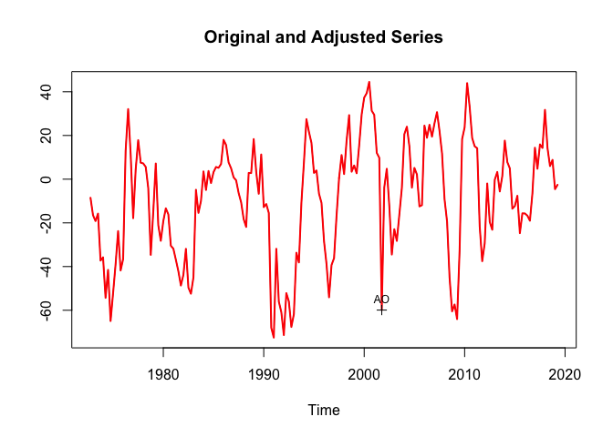
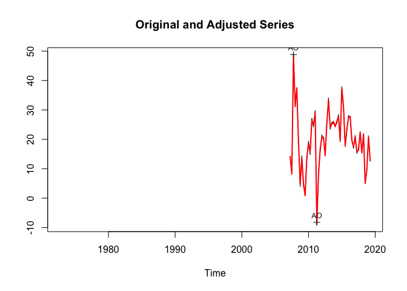
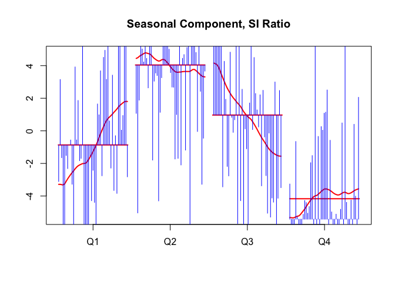

Existence of Seasonality
================
christoph
2019-06-20

## Key Questions

  - Is there Seasonality
  - Should I seasonally adjust a specific series?

## Intro

X13 offers has several formal checks:

  - qs test
  - ids
  - m7

ids seems just to be connected to m7, but QS may be different. Which
ones are
preferable?

## Details

<http://www.ons.gov.uk/ons/guide-method/method-quality/general-methodology/time-series-analysis/guide-to-seasonal-adjustment.pdf>

> From ONS 18.2 A general criterion for existence of seasonality
> 
> Empirical research showed that the most appropriate test for
> seasonality is the “Combined test for the presence of identifiable
> seasonality”, given after table D8 of the output. In particular, one
> of the following statements will always appear:
> 
> 1.  IDENTIFIABLE SEASONALITY PRESENT
> 2.  IDENTIFIABLE SEASONALITY PROBABLY NOT PRESEN
> 3.  IDENTIFIABLE SEASONALITY NOT PRESENT
> 
> It is recommended that a series is adjusted in the first two cases and
> not adjusted in the last one. However there are two cases where one
> might need to deviate from this practice:

This is the ids test shown below

## Examples

### Data

``` r
suppressPackageStartupMessages(library(tidyverse))
library(readxl)
library(tsbox)

url <- "https://www.seco.admin.ch/dam/seco/de/dokumente/Wirtschaft/Wirtschaftslage/Konsumentenstimmung/ks_reihen.xls.download.xls/ks_reihen.xls"
tf <- tempfile(fileext = ".xls")
download.file(url, tf)

dta <-
  read_excel(tf, skip = 10) %>%
  select(-...4, -...1) %>%
  rename(year = ...2, qrt = ...3) %>%
  mutate(time = as.Date(paste0(year, "-", (3 * (qrt  - 1)) + 1, "-1"))) %>%
  select(time, everything(), -year, -qrt) %>%
  filter(!is.na(time)) %>%
  ts_long() %>%
  ts_ts()
```

    ## New names:
    ## * `` -> ...1
    ## * `` -> ...2
    ## * `` -> ...3
    ## * `` -> ...4

``` r
sel <- c(
  "i11_econ_hist",
  "i12_econ_exp",
  "i32_unemp_exp",
  "i41_fin_pos_hist",
  "i42_fin_pos_exp",
  "i52_spend",
  "i53_save_exp"
)
dta <- ts_tslist(dta[, sel])

# 1.1    i11_econ_hist       General economic situation past change
# 1.2    i12_econ_exp        General economic situation outlook
# 3.2    i32_unemp_exp       Unemployment next 12 months
# 4.1    i41_fin_pos_hist    Personal financial position past change
# 4.2    i42_fin_pos_exp     Personal financial position outlook
# 5.2    i52_spend           Likelihood of major purchase
# 5.3    i53_save_exp        Saving / dept situation, next 12 months
```

### Problem: Tests depend on the model chosen

``` r
m <- seas(dta$i41_fin_pos_hist, arima.model = "(2 1 1)(2 0 1)", x11 = "")
udg(m, "f3.m07")
```

    ## f3.m07 
    ##  0.319

``` r
udg(m, "qssori")[1]
```

    ## [1] 27.94584

``` r
m <- seas(dta$i41_fin_pos_hist, arima.model = "(0 1 1)(0 1 1)", x11 = "")
udg(m, "f3.m07")
```

    ## f3.m07 
    ##  0.325

``` r
udg(m, "qssori")[1]
```

    ## [1] 21.08951

``` r
# as long as the model is different SEATS and X11 are the same
m <- seas(dta$i41_fin_pos_hist)
udg(m, "qssori")[1]
```

    ## [1] 21.08951

> 

``` r
library(seasonal)
library(purrr)  # map, etc

adj <- map(dta, ~ seas(., x11 = ""))


ans_m7 <-
  enframe(map_dbl(adj, ~ udg(., "f3.m07"))) %>%
  mutate(is_seasonal_m7_clear = value < 0.900) %>%
  mutate(is_seasonal_m7_not_so_clear = value < 1.050)

ans_ids <-
  enframe(map_chr(adj, ~ udg(., "f2.idseasonal"))) %>%
  mutate(is_seasonal_ids = value == "yes")

# QS test is available both for SEATS and X11
ans_qs <-
  enframe(map_dbl(adj, ~ qs(.)['qsori', "p-val"])) %>%
  mutate(is_seasonal_qs = value < 0.10)

ans <-
  select(ans_qs, -value) %>%
  left_join(select(ans_m7, -value), by = "name") %>%
  left_join(select(ans_ids, -value), by = "name")

kable(ans)
```

| name                | is\_seasonal\_qs | is\_seasonal\_m7\_clear | is\_seasonal\_m7\_not\_so\_clear | is\_seasonal\_ids |
| :------------------ | :--------------- | :---------------------- | :------------------------------- | :---------------- |
| i11\_econ\_hist     | FALSE            | FALSE                   | FALSE                            | FALSE             |
| i12\_econ\_exp      | FALSE            | TRUE                    | TRUE                             | TRUE              |
| i32\_unemp\_exp     | FALSE            | FALSE                   | TRUE                             | FALSE             |
| i41\_fin\_pos\_hist | TRUE             | TRUE                    | TRUE                             | TRUE              |
| i42\_fin\_pos\_exp  | TRUE             | TRUE                    | TRUE                             | TRUE              |
| i52\_spend          | TRUE             | TRUE                    | TRUE                             | TRUE              |
| i53\_save\_exp      | FALSE            | TRUE                    | TRUE                             | TRUE              |

What the table tells us

Adjust

  - i41\_fin\_pos\_hist
  - i42\_fin\_pos\_exp
  - i52\_spend

Dont Adjust

  - i11\_econ\_hist
  - i32\_unemp\_exp (is\_seasonal\_m7\_not\_so\_clear is positive, but
    accoring to ONS Manual thats just weak evidence for seasonality)

qs vs ids (qs says no, ids says yes)

  - i12\_econ\_exp
  - i53\_save\_exp

For i12\_econ\_exp, the qstest has a pval of almost 10%, and if I change
the model a little, it would be a clear thing:

``` r
qs(seas(dta$i12_econ_exp, arima.model = c(0, 1, 1, 0, 1, 1), x11 = ""))
```

    ##                    qs   p-val
    ## qsori        13.82468 0.00100
    ## qsorievadj   11.56946 0.00307
    ## qsrsd         0.00911 0.99545
    ## qssadj        0.00000 1.00000
    ## qssadjevadj   0.00000 1.00000
    ## qsirr         0.00000 1.00000
    ## qsirrevadj    0.00000 1.00000
    ## qssori        5.43500 0.06604
    ## qssorievadj   1.80345 0.40587
    ## qssrsd        0.00000 1.00000
    ## qsssadj       0.00000 1.00000
    ## qsssadjevadj  0.00000 1.00000
    ## qssirr        0.00000 1.00000
    ## qssirrevadj   0.00000 1.00000

i53\_save\_exp

``` r
qs(seas(dta$i53_save_exp, arima.model = c(0, 1, 1, 0, 1, 1), x11 = ""))
```

    ##                  qs   p-val
    ## qsori       0.00000 1.00000
    ## qsorievadj  2.68709 0.26092
    ## qsrsd       0.00000 1.00000
    ## qssadj      0.00000 1.00000
    ## qssadjevadj 0.00000 1.00000
    ## qsirr       0.00000 1.00000
    ## qsirrevadj  0.00000 1.00000

A final piece of evidence, SEATS does not anything for this two
series

``` r
plot(seas(dta$i12_econ_exp))
```

    ## Model used in SEATS is different: (2 1 2)(0 0 1)

<!-- -->

``` r
plot(seas(dta$i53_save_exp))
```

<!-- -->

Q2 obviously seems stronger than Q, but there is also a lot of noise,
and I don’t like what x11 is doing here, Changes in the estimated
seasonality are just too
big.

``` r
monthplot(seas(dta$i12_econ_exp, arima.model = c(0, 1, 1, 0, 1, 1), x11 = ""))
```

<!-- -->

so perhaps somehting like
this?

``` r
monthplot(seas(dta$i12_econ_exp, arima.model = c(0, 1, 1, 0, 1, 1)))
```

<!-- -->

## Conclusions

So I probably would put i12\_econ\_exp to the yes camp and
i53\_save\_exp to the no camp.

So here is my call:

Adjust

  - i41\_fin\_pos\_hist
  - i42\_fin\_pos\_exp
  - i52\_spend
  - i12\_econ\_exp

Dont Adjust

  - i11\_econ\_hist
  - i32\_unemp\_exp
  - i53\_save\_exp
